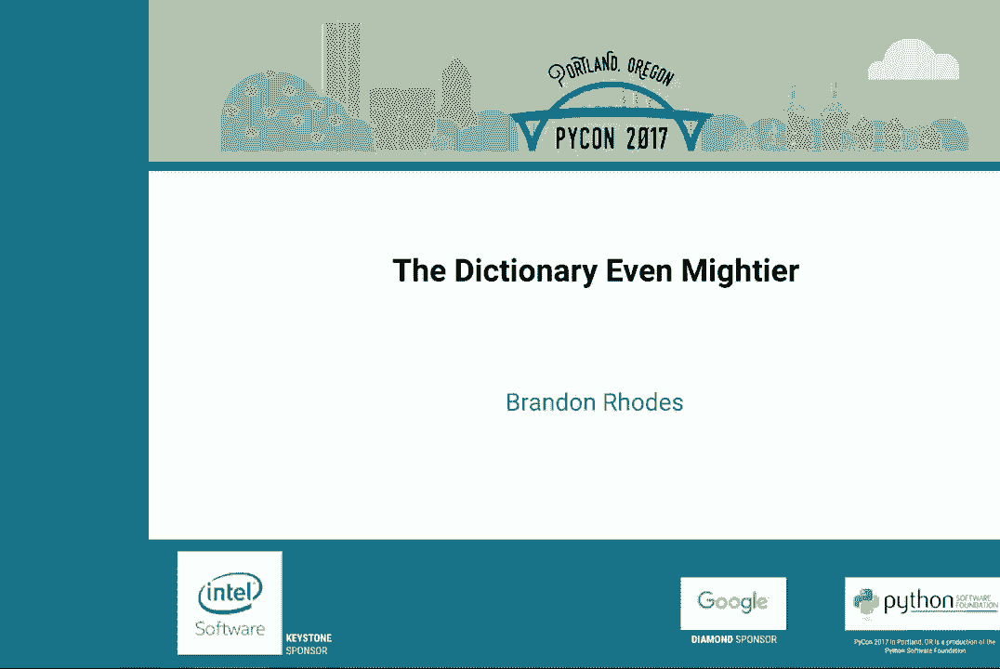
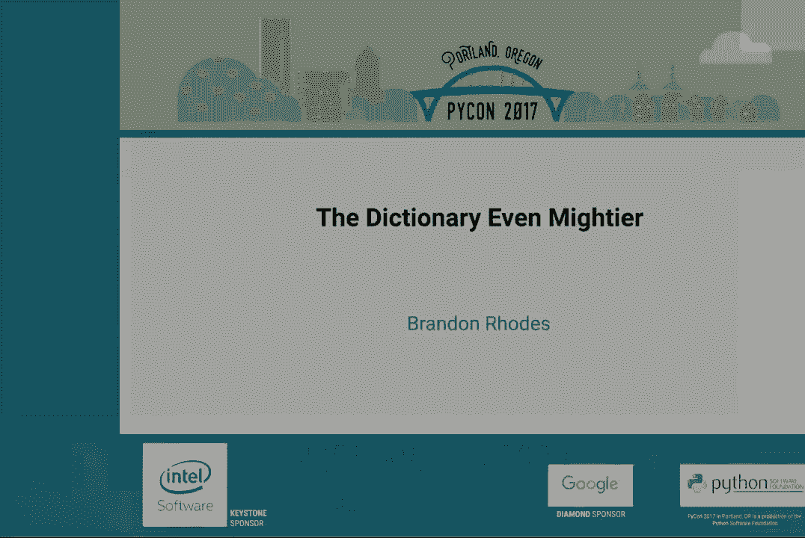
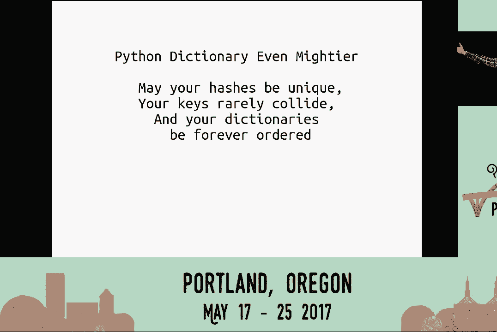
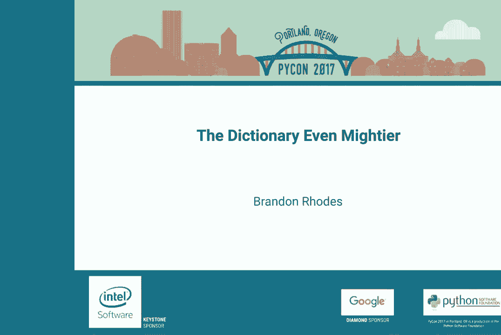

# P1：Brandon Rhodes   The Dictionary Even Mightier   PyCon 2017 - 哒哒哒儿尔 - BV1Ms411H7jG

 [BLANK_AUDIO]， [BLANK_AUDIO]， [BLANK_AUDIO]， [BLANK_AUDIO]。

 Ladies and gentlemen， as we know， dictionary is very powerful and useful to us in Python。 And in Python， 0。3。6， a lot of new features are added。 And it is very mighty。 and even mightier than you thought。 Let's welcome Brandon Rhodes to give his talk。 the dictionary even mightier。

 \>\> [APPLAUSE]， \>\> Well， thank you everyone， this as many of you will have guessed is a follow up to my 2010。 Several years ago， PyCon talk， the mighty dictionary in which I tried to explain the operation benefits。 but dangers of a hash table to a PyCon audience。 A lot has happened since then。 None of which tempted me to do a follow up talk。 Until Python 3。6。

 which Raymond Hettinger has famously said is the first version he specifically said， 3。6。1。 that's a better language than 2。7。 So it's clearly time that we talk about where the dictionary has gone in the last several years。 I chose， it turns out in retrospect， an interesting moment to do the original mighty dictionary talk February of right at the beginning of 2010。 Right before， months before 2。7 went final and came out。

 That means that my original talk purely looked at the dynamics of the hash table。 didn't talk at all about the improvements that were just about to arrive。 As， PyCon 2。7。 the last hurrah of the two series quickly pulled in several innovations from the PyCon 3 series。 to make them at the last minute available in the last version of 2。

 So none of those were covered in my original talk and will be covered now。 We'll be covering several things that were backported to 2。7。 Then we'll move ahead and look at things that you cannot take advantage of in 2。7。 and that you have to have a modern version of Python to take advantage of。

 Many of you will already have seen， I believe they were already being talked about at the conference。 dictionary comprehensions changed that earned a pep， debated and was resolved。 The list comprehension had been around since Python 2。 It was an innovation when Python went from 1。6， I think was the last one， to 2。0。 It was a big deal， you always had to make an empty list。

 a pen to pen to pen to it before finally producing a completed list。 With the list comprehension borrowed from several other languages。 you could instead put the for logic， the looping logic inside of those square brackets and have the list created for you。 That was great for lists。 It gave us a way to build dictionaries。

 but the way was slightly round about。 You had to build tuples。 key and value and it didn't look very much like a dictionary。 and of course it was slower because you had to make a tuple per item that was then thrown away。 once they were inserted into the dictionary。 Generators came along in Python 2。4。

 at least you could take the angle brackets off， but you were treating one inefficiency for another。 The generator， you're not having to create an intermediate data structure list。 but you're constantly having to thrash between running another bit of bytecode or C code in the generator。 and then running another little bit of the dictionaries in it logic to absorb item by item the tuples that were being generated。

 You're still creating and freeing tuples and you have the disadvantage of swapping between two different call stacks。 So often wound up not really being any faster， though it was more conceptually convenient and saved pair of angle brackets。 You don't have either of those problems， of course， once you introduce the dictionary comprehension。 It looks like a dictionary， it has a colon， as one would expect。

 it doesn't create any of this intermediate data structures， lists or tuples， it's readable。 it's smaller， it's faster。 And what I think is it's greatest feature rarely gets mentioned。 It brings to Python a great symmetry。 If you ever taught Python 2。6。 and for a while I taught Python professionally， when students learn the list comprehension。

 some of them， some students have imagination。 And we'll suddenly think， wait a minute。 if you can put the four inside of the square brackets， can you put it inside of the angle brackets。 and Python 2。6 would pop them on the heads and say no， lists are special。 And as you know。 everything in a language that's special and different is an obstacle to the learner。

 this means the old 2。6 syntax， it didn't allow this。 It meant that Python wasn't a language。 at least in this area， where you could learn by extrapolating， I did this the other day。 I'm proud of myself， I deduced the existence of an object that I had never thought of or seen before。 Springtime， hedges are starting to grow。 So I'm facing a big reel of power cord out of the garage。

 get it plugged in， and then loop it around myself in such a way that I can trim the hedges without cutting the cord into or electrocuting myself。 And suddenly I knew I own a cordless drill。 I own a corded hedge trimmer。 and I was suddenly absolutely certain that the universe I lived in included cordless hedge trimmers。 And you understand， I was absolutely certain that they existed。 The moment that， you know。

 one of those moments where you're like， I have introspected the universe and deduced a fact about it through the power of my mind。 And it was like this great moment， it was just the QED to do the Amazon search and start reading reviews of the indeed existent concept of a battery operated hedge trimmer。

 It's wonderful when languages， when systems， when APIs are set up。 where you can guess some behaviors from others， where you learn the square brackets。 let you get items in a list。 Ooh， the same square brackets let you get to the items in a dictionary。 And what I love most about dictionary comprehensions is they allow our learners to extrapolate a corner of the language that they might suddenly guess in there。

 Indeed， after Python， argued against it for several years was finally added to the language。 added in 3。0， backported to 2。7， really beautiful construct。 And then， as a sort of the last thing。 right as Python 3 was being invented was dictionary views。 This was again。 came right out of the gate in Python 3。0， added to 2。7。 Previously， originally， we'd had keys。

 values， and items that built ancillary data structures lists。 Interkeys， inner values。 inner items were added to the language when iterators were。 And they don't spin up a separate list。 but let you get to all the keys or all of the values in the dictionary's order without having them copied into an intermediate structure。 And I honestly， I kind of wasn't paying a lot of attention to the Python 3 transition since I still don't get to use it at work。

 And the， who does？ The， I kind of had thought， when I saw we've checked keys。 it isn't a list anymore， values isn't a list。 I thought they had just changed the iter versions and renamed them to keys。 values， and items。 And， and if I wanted， if we want a list in Python 3， you ask for a list。 Very Pythonic， because you're being explicit asking for what you want。

 It turns out that's not what they did。 They ask an interesting question。 what if you just want to ask if something is present in the keys or present in the values？

 The dictionary could answer， is this value in the values with a quick loop over the values？

 But there was no way to get to that information without creating a list of the values and looking through that or a set or if that's appropriate。 And so， they thought， shouldn't there be an object that implements contains for keys， values。 and items that just can answer that question？ Is X and Y？

 By just looking directly at the interior structure of the dictionary。 In fact。 if we had such an object， why stop it contains？ We could have it do all of the basic set operations for the keys。 You could ask questions like， does this dictionary and this dictionary have any keys in common？

 Do they have any keys in the disjoint set between them？ And while you're at it。 you could of course add the ability to call， under， hit her。 And also throw in the ability to loop over dictionaries， which is all we really do anyway。 This was inspired by the Java collections framework。 These are called views。

 That's why I used V as the placeholder there。 When you call keys， values， items these days。 you get a tiny little object with no storage of its own。 All it has is the address of its type and the address of the dictionary that it will use to go answer questions for you。 When you do set-like operations or membership-like operations on the view。 So keys， values。

 and items in Python 3 are view objects。 That is what was backported to 27 under these three methods I honestly had completely missed at the time and have never seen used。 View keys， view values， and view items。 On the one hand， they put iteration。 which is typically what you want to do。 One step further away， you can no longer say， "iter items。"。 You now have to say， "dot items，" and you're given this tiny little object that is the view。

 And then you have to say， "for loop over it，" and it calls "iter，" and creates the second object。 The iterator that knows how far through the dictionary it's gotten so far。 So on the one hand。 the one thing you ever really want to do is a step further away。 It's so conceptually clean。 and it enables a number of operations that otherwise aren't possible。 So the -- was decided。

 this would -- through -- would work， where it's two layer。 First。 you get the view by saying keys or values。 Then if you want to。 you get an iterator by trying to iterate。 That was backported to 27， but again。 under those different method names so that you weren't opted into a different behavior until your code was ready。

 I'll burn a slide on the order dict。 It was proposed and accepted in PEP 3。72， not added until 3。1。 so we're moving a little further ahead in history here backported to 27。 It preserves insertion order。 It's bigger， slower， in fact。 was implementing a linked list in Python， I believe， until 3。4， when someone then rewrote it in 3。5。

 Just in time， almost for it to be obsolete。 And it's interesting。 So we had， since 3。1， 2。7。 if you needed it， an order dictionary。 But it never tempted us to close the two open PEPs involving the order of dictionaries。 One PEP said， "Shouldn't keywords come be delivered to the Kali in the same order they were written？

 Shouldn't a class dictionary have a natural order？"。 Those two PEPs each require some kind of high-performance ordered dictionary type。 because you don't want to slow down keyword arguments。 I mean， those get passed all the time。 and you don't want to slow down the Dicks that become the namespace of a class or the dunder dict that sits behind an object's attributes。

 So we had order in a dictionary， but even in the language we didn't use it for anything serious。 We kept the arbitrarily ordered traditional dictionary instead， because we just needed the speed。 So it exists， but it's used for corner cases where people know that they care about order。 All right， we're now moving out beyond the things ever available in Python 2。

 We're now heading into the middle years between now and an original talk。 First。 we'll talk about the key-sharing dictionary proposed in PEP of 412， added to the language， Python 3。3。 This answers a question of space。 Imagine a small class whose dunder in it accepts a name， a port。 and a protocol， and saves them each as attributes。

 so the little dunder dict that sits behind the object has to store the name。 And the object has to store some value under each of those three keys。 Here。 from my dictionary talk in 2010， is our friend of the hash table， an array。 Indexed is all arrays are in RAM by an integer index。

 And the rule is that because we are being given keys that are not themselves integers。 and if they are integers， maybe not successive integers， or being given nonsense。 like the string name， how do I find the place in memory that's named the string name？ Well。 the hash tables get that value， whatever it is， and they hash it。

 which is kind of this act of violence where you clobber the value and just smash it into a bunch of bits。 32 bits， however big or small the value was， you get out 32 bits on a 32-bit platform and 64-bit platform。 and you now， if you need an integer index， have as many bits as you could want for forming one。 This simple dictionary， that's not at all visible on there， isn't it？ Hmm。

 I might fix that in a minute if I feel like live coding。 We have， as you can see。 eight slots ready to be populated， and so eight slots。 we will need three bits in order to distinguish them。 We choose the 1。0。0 slot as the one that will hold the key name and whatever its value is。

 and so that gets written into the dictionary。 We now arrive at our second one。 hashing the key port into its hash is 101， so it takes the slot， it happens next door。 And now。 this was a big topic in the original talk， what happens if the third key happens to have a hash that's already been used。 1。0。0 in this case？ And you'll remember that there's the technical term collision for what happens when we try to store proto and run smack into the fact that name is already taking that slot。

 So we do some math involving the other bits and choose an emergency backup slot that it can live in as well。 So here it goes， we're going to try to store proto， and so it has to go somewhere else。 It's now a little more expensive to look up or to reset than the other values。 Name and port。 you'll find right where you look for them， proto you'll find after running into every time you look for it。

 the fact that it's not sitting at the slot you'd expect。 Imagine now that you have your second object of this type。 You store name， you store port。 proto comes in， collides and has to move to its separate slot。 Someone named Mark Shannon looked at this picture and said， wow， over there on the left hand side。

 the first column and the second column are absolutely identical。 They look exactly the same。 We're storing exactly the same five blank spots and three hashes and exactly the same five blank spots and three keys in both of these object under dictionaries。

 I should mention that the strings are not really inside the dictionary。 the integer 53 isn't in the dictionary， but the dictionary really stores。 If you can imagine that you're looking at the matrix where it all becomes code。 what it actually stores are the addresses of the string object that says name or port or the integer object that says 53。

 So whenever in my dictionaries I put a little string or integer， I really mean the eight bytes。 always the same size from a 64-bit machine that tell you where in memory to go find the object。 But the whether proto is a string or the address of it， it's the same top and bottom。 And Mark Shannon thought about this， classes just been created。

 What if we wait for the first ever call to that classes under init？

 It will create an instance of the object that looks like this。 What if we then go in and split apart and store in separate areas of memory the hashes and the keys and keep them forever？

 And with the objects under dict， only store the values。 Because that first object created might go away sometime。 but we keep forever linked to the class that frozen set of hashes and keys so that as someone then creates a second instance of the object。 as someone then creates a third instance of the object。

 You're only burning the space for storing the values。 You're only burning one third the space and getting two-third savings because you're not over and over and over again in every object。 repeating the hash， repeating the key when in so many classes they're exactly the same every time。 Memory savings， even on a tiny object that fits inside of an eight entry。

 five of which can be populated， Python dictionary， you're saving 128 bytes for every object。 If there's thousands or millions that adds up to real measurable savings。 You do burn a little space because every dictionary ever created now needs eight extra bytes so that if it is stored in split fashion it knows where to get to the values array that's separate in that case from the keys。 But when measurements were done the extra eight bytes was easily made up for by the savings for common objects with repeated attributes。

 In fact， object oriented programs， I mean， normal lists and dictionaries don't care about this。 So if a program uses a lot of NumPy arrays or lists it doesn't benefit。 But object oriented programs with lots of objects often use 10 to 20% less memory because of this innovation。 Key sharing， Python 3。3， what do you care about？ Because of course you can't turn this on or off。

 It's just going to happen。 And only if you're on 3。3 or later the takeaway for you is that in your objects make sure that DunderInIt assigns every attribute you're ever going to use。 Set them to none if you need to or to the empty string or whatever makes sense but get them in because if you don't。 And during it's lifetime one of your objects tries using a new attribute then its values will have to be thrown away。

 A full Dunderdict will， a traditional dictionary will have to be allocated for it and all of its attributes copied over。 If a single key， a single attribute is added that's not in that original prototypical set of keys then you lose the sharing。 But this is a habit you should already have had。 Pi Pi can't do a lot of optimizations if attributes come and go randomly。 They also recommend setting them all in DunderInIt。 And it's good documentation。

 I can read your DunderInIt function and know all of the attributes and not be very surprised later when I see one appear in the middle of a method。 So this was already a best practice。 This best practice now carries an additional benefit in Python 3。3 key sharing。 Alright for the next few minutes we get to delve into the exciting world of computer security of dealing with people who want to break your application。 This next thing， randomly seeded hashes， was not a pep。

 It only warranted an issue in the Python bug tracker。 And it has to do with this。 How fast does a dictionary normally fill？ Let's say I have five things I need to put in。 Let's kind of watch the speed here。 Stone， bowl， oop， collide， cat， doe， eagle。 Notice that sometimes a dictionary key takes a little longer to make it in because of the collision。

 But when collisions don't take place， which on average isn't very often。 notice that the last two interies， doe and eagle， made it in as fast as the first ones。 New insertions， unless they collide， don't take any longer than the first one。 As we talked about in my original version of this talk。

 the thousandth or millionth item added to a dictionary should insert just as quickly as the first one。 Which is the magic of a dictionary。 Stone， bowl， boop， cat， doe， eagle。 That's the magic of the dictionary。 It turns out， if the person using your web application isn't your friend。 they can take that benefit away。 What if they were to come up with a series of words。

 and they have all the time in the world to do this before they hit your website？

 Where the second value is guaranteed to collide with the first。 And then the third is going to collide with the first two， and then the fourth with the first three。 and so on， maybe through thousands of potential keys。 Then the rhythm， doe， cat， eagle。 goes something like this。 A back， buying， cab， deal。 Easels。

 That wasn't exactly the snappy rhythm that we saw before， was it？

 What happens at a keyboard if you're loading information into a database？ And instead of going。 you know， first thousand people， second thousand， third thousand， four thousand。 I remember once I was loading a table and it went first thousand。 Second thousand。 Third thousand。 And was like then two minutes before the four thousand were done because I'd declared a column unique but not added an index to let the dictionary as more and more people were added。

 quickly check all the previous people for a duplicate。 If somebody chooses a set of keys where the fifth one takes five times as long and the tenth one takes ten times as long as the first insert。 then I am suddenly in a situation called accidentally quadratic。 Where the amount of time I take will vary with the square of the number of items entered。

 meaning thousand items should take about a million moments of work。 And there's actually a blog about this。 I highly recommend to you all accidentally quadratic。tumbler。com。 It is an entertaining blog of one or two posts a month about all kinds of high-end professionally designed software projects that it turns out if their corners have quadratic rather than linear or logarithmic behavior。 Things， browsers， servers that it turns out you can make instead of going one， two， three， four。

 five through a set of items of work give you that sinking feeling by going one， two， three， four。 and so forth。 How many of you have ever run something that had exactly that pattern？

 It's always known what's gone wrong typically when you see something slowing down like that。 So we had to fix the hash function。 How does a hash function work？ Well， one version of Python。 This is one that we used for a long time。 We， in the main loop。 have the hash of the string so far as we're partway through it， hashing it。

 And to absorb the next character of information， we multiply the current hash by a million and three。 Oh， magic number， million and three。 And then we exclusive or in the next character of the string to flip in the lower byte。 whichever bits are set in the incoming character。 So we're feeding characters in each time。 multiplying by a million， three， and then pulling in 8 bits more of information from the next character。

 You'll understand a bit about how this is filling the complete 32-bit or 64-bit hash with information。 If you ever played around with multiplication as a kid， either by hand or on a calculator。 where you might have discovered that by making a number in a thousand and one where all of the digits are just zero。 Or just zeros or ones， you could produce an output number that was kind of cool。

 It was little copies of your original number trapped inside of this much， much larger value。 For simplicity， I will， as they taught me in elementary school， a lie。 the rows that are just zeros for space here。 But you might have found that you could make even bigger numbers。 put some zeros and then another one。 Now， add another copy of your original number inside of the digits of the large output of the multiplication。

 But you might have noticed that you can't put those ones too close together。 where all of a sudden the pretty little copies of your numbers start looking more interesting。 Digits that aren't in the original will begin to show up。 All of a sudden you won't be able to predict what the next digit is because， of course。

 the ones carry and move information leftward is interesting the asymmetry。 The ones carrying never bother the numbers to the right can make all kinds of assertions about the numbers to the right odd and even multiple of five or not。 multiple of ten。 You can't do that facing leftward in the number because that carry that happens pushes new digits and chaos out in the direction of the higher order numbers。 When you add and therefore when you multiply， which is simply a repeated addition。

 So when we sit here repeatedly multiplying a number by a million three and then putting new bits in the bottom。 we are taking this number in binary and look at how it uses its ones。 Two tucked in right at the bottom to make sure that two copies of the value that you've accumulated so far are just shifted by one bit and then forced to add with each other。 Then a bit of a gap in the middle that's only sparsely populated with ones just bringing a few more copies of that number in and then four ones up at the top that make sure that four copies of the previous hash value are piled right next to each other in order to add and create all sorts of interesting carries and chaos as the bits slowly in the process of multiplication move leftward。

 And that's of course why we or the incoming bytes into the bottom because the multiplication is constantly shoving upward into the high bits。 the entropy that we introduced by reading through the string in the lower bits。 That's mathematicians since they learned we were interested in hash functions and computer scientists alike have done far more formal analyses than this kind of hand waving I'm doing to give you the feel of how a hash works。 We can now have a number of mathematical properties to rate hash functions and we can get things like Python's hash function and ask which properties it has how evenly it distributes bits。

 But this kind of idea of visualizing the multiplication hopefully will give you a little bit of an instinct for how hash functions work and what the formalisms of then proving good properties are about。 It's about whether the big crazy number you're using to shove information to the left does a good job of scattering around any patterns that might have been in the original values。

 And this was a big problem with Python。 It always used this algorithm always started with the same value。 So if I knew you were using Python for your application。 I could sit at home and try to come up with values with strings that would have the same hash。 This became famous in December of 2011， a security conference 28C3。

 efficient denial of service attacks， DOS's on web application platforms。 Platforms because Python was not their big target。 Python had this problem but so did almost every other language。 They in fact， this is kind of fun。 it was 2011。 So they made a list of the web application technologies they were about to discuss and to know how important each of them were。

 They went and found a website that ranked programming languages by their importance to the web。 You'll be happy to know that our vulnerability to deliberately created hashes only affected 0。2% of the web according to the numbers they had at the time。 Python's hash function could be broken。 They didn't actually illustrate how to do this but they said it could be broken computationally looking for possibilities with what's called a meet in the middle attack。

 They could only find reasonable size attack strings for 32 bit systems， hadn't done it for 64。 They did a web search to find out what our web framework was。 They found that it had a max size of 1MB if you post form data to it。 It'll throw it out and not even look at it。 It's over a MB。

 So they played around with a MB payloads where all of the names and values or all the names were going to collide。 They were able to make a plone site spend 7 minutes of CPU in order to parse a single 1MB request。 Such a site once you learned the trick was a very easy site to bring down。 Just two months ago。 if you're interested in the cryptography of hash functions， a really。

 really neat blog post appeared of someone who has published their work and has figured out how to produce 64-bit hash collisions。 not the little 32-bit collisions of the original research。 Go look for that on medium。com。 If you want to see how someone， Robert Gross， he's learning cryptography and to have a target to practice on。 he took Python's old hash function， put it through the ringer and figured out in a moderate amount of computing time how to get some lists of hundreds at least of keys that even on a 64-bit system hash to the same value。

 Great article。 So the immediate response we had to do something quickly was to sprinkle a little randomness around this basic hash algorithm。 We also decided to dignify 1，000，000 in 3 with a pound-to-find statement apparently。 By adding a few random bits at the beginning， every website。 every time Python launched would have a different output for a given string。

 So you could no longer count on your list of pre-computed collisions working。 Then there was a bit of randomness， a suffix added at the end or exclusive or at the end that helped hide the prefix so it wasn't too easy to say if a site exposed its dictionary order in its JSON return value made it harder to use that to guess what their secrets that particular server was using。

 The main thing you'll notice is that your web applications can't easily be DOS。 It's not a perfect solution， but it makes it much。 much harder to create a situation where you just fall over doing seven minutes of CPU work。 And your dictionary has always come out in a different order。 For exactly the same program。

 exactly the same input， suddenly the dictionary order goes random apparently in 3。3 and subsequent。 They made because this was a security issue， bug fix releases of 267， 3。1 and 2。 But remember there because they couldn't break existing tests in code。 you only get that protection against DOS attacks with the dash capital R flag。

 I believe there's also an environment variable that will turn on the randomness。 So they pointed out the uselessness of that the next year。 At the next instance of the same security conference at 29 C3。 they use apparently successive integers。 Hash flooding DOS reloaded was presented by three new researchers to outline how badly many languages had responded to the original filing and complaint。

 They were not actually able， I noticed， to remotely watching a Python app figure out how to create collisions。 but they at least were able to recover the random key by calling hash in a Python program。 which suggested that information was being leaked that maybe could have been exploited remotely。 And more importantly， these researchers solved the problem。

 They did the work and introduced CipHash， made it free for any language that wanted to use it。 which is random each time you start the run time up。 You get set of hashes you've never seen before。 we'll never see again。 And no attacker should be able to reasonably guess what that secret is and generate collisions for you。 CipHash did earn a PEP 4。56。 It was proposed。 Everyone said no because it's too slow。 Python dev。

 well wait a minute if you do this to the bits， if we combine this， we do this many bytes at a time。 And finally they got it fast enough that they put it in。 And it was accepted as standard track for the language。 It's in 3。4， 3。5， 3。6。 You have default turned on all the time。 Hard crypto protection。 So far as we know at the moment。

 Such things always change。 At the language level from those kind of DOS attacks。 the lighter weight sprinkle of randomness is there in 3。3。 And in many bug fix releases of previous versions。 if you remember to turn them on with dash capital R or an environment variable。

 So that is why your dictionary suddenly went out of order if you were using Python 3。4。 And 3。5。 We'll get to 3。6 in a minute。 Internal change that I'll just describe very briefly。 PEP 509 added a private version number。 They burned 8 more bytes in every one of our dictionaries。 They went in and every dictionary has a version number and they have elsewhere in memory。

 a master version counter。 And when you go and change your dictionary。 the master counter is incremented from a million to a million in one。 And that value of a million in one is written into the version number of that dictionary。 So what this means is you can come back later and know if it's been modified without reading all of its maybe hundreds of keys and values。

 You just look and see if the version has increased since the last time you were there。 A lot of the pain of trying to optimize Python is that anything can change at any time。 Someone could decide to monkey patch。 So code that looks like it should be referencing a built-in。 but you use all the time， could instead be intercepted by someone having injected a function of that name at the module level。

 Or they could edit the built-in's module。 Someone writing an optimized version of a function can now check for that。 Has the globals of a module changed？ Look at its version number hidden in that dictionary。 You'll know whether it's been touched and if it hasn't。 you can keep using the optimized version of a routine that has inlined the built-in。

 Has the built-in's dictionary changed？ Look at its version number。 All sorts of optimizations that Python's dynamic nature had made impossible。 You never know when someone might replace a built-in with something else。 Are now possible because the dictionaries that hold the built-ins。

 that hold class namespaces and that hold module namespaces。 Now。 along with all of our other dictionaries， have a version number。 It's internal。 I haven't seen an interface for users to get to it， but it's an implementation detail of Python 3。 Now， to accelerate optimization on that platform， PEP 509 is where you can get more details。

 I gloss over that quickly to talk about compact dictionaries。 The big， big change in Python 3。6 that changes dictionaries forever。 A dictionary you'll recall fills up one item at a time。 There's collisions， hopefully not on most of the values。 At this point。 it's as full as it's going to get。 If you add another key to this dictionary。

 that's more than two-thirds full， so a new dictionary hash table is allocated of 16。 Twice is big and all the keys are reinserted before you're allowed to continue。 Looking back at what it looked like when it just had five keys in it。 this is as full as we're going to let it get。 And yet it still has noticeable blank space in it。

 Three of its rows are holding nothing。 Eight bytes on a 64-bit system of hash。 Eight bytes of address for that key。 Eight bytes of address for that value。 72 bytes are still empty when we declare it so full that we're throwing it out and starting over with a more sparse data structure。 In 2012， Raymond Hettinger had an idea。 He introduced it on Python dev and immediately some improvements to it were suggested。

 Every problem in computer science can be solved with an extra layer of interaction。 What if we don't use those big 24-bit rows to remember which hash locations we've used？

 What if instead we were simply to use eight bytes？

 And when it's time to start adding items to the dictionary。 what if we simply remembered in a little bitty array of eight bytes the location in a bigger list of where we had put the hash。 the key， and the value？ Instead of a dictionary having to keep entire 24-bit slots free。 as it now has reached five items and needs to go to eight entries。

 we instead can only have three bytes left free。 Because of the eight bytes up at the top that we have available to remember the indexes of our keys。 we're only using five， we're leaving three empty， and so three bytes wind up empty wasted and unused right before the dictionary is ready to resize rather than what was at 72。

 So the old dictionary had lots of extra space， the new one packs all of the keys and values into a short list that it grows。 and if it doubles in size， then it simply reallicates all of the keys in a contiguous area。 In 2015。 they added this to pipy， which is allowed to do crazy things to be more efficient。 It's interesting。 a few things sped up significantly， four percent， eight percent gains。

 some benchmarks slowed down because we added a level of indirection。 which is the problem with solving problems in computer science， it can make things slower。 Some things got slightly slower， slightly faster with one or two big wins。 but the big reason for doing this wasn't speed。 It was actually exciting that the speed had barely changed。

 adding an extra level of indexes because we got much better memory usage。 Another year went past。 a normal Python people couldn't benefit， and in Nada， I don't think I've met him。 opened an issue with a patch that added it to Python 3。3。5 something。 A whole month went by。 no one addressed the issue， he kind of pinged and said， "Oh， this is big。

 it would have to be addressed on Python Dev，" which often means it's not going to happen。 And then in September something magic happened。 For the first time， the core devs got together。 all in a room by themselves for a few days， and had a core Dev sprint， and at the end of that。 a message suddenly appeared on this moribund issue。

 We discussed a lot about your compact interchange， and we all wanted in 2。6。 But the code isn't ready yet？ Well， let's just push it into Python 2。3 before the deadline this weekend， and we'll fix it up later。 They wanted it that bad。 And of course， predictably， immediately， someone said， "Isn't this premature？

 Who wasn't on the group of core devs？ But no， they'd spent like an entire day talking it out。 how this affected the future。 And it made it in。 In Python 2。6， the new dictionary is much faster。 Iterations faster， there aren't empty spaces to have to go past。 And it remembers the order。 Because that big table it's adding to， it's a simple append。 Can you now depend on the order？

 Is the big question？ Because they went ahead， and for free got to accept a PEP asking the keyword args be ordered。 and asking that class Dixby ordered， and that meta class input be ordered。 All those uses for dictionaries that had won an order now had them。 They think， the core devs。 I think， often think that they're just helping users who might notice that dictionaries are now ordered。

 But if you look on stack overflow， order isn't something that people are going to stumble across。 It's something they already expect dictionaries to have。 The human mind， naturally， by its nature。 expects dictionaries to have order。 If you've ever taught Python， this is always a stumbling block。 Raymond thinks the guarantee might be almost inevitable， but Beasley says this is permanent。

 and I agree with him。 I say 3。6 is brought about dictionaries for humans。 [Applause]。 I don't think they're ever rolling this one back because the normal programmer who doesn't even know about hash tables has always expected them to be ordered。 and will write code that depends on it。 I end with the wish slightly modified that I ended my last talk with。 May your hashes be unique。 Your keys rarely collide， and your dictionaries be foreve[r ordered。

 Thank you very much。

 [Applause]， [Applause]。

 [BLANK_AUDIO]。
