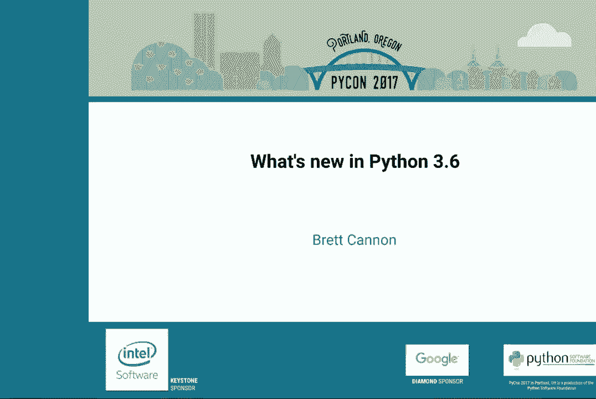
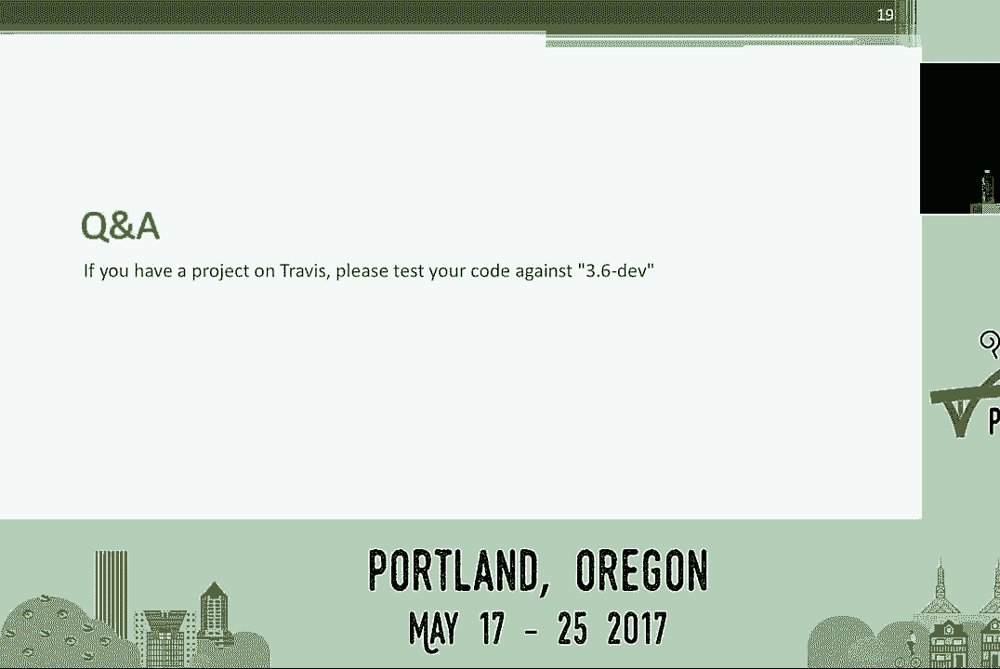
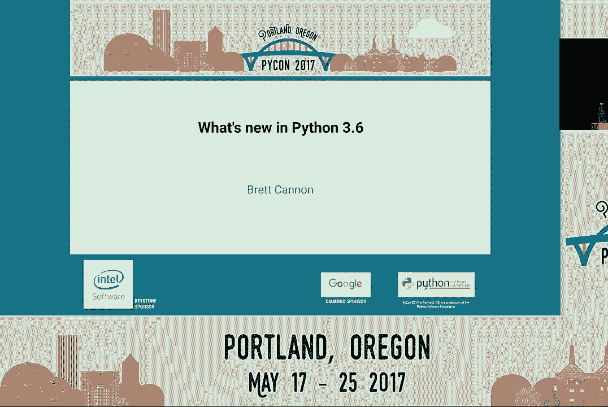

# P11：Brett Cannon   Whats new in Python 3 6   PyCon 2017 - 哒哒哒儿尔 - BV1Ms411H7jG

 \>\> Ladies and gentlemen， Python 3 has been released for many years and after every year。 they have a new version being released。 So this year， we welcome 3。6。 You may wonder what's new in it。

 We really make a huge difference in Python 3。6。 We figured out in this lecture， as welcome。 Brad Cannon for what's new in this。

 We're going to be in Python 3。6。 [ Applause ]， \>\> Well， thank you for the warm intro， everyone。 So。 yes， my name is Brad Cannon。 I work at Microsoft on the Azure Data Science Tools team。 And I'm here to basically tell you what's new in Python 3。6。 Now。 I should start off and say everything I'm about to tell you is already written out on the internet。

 so you can completely ignore me and still get the exact same amount of information， more or less。 If you go to docs。python。org/3。6/whatsnew/3。6。 resmail， you can also get to just off of docs。python。org。 As I said， everything is there， so if you miss something and want to read it up on it later。 it'll be there。 So， yes， if my Canadian ism's frustrate you， you can ignore me。

 Another way you can also do this is I'm going to be going over the 16 Python enhancement proposals。 that help make up Python 3。6。 So， if you go to python。org/dev/peps， you can read the peps。 get even more detail， and have yet another way to ignore me and still get the information。 So。 once again， don't feel bad if you have to leave or anything or want to just tune me out。

 I understand。 One key thing I want to say， though。 about the point that there are 16 Python enhancement proposals。 is that is almost our record for Python。 The only release since we started doing Python enhancement proposals that had more was Python 3。0， which we all know was a very large release。 So， that should give you an idea of the scale in terms of new features that have come into Python 3。

6。 So， I just hope you understand that a lot of work went into this。 And I really want to think specifically， everyone who participated in the 2016 Python course print。 that happened last September at Instagram， 12 of the 16 peps I'll be talking about。 were somehow worked on at that sprint。 So， I specifically want to thank Instagram for hosting and being the largest financial contributor to that。

 Microsoft for also being a financial contributor and letting me and my co-worker Steve Dower attend。 and the PSF are also helping pay for other people to attend。 So。 thanks everyone who helped make that happen。 It made a huge difference in the scope of Python 3。6。 But without further ado， I'll jump into this。 I'm going to go in numeric order for the peps and basically just try to give you some background information。

 beyond just what the feature is to liven this up a little bit。 So， without further ado。 PEP 468。 Preserving Keyword Argument Order。 I believe this is Eric Snow's pep if he happens to be in the room。 He's right there。 Basically what this does is whenever you start StarKWR。 historically it was just a dictionary。 So， that usually meant everything was randomized and you didn't know what order people actually specified。

 keyword arguments in and make it a function call。 What PEP 468 said was we are going to guarantee a mapping。 not necessarily dictionary， but a mapping， that will actually keep order of the keyword arguments passed in a function call。 Now， in Python 3。6， if you happen to be in Raymond's talk right now。 you'd be told about how Python 3。6 is dictionary， and she keeps the order。

 I'm going to say this multiple times in this talk。 Please do not rely on the order of dictionary key iteration or value iteration。 It is an implementation detail。 It is not part of the language。 We only guarantee it in this specific instance in the language spec。 So。

 please do not rely on the ordering of anything coming out of a dictionary unless I specifically。 pointed out。 We might change that in the future， but I just know this is a place where some people might kind of get。 up。 So， I'm going to re-arrate that multiple times。 But yes， as you can see， order is now kept。 Thank you， Derek。 PEP 487， simpler customization of class creation。

 We've always provided a real rich ability to customize things in Python， specifically from。 the creation of classes， like meta classes are a great way to really control creating a class。 itself。 But for anyone here who has ever tried to write a meta class。 you know there's a lot of little， details。 It's really messy and hard to get writes。

 And then we go all the way up to the top of the scale where you get class decorators， where。 you basically after classes created， you can pass it through a decorator， modify it， customize。 things in any way you want。 But there's never really any middle ground or there's either all the way down the guts of Python in a。 meta class or all the way up after the classes are created and might be too late for certain。

 things。 So， in Python 3。6， we added this dunder in its subclass hook。 We pass you in the class。 any keyword arguments passed into the constructor and then basically。 just allow you to manipulate the class before the name binding happens。 So， as you'll notice here。 what I did was I defined this PEP 487 class where when it's， subclassed。

 the class is being constructed， the subclass being made gets passed in and I just。 defined a hello method that just prints hello to the keyword argument， as you'll notice。 in the class line。 Nothing fancy， but the key point is a nice insertion point between class decorators and。 meta classes， you customize your classes as necessary。 PEP 495， local time disambiguation。

 This led to quite a discussion on Python Dev and to the extent there was a complete date。 times it created just for this problem and it literally led to a single argument in a， constructor。 It shows you how dedicated you could say we all are on Python Dev to trying to get things， right。 So， think back to November 6， 2016， it's daily savings time， you fell asleep， you woke up。

 and your clock next to your bed said 1。30 am。 Has it been an hour and a half since the start of the day or has it been two and a half hours。 since the start of the day？ You have no idea， right？

 Unless you actually keep your time zone to know which time zone it is currently， whether。 it's savings time in terms of the time zone or after， you have no clue。 So what ended up happening was we added this full argument to date time instances to basically。 say has time folded back over itself or not。 Now obviously it's best to keep your time zone in your date time objects so this ambiguity。

 doesn't show up but we all know life's not perfect and we sometimes don't have the time。 zone available so this allows you to specify for that funky time during day like savings。 where it's ambiguous whether it's the first time through the hour or the second time through。 the hour to know exactly where you are in terms of time。 PEP 498， format string literals。

 Everyone loves this。 I have yet to meet a single person who doesn't like this unless you're on hacker news and。 you complain that we now have three ways to do strings but you're still better off so， I don't care。 In case you have not come across F strings yet which are so great by the way that Pi。 Pi has actually backported to Pi Pi 3 which is supposed to be 3。5 compatible but also this。

 This gives you an idea of how excited people are from this。 So if you notice on that third string there in the example you might not quite notice it。 there's an F prefix much like the B prefix for byte literals or R for raw strings etc。 What you notice is the stirred out format methods signature of how to specify arguments。

 into a string but there's no format call。 What happens is the format string gets parsed by Python itself at compile time to PIC files。 teased apart and then basically under the hood at the byte code level ends up constructing。 the equivalent of the stirred out format call for you。 So not only is it cleaner because you don't have to call stirred out format but it actually。

 performs better because we can now infer things thanks to it being part of the actual literal。 to actually implement things at the byte code level。 So this is actually faster than stirred out format and all this is thanks to Eric Smith。 in the front row。 So if you're not using this yet and you're compatible with 3。

6 I highly advise you start， using it。 And just to appease those who are upset that there's now three ways to do it the percent。 ways just to be compatible with Python 2 and stirred out format still there because you。 do need to pass that around sometimes。 That's just a callable object so there's a reason we kept it。 But anyway this is a fantastic feature in 3。6。 At 506 and 524 this will bring back slight nightmares for a lot of core developers because。

 this was almost a month long argument that even dragged in a Linux kernel developer。 We take security seriously but we have to make backwards compatibility seriously。 And what came out of all this is PEP 506 thanks to Stephen to Prano we now have a secrets module。 Now a lot of you might know of random for randomizing numbers and any of that kind of， thing。

 We just need a fake roll of die that you can maybe reproduce in a test。 The secrets module that was designed specifically for crypto level number randomization or anything。 else that you need to do that might be that level of safe and ready for security use。 So basically my key point is if you know you are doing some modeling and simulation keep。

 using random if you're not sure if this will ever have to be crypto level secure or you。 honestly just don't know or you do know just use secrets。 It might be a little slower than random but you just do not want to find out later that。 you're using random and somehow it's now really security related and you're screwed up and。

 now someone's really mad at you。 So use secrets if you're not sure。 The other thing is PEP 524 this is the thing that really caused a huge kerfuffle on Python。 Dev for a while。 Basically in Python 3。5。0 OS。U random would block until there's enough entropy in the system。 because you have to initialize the random number generator to actually be able to make random。

 numbers。 The problem is containers don't get a lot of randomization because there's not a lot to。 start up for those things。 So if you start up a container it can actually take a few minutes for a container to actually。 generate enough entropy if the container is not being used constantly to make that， entropy。 So all right that sucks for people if there's only have this fast container they started。

 up and yet now something Python is making them wait several minutes。 So we said okay Python 3。5。2 we'll make it stop blocking and we'll just fall back to， slash dev slash your random。 So kid people in this room might be cringing a bit because what we basically did was by。 accident was we caused OS。U random to no longer be very secure because if we swapped on you。

 without telling you you didn't know if you're getting the more secure random number generator。 from Linux or the less secure one。 So what ended up happening is in Python 3。6 we took OS。U random back to the blocking mechanism， and we added a new OS。get random which will actually not block but raise an exception。

 So you can make a decision do you want to wait until there's enough entropy or you can choose。 to call another random call that won't block so you can make your own decision。 X plus is better than implicit we kind of screwed up on not thinking about that ahead， of time。 I'm very glad this got settled。 PEP 509 adding a private version to dict this was things to Victor Stinner there's also。

 in the front row。 9。9% of you will never care about this and that's fine。 Basically we added a version ID to dictionaries based on mutation。 You can only get to it at the C level on purpose because this is really meant for people who。 are going to be doing things like writing jets for C Python or debugging and other things。

 where they basically need to know if a dictionary is mutated or not since the last time they。 looked at it。 So this is really a future looking optimization in terms of ability to do things in Python。 So it doesn't really do anything for anyone quite yet but it will。 I hope so。 I'm sure Victor will make it go faster don't worry it will be worth it。

 PEP 515 underscores numeric literals。 Who here has ever written a large number with a bunch of digits and had to count to make。 sure they weren't missing a digit。 Yeah funny enough when I first wrote this slide that said 1 million instead of 1 billion because。

 I miscounted。 So I have done that and I did it publicly too。 So basically what happened is 515 we decided to allow you to put underscores in numbers。 For the specific reason to be able to group them like this to make them much more readable。 As you will notice we are pretty liberal about where you can put them。

 You can put them right after the base notation so 0x and you can do it there and score for， hex etc。 So it is a really nice little touch that other languages have been doing and we realized we。 should have that too。 This is things to your brandl for coming up with the PEP and running most of the code and。 then I think Sir Hay and I finish it up。 PEP 519 any file system path protocol。

 This is my fault if you don't like it。 Basically what happened was someone came onto the Python ideas mailing list and said I really。 like pathlib but I can't use it anywhere because everyone wants a string。 Everyone calls OS。path to do path manipulation and such。 Why don't we subclass pathlib with stir。 And then a big discussion broke out about how that is not a good idea because if you。

 start doing that everyone will expect a stir to always work which isn't true because taking。 the stir of nine is going to always succeed and you probably didn't meet to specify the。 file name none when something falls through。 So it is not really good error reporting so once again being very explicit。 So what we decided to do was we created a new protocol called OS。FS path and basically。

 you see that under FS path method what it is supposed to do is any object that represents。 a file path will return to the stir by its representation of that path。 So it basically allows us to tell you use pathlib as much as you want and as long as。 the object defines that and it will just return the representation of the path so we can view。

 strings more as kind of almost not a coding that is not right Stephen Turnbull would be。 very upset if I said that。 It is a representation and we have plugged this through as much as we can throughout the standard。 library so OS。Path for instance completely supports this protocol so if you are using。 an older library that is not aware of this and maybe hasn't been used very much with。

 pathlib it should hopefully just fall straight through and just work and actually a large part。 of the standard library just works with pathlib now magically because we just plumbed it through。 completely throughout OS。Path。 So yeah so basically if you like pathlib like Fernando Perez of Jupiter who is the biggest。 fan I know of you can now use pathlib wherever you want。 Step 520。

 Presuming Class Edgy Definition Order。 This is once again Eric Snow he really likes things to be in an orderly fashion apparently。 Basically when you define things in your class body there was no guarantee you would get。 to know the order of their definition later on with this much like the earlier prep where。 I talked about keeping the order of keyword arguments to a function call。

 This is the same thing except it keeps the order of the definition of attributes in a， class。 Once again we guarantee that Dunderdick will be a mapping that keeps order。 Don't rely on dictionaries in general keeping this order for you。 That's the last time we are going to bring this up you've all been warned。

 If I have 23 adding a frame evaluation API to CPython。 Once again this is my fault although Dino Veland my co-workers also part of his fault too。 This is part of the work we were doing at Microsoft with our pigeon experiment if you。 were here at Python last year and saw our talk on trying to add a jit to CPython。

 This was a key hook of ours to try to allow this。 Now once again 99% of you are not going to care about this but if you write a jit or a。 debugger or a profiler you are going to care about this。 Because basically what this lets you do is there is a C level call where we call into。 the function that is going to evaluate the frame of the function you are currently executing。

 Before there was no way to configure that it was just Python's job to just take the。 frame of execution and just make it run to do its thing。 Now there is actually a place where you can insert a function to call instead。 And this is really key with something like a jit because now we can catch the frame， decide。

 if you want to execute it in CPython or if you want to jit it and run it through a jit， instead。 So dream of dreams this is what will let us put jits on pi pi and have you just install。 a jit through an import statement。 I should also mention PyCharm Slays release has a 20% speed up in their debugger。 That is because of this hook。 I should also mention this also added a little internal C API for storing data on code objects。

 Once again once you are not going to care only people who care about the hook will care， about that。 PEP 525 and 530。 This is Yuri Solinov and his work to try to plumb more async and await through Python。 So Python 3。5 added the whole concept of async functions and async and await keywords。 But we only plugged it in in terms of normal functions that is either awaiting or returning。

 There is no way to do a generator that could also await on things。 So what these PEPs did is basically made generators a possibility using await。 So it seems kind of obvious but we only had so much time for Python 3。5。 One of the nice side effects of this though is list comprehensions on top of normal generator。

 expressions are generators underneath the hood。 So by making this work with generators it now works with list comprehensions as well。 So now list comprehensions can use async 4 to iterate through the iterable that you want。 to work with or you can call await on a result within your list comprehensions itself。 So it is a nice little touch up but nothing really critical。

 But it makes things nicer and smoother and just plums async all the way through Python。 So we have a little bit of a look at the type of things in this。 So I'm going to do the next step。 So the first step is the intent of this。 This is a little bit of a bit of a simple thing。 So we are going to do the first step。 So we are going to do the first step。

 So we are going to do the first step。 So we are going to do the second step。 And then we are going to do the first step。 So we are going to do the first step。 Now you can go all the way down to the variable level。 Now much like with function annotations nothing is checked at runtime。

 There is no real overhead other than anything that might need to be constructed or something。 if you specify something as a type in terms of the annotation。 So there is no penalty for doing this performance wise overall during runtime。 If you define a variable annotation at the class level it will be added to the dunder。

 annotations attribute on that class and dictionary so you can just key off of what the attribute。 name is and see what the type hint is for that。 You can also do it at the local level in terms of local variables。 Those do just get tossed。 They are in the AST though for Python。 So those are mainly there for performance reasons are not kept anywhere because there is no。

 real good way to expose them anyway。 And they are basically there so the tools like an ipy can verify that your type hints。 have matched up to what is expected。 Step 528 and 529。 If you are a Windows user you are probably going to hooray inside。 If you did not see Steve Dowers talk he talked about this as well。

 The REPL now uses UTF-8 so I can actually put a little emoji like that and have it actually。 print out。 If you are a Windows user you are probably used to seeing your little emoji big squares。 When dealing with some UTF-8 and that was always really annoying that is no longer a， problem。 The other key thing here is Windows now takes byte paths。

 This is a really big deal for projects like Twisted where their whole system is designed。 to work with byte based paths and windows wouldn't accept it because they were deprecated。 since I think Python 3。2。 So instead of what has happened is on Windows we now set the default encoding for the file。 system to UTF-8 and if you pass in a byte based path we do the reencoding to UTF-16 for。

 the internal windows APIs and handle all that for you。 So basically you just treat paths as UTF-8 on Windows now。 So it should make things a lot smoother for you as well if you are transitioning from。 2 to 3 and you are dealing with byte based paths。 There are a couple things on the PEP I wanted to bring up。

 One thing this is also from Victor Stener's Python Malick where you can do now is through。 an environment variable you can specify the debugging hooks for memory for Python itself。 You don't have to do a complete re-compilation for a Py debug build if you want to see where。 your memory is going and track that。 You can use this hook to use everything or even just force use the malick or other kind。

 of malicks to make things work the way you want it to work without having to do fancy。 re-compilation stuff。 I should also mention something that Wukash laying a Facebook and Instagram added at the。 course branch in September was D-trace and system tap support。 I've been told D-trace and system tap are amazing and people get really elated who use， it。

 Find out that we added this。 I'm going to assume they know what they are talking about so I'll be elated to for。 them。 I have them personally use this but everyone I know who uses D-trace really loves us so。 I think we probably should all learn some D-trace probably。 You do have to compile this with a specific flag。 Dash dash with dash D-trace and what this currently traces is functioning calls and returns when。

 GC started and finished and what line of code is currently executing。 I believe Wukash is totally open to adding more but that's just basically what we started。 with because that was what was in an initial patch that he took and made work but as I。 said everyone I know who uses D-trace is elated so I feel like I need to learn D-trace now。

 A couple of things that are on the slides。 We now warn you for instance when you use a backslash in a string that's not raw and。 the following character doesn't make any sense so you won't actually do /m and expect。 something to work so I'm going to worry about that。 We've added a couple extra bytecodes generally around unpacking since we added all that generalized。

 unpacking of iterables， it's about about the key that I can think about at the top of my。 head that's not on this slide。 Now I've had a slide for benchmarks which you can see current results of at speed。path。org， thanks to Victor Stinner。 If you really want to see a longer more detailed discussion of current Python performance watch。 Victor's talk the recording might be up already even but I'm just going to go over one quick。

 slide and start taking questions。 But basically Python 3。6 is fast we should all be happy。 If you just look at this graph real quick there's just four app benchmarks that we have。 as part of our performance benchmark suite。 2-3 chameleon HTML5 lib and tornado。 All this is normalized to Python 2。7 because that's what everyone historically bothers me， about。

 As you'll notice all the bar， the far left bar is the tallest bar which means Python 3。5， and 3。6 is faster than Python 2。7 on these benchmarks。 I don't know why chameleon spikes a little bit on 3。6 that day。 I asked Victor yesterday and he says it's probably one of the unstable benchmarks。 Sorry honestly I should probably take it out。 As you can see faster lower， Python 3。

6 is faster than 2。7。 Instagram talked about how it's faster for them too so 2。7 slow now。 That's why I think about it。 And with that I will happily take any questions you might have。 Thank you。 [Applause]， And I believe we have two mics on the left and on the right。 Hi。 Hi。 Hi。 I like F strings。 They're pretty cool。 Yes they are。

 In other languages with quasi literals you can play with them in other ways。 You can use them as patterns。 You can redefine the parser that's used inside the string。 Has anybody talked about that kind of add-on for Python F strings？ Not to that extent。 Eric is saying there's a PEP4， N9， to at least fully generalize it to any Python expression。

 you can evaluate。 Right now there's some little edge rules because it made it easier to implement。 So PEP4， N9 is sitting there to completely generalize it to any Python expression。 The problem is the PEP author doesn't know C。 So he wrote it saying he wanted it and it。 should work with syntax highlighters and such but then no one has ever implemented it。

 So if you really care you can look at Fortnite and potentially write the patch for it。 I wrote my own language but oh。 501 sorry。 If you want real key details the man to talk to is right up here in the orange。 Cool thank you。 No problem。 Hi thanks for all the great work on 3。6。 Welcome。 One question about the Dunder dict on classes being preserving water。

 Does that also extend the dict of a module？ The by accident or on purpose？

 I'm going to go with no because I don't want to encourage any accidents。 And the man who obsesses over order says no so I'm going with no。 Yes。 Do you profile memory usage on your regularly？ I don't remember off the top of my head。 Zach wave in turn to the bell boxes saying no。 So I'm going to go with no based on my comrades in the front row。

 That'd be something to talk to Victor about。 I don't know how difficult it would be to add。 Since we're running on Linux it should be possible but Victor's center would be the best。 person to talk to about that。 Any other questions？ All right well everyone enjoy lunch。

 [applause]， Thank you very much。

 [ Silence ]。
