# P17：Lisa Guo Hui Ding   Keynote   PyCon 2017 - 哒哒哒儿尔 - BV1Ms411H7jG

 of PICON 2017。 (audience applauding)， Because of my bedtime， I wasn't able to attend。 how was the testing off？ Six people are excited about that。 So。

 I don't really have any news or anything， the situation with the trains I described yesterday。 still seems to be very much the situation， with the trains today。

 always looking forward to tomorrow。 The weather that was supposed to be sunny。 and really beautiful and warm， Portland， it's not。 (audience laughing)， And so。

 the only thing that falls to me is to introduce， our morning keynote speakers。 We'll get started with the topic that to me， is of a very green interest now that I work at Dropbox。

 It was not until watching Jake's keynote yesterday， that I had ever heard the quote from Gito。 about the fact that he had never expected people， to write Python programs of more than a few hundred lines。

 of code， it explains so much。 (audience laughing)， At Dropbox。 (audience laughing)。 We have pushed and indeed gone beyond， the few hundred line boundary。 (audience laughing)， As。

 of course， has Instagram。 So， I was interested and wanted to hear their story。 of what they have been doing recently with Python。 And so。

 I am happy to welcome to the stage Lisa Gu， and Huie Ding here to talk to us。 Give them a big welcome。 (audience applauding)， - Hello。

 Good morning， everyone。 Thank you， Brandon， for the intro。 And thank you， everyone， for coming here。 on a Saturday morning。 I know it's a little bit early。 So， my name is Huie。

 I lead Infrastructure Engineering， at Instagram。 I'm here today with my colleague Lisa Guo。 to talk to you about how we've been running Instagram， on a Django and Python stack。

 Instagram started coming to Python since 2012， when our first infrastructure engineer talks about。 building Pub/Sub systems in Python。 We're excited to be part of this community。

 and we're honored to have an opportunity， to speak here with you all today。 But first of all。 you might wonder what is Instagram？ To many people， Instagram is this brunch sharing app。

 (audience laughing)， Which is just what we should use right now， on a regular Saturday morning。 It started back in 2010 and has quickly grown worldwide。

 to become one of the largest social platforms。 Today， over 700 million monthly active users。 use Instagram on a regular basis。 So， a few weeks ago， Instagram was actually down。

 because we were trying to deploy， a Python optimization into production。 I know。

 And this is what happened on the news。 (audience laughing)， But in all seriousness。 Instagram is a social media platform。 And our mission is to help strengthen relationships。

 through shared experiences for people。 Today， you can tell a story of your life on Instagram。 You can communicate visually with your friends， and family on Instagram。

 You can go live on Instagram。 And more than just brunch photos， you can explore about anything。 From animals to nature， from beauty to shopping， from F1 racing to paint mixing。

 which is something I learned new recently。 Whatever your interest is， I guarantee you。 you will be able to find something on Instagram。 So let's go back to 2012， sorry， 2015。

 when I first came to PyCon in Montreal。 And we had a beautiful booth and many nice works。 And by the way， we still have a beautiful booth， and nice works today。

 and you're welcome to stop by。 So many people came over and asked us the same question， Instagram。 what the hell are you doing at PyCon？ And at first， I thought they don't know what Instagram is。

 so I started repeating myself and told them， that we're a brunch sharing app。 And I got interrupted really quickly。 No， no， I know what Instagram is。

 My friends and family talk about it all the time。 My question is。 what are you doing at a Python conference？ So once they learn we're a complete Python shop。

 the immediate follow-up question usually is， wow， how do you run Django and Python at that scale？

 Or maybe a more debate-provoking question would be， why haven't you rewritten everything in Node。js yet？ And if you will， replace Node。js with Rust， or language of your preference。

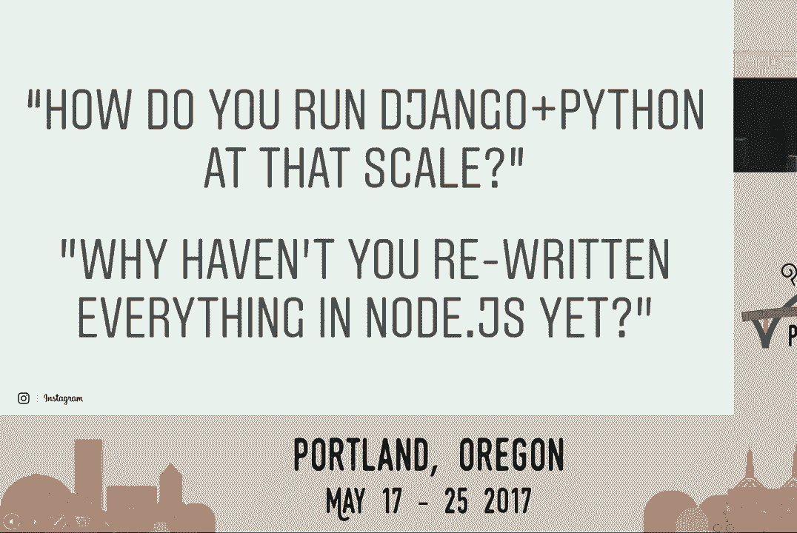

 So why did Instagram choose Python in the first place？ To answer this question。 we have to go back to 2010， and dig the two co-founders， Kevin and Mike。

 Now these are two product guys， with no real backend experiences back then。 So naturally。 when they started， they looked around for the best available framework。

 to help them support the product they wanted to build。 And here's what they found out。 (audience laughing)， (audience applauding)， It turns out that Django and Python framework。

 is one of the most popular framework， that the co-founders have knowledge of。 So after watching a bunch of tutorials and documentations。

 they set off on their way to 700 million users。

 Now， what does Instagram love about Python today？ First of all， Python is famous。 for being a developer-friendly language。 That is really easy to become productive with。 In fact。

 both Lisa and I had only C and C++ background， and we started serious Python development。 after we joined Instagram a few years ago。 Being a popular language also means that it's really easy。

 to tap into the large pool of talented engineers， who wants to work in Python。 So after many reasons we heard， that people want to join Instagram， one of the frequent ones being。

 I want to build stuff using Python。 Even though we were on a very ancient version of Django。 for a long time， we were nonetheless able， to leverage the maturity of the framework。

 and focus ourselves on the business logic， and shipping product。 So as an example。 for over five years， we used the Django workflow， to manage all of Instagram's user information。

 That is， we ran out of 32-bit user IDs， way before we ran out of the capacity。 the capability provided by the Django framework。 And in fact， we've taken Django and Python stack。

 quite far by now。 So very early in the days， we've added sharding support to the ORM layer of Django。 in order to scale out the storage needs， for our social graph data。 Counterintuitively。

 we have disabled garbage collection， in Python to improve memory utilization。 in our memory utilization efficiency。 And you can follow the details of this。

 on our Instagram engineering blog。 We've also expanded Instagram to run across。 multiple geographically distributed data centers。

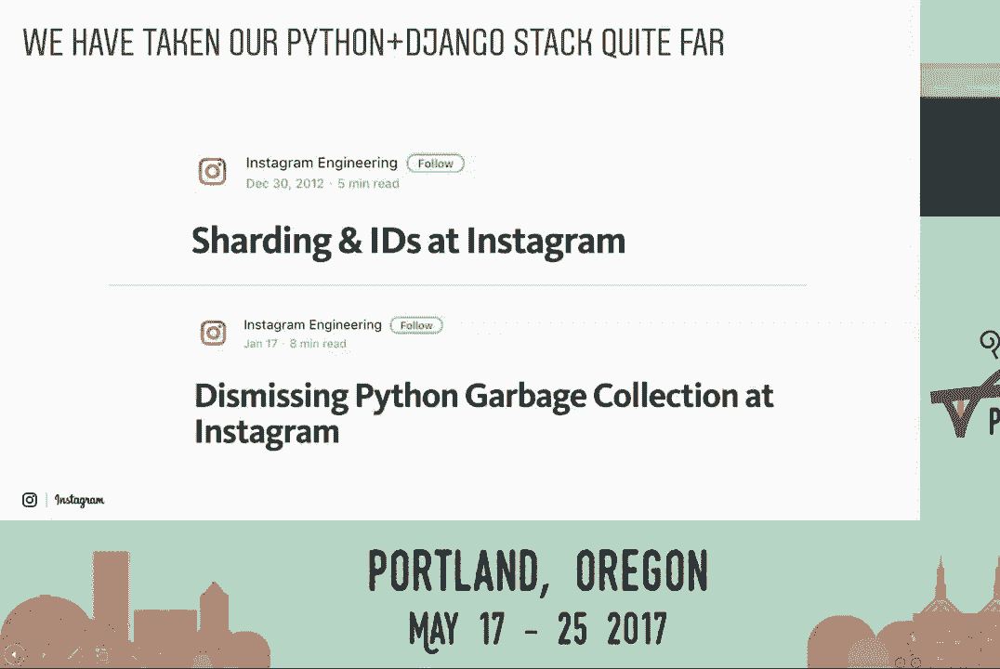

 And we're comfortable to scale Instagram， to as many users that are interested in using it。 as we could find。 And this is our very own Karl Meyer， talking about scaling Django。

 at the annual Django Underhood Conference。
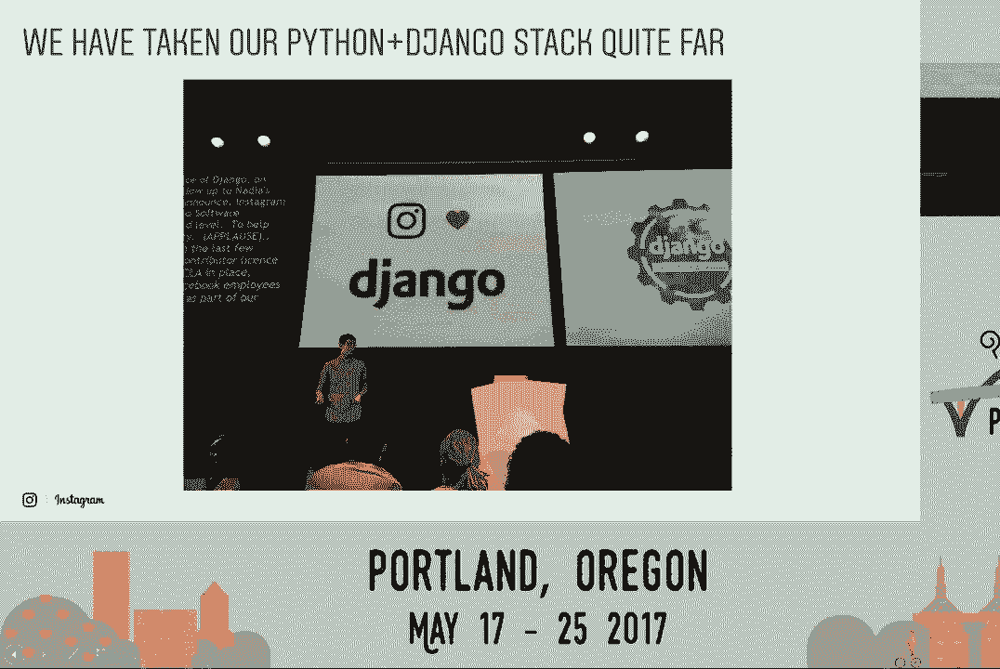

 But it's more than that。 In fact， picking Python as the programming language。 helps to influence and shape the engineering culture， here at Instagram。

 We prefer to use proven technologies。 Our co-founder Mike Krieger famously said once。 that our users do not care what database， Instagram runs on。

 They certainly don't care what language， Instagram is developed in。 The simple and pragmatic nature of Python， allows our engineers， our developers。

 to focus on scoping and solving the real problems， for our users and our products。 rather than getting stuck on some language details。 But you might wonder， Python is still slow。

 right？ Well， if you were here yesterday， you know that Python is not slow。 for processing hundreds of petabytes of astronomy data。

 It might be slow if you're doing high-frequency trading， or low-level bit operations。 But we believe at Instagram， our bigger bottleneck is developer velocity。

 not so much on pure code velocity。 (audience applauding)。 So our conclusion for which we're certainly biased。

 is that you can get to a few hundred million users， with your product using Python。 before worrying about the performance， of your framework and language。 Now。

 that's not to say we don't care about scaling Python。

 At some point， we realized that as we continue， to scale our team and our product。 our server growth is far outpacing our user growth。 And things would only get worse。

 as we continue to add more engineers to the team， and ship more product to production。
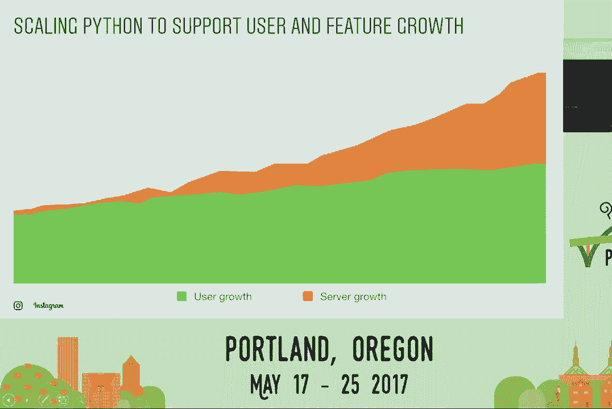

 So here's our strategy to address Python efficiency。 We started by building extensive tools。 to profile and understand our performance bottleneck。

 We proactively push critical but stable components， into native language implementations。 such as C and C++， a prime example being the memcache access library。

 We've also exploited using scitheinization as a weapon， to dramatically improve our performance。 One of our engineers， Alex Olaf， will be talking about this later in the afternoon。 And finally。

 as we start to look for the next 700 million users。 we're going to entertain some of the bigger ideas。

 maybe making the whole Django stack completely async， or perhaps writing a new Python runtime。 So we realized that we have a lot of challenges， and opportunities ahead of us。

 And we're committed to continue to push the boundaries， of running Python at Instagram。 But there is one small problem。 For a very long time， like everyone else， we run on Python 2。

7 and Django 1。3。 Yes。 And we have a， even our recruiter back in 2015。 knows how to say that to potential people。 And we have a list of small but dirty patches。

 sprinkled across our code base。 So we thought to ourselves。 we're going to be stuck on this setup forever。 As if we didn't have enough challenges。

 after rounds of investigations and discussions， we actually decided to upgrade our entire code base。 to Python 3。 (audience applauds)， Which to some people is a whole new programming language。

 And after a little bit of work， today I'm happy to announce that Instagram。 has been running its entire Django web service fleet， and the salary worker fleet on Python 3。6。

 for a few months now。 (audience applauds)， So what happened and how did we get here？ With that。 I'm going to hand over to my colleague Lisa， to tell you about our road to Python 3。

 (audience applauds)， - Thank you， V。 And yes， you heard it right。 Instagram has been running fully on Python 3， for a few months。 For the rest of the talk。

 I'm gonna rewind and go back to over a year ago， and share with you why we moved to Python 3。 some of the steps we took to get here， specific challenges we fixed， and finally where we are today。

 So who was just saying Python is running well for us？

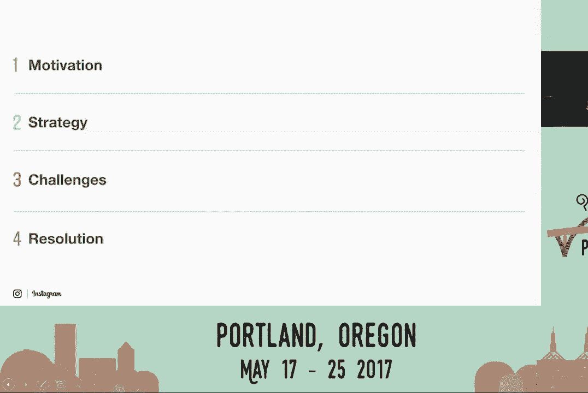

 Why wrap the boat？ In last year's Python， Grito announced that Python 2 support will end in 2020。 And this time it looks like it's gonna stick。 (audience laughs)， Fortunately。

 we were already moving in that direction， before that。 As Instagram's infrastructure team。 our mission is to keep Instagram alive today and tomorrow。

 So we're always looking for potential skating bottlenecks， that comes our way down the road。
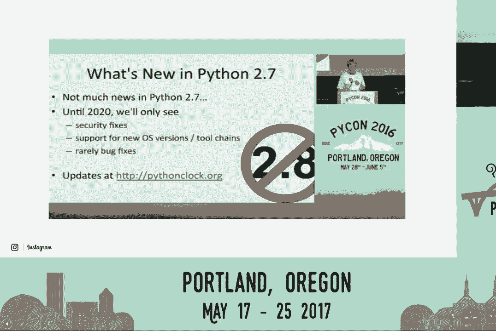

 six months， one year and beyond。 So here are some of our motivations。 First is dev velocity。 Take a look at this very typical Python method， with an ambiguous argument， max ID。 It's integer。

 string， tuple。 Well， look， our developers have actually been very nice。 to put a doc string in there。 This doesn't really scale。 It's best effort。

 There's no standard tool to enforce the typing。 The comment can also easily get out of sync。 with the code itself， worse than no comment。 At Instagram， many developers work。

 with multiple programming languages， C++， Java， even PHP in its modern form of hack supports typing。 So that has been one of the most important feature requests， from our product engineers。

 It was great to see it standardized in Python 3。 The second motivation is for scaling our server performance。
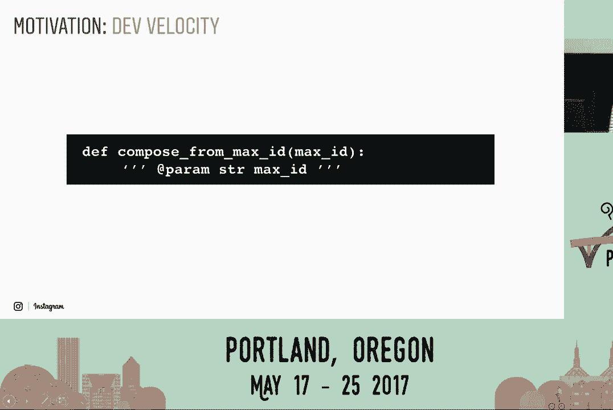

 Let's first take a high level look， at Instagram's building blocks。 User requests come into the web server， which accesses various backend services。

 to retrieve information。 It might also dispatch some tasks to the async tier， to execute。 for example， notification， et cetera。 By far， the largest tiers that we have is the web。

 and async tier where we run Python。 Now let's zoom in on one server。 On each web server。 we run N processes， along M CPU cores。 Each process can only process one request at a time。

 When the process is waiting for external services， to respond with various user information。 it cannot execute CPU locally。 So we would configure M to be a lot more than M。

 to avoid CPU starvation。 But the more processes we have also means less memory budget。 per process and more frequent process restarts， which in turn will cause more CPU consumption。

 during the process warmup。 The optimal number of N will depend on the CPU architecture。 the current user workload and the ever-changing code base。 And it needs continuous tuning。

 to achieve maximum server capacity。 What if we can have fewer processes。 where N is equal to M perhaps， but each process can process multiple user requests concurrently。

 While some requests are waiting for external network responses， we can execute other。 we can serve other requests， on the Django。 Async。io is very promising in this respect。

 to help us move forward。 And we were very happy to see it natively supported。 in Python 3 as opposed to the more scattered effort。

 and incompatible solutions that existed in Python 2。 Third motivation extends beyond Instagram。 Python has a very active development community， that continues to approach the programming language forward。

 in all aspects thanks to all of you， who are doing great work here。 But it will only continue on Python 3， and we want to be part of it。 As we was also saying。

 over the years we have made， various patches to the older versions of Django and Python。 but that was very hard to upstream。 So we want to change that by keeping up。

 with the latest releases of this software， so that we can contribute back to the community more easily。 (audience applauding)， So those were great motivations。

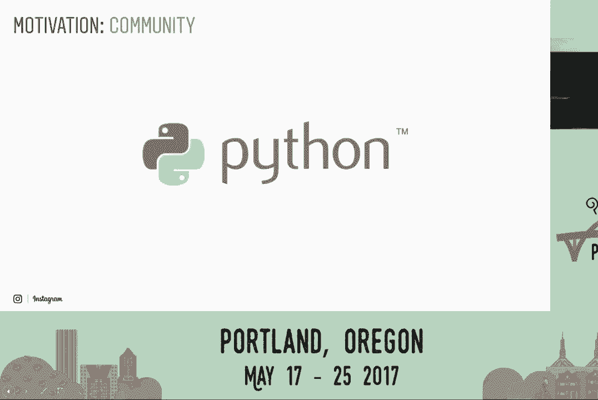

 and we got a green light to move forward with the project。 Let's just drop everything and work on Python 3。 Well， that's not gonna happen， right？

 So we have two mandates that we need to follow。 One， there shall be no user impact。 no service downtime for the upgrade。 Two， there shall be no slowdown of product launches。

 So our product engineers will continue to ship， richer user experience while we move the stack。 to Python 3 under the hood。 How do we make that happen？ Well。

 before we look at several options that we considered， let's take a look at how Instagram ships code。 to production。 Instagram develops code on master with no branches。

 Our development philosophy is to make small and focused diffs。 even for large features and refactors。 During the development phase。

 changes are checked into master。 Typically within an hour， it is pushed to production。 At this point， the feature may not be visible to the user， hiding behind a gated configuration。

 When the feature is fully developed and tested， it doesn't go live。 Commit like this happens on the master， tens of times a day。

 and deployment continues to happen throughout the day。 With that in mind。 let's take a look at some options， that we consider for migration。

 First option may be pretty obvious for a lot of companies， to take。 When you develop a new feature。 you cut the branch， develop on it， and merge it back。 It doesn't really work well for us。

 As you saw in the previous slides， we have tons of commits on the master every day。 and Python 3 changes really overlaps， with the whole code base。

 So there will be great branch synchronization overhead， that is error prone。 Also。 if we have run this branch， diverge this branch from master for a long time。

 and haven't run it in production， merging back will be a huge risk。 If only a handful of developers work on the branch。

 then we lose the opportunity to educate other engineers。 who are more than happy to help with the migration。 So this option was out。

 The next observation is that we run the same code， on all of our web servers。 Any of the web servers can serve any requests。 What if we convert one endpoint at a time。

 and create a separate pool that runs Python 3， and run those endpoints that have been converted？

 That might work well for some applications。 Like at Facebook， each team owns a different binary。 and they can migrate at their own pace。 It doesn't really work well for us with one binary。

 Many of our endpoints share common modules， that continue to evolve。 Many of our developers work on multiple endpoints。

 so they all have context switch between the different Python， versions。 And there's overhead in managing different pools， and they keep on shrinking and growing。

 So that option is out as well。 Well， I just mentioned common modules。 What if we extract those common modules out， and make them like a microservice？

 So instead of local function call， when we need to access these services。 we just go out and make a remote procedure call， to the microservices。

 So that would require massive code restructuring， and incur much higher user latency because each request。 will now have to make multiple hubs to access these microservices。

 And the deployment is also much more complex， than what we have now。 So that option is out as well。 Well， since we're so very good at delivering large changes， via small steps。

 we decided that we're going to follow， the same practice and just make math or compatible。 so that it can run under both Python 2 and Python 3， virtual environments。

 So we'll make small changes on master that are both--。 that are version compatible when production's still running Python， 2。

 And when all the code is ready， we switch the virtual M to Python 3， and pray。 [LAUGHTER]， Actually。 we did better than that。 We managed not to make headline news during the Python 3。

 migration via these carefully staged phases。 So the first two major pieces of work。 were done in parallel， where we handle the third-party packages。

 and make massive compatible changes in our resource code。 During this stage。 the code changes we make， we don't know whether it works for Python 3， because we're not running it。

 But we know that it works for Python 2， because the code is already running in production。 Then we have an intensive， very productive， two-month-of-unit test fixes。

 followed by a slow and careful， rollout in production。 I'll cover each of these stages in more detail next。 Instagram has been using open source packages。

 where we can since day one， and we continue to do so。 So the first rule that we put in place is when you add a new， dependency to our source code。

 it must be Python version compatible， so that we stop the bleeding of more Python 2-only packages。 in our repository。 Over the years， we have accumulated a number of packages， that we no longer use。

 so it's time to clean them up。 Also， some Python 2 packages are no longer needed in Python 3。 because they're natively supported。 So delete them as well。

 We then make a number of upgrades to the packages。 A bigger one is Django from 1。3 to 1。8。 It was necessary because Django 1。3 did not support Python 3。

 But also it was a long overdue upgrade， as we mentioned。 But because we had sprinkled dips around the code base， that was hard to end-tangle。

 there had not been enough incentive， to move it forward until now。 With this upgrade。 we managed to make the Django code base， completely intact with minimum changes in our code base for customization。

 so that future upgrades of Django will not be as prohibitive。 At the same time。 we use modernized utility to make massive， modifications to our source code。

 We would do one fix at a time across many different files。 as opposed to take one file at a time and make all the fixes on that file。

 It makes the code review process much easier when the code reviewer。 is only looking at one fix at a time。 And here are the changes we made during the modification。

 But as you can imagine， during this process， we are raising with our product。 engineers who would continue to check in shiny new features。

 but continue to break Python 3 compatibility。 And there was no really good way to capture these errors and prevent that from happening。 until we get unit tests in place。 I don't have to extort the many merits of unit tests。

 but I want to say that it has been especially helpful in our Python 3 migration。 With unit tests。 we don't have to go out and look for problems with Python 3。 They're right there staring back at us。

 All we need to do is to fix them。 That's easy for developers。 And unit tests are easy to reproduce。 They're easy to iterate with the fixes。 Many engineers who don't even own the code would be able to jump in and help with the fix。

 So for the next two months， we were basically hunkering down。 and had our most productive two months in the whole Python 3 migration。 Well。

 I did mention that our commits will go out to production within an hour of it being in master。 I did not mention that each of these commits have to go through many thousands of unit tests。

 before they can actually land in master。 At the beginning of Python 3 project。 only a handful of those tests would pass for Python 3。 But we don't want them to regress。

 So we added an inclusion list where we put in the known passing tests。 and add that to the lending process。 So now each diff that comes into the master has to pass for both Python 2。

 as well as the Python 3 test that should pass。 As we fix the unit tests。 the list grew longer and longer。 Until it made sense to switch to an exclusion list where we put in the known failed tests。

 At this point， any new test that people are adding for their new feature。 or further existing feature have to be Python 3 compatible by default。

 With decent test coverage， I was very happy to bring up my Instagram feed on my sandbox。

 that runs Python 3 and get my daily dose of cat videos。 But this is just a very small step to work production。

 There are limitations to unit tests。 We're not 100% covered。 That's one of my dreams。 Many external services have mocks in tests and data compatibility issues。

 typically don't show up in unit tests where the read and writes are happening。 with the same software version。 So now it's time to put Python 3 in the real world。

 By switching developers sandbox to Python 3。 This is a much more slower and painful process than the unit test faces。 Because it's a bit like a peeling audience。 Until you fix the outer layers of issues。

 you're not going to see the issues at the next layer。 But we kept on finding issues。 fixing them and adding unit tests back， where they should have been exposed in the first place and repeat the process。

 By switching the sandbox to Python 3， we also made sure that anybody who's developing new features。 would have the feature be Python 3 compatible from the get-go。

 When developers stop reporting issues on their sandbox。 we then expose Python 3 to Facebook employees， who use a much wider range of Instagram features than just the developers。

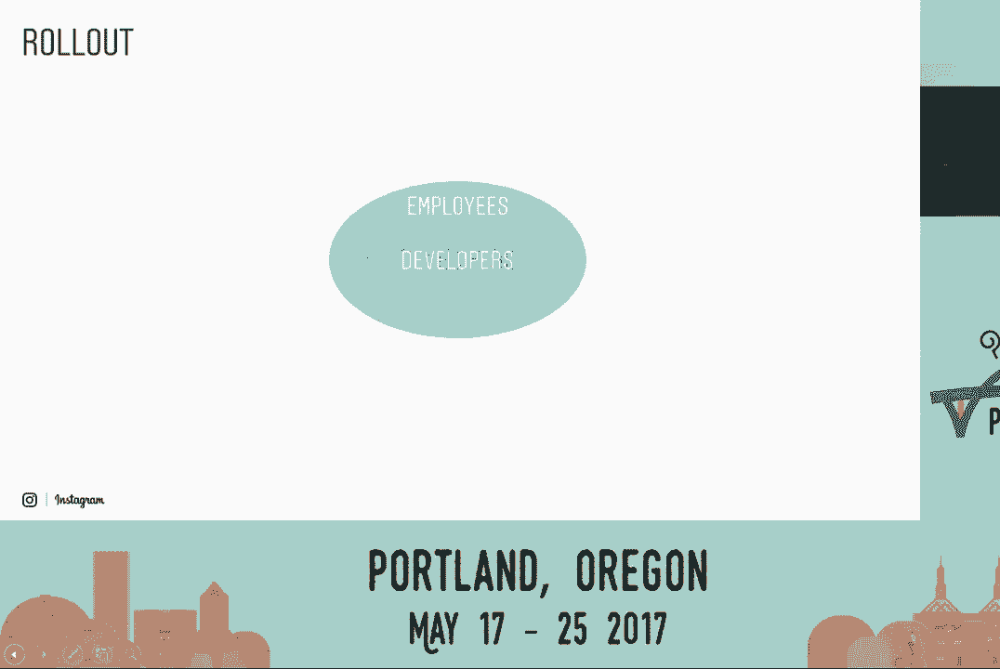

 And then slow rollout to an increasing percentage of our users。 Well。 this doesn't actually represent the time we're spending on each of these circles。 In fact。

 we're spent increasingly less time in the outer circles。 Because we found and fixed majority of the issues during the developer and employee testing phase。

 and focused more on the performance tuning during the user rollout phase。 So what are the specific changes that we made during unit tests and developer testing？

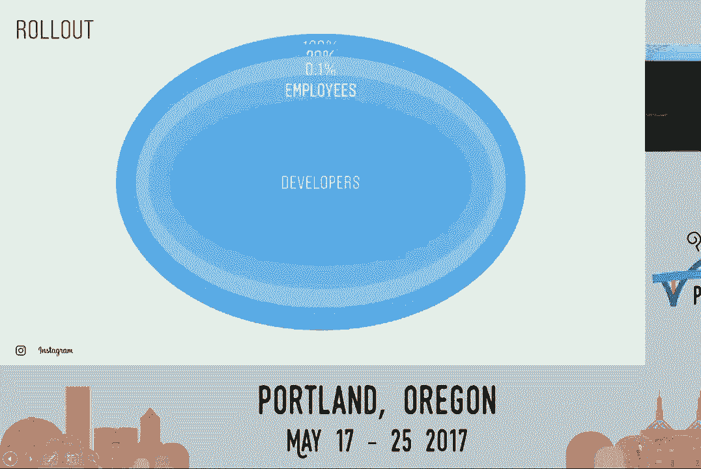

 There are too many to enumerate。 And most of this is pretty boring to everybody。 So I'm just going to list a few examples that captures the major categories of problems that we hit。

 First， I'm loosely using Unicode to refer to Unicode string by string-related problems。

 At the beginning of the Python 3 migration project。 most people would basically add those four lines of code， at the top of each of your source file。

 Well， we decided that we would skip the last two lines because they would cause subtle behavior differences for Python 2。 And in accordance with our mandate， we need to keep Python 2 completely sane and safe and error on making explicit changes for Python 3。

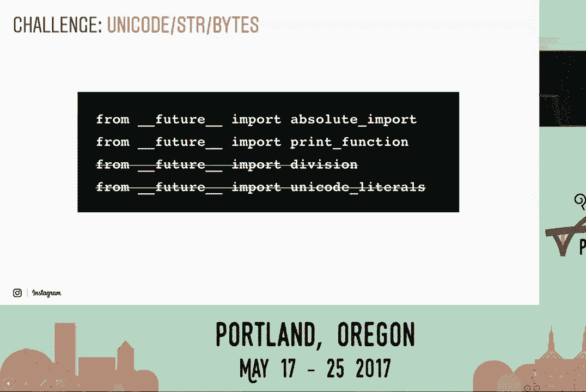

 So Unicode is the most prolific issues that were existing in our code base。 And this is just one typical example。 We're creating a made HMAC new object with a string that should have been byte-string that creates a Python 3 exception。

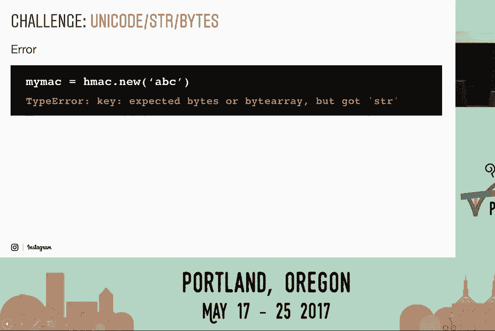

 The fix is just to convert the string to byte-string before you create the object。 Well。 it's a little bit verbose， but more importantly， the developer has to think， "Am I running Python 2？

 Should I decode， encode my Python 3？ Decode encode after a while you get brain damage。"， So instead。 we created a number of helper functions with the purpose of the function in this name。

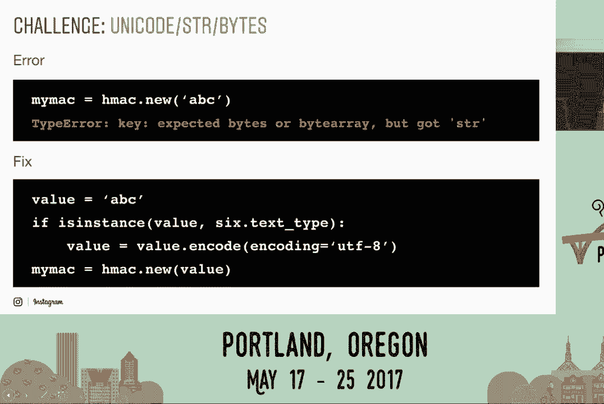

 So it's easier to understand what it's trying to do and not the mechanism for us to get there。
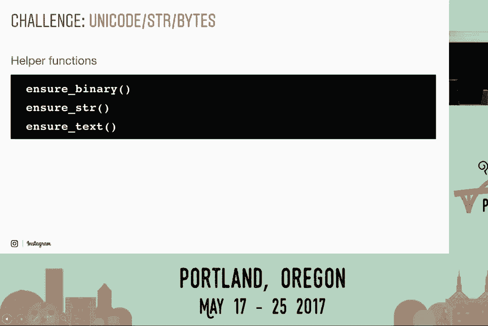

 With that， the fix looks like this。 It's more succinct and it's much easier to understand。 Last time I checked， we had over 500 uses of these helper functions。

 so they were very helpful in improving the productivity in the Python 3 project。
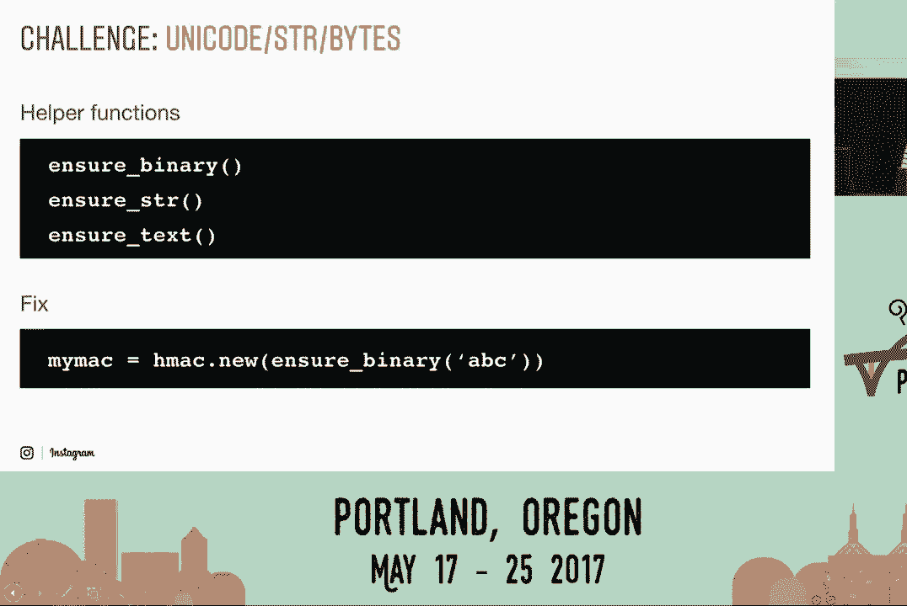

 The next big challenge is data compatibility issue， especially with pickle。 We use pickle to -- one of the use cases for pickle is to store data in memcache。

 and we use a highest protocol to encapsulate the data。 So when I converted my own sandbox to Python 3 and tried to reach my whole feed。

 my fellow coworkers started to complain about exception that's happened in your own sandbox。 It turns out that highest protocol is 4 in Python 3 and 2 in Python 2。 Oh， no problem。

 It's easy fix that's hard-coded to 2， this common denominator。
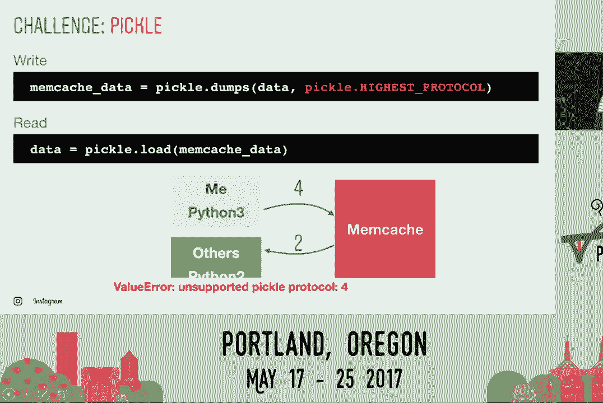

 Coming from networking background， if you're speaking IPv4 or I'm speaking IPv4， we can communicate。 If I write with Python 2， with a simple dictionary， with a Unicode value。

 I get an exception in Python 3 decoding。 Vice versa， if I encode the same data in Python 3。 the decoded result in Python 2 is different than the original data。

 That's bad news for us because we use quite a few places pickle for exchanging information between different entities。 So we looked at several different options。 Thrift is used in Facebook extensively for serialization and deserialization between different entities and has great backward compatibility support。

 It does incur higher schema definition overhead as well as encoding decoding costs。 Message pack on the other hand is comfortable performance-wise to pickle with very simple to use API。

 But it lacks universal support for all kinds of data types。 In the end。 we looked at each of the pickle use cases and had to come up with different solutions with each of them。

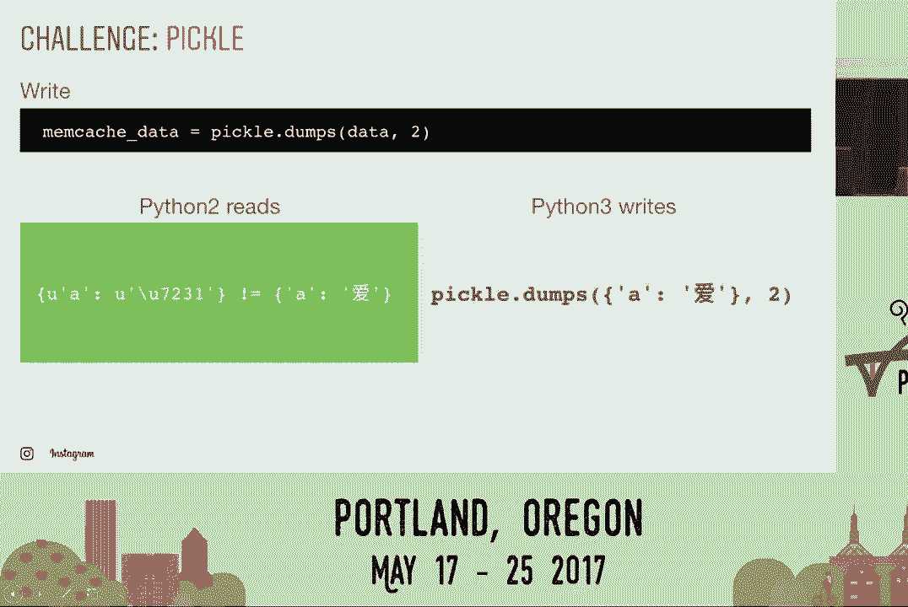

 With memcache， what we decided to do is to cut the key space into two。 So Python 2 and Python 3 never communicate with each other in that case。

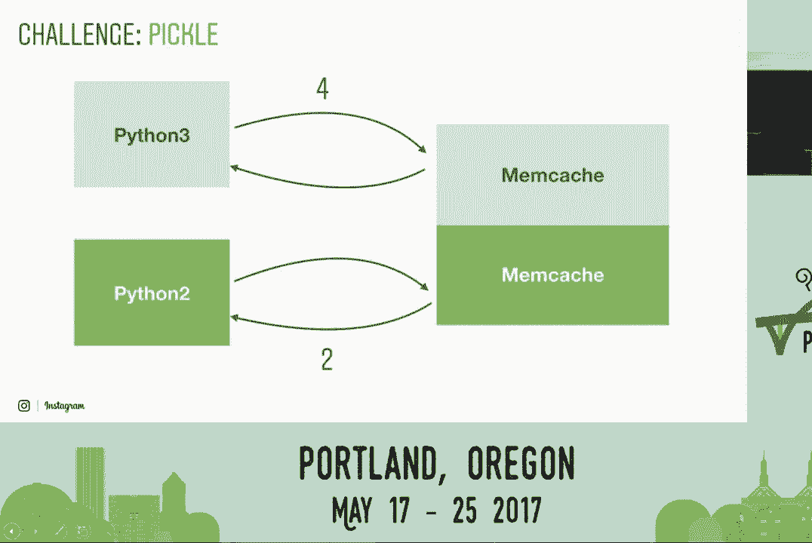

 Next up is iterators。 In Python 3， some of the methods that used to return lists have now become iterators such as these。 What's great performance-wise because when you don't have to compose a new list。

 it's better performing。 But it creates subtle behavior differences。 When you walk through an iterator and consume those elements in the iterator， it disappears from it。

 So you can really only use the iterator once。 Here in the example that bid us。

 As you know， we use Python to optimize our runtime performance。 But Python files need to be pre-compiled。 So this is part of the script that does that。

 Line 1 has a list of Python files to compile。 Line 2 maps them to a particular class， instance。 that helps us in this process。 Line 3 checks if any of these files are still to be compiled and line 4 creates a pending list of them to work out。

 While it works well for Python 2， when we converted to Python 3。 we found that the first file is never compiled。 Why is that？

 It's because line 2's map function has now become an iterator。 So when we're checking if any of the file is not compiled in line 3。

 it consumes at least the first file from the iterator。 And line 4's build never has a 。pyx in it。 So the fix is pretty easy。 You just convert map back to a list。 Okay。

 bugs like this can be very hard to spot。 If the picture that should have been on the top of my feed doesn't show up at all。 it's going to take a while to find out。 But it can be more serious for other problems。

 So when you're converting your Python 3 project， always run。 futurize or modernize utility and convert all of your iterators back to Python 3's list。

 And then you can walk through the diff and see where you can optimize if you're not using the iterator more than once。
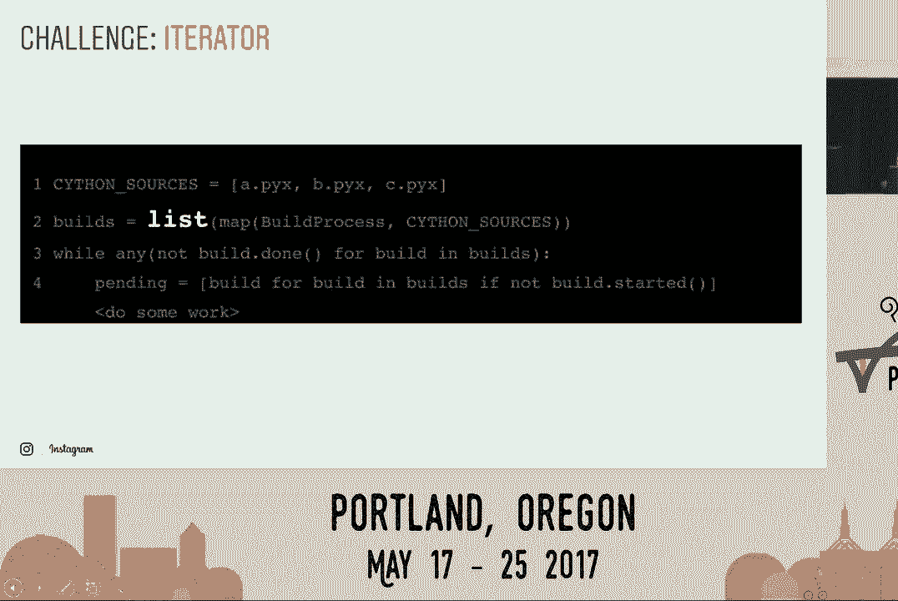

 Last one is not really Python 3 specific。 But you will most likely hit the problem when you're converting to Python 3。 So it's a simple dictionary with keys A， B， C。 What do you think the JSON dump output is？ Well。

 it varies based on Python version as well as different runs for the same Python version。 So if your application really depends on the order of the JSON output。

 then you need to make it explicit。 We got bitten by this in the form of a severe performance regression when we determine if a configuration has changed based on the JSON output。 It took us a while to find the problem， so keep that in mind when you're debugging some tough issues。

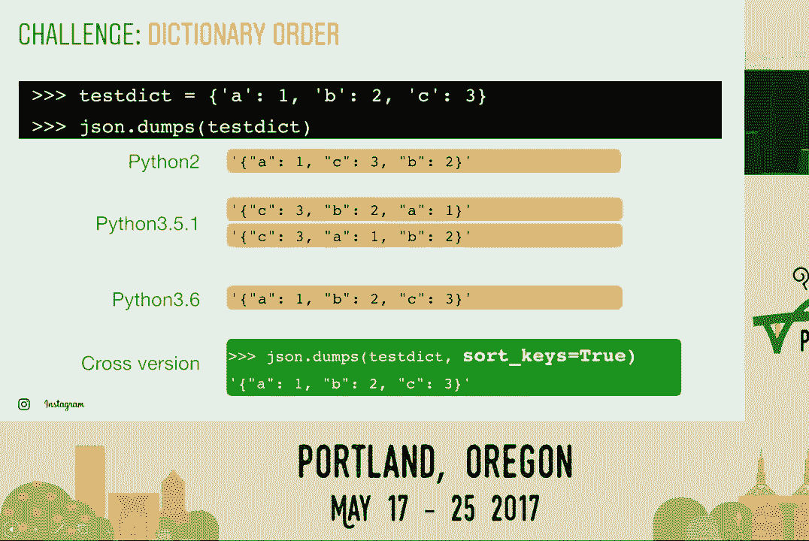

 Well， with those fixes and a whole number of others， we are ready to roll。 But something is still bugging us， performance。 At Instagram。

 we use two metrics to measure web efficiency。 The first is CPU instructions per request。 the less the better。 And the second is maximum request per second that a server can support。

 the more the better。 Typically， the two metric correlates。 So when we saw very happily that the first metric had a 12% decrease。

 which is an improvement in our case， we expected to see a 12% improvement in a second metric。 But we didn't。 What happened？ We know that memory configuration can have an impact on the second metric。

 So did we have a different memory configuration？ Not that we know of。 We use Ewiskey。ini to configure it。

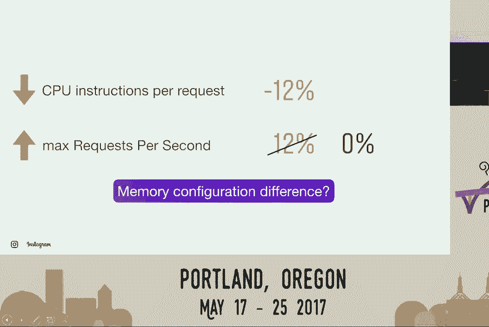

 And this is the code that checks the configuration。 So why did the condition not meet for Python 3？

 It's unicoat but it's till the end。 So this is the single most significant letter in our whole code base。 making a 12% capacity difference。

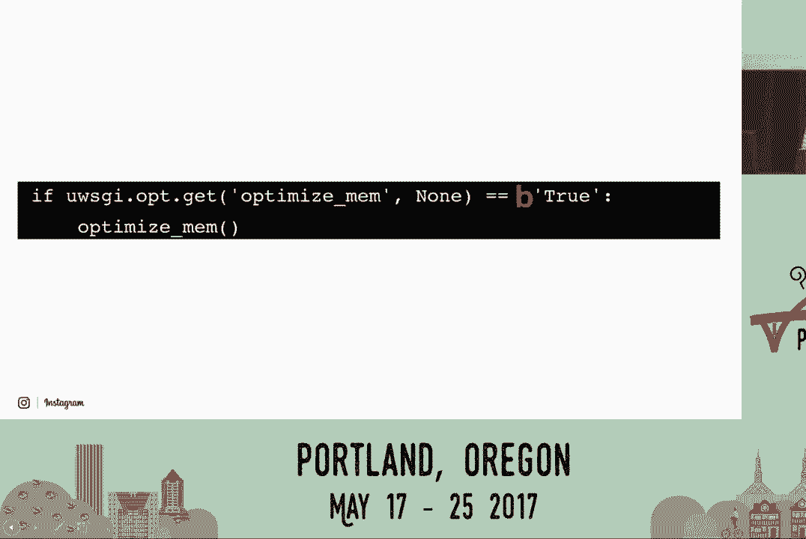

 Finally， in February 2017， we dropped Python 3 to 2 traffic to zero and moved to Python 3。5。 Within the next couple of months， we moved forward with Python 3。6。 What do we get from it？

 We had -- thank you。 [ Applause ]， We had a CPU win of 12% on our Django tier and a saving of 30% on the salary tier on memory。 What about the mandates we had in the beginning？ No slow down of product launches。

 During this Python migration process， we had an accelerated rate of monthly active users。
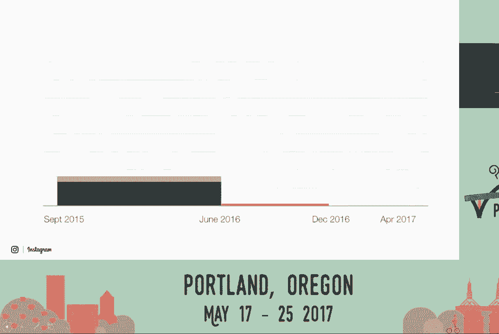

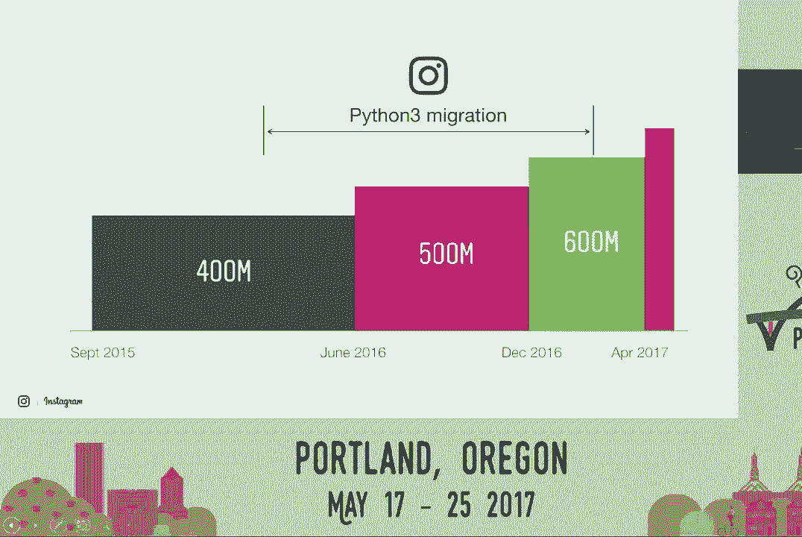

 We also have seen an unprecedented number of feature launches， including live。 story and a number of safety features。

 Coming back to our original motivation to move to Python 3。 our early adopters have moved over 2% of our functions with type hints。

 We're developing tools to collect data in production to help bootstrap the type hint process。 We have also made some contributions to MIPI and the type chat。 On the async。io friends。

 we have accelerated async。io adoption across our end points。 reducing the user request latency up to 30， 40%。 We're also developing tools to help us understand and debug async。

io issues easier。 We have yet to support multiple requests during -- within a process。 That's something we're looking forward to explore very soon。

 On the community friends who are working with Intel to benchmark a web workload so that Python performance engineers can use that as a metric reference。 We're also looking into all kinds of runtime optimization opportunities as well as memory profiling effort。

 To sum it up， the Python 3 effort gave us better than expected performance boost。 improved developer productivity， and set us on a solid foundation for growing in the next few years。

 It can be done。 It's worth it。 Make it happen。 And make Python 3 better。 Thank you。 [ Applause ]。

 Thank you very， very much。 That was fascinating。
