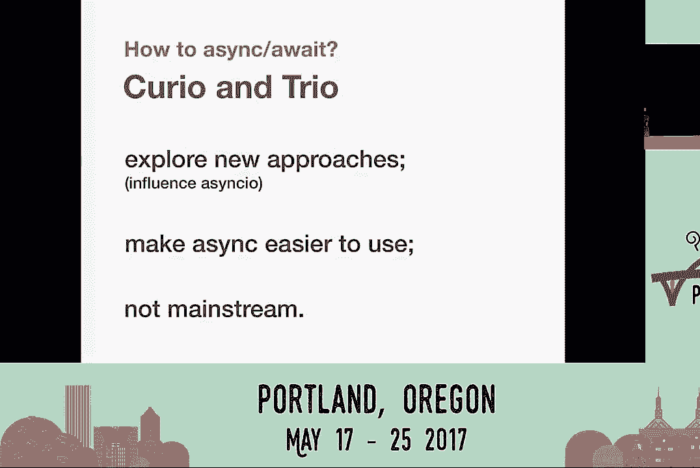
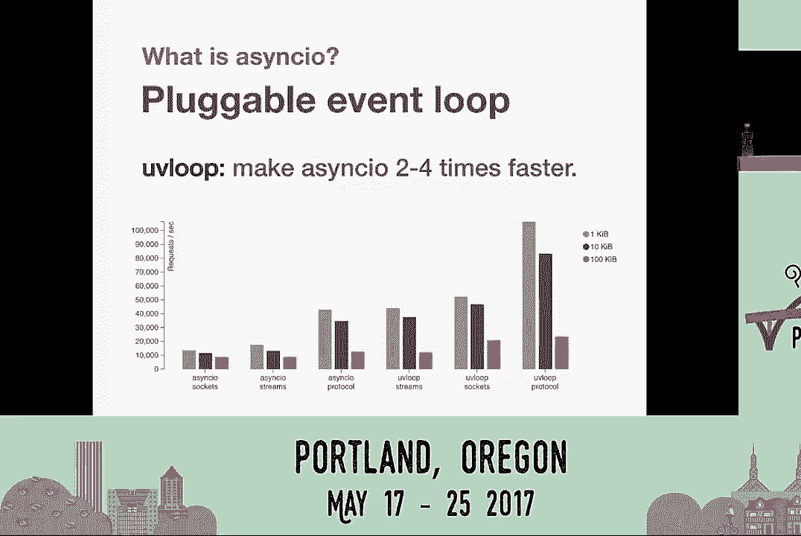
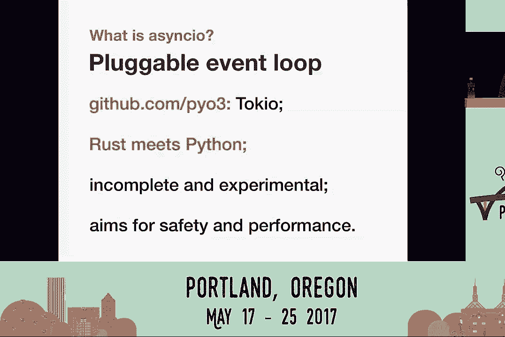
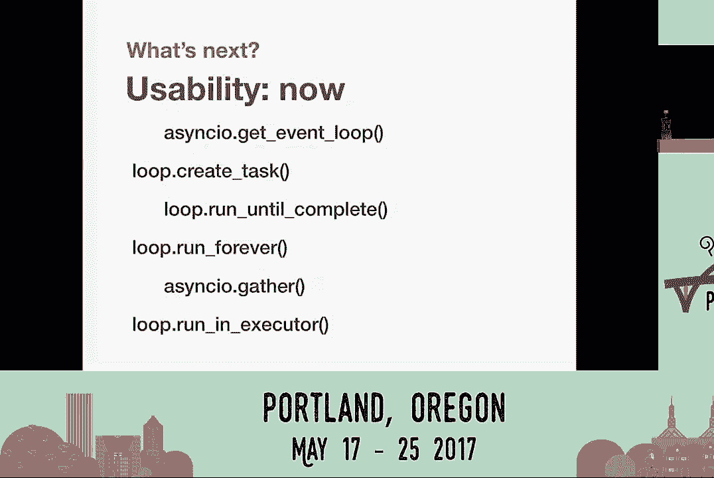
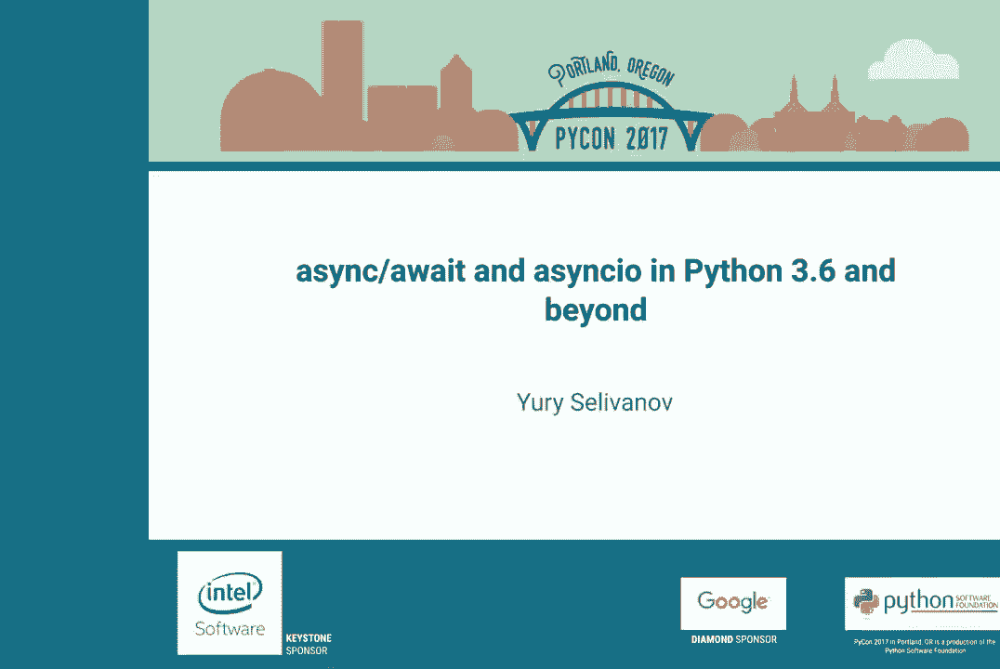

# P3：Yury Selivanov   asyncawait and asyncio in Python 3 6 and beyond   PyCon 2017 - 哒哒哒儿尔 - BV1Ms411H7jG

 >> Good afternoon， everybody。 And welcome to this session of PyCon 2017。 Before we get started。

 I would like to encourage everyone with a device that is capable of， making noise。

 Do please have a chat with it and ask it not to。 Because when it does。

 everyone's going to stare at you and some people might be nasty， to you on Twitter。 With that said。

 I would like to introduce our next speaker。

 His name is Yuri Salivanov and he will be talking about async and await and async IO。

 Please make him welcome。 [ Applause ]， >> Hi， I'm Yuri Salivanov。 I'm from Toronto， Canada。

 Today we're going to talk about async await and async IO in Python 36 and beyond。

 Feel free to follow me on Twitter and email at yy@magic。io。

 So quickly about me。 I'm core developer since 2013。

 Worked on a number of peps mostly about async and await。 I maintain async IO， UV loop and async/pg。

 I work at magic stack， check out our website， magic。io。 We do a lot of stuff with Python。

 for Python and sometimes to Python。 It's pretty interesting。 So let's talk about async/await。

 The first question is why do we even have it？ Because there are so many other ways how you can do concurrency。

 For instance， you can do threats or you can code with callbacks and promises or maybe。

 you can do G event or use event land or stackless Python or maybe you could just use generators。

 with yield from syntax。 And the answer is readability。

 It's arguably better than callbacks or promises。 I think anybody who tried to debug or refactor some JavaScript or old Python code with a lot。

 of nested callbacks can attest to that。 It's easier to reason about the async/await code。

 You just see all those explicit points in your code when you can switch context for IO。

 or for something else。 And it actually promotes better patterns like message passing and not having global shared。

 data structures。 Because no matter what you think about your ability to write multithreading code。

 you will， inevitably end up having situation on the right side。 Any other reasons？ Well， efficiency。

 Since we have this little problem in Python called gill， threats aren't always the answer。

 But even in the languages like C# where there is no gill， we still have async/await。 Why？

 Because threats are a system resource， you cannot have an infinite number of threats。 So with async。

 you can handle thousands or hundreds of thousands or sometimes millions， of open。

 long-lasting connections on the server。 Anyways， what is async/await？ Well， obviously it's a syntax。

 We added them first in Python 3。5。 And we added syntax to define coroutines or async functions。

 syntax for asynchronous context， managers， asynchronous iterators。

 and obviously a weight expression。 In 3。6， we took it even further。

 We now have asynchronous generators， asynchronous list comprehensions， and even asynchronous。

 generator expressions。 And I'd say that at this point we have almost complete coverage of whatever you can do in。

 Python synchronous mode。 You can do it with async/await。 Except one thing， this is yield from。

 Yield from for asynchronous generators。 We might add syntax for yield from in 3。7。

 but this is not a top priority。 I'll be honest with you。 What else is async/await？ It's a protocol。

 There is a common misconception that async/await was created specifically for async/aw or only。

 async/await can use it。 And this is not true。 Internally。

 async/await based on the iterator protocol， we have a bunch of magic methods， like dunderawait。

 which allows you to make an object awaitable or use them in a weight， expression。

 We have magic methods to define and create asynchronous iterators and asynchronous context。

 managers。 It's pretty generic。 You could totally write your own framework for async/await。

 but you probably shouldn't。 It's a lot of work unless you want to experiment， of course。

 So if you take a look at modern async/await application， there is a stack。

 And at the bottom of the stack is operating system， of course。

 Then we have Python interpreter and then we have async/ framework。 Maybe tornado， twisted， trio。

 trio， or maybe async/aw。 And then we have application framework。

 Maybe it's HTTP or Sennick or something else， Django， Flask， if they have asynchronous versions。

 And only then you have your applications。 So what kind of frameworks do we have？

 The good use is that twisted and tornado can use async/await syntax today。

 And twisted is actually a model of async and Python。 So much originated from twisted。

 And I think no one even knows how all twisted is now。 But it can use async/await now。

 And both twisted and tornado have big ecosystems。 And maybe what's even more important。

 they have a big mind share。 So there are lots and lots of questions on Stack Overflow and sometimes answers。

 (Laughter)， Tornado today and twisted very soon， maybe tomorrow。

 will be able to run on top of async/await。 And what it means is that you can call async/await libraries from your tornado code。

 Or maybe soon from your twisted code。 Or maybe you'll be able to use twisted libraries which we have a lot in your async/await code。

 So this is quite good。 We also have curiantrillo。 Those are two new keys on the blog。

 Both try to explore new approaches。 Both try to make async easier and maybe sometimes safer to use。

 And of course， if they find something new or new useful patterns or good ideas， we'll。

 steal them and put them in async/await。 That I can promise。 Both are not mainstream yet。

 Curio is like here and a half years old。 Trio is a few months。

 It's really good projects and I really encourage you to take a look at them and to explore how。

 they are implemented inside。 It's quite an interesting take of how you should do async or can do async。

 But not mainstream yet。 Anyways， let's talk about async/aw。

 So what is async/await？ async/await is first of all a foundation。 It defines low-level APIs。

 high-level async/await APIs。 It is here to stay and it has a plug-able event loop。

 So what are those low-level APIs？ That's of course stuff to schedule callbacks。

 to write protocols with transfers， to the network， processes， handle unique signals。

 all callback based， all very low-level。 But this is actually a good thing to have because it allows us to integrate with other。

 low-level code written in languages like C， C++ and others。 On top of that。

 it has async/await to run coroutines and also to do streams and sockets， to the network programming。

 call sub-processes， use logs if you like dead logs， timeouts， installations。

 everything that is handled in async/await。 It has all the tools。 It is mainstream。

 Starting with Python 3。6， it's no longer provisional。 It's in the standard library。

 And this is a promise from core development community and from Python community that async。

/await is a safe foundation to bet on。 It has a healthy ecosystem。 Surprisingly。

 we have a few frameworks right now to do HTTP and Python and HTTP， and there are many others。

 We have database libraries like async/pidg， we have support from MySQL， AO MySQL， radius。

 memcache/d， pretty much all of them are covered。 We have a swath of libraries and AO libs organization on GitHub。

 So I'd say pretty much every major component of our systems has some sort of async/await。

 library around it。 And it has a pluggable event loop。

 And this is something that was envisioned in the very beginning of async/await。

 This is something that lets async/aw be integrated with frameworks like Twisted or Tornado， but。

 it also gives us the ability to switch the event loop and do something fun with it， like。

 make it faster。 So there is this project called UV loop and it has this promise or idea to make async/await。

 for time faster。 And it does in micro benchmarks。 But it's not surprising to see 15， 20， 30。

 and some type of 50% speedups in real production， code。

 So if you haven't seen UV loop before or haven't tried it， definitely give it a try。

 I'd say that at this point of time it's stable and it's safe to use in production。

 So try to do it。 And here is something else。 We call this Pythonium 3X site。

 This is a new GitHub group that we created just about a month ago。

 And it explores a way to bring Rust to Python。

 So let's get back to this pluggable event loop idea。

 What if we could have an event loop and async/await loop written in Rust so that async/await becomes。

 a bridge from Python world to Rust world？ What if you could call a quality in implemented in Rust in Python with a timeout and cancel。

 it later？ What if you could have an HTTP server or some protocol implemented in Rust and then used。

 in your high level code？ So this is the project that tries to explore that。 It's not there yet。

 I think it implements most of the async/await APIs right now but it's still incomplete and。

 still experimental。 It's not as fast as UV loop right now but it will be there。

 And one of the things that we actually want to focus here is safety。

 Because UV loop and a lot of other accelerators are written in Python and C and sometimes you。

 find segfals， sometimes you find bugs。 With Rust you just don't have this kind of problem and you have performance。

 And Rust is this new shiny thing。 It's everybody's favorite language。

 You don't know what you know of it。 So it's really cool。

 And I really have high hopes for this new thing。

 So definitely check it out。 It's on GitHub Live。 So let's talk about what's next for async/await。

 What will happen with async/await？

 We have some goals。 We have some goals for Python 3。7。

 Actually one of the first things that we want to make sure of is that we can run and use。

 twisted code on async/await。 There were some blockers to that but I think we kind of addressed them all in 3。

6。 And in any case， for 3。7 this is one of the things that we want to do。

 We want to make sure that everything that was developed for tweezers。

 There is a lot of good code that we can use in async/await。

 Another question is maybe curio and trio can be built or rebuilt on top of async/await。

 Maybe this will let us fix bugs in async/aw because of the increased user base or maybe。

 we will be able to have a compatibility between async/await and curio/code or trio/code。

 This is something to explore。 So this is another goal is to see if we have enough APIs or if our APIs are flexible enough。

 to implement new source of frameworks， new async/await frameworks on top of async/await。

 And that trust loop。 So we have some problems right now in Tokyo。 For instance。

 right now it's really hard to have a task or a quarantine and rust to be。

 fully compatible with Python code。 There are some low-level details。

 It can be work around it but we definitely want to make sure that in 3。7 it's straightforward。

 So maybe if you are writing your next event loop， I don't know， in pure assembly， you。

 will be able to integrate easily with async/await。

 The other thing that we want to focus on Python 3。7 is to improve usability and specifically。

 to address the issue of documentation。 The documentation of async/await is huge。

 I'd say it's really hard to follow。 It focuses too much on low-level details。

 Instead of teaching people how to use async/await or how to use it in an optimal way， how to。

 maintain code bases with async/await or how to write frameworks and protocols for async/await。

 in an optimal way。 The original documentation， by the way。

 was written by Victor Steiner and I think he deserves。

 some credit for it because he did it single-handedly。

 When async/await wasn't such a big thing as it is right now， he re-done all of it and I。

 think we kind of dropped the ball and we didn't update it。 We didn't really maintain it。

 So this is one of the top priorities for 3。7 is to fix the documentation， make async/aw。

 easy to learn， add some tutorials to it。 So we'll be focusing on that。 And of course。

 if you guys want to help， you're welcome to do so。 And now， this is an interesting topic。

 These are the functions that you -- if you know this function， this functions， you can。

 pretty much write any async/await program。 This is all to async/await。

 There are a couple of more but not really important。 If you understand how these functions work。

 you can do it。

 But if you -- it doesn't work。

 If you look at them， you will see that some functions are prefixed with async/aw and some。

 functions are prefixed with loop。 And this is another subtle problem of async/aw and maybe it's also a documentation issue。

 The idea was that async/await programs try to always pass event loop explicitly in your， program。

 So you always carry the event loop object around you。 You can't do things without it。

 So async/awitself， all of async/await unit tests， many of async/awit packages， they all accept。

 loop argument。 They will expect you to pass it。 It's kind of really suboptimal。 But in Python 3。6。

 we've fixed get event loop method。 And now it behaves deterministically。

 Whenever you call it from an async/await code， it will always return you the correct event， loop。

 So the idea is that you can have your high level， beautiful async/await API。

 And whenever you have to go low level in your implementation， you always can get this event， loop。

 But you don't need the user to pass this event loop for you around。

 So pretty much starting right now， we start to encourage people to design their APIs without。

 explicit event loop in mind。 But for 3。7， we'll need to fix many of our APIs and add new APIs to promote this pattern。

 so that high level async/awit programs don't even care about the event loop。

 It's a low level detail。 Don't think about it。 Don't bother with it。

 We also need to do -- we also want to add new things。 One of them is start TLS。

 There are some protocols that start as a clear text and then they suddenly need to upgrade。

 and become secure and they need start TLS。 There is also a very frequently requested feature by Armandronica to add call and pass。

 context APIs。 Perhaps he wants to re-implement Flask or something。

 but this is quite a serious thing， actually。 This is quite a serious issue for large applications。

 If you have thousands of lines of code or hundreds of thousands of code， sometimes somewhere deep。

 down below you realize， oh， I need more context。 Maybe I need the current request object or maybe I need the current host or port that。

 I'm connected to for logging or for something like that。 And without rewriting all of your code。

 you pretty much can't do it。 You cannot use for local objects because they don't work with async in a way。

 You cannot use a global variable because it's a shared state。 So it's really hard。

 And one of the last major things is to add async。reple so that you can just type Python。

 dash m async。io or maybe just Python and experiment and play with async。io with its native syntax。

 so that you can just write away something and it would do it for you。 And overall we need your help。

 Ask for the new features。 You can use bugs Python to work for bug requests， bug reports。

 but you can also use it for feature， requests。 You also have Python tool if mailing list。

 Tool if is the original name of async。io。 But it's still quite active。

 Gwidderez it and helps people a lot。 A lot of other async developers read it。 And also on GitHub。

 C Python moved to GitHub completely and everything now happens on GitHub。

 You can issue pull requests。 It's so much easier。 The whole idea of this migration was to involve more people in C Python and also in async。

io， development。 So help us guys。 I think async。io has a very bright future especially with things like rust integration。

 This might enable us to do so much more in the near future。

 That's it。 If you guys have any questions， I'd be happy to address them。 Thank you。 Thank you， Yuri。

 If anyone has any questions， please come up to one of the microphones in the aisles。

 Do you mind comparing the async。io infrastructure to what's available in other languages？ Like。

 you know， obviously JavaScript has promises and now Senka wait and C#。 Just like at a high level。

 just to get a feel of how， like， are they roughly doing the same。

 thing or is there an in here and difference between what different languages are doing。

 since all of them seem to be moving towards having a Senka wait at least。

 But behind it is probably not quite the same。 Yes， they're not quite the same。 But yes。

 the idea is almost the same。 I'd say one of the problems in Python that we have with async。

io and async。io is that the， language itself originally was designed to be a synchronous thing。

 So a lot of APIs can actually block。 So one of the ideas that we need to research in Python specifically is to find a way to。

 see if your application is making some blocking system calls while doing its async。io。

 Other than that， I'd say Python async。io wait implementation is quite similar to what you。

 have in JavaScript。 If you know how to use it in JavaScript， you know how to use it in Python。

 If I'd say， for instance， this context sharing， context object idea， it kind of comes from。

 C# where they solve this problem for async。io code。

 So it's the point where we can copy good ideas from other languages and edit to Python。

 And in many ways， Python support of async。io wait is greater than in any other language。

 I don't think that a lot of languages or any languages besides Python have asynchronous。

 context managers or asynchronous generators。 One copy at least at first。

 async and the wait expression from C# but we added so much， more to make it useful。

 >> I was wondering， I guess， kind of two questions。 One。

 why isn't UV loop the standard loop if it's so much faster than the async。io one？ And then also。

 are there any efforts to improve the steps to start the loop and register your。

 function and everything seems cumbersome from a user standpoint？

 Are there any efforts to improve the usability there as well？

 >> The first question is why you will loop is faster？ >> Or why isn't it the async。io default loop？

 >> You will loop uses libv。 Libv is the low level library。 Original developed for null。js。

 It's a large dependency。 It's a big library。 It's a lot of code。

 We don't need Python to depend on this library， especially how easy it is to install UV loop。

 It was envisioned from the beginning that such a thing should be possible。

 So I guess there is not enough motivation to add a lot of low level SQL to Python at this。

 point of time。 The core functionality of async。io right now is in pure Python。

 It's relatively easy to read and fix。 So it's just not that big of an issue。

 As for the second question， yes， specifically we want to add two high level functions， async。io。

 run and async。io run forever。 The first one would accept a query and it would just run。

 This is like an entry point for a simple async。io application。 If you have a complex async。

io application which spawns a lot of services， subprocesses。

 and you kind of have to finalize and clear the state of async。io program consistently。

 you'll have the second method which actually accepts an asynchronous generator or an asynchronous。

 complex manager。 So the idea is that you enter your asynchronous state consistently in an asynchronous way and。

 you can clean up your state in an asynchronous way consistently。

 And the whole machinery of creating loop， cleaning up resources， printing out debug information。

 can be handled by this function。 But yes， we recognize this problem that right now it's really a cumbersome process to bootstrap。

 async。io application。 So yes， we have some solutions。

 I'll be working on a PEP on a new PEP for Python 3。7 pretty soon。

 And my plan is to have the PEP and have a library on GitHub， we'll call it aio， next， or aio。

 extra or something like that， prototyping those things so that you guys can start using。

 them and give us some feedback before this lends to Python 3。7。 >> I'm curious about the Py03。

 Is it more about putting some Python in your roster， putting some rust in your Python or。

 just simplifying them both？ What's sort of the use case of the actual Py03， Py03 library？ >> Yes。

 the use case is the first enable this integration because we have C Python rust binding。

 which allows you to easily create bindings of rust code to the Python code。

 But there is no way right now to have an API， an asynchronous version of that API。

 It doesn't know anything about async。io and asynchronous nothing about rust。 So async。

io can be a bridge here。 The other thing is performance because yes， you can write a low level。

 let's say HTTP parsing， library or low level postgres driver in rust。

 It will be very efficient and it will be probably safer than a similar thing written in C。

 So the idea is to make it easier to reuse existing rust code in Python。 In an asynchronous way。

 >> Thank you。 We have time for one or two more questions if anyone has any。 Thank you very much。

 Yuri。

 >> Thank you。 [ Applause ]。

 [ Silence ]。

