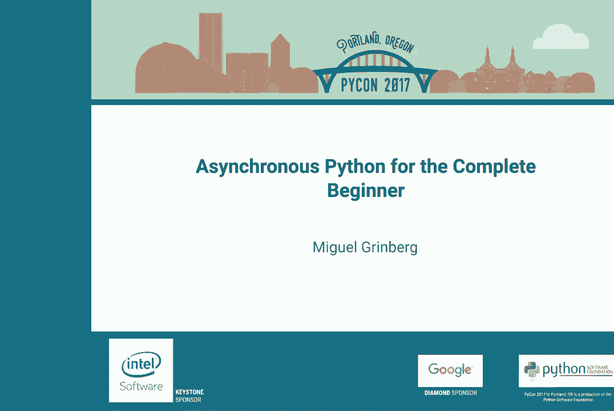
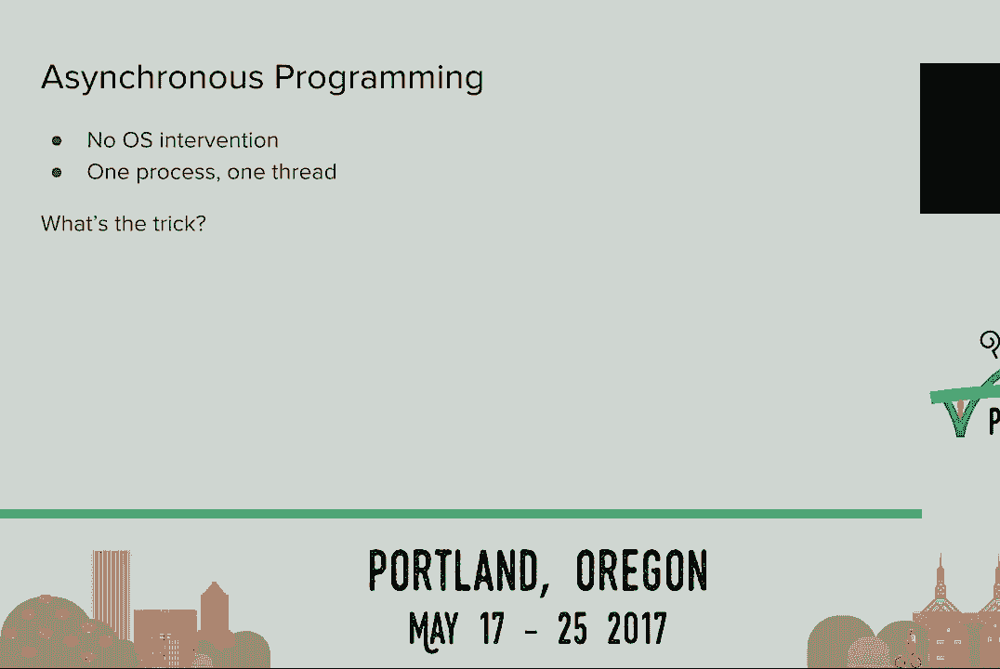
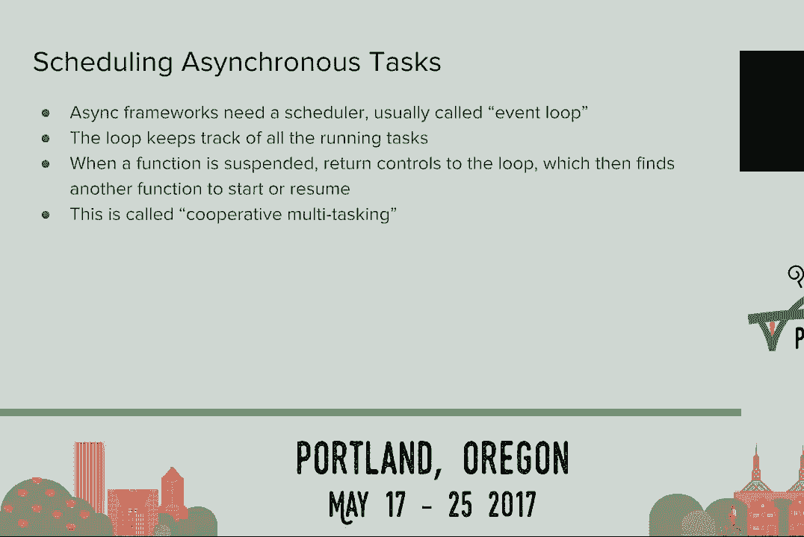
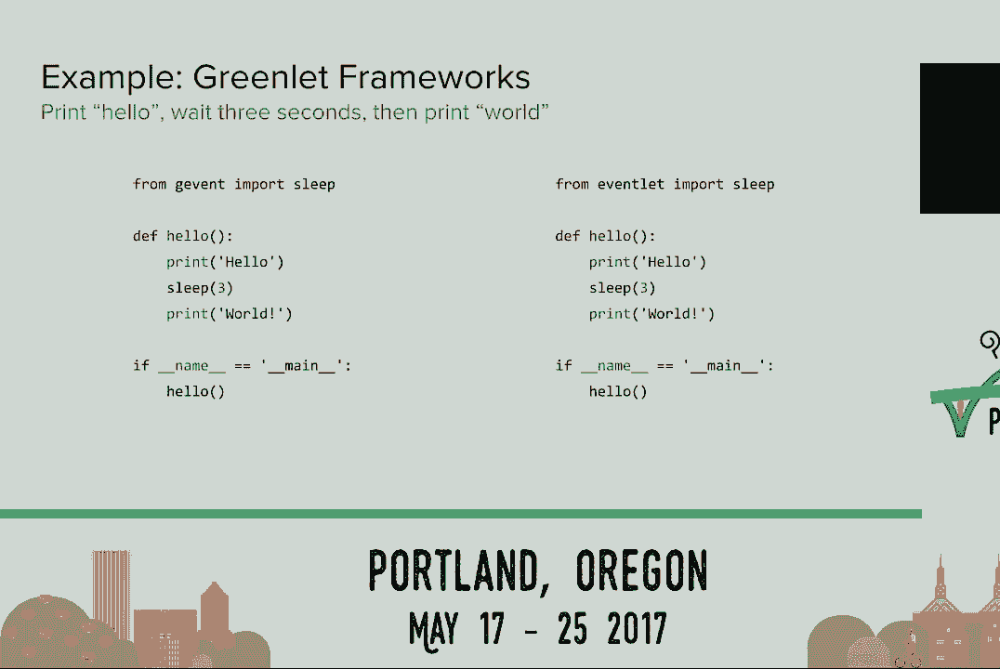
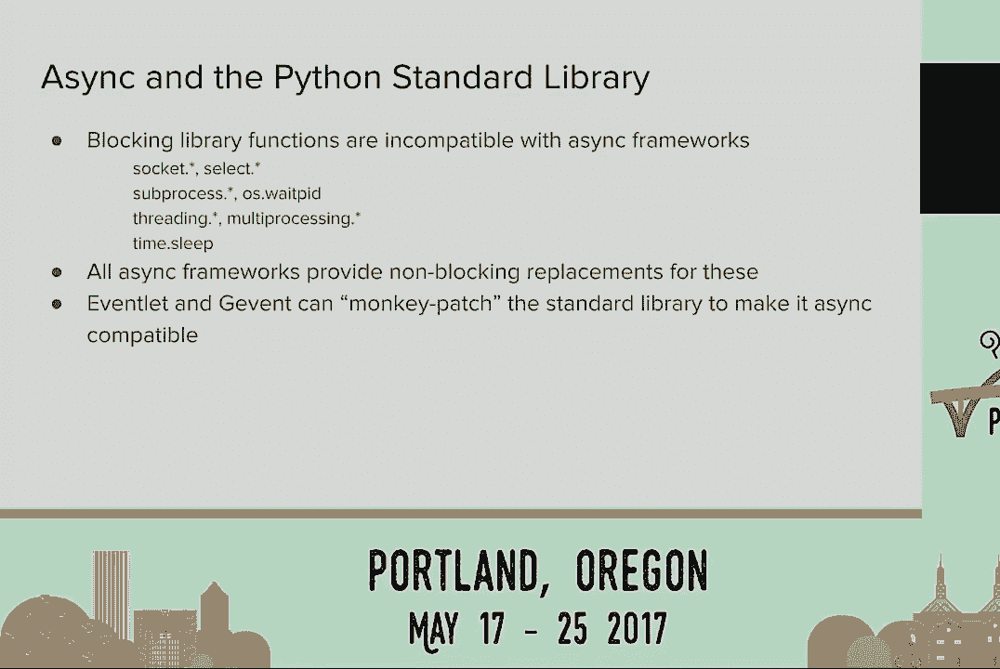
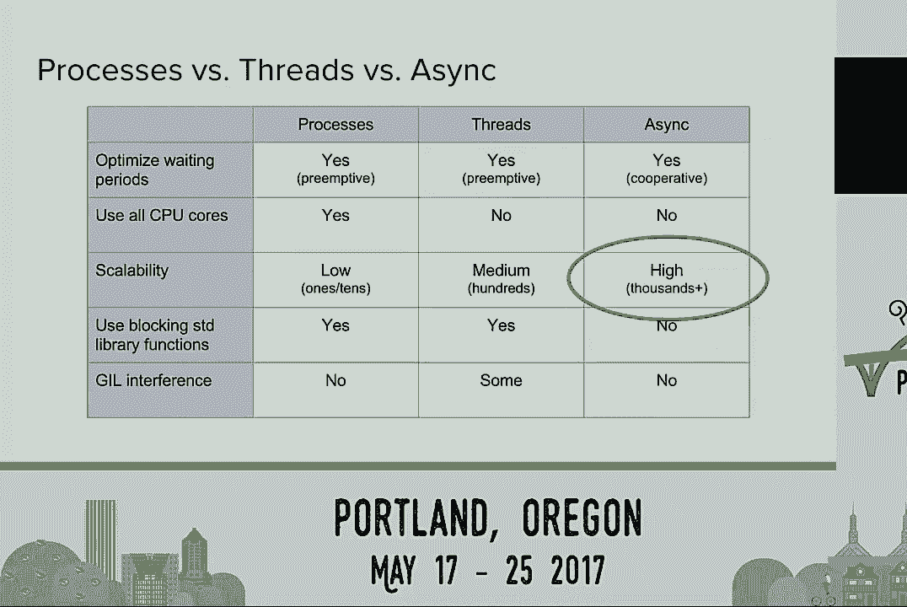

# P4：Miguel Grinberg   Asynchronous Python for the Complete Beginner   PyCon 2017 - 哒哒哒儿尔 - BV1Ms411H7jG

 Good afternoon everybody and welcome to our next presentation at PyCon 2017。 Before we get started。

 I would very much like you to encourage your electronic devices to not make any sudden noises。

 because when they do everyone stares at you。 With that said。

 I would like to introduce our next speaker。

 His name is Miguel Grinberg and he will be talking about asynchronous Python for the complete beginner。

 Please make him feel welcome。 [Applause]， Thank you very much。 It's a full house， no pressure。

 right？ [Laughter]， Man， why do I do this？ Anyway， so I'm going to get something out of the way。

 This is not a talk about flask。 I'm not going to talk about flask。

 I'm going to mention flask less than ten times。 I'm going to try at least。 Okay？ So great。

 Something that maybe you don't know in addition to all the work I do with that framework that。

 I cannot say， I also have an open source project that is an asynchronous server for the socket。

 aio protocol。 That started as an extension to that set framework but then it grew on a life of its own and。

 now you can use a standalone or with other frameworks like Django， et cetera。

 So I see a lot of people having problems working with asynchronous code。

 So I'm going to start with a question。 How many of you have heard people say that async makes your code go fast or really very。

 fast？ Okay。 So out of those of you that heard this but want to know why or don't understand how is。

 that possible？ So this is the talk for you。 I'm going to try to explain it in very simple terms。

 At least I'm going to try。

 So I'm going to start with a super simple definition。 We're going to build on this later but async。

 I mean it is in a generic term。 I'm not specifically talking about async。io。

 That's not the only way to do async。 But that is one way to do concurrent programming which means doing many things at once。

 Okay？

 So let's go through the few ways that we have an impact on to do multiple things at once。

 So the most obvious way is to use multiple processes。

 From the terminal you can start your script two， three， four， ten times and then all the。

 scripts are going to run independently all at the same time and the operating system that's。

 underneath will take care of sharing your CPU resources among all those instances。

 When you're using CPython， right， the most popular Python， that's actually the only way。

 you can get to use more than one CPU at the same time。 This is the only way。

 So the next way to run multiple things at once is to use threads。

 And a thread is a line of execution pretty much like a process but you can have multiple。

 threads in the context of one process。 So they all share access to common resources， right。

 which is a headache。 That's why threads have such a bad frame， right？

 It's difficult to write threading code。 So the operating system again is doing all the heavy lifting on sharing the CPU。

 You don't have to worry about it when you write your Python code。

 And of course you know the global interpreter log。 In Python。

 this is a special -- special to Python when you have multiple threads running， code。

 the global interpreter log allows only one to run Python code at a given time。

 So basically you're running in a single core even though you may have two or four or more。

 So the third one is the topic of this talk， right， asynchronous programming。

 So to make the mystery even bigger， I'm going to tell you that the OS does not participate， here。

 The OS， as far as the OS is concerned， you are going to have one process and there's going。

 to be a single thread within that process。 But yet we can get multiple things done at once。

 So what's the trick？ So to try to explain this， I'm going to go thinking completely out of the box。

 I'm going to pull a real world scenario from the world of chess。

 So this is a very old photo。 The lady in this photo is a unit pugger。

 It's one of the best chess players in the world。 And what she's doing here。

 it's called a chess exhibition。 I'm not sure this is still being done these days。

 but it was pretty popular before computers， kill the fun out of chess by being so good at it。

 But when I was a kid， these were pretty exciting events if you were into chess。

 So basically she shows up at the event and then she plays a game of chess against lots， of people。

 everybody， normal people like you and I。 She usually wins all of them。

 But the whole idea is to play with a chess champion。 So what I'm going to do。

 imagine you need to run this event。 So I'm going to just do back of the envelope math here。

 I'm going to just pull some numbers out of nowhere。

 So let's say that there are 24 people showing up for the event。 So there are 24 games。 And you know。

 you did pull her， she's pretty good。 So she's going to come up with a move on average in five seconds。

 And the opponents are going to take 55 seconds。 So we get around a minute for a pair of moves。

 And let's say that for the average game there are 30 moves， which is a short game， but she's。

 going to cream everyone。 So it's going to be a short game anyway for most of them at all。

 So imagine you're going to do this the synchronous way。

 So for each game it's going to last 30 minutes， right？ Have an hour。 Right？

 So she needs to play 24 of these。 So she's going to be there playing for $12， right？

 Which is pretty bad， right， for her especially。 So in reality， these events don't run like that。

 right？ They do something else。 So what they do is they use a synchronous mode and it works more or less like this。

 She walks to the first game and makes her move， so five seconds， give or take。

 And then she leaves the opponent on that table thinking， but she doesn't wait。

 She's not waiting there for the opponent to make a move。 She immediately moves to the second table。

 And she makes a move on the second table。 And she leaves that opponent also thinking and moves to the third and the fourth and so。

 on， right？ So she can go out under room and make a move on all 24 games in two minutes。 Right？

 So by that time， she's back at the first game。 And the opponent at the first game had more than enough time to make a move。

 So she can make her next move on that game without waiting。

 Right？ So if you do the math， she can play the whole 24 games and win them in one hour versus 12。

 on the synchronous case。 Right？ So when people talk about asynchronous being really fast。

 it's this kind of fast。 Right？ We're not putting an implant on you that pull go to play chess faster。

 Right？ So she's optimizing her time so that she doesn't waste time waiting。 Right？ Makes sense？

 That's a secret， by the way。 That's the complete secret。 So that's how it works。 So in this analogy。

 you did Paul Gar， the chess champion， will be our CPU。

 And the idea is that we want to make sure that the CPU doesn't wait or waits the least。

 amount of time possible。 And it's always finding something to do。

 So now I can tell you a more complete definition。 This is still mine。

 I'm just inventing these definitions。 I didn't take them from anywhere。

 But asynchronous programming is a mode in which the tasks that are running release the。

 CPU when they enter a waiting period。 And then that allows other tasks that need the CPU to run while the first task waits。

 And basically that's the secret。 But you probably want to know a little bit more。

 How can you do that with one process and one thread？ So you need two things， basically。

 The first thing that you need， which sounds awfully difficult， is to have a function that。

 can suspend and resume。 We want the functions that are in our asynchronous program to suspend when they enter a wait。

 And then when that condition that generated the wait ends， we want to resume those functions。

 from the point where they were suspended。 So sounds difficult。

 but actually I counted four ways in which you can do this in Python， without operating system help。

 And those ways are callback functions， which are gross。

 I'm not going to even show an example of that because they're pre-gross。

 But three ways that are a little bit more decent are using generator functions， which is a。

 Python feature from years。 It's been there for a long time。 In more recent Python， 3。5， a nap。

 there's a async/await keywords that you can use for， that。 And then finally。

 there's a third-party package called greenlet that actually implement this。

 as a C extension to Python。 And you can install that with pip and it gives you another way to suspend and resume functions。

 So that's the first part。 So now we can suspend and resume。

 The next thing that we need is we need a piece of code that can decide how the CPU is shared， how。

 you know， which function gets the CPU next。 Right？ So we need a scheduler of sorts。

 And in asynchronous programming， this is called an event loop。 So we're going to have an event loop。

 It will know all the tasks that are running or that want to run。 And then it will select one。

 It will give control to it。 And then that task is going to suspend when it needs to wait for something。

 And control will go back to the loop and the loop will find another one。

 And that's -- it will keep going that way until the script ends。

 So this is called cooperative multitasking。 It's a thing， you know， from many years ago。 I mean。

 the very old versions of Microsoft Windows， for example， or Mac OS did this。 So it's an old idea。

 So anyway， that's how it works。 So I created a bunch of examples to show you how this looks in practice。

 I'm not going to have time to show all of them， but if you go or say that link， you。

 can see more examples that I created that I'm not going to have time to show here。

 But I'm going to show a few here。 So this is a super simple test that I created。

 Let's say we want to write a little script that prints hello， waits three seconds， and。

 then prints world。 Okay？ So this is how you will do it in normal Python。

 You will print the first text， then sleep for three seconds， and then print the second， one。 Right？

 So if I were to put a for loop on that hello at the bottom to run -- to call hello 10 times。

 for example， this is going to run not for three seconds， but for 30 seconds。 Right？ You know。

 each function implication will run and they're going to run back to back。

 So here are two examples that use async。io。 And you can see， you know。

 there's a little bit of boilerplate at the top to create one， of these event loops。

 And there's another little couple of lines of boilerplate at the bottom to run the asynchronous。

 function。 But ignoring that， you can see that in the function， we have here two ways to do this。

 suspension， so suspending a function and then resume it。 On the left。

 I'm using a generator function。 So generators are these special functions that typically you use in Python to generate。

 sequences of items。 And the nice thing about them is that you don't have to regenerate all the entire sequence。

 You can generate elements of that sequence as， you know， the person calling the generator， asks。

 So you can repurpose that using this yield or yield from keywords。

 And also use it for an asynchronous function。 And basically what we're saying on the example on the left。

 when we reach the yield from， we're， saying， okay， loop， I'm done for now。

 so I give you back control。 Please run this function for me that the one that follows the yield from。

 So I think I just sleep for three seconds。 And when that's done， I'm ready to continue。

 And the loop will keep， you know， it'll take note of that and then manage everything， because。

 it's a scheduler。 That's what it does。 So if I were to call this hello function 10 times。

 instead of running for 30 seconds， you， can see 10 hello's and then， you know。

 a pause of about three seconds and then you're， going to see 10 whirls。 Because， you know。

 doing that three second wait， the loop will find， you know， all the， other nine， right。

 it'll run one first and then the other nine eventually will get run。 Okay？ So in recent Python。

 there's an improvement。 You get a much nicer syntax， which you can see on the right， but， you know。

 functionally， these two are equivalent。 And you have the async def declaration。

 That's what you use to define a synchronous function。

 And then if you use that syntax to declare the function， then you get to use a wait for。

 the suspension and assuming。 So that's the point where things are suspended。

 And one of the things that async。io， I think it's great for is that it makes very explicit。

 the points where the code suspends and resumes。 You know。

 all those points where these magic of multitasking can happen。 But async。io is not the only one。

 There are a bunch of others。 Actually， I don't have time to tell you about all of them。

 but I wanted to mention the ones， that are based on the greenlet package that I mentioned early。

 And these two， these are G event on the left and event let on the right。

 You're probably going to have trouble finding where the loop is in this code。 And actually。

 you're probably going to have trouble finding what's the difference between。

 this and the synchronous Python example。 Right？ They look kind of the same。

 I don't know if you noticed， but the only difference is that the sleep function that I'm。

 using on these two is not the sleep function from the Python library。

 It's a different one that each framework provides。 But that's the only difference。

 And the goal of these two frameworks， which are very much alike， is to make asynchronous。

 programming transparent sort of。 And that could be a blessing and it also could be a curse。

 It depends on how you look at it。 And as an open source developer。

 I find that a lot of people get into this thinking that， it's all the same。 Right？

 I'm going to start doing whatever I do always。 And then things。

 weird things happen because they're not considering that this underneath。

 is running a loop and you need to make sure that you never block。 Because if you block。

 then you're blocking the whole thing。

 Which leads into the pitfalls。 This is actually I'm interested here in saying these things that I'm constantly answering。

 on the issues on my GitHub project。

 Because people always trip on these things。 And a pit full number one is that what happens if you have。

 you know， you probably have an， asynchronous program about maybe one task or a few of the tasks need to do some heavy。

 CPU calculation。 And the problem is if you use the CPU in your function for say one minute。

 then during that， minute nothing else will happen。 Because this is a single thread。

 So all tasks need to be nice to the remaining tasks and release the CPU often。

 So if you have an opportunity to wait， right， and nothing to wait for， what do you do？

 And what you do is to sleep。 Basically， you have to be nice and call sleep every once in a while in your function。

 As often as you can。 And if you're really greedy and you don't want to give up the time that you've got。

 the， best you can do is you can sleep for zero seconds。 Which is basically telling the loop。

 I'm going to sleep because I have to， I don't want， to but I have to。

 But please give me control back as soon as possible because I want to use the CPU。

 So basically you sleep zero。 And if your calculation has a loop which is pretty common。

 then you stick a sleep zero， inside that loop。 So once per iteration you allow other tasks to continue running。

 So this number one。 Now the big one， this is going to be a big surprise probably。

 There's a bunch of things in the Python standard library that are designed as blocking functions。

 So everything that has to do with networking， so reading， writing from network sockets。

 waiting on input or output from sockets， anything to do with processes， with threads。

 the sleep function that we've seen before， you cannot use them。

 So this is true for every async framework。 You cannot use these functions。

 If you use these functions， the thing is going to hang。 So don't use them。 Okay。

 It's very unfortunate。 It's like they want me to tell them when they ask about this， you know。

 I want to use them。 Well you can't。 So you can't。 So all async frameworks provide replacements for these functions。

 And sometimes that kind of sucks because you have to learn a different way to do the things。

 that you know how to do。 All these very common things that you do with processes。

 threads and networking。 Unfortunate， but it's true for async。io， true for event-led。 G-event。

 twisted， curio， you know， all of them。 They all provide alternative ways to do these blocking things。

 Now you remember the sleep function in event-led。g-event that was coded almost or actually is identical。

 to the Python one。 So the folks that developed event-led。g-event。

 they went other way to create all these alternatives。

 for the versions in a very compatible way to the ones in the Python library。

 And they have both this option to monkey patch the standard library。

 So basically they swap out the blocking functions from the Python library and they put their。

 own in their place。 So then you can take any piece of code that was designed to run synchronously and somehow。

 they inherit this asynchronous behavior。 And for many applications that's enough to get code that was assigned synchronously to。

 work。 But you have to use an in-led。g-event。 Now I'm going to save you guys time。

 Somebody is going to come later in the question period and ask how do I do this for async。io。

 And I'm going to say no， you can't。 You're not going to do this with async。io。

 I think that you're assigned as an async framework that doesn't try to hide the asynchronous。

 and the drug。 It wants you to design and write your code thinking asynchronously。

 which is a different， goal than these two event-led。

 So I'm going to summarize this with a little table。

 And this is probably going to be surprising to some of you。 So this compares processes。

 threads and async on a number of categories。 So maybe based on what I said so far。

 you think that these super cool， non-blocking， doing something while a task waits is exclusive to async。

 And that is not true。 Processes and threads can do that pretty well too。

 And it's actually not Python doing it。 In that case， it's the operating system doing it。

 So there's no winner here。 There's a slight difference。 In the processes and threads case。

 it's the operating system doing it。 In the async case， you have your async framework， async。io。

 G event， or so on。 They're doing it。 So it's cooperative for async and preemptive。

 which is called when the operating system yanks， the CPU out of you without you knowing it。

 But all of them can do it。 So there's no winner in this category。

 Now I already told you that if you want to maximize your multiple cores in your computer。

 then the only waste processes。 So this clear winner processes is the only option that can do that。

 And many times people combine processes with one or the other two。

 So they run a multi-threaded on an async program and then they run it as many times as。

 cores you have， which is actually a pretty good idea。 But the process is the winner there。

 So then we come to scalability。 This is an interesting one because if you're running multiple processes。

 each process will， have a copy of the Python interpreter and all the resources that it uses plus a copy。

 of your code， your application， plus all the resources that you use。

 So all of that is going to be duplicated。 So if you start going crazy and start new instances。

 you're going to find that pretty soon you're， going to reach。

 you're going to be probably out of memory。 You cannot run a lot of Python processes on a normal computer。

 So scalability is pretty low。 I would say in the ones or the tens， but no more than that。

 If you go to threads， threads are a little bit more lightweight than processes。

 So you can instantiate much more threads than processes。 So that's better。

 You can scale a little bit better。 If you go with async， async gets all done in Python space。

 There's no resources at the operating system level that are used。

 So these are extremely lightweight。 So this is the clear winner。

 async can go in the thousands or tens of thousands even。 So this will be a good reason to go async。

 Now we have the bad news of using the blocking functions in the Python standard library， which。

 processes and threads can do no problem because the operating system knows how to deal with， those。

 But when we lose the support of the operating system in async， we cannot use those functions。

 and we need replacements。 And then last， the global interpreter lock。

 we know it causes some trouble with threads。 In my experience， though。

 it's not that bad when you have the types of applications that， are good for async。

 which are heavily I/O， because unlike some people think， if you have。

 threads that are blocked on I/O， they don't hold the global interpreter lock。

 So if a thread goes to wait， then the operating system will give access -- will be able to。

 give access to another thread without any problems。 So really， it's not that great。 I mean。

 there aren't that many things that are better for async。 It's that， right？ That's it。 So basically。

 the closing statement that I would like to make is that really the best。

 argument to go async is when you really need massive scaling。

 So these will be servers that are going to be very busy。

 Lots of clients want to handle lots of clients without going bankrupt in buying hosting， right？

 So async can do that really well。 It can go into thousands or the tens of thousands of connections。

 And it's like nothing。 It's not a problem。 Which threads cannot get there and even less processes。

 Any other categories， it's not really clear that you should go async unless you like it。

 And then it's a totally valid framework to develop your applications， right？ So if you like it。

 you like it。 There's nothing to say against that。 So this is pretty much all I have。

 It looks like I did good time， right？ So just going to be time for questions。 Looks like。 Thank you。

 [Applause]， >> Thank you， Miguel。 Are there any questions？ Yes， we have one here。

 >> So my question is， is it possible to schedule a new schedule？ Are there any questions？ Yes。

 we have one here。 >> So my question is， is it possible to schedule asynchronous operation from multiple threads？

 >> You can run a loop。 You can run multiple loops， right， in different threads。

 >> So each loop is per thread， right？ >> Correct。 >> They don't go together in the same bucket and then get to the end。

 >> Then you have to use normal threading synchronization mechanisms if you need， you know。

 the thread， tasks that are running under one loop to somehow coordinate with the other。

 It gets pretty nasty， to be honest。 >> So pretty much it gets affiliated to that thread。

 >> That's correct。 >> That's correct。 >> Yes。 Yes。

 because most of the times you have only one thread。 So yes。 >> All right。 Thank you。 >> Yep。 >> Hi。

 Miguel。 Thank you for that talk。 I was hoping if you can give me some help trying to conceptualize this in like a stack frame。

 all this magic that happens not necessarily just with async but generators and everything。

 in general。 How do you--， >> Well， the generators， they're a Python feature， right？

 They already support the， you know， saving the context when the generator function calls。

 the yield or yield from keyword。 It basically returns。 It does sort of a partial return。

 It returns a value and control goes back to the loop。 And then the loop can call that again to。

 you know， to make that function to do a little， bit more work。

 which is exactly what you do when you write a generator function。

 You basically-- you have a function that returns partial values。 Every time you call it。

 it does a little bit more work and returns another-- you know， another value and another result。

 >> Okay。 >> Does that make sense？ >> One additional question。 >> Yes。

 >> In an architecture where you spawned off multiple processes of the async workers in， say。

 for a server， how do you， like， the socket binding， how would that work across the different。

 processes？ >> It's only one thread that will have a really large number of connections。

 >> But if I have the same port that has to go through multiple processes and each of。

 them have a single thread of async。 >> There are multiple ways to do it。 So for example。

 you can have a something like NGINX， a reverse proxy in front。

 So then you say you have four processes。 They could be listening on different ports， right？

 Four ports， say。 And then NGINX， you know， consolidates that and then reverse proxy into all these backend。

 async processes。 That will be one way。 >> Thank you。 >> Does that make sense？

 >> How much more imprecise is an async sleep command than time。sleep？ >> More。

 >> Could it be like seconds more or are we talking about a couple of milliseconds？

 >> This is all cooperative， right？ So really your task depends on how the other tasks that are running at the same time behave。

 If you have a rogue task that， you know， that's a lot of computation and doesn't return。

 to the loop as often as it should， that's going to affect your timing。 So yes。

 And that's actually the problem that I see most often is that， you know， people forget。

 that they're doing async and there's some task that does something that blocks and that。

 stops the whole thing for everybody。 So yes， imprecise？ Sure。

 You need to make sure that all the tasks are well designed for async。

 >> We have time for one more short question。 >> So I guess my question is related to the one that gentlemen asked previously。

 So actually in JavaScript， one of the issues is we used to leave， say， for 10 seconds。

 It's actually at least 10 seconds。 So I guess in Python。

 they have the same issue when I want to sleep a certain callback for， 10 seconds。

 it's still at least 10 seconds。 Is that right？ >> It depends on which--， >> Yeah。

 it depends on the other items in the queue。 >> So as I said before。

 the sleep function is going to be implemented by the async framework， that you use。

 So async IO implements sleep and then G event implements sleep in a different way， the wrong。

 way and every framework does it in its own way。 And you can have to find the best async framework if you are concerned about that。

 You need to find the one that is more accurate。 But in the end， it's cooperative。

 So it depends on all the tasks being nice to each other。 If you don't have that。

 then this doesn't work。 >> Well， I guess in JavaScript， at least。

 the guarantee that we will be at least 10 seconds。 >> Yeah， and you get a guarantee of that sort。

 But exact times are heavily dependent on how the tasks return to the loop。

 >> I think this feels like a discussion that could be continued out in the whole way。

 Many thanks to Miguel。 >> Thank you。

 [APPLAUSE]， [BLANK_AUDIO]。

