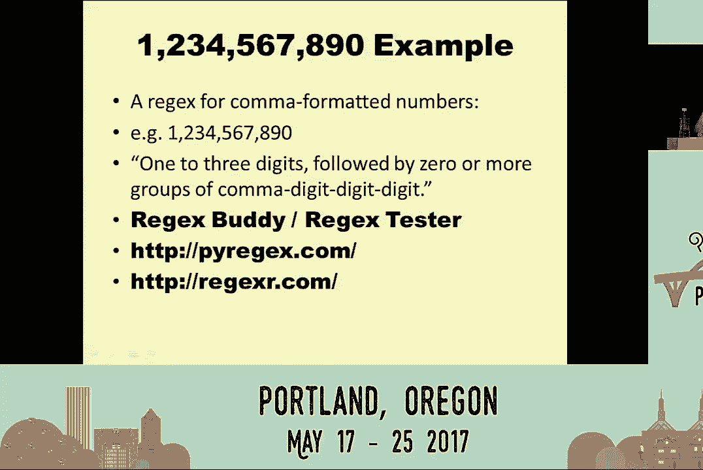
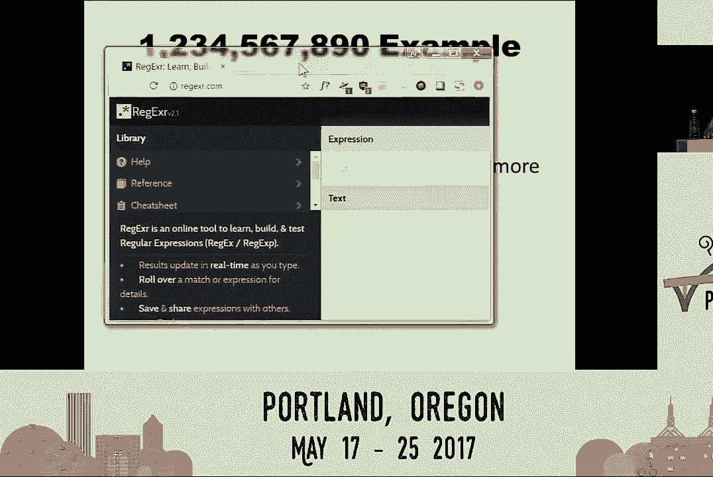
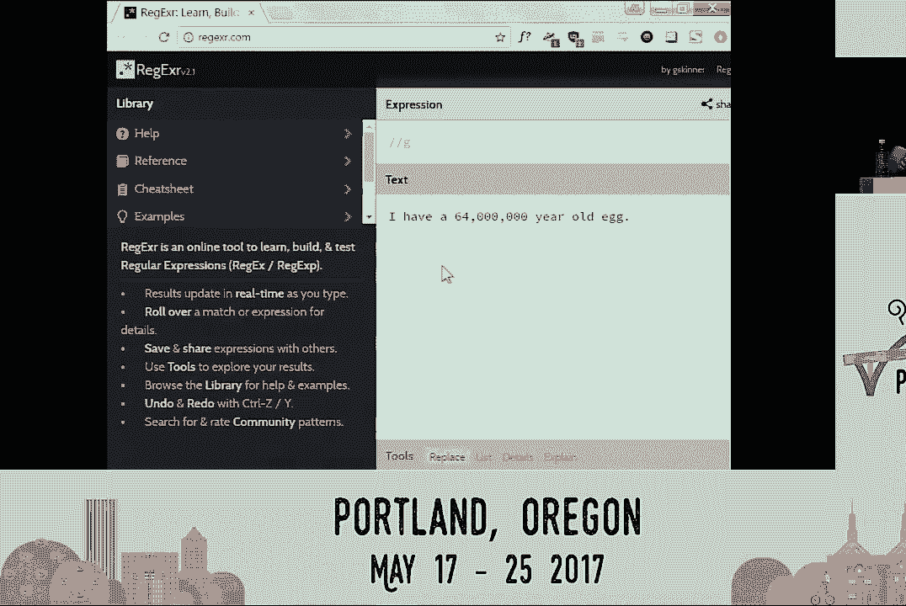
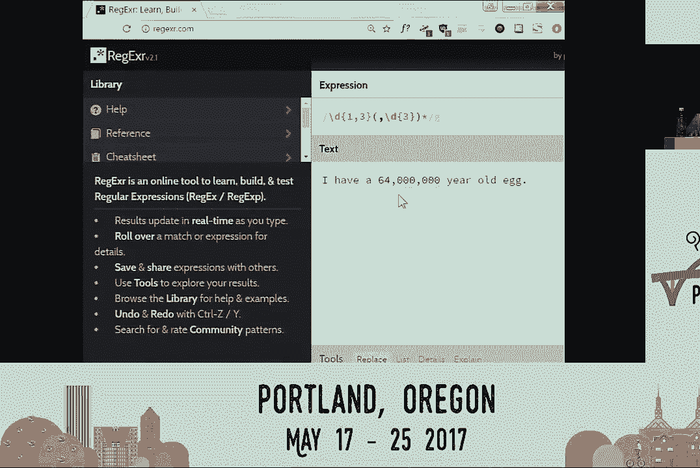
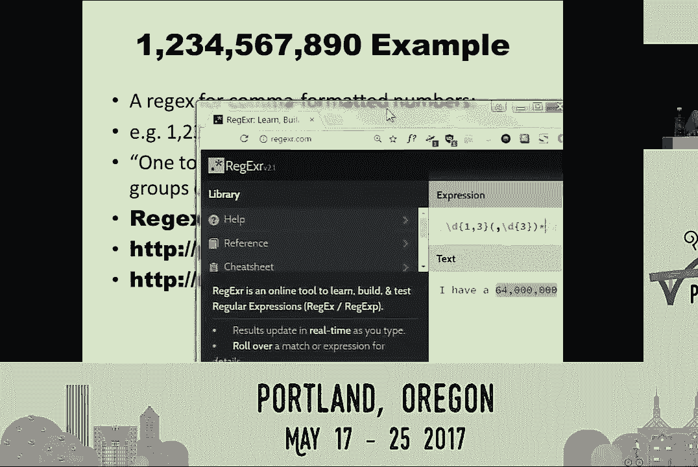
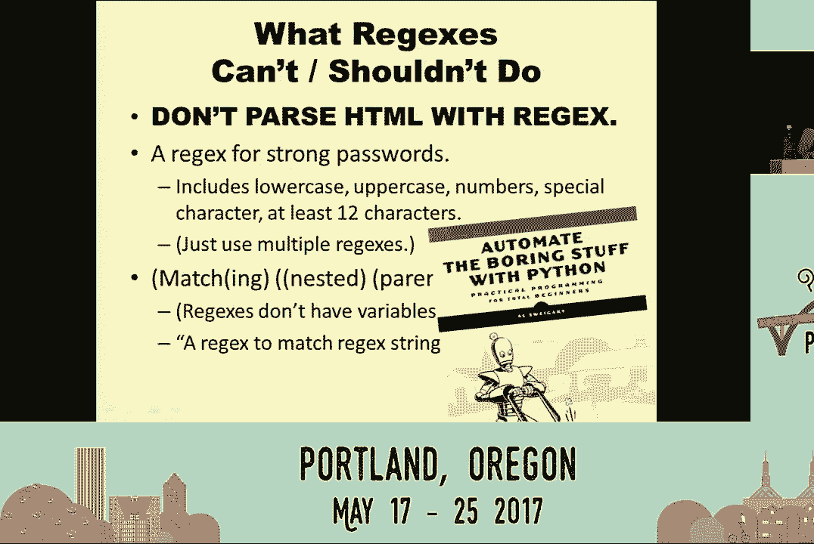
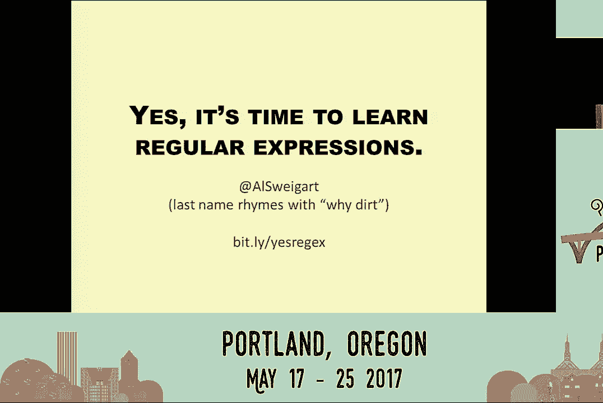

# P7：Al Sweigart   Yes Its Time to Learn Regular Expressions   PyCon 2017 - 哒哒哒儿尔 - BV1Ms411H7jG

 So good afternoon， everyone。 We now have El Swigardt， who will be talking on， yes。 it's time to learn regular expressions。

 [Applause]， Hello， hi。 I'm El Swigardt。 I'm probably best known for writing Python books。 including one called Automate the Boring， Stuff with Python。 which is released under a Creative Commons license。 So you can read this online for free。 You can check out the book and also my slides from bit。ly/yesregics if you want to follow。

 along with the slide deck。 I really encourage you to release your own content under an open license like Creative。 Commons。 One of the benefits that I have is that I can take a look at my web traffic and I noticed。 that the regular expression chapter in this book has a lot of traffic， so I thought， hey。 this would be a good idea for a talk。 So regular expressions are kind of this intimidating topic。

 A lot of software developers pretty much put off learning it for most of their careers。 It seems really cryptic。 There's a bunch of weird punctuation marks that have special meaning。 It can be kind of hard to learn。 In fact， just 20 minutes before this talk。 I overheard somebody in the hallway say this， quote。 So I had to update my slides with that。

 But in general， regular expressions are really powerful if you have to do text pattern matching。 And I really encourage you to learn them。 And so yes， it's time for me to start this presentation。 which is entitled yes， it's， time to learn regular expressions。 So the first thing that you'll learn is that they're also called red checks for short。

 So here's two numbers， actually it's one number and one of these numbers is a phone number。 and the other is the population of Asia。 So which one is which？ Well， if you're like me。 you've memorized every single American phone number that exists。 and you can tell that that top number is one of them。 No。

 that's not how you actually do that at all。 You know it's a phone number because you know a phone number when you see it and you know。 it when you see it because you know there's a specific pattern that all American phone。 numbers follow。 It's a few digits for the area code with dashes in the middle of it。 So that's what regular expressions do。 You can specify a pattern of text that you're looking for even if you don't know the exact。

 numbers or the exact text that you're looking for。 And it's really easy。 Python makes this really simple。 It's just about three lines of code。 The first is to import the regular expression module which is import re then you want to。 call the compile function and pass it your regular expression pattern that you're looking。

 for then you're going to call the search method on the regular expression object that that。 returns and you have pass it the haystack string。 I call it the haystack string。 If you're looking for one string inside of another I say you're looking for the needle。 string inside the haystack string and that's going to return a match object and you call。

 the group method on that and that will print out the exact text that you're looking for。 So did I say three lines？ I meant four lines。 But it's still basically just three lines of text。 Compile search and group。 And also if you're busy scrambling to write all of this down。 Remember you can download these slides at bit。ly/yesrejects so just calm down。

 Stop taking notes and listen to my soothing voice。 Let's focus in on each one of these parts。 So starting with compile and this regular expression string of the pattern that you're。 sending to compile。 This is the main complicated part of Python's regular expression figuring out the syntax。 for this。 So let's go back to that phone number example。 What exactly is a phone number？

 How do you know a phone number when you see it？ Well it starts off with a digit character which is one of the ten numerals zero through。 nine followed by another digit character and another digit character and then a dash and， so on。 So we need to translate this into a regular expression string in the regular expression。 syntax and that's what we're going to pass to compile。 Remember there's compile search and group。

 So we're going to use /d which is the regular expression syntax for a digit。 We want to pass this as a raw string because otherwise if you don't have a raw string you're。 going to have to escape that slash and you're going to have all of these slashes in your regular。 expression string so I tend to like to send raw strings always to the compile function。

 So this /d will match a digit character and our phone numbers are going to have three。 of these for the area code followed by a dash and so on。 This is the regular expression string to match a phone number。 After that we get the regular expression object and we can call search on that and pass it。

 our haystack string。 This is the string that we're searching for that pattern we're looking for and it will。 return a match object and it will return a match object if it finds the pattern otherwise。 it will return none。 So we have to check if the match object is none or not and when we call group on that。 match object remember compile search group that's going to print out the actual text that。

 matches the regular expression pattern that we were looking for just like that。 Now this seems I know I said that oh it's a lot easier than you think。 This is still kind of complicated remembering compile search group。 If you're just calling the find string method that's a lot more straightforward it's just。

 one line of code but imagine if you didn't have regular expressions to do this find phone。 number example you would have to write Python code that looks like this which isn't that。 hard to follow but it's a lot of it and it's really gnarly and phone numbers are actually。 pretty simple patterns once you get into really much more complicated regular expressions the。

 Python code that you would have to write to do the same thing as a small regular expression。 would just explode across pages and pages of text and we don't want that。 So let's examine that slash D thing that I was talking about earlier that that matches， a digit。 This is something called a character class it's it represents a range of characters or a。

 class of characters that you're looking for and slash D is the one saying I'm looking。 for a digit one of the numbers。 There's a few other character classes there's slash W for word characters this is letters。 and numbers and I believe also the underscore character there's slash S for space characters。 like space and tab and new line and there's also the capitalized versions of these for。

 everything that's not a digit or not a word or not a space character。 Character classes are how you specify what exactly you're looking for so whenever you're。 searching through a string try not to think of the actual semantic meaning of whatever。 text you're looking for just consider that string to be a sequence of symbols that you're。

 looking for and these character classes match a certain group of symbols。 You can also create your own character classes by putting a bunch of characters inside the。 square brackets so if we wanted to say create a character class that matched all the vowels。 in the English language we just type a e i o u in lowercase and uppercase inside the square。

 brackets and now we have a character class matching vowel characters we can also do the。 same thing as the uppercase version of those previous character classes by just adding a。 character to the very front of this character class and now this is matching everything that's。 not a vowel character so that's going to be consonants it'll also be something like punctuation。

 marks or numbers that's something that you have to keep in mind it's everything that is。 literally not those 10 characters and we can also have ranges of characters if you want。 to match say all 26 letters or all 10 numbers or all or both of those things you can just。 use a dash character to have say zero dash nine and that's going to be all 10 characters。

 and this character class basically does the same thing as the slash w character class it's。 matching all the numbers and letters so in these examples we had the character at the。 very beginning or those dash characters we're not literally looking for those characters。 punctuation marks in regular expression syntax tends to have very specific meaning so if。

 we're actually looking for any of these punctuation market characters just be sure to escape them。 with a backslash in front of them so if say we want to create a character class that matches。 open and closing parentheses we can just add a slash character in front of those parentheses。 and now we have a character class that matches the set of parentheses either the opening or。

 closing characters so character classes as I said this is what you're looking for inside。 of your regular expression is how you tell python I'm looking for these characters you。 can also specify a quantity of these characters we kind of did this with a phone number example。 just by repeating the slash D's over and over again but there's a shortcut for this you can。

 use curly braces and a number in between the curly braces to say hey I'm looking for three。 of these digit characters followed by a dash and so on for the rest of the phone number。 example this matches the exact same thing as the previous regular expression but it's。 a bit more compact and here's the pattern that we're following right here we have slash D。

 that's the character class that's what we're looking for coming first and then after that。 we have the quantity that we're looking for you're going to see this repeated over and over。 again what we're looking for and the quantity that we're looking for and that curly brace。 three for matching three of the thing that it comes after is really handy but there's。

 a bunch of these others and there's a huge list of punctuation marks you don't actually。 have to memorize these very few people do memorize these you'll just end up going back。 to a cheat sheet or looking them up in the documentation but you have all these punctuation。 marks that mean things like hey I have slash D I'm looking for a digit and the question。

 mark which means I'm looking for zero or one of these digits or the plus sign that means。 I'm looking for one or more of these digit characters you can change the character class。 that you're looking for too and suddenly it's you know I'm looking for zero or one space。 or I'm looking for one or more spaces or use your own character classes like we did with。

 our vowel example now we're looking for zero or one vowels and one or more vowels all those。 punctuation marks you don't have to memorize them right now just remember we have character。 classes at the first part that's what we're looking for followed by the quantity and now。 if it's something completely different so Japanese words are composed of letters and。

 Japanese letters usually follow this consonant vowel combination so take a Japanese word like。 Sayonara it's made up of four letters each of those are a consonant and vowel it's a。 consonant vowel consonant vowel it's following that pattern we can create a regular expression。 that will then match this remember we have a character class for matching vowels and then。

 we also have that carrot one for matching that everything that's not a vowel technically。 this will match not just consonant letters but also numbers and punctuation marks we'll。 just ignore that for right now but anyway say we wanted to match a Japanese word which。 is made up of several of these Japanese letters we can have the plus sign that means one or。

 more of the thing that comes before it but technically this isn't going to work because。 remember it's just going to match only one of those consonant patterns we need to specify。 how many of those that we want to match but we also sort of want to group these together。 so this regular expression is going to end up matching something like but so it's a consonant。

 character followed by a bunch of vowels and it doesn't have to be the same vowel it can。 just be any vowel that's the character class that we're looking looking for one or more。 vowel characters I'm not even going to attempt to pronounce this word but what we want to。 do is sort of just group together that consonant and vowel together and then have the plus sign。

 mean one or more of these things so we can use parentheses to group these together and。 form just sort of one giant character class out of all these other character classes it's。 still the same thing we're specifying what we want to look for followed by how many of。 them that we want to look for so this is going to match something like sa sa sa sa sa sa sa。

 sa sa sa or it'll match an actual Japanese word like Sayonara so this would be a pretty。 good point for me to thematically end my talk on Sayonara but actually there's a little。 bit more we're going to go into just a small example right here with red jacks is for a。 comma formatted number so if you're an American you usually split up your numbers into groups。

 of three with a comma in between them in between them so let's create a regular expression for。 this we have to figure out what exactly it is that the pattern that we want to match here is so。 it's generally going to be something like one to three digits for the lead part and then followed。 by groups of these sort of comma and three digits afterwards and we'll have you know zero or more。

 of those groups so a number like 12 is going to have zero of those comma groups because there's no。 commas or a number like 12，000 we'll have one of those groups and I could just sit here and show。 you the regular expression for this but there's actually a lot of nifty tools online that you can。 try out these are called red jacks buddy websites or red jacks tester websites and now I'm going to。

 do something that is highly ill advised for anybody doing a presentation and that is a live demo in。 which anything can go wrong especially one that requires using the internet so hopefully the。

 Wi-Fi is going to hold and I can just use this website so this is red jackser。com technically it's。 using JavaScript style regular expressions but regular expressions across multiple programming。 languages are so similar that it's going to work for Python as well so let's let's try out let's say。 I have my text I have a 64 million year old egg and we want to find a regular expression that。

 matches let's see how much I can move this not that okay there we go I want to write a regular。

 expression that matches that comma delimited number so let's see what was this this was a digit and。 then I want between one and three of them so I'll try a curly brace one comma three and you can see。 as I'm typing in real time these websites are going to update and show you exactly what they're。 what they're matching so these are great if you're trying to construct a regular expression and you。

 sort of want to just build it up step by step it's a lot easier than just running your code seeing what。 it matches then trying to go back and change it this is a much more direct method so let me。 finish this up let's see we're gonna have that group of the comma three digit things so I'll need a。 nurse slash D and then a three afterwards oh wait great and I can see well oh this isn't quite working。

 because it's not matching everything right here and then we'll remember oh right I wanted not one of。 these comma groups but zero or more so I'm gonna add a star to mean zero more and I can see okay it。 matches the comma delimited number all right hey I got through the entire live demo and nothing went。

 wrong whoo yes live demo completes every time I do a live demo in a talk I feel like I'm like。 angering the live demo god who's going to start chasing me from conference to conference waiting for。 me to let my guard down and just ruin the next live demo I try right not today okay next pipes this is。 a way that you can sort of provide alternate groups to choose from and the example that I want to use is。

 let's say we want to create a regular expression to match sentences of Monty Python words and Monty Python。 words I'm gonna use underscores instead of spaces just make them more visible and just to make it easier。 and more consistent all the Monty Python words always end with an underscore but Monty Python words。 will be something like egg and spam or egg bacon and spam or egg bacon sausage and spam or spam。

 egg spam spam bacon and spam that one only has a little bit of spam in it so you might think okay。 let's create a regular expression we're gonna call compile that's the first step of compile search。 group and let's see we'll put these in a group for each word and we'll have that plus sign to mean。 one or more of this so we're gonna match one or more egg and one or more bacon except that's not。

 gonna quite work because what if bacon comes before the egg and what if sausage comes before egg or。 bacon or something like that this isn't actually going to work as a regular expression we just need。 some way of choosing one or another and we kind of do this if you think about it with character classes。 character classes say hey we're gonna match a or e or i or o or u except character classes only。

 work with individual characters we'd rather we want to match groups saying egg or bacon or sausage。 etc so we can do that with the pipe character which means or if you've ever programmed in a language。 like javascript or something else they also use the or character for the boolean or operator so it's a。 bit easier to remember that way so you can just put the pipe character in between these groups to say。

 i want to match egg or bacon or sausage or and or spam and then put all of those groups into one。 giant group and then add a plus sign at the end so that it's matching one or more of those and that。 will match something like spam spam spam spam spam spam really stop sounding like a word if you say。 it over and over again and the last bit that i want to cover you've actually this is pretty much all。

 you need for the basics of regular expressions character classes quantities groups pipes that's。 essentially it this thing regular expressions that you've been putting off learning for years and。 years and years it's actually not that bad the rest of this stuff is just gravy but it's pretty。 cool i really love this the dot which basically means match any character except for the new line。

 this is great because it's a great character class you can also set a flag so that also includes the。 new line but you can combine it with the star character from several slides back that means zero or more。 and when their powers combine they form the dot star which just means match whatever there's a second。 one to this that is dot star question mark which means match the least amount of whatever because。

 dot just means match whatever character and we're looking for zero or more of whatever so you can。 match whatever this is great you can use this in a string like looking for text angle bracket in。 between the angle brackets angle bracket this looks a lot like html and so let's say we want to get a。 regular expression that matches this html like text that's pretty simple we can just have。

 angle bracket dot star question mark angle bracket so we're just looking for whatever text in between。 angle brackets the least amount of it and then that would match a string that's sort of like。 angle bracket to serve humans angle bracket but remember there's the one with the question mark。 that's the least amount that's the non greedy version and then there's just dot star which is。

 the greedy version it's going to try to match the longest bit of text and that's when you find out。 the dark secret that really the string was angle bracket to serve humans angle bracket for dinner。 angle bracket ooh plot twist and the reason this happens is because dot star the greedy version is。 going to match the first part to serve humans and that technically matches the pattern that it's。

 looking for but dot star is going to continue looking forward to see if there's an even larger。 string that it can match so if you want to match the most amount of text for this pattern you can use。 dot star and the least amount you can use dot star question mark that's pretty much it the you now。 have this solid foundation you can go into the python documentation and sort of look up all the。

 rest of the neat little tricks that you can do with regular expressions i kind of just want to end。 on some best practices some limitations to regular expressions the first of which is really important。 and that is don't ever parse html with regular expressions i know i went back into this slide。 and said hey that looks like html don't actually do that with regular expressions you'll end up。

 creating a regular expression that sort of matches html and then you'll realize oh wait it also needs。 to be case insensitive so then you change it a little bit and then you realize oh wait there's。 some attribute that's out of order or something weird like that and you'll have to change the。 regular expression um you'll end up making a regular expression that doesn't really match html instead。

 what you should do is use an html parsing tool like beautiful soup that module same thing with。 jason you want to use a jason parser to match jason text um the second thing is uh i used to use。 this as a interview question come up with a regular expression that matches a strong password you know。 something that has lowercase and uppercase letters and numbers and special characters the regular。

 expression to do this turns out to be this huge giant thing especially because you have to get the。 all possible orderings of lowercase and uppercase and numbers and everything and it's really awful。 um if your regular expression starts blowing up into this giant thing that's probably a good。 uh time to just break it up into smaller regular expressions you can just use multiple regular。

 expressions on the same bit of text something that looks for a lowercase letter something that looks。 for an uppercase character uh and then finally this is kind of going into the computer science of。 regular expressions and regular languages um matching nested parentheses regular expressions can't do。 this matching parentheses rely on having the same number of open and closed parentheses they have to。

 be in a certain order and uh technically regular expressions aren't Turing complete which is a。 computer science term that i'm just gonna gloss over but you can think of this it has regular。 expressions aren't programming languages they don't have flow control or loops or variables or。 things like that and the reason i know this is because at my last job we were doing a code review for。

 some web app and the user can type in a regular expression into the text field and we wanted to。 validate that make sure they were typing in a valid regular expression and a co-worker said hey。 can you actually come up with a regular expression that matches regular expressions and i leapt forward。 and said no you can't because regular expression strings uh have groups which require nested parentheses。

 and that requires a stack data structure which means it mean it requires a context-free grammar。 and that's beyond the capabilities of regular languages and i was so excited because it was the。 only time i've ever used my computer science degree for something in the real world。 um but yeah so that's just some best practices with regular expressions uh they do have their。

 limitations but they are so incredibly powerful and useful to have so i definitely encourage all of。 you to keep reading about it you can find more in the python documentation i also have them in。 the in the chapter in automate the boring stuff with python which you can read for free online。 but i really advise that you go ahead and whatever you do find out more about regular expressions and。

 use them because yes it is time to learn regular expressions thank you very much。 so do we have time for questions yes i guess line up at the microphones。 so we do have time for some questions so if you have some questions please line up here。 and please keep the questions short and simple because we have only five minutes left so yep。

 hello hey i was wondering if you have a good use case for look-aheads。 i do i remember um so one of the fancy things that you can do with regular expressions。 wow i've been saying regular expressions a lot today one of the things that you can do with them。 is not only find but also find and replace um so let me。

 let's say you had some texts like agent alice told agent bob the in the info。 um so look-aheads are basically when you want to use the pattern that you found in a regular。 expression later on in that same regular expression so let's say you wanted to do something where。 you want to find every case of the pattern the word agent followed by some uh some other name。

 you know and then using this space as telling it when to stop and you wanted to replace it with。 just star star star but keeping that first letter so this is sort of redacting it with a find and。 replace using regular expressions um this is the example that i use for using look-aheads which。 i'm going to mess this up i know let's see you would basically be looking for agent and then。

 let's see slash w i guess one or more of these， oh haha that's why everybody's looking at me weird there we go oh now i can't see there we go um。 yeah we're looking for like agent alice and we want to find this text and then replace it we can。 use that group that's the first group that we found so we would replace it with this text agent。 slash one i believe meaning just use the text of the first group oh wait no i would want that first。

 character so that's in our group followed by the rest of that name。 let me see if i got this right um and so this is called a look-ahead it's where you use slash one。 slash two to refer to the groups of characters in your regular expression pattern that you've。 matched before um yeah anyway let's move on to the next question so um in an API that i'm well my team。

 writing uh we we use regular expressions and we need a negative look behind and python only seems。 to support fixed worth fixed worth groups um so in your pattern if you do like something and something。 or something or something you will have to be the same width which seems bizarre to us um so our。 our solution is to just shell out the graph and do it properly in a proper。

 oh yeah proper regular expression and the application so do you have any other ideas uh i mean that is。 one way of doing it there's so there's slight variations between different languages and different。 command line tools in how they handle regular expressions especially the more advanced features。 like these look-ahead things um basically if you find something that python can't do you could find。

 other regular expression modules uh if you really really need that behavior there's other regular。 expression modules on pi pi that you can download um do we have time for more questions or are we out。 hi uh this question may be against the general spirit of your talk to learn regular expression。 is there a tool that lets you uh accept that before version and after version of a text and。

 suggest the regular expression or suggest some of the regular expressions you could come up with。 to do that that's kind of a sort of the exact project that i wanted to work on during the sprints。 was uh this was gonna be like a learning tool for uh where you can type in a regular expression and。 i'll just start spitting out some example strings of what it could potentially match um i from the。

 brief look that i did around the internet for a tool like this i haven't been able to find anything。 that does something like that but that's a great idea somebody should make that or you can help me。 make that during the sprints wait for that thanks thanks uh do we have time for one more question。 yeah hey this is just uh this is uh intellectual vandalism uh how would i handle so you're saying。

 it's not a question oh yeah it is okay we have time go ahead you're the last person how do i handle。 Unicode uh oh wait unit unit code oh Unicode right so no no go answer save it for later。 yeah so i think i've tested this out and uh python's regular expression module does handle。 Unicode i think i know this because i have uh this lod。exe program i made which copies the look of。

 disapproval emoji uh to my clipboard so i can just paste it uh oh wait i've already erased that but。 i tried pacing Unicode characters and just all sorts of weird stuff in and it seems to work just。 fine so bravo python yeah uh well i've tested that in python 3 anyway i'm not sure who knows with python。 too but yeah anything else oh that's it all right thank you very much。

 so thank you all for your great talk。
