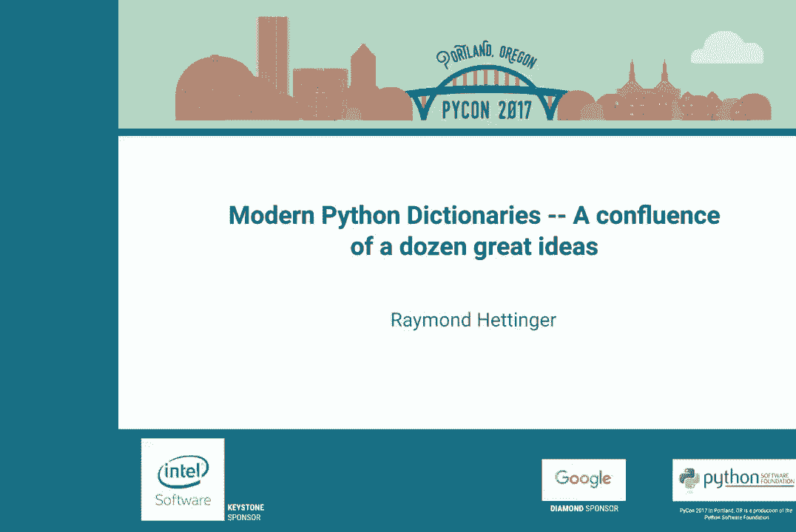
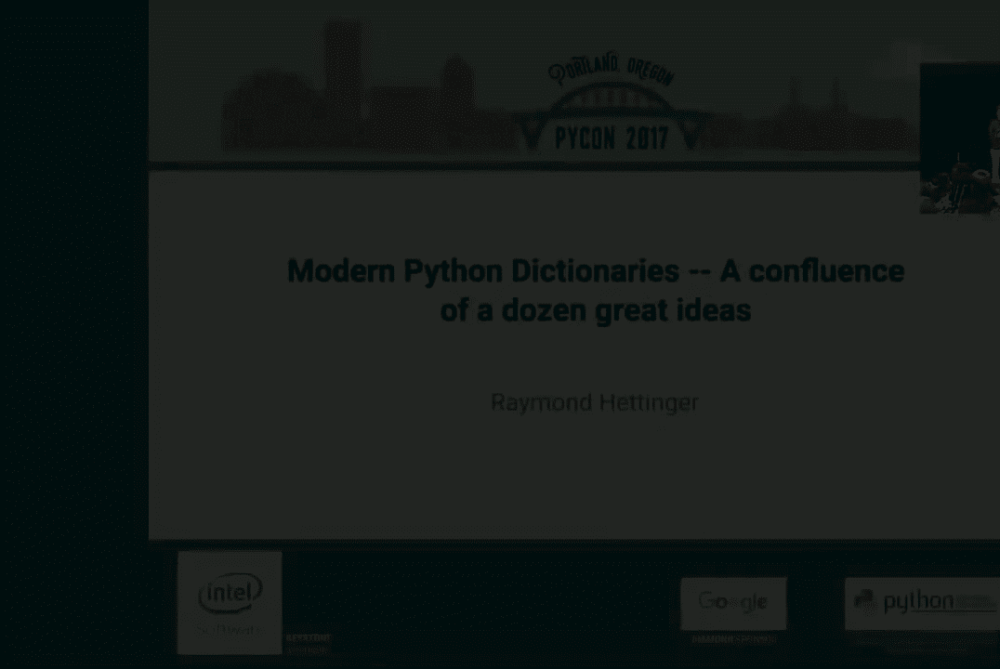

# PyCon 2017（油管点击上万合集） - P12：Raymond Hettinger   Modern Python Dictionaries    A confluence of a dozen great - 哒哒哒儿尔 - BV1Ms411H7jG

 And now， welcome Raymond Heddinga。

 All right。 Welcome to my talk， A Brief History of Time。

 By Stephen， I mean， Raymond Heddinga。 In the beginning， the dinosaurs roamed the earth。

 They died in the cave extinct because of their inadequate capabilities。

 In the void that they left behind， the mammals arose。 And intelligent life came to this planet。

 And we invented Python dictionaries。 Any questions？ Would you like a few more details？ All right。

 So my name is Raymond Heddinga。 The theme of my talk is lots of smart people over time。

 Thought about the dictionary problem very， very deeply。 Came up with some ideas。

 Presented their ideas， the world accepted them and thought we had good dictionaries。

 Then someone else came along， thought about it very deeply， and had another innovation。

 and another innovation。 And I think what we have today is a confluence of about a dozen great ideas。

 that span the course of about 50 years。 And so I'd like to take you from the dinosaur era up to the present。

 and then slightly into the future。 There are those of you who know nothing about hash tables。

 You will know everything about hash tables shortly。

 There are those of you who learned about hash tables in school。

 Now you'll learn how they're done in real industrial strength production。

 There are those of you who already knew that。 But don't know what the latest innovations are in Python。

 We have propelled the future quite a bit forward in the last few years。

 And I'd like to take you on this journey to where I think is a somewhat magnificent。

 I'd call it an ending point， but evolution never ceases。 Shall we begin？ All right。

 So one little thing about me。 What is my mission in life is to train thousands of Python programmers。

 I personally trained about 5，000 programmers。 My company， Mutable Minds， Inc。

 I have a team of trainers and we have trained， about 13，000 people accumulatively。

 So if you have an interest in such things， call me。 And let's begin。 All right。 Our journey。

 The beginning and the end。 Let's do the overview first， which is。

 We do not reprogram your keys just prior to a presentation。 There you go。

 So the importance of Python is built around dictionaries。 Globals are dictionaries。

 Locals were at one time actually dictionaries。 Modules have dictionaries。 Classes have dictionaries。

 Instances have dictionaries。 They are central to the language。

 which means that they're used everywhere， and they're pretty darn important。

 One example is we have instances。 So we have a class and we have several instance variables。

 And I've chosen Quito， Sarah， Barry， Rachel and Tim， all important people， in my life。

 And a repper to show them。 We've made a three instances， a color set of cities， a set of fruits。

 so that we know Quito's favorite color is blue。 His favorite city is Austin and his favorite fruit is Apple。

 I just made all of it up and we can loop over the instances and print them out。 Common place。

 everyday Python code。 What I'd like to do is look what's behind it and look what it looks like。

 So behind each of these three instances is addiction instance dictionary。

 Where is the make big button？ That is my favorite button。 There we go。 Okay。

 So we've got three dictionaries， Quito， blue。 And then the next one， Quito。

 is Austin and the next one， Quito is Apple。 And so that's a consequence of how Python is designed。

 Instances have dictionaries behind them。 So what we'd like to do is see how these dictionaries are implemented over various。

 versions of Python。 Jumping right to the end to see where we ended up after all the evolution。

 And Python 2。7， each one of these dictionaries took 280 bytes each。

 And the ordering of the dictionary was Sarah would go first and Quito would go last。

 And that is deterministic。 It is repeatable in Python 2。7。 And the keys are scrambled。

 We actually say arbitrary because they're not res scrambled every time。 And Python 3。5， some things。

 had changed。 By 3。5， the size of the dictionary had gotten down to 196 bytes， which is very。

 nice a compaction。 And this time， the keys are actually randomized so that every time you rerun it。

 you get a different key order。 So they were no longer deterministic。 Then Python 3。6 came out。

 Is the size a little bit smaller？ 112 bytes， which is pretty darn amazing。

 And the key order is now deterministic。 And it's the order that you added the keys because after all。

 in the beginning， there was Quito and from Quito came everything that you see around you。 Okay。

 So Quito goes first， always the ruler of the kingdom in the order dictionaries。 And the Python 3。

5 universe， he was just another schmo。 Once in a while， he'd get to be benevolent dictator。

 Once in a while， the rest of us would get to tell him what to do。 And Python 2。7。

 he was always on the bottom of the list， and not called Timmy took， priority。

 But now he always gets to be a king。 And so that's where we're going to end up。

 At the end of our journey is with smaller dictionaries that are ordered。 By the way。

 how many of you like small and ordered dictionaries？ This is a fine thing。

 It's one of your reasons to want to upgrade to Python 3。6 straight away。

 I'm not going to say that I was a Python 3 holdout because I've been working on。

 making it better for about eight years。 That said， I believe Python 3。6。

1 is the first of the Python 3 series that's， actually better in many， many， many respects。

 It is very， very， very good。 It is now time to really push hard on other people to go ahead and just switch。

 over。 When I step back to 2。7， which was a nearly perfect Python， it feels like a， dinosaur to me。

 And you'll see part of the reason why coming up。 So let's start back in time with the dinosaurs。

 Okay。 So the dinosaurs were parents and our grandparents who had this bright。

 idea of using databases。 And in a database， we had rows and columns。

 And the columns were each field。 So name the color of the city and the fruit。 Now。

 our forefathers weren't entirely clueless。 They came up the bright idea of indexing into this database so that you could do。

 quick lookups for a berry。 But clearly， our ancestors。

 our parents and grandparents had no idea what they。

 were doing back in the 1960s when they made databases like this。 Or I should actually say early 70s。

 This design was from E。F。 Cod in 1970 who announced onto the world all at once relational database theory。

 So this is the state of the art in 1970， the dinosaurs who died and became stink。

 because their skills were inadequate in comparison to our awesome skills of today。

 Their parents were unequal to us。 They would shiver to see our modern code。 Just saying。

 This we all know is true。 Programming has advanced dramatically over 50 years。 Do you believe me？

 It was a trick question。 Do you believe me？ Do you believe me？ It's a trick question。 No。 OK。

 so I've got a little set up here。 I've got some keys， some values， three sets of values。

 I create a list of hashes， a list of entries and combined entries that have， the keys。

 hashes and values。 These will be the data structures that I use through the rest of the top。

 So what is the database way of solving a problem？ In Python we would represent it as a list of tuples。

 The problem with this is we have to do a linear search。 And so as it starts to scale。

 the performance is really bad。 Interestingly， compared to modern dictionaries。

 once you get to a list of size two， you are not as good as a dictionary。

 So we tend to think of scaling is falling by。 Oh， if you've got a million entries。

 dictionaries would be better。 But typically it's about two or three when dictionaries start to win。

 which is， pretty amazing。 I know what you're thinking。 Oh， that was a trick too。

 There must be a worse way than this。 There is。 Unto them was born a crazy group of people known as list programmers。

 And the saying was a list programmer knows the value of everything in the price of nothing。

 So a list programmer would store what we're called association list， the key value pairs。

 So in this case， we have a list of tuples。 Each one of them needs to be searched independently。

 but you can see there's a linear， search for each of these。

 And we have multiple lists and there's redundancy inside wasting space like crazy。

 like list programmers are want to do。 Just saying。 Remember， the dinosaurs。

 our parents and grandparents were crazy people and didn't。

 know all of the things that we know today。 That was a trick。 All right。

 So what was the first innovation after the dinosaurs died off？ It was called separate training。

 And the idea is instead of doing a linear search of a big list， how about do smaller。

 linear searches of smaller list？ So the idea is take that one big list we had before and divided into two。

 This is list number one and list number two。 Now， if you search list number one。

 you either get one probe to find quito or two probes， to find Tim， one for Sarah。

 two for Barry and three for Rachel。 This doubles the performance of the lookups as long as you know which bucket to look in。

 and you know which bucket to look in by hashing。 If somebody asks you for a simple summary of what hashing is。

 it is reducing the size， of the search space。 So if I was doing a linear search of this room。

 I would have to go through 600 people。 But if I know which cluster you're in， cluster one。

 cluster two or cluster three， I could， search cut the search space by a factor of three。

 Easy enough。 That's a one or two sentence elevator pitch for hash tables。 What is a hash table？

 Something that reduces the search space by cutting it into smaller clusters。

 which are traditionally， named buckets when talking about separate a chain。 [ Laughter ]。

 This time it's better way。 Okay。 There is a better way。 If two buckets is good。

 four buckets would be even better。 So now I have four buckets and what's cool about that is the more buckets you have。

 the more you produce the search。 So we have now four people who are found with one probe and Barry is a hash collision。

 and it takes a second probe to find him。 So that means that on average。

 the weighted number of probes across these five people is 1。2， probes。 That's pretty darn good。

 It's like most of the time you look for something， it's always in the first place you look rather。

 than in the last place。 Pretty awesome。 [ Laughter ]， If four buckets would be good。

 what would be better？ Eight buckets。 Now eight buckets is kind of interesting。

 We actually still end up with a collision。 Quito and Rachel are in the same bucket for these。

 By the way， I've run actual code behind this。 So these are literally where the collisions are and using Python 2。

7 hashing。 But if I get the buckets big enough， eventually everybody will be in their own bucket。

 which means I will find them right away。 The number of lookups is exactly one。

 This is dramatically better than linear searching。 So does this sound like a really great idea？

 I think so too， but you'll notice little bits of wasted space in there。

 But in exchange for wasted space， you get very fast lookups。 This is the advantage of sparsity。

 The problem is is this dictionary gets bigger and bigger， even with size 8。

 With 8 buckets in 2000 entries， see if I can drive this computer， here we go。 With 8 buckets。

 if I put 2000 entries in it， the average chain would be about of length 250。

 And so as the dictionary gets slows down or as it gets bigger， it slows down。 In fact。

 there is a better way。 The solution is to periodically resize the dictionary so that it's never more than 2/3 full。

 Essentially， we copy out all the key value pairs， then we loop back and set up a bigger number。

 of buckets than we had before and then we reinsert it。 So whenever 8 buckets is not enough。

 go and make 16 buckets。 After 16 buckets， 32。 And that way， no matter how big the dictionary gets。

 it retains its performance。 Pretty awesome。 These people in the beginning were thinkers。

 And this is the way they teach it to you in school。

 But they leave a lot of important things out in school。

 Like here's an important thing that you typically don't find in the textbooks。

 Which is that we cache the hash value。 The idea is instead of this narrow table up above。

 we're going to add an additional column to it。 And that is to actually store the full hash value inside。

 At first， this appears crazy。 Why do you need a hash value when you're inside the hash table？ Well。

 the problem is when you resize， you have to go rehash every key。

 And potentially hashing is very expensive for a key。 And you don't want to do it again。

 The solution to the problem is cache it so we save it inside。 At that point。

 the resize code becomes a little simpler。 It says loop over our keys and values and the known hash value。

 And then reinsert it back into the new bucket in a larger， bigger table。 So this is by the way。

 this stuff is not pseudo code。 It all runs and I'll give you links to it。 Although in the end。

 I'll combine it together into one big recipe and hand it to everybody。

 so that you can play with all of these things。 And the idea is in textbooks。

 you don't see this because it isn't essential to the algorithm， and it makes it use up extra space。

 Do you see this third column here？ Okay， so extra space。 But it makes sizes very， very cheap。

 I'm astonished by this even though I'm one of the maintainers of this code。 When I timed it。

 I found that resizing a dictionary is about one fifth as fast as a list copy。

 It is essentially running at the speed of copy。 It makes no calls to equality。

 It makes no calls to hash。 It essentially just says， what is my current hash？

 Take it modulo some power of two and reinsert it into a new table and loops over the existing keys。

 It's incredibly fast。 Almost as fast as copying a list of keys。 Who thinks that's kind of cool？

 Which is why we use this extra column。 All right， so the next step up is faster matching。

 This is something that they don't teach in school as well。 In school。

 they say loop over the keys until you find a match。 If you don't find a match， raise a key here。

 The problem is how do you know whether a key is matched？ You do an equality test。

 Does the key equal the target key？ That makes a lot of sense in textbooks because the thing that they're looking for is typically a number。

 Or something like that。 So a quality test are very cheap。 But in object-oriented languages。

 any object can define a dunder EQ that's very expensive。 For instance。

 comparing two decimal objects involves a lot of steps because we have to line up the number of decimal places first。

 There's not just a direct comparison of values。 And so a lot of work can be done there。 Potentially。

 if you have a database record， you have to compare every one of the fields in order to determine the three quality。

 The moral is， in an object-oriented programming language， you can't assume that equality is fast。

 It can be very， very， very slow。 And if it's slow， you want to do it all the time。

 or do you want to avoid it？ I would avoid it。 And so there's two fast， early outs。

 One of them is this notion that identity implies equality。

 If we have two pointers to the same object， two variable names pointing to identically the same object。

 we don't even have to look at the object to know that they're equal。 You are equal to a you。

 Doesn't that seem obvious to you？ If there's two pointers to the same object， it's the same object？

 Sir， what's your name？ Oh， question。 A person on the front row on the far right side。

 What's your name？ Ooh， I had two references to the same object。 Did I have to ask in both time？

 Or if I knew the references were the same， did I even have to ask to know it was the same guy？

 Identity implies equality。 That person sitting in that chair is the person who's sitting in that chair。

 regardless of how I refer to the chair。 Does that seem logical and obvious to you？ It does。

 interestingly， everything in the Python world is the subject of contentious debate。

 In the world of floating point numbers， there's the concept of a nan， not a number。

 And the IEEE 754 specification of nans defines nans as not being equal to themselves。

 Are you equal to yourself？ Of course you are because you're not a nan。 But if you were a nan。

 it would say no。 And so there's this thought that dictionaries break nans because if you use one as a key。

 then we go back and we say， oh， I found that key and says， I'm not really me。 At which point。

 a person who is a die-hard for nans would say a nans should not be look-upable。

 You should be able to put it in a dictionary， but you should never be able to find it later。

 And then they hold up the specification， IEEE 754 arithmetic。

 What do I have that can trump an IEEE 754 specification？ Something of greater weight than that。

 Something we care about more。 The Zen of Python。 I hold up the Zen of Python。

 but I'm not going to tell me。 I say practicality beats purity。

 If you put something in a dictionary and can't get it back out， that's very impractical。

 It's generally a bad thing。 It makes it impossible to reason about the container。

 And if I make identity implies equality， I can make dictionaries very fast。

 Do you want dictionaries that are fast and practical or do you want one that makes it so you can put nans in and show your mama cute trick？

 OK， so I fight it with practicality beats purity periodically though。 Once a year。

 somebody comes back up and posts， I put a nan in a dictionary and later I was able to find it。

 This is terrible。 And I have to fight the battle once again。

 I'm afraid if I ever retire from Python core development， this will disappear。

 People will be able to put things in dictionaries and not get them back out and say， "I。

 triple E 754。"， And Uncle Timmy would come back and haunt them from his grave at that time。

 All right， there is a， the way hash tables work is I group all of you into clusters and I only have to search that cluster for you。

 But if I'm mistaken about which cluster you're in， I'm never going to find you。 This is cluster one。

 cluster two and cluster three。 If I go to look for you and cluster one， I'm not going to find you。

 So we have a， what is known as a hash invariant。 All hash tables require this。

 If two objects are equal to each other， then they have to have the same hash。

 They have to be in the same cluster so that we can go find an object equal to that object。

 Does that make sense？ Now I'm going to get mathematical and logical on you like Dr。

 Sheldon Cooper from the Big Bang Theory。 We will use modus-tolens logic and I will express the contra positive of this statement。

 That's where you switch the if and the then and the gate the then。

 It's called denying the antecedents。 The contra-positive says if two objects have caches that are unequal。

 if you were in two different clusters， then it means that you're not the same person。

 You're not equal to each other。 So we flip it around to the contra positive and it gives us a fast match algorithm。

 Internally dictionaries and sets use a fast match。 First of all， they check for identity。

 Are the two objects sitting in the same chair？ If the answer is yes， we assume that they're equal。

 Identity implies equality。 This is extremely fast。 It's just a pointer comparison。

 The next thing is we already know the hash of the object and we already know。

 the hash stored in the hash table。 As a result of that， if the hashes aren't equal。

 we don't even have to test them for equality。 We know that they are not equal to each other。

 And then finally， we have the slow test。 If these two early outs don't work。

 we finally have to do an equality test。 Too fast early outs in front of a slow test。

 If you knock these two lines out of Python， it cuts its speed by more than half。

 Are these lines kind of important？ So you like identity implies equality and you're not going to file a bug report about。

 IEEE 754 and say， "The world's not safe for nans！"， I see how it is。 That is an interesting test。

 This one though， I've known about for a very long time the full impact of it though。

 didn't hit me until we started to go to the 64-bit world。

 What are the odds that two hashes are going to be equal to each other and the。

 objects are not going to be equal to each other？ The answer is one and two to the 64。

 That means that with this test in place， we never， well， almost never， like never。

 in your lifetime or in the lifetime of the universe， we will never have a case。

 where the key is equal to the target key。 We never do an unnecessary equality check。

 So every dictionary and set look up if it finds a match does exactly one equality test。

 even if there are collisions。 That's kind of cool。

 These odds are so great that I conducted an interesting and funky experiment。

 I replaced this line in Python with return true， which said， "If the hashes are equal。

 just assume they're the same object。"， Interestingly， the entire test suite pass。

 Django's test suite pass， NumPy's test suite pass。 In other words， this is a very， very。

 very good assumption。 How many of you think it would be safe if I just took out the equality test and said。

 "You don't think it'd be safe？ How many of you think it would be unsafe if I were to just take this slow equality test out entirely？

"， Really？ A lot of you think it would be unsafe。 Now I've got another poll question。

 How many of you use Git？ Git does exactly this。 When it compares files。

 it doesn't look at the files。 If the hashes are equal， it believes that they are the same。

 This was a really good idea until SHA-1 started to look kind of weak of late。

 so they're actively working on switching from SHA-1 to a different hash。

 where a person can't produce a collision easily on purpose。 All right， so all of this was great。

 but there's a problem。 Separate chaining takes a great deal of space。

 by having all the pointers to many separate lists。 So what's the solution？

 The solution is make the table more dense， get rid of all the pointers。

 and put all the buckets in one table。 The downside of this is you introduce a risk of collisions。

 and the solution to it is using a linear probing。 So this is a pure Python code for doing linear probing。

 It says look in position I and check to see if you found the value that you needed。 If not。

 go switch to the next location and look there and look in the next place， and the next place。

 and the next place。 So with open addressing， here's what the table looks like。 Interestingly。

 Tim was supposed to go in Sarah's slot， but because it was already occupied。

 he went to the next slot， wrapping it around。 This greatly improves the density of the table。

 Pretty good idea？ It is， except for one problem。 Later， if we delete Sarah from the list。

 Tim becomes unvindable。 By the way， is Tim Peters here？ That's because Sarah got deleted。 In fact。

 there is a better way。 The problem is removing a key leaves a hole。

 The solution is to mark that with a dummy entry。 And the dummy entry says this space was used by some key。

 When you're searching， go ahead and skip pass this and keep on looking until you find Uncle Timmy。

 And here's the pure Python code for that。 You can see the idea is， wow， I'm going to speed up。

 Is it 15 minutes to questions？ How many people walk out the door？ 20。 All right， good enough。

 So our free slot is we track to see if we found any dummies。 As we do the search。

 if we find a dummy， we remember where it is。 Later， if we find a hole in the table。

 we'll go back instead of using the hole。 We'll use the original free slot， the dummy that we found。

 And that lets us reuse the slots。 On the other hand， if we find a key。

 we can use that fast match that we just discussed。

 with identity equal equality in the hash table check in order to do a quick check。

 And this is the core logic for dictionaries。 This is known as Nuth Algorithm D。

 And it was known right at the end of the 1960s。 It appears in the art of computer programming。

 Turns out our grandparents knew a thing or two after all。 Multiple hashing。

 The problem with linear probing is that we end up with a catastrophic linear pile up。

 The solution is do every time you get a collision， do a rehash so that they don't。

 pile up in the same place。 So they split off in different directions。

 And so there's two tricks there。 One is we use all the bits of a hash。

 We've got a 64-bit hash and perhaps a table with only eight entries。

 So we only need three bits at a time。 So we gradually shift in five at a time and that's called perturbing。

 In addition， there's a linear， cringruential random number generator that says。

 take the current slot times five， add， one， modulo the number of slots to find the next one。

 What's cool about this is it provably eventually visits every slot。

 It means that hash tables don't get caught in a loop when there's collisions。

 I believe Uncle Timmy came up with these ideas。 And so this code is Uncle Timmy's code。

 Whenever you get a collision， we print out we， perturb the bits shifting in additional bits。

 multiply by five， add one， take， him modulo and update the perturb。 So in this structure。

 we end up with no， call or all of the here's the collisions that came out for this as it's probing all。

 of our round。 I made this a fairly dense table and I picked these names on purpose to create a。

 lot of collisions。 So that is an improvement on News Algorithm D。 Are you trying to say that Tim。

 Uncle Timmy was able to come up with something that Donald News didn't know？ Pretty cool。

 Now an early out for a look up says Victor， Stinner here。

 So Victor Stinner is an awesome Python core developer who's been working very。

 hard on improving the speed of Python。 One of his ideas is that internally in Python。

 we use dictionaries a lot and， we're often looking up method names and it's the same method name over and over。

 again and we have to repeat the dictionary look up every time because。

 potentially the dictionary could mutate。 The better way is in pet 509。

 which appeared in Python three six， he added a， private version number to the dictionary。

 So every time we update the dictionary， we update the version number。

 That means that anything that wants to do a avoid repeated lookups can just keep。

 track of the version number and say if the version number is same， I don't need。

 to do the look up again。 And this sped up the internals quite a bit。

 Are you trying to tell me that Victor Stinner came up with something that uncle。

 Timmy couldn't who came up with something that Donald News couldn't come up with。

 which was better than the dinosaurs who used databases？ In fact， that's the case。

 There was a problem though with that design。 If you look at this table。

 it's got these holes in it and the holes are quite， wide。 It is all three fields。

 And so there's an enormous amount of wasted space inside。 This is my big idea。

 My big idea was the compact deck and essentially what I did was compress。

 these down and got rid of all the holes。 So all of the hash values。

 the keys and the values are stored in a dense fashion。

 and there's a separate table of indexes that's a very narrow。 Interestingly。

 because we only have to have eight possible slots， the indexes can， be stored in one byte each。

 So this index table is only eight bytes。 It's actually smaller than the space it takes to store。

 Quito's name， which I think is pretty awesome。 It probably doesn't seem like that to you because Quito's got five characters。

 but string objects are bigger than that。 They have some overhead。

 So the index table is essentially free in comparison to this。 No wasted space。

 Dictionaries are compact。 You got the idea of how they got smaller and later versions of Python？

 We got rid of all the wasted space。 Are you telling me that I thought of an idea that Victor Sinner didn't think of。

 that Tim Peterson didn't think of， that Nutha didn't think of。

 that the dinosaurs didn't think of in their databases？ That is in fact true。 That said。

 there was a terrible problem。 The problem is with my dictionaries， by the way。

 I'm getting the history slightly out of order here to make it easier to explain。

 These things happen in a different order than I'm saying here。

 But the problem is we had a dictionary for colors， a dictionary for cities。

 and a dictionary for fruits。 Notice that all of these have exactly the same hash values。

 exactly the same， keys over and over again， repeated。 If you have a thousand instances。

 you have a thousand dictionaries， where two thirds of the space is completely redundant。

 This can't be solved by people like me or Victor。 We're not smart enough。 No， it came from a PhD。

 Mark Shannon and PEP of 412， a key sharing dictionary。 The idea is we share the first two columns。

 So all of that compacts down to this， which means we've got four dictionaries。

 In one little space here with no gaps in between。 Do you see all these ideas dove together really well？

 So let me take you into the present。 Let me take you into the future。

 The future is something I'm working on right now with sets。 Because this part is so cheap。

 it's only eight bytes。 Would it cost me very much to make it bigger and to double the size of it and make it less sparse？

 The answer is no。 I hear people clapping in the other room。 That's a bad sign。 OK。

 And so the only difference here is not this data。 It is this index table is twice as big as it was before。

 It's got 16 entries， which means it went from eight bytes to 16 bytes。

 And it's still smaller than Quito's name。 It's the size of two of these hash values。

 It's nothing in comparison to the total table。 But I've doubled the sparsity。

 What's cool about this is。 One second。 What's really nice about this structure is we've completely eliminated all of the collisions。

 If you make the table sparse enough， there's no collisions at all。

 And it turns out we can now make them sparse essentially for free。 Who learned something new？

 So that's going to be in the future。 And the first generation will do even fewer steps to look up and the same is with sets。

 By the way， have you seen anything that looks like this before？ Really？ Yes。

 it was up at the top of the of the page。 Do you remember what those dinosaurs did a long time ago？

 [ Laughter and Applause ]， Here in the third millennium， we've reindented databases with indexes。

 [ Laughter ]， That said， they're pretty badass。 They're compact。 They iterate faster。

 And as a side effect of how we build them， they preserve order。 So in Python 3。6， dicks are smaller。

 And faster。 Space efficient。 Beautiful。 And key sharing。

 And if you get a million instances with a million dictionaries， none of this data over here。

 these two columns are repeated at all。 In fact， the incremental space is just a space that stores the values for that individual one。

 Who learned something new？ All right。 I had some odds and ends at the end。

 Let me just say a couple of them real quickly。 We still need a hit， sit， passion Python。

 The purpose of that is it turns out some people are diabolical and try and create keys。

 that intentionally collide。 We fought back against them by putting a cryptographic cache that's receded everything。

 Time Python starts up so it's very difficult to come up with keys that collide。 Also。

 sets use a different strategy。 They use multiple chaining and linear probing because sets are about something different。

 dictionaries。 Dictionaries are about looking something up。

 Sets are about determining whether something is actually there or not。 Dictionaries。

 you typically know the thing is there。 You just don't know what the value is。 Different use cases。

 a different balance of strategies。 A popular thing to talk about on Hacker News now is Cuckoo Hashing。

 And a number of languages are using it。 How well does that mesh with this？

 And the answer is nothing I've described conflicts with Cuckoo Hashing。

 Cuckoo Hashing is simply a different arrangement at the index table。

 but the rest of this could survive。 We could still do it。

 I don't think we should because we have no need for densification at this point given。

 that we've already reached a maximum density。 And Cuckoo Hashing is all about increasing the number of collisions。

 Whereas making it sparse is all about decreasing it。

 And I think that would be a step in the wrong direction。 Additionally。

 there's one other piece of logic inside。 In a safe world。

 someone loops over a dictionary and they don't change it while they're looping over it。

 The analogy is you put a ladder up on the side of a house。

 you take out a saw and you cut out the ladder underneath you。

 That's what happens when you mutate a structure while you're iterating。

 And so we have logic to guard against that so that the dictionaries and sets won't seg fall。

 If you're interested when I post all these slides。

 all of this combined together is in a single piece of code。

 This was something that I posted about four years ago。 It is pure Python code。

 It is a complete implementation of compact dictionaries from scratch。

 And everything I showed you is in here somewhere。 The generation of the probes with Tim Peters sequence。

 the dummy entries， the compact indices， the resizing logic， the fast matching。

 All of that is in here。 And so I will post this shortly and in the end， here's what we get。

 The output of this is this beautiful little dictionary。

 which is what I posted to Python Dev back in 2012。 Congratulations。 Welcome to the third millennium。

 [Applause]， Hey。 So it looks like a bunch of you are going to lunch。 That's fine。

 Just be quiet while you're leaving the room。 There are plenty of people who are sticking around and probably want to ask some questions。

 If you do have a question， there are microphones in the in the aisles here。 Sure。 Thank you。

 All right。 Let's call it a day and go eat。 Yeah， everybody， please thank Raymond Hadinger。

 [Applause]。

 Oh， I remember。