# PyCon 2017（油管点击上万合集） - P13：Kelsey Hightower - Keynote - Pycon 2017 - 哒哒哒儿尔 - BV1Ms411H7jG

 Welcome back for our final plenary session of PyCon 2017。 The candle has burned low。

 but there is still a flame left。

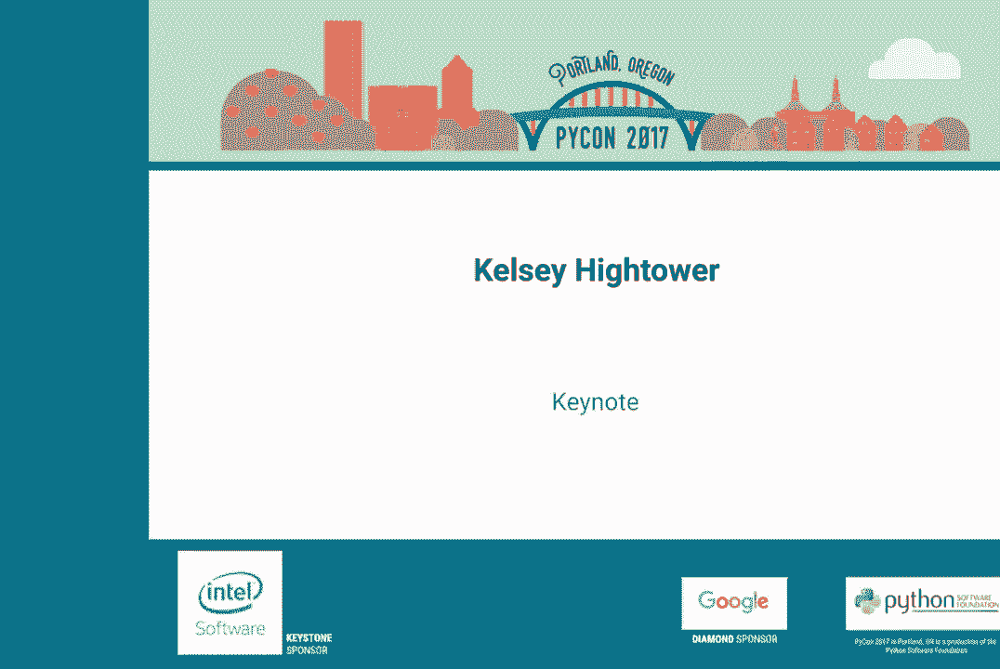

 What was initially measured in days， then in hours， now is best measured in the minutes。

 we have left together。 I am very happy， very excited to announce our closing keynote speaker。

 Please help me with a big hand to welcome to the stage Mr。 Kelsey Heitauer。

 So this is really an honor for me because my very first speaking opportunity was in Atlanta。

 at Georgia Tech and I went to go see what smart people do when they get off work。

 Apparently they go and they continue talking about technology at meetups。

 I was learning Python at the time and this is when you went to the bookstore for some。

 of the younger people here， there is this place you go and you buy these things called books。

 The bigger the book， the more knowledge in there。 All the Python books are like ten pounds。

 I bought one of these books and I was like I am going to learn Python and I am going to。

 go to a meetup because that is what smart people do。

 I am sitting there as you guys are sitting here and I am watching the speakers like。

 I can totally do that。 I email the organizer and there is this guy named Brandon Rhodes。

 I was like I want to give a talk。 Have you spoken before？ Nope。 I can totally do it。

 You do a lightning talk or something。 To be smart。

 the first topic I picked was comparing Python list comprehension with Haskell， list comprehension。

 No one knows Haskell。 So if I show up， I am just going to be the smartest person there。

 I was like I have never seen this。 So when Brandon reached out again and said hey。

 Kelsey I want you to come speak at this， event that I am running。

 I was like well how big is the meetup？ I am like damn this is a big meetup。

 So for a lot of you meetups do change or can change your life。

 The Python community has changed my life。 My very first conference was Python in Atlanta and it ruins you because trust me。

 you guys， should clap for that。 The thing about Python that is amazing is really the community。

 A lot of people here actually heard pay their own way to be here。

 The number of people that stick around for the sprints are amazing。

 So my first contributions to Python were pip， virtual inf and dishy tills。

 And since then I have grown on and the world of technology。 Oh yes， those are fantastic things。

 So last night I want to write some Python to remind myself of why I fell in love with， the language。

 After about three or four hours I tried to deploy the thing that I wrote and find out。

 the things I didn't like about Python。 So we are going to talk about Kubernetes for Python。

 The root of this talk， I am not going to try to do with all of the things Kubernetes can。

 do but I want to educate you a little bit on what containers are and why they are important。

 to people especially in Python。 Many of these languages have very complex dependency systems and it could be a barrier。

 of entry especially if you are building or distributing software。

 So we are going to go through this and think about this from the very beginning of how you。

 think about containers helping you。 Now I heard this was a technical conference so this is my last slide if that is okay。

 Let me know， I can find a lot of cat pictures on the internet。

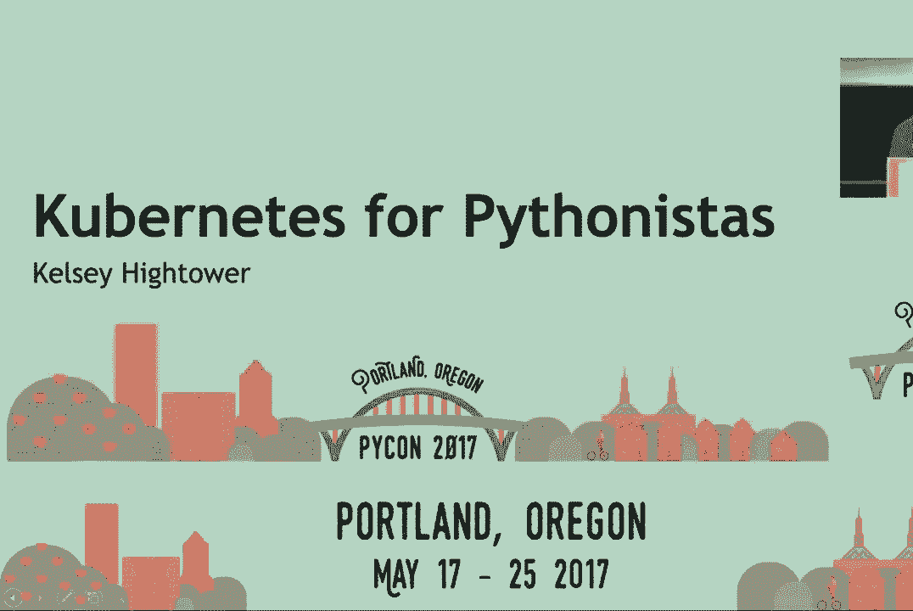

 So we are going to be in this mode for a while。 So when I first started learning programming I was about 24 years old and I had that book。

 and I wrote my first Hello World program。 Kind of like this one。

 And Python is like magic。 You write a few lines and you really believe you are a real developer。

 I started applying for jobs immediately after this was done。

 Senior developer Python five minutes of experience。

 And you look at this code and you are like wow this is pretty awesome。

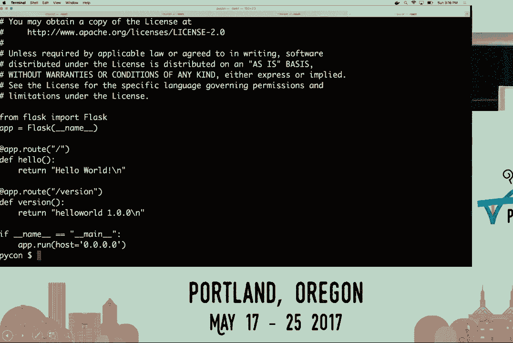

 So I am going to run it and you always automatically should know what this does。

 So we will say Python and then we will say our app， py。

 Okay。 This is sweet。 And then you go to your browser。

 This is where your life changes for the first time。

 If you are new and you see this， this is when you run around your house and your spouse。

 is like what are you doing？ That is not impressive。 Like I said， what world。

 I can do that on a piece of paper。 But it is important。 Okay。 Now I got brave。

 My first Unix machine， free BSD。 Right？ Free BSD people are serious。

 They have tattoos of the mascot。 I am like you know that is not ever coming off。 Right？

 So we got this hello world thing going。

 So I was like you know what I am going to do？ I am going to run it on my server。

 This should be easy。 I got this one file， this app py。 So you copy it to the server。 And it is tiny。

 And then you go to type Python and nothing is there。 And then you become a sister admin。

 In free BSD you do not install Python the easy way。

 You have to hit your whole house from the server。 You compile from scratch。 This is what you do。

 So after about six months I got Python on my machine。 And the app didn't run。 And then I needed pip。

 Two years later my app was running。 It wasn't that bad。

 But this is what we are asking people to do when we write code。

 We are asking them to go and figure out what version of Python they have。

 Got forbid if you are using some C extension。 And trying to use that on a Chromebook is funny seeing that in an airport。

 Your computer is going to run in about 30 seconds。

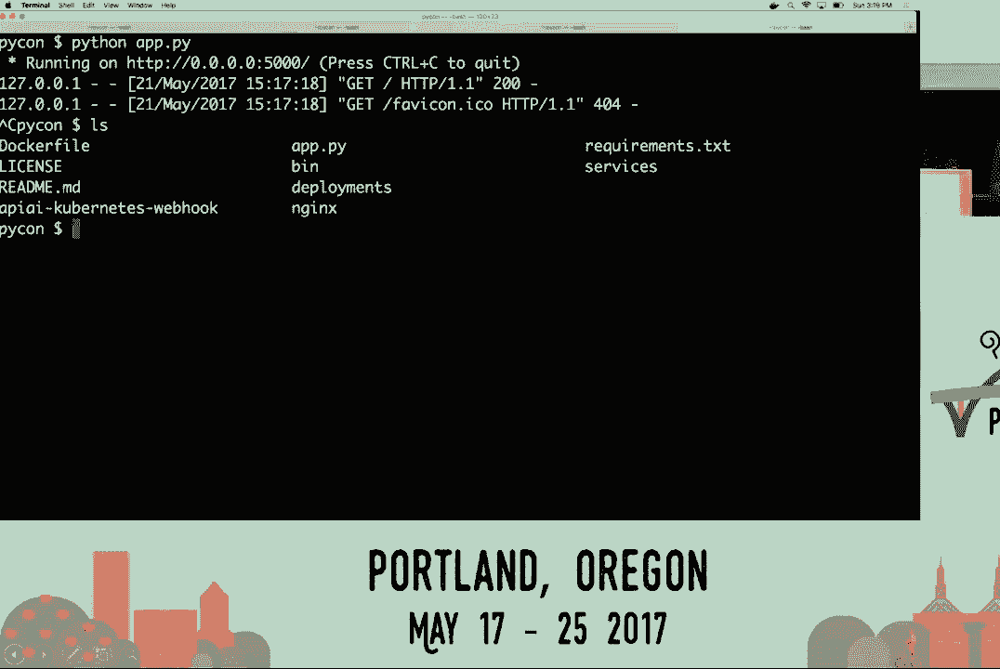

 So we have all these dependencies and packaging has come a long way in Python。

 So we have this ability now to say hey here is what my app requires。 And I can just do pip install。

 And I just did a little tweet and I will show you guys what it looks like。

 So I am on my Mac and I am writing this test app for the demo。 I do pseudo pip install。

 You guys are already like what the hell are you doing？ So I am like yeah what could go wrong。

 I have Python prebuilt on my machine。 They are like dude。

 The first rule of Python is you don't use system Python。

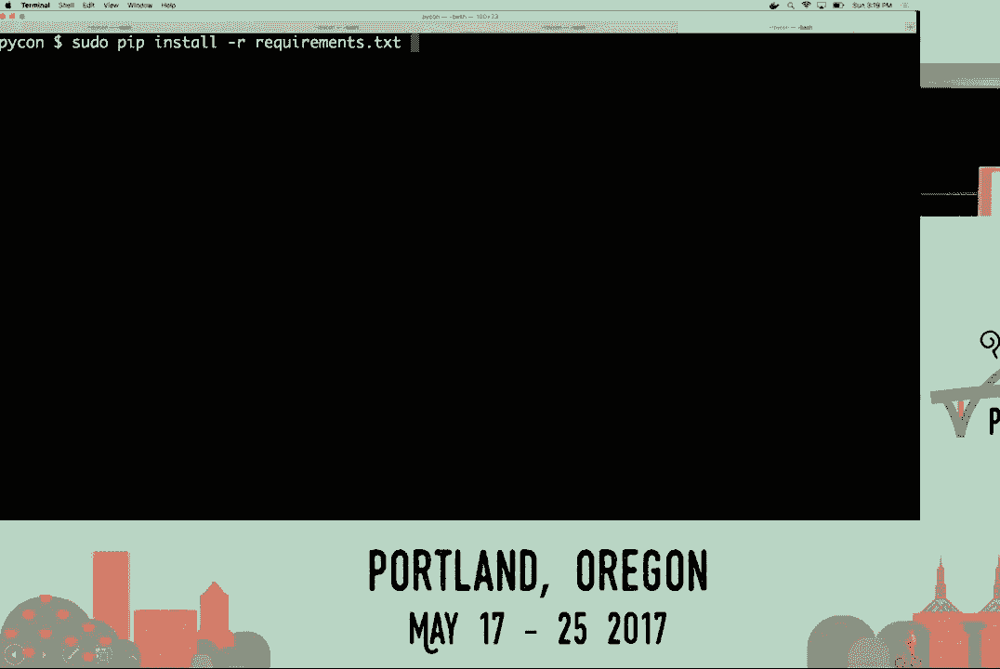

 I am like hold my keyboard。 Enter。 You type in your password right？

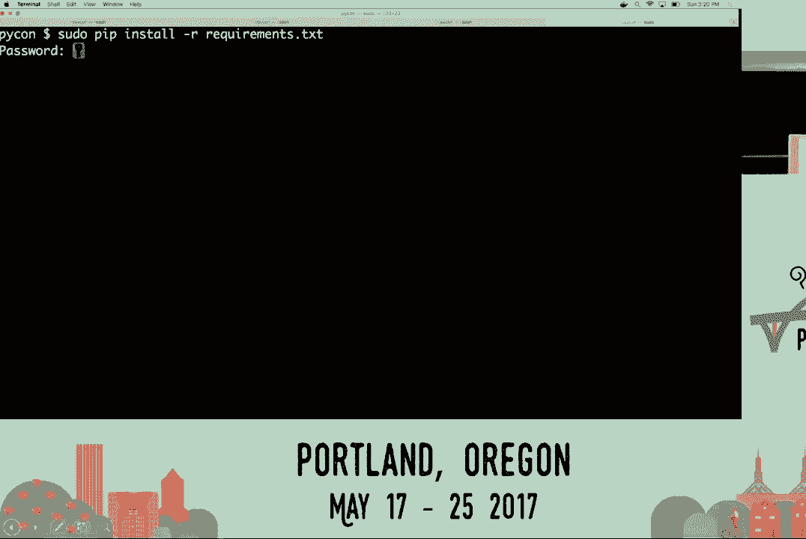

 And then it is like your info set team is like what the hell are you doing？ Nothing works anymore。

 But I have flask and everything I need on my machine。 So we are winning。 I have to do this。

 So we have our app now。 And we start to ask ourselves that there has to be a better way of doing this。

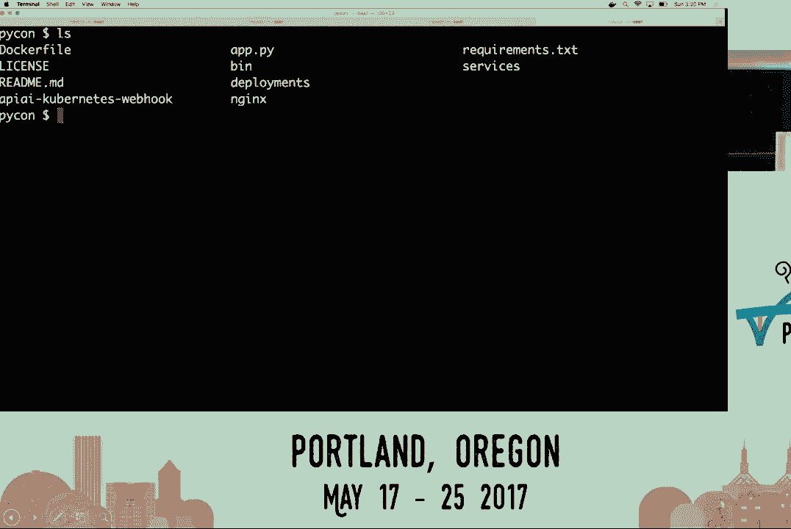

 So when I used to contribute to Python I told you we had disk utils and there used to be。

 a war set up tools。 And then we made peace and the whole goal was not to reinvent the wheel。 Listen。

 prove what we have。

 So last night I was like what is the state of the art in Python？

 And it turns out we literally reinvented the wheel。 I thought this was a joke。 I was like no no no。

 It is not actually called wheels。 I was like no this is what you do。 And I was like okay。

 Wheels it is。

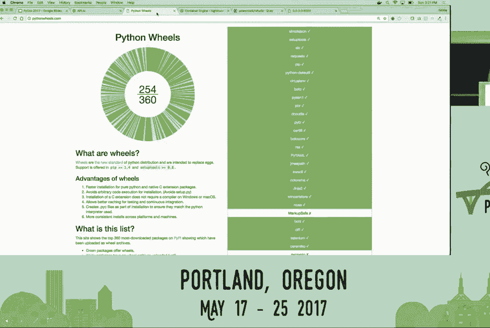

 So the truth is packaging is a pain point for all languages。 It is a pain point for all software。

 Things that work well are like your mobile device。 You go to an app store。

 You bring the whole package down。 And the reason why we can have a billion devices is because we do not ask users to go and install。

 other software to use the software that they are interested in。 It is simple as that。

 But we do the opposite when it comes to servers。 We are making everyone's life difficult。

 Anyone have ever heard of DevOps？ Anyone know what DevOps is？ I take a stab at it。

 DevOps is group therapy for system。 And we needed it largely because of packaging。

 It is not just Python。 All of those packages need to be maintained。 They need to be updated。

 You write a Python app and say hey install this and all of the systems just sleep。

 So how do we make this better？ And this is where I think containers become interesting。

 How many people think static linking is a good idea？ How many people like containers？

 It is amazing to me that so few people think static linking is a good idea but they like。

 containers。 This is static linking on steroids。 It is a big tar ball with everything。

 A full operating system is in there。 You are linking everything。

 I saw one container and had a chrome browser in it。 What are you doing？

 So what we want to do is how can we leverage these containers in a smart way。

 So just so everyone is on the same page。 A container， there are two parts to this。

 There is a packaging format。 The goal is we package all of our dependencies into a tar ball。

 It is actually a tar ball。 It is a tar ball with a specific format so we know how to download it。

 extract it， and， be very efficient with layers。 So what we are going to do is build one of these things。

 Now I have cached most of this because these days no matter what app you build， for some。

 reason it downloads like two thirds of the internet in order to work。

 I will show you what one of these looks like。

 So we have our application。 So what we are going to do is start with this Docker file。

 So the Docker file here is， you will see the first line there。 It says from Ubuntu。 Yes。

 that is an entire operating system to put our 2K application into。 Now there is a reason for this。

 How many people here would say they honestly know all their software dependencies？ Exactly。

 So when you don't know， you just bring in everything until it works。 And then we get DevOps。

 So the next thing I do here is there is a couple of things happening though。

 We take all the tribal knowledge from wikis and runbooks and we put them in the Docker， file。

 Now this is not the best we can do， but it is a good stepping stone for the majority of。

 the people building software。 And we can do clever things like cache some of the layers。

 So even though that first layer is pretty big， it is actually only about 70 or so megs。

 we can cache that on the servers so we don't have to copy it once for our apps。

 So the next thing we are going to do here is do app get install， Python 3。

 Everyone is using Python 3 by now。 Please tell me it happened。 All right。

 just clap in case it just for tins。 And then we copy our requirements。txt into place。

 Now the goal of this whole thing is that now everyone has a very sane and clean build。

 environment and they can build their application。 You can either give people the raw Docker file and they can build it themselves or you。

 can build it and store the artifact。 So if you have ever built any package of any kind。

 the goal here is to build an artifact， and we will store it somewhere。

 Now once we have the artifact， we can give someone the image name and they can run it。

 So we will just build this here so we can see what we are talking about。 Now my Python is rusty。

 So if you see any bad code today， please give me a pass。 Do not put it on Twitter。

 I promise to follow Pepe later。 Okay， so we have this entry point。

 So this is basically going to do the same thing I was doing on my command line and we。

 are just going to set that in an entry point。 All right， so we are going to make a tarball now。

 This is a very fancy way of doing it。

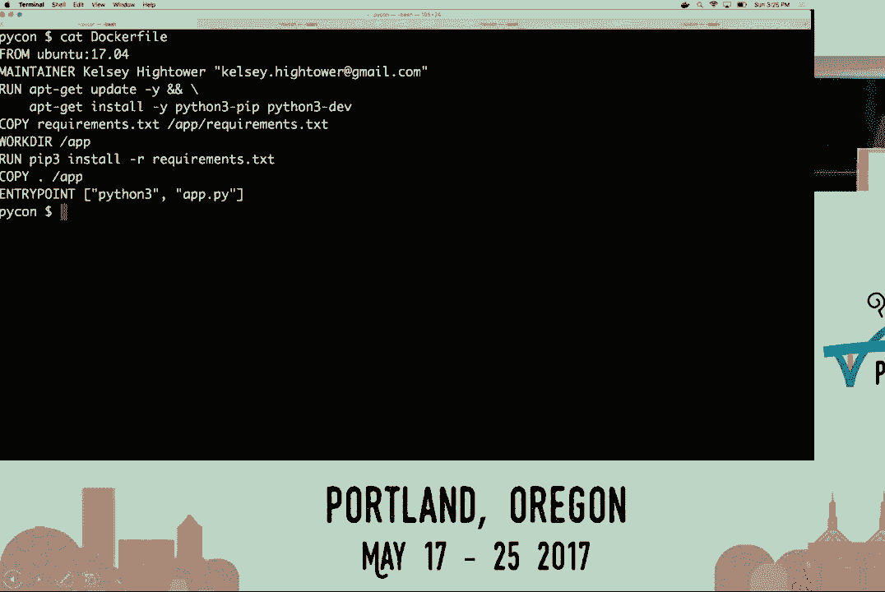

 So we will just do this Docker build command。 So here what I am doing is saying hey。

 I want to build this image and I want to run， that command but what I want to do is have all of the requirements be pulled down and。

 run inside of a charroot environment so I have a clean build that is reproducible。

 So we will run this now。 Okay， so the luckily thing is here is that I am having a bit of caching。

 So I did not change any of the lines at the top。 Now you can run into issues with some of this caching but the nice thing is when you are。

 building and writing applications and you want to iterate fast， you do not need to run。

 the whole entire app get command or the pip command again。 Those live as separate layers。

 So once you have that we can just copy in our application and then we can run it。

 How many people think is really easy to run multiple copies of an app on your machine？

 Not a lot of hands。 How many people are using virtual m to solve this problem？ Okay。

 so if you are familiar with virtual m to give us multiple Python environments you。

 can look at this run time so this is the other part of the equation。

 Once we have this tarball we can run it under a run time。

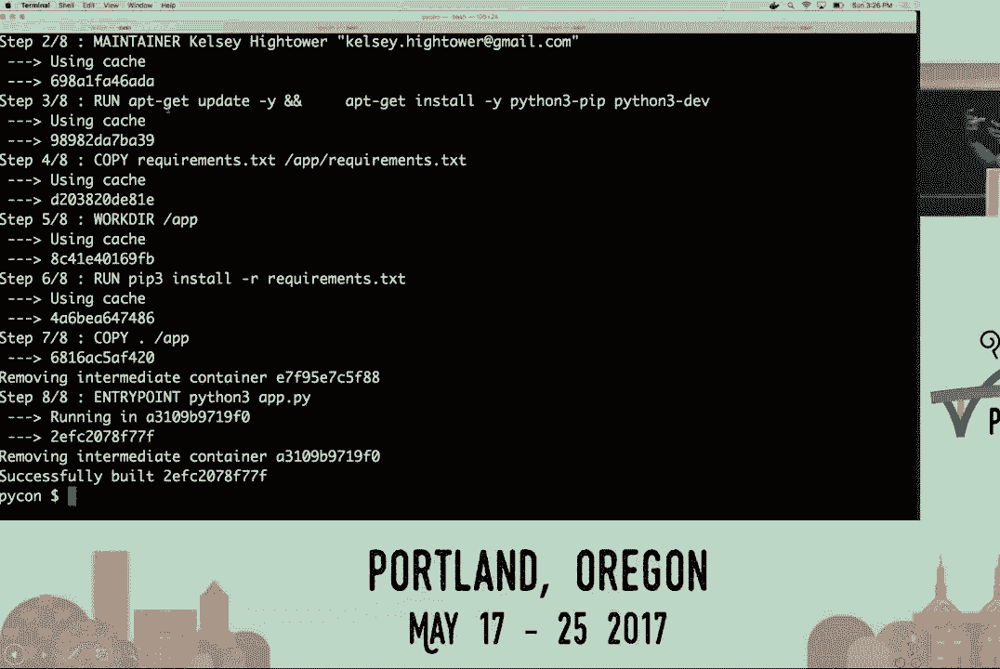

 So let's do this really quick。 So we will say Docker run。 All right。

 so what we are going to do here is we are just going to run our app to make， it a little bit easier。

 So we are just running on 5，000 to 5，000。 So I am just doing a bit of port mapping so I can get to it。

 We are going to run this hello world app and it is going to run in the background。

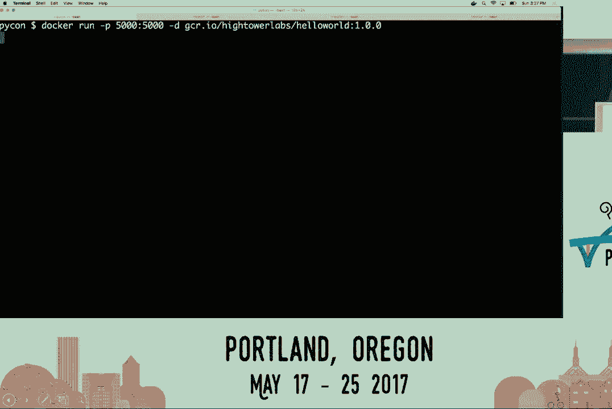

 So at this point I should be able to hit it in my browser and there it is。

 Now I can run as many copies of this as I want。 Maybe map to different ports。

 But this only solves the laptop problem。 We have this thing packaged。 It is easy to distribute。

 It is easy to run as many copies as I want。 But what happens if I have 5 or 20 servers that I need to push this to？

 How many people are familiar with scheduling？ Every hand should be up。

 Every device that you have has probably more than one CPU core and when you launch an application。

 there is a kernel that has to figure out where this thing runs。

 So you have a really effective scheduler there。 But most people are doing these days and letting you have a scheduler we call it the。

 meet cloud。 This is where you say run this application and a human decides where it runs。

 And sometimes we track in a very fancy database， aka spreadsheet。

 And the problem with this is if one of the machines dies they have this thing called， an on call。

 Machine goes down and you get a call and you get to put the app back on the machine。

 So what we want to do is solve this problem in a way that goes a little bit further than， a laptop。

 So we have a tool called Kubernetes。 There are other tools that do very similar things but we are going to work with this for。

 now。 So I have about 5 nodes in my cluster。 Now the goal with this is that I do not want to statically assign my apps and machines。

 They are designed to go away。 I want to treat each machine as one collective or like a multi-CPU system and treat the whole。

 cluster like a single machine。 So we need a new API。 We need some abstractions。

 So once I have this abstraction we can package our container and what we call a deployment。

 So let's look at this really quick。

 So we have this deployment object。 So here is the container we built and we have it hosted somewhere。

 So anyone that wants to run this app can pull this particular container image。

 Now some of you are like well how does the system know where to put this？

 Since a lot of people didn't raise their hands about what a scheduler is I am going to explain， it。

 Now the fastest way I have done this without diving too deep into computer science and。

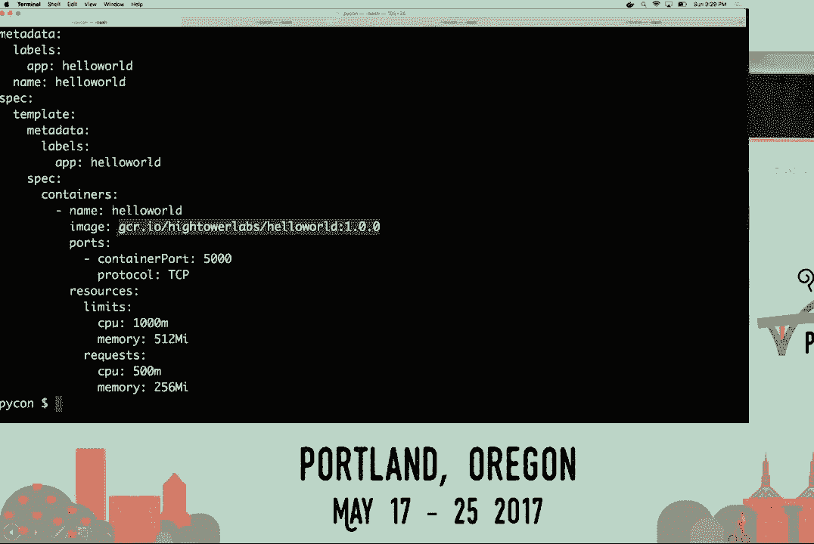

 hijacking my whole talk we play a game of Tetris。 So how many people here say they have fully automated deployments？

 Okay。 Now this is a worthy goal to get to。 You click a button and your app installs to specific machines。

 I'm going to show you what that looks like。 You do that in Tetris。

 I'll show you。 It looks like it's amazing by the way if you can get to this point。

 So the goal is we want one click deployment of all of our apps。

 Now you need to know a whole bunch of information ahead of time in order for this to work。

 You need to know all error scenarios。 You need to know if a machine is in maintenance or not。

 And you need to make sure there is no network issues because you need to be able to route。

 around them all in bash。

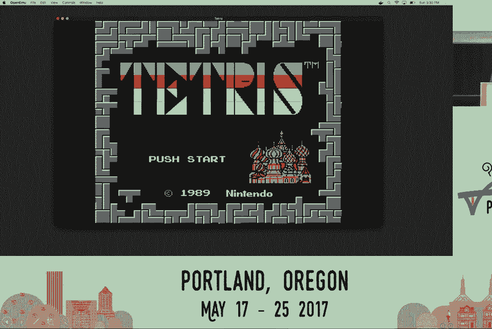

 Python if you're lucky。 So what we're going to do is this is one click deploy。

 This is the DevOps holy grail I'm about to show you。 Be ready。

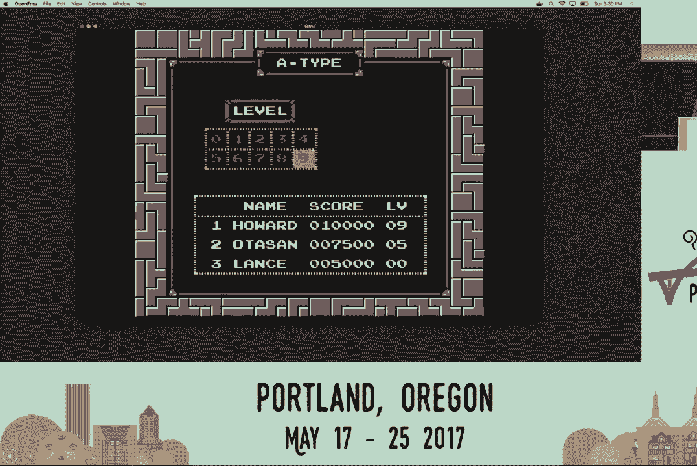

 You ready？ One click deployment。 Bam。 One click。 And then you leave。

 It's fully automated by the way。 But the problem here is your memory and CPU is just on the floor and you're losing。

 Now we're at a cloud provider this is pretty good actually。 Spend up more VMs。

 So what does the scheduler do？ So here's the difference。

 The scheduler has to actually examine every workload as it comes in。

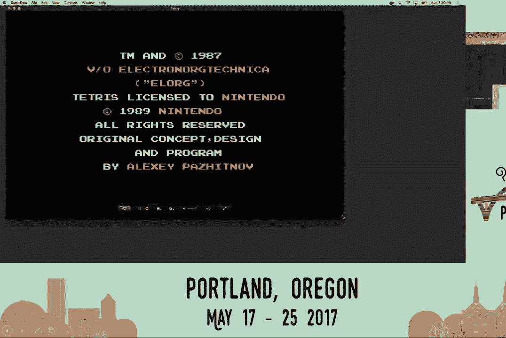

 Now this is the like x86 architecture you're not doing anything that fancy。

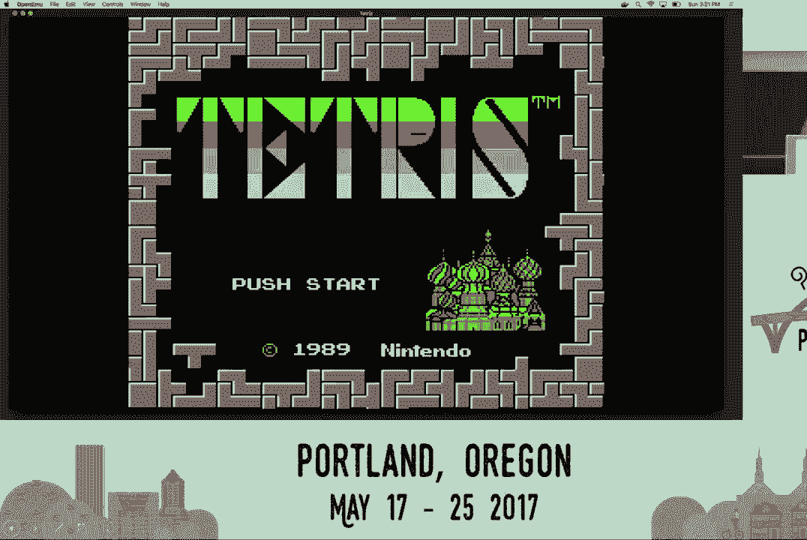

 But things are slightly different so they have different shapes and sizes。

 The goal is we look at these workloads as they come in and then we make a decision。

 So what Kubernetes does out of the box is what we call bin packing。

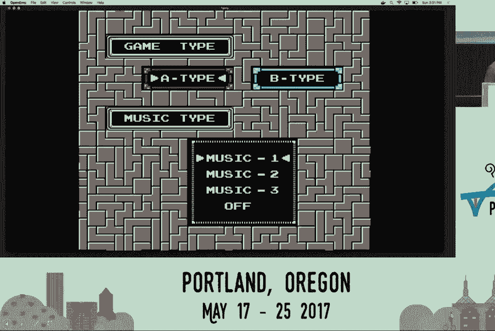

 So let's look at what that looks like。 So here we see a workload and the goal is just to place it by examining it。

 Now we look at these workloads as they come in and what we're doing now is just scheduling。

 in a way that we try to utilize all of our resources。 So this is memory and CPU。

 I'm looking at all of these workloads coming in。 Now happy you're like wow this dude is really good at Tetris。

 If you can totally talk and play Tetris at the same time。

 But this is still bin packing that's happening here。 Now you ask why is the scheduler doing this？

 Well when we examine all the pieces here what we want to do is make sure that we allocate。

 things in a way that imagine a machine learning job comes that needs that CPU。

 And you've been reserving that special machine because it costs a lot more than run things， on it。

 So right workload shows up you can place it there。

 And then when it's done you get back all the CPU and memory。 You got a Tetris on Twitter。

 So that's kind of the difference between just automation and this idea of orchestration。

 We want to have this online examination of every workload so we can actually use our。

 machines effectively。 And the goal here is that we want to be able to reuse CPU and memory the best what we can。

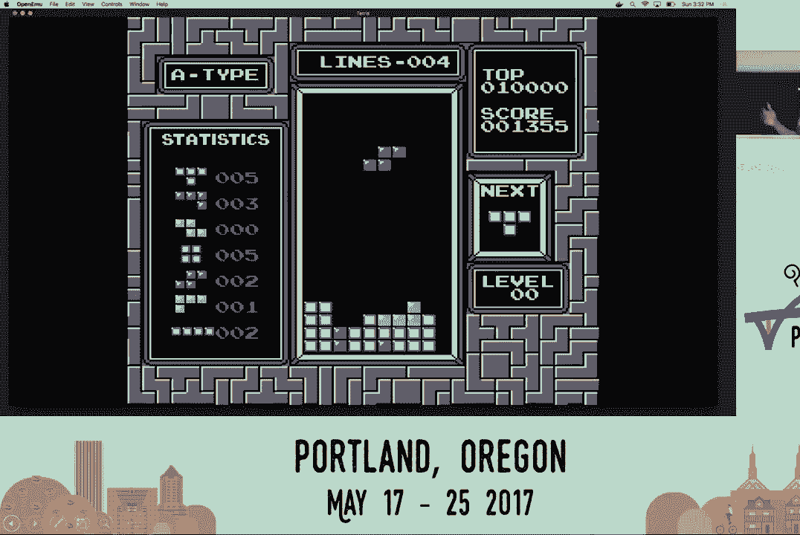

 So it's part orchestration。

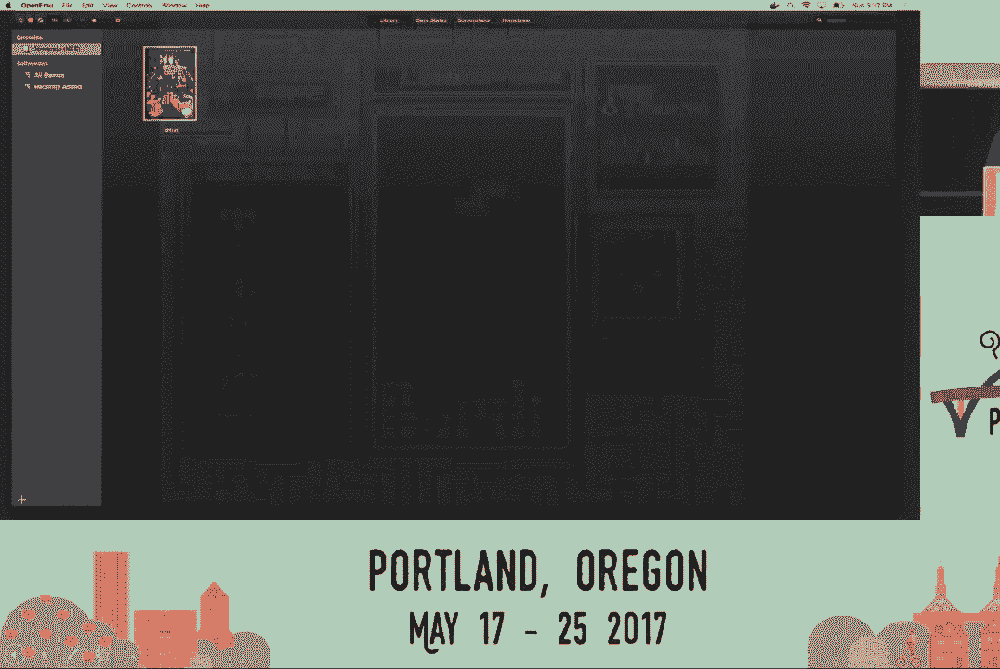

 So how do we do that for our own applications？ So for our own apps we have to make this the deployment descriptor。

 Now it's a big yaml file and it's declarative。 But what you'll see here is that we have our app name is called hello world。

 And then we're saying Kubernetes when you run this thing I want you to go grab this particular。

 image。 And when you grab that image I want you to extract it and run whatever the entry point。

 was Python at py。 And then I want you to also shape this workload。

 Now the thing you got to think about in order for us to schedule these things properly we。

 need to know the shape of the piece。 This is why we have our memory and our CPU requests so we know where it fits in the cluster。

 Okay。 So once we have this we can actually give it to Kubernetes。 So kuptl get pods。

 So what we'll do is we'll create this deployment object。

 Now can anyone tell me what machine did it landed on？ There's a brave guy like ah number four。

 Like no the scheduler is going to figure out at runtime。

 The only thing we are asking is that we declare that we want one of these things running。

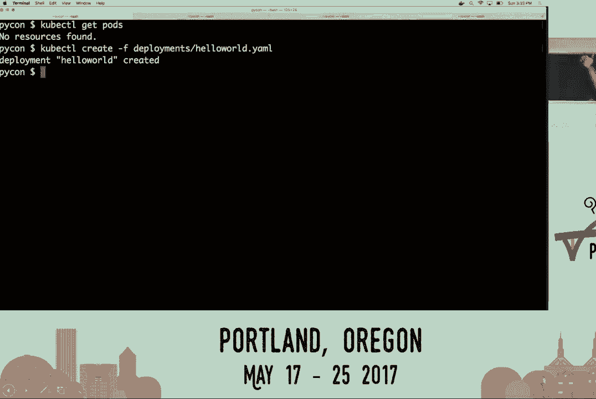

 So I say kuptl get pods。

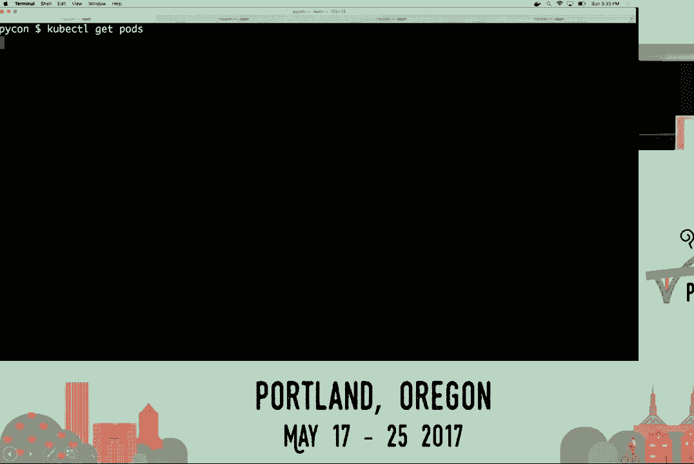

 We'll see that it's running somewhere。 Now nice thing about this let's look at what machine it's on。

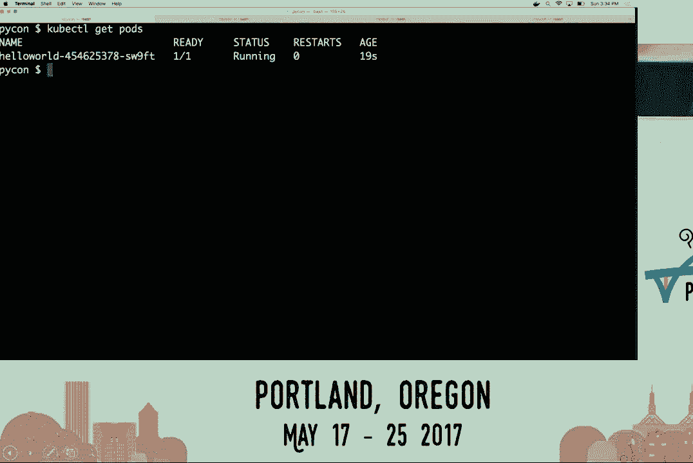

 So it's on nf6p。 And it has it's on ip address dot 90 but what happens if we were to destroy it？

 We're going to destroy the workload。

 Now depending on where you work you're either fired or you're going to get a call。

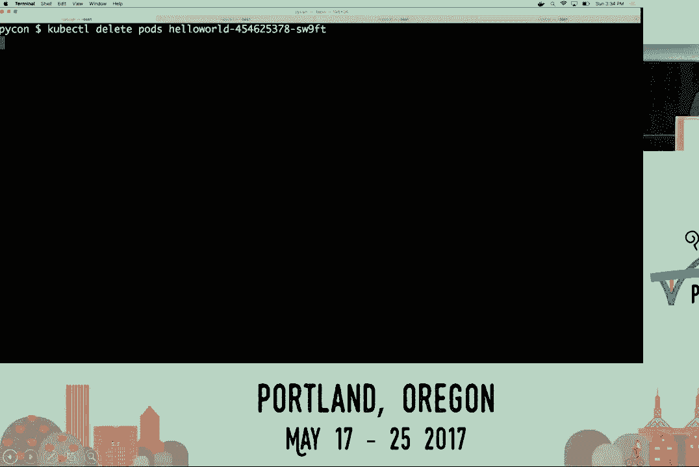

 So we delete the workload and this is what we expect。

 We expect it to be replaced quickly and it has a new IP。

 And a nice thing about a system like this is when we replace the workload we keep track， of it。

 We know it's IP address so we can hook it up to the low balancer automatically。

 Now if you've been doing this kind of work this is just from decades of people doing。

 these patterns and now we've just baked it into the infrastructure itself。

 It's kind of like the Python standard library。 It's massive because there's no reason for people to rewrite these things over and over。

 again。

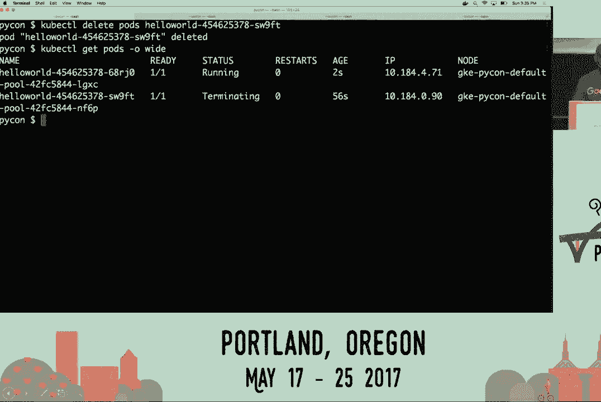

 So these are things of pretty standard issue。 If I look here get SVC we'll see that we have a low balancer that's routing traffic。

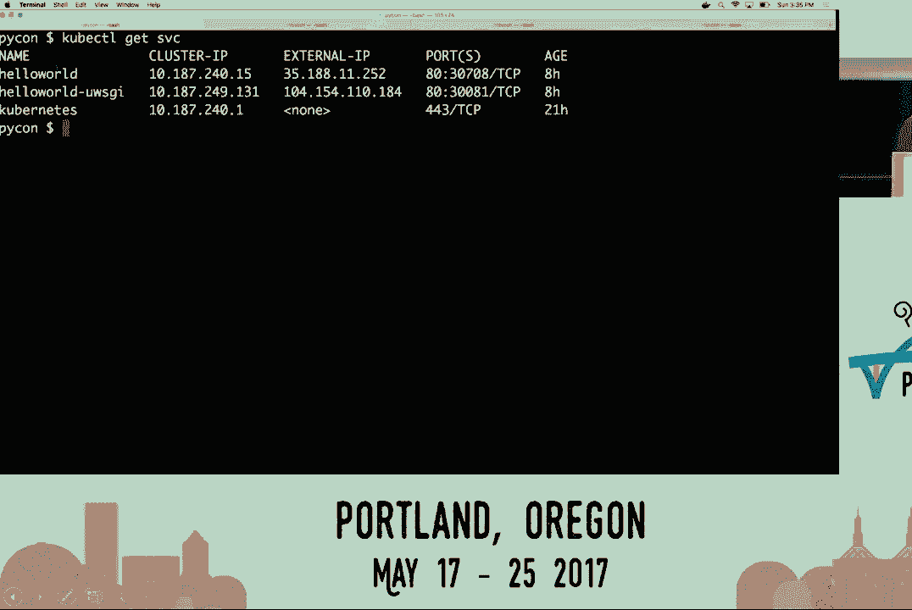

 to all of those。 So no matter what I do I have this stable endpoint where I can hit my application and。

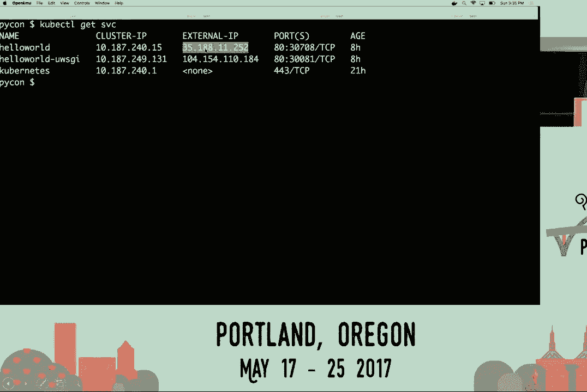

 there we go。 It's up and running。 Then it gets really complex。

 You're just like you can't run production Python by just using Flask。 Anyone know why？

 One requests at a time。 I spent the hour figuring that out。 I was like why is my show hanging？

 Won't request at a time。

 So what do we do？ So in the Python world it's common to pair it with maybe some whiskey server or NGINX。

 So what does that look like in Kubernetes？ Now I'm about to show you a lot more on the screen so be prepared。

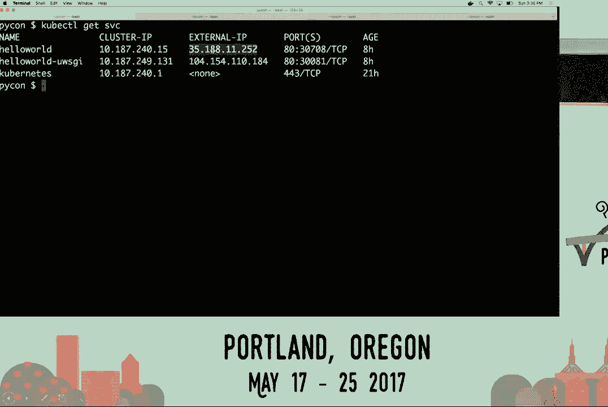

 So in the container world one would say you build an even bigger Docker file and you install。

 NGINX in there。 You put your whiskey in there and then you take a script to launch all of that in the。

 background。 Great。 You just invented an init system。 There's no reason to do that。

 What's a better approach？ Well， we don't want to pack NGINX inside of our apps container。

 We want those to be separate。 So what does that look like if you separate them？

 So here's another deployment object。 And this time we'll do things and this is a lot here。

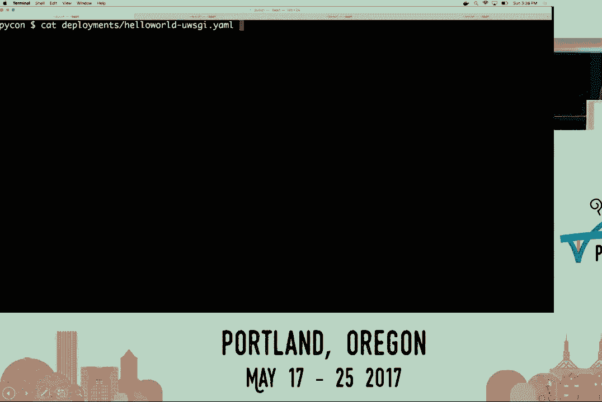

 I'm going to walk us through it really quick so we all can understand。

 This has multiple containers in them that we can stack。 Think of it like a virtual machine。

 We're just going to run as processes that are co-located together to form the logical app。

 So at the top we have NGINX。 We're using NGINX graceful shutdown。

 And then what we also are telling NGINX to do， you'll notice here in this particular， line。

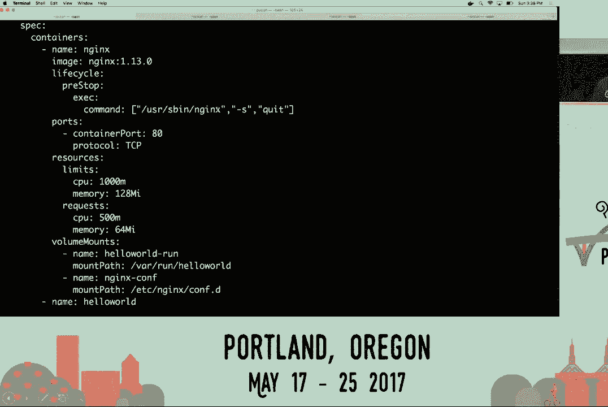

 Here we're going to share this particular path。 And what's going to be there is going to be our whiskey Unix socket that is exported。

 from our app so we can actually send traffic to it in the way proposed by their。

 particular docs。 So here we are sharing a file system。

 One container is going to write its socket there and another container is going to pick。

 it up and send traffic to it。 But the nice thing about this is everyone knows how your infrastructure is composed。

 NGINX stands alone and the app stands alone。

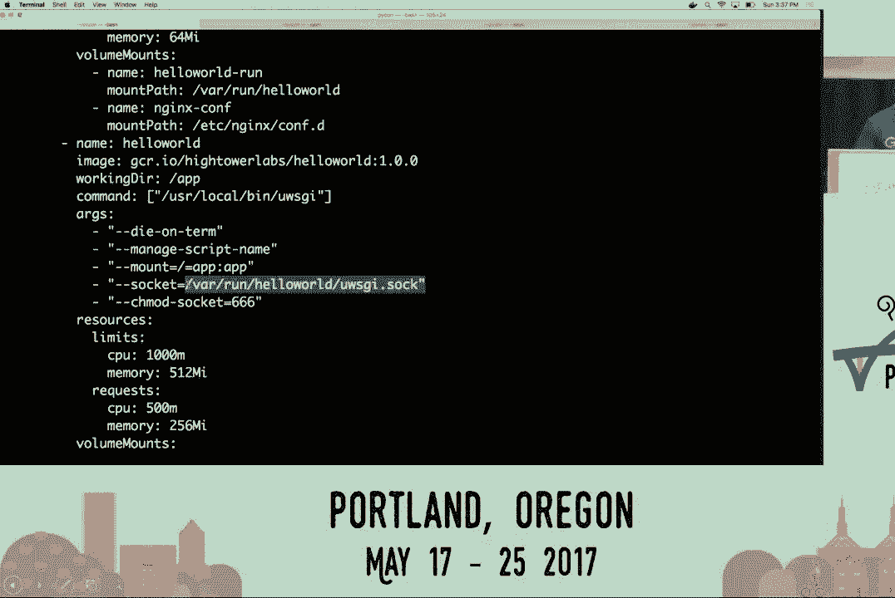

 So at this point we can actually have Kubernetes manage this force as well。 Kuberc。tl。

 Create-f deployments。

 All right， so once this is online， get pods。

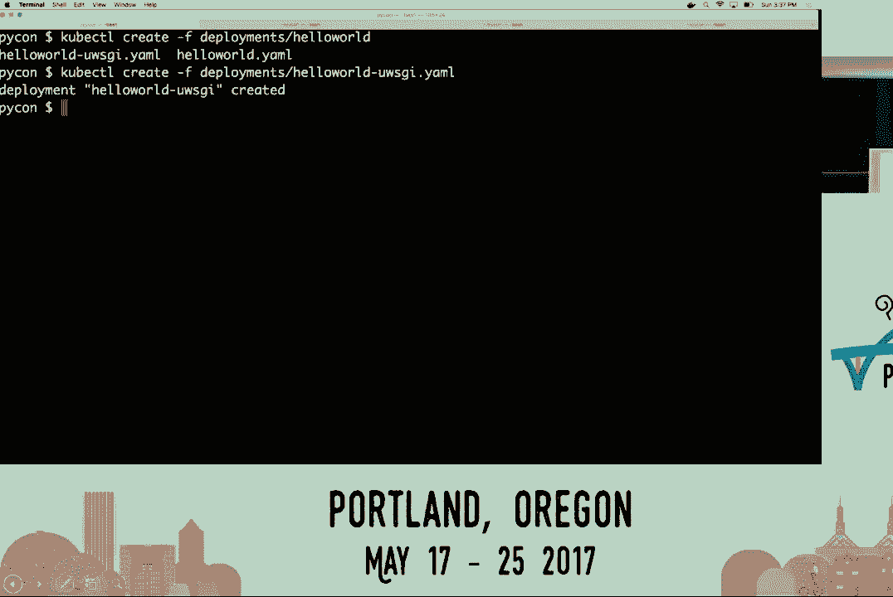

 Great。 And you'll see that there's two of two ready。 So we can actually compose these things。

 If you need any helpers， you can run your helper scripts as well。

 Now once you have infrastructure like this， you start to think about why do I need to。

 use conventional ways of interacting with it？ I've been using command line tools this whole time。

 So in the Python world， one thing that has been amazing over time in Python， Python has。

 been used as a facade for more complex systems like TensorFlow， most big data stacks。

 Python makes it super easy to interact with things。 So if I were building new tools。

 how would I interact with this？ Now I think if more Python people showed up to the Kubernetes community。

 they would also， look to simplify things。 So I found a really good Python library。

 So I wrote a new interface to Python。 And this is the first time I'm going to show it to anybody。

 OK？ So if it doesn't work， remember， I wrote this yesterday。

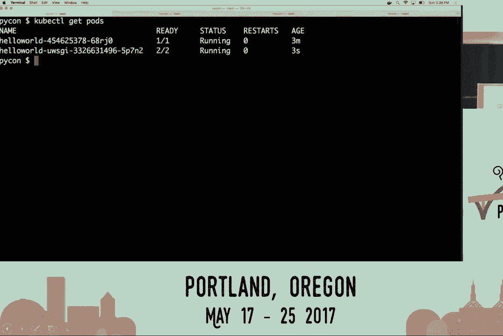

 So bear with me。 So what we're going to do is we're going to clean up here a little bit。

 Keep pods。 Keep CTO。 We're just going to delete these deployments。

 So it's really easy to spin these things up and down。 Let's clear them out。

 And keep in mind the frame of reference I'm coming from。

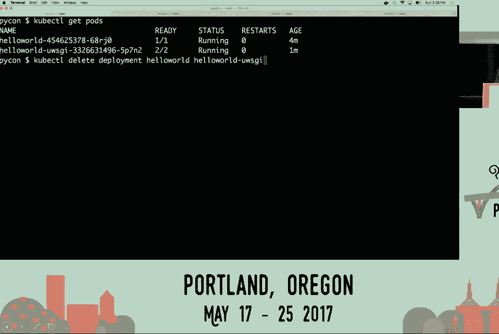

 I've been watching Star Trek the Next Generation for some reason on Netflix。

 So I really believe I'm living in the future right now。

 So when I went to go build this thing， I wanted something that felt like that。

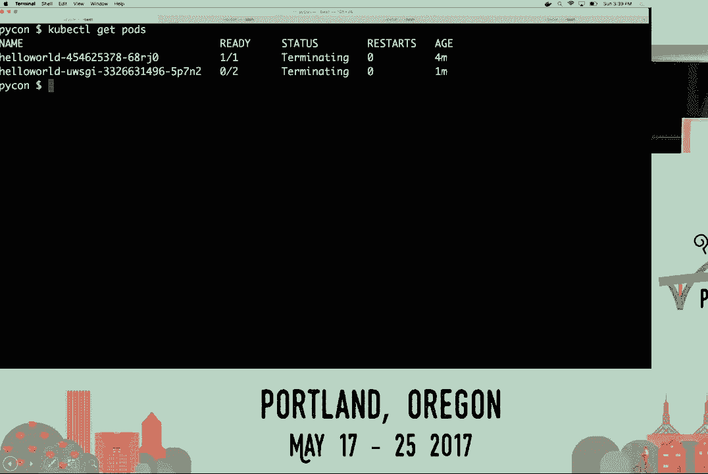

 So let's just do a watch on here。 I'm going to show you my new tool。 As you can tell。

 I'm a bit shy here。 So please don't laugh at me if this doesn't work。 All right。

 so this should terminate。 Let's clean things up。 Man， do you know what it's doing？

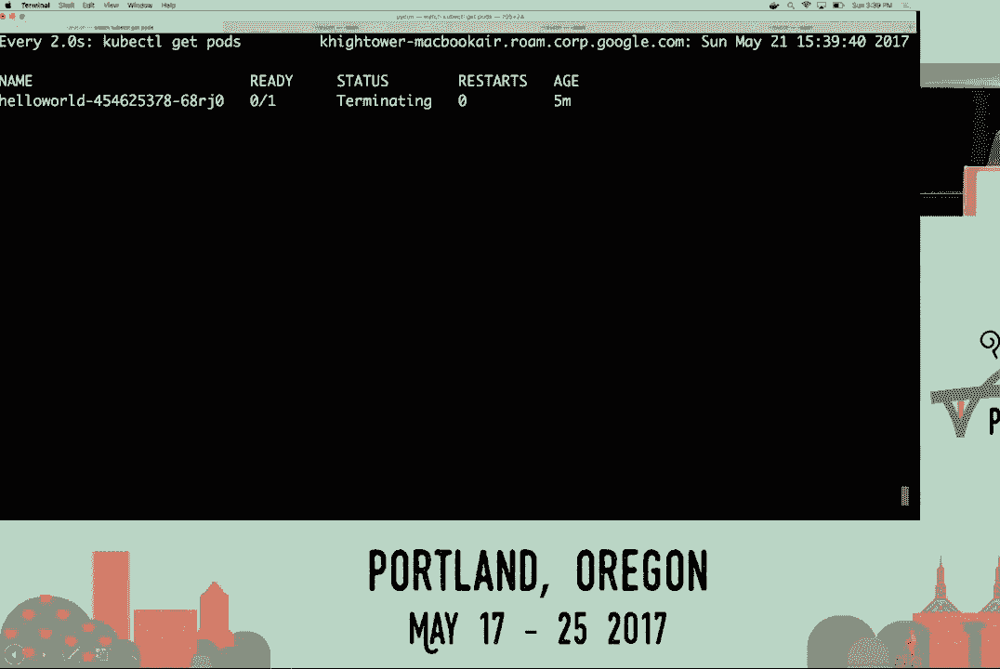

 It's trying to gracefully shut down。 All right， we're down。 OK， so we're going to try this thing。

 So in the app， I'm using what's shipped on Wednesday。 So this is just double， not smart。

 On conference Wi-Fi。 OK， Google， talk to Kubernetes。

 We may have to go to an airplane mode because I might need to bandwidth， OK？ OK， Google。

 you better work as people are watching。 I spent all night on this， too。 So talk to Kubernetes。

 No way。 Hold on。 We're not going to abandon ship on this。

 I will be up here for six hours if I have to。 You just ignore the whole speaker timer。 OK， Google。

 talk to Kubernetes。 What？ It's sitting here like， hahaha。 Oh， oh， oh， oh。 Oh， oh， oh， oh， oh。

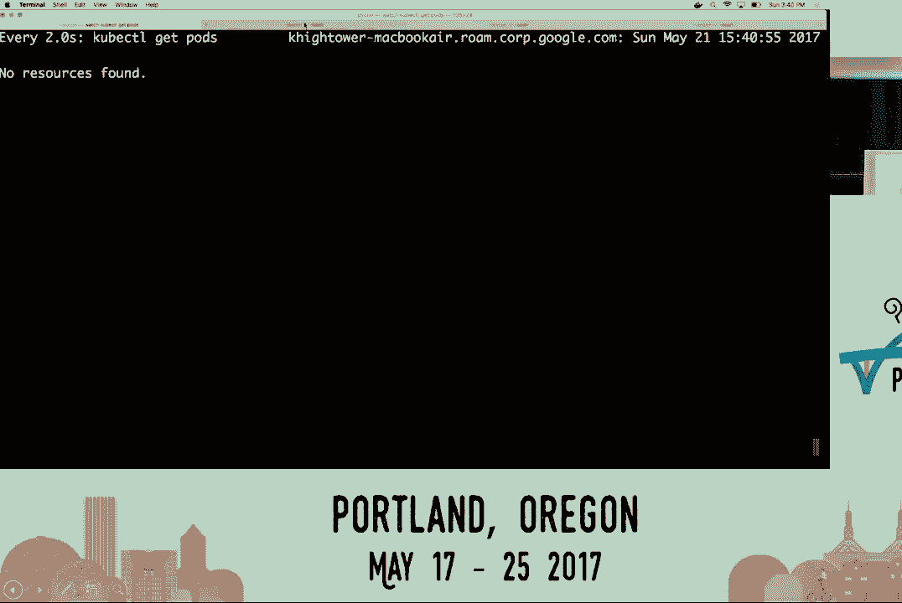

 I got it。 Let's do this。 Let's do this。

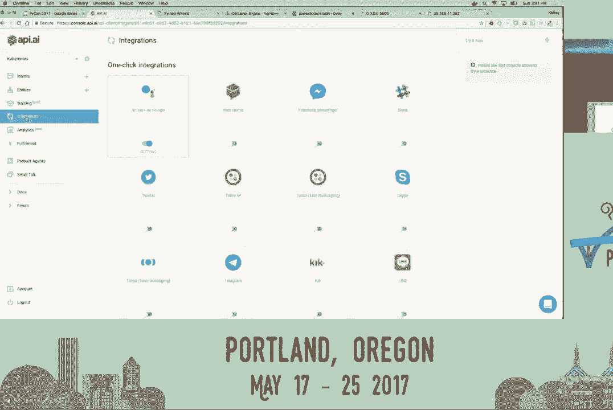

 Maybe we have to hit the test button。 Maybe we need that。

 Don't you guys like when the live demo doesn't go well？ You're like， he's going to fail。 I know it。

 My apologies。 I don't understand。 [LAUGHTER]。

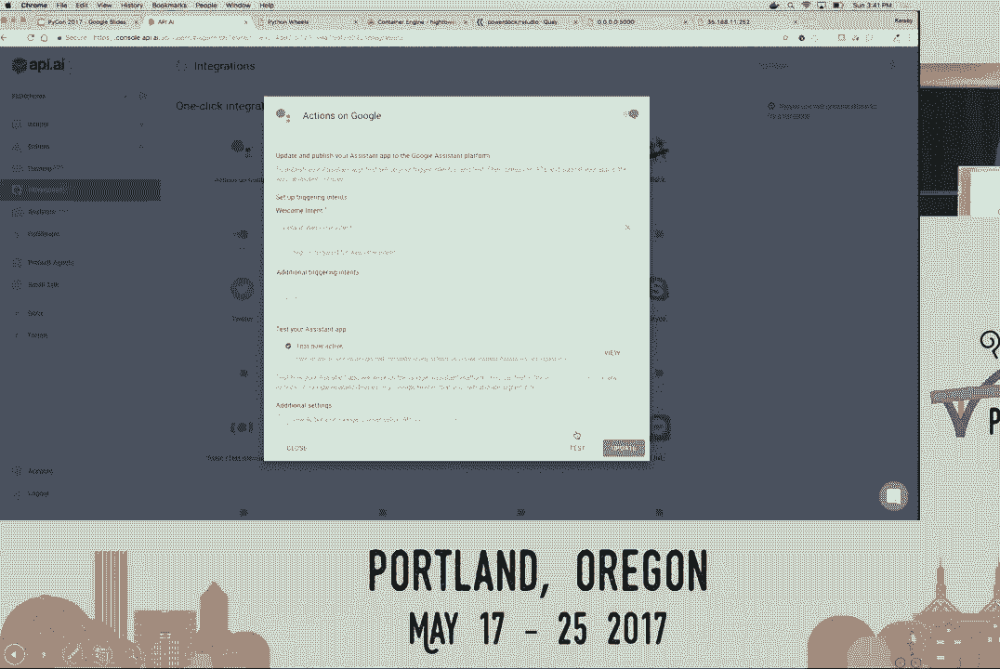

 Talk to Kubernetes。 This is the top result。 Talk to Kubernetes。 Here's the top search result。

 It's trolling me。 OK， Google。 Talk to Kubernetes。 Sure。

 here is the test version of Kubernetes cluster。 Hello， Kelsey。 Hi。

 Looks like you have a large crowd this time。 I hope the demo gods are on your side。 [LAUGHTER]。

 What's my cluster status？ The PyCon cluster is running with 10 CPUs and 37。5 gigs of RAM。

 Run the Hello World application。 What image tag would you like to deploy？ 1。0。

 Deploying Hello World 1。0 into the PyCon cluster。

 [APPLAUSE]， So we've got an app running。 Scale the Hello World deployment。

 How many replicas would you like？ [INAUDIBLE]， 500 divided by like 10 minus 40 minus 5。 [LAUGHTER]。

 5。 Scaling the Hello World deployment to 5。

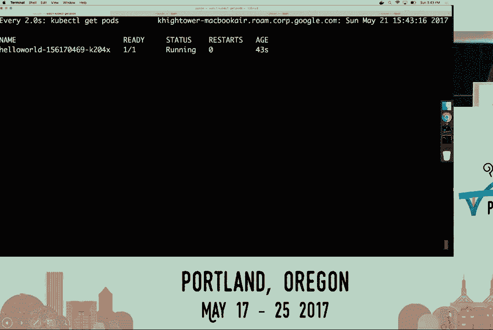

 [APPLAUSE]。

 Now， here's the thing。 It's easy to do deployments。

 How many people have ever done zero downtime deployments？ You liars。

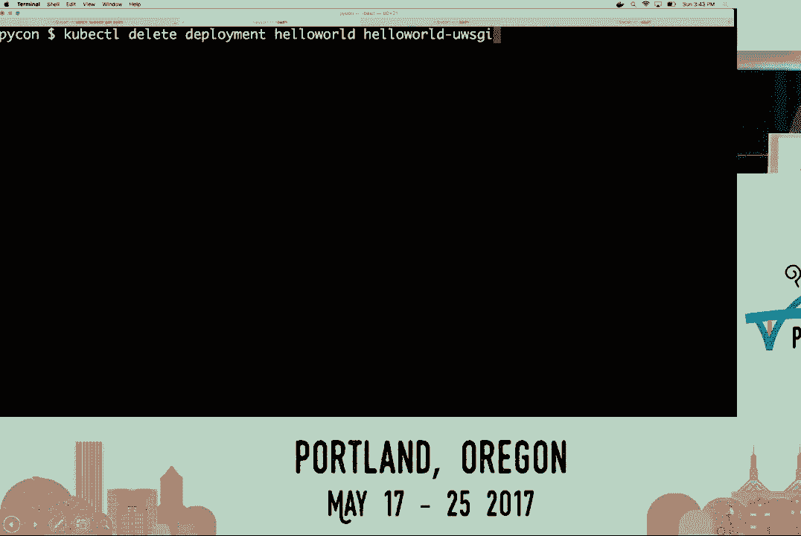

 You still got on call。 But no， it's a tough thing to do。

 So the holy grail is to do these。

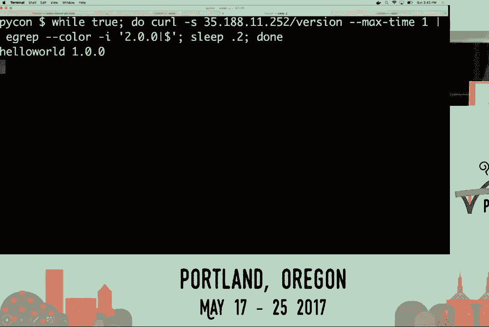

 downtime， zero downtime deployments。 So we have 1。0 running right now inside of our cluster。

 And the goal is we want to upgrade this。 So this is the nice thing about this fully API driven world。

 from the networking to the stores to the app itself。 Also around auto-scaling。

 So what we want to do here is see if we could update this in place without dropping any of the packets here。

 OK？ Update the Hello World deployment。 What version of the application would you like to deploy？ 2。

0。 Updating the Hello World deployment to version 2。0。 [APPLAUSE]， Thank you。 OK。

 I got to admit that was pretty dope。 [LAUGHTER]， And with that。

 I would like to end the presentation。 Thank you so much。 [APPLAUSE]， OK。

 I got to admit that was pretty dope。

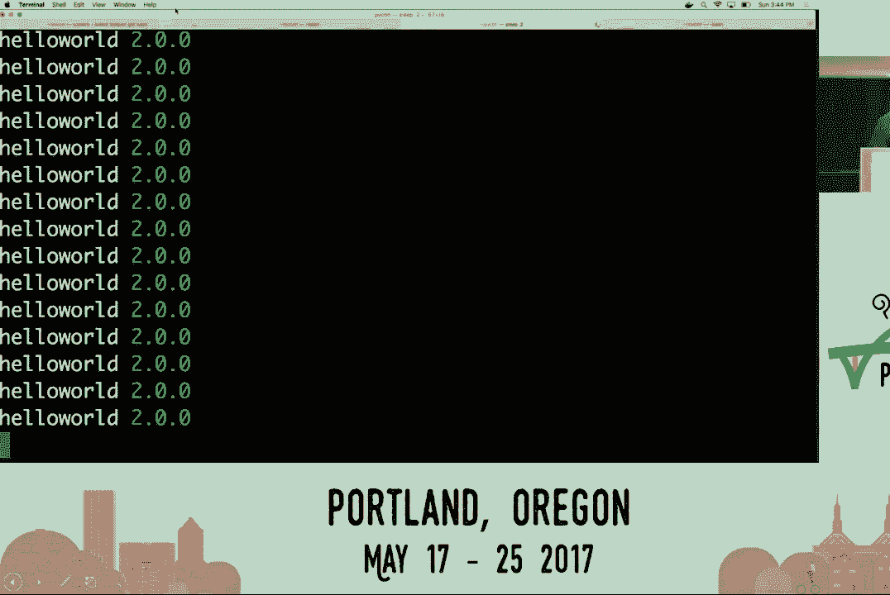

 [APPLAUSE]， Another round of applause for Kelsey Heitauer。

