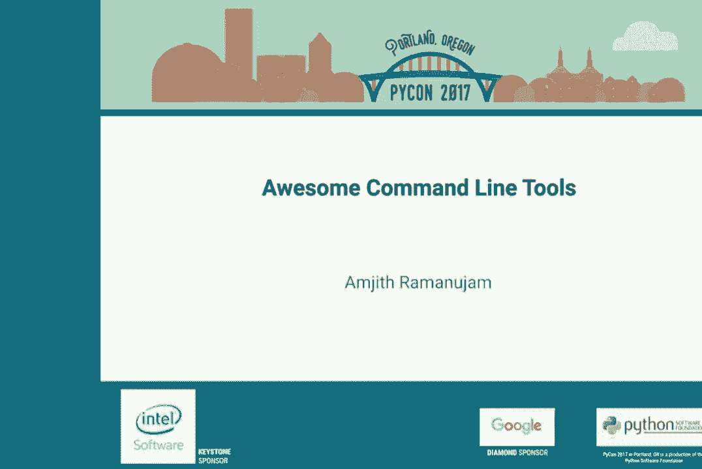
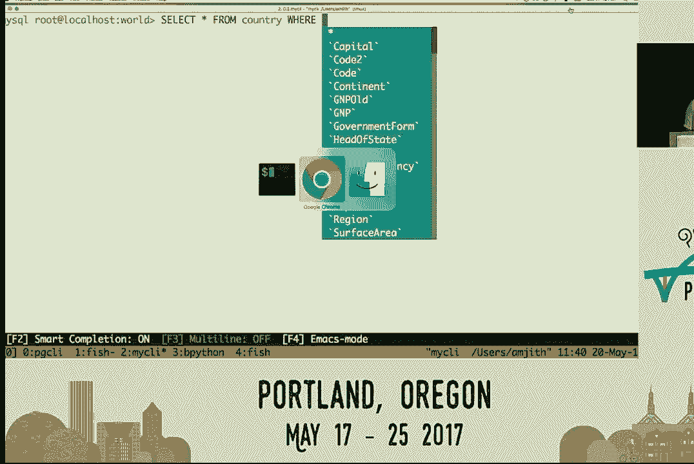
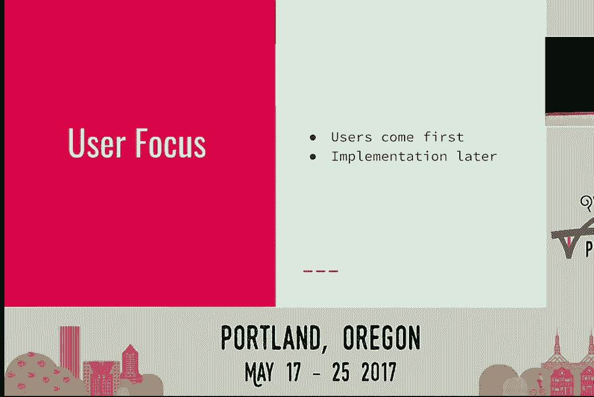
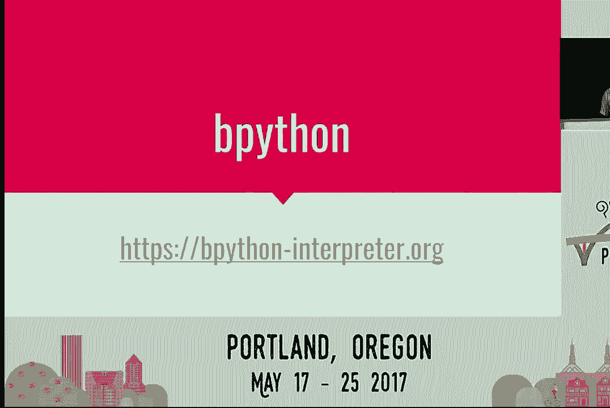
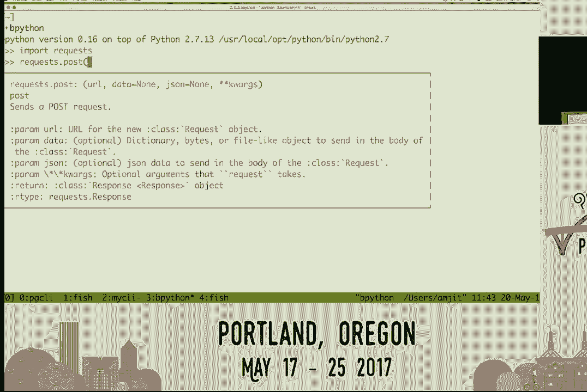
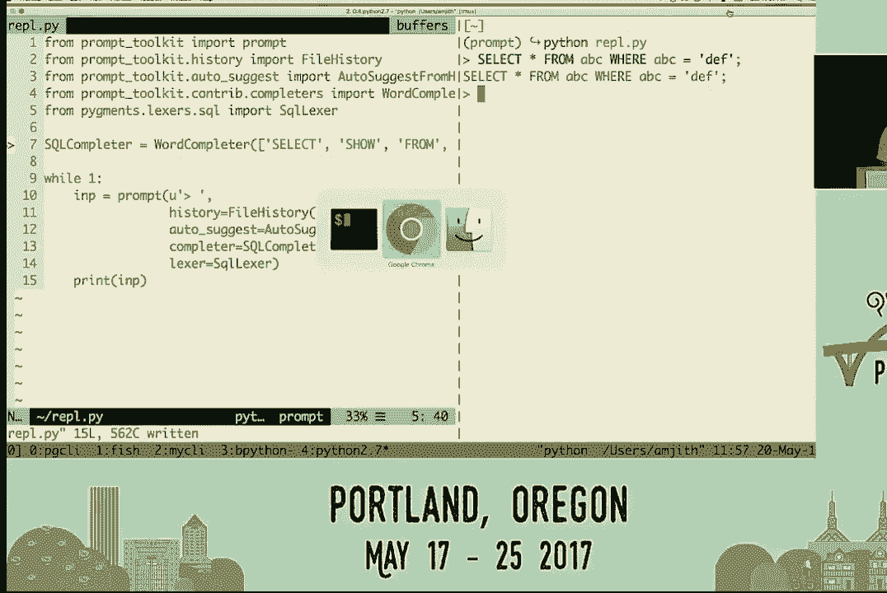
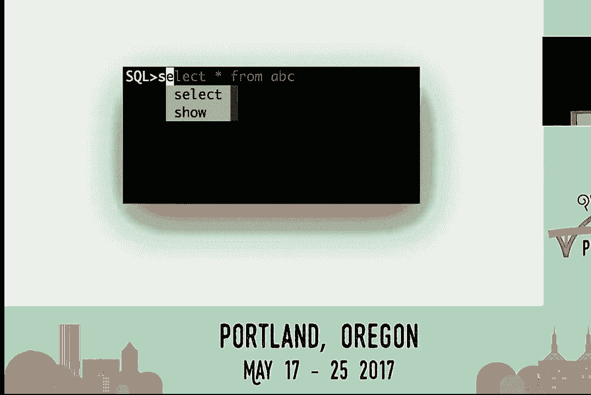
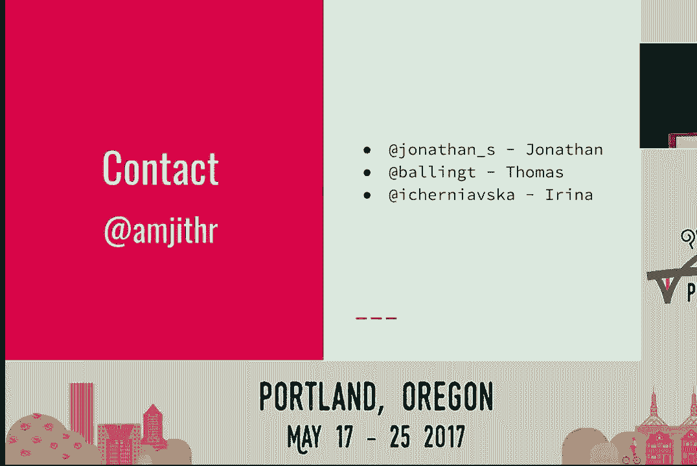
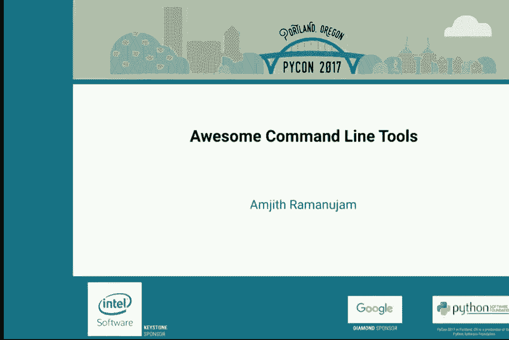

# PyCon 2017（油管点击上万合集） - P14：Amjith Ramanujam   Awesome Command Line Tools   PyCon 2017 - 哒哒哒儿尔 - BV1Ms411H7jG

 And。 [APPLAUSE]， Hello， and welcome to another talk here at PyCon。

 My name is Amjith Ramanajim。 I'll be speaking about command line tools。

 If you have any questions or feedback about this talk， you're welcome to reach out to me on Twitter。

 My Twitter handle is @amjithr。 For my day job， I work at Netflix。

 I'm part of the traffic engineering team， where we get to move enormous amounts of traffic。

 between AWS regions。 At peak traffic， we sometimes handle over 1/3 of entire， internet's traffic。

 It's a lot of fun。 But I'm not here to talk about my day job。

 I'm actually here to talk about a couple of my side projects。

 One called PGCLI and the other one called MyCLI。 They're both command line clients for databases。

 Postgres， and MySQL， respectively。 And this talk is actually about some of the design decisions。

 that we， as the core team of PGCLI and MyCLI， took in order to overcome some of the inherent limitations。

 of command line interfaces。 We took a lot of inspiration from existing good command line。

 applications that were well designed。 And I'm going to go over some of the other tools as well that。

 will be covered and where we took inspiration from。 The story actually begins about 20 years ago。

 The protagonist was typing away furiously， on a computer terminal on a cutting edge operating system。

 called MS-DOS at the time。 He was typing one character at a time because he did not。

 know how to touch type at the time。 And he finished the command， presses the enter key。

 and looks up at the monitor eagerly， waiting for the results， only to realize。

 that he made a typo and it resulted in an error。 Undefeated by this setback， he proceeds。

 to begin typing that command one more time， hoping that there is not going to be a typo。

 This happens for a couple of weeks， until his teacher introduces him to this concept of history。

 navigation。 And the way you do this is you press the up arrow。

 and suddenly the previous command that you typed comes back up， and you can edit it accordingly。

 And suddenly you are able to fix the mistakes， without having to type the entire thing one more time。

 It was euphoric。 The kid was just jubilant。 He had lots of hot chocolate that day to celebrate。

 The protagonist may have been me。 Later on， when I was in grad school， I was introduced to Linux。

 And I was pleasantly surprised that Bash kept the convention， of using the up arrow and down arrow。

 in order to navigate history。 And that was great。 And by now I have actually learned how to touch type。

 And I was typing at a furious blazing speed of 50 words， per minute。 That's right。

 I was pair programming with a friend of mine。 And I noticed that whenever he typed any file names or path。

 names， that happened to appear at a tremendous speed。 It was beyond humanly possible。

 And so I was surprised。 I'm like， how did you do that？

 And then he introduces me to this concept of tab completion。 Because now you can hit a tab。

 And the shell automatically knows whatever prefix you have typed。

 it'll try to match a file name to that。 And it'll automatically complete the rest of the name for you。

 Oh， that was another joyous day。 Much chocolate milk was had。

 The moral of the story here is not that command line tools， have awesome features， which they do。

 The fact is those awesome features are not easy to find。

 It's actually pretty hard to stumble upon these features， unless someone introduces them to you。

 By being a new user to a command line interface， it's not easy to find these features organically。

 You are either reading a man page， which is a different program from the program that you're。

 trying to use， or you have a good mentor or a friend who。

 tells you how to do these things。 Let's contrast that to a GUI application。

 Whenever a new feature or a new version of your application， is released。

 if there is a new feature in that， then there is an icon or some kind of a toolbar。

 or a menu item that is listed。 And being humans that we are， whenever， we see something new。

 we tend to poke at it， until we find out what it is。

 So how can we bring this idea of discoverability， to command line applications？

 The two features that I just showed you， which is history navigation and tab completion。

 I'm going to take that as examples， and show you what we could do to make those two features more。

 discoverable in command line apps。 And that brings us to the first application。

 I'm going to show you how we solve this specific problem， in PGCLI。

 Have you ever wondered why we call that tab completion？

 Why do we need the tab key in order to complete that？ For example， I'm going to launch PGCLI。

 I'm launching a particular database here。 And I'm going to type a select statement。

 and try and see how we could complete that。 As soon as I start typing， I am presented。

 with all the completion options here。 I have not pressed the tab key。

 And this is how I think we should， be making this more discoverable， where I could type select star。

 And again， it provides us with all possible completions， and we can start typing those things。

 We did not use any tab key in that scenario。 I'm going to switch over to a different program。

 that we are going to look at， which is called Fish Shell， which is a modern shell。 I mean。

 the word modern is--， it might not be appropriate， because it's been 20 years， since it came out。

 But it's an alternative to bash and Z-shell， where this is a feature that goes even。

 beyond the history navigation of up and down arrows。 If you've used bash。

 there is a special keyboard combination， called Control R。

 which allows you to search through the history。 So you press Control R。

 you type up some of the partial string， from the command that you type in the past。

 and it'll try and bring up that command from the history， by searching through the history。

 And this allows you to navigate history， in a much more random manner。

 rather than the linear manner， in which you are used to using the up arrow and down arrow。 Again。

 it took me a couple of years， before I found Control R。 And once I found it。

 there was I would always prefix R。 I would always。

 start my commands by typing Control R and try to SSH。

 into the machine that I SSH like last week or yesterday， or something。

 Now， if a shell kind of obviates the need， to start every command with a Control R。 And the way。

 this solves this is as soon as I start typing， it will start to search through the history。

 and it will start recommending things for me。 And it is automatically suggesting things for me。

 And I could just press the right arrow， and make that happen or press Enter。

 And that command will be executed。 So I could do work on， and I have been working on prompt。

 or make a new virtual environment， all those things。 As soon as I start typing， it pulls up。

 that command that was similar to the one， that you are trying to type from history。

 and it starts suggesting that。 This is a fantastic way in which discoverability。

 was solved in fish shell for that particular feature that is。

 We looked at some specific examples， but in general， the idea behind discoverability。

 is that be a little bit more forthcoming。 Do not hide your features behind a special key。

 because those special combinations， are going to make it undiscoverable。

 So if you want your features or your make your program more， discoverable。

 just be a little bit more forthcoming， with your features。

 The next item that I would like to talk about is user focus。

 What I mean by user focus is that whenever you have--。

 whenever you're implementing a application or a program， or a feature， the users always come first。

 Think about how you could make your program the most intuitive， for the user。

 Absolutely powerful for the user。 Don't think about how much harder。

 is going to be to make the implementation of it。

 The implementation should always come next。 In order to demonstrate this， I'm。

 going to start with my CLI， one of the other programs， that I showed。 But before showing my CLI。

 I want to show you my SQL。 And my CLI is an alternative for MySQL。 So MySQL。

 I'm launching a database， launching the REPL here with the database。 I start to type SEL。

 and then I hit a tab， and nothing happens here。 I expected at least some kind of tab completion。

 Let's redo that again by doing all caps on everything uppercase， and I hit a tab key。

 and now it actually auto-completes for me。 That is a simple little tweak。

 All we have to do is make that auto-completion case， insensitive。

 and it would be that much more easier for a user， to use it。

 And it is a simple thing that the programmer could have done， but they apparently didn't。

 And after the select star from， and I hit a tab key。

 and it asks me if I would like to see all 811 possibilities， that it's going to offer。

 And I certainly don't have 800 tables in my database。 I say yes。

 and I am presented with every single keyword， that is available in MySQL。

 Let's contrast this with how my CLI handles a similar scenario。 Once again。

 as soon as I start typing， it's going to start suggesting things。

 And you'll notice that it is not case sensitive。 So I could do select star from。

 and it automatically， suggests only tables that come after the from keyword。

 because it knows that these are the tables in that current， database。

 And it goes even further when you choose where it'll only， give the columns inside of that table。

 because it knows to show only the columns inside of that table。 Thank you。 [APPLAUSE]。

 When I first got started with my CLI。

 I had actually taken the approach of doing， what MySQL was doing， which is show all the keywords。

 and let the user type them out， and try to figure out， from the menu。 But then later。

 I figured that actually being context sensitive， about the completions will make it that much more powerful。

 for the user to use。 But at the time， and still now， there， is no open source SQL completion engine。

 It was ridiculously hard to implement。 And it took me another two。

 three weeks before I could actually， call that thing complete。 And it was in a broken state。 I mean。

 it was not a very well polished one。 And thankfully， there are now smarter core developers。

 for my CLI who have done a much better job of doing this。

 completion。 So the point about the user focus is that make the users， always come first。

 Whenever you are implementing a new feature or a program， think about what the user wants。

 Think about how to make it most intuitive and absolutely， powerful for the user。

 Do not worry about implementation。

 Implementation comes next。 You can make that happen。 I kind of saved the best for the last。

 B-Python is the favorite interactive shell， that I absolutely love。

 I've taken a lot of inspiration from this， and stolen a bunch of ideas from here。

 You'll see why in just a second。 Once again， I'm going to start out with Python to show you。

 what could be improved。 I'm going to import a module， a type IMPO， and I hit Tab。

 And a Tab key gets inserted。 I don't think there is any business in a Tab key in a Python。

 code at all， ever。 Thank you。 [APPLAUSE]， So I've imported requests， and I want to do requests。

 And I hit a Tab key again。 I'm trying to see what is available in requests。

 How can this be improved？ Well， let's look at what B-Python does here。 I do IMP。

 And it not only gives me the list of items， that could be completed， it also。

 does Fisch style autoscitation， where， I have typed this command before。

 So I could just press the right arrow key and proceed。 And I do requests。dot， and it gives me。

 all the available things that I could do。 I could do a post command if I wanted to， instead of get。

 And if I open a bracket here， it shows me， the different arguments for that particular method。

 And not only that， it actually shows me， the doc string for that method。 So I never。

 ever have to leave the terminal in order， to find out how to use this particular method。

 I think this is a powerful， powerful tool。 [APPLAUSE]。

 And one of the common things that I get a pushback on from users。

 when I show B-Python is that， of course， the Python's default。

 thing could do most of what you have shown。 All I have to do is copy this particular snippet。

 that I got from Stack Overflow， put it inside my Python RC， file， and suddenly。

 if I hit the Tab key， it will do some of the things that you actually showed。

 And I don't have to install a new program。 My counterpoint to that is that configurability。

 is the root of all evil。 I'm actually paraphrasing things from Fish Shell's design。

 documentation here， which I've taken a lot of inspiration from。

 One of the things that is mentioned there， is that whenever you have added a configuration option。

 to your program， what it means is that your program was too。

 stupid to figure out what was best for the user。 By definition or by extension， it's。

 also calling the person who implemented the program stupid。

 So I do completely understand that configurations， are essential for some situations。

 because certain things are taste-based。 They are subjective。 Say， for example， a color scheme。

 picking a color scheme， I mean， you might think that's polarized， is the best default。 And I agree。

 I mean， it is a good， sane default。 But some other person might want a lighter color scheme。

 or a much darker color scheme。 In that case， I think subjective options are OK。

 So if you are going to add a configuration option， make it a one where the program really。

 can't figure out what the two users taste are。 Tastes are。

 All right。 We looked into three specific issues， with command line applications--， discoverability。

 user focus， and configurability。 And we showed some concrete examples。

 from some of the existing tools， such as fish shell。

 bee python， PGCLI， and my CLI。 At this juncture， you might be thinking， well。

 I learned about these tools。 I'll start using them in my workflow。

 But it looks like these are some advanced features。 These are going to be hard to implement。

 When I'm writing my own interactive shell， either for my internal use or I plan on releasing something。

 to the users， these things are much harder to implement。 And these things are--。

 you might have competing priorities， like deadlines。 Or you might be thinking。

 this is only for internal users。 So they're going to be forced to use my tool anyway。

 so I don't really have to care。 I've done that before， so it's not uncommon。

 And I completely want to empathize with that sentiment。

 But what if I told you that implementing all these features， is actually not that hard？

 What if I told you that they can all， be done in under 10 minutes with merely 10， maybe 11。

 statements in Python？ In fact， this is a checklist that I typically。

 use whenever I'm implementing an interactive shell， which。

 is you must always have a persistent history， which is just because you quit a program。

 and you come back to it， it doesn't mean you， have to start from a clean slate。 Because obviously。

 you have typed some important commands， in the past， and you would like to be able to recover those。

 So having a persistent history is a great thing。 The ability to search the history。

 either using a command R special key， which is common these days and people power users of shell。

 already know about it， or using the fish style suggestion where。

 it goes above and beyond and doing that。 And EMACs key bindings。 This is another hidden feature。

 maybe not so hidden anymore， because a lot of people are used to using bash。

 Pressing control A will take you to the beginning of a line。

 Pressing control E will take you to the end of a line。

 and control P and control N are equivalents of up arrow， and down arrow。

 And these are default key bindings， that comes with any shell， bash， z shell， and even fish shell。

 everything。 And I think it's essential that any time a user is。

 interacting with an interactive shell， they have come to expect these things to be available。

 So that's good to have。 Page output is when your output that you're trying to print。

 is much larger than it's going to fit in the page， then it is good to send it through a pager。

 so the user doesn't have to scroll up and down。 It's just a convenience。

 And the last three are the items that I showed just a minute， ago， which is autocompletion being。

 able to automatically trigger them without having， to type the tab key。 It's a very nice to have。

 Having minimal configuration。 In fact， if you don't have any configuration at all， much better。

 And adding syntax coloring。 So I did not show--， or I don't know if you noticed this or not。

 but all the shells that I showed today--， my CLI， PGCLI， Fisch shell， and B Python， all of them。

 have syntax highlighting automatically。 So as soon as you start typing them。

 it will appropriately color those commands for you。 We're going to implement most of those things。

 in the checklist using just a single tool or a single library， called prompt toolkit。

 I'm going to show you how。

 And we're going to actually implement a REPL。 A REPL stands for read， eval， print， and loop。

 which means you're going to read a user input， evaluate what needs to be done with the user input。

 print the results of that evaluation， and loop back and start taking user input from the user again。

 I believe I still have 10 more minutes left。 How many of you would like to see me do this live。

 and how many of you want to just--。

 all right， do it live。 [LAUGHTER]， OK。 So we're going to create something from blank slate。

 There is nothing in this file。 I'm going to start from scratch。

 First thing we want to be able to do， is read an input from the user。 And typically。

 if it is just a pure Python program， without any libraries imported， then， you know。

 standard library comes with the input command， or the input function or raw input function。

 But we are not just building any REPL。 We're building an awesome REPL。

 So we're going to take the prompt function that's， provided by prompt toolkit。

 So I'm going to pull in the prompt function。 And it has the same signature as the input or the raw input。

 where you give it some kind of a prompt。 And whatever the user has typed will go into the INP variable。

 And to keep things simple， our eval is going to be a no app。

 And what I mean by that is whatever the user has typed。

 we're just going to print it back to the user。 So it's just an echo REPL， if you will。

 And we obviously want to loop back and make this， into an infinite loop。

 So we'll just put a while loop there。 OK， so how does that look like？

 So now we have a REPL that can take input from the user。

 and it can do just echo it back to the user。 It does not have history。

 It does not have any kind of auto-completion， no syntax highlighting， nothing。 But we can fix that。

 Obviously， if I press Control-D， it's， exiting with a trace back。 But again。

 we can catch that exception， and do something useful with it。

 But we're not going to do that right now for the sake of time。

 So the next thing we want to do is add some history， to this REPL that we just built。 And again。

 prompt comes with everything you need in order， to build an awesome REPL。

 And I'm going to add a history option to it。 And import file-based history。

 Because we want this history to be persistent。 We don't want it to go away when we've。

 quit a particular session。 And store it in a file that's called a history。text。 So now， I type A， B。

 C， D， F。 I can press the up arrow， down arrow。 And I can even do select from。

 And if I do a Control-R， it allows me to search things。 And that's all it took。

 It's literally seven lines with white space including。 And that is having persistent history。

 And it also comes with the E-max key binding。 So I can do Control-A， Control-E， Control-B。

 Control-F， do all of that stuff。 This is all built into the PROM toolkit。

 This is already a good working REPL that we could use。

 But we're going to continue to make this awesome。 So the next thing that we talked about was Control-R is nice and all。

 But we just talked about making it more discoverable。 So we can take the idea from fish。

 And let's automatically suggest things from history， that matches this scenario。

 It matches the command that we are trying to type。 And again， it comes with Autosuggest。

 And you can Autosuggest from various things。 But we're going to Autosuggest from history。 OK。

 And now it's actually Autosuggesting right there。 And I could select that and this is coming from history。

 And again， just one line to add the fish style autocompletion。

 The next thing we talked about was we don't want to be using tab keys， for completion。

 We want it to be automatically completing the things， as we start typing things。 Once again。

 PROM toolkit to the rescue。 I can provide it with a completer。

 And since I'm typing select statements， let's make this into。

 let's say that we are writing an SQL Lite CLI。 So we want to be able to provide automatically complete。

 SQL keywords in this case。 So PROM toolkit comes with a lot of different completers。

 And I'm going to pick one called--， sorry， I'm blanking the name Word Completer。 Thank you。 OK。

 And the way Word Completer works is as soon as you start typing。

 it is going to do a substring match on a list of strings， that you have provided as its corpus。

 And it is going to start providing the suggestions from that。

 So we need to instantiate a Word Completer object， and initialize it with a list of keywords。

 So let's call our new object as SQL Completer， because that's what we're trying to build。

 And it's a Word Completer。 And it takes a list of items， and let's say select， show--。

 let's keep it simple， just four items maybe， like from and where。

 And we made a big deal about how MySQL was being all case-sensitive， with its completion。

 So let's ignore case。 Thank you。 Thank you。 And we passed the Completer to the prompt function。

 And let's see how that works。 So now， I start with a statement， and right away it is trying to。

 suggest things that I could be doing。 And it still has fished style completion that I could try and use here。

 And again， that is all it took to actually build a REPL that can auto-complete。

 that can do auto-suggestion like fish， and that can do history navigation。

 with the up-down arrow and all of that。 Another item we kind of briefly mentioned is using syntax highlighting。

 In Python， there is a powerful library called Pigments。 If you don't know what Pigments does。

 it does syntax highlighting for your code， and it comes built in with syntax highlighting for a lot of different languages。

 Since we're dealing with SQL here， we could pull the SQL's syntax highlighting。

 lexer and automatically feed it to prompt。 And prompt book it is built in a way where it will automatically work with。

 the Pigments' lexers， and you could do auto-complete syntax highlighting for that。

 So let me feed the SQL lexer to this。 Obviously， I need to import that。

 so that is coming from Pigments。 So I am in fact using more than one library here。

 but I think we'll not worry about that。 Okay。 And now I have a select statement with auto-completion。

 and that has syntax highlighting here。 Ta-da！ [Applause]， Thank you。

 [Applause]， By the way， all the code that I typed is available here in the slides。

 and I will be posting the slides on my Twitter account pretty soon。

 And this is our checklist that we started with， and we finished everything。

 except for paging through the output。 If you are interested in knowing how to do the paged output。

 check out Click。 Click is another command line library for Python that allows you to。

 echo any output through a pager。 And it is cross-platform compatible。

 so it will work right off the bat in Windows as well as Linux。 By the way。

 prompt toolkit is also completely cross-platform compatible。

 so you could use this in the program that I wrote will also work in Windows as well as Linux。

 These are some of the resources that I shared today， PGCLI， MyCLI， Fischl， B-Python interpreter。

 and prompt toolkit。 If you have any questions or comments about any of the things that I've set in this talk。

 you can reach out to me on Twitter @amjithr。 The people that I've listed on the right。

 Jonathan Slender， he's the author of prompt toolkit。 He's here at @picon in the first row， actually。

 And Thomas Balinger， he is a core developer in B-Python。 He's also here at @picon。 And Irina。

 she is the lead maintainer for PGCLI。 Actually， I've given the reins to Irina。

 and she's doing a fantastic job。 She's also here at Picon， and she's somewhere here in the talk。

 So feel free to reach out to any of them， and they'll be happy to help。

 That's it。 Thank you very much。 Goodbye。 [applause]。

 [BLANK_AUDIO]。

