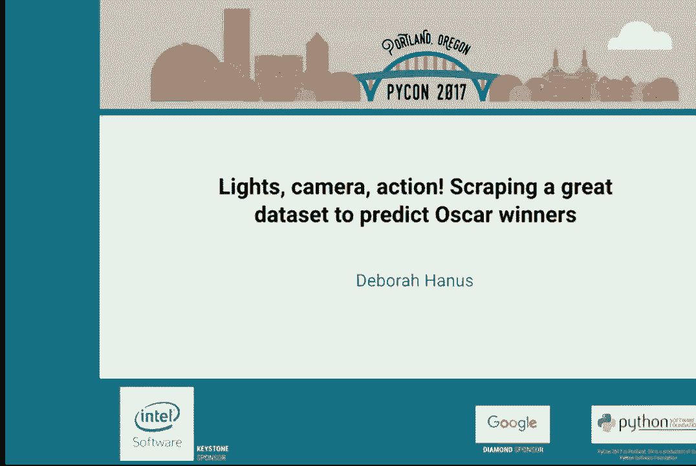

# P16：Deborah Hanus   Lights camera action! Scraping a great dataset to predict Oscar - 哒哒哒儿尔 - BV1Ms411H7jG

 2017。 Please， before we start， if you do have a device that makes a noise， please convince。

 it not to make a noise or else I'm going to come over and stare at you personally。 Our。

 next speaker is Deborah Harnas and she's going to be teaching us about predicting Oscar， winners。

 Please make a feel when welcome。

 Hello everyone。 Today I'm going to talk to you about how to predict box offices and。

 Oscar winners using things you found on the internet。 To start off with， I'll tell you。

 about how I got to doing what I'm doing today。 I did my undergraduate and my masters at MIT。

 where I studied computer science and did all of my undergraduate research developing computational。

 models of how people see and perceive things。 Then I spent a year as a Fulbright scholar。

 in Cambodia learning about how education translates into job creation。 Then I worked as a software。

 engineer at a startup in San Francisco。 And then I decided to quit life and become a PhD， student。

 So now I'm a PhD student at Harvard studying machine learning。 As part of that。

 I get to work on a lot of exciting data related projects like this one。 So to start off with。

 we'll talk about how to build and use a great data set。 The first。

 and probably most important step is to define a question that you can actually answer。 Then。

 you want to acquire good data to answer that question， explore the data and draw conclusions。

 from that data。 And today we'll step through all of those processes。 So we'll start by。

 defining a question we can answer。 And today we are all going to pretend that we are movie。

 producers。 We have money and we're going to pay for movies to be made， but we want to。

 get something in return。 Preferably a huge stack of cash。 So how can we answer this question？

 What we really want to know is will this movie be a box office hit？ But it's pretty hard。

 to answer that question。 How do you define that？ So a better way that we might phrase。

 this is what is the likelihood that my movie will be a box office hit given that it has。

 certain features？ And another way that we could ask this question is what attributes。

 of a movie are correlated with box office success？ So that is the question that we're。

 going to be answering today。 So now we want to acquire good data。 So first let's start。

 off with what is good data。 We want it to be relevant to the problem at hand。 We probably。

 want it to be relatively structured。 If it's stored in some sort of table or something， like that。

 that makes it a lot easier for us to acquire。 Ideally we want it to be relatively， complete。

 If it's not relatively complete， there's a whole field of research and another。

 talk in how to deal with that。 So some of the places that we found data for this project。

 are one box office mojo， which is this great 90s style site with this excellent table。

 which gives you a lot of information about the top movies， the top grossing movies in， each year。

 Another great place is Rotten Tomatoes。 Also has a lot of really structured， data。

 For every movie you have things like a rating。 Wikipedia is perfect for things， like this。

 It has that great box in the corner which has the title of the movie producer， director。

 meaning that it's formatted in the same way， making it much easier to grab。

 And also IMDB is another great place to get this sort of data。 Okay， so now how can we。

 get this data？ One way is we can use an API which is just a group of functions that are。

 defined like get movies which will go and get all the information for movies and that is。

 usually defined by the person producing the data。 So in our case we used IMDB pi。 And the。

 other is to write a web scraper。 And to write a web scraper we need to start by getting。

 all the text that is in the web page， bringing it down to our computer， making it queryable。

 and then we can do stuff with it。 So to start off with we're going to make an HTTP request。

 to get the HTML。 This is what box office mojo looks like。 Isn't it beautiful how structured， it is？

 So there are a couple of interesting things to point out here。 The most interesting。

 right now is the URL because the URL actually tells us exactly what information we're going。

 to get from this。 So we're going to zoom in and look a little bit more closely at this。

 The after the question mark there are a number of parameters which define what information。

 we're going to get。 Most relevantly there is a page number。 The page equals one and then。

 we're looking at the items for 2017 we can see from the last parameter。 So we can get。

 information from all these pages。 So this is just a snippet from a jupyter notebook and。

 we're going using a request to make a get call using that URL and we're looping through。

 all of the pages。 Notably we're pausing and between each grab and we'll talk more about， that later。

 And then we're putting all the items in a dictionary and if we look at the。

 first item in the dictionary it is just raw HTML。 Very， very unreadable raw HTML。 So to。

 make this more usable rather than using a bunch of regular expressions we can make。

 it queryable using something like beautiful soup or pie query。 So what those do is they。

 translate something like what's on the left the HTML into a sort of parsable tree that。

 you can just go through you know like get all the child nodes or things like this。 So if。

 we go back to the site we have that table and we can go right click view source we get that。

 completely unreadable what of text。 However if you look there are some patterns particularly。

 if you were to control F and find the title of some of the movies you would see that everything。

 in the table has font size equal to two。 So you can go and grab everything with font size。

 equal to two。 And now we have this list of all of those items。 If we select one of them。

 we can see that that is the top grossing movie Beauty and the Beast。 But it still isn't quite。

 in the format that we want。 So the Beauty and the Beast title is in this link tag so we。

 go and find the link and then we get text and then we have the title in the form that。

 we wanted it in。 So this looks pretty easy right。 Hopefully I made it look relatively。

 easy but it's actually often is not that easy。 So we're going to go over some common problems。

 that people run into。 One is rate limiting。 So if you go and you try to scrape a webpage。

 often people will the host will try to identify whether you are a person who is clicking and。

 requesting information or whether you are a machine which is requesting information as。

 quickly as you can。 So it's a good idea whenever you are writing a web scraper to use a time。

 sleep method to put a bit of a delay in there which is approximately the delay at least of。

 a human clicking through。 So usually one second is enough of a delay。 You can also limit access。

 to your data based on who you think a person is。 I gave this talk once before and someone。

 afterwards told me a fantastic story。 They were working at an open data company and they。

 had a -- and so most of the data was open but there were some things that they kept to themselves。

 and they had a competitor who was not very sportsman like and scraping their webpage to。

 get all of their open data。 So they wanted to prevent this and the way they did this is。

 they put the first way is they put an API key up so that they could tell who was accessing。

 the information。 However then their competitors spoofed the Google web crawler API key so it。

 looked like Google was crawling through their site。 So the way they ultimately got around。

 this is they made a one page like an Angular JS app so that it was less easy and then the。

 way to get through that is to use browser tester like selenium which can click through。

 each of the items for you and then you can access the data that way。 Okay so we've talked。

 about how to get the data and now we're going to start exploring some of this data。 So there。

 are a number of factors that we can explore given the data set that we have。 You could。

 imagine that a movie budget might be important。 Maybe a movie that has a really big budget。

 is going to make even more money。 IMDB rating might be important。 You would suspect that。

 good movies would make more money。 Maybe if a movie comes from a power studio like Warner。

 Brothers maybe it'll make more。 The amount that it makes in the opening weekend can also。

 be predictive of how much it'll make in the long term。 You might imagine that there's some。

 sort of saturation of opening theaters that would be good。 If you open a movie in too few。

 theaters there will be people who want to see it who can't。 And if you open a movie in too。

 many theaters you'll have a lot of empty seats and you start losing money。 Seasonality there。

 might be some movies that people like to watch it sometimes rather than others like Christmas。

 movies。 And then the MPa rating this is like if it's G， PG， etc。 So we're just going to start。

 by exploring the data and making some basic plots。 So this is going to be the gross revenue。

 versus the number of opening theaters。 Looking at that it looks like there actually is sort。

 of an inflection point。 That is a good number of theaters for you to use right there around， 3500。

 So this is interesting。 When we do create this movie we want to probably open it in about。

 3500 theaters。 So now look at something else。 Gross revenue versus quality rating。 And so。

 you would expect that if a movie is good that might be predictive but it looks like it is。

 not at all。 We would normally look if it went along that line that would mean that there。

 was a correlation but it seems there is absolutely no correlation。 Good movies do not make more。

 money。 And so then we can also look at the amount of money that a movie makes in opening weekend。

 versus how much money it makes in general。 And it looks like if a movie makes a lot of。

 money in that first opening weekend then you can expect it to make a lot of money in general。

 So this looks like it is relatively predictive。 So then we combined all of these into a multivariate。

 regression。 And we found that the model seemed to fit quite well。 Great。 So we have explored。

 the data a little bit。 I have taken you through some of the things that we looked at。 A lot。

 of this analysis for the determining if something was going to be a box office it was a lot。

 of linear regression。 So now we are going to draw some conclusions。 We found that budget。

 helps but it does not help very much。 We found that timing is really important。 It seems。

 like December is a great release date which sort of makes sense。 Like December is often。

 a time when a lot of people go to the theater to watch movies with their family。 You are。

 much more likely to go with 10 people in December than you are another time。 We found， that P。J。

 and G-rated movies make more which I think also makes sense。 I think a lot of。

 people find it awkward to watch other such movies in a larger group。 And we found that。

 the money made in the opening weekend is very important。 Okay。 So we have talked about what。

 it takes to make money。 So now what does it take to win an Oscar？ So to answer this question。

 we will use the same steps that we used before。 We want to define a question you can answer。

 acquire good data， explore the data and draw conclusions from the data。 So that now we are。

 going to say all of us are actors。 We are maybe a linear in order to caprio and we want。

 to figure out if we act in this next film are we going to get an Oscar？ So the question。

 that we really want to know the answer to is will this movie win an Oscar？ An easier question。

 to answer might be what is the likelihood that this movie will win an Oscar given that。

 it has certain features or what attributes of a movie are correlated with the movie winning。

 an Oscar？ Okay。 So now we need to acquire the data。 And this turned out to be a little bit。

 harder than we expected。 IMDB we did this entire project as a class project for a data。

 science class meaning that we did everything in approximately two weeks。 And we found an。

 IMDB has this API that lets you make a call to get certain movie information but they also。

 sell their information via a professional service so they don't want to give out too。

 much information through this。 So they make their API extraordinarily slow。 Like a good。

 five to ten seconds per movie。 So we were able to get some interesting information but。

 well we originally wanted to look at all of the recent movies between you know saying。

 the last 10 or 15 years we found that we just that that was going to take a month for。

 us to get all of that data。 So we had to go back and reevaluate our questions。 We couldn't。

 answer any of these。 But what we did find is we did find a CSV of all of the movies that。

 had been nominated from 1980 to 1996。 So then we were able to do an analysis reevaluating。

 the data that we had we were going to said given that a movie has been nominated for。

 an Oscar since that's all we have we don't have all the other movies that existed。 What。

 attributes are correlated with winning and can we make a classifier to predict Oscar winners。

 Okay so we started out by exploring some of the data。 And here we had a sort of different。

 set of factors that we could explore。 We looked at the movie nomination category so。

 you could be nominated for best picture you could be nominated for best cinematography。

 We also had a lot of really great binary variables based on the thematic content like。

 is this a movie about family does it have violence in it is it about war does it contain， smoking。

 I thought that was a great one。 And then you can imagine perhaps dramas are more。

 likely to win an Oscar than horror movies so maybe movie genre effects things。 It's possible。

 that where the movie isn't made might affect things or win during the year the movie debuted。

 So we started to explore some of this data。 First we looked at the countries associated。

 with winning Oscars and we found that if the movie given that a movie was nominated if。

 it came from Italy or Spain it actually had a very good chance of winning even better。

 than the United States。 Then we looked at we wanted to look at the effect of timing like。

 when the movie comes out。 So first we looked at the number of winning movies per month。

 and if we look at this it looks like December is the clear winner we definitely want our。

 movie to come out in December。 But then we realized we thought more about it and we realized。

 that there might be different number it's possible everyone is in on the secret and there might。

 just be a lot of movies coming out in December。 So instead so we normalize this based on the。

 number of movies that came out and we found that well December is not quite as obvious。

 you definitely want to release your movie in the last half of the year between July and， September。

 And I haven't gone through all of our analyses here but next up is drawing。

 conclusions from the data and we found that films nominated films made Italy and Spain。

 have a good chance at winning like we just saw。 Films are more likely to win if they're。

 released later in the year。 Violent movies really don't do well unless it's a war film。

 Oscars love war films and then the violence is okay。 And if a film is nominated for best。

 picture it has a very good chance of winning but if it's nominated for best cinematography。

 it's probably not going to win。 Okay so what have we done in this process？ We defined two。

 answerable questions。 We built a web scraper using requests in beautiful zoom。 We explored。

 our data。 We used it to answer our questions。 And I wanted to acknowledge the rest of my， team。

 I asked them all for photos of themselves and they all sent me photos of birds and that。

 was when I knew that it was going to be a great project。 And then for those of you who。

 want to get started scraping on your own some of the resources that we used were for building。

 a scraper are requests and beautiful super pike where for making the text queryable。 For。

 analyzing the data we used Jupiter notebooks site kit barn stats model。 And I'd say one。

 of the best ways to learn is by looking at example projects。 And what we did is we in。

 addition to putting together a website that sort of summarizes a lot of our results we。

 also put all of our Jupiter notebooks online where we stepped through exactly how we got。

 the data what our thought process was in each of the analyses and building the classifiers。

 And so I encourage all of you to take a look at that。 And if you're looking for a starting。

 point for your next data science project。 And obviously you should feel free to reach。

 out to me anytime。 That's my Twitter handle。 And thank you very much。 Thank you Deborah。

 If anyone has any questions if they'd like to come up to one of the microphones， in the aisles。

 Hey so one of the learnings from the first thing that you explored was that if you have。

 if you ever release in December then your earnings are really high。 And then when you。

 looked at the Oscars you saw that again you know later half of your lease at you and Oscars。

 Do you think there's a correlation between earning a lot of money and winning Oscars。

 and if you do then does it make sense do you think that model would predict better if you。

 were using the earnings instead of when it was released。

 That is something that we thought about and we really wanted to do that analysis but we。

 ran into issues because like I like I said with the IMDB pie we weren't able to get the。

 information from all of the years that we wanted in order to run that but I agree that。

 that is potentially a very interesting point to go through and just from what I saw I think。

 I would believe that that is plausible。 But so how do you explore something like that like in this case you're using I'm using common。

 sense to say oh you know you're earning more therefore you're probably winning the Oscars。

 but in a more esoteric situation how would you deal with such correlations like how would。

 you what would you recommend as best practices。 Having trouble answering that question on the spot but I'm happy to talk to you more about。

 it afterwards。 Hi I was curious about how you knew if a movie contained violence or smoking was that data。

 from IMDB as well or is it just sort of。 That was we got this spreadsheet a CSV with all information about all of these movies that。

 had been nominated from the 80s to I think 1996 and it actually gave us all of those variables。

 so they had a bunch of variables which were like is this about a war one zero so it was。

 really nice because we were able to look at all those binary variables。 Thank you。

 Are there any more questions？ If there are no more questions。

 I have a question how can you in the end when you make your prediction proof how good your。

 prediction is or measure how good your prediction is from so that the new movie comes out and。

 you wouldn't say about if it might be the most current or not how much percent or so。

 Yeah that is actually a great question and I had a deleted section of my talk that went。

 over that in fact。 So usually you would train a classifier on previous data and then you can measure the。

 accuracy on some test data so you would need to look at probably some recent years so perhaps。

 you could use the data from 2016 since that's passed and just remove whether or not one。

 in Oscar and then see how accurate your prediction is。

 Another really important thing to think about when you do that is to look at the baseline。

 so in this case when we're looking at how accurate a classifier is you want to start。

 by saying something like rather than just saying we predict 70 we have 70 percent accuracy and。

 that's great you want to look at well what if we predicted them all to be losers。

 It turns out that that's actually pretty close to 70 percent accuracy so you want to look。

 at if everything is a loser everything is a winner and then you can use those as baselines。

 and see if your classifiers better than that。 Thank you very much。 Thank you。

 Are there any more questions？ Thank you Deborah。

 Thank you。 [BLANK_AUDIO]。

 [BLANK_AUDIO]。

 [BLANK_AUDIO]， [BLANK_AUDIO]， [BLANK_AUDIO]， [BLANK_AUDIO]。

