# P1：Kenneth Reitz - Pipenv The Future of Python Dependency Management - PyCon 2018 - 哒哒哒儿尔 - BV1Ms411H7Hn

 All right。
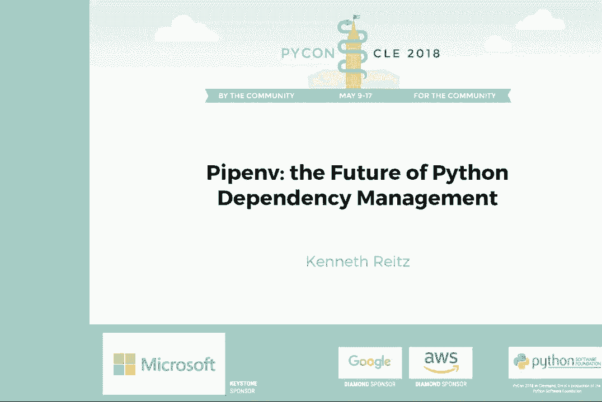

 Thank you everybody for coming to the session。 How many of you use requests？

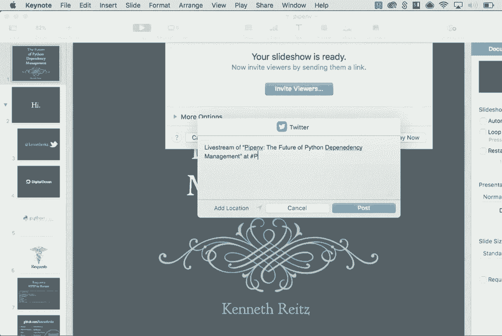

 Yes。 Oh wow。 Kenneth， that must really make you happy。 Thank you very much。 [APPLAUSE]。 I have to say Kenneth is one of my Python heroes。 And finally。

 the reason I wanted to chair the session， is because I'll get to meet him in person。 He's a Python hero for me because he writes APIs， that are designed for humans unlike most。

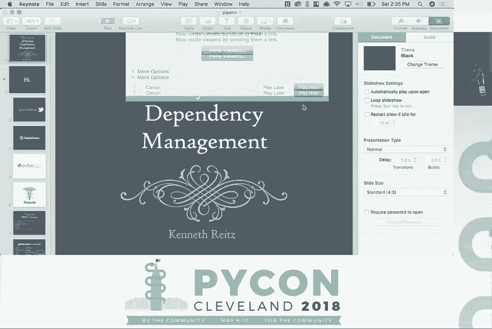

 of the scientific computing community。 All right？ So and as we all know， and I'm part。 of the scientific computing community， so I'm allowed to say that。

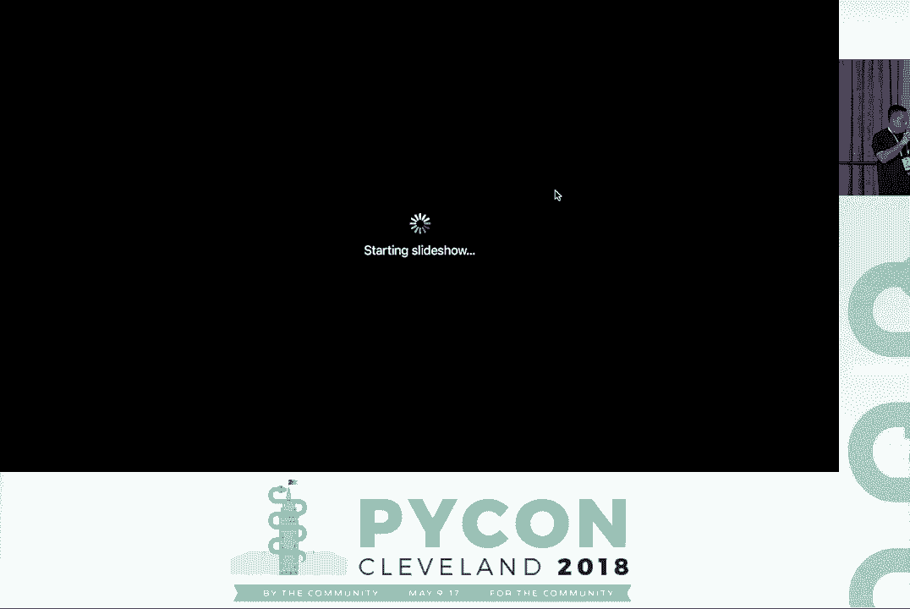

 He's the creative requests。 And as we saw， a lot of people use requests。 It's a very popular package。 And he's here to talk about pipen， which is another tool。

 designed for humans。 So with that， Ken， please take it away。 [APPLAUSE]， Hi everybody。 Welcome to Python Day 2， I think it is。 Is everyone having a good time so far？ All right。

 I want to say a special thanks to Ernest W。 Durban， for organizing the event。 I think he's done a great job here in Cleveland。 And I'm looking forward to next year as well。

 So this is the future of Python dependency management。 So hello。 My name is Kenneth writes。 If you'd like， you can follow me on Twitter at @KennathRites。 Every follow is appreciated as always。

 I work for DigitalOcean。 This is a new thing for me。 I was working for Heroku， but I just。 switched jobs about five days ago。 I wanted to make sure I was representing my new company。

 at Python。 So I signed the paperwork and went straight here。 So I'm still going through onboarding and everything。 So I can't speak officially on anything yet。

 but I'm very excited to join the team。 And I think it's the world's most approachable infrastructure。 as a service。 So if you have any questions about DigitalOcean。

 or if you think there's any opportunities for us， to collaborate or anything you want to know。 you can come ask me about that later。

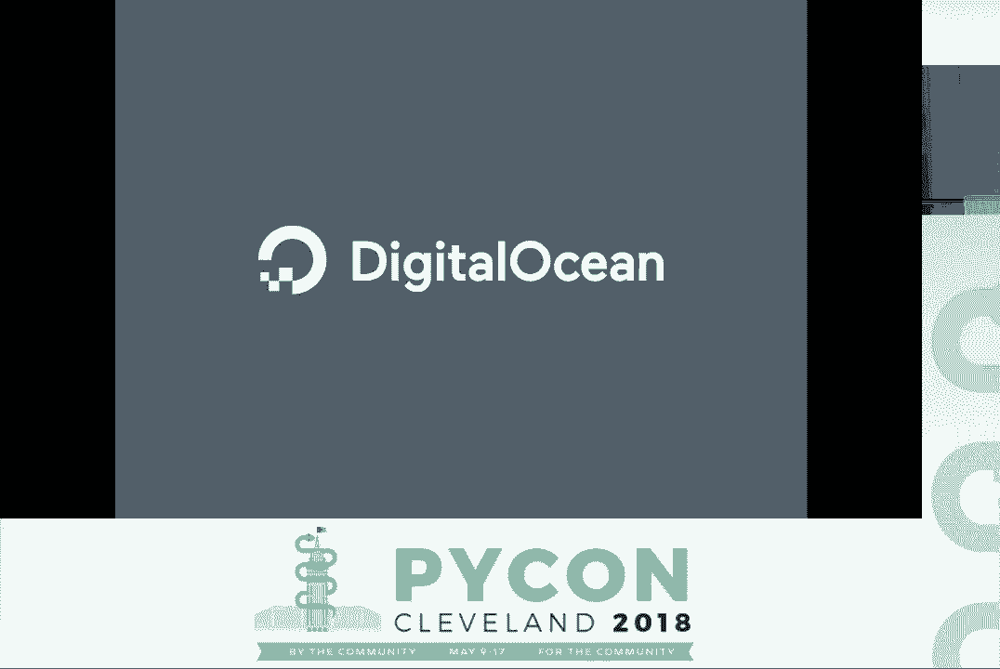

 I'm also a board member of the Python Software Foundation。 I'll be giving the lightning talk about that later today。 But the Python Software Foundation。

 is an organization that exists to protect， the intellectual property of Python， as well as run。 this event effectively。 That's where most of the revenue for the organization。

 comes from is from Python。 And that's one of the reasons Python exists。 And it's a wonderful organization。 Anyone here， everyone in the room， I assume。

 is invested in Python because you're at Python。 So I encourage everyone who isn't already a member。 to become a member。 It's free。 It's also always-- donations are always welcome。

 But you can sign up and become a member。 And then if you want， you can become a voting。 or an active member so you can help the vote and help。

 steer the future of the language with board decisions， and stuff like that。 So if you know who I am。 it's probably， from the Request Library， which is HTTP for humans。

 It looks like this。 And it allows you to make HTTP requests very easily。 on the internet with Python。 Before this library existed， it was very difficult to do this。

 because there was your lib2 and other tools that， were not as friendly， I'll say。 And this has been very popular。 And I'm very thankful for the community for being so。

 abrasive of this project。 It's very humbling。 Some other projects are on GitHub。 If you maybe recognize me from some of these， OSX GCC installer is responsible for the now--。

 it's called Xcode install--， Xcode select -install。 It lets you install GCC and your Mac without installing， the 5， 6 gigabyte Xcode。

 That's because of my project OSX GCC installer。 And I have a bunch of other stuff， Maya records。 tablet， et cetera。 And the import this podcast。 But anyway， that's enough about me。

 I'm here to talk about packaging， the Python packaging。 So who here uses Python packaging？

 So I said， who here doesn't use Python packaging？ Let's do that instead。 One person。 Two people。 So Python packaging affects almost every single person， who uses Python。

 And it has a bit of an interesting history， because people。 have come to Python at different periods of time。 I've been using Python since about 2007。

 And so I've got-- which is not--， I know people who have been doing it for much， much longer。 So that's not a respectable 10-year of Python。 But compared to some people， it is。

 So I have some glimpses into the history of packaging。 I like to share my perspective on the history。 So there's some things that might be a little unclear。

 about the current state of things and why things are the way。 they are and how much progress we've actually made。

 So in the past， when I started writing Python， if you wanted to install something。 what you would do is you would download this like tarball， effectively from the internet。

 And then you would unzip it。 And then you would run setup。py install。 into your site packages directory。 And it would get installed。

 And this is the de facto way to install Python packages。 Some people would actually just take。 unzip it， and drag it into their site packages folder。

 And that was kind of the way that you would manage your Python， dependencies。 And that was the way it used to be。

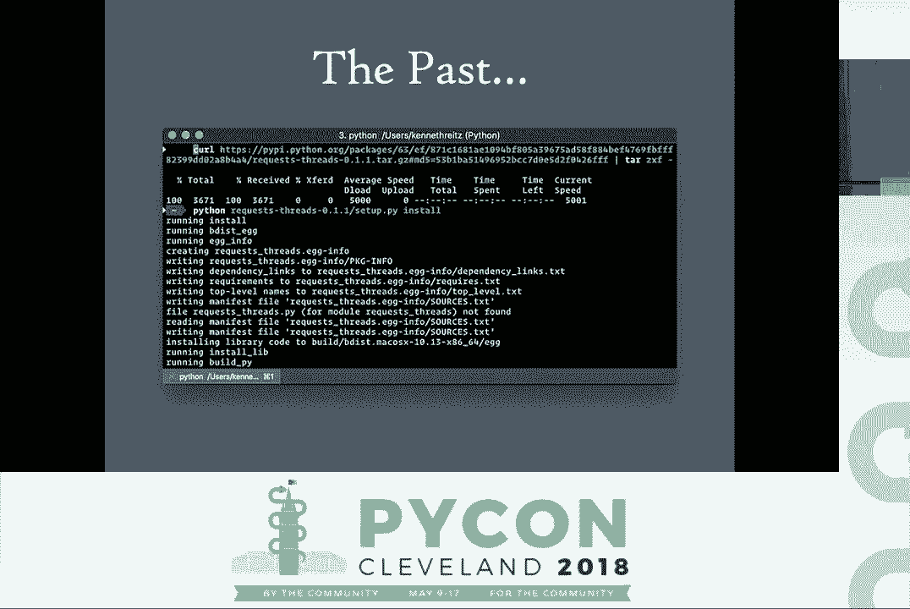

 There were some problems with this approach， obviously。 The cheese shop I may refer to is。 a nickname of the Python package index， which is pipi。org now。

 And it was merely an index of packages， not a sole package host。 So right now。 if you go to register a package on pipi。org， you have to upload files with that。

 You can't say the files live on this other server， that I'm hosting somewhere else。 So before。 you could have registered packages， and say， oh， this website and this website， and this website。

 it was just an index。 So that was problem A。 So the packages were often， hosted elsewhere。 If it was running on the server， which served the entire Python， community。

 it was running on a single box in Sweden， which， was very problematic。 It was just this one little box running in Sweden。 Its usage was a fraction of what it is today。

 So that wasn't really that big of a problem。 It worked， and everyone was kind of happy。 More obvious problems is that this installation system。

 was a very manual process and was not good for automation。 You had globally installed packages。 which were impossible to have two versions of the same library， installed。

 which we still have today， obviously。 You can't have-- if you install--。 I'm not using historically relevant things， but if you were to install Flask10。

 you can't install Flask09 in the same Python installation， for example。 So if you only have a global Python installation， you couldn't work on two projects。

 that have conflicting dependencies。
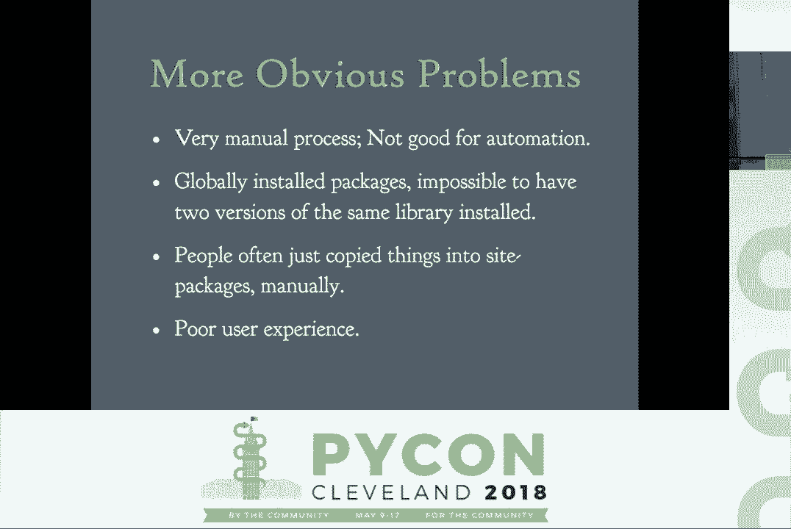

 So people-- and it's just a poor user experience overall。 So the next iteration of this is known as EasyInstall。

 That is something that was very popular for a long time。 It made things a lot easier。 You would just type EasyInstall， space， and then you get a package。

 And it would go and grab it from the cheese shop， and install it into your system。 which is fantastic。

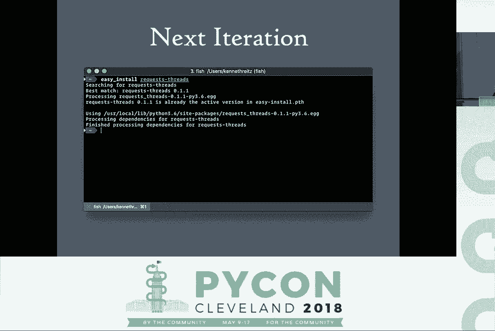

 It's much better。 This is a much better experience for installation。 but the packages were installed from the cheese shop。 And it's much easier to automate。

 There were some downsides to this。 There was no EasyInstall， for example。 So you could just install things。 You could uninstall things。

 So that is kind of a slight step backwards。 And I'll give you a painting of today's world looks like。 So from about 2010 onward， this tool came named PIP。

 became the de facto replacement for EasyInstall， for managing packages。 And VirtualLens became common practice。 And people started passing around these things。

 called requirements。txt files。 VirtualLens， what it is， is it creates an isolated Python。 home for each package to be installed in， one for every project。

 You can create a virtual and you can install things into it。 And in another project。 you create another virtual and then， you can install different versions of dependencies。

 and they're isolated from each other。 And it's wonderful。 And as time has evolved， it doesn't。 include the global packages by default anymore。 So you're very isolated Python environments。

 You get very reproducible builds。 It's a wonderful tool。 It's a very powerful concept， which。 allows for extreme flexibility。 And it's kind of unique in the Python community。 It's a tool that。

 for example， does not exist in the Ruby， community。 And one of the reasons for that is because you can have。

 multiple versions of gems in the Ruby community installed， at the same time on the same system。 In Ruby， if they had a flask， you could install Flask10 and 09。

 into the same global installation at the same time。 So they don't need VirtualLens。 And then the other tool we have is PIP。 PIP resolves， downloads， installs， and uninstalls Python。

 packages from the package indexes or arbitrary URLs。 It utilizes requirements。txt files。 And it manipulates virtual environments。 I assume everyone that raised their hand。

 said that they use Python packaging uses PIP， and is familiar with it。 So I won't go into too deep detail there。 So this practice of using PIP in VirtualLens continues today。

 This is a practice that began in about 2010。 And it's what we use today。 Now。 if you look at other communities， there's some interesting patterns that you've seen。

 involved over the years。 In Node。js， they have yarn and NPM。 In PHP， they have Composer， and Rust。 There's Cargo。 In Ruby， there's Bundler。 All of these things show this very similar mechanism known。

 as a lock file。 But if you look at Python， we use PIP in VirtualLens， which， first off。 is two things， not one thing， like all the other languages， other than Node。

 They have two one things。 [LAUGHTER]， And there's no lock file。 Now。 it could be argued that the requirement。txt， is a lock file， but we'll get into that in a moment。

 But in Python， there's no lock file。 So that's a problem。 There's a problem with VirtualLens in the first place。

 which is that it's difficult to understand abstraction layer。 It's a headache for newcomers。 It just increases the barrier to entry to the language。 If you're very familiar with Unix concepts。

 it makes a lot of sense。 But if you're not familiar with Unix concepts， it's a little bit foreign。 and it really， does hamper your ability to understand what's going on。 It's a very manual process。

 easy to automate， but unnatural to use manually。 And there are tools like Virtual Envabber， which。 exists that makes this a much easier process to reuse， on a day-to-day basis， which is great。

 Requirements。txt also has its problems。 The very common pattern is you do pip freeze。 and you pipe that into requirements。txt， which， gives you a flattened version of all your dependencies。

 Kind of like， this is a reproducible version list。 of all my dependencies and my transient dependencies， into my-- for my project that I'm working on。

 But there's this impedance mismatch， between what a requirements file is。 because there's two different ways to declare， a requirements file。

 There's what you want installed and what you need installed。 We'll get into that in a moment。 There are tools that exist today that make this easier， like pip tools。

 which I want to give a nice shout out to。 But ideally， a requirements。txt file。 is a completely pre-flat and dependency tree， which。

 is required in order to establish deterministic builds。 That's what an ideal case should be。 So this is one way of doing requirements。txt。 This is the ideal case for it。 If you look at it。

 there is--， so this is a Flask project。 Flask has transient dependencies。 If you require Flask。 it has dependencies itself， like Wurxig， it's dangerous， Ginger2， for example。

 And they all have different versions。 So if you're to pip install Flask and then run pip freeze。 to a requirements。txt file， this is what the output looks like。

 This is great because it's deterministic。 If you were to pip install this from a fresh virtual environment。 it's all inclusive of transitive dependencies。 But it's a little difficult to know what's going on。

 If you were to look at this in your source code， repository on GitHub or your co-worker。 was essential to you， which dependency， is it that you actually want？ It's unclear。

 Do you want-- it's dangerous？ Is that what your team needs or does your team need Flask？

 Which one are you actually depending on？ That's the problem。 So some teams solve this by just doing this， because this works。 You can just do Flask。

 And everything else will get installed。 But unfortunately。 it'll result in a non-deterministic build。 It's much more human readable and understandable。

 And it functions properly。 But it's non-deterministic， which can cause build failures。 If any of those transitive dependencies update， you'll get a different version of those dependencies。

 And your application can break。 You could be security vulnerabilities。 There's many applications of that。 So this is this impedance mismatch between what。

 you want and what you need。 That is problematic with the requirements。txt format。 So this effectively-- so this requirements format。

 that we have is both a lock file and not a lock file， depending on how you use it。 So let's just go with the assumption that Python has， no lock file right now。

 The solution is to give it a lock file。 So we already went over this。 The two types of dependencies-- what you want and what you need。

 So one solution of this is to have two different requirements， files。 one with what you want and one with what you need。 So you have one called requirements to freeze。

 and you put in what you need in there like Flask。 And then you have one called requirements。txt。 which is， the result of pip freeze。 And this is a good solution to this problem that you can use。

 standardized tools like pip。 All you need is pip to do this。 And this gives you the best of both worlds。 And there's also a tool called pip tools。

 which does a very， similar thing that is built all around this concept， basically。 which I highly recommend using if you are not， going to use what I recommend later。

 So this is a great pattern。 And I think that this is a good solution for people that use。 pip and they're built infrastructure to give you the， best of both worlds。

 But it's not a real solution。 The real solution is this new standard that's evolving， and。 it's coming out of the PIP file。 A pip file is a new standard， replacing requirements。txt in。

 the future。 It's written in Toml， so it's easy to write and read， manually。 And it features two groups。 So in other tools that you use in those other languages， you。

 can often have groups of dependencies。 You'll also see people have requirements dash dev。 requirements dash test， requirements dash production， requirements dash Heroku。

 These are a way of finagling groups into PIP。 So the composer community， however。 has gotten away with， having just two groups。 And it's been a very successful project in doing so。

 So PIP file has room in the spec to support more groups。 But currently。 the implementation has two groups， packages and dev packages， which should encapsulate。

 everything that you ever need。 Anything that's not going into production goes into dev， packages。 Everything that is going into production goes into， packages。

 And that should encapsulate every single use case you could， ever possibly have， ideally。 And PIP file is something that is going to go into PIP in， once Donald's stuff gets around to it。

 basically， which is， wonderful。 It was his idea。 And I went through and I made a prototype of the spec。 in Python with some help from some contributors。 And there's a project called PIP file you can use to parse。

 these files and manipulate them。 And it exists。 And it's going to go into PIP one day。 So that's the future of this， is that PIP file will， replace requirements that TXT。

 So here's what a PIP file looks like。 It's Tamil。 So at the top， you see source。 And that specifies which package index you're using。

 It has some parameters like verify as a set equals true， which should always be the case。 And you can give the index a name like PIPI。 And there's those two groups， like I mentioned。

 packages and dev packages。 So in this instance， there's Flask。 And I'm assigning it to version star。 which means grab， the latest version。 And dev packages， really what it means is any version。

 which defaults to the latest version。 And dev packages has PyTest。 So that's a good example of what you would put in those， two different groups。

 You'd put your test runner in dev， and then you put Flask， in the default group。 And then this thing can be processed and result in something， called a PIP file。lock。

 And this is where the magic of PIP file comes into play。 PIP file。lock is JSON。 So it's very easily machine-parsable， which is great。 And statically and analyzable。

 It contains all transitive dependencies pin with all， acceptable hashes for each release。 And it has， again， two groups default and develop。 So this is probably a little hard to see。

 It's a really big file。 I have it truncated。 But you can see in yellow here， there's click。 there's Flask， and there's the version numbers。 And then it includes all the hashes， the 256 hashes。

 of all， the different wheels and source distributions of those， valid dependencies， which is great。 So we have what we need in here and what we want over here。 These are two separate things。

 And this generates this。 So that's the ideal。 The problems with PIP file are that it's not yet integrated。 into PIP， which will likely take quite a long time due to， resource constraints。

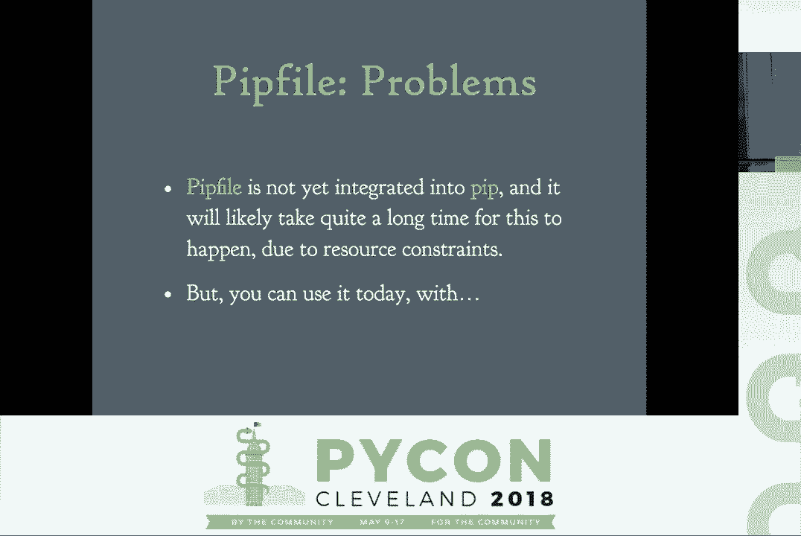

 But you can use it today with PIPAM， which is the new project， that I am working on。 that I want to encourage everyone。

 to check out。 And that's what this talk is about。 So the PIPAM sales pitch is that it's the officially。 recommended tool from Python。org for managing your Python， dependencies。

 It lets you use PIP file and PIP file。lock today without， waiting for PIP to implement it。 It automates away virtual AMP completely from your workflow。 It does use virtual AMP。

 but you don't have to interface， with it directly。 It just does it for you。 It ensures deterministic builds， including hash check， verification upon installation。

 And it gives you other great tools like PIPAM Graph， which， I will demo for you shortly。 Some great quotes。 Janis Lydell， who is the former PIP maintainer， said that。

 PIPAM is the porcelain I always wanted to build for PIP。 It fits my brain and mostly replaces virtual AMP wrapper， and manual PIP calls for me。 Use it。

 And Justin Miles Holmes， a good friend of mine， said， PIPAM。 is finally an abstraction layer meant to engage the mind， instead of merely the file system。

 which I quite enjoy。 All right， so it's time for a demo， as well as Q&A。 So if you have any questions while I'm doing the demo， please， line up。

 And I will do my best to answer them。 I want this to be an interactive demo。 So please come and ask any questions that you have as I'm， going through。 And hopefully。

 my SSH connection to my server will go well。

 Let's see here。 Is that big enough for everybody to see？ Yes？ Excellent。 OK。 so I just created a new directory called demo。 And there's no files in this directory at all。

 So what I'm going to do--， I already installed PIPAM。 I'm going to do PIPAM， install requests。

 And what it'll do is it will create a virtual environment。 for me automatically and create a PIP file for me automatically。 And then it'll install requests。

 And it'll create the PIP file。lock。 And it'll relock the file。 So now I look-- there's two files--。 PIP file and PIP file。lock。 If I look at PIP file， you'll see it， requests is in there。

 And it automatically specifies--， we support version specifiers。 So you can constrain your application to certain Python， version specifiers。

 So this one requires Python 3。6。 If I want to install a dev package， I could do like PIPAM install。 pi test-dev。 And it will install pi test into the dev package directory。

 And it will relock automatically。 And as you note， I don't have to edit this PIP file by hand。 It's doing it for me。 That's an idea I got from Composer。 So pi test is there， request is there。

 And this all works。 So I could run-- so I could remove the virtual environment， with PIPAM-RM。 which deletes the virtual M completely。 And I just do PIPAM install。

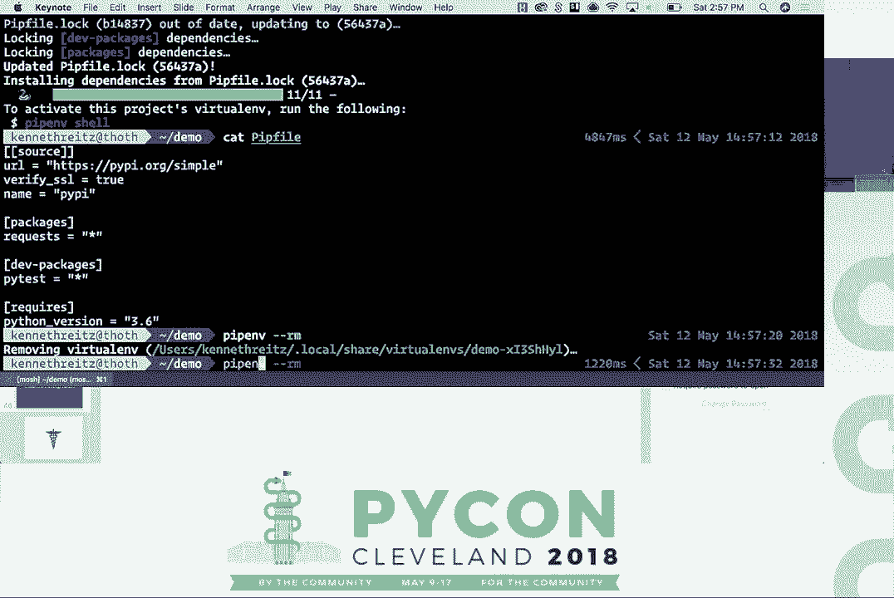

 And it'll rebuild it from scratch。 And it's using Python 362， unfortunately。
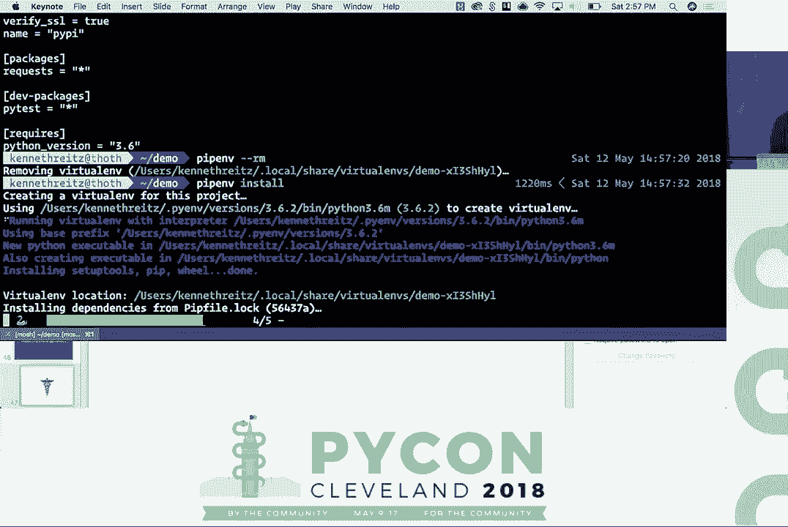

 It should be 365。 I can specify the version of Python。
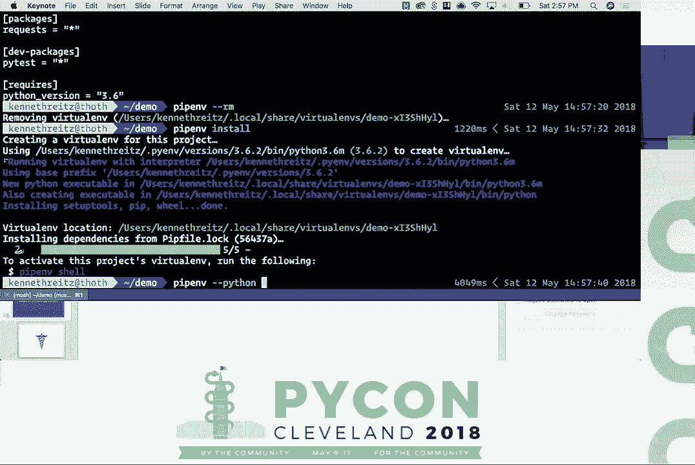

 Let's try that。 There we go， 365。 There we go。 I got that。 So PIPAM install。 And it'll install the dependencies。 And it actually runs PIP concurrently。

 So if you have 45 dependencies， it will install them concurrently。 So you don't have to wait sequentially for each one， to install one at a time。

 So it's much faster than using PIP as well。 Can you work multiple sources concurrently？

 So you can have--， Multiple sources。 So you can have an organizational internal sort。 of PIPAM running a DevPy。 Yes， it does。 Yeah， you can specify-- if you go into the documentation。

 there is a way for you to specify multiple sources， and then also assign a specific package。 to come from a specific source in the TAML file。 Yes。 [INAUDIBLE]， [INAUDIBLE]， [INAUDIBLE]。

 [INAUDIBLE]， Sorry， if you have a question， please go to the mic。 Sorry。 You mentioned concurrent installation。 What about packages that--， What about what？

 Packages that install differently based， on what's installed before。 Like tornado。 if you have site on it， it will optimize。 If you don't have site on it， it won't optimize。 So--。

 If you don't have site on？ Yeah， site on is not really a dependency for tornado。 If you don't have it， it's OK。 Yes。 Yeah， so we don't have ordering built in。

 You can turn off sequential-- you can add sequential flag。 to it and it will run them sequentially instead， of doing them at the same time for that use case。

 And so the next thing you do after you've done this。 is you run pipm shell and this will give a sub shell， to you with that-- so if I run Python。

 I got 365， and I can import requests and request works just， like you would expect。 And then you do exit。 And it exits out of that shell into my parent shell， instead of deactivate。

 But if you want， you can do pipm dash dash vm。 And this will show you the path to the virtual embedded。 created。 And it's just a normal virtual environment。

 So I could do source this slash bin slash activate。 And it's just like a normal virtual amp。 So there's no surprises there。 And I'll get to the next question in a moment。

 I'll install something that has a bit more dependencies， like Maya。 Oops， pipm install Maya。 We got some nice features in here like pipm graph。

 which will give you a graph of your dependency tree。 So here's my top level dependencies。
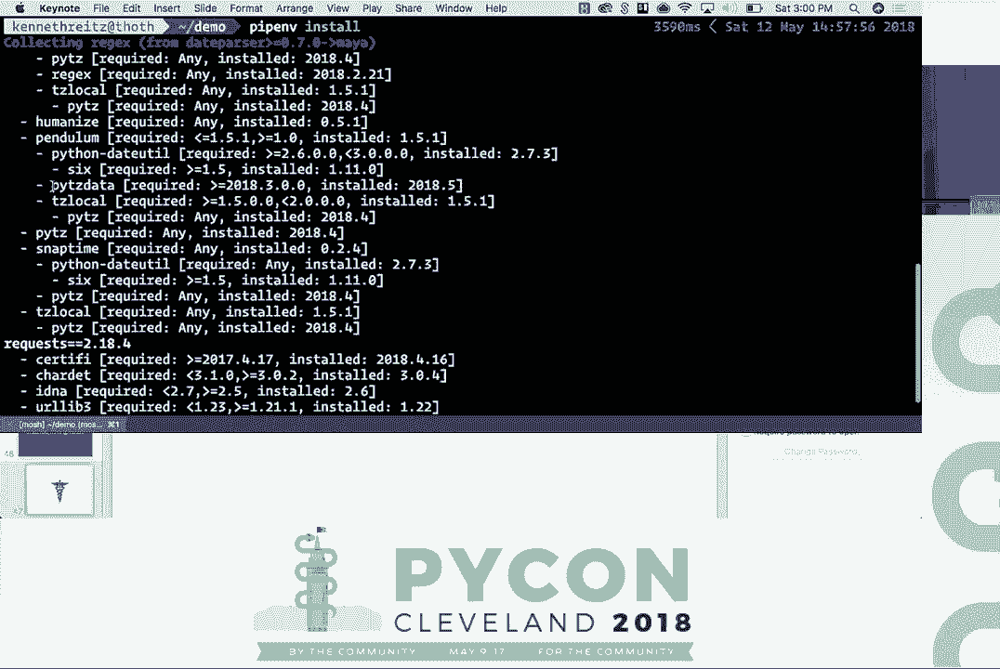

 Here's requests。 Here's its dependencies。 Here's what's required。 Here's what's installed。 It's quite nice。 As well， I could do pipm install Django。

 Can someone give me the name of an insecure version of Django？ Very insecure。 142。
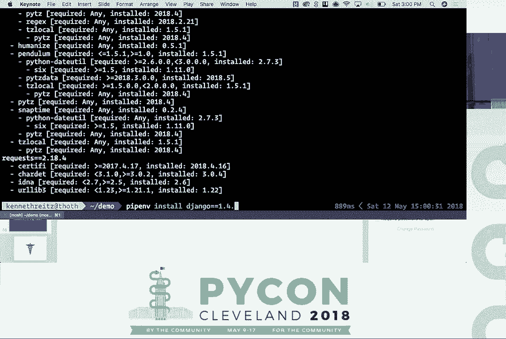

 All right， so installing Django equals equals 142。 And the Wi-Fi isn't the fastest， I apologize。
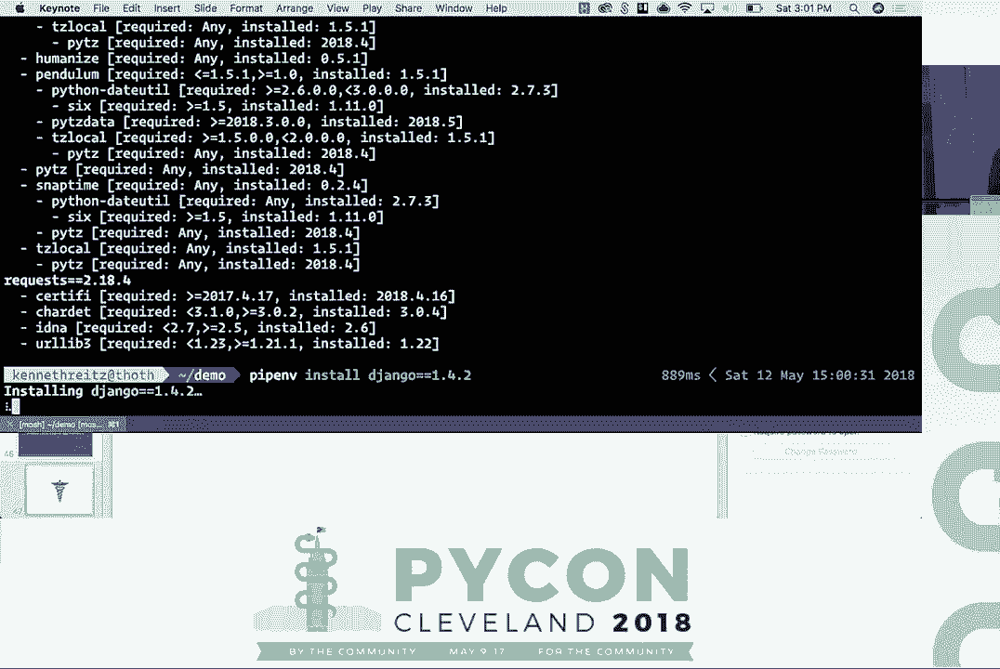

 And I have a security vulnerability scanner built in。
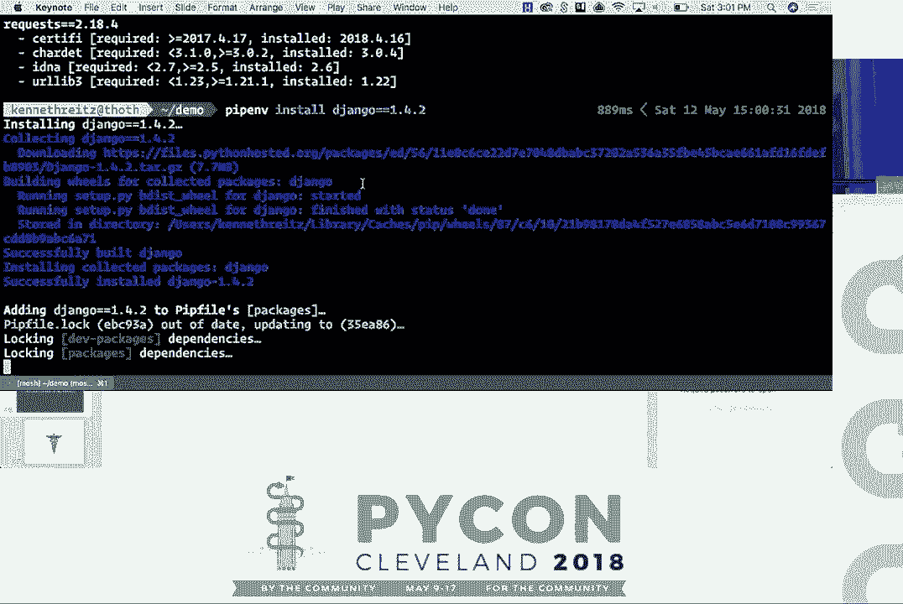

 It's offered by PyUp。 I have an account with them and it's embedded in the API。 Keeps embedded inside。 So you can do pipm check。

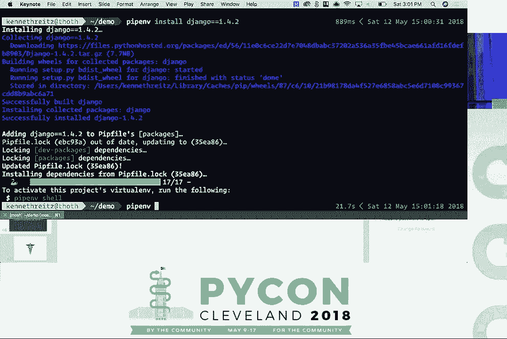

 And it checked the pipe 508 requirement， switch through those constraints。 It said Python 3。6。 So it checked and that was all good。 But here are some known vulnerabilities in my dependencies。

 So that's a nice feature that we have as well。 So I installed that invalid version of Django。 And here are the vulnerabilities for that version of Django。

 So you can get some nice checking of your code， and stuff like that， build that into your CI。 Pipm Graph is really useful。 In addition to install， of course， you can do uninstall。

 You can do pipm uninstall requests。
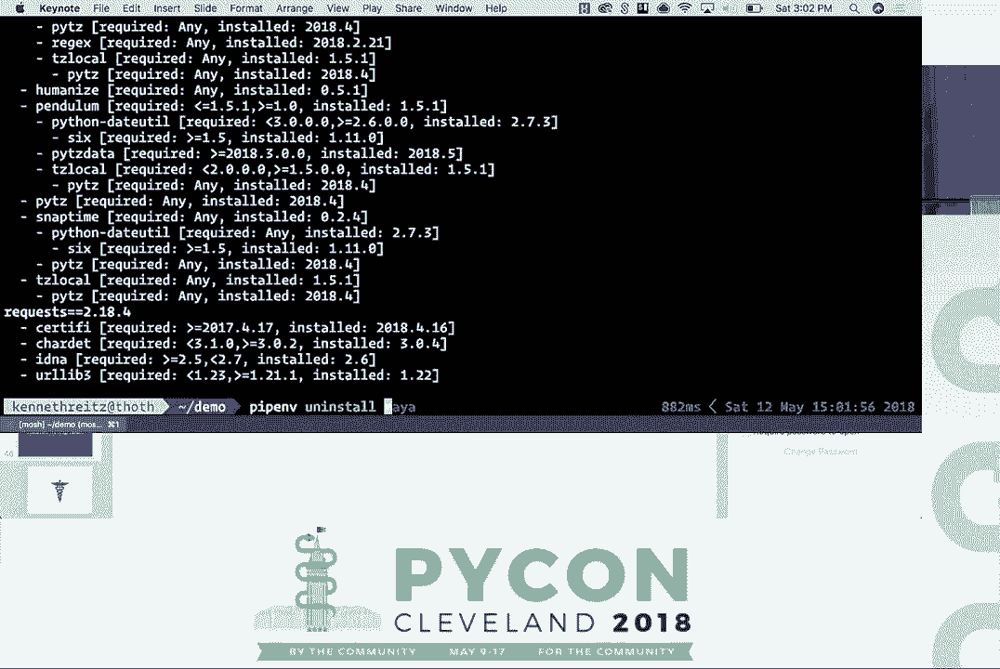

 not that you should ever do that。 And it'll remove it from the file， from the pip file。
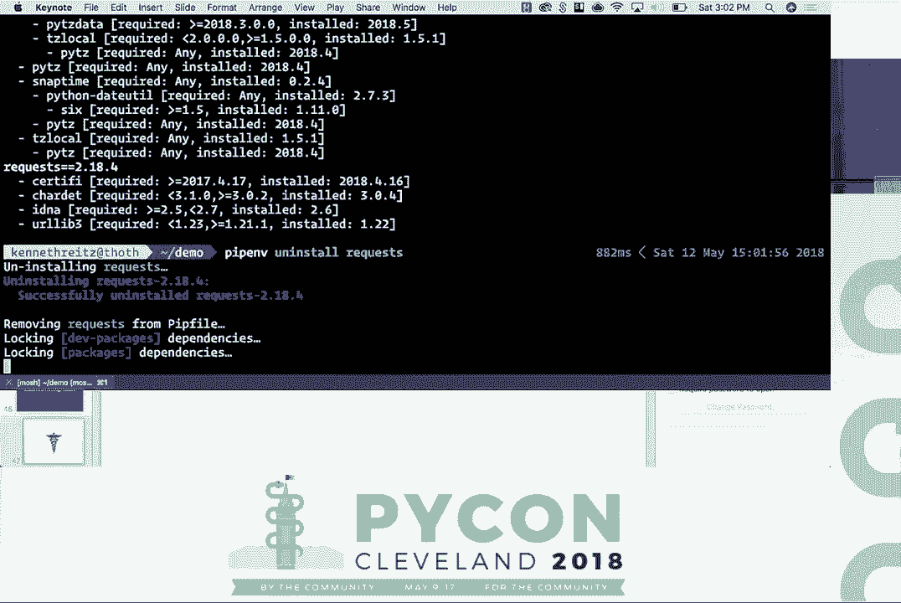

 and relock automatically。 I could also， for example， edit the pip file。 I'm just going to change it。 So I just added some new lines。 And then I'm going to do pipm install dash-deploy。

 So this is what you would use in production。 If you were going to go deploy in a Docker image。 or in production， you would never， want to ship--， you never want your lock file to be out of sync。

 with your pip file。 So this will work fine， apparently。 Hang on。 Maybe we cache the--。 I think we do a hash on the values， not on the content。 So I have to add a comment or something。

 That wasn't a real change。 Yeah， so your pip file was out of date。 It expected this hash and this hash is found。 So it'll abort the deploy automatically。

 if you pushed a new pip file and didn't lock。 But of course。 you don't need to use that in development。 If you do， it knows that it's out of date。

 and it'll relock automatically for you。

 So next question。 Thank you for your work on the requests。 And my question is， at early days。 if pip and the virtual environment， was created in the project， then the default。

 was changed to home directory。 Do you tell us more about that decision？ Yes， so by default。 if you hit pip m dash VM。

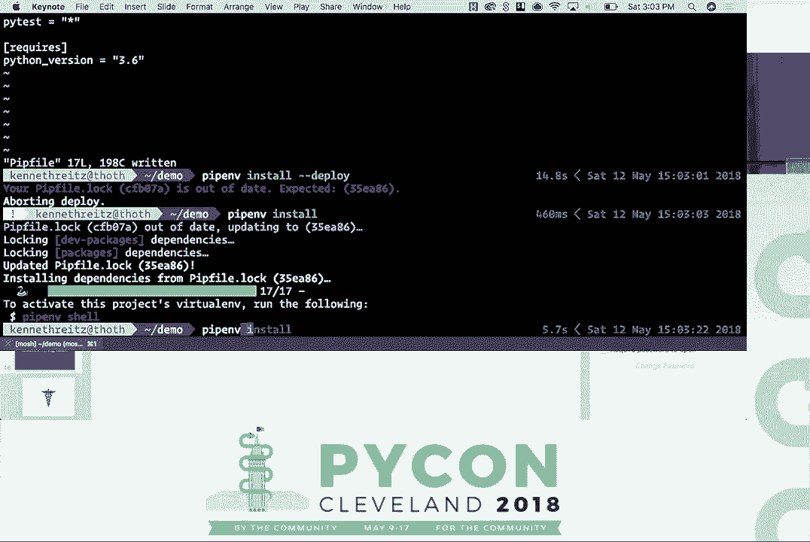

 you'll notice that the virtual AMP location is， dot local share virtual AMP。 That's slightly different based on your operating system。

 It's in a known good location for your operating system。 It mimics the behavior of virtual AMP wrapper effectively。

 which I determined was the best practice for the community。 If you prefer not to do that。 I could make dir dot VM。

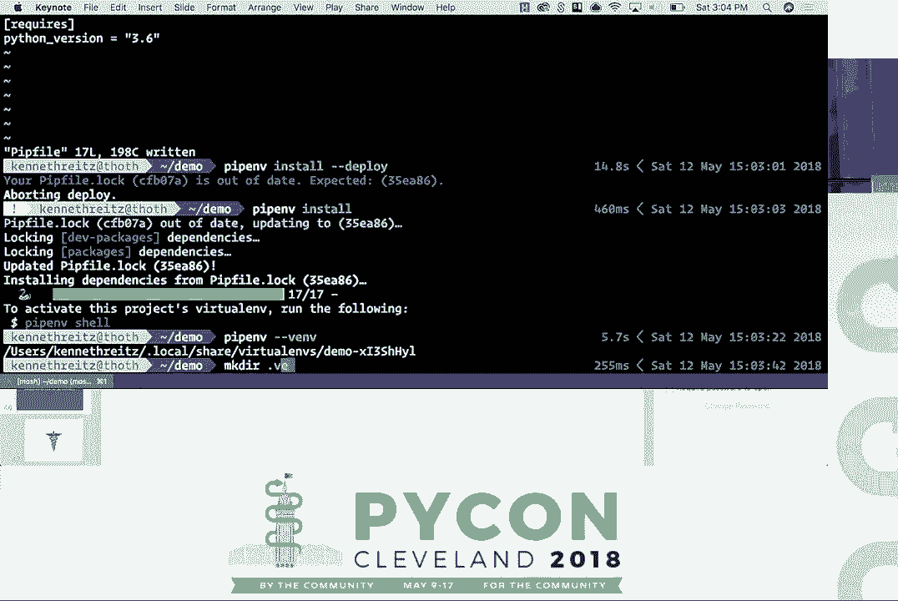

 and then do pip m install。 And it will use the dot VM directory for you automatically。
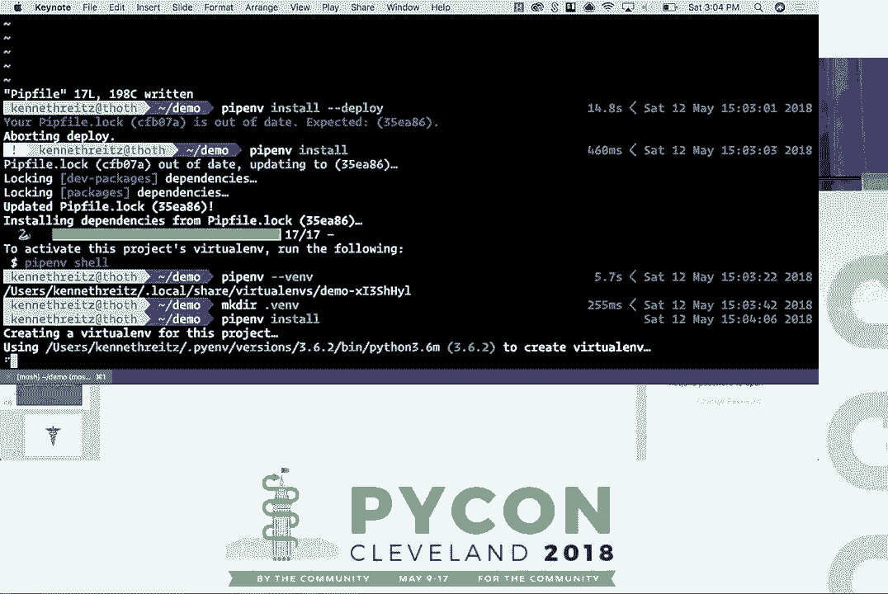

 if there's one there。 Or if you want， there's an environment variable， you can set。 which will always use dot VM no matter what。 So it's called pip m VM VIN project。

 So that's a setting。
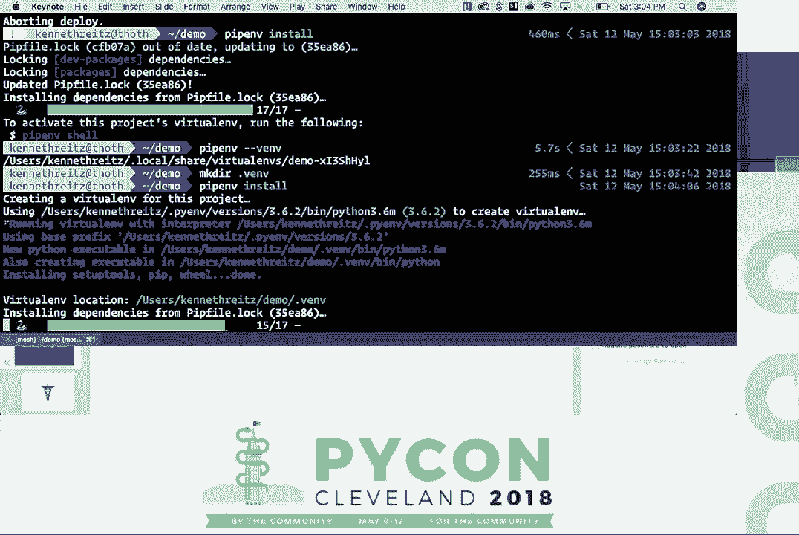

 So my question？ Yes。 My question's a follow up to that。 Is it possible to create a virtual environment， in a directory that's not in the dot local and not called dot。

 VENV？ No。 Not currently。 OK， not currently is OK。 Thanks。 Not with this。 Well， actually， yes。 So--。
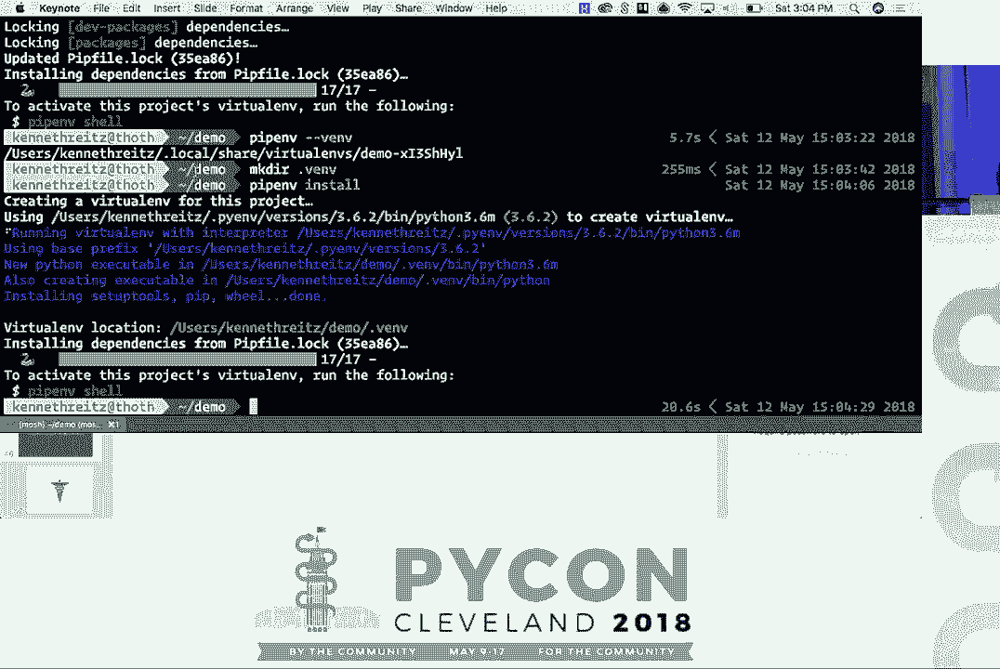

 [LAUGHTER]， So I can make a virtual environment called test。 What is it？ Virtual AMP？

 So I've been using pip m for so long。 So I'm making a virtual AMP called test。 which is using Python 2。7。 I'm going to source test。 VENV-- so I was taking a little long--。

 activate dot fish。 So I activated my virtual AMP。 Now I run pip m install。 And it will-- it knows that it's running， in the virtual environment。

 And it will install things into that virtual environment， for you。 Perfect。 Thanks。 Yep。 And if you want to switch versions of Python， I just messed everything up。

 So let me recover from this。 So pip m dash dash 3 will create an environment with Python。 3 automatically。 I mean， that had to deactivate。 It gives you a nice friendly message。

 pip m found itself running within a virtual environment。 So it automatically is that environment。 There's a setting to disable that deactivate。 So now that I'm out of my virtual environment。

 I can do pip m dash dash 3。 And it'll remove that environment。 that I had and recreate one with Python 3。

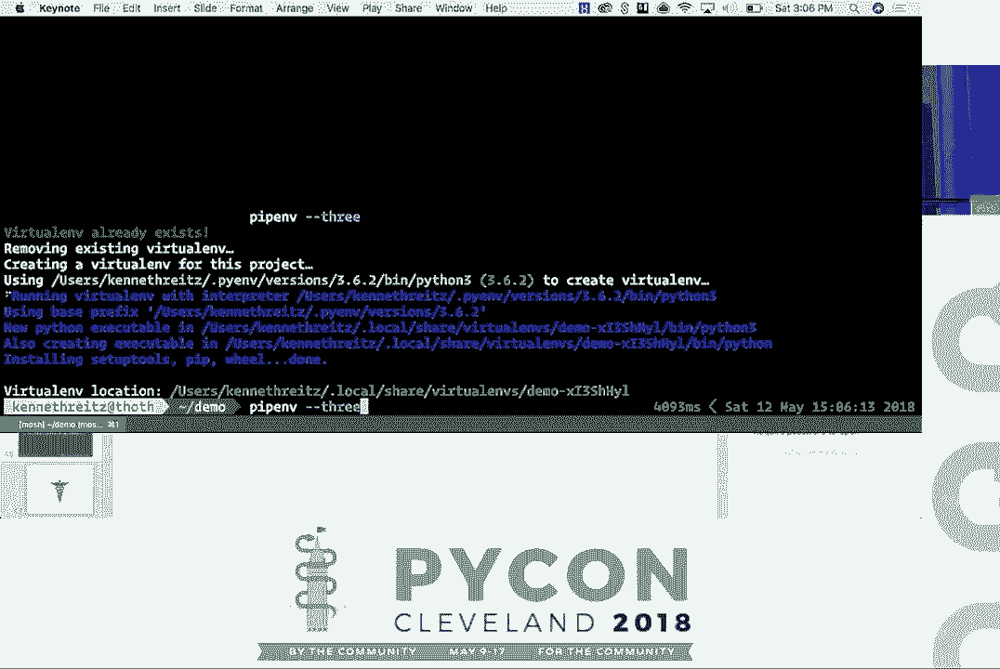

 And if I want to switch to 2， I just do pip m dash dash 2。 And it destroys it。 creates it with Python 2。

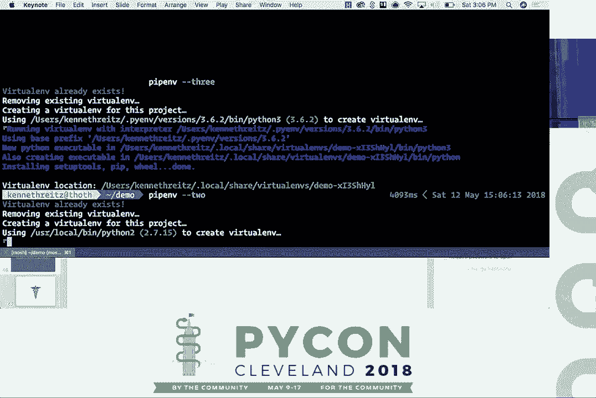

 So very simple。 And if you want， you can do dash dash Python， specify the path to any interpreter。 And it will use that Python interpreter。 It doesn't work with pip m at the moment。

 But it works with every other Python interpreter。 And you can also specify arbitrary versions of Python。 like 2， 7， 14。 And if you're not installed on your system， and you have pip m installed， it。

 will compile it from source and make it available。 So next question。 Hi。 I had a question regarding the speed， of installing new packages and stuff。

 It seems like it takes a long time， compared to just regular pip， assuming。 because it's calculating hash or something。 And I've done some Googling on the issue。

 It seems like I'm not the only one。 So have you heard of that issue so far？

 Do you have any inputs on that or maybe ways， that could be sped up？

 Because like installing new packages， I think again， I think it's calculating hash。 Is it the installation that seems slow or the locking？ I think that-- yeah， maybe you're。

 at the locking itself。 Yeah， the locking can be slow because it， has to resolve a dependency graph。 And if you have a large graph， it can be slow。 But we've made massive improvements to that。

 And it's getting faster every day。 So resolving a dependency graph， it turns out。 is quite difficult。 So it involves quite a few requests and stuff like that。

 And it has to download all those packages。 So yeah。 OK， so in the interest of time， I'm。 going to have three more minutes of questions。 So three more minutes of questions。 Speed round。

 I'd like to start first with the lady in the back there。 Hi。 So I'm interested in using this。 but I'm not necessarily， going to get everyone in my company， to start using it right away。

 Is there a way that I can convert between this lock file， and a requirements。txt so that people are using either。 Yes， we do。 If you do pipm。lock-r。

 it will output a requirements。txt file。 Awesome。 Thank you。 Yep。 Are we on？ OK。 Should we put the lock file under source control？ Yes。 Thank you。 [LAUGHTER]， When you uninstall。

 is that recursive？ Does it remove all the dependencies。 that were brought in because of that install？ Say it one more time。 When you uninstall。

 is that recursively， uninstalling everything that was brought in for that dependency？ No。 it'll uninstall only that package。 There's a sync command which will automatically--。

 that's a separate command which will sync your environment， to the lock file。 OK。 Like a fan。 Up front。 How does pipm。no， which virtual end corresponds， to which application directory？

 From the path of the directory。 So if you were to move it， it would。 create a new virtual environment。 OK。 Gate behind？ Was there kind of a big difference。

 in terms of when you're designing an API that's， for Python versus an API that's for consumption through shell。 and is more interactive and not just something， that you implement in your code？ Yeah。

 I think when you're designing something--， if you look at the code base of pipm。 the Python side of it is not the most elegant code base， I've ever worked with because it's。

 trying to present the best user interface possible。 So I think there's compromises on both sides。 I think if I try to build it Python first and then present， the CLI。

 I think that it would be lesser experience。 So I think that there's always trade-offs。 Thank you。 OK。 Next question。 Behind？ Hi。 Will this also replace setup pi？ No。 Setup。

py is a completely different tool for different things。 Setup。py is used for libraries。 And this is for applications。 OK。 And we'll do one last question。 I think that gentleman back there。

 was already there before the mic at the front got filled。 Just to follow up on the source control。 checking in your lock files。 This has been a big struggle in the node community。

 Would you do it for libraries as well as projects？ Would you always check in the lock file？

 I would not check in the lock file， if you were targeting multiple versions of Python。 where your lock file could be different， under the different versions of Python。 Hopefully。

 we've done a lot of work， so that it should be a flat lock file that。 specifies the versions of Python。 And it really depends on the metadata that is provided。

 by those packages。 So if the metadata is good， then you should be able to。 But if worst comes the worst， then keep it out。 OK。

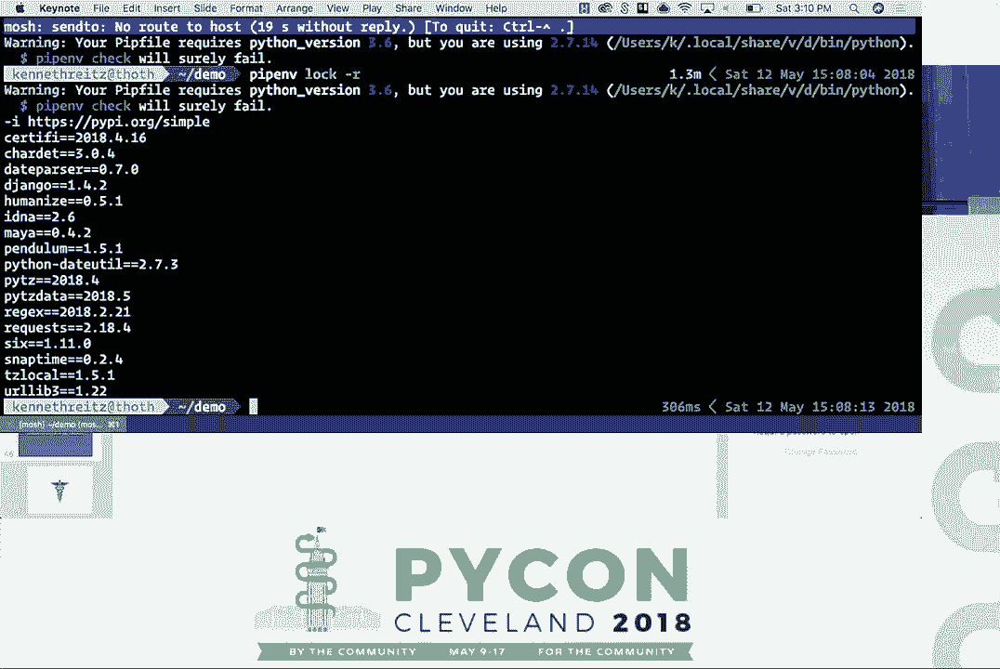

 With that， let's thank Kenneth。 [APPLAUSE]， And I'm sure he'd be happy to entertain questions。

 outside of the ballroom。 Yes， absolutely。 Thank you very much。