# P13：vigneshwer dhinakaran - Pumping up Python modules using Rust - PyCon 2018 - 哒哒哒儿尔 - BV1Ms411H7Hn

 \>\> Hey， folks。 Let's have another round of applause for our next speaker。

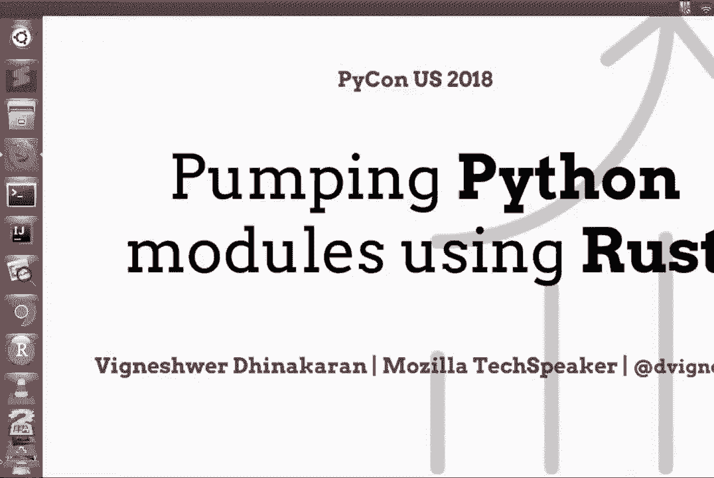

 \>\> Okay。 So hello and thank you all for coming today。 It's a pleasure to be here and I'm super。

 thrilled to have this opportunity to speak to you all today about two of my most favorite。

 programming languages， Python and trust。 Both of them really make me feel like a complete。

 developer。 I'm here to share those experiences with you。

 So today I'm going to talk about how we as Python developers can maybe write a small Python。

 extension or take some part of our workload and connect it to a statically typed language。

 in order to get that performance。 So my talk is mostly going to be around that。 So if you。

 were like me and we're adding all the kind of performance data talk here in PyCon， you。

 probably must have noted down these golden rules。 So the first one is like， look for， like。

 use some tools like a line profiler and look at which part of a program is actually， slow。

 And then the second thing would be to go ahead Google and see how people solve。

 this problem in the Python community。 Because Python community is amazing。 There's someone。

 who has definitely solved that problem。 Maybe use that library that they have built or use。

 the techniques that they have used to think about solving this problem that you are also， facing。

 The third thing is don't use Python。 Like use something else that has worked before。

 So I thought like， let's start from the third point。 Just start from something that is not， Python。

 So I'm really happy that my talk is scheduled at this point of time because after。

 hearing all the performance data talks， we're going to focus more on the third point of using。

 something that's not Python。 But in order to use some languages like Rust， which is the。

 system programming language to basically improve your Python modules。 So we'll talk a。

 lot about Rust in this talk and see how we can leverage its features in Python。 So before。

 getting started， let me just quickly introduce myself。 My name is Wigneshwar。 I'm here today。

 representing Mozilla as a tech speaker。 A lot of people looking at my badge asked what's。

 at Mozilla tech speaker。 So I think I should talk a little about that。 It's an amazing program。

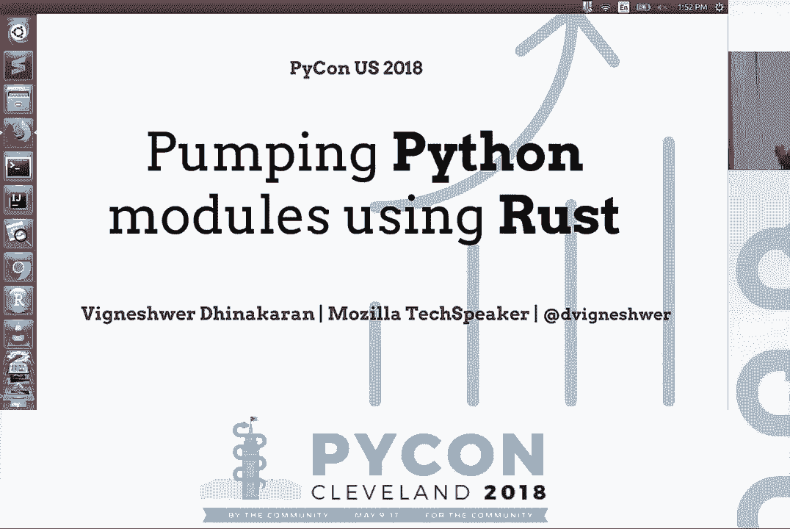

 run by the developer outreach team of Mozilla where they take enthusiastic volunteers and。

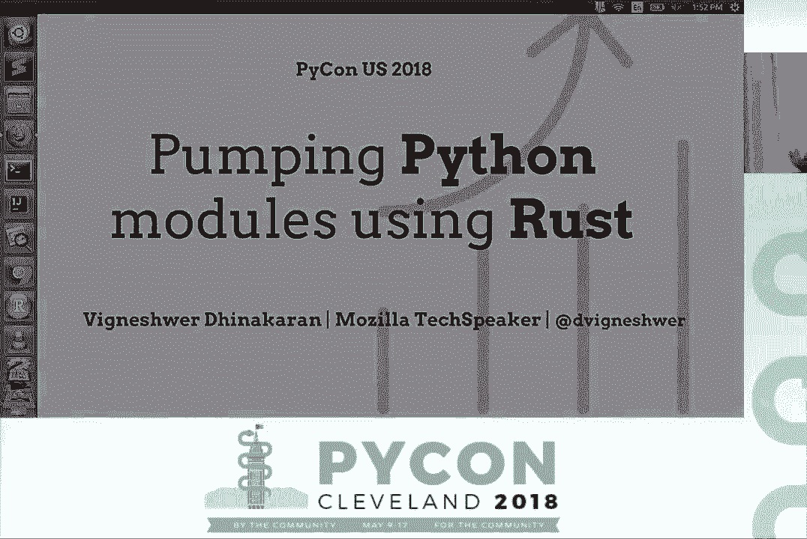

 train them to be like developer advocates to go out and develop a case in conferences。

 like these。 To talk about Mozilla and web in general， I'm sorry， sorry about this。 Okay。

 I'm just going to keep moving my mouse to make sure that things are up。 Apart from that， I'm。

 a data scientist by the day。 I work， I build a lot of state of our mission learning algorithms。

 I enjoy doing that。 That's where I use Python a lot。 Python is best for data science。 And。

 apart from that， I've written a book in Rust。 So it really helps people to get started with。

 Rust programming。 It's called the Rust book。 That's pretty much about myself。 So let's get， started。

 So why do we need a native extension？ That's the first question that comes to mind。

 So it's basically because you have some really good library that is statically typed。 And。

 then you want to bring that to Python。 Compute revisions。 A lot of you see a lot of image。

 processing libraries that we use。 NumPy， for example。 And things of that sort。 So we want。

 to use that great engineering work in our Python model。 You don't want to rewrite the， entire thing。

 So that's where we start thinking about native extensions。 The second thing。

 is when we need a little more freedom in memory management。 That's something that we don't。

 get access to in Python。 And the third one is maybe thinking around with the hardware。

 and things of that sort。 So the point is that performance control has always been this key。

 For building applications right now， which is just for demanding。 You need to have all。

 these amazing features。 You need to be competent。 And that's what will get you that edge in。

 your particular business or in your particular domain。 So products these day are very demanding。

 So with Python， I think， with just Python， it's going to be a little bit tricky。 So we need。

 to start looking for some alternatives。 So that's one big motivation behind this talk。

 So what has been the solution still now？ Python community。 They have probably solved this。

 problem for you。 Just go out and look out for what they have done。 When it's the last。

 time that you probably have faced a problem and then the Python community was not that。

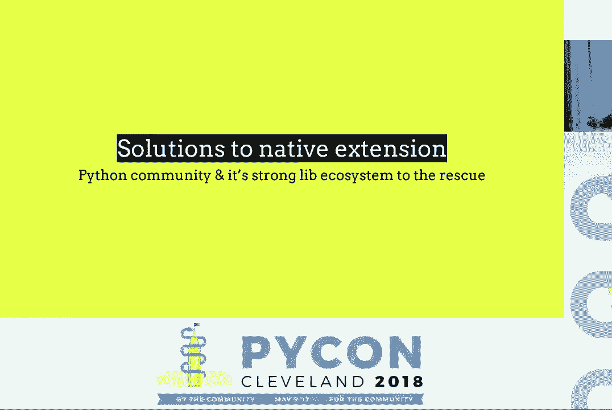

 to help you。 Most of the time it really works。 So this is not new to us。 Like， you know， as。

 being a Python developer， you have somewhere used these kind of libraries。 So now， for example。

 a 53% of C code。 That's what makes it magical。 It makes it work so good。 TensorFlow， for example。

 that's something I use on a daily basis。 It's 48% of C++ code。 C Python， the one that runs。

 your Python code。 That has a lot of system programming code in it。 Pillow is an image processing。

 library that is heavily used across various domains。 That has a lot of C code in it。 So。

 what's the problem like？ C++ developers are like superman。 They're really difficult to， find。

 They're very strong， like superman。 But the reality is， it's very difficult to write。

 C++ extensions。 You need to have that kind of expertise。 Given the kind of timelines where。

 you know， especially I can talk for myself， I come from a service industry and， you know。

 timelines are a big problem for me。 I can't even think about static code。 The reason why。

 I use Python is to make sure that my code runs without any bug。 You know？ So that's where I see。

 you know， Python being really useful。 That's what makes Python really good。 It's readable。

 It's super easy。 And it works just fine。 But the problem is， there are people like Lex Luthor。

 who would be some kind of hacker， who would go down， look at your system code， and try to， you know。

 exploit it。 For example， kryptonite is a big problem for Superman， right？ So， historically。

 we have seen so many bugs that have， you know， causes a lot of problems。 Data， research， like。

 for sure。 This is something that you need to manually handle。 Python just takes。

 care of all that for us。 Like， you have a garbage character。 I'll short it a lot more about that。

 But the point is， if you're writing C++ extension， you need to handle these things。

 which are a bit difficult。 That's the reason why I've stated that， you know， writing C++。

 extension is scary and painful。 So， what are the other options that we have？ A site。 So。

 it's a superset of Python， you know， easy way of calling C functions and the data types， over there。

 Works pretty good。 A number is another very good option available out there， which uses。

 the JIT compiler。 It's basically optimized machine code， which works on the LLVM compiler。

 Works pretty good。 The last one is PyPys。 It's something that's not even Python。 You know， Python。

 but yeah， it's a debatable topic again。 Yeah， again， use a suggestion in compiler。

 Works pretty fine。 But the problem is， like， for people like me， I can't talk for all。

 I kind of feel that I've lost my control。 Like， I use all these tools and it works fine for me。

 Like， but I'm not sure what's exactly happening。 It kind of makes me feel sad。

 That's when I started looking for alternatives。 And what does the main ask？ The main ask is that。

 you know， you want C++ kind of performance， portability and embeddability without， you know。

 guaranteed safety。 What I mean by safety is that the one that Python， you know， kind of gives to us。

 We don't have to worry a lot about this memory and things of that sort。 I just want to focus on。

 my application and again have these kind of performance boost。 Sorry。

 So let me introduce you to an amazing。

 state of our programming language。 It's called Rust。 It's a system programming language which I。

 like to define has great control like C++ and delivers productivity like in Python and it's super。

 safe。 So there are three things that， you know， there are language， you know， really， really。

 does really well。 So that's number one。 It's hack without fear。 So again， there's obstruction。

 without overhead and stability without stagnation。 So hack without fear is this concept of。

 you know， going to the production without having these kind of bugs。

 Abstraction without overhead is， the zero cost obstruction which the community is really proud about。

 I'll talk a lot more about， that when I come to trades。

 And stability without stagnation is whenever a new version of Rust comes， in， it's not， you know。

 go back and， uh， uh， cause any kind of problems with your current extension。

 So every version really should be flawless， you know。

 that's something that every software developer， wants。

 And I truly believe that Rust is trading a new generation of system programmers。 Uh。

 you have never done system programming before， but I'm really confident with all those terminologies。

 and I just go around， you know， uh， posting about myself to be a system programmer。 But yeah。

 the goal is that， you know， you need to create a really stable。

 confident and safe system programming， language。 So the zone of Rust is you have a memory safety without garbage collection。

 Again， I'll， uh， when I come to ownership and boring， which is the core concept behind the。

 Rust language， this type system， uh， which allows you to， you know， have a lot of good things like。

 you can read the code really well。 It's easy to understand。 You write， you know， we exactly。

 know what's happening under the hood。 High level iterators。 That's something we all love as Python。

 developers。 We are spoiled by it。 That's another topic altogether。 But yeah， that rushed us a lot。

 a lot of offerings over that。 Freedom and data races and a welcoming community。 This is something。

 that you would really appreciate coming from a Python background。 Like we need a really strong。

 ecosystem， a strong library ecosystem。 That's something Rust is really focused on。 Let's look。

 at some facts and figures。 So this is， this is an app called Wires。

 So it's basically an application， that does business chats and WebRTC conference calls and things of that sort。

 So what they basically， did was they moved their entire cryptocurrency part to Rust and saw like a good performance。

 That's pretty cool。 This is another company called Sentry， which I think I saw them here。

 So they have done a pretty good job in， you know， writing their， a pass， a pass of which， you know。

 does passing off their source maps and Rust and have significantly reduced their processing time。

 So I think Armin is this person who has written this and he also happens to be the。

 guy who developed the flashcap。 He's given a lot of cool talks before this， so I really recommend。

 to go check that out and they have done like significant work here。 So another company called。

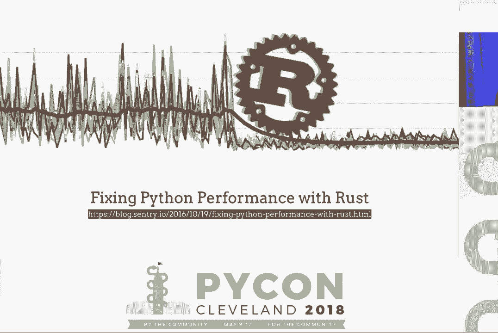

 Snips。 They are like， Wires is 10 companies。 They are using Rust heavily to ship their products。

 ship their AI models across different hardware。 Works really well for them。 That is another。

 proof of concept library that is written over atokir， which is a very fast and reliable way of。

 writing handling asynchronous requests。 And if you can see these graphs， the kind of request。

 that you can handle asynchronous is very high。 And it would basically help you save a lot of money。

 in a production environment。 Again， this is a proof of concept， but it will be really good if this。

 comes out to be， comes out in a stable version。 So this is another thing that the Rust committee。

 is really proud about。 You know， for a third time in the row， they have been voted the most。

 loud language。 This is something really cool for a language。 It just got released in 2015， right？

 So a lot of companies are using them。 They have really， really good use cases。 I don't have time。

 to talk about them， but I really recommend you guys to go check out the Friends of Rust website。

 Like， again， there's a lot of inspiration that you could take from there and kind of try to。

 apply in your workplace。 So how did it all begin？ So Mozilla is the company that sponsors this project。

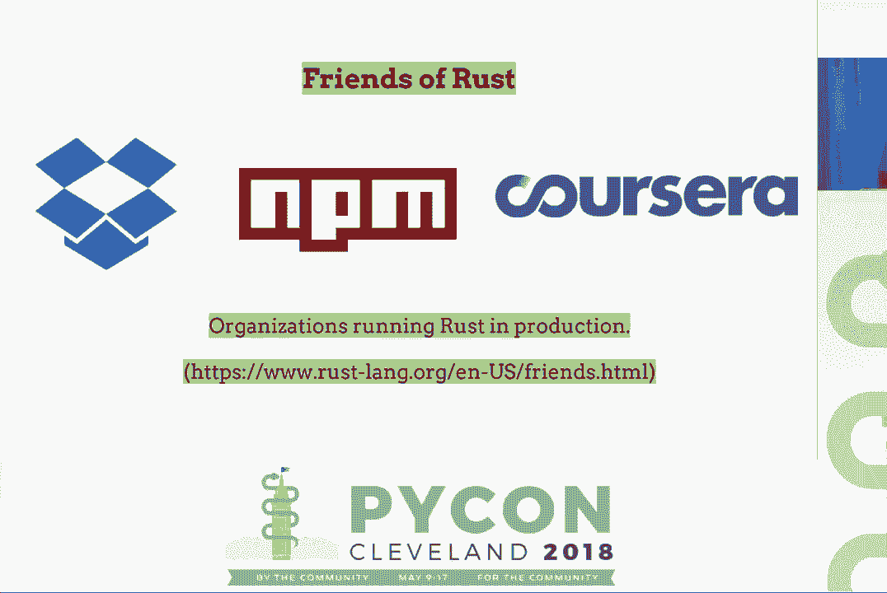

 but it's a community-driven initiative altogether。 So browsers just compete for performance。

 and they need safety as well。 So it was really important for Mozilla to invest in this。

 So that's the Rust project for you， which I think started around 2006， maybe it was more like。

 Mozilla employee was working on this， and then something similar。 They had a lot of functional。

 programming influence in it， and it was very similar to C++。 And then at one point in time。

 Rust had garbage collectors。 So the languages evolved over time， and it's such a nice experience。

 to read about what has been happening in the community。 And the server project is a way of。

 creating high-performance browser engine， which， you know， the whole of Rust language is influenced。

 by that。 In Firefox 48， Rust was introduced。 It was the first time that， you know。

 such product of this scale， Rust had come in。 It was a URL parser。 Then 557， great success story。

 here。 They rewrote a lot of their parts in Rust。 The Stylo was one among them。

 which gave them a lot， of performance at runtime。 Highly recommend to go out and check that out。

 So let me just， you know。

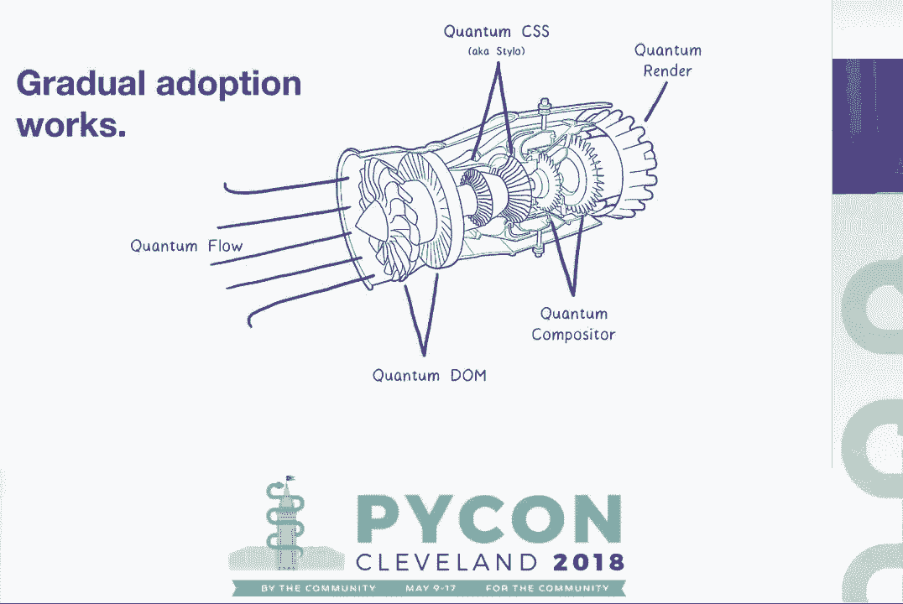

 introduce you to the Rust syntaxes， because the latest part of the slides have a lot of。

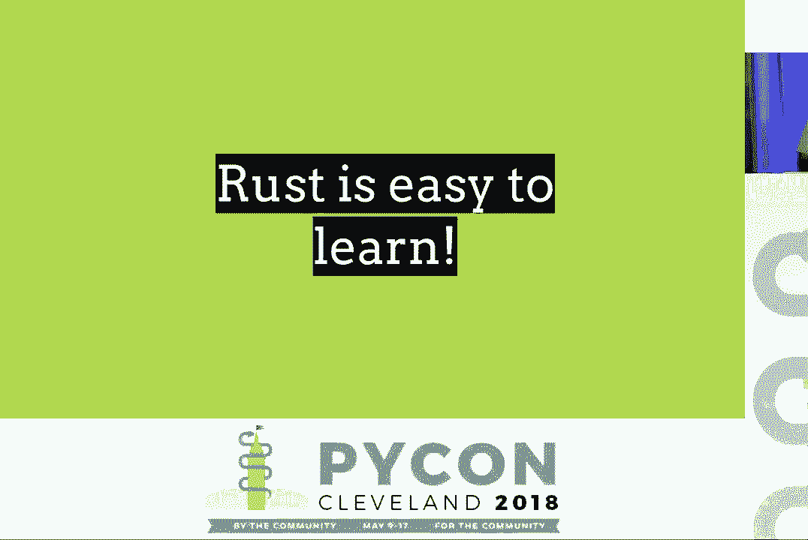

 Rust syntax that you need to understand。 Rust is really， really easy to learn。 So you use the。

 let variables to， you know， create a variable binding。 You don't have to explicitly mention what。

 type it is compiled as smart enough to understand that all variables by default are immutable。

 and then you have to explicitly mention mutable type as mute in order to make a variable binding。

 as mutable。 So in， in， in， in， at runtime， you can change the value when you have。

 mention it as mute。 Otherwise， it's not possible。 Unlike in， uh， let variable， you， if you want to。

 declare a constant or to explicitly mention the type， and this particular variable will be same。

 throughout the scope of the program。 So functions are pretty similar。 So the only one thing that I。

 would， you know， recommend to focus on is everything is explicitly mentioned。

 the type that goes into， a particular function。 This basically helps in reading your functions really well。

 And then you， don't have to explicitly mention written types。 It's the。

 the last statement is usually referenced as， the thing that you're trying to return。 Uh。

 flow control pretty straightforward。 Nothing fancy here。 It's just if condition passes it， you know。

 processes some code， else not。 Uh， so， uh， patent mapping or switch in general is done， uh。

 through the keyword match。 So you have， match a variable and then you have a lot of conditions around it。

 If you have a single value， a group， of values， a range of values。

 and the underscore is basically default。 Uh， this is an infinite loop。

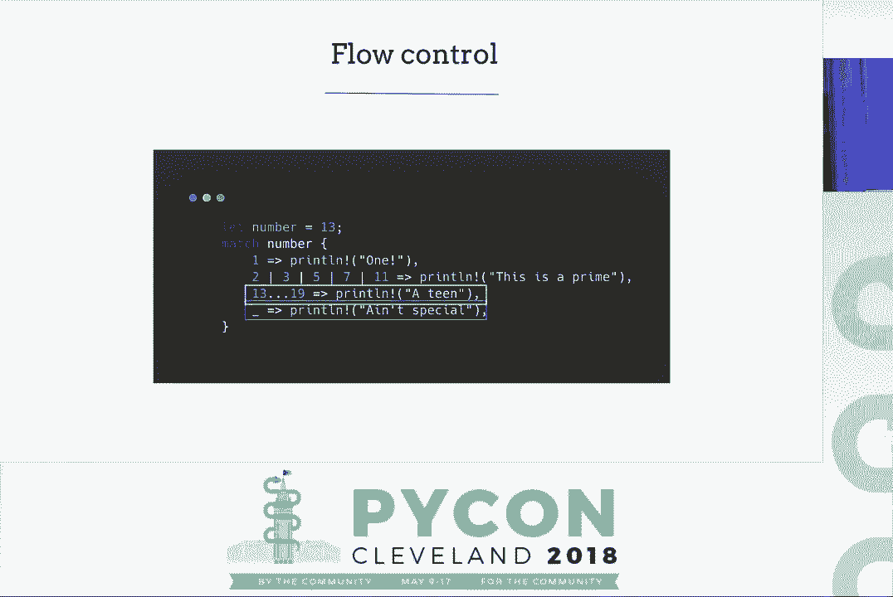

 a while loop with the condition。 So in， in， uh， in Rust， you all have iterated types。 So you， uh。

 type need to be， uh， type needs to be like iteratable in order to run for loops。 Uh。

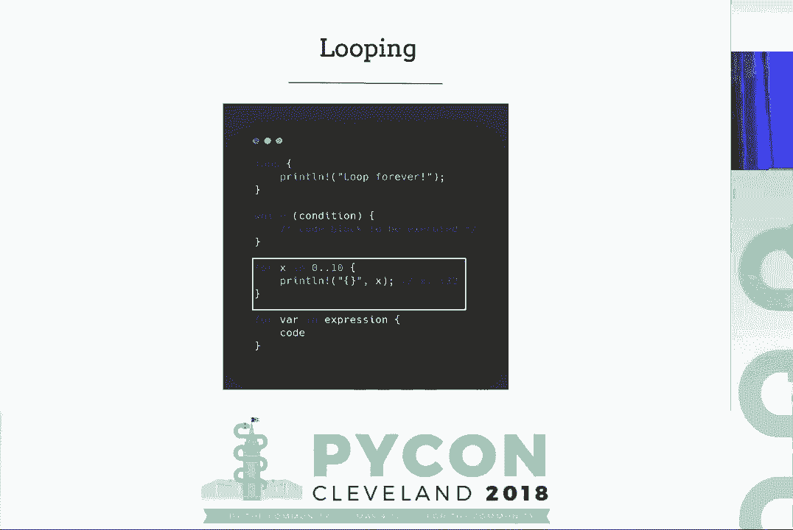

 so here you basically have a range and， uh， in an expression is， should be an interval type for。

 it to run in for types。 So Rust gives you all the kind of， uh， types that you usually find in an。

 system programming language。 Uh， nothing， uh， different。 So you have something called cargo。

 which is really， really cool。 It's very similar to pip。 Uh， but does things more， I believe， like。

 there are little more functionalities that， uh， you know， cargo really does well。 Uh， but there are。

 a lot of similarities over there。 So coming back from， coming from a Python community。

 cargo will be， something that you really， really enjoy because I definitely did。 Uh。

 so coming to the core concept。

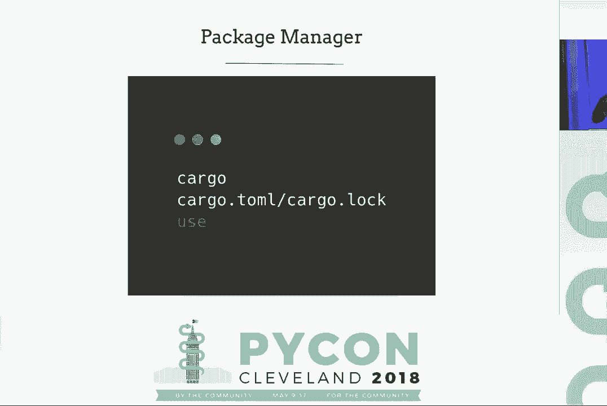

 this is something that you really need to understand。 If you are able to understand this。

 you're probably master trust。 So ownership， that's some， some， it's more like a writer processing。

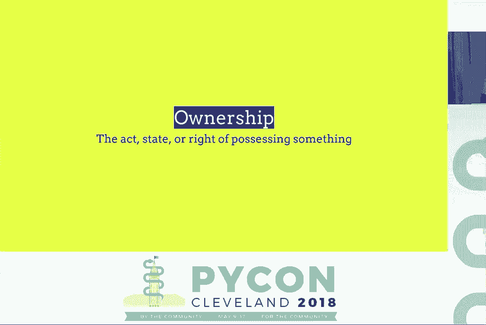

 something。 So let's look at this Python example。 So you have a class， it calculates the area。

 and then you're creating three such objects， uh， and， you know， calculating the area， and you're。

 uh， you know， having an operator that， uh， adds up the area over there。 So basically in the heap。

 memory， you would probably have， uh， three circles。 And what basically happens over time is。

 there'll be a garbage collector software which runs behind， uh， under the hood that would go and。

 clear up this。 So it uses reference counting and things of that sort in Python。 So we as。

 Python developers don't really， you know， care about it because this is something that is taken。

 care by the Python interpreter。 Uh， pretty cool。 So in， uh， similar to referencing， you。

 you can just。

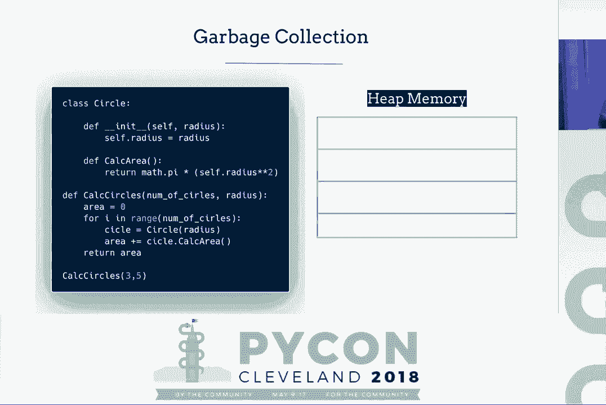

 you know， get， get some values out and pass it to different classes， like considering a booking。

 service。 Uh， sorry， there's a small typo over there。 Booking service and repair service are holding。

 a reference to this way， uh， this variable and should totally work fine。

 But let's say do this in trust。

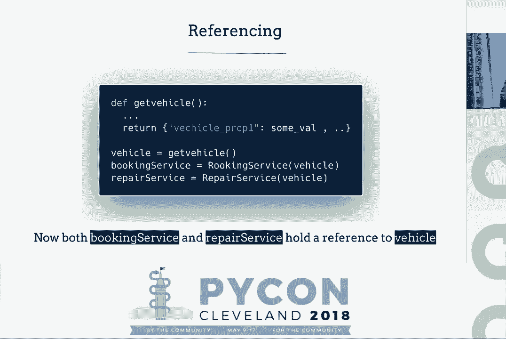

 Uh， this would， you know， fail at compile time。 It basically will throw you an error saying that。

 you know， this particular type has been moved。 Like， how are you supposed to even program this way？

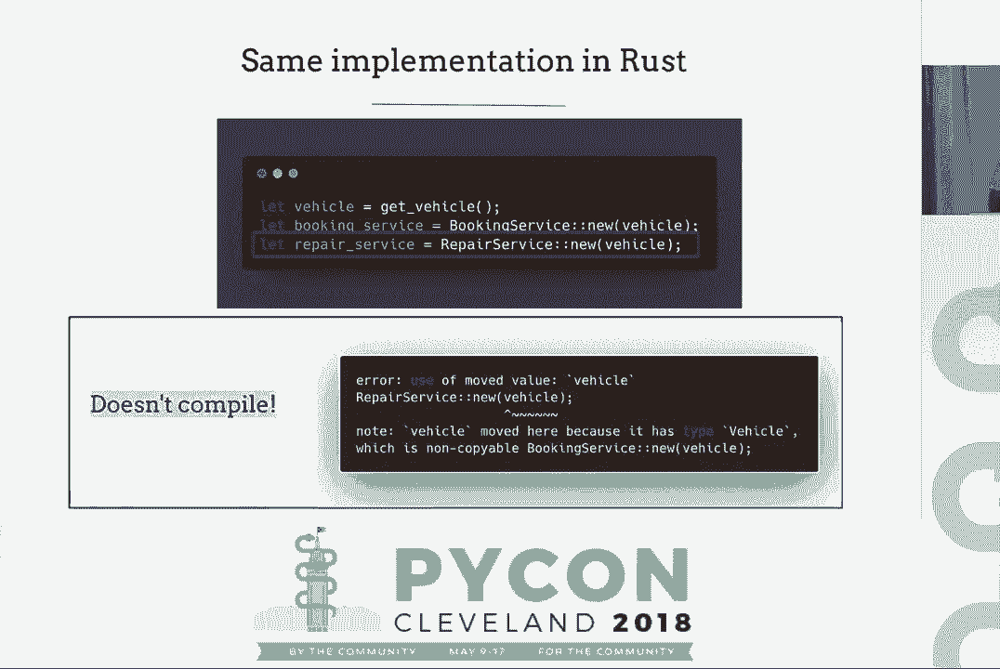

 Like I can't even pass a reference。 So this is that ownership really， really comes into place。

 So everything in trust， uh， is owned by a scope。 So a scope， particular， a scope basically owns。

 a particular， uh， a variable or a particular resource and the moment the variable， the scope goes。

 the variable goes out of scope。 It is just deter， deter， deter， deter， deter， deter， historically。

 destructed。 So that's the reason why you don't need a garbage collector。

 So the memory is freed as soon as the own variable goes out of scope。

 That's the most important thing。

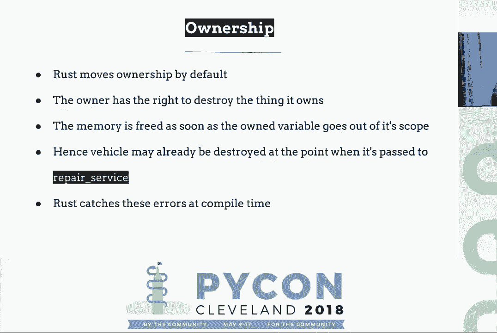

 that you need to， uh， you know， remember。 But that's the reason why when we pass the vehicle， uh。

 variable to the booking service and so the booking service is not explicitly。

 returning back the ownership to the main thread。 So then you call the repairs， uh， repair service。

 uh， this， uh， the vehicle will not exist because it has been just domestically destructed。

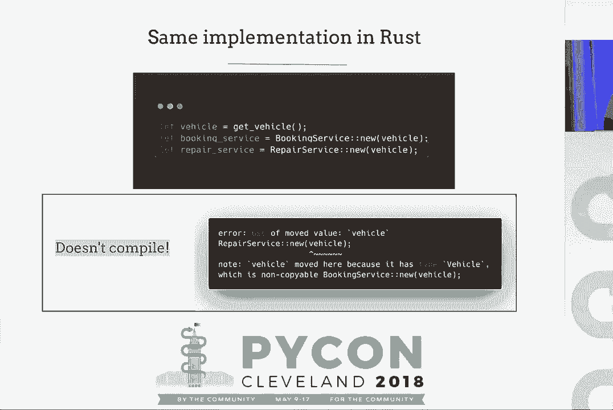

 So how am I supposed to code like this？ Like how can I pass variables between threads？ So that's。

 where borrowing comes into place。 So you could use an ambison symbol to pass a reference。

 A pretty simple lending is the key here。 Uh， so you can， you can， you are basically passing the。

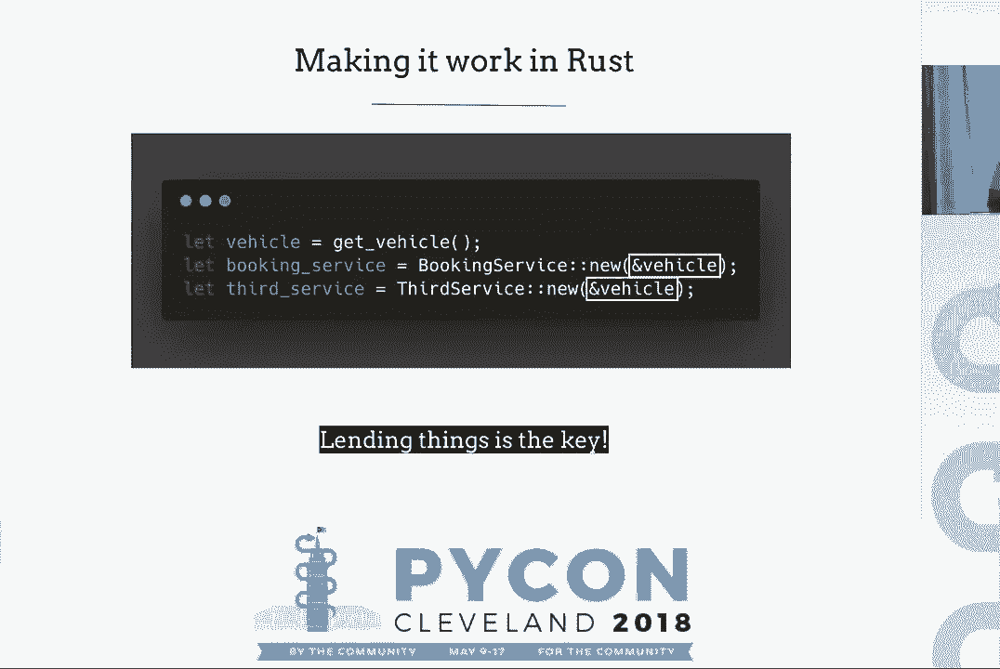

 ownership between threads or between functions and then there are two types of borrowing on。

 a immutable type and a mutable type。 Immutable type does not allow you to make a change if the。

 particular， the particular， uh， memory location and a mutable type allows you to do that。 You could。

 have like any number of， uh， you know， immutable references， but you just can't have， uh， given。

 point of time， one mutable reference。 Makes sense， right？ So yeah， so this is how， you know， uh。

 rush kind of handles a memory， uh， management without any garbage collector。 So let's look at。

 some high level iterators that I have sold about。 So here we're finding a particular word in a， uh。

 string and then you have things like， you know， into aiter which converts， uh， your particular。

 strings into iterable types and your map function， which calls the wc line function which you have。

 filters and folds。 So these are the high level iterators that I was talking about really makes， it。

 you do write really fast。 But how do I like do it in a parallel way， like make things more， faster？

 Uh， thus， thus this package called， uh， Ryan and all that you have to change is， you know， make， uh。

 into aiterate to into pariter。 Pretty simple， right？ So， uh， gives you a lot of， uh。

 boost at runtime。 So Ryan is a very， very super cool package。 I highly recommend to check it out。

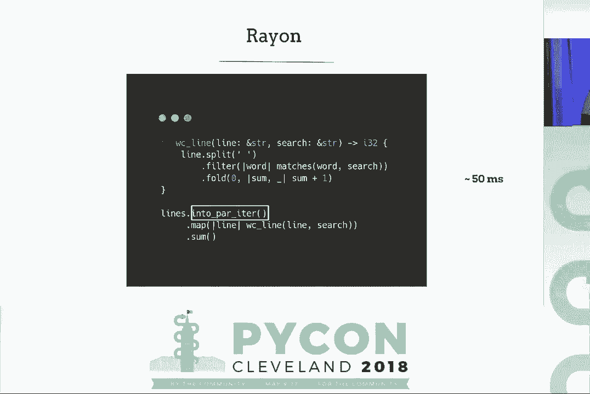

 It really helps in data parallelism and， uh， data parallelism。 So there are some custom data types。

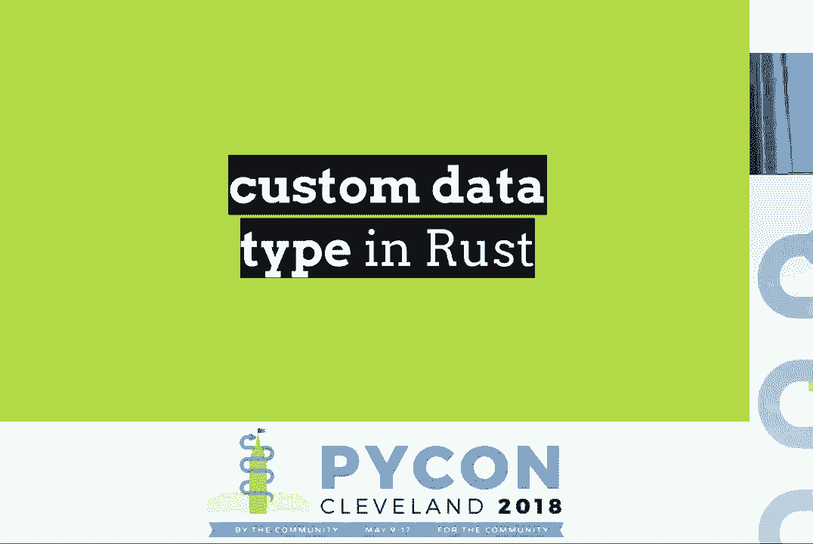

 that you could build。 Stuct is a way to do that。 They are like lightweight references。 They have。

 fields。 Uh， they also have， uh， methods。 So， but you cannot have them partially filled。 It will。

 throw you an error at runtime。 So， uh， with what you could basically do is use something like an。

 option which is an enum that's usually， uh， used for error handling interest。 And match an enum or。

 very good way of doing error handling interest。 Uh， Stux can have methods。 So use the implement。

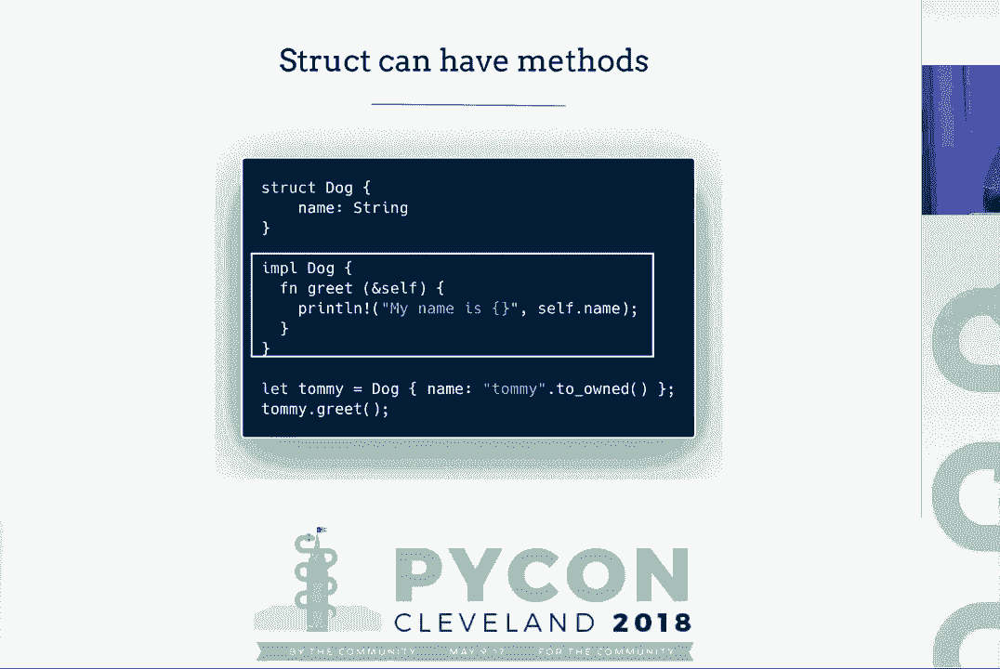

 keyword to， you know， build methods for， uh， structs。

 So there's another important topic I want to talk。

 about is straight which are like interfaces in Rust that allows you to add functionalities。 Like。

 you know， have similar kind of functionality， same function names for different types。 So。

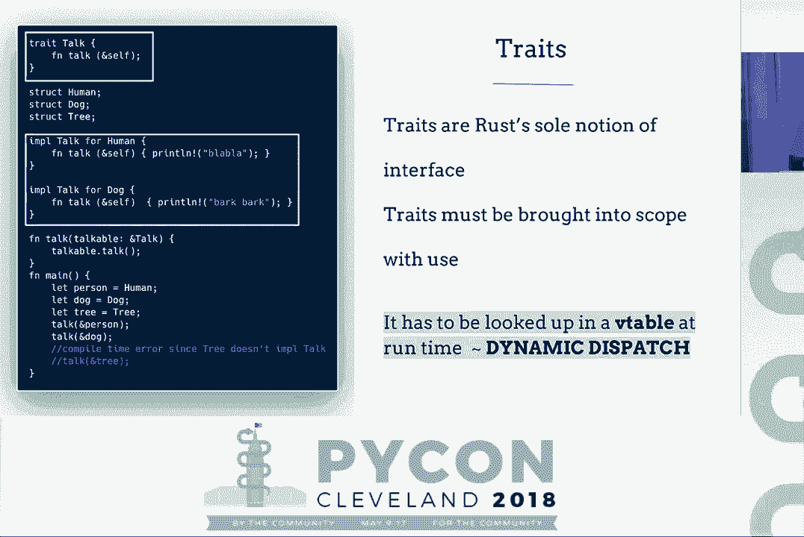

 this is where the dynamic dispatch happens at runtime。 And there's something called generics， uh。

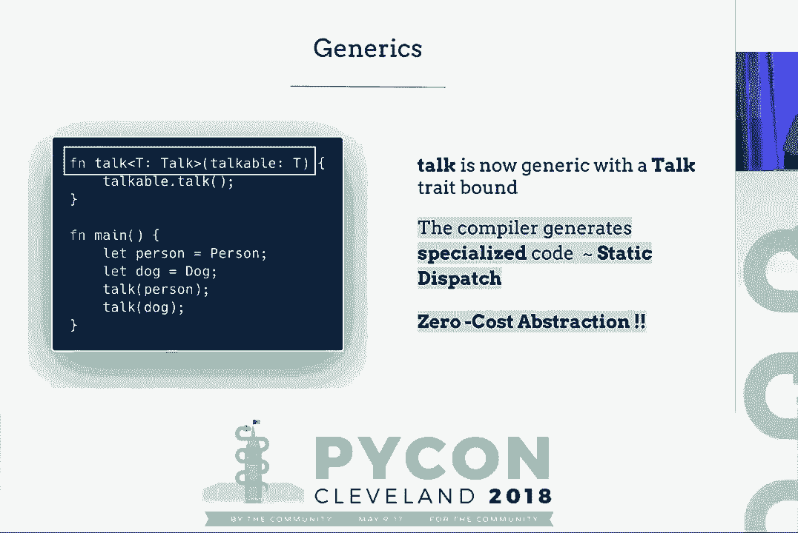

 which is again a very cool topic I think I'm running out of time and I'm going to skip this part。

 So let's look at developing and shipping Rust extensions in Python mode。 That's the reason why you。

 guys are here， right？ So the way to do it is using foreign function interfaces。 Foreign function。

 faces are the way to， you know， you， you probably want to share your particular data types from one。

 language to the other languages。 That's， that's where， you know， uh。

 foreign function interface comes， into place。 Uh， it's based on platform dependent， uh， C bind。

 C application binding interfaces that， you have。 And trust is known to， you know， produce really。

 really efficient C bindings。 That's one， reason why I feel， uh， Rust is a， you know。

 a good option that you might consider for writing your， by the next engines。 Uh， again。

 coming to the point that， you know， the control aspects， you really， know what's happening。 You。

 you， you looked at the Rust code， it was pretty easy to understand。 It， was not that difficult。

 right？ It had a lot of similarities to Python and other languages out there。

 So it basically gives you this opportunity to understand what you're writing。 You just don't have。

 to blindly believe on some tools。 Uh， that's something that， you know， as programmers。

 we need to really， really focus on。 Uh， so yeah， if。

 if Python is Tony Stark and then Ironman would be Rust and the， Comp， Rust compiler would be Jarvis。

 Uh， that， that's， that's my， uh， you know， uh， example。 So it's， really the ideal for， uh。

 ideal for creating and using FFI modules。 Uh， so you start off by， uh， you know， mentioning， uh。

 the library that you want to create。 So you have to， in Rust， you have to， first create a binary。

 So you use a， so you use a， so if you look at the create types， creates a similar。

 to libraries in Rust。 Uh， similar to libraries in Python。 And using a create type， you created a。

 dynamic library that would， uh， you know， have an output like the daughter so files in Linux and a。

 dot， uh， deal file windows and things of that sort。 And next up is where you create an extension。

 So。

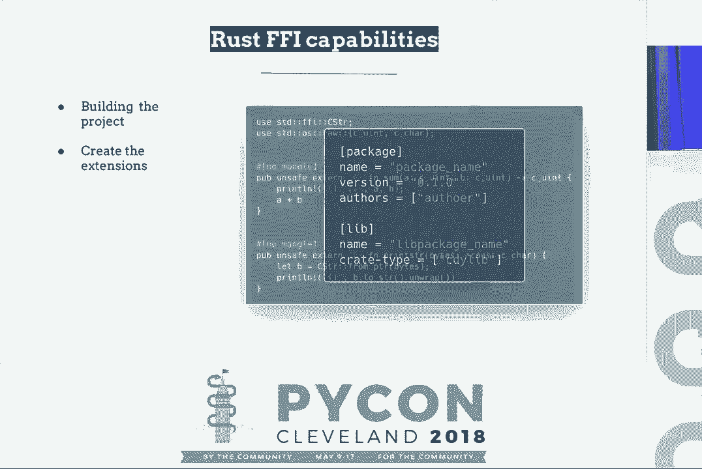

 Rust standard library gives you some， uh， some， uh， uh。

 in build data types for interacting with these， street strings and see inputs。

 No mangell is a way to， you know， in an attribute that you mention。

 not a tell that don't change my function names， uh， while compiling。 And yeah， you， you don't have。

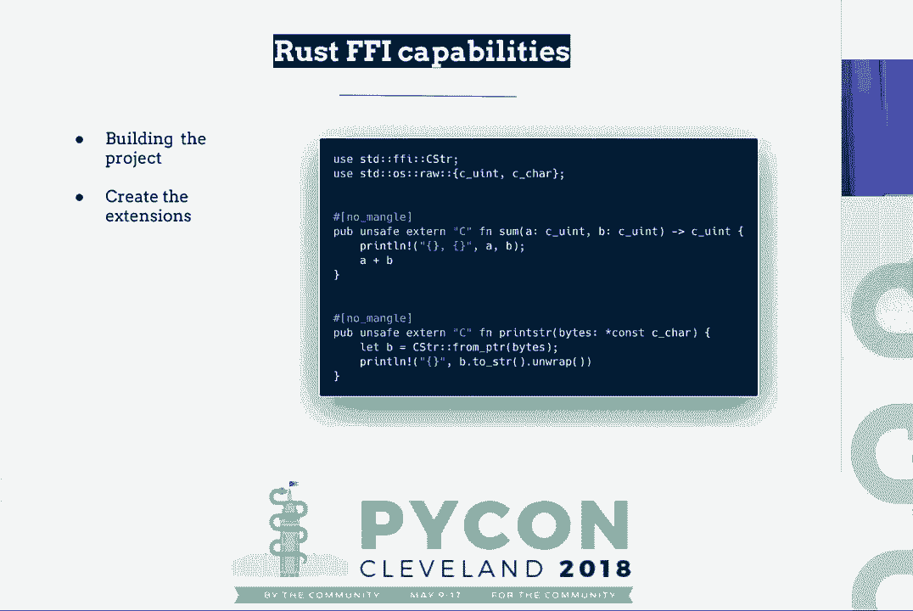

 to explicitly go through the code。 Uh， the point is that it's very easy to write these extensions。

 And。

 uh， you can compile it to your Python code using， uh， the ECFFI modules。

 I highly recommend to go out， check out the documentation tests like quite， uh。

 quite a lot of things that needs to be covered， and you could always build it with your， uh， setup。

py。 So there are other tools that I highly recommend to。

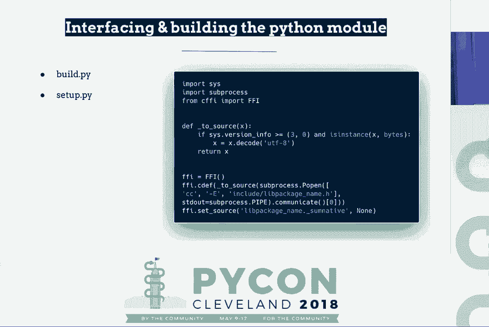

 go out， check out like setup tools。rust， mil snake， a mil snake again written by， uh。

 the centric guys。

 So it works really well。 Uh， but there are other alternatives。 As people say， don't reinvent the。

 wheels。 Uh， you have a lot of types to， uh， you know， manually handle there are， uh， vectors and。

 arrays that you want to basically pass out。 So rush see Python is a good， uh， library out there。

 It's a library or create which probably handles， uh， uh， the other， other C bindings that you want。

 to have。 Uh， it's an easy way to， you know， communicate with the interest in Python。

 So here I basically， have a Python code which， you know， I'm trying to do some string processing。

 uh， uh， find the doubles， in a particular line of string。 I'm using two S。

 you can just use a zip and then I'm using a regex， to do that。 Uh， and I'm creating like a billion。

 uh， characters。 So you would use the， uh， Rust。

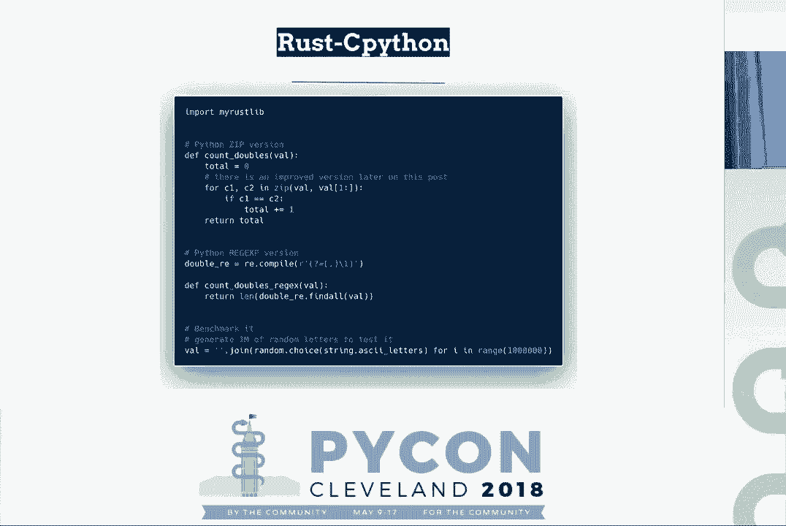

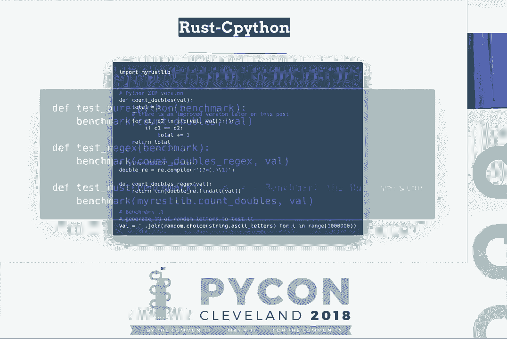

 uh， benchmark， uh， PyTorch， benchmark， uh， library to， you know， benchmark your， uh， performance at。

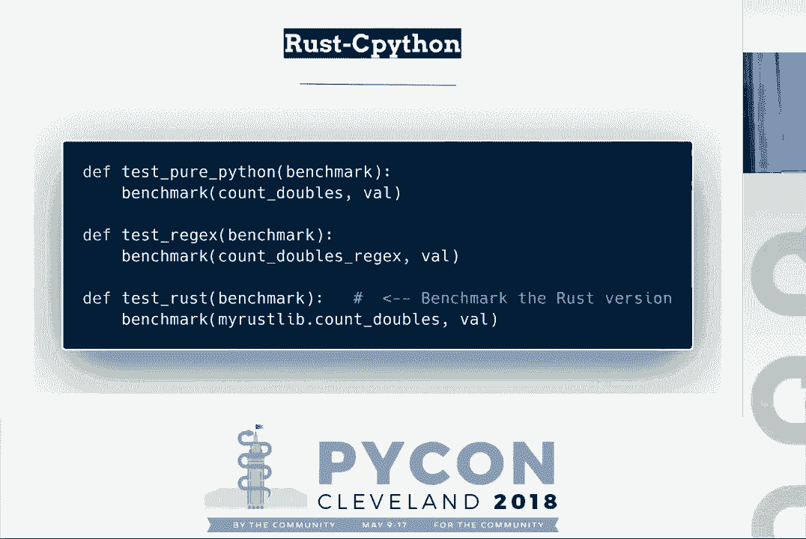

 runtime。 And， you know， let's now create an extension in， uh， Rust to do the same。 So we first off。

 first of all， we start off， uh， mentioning the， uh， the crate that we're going to use that is。

 the Python， uh， call those， uh， uh， types that you're going to probably use in our Rust code。

 And then， here I have a similar implementation of， uh， uh， the same， uh。

 counting functionality in Rust。 And， but if you can notice。

 clearly I have used a Py result as my type because that's what's going to， like。

 handle exceptions in Python and， you know， communicate between， uh， the statically compiled。

 eso file and your， uh， Python interpreter。 And it also。

 first argument or two that is in Python type， which， you know， goes down and， you know， you， uh。

 locks your， uh， global， uh， g， uh， gl， uh， gl。 And， uh， yeah， then okay， it's a way to。

 written back， uh， the success of this particular program。

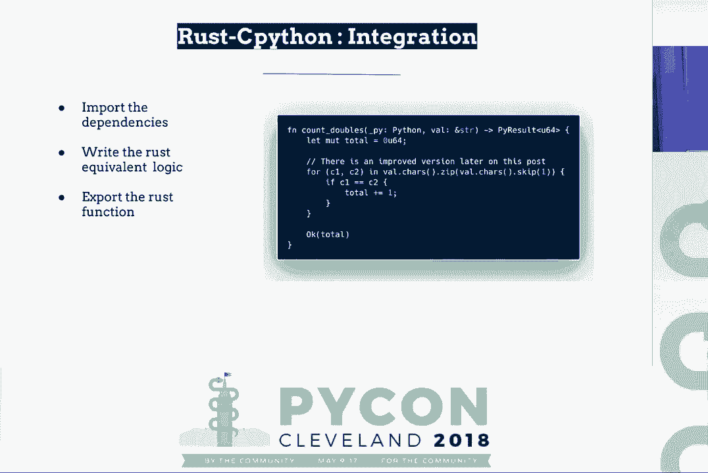

 the final value。 At last you have to use an macro in order to explicitly mention the functions that。

 you're going to export， uh， since， again， a nice interface to， uh， you know。

 compile out the functions。

 that you're going to use。 So， yeah， you would find a significant， uh， boost in performance。 So。

 the pure Python， uh， you know， it's just， it's just like 25 times faster and 10 times， uh， to most。

 10 times faster than， uh， the reggaex function。 So that's the advantage of， you know。

 compiling ahead of time， uh， and using static programming languages。 So there are other things。

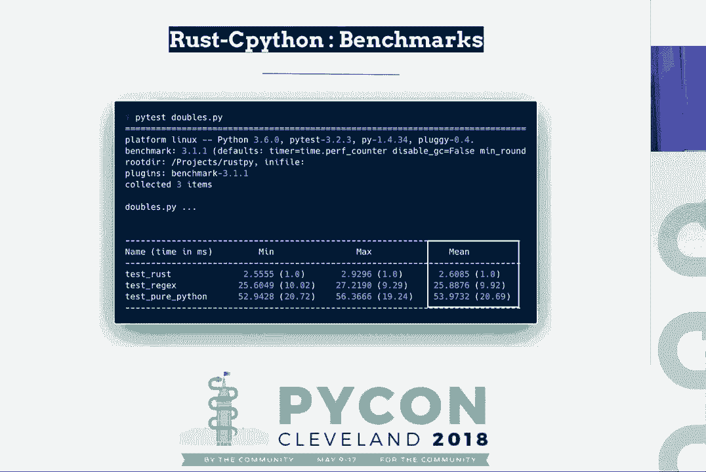

 that you probably want to do with， you know， allocation of memory。 There's a lot more， you know。

 this is a very simple example， but， uh， uh， building production applications you probably want to do。

 a lot more things like pass vectors and things of that sort。 Uh， so you， I would highly recommend。

 this talk by my friend Nikita who also happens to be a tech speaker。 This is a good talk to go out。

 and check。 He has talked in detail about ever five in trust。 So there are， again， good tooling。

 system that is available in trust。 You have Rust app， which is the Rust to， uh， uh， Rust， uh。

 tool chain installer helps you to go between different versions of Rust， Rust format， Rust。

 with PDA， some， uh， good ways to maintain， like， really good code basis， cargo， which I mentioned。

 before， the spacket manager and there are a lot of other tooling system out there。 Uh， Rust is a。

 community driven， uh， project， uh， you know， everything happens through an RFC， you will have to。

 uh， if you want some kind of changes， you， you， you， you submitted an RFC proposal， the community。

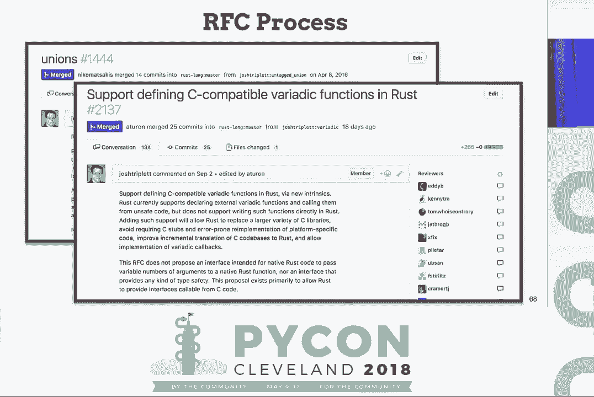

 verifies it。 There's something called craze。io where， you know， all these packages get， uh。

 you know， uploaded， you'll find a， a pretty， it's， it's a very good library ecosystem。 Like。

 given the time， there's been a lot of craze that have been published over there and pretty helpful。

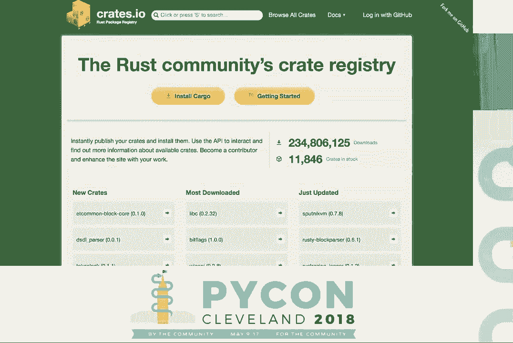

 Uh， to summarize， uh， no， I， I， when do you， when do you have to use Rust， like， you know。

 like the main thing that I would say if there's some kind of mathematical， uh， complex， complex。

 code that you have， that you have in your existing stack， that's something that you can convert to。

 Rust and， you know， get， get the advantage of statically typed languages for accessing hardwares。

 you know， kernel level APIs， Rust gives you， like， good types and， you know， interfaces to do that。

 Uh， implementing advanced， uh， concurrency paradigms， really， really easy。 But keep， just， uh。

 keep in mind that， you know， calling between languages， it's a bit costly。 So do that in a very。

 response will be made， don't， should not be like， you know， for every， you know， apare request or。

 things of that sort， you are， uh， calling in， uh， uh， Rust build function or Rust tactically typed。

 uh， Rust functions。 So what does Rust has to offer？ It's a modern replacement to C++。 And if you're。

 someone like me who is looking for learning system-building language and then feels C++ is a bit。

 difficult to learn， Rust is definitely a good choice。 And apart from that， it's about， you know。

 improving your tool chain。 You， you want to， you want to， like， uh， learn on a day-to-day basis。

 because there's some concepts that we don't really care about in Python， but， uh。

 given computer science， advancing so fast， we need those。

 we need to know about those concepts and Rust is a very good way， to learn them。

 I personally learned it that way。 It's just rich runtime and then has a lot of strong， uh。

 functional programming influence， which is really good and just something that we。

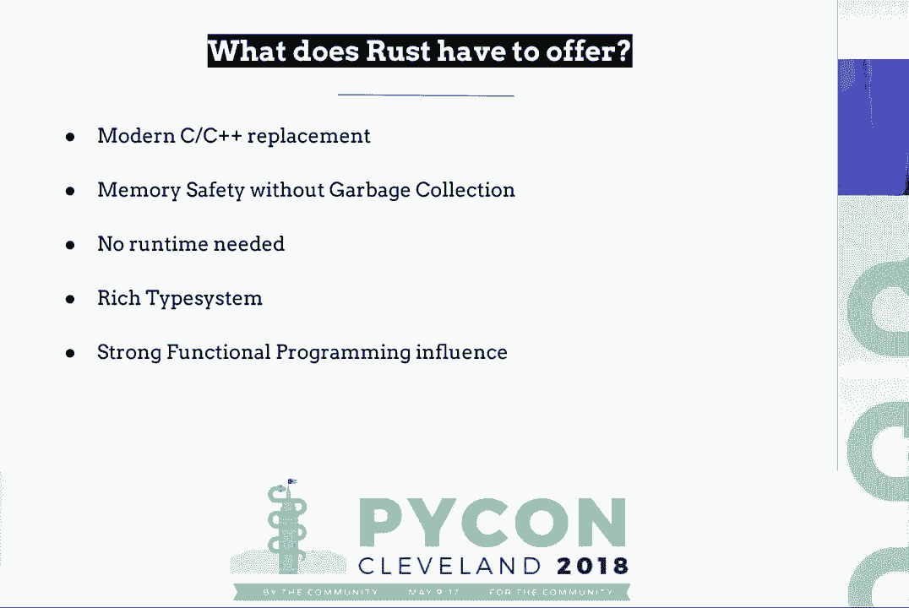

 have spied in developers really loud。 Uh， so we have a feel awesome， like， you know， uh， and， yeah。

 that's pretty much about， uh， all that I wanted to cover。 Uh， and thank you so much。 Like， you can。

 my， my， I'm， I'm， I'm at the day， the week， and you should be in Twitter and then I have just。

 put together some good talks in PyCon US， tiny world or PyCon US， so do feel， feel， feel free to。

 go check them out。 I think we have a couple of more minutes left for questions。 Thank you so much。

 [applause]， So， uh， if anyone has any questions， please feel free to step up to the question mics。

 There's one， over here and one over there。 Um， yeah， we've got a couple more minutes， so please， uh。

 please ask， anything that's on your mind。 Or I'll be around here， so feel free to， you know， uh。

 yeah。 Uh， I was curious， do you know if Rust has much， uh， libraries for scientific computing， like。

 crunching numbers like people do with NumPy and stuff？ Uh， at， at this moment， not many。

 I'll be very honest with you。 Uh， but that's something that I like to do in my free time。 I'm。

 building， like， you know， some deep learning packages， uh， like， just one deep learning package。

 but it's a fun thing to do， you know， you， you learn a lot in that process。 They are very few。

 actually very， very specific to industries， but there's a lot of amazing creates in networking。

 embedded systems and those areas， but yeah， with scientific computing， we are not there yet。 Uh。

 but it's a very， very interesting domain for Rust。 Yes。 Thanks。 All right， thanks for the talk。 Um。

 so if I take a NumPy array and I pass it to Rust， or if Rust has， um。

 some array and it wants to pass it back to Python， um， what does it show up as， like， do you。

 have to specify all of the， uh， like the， the shapes manually or what it， and so。 Uh。

 so that's where things like， you know， Rust， see Python comes into picture。 Uh， they handle it for。

 you， but if you want to do that from scratch， you can use the Rust， uh。

 inbuilt FFI modules to do that。 Okay， thank you。 Yeah。

 So currently if I want to speed up something with Python as far as computation is concerned。

 I'm probably going to use either scython or c++ or something along those lines。

 What kind of situations have you seen where Rust will outperform， uh， scython or c++？ I。

 I've not actually benchmarked between scython and Rust。 Uh， sometimes I think you get like really。

 really close performance。 It really depends on what your building and what your application is。 Uh。

 but， like， you know， it's all about control。 And I showed some use cases， right？ Like。

 in web development， parsing and things like that sort。 They have， they have， they have。

 historically been a good performance boost over there。 Thank you。 Hey， thanks for the talk。 Um。

 do you know of any Python C libraries that have switched to Rust and。

 what their experience like that has been？ Yeah， so， uh， the centric guys have done that。 Uh。

 not really sure with the library names， but， they are a couple of them out that I can， I can。

 I can share that to you later。 Yep。 Thanks for the introduction to Rust。 Um， in your summary slide。

 uh， one line you said， Rust is no wrong time needed。 Can you kind of explain a little bit？

 I'm sorry， I didn't follow the question。 Um， one of your line says Rust is not wrong time needed。

 Uh， I'm really， really sorry。 I'm not able to follow。 Are you able to get the question？ Okay。 Yeah。

 So you're basically compiling ahead of time。 So you have your entire abstract syntax， to be built。

 So that's something， uh， Python does on the fly， right？ It's， uh， it's a scripting。

 language and the other one is a system programming language。 That's where you get that， uh， kind of。

 compute， uh， computation boost。 Uh， so that's， that's what I meant by no runtime needed。 Thank you。

 Hope that helps。 Yeah。 Thank you so much， guys。

