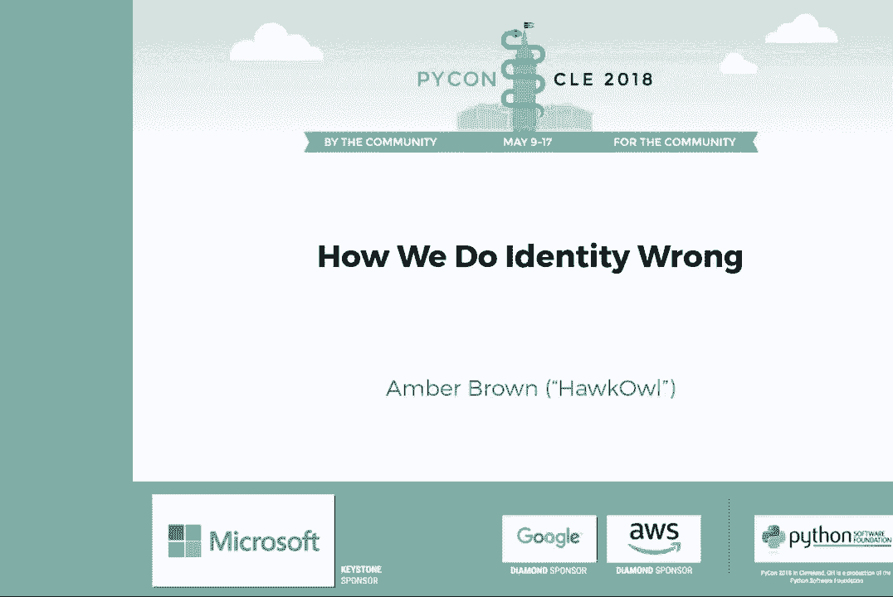
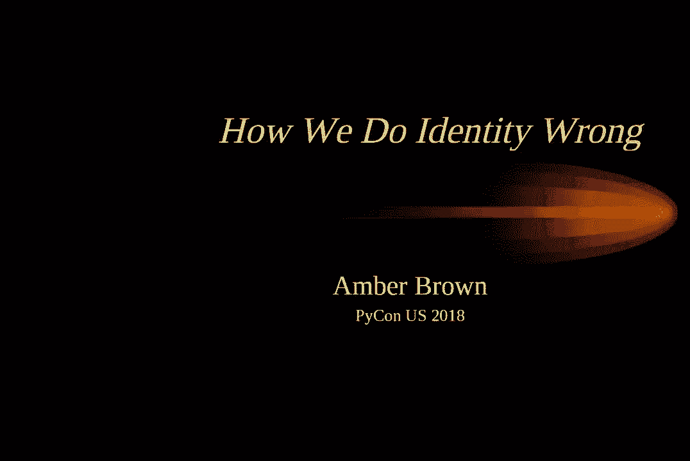
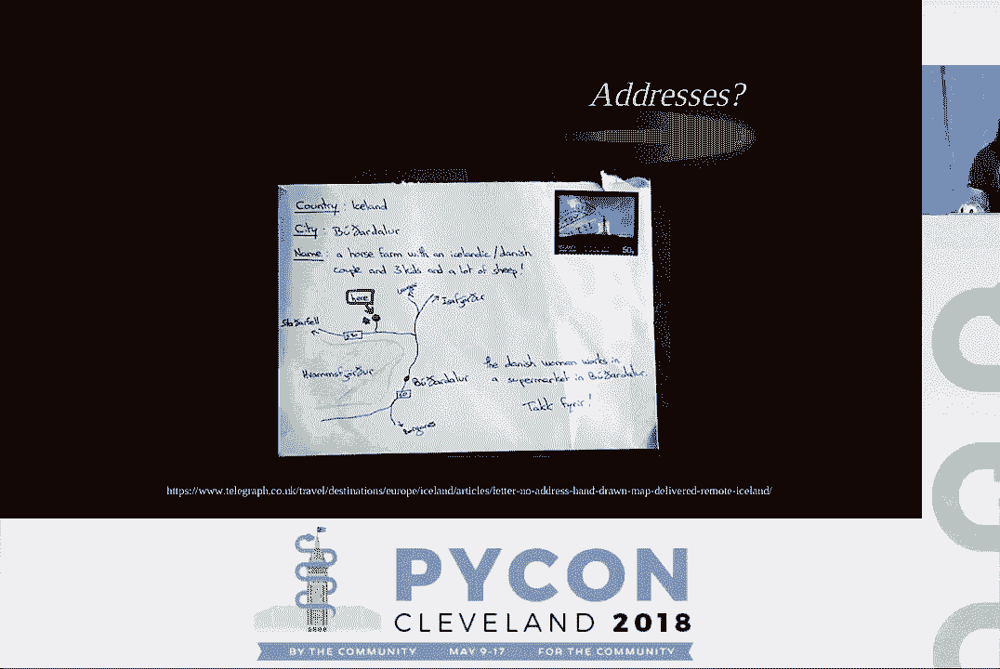
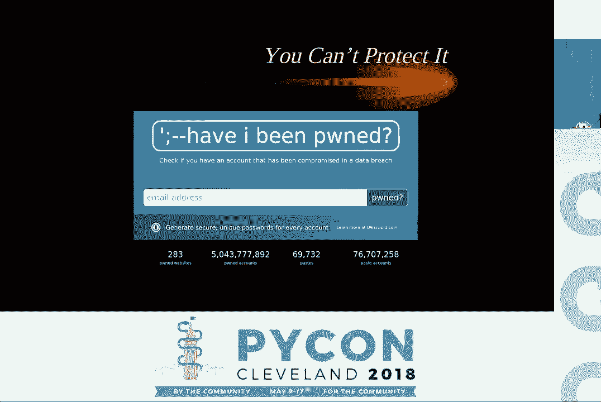
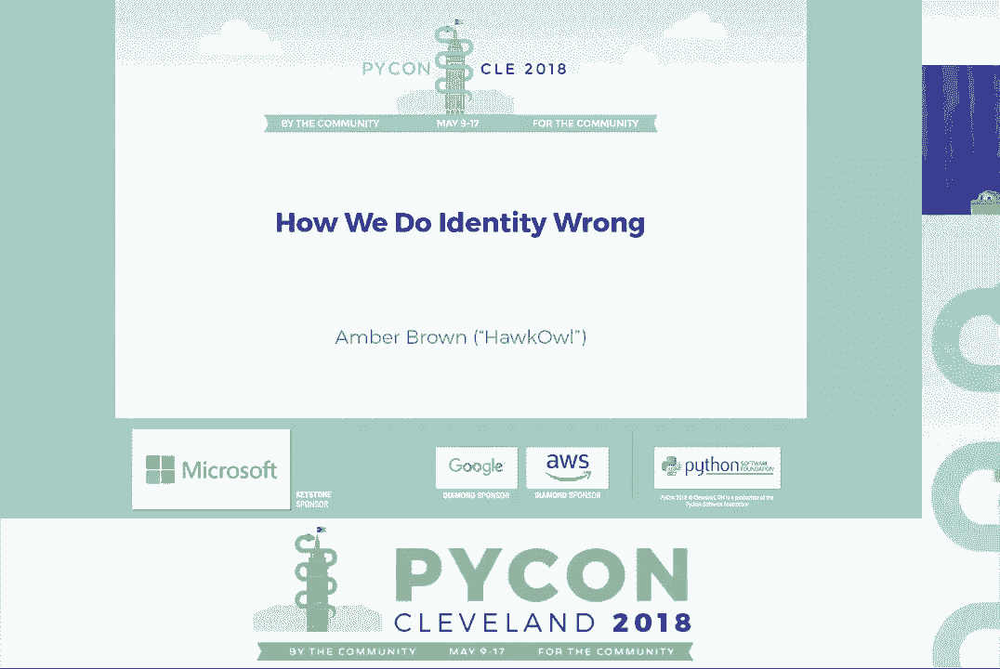

# P2：Amber Brown (HawkOwl) - How We Do Identity Wrong - PyCon 2018 - 哒哒哒儿尔 - BV1Ms411H7Hn

 \>\> Hey folks。

 \>\> Hello。 \>\> Hey everyone。

 So one request， if we could try and sit in the center of the row so people who arrive。 late can fit in the edges。 Also， let's all welcome Amber Brown who's talking about how we do identity wrong。 \>\> Hello。 Can you hear me okay？ All good？ Great。 So I am Amber Brown， computer al team lover。 On the angry bird website you can find me at at hokey al。

 I live in -- I help from Melbourne Australia and my website is links for now。net if you want。

 to find me。 So what is identity？ Who even knows？

 \>\> The identity of a person is the characteristics they have that distinguish them from others。 This is composed of internal and external attributes。 Generally your internal attributes are relatively unchangeable。 They are things like your personality， your gender and your life experience。

 But external attributes tend to change more。 Things like your address。 especially if you are a millennial and you move every year like， me。 Your birth date。 Now sometimes there are some wacky things that happen with that。 Especially if you are old and were born before computerized birth certificates。

 Some people don't know their birth dates。 Your nationality might change。 You might move to a different country。 You might become a citizen of somewhere else。 The country of your birth might cease to exist and form into another。 Your name can also change throughout your life。 As well as some things that people think that stay relatively static like your social security。

 number and your Medicare number。 But we as developers we need to sometimes know information about users。 So what do we generally store？ Name and address is pretty common if you are sending people anything。 Data birth， it is important to know that maybe your users are old enough to see such content。 or sign contracts or do other sorts of things that your website might want to do。 The nationality。

 sometimes you need to record that in case like for example you are the， United States Esther。 You need to know what country someone is passport is from。 Their gender。 possibly we store that a lot。 Their social security number or Medicare number for looking up in government systems and other。 sorts of small attributes like that。 Now which of these is immutable？

 None of them really unfortunately。 Reality doesn't really fit in well-defined boxes。 And we as software developers love finally defined boxes。 It's great if most things can fit in a single role in a database and never change and not。 have issues that wake you up at 3am where suddenly it's someone with a Unicode name types。

 in their name in Unicode and then suddenly your website falls over。 Let's tackle the problem of names。 We screw these up a lot。 Now most Anglo countries such as England and Australia and the United States will generally。 format a name like this。 You will have a title or an orific such as Dr。 Professor。

 a given name like for example my name is， Amber。 My middle name which is Hawkey。 my family name which is Brown and post normal titles for example。 PhD or MD or something like that which I don't have because I'm uneducated。 Here is someone that a lot of us should know that very well fits these boxes。 Lady， Augusta， Ada。

 Kingdoll， Countess of Lovelace。 But sometimes we miss portions of this like Sir John Mayer who was Prime Minister of the United Kingdom。 He does not have a middle name。 President Harry S。 Truman of the United States。 some people might know this but his middle， name is actually S。 That's it。 So you know you obviously can't rely on a middle name that exists being longer than one character。

 Now there's the Germans。 This is a real person and they have no less than seven middle names as well as four words in their family name。 Now a lot of things kind of trip up on that。 They don't expect you to have spaces in your last name and a lot of things don't even handle hyphens which is funny。

 considering that a lot of people have hyphens in their last names。 You think we'd be okay at that。 And then someone like sure。 Sure's legal name is just sure。 A single given name。 Can sure use your website？ I'm guessing no。 And this is just the Anglo way of sending things。 In other places it works completely different。 In Chinese and quite commonly Japanese the family name comes first and the given name comes after。

 So you can't automatically assume that whatever the first part is is someone's given name and whatever the last part is is their family name。 So if you're given just a string of words that is someone's name you can't automatically split it up into the different sections。

 without them explicitly doing it themselves。 Now there's a lot of common naming assumptions that we have and it's covered elsewhere but people's names having multiple components。 and not having spaces or hyphens。 People assuming that the name that is on your driver's license or your passport is the name that you actually use in day-to-day life。

 That people having one and only one middle name。 That people prefer that their given name is the name that you call them。 People assuming that names don't change or that people have a single name that they go by。 Some people who are married may go by their maiden name in some professional context while using their new married name in other contexts。 You can't assume that they might not want to use both。 Now names are mutable。

 Marriage is one of the most common reasons changing your last name。 Sometimes taking one of the other partners family name or both partners changing their family name to a conjoined family name。 Gender transition is also a common reason as well as witness protection and some people just don't like the name that they were given a birth。 And how do we store them？ Now we need to think of the application and the reasons why we're storing them。

 Usually it's because we're either referencing some sort of government system。 For example if you are a medical institution you quite often need to use a name that is on someone's Medicare documentation。 Or you're like a social service and you have a more casual use of someone's name。 It doesn't necessarily have to match up exactly to what the government says。

 Or some services it's important to have both because you might want to have a user have a more preferred name。 while also having in the background their name verified by some sort of government institution。 Now if you are dealing with government departments it is simply just best to use the schema that the government uses。 Even if this schema is wrong it is unfortunately one that will match up consistently with their systems。

 and it's likely that the person if their name doesn't fit with their regular government systems will know how to get around it。 But it is also good to use a single field for casual uses such as the person that you're sending a letter to。 You don't need to break that up into first name and last name and all of that sort of stuff it just gets printed right on the label。 If you do need to ask for multiple names it's best to minimize confusion and make it clear what is used where。

 Making it clear that this section is what is for your government ID and this section is what we will call you when you're going around the website。 And often if you want to ask for both you could always just ask for the government ID first and then have an option is your name different。

 then what is on your ID click here and then it shows the rest of the options to enter their preferred details。 And don't assume that given a name that you can extract out portions of it。 You must ask for this if you need it。 For example my boarding pass was for someone called Amber Hawkey。 One word。 Doesn't quite match what's on my passport to be honest。

 There is this classic article which goes into a bit more detail about the falsehoods that programmers believe about names。 It's a very worthwhile read。 You can just Google falsehood programmers believe about names and you'll find it。 There will also be slides posted up afterwards for a nice clickable link。 Let's tackle gender。 Now this is an interesting one。 The first question to ask is what are you going to use the information for？

 Why are you asking？ Do you actually want to ask for pronouns to refer to someone throughout your website？

 Or do you want to know if they're interested in gendered products such as tampons or pregnancy tests or that sort of thing？

 Usually you only really care about pronouns。 So you want to offer common pronouns。 You want to allow custom ones as well。 You don't want to show this information publicly by default。 You should leave it up to the user to decide whether they want to let that be known to just any random passerby。 And do you actually need to use pronouns in your website after all？ Usually you can avoid it。

 But if you're asking about gender， there's sometimes legitimate reasons where you would want to ask。 For example， verifying things against Medicare and my passport is a legitimate use。 Sometimes collecting information for programs focused on gender minorities is important to know that they qualify。 And statistical information， for example， a lot of conferences will ask your gender for working out demographics。

 to working out how well certain outreach efforts are going。 And if you must do this。 it's best to use a free-form text box or a drop-down box that allows you to then type in another option。 Fits everyone， doesn't have much more work， and keeps everyone happy。 Now， addresses。 Now the non-Americans in here are probably being nodding quite a bit。

 Now things that don't exist outside of America， zip codes are a big thing。 Counties， and Arizona。 If I select Australia， please do not let me select Arizona as the state。 This has happened。 Thankfully， the Australian Post Office is kind of pretty good with working that out。 But things that do exist outside of the United States。 PO Boxes in Australia， for example。

 commonly accept packages。 And in a lot of cases， this is the only way you can get a package delivered if you're in a rural place。 So simply going， if it's got PO Box in it， can't deliver packages。 isn't quite accurate if you're working in places other than where you know。 Postcodes can sometimes have letters in them。 For example， the UK。

 The bridge in the front row is nodding。 Also extremely long town or city names。 especially ones with spaces like you'll get in Germany。

 Sometimes an address isn't a thing that exists at all in some places。 This is a letter that was successfully delivered。 Recently there was a story where someone sent a letter labeled simply "England"。 And it made its way to its destination。 Foreign Post services sometimes know how to get a letter of places better than you do。

 Now this is commonly what happens in the US。 You have a dress line one， a dress line two。 a city postcode or a zip code， and the country。 Now this fits for a lot of places， but for example。 doesn't fit some places like the UK。 Or sometimes doesn't match where you're trying to interpret things about the address。 It's best to research into the country that you're planning to deliver services to and match the address lines correctly there。

 And even then sometimes you might just have to have a big text box where they can just write things in。 Generally the Post service will get things to where they are needed。 There's also a false word programmers believe about addresses which is very UK focused and has a lot of interesting facts。 Some of which I didn't know and it turns out that the UK I'm a surprise male gets anywhere at all。

 I suppose male gets anywhere in Australia that the trucks don't just disappear in the nullable。 But anyway。 Now whenever you're storing personal information or asking for it。 there are dangers and extreme pitfalls。 Great doctor once said we should treat personal electronic data with the same care and respect as weapons grade plutonium。 It is dangerous long lasting and once it is leaked， there is no way of getting it back。

 And this is a generally correct assumption。 Those that have lived through the Equifax leak of 2015 or 2016 whenever it was will know that once that information is in the public domain。 there's no way of getting it back。 And for a lot of people that's information that they can't easily change。

 They can't easily change their social security number even if they might be able to。 Getting every single person in America to change this information to prevent themselves being defrauded is an unaskable task。 Now if you screw up and data does get linked especially personal data under the new general data protection regulations。 there are sanctions over finding up to 20 million euros。

 up to 4% of the annual World Wide turnover of the preceding financial year of case of an enterprise。 whichever is greater， if there has been an infringement。 So that makes leaks of personal data not only something that is bad for your PR but also bad for your wallet。

 And ultimately at the end of the day it's going to be very hard to protect some sensitive information。 Have I been pulled is a website that allows you to check just your email address。 not other information but your email address。 Among 283 websites that have had information leaked。 That ends up being over 5 billion accounts and probably hundreds of millions of people。

 Some of these websites that have been hacked leak more than just names and email addresses and hash passwords。

 One of these people that got hacked was a Qatar National Bank。 And that includes all the information their bank needs to verify that you are a real person。 And when they have that much information， a hacker who has this information can then has enough to verify that you are genuine to basically anywhere else in the world。 When you have information such as this that is incorrectly handled。

 it can cause the financial burdens of hundreds of thousands of people at a grand scale。

 So if you don't need the information， don't store it。 Don't keep it。 It also means that if the worst were to come to happen and some fascist party came to power in some country and they started wanting information that could be tracked。 could be used to track down every one of a particular nationality or ethnicity or opinion。 If you don't keep extremely information that has that， it means that you are doing a good thing。

 And especially in the state of the days of this current climate。 collecting mass amounts of user data can be a bad thing。 So think of what could happen if the data is not hacked but simply subpoenaed by some government。

 Now， we have consequences of our actions of the collective of individual people。 We are simply not living in a vacuum where we have a website and data happens on it。 And sometimes we might get fined if data gets leaked and all of that。 But this does have effects on individual people。 Because at the end of the day you are dealing with individual people。

 They have feelings， they have aspirations， they have daily struggles。 And your software should be made to help them。 Maybe it might not help all of these。 But at the end of the day software does not have a point if it does not help people。 Or at least simplify some other task that in the end helps people。

 Even if doing your taxes online doesn't really help you， it helps society as a whole。 Now in a lot of places now software is non-optional。 You cannot opt out of using some software。 For example banks nowadays when you want to do simple tasks will say log onto our website。 Use that instead。 Services such as myGov in Australia have a lot of information and allow you to do a lot of things to the federal government。

 And a lot of them now basically must be done online。 Even if you go into their offices they will show you to an iPad where you can then log in。 You simply cannot say that no。 I can't worry， I won't worry about this because people are choosing to use my software。 There's not the case even with for example Facebook。

 For a lot of people it's not socially possible to opt out of some social networks。 Especially in rural towns where it might be the only way of communicating with some people。 Now when you're in a situation especially a situation where everything is very social。 and not just interacting with the government。 Nying a person their identity is denying them their humanity。

 By making it so that someone cannot be their authentic self in your software or on your platform。 you are making them lesser of a user than everyone else。 And this can lead to people being excluded。 lead them to feeling marginalised and having them be upset。 And ultimately your software should not do that。 The golden rules are to not make assumptions。

 If you're going into a new market then you need to ask questions about it。 You need to do a lot more research， you need to figure out how names are common in that jurisdiction。 You need to figure out how addresses work。 You need to make sure that when someone goes to use your service or use your website。 that they are actually able to do it in at least in the least frustrating way as possible。

 Because ultimately you want users to use your website don't you。 Don't think that people are like you。 Even though I personally have a name that works on many sites。 And I have a binary gender so I can simply select female。 Not everyone is fortunate enough to be able to have that privilege。

 So don't think you'll get it right the first time。 Talk to people。 Do your research。 Make sure that you can change things later on if someone comes to you with a problem。 Don't be the company that says no our services can't support a single name。 It's simply not possible you just have to put a in the last name box。

 And the best way to do that is by thinking ahead。 When you are designing a system you can come in a commonly it goes where you have to have some sort of identity in your system。 For Django you simply just use the user model。 Now the Django user model is broken because it asked for first and last name。

 And this does not work in a lot of international communities。 So you have to come up with your own schema。 And you have to come up with a schema that is as flexible as possible to allow future changes。 To allow you to move into other markets or other jurisdictions。 And to do it without potentially breaking all of your software。

 A good idea to think about is making all of your systems Unicode aware。 Even if you don't think that it will be a problem making sure that every part of your system from the login form to every entry on your website to the email so that it sends out。 Make sure that it formats names correctly。 Make sure that it doesn't mangle them。 Because it's very very very bad when you get an email with Moji Bake instead of a name。

 Not only does it make the person roll their eyes。 It also reduces their confidence in you as a website。 as a service， as a company。 Because you can't even get their name right。 This is basically it。 We started it early which is good。 I was going to have questions in the whole but we've got five minutes。 Eight minutes。 Eight whole minutes。 Which is good。 So I might do some Q&A。

 Now for Q&A I'd like to keep it to questions。 To questions。 So yes。 Thank you。 I'll do it。 I have a quick question。 I'm working with the database I didn't design that uses foreign keys。 One of the things is it links people records via a foreign key to the district they represent。 The issue is for whatever reason there are floating people records in the people table。 What people？

 There are floating person records。 In other words they're not linked with a foreign key。 I'm wondering if there are database structures or strategies that you could -- or have you ever run into this --。 that you could recommend to avoid what I'm calling floating people records。 Right？

 So database integrity especially when it comes to handling with people。 Basically yes it's just a lot of verifying things at several stages。 Yeah。 So when you've got users that have incomplete information and they're just floating。 It's a good idea to figure out how that happened obviously。

 And to strengthen your database constraints so it can't happen again。 Now there's not really a database structure or so that can stop this。 It's kind of just incorrect database integrity。 But there's also the case where for example you might have people who represent a jurisdiction。 So you can have that as a separate table that links it there。

 So then you move the relation over which allows for people to represent multiple districts but that's probably not a realistic case。 But essentially making sure that your database will not allow that to happen comes a long way because then when these sort of problems come up they sort of hard fail instead of suddenly oh no。

 A bunch of people don't have things through the gaps。 So sorry I can't be more helpful。 Andrew。 So one of the things you had in your earlier slides with the list of parts of DENTI was age and date of birth in particular。 I have had problems in the past。 Do you have a suggested way of storing age especially in the fuzzy sense in databases？

 So there's actually something that's happened in Australia that does this。 Now the。 I forget exactly what it's called but there is something in the Australian archives where they have multiple hundred years of information。 And they have come up with a schema that is sort of very fuzzy for dates of birth。 So it can say for example it can say that this person was born on say for example my one is December 7th 1993 sorry what。

 [inaudible]， Yep。 Yep。 So and we'll post the link on Twitter to the talk。 But basically it can do like a day say a month。 You can say we know they was born in between these dates。 He was born this year。 He was born maybe this year or this range of years。 So there are solutions to this to sort of a standard schema of encoding very fuzzy dates of birth。

 And I mean also there have been cases where clerical errors have meant that it also changes in the future so not having a read only is good。 But yes the SAM will be able to hook you up with the talk on that but there are archivists have had to come up with ways of representing incomplete dates of birth。

 Especially when you've got a strain in history where people were born out in the country and they don't know how old they are no one knows how old they are but they remember that they were born in the spring。 Great thank you。 Hi do you know a good like third party solution that will basically give me an iframe with a bunch of like address inputs and name inputs and to give me a like user token that I can just pull data from whenever I need it。

 Not particularly unfortunately a lot of these things you've kind of got to bake yourself。 And it kind of can wrap into other identity systems especially ones like authentication systems like generally people like bundling their authentication identity with their user identity and so there。

 But unfortunately I don't think there's many off the shelf options I mean the closest you guys like Django but unfortunately Django is wrong。 So it's basically just coming up with a set of things and just having to deal with it yourself which is unfortunate but as time goes on a lot more like web frameworks and things will come with more correct things as default so then it's not you reimplementing everything。

 And as of right now there is no nice。 Here's a service that will take care of how complicated humans are and let me let me ask nice questions of it。 It's maybe a good startup idea if you are in Europe because that's the thing that comes up plenty。 Hi， short question have you seen this executed well do you have any examples that you think did a good job with this。 So I've seen where some things execute some things well and then and then they also screw up the rest of it。

 So Facebook for example does gender pretty well it allows you to enter common ones as well as custom ones but then they have their real name policy where they say that people's names in the community for example are not valid because they do not match their government ID。

 And this is commonly commonly comes into play when you have people that are acting under pseudonym or go by another name that they prefer and Facebook goes all know that's not right。

 So Facebook is an example of doing one thing correct and then doing the other thing horribly wrong。 Unfortunately I haven't seen anything that universally does everything right but I have seen a lot of services that do it right in that they don't ask for more information than they need to do the exact job that they need to do。

 Now when you have things that ask for a load of information they're of course going to probably get something wrong unless they have a very diverse team that can think of all these things but generally they can't。 But the team that decides we don't need this information it's completely superfluous we can just get rid of it is less likely to make those mistakes。

 So I'd say it's been done done well where people have just not asked and that's probably the best way for a lot of things。 The ruba for dogs doesn't need my gender。 Thank you。 Yes I think we've still got one minute so you have one minute。 You talked about using addresses for sending mail。 Yes。

 And I'm wondering about suggestions for other uses of addresses like finding people near you physically。 In particular the balance of asking people versus using automated methods。 So using automated methods is almost universally unethical unless they've opted into it。 In which case you can get away with things such as fuzzy GPS coordinates。

 You can fuzz that and if you use to find the one then it's like the house but you can go within a city block。 So generally it's better for that sort of near me thing to use those sorts of coordinates versus an address because for example in Australia you have some cases where an address will be 100 acre plot of land。

 And it's like oh again this is just an extra and it's like great but it's 20 k's down the road。 So yeah it's better to use GPS addresses for the near me sort of things but also keeping it constrained enough that it's not within 20 or 30 meters just by cutting things off。

 And that's generally more anonymous but less exactly identifying than addresses anyway。 Which also things like Uber can't even do right。 They sometimes like it's very exact but sometimes it's very un-exact。 So while the GPS address has a known level of exactness。 Thank you very much for those people that came out the trek out here and I'll see you at sprints。

 (applause)。

 (applause)。