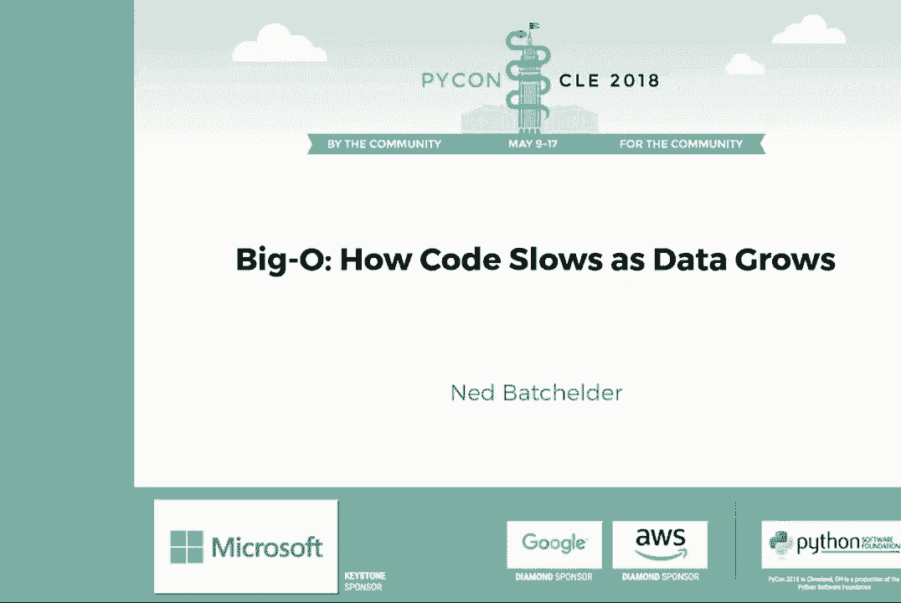
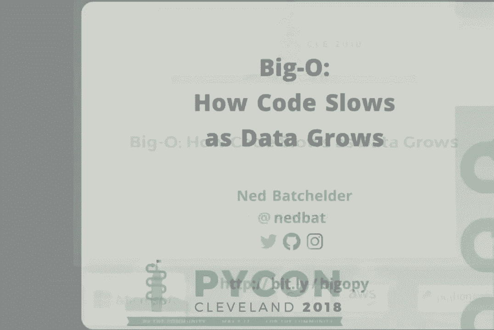
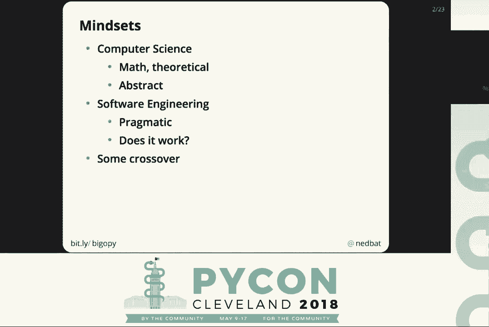
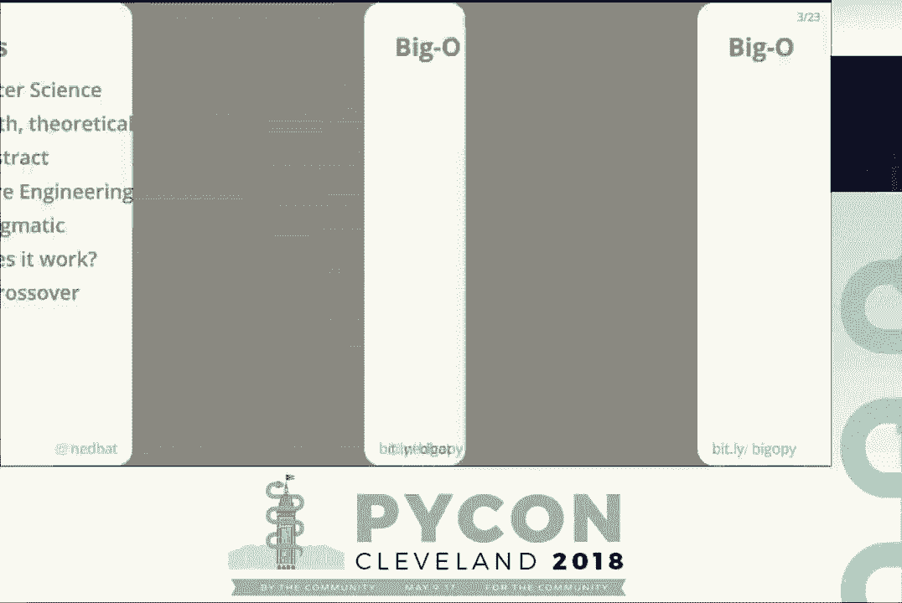
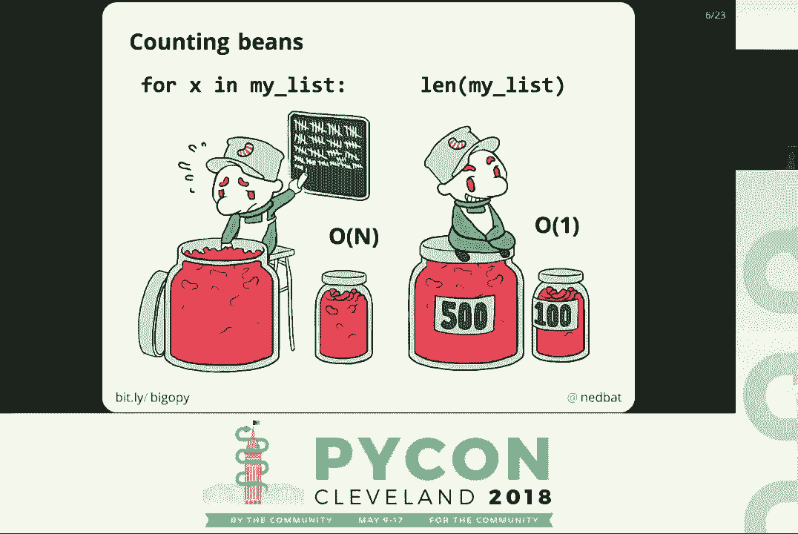
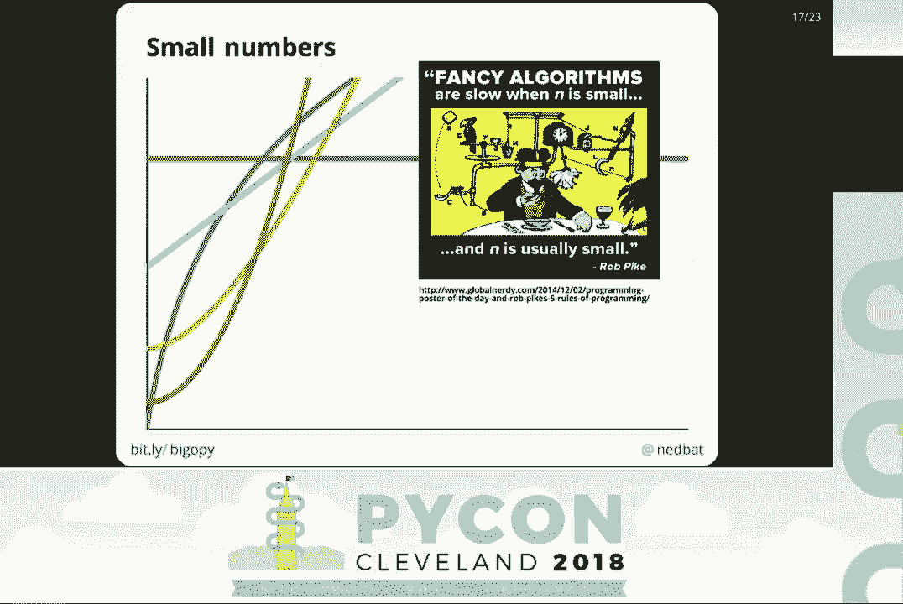
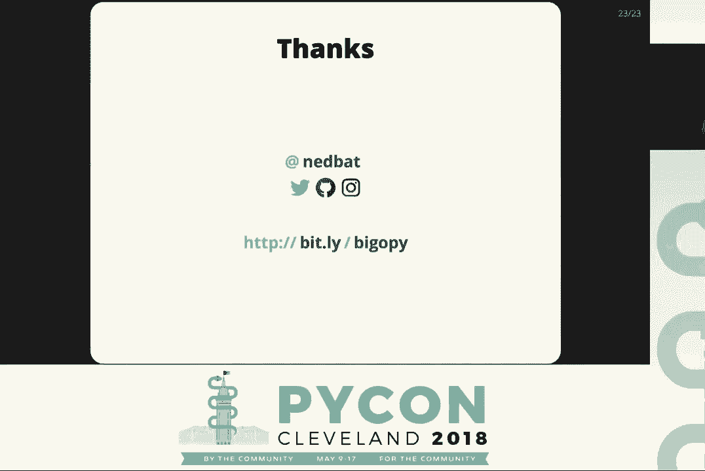

# P6：Ned Batchelder - Big-O How Code Slows as Data Grows - PyCon 2018 - 哒哒哒儿尔 - BV1Ms411H7Hn

 \>\> Good afternoon， everybody， and welcome to the final talk here of this Python。

 I'm especially honored here to have a fellow Ned here。 So it's not often。

 I hope you appreciate the honor that we have arranged to have two Neds on the stage at one， time。

 Ned Batchler here is going to talk about Big O， how code slows as data grows。

 There probably will not be time for questions afterwards， but you may be able to catch Ned。

 elsewhere。 Thanks very much， Ned Batchler。

 [ Applause ]， \>\> Hi， everyone。

 Thank you for coming to this last talk session。 I've been trying to think of this slot。

 not as the exhausted speaker， and half of the， people are already on planes slot。

 but as the grand finale of PyCon。 So thank you for joining me here。 So as Ned said。

 my name is Ned Batchler。 I'm Ned Bat on most social media。

 and there's a bit short link there at the bottom of the。

 slide that links to this talk online if you want to follow along with the slides。

 And those two short things will be at the bottom of most of the slides， too。

 So I've been writing software for a long time， and one of the things that interests me about。

 writing software is that there are two mindsets that inform the process of writing software。

 The first is computer science， which is really a branch of mathematics。

 and so it's very theoretical。 You do proofs。 You think about very abstract concepts。

 The other mindset that informs writing software is software engineering， which is very pragmatic。

 and is basically concerned only with whether you are writing software that works。

 How can we write software that works？ And there is some crossover。

 Lots of computer science underpins software engineering， but we don't think about it every， day。

 But there's a few topics that do crossover into the everyday of software engineering。

 And in particular， I'm interested in people who are working in software engineering who。

 don't have formal computer science backgrounds and maybe feel a little bit insecure about that。

 And one of the things that they seem to feel keeps them from sitting at the grown-ups table。

 is this thing called Big O。

 The Big O is really a simple thing。 And I've made a rhyme here to help you remember what it is。

 It's about how your code slows as your data grows。

 And an English major friend of mine pointed out that the rhyme is on the O sound like Big， O。

 And I didn't intend that at all， but that's cool。 So the question is。

 how does your code slow down as the data gets larger and larger？

 And this is not the same as the running time of any particular run of your code。

 We're not trying to measure the time in seconds。 We're not trying to figure out exactly how many of them you can do in one transaction。

 We're talking about the trend over time， over many runs of your code。

 How does it slow down as the data gets larger and larger and larger？

 And one very pragmatic way to think about this is， let's say you have a chunk of code。

 you give it a certain amount of data， it takes a certain amount of time。

 How much longer will it take to work on 10 times as much data？ If I give it 10 times as much data。

 how much longer does it take？ And you might think intuitively， well， it'll take 10 times as long。

 obviously。 But that turns out not to be true。 Some code will take 10 times as long。

 Some code will take twice as long。 Some code will take 100 times as long。

 and some code won't take any longer at all。 And Big O is all about characterizing that growth of the time of the code as the data grows。

 How the code slows as the data grows。 And computer science people approach this topic in a very。

 very mathematical way。 But software engineers approach it in a very， very pragmatic way。

 And I'm trying to， I'm going to explain the pragmatic approach。

 It doesn't have to be done in a mathy way， it can be done in a pragmatic way。

 So let's get some terminology out of the way。 This is called the Big O notation。

 And the way it's written is a capital O and a parenthesis， and。

 then a bunch of stuff with an N in it and a closed parenthesis。 Okay？ I told you it was simple。

 The N is meant to stand in for how much data you have。 And the O stands for order of。

 And the idea is that we're talking about the running time of your code grows on。

 the same order of some mathematical expression of N。

 The key thing here is although it looks like a function call。

 there's a name and then parenthesis with stuff inside， it's not a function call。

 it's just a notation。 And there's probably a mathy reason why it looks like a function call， but。

 it doesn't matter。 Just know that it's not a function call， it's just a way of labeling a piece of。

 code as having a certain growth pattern。 So let's take a real world example。

 Let's say we have to count the number of beans and jars， right？ We've got this guy in the left。

 he opens up to jars， he starts pulling out beans one by one。 Right。

 we can see here N is the number of beans， right？ If we give this guy a jar with ten times as many beans。

 it's going to take him ten times as long， obviously， right， and he's sweating。

 This is what's known as O of N， meaning that the time it takes to complete the task。

 grows in the same way that N grows。 It's on the order of N。 If N doubles， the time doubles。

 If N is ten times more， the time is ten times more。 And you might think， well。

 there's no other way to approach this task。 But there is， of course， you get beans。

 jars that have labels on them that tell you， how many beans are in them。 Right。

 this guy on the right has a much easier job。 You can see how much happier he is about it。

 Because it doesn't matter how large a jar you give this guy on the right。

 it's going to take the same amount of time for him to tell you how many beans are in the jar。

 This is what's known as O of one， which is kind of a weird mathematicians way of saying。

 that N isn't involved at all。 No matter what happens to N， the running time remains the same。

 O of N is slower in the long run than O of one。 And this is a silly real world example。

 But for instance， when you do 4X in my list， you have an O of N operation。

 because you have to look at every element in the list， every bean in the jar。

 When you do LEN of my list， you don't have to look at the elements of the list at all。

 Turns out Python lists are kind of like those jars on the right。

 The length of the list is written on the label on the outside of the list。

 And so no matter how long the list is， getting the lengths of the list is a constant time operation。

 By the way， these drawings were drawn by my son， who is in art school。

 One thing you might not have noticed if you look at their eyebrows， they're shaped like beans。

 [LAUGHTER]， That's art school for you。 [LAUGHTER]， [APPLAUSE]， All right。

 another real world example。

 Let's say I tell you I'm going to give you a book and I want you to find a certain word。

 in the book， like horse。 If I hand you a novel， you're going to start reading until maybe you find the word horse。

 This sounds like an O of N operation again， because if I give you a novel that's twice， as long。

 it might take you twice as long until you encounter the word horse。

 But let's say I give you a different book。 I give you an encyclopedia。

 Now you open the encyclopedias to the middle。 If the word you're looking for is earlier than that。

 then you do another divide and conquer， step until you find the word horse。

 Now if I give you an encyclopedie that's twice as large， it's not going to take you， twice as long。

 There's just one more divide and conquer step to find it。 That's what's called O log of N。

 which is a fancy mathematicians way of saying that。

 So these are both real world examples of the kinds of tasks that sort of sounds similar。

 when you first hear them， but how you organize the data and therefore what algorithm you can。

 use on the data really affects how the length of time it takes you to do the task changes。

 as the size of the data changes。 Right？ That's what we're talking about is how your code slows as your data grows。

 Let's get some other terms out of the way because I'm going to be speaking here and I might。

 throw out some words that are a little bit different than earlier。 When we say O of one。

 we might call it constant time。 I might say that the label to bean jars are a constant time algorithm because the time。

 remains the same no matter what。 O of N is often called a linear operation because if you look at it mathematically。

 there's， a linear relationship between the size of the data and the running time。

 O of N squared is a thing we haven't seen yet， but we will。

 That's the case where when you give it 10 times more data， it takes 100 times as long to run。

 and that's called quadratic because now you've got a quadratic equation involved。

 If you don't remember what a quadratic equation is， it doesn't matter。

 It's just a word that means N squared。 And some other words for big O。

 it's sometimes called complexity or time complexity or algorithmic。

 complexity or if you want to sound really fancy， you can call it asymptotic complexity。

 It's all the same thing。 One of the underlying themes of this talk is that this topic of big O notation is littered。

 with mathematical detritus that doesn't really matter to the key concept。

 And don't let that stuff throw you。 That's just chaff being thrown at you by mathematicians。

 You don't have to let it throw you off the path。 So how do you actually determine the big O of a piece of code？

 The first step is you figure out what code you're talking about。 And that sounds kind of silly。

 but in a large system， you might be looking at one function， and that might be the important thing。

 but it really might actually be important to consider。

 all the callers of the function or maybe you're looking at two large chunk of code you need。

 to think about a small piece。 If you're going to describe a piece of code。

 be very clear about what piece of code you're， talking about。 And then when you look at that code。

 you should figure out what N is。 And I don't mean like whether it's 100 or 1，000。 I mean。

 what is it measuring？ So if you have some code that's iterating over all the records in a database。

 then N is how， many records in the database。 And our bean example， it was how many beans in the jar。

 If you're doing a string search， it might be the length of the string。

 And then here's where the real work comes in。 You're going to think about that code running and you're going to figure out how many steps。

 there are in the code in a typical run。 Let me tell you what I mean by typical first。

 There's two meanings of typical。 One is what kind of data is it going to get？ In the real world。

 there's sort of real world data that kind of is what you kind of can， expect。

 And then there's worst case data， right？ A string of 40，000 spaces is not typical data。

 Typical data is， you know， last names。 It's mostly ASCII。

 It's about most to 15 characters along that kind of thing。

 So you can think about what your typical data。 And then another meaning of a typical run is that over many runs of your algorithm。

 there's， a certain number of times a loop might run or a certain length of string it might get。

 So you kind of think about the design center of your code。

 And you imagine running that code through that design center and you count the steps。

 And what I mean by steps is very vague。 And in a way， a lot of this topic is very vague。

 There are no units in anything we're talking about。 And the number of steps。

 it kind of doesn't matter what you count as a step。

 And it kind of doesn't matter that some steps might actually take longer than others because。

 really what you're thinking about is if I'm doing n equals 10， I'll have this many steps。

 Now how many for n equals 100？ And so exactly what steps there are doesn't matter as much as how does that count grow？

 And I'll show you some examples so you'll get a sense of it。

 So you count the steps in a typical run and since we put in n at the top and not 10 exactly。

 the number of steps is going to be an expression in n。 You might end up with， well。

 it's 3n plus 47 steps。 Something like that。 And then what you do is you keep only the most significant part of that expression。

 So you keep only the highest coefficient piece and then you throw away the coefficients。

 So if you had 47 n squared plus 53 n plus 101， that's n squared。

 You throw away all the lower order components and the coefficients。

 And the reason is that as n gets larger and larger and larger， the lower order components。

 matter less and less。 3n plus 1， the 1 is really important when n is 1， but when n is a billion。

 who cares about， the 1？ So we're trying to get to that long term trend as the diddy gets very。

 very large。 And if it's 3n， that doubles when n doubles， just the way n doubles when n doubles。

 So the 3 is irrelevant too。 So you get rid of the lower order components and you get rid of the coefficients。

 And what's left is your big O notation。 Now let's look at some examples。 True fact。

 I wrote this code in November and it didn't occur to me until I was lying in。

 bed this morning that this code is about moms and it's Mother's Day。

 So here's an example of some code。 What we're going to do is we're going to have a data structure called Moms。

 which is a list， of tuples。 And the tuples are people and their mothers。

 And then we're going to write a function called find mom。

 And find mom is going to take that list of moms in the name of a child and it's going。

 to find the child's mom。 Now if you think about searching through this list。

 in some runs we'll find it in the first， entry。 And some runs we'll find it in the last entry。

 So on average in a typical case we'll find it about n over two times。

 We're going to look through half the list。 So if we come down to this line。

 this loop is going to run n over two times。 And I'm going to say that there are three steps in this loop。

 We have to get the tuple out of the list and then we have to assign the child to child。

 name and we have to assign the mom to mom name。 So there's three steps。

 which means that this line is going to contribute three times， n over two steps to our count。

 In this comparison we're going to do n over two times and there's only one step。

 So that gives us another n over two。 And then this line is only going to happen once because it's the end of the function。

 So that's going to give us one more step。 And so our total is going to be 3n over 2 plus n over 2 plus 1。

 which simplifies down， to 2n plus 1。 I said that we get rid of the lower order components。

 which is the 1， we get rid of the， coefficient， which is 2。 This is an o of n function。

 So we've just determined that the asymptotic complexity of find mom is o of n。

 And the way people say that in the real world in a cubicle is find mom is o of n or find。

 mom is linear。 Find mom is o of n。 And so you saw when we were going through the steps。

 we didn't really care which steps， were expensive。

 which we only wanted to know is the relationship between the n and the number。

 of steps and when n changes the number of steps is going to change。

 And that's what we're looking for。 And notice we have no idea whether this is fast or slow。

 We don't know whether this function is going to take a minute or a millisecond。

 All we know is that if we give it 10 times more data， it's probably going to take 10， times as long。

 Let's look at another example。 Also about moms。 The same data structure。

 the same mom's data structure。 But now what we're going to do is we're going to write a function which tells us in。

 that data structure and how many grandmothers are there。

 That is how many people are mentioned both as a mom and as a child in our list。

 So now we're going to go all the way through to the end of the list。

 And I mentioned that n over two before。 But remember， we're throwing away coefficients。

 so in a way the half never mattered。 And as you work through this more。

 you'll sort of get a sense of what you can not collect。

 in the first place because you're going to throw it away anyway。 So for instance。

 this line is going to run n times。 And notice I didn't write three times n here because like I said。

 we're throwing away coefficients。 This is an o of n line。 We're going to run this line n times。

 Now this line is going to run n times also， but it's calling a function， find mom， which。

 we just determined was an o of n operation in and of itself。 When you call it once it's o of n。

 and we're going to call it n times， that's going to give， us n squared。

 And we can continue on and say this is n， but remember， we're going to throw away the lower。

 order components。 We already found an n squared。 It's kind of uninteresting to keep finding the n's。

 But we're finding a bunch of n's。 We're going to end up with n squared plus some number of n plus one。

 which is o of n squared。 So find how many grandmothers is a quadratic function？ It's o of n squared。

 Now the ideal of course is o of one， right？ Constant time。

 You can work on any amount of data and not have it take any longer。 It seems kind of impossible。

 Like how could that be？ But remember， we saw a line of my list is o of one。

 because no matter how long the list， is， the length is written on the outside。

 we can just pick it up。 That's kind of boring。 Really interesting is looking up a key in a dictionary is o of one。

 No matter how many keys are in a dictionary， it takes about at the same amount of time to。

 look up a key as in a one element dictionary and in a million element dictionary， which is。

 why dictionaries are heavily optimized and engineered and underpin every name look up。

 in Python because they're fast。 And we'll get back to why it is， but very quickly。

 it's because there's a thing called， a hash function which turns a key into a number and in typical data。

 the numbers are all different。 And so you can very quickly use that number to find the place in the dictionary where the。

 value is。 No discussion of big O notation would be complete without showing you the graph。

 Along the bottom， we have that flat green line labeled one of the x-axis is data。

 So data grows to the right and then the time grows going up。

 So the big flat line at the bottom is o of one。 That looks great。

 Log n was looking through the encyclopedia。 The linear line going diagonally is o of n。

 And the big red one， n squared， just zoos， literally off the chart。

 So the n squared is one of those bad things you try to avoid because it really grows really。

 fast when things get big。 Now when we looked at our code。

 we have to understand what functions we're calling and， how。

 what kind of complexities they're adding into our total function。

 This is a chart of the typical operational complexities of lists， dicks， and sets in， Python。

 When people say dictionaries are o of one， that sentence doesn't make any sense。

 Nouns like dictionary can't have an algorithmic complexity。

 Operations have an algorithmic complexity。 So what you're supposed to say is that looking up a key in a dictionary is o of one。

 Now you'll notice that a lot of these are kind of the same。 Appending to a list is o of one。

 adding a key in a dictionary is o of one， adding a value， in a set is o of one。

 A big difference is looking up a value in a list is o of n。

 So if you're going to search for a value in a list， it's going to have to look at every。

 element in the list。 It's going to be that left bean counting guide with the sweat coming off of his forehead。

 But looking up a key in a dictionary or a value in a set is o of one， which is why they're。

 really valued。 So pro tip right off the bat。 If you've got a program that's going too slow。

 look to see if you're looking up a value， in a list and replace it with a look up in a set。

 But there are trade-offs。 So when I say replace the list look up with a set look up。

 you've got to keep your eye， on the big picture。 And this is where understanding what piece of code you care about matters。

 So I said replace a list look up with a set look up。

 Let's say we have some code like this where we're going to make a list。

 We make a list and then we try to find the thing in the list。 And that line is o of n。

 We just saw that on the table of Python complexities。 So you might think， well， I know what I'll do。

 I'll make a set instead and then I can look it up in a set。 That's good。 If you can do that。

 that's good。 Don't make the list in the first place。 You make a set。

 That is you go ahead and you make a list anyway and then you convert it to a set and。

 then you do the look up in a set。 So now that last line is great。 It's o of 1。

 but you've added a line before it turning the list into a set which itself， is o of n。

 Like literally you've actually slowed down your program by a tiny amount。

 You still have the o of n operation of converting the list into a set。

 So it's very easy once you get into this algorithmic complexity stuff to get sort of。

 focused on the little things and lose sight of the big picture。 This would be a bad trade-off。

 A good trade-off would be even if you're making a list if you can convert into a set once and。

 then do many lookups。 So if you're going to do many lookups in your list。

 then it makes sense to turn it into a， set once。 And then you have o of n and then many o of 1 and your program will go faster。

 So you always have to keep in mind what the real usage is of your code and where the time。

 is being spent about where you're going to sort of work on reducing the algorithmic complexity。

 and whether it's worth it。 Now this is don't read this code。 It's a code doesn't matter。

 This is a real example of code that got me started down this path。

 This was from a project last summer。 The code on the left is shorter and has fewer data structures and fewer functions and in。

 fact fewer loops， but it's slower than the code on the right。

 And the reason is that if we label things as o of n and o of 1， the code on the left has。

 an o of n operation there because it's looking up a value in a list。

 The code on the right only has o of 1 operations。 So the code on the right。

 even though it's longer and has more functions and more data， structures and more loops。

 is o of 1 where the one on the right is o of n。 And in fact。

 I was using it to draw drawings like this。 These functions work over an entire list of points and if you go up a level in the code。

 you'll see actually that that function is called once for each point in the list of points。

 So the o of n on our slow side was turning into o of n squared。

 And so the slow code was taking 20 seconds。 The fast code was taking a half a second。 On only 2。

000 points， right？ I've been giving examples like oh when n gets to a billion， n got to 2。

000 here and made， a huge difference in my running time。 Because n squared is really worse than n。

 At the end of 2，000， n squared is 4 million operations and o of n is 2，000 operations。

 And that's a big difference。 So it really does pay off sometimes to reduce the algorithm that complexity of your code。

 to reduce the running time。 Now we've been talking about o of 1 and o of n and o of n squared。

 There's more possibilities。 So there's more possibilities of kinds of complexities you might encounter in the real。

 world。 Of course there's o of n cubed and n fourth， right？

 If we called how many grandmothers once for every child for some reason， we'd have an。

 n cubed operation。 If I use that point algorithm once again for every point。

 I'd have gone back up on an n， level。 I'd add another coefficient to my n。

 You can also have worse things like o of 2 to the n。

 If you have n Boolean choices and you try all the combinations of them， you've got 2 to， the n。

 If you have n things and you try to try all permutations of those n things， you'll have。

 n factorial。 So as bad as n squared is， there's sort of no upper limit to how horrible your code can。

 get。 So think about how your loops are working， how much data you're working on， and keep an。

 eye on where those complexities are getting really， really big。

 The other kinds of possibilities is there could be more dimensions。

 So we've been talking about doing algorithmic analysis where we have one variable n。

 But you could have others， right？ If I'm telling you that I've got a string search algorithm over some number of strings。

 I might also have to consider the length of those strings。 Typically， they're fairly short。

 but if you're doing bio-python or something， you have DNA。

 samples that are billions of characters long， and then suddenly the lengths of the strings。

 matter too。 For example， when I was doing that point drawing code。

 there was a line intersection algorithm， that I found whose stated complexity was n plus k times log of n。

 where n is the number， of lines and k is the number of intersections among those lines。

 And I don't know how to figure that out。 That's like a mathy thing that you can just read about。

 I didn't have to figure out what that complexity was。 Now we saw this graph before。

 Algorithmic complexity really matters as numbers get large。

 But another place where you have to be careful not to over-apply the idea is when numbers。

 are small。 So let's zoom into that lower left-hand corner of the graph。 If we zoom in there。

 suddenly the lines don't look so clear-cut。 The green line is actually above the other lines for most of them。

 And the n squared line， that red line， is actually below everything for a lot of the， time。

 And the reason is that when numbers are small， all those coefficients and lower order components。

 that we threw away， those mattered。 Right？ 3n plus 1， when n is 1， that 1 at the end really matters。

 And also， we haven't taken into account what the actual time of the steps is。

 You might have an n squared operation where you are doing n squared times a millisecond。

 And you might be comparing that with a constant time algorithm that always takes a minute。 Well。

 n has to get pretty large before that constant time algorithm is worth it。 When n is a billion。

 it's worth it。 But when n is 10， you should stick with the n squared algorithm。

 So as Rob Pike once said， fancy algorithms are small and n is small and n is usually， small。

 So don't go overboard with trying to fancy up your algorithmic complexity。

 It doesn't matter when n is small and usually your n is small。

 All right。 Some advanced topics。 There's a thing called amortization。

 which is really a long term averaging over operation。

 So when I say that appending to a list is o of 1， that doesn't mean that every single。

 time you append to the list， it takes a small amount of time。 In fact。

 it usually takes a small amount of time。 But every once in a while。

 the whole list has to be copied and moved someplace else。

 which gets longer and longer as the list gets longer。

 But it also gets less and less frequent as the list gets longer so that over the long run。

 the average is still o of 1。 So amortization is a fancy word meaning averaging and it means that individual operations can。

 take different amount of times。 Algorithmic analysis is really about the long term trends over many。

 many runs。 And we haven't talked about the worst case。 So earlier we talked about the typical case。

 And some people think big o implies typical case or big o implies worst case。 No。

 You have to say whether you're talking about the complexity of the typical case or the worst， case。

 Here's an example where I make a set of 50，000 numbers which differ by 47。

 I'm kind of walking up the numbers by 47。 Adding that number into the set is an o of 1 operation。

 So the whole building， the whole set is o of n and it took about 10 milliseconds。

 Here I'm building another set of integers exactly the same size， 50，000 numbers。

 But I happen to choose a step that I happen to know was going to make all the hashes exactly。

 the same。 So all the numbers got exactly the same hash which turns into an o of n operation， which。

 means making this set took 34 seconds， 3300 times longer。

 Dicks also have this problem and people were using it to DDoS web servers which is why。

 Python added hash randomization。 And it's a fascinating topic but it's an example where although Dicks are o of 1 in the typical。

 case， occasionally you have to worry about the worst case。 And there's more math。

 So if you dig into the math， basically mathematicians have taken every letter that either looks。

 like an o or sounds like an o and given it a meaning。 And you don't need it。

 You don't need it at all。 And there might be mathematicians in the audience right now who are going to say。

 you， know， you're not really even talking about big o。 Yeah， shut up。 I don't care。 We all。

 this is what we mean by big o。 And those experts by the way。

 so I wrote a blog post when I was first starting to think， about this with the same title。

 big o how code slows as data grows。 And a lot of people liked it but one guy wasn't so pleased。

 He thought that not only had I gotten something wrong but the thing I'd gotten wrong was so。

 important that the entire blog post was something that I should be ashamed of。

 And I actually looked into it。 I gave him the benefit of the doubt。

 I learned a little bit more about algorithmic analysis。 I concluded he was actually wrong。

 He remains convinced he is right。 The good news is I got another blog post out of it。 So。

 if on your journey to explore these things you find people like this， just walk around。

 them and keep going。 It doesn't matter。 I mean if you're into the math， go and do the math。

 But if you're just trying to do software engineering， it doesn't matter。 All right。

 so in conclusion， big o is useful。 It can help you understand how your code might perform when the data gets very large。

 It doesn't have to be complicated。 It doesn't have to be mathy。 And you can do the thing。 Thanks。

 [Applause]， [Applause]， [Applause]， [Applause]， (applause)， [Applause]。

