# P9：Sunday Morning Lightning Talks + Keynote - PyCon 2018 - 哒哒哒儿尔 - BV1Ms411H7Hn

 Hello。 Hey。 Oh， hey。 Awesome。 Good morning。 So everyone， thank you， Harry。 So everyone。 has hung over as I am。 The fact that you're here early makes me think that you're not。

 doing a lot better than I feel。 Thank you for being here。 So this is the last round of。 lightning talks。 I know。 It's unfortunate。 But maybe we can have another lightning talk。

 Boff kind of thing。 I don't know。 Maybe that's a thing。 So we'll kick it off with Tim Abbott。
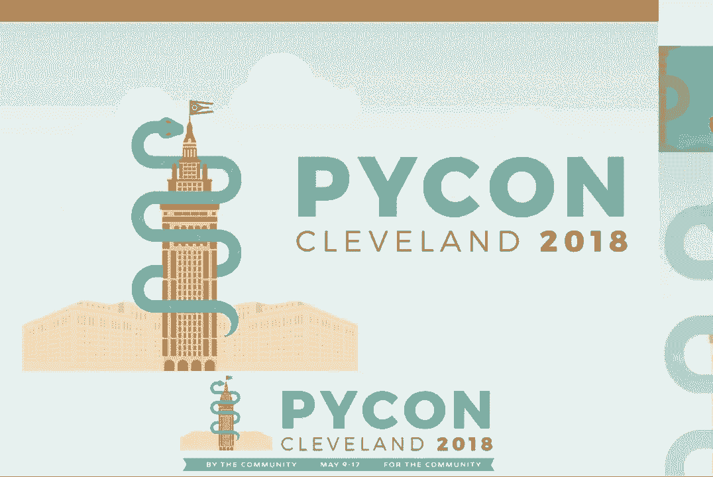

 on debugging with coverage。 Hey， so I'm Tim Abbott。 I work on Zulip， which is an open source。 team chat， similar to Slack and things like that。 And we're very proud that we are written。

 in statically typed Python 3。 You want to learn more about that？ We have a talk about that。 later today。 But I'm here to talk to you right now about debugging with coverage， which is。

 my favorite new debugging technique。 So many of you are probably familiar with the coverage。 module on Python。 It tracks which lines of code are executed。 You know， you start it， and end it。

 so you can sort of pick the window。 The main thing people use this for is for。 measuring the quality of their test suite。 You run it for your entire test suite。 And then。

 you can see， you know， sort of what fraction of your lines of code were actually run。 You， know。 there's some debate as to whether this is the best metric ever。 But it's certainly。

 useful metric in that if you have no coverage on something， well， definitely it wasn't run。 during your test suite。 And so it is completely untested。 The main downside of it is that it。

 slows execution a little bit。 And just to give you sort of a feel for how it works， you know。 it will write out a nice sort of machine readable for it。 But it also can produce these nice。

 HTML reports。 You can see that the Zulip project is 96% covered。 And if you click on one of。 these modules， you get sort of a more detailed report on the file。 So on the left you have。

 the lines of code。 The stuff highlighted in red are the lines that are not covered。 And。 the sort of green stuff is what was run。 And the blank lines are blank。 And so， you know。

 this is what it looks like if you've got a function that just never got called。 You know。 the deaf line is covered because that was run at import time。 But none of the rest of， stuff was。

 Cool。 So， you know， a common debugging situation that I'm sure all of you have， experienced is that。 you know， you've got some code and it's producing sort of a confusing， result。

 And the thing is reproducible， you know， maybe it's a unit test， maybe it's a script。 you're running， maybe it's like an API endpoint。 And the traditional solution to this， you know。

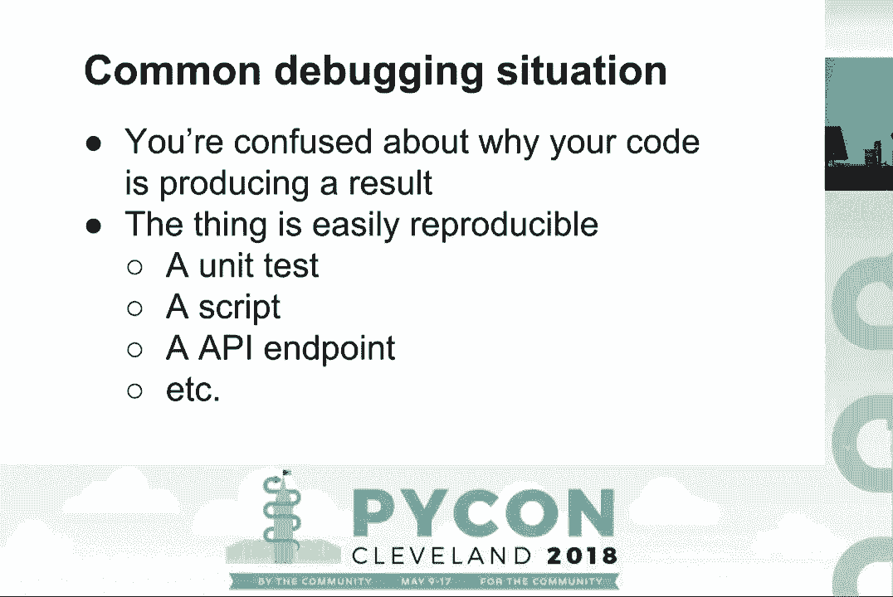

 here's -- sorry， here's an example of， you know， that type of code where this would be。 likely to come up。 You know， you've got three different reasons why something might return。

 And the same value and that value is wrong。 You actually wanted the last case， for example。
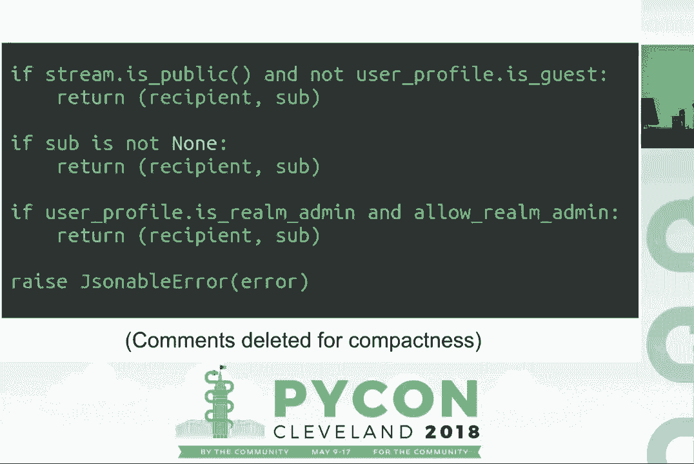

 And the traditional solution is， you know， print debugging。 You know， you put a print。 statement in the first one and then you like try to copy that to the second one。 You realize。

 it's no good if it prints the exact same thing。 So you put out two or something。 And， you know。 then you'll know which case it is when you run your thing。 And you sort of iteratively。

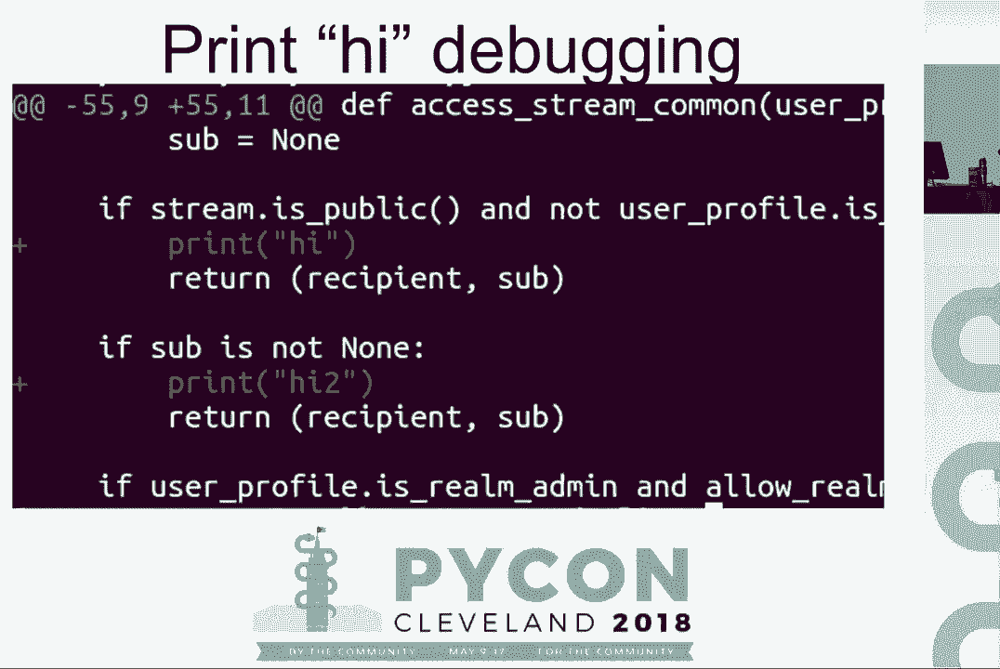

 do that until you figure out what's going on。 So my claim is that this is the wrong way。
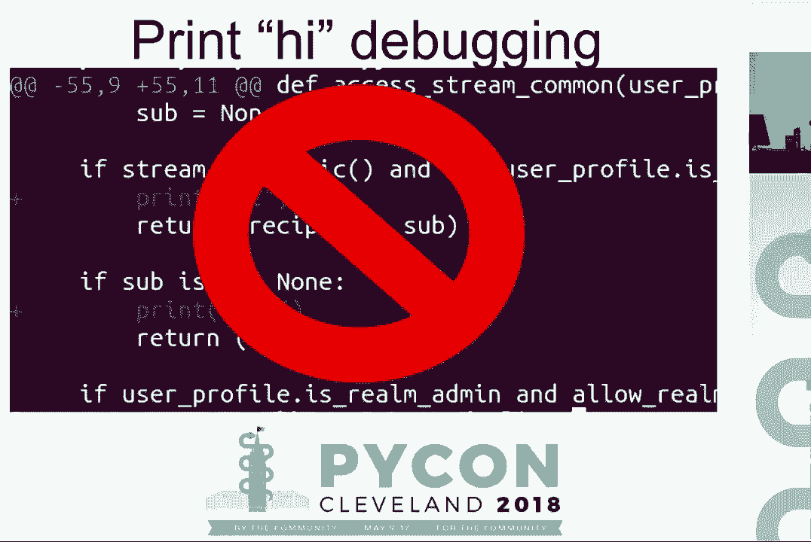

 to do it。 And you should instead do something different。 You run your sort of test， reproduce。 or whatever it is with coverage。 It'll just take a few seconds。 And then you get a fancy。

 HTML report of exactly what code paths were followed when doing whatever you're trying， to debug。 So here's， you know， what that would look like with this example。 So you can see， you know。

 the first if statement was executed， you know， the result was false。 So it didn't， return there。 The second if statement was executed and then it returned there。 So， you know。

 exactly what happened here。 So in this simple case， you know， it may only help you a little， bit。 But this is super useful if you got a long function or there's a lot of cases。 You， know， we have。

 you know， the keyboard， you know， shortcut， you know， system， and zoom， up。 You know。 literally there's， you know， like 25 different places。 It can exit with。

 clear or false and a little Boolean thing。 And you just want to know which one。 You just。 get it immediately。 And the place where this is really safe via a ton of time is when， you， know。

 sort of my assumptions are wrong。 So you were confused as to what function was actually。 the source of your problem。 The answer is not really above。 You look at your function。 It。

 wasn't even executed。 It's actually like a Mac color or something like that。 And it's。 also pretty good just for sort of browsing what's happening。 So you can sort of start， with。

 you know， the entry point that you're looking at and you can see exactly what could。 path a month through there。 Look into， you know， what function is inside that and so on。

 So I find that this has saved me a lot of time over the last year or so since I came up。 with this technique。 So I hope it will save you time as well。 One little note， this doesn't。

 have to be unit test。 You know， you can write a little at coverage decorator to surround。 a function or something for your API endpoint and sort of iteratively sort of， you know。

 test it with just about any block of code that you have that you expect to be run sort of。 once during whatever your reproducible process is。 The other cool thing is that a lot of editors。

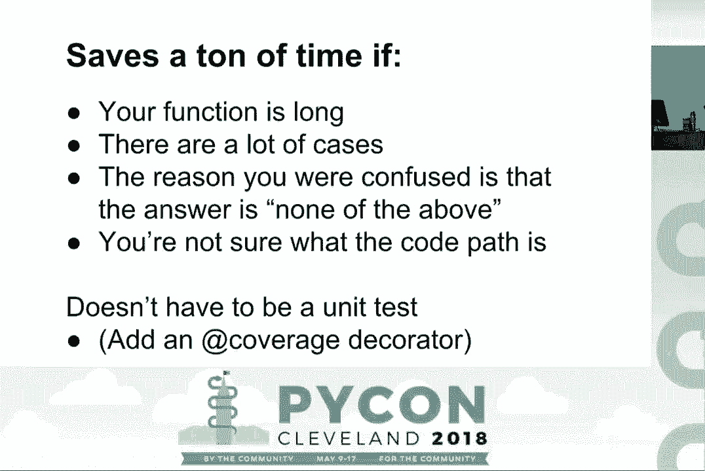

 have coverage integrations to show you， you know， sort of your full coverage data for。 your test suite but you can actually use those iterations， sorry， integrations to see the， data。

 you know， sort of directly in your editor rather than having to go to this sort of HTML。 report off to the side。 So that's a pretty cool technique。 And I've got a little bit of。

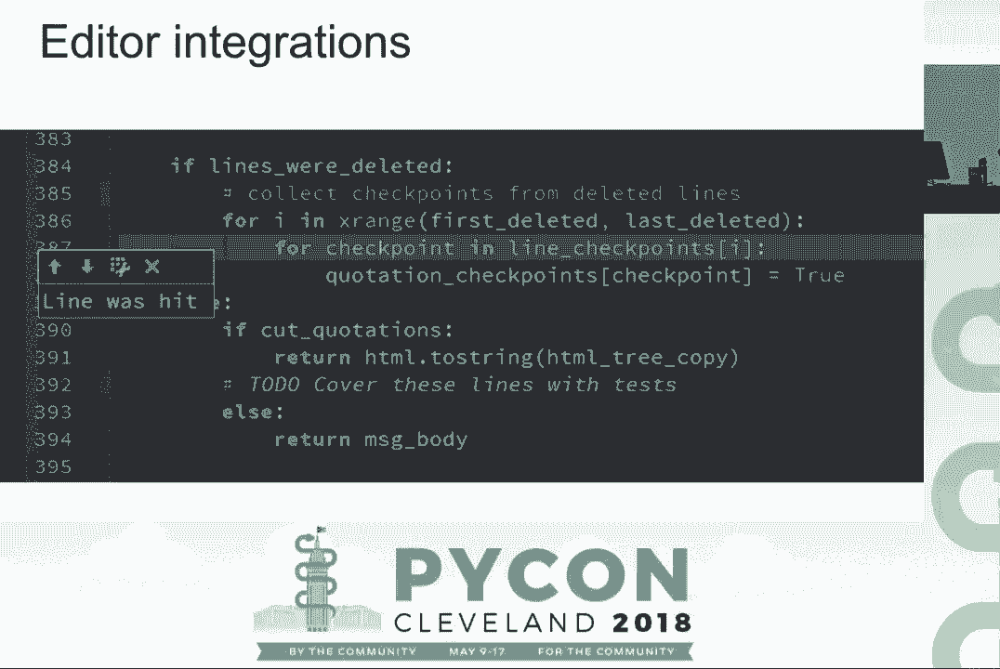

 time left。 I'll tell you a little bit about Zulip。 So， you know， it's a fully open source。 team chat thing， similar to Slack。 Sort of what I have time for is that people find。

 that sort of conversations in Zulip and the equivalent of channels work dramatically better。 than Slack。 We've had tons of people coming up to us at PyCon this year to tell us that。

 like they never want to use Slack again。 The sort of basic way this works is we have within。 your couple of now channel， there's sort of unread counts for the different topics that's。

 sort of the same ideas to how email does threading but in a chat context。 So that's what we have。 I hope that you try this new debugging technique and that it saves you a bunch of time。 Thanks。

 so much。 [Applause]， Thank you。 I am completely guilty of using print statements for debugging。 All right。 Next up， we have Jonathan Slenders on prompt toolkit 2。0。 Okay。 Good morning， everyone。

 Thanks for coming so early。 I have a shock presentation about， prompt toolkit 2。0。 which is a library for building even more powerful command line applications。

 And as you can see in the screen shots， maybe you already know it or you remember it from， IPython。 So prompt toolkit is the library that is used for taking care of the user interface。

 of IPython if you run it in a terminal。 So prompt toolkit actually makes it possible to。 have this kind of code completion while you're typing， like you can see the drop-down menus。

 and the syntax highlighting。 So this is me。 I'm working for Cisco。 So prompt toolkit。
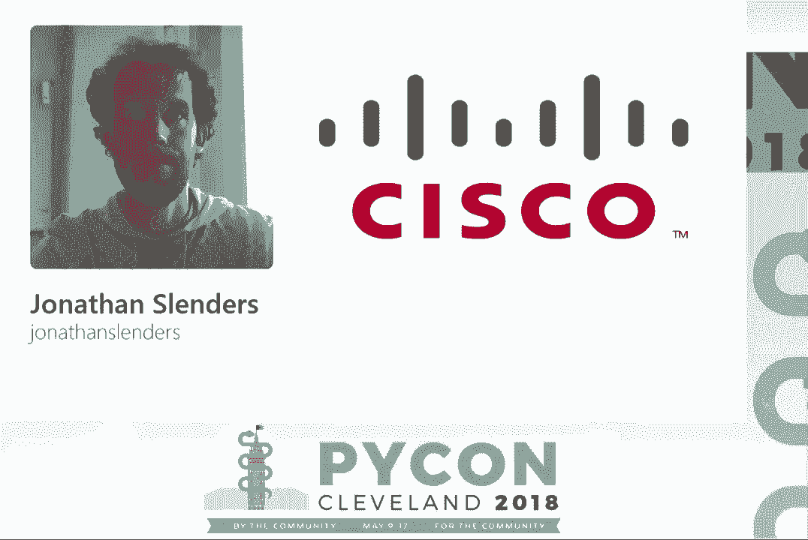

 Another Python， as I just said， is one of the libraries that prompt toolkit is used。 But。 actually there's the whole ecosystem already of applications that use prompt toolkit for， the UI。

 For instance， there is PGCI， which is a Postgres client。 There's CONCH， which， is the best repo。 There's HTTP prompt， which is an HTTP client and swan。 So right now we。

 have a nice community of about 25 or 35 applications using prompt toolkit to provide the best user。
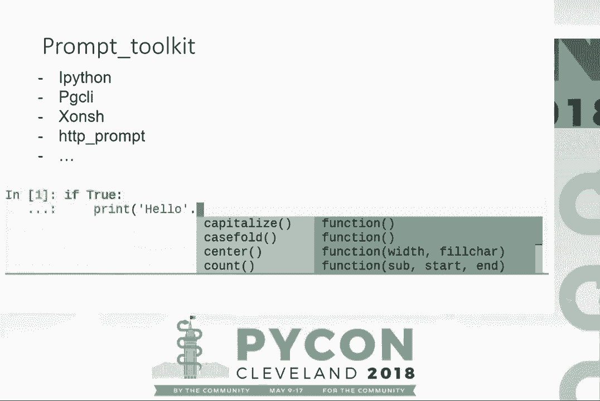

 experience possible in a terminal。 So if you want to make an application like that of your， own。 let's say you want to create an application that has the use of for some HTML as input and。

 you want to have syntax highlighting and code completion in your terminal， it's only a couple。 of lines of code as you can see。 So you define a competitor， you define the lecture that you。

 want and you pass everything to the prompt function and there you go。 So it's pretty straightforward。 So prompt toolkit not just tries to make the end application as user friendly as possible。

 but also the development of the application。 So we put a lot of thoughts in our APIs。
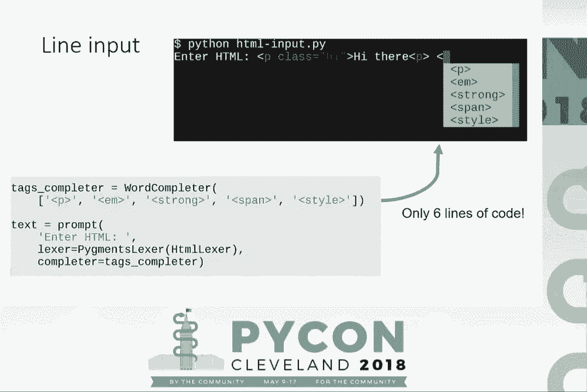

 But there's a second use case for prompt toolkit and you can use it for full screen applications。 Like， for instance， if you would want to build your own text editor or if you want to build。

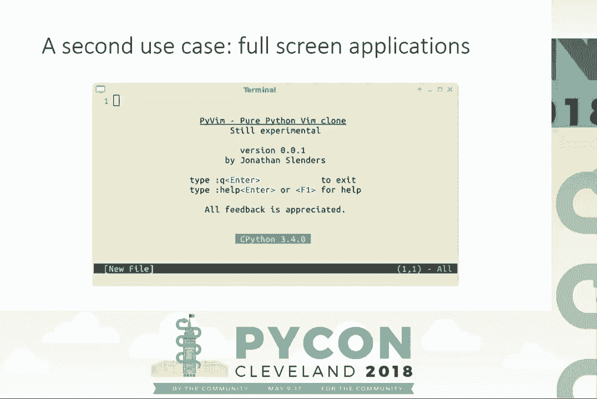

 something like this。 So all of these things are now possible with prompt toolkit 2。0。 2。0 still needs to be released， but I will do that pretty soon I hope in the next couple， of weeks。

 So prompt toolkit 2。0 is pretty big refactoring which contains a lot of improvements。
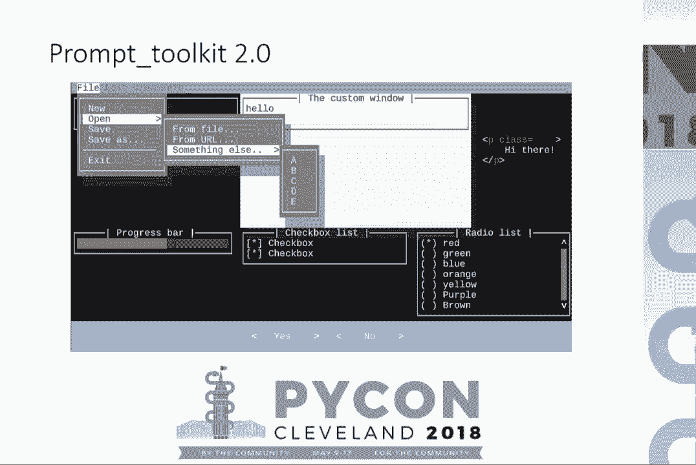

 but especially if you want to build full screen applications like this。 You can also do things。 like this。 For instance， we have here a dialogue widget。 So we have the concept widget similar。

 to like if you would use or create a graphical user interface。 And all functionality that we。 had for simple line inputs like syntax highlighting and code completion and all VIN eMix key bindings。

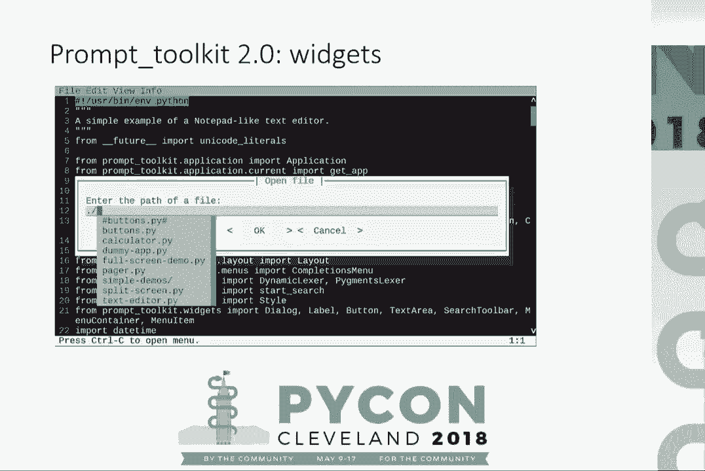

 they are also available for full screen applications。 We also have a couple of high level API calls。 like for instance。 If you want to as the user of Fox on confirmation you want to do a yes。

 no dialogue for instance。 It's only one function you have to import and call and you get a nice。 dialogue like this in pure Python code in your application。 And as you can see everything is。

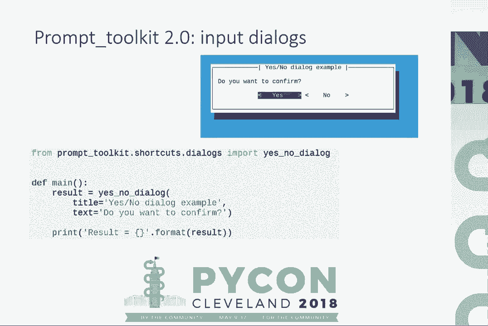

 customizable。 So if you want to have different colors or you want to put something else in the。 dialogue all of that is possible。 We even have a terminal widget。 So if you want a terminal。

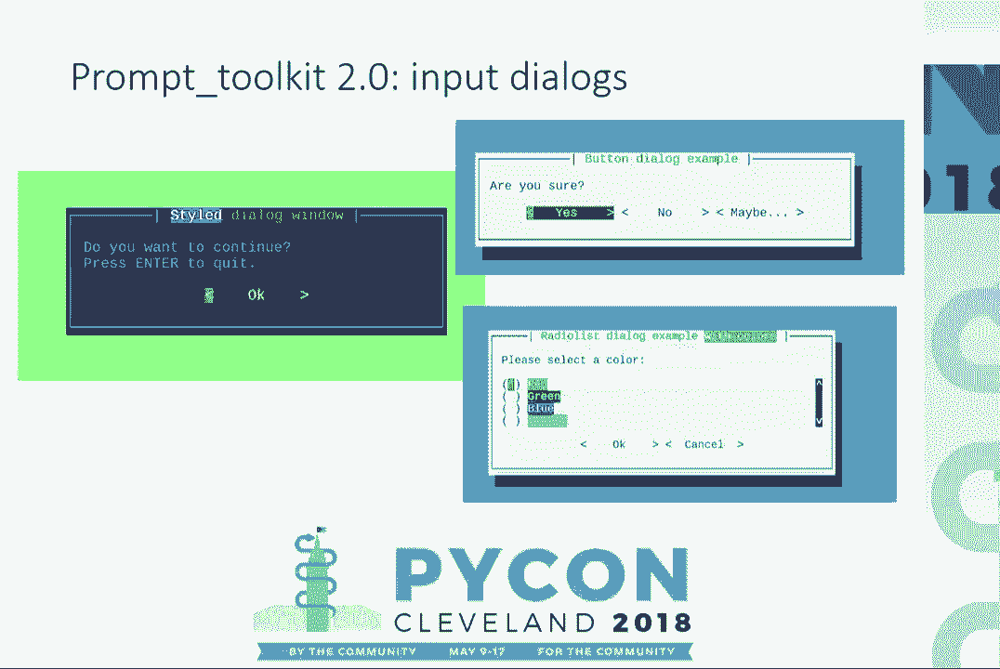

 emulator as a widget like you see here embedded in a dialogue window in your application that is。 possible。 The terminal emulator itself will not become part of Chrome Toolkit。 It is an external。

 library I'm working on but it's something you can use。 You can embed in any Chrome Toolkit application。

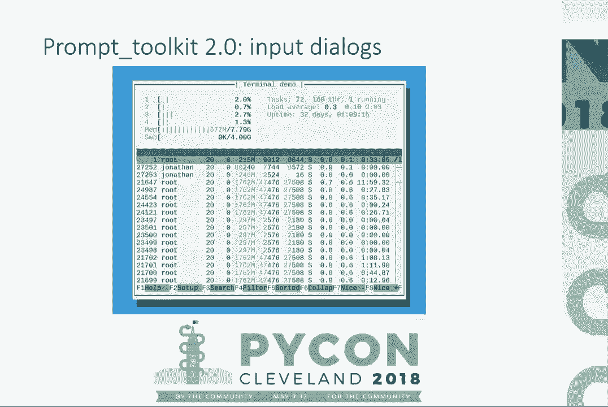

 Windows support is also improved a lot because since Windows 10 we have support for VT100 escape。 sequence in our terminal and that makes it possible to do the rendering much more much easier。

 much faster and it gives a much better experience especially for full screen applications。 So what。 you see here are three applications running in a normal Windows console。 There are many other。

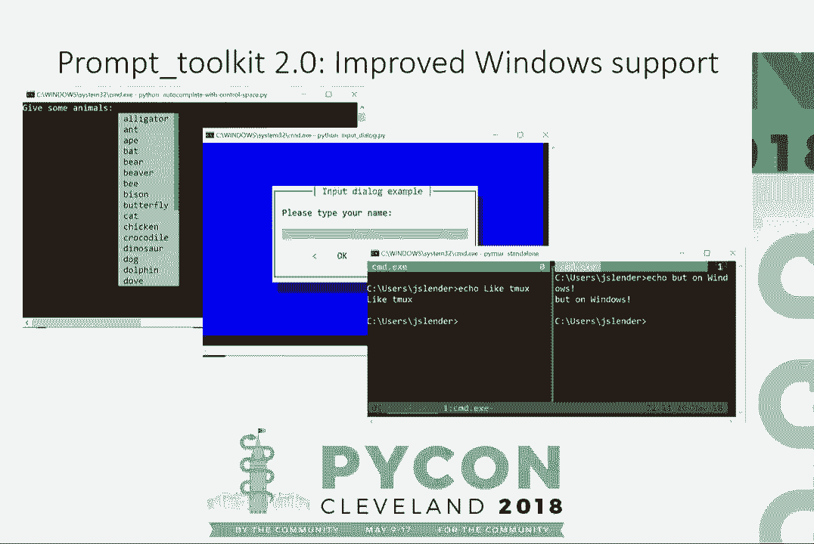

 improvements like for instance big man's became optional。 It is much easier to define custom key。 bindings。 Everything can be used in a synchronous or asynchronous way so you could run it on top of。

 the same thing。 If you want to， it's much easier to define text formatting。 So as you have seen in the， dialogue windows you could embed some kind of formatted text。

 Format text is a pretty central， concept in Chrome Toolkit and you can use it everywhere in a very flexible way。 So if you're， interested in that check out the GitHub repository， the 2。

0 release will follow pretty soon。 Also， check out dbcli which is an open source community of database clients on top of prime toolkit。 So if you have any feedback or questions I would love to hear it。 Thank you。

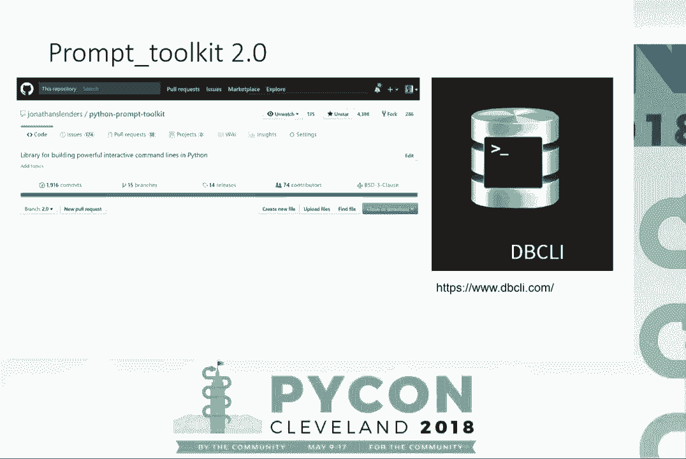

 Thank you so much。 All right， next step we have Mark Shields on chaps。

 Hello， Mark Shields。 The talk is chaps， the relative der pants wrapper with a caveat that is not really。
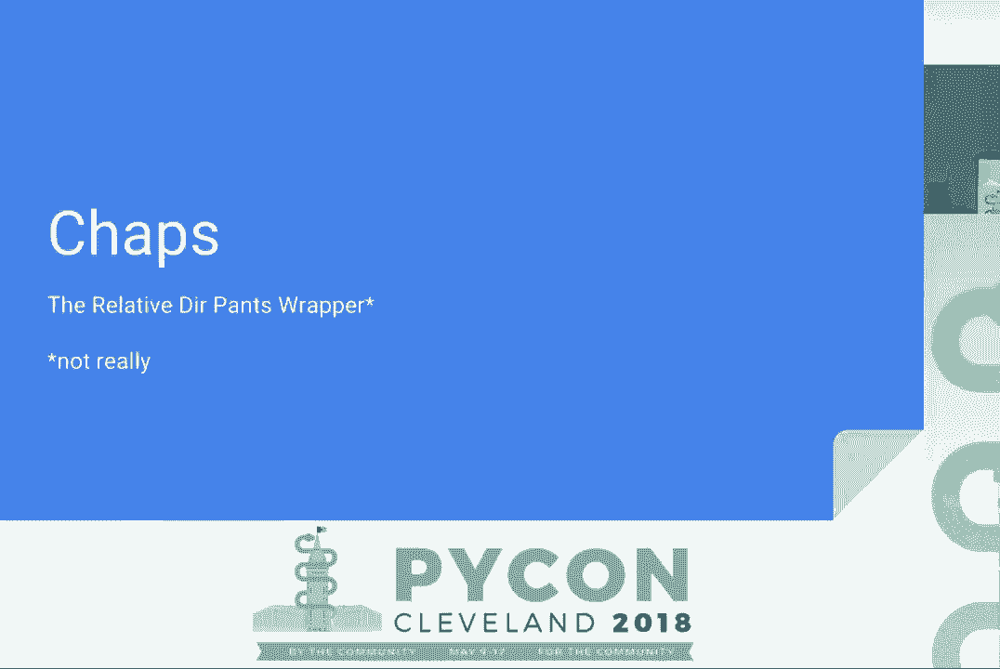

 what it is。 I'm an SRE on the Chrome structure services team at Twitter。 Candles at leap shade。 I'm not going to read the rest of that。 You can read it。 Pants。 So what is pants？

 It's a build and package system for Python。 It has concepts called goals， such as run， binary。 test and ripple。 You can use these goals with source pants， path。

 a target name to define and build files。 It allows you to share dependencies across the repo。 and it was developed using open source at Twitter。 Although I was not involved at all with it。

 So what problem will we try to solve with chaps？ In a monorepo you have multiple levels of。 packaging spacing。 If you want to use a target you have to type up the full path and the target。

 What if you test in a different directory？ It's a different path。 I don't want to type this out。 every time which is why I wrote this。 We have C-I jobs internally that run it to make you time。

 that help with this problem but do nothing to help with early development process or ad hoc。 operations。 So as some assumptions you have a set directory you're working in and levels deep。

 in the source tree。 You're really that directory。 You want to be able to easily do stuff with that。 The pants targets in that directory and you have pants as a binary sitting at the top of repo。

 and you use Git。 So if you use subversion well you're out of luck。 What is chaps？

 So it's a Python binary in PEX format。 It's built with pants。 You don't have to call。 pants from the top level or repo at all。 So you actually have to run pants。 You have to see it to。

 the top of directory and then call it with a relative path if it's installed at the top of the path。 Since you're working in the directory you don't need to use full path names。 You just use the bear。

 targets and it works。 The idea is to keep you working on your code and not working around built。 system issues。 So this is the way you would normally do it with pants。 If you're in your working。

 directory you can see the top of the repo and then run the pants command。 Or you can just do it this， way。 If you're already in the directory you can just run it this way and that will drop you into。

 the same thing as above。 You also have a big fan of same defaults so I've got it set to turn on the。 ipython repo for free。 If you want to list the available build targets for pants this is the way。

 you would do it。 Or you can just do， if you're in the directory you can just do chaps list and it'll。 give you the targets。 Related you can do chaps binary and then the target and it does exactly what。

 you think。 You don't have to use the full path name anymore。 You can actually even use it to boot。 strap itself。 If you want to recursively test all targets you can do chaps tests。 Two colons that's。

 just a pants thing。 Nothing unique to chaps。 I did a special flag that infers your test path from。 your current working directory and recursively test all the pro targets。 So if you're in your。

 source directory you can just run this command。 Muscle memory there。 Nothing to do。 You can actually， use chaps to run itself and then run lists。

 So if you feel like playing around with this I encourage。 you to see how many times you can pass it to itself to run itself。 Caveat on this it doesn't。

 actually do what you think it does。 So under the hood it's python27。 Thank you。 Thank you。 I use Sarge third party library。 I also use twitter common library。 It's open source。 It uses the。

 Git system binary。 It uses the pants top level and then it just constructs the relative path。 difference between the top level and your current work directory。 Limitations。 It does not support。

 using targets outside of your immediate path。 So that's a thing。 Goals are not inherited from。 pants。 They're just hard coded in chaps and it works best in conjunction with some shell helper。

 functions。 I'm going to show you those shell helper functions now in use。 That's sort of a。 muscle memory kind of thing。 Work source， work test。 You can run setup to setup the path for those。

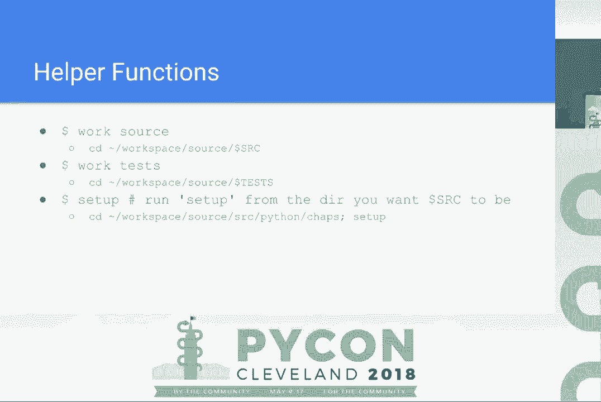

 These are fish functions。 They're not the prettiest but they work and then this is what ties。
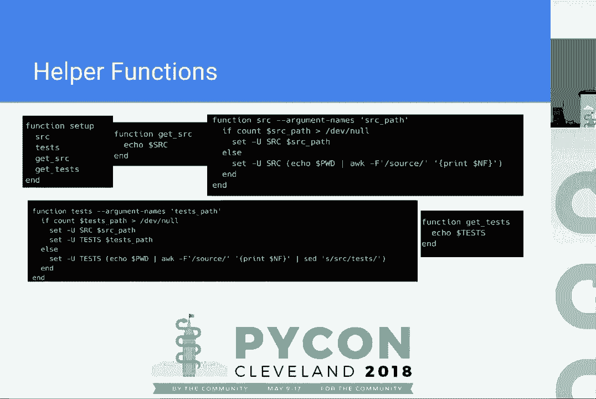

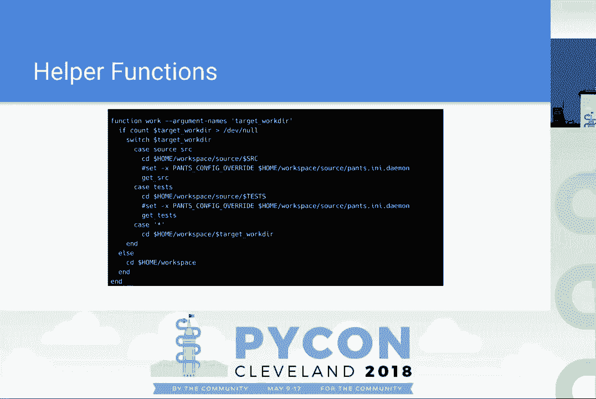

 everything together。 It's open source。 So there's my GitHub address for that。 Actually。 right is open source and then ported it internally where I use it daily as part of my normal workflow。

 And I found a bug in the package namespace writing these slides so I wouldn't fix that。 If you find a bug or feature， pull request me。 Thank you。

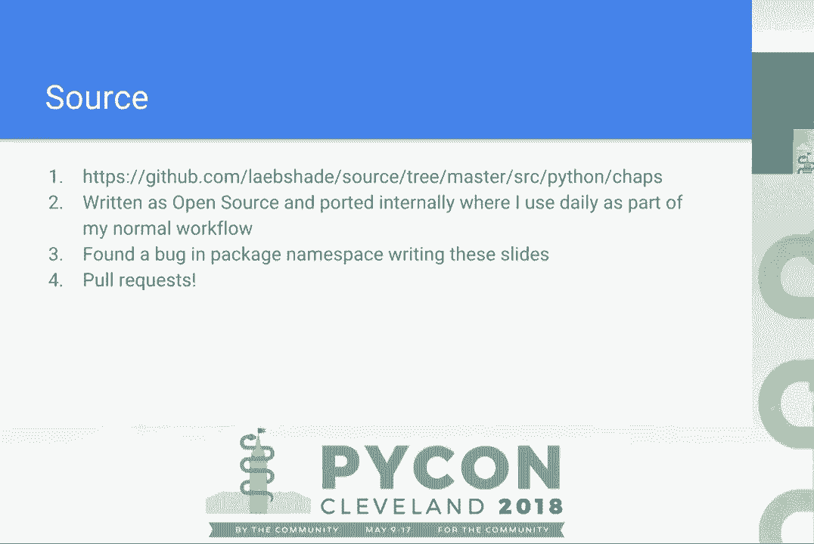

 Thank you。 Thank you very much。 Next up we have Paul Ganssel on variants。
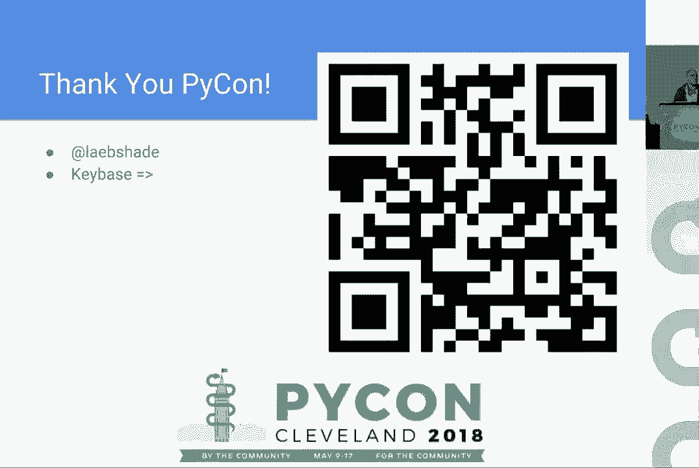

 Hi。 So my name is Paul Ganssel。 I'm a software engineer at Bloomberg and today I'm going to talk。 about variants which is a library I wrote to enable convention that I think could improve library。

 API designs。 So how many times have you had this problem where you're trying to write a library。 API as you do？ And you want to take something that's maybe a file。 It might be a stream or。

 something like that。 So you write this sort of ugly type of keyword parameter， file path or buffer。 and if it's a string it opens a file and if it's a stream you just read it。 Or maybe you've seen。

 something like this where you have some function and most of the time it just returns one thing。 But sometimes you need some context or something extra so there's some parameter that changes the。

 return type to a tuple。 So that kind of messes with the typing there。 And this kind of thing happens， when you have some functionality that has maybe a 90% use case or even a 60% use case。

 And then you have some other alternate form that happens a reasonable number of times and you。 want to enable that functionality。 There's a pattern that if the function that you're creating。

 is a constructor function people use which is alternate constructors。 So for example from the。 standard library you have the chain class which takes as arguments a number of iterables and then。

 it chains them all together and gives you one iterable back that is all the things in a row。 And the primary constructor there takes the number of iterables。 It also has an alternate。

 constructor from iterable which takes an iterable of iterables and returns an iterable。 So you know I find this pretty clean but what if you have a function that has an alternate form。

 that's not a constructor。 So maybe I would want something like this where you print text and if。 it's string it just prints the string and then you can also say oh I'm sending you a stream and。

 print the text from a stream or maybe I have a file path。 So that's what the library variance does。 So you would decorate your primary function with the variance。primary decorator then。

 sort of like how the property decorator works。 This allows you to register additional。 variant forms。 So here I've registered the stream and then I've also registered a from file path and。

 you'll note that from file path is implemented in terms of from stream and from stream is implemented。 in terms of the primary。 And this works essentially as you would expect it to。 So why would you use。

 this？ Why wouldn't you just do something like have an underscore？

 So I think that it's cleaner if you， use something that's actually syntactically marking the relatedness。 Then all your variant， forms are names based under the primary variant。

 This also is kind of cleaner or kinder to tab， completion and it keeps the top level API as clean as possible。 I've also written a Sphinx， extension that allows you to just sort of take all these things and tuck them under the primary。

 API。 So you just use auto module and all your variants will be automatically grouped together。 So what are some use cases for this？ One would be explicit dispatch。 So in this original example。

 I had something that takes a string， two things that take a string， the file path and a text。 Maybe I also want to be able to take a URL。 It's not super easy to dispatch this on type but if you。

 use variants you can explicitly dispatch。 You can also have variation in return type。 So for example， here's something that it's sort of like a range function but for dates and it's lazy by default。

 But I can also create an eager variant that will just consume the generator and give you a list。 You can have variation in async behavior。 So you can write an async function and then if you have a。

 blocking version of it you just create a sync variant and so you have my func it's an async。 generator and then my func。sync it's a generator and you can have variation in caching behavior。

 And in fact if you look at how LRU cache works it already adds variant functions to your functions。 But so here what I've done is I have this get config。 I've decorated it with the LRU cache。

 So when you call this twice what's going to happen is the first time it grabs the config。 the second time it just is a cache hit。 But I also have this no cache variant which。

 which lets you explicitly grab a brand new instance of your config without clearing your cache。 And you can also see that this primary is implemented in terms of the variant。 So you can use the。

 primary as sort of like a dispatch that will maybe automatically choose the variant that you like。 based on type and then if you want to be more strict about it you can be explicit。

 So that's the library。 I started basically to win an argument。 I'm hoping that I've。 maybe won you over a little bit。 You can find it on GitHub's。 You can include in your library。

 And I'd love to see some pull requests or some issues or just people tell me I'm wrong。 Thanks。 [Applause]。

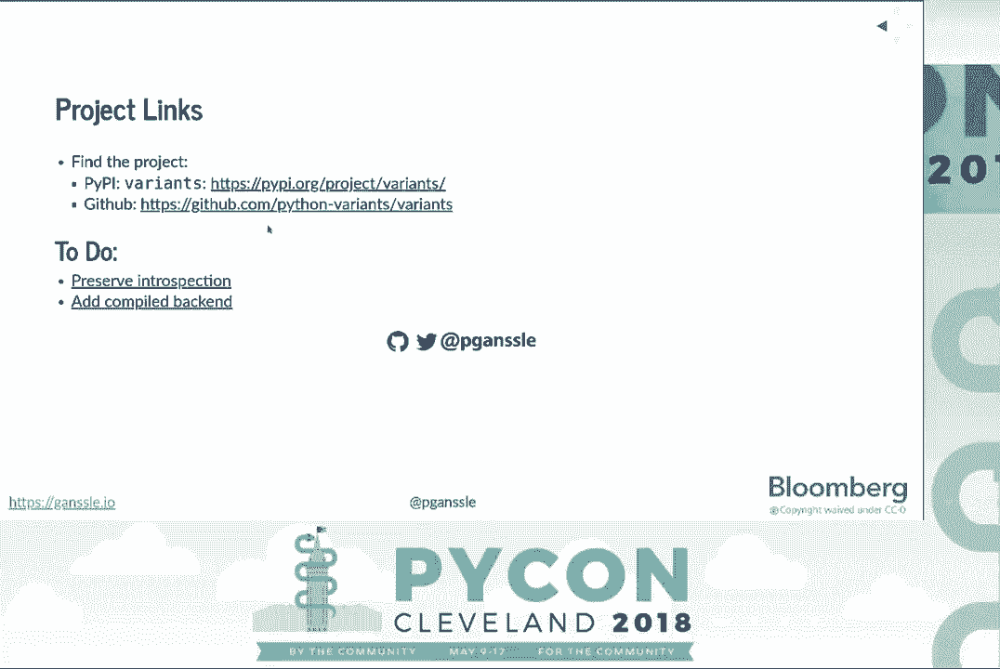

 A quick request。 Brett Cannon。 If you're in the room， if you could meet me over there。 If you have direct contact with Brett Cannon and you could ping Brett Cannon and tell him to。

 meet me over there。 That'd be fantastic。 All right。 To finish up。 I know that you love PyCon and you want more PyCons。

 So this is going to be a series of promoting local regional PyCons。 They have at most a minute。 unless they're presenting more than one which a couple of you are。 But yeah。 Take it away。 Right。

 Hello。 If you ever wanted to visit Prague， Czech Republic， now is your chance。 In less than a month we're having PyCon CZ。 We have an amazing venue as anyone who went last year can。

 tell you。 We have great keynote， talks， workshops， a great community。 Not as many people as here。 which is also nice I think。 So yeah， come。 It's in June 1st to 3rd。

 I'm also supposed to say something。
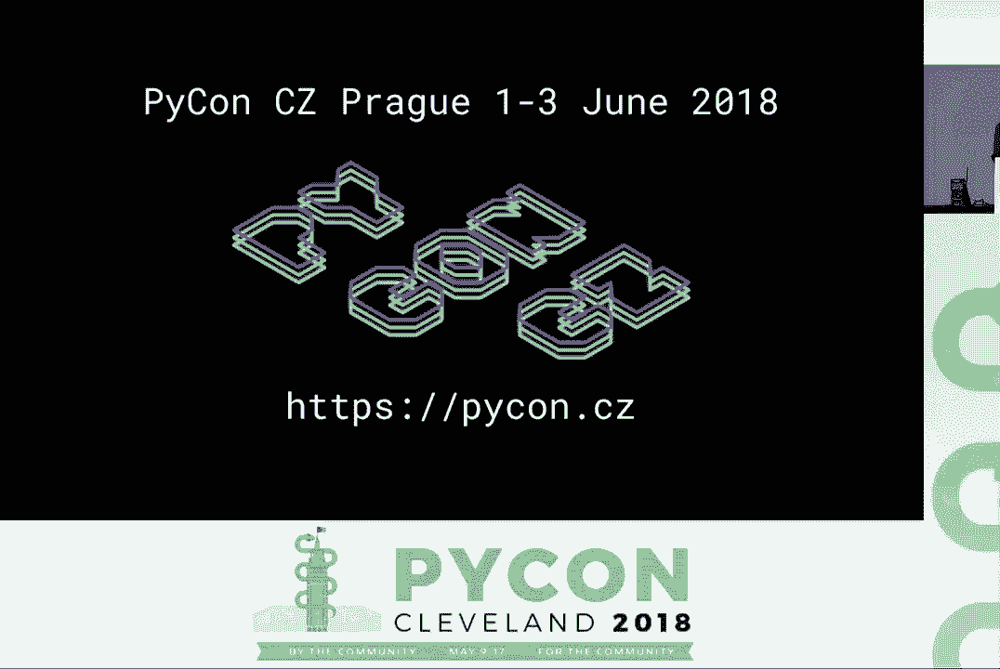

 about PyCon Taiwan。 So if you're not in Europe， you can go to Python Taiwan which is also beginning。 of June。 The person who was supposed to present this is unfortunately sick。 So go to PyCon。tw。

 to read above the details。 Hello everybody。 My name is Eric。 Just a show of hands here how many people use the scientific。

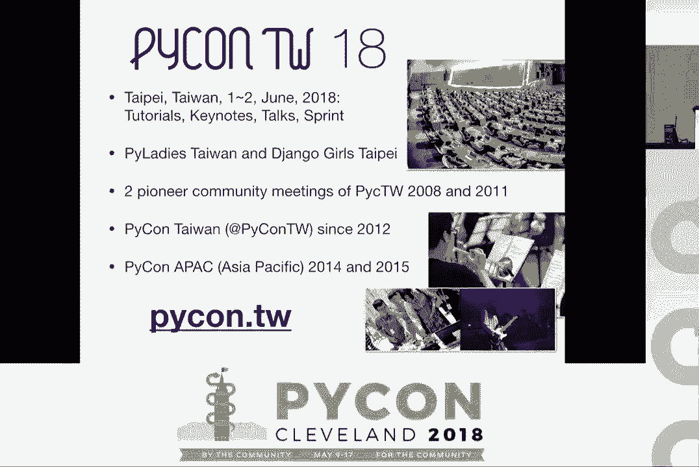

 computing Python stack。 Yes。 Thank you。 This conference is for you。 SciPy 2018。 It's located in。 Austin， Texas from July 9th to 15th。 There will be talks， tutorials as well as sprints， developer。

 sprints as well。 If you have any questions， you can ping us on Twitter。 It's @SipyConf。 And we hope。 to see you there in July。 Thank you。 Okay。 I'm a last minute sub。 So if there's a slide， I need it。

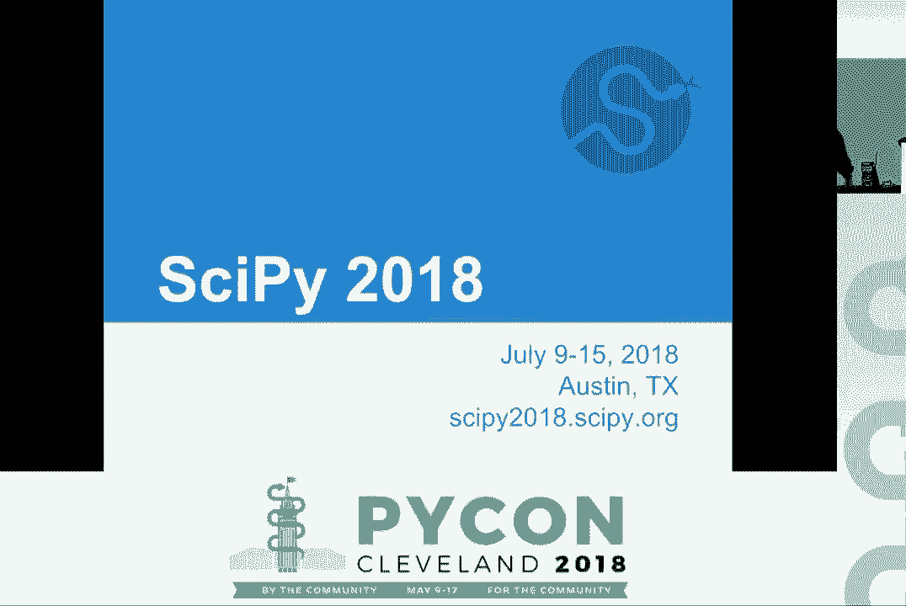

 Okay。 PyOhio， if you love both PyCon and Ohio， you can get more of it。 So PyOhio is a regional。 Python conference。 We'll be in our 11th year this year。 You can see the stuff on the slide。

 It's the， main conference is Saturday and Sunday， July 28， 29th in Columbus， Ohio。 Just about two hours away。 The conference， as always， remains 100% free to attend。

 We will have talks， tutorials， open spaces， the whole nine yards， young coders。 We are looking for first time speakers， CFP closes on the 15th of May， just a couple days away。

 I hope to see some of you there。 Thanks。 All right。 So it may surprise some of you to know the world doesn't end at the equator。 There is a。

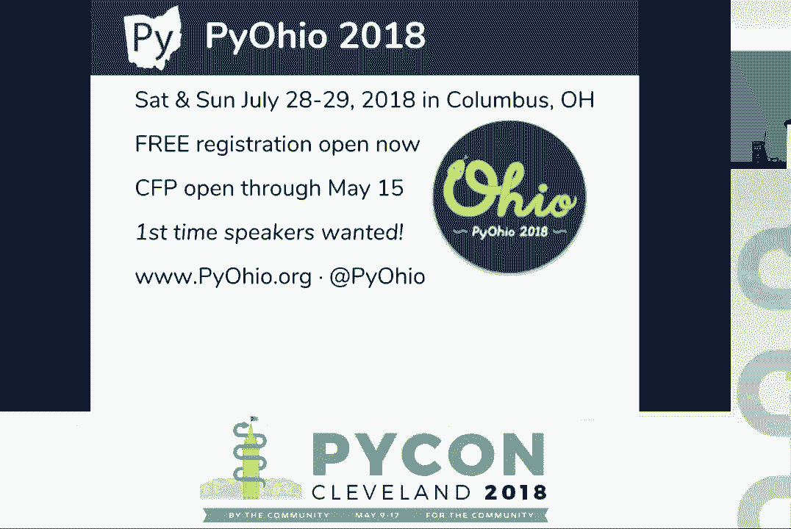

 whole other half of the world down here。 And we have our own Python conferences。 PyCon Australia。 is coming up August 24th to the 26th。 We have specialist days on the first day for DjangoCon。

 security and privacy， education and Internet of Things， followed by two days of contract， followed。 by two days of sprints。 The call for papers is open right now。 Closes May 28th。 We have mentors。

 available if you're interested。 And there is also a grants program for getting people down there。 since you are so far away from us。 So yeah， please come along if you can in August。 It's in Sydney。

 And if you have an interesting idea to speak， we'd love to hear your proposal as well。 Thank you very， much。 Good morning， everybody。 I bring you back to the Northern Hemisphere。

 but to Europe， and would like to invite you to the EuroSciPy。 That's a European branch of the SciPy conference。 We will have two days of tutorials。

 two days of conference， the Mondays of sprint， and always get feedback。 It's a very nice community conference。 So please come to Italy。

 and enter for August and take part in EuroSciPy。 Next conference， because I'm not only doing one。 the second one is PyCon DE， combined with PyData， which will be in October in Germany。

 in Cultureware。 And as you can see here， it's in English language， so it makes it much more open。 And now you still have the chance to submit your proposal。 And come there。 There's also tutorials。

 talks and sprints in Germany。 Thank you very much。 [APPLAUSE]， Hi， I'm John。 one of PyGotham's organizers。 PyGotham is New York City's annual PyCon conference。

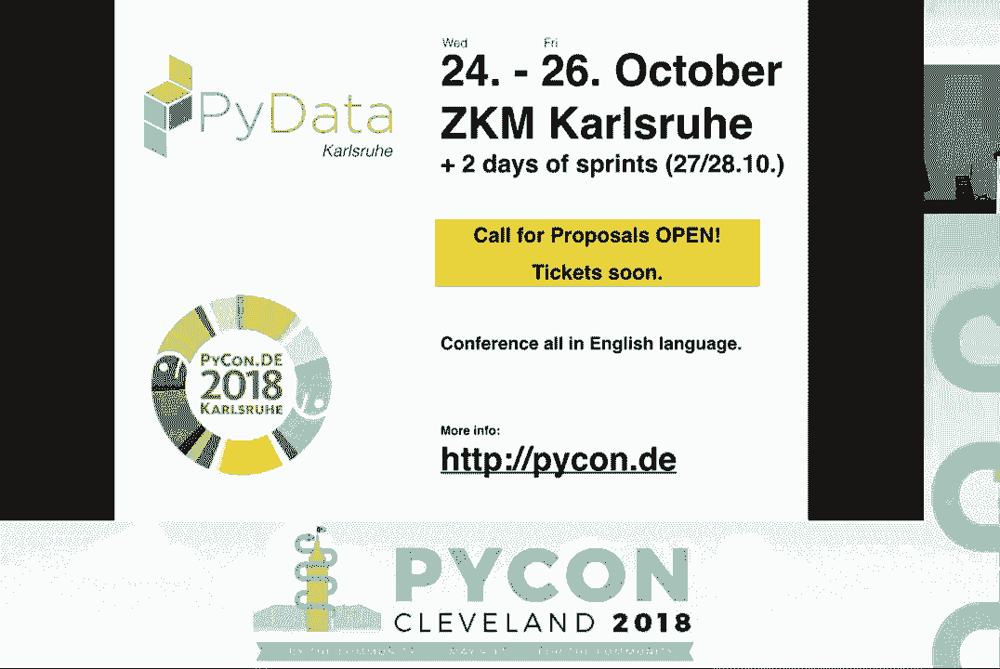

 happening the first weekend in October。 Our call for proposals is open for another week。 We're looking for sponsors and ticket sales are live now。 We hope to see you there。 [APPLAUSE]。

 Hi， I'm here for DjangoCon US。 We're in San Diego this year in October。 Our CFP is open until June 3rd。 If you have or if you use Django at work。

 we would love to hear from you。 We're looking， off for sponsors also and our tickets are also on sale。 Hope to see you there。 [APPLAUSE]。

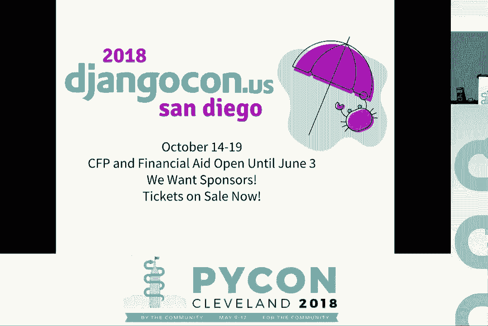

 Hey， I'm Dustin on the program chair for PyTexas。 This year will be our 11th annual PyTexas。 It'll。 be in Austin， Texas。 CFP is not open yet。 We don't have dates yet， but it will be in the fall。

 You can go to PyTexas。org or follow us on Twitter @pytexas。 Thanks， y'all。 [APPLAUSE]， Yeah， click。 Click。 There we go。 Hi， I'm Sam， a program chair for a North Bay Python。 We're running。

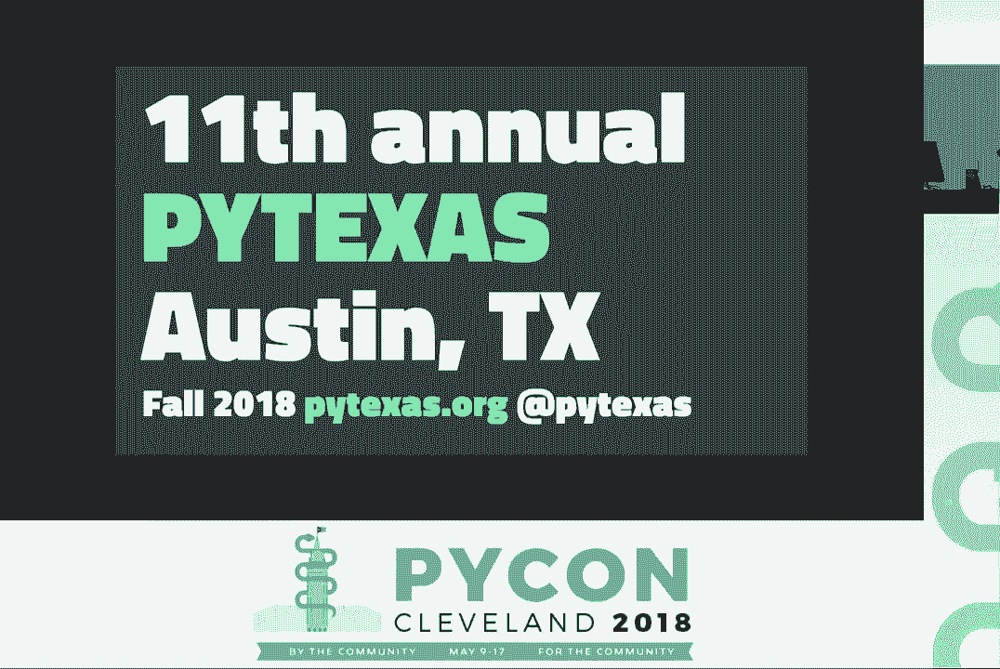

 our second year in beautiful Petaluma， California， just about an hour north of San Francisco。 A CFP will be open roughly a month from now as soon as we all recover from this event。

 And we are accepting sponsorships and tickets will be on sale sometime late summer。 Thank you。
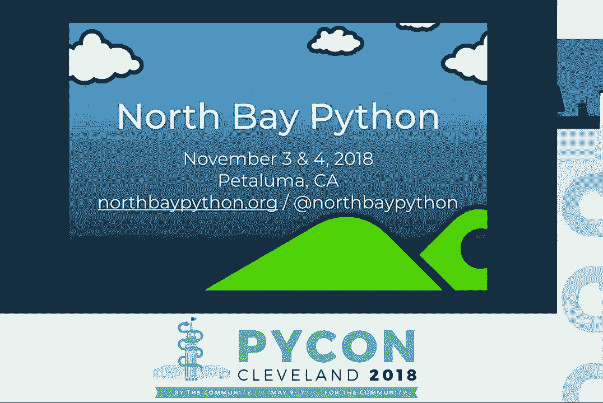

 Hi， I'm really honored to invite you to PyCarivian。 Basically， we're a PyCon with Carivian Twist。 We have amazing talks， really good music and a perfect weather all the years。

 So I know you can get wrong getting there。 So the calling for proposals is already open。 so we'll be really happy if you shared that time with us。 Also， I'm pleased to invite you all to。

 PyCon Columbia。 It's just the week before， so that way you have a pretty good excuse to do tourism。 And the call for speaker is clearly open too。 Basically， you have a very beautiful country。

 just like the Dominican Republic。 And they had 300 attendees last year。 This year， they are。 expecting more than 400。 So don't miss it out。 There are really two amazing conferences。 Thank you。

 Good morning， Cleveland。 In USA， you have PyCon。 In Europe， we have Europe-item。 This time。 that will be in Nandenburg and Scotland。 We will have a PyDATA chapter and of course。

 the call for proposal is just open。 For the ticket， we will be， we will send them maybe in few days。 and we will have two days just for the training and workshop， three days for the main conferences。

 one-and-three conferences。 If you want to submit something， you do it just that。 And two days for。 the sprint。 Thank you。 Hello， everyone。 So， we have seen many conferences on the beach， but if you。

 want to enjoy， oh， how do I pass？ Here。 If you want to enjoy the weather and the food of London。 please come to Pilandini。 Yeah， nothing like Santo Lomingo， right？ Come to Pilandini。 This is a。

 conference which is done in support of the PSF。 So 100% of your ticket goes directly to the PSF。 And this is happening on June in London。 I'm really happy with the lineup。 We have the chief of the。

 PSF， Django Core Developer， one of probably the most active CPython Core Developers。 Corganizer of PiDet in London， Jupyter Core Developer。 This schedule is amazing。 Check it out。

 And on， Friday we have a Transcode hackathon。 We have a sprint on day two deal。 which you have Paul here， and a PiLadies workshop。 And the ticket is just 35 pounds。

 So don't miss it and hope to see you in London。 [Applause]。
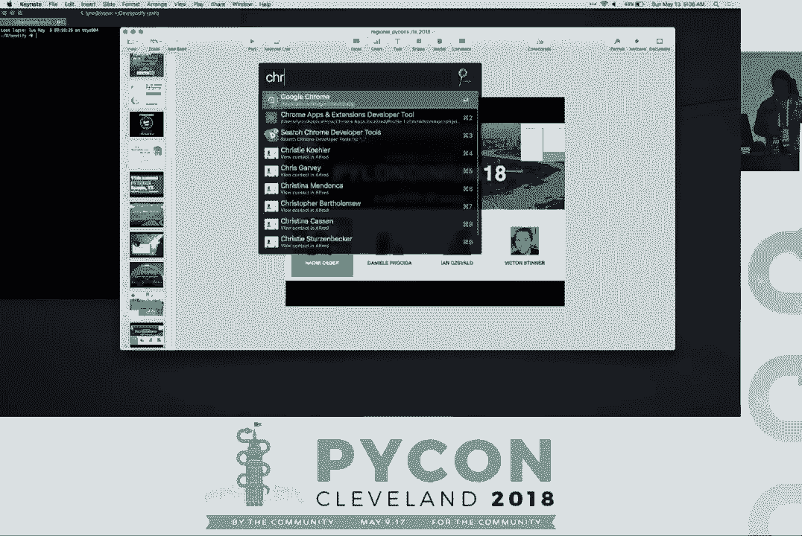

 Okay。 Hi， guys。 Good morning， everyone。 So my name is Nicole， and I'm here to talk to you about。 Python Brazil。 We have a great community back in Brazil。 We have around 20 people here from Brazil。

 so if you hear someone talking something weird， it's probably Portuguese that we are talking。 It's a， huge group that we have here。 And I want to invite you to come to Brazil and be part of the Python。

 Brazil， our Python。 It's going to happen in Natal。 That's a northeast city of Brazil。 It's very warm。 There is a lot of nice beaches。 And the name Natal is Christmas in Portuguese。

 so it's going to be a， great party。 So a couple of papers is open now。 It's going until June 30th。 So please join us。 We are giving support for talks in English and Spanish， so feel free to come。

 And， okay， I see you， all there。 Thank you。 [Applause]， Ernest， how much time do you have？

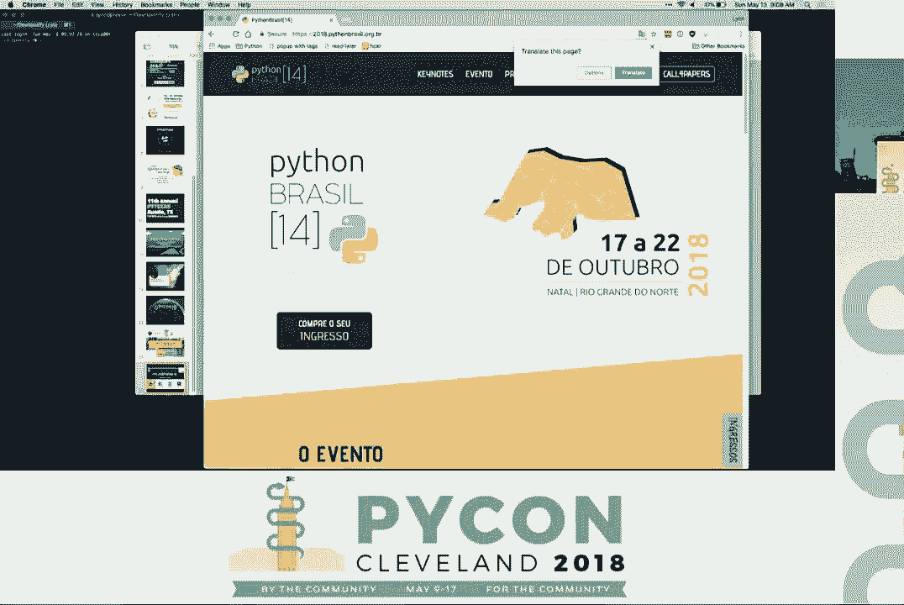

 Okay。 We have like 10 minutes。 Okay。 So we have 10 minutes before keynotes。 Is there anyone willing。 to do on the spotlighting talk？ If you are， come up on the stage。 Run up there。 First come。

 first serve。 And while we set up， I brought up Harry to tell more jokes。 Everyone goes， oh， no。 Plus， all these jokes are going to be delivered in a sort of growling， early morning， Sunday voice。

 They're there。 I mean， I have a story， if you want it about a man who's really into tractors。 They're just a person who really likes tractors and they have a big collection of。

 model tractors at home and they have subscription to agricultural magazines。 And they kind of have。 big posters of tractors in their house。 And they're just like tractors are their big thing。

 And if you'd like to hear the rest of the story， I'm available anytime。 Please take it away for an。
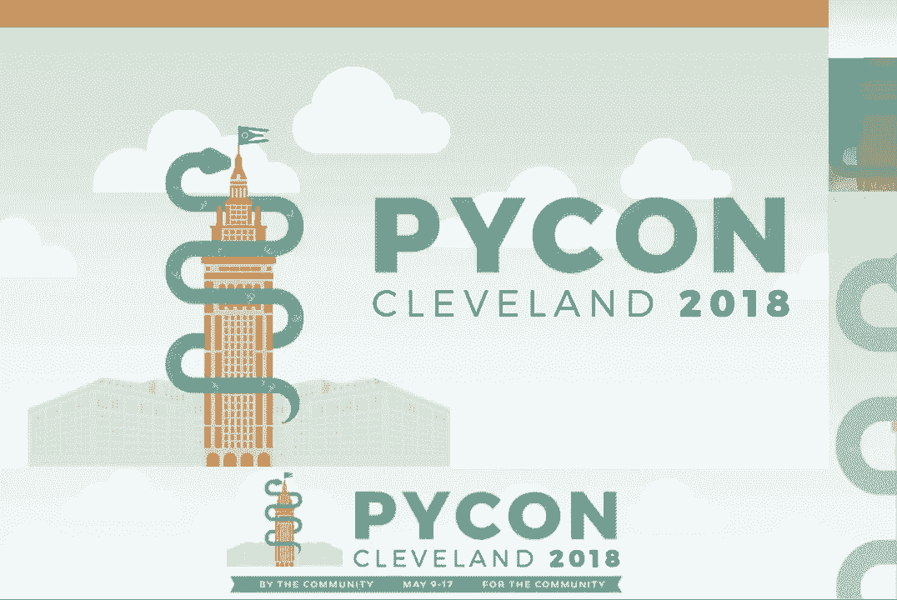

 actual lightning talk。 Hello。 Good morning， Picon。 It's a pleasure to be here。 My name is Rod。

 Senra。 Currently I work for working company New York， but since Nicole just presented to you。 Python Brazil。 Let me speak you just a little bit about Python Brazil and then the actual lightning。

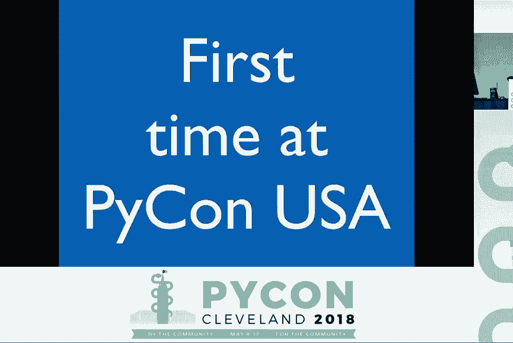

 talk。 And it all fits within the five minutes。 So the reason I'm here is that back in 2001， I did。 a tiny little contribution to the Python community。

 which was translating Gritos van Rosen's tutorial， to the Portuguese language。 So my name shows up into the official site for Python Nord。

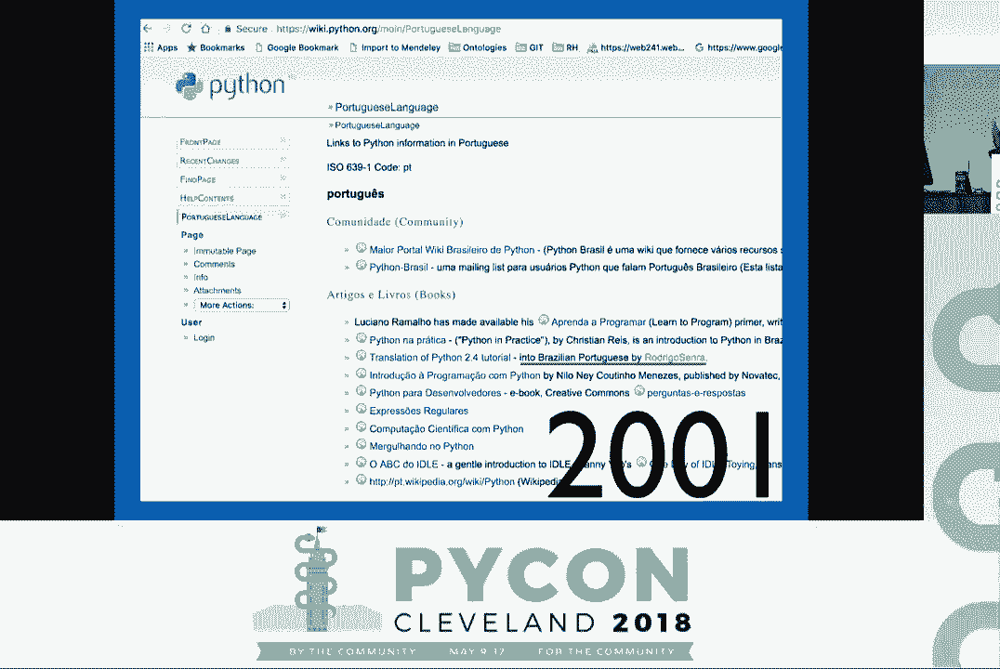

 And that the reason that was important because Portuguese is kind of relevant in the world。 It's not as big as English。 It's not as big as Chinese， but it's there。 So in 2005， after talking。

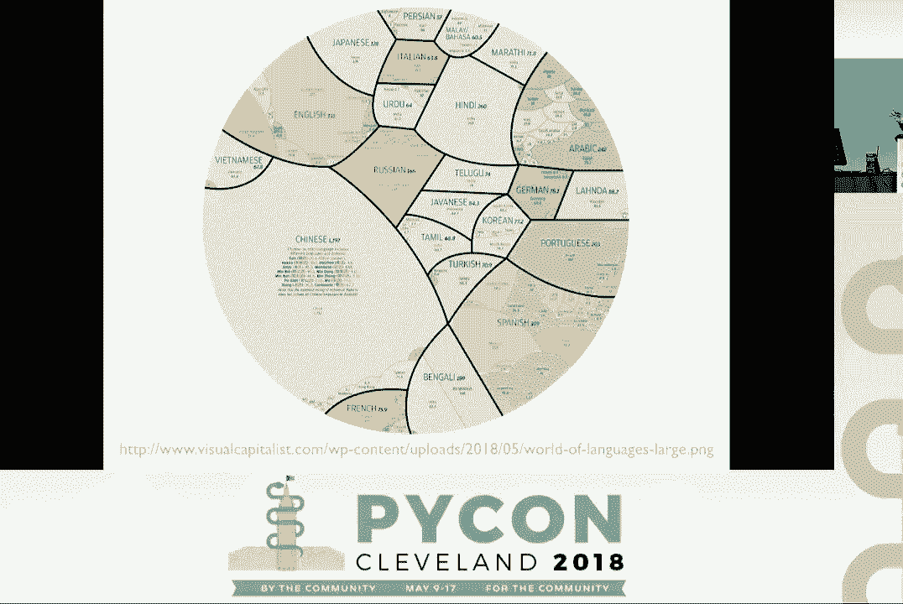

 to Alan Rannion during the international forum of free software in 2004， he said we were big。 enough to make a conference。 So I decided to do it。 And I created the first conference。

 together up all the Python community in Brazil in 2005。 We were about 100 people。 And then after that， for 13 years without failure， we are hosting a national Python conference。

 And all of them had， international speakers。 In 2007。 we decided that we needed some support to organize those conferences。

 So we created the Brazilian Python Association， which was a nonprofit organization。 like a subordinate， branch of the Python Software Foundation to make sure that we do those conferences every year and do。

 it right。 So this is just one picture of the conference people gathered around on the beach。 This year， Fernando Perez， the creator of Jupyter Notebooks and the Python project。

 was there amongst that crowd。 And this is what it looked like in 2017。 I don't have a picture for。 this year， but we're all invited to be there next year， like Nikole just told you。 And so we still。

 have two minutes to spare。 Okay， so in that case， we'll leave this for next year。 Thank you so much。 [ Applause ]。

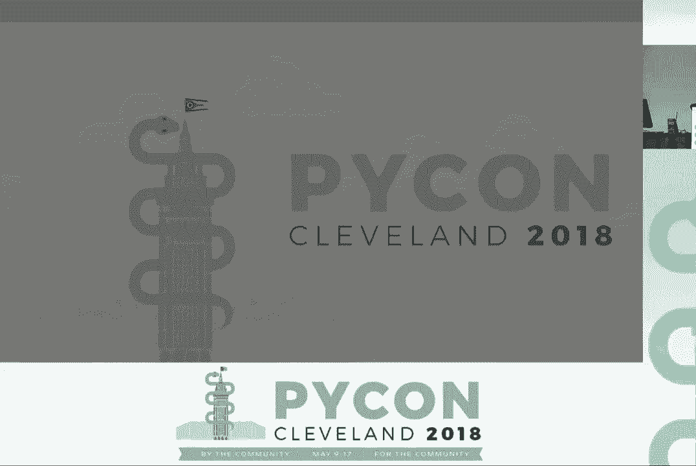

 So this person is really excited about tractors， as I said。 And one day this big agricultural。 fair comes to town and there's going to be a big exhibition of tractors。 And they're really。

 excited to go to it。 But not as excited as I saw you all are to hear this lurking talk。 [ Laughter ]， \>\> Take it right， sir。 All right。 Hi， my name is Michael Ropler。

 I am a local to Cleveland， Ohio。 And I wanted to tell you about -- well。 I wanted to encourage you to do things like start your own。

 business and write your own software because that's exactly what I did。 And it was actually a。 success， which is a rare thing。 So in 2013， I started a Python project as a product that I worked。

 on with my mom。 We started selling it。 We sold over a million dollars worth of the software last year。 and then we ended up selling it。 We ended up selling the company this year。 So I want to。

 encourage everybody that if you have an idea to build a product and go out there and sell it。 and make an actual startup in a company， you can do it。 I'm just a local guy。 I did it。 And it。

 was a very exciting， fun， challenging time。 But I did it and it worked。 So --， [ Applause ]。 So the company was -- the company was -- it was called Noggin and L。C。 The product was EHR。

 Tutor and we just got bought by a company called Ascend Learning。 So --， [ Applause ]。 So he's been -- he's been waiting his whole life really for this agricultural。

 exhibition to come around because he knows that there's going to be amazing tractors at this， thing。 like some of his favorite， like old tractors， new tractors。 But especially this amazing John。

 Dear model。 So he gets his ticket way ahead of time on the early bird scheme and he's counting。 down the days， crossing off things in his calendar。 It's a tractor-themed calendar。 And。

 eventually the big day is here。 He's been camping out that morning and he's the first person in line。 and he gets into the conference center like that。 He's the actual post person in there。 He runs in。

 the whole thing is deserted。 And he actually sort of runs past all the quite exciting old tractors。 and exhibits because he knows there's one massive new John Dear tractor that he wants to see。

 And he gets up to it。 It's in the main room of the hall。 It's just gigantic thing。 It's the size。 of a mining truck and the wheels are higher than he is and he's just looking at it in sheer awe。

 This is the absolute perfection of tractive technology as far as he's concerned。 And。 as he's there and there's not kind of really anyone around， he's there。 He's sort of overwhelmed。

 and he just goes， "Well， I know you're not supposed to do this。" but kind of leans over the velvet rope， and he just wants to touch it。

 So he just touches it and gets a little shiver。 Well， okay。 He's not really anyone here。 He's emboldened by the fact that he's broken a little， rule。

 So he just gently kind of steps over the line and gets a little closer to the tractor and。 feels the kind of door。 And are you ready to go？ Yeah。 Go！

 Yeah。 Hi。 I'm Michael Sullivan。 I'm going to talk quickly about lightning fast type checking with。 MyPy。 So I'm one of the MyPy core developers and I'm just going to。 So if you're not familiar with。

 Wait， it's scrolled too many slides。 I'm sorry。 Okay。 So MyPy is an optional static type checking for Python。 It uses PEP484 annotations。

 and lets you annotate your codes。 Here's a Fibonacci function that takes an integer and returns。 iterate events。 I'm not going to go too much into this index， but that's what it looks like。

 That's Python 3。 It also supports Python 2 using type comments。 You know， if you do something wrong。 it'll give you type errors。 If you call the， function the method eggs on a string。

 it'll give you an error。 It also will enforce that， when you expect some object。 you're not just passing in none。 You can mix typed and untyped code。

 to allow you to gradually migrate your code bases。 So at Dropbox， we have a lot of code。 And we've gotten to the point where about 25% of it's MyPy annotated and doing more。

 but it provides， a gradual migration path。 We recently had a big release， MyPy 0。600。 And the biggest news in that， release is that we added a new feature called the MyPy Demon。

 And what the MyPy Demon does is it， sort of runs in the background checking your code。 And when a function changes， it only rechecks， functions that depend on it。

 So here we have a function foo and it's getting called from another， module。 And if we change it to return a string instead， that might break some code。 But MyPy。

 Demon knows that the only thing it needs to retype check is this eggs function that calls it。 The。 rest of the code doesn't need to be checked because nothing's changed that it cares about。

 The big upshot of this is that it makes everything wicked fast。 At Dropbox， we have over a million。 lines of type annotated Python in our main repository。 And the P 75。

 the 75% of type checks that our， engineers do take less than five seconds。 So just since that's a new feature， I think it's a good， thing for everyone to check out。 Thank you。

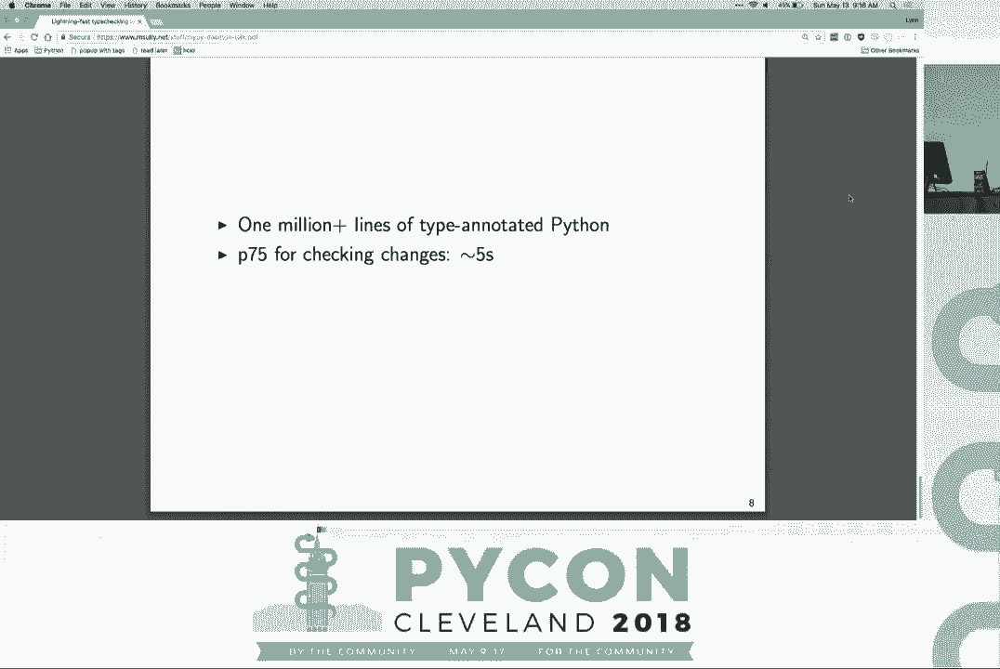

 So once he's kind of timed over the velvet rope anyway and he's touched the door， he can't。 really help himself。 And so he says， I'll check the door handle and it's open。 So he goes， okay。

 come on。 This is the most amazing tractor I've ever seen in my life。 I've got to climb up。 And so。 he just quickly runs up the little steps and jumps into the cabin and he sits down in this， tractor。

 And it's the most amazing feeling he's ever had。 He's massively high up。 There's this。 amazing control panel in front of them and he just loves tractors， obviously。

 So he just gets this rush。 And then he notices that the key is in the ignition。 And by this stage。 he's thrown all， caution to the wind。 He's like， I forget it。 I just want to hear the engine。

 It turns the， ignition on and this huge， amazing rumble comes out and the sense of power is overwhelming。 But not as overwhelming as how amazing the next lightning talk's going to be。 [Laughter]。

 Which is like a mic？ Yeah？ On this one？ Sorry， while they're setting up。 I have a two-minute lightning talk for everybody。 Hi， my name's Hill Wayne。

 I have a question for all of you。 Who's had to interview？ Use a， linked list。 Write a link。 This is part of an interview。 Quick raise of hands。 I can't see any， of you because it's too low。

 Write out。 Why do we have to ask linked lists？ In 1992， the main， language everybody used was C。 And in C， you don't have higher order data structures。 So if you want to do literally anything。

 you have to write a linked list。 Therefore， it was not a， question of。 do you know algorithms but have you programmed C before？ Starting 1995， the number。

 of programmers exploded。 Everybody was trying to use older questions and it got repurposed when。 people started using Java and Python， et cetera， as an algorithms question。 In other words。

 it's garbage。 [Applause]， Hi， everyone。 My name is Moshe Zadka and I want to talk to you about Middlefield。
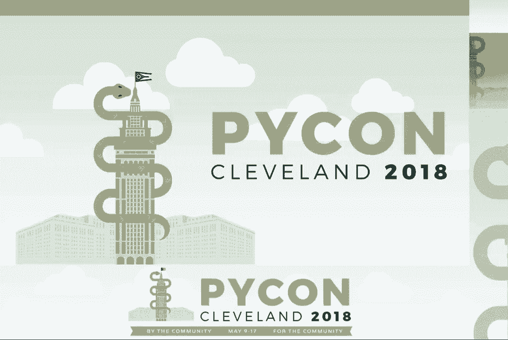

 which is a custom generic developer tool。 And it started because I was changing companies and。 each time I had to build a new tool for developers and I was building the same things over and over。

 again。 So the way it's custom but generic is that the only built-in command it has is to build a。 new executable。 So if you just run it with echo， it's like， I don't know how to run echo。

 but it has， a command called self-build and if you use a plugin that is like very silly but I wrote that's。 called echo， then suddenly it knows how to echo。 So if you have custom commands， you can just。

 add it to Middlefield and then you upload the text to whatever internal place you want。 a gate or an artifact or maybe even your stack channel。 Writing a plugin is really easy。

 That's pretty much all you need to do in setup tools。 You need to make sure that you register it。 And you add， you can add dependencies and you can add an actual command。 This is the echo command。

 It just prints the arguments because it's silly。 So if you think that is awesome， you can write a。 plugin。 You can make it internal if it's really custom thing or you can put it on GitHub if it's。

 useful for other people。 You can distribute it internally and if you are interested at all in。 this thing and like you're also building tools for developers and you're wondering how we can make。

 it nicer， please talk to me。 I'm Zadka。mosh@gmail。com or you can go to my website， kobodies。com that has all the links to me so you can find me everywhere on the internet。

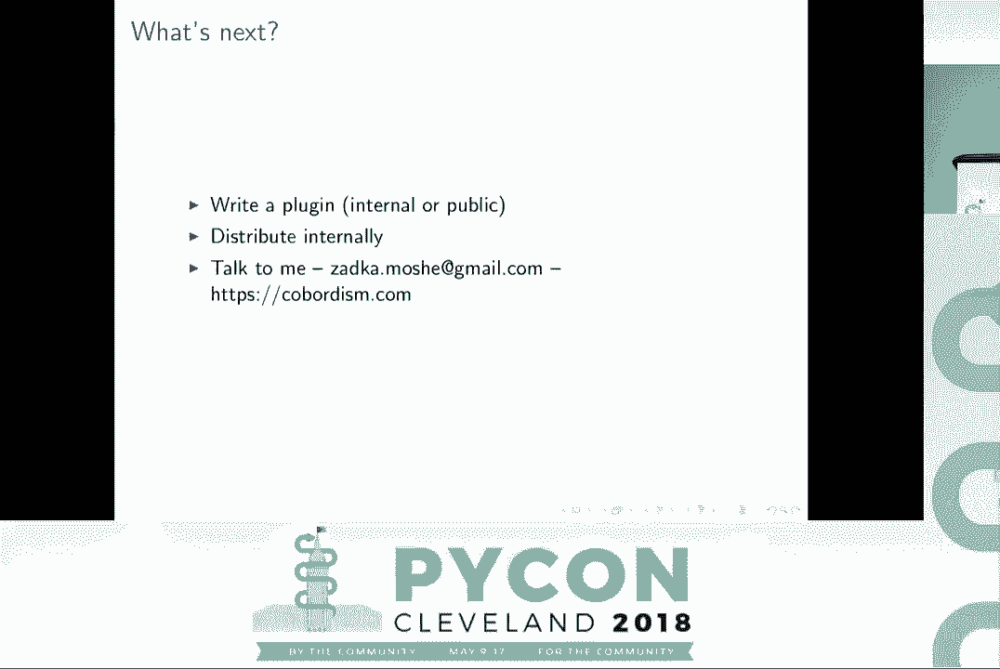

 Thank you very much。 All right。 Thank you。 Let's give another hand all the lightning speakers。 That concludes all the lightning talks for PyCon。 So if you want to give a lightning talk then you。

 have to wait until next year。 Sorry。 Yeah， we're getting to that。 I'll just let you finish。 Go for it。 I don't know if you really， I mean， you know。 Yeah。 Here we go。

 So he's turned on the edge and he's， feeling this sheer feeling of rush of power in this gigantic chapter and he just can't help himself。 by this point。 He puts his pedal that foot on down on the pedal。 He drives the tractor off of its。

 plinth down through the brave it rose and just starts crashing through all of the like sort of。 pre-fabricated walls of the exhibition center and just goes on a rampage with this tractor。

 And like so， you know， the police are called and they eventually pull him down and they drag him out。 of this tractor and they take him away and he gets put to jail and he has to pay a huge fine。

 And after all this， he kind of gets home and he goes， gosh， I think I've let this go too far。 I think maybe the my tractor obsession has taken me to places I don't want to be。 So he just goes。

 you know， done with tractors and he takes down all his tractor posters from the wall。 He takes all。 his tractor magazines， cancels the subscriptions， takes all his model tractors。

 all his Lego tractors。 He puts him in a big file in the back of his house。 He makes a huge bonfire。 sets fire for a lot of them。 He gets rid of all kind of vestiges of tractors from his entire life。

 And once he's done that， he takes a really deep breath and he goes， that's better。 So he goes to the pub and he goes in there， and the pub is kind of empty and there's a weird smell and he goes to the bum and what's going on。

 why is it empty？ And he goes， well， everyone's kind of put off by the weird smell and he goes。 you know what， I think I can help you with that。 And sort of walks around the pub slowly and he goes to。

 he's sniffing and he goes to where the smell is strongest and he goes like this。 And he walks outside and he goes， and he goes back in the pub and he goes back to the。

 central spanking and he walks back outside and he goes， he does this a few more times。 And gradually， as he's doing this， the smell slowly disappears and the barman。

 toasts him and he goes， that's amazing。 How do you do that？ And he said， well， I'm an X tractor fan。 A huge round of applause for our conference chair and it's W-Doing of the third。

 Thank you very much。 I was Harry。 Thank you to all the Lightning Talk speakers。 Thank you， PyCon。 See you next year。 Welcome to the third day of talks here at PyCon 2018。

 The last day of talks here at PyCon 2018。 I want to give a huge thanks to Lynn and Harry and all of the Lightning Talk participants this。 year， particularly for helping us fill the time to get to right now。 So a big round of applause。

 for all the Lightning Talk participants。 In the lead up to PyCon 2018， you may have heard from。 locals about the mere curial or curious weather here。

 It shifts very quickly from one thing to another， and you may have seen that during your time here。 So I want to give a huge shout out to about 30， people who woke up this morning and looked out the window at pouring down rain and thunder and。

 lightning and still walked down to participate in the 5K fun run。 Thank you。 That everybody applaud。 the fact that they were prepared to do that。 We're really sorry that didn't work out but it didn't。

 seem safe to run with lightning bolts。 If you haven't picked up your 5K fun run t-shirt。 please go do so。 It will be around all day today。 Speaking of today。

 happy Mother's Day here in the US。 We have prepared two things for Mother's Day here at the conference。 One is in room 10 today。 There， will be no open spaces。

 We want to use that room as a place where you can go to make a call home to。 your loved ones if they can't be here with you without having to step too far away from the conference。

 So check that out。 And additionally， there will be a photo booth outside of registration where you can。 take a photo with PyCon themed things and send it back to your loved ones as well。 So check those。

 out。 They'll be open from 10 until the closing keynote。 Today， we have the Job Fair and poster。 session in the Expo Hall where the booths were yesterday。 So go check those out。 The poster session。

 and Job Fair will run this morning and then lunch and then we have talks in the afternoon。 Before we come back here to conclude with our closing keynote。 Additionally， the open spaces。

 will be running all day。 So keep checking the board out near registration and that's what we got going。 on today。 Our keynote this morning is Brett Cannon。 Brett has attended every PyCon by its name。

 and has been a core developer for 15 years。 Brett's currently core Python developer that is。 Brett's currently a principal software developer on the Python tools team at Microsoft as a developer。

 lead on the Python extension for Visual Studio Code。 Something Brett and I haven't common is we。 probably both miss our cats immensely at this point。 So without further ado， here's Brett Cannon。

 Welcome to morning everyone。 Thanks for having me。 I have to admit when Ernest asked me to do this。 I got to cross something off my lifetime bucket list。 So I really appreciate that Ernest。 Thank you。

 very much for helping with that。 So before I start talking about setting expectations for open。 storage participation， slight warning， I get a little emotional giving this talk。

 I'm going to try to， keep the language clean。 If I slip up a little bit。 I apologize to the younger members of the audience。

 But first I want to cover kind of my bona fides of why I'm up here giving me this talk。 So as Ernest， mentioned， I am the dev lead on the Python extension for Visual Studio Code。

 If you don't happen to， know what VS code is， it's Microsoft's cross platform open source code editor。 which I know shocks some， people with the first two phrases in that sense。

 It actually is and Python thinks all of you is the， fastest growing language on the tool。 But the reason I mentioned it is originally it was an open source。

 project from the community by Don J。 Mani， who's here attending his first Python US。 So we saw Don's work。 We loved it。 We said， do you want to come work on the extension full-time？

 He said， sure， he moved out to Redmond。 And we've been working on that since September。 So now that it's gone from what I would call community open source， we're basically。

 it's fully run by external contributors who put in the volunteer time。 I now call it。 what I call it corporate open source。 Basically， if all the external contributors went away。

 there's at least a backstop by a company making sure that the project keeps moving forward。 As Ernest also mentioned， I'm a core developer。 I've been doing that since April 2003。 I actually。

 got my commit bit about two weeks after the very first Python back in DC。 And once again。 I would consider this community open source because basically if everyone who volunteered on Python。

 disappeared， the project would probably collapse within a month。 I've also been lucky enough to。 contribute to over 80 open source projects。 Now， if you saw my area just talk the other day。

 I will also admit most of those are fixing typos。 But it has exposed me to a lot of different。 development processes。 So I've led corporate open source。 I've managed community open source。

 and I've just been a contributor overall。 So I've been lucky enough to have quite a broad range of。 exposure to open source overall。 And so it's led to me asking the question of like。

 what is the purpose of an open source project in community？ Now， for me， a project in community。 for open source basically means you've gotten at least one external contribution from someone， else。

 That's basically when your community becomes two。 And before that， it's kind of a code dump。 But。 when you start to have to interact with the public， that makes it open source。 And in general。

 this is also we can all collaborate together as a group to maintain the project and honestly。 also have fun。 Because we want to keep the project going for various reasons， but you want to enjoy。

 yourself while you do it。 Because if you're doing it just to maintain it and it's horrible。 you're not going to want to keep doing it。 And that's how people just want to draw projects。

 walk away， quit jobs， if that's what you're even paid to do， etc。 And if you're just having fun。 well， the project's going to bet rot and then you're going to stop every fun as well。

 So it's a real， balancing act between the two。 And then the question becomes， all right。 so you find this balance， how do you sustain it going long term？

 We've been looking up with Python to have it around for 28， years。 Thanks to Guido。 And it's a balancing act between attracting new people while also keeping。

 around the current people。 There is a certain level of attrition amongst contributors to a project。 whether it's just having children， getting bored， burnout， which we'll talk about more later。

 unfortunately， people pass away。 Basically， just the original people who came around a project will。 slowly trickle down。 So yet， the figure out ways to bring in new people to keep it going。 And for。

 projects such as Python， it could be a little tricky because over 20 years， there's a lot of。 current processes that worked well five， 10 years ago that don't necessarily gel but the way things。

 work today。 But the trick is， there are still people around who have been contributing like myself。 five， 10， 15 years ago。 And you have to make sure that they stay comfortable because you also。

 don't want to learn all that internal knowledge that they've built around the project。 So if some。 key people drop the way who have all the knowledge of how the dictionary implementation works。

 you're going to have， you're going to be in a tough spot。 So it's a real tricky balancing act。 of how to keep people coming in while keeping the people who are already around。 So in case you。

 have a nose， it's really hard to run open source projects。 So really， what's the goal here？

 The goal。
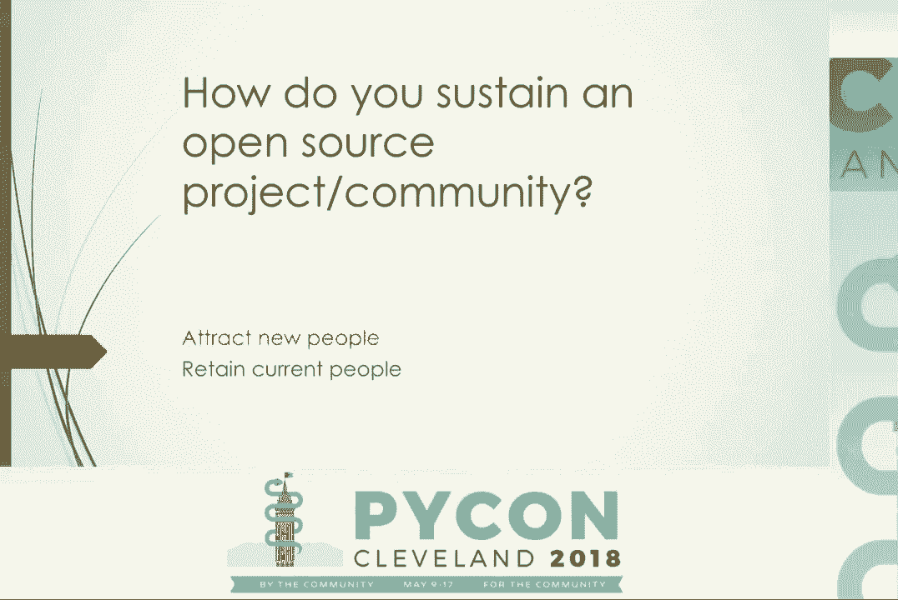

 overall is to work together to set a set of reasonable expectations so that open source works for everybody。 Right？ How to make it fun？ How do we maintain the project？ And how do we attract new people or。

 retain the current people？ And the key thing here I wanted to think about while we're doing this is。 most people are either volunteers or if they're lucky enough being paid by someone probably other。

 than you to maintain this。 So we really need to work together to build this symbiotic relationship。 where open source is actually sustainable， and usable， and workable by everybody。

 And this is where it gets a little emotional。 We're not exactly succeeding at this goal all the time。 Corey Benfield， who created the HTTP to implementation for Python called HyperH2。

 was is a maintainer on requests， is a maintainer on your lib3。 And basically。 when the street was taken in November 2016， was an extremely critical person in our networking。

 stack as a community， tweeted out， "Here's a bit of real talk for people。 I think working on open。 source software has been more bitter and short tempered。" And that's kind of a tough place to put。

 Corey because Corey has a partner。 And if his partner came to him and said， "Open source has made。 you a very bitter person and short tempered。" It's either me or open source。

 I would hope Corey would， choose his partner。 And actually。 I think he has because he's actually not here this year because he。

 needs enough vacation time to go on his honeymoon later this year and to see family at Christmas。 So good for him。 But it really sucks that we have to put Corey in this position where。

 potentially he might be asked that。 Like， it's kind of sad that I actually have to worry about that。 That Corey might actually have his spouse ask him， "Please don't do open source。

 It's made you a worse， person。" And in my personal experience， this has actually happened。 In 2016 and October， I actually had to take a month off and basically detox from open source due to three consecutive。

 months of bad interactions from the community。 And it was really tough。 And I did it and I came back， and I really thought about what happened。

 And this is basically what this talk is all about。 Is how do we work together to make sure that people are not put in the position here where。

 spouses are having to talk to their significant others doing open source and say。 "I really can't have you do this anymore。 It's not coming out the way you want。" And this is not。

 by the way， just 2016 happened to be a key year just because there were a lot of burnout in the。 community that year。 I actually still have to take off one day every weekend to make sure that I don't。

 have my whole weekend ruined based on one bad email。
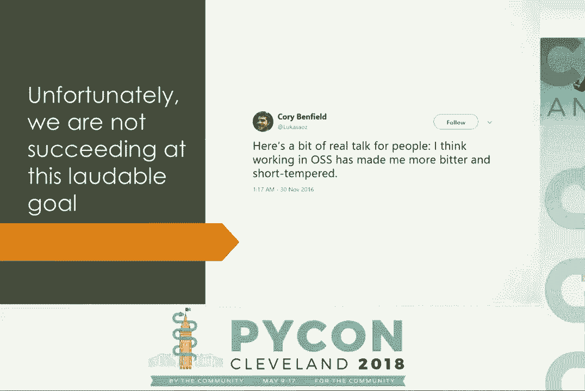

 So the problem is people tend to forget two key things when doing open source and at least。 interacting with it。 One thing is open source has a cost。 I know we all like to elude the fact。

 that it's free as in beer and top is just free as in libre and all that， but there's still time。 effort， and emotional output in all this。 Right？ Like if I do open source in my spare time。

 that's time away from my cat， which I am missing， so you're right， Ernest。 It's time away from my wife。 It's time away from my family。 It's time away from my friends。 Right？

 So like if you send me a poll request or send me a bug report， you're basically asking， "Hey。 if you can take time away from your loved ones， could you please do something about this？"， Right？

 And it's something we just don't think about。 And it's understandable， right？ It's just an。 issue tracker on GitHub。 That's it。 But remember， like every email you send to Python Dev or Python。

 ideas， I'm reading。 And that's going to be a few seconds of my life。 We'll have to play that across。 100，000 emails if you're following the 572 discussion。 A lot of time in your life。

 So it's something we just don't think about， but it's probably something we need to that。 there is cost here。 It might be free， and which is awesome and great that we can do this and give。

 it away， but there is still something being taken from somewhere else。 And I only have so much time。 on this planet， and I tried to use it wisely， but it can be tough sometimes based on how interactions。

 happen in the community through open source to continue to make the decision to take that precious。 time and spend it on open sources。 I'm just saying， "You know what， Scott。

 I'm going to go for a hike， and just not fix that bug today。" So this led me to kind of think that open source should be。

 kind of basically a series of unsolicited kindnesses。 The way you can say this is basically。 it's a series of gifts that people give you that you didn't necessarily ask for， and I'll explain。

 why it didn't ask for in the second。 But basically， if we just viewed all this in a more nice or。 positive framework of everyone's just trying to help everyone else out， and we always realized that。

 we're just doing a kindness for someone， I think we do a lot better in terms of making sure no one。 feels like they're being abused or used or just misunderstood。 And it just leaves a much better。

 interaction across the board。 So I'm going to go through some tickles scenarios here discussing kind。 of what this means in terms of this concept of kindnesses to others。

 If you need to picture something， you can imagine this is between Stuart and Brett。 Stuart being a contributor and me being a， maintainer。 This is actually Stuart Williams。

 who by the way is in the front row， over there from Winnipeg， Manitoba。 who gave me the idea of having the arrows on here to help。

 get the point across to who's helping who。 So， usually an open source， you'd think this is probably。 one of the more simple things where I'm doing a favor for Stuart by doing this open source and。

 just giving it away for free。 Well， you'd think so， but it can also be some sort of like someone。 leaving a path that out on something you find offensive。 And actually for the longest time， I。

 was like， yeah， I couldn't really come up with a good example of where this goes bad until。 unfortunately， about a week ago， where a very big open source project had a joke that was bad and they removed。

 it and there was this huge hoopla in the community about the joke。 I'm sure some of you know what。 I'm talking about。 I'm trying not to name names。 And some people found that joke offensive。 And it。

 really gets worn across that even in your documentation introducing a project to somebody。 actually matters and how you work with people。 You need to make sure that we're trying to be。

 inclusive and understanding of everyone because it still even affects people， even if you're not。 pushing in people's faces because people will just come across it and read it and it will affect them。

 The next usual step in open source is people providing feedback。 You can kind of equate this to family members calling you stupid。 I'm hopefully not。

 what everyone has had to experience this。 It's really rough when someone says you're dumb。 The example I gave here is once Hacker News had a very upvoted article， and I had to ask。

 you to be reading Hacker News， but it is what it is。 And one of the things I got upvoted was。 someone's complaints about Python。 Now sometimes these blog posts saying like， I love Python， but。

 there's this weird word， blah， blah， blah， are reasonably written and I read them to try to see if。 there's something we could actually fix because I've filed bug reports and gotten some things fixed。

 based on those blog posts。 So I read it and the author started off saying like， oh， I love， I like。 Python。 It's good， blah， blah， blah。 And then a huge list of this is stupid。 That's dumb。 Why the。

 hell did they do this？ It's it or it's it or it's it or it's it or it's it。 Now， the problem is。 while I'm reading this， I'm going， that's my fault。 That's a friend's fault。 That's another。

 friend's fault。 That's not even reasonable because that's Rebecca's compatibility with something from。 1993 because remember， Python's 28 years old and predates Unicode。 It's it or it's it or it's it or。

 and if you actually read the hacker news thread， which was actually very positive and nice to see。 the author said， well， look， I said it was I liked it。 It was like， well。

 that doesn't give you excuse， because you forget that there are actually people behind that project。 right？ You might be calling， a feature stupid， but by calling that feature stupid。

 you're basically calling me stupid， right？ Like， I put a lot of time and effort into something and put my personal time into it。 right？ Once again， away from my family and friends and you just basically said， watch crap。

 It's like， then why am I doing it？ So it can be really tough。 And I pointed out to the author。 I mean， to go out the show some network， the internet is written in pencil。 It's written in ink。

 So that， block was going to be around forever calling me and my personal time stupid and wasted。 So it's， just really frustrating when people do this and why it's I'm not saying you can't criticize。

 right？ There's always a way to phrase things where you just say， hey。 I don't understand why this is the， way it is。 And you can always ask， by the way。

 you can usually ask people why， like， if you came， to Python to have an ask。 why has it done this way？ We'd be happy to explain it to you。 A lot of， it's honestly。

 diverse compatibility or what have you。 And we all appreciate the compatibility we do。 So usually it was like that way in '95 and we just don't want to break your code unnecessarily。 So。

 sorry， it's a little weird。 But there's always a way to phrase things such that you can still。 have a critical question without being mean about it。 Because as I said。

 there's always a person behind， that piece of code。 Now， so many contributions。 This can also get a little sticky。 I like to say， it's like someone who tries to give you a puppy you didn't ask for。

 You might view this puppy as， this cute， adorable thing and say， hey， look。 touch you want this cute puppy？ And I'm looking at that as。

 10 years of pooping and feeding and taking it for walks。 Because you have to really think about it。 this way。 Let's say you give me a PR。 I'm going to review it and let's say I accept it right off the。

 bat。 No looping around on changes or everything。 That code is now on my head to maintain for probably。 at least a decade。 Remember， Python is 28 years old， predates Unicode。 And I don't think anyone in。

 this room would like it to disappear tomorrow。 So hopefully we're going to have another 28 years at。 least of awesome times of PyCon。 Which means I have to worry about that code lasting until PyCon。

 28 years from now。 So there's a lot of having to really think about this stuff in terms of， okay。 if I take this， am I going to break someone's code？ Because by the way， there's like over 7 million。

 of us。 I'm going to break someone's code。 Are they going to be really upset that I broke their code？

 Is it going to be reasonable？ I potentially just made a ton of books printed on dead trees。 obsolete， because of this change。 I mean， it's really mind blowing。

 We started to think about the ramifications。 So this is why sometimes we have to say， sorry。 and I'll talk about that in the next slide。 The other way this can kind of go wrong is sometimes people will say。

 here's a PR because， this is really broken or this is really wrong。 Once again， negativity。 that's not necessary。 Basically， you don't need to tell me that you're fixing my mess。

 You can just say， I'm helping out， as best I can because I think I can improve this。 Once again。 all this stuff can be phrased in a， positive light without being negative。

 outwardly negative towards anybody。 Now， I've seen when， people submit something。 we need to also give back in a positive light。 So when you give me， the kindness， give me a PR。

 I should at least give you the kindness of saying， thank you。 Instead of， saying， hey。 you're doing it wrong。 What the heck's going on？ That's not right。 Forget it。 Like。

 I once submitted， I don't know， about six or 10 spelling mistake PRs for projects， documentation。 right？ No big deal real quick。 It was in the GitHub， so I was able just to click。

 that little pencil， whip it out， do it， kept reading， find another one， do it， keep doing it。 My first response， don't you know you can just send one PR？ It's like， oh， yeah， but I'm reading。

 it through the， through GitHub， it's faster to just click the pencil and just do it。 And。 I thought you'd just like it。 Did you， was the Christmas really necessary？ Could just ignore。

 the PRs if you find two， but I mean， really just point out like， come on， newbie， what the hell。 are you doing？ It's just unnecessary。 The other problem is this， when you give feedback。

 and especially when you say， I'm sorry， no， I can't take this because I don't think breaking。 at least 100，000 people's worth of code is worth the change you're asking for。 Some people can take。

 that personally， and it's never meant to be personal。 It just feels like it。 So it could be like。 why don't you love me？ Why won't you take this？ I， for instance， when I had my burnout back in 2016。

 one of the reasons that happened， and I should preface this with the person in the story has。 apologized up squintly， he said， yeah， I'm at it you because you're preventing me from contributing。

 And it's like， well， I'm sorry it wasn't meant to really be a blocker for you。 It's just， I have。 souls to realize that I have my own obligations to the project and the 7 million users of Python。

 to make sure that I keep it in perspective。 So I'm sorry， but no， I can't take this。 So it's just。 it's really tricky。 And then finally， maintaining can be like arguing with disabilities about politics。

 We should all know better， but we don't always。 I've actually almost come to tears arguing with。 the core developer。 The following Python people ask， are you actually still talking to them？ I mean。

 stuff can get fairly heated because we all care so much， and we don't take the time to step back。 from the email client and just go， okay， it's fine。 I know this person， they're a nice person。

 they don't mean it that way， it's okay。 I can just talk about it rationally， it's all good。 Everyone can just be nice。 And it's just， I know it's hard to stop and take a breather。

 but honestly， if we all stop before we send that tweet sometimes， we're probably a lot happier。 individuals overall。 And so it's not just people coming into the project or， because you're just。

 going out， it could be even within the projects。 So basically， the point is we all need to improve。 I know this sounds a little biased towards maintainers， but honestly， it's because it is。

 Scale factor， here plays a huge part in terms of maintainers getting a lot more， basically。 I'll just say， getting more abuse than contributors。 So， for instance， show of hands。

 who uses open source？ By the way， Python is open source， so everyone should raise their hands。 Okay。 so keep them up， sorry。 Okay， now keep your hand up if you actually maintain an open source。

 project。 Okay， so a decent amount drop。 Now， who maintains Python？ Yeah， so in case people can see。 I'm counting maybe three right now， five。 Okay， we got about， three up here。

 So less than 10 out of this entire room。 So my point is， is all of you can contribute。 to Python and there's less than 10 of us in this room who help maintain it。 So there's a real scale。

 problem here where it's very easy for even a tenth or a hundredth percent of the community。 to be negative and have to have a major impact because of the amount of people coming in。 And。

 I'm sure a lot of us have heard the phrase that it takes 10 kindnesses to undo one negative action。 I don't know if that's ever been proven the psychological research， but it sure feels right。

 and it's kind of tough to go begging on Twitter for kindnesses， for people to say thanks when。 you've had that really bad interaction。 And sometimes I will admit I have done it just to not feel crappy。

 for the rest of the day。 Basically， everyone needs to act on needs to act like a kindness does not。 require anything in return。 I think that's a really key thing that we don't do。

 So like for instance， when you send me that PR， please try to remember that I might have to say no for various reasons。 right？ It's nothing personal。 Just view it as you're doing me a kindness and the community kindness。

 by at least attempting this pull request and saying me that change。 If I can't take it， I'm sorry。 but it happens。 And if we could just realize that that's how this is interaction， supposed to be。

 it's okay。 And it goes the other way， right？ Like if you send me a pull request and。 I ask you to make changes and you don't get to it， that's fine， right？ I'm asking you as a kindness。

 to please update your PR so I can accept it。 And if you don't have the time， that's fine。 It just。 is what it is。 But it's not a bargain， right？ It's not like， hey， if I send you this PR， then。

 I want you to accept it or if I send you a request to change it。 then I expect you to make the changes。 It doesn't work like that。

 This is how we end up in this situation where people just get really。 upset and it just does not lead to sustainability。 And it goes both ways， right？

 Like if you're doing， me a kindness， I need to act like everything's being done as a kindness to me as I said。 If you send， it to me， I also need to realize that you're doing me。

 you're trying to be very nice here and I should， show the same kind of empathy and sympathy back。 And this can also get tricky when people just have。

 a communication style that doesn't necessarily lend itself to coming off of its kind。 So it's。 always good to try to give people the benefit of the doubt and it's totally fine to say， hey， just。

 you know， the way you phrase this was kind of came off wrong， I think， and I don't think you really。 meant it this way。 So please， can you maybe next time just try to phrase it differently？

 And honestly， most of the time people say， oh， I'm sorry， I didn't know。 Bad day。 This is not my first， language。 What have you？ And that's totally acceptable and totally fine。

 And it's always， reasonable to just let people know that the way they phrase things wasn't great。 but it's okay。 And I didn't take it personally and we're all good and we'll just keep moving forward。

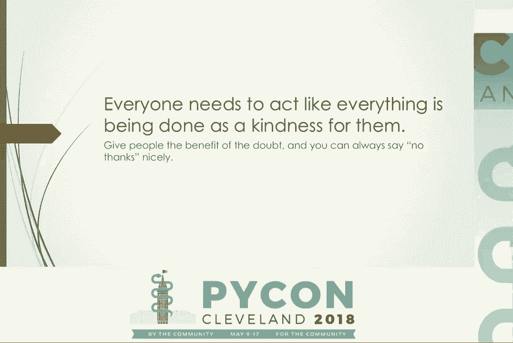

 So basically， how should we act towards each other？ When we view everything as kindness， well。 we should be open to people doing kindnesses for us， right？ Like， I should be open to all of you。

 doing a kindness for the projects of Python and send his feedback and send his pull requests and。 et cetera。 We then ask that you be considerate about the response that we give to your kindness。

 So if you send us a pull request， just understand what I have to say now。 And then just being。 respectful about that response， right？ Like being totally okay that I had to say now。 Now。

 shock of shocks。 This is the PSF code of conduct， right？ Being open， being considerate and。 be respectful。 Or it's kind of a three-way handshake of kindness。 Basically， you're going to me and。

 saying， hey， here's the pull request。 Thank you very much。 Okay， great。 I know that seems。 shockingly difficult sometimes。 But that's all it takes for this whole endeavor of open source。

 to function reasonably。 Literally， no， it's just a nice thing I'm trying to do。 Here you go。 Okay。 thank you。 I appreciate what you did。 Okay， if it doesn't work， that's not a problem。

 And every step of there， things can fall apart， right？ You can say， here's something to fix your。 broken pile of whatever。 Or here's this thing I'm trying to help you with。 I'm like。

 this is garbage。 Right？ Or here's this nice thing。 Okay， great。 Thanks。 I'm sorry。 I can't accept it。 This is， going to break away too much code。 I'll screw you then。 All right。

 There's so many ways this thing， can break down because there's three steps。 I'm not kidding。 This is a three-way handshake just like， TCP。 And the connection gets dropped in kindness if you don't keep it going the whole time。

 And， it's very easy。 And as I said， I understand we all have bad days。 But it's also not hard to step， away from the email and the GitHub issue tracker for an hour before you can't have a cool head。

 and deal with your bad day。 We all have them。 I've had them。 We just only need to keep working to。 be better at it。 So how can we try to communicate better online in general？ Right？ So one thing。

 assume you're asking me a favor。 I know I'm talking about kindness this。 here and you're not specifically asking me a favor。 But it's a good way to frame it， right？ Like。

 if you came up to me at PyCon and said， "Hey， Brett， can you look at this PR and review it for me？

 Are， you going to come up， review my PR， darn it， and do it now？" No， right？

 Because you know I'm going to go， hell no， go away。 Leave me alone。 I'm talking better people right now who are nicer to me， right？

 I don't want to be put in that position。 And you wouldn't do that， right？ You come up and， say。 "Hey， can I talk to you real quick？ I have this PR。 I'd love to get reviewed。 Do you think you'll。

 have a chance during the sprints to review it？" I'll go， "Yeah， send me the number。 I'll try to have a， look。" Once again， not complicated。 It's just something we need to do。 Now。

 another way to phrase， things， assume your boss is going to read it。 By the way。 I do pay attention to who works at one company， and I have a pretty good memory， so I won't forget。

 So do try to represent your company's well online。 And hopefully you care about your jobs such that if you care how your boss is going to read something。

 that you'll put a little effort into seeing how it is phrased。 Now。 if you don't care about your boss， hopefully you care about your family。

 And so you'll care about what they think about how you wrote something。 So hopefully across those three， somewhere along there， it's going to cause you to stop。

 and think about how you phrase something。 Because really。 it's okay to take some time to phrase that， email appropriately the first time。 You can wait。

 You can proofread。 Just take the time and just think， about like， "All right， in my phrase this way。 I think this person would actually be willing to do， a favor for me。 Would this piss off my boss？

 It would my parents approve of the way I'm communicating。
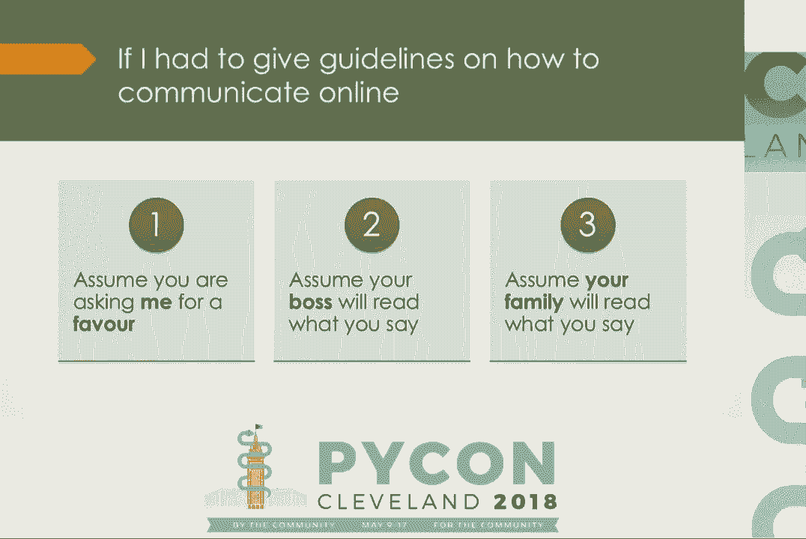

 online with others。" So basically， all this up， please try to pay for open source with kindness。 right？ Because if we don't， those of us who participate start to regret it， and at least a burnout。

 And that's not a good position to put ourselves in。 And we really just don't want to end up in that。 place where I had to be put in a position where my wife has to start asking me， "Can you spend less。

 time on open source？ I don't like how it's making you as a person。" And I think that's the last place any， of us want to be。

 And I think we all want to take this grand experiment of open source and continue to。 see it move forward。 And the other thing is， I can only imagine what this is like in other communities。

 We have an absolutely amazing community that is known to be extremely welcoming and kind。 And even。 and I have a hard time sometimes with the way I can be treated， I can only imagine what it is like。

 in any other community on the planet。 And people I've talked to you about this talk have all said。 "Oh yeah， it's so hard to rest。" So I really feel for people who are not lucky enough to be in this。

 community。 But the key point is， if I'm having a time in this awesome， amazing community。 I'm really worried how this is going for the rest of the open source community as a whole。

 So I'm hoping all of you can at least take some time。 Next time you need to provide feedback。 write that blog post， write that tweet， send that PR， or if you're a maintainer。

 when you review that， PR and have to make the tough decision to say no or what have you。 just take the time to stop and， realize we're all just trying to be kind to each other and we're all just trying to make this work。

 Thank you。 [ Applause ]， Thank you so much， Brett。 Another quick round of applause for Brett。 [ Applause ]， I got a little distracted by a tractor before Brett's keynote。

 but I do want to remind you of our， code of conduct here at PyCon。 And if anything occurs， that is。 oh， there it is。 Here's the contact， information， if anything occurs。

 that is in the breach of that code of conduct。 If you need to， find someone。 they were wearing a shirt that looks like that。 And a few announcements for the day。

 From now until 1-10 p。m。 the Job Fair poster session and then lunch starting around noon will be in。 the Expo Hall where the booths were yesterday。 So please go see all the posters， meet with the。

 presenters， and perhaps peruse the Job Fair and meet with our sponsors that are hiring。 At 1-10 p。m。 talks， the last three slots of talks will commence， and then the open spaces will be。

 open all day today， except for room 10， which will be used for the Mother's Day Call Room。 We'll see， you back here at 3-10 p。m。 Eastern Time for the PSF Community Report and the closing keynote。

 So have a wonderful third day of talks at PyCon。 [ Applause ]， [BLANK_AUDIO]。
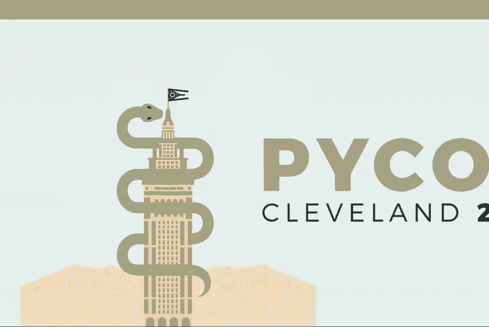