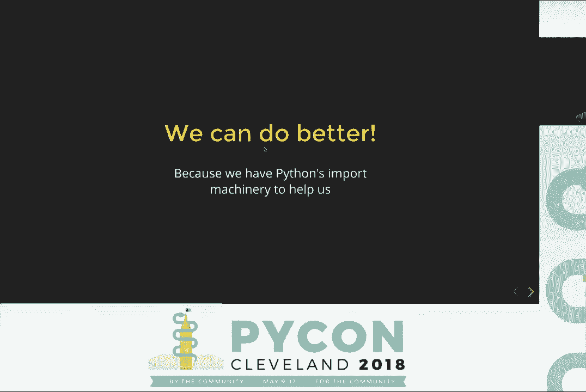
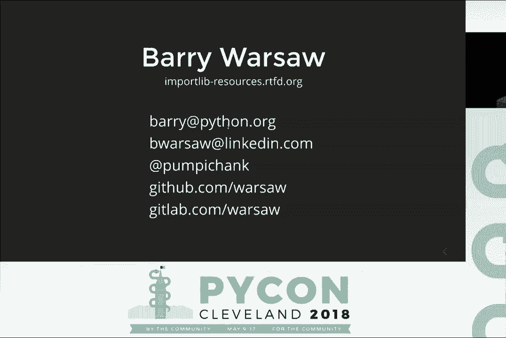

# PyCon 2018（合集） - P4：Barry_Warsaw_-_Get_your_resources_faster_with_importlibresources_-_PyCon_2018 - 哒哒哒儿尔 - BV1Ms411H7Hn

 >> All right。 If you're going to go ahead and get started， this is Barry Warsaw。 Let's。

 give him a round of applause。

 >> Microphone。 Hey， check one two。 Is it working？ Okay， great。 Awesome。 >> Okay。 So， yeah。

 Barry Warsaw， I work at LinkedIn on the Python Foundation team。

 You certainly are welcome to come up to me and talk about how we use Python at LinkedIn。 So。

 I'm going to talk today about this new library that's in Python 3。7。 This is kind。

 of my catch phrase。 It's not completely accurate， but I couldn't come up with anything better。 So。

 that's what you get。 So， here's the problem， right？ You have your code and you have your。

 code and you have some static files in the code。 And you want to be able to read them， at runtime。

 The question is， how hard can it really be to do that， right？ Yeah， it's easy。 So。

 just a couple of examples。 I'm sure you can come up with your own。 You might have templates。

 a big wall of text that has some placeholders。 And at runtime， you'd like to be able to read。

 that template， fill in those placeholders and use that to generate an email or other files。

 Sample data for tests， either a data that you're reading in and using in your test or。

 comparing against the results of your tests。 You may have， for example， some certificates。

 to connect to a self-signed certificate to connect to an HTTPS server or something like， that。

 Internationalization， there's these get text translation catalogs where you are translating。

 from the English source to Italian or Spanish or whatever it might be。 So， these are all。

 types of static files that you want to ship with your library or your application and。

 be able to read those at runtime。 So， here's， for example， what a file system， very simple。

 file system layout might look like。 You've got your package called the package。 And it's。

 a package because it's got a dunder and it。py file in there。 And it might have a couple of。

 other source code files in there and another directory。 And inside that directory， there's。

 some sample data that you want to read at runtime。 So， if we look at sort of a naive。

 approach to this， and you see this in a lot of code， you import the package and then you。

 use the packages dunder file attribute which actually points to the dunder and it。py file。 So。

 you want to get to the parent so you can get to the directory and then you want to traverse。

 down to wherever the sample data is。 You open it in binary mode。 You read the bytes out， of it。

 And you've got your sample data。 So， we're done。 So， I think I've got like probably。

 20 minutes for questions。 Well， we're obviously not quite done because things get complicated。

 when you take that， those files and you stick them in a zip file or another type of an archive。

 And why is that a problem？ Well， it's a problem because of this little red bit of code。 Dunder。

 file doesn't actually point to a real file system path in this case。 So， when you use。

 this naive approach， you get an exception。 So， now along comes a well known， maybe infamous。

 package called package resources。 And package resources has this thing called the basic resource。

 access API。 And we can use this instead of accessing the dunder file directly to read the。

 sample data。 So， we import this function。 It has this function called resource string。

 It's a little weird because in Python 3 it actually returns bytes。 So， okay， so we'll tell。

 the truth， we'll import it as resource bytes。 We pass in the name of the package that has。

 our sample data and then sort of a path from that directory down to the sample data。 We call。

 the function and it returns us the bytes。 So， the cool thing is that works for both the。

 file system paths and for zip file paths。 So， now we're done。 We have 19 minutes for， questions。

 Of course， there's still a problem。 So， what are some of the problems with package， resource？ Now。

 package resource has been around for a long time。 Comes sort of in setup tools。

 and you see it in tons of things。 The biggest problem with package resources is that it has。

 import time side effects。 So， even if you're never going to access your sample data， you're。

 paying the cost of it because as soon as you import package resources， you pay this penalty。

 Package resource is one of the things it does is it crawls over every entry in your sys path。

 and it builds up these working sets and does all this sort of runtime work。 So， even if。

 you don't need it， you're paying for that。 And if you have a lot of things on your sys， path。

 it can be very， very slow as we at LinkedIn have discovered。

 Package resources is kind of this weird amalgam of functionality。 It does a lot of things。

 It has the resource access API。 It also kind of supports namespace packages pre-pept4 or， 20。

 It handles entry points and just like all this weird stuff that is kind of thrown。

 in there which combined with the backwards compatibility guarantees and sort of the complication。

 of package resources makes it very difficult to fix some of these runtime import time side， effects。

 As I mentioned， it has some funky APIs。 Resource string is resource bytes。 It also。

 has this API to guarantee that it will return you a path on the physical file system。 So。

 if it's in a zip file， it will take that data， the contents of that file， stick it。

 in a temporary file and return you the path to the temporary file。

 But the problem is package resources predates context managers and with statements。 So， you。

 really have no idea when or even if that temporary file is ever going to get cleaned up。 So， it's。

 got some weird APIs。 It's kind of everywhere。 So， you sort of have to pay the penalty even。

 if you're just， you know， you have some dependency that is using package resources。 We'd like。

 to kill off package resources because of this。 And it still supports Python 2 which I。

 think is the number one bug with package resources。 You all agree， right？ Yeah。 Awesome。 Cool。 So。

 if you get nothing else out of this talk， I hope you at least start to realize that you'd。

 like to replace your uses of the dunder file directly or package resources with our new， thing。

 And we can do better。 So， we can do better because we have Python's awesome optimized。

 import system to help us。 And so， we've built this new library on top of Python's import。

 system and it's highly optimized for finding modules and packages and so we're going to。

 build on top of that。 So， import lib resources。 This is how the same call would look in import。

 lib resources。 So， there's a function called read binary。 It does exactly that。 You give。

 it the name of the package that has your sample data and the name of the resource inside that。

 package and read binary returns you the bytes。 The kind of the other way you can do it is you。

 can actually import the package and you can pass that as the first argument。 You'll see。

 this is a very common pattern。 We either accept the module object or the package object as。

 the first argument or the string naming the package。 And obviously， because we're using。

 Python's import system， if it hasn't been imported yet， import lib resources will import。

 the package。 Now， if you've kind of been paying attention， you'll notice there's an important。

 difference here。 In the original example， if you notice the data directory is not a Python。

 package because it doesn't have a dunder init。py file in it。 And that's one explicit difference。

 between package resources and import lib resources。 We require that the resources live inside。

 a Python package。 So， it's a pretty easy fix。 You just stick an empty dunder init。py file。

 in there and it should all work。 So， I'm going to take a quick detour and talk about exactly。

 what a resource is and what a package is in our terminology here。 So， a package is any。

 importable module with a dunder path attribute。 So， how many people know what the difference。

 between a module and a package is in Python？ Of course， red does。 And a package is a package。

 is have a dunder path attribute。 That's really the only difference between a module and a。

 package as far as the object goes。 So， one way to think of it， although you shouldn't get。

 caught up in this， this is sort of the mental model of it， a package is essentially a directory。

 containing a dunder init。py file。 Now， of course， it doesn't have to be a physical directory。

 on the file system。 That's kind of the whole point of this。 But your mental model can sort。

 of think about it like that。 So， what's a resource？ That's just any readable object contained。

 inside a package。 Such as a file， right？ But again， it doesn't have to be a physical file。

 You can think of it this way as files inside of directories， but they can live sort of。

 anywhere that Python's import system can reach。 An important distinction here is that sub。

 directories and sub packages are not resources。 That's a deliberate choice。 Also， namespace。

 packages， sort of the pet 420 namespace packages cannot contain resources。 They don't actually。

 have a physical location anywhere。 So， there's no place to put things。 So， that's the terminology。

 So if we look at our example again， we can see that the package in this case has three， resources。

 It has three dunder init。py files。 And the sub package， the package。data， has， two resources。

 Dunder init。py and the sample data。 Right？ So， it all makes sense。 It's all， pretty clear。 So。

 now that we sort of understand how this all works and we've seen a little， example of it。

 we're going to now look at the API that you have available to you。 We love。

 type annotations because it's Python 3。 So， the API defines two types。 Obviously， package。

 and resource。 So， you can see here where the union of the stirrer or the module type gives。

 you that API where the first argument can either be the name of the package or can be。

 the actual module object that you've imported。 And similarly， with a resource， any place that。

 accepts a resource type， accepts a string or sort of this new Python 3。0s path like thing。 Okay。

 so now we're going to dive in a little bit into the API and look at the details of， that。 So。

 one of the first things you want to do is just get the contents of a resource。

 You've got your sample data file over there and you want to just read everything out of， it。

 The first way you've already seen is read binary。 It takes a package and a resource。

 and it returns you the bytes。 So， it reads everything out of it and returns you the entire。

 contents。 The important distinction here and this was also a deliberate API choice is that。

 that is only for bytes and there's a separate API for text。 Again， package and resource are。

 the first two arguments but you see sort of the expected encoding， obviously UTF-8 by default。

 and what you should do with errors。 And that returns a stirrer。 So， in our API， we have。

 a distinction between binary and text because we didn't want to do anything weird like， oh。

 if the encoding is none， we're going to return the bytes like that。 We want to be。

 explicit about this。 So， the second kind of thing that you might want to do is say， I。

 don't want to read all the contents of it。 I want to get sort of a file handle， that file。

 handle like thing that I can stream the bytes out of or the text out of and that's the second。

 set of API。 It looks a lot like， it's going to look a lot like the built-in open， open， binary。

 This is sort of the type annotation way of describing what gets returned but you。

 pass in a package and a resource and it returns you a object that you can use in a with statement。

 Right？ So， just like built-in open， you use with open binary， you read as many bytes out。

 of it as you want and then as soon as the with statement or the context manager exits。

 it closes that file handler。 Obviously， what's next？ Open text。 Same kind of thing。 This returns。

 text。 All makes sense， right？ Now， as I mentioned， package resources provides this really useful。

 API for guaranteeing that it's going to return you the path to a concrete to a file on the。

 concrete file system。 So， if you're in a zip file， let's say your resource is in a zip file。

 and you really need the file system path， you're going to use this API。 And you may find this， for。

 for example， getting a 。so file where dlopen will only import from a physical file， system path。

 It can't import from a zip file or there may be some certificates and things。

 like that that often other APIs that require a physical file system path。 And so， this is。

 what it looks like。 You pass in the package and the resource and it returns you this weird。

 iterator over a path thing。 That's really just sort of the type annotation for saying。

 you can pass whatever path returns to a context manager or it is a context manager。 So， you。

 can pass it to a with statement。 And that's how it would look。 So， unlike package resources。

 you now have a guarantee for when that temporary file， if it needs to create a temporary file。

 how when that temporary file will get deleted as soon as the with statement exits， right？

 This makes sense， yes？ So， modern APIs give you all these guarantees that you really want。

 Now you want to sort of say， "Hey， I've got this package over here and I'd like to see。

 what's inside of it。" Kind of think of it like as an OS lister of the package。 The。

 API for that is content。 And all you obviously， all you have to pass in is the package and。

 it returns you a list of strings。 Now， you'll notice that it doesn't return a list of resources。

 and that's again a deliberate choice because here's an example in the interactive interpreter。

 where you're getting all the contents of the package。data。 And you'll notice because。

 it got imported， there's a dunder pi cache directory， right？ That's why you get a list。

 of strings because the items that contents returns are not guaranteed to be resources。

 It's just sort of like an OS lister。 You get everything that's in there。 So now you're。

 asking the question， "Well， if all I want are the resources， like I'm using this in。

 my plugin system， how do I know which ones are resources and which ones are not resources？"。

 We have an answer for that。 And that is this function call， is resource。 So you can use， this。

 you can use is resource along with contents to iterate over all the resources in， a package。

 So in this case， if you passed in under pi cache to this call， you'd get false。

 and everything else would return true。 Unlike package resources。

 we actually provide an API for loaders。 How many people know what。

 loaders are in Python's import system？ Okay。 So the way Python kind of， especially Python， 3。

 for example， the way it actually ends up importing a module or a package is that there。

 are things called finders and there are things called loaders。 So when you say something like。

 import the package。data， the first thing that happens is Python's import system tries to。

 find a finder that knows where that package lives。 Okay？ And it can live on the file system。

 in a zip file。 It can live on the network。 It can live in a database。 As long as you have。

 a finder that can find the package or the module， Python's import system can usually， load it。

 But the thing that actually loads the thing that loads the package or the module， is a loader。

 And so what we've done is we've said we can let any loader， even custom loaders。

 play along with this whole higher level API。 So now we're not limited to just zip files。

 and file system pads。 Any loader can optionally import this thing， this function called get。

 resource reader。 If it exists， it gets past the package name and it returns an implementation。

 of an ABC。 So an ABC is an abstract base class。 So you don't have to derive from this。 You。

 just have to implement the functions in this ABC。 And now your custom loader that loads。

 from a SQLite database or whatever it happens to be can play along just fine and the higher。

 level API works as expected。 I'm not going to go into a lot of detail because most people。

 don't have to actually implement loaders。 This is all documented in the Python documentation。

 Python 3。7 documentation。 So if you are implementing a loader and you want to play along。

 just check， out the documentation。 But I'll give you a quick flavor for what this looks like。 This。

 is the low level API。 So import live resources is the high level API that consumers are going。

 to use。 And anybody who implements a loader would implement this lower level API。 So it's。

 things like open the resource， get something you can read stuff out of。 Resource path。 I'll。

 talk about that in a little bit more detail in a moment。 That returns the string which。

 points to the file is resource。 Obviously that maps almost directly to is resource in。

 the higher level API。 And contents also maps to the higher level API pretty directly。 The。

 kind of the weird one is resource path。 So with all these API's， the low level API's。

 they are expected to raise a file not found error when the resource doesn't exist。 So， for example。

 if you say open resource， foo and foo is not a resource in the pack in that， the loader knows about。

 it's expected to raise a file not found error。 And similarly， resource。

 path requires a concrete file system path。 So if， so if you think about the implementation。

 when you say I want the path to a resource in a package that's in a zip file， what will。

 happen is that import live resources will call resource path on the loader。 And that will。

 raise a file not found error because it's not in a physical file system location。 It's。

 in the zip file。 And then import live resources will say， okay， I know what that means。 I have。

 to create a temporary file and I have to read the resource all the bytes out of it。 And I。

 have to stick those bytes in the temporary file。 And now I have to return you the path。

 to the temporary file。 And it does that by because the low level API raises the file not。

 found error。 And again， just like with the high level API， contents can return non-resources。

 So just a quick word about kind of why we did this。 So we've got， at LinkedIn we use a ton。

 of Python everywhere because we love Python。 But we use it a lot in our command line tools。 Right？

 So just the nice little tools that people write to do a particular task from the， command line。

 And we notice that in many cases you say food dash dash help， it takes multiple， seconds。

 like way faster than it should take。 And so if you're not familiar with Python， 3。7。

 it has a very nice way of getting a listing of the time to import the cost to import all。

 your packages and your modules。 And so we did some analysis and package resource was very。

 high up there。 We also use PEX， which is a zip file， a single file， executable format。

 PEX has been around for a long time。 But because it's been around for a long time， it uses。

 package resources。 And it also doesn't kind of set up sys path in the most optimal way。

 So Lauren Kavalo， one of our awesome devs at LinkedIn， wrote this thing called shiv， which。

 is a modern replacement for PEX。 And it uses import library resources。 And it was just recently。

 open source。 So I highly recommend if you're using PEX now to give shiv a look。 Shiv only。

 works with Python 3。6。 So yay for modern stuff。 It's all open source。 Please play with it。

 So between the two， right between shiv and the use of import library resources， we've。

 seen 25 to 50% improvement in just like the responsiveness of dash dash help。 So that's。

 really awesome。 Most importantly， we've taken the entire API and we've backported it for。

 implement lib dot resources， which is only available in Python 3。7。 We've backported， it to 2。

7 and 3。4 to 3。6。 It does work in 3。7， but it's a very thin shim layer over the， standard library。

 But what this means is that you don't have to wait for 3。7 to stay。

 and start getting great performance because you can get rid of package resources。 You。

 don't have to use that anymore for most for many use cases。 And you can just adopt import。

 lib resources。 It's all pure Python。 I don't think there are even any dependencies at， runtime。

 And it will just work。 So you can start converting your code over to using the， more efficient。

 Now one thing to keep in mind is that for 2。7 because Python's import system。

 doesn't have these finders and loaders in Python 2， that lower level API doesn't work。

 but for Python 3 it does。 So no discussion about Python's import system would be complete。

 without giving massive props to Brett Cannon。 Right？ Yay。 [Applause]。

 So for those of you who don't know this， Brett essentially rewrote Python's import system。

 in pure Python， which none of this would be possible without that。 And it's really a great。

 improvement in Python 3， one of the many， many， many great improvements in Python 3。 In addition。

 to that， LinkedIn is owned by Microsoft， so we work together。 We have weekly meetings。

 with our Microsoft Python partners。 And Brett and I work together on import lib resources。

 So really， I'm up here getting all the credit， but we have to definitely give it up for Brett。

 for co-writing this and working out the API and everything。 And I expect this will be。

 one of many great collaborations between our corporate entities。 That's kind of it。 I don't。

 know how much time there is left， but I'm happy to take questions。 This is how to get in touch。

 with me。 That's the Read the Docs link。 And you can get to everything from the Read the， Docs link。

 including the Python 3。7 documentation， which has most of the details。 And on Read， the Docs。

 you can get there from there to everything。 Yeah， so that's it。 And I'm happy， to take questions。

 I can't really see anybody。 Does import lib resources support locations， in FHS compliant places。

 so outside of the package space？ No， they have to be in the， I， mean， it all。

 it works by importing the package。 So wherever the package is， if it's on。

 sys path and Python can import it， it can get resources out of there。 So it kind of doesn't。

 really matter， you know， where they are。 You can set Python， your Python path environment。

 variable and point to some crazy location。 And as long as the Python can import it， it。

 can get the resources out of there。 And it's not planned to add that。 I'm sorry？ Is it。

 planned to add that support？ No， no。 It works off a sys path。 Whatever's on sys path。

 >> So I was thinking about a resource path for a minute and I'm wondering how to deal with。

 the pickles you could get in with that on say if you're running on a read-only file system。

 or if you're running in a situation where you need to make sure someone doesn't say try。

 and race in per day file or something else where it would want to be unpacking one of。

 those resources that needs a concrete path。 >> Yeah。 So it just uses Python's temp file， library。

 So， you know， that supports setting the temp and the various environment variables。

 if you need to point it to a particular place。 If you really have no place with which to unpack。

 a temp file， then well， yeah， it probably won't work。 You'll probably get an exception。

 >> Thank you。 >> Hey， Barry。 Thanks for the talk。 You mentioned earlier on that there。

 was sort of 25 to 50% speed up in some CLIs。 I was wondering if you experimented that with。

 a mercurially and seen if you could make the CLI a bit more competitive with Git？ >> No， I haven't。

 And I personally won't。 I'm certainly happy to help the mercurial folks。

 or anybody else look at that。 I don't really have a good sense。 I don't know if Lauren。

 does about how much is because of important resources and how much is because of SHIV。

 But just getting rid of package resources alone lets you then concentrate on all your， other。

 you know， import time costs， right？ Because you'll see， if you use Python 3。7。

 you'll see package resources like right up at the top there depending on how your sys。

 path is set up。 And so just getting rid of that。 And also getting rid of your dunder。

 file usage because that also is really terrible。 >> Thank you。 Sure。 >> All right。

 Let's give Barry one last round of applause。 [ Applause ]， >> Yay。 [ Applause ]。

 [buzzing]。