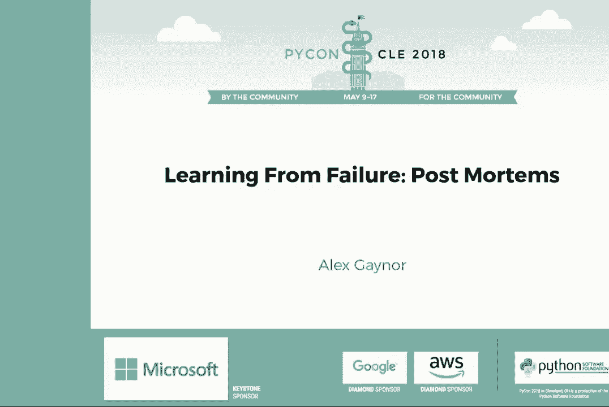
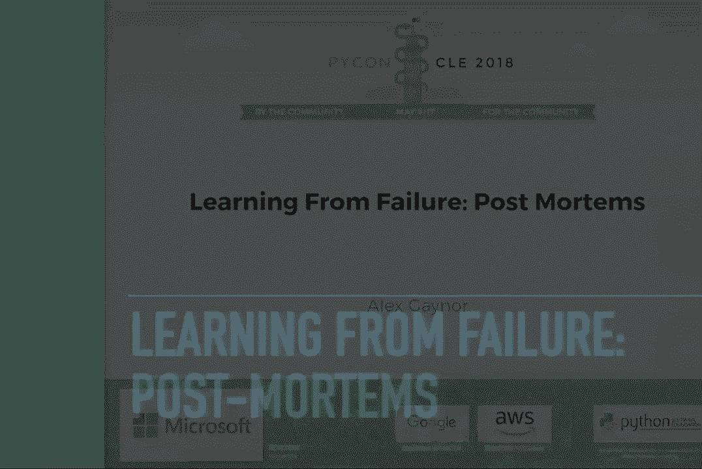
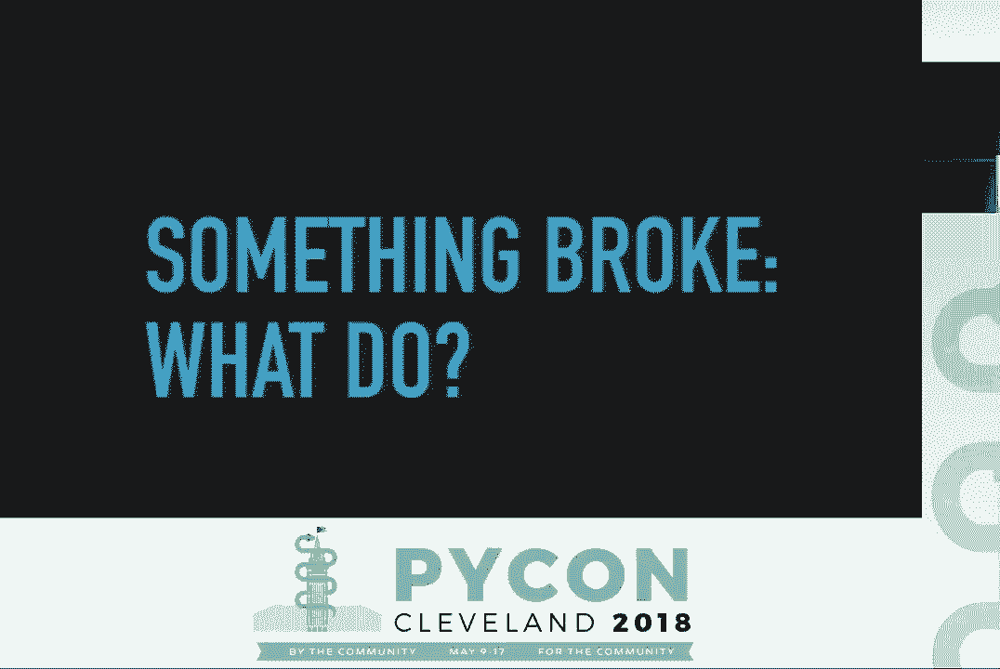
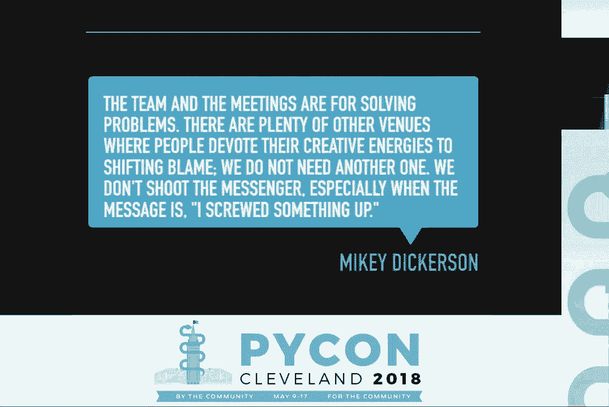
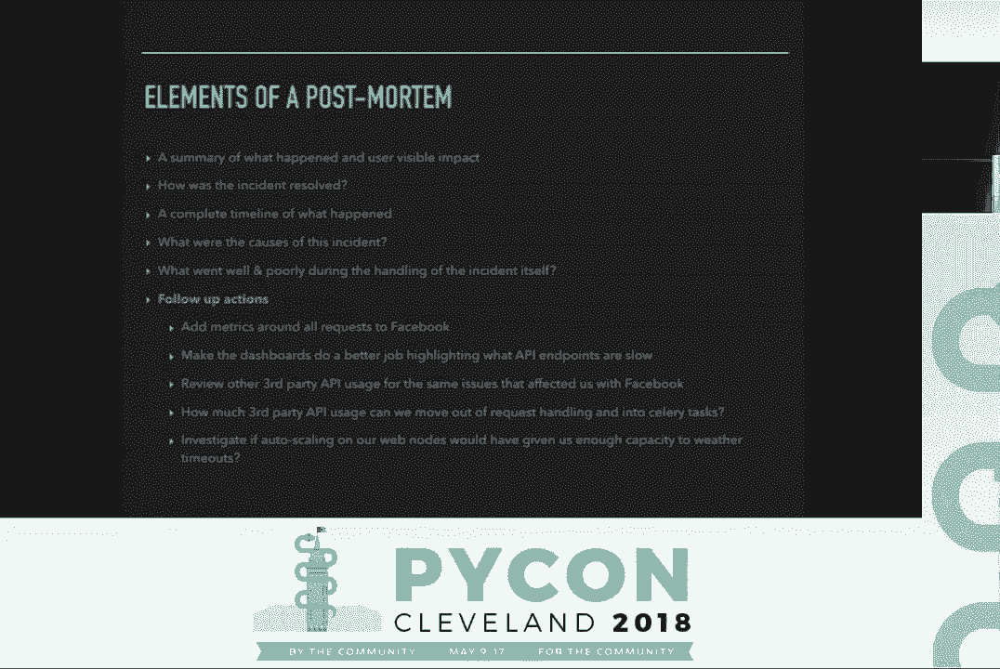
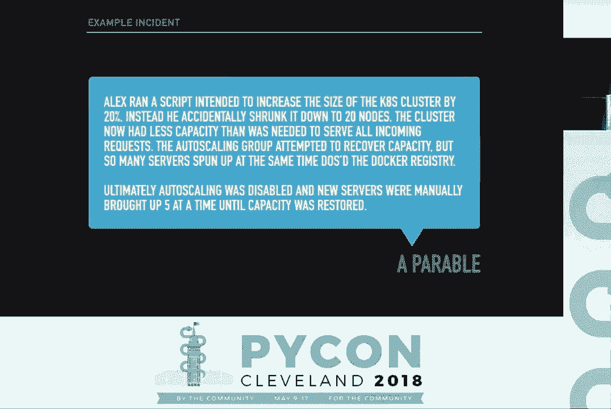
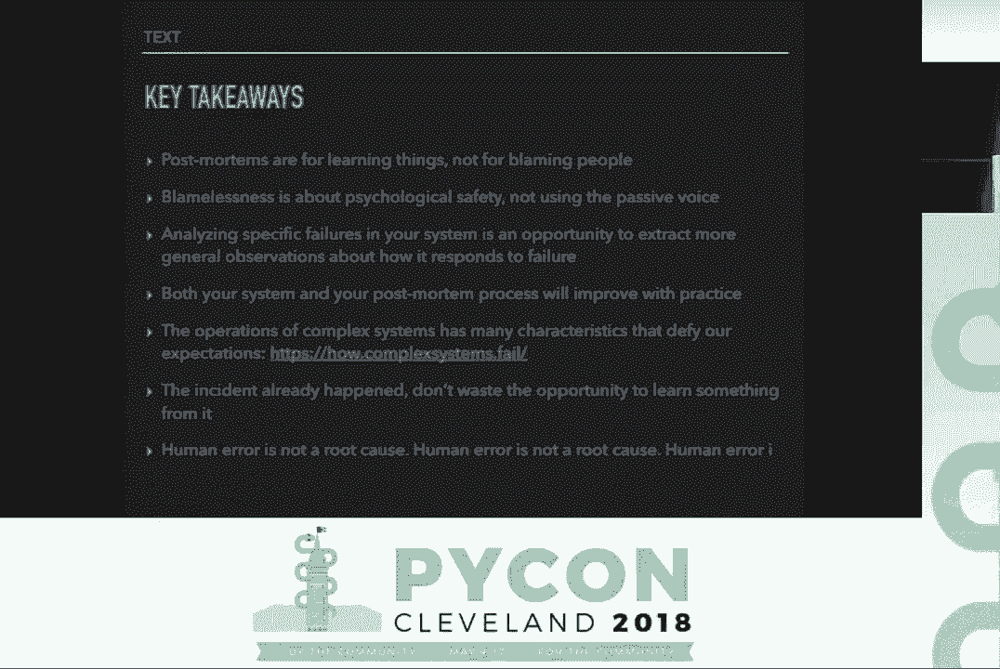
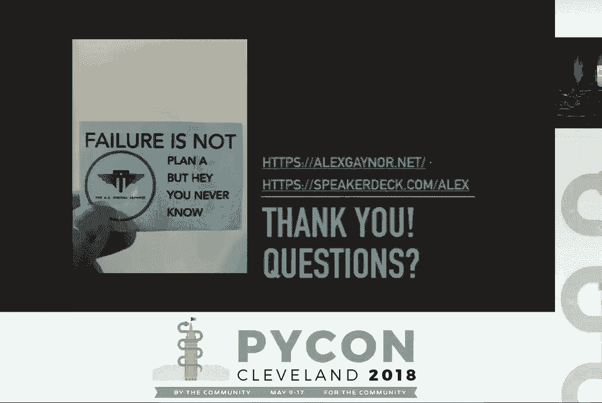

# PyCon 2018（合集） - P7：Alex Gaynor - Learning From Failure Post Mortems - PyCon 2018 - 哒哒哒儿尔 - BV1Ms411H7Hn

 >> Good afternoon everyone。 Welcome back to our second to last session here。

 Our next speaker does not need any introduction， so I won't spend any time on introducing Alex here。

 I think most of you know him and he's going to be speaking。

 to us about learning from failure post-mortem。

 Alex Gayner。 [ Applause ]。

 >> Thank you， Ned， and thank you to all of you， for coming out to listen to this talk。

 Like Ned said， I'm Alex， and this talk is going to be about。

 learning from failure with post-mortems。 We're going to be talking about how to introduce post-mortems。

 to your development process in order to get the most， from the failures that inevitably happen。

 Bugs are a part of life for software developers。 And unless you make space shuttles or pacemakers。

 you're probably okay with that。 You've accepted into your heart that there's something。

 that will happen from time to time。 In my experience， customers are never super happy， about bugs。

 but today we're going to focus， on a specific subset of them。 Operational bugs。

 What's an operational failure？ Downtime for your website。 A data breach。

 Something went wrong in the production environment。

 A quick test is that if it's something you'd measure， in an SLA， it's an operational failure。

 We're going to focus on how you can learn， from your operational failures。

 Some of these practices are probably applicable， to other situations you want to learn from。

 like an Agile Post-mortem or Agile Sprint retrospective。 But those won't be my focus。

 I'll be using the website went down for most of the examples， here。

 but it's a situation that I think will be accessible， to many folks。

 But don't take that to mean this is the only type， of operational failure。

 Before we dive too far in， you should probably know the， perspective I'm bringing to that。

 I'm currently a security engineer protecting Firefox， at Mozilla。 In previous lifetimes。

 I've worked for startups， and for the US government。 I've developed web applications and compilers。

 and nowadays， a web browser。 I've spent a lot of time in the Python ecosystem from developing。

 popular open source projects to serving on the board， of the Python Software Foundation。

 So something is broken。 What do you do next？ First， stop the bleeding。

 Resolving the immediate presentation of the breakage， is beyond the scope of this talk。

 Hopefully somebody else at PyCon gave a talk on fixing bugs。 If not， you're on your own。

 Once the situation is stabilized， what do you do next？ In my experience。

 there are two possible answers， to this question。 One is how do we make sure this never happens again。

 Two is how do we figure out who needs to be fired？

 The team and the meeting are for solving problems。

 There are plenty of other venues where people devote their， creative energies to shifting blame。

 We do not need another one。 We don't shoot the messenger， especially when the message is。

 I screwed something up。 I think this quote from my former boss， Mikey Dickerson。

 captures the difference between these two perspectives。

 Mikey was one of the first engineers brought into， RescueHealthCare。gov when it failed in 2013。

 If you haven't heard that story， you should find， someone to tell it to you。 It's a great one。 See。

 they had a problem。 The website was down all the time。

 And while some folks were trying to make it work， Congress was holding hearings。

 and whether or not the site， was up or down at any given moment was the lead story on CNN。

 No one wanted to share anything that would point the blame， it themselves or their company。

 even if it would be helpful， in fixing the website。

 If you leave here having learned absolutely nothing else。

 I want you to walk away believing that holding people， accountable， AKA firing them。

 and making systemic improvements， are unrelated problems and maybe even mutually exclusive。

 If you want to learn how to choose who to fire when， something goes wrong。

 you'll need to find a different talk。

 This one is about how we learn from our mistakes。 You may have heard the phrase "blameless postmortem" before。

 This phrase refers to exactly what I was just talking about。

 Postmortems for finding systemic improvements， not for finding out who to blame。

 It's very frequent that in the event something goes wrong。

 we can look for somebody who we could say is responsible， and to blame。

 The person who pushed the code to production， the person who ran the administrative script。

 that went wrong， the person who developed the pull request。

 that introduced the code that went wrong。 I want to take just a minute and give an example。

 of what blamelessness looks like because it is so important， to this process。 Root cause。

 A script was run which deleted half the production cluster。 At first glance， this sounds OK。

 We're not blaming anybody。 The script was run。 It's not important by who。

 If you've ever used Microsoft Word， and had it complained to you about the passive voice。

 this is it。 This is a blameless sentence。 It doesn't blame anyone。

 but it doesn't produce a blameless， culture， which is what we're really after。 Root cause。 I， Alex。

 ran a script which deleted half the production cluster。 This seems worse。

 We're attributing deleting the production cluster， to one person。 Surely that's blaming them。

 A culture of blamelessness is not one where we deny， that specific humans did things。

 but rather one where I can say， I did this and the whole team pushes right past that。

 to look for systemic opportunities for improvement。 It's critical that your team see and understand。

 that blamelessness comes not from emitting someone's name。

 but from a deeply held belief that almost all problems， have systemic solutions and pursuing those。

 is far more important。 Using the passive voice subtly communicates。

 we'd blame someone if we knew who it was。 We're keeping this information secret。

 because deep down we really want someone to blame。 Having a culture where you can say， I did this。

 gives much more opportunity for people to speak freely， to communicate fully about what happened。

 and to understand root causes rather than being distracted， by the nagging question。 Oh。

 was it Mark again？ Did he run the script wrong？ Because that's not what we're after。

 I've used the phrase systemic problem， or systemic solution several times now。

 If you're all permitted to a philosophy， I want to dive into what those mean。

 An operational failure happened。 The website went down。 And then someone fixed the bug， redeployed。

 and now the website is up。 There was a failure， and now it's resolved， what more needs doing。

 The ironclad belief I bring to this process， is that the operational failure that happened。

 gave us one example presentation of an issue。 But it's one of a dozen ways some underlying failure。

 could have presented。 The job of the postmortem is to find the other 11。

 see how we can fix them all at once， and to discover what other challenges。

 exacerbated the severity of these bugs。 You've probably heard the phrase root cause analysis before。

 In general， it's philosophically well-aligned， with what I'm talking about。

 There's one important correction， though。 Root causes， plural。

 I wish I had the time to fully explore this material， but I want everyone to jot down the URL， how。

complexsystems。fail， or you can find it in the slides， online after the talk。

 This page summarizes some research done by Dr。 Richard， Cook。

 He's a medical doctor who researches failure modes， of complex systems， whether they're。

 the electrical grid， hospitals， or production， distributed system。

 If you've got a handful of web servers， a load balancer， a network file system， a database。

 and a monitoring tool， you've got a complex system。 One of the major observations of Dr。

 Cook's research， is that for complex systems， they already， do a lot of work to handle failures。

 Every accept， try， or finally， or with block， you put in your Python code is trying to handle some sort。

 of failure。 As a result， any operational failure， will have multiple contributing factors。

 Because of this， it's likely that whatever， changed to initiate the operational failure。

 merely triggered a set of preexisting latent bugs that， just weren't apparent before。

 It's critical that we regard the latent bugs， as being as much a part of the cause of the instant。

 as the proximate changes which made them active。 It's also important that we consider things that may not。

 be bugs， but which nevertheless are contributing factors， to our instant or its severity。

 Now go forth and read the rest of this website。 Ideally after I'm done talking。

 but it's pretty good stuff。 I'll be understanding。

 So I've given an underlying philosophical rationale， for post-mortems。 I told you I have to have。

 You have to have one。 What the heck is a post-mortem？ A post-mortem is a process， usually。

 in the form of a meeting in a written document， whose goal。

 is to take our single specific operational failure， and turn it into learning。

 Learning in the form of improvements to our code， improvements to our documentation。

 improvements to our processes， improvements， to the weird script on David and Sarah's laptops。

 that accidentally became critical production infrastructure。 Learning in the form of a document。

 the people who joined the company in six months， can read to understand what happened。

 And most importantly， learning in the form， of turning this specific instant into observations。

 about a more general pattern。 Post-mortems are put together by the team。

 responsible for operations and for implementing the lessons， learned。

 If you're assaging into servers to fix things， you're in the post-mortem process。

 If you're going to be responsible for redoing the chef， cookbooks。

 you're in the post-mortem process。 If you write code for the application that。

 was part of what was affected， you're， in the post-mortem process。

 Post-mortems aren't something somebody puts together， about someone else。

 They're done by and for the people doing the work。

 The format I've seen work well is a few days after the incident。 Everyone involved meets together。

 shares their notes， and produces the document together。 We've got our team in a room。

 We're sitting down to write the post-mortem for an instant， that just happened。

 What do we need to make sure is in this document？ I'm going to run through the elements of a post-mortem。

 with examples。 This isn't a hard and fast set of rules， but these are the elements I've seen。

 as being necessary to get the important lessons in which， seem to match up with what friends。

 at other companies use。 I personally find it helpful to create a template。

 with each one of these fields。 And when I say a template， I mean a markdown file。

 with a few pre-filled in headers。 Nothing fancy。 It's useful for your post-mortems to all have the same format。

 as each other。 This makes it easy to notice trends between them。 Oh。

 I've seen that root cause three or four times， across multiple post-mortems。 That said。

 practicality beats purity。 If one of your incidents is significantly different， from another。

 don't shoehorn it into a template， that doesn't make sense。

 A summary of what happened and user visible impact。 The website was down for 17 minutes。

 and there were elevated exception rates for another 24 minutes。 Right from the top。

 you want to have a crisp description， of what the failure was。

 What was the visible impact of everything that was going on？

 What user visible impact mean varies by what your system is。

 If you have a fancy microservices architecture， and your services consumers or people's ETL jobs。

 they are your users， and you care about downtime， or other impact as they perceive it。

 Not necessarily how your end customers perceive it。 How was the incident resolved？

 I added a timeout to the HTTP requests， our app makes to Facebook and redeploy the application。

 You did something in the moment to make the bleeding stop。 What was it？

 A complete timeline of what happened。 909， monitoring indicates the website is 503。 Alex Page， 912。

 Alex acts the page， 914， Alex restarts Nginx， incident is not resolved。 921。

 Julie comments on Slack that before the incident， started。

 the API endpoints which communicate with Facebook， were showing increased latency， et cetera。

 et cetera。 This is one of the most important pieces。 Document everything that was going on。

 and everything each person was doing。 This is essential for evaluating how well your instance。

 response process worked， how well your monitoring worked。

 and for understanding deeply how the incident played out。 Write as much as you can。

 There's no such thing as too much information。 At this point， we have the facts of the incident。

 What happened， what everyone was doing， how it was ultimately resolved。 Thus far。

 everything we've written down， is more or less objective information。

 about what was going on in the world。 Next， we have to focus on the analysis， which brings。

 into subjective elements into this。 First， what were the causes of the incident？ In this case。

 Facebook started responding to requests slowly。 We had no timeouts on requests to Facebook。

 and we make blocking requests to Facebook， during the HTTP request to our API。

 Our process for request web server， made it easy for a small number of slow requests。

 to denial of service us。 One thing you might notice is， without any one of these， components。

 this incident wouldn't have happened。 So each one of these is a potential contributing cause。

 to our incident。 This is the section where we really analyze the causes。

 This is where all the stuff I talked about at the top， about multiple causes， comes into play。

 In this particular incident， the proximate cause， Facebook started responding to requests slowly。

 was completely outside of our control。 But there's still a lot of work we can do on our side。

 to make ourselves more resilient to when Facebook gets， slow next time。 Dig deep here。

 List every possible cause。 You can decide it's not something。

 you're going to pursue fixing later on。 Take a lesson from my experience， though。

 If you dig all the way down to， computers were a mistake。 You may have gone too far。

 What went well and what went poorly， during the handling of the incident itself？ Unfortunately。

 our monitoring and graphing， didn't do a good job of highlighting。

 which API endpoints on our systems were slow。 We didn't have any direct monitoring。

 of the latency and error rates of our request to Facebook。

 so we had to know that a particular URL on our site。

 meeting being slow potentially implicated Facebook。 On the good side， once we had a fix developed。

 we were able to deploy it to production very quickly， and the incident was resolved。

 Being good at responding to incidents， when they do occur is a critical element of resiliency。

 So we need to review how things went， during the incident itself beyond just the causes that。

 led to it。 In this case， there are opportunities， to make improvements to our monitoring tools。

 On the plus side of the deployment system， worked flawlessly during the middle of an incident。

 which， is important。 If our deployment systems had gone sideways。

 while we were attempting to resolve an incident， that would exacerbate our problem far more seriously。

 Finally， follow up actions。 Add metrics around all requests to Facebook。

 Make the dashboards do a better job highlighting， what API endpoints are slow。

 Review other third-party API usage， for the same issues that affected us with Facebook。

 How much third-party API usage can we， move out of request handling entirely and into salary tasks？

 We should investigate if auto-scaling on our web nodes， would have given us enough spare capacity。

 to weather the timeouts。 This is where you synthesize the cause of the incidents。

 and the factors from the handling that， exacerbated the severity into follow-up items。

 Expect to file lots of tickets into your bug tracker。

 Then you can use your normal prioritization process。

 to make sure the most important ones get done quickly。

 You should expect to include both short-term follow-up items， things that can be done immediately。

 as well as longer-term follow-up items that might involve。

 serious corrections to your code or much longer timescales， to implement。 In this case。

 we generate action items， to improve our metrics， review our code。

 to see which other third-party integrations， have the possibility to denial of service us。

 consider a longer-term improvement， to move some of these integrations into salary tasks。

 so that they can affect web serving availability， and to investigate what would have happened。

 if we'd had auto-scaling based on slow response time， auto-scaling based on slow request latency。

 As you can see， each of these is inspired， by what we saw as one of the root causes of our incidents。

 Now that we've walked through the elements of a post-mortem。

 I'm going to give all of you some homework。 I'm going to describe an instant。

 and see your thoughts with a few follow-up items I see。 I want everyone here to take this home。

 and think about what else you saw in the situation I describe。 What other systemic opportunities。

 are there for us to improve？ Alex ran a script intended to increase the size。

 of the Kubernetes cluster by 20%。 Instead， he accidentally shrunk it down to 20 nodes。

 The cluster now had less capacity， than was needed to serve all incoming requests。

 The auto-scaling group attempted to recover capacity， but so many servers spun up at the same time。

 denial of service to Docker Registry。 Ultimately， auto-scaling was disabled。

 and new servers were manually brought off five at a time， until we were back to full capacity。

 In total， things were almost totally unavailable， for just over an hour。

 and fully resolving the instant from start to failure， took more than three hours。

 It'd be very easy for us to say， Alex not understanding how to use scale。sh， was the root cause。

 Hopefully by now， I've convinced you that doing so。

 would leave opportunities to make the whole system better on the table。

 to say nothing of blaming one person for what was ultimately a team effort。

 Some things that jump out to me。 There was clearly a user experience issue in scale。sh。

 Both the fact that it's API that I used was confusing。

 and led to misunderstanding what the arguments it took did。

 and also the fact that it would happily delete almost all of the cluster。

 what taking us well below the capacity we needed without any confirmation。

 Auto-scaling was supposed to make us more resilient， by increasing capacity when we needed it。

 Instead， it made this incident worse by putting us into a situation。

 where we had no spinning but unusable。 That deserves serious review。

 What do you see in this incident？ What systemic improvements could we make to handle these six other ways。

 this situation can manifest besides Alex ran the script wrong？

 Maybe Amazon would just delete some of our servers from time to time。

 producing the exact same symptoms。 Do the conclusions we see about how to prevent this incident。

 also work for that situation？ If you were going to be handling this incident。

 what tools would you want to have？ Or what metrics would you want to have？

 It's not you want to add post-mortem to your team's process。 Where do you start？ Well。

 you simply decide to。 However， until the next time things break for real。

 here are a few approaches you can use to get some practice。 First， is simulate an incident。

 In security， we often call this a tabletop exercise。 Come up with an example scenario。

 sit around a table， and talk through how you'd handle it。

 This is an excellent tool for improving your instance response capability。

 But it's not quite as good as finding underlying bugs， although sometimes just thinking。

 "How might this situation fail？" can trigger its own set of improvements。 The Twitter account。

 "Bad Things Daily，"， tweets practice examples of security incidents for you to use for one of these exercises。

 At first， you might think some of these are awfully strange scenarios。

 but pretty quickly you'll realize， "Oh， if we get good at handling something that looks like this。

 that will also make it us good at handling a wide variety of other scenarios。"， Choice number two。

 cause an incident。 Netflix runs something called chaos monkey in their production environment。

 Basically， from time to time， it randomly deletes an EC2 instance in production。

 This ensures that their systems can handle a loss instance without problem， and if they can't。

 it gives them a practice opportunity， to run through their instance response procedures。

 live in production， although perhaps you could start in a development environment。

 If you killed one of your servers， would everything respond flawlessly？

 Have you ever tested that theory？ Finally， you can redefine what an incident is。

 If you're already hitting your SLA of 99% of requests without an error， raise your SLA to 99。

5% with a 500 millisecond 99th percentile response latency target。

 Run a postmortem about the slow request that made you miss the SLA。

 even though the website was available the whole time。

 I've talked about the application of postmortems to computer problems。

 but software engineers didn't invent this idea。 Postmortems have a long history in other industries。

 In the military， they call them hot washes or after action reviews。

 Doctors call them morbidity and mortality conferences。

 and they're a core part of what the National Transportation Safety Board does。

 The NTSB is an independent federal agency with a few hundred employees。

 They're responsible for investigating transportation accidents， be they planes， trains。

 or automobiles。 The mission of the NTSB is， quote。

 "to determine the probable cause of transportation accidents。

 and incidents and to formulate safety recommendations to improve transportation safety。"。

 Tell me that doesn't sound familiar。 The NTSB performs investigations by what they call the party system。

 Basically， in addition to their own team members who work for the NTSB。

 the party will also include people from industry， including people directly from the organizations involved in the accident。

 If the accident was an engine malfunction as an airplane was on final descent。

 they'll probably be somebody from the engine manufacturer， air traffic control。

 and the airline who are a part of their party。 You cannot investigate the causes of an accident without having experts from all the perspectives in the room。

 However， you are not allowed to be a member of an insurance company and be a member of the party。

 Insurance companies are all about allocating blame。

 Probably the most important thing to know about the NTSB is that they are not a law enforcement agency。

 They conduct accident investigations， not criminal investigations。

 This extends beyond merely words in their mission。

 The result of an NTSB investigation and testimony they receive cannot be used as evidence in a court of law。

 Their public safety mission requires this。 The NTSB will turn over the objective technical and scientific data they collect。

 and support law enforcement with analysis of that data。

 But the reports on underlying causes are all privileged from use in court。

 This is an extraordinary status， sort of like attorney-client privilege or spousal privilege。

 and I don't think there can be any more clear evidence that making safety recommendations。

 is a different line of work from finding out who or what is to blame。 Before we wrap up。

 there are a few more pieces of information I want everyone to have。

 that didn't fit cleanly anywhere else in the slides。 First。

 sometimes things break and we don't know why。 That does not mean we can't conduct a post-mortem。

 In fact， it makes the post-mortem all the more important。 At a previous job。

 we once had an incident where the website was brought down。

 because every single one of our mobile apps started phoning home at the exact same time。

 We fixed bugs in the mobile apps exponential back off， we made the API endpoints。

 the mobile phones used more efficient， we made the API handle too much load better。

 We never once found out why all of the phones started making requests at the same time。

 but that didn't stop us from making improvements that would allow us to handle the situation better if it ever occurred。

 If you ever hear someone say the root cause was human error， that should be a giant red flag。

 I once saw an incident where a human copied a value incorrectly from a field in one system to another。

 and it was described as root cause human error。 No discussion of why the system didn't do any data validation。

 No discussion of why humans were involved in manually copying things between two software systems。

 Human error means you could not come up with a single underlying opportunity for a problem to fix。

 And if you're making that claim， you better back it up。

 I've never once seen a postmortem where that was true。

 I once saw a situation where fixing the underlying problems were believed to be too rare。

 and too expensive to be cost effective， but that is a different claim and we damn sure knew what the causes were。

 I've spent the last 20 minutes making a fairly intensive addition to your development process。

 Why bother？ This is a lot of effort。 It's a lot of time to hold these meetings every time something goes wrong。

 It's another set of skills to develop and software engineers already have many skills they need。

 Why bother？ Is it worth it？ If you don't fix classes of bugs at the root。

 you'll end up generating more classes of bugs faster than you can fix individual instances of them。

 As time advances， your product will get less and less reliable as more systemic errors are added。

 Software engineering is a discipline that requires practice to improve at like any other。

 If you don't take the opportunity to learn from your mistakes。

 you are missing out on an awful lot of learning opportunities。 Particularly。

 once you learn to recognize certain classes of underlying errors。

 you can avoid making them right from the start on your next project。

 There are an awful lot of types of bugs that are very cheap to avoid if you know about them at the start and very expensive to fix after the fact once your project is large。

 An ounce of prevention is worth a pound of cure。 Finally。

 fixing bugs systemically is cheaper than fixing them one at a time in the long run。

 Key takeaways I'd like folks to walk out of here with。

 If even if you ignore all of the advice about how to run the meeting。

 what elements need to be in your post mortems， I want you to walk away having learned these things。

 Post mortems are for learning things， not blaming people。

 Blamelessness is about psychological safety， not about using the passive voice。

 When people see you using the passive voice， they assume it means I'd like to blame them if I just knew who they were。

 Analyzing specific failures in your system is an opportunity to extract more general observations about how it responds to failure。

 The trend over the course of many post mortems should be increasingly that your system was able to handle more situations without catastrophic failures。

 Both your system and the post mortem process will improve as you practice them。

 The operations of complex systems has many characteristics that defy our expectations and the how。

complexsystems。fail website details many of them in a way that will hopefully be helpful to you in operating your systems。

 The incident already happened。 Don't waste the opportunity to learn something from it。

 Specific failures are almost always more educational than trying to think hard about what could have happened。

 Finally， human error is not a root cause。

 Thank you very much for spending your Sunday afternoon with me。

 That's my website and the URL the slides will be up on。

 I believe we have about three minutes for questions now。 If anyone has anything they'd like to ask。

 hopefully everybody knows this by now。 But a question is something you don't already know the answer to。

 Mike's are there and maybe there。 [Applause]， >> Thank you so much for the lesson on post mortems。

 I'm sure a lot of us have worked in different dev shops that are very blameful in post mortems。

 Do you have any advice on how to help transition a culture from a blameful mindset to a blameless mindset？

 >> Yeah。 It's definitely hard。 Once people learn the lesson that if I say I did something wrong。

 I'll get blamed for it。 It takes an awful lot of work to undo that lesson。

 I think it's very difficult to undo that lesson without having your team leads or management involved in sort of leading by example。

 Being willing to say I did this and it led to this situation。

 And here's how we're going to focus on the systemic improvement。

 I believe that's one of those things that really has to start with leadership。

 demonstrating it for everyone。 >> You may have mentioned this earlier in your presentation。

 but do you have recommendations from your experience on whether or not it's helpful to you？

 It's helpful or not helpful to have executive representation in a post mortem or explicitly keep it to people who were involved in an incident。

 >> I think it can be helpful to have executives in the room。

 but it's critical that you have the team members who are on the sharp end in the room。 Generally。

 you want executives to see the value of putting the effort into these and to understand why you're asking for resources to prioritize these fixes。

 So if having them in the room helps them understand why you want to put time into these remedial efforts。

 that definitely is valuable。 Cool。 Thank you all very much。

 I hope you all have an excellent pike on。

 [APPLAUSE]。