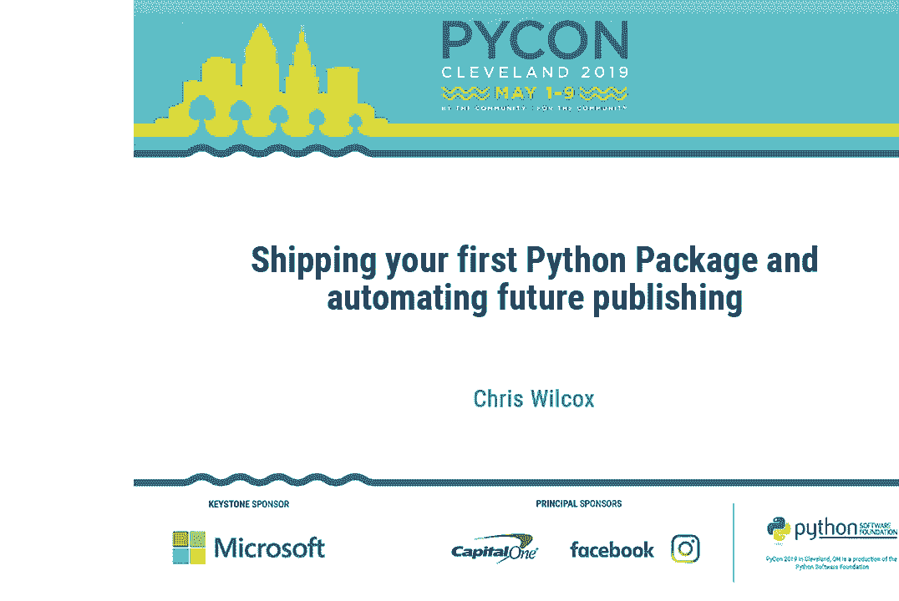
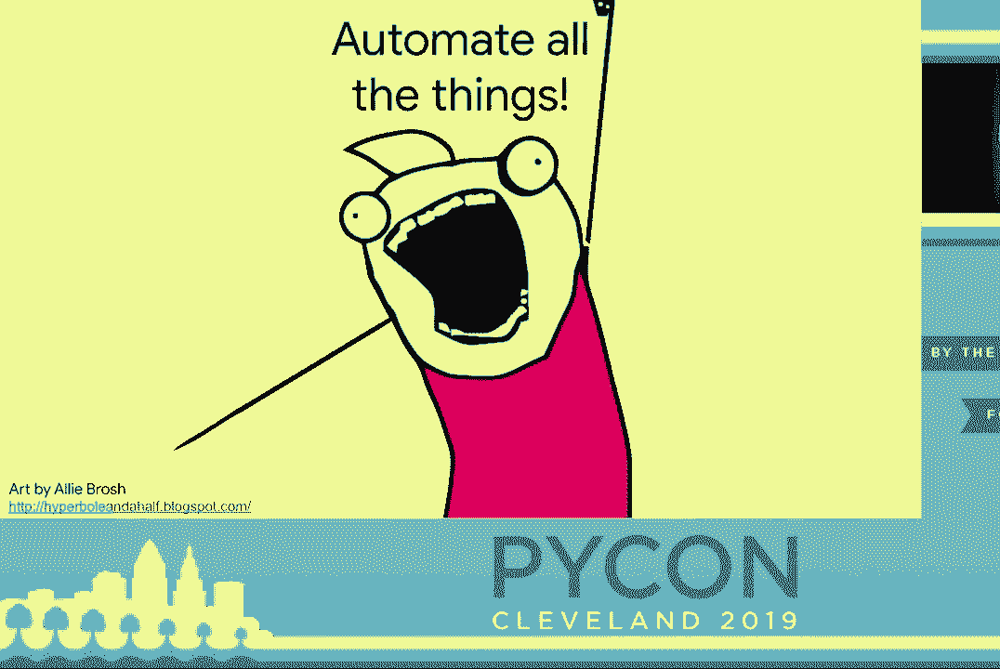
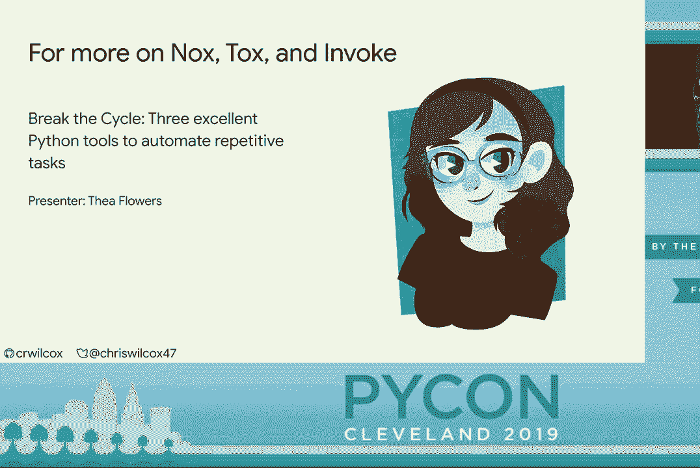
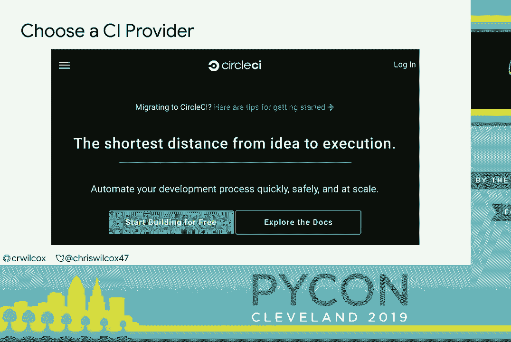
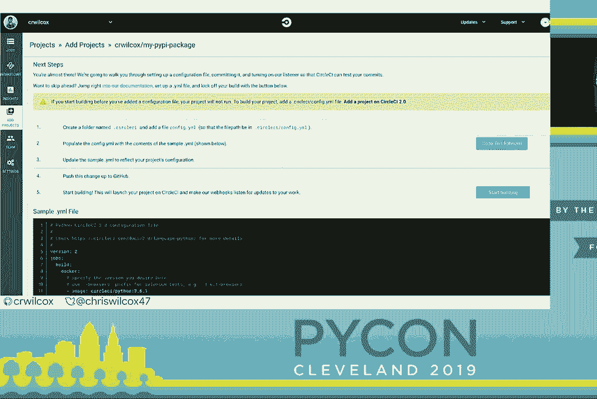
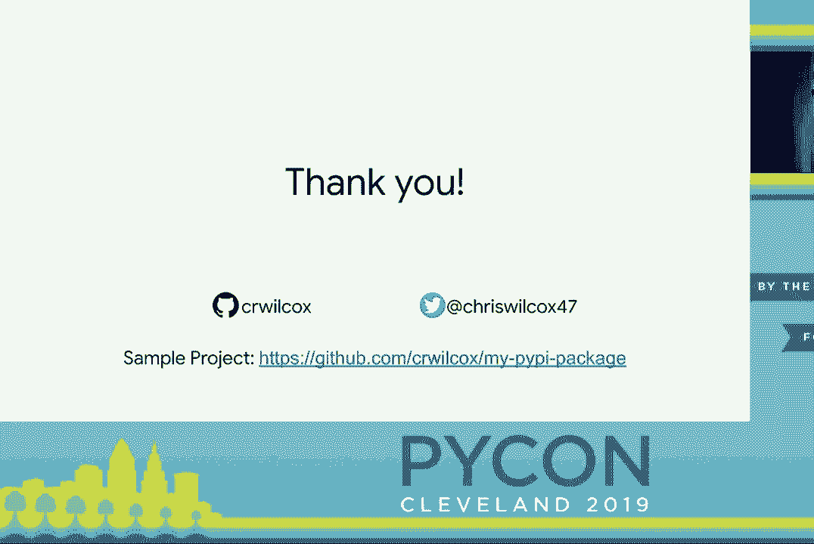
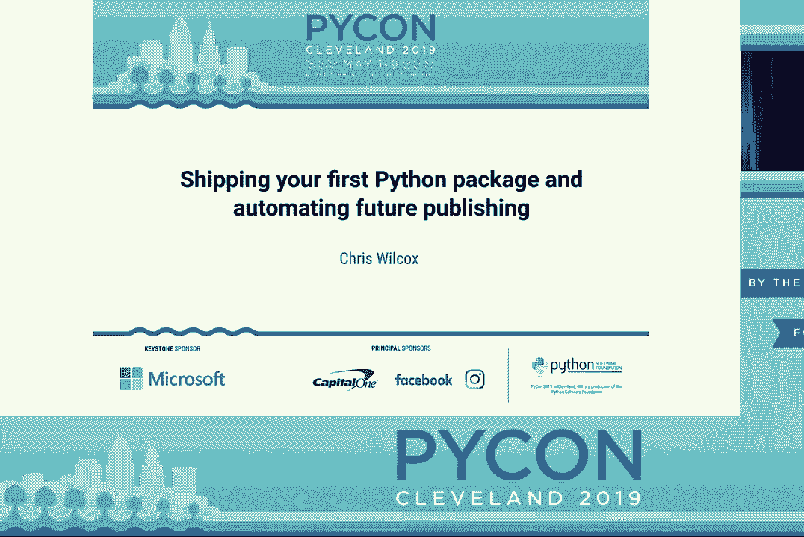

# P12：Chris Wilcox - Shipping your first Python package and automating future publishi - leosan - BV1qt411g7JH

 And next presenter is Chris Wilcox， who will be talking about shipping your first Python， package。

 Please make him feel welcome。 Thanks everyone for coming。

 I've been coming to PyCon for five years and this is the first time I've gotten to speak。

 so I'm pretty excited。 So again， my name is Chris。 I live in Seattle， Washington。

 I work for this small internet startup you might have heard of called Google。

 We make a search engine and some other things。 Because I live in the P&W。

 I try to take advantage of some of the nature we have in my personal， life。

 so that's me hiking at Mount Rainier。 I also have a like for all things two wheels。

 I don't know how that happened， but I bicycle a lot and one of the things I do in my spare。

 time is I'm an amateur road racer。 But you probably didn't come here to hear what I do。

 You're probably interested about PyPI。 So this is what we're going to talk about today。

 We're going to start by creating a simple PyPI package that we can publish。

 Then we're going to talk about some of the more extended features you likely want to， use in setup。

py。 And then we'll talk a bit about how you can use automation to make maintaining this process。

 a lot easier。 So what is PyPI？ What PyPI is is a package repository for Python maintainers。

 It's one of the things that makes Python a joy to use。

 It's the ecosystem that we all came to Python for。

 And it's because of this ecosystem that Python developers can learn and build great and interesting。

 things。 But over time， Python has evolved。 And along with Python， PyPI has evolved。

 And with these evolution changes came。 This has made PyPI seem mysterious to many people。

 My hope here today is prove that there is no mystery。 It's simple。

 And everyone in this room should be able to deploy a package to PyPI。 And with any luck。

 by the end of this talk， every one of you will be a Python package， author。

 So what is a Python package？ A Python package is a module， a class。

 some functions that you have that you can deploy， for other users。 And here is a really simple one。

 We have a module called My Package。 It has a knit and a module。

 The module has a simple function called spam that always returns eggs。

 This is enough for us to demonstrate how you might deploy to PyPI。

 The first thing we need to do is make a set up。py file。

 There are only four fields required in order to deploy to PyPI。

 You need a name for what this package is。 You need a version， a brief description。

 You need to know what things you need in the package。 The line at the bottom， set up tools。

find packages is a helper function provided by set。

 up tools that will discover the necessary things inside that folder for you。

 And the first thing we do， because we're good software engineers， is we test first before。

 doing anything else。 So we can make a virtual environment。 We can install using pip。

 So this is a little more unusual than the way you might use pip now。

 We use dot which specifies to install this directory， we're set up to pyas， and dash e。

 which is editable or development mode。 The reason we do this is when we make changes to our package。

 we don't have to keep reinstalling， it。 After we've done that， we can open a Python REPL。

 importer package， and prove it works。 Yay。 The next thing we do is we can upload this to test PyPI。

 It probably wouldn't be a great idea to do this right to PyPI since it's likely being。

 your first time doing this， you're going to have some stumbling blocks。

 So we start by installing some dependencies。 We need twine and we need wheel。

 Then we run Python set up to py estist beatist wheel。 What does that mean？

 Estist is a source distribution。 We're just going to bundle up the Python scripts that we have so that way they can be。

 shipped to PyPI and downloaded by our users。 Redist wheel is a binary distribution in the wheel format。

 This is the accepted and expected way of shipping binary distributions。 For pure Python packages。

 this isn't strictly necessary， but it is seen as good practice， to provide wheels for your packages。

 It's easy to do， so we'll do it here。 Once we've done that， we can use twine to upload。

 Once we're not doing this to the default endpoint， PyPI， we specify test PyPI as the repository。

 The argument after that is a glob pattern that will collect everything under dist。

 Dist is the folder where everything built by the setup。py process on the line previous， will be put。

 At the end， we can install from test PyPI using pip in the way you expect， but we have。

 to specify the index URL because again it's not the default。 From doing this to PyPI。

 very much the same process。 It's a little simpler here because we don't need to reinstall all of our dependencies。

 but again we build from setup and we upload with twine。 And here we are。

 We have a package now that we can install and we can use。 So that's it。 The talk is over。

 You can now deploy to PyPI。 Congratulations， everyone。 You are now package authors。

 But you might have noticed this is pretty bare minimum。 And if you saw this coming to PyPI。

 you might think this is a bit sketchy。 It is the bare minimum。

 You can do the bare minimum if you like。 That's okay。 That's up to you。

 But I think here we like to do more than the bare minimum for our users。 What do you think？

 All right。 More flare。 So the first thing we want to talk about is adding author information。

 If you ran setup。py estus on your computer， you get a few warnings。

 And the warnings tell you that it's expected that you have an earl， an author， and an author， email。

 And these are pretty good expectations。 We are putting something on the internet。

 People should know how to get in touch with us。 So giving a repository earl and what our name is is going to build some trust。

 So we can add these things here。 There's another really important thing in PyPI for discovering packages we're interested。

 in and understanding what these packages are。 And those are classifiers。

 PyPI provides over 600 different classifiers for you to use that help you describe packages。

 On the screen now are some of the more common things you might see。

 First we talk about the development state。 Where are we in the process of this package？ Is it alpha？

 It hasn't matured？ Do we consider production？ The next thing you'll usually see are some specifiers around programming languages。

 This package I just made it today。 So I'm going to support the current Python three versions that haven't been end of life。

 So that's 35， 36， and 37。 Because this package has nothing specific to an operating system。

 we can say it works， on all of them。 There's no reason I would believe that printing eggs would have a problem on any OS today。

 The last thing we can do is we can talk about topics。 And so here I said this is a utility。

 There are a lot of these。 Scientific computing is one， for instance。 One of them for internet。

 And so you can really begin to describe your package to users。

 This is probably the most important thing， though， that was missing previously。

 There was no license。 Licenses aren't required to upload to PyPI。

 but I would strongly recommend them。 It's the case for a lot of users in the Python community that they can't use your package。

 without a license。 And not to turn this into a licensing talk。 But if you have no license。

 that's not the equivalent of a free-for-all。 Some people might think that if you just don't give a license。

 I can do whatever I want。 That's not true。 For a lot of us in the corporate world。

 we need a license to understand what rights we're， being given and what rights we're giving。

 And without that， we're dead in the water。 So there are a bunch of classifiers。

 There's around 80 of these。 And I called out three of the most common licenses from my perspective using Python packages。

 You'll see a lot of MIT， Apache， and GPL。 MIT and Apache are both fairly unrestricted licenses。

 They do have differences。 You should read about them on your own before choosing one。

 But those are probably the most common with GPL coming in next。

 The other thing that was missing is any sort of meaningful description or getting started。

 installation information。 And we can provide that via a longer description。

 The code on the slide shows you how we could read in the readme from our repository and。

 then put it into the long description。 So long description takes text。

 Long description content type allows us to tell it what that text is。 And that's pretty important。

 Because without the content type， it just assumes it's plain text， which probably isn't。

 what you intended to get。 There are a lot of supported formats。 Plain text is one of them。

 along with common mark， restructured text。 And the most recent one is GitHub Markdown。

 which I find very convenient since it's kind， of the default for that world。 So after all that。

 this is what our setup to Pi looks like。 It's not anything too crazy。

 but what this results in is a more reasonable looking Pi， Pi package。

 It goes a bit beyond the minimum we need， but it's enough that our users can understand。

 what our package is about， where it can be used， et cetera。

 But I want to talk about some other things。 These things are general improvements beyond the things that you tend to look at first。

 on Pi Pi。 But they're going to make maintaining your package easier and better communicate things。

 to your users。 So I want to start by talking about a thing called Python requires。

 Pi Pi right now doesn't enforce Python versions for your installs。

 So let's say I went today and shipped this package without Python requires， and a Python， 3。

4 user came along， or a Python 2。7 user came along and tried to install the package。

 And it doesn't work， and they have a problem。 Now we might expect that the user would go back to the package page and notice that。

 oh， it says the supported version is 3。5 plus。 But there's pretty much an equally likely chance that that same user files a bug about。

 how it doesn't work， doesn't tell you they're on 2。7。

 You spend the next three hours of your life trying to figure out why this is doing some。

 weird thing to eventually realize three days later that the problem is there using an unsupported。

 version that you'd never tested。 And that's not a good situation for anyone。

 It's not good for your customer because they've wasted time trying to use something that was。

 never going to work。 You spent time trying to debug。 And so at the end of the day。

 the best thing we can do for everyone is be transparent and。

 honest about what it is we do and don't support。 And Python requires allows us to do that。

 So because， again， I shipped this today， I'm going to support 3。5， 3。6， and 3。7， and this。

 takes care of that。 Another thing that isn't happening in this small package but is far more common in real。

 world packages are dependencies。 So imagine for a moment that you had a package that needed to get content from the Internet。

 If you're going to do that， you're likely using Erlib3 using requests。

 These are pretty common packages for doing this sort of thing。

 And so here's an example of how you might do that。 Install requires takes an array。

 We give it the packages。 And this way， PiPI， when it installs a set up Pi。

 can go ahead and install dependencies， for the user so they don't end up in a weird place where things don't work。

 The last thing I wanted to talk about adding to set up Pi is the reduction， the exclusion。

 of certain things from our package。 This turns out to be a little more controversial because some users really do want everything。

 They want your tests。 They want your docs。 They want it all to come down right away。

 This is really common in audit workflows。 So if someone wants to be able to run your tests once they've installed to verify it works。

 they want the unit tests。 The problem is these things can also be seen as bloat for pretty much every other user。

 And for a lot of packages that I've worked on， tests make up a significant portion of。

 the code base。 Docs take up a lot of space。 And so I don't really want to have to distribute those every time and increase the size of my。

 install， which might be problematic for people with slow Internet or on platforms that have。

 limited disk space。 And so you can limit some of these things。

 You can exclude them so that they don't come down。

 Another thing that we sort of glossed over is I talked about publishing without everyone's。

 talking about having credentials。 PiPI works on a username password model。

 And there's talk to add new source of authentication for them， but this is the state of the art。

 today。 And there are a few ways to manage this。 The most obvious one is when you run from the CLI。

 it'll prompt for a username， it'll prompt， for a password。

 And this is really easy to get started with。 You store your password and username combination in your password manager。

 And when you need to publish， you dispatch it and then you type it in。

 Another common way is a file called 。pipirc。 This file tends to live in your home directory。

 And we can form it as you see here。 The repository URL would be for piPI。

 user name would be in my case CR Wilcox， and then， I'd have a password。

 There's one other way that is becoming more popular among people， and they seem to like， this。

 Keyring。 So we can install keyring。 Keyring is a password manager that when given a endpoint。

 so in our case a URL to test， piPI or to piPI， and a username， it will provide the password。

 I think it's important to mention by default this isn't all that secure。

 It might seem on the surface like this is better。 It does allow you to look the things up by your application。

 but in this case the application， is Python， so it's actually open to a lot of the world。

 I think it's a little better than piPIRC。 The reason for that is it's pretty easy to accidentally commit your piPIRC。

 And it's also in plain text and a predictable location on a computer that you likely use。

 for things other than publishing packages。 So if you were to have any sort of infection or anything。

 you'd really have to worry that， your piPI credentials have been in some ways compromised。

 So this is what I figured of this point I would be feeling in the audience， so I've。

 shown you a bunch of different settings that you can do， but in what way am I supposed to。

 retain a dozen different things that go in the setup。py file。

 My suggestion would be to not try to do that。 You're going to have a hard time。

 So what you could remember instead is that the piPI publishes a sample project。

 And the sample project has a ton of comments on every one of these settings that helps。

 you understand better how you might use it and why you might use it。

 And they have extensive documentation beyond this sample that you can use。

 The other thing you might find is that as you develop packages beyond your first and。

 second one is that you start to rely on your own work。 So you've now done this a few times。

 You just go grab your old setup。py and you copy it into your new package。 You change some things。

 the name of the package and whatnot。 But likely things like your URLs are going to be mostly the same。

 Your email is going to be the same。 And so you can sort of just borrow from your past self。

 Another way to do this I wanted to mention is a thing called cookie cutter。

 Cookie cutter is a really powerful templating tool that you can install via piPI that。

 will help lay out your entire repository。 And this goes far beyond just the setup。py file。

 We're talking about your get ignore files， documentation layouts， testing infrastructure。

 at least the start of it。 It can be very helpful。 On the other hand。

 it also can come off as kind of opinionated because it has already。

 made all of these decisions for you。 And so if you can agree with it， very helpful。

 if you disagree with it， that might stop you， in the water。 The good news， it is extensible。

 So if you wanted to make your own template， you could。

 That would fit the way you wanted to do things。 The one I tend to choose is the bit about copying your previous work。

 I tend to start my packages by taking one I have and deleting a bunch of the content。

 and then starting from there。 But you can choose your own way。

 I think my way is probably a bit messy， but it works for me。

 So now that we've done that， I would like to talk about how we can never do most of， it again。

 And that's my goal。 I as part of my day job support around four dozen piPI packages。

 And so trying to manually publish them would get to be a bit of a drag。

 So we can talk about ways we can automate this to make this a little less bad。

 So why might we automate？ The first one I thought of had to do with the credentials I talked about。

 Managing those credentials is a risk。 It also doesn't work well past one person。

 which is likely the case for most projects， after a little bit of time。

 The other thing that it brings is consistency。 These are very good at following instructions。

 Human beings less so。 I think most of us in grade school or sometime about then took an instructions test where。

 you walked through it and you get to the end and they're like， you didn't need to do， this at all。

 So quietly， at least they did that to me。 It was torture。 And they did that and you messed it up。

 But computers will follow every step you give them exactly every time。 So automation is repeatable。

 The other thing is it gives you scale。 And you're one person having a bespoke development environment is perfectly fine。

 The second you have two people that doesn't work anymore。 And so if we have automation to do this。

 we simplify our dev environment， we make it， easier to onboard and we allow ourselves to grow our team。

 So the first thing I'd like to talk about automating is some of our test work。

 One of the interesting thing about Python packages over， say， a web service is you have。

 to support multiple platforms。 If you're just running， let's say， a flask app。

 you probably only care about a single version， of Python at a time。 With packages。

 you almost always care about all of the currently supported versions of， Python。

 which tends to be three， four， five things at once that you have to worry about。

 And so using testing tools that help us to parameterize this， to support four to five。

 test runs at once that are all the same， other than the Python version， is very helpful。

 So there are two I want to mention。 I couldn't talk about test automation without talking about talks because it's by far the。

 most popular test automation tool in Python。 It's based on I and I files where you can specify the Python versions you need to test。

 what a test scenario might look like。 But there's another one I want to talk about that I find myself using。

 It's called Knox。 Knox is very much inspired by talks。

 but it claims to be more flexible and it's based， in Python。 So rather than having an I and I file。

 we end up with Python functions that we can run to， execute tests。

 Because talks has such a big presence already and there's a lot of documentation in the community。

 I'm going to show you how Knox works since it has a much smaller corpus， but definitely。

 look into both tools。 So here is a basic Knox file that will run our unit tests。

 Above the function declaration， there's a session decorator that takes in an array of。

 Python versions。 What this will do is when we run Knox。

 it will run this function three times once for each， version of Python。

 And what do we do inside the function？ We install some test dependencies。

 so we install mock and we install PyTest。 We install our package and then we run PyTest with some arguments。

 The bit at the end， the session。possargs， that is a way to extend unit。

 So we're not really using that here and I don't have this on the screen， but we can。

 pass additional parameters to unit at runtime if we want via this。

 And so this can be useful if you have additional test flags that you want to use or if there。

 are a lot of other tasks you might do from let's say， docs running and where you might。

 want to pass more run arguments。 This is one of the other cool things I like about things like Knox and talks over just using。

 PyTest directly is we can make a docs target that runs every time we run our tests。

 All this does is install Sphinx， installs our module， builds the docs。 It's not too complicated。

 But it brings us that this really great side effect。 Without this。

 most people find themselves building their docs when they go to release。 And I don't know about you。

 but I like to find my problems much closer to when they。

 happen than let's say a month later and then wonder why I'm having an issue。

 When you change your code because the docs are generated， you can break the docs and Sphinx。

 will have an issue。 But if you run it as part of your test。

 you will know the moment you made that change。 You'll know why it broke and you'll be able to address it right then。

 And so by bringing our docs into our test run， we can end up with a much more stable documentation。

 situation。 This very much doesn't go as deep as Knox and talks go。 Luckily。

 there was a talk on Friday by my core， on these tools。

 And the slides will be up on the PyCon 2019 YouTube channel later。

 The next thing we're going to talk about is moving this to CI。

 It's all great to automate this locally。 That's a lot better。

 We don't have to worry about managing all that and making sure everyone's running PyTest。

 multiple times。 Let's find a way to get that into the cloud somewhere where it runs on pull requests。

 on， religious to master。 There are a lot of different CI services that we can use。

 There are a lot of popular ones people know。 Circle is the one I'm going to talk about。

 There's also Travis， there's AppVare， there's many more。 So what is CI？

 CI is continuous integration。 So every time we merge to master， every time we make a pull request。

 we can get a run。 The nice thing about this is， again。

 it simplifies what we require of our developers。 They no longer need to have as much figured out on their machine in order to contribute。

 to a project。 We can also use CI for another task。 We can use it to publish our package。

 So to use something like Circle， you need a GitHub or a Bitbucket account。

 And you can sign in with it。 And it knows how to discover your repositories。

 So the page I have up now is what you'll see once you log in。 You can go to add projects。

 It will have already discovered your repositories。 And in my case， I pointed out my pipi package。

 It instructs us to create a folder called CircleCI and put a config。yaml in it。 The config。

yaml specifies two distinct things-- workflows and jobs。 So a workflow is a step of jobs。

 It's a list。 And a job defines a discrete task that needs to be done as part of continuous integration。

 The sample yaml at the bottom is pretty good for Python programs。

 But it's not really tailored to pipi。 You can try to start from this。

 But I'm going to put up the link to my GitHub at the end for this project。

 And you can start from that one。 It's a little easier。

 There are some things unique to making Python packages from， say， a web app。

 So let's start by looking at what is in a CircleCI configuration file。 First。

 let's talk about the workflows。 Workflows are a list of jobs。 And that's the same here。

 We have three test groups。 We have a 3。5， a 3。6， and a 3。7。 And we have a deploy task。

 And that deploy task is what we're going to use to publish our content to pipi。

 There are a few extra things there。 If you look under 3。7， you'll see it has a filter。

 And that filter says on tags， only run this on all tags。

 The reason I'm doing this is this way on a tag run， which is how we're going to publish。

 will run our 3。7 tests。 So before we try to publish。

 we'll make sure at least one of our test runs work。 Under deploy， again， we have filters。

 We have the tags filter， which has a regex， which can roughly be described as it looks。

 like a version number。 And it also ignores branches。

 This is important so that way we don't try to build on master。

 Because the last thing I would want is merging some pull request and then having it decide。

 now is a good time to try to publish。 This way we have full control over when we publish。

 And let's look at the test job a little bit。 The test job looks very much like we would have done manually。

 If we ignore some of the extra stuff， check out which clones are repository and some of。

 the virtual integration， we install Nox and we run Nox。 Deployment is very much the same story。

 We check out the repository， we make a virtual environment， we install our dependencies twine。

 and wheel， and we run the two steps we did earlier when we manually uploaded to pipi。

 There are some extra steps that we need to think about with upgrading that we didn't really。

 talk about before。 We need to change the version number。 The good thing is if you forget to do this。

 nothing really exciting happens because pipi， won't let you overwrite version numbers but you might be surprised that you never get。

 a new package。 We started at zero。0。1， so I'm going to increment this to zero。0。2。

 And once you've merged this to your master branch， you're going to create a tag。

 You can create a tag using git tag or any of the CLI tools you use forget。

 But I prefer to use the releases system on GitHub。

 So releases will give you an archive of your current savior repository and they will also。

 give you a tag。 So in this case， we're going to make a tag called zero。0。2。

 I'm going to name the release zero。0。2。 And if I'd like。

 I could provide a description of this release， additional change like information。 And as I said。

 it's going to automatically create an archive at this point that is downloadable， from GitHub。

 And this might be useful if users don't want to use pipi or are trying to bundle things。

 to go somewhere else。 It's just convenient。 And it doesn't take a lot extra for us。

 And once I click that， Circle is going to notice the tag。

 It's going to kick off a build called zero。0。2。 It's going to run test three， seven。

 And upon a successful run， deploy is then going to run and publish the pipi。 And that's it。

 With that， you can publish the pipi。 You can automate the CI。 You can automate your test runs。

 And with any luck， a few of you， hopefully all of you， are now package authors in Python。

 And I sincerely look forward to whatever you can bring to our ecosystem。 [APPLAUSE]， Thank you。

 Chris。 If there are any questions， we have a couple of microphones in the aisle。 So please queue up。

 And please ask questions in the form of a question。 Comments can be saved for the whole way after。

 Thank you。 Would you structure your setup。py differently for applications versus libraries？

 I'm sorry， I couldn't。 Would you structure your setup。py？

 Would you do anything different for libraries versus your application？

 Because it's a command line application versus it's a library。

 And if I was making a CLI based thing for a pip， like something that you just click。

 not particularly， there are some considerations when you start to do things beyond those packages。

 There are additional tools that exist to make sure everything is included。

 So it's not so much that I would structure it differently， but I might consider more。

 exactly specifying the content I need。 So there are multiple ways to do this in Python。

 You can include package data。 You can also use a thing called a manifest。

in file to help make sure you get all the content。 But as far as the setup， the pie goes， no。

 it's mostly the same。 And you mentioned you have a bunch of packages that you maintain。

 How do you release them when there are interdependencies across packages？ So there's a long answer。

 but the short answer is very carefully。 You do your best to not have the situations。

 Really you just have to stage releases。 And sometimes it means releasing things twice。

 if I'm completely honest。 Sometimes it does mean that package A has to go out。

 so package B can go out， and then， package A has something else again。 That is a talk。

 How did you handle credentials in CircleCI for the upload？ Yeah， so in CircleCI。

 I alighted that because it made this slide entirely too long。

 The easiest way to do it is CircleCI has the ability to have environment variables。

 And so as an environment variable， you can put your password。

 And then you can echo into a pie PIRC at runtime inside the virtual environment。

 That's the most common way to do that。 It works pretty well。

 but it would have taken up about half of the slide to show that。

 And it's not really interesting to look at。 My hope moving forward， one of the features。

 kind of a plug here。 Anyone coming for sprints， one of the topics is adding API keys to pie PI and the system。

 So if you're interested in that， please stop by。 It's something we'd like to get to， for me。

 I would feel a lot more comfortable doing that， than giving my user name and password to my full account。

 Yeah， good question。 So how do you deal with having multiple test runs in， say。

 CircleCI or Jenkins when you， have Nox， which runs all of the different versions at once？ Yeah。

 so the way it was dealt with here is that we had three different Docker containers。

 one of which would be three five， one of which would be three six， one of which would be three。

 seven， and Nox would run in all of them。 And if Nox doesn't detect a Python environment。

 it just skips the run。 It doesn't fail。 It just assumes it shouldn't have bothered running。

 The way I handle this in my day job is we manage a custom image that has all of the versions。

 of Python， so we run it once。 And then Nox runs all of them。

 There isn't really a strong reason to do one or the other besides the fact that you end。

 up having to maintain Docker containers if you do it the way we do for my projects。

 We did it the way we did it for mine is that it does result in a speed up in test runs。

 and we run a lot of tests。 So it was just an optimization。 Hi， yeah。 With setup tools。

 you have the ability to use a setup。config to set all those in a plain。

 text file。 Is there any drawbacks to doing it that way or benefits that you know of？

 Not particularly。

 For a beginning project， I don't think it's strictly necessary。

 It depends a little bit too on if you're working on a binary distribution。

 So everything I talked about here was about a pure Python world in which we're just writing。

 Python code。 But it's not as common， but it's not uncommon to have a C extension in which the binary。

 distributions， they get a bit hairier。 So the setup to config a very common thing to add is to specify what kind of B-dist we're。

 going to do。 And it's a very specific thing like we want a universal wheel that's pretty common。

 Like I said， you can also use manifest。in。 Some of this is personal style。

 I find myself using those more when the setup to plug it's kind of long。

 So if things start to feel unwieldy， I'll kind of tuck them out of the side。

 But for a lot of packages， it's just not strictly necessary。

 A lot of them are rather simple and well contained。 You have a few methods on the public surface。

 So thank you。 Are there any more questions？ Thank you again， Chris。 [APPLAUSE]， (applause)。

