# P14：Saturday Lightning TalksBreak - PyCon 2019 - leosan - BV1qt411g7JH

 >> One， two。 One， two。 One， two。 One， two。 Check。 >> Welcome， everyone。 Come close to the front。

 All the speakers will appreciate that。

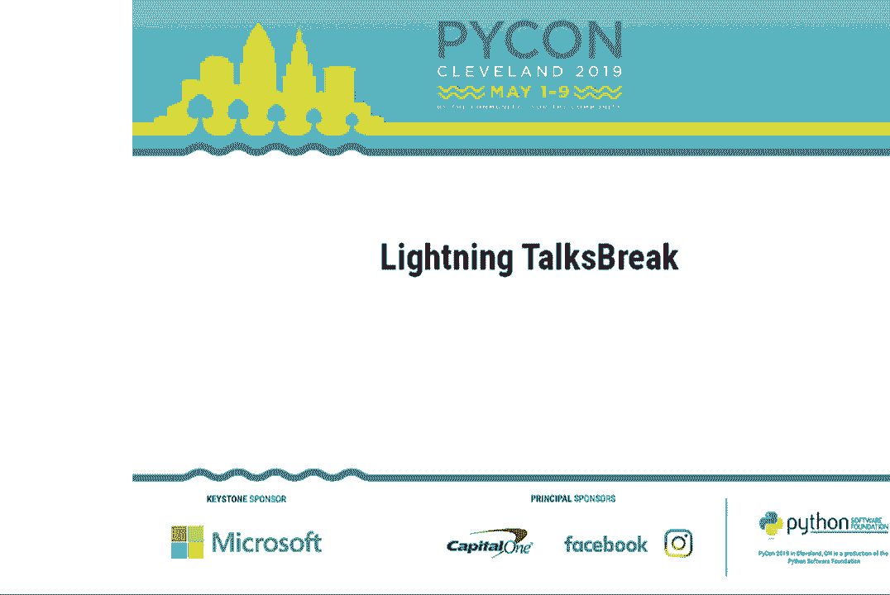

 I can see everyone at the back。 Come close to the front。 As close as you can。 Come in， the middle。

 Come in these seats。 There's four seats down here in the front row。

 Speakers love seeing these people。 You can see them in the whites of their eyes。

 If you look happy down here， this speaker is going to be happy。 That speaker is going to be happy。

 We're all going to have a great time。 Come to the front。 Come to the front。 Quick as you can。

 Feel more like jogs lightly without endangering themselves。 That would be great。

 Don't increase the risk， but increase the speed。 Yeah。 All right。

 I'm just going to wait for a few more people to come down that， lift。 Come close to the front。

 There's lots of room up here on the left。 There's four seats right here in the front row。

 There's a bunch over in the， middle here。 How's everyone enjoying the sat at a day of， PICON？

 That's a sort of three star applause。 I mean， it's nice， but I feel like maybe。

 you're getting a little tired。 I don't know。 I don't think we want it。 Okay。

 That's what we want to hear。 Come on， folks。 This is going to be the。

 Saturday afternoon lightning talks。 All the lightning talk slots are often the。

 best slots of the whole conference。 And often the Saturday afternoon is the best。

 lightning source slots of all the lightning talk slots。 And these two guys are， intelligent。

 attractive。 They've got lots of exciting things to say。 This is going to be。

 the best lightning talk slots of this conference and indeed of history。 Yes。

 So please welcome our first streeper who was bumped from this morning， but we。

 managed to get him on this afternoon。 Christian， please give him a big hand。

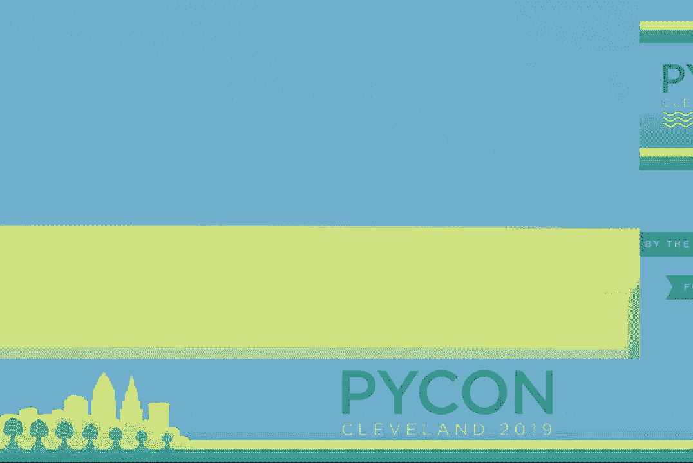

 Okay。 Hello， everyone。 So let's be really quick with this thing。 So create your first。

 UI with Qt for Python。 So I am currently working as a software engineer， in the Qt company。

 So the good company is just the company that's backing the Qt， project。

 Maybe you have heard about it。 So you can find me there。 And since some。

 people were showing some maps， so I just wanted to show something。 I'm， originally from Chile。

 I am leaving in Germany for a couple of years and now I'm， here。 So you're saying。

 So Qt is a cross-platform， C++ framework。 So for UI and many， other things， in my own words。

 I kind of provide things that we get for free in， Python to C++ developers。

 So it's really nice for them to have， but we already have， them。

 So C++ is a really beautiful language。 But of course it could be also a。

 little bit scary when you try to do more advanced things。 So now since last year we。

 are officially supporting Python as an official language to support Qt in general。

 So we are adding Python to our ecosystem and we officially released Qt for Python。

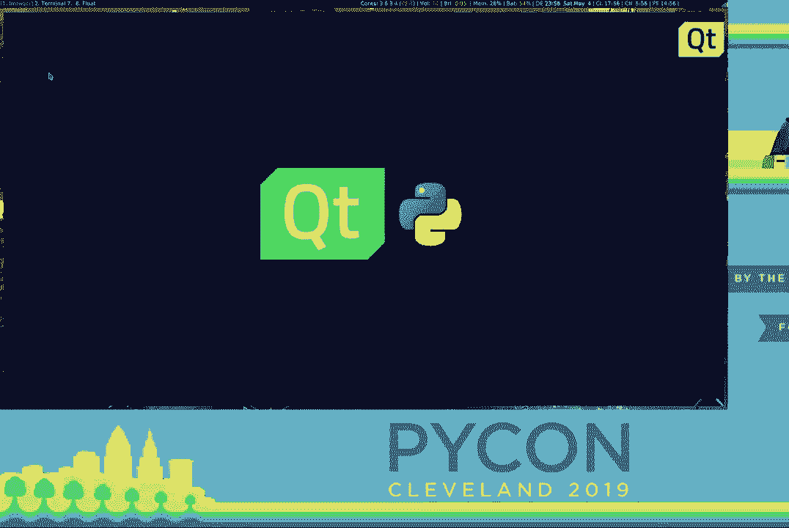

 and the Python 2 module。 So how do we do it？ It's really easy。 So we use Clank for。

 passing our headers from the C++。 We have our own binding generator tool。 Some。

 type system to declare things and play around with ownership and stuff。 And then。

 we have some C Python code and expose it with the PiSci 2 module。 So how do you get it？

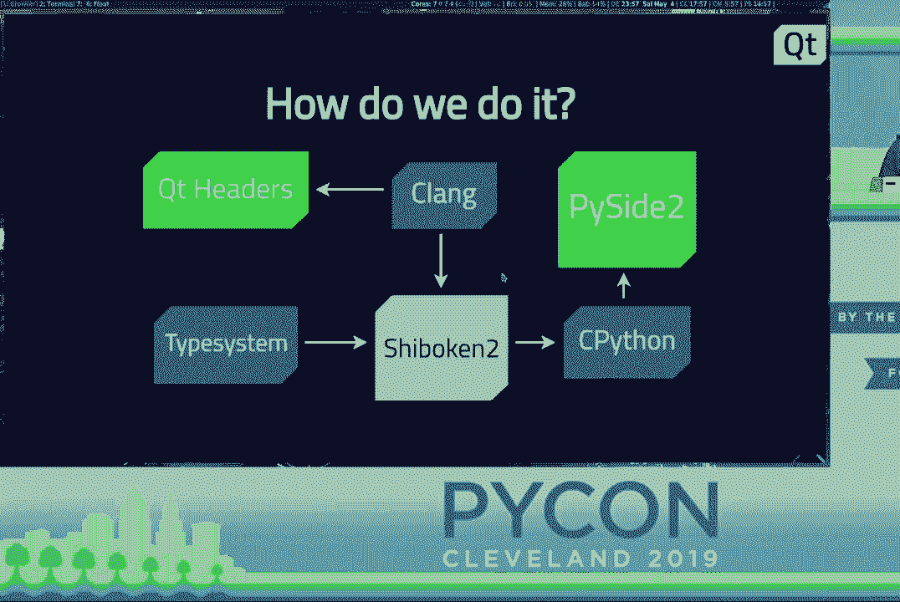

 Just keep install us any other Python module and how does it look like？ So I。

 will not code everything from scratch。 Just because we have some times constraint， but。

 the struct is really simple。 So this is the final application。 So I will just show you。

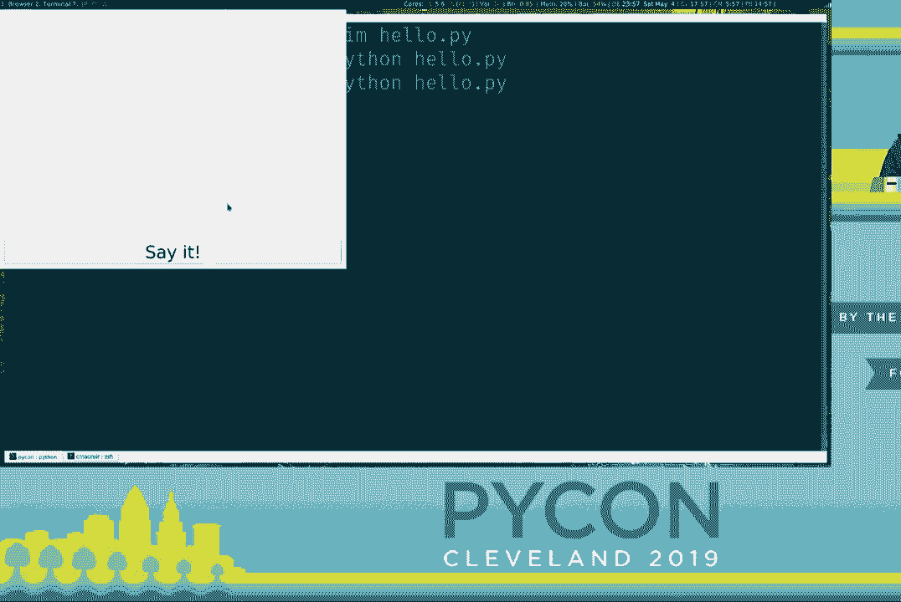

 more or less。 This is a structure。 You declare an application， overloads some， widget classes。

 You show it。 And then for the widget class， you just need to， add things around。

 So you can start to read some file， for example。 And then you， create a label， a button。

 and then you cannot connect this button with some action。 So every， time you click it。

 you are connecting this with a slot。 A slot is not an， other method in the class。

 So here you have a simple layout and there is some slot there。

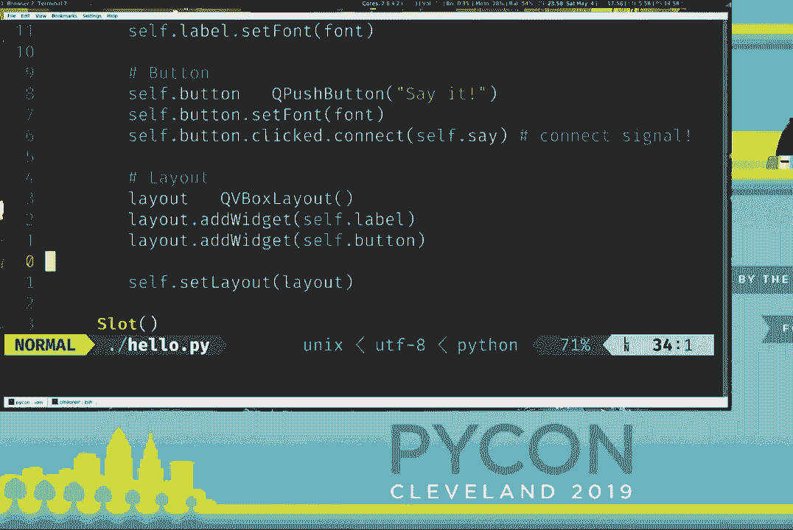

 So once you execute this thing， you will have this amazing graphical user application。

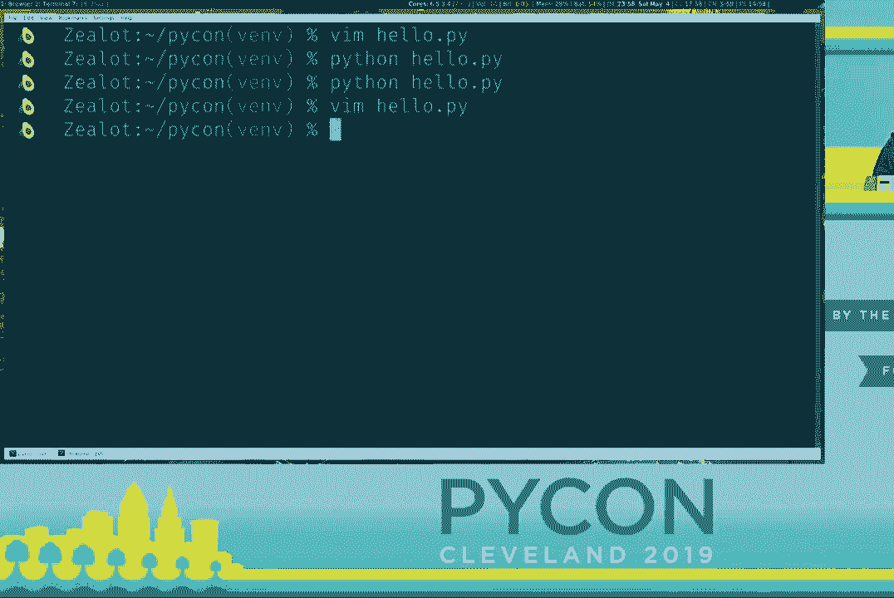

 so you can post it in your GitHub and get thousands of stars。 So just a big。

 thing， DR。 All this information is to get more about the project and you can fire。

 an ier in free note。 That is my username。 So please check a look of it。 It's。

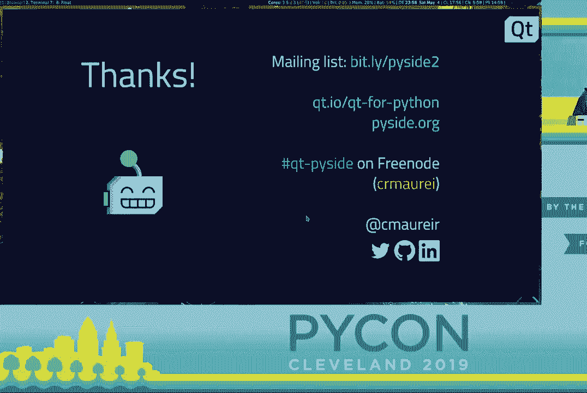

 Pyser。org。 But most importantly， please support your local groups。 So a big shout out to。

 all the meetups that we have there in Berlin， Pi Ladies， Python user Berlin， Pi， Day of Berlin。

 And yeah， so a big thank you very much for making Berlin one of the， best Python communities there。

 So thank you very much。 [ Applause ]， Thank you very much。

 No time to delay from one line talk to the very next one。 Please， give it a big hand for Andrew。

 [ Applause ]， >> How do you all -- my name is Andy Knight。 I work at Precision Lender in， Kerry。

 North Carolina。 And today I'm going to give you three quick tips for。

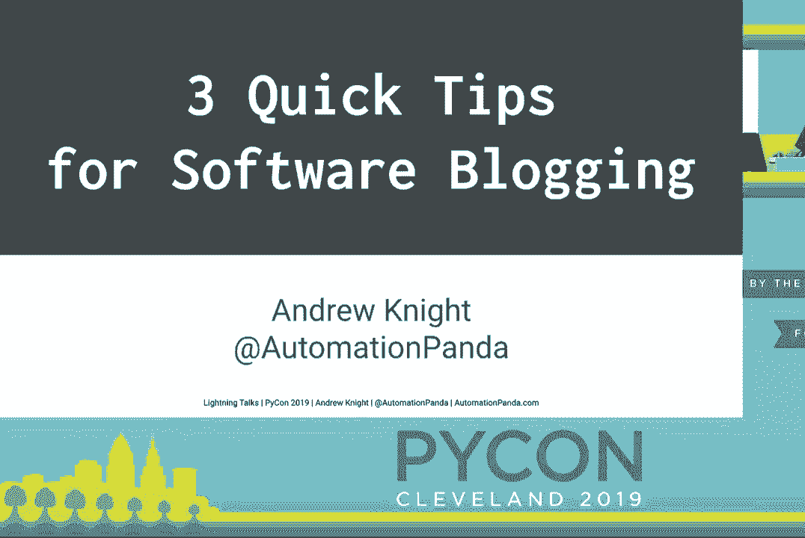

 software blogging。 You may also know me as the automation panda。 I've been。

 writing automation panda。com as my own blog since January 2017。 I have over 100。

 articles out there and I get about 1，000 hits a day。 Feel free to check it out。 I'm。

 also on Twitter。 I love writing。 I was actually a creative writing minor in， college。

 And so it was kind of recently in my software career where I decided， hey， why don't I write a blog？

 And so what I want to do today is kind of encourage all， of y'all。 Yes， you can write。

 You should write。 And here are some basic tips for how。

 to get started if you're not sure how to begin。 So first thing I always recommend， to people。

 if you think you want to write a blog， I would say set a purpose。 There's。

 a big difference between somebody saying， I just want to write something and I have a。

 purpose for writing something。 So what do you want to blog？ Do you want to。

 blog something like personal info or guides or tutorials， example code？ Is it just。

 your own journal or blog or just your own little notes you write down to yourself？ Is。

 your blog a platform through which you want to connect with other people or maybe you。

 want that to be your electronic business card？ These are all great reasons。 Two。

 reasons I typically tell people to avoid would be looking for fame and fortune。

 because you're probably not going to find that in a blog。 Overall， though， make sure。

 that whatever you write about， you're self-motivated to write about because you're。

 your biggest enemy when it comes to writing and comes to writers block。 So be self-motivated。

 set a purpose and keep yourself to it。 The second piece of advice I would give is。

 write new and helpful content。 We all know the web has way too much information out， there。

 So don't repeat existing content。 Instead， make something new。 Make something， unique。

 A perfect example I think of is I once wrote a website in Django for my wife， small， businesses。

 and I had to do some translations in the administration pages of Django because。

 my wife needed somebody to use it who only spoke Chinese。 So I looked how to do Django。

 app translations for the admin and I couldn't find anything on Google。 So I figured it out。

 I wrote a blog post and boom， unique content。 So try to find things like that。 Search engines。

 will reward you， employers will notice you， and people will ultimately thank you for adding。

 something helpful。 Third thing I've learned is that the tools and platforms really don't， matter。

 I know this might sound blasphemous， but just hear me out。 When it comes to writing a blog。

 you care more about the content than technology necessarily。 So if you wanted something simple。

 you could look at something like WordPress or Wix。 If you want to make your own kind of， thing。

 you could build your own Django site。 Wagtail。

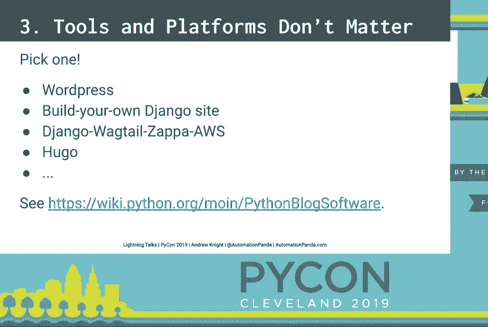

 >> If anybody is interested in bringing a regional conference to the Carolinas， please let me know。

 because we're trying to start that。 Thank you。 >> All right。 Next speaker is David。 Here he goes。

 >> Hey， so I have --， >> Wait。 Give a big hand。 >> Hey， I'm David。

 I'm singing Wolf Boy on Mastodon and I have one weird trick for you to make it。

 easier for people to see what your name is at lunch。 I found this amazing stock photo image。

 which seemed perfect for this talk and also hilarious。 So the problem that you have is。

 when you're sitting at the table and your land yard is too long and it falls below the table。

 nobody can tell what it says。 So what is the name of the sky？ I have no idea。 The solution to this。

 problem is really easy。 You just tie a little knot in the top of your land yard and it makes it。

 shorter。 And as a result， when you're sitting at the table， you can see the name tag of the。

 sitting across from you。 That's it。 That's my entire lightning talk。 Thank you。 [ Applause ]。

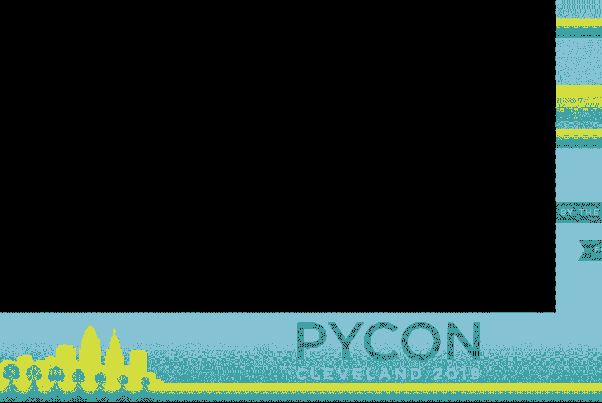

 >> Thank you very much。 In case anyone is still here in the morning， we didn't get through all。

 the lightning talk speakers from this morning。 So as a result， we had a bit of a scheduling snafu。

 with who is going to be on this afternoon。 So I think a few people who were promised they could be on。

 this morning didn't manage to make it on。 And that is my fault for not talking to my。

 co-lightning talk host and also my fault for kind of talking， whilst what you really wanted to see。

 is the lightning talks。 So I apologize to all of you。 I apologize to anyone who didn't get on。 I am。

 really sorry about that。 Steve， are you ready to talk？ So give Steve a big， big， big， big， big， big。

 big， talk。 [ Applause ]， >> Okay。 XDB is a database， file based， similar to BerkeleyDB or whatever。

 In process， you're using a， C library， so your program is doing the lookups。

 So it doesn't have a query language。 You're using， Python as your query language。 I call it XDB。

 not the best name ever。 It's extra features on top of， the library。 Very well debug， very fast。

 LMDB， you give it bytes， it gives you bytes。 But usually in， Python。

 I have a Python string and I want a Python dictionary or something。 So I was writing a lot of。

 code that looks like this。 In code the key to get bytes， get the data， decompress it。

 convert it from， JSON or whatever。 That boilerplate， many， many times， don't repeat yourself。

 I said I wanted to look， at this。 And that is what XDB gives you。 This， not that。 Drink it in。

 XDB has multiple options for， marshalling。 JSON， message pack。

 you can pack the data yourself with Python struct。pack。 Several， kinds of compression。

 including Z standard， which came from Facebook and is great if you have data， like mine， many。

 many records individually small。 It works very well from multi-processed， such as。

 for example a web app running a bunch of workers。 And the XDB table acts a lot like a dict， except。

 it can be very large without using up your memory。 Here's an example of creating a file。 So we use。

 width because we're good。 We give it the file name。

 We give it an identifier and a string and a version， number。 And on opening a file。

 you tell it what identifier and what version number to check for。 So。

 if you give it an obsolete file or file from the future， it doesn't just crash randomly。 It prints。

 the message， hey， I expected foo version one and you gave me foo version two。 Very nice。 You open a。

 table， you tell it how you want to marshal， how you want to compress， and then you can just start。

 putting data in it。 Because there's common structure and common metadata associated with this instead。

 of just bytes， I have some standard tools。 Dump out the information。

 dump out examples of the data and， my favorite， the rep， the reple。

 is just it opens a Python interpreter and preloads everything。 And so。

 you can immediately start using it。 And I used the XDB shell interpreter to make these examples of。

 using it。 I should say I'm using it heavily， I made it to solve my own problems。 And it's working。

 great for me。 So here's an example。 You can put whatever you want into an XDB name space or table。

 whatever you want to call it。 So there's no indexing features provided by it， but you can write an。

 index。 So I've got this table， locidx is an index。 So using this key system that I invented， we say。

 in the US， in New York， anything named Long Island。

 And it turns out there are about six things named， Long Island in the state of New York。

 Another example， more of a query， here is a list， comprehension that loops over country codes。

 two letter country codes and makes a list of all the。

 country codes that happen to also be US state codes。 There are 32 of them。 I'm going to be。

 sprinting on adding this to the Python package index。

 If you're going to be around during the sprints， you can look me up and say hi。 Thank you very much。

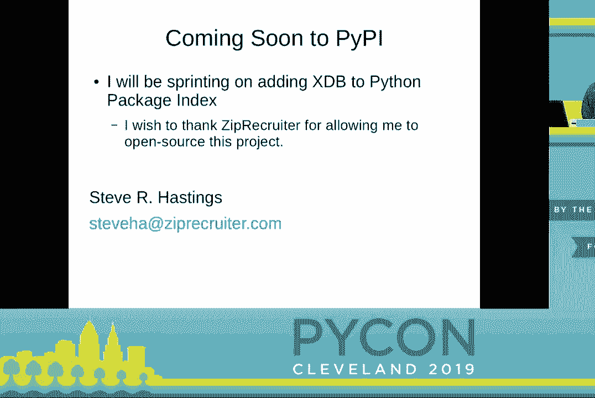

 [ Applause ]， Thank you， Steve。 Our next speaker， you may remember， is Veronica。

 I couldn't bear to have cut her off， and then not find out what is at the end of this talk about putting images in your git commits。

 So we only ever do this exceptionally， but there's two more minutes。 She did resubmit and。

 follow the process。 So please give Veronica a big hand。 [ Applause ]。

 But not too long of a bit of canned， okay？ Okay。 So here I was。 I decided that I needed to add。

 screenshots to my documentation。 And so I came back to bring you all the sequel。

 So if you were here， this morning， but just in case you weren't。

 our hero was struggling to write commit messages that。

 brought to mind the visual changes that were being made in her front end projects。

 And so this brought the frustration as you're learning both design principles and working on your。

 front end work， rolling back those commits to the right one is really difficult and can really mess。

 with your flow if you're additionally learning git。 I swear I tried everything I could。

 I tried to handle one problem at a time and I said perhaps since I'm keeping a screen shot。

 a folder of， screenshots， I will just refer to that。

 But it wasn't connected to any particular commit message。

 So I still ran into that commit problem I had before。 Once I was within my editor， I had some help。

 from plugins that allowed me to see what colors I was using。

 But that really didn't solve the problem， that I had in mind。 So as I was moving towards a solution。

 I said maybe this folder of screenshots could be， placed inside my repo and then linked。

 So I did have some problems with this。 Time spent taking the， screenshot by hand。

 I might forget to add that screenshot。 I had used all the tools I could。 I learned。

 that they had a get for design and that was amazing。

 And eventually got ready to dive in and use some of， the tools of screenshot diphings。

 puppeteer and pipe-a-tier。 And use get hooks to kind of tap， puppeteer or pipe-a-tier。

 And one thing I'm working on right now is creating a terminal prompt to help me， save by hand。

 And my helpful timer tells me that I am out of time。 So I wanted to share with all of you this。

 information。 If you want to find out more about the tools that I use。

 this is the slide to take a picture of and I， want to share with you all of you a wonderful day。

 [ Applause ]， >> Great。 Thank you so much。 I'm so glad we finally got to the end of that。

 It's so nice when you get a， long story and you finally get kind of closure at the end。

 I enjoy that sort of thing。 [ Applause ]， >> Please give Brian a hand for his next talk。

 [ Applause ]， >> Hi， Gary。 My name is Brian Skyn。 I'm a chemical engineer by day and I dabble quite a bit in Python on the。

 side。 And for the lightning talk， what I want to do is give a quick。

 very quick demo of a side project I'm， working on。 Hard to resist the recursive acronym。

 Pent extracts， numerical text。 Who has had to work with data in a。

 file or a string trying to scrape it and getting it into a data structure？

 Who has beaten their head against the， wall trying to get the data out of that file or data structure？

 All right。 Awesome。 You're in the right place。 Hopefully。 So what I put together， you know。

 I pull up an iPhone here。 So this is just a data file。 It's something。

 you're playing with on the side， but it's got numbers in it。 There's obviously structured to it。

 but it's all one big， string if you pull it into Python。 And， you know。

 you can write reg X and then proofread your reg X and then， maintain your reg X and it hurts。

 So this project， Pent， let me pull in the data first。 So quick， path。txt， read text。 All right。

 We have data。 So in just a couple of lines， I'm going to take this block of。

 data and I'm going to pull it into a list。 Pent works around a parser and this block of data has。

 let me put a new line there。 This block of data has a header to it that you can specify this way。

 And， you know， so， there's this， I'm typing a mini language here that I'm not going to explain because I don't have time。

 But what I'm doing is I'm laying in the framework of this data in a way that the parser will understand it and only。

 take what I want。 All right。 It's okay with that。 So I'm now going to capture the body of this on data。

 There it is。 One line。 [applause]， Maybe somebody's done this before。 If they have。

 please tell me so I don't have to keep figuring this out。

 All this doing under the hood is just generating reg X。 So you don't have to。 Well， isn't that nice？

 Isn't that lovely？ You。 [applause]， You know， so if you can tweak it。

 if I want to capture both the leading integer， I just make add one character， run it again。

 and I get them both。 So I'm here through the first day of sprints on Monday if you have any questions about it。

 Or really what I need are people to try it on live data and tell me where it doesn't work so that I can fix it。

 So that's all I've got。 Again， the repo is， I'm B-skin on GitHub。

 B-T-skin on Twitter if you want to find me。

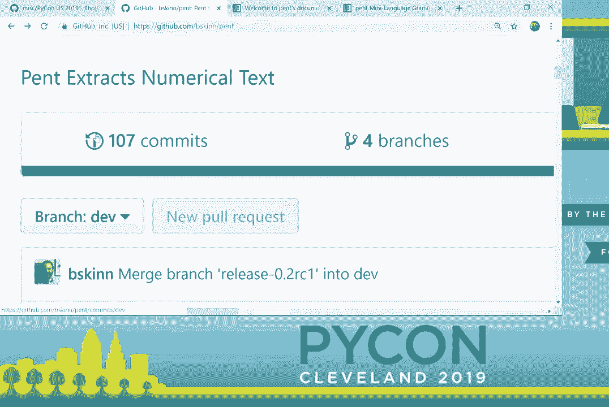

 The documentation is in progress。 If you do install it， make sure you install dash-pre。

 pip install for pre-releases because it's a pre-release at the moment。

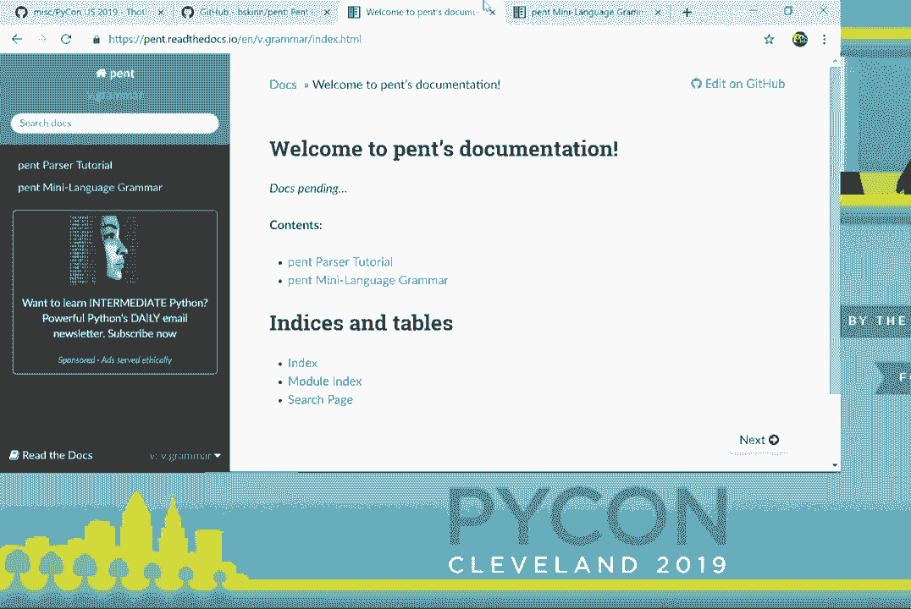

 Thank you very much。 [applause]， [applause]， Thanks very much。 Having a few AV problems on the left。

 With the next speaker that's up on this side， come and start getting ready。

 And I have to do my job up and cover up some dead air。 So， you know。

 the style of jokes that I like is called a shaggy dog story。

 And did you know that there is actually an original shaggy dog story？

 Does anyone know the original shaggy dog story？ No， tell it to me。 [laughter]， Well。

 I'm here to fill in that gap in your knowledge。 And for one。 So， there's this boy and he has a dog。

 And everyone seems to comment on the fact that it's a very shaggy dog。 And they say， "Boy。

 your dog is sure shaggy。"， And so he goes， "You know what I'm going to do？

 I'm going to enter my dog into the village shaggy dog competition。"。

 And there's a number of quite shaggy dogs， but it turns out the judge just decides that his is the shaggyest and he wins the prize。

 And he's like， "Well， that's amazing。" And the judge is going， "Well， by the way。

 you are qualified to enter the regional shaggy dog championships。"， And he goes， "Oh， okay。

 I haven't thought about it。 I won't win， but let's give it a go。"。

 So he takes his dog to the regional shaggy dog championships。

 He has convinced his parents to go and go there on a Saturday。 And like， wow。

 there's some amazingly shaggy dogs like this thing， like the shaggyness of them。 And he goes， "Gosh。

 I've never seen dogs of this shaggyness， but fine， okay， I guess I'm here。 We'll give it a go。"。

 And， you know， despite the strength of the competition。

 the judges vote his dog is the shaggyest dog in the region。 And so he wins。

 and that qualifies him for the nationals。 And so he goes， "Well， mama， would this be okay？ I mean。

 I know it's a bit silly， but like， I mean， it's just going to be a Saturday or whatever。

 We could take it all over the nationals。 Come on。 I never thought we were going to do this with just my shaggy dog。

"， And his parents say， "Okay， fine。 They go to the national competition of the shaggyest dog。"。

 And he goes， "That's going to be the end of it。"， So I'll tell you what happens at the national shaggy dog championships with our boy and his dog after the next talk。

 Please give us a big hand。 Hi， everybody。 I'm here to represent PILATES Brazil。

 My name is Deborah Zaveto。 It's my first by-con。 And I'm really excited to be here。

 And I'm here because I love to spread the word about PILATES。 So if you want to reach me。

 you can find me at by-dab over there。 The information is going to be in the last light， too。

 So I'm here to talk about a very nice conference that we had last year in Brazil for women only。

 which was called PILATES BR-CONF。

 PILATES BR-CONF was thought because we had the fifth anniversary of PILATES Brazil。

 We've been there for five years now。 And we thought of this conference to celebrate the birthday and all our accomplishments and everything。

 So we had 200 people enrolled， 150 attendees。 And this event was 100% made and attended by women。

 We only had women organizing and we only had women。

 people who identified themselves as women attending this event。

 So here we have some pictures of the people。 Unfortunately， it was a morning and afternoon event。

 So some people they were in the morning， they were in the afternoon。 But it was really， really nice。

 And I want to thank the PSF who helped us to make this happen。

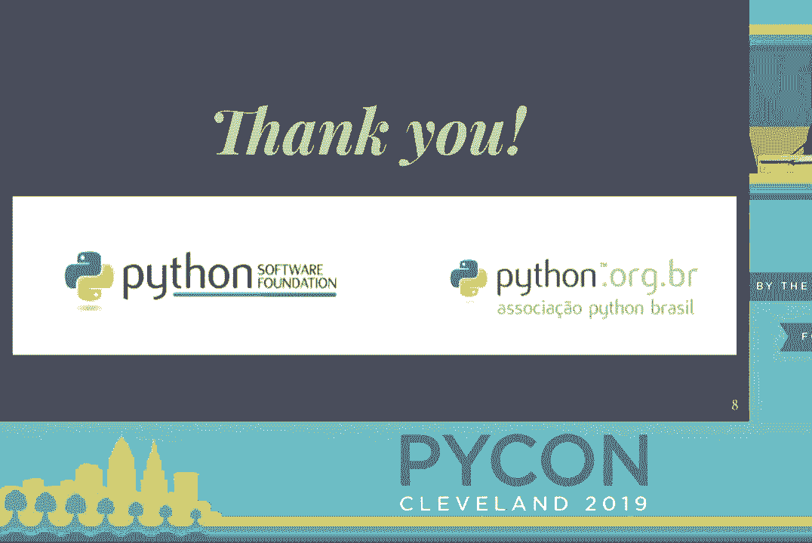

 And also the Brazilian Python Association， which also supported us。 So thank you very much。

 And we've been changing the scenario of the Python conferences in Brazil。

 So we usually had a lot more men than we do now。 So one of the biggest things that we did to make this happen was to start crowdfunding。

 To make up PILATES from different PILATES chapters all over Brazil to go to this conference。

 Because it usually happens in a city that's far from most of the PILATES chapter cities。

 So we started doing this crowdfunding and it helped us increase a lot of number of women。

 And not only attendees， but also speakers， people who proposed tutorials and everything。

 So I have some pictures。 So this was PILATES Brazil。

 the representation of PILATES Brazil in the PyCon Brazil 2016。 And here we have in 2017。

 which has already increased。 And here we have the picture of the last Python Brazil。

 the PyCon Brazil from last year。 So in PILATES Brazil we have over 30 active groups。

 So I dare to say that PILATES Brazil is the biggest PILATES chapter of the world。

 It's a really huge number of actually active groups。 So we have the chapters in the cities。

 but then we are like this huge sisterhood of the chapters all together in a unique place。

 And then we have 20 registered chapters in the official PILATES website。

 so we are still working on it to have all the chapters like officialized。

 So if you want to know if there is a PILATES in your city in Brazil， you can go to PILATES。

COM and you find it there。 Our telegram group has more than 400 users and we use it to communicate informally。

 We have our Google groups to talk about official things， but is it 100% success？ Well， it's not。

 It's a lot of hard work and working with people。 It's hard as it was already told here in this conference。

 Tech is easy。 People are hard。 So we are working on that。 So we have a lot of things to work on。

 for example， documenting how to organize a conference or how to organize PILATES Brazil。COM。

 because what happens in， we did PILATES by latest conference last year。

 one day before the main conference， the main conference of PILATES Brazil happened。

 So we used to do this prior to the main conference so we can take advantage of the girls who are going to attend the conference。

 But it's really hard to organize all that。 How to do a crowdfunding？

 So you're having some trouble to document it。

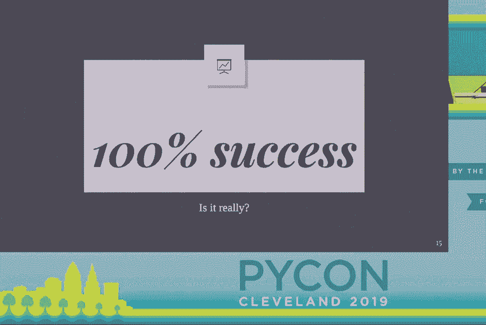

 And well， I wish I could see you guys tomorrow in the open space， 2 p。m。 room 22。

 to talk about PILATES and how to keep the community engaged， keep people doing things。

 keep them motivated to do things， because there's a lot of hard work， it's volunteer work。

 So it's really hard。 And we want to keep it active， organic， and keep people engaged。

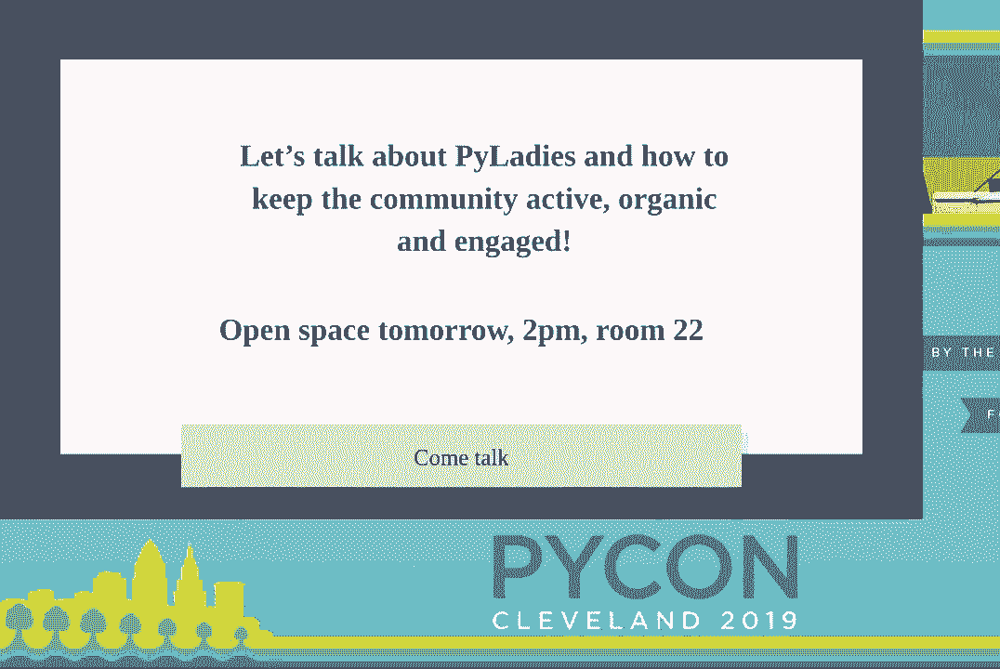

 So thank you very much。 If you have any questions， you can email me or find me on Twitter。

 Thank you。 [APPLAUSE]， So he takes his dog to the National Shaggy Dog Championships。 And I mean。

 there's some incredibly shaggy dogs here， and they line up the top 10 judges inspect them one by one。

 They come up to his dog and they look at it， feel the shaginess of its hair。

 And there's a lot of suspense， and they announce the winners in reverse order。 Obviously。

 he's not number three， and he's not number two， and he goes， "Fine， let's go home。"， But yeah。

 he wins。 The National Shaggy Dog Championships。 And that qualifies him for the worldwide Shaggy Dog Championships。

 It's like， "This is crazy。 I never thought in my life and his parents， like by this stage。

 like of course， of course， you know， we'll pay。"， And they're in Uzbekistan。

 And so they fly to Uzbekistan with the dog， and they ruffle up its hands especially so it looks like for Shaggy。

 And they get to this， like， the international worldwide Shaggy Dog competition。

 And there's some incredible dogs here。 Like， not only are they shaggy。

 but they've got special features。 This one is curly， this one is straight。 And so， you know。

 it's the same sort of setup。 The dogs climb up into various podiums。

 and the judges come by and inspect them one by one。

 And he's sort of nervous there sitting there with his Shaggy Dog。

 The judges come over and they look at his dog and they go， "It's not that Shaggy。"。

 Are you ready Anthony to tell us about FET or SS？ Please give us a big hand。 Woo！ Thanks everybody。

 I'm delighted to see you all。 So I'm here to talk about FAIR OSS。

 which is a new startup that we're just getting started up。

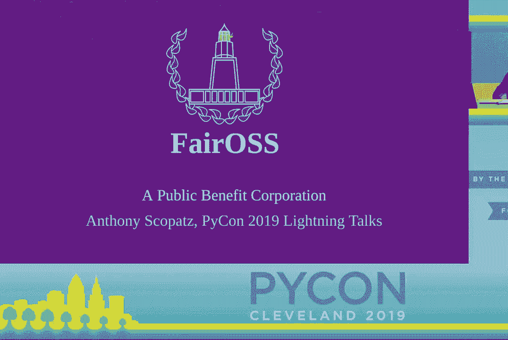

 It's a public benefit corporation。 Before we get into that， just a couple of moments on who I am。

 I am the founding treasurer of Numb Focus。 I've been around the PIE data。

 SIPIE ecosystem for a really long time， and I work at Quantite now。

 And FAIR OSS is my next big thing。 So， what is FAIR OSS？

 So it is a public benefit corporation structured around FAIR open source。

 and then the last S can mean one of three things， depending on how you want to look at it。

 So either society， sustainability， or software。 And really what this means is， or what our goal is。

 rather， is to amplify the production and maintenance of the product。

 And maintenance of freely shareable intellectual property。

 So we all know that open source software has a huge maintenance burden。

 and we're trying to tackle that in a community led developer owned way。

 And so we're trying to set up a system that isn't a 501(c)(3) like Numb Focus。

 but instead is this public benefit corporation that everyone can be a part of。

 And you can think about this kind of analogous to other public benefit corporations that exist that we all kind of know and love。

 like the fair trade movement， organic certification， and those kinds of labeling activities。

 And so there's sort of two sides to this， right？ So the one side is you all， right？

 It's the developers and the creators of the open source software or other intellectual property。

 And this is where your input is really needed on what does it mean to be fair and how you want to participate in with companies in a fair way。

 And then the other side is the businesses。 So， you know。

 what Farrow Assess will be doing is we'll be providing certifications that businesses are adhering to the best principles of our ecosystem and our communities。

 And there's a number of strategies there。 But we're in the very early stages of just setting this up。

 We finally incorporated on Thursday， so that's excellent。

 And one thing I think we need to be successful is to really connect with communities outside of the Python community and outside of the PiData community。

 Obviously we want to start here， but there's a lot of open source software out there in the world。

 And， you know， we need more eyes than just ourselves。 So， to that end。

 we're developing what we're -- for lack of a better term right now， we're calling equity badges。

 So there's obviously a few different levels， right？ So you can think of this as sort of silver。

 gold， platinum。 We might come up with different names。

 But basically what happens is -- or what we envision happening is that Farrow Assess will go out and certify a business that they're responsibly and sustainably using open source in some way。

 And then we'll license to them a trademark that they can use that then you all will know this company is doing open source the right way。

 And they can use that in marketing and recruitment。

 So that's kind of the fund -- one of the fundraising mechanisms that will employ。

 And then we'll use that money from the licensing to feed back into the maintenance。

 pay for maintainers to do maintenance and those other activities。 And so really。

 if a company is successful， then the open source projects that they're using are also successful。

 So we're trying to couple those things a little -- a lot more than they are right now。

 And companies that are sort of already engaging with us in this process。

 even though we're in a really early stage are --， Auto， Auto， Tenavox， Verdelo， Saturn Cloud。

 Open Teams， and， of course， Quantsite and/Quonsite Futures。

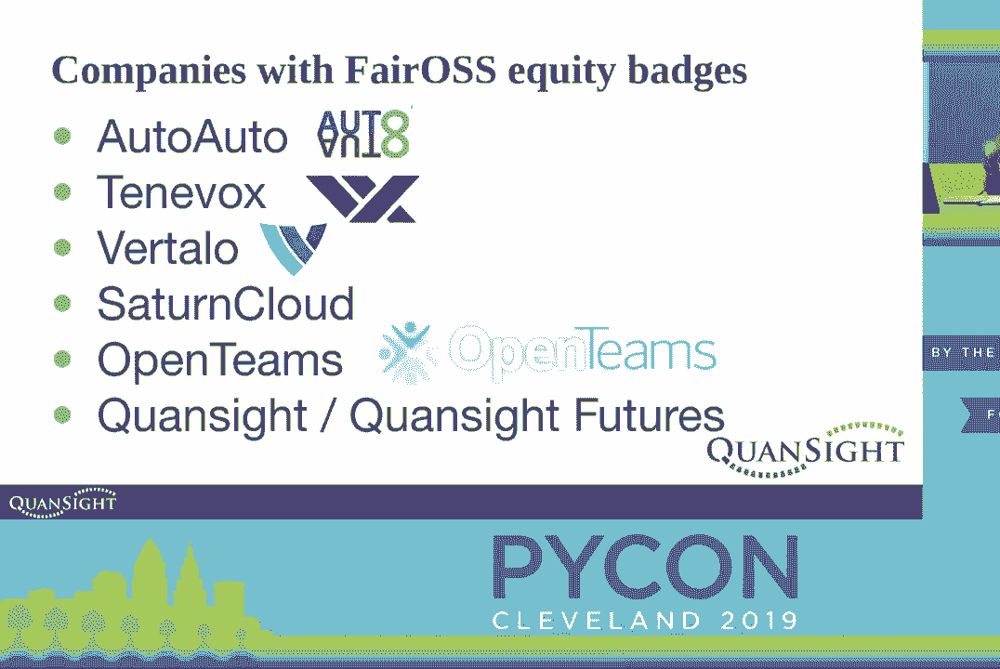

 So thank you all。 We'd love to hear your feedback。 Just， I'm @SCOPats， kind of everywhere。

 or you can email me。 It's going to be a great journey。 Thanks。

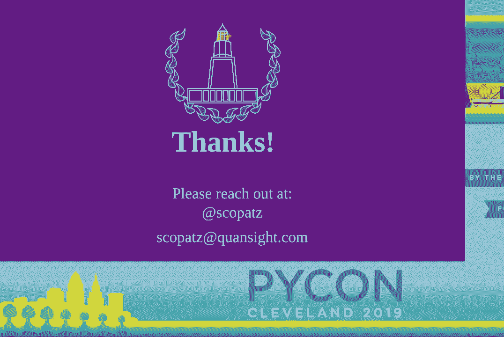

 [applause]， Thank you， Anthony。 Can I also get a round of applause for the AV technicians who， like。

 took this failing laptop as an absolute challenge。 They would not give up。 They had one。

 There were two of them。 They switched it on and off about 12 times。 And it is now finally working。

 So Joey is going to be able to give us this talk。 Please give him a round of applause。 [applause]。

 All right。 So what a fitting introduction。 This is sort of the premise of my talk is kind of easing the experience for developers whenever they're beginning on a project。

 So this always comes up， at least whenever I'm developing a feature or working with some users。

 We always talk about the user experience。 This， not so much。 This doesn't always often come up。

 And so， at MailChimp， I hear this a lot。 I've heard this every software project I've ever worked on in my entire life。

 And I think I'll always probably hear that。 And I feel like I encountered that today during my presentation。

 I feel like every single speaker has had zero issue。 And then I come up here and had several。

 So at MailChimp， we kind of have some， some givens。 Basically。

 we sort of have a very uniform hardware and OS environment。 So we all pretty much have MacBook Pros。

 And then we all mostly run macOS。 Some people， you do have the freedom and flexibility to choose Linux if you want。

 But a lot of our tooling and a lot of our decisions are made under the assumption that our development teams will be using this kind of uniform environment。

 So we covered those first。 And then sort of when you choose Linux。

 that's a sort of choose your own adventure。 And then I also tend to support my Linux users。

 at least for the internal products that I work for。 I try to include everybody。

 but not every team will have that kind of flexibility。

 So this is sort of sort of an engineering message that we carry internally at MailChimp。

 And so it's the idea of reducing cognitive load as much as possible。 And so again。

 this kind of follows the pattern of having a uniform environment where I don't have to consider every single tiny little edge case。

 I can hit sort of the main group and then that encompasses everything。

 So these are kind of some of the things that keep in mind。 Again。

 this is a little bit opinionated and given how we do things where we are。

 And hopefully you can apply it to your development project。 And then this is another one。

 So what I'm about to tell you in demo in a second， it's not going to be new and trendy。

 I'm pretty sure the majority of you will maybe roll your eyes or begin looking at your phone and scrolling through Twitter。

 but that's okay。 The idea is just to kind of work towards what can get us going and what can get us developing features and increasing our user experience and helping them and our developer experience by not over-complicating。

 So with that， we'll go ahead。

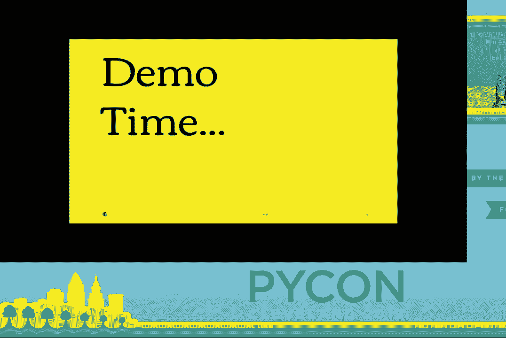

 Oops， wrong way。 Demo。 So this would be basically just a kind of a blank。

 empty demo kind of application， but typically this is sort of what something would look like。

 And so you'll notice that there's this script directory。 Hopefully this is big enough。

 I can increase it。 Oops。 Oops。 Maybe I can't。 Nope。 Sorry about that。 There's my history。 So。

 so I'll try again。 So here's your directory。 Again， we have this script directory。

 And so what's in here， these are all mostly bash scripts that actually run and each one has a very clear purpose。

 And these are very uniformly named across the company in every single project that we have。

 And so when I come into a project， all I do is I clone the repo out of GitHub。

 And then basically I know that I already have my machine as set with the core things that I need。

 And then I begin running sort of like a certain script。

 So one thing that we often do is if you run script help。

 that kind of gives you a directory listing of everything that's here and what you need to run。

 And so the ones I like to point out is we have a script/bootstrap。

 And so basically you just run this and then in a few minutes later it downloads basically all the software。

 all the libraries， all the dependencies， everything you need。

 It checks all of your configuration of anything locally installed。

 But we do have our development environments for the most part in Docker。

 And so basically it's just making sure your Docker environments there。

 There's no kind of special configs。 And if there is， it alerts you。 And then again。

 all of these little helpers。 So when we want to vendor something， add it in， remove it。

 There's a helper for you。 So you would just say vendor install package name。

 I want to remove this package， vendor uninstall。 And then it would remove it from the project。

 And so that's kind of basically it。 If this interests you or anything。

 it's sort of a different pattern。 The more common one that you may see is make files。

 There's a lot of reasons why we don't use make files internally。

 And I can discuss that if you'd like。 But there we go。 Thank you very much。 [Applause]。

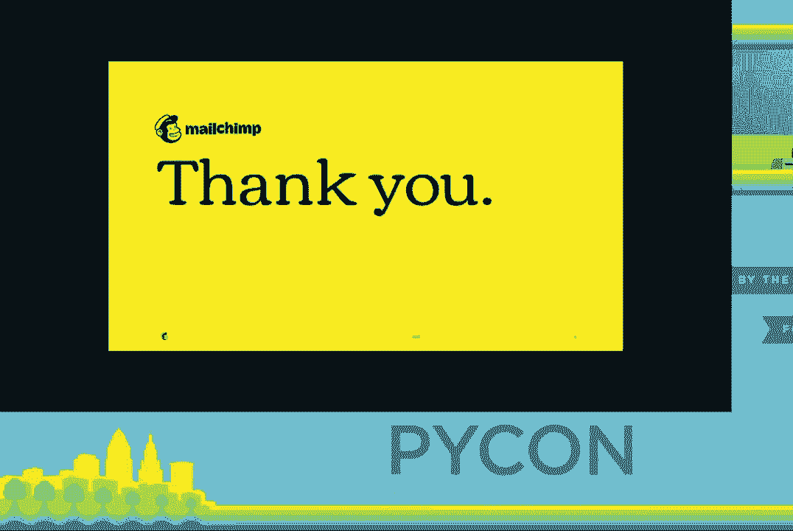

 Thank you very much。 A little bit of housekeeping。

 Anyone that was thinking of doing a lightning talk about a conference， we actually have a。

 special slot for people who want to announce conferences。

 And we basically give conference speakers just one minute and one slide。

 And we do that on Sunday morning。 So if you'd like to advertise one of your local conferences or even the next。

 Python， I don't know， maybe someone will advertise next conference in more than one。

 slide and more than one minute。 Yes， please send us your slides。

 And we'll fit a slot for just all the conference announcements。

 Tomorrow morning on Sunday at what is also a very good slot for lightning talks。

 I am certainly looking forward to the 8。30am Sunday lightning talks session that I have to， chat。

 Yeah。

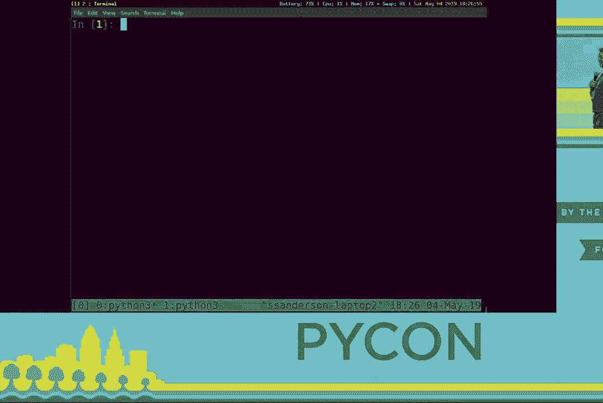

 So please give， I was going to say Scott。 Yes， please give Scott a huge hat。 [Applause]。

 Hello everybody。 My name is Scott Sanderson。 I'm a software engineer working for a startup in Boston called Quantopian。

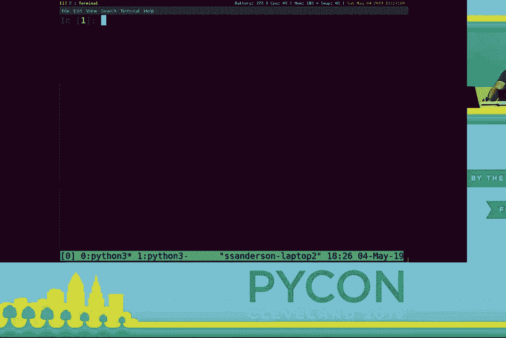

 And that's my day job。 In my spare time， I often enjoy working on strange。

 unreasonable meta programming， projects。 So if you may remember me from last year。

 I showed you how to take all the expressive。

 power of C-style for loops and put them in your Python class bodies。 And so I was thinking。

 you know， what knew kinds of expressive power we could add to， the Python language。 And， you know。

 I thought and thought I had some kind of different ideas。

 And then I realized that I was really being selfish in how I was trying to add new。

 features to the language。 You know， I think that really is rooted in the fact that I'm part of the millennial。

 generation， which if you watch any cable news you know is the most selfish generation。

 And I think Python unfortunately is language contributes a lot to that selfish。

 Because we use the keyword self in a lot of places。 You know， we have self。x， self。y。

 We use self everywhere。 And so I was trying to think of ways how can I make the Python language less selfish。

 So this is writing selfless Python。

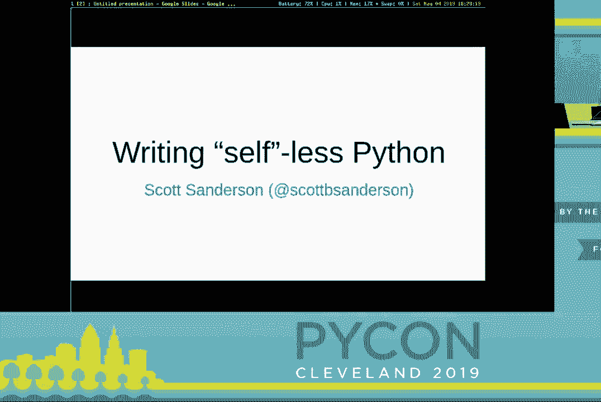

 And the answer that I came up with is this little library。

 So I can do from selfless import selfless。 And when we're self in a selfless society we also don't have classes anymore。

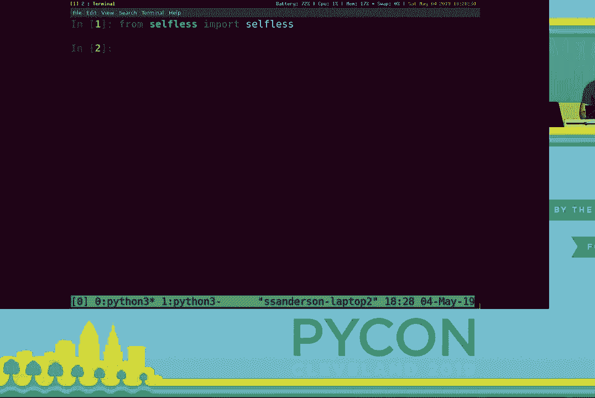

 Or at least we don't talk about classes explicitly。

 So in our selfless programs what we're going to do is we're going to write classes but。

 we're going to pretend as though they were functioned。

 So I'm going to write a function and decorate it with selfless。

 And then we're going to make like a simple two dimensional vector class with an x field。

 and a y field。 So I'm going to do def， vac two。 X， y。

 And we need to assign the local variable or the instance variables of our class。

 So we're just going to do x equals x and y equals y。

 And then we should probably put a wrapper on our class so we can read it nicely。

 So I'm just going to do def， dunder wrapper。 No arguments。

 And then we'll return， we'll use a fancy new Python feature， f strings。

 If you're not using f strings already they're awesome。

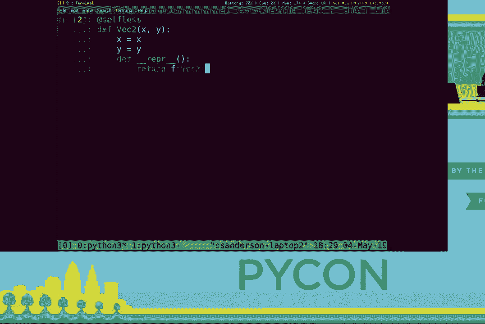

 We'll do x equals x and y equals y。

 And so now if we look at my vac two here you might expect us to have a function here but。

 in fact vac two is a type。 So I can do v equals vac two。

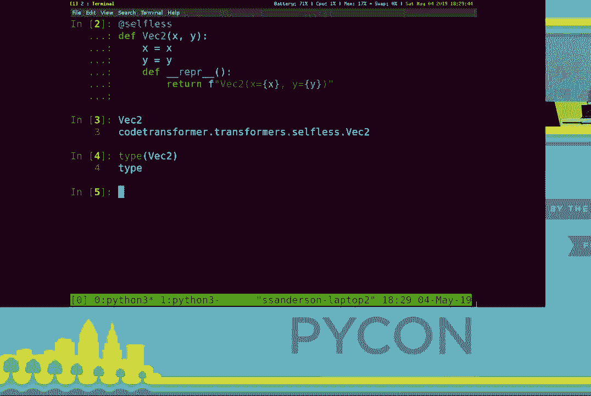

 Construct that。 And I've got a vector here with two fields， x and y。

 And of course we can add more methods to our vector class。

 So if I want to add say like an add method to this。 So you know， def， add x， y。

 And we're going to return a new vector。 And we'll do x。

 And we need to get that local variable out of our class of course。

 Sorry this should be another vector。

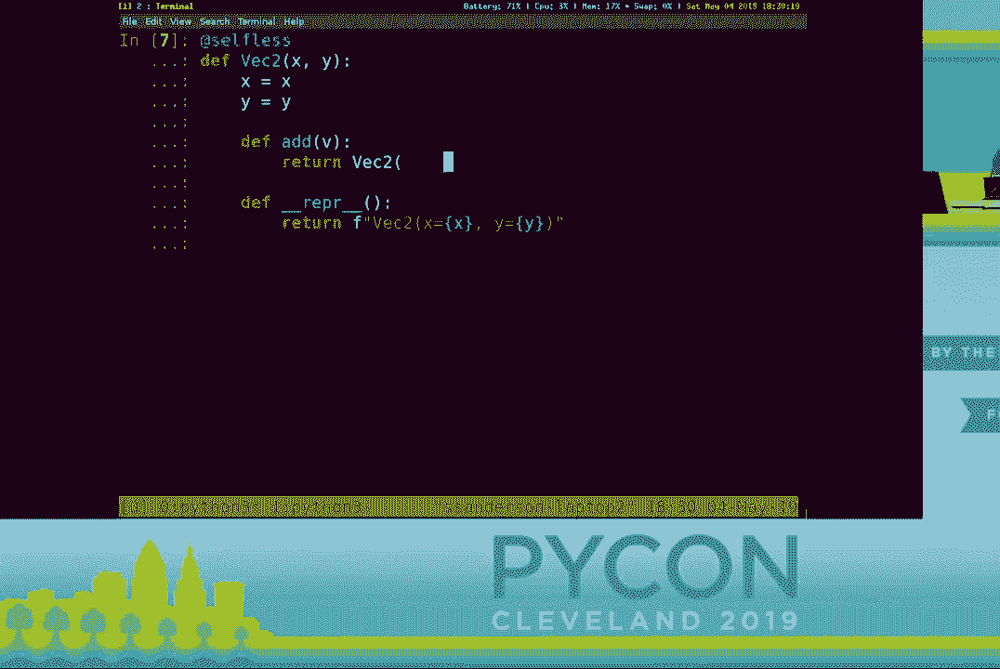

 So we need to get x out of not self but our vector。

 So we'll do x plus v dot x and y plus v dot y。

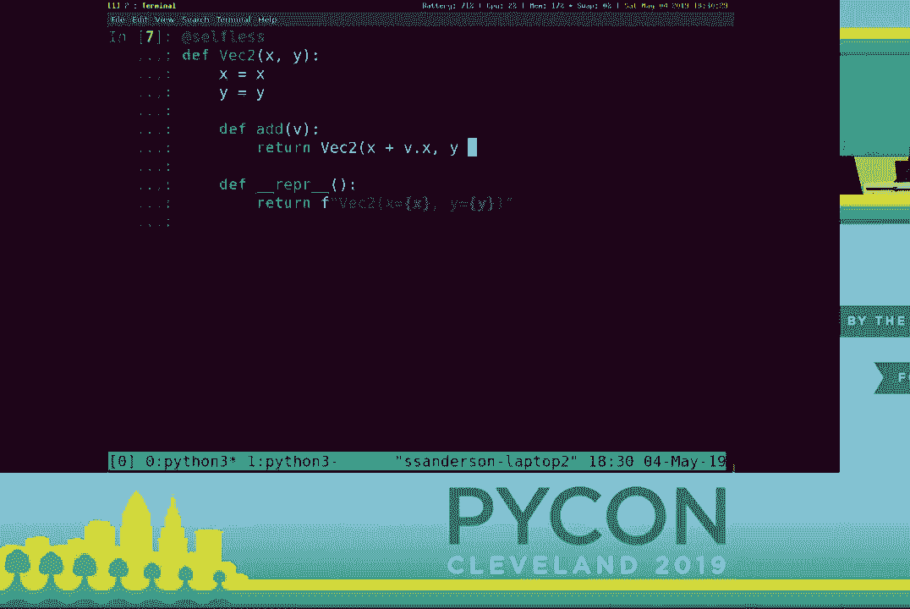

 And now if I do vac two， one， two， and I'm going to v dot add v。 Now I get a new vector。

 So this should be like moderately concerning to you probably I think。

 But so far we're only reading local variables and of course we all know that the most important。

 best code uses mutable state as much as possible。

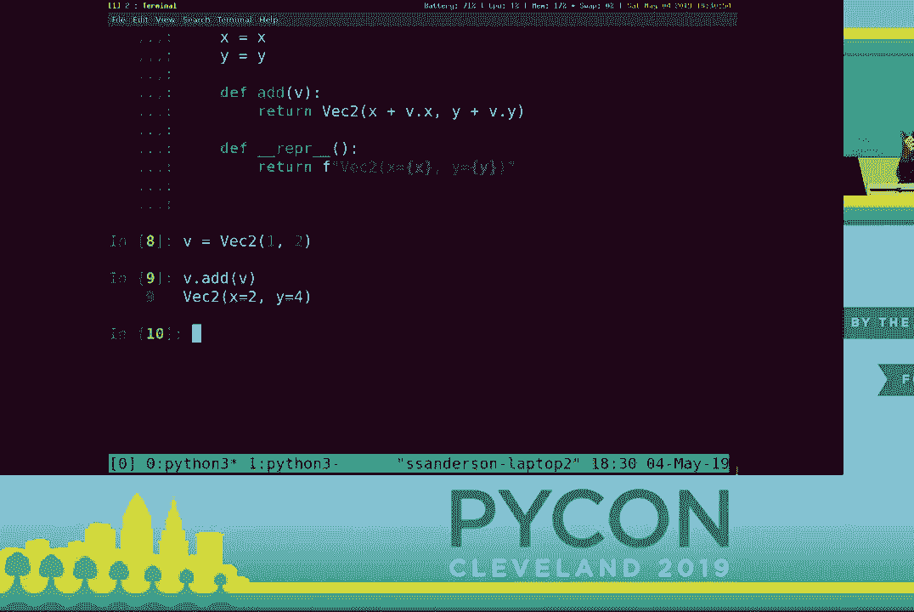

 So we need to make sure we can mutate these variables as well。

 So we can just do that like def set x and we'll take like a new x。

 And then it's important that mutation of a local variable on our function looks the same as mutation of an instance variable of the class。

 So we can make that happen。 So I can just do x equals new x。 Someone's enjoying that。

 And so now I've got my vector but I can do v dot set x ten and now my vector is ten。

 So if you're curious or horrified or both by any of this and you want to learn about how this works。

 This is using a library that I maintain called code transformer where I've implemented this idea。

 There's still some kinks to be worked out but I think this might be the future of a selfless classless Python。

 Thank you very much。

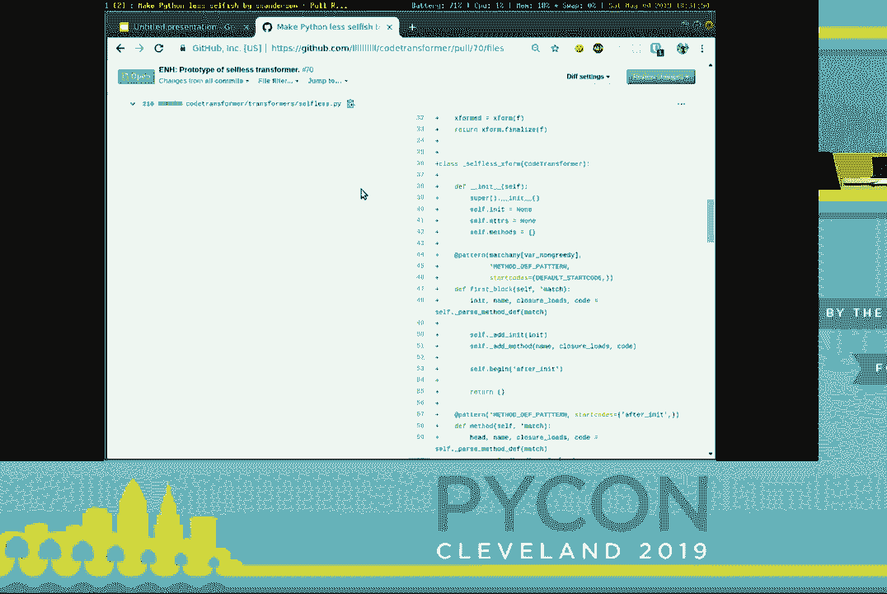

 Thank you all。 Next speaker is Travis。 Are you ready to go？ Take it away Travis。 All right。

 Give it a big hand first。 Can you hear me？ Does Mike on now？ All right。 Great。

 I don't know whether to be scared or excited by that。 That was pretty interesting。

 I get to talk to a lot of folks at quant site also who do interesting things but also a little nervous kinds of things。

 There's a lot of things to explore in the world。 I'm here to talk about quant site initiate which is one of the new things we're doing at quant site to help companies grow out of open source。

 I really want to help。 I realize what I want to do when I grow up。

 I want to help people build companies。 It was the founder of Anaconda helped Anaconda grow and now at quant site we're trying to help other companies grow as well。

 So we spun out of Anaconda。 We formed quant site and we hope to spin out multiple companies。

 We're a service organization at heart but we build companies。

 One of the things we're doing is quant site labs。 Rolf Gomers just joined us as the director and the goal there is to build a group of maintainers for the NumPy ecosystem。

 Started the NumPy project started the sci-fi project。

 Then lots of work in the open source community but kind of feel guilty that there's nobody funding this stuff still。

 There's just a bunch of people out there volunteers。

 wonderful volunteers but nobody's funding it primarily。 So we're working at that。

 Quant site labs will host and hire people to work in that community。

 I'm excited about that but not going to talk about that。

 I'm going to talk about open source leading the world。

 This is a famous quote by Andreas and Horowitz but it's not just software open source。

 I believe that all software in the future foundation of that software will be open source。

 There'll be some proprietary software but the foundation will be open source。

 All the major buzzwords all based on open source。 It's winning and there's articles out there to talk about why it's winning。

 Most of them actually don't recognize that the big reason it's winning is because of the community。

 It's about the connectivity it gives us with each other。 It's about connecting people。

 That's why it's very similar to businesses。 Business is about connecting people also。

 So Quant's that initiative is about trying to help businesses connect with the communities that they're serving and build new profitable explosive businesses around open source。

 I've been involved with open source a long， long time。

 Some of this is giving me some useful information。 Some of these things I probably need to unlearn。

 But nonetheless， I've learned a lot about appropriate ways that people can make money inside of communities。

 help those communities and sustain them together。 So Quant's an initiate。

 It's an early stage seed fund。 We invest in companies that use and rely heavily on open source software。

 Companies of interest， they can be anything， come inspire me。

 come excite me about something you're working on。 Tools and platforms that improve OSS collaboration。

 Disruptions are legacy software。 There's a lot of that opportunity out there。

 Officially solve a broad pain point using open source。

 Quant site itself is a service organization that spins out companies as well。 We help those as well。

 We have a current portfolio with still early stages。 We're just kicking off the ground。

 But Save Day， Ten of Ox， Rotolo and Aconda， Auto Auto， Saturn， Cloud， Farrow Assas。

 These are all early stage companies。 I'll tell you briefly before I go about one of them。

 We're really excited about it。 Open teams just started。 We just hired the CEO of this company。

 She's going to basically take it and make it big。 And Open teams is about helping people create。

 share and sustain open source projects。 It connects communities and companies at scale。

 Once I does that， we do it on a service basis。 We do it on a small basis with individuals。

 We can only scale to about 100 people。 Open teams is about helping us scale that to millions of people。

 connecting hundreds of， thousands of companies。 That's our goal with Open teams。 Connect， sign up。

 log in。 You can make a profile for yourself， away from you to showcase what you do。

 We want to make sure people get the credit they deserve， the open source they contribute to。

 Not just the code credit， but also the presentation credit， the help credit。

 the stack overflow credit。 All the kinds of contributors that make open source work。

 Let's have all those folks get the credit they deserve from the communities who want to give it to them。

 And then using that， help them get connected to the companies that want to build with those open source software。

 That they're building。 So help people get compensated for their work。

 showcase their contributions and then help you as a company recruit open source contributors。

 As well as build projects around your organization。 So this is just kicking off its early stages。

 There's something there now。 Be looking for over the next few months。

 There will be a revamp of the site and it will be even nicer and even better。

 But a place to kind of show your support and get involved。

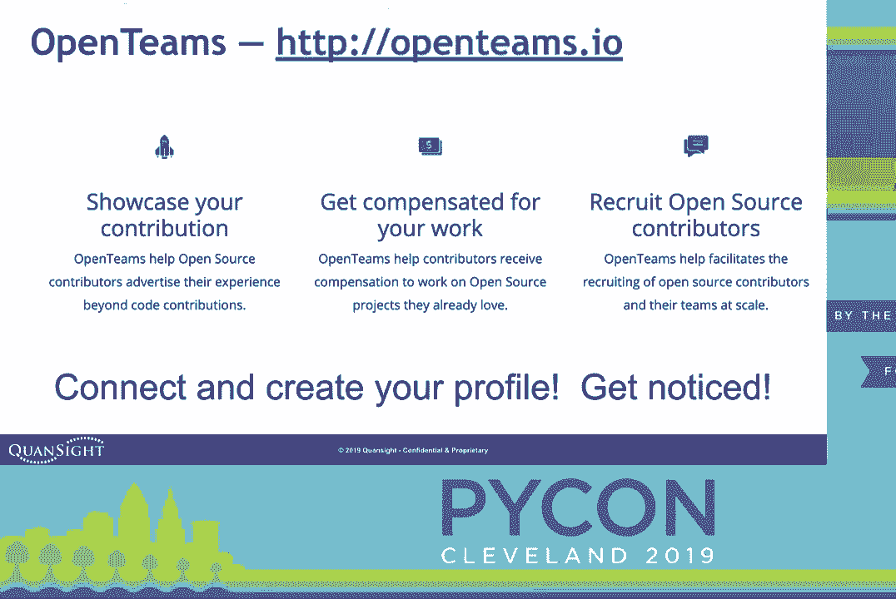

 So that's Open teams。 That's Quantz that initiate。 Come talk to me。 Love to be a part of our family。

 Thanks。 [Applause]， Thank you very much。 Ramy， do you want to do a microphone check？ Hello。 Hi。

 I worked。 Ramy， please give Ramy a big hand。 [Applause]， Hello。 That worked。 My name is Ramy。

 Like I said。 And I'd like to talk to you about comments。

 So we're sometimes told and I know I've told people this in the past that comments are for like the future version of you。

 And that's why you should write them。 I've changed my mind on this a little bit。

 I'm not entirely -- I'm not sure that's entirely true。 But you should write them anyway。

 So the thing is as developers we get mixed messages about commenting our code。

 We're taught sometimes to comment profusely。 Put comments everywhere。

 That way everyone knows what's going on。 And we're taught other times that actually commenting is redundant and your。

 coach should be self-explanatory and people should just read the docs if they don't know what it does。

 And who has time anyway， right？ Well， all right。 Who wants to read code like that？

 Raise your hand if you know exactly what's going on right now。 I didn't think so。 Okay。

 Let's refactor it。 Let's refactor it at some meaningful variable names。 You know。

 call some methods instead of using obscure operators。 Still know what's going on？ No。 Okay。

 How about now？ I don't know about you。 I actually find it much easier to understand what's going on now even with the harder read version of the code because there's context。

 We're all problem solvers， but to solve problems efficiently and effectively you need context。

 So also the thing to remember and the thing that I want to remind people is that your primary domain is many other people's secondary domain。

 So I've given everyone a chance to look at this code。 Raise your hand if you know what's going on。

 All right。 I see a small number of hands up。 Okay。 How about now？ You know what's going on？

 As good problem solvers， we don't just work in isolation。

 We know that our solutions are read much more often than they're written。 And， you know。

 a little bit of this， let's say you're a data scientist and， you know。

 one of your co-workers who's primarily web developer goes in and has to work on some of your code。

 Well， this way you can be pretty sure that they're going to do it right。

 They're not going to change any of the logic that you work so hard to perfect。

 And they know what's going on in your code。 I don't want to hate on web developers。

 I'm a web developer myself。 Let's say you're a web developer and you say， okay。

 I have helped my data scientist call you exposed some functionality as a REST API。

 I've given this code snippet， call it a day。 We're good。 Oh， how about now？ See。

 now they make sure that they actually know how to use that code snippet。

 And they're not going to break stuff that you're going to be called upon to fix later。

 Comments are good。 Also remember that many other people's primary domain is your secondary domain。

 And so， you know， it kind of goes both ways。 Who looks at that React component and goes， whoo-hoo。

 I know what's happening。 Okay。 I see a small number of names。

 Tell how to people that's clear as day。 I still struggle with the order of arguments to reduce。

 I frequently forget to put the accumulator in。 Lots of things。

 I have to look at it to figure out what the hell's going on。 I find this much。

 much easier to understand。 There's comments。 I know what's going on。 And critically。

 I could make that one line change that I actually wanted to make without having to remember it。

 Things like the order of arguments to reduce or whether I should use， you know， accumulator。

concat or。push。

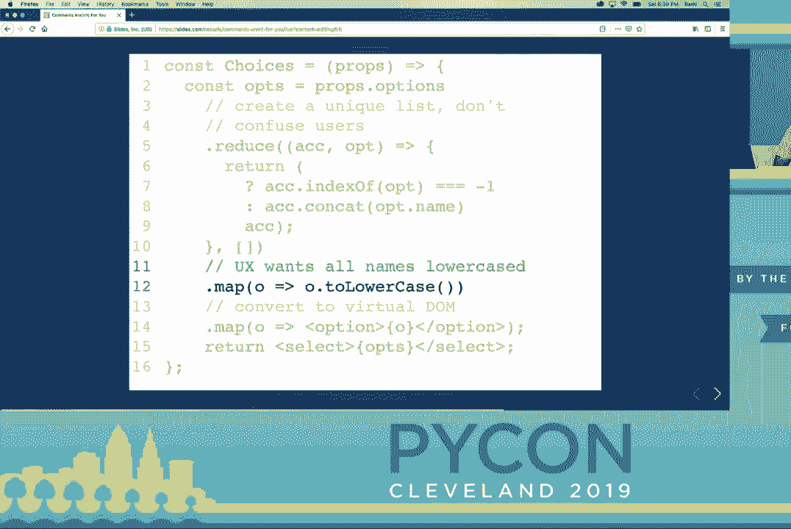

 So， even future you doesn't remember context。 So sometimes you're wary of over commenting。

 You're in the middle of flow。 You've got your code working。 You know what's happening。

 The person reviewing your code knows what's happening。

 You put a one-line comment in and you call it a day。 You commented， right？ You put context in。

 But then， six months later， someone looks at that code and says。

 were they having a philosophical discussion about the meaning of free will？ Oh， okay。

 That's what they were doing。 So this is for test to make sure we don't break our test。

 So now everybody's happy and we still have code coverage and our CI passes and github has a little green check mark。

 So I'm just saying think of other people that might read your code， not just future you。

 But if you're a data scientist， think of a web developer。 If you're a web developer。

 think of a DevOps person。 If you're a DevOps person， think of a data scientist。

 And if you're all three， come talk to me。 And you may be surprised by who your comments help out。

 even if they're not a traditional programmer。 So， yep。 I'm Rami。

 You can find me on the internet as an actress。 You can find me in real life by this giant purple hat。

 Thank you for listening。 [applause]。

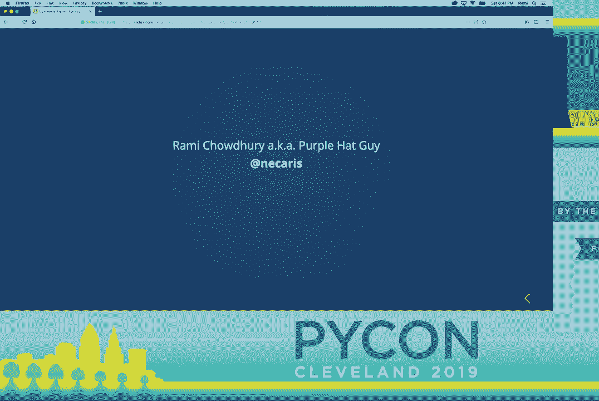

 Thanks very much。 Here's a tip for both seasoned conference goers and newcomers。

 When you're at lunch and you've lost all your normal friends。

 you could spend a long time trying to find your normal friends。

 Or just go and join a table full of random people。 It's a much better way of meeting people。

 So if you haven't done that， people do want you to come and sit at their table。

 interrupt their conversation。 Hi， my name's X。 What are you talking about？

 We're all here to meet new people。 That is one of the primary purposes of a conference。 So。

 if you're feeling shy about that， please do that。 If it hadn't occurred to you， please do that。

 Join a table of people you've never met before， each lunchtime。

 or whenever you're not with your friends。 With that said。

 please give our next speaker the biggest hand yet。 [applause]， Okay。 Okay， good evening。

 I'm here to introduce the Python test runner。

 It's a small Python wrapper to all our favorite tools that crawls your repo。 I'm Koopa Lee's。

 I work on those radios at Facebook， Facebook connectivity labs。 They're 60 gigahertz。

 wireless point-to-point radios。 It could do about 1。8 gigabit per second。

 And we had partners that wouldn't run our tests， so I tried to make it easier for them。

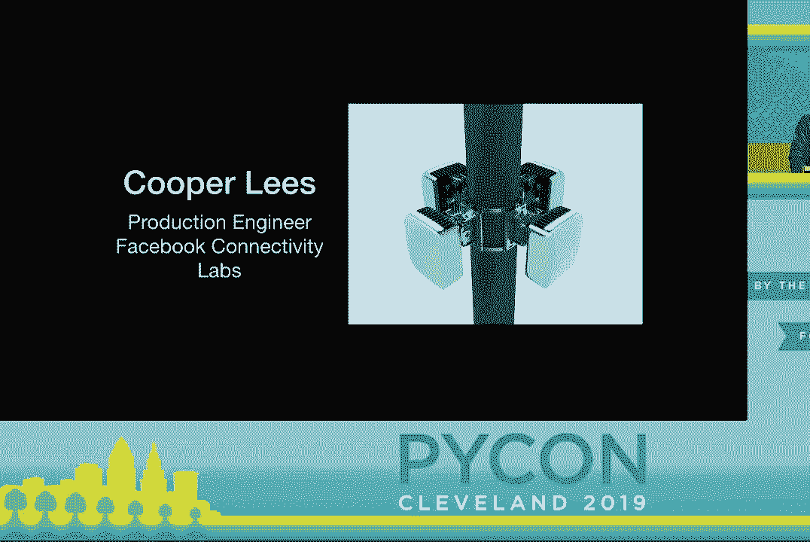

 Do you want CI， but it takes so long to set up？ Do you have multiple projects in one big repo？

 Do they all have different testing coverage， linting and formatting requirements？ If so。

 then PTR or Python test runner is probably for you。

 Also， it doesn't tie you into GitHub prehooks， so it can run in some vendors' strange CI environment。

 It runs on all modern operating systems。

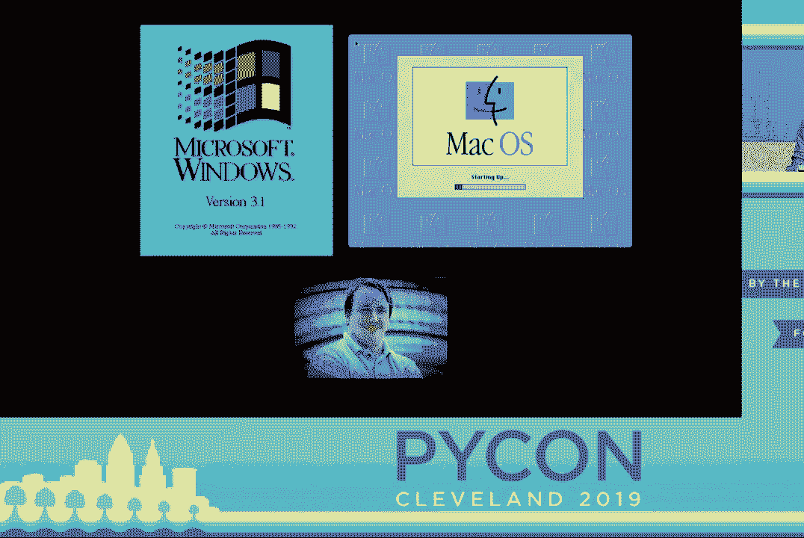

 And Linux。 And so what are we actually going to be doing？ So we're going to run unit tests。

 We have the ability to enforce coverage on per file basis。

 We can apply formatting with everyone's favorite formatter。

 We can check for lint errors and then we also do some static type analysis。

 All our favorite projects， as you'd expect。 Coverage， black， flake， 8， my， pie and pyre。

 which is Facebook's type checker。 So， just go off。

 run pip and store PTR and PTR helping away you go。 But let's have a quick look。

 What the nice thing it does different to talks or any other test runners is if you have a mono repo。

 where there's a project in A， B and C directories， we will crawl in there and look for a set up。cfg。

 or a set up。py。 And there'll be a stanza in your set up。

cfg that will take a look in a sec or in set up。cfg， you'll have a stanza in the I and I file。

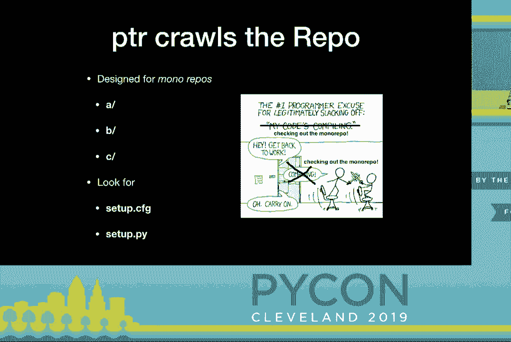

 It then also uses async。io to subprocess and run them all in parallel。

 And you can set that parallelism based on your AWS instances or capacity。

 The example set up。cfg you just have a PTR stanza。

 You said your entry point modules and some other if you want to run black， my， pie， et cetera。 So。

 if you go and look at the CI of PTR itself， it runs PTR。 So， it's testing meta， testing inception。

 And it will also run every single option。 Then， if you want to also， if you're still traditional。

 like I am， predominantly， you can add a dictionary， to set up。

py and we'll pass the AST to pull out that configuration and run the CI that you want。

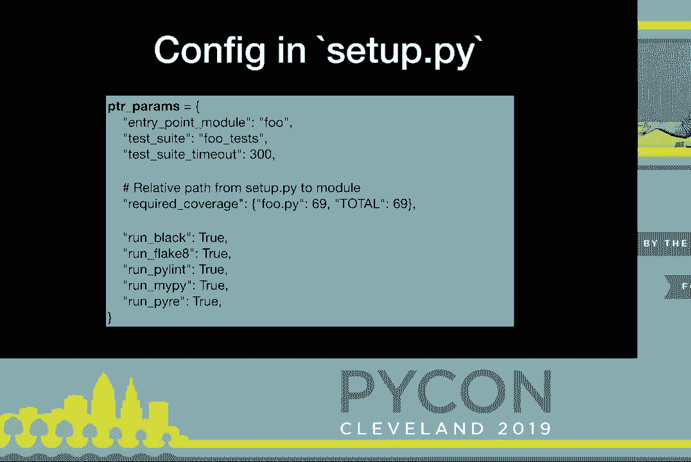

 To do a sample run， because I'm scared of live demos， basically make a virtual amp， install PTR。

 and then basically run it from the root of your repository。

 It'll crawl and find those configured projects and run all the CI that you ask it to。 Otherwise。

 you can use the -b option to just run your project while you're working on it。

 so you don't run the whole repo。 And you can use it locally on Mac windows and Linux。

 I'll be around at the sprints。 If you want to see it， I can help climb it up to CI。

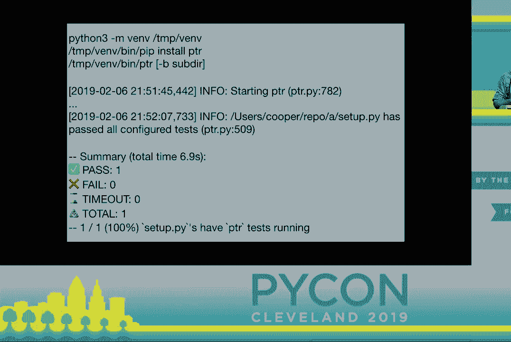

 That's PTR available now on PPI。 [Applause]。

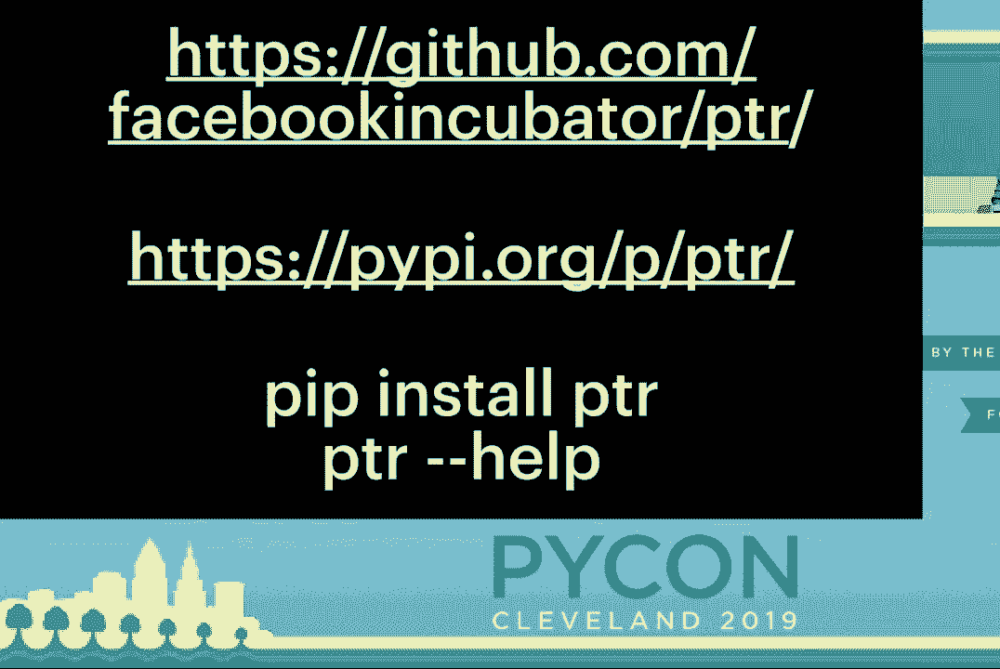

 Thanks very much。 Please give all of our Lightning talk speakers from today from yesterday。

 I'm from this evening。 A huge， huge hand。 Thanks very much to each and every one of you for coming here。

 for being here for this whole conference， specifically for this session。

 That is the end of PyCon's talks period for today， but there's lots more activities。

 as I'm sure you know。 Check out the open spaces， check out dinners， check out after party events。

 or get home early to bed。 That's one option。 If you have to come to the Lightning talks tomorrow morning。

 there are 8。30， not 8。31。 And people who are giving talks should be informed about those shortly。

 And so you have to show up like me at like 8。15。 Okay。 So that means you have to breakfast by 8。

 Work backwards。 If you've got jet lag that's getting you up at about 5 a。m。 every day。

 you might have a chance。 Otherwise it's just your commitment and discipline。 Ahhh。

 Good night everyone。 [Applause]。

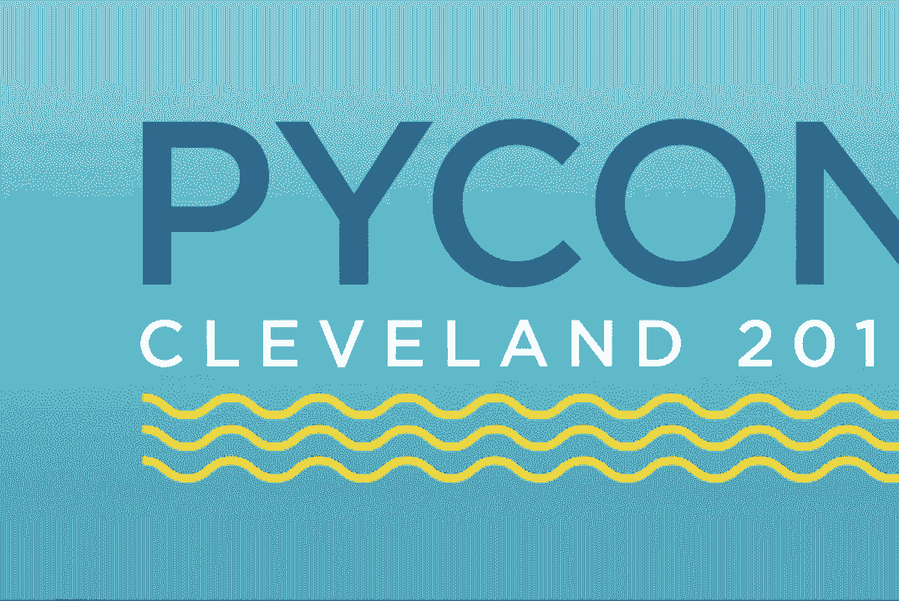