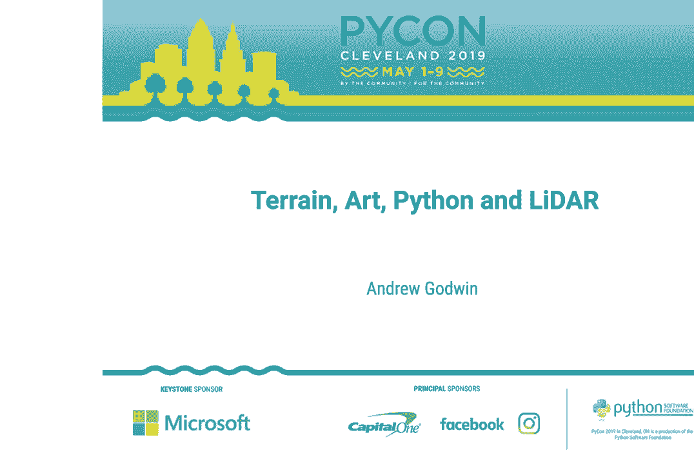
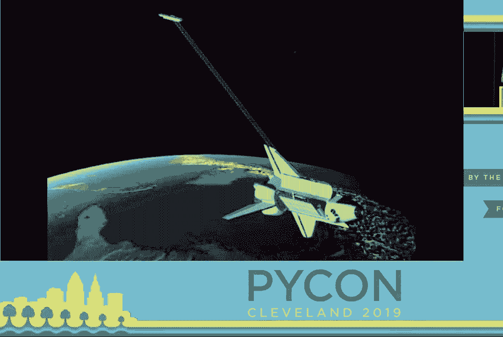
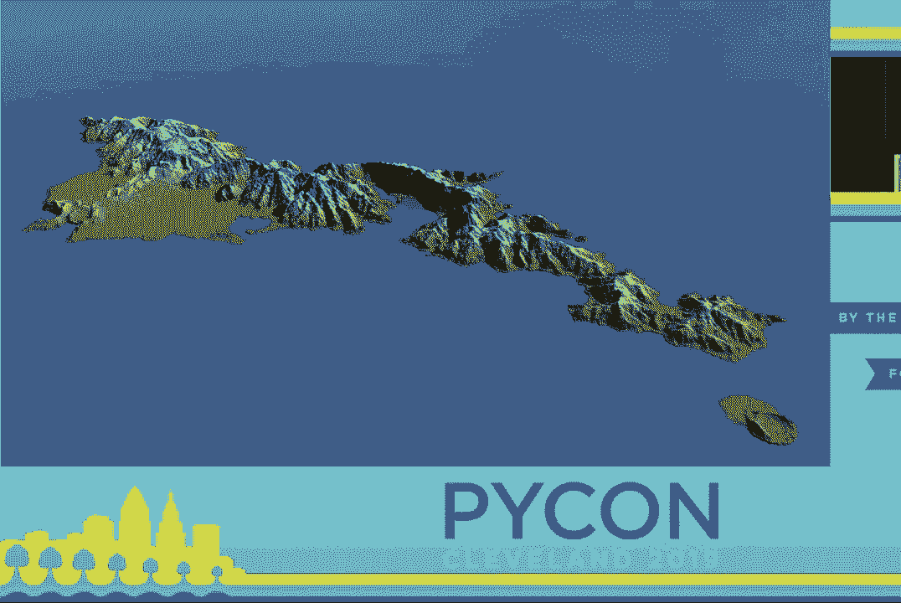
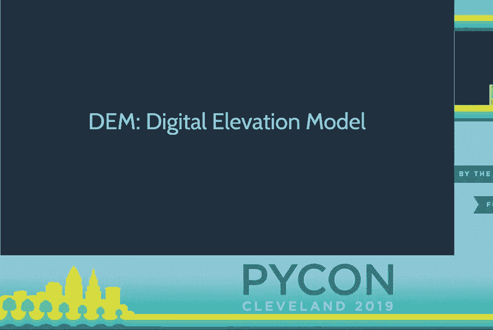
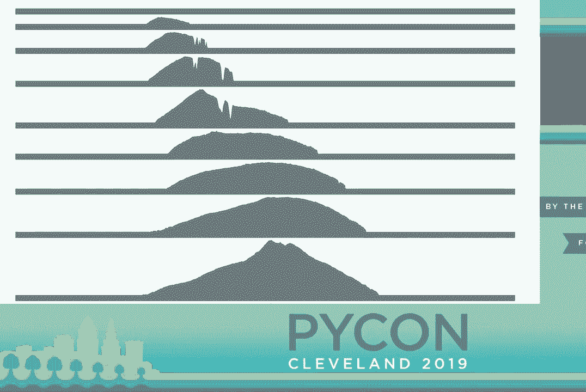

# P16：Andrew Godwin - Terrain, Art, Python and LiDAR - PyCon 2019 - leosan - BV1qt411g7JH

 Welcome everybody。 Our next talk is going to be Andrew Godwin speaking about terrain。

 art， Python， and LIDAR。 Please welcome Andrew Godwin。

 [ Applause ]， \>\> Good morning everybody and welcome to my wonderful talk about terrain。 A quick introduction， I'm Andrew Godwin。 I'm perhaps most well-known for my work on Django。

 migrations and south and most recently channels and async。 I'm a principal engineer over at Eventbrite in San Francisco。 I do own a lot of lasers。

 I do require more。 I will see during the course of my presentation。 But this talk is not about Django， which is unusual for me。 This talk is about landscapes。

 I'm a big fan of the natural world and particularly， of mapping and topography。 For centuries we have tried to map our world to increasing degrees of accuracy。

 First it was people with sticks up mountains looking through holes， not particularly accurate。 Then we got better， we got ranging， we got lasers。

 But eventually we figured we wanted a whole global map of the entire planet。 What does it look like？

 What are all the mountain ranges？ What are all the valleys？ And so in the '90s we had this。 which is the shuttle radar topography mission。 They basically stuck two giant radar dishes on the space shuttle。

 one in the payload bay， one at the end of a long wire and flew around the entire earth to get the first ever complete。 mapping of the earth's surface。 It has height values for every single part of the earth I could get to。

 It's not particularly accurate。 It's about 30 meters accuracy。 But it is there。 And you get decent looking imagery like this。

 It works well at those sort of wide scales。 It shows islands well， it shows mountains well。 It shows valleys well。 The problem is， as I said， it's 30 meters。

 It can't resolve things smaller than that。 And it also can't see behind valleys。 There's actually quite a lot of holes in the data where the shuttle was at an angle。

 And as the radar is scanning， it can't actually see over a mountain in the valley behind it。 And you look at the raw data， you just have sort of one side of a mountain and a mysterious hole on the other side。

 And so this is a great start of data。 But we've progressed。 And we now have crucially lasers。 Space and lasers。 Great combination。

 And we took these lasers and we did what we do with radar。 And with radar。 that's radio detection and ranging。 We'd say with light， which is light detection and ranging。

 That's what LiDAR is。 LiDAR is like radar。 It tells you where things are and how far away they are。 But crucially， it's incredibly accurate。 It can be accurate down to the centimeter。 In fact。

 these days more accurate than that。 And what this means is you can build an incredibly detailed map。 but of a smaller area。 LiDAR usually goes on something like an aircraft。

 as you can see here in the picture。 But also can be on a car or the device that moves along and you only map things around it。 And this is a crucial step。 We can take this kind of accurate range finding and map things like cities in perfect detail。

 In fact， in cities around the world， in most major cities and certainly in a lot of the US。 LiDAR surveying planes regularly fly over those cities， and map them in their entirety。

 If you ever seen Google Maps or Apple Maps or other things with 3D buildings。 those 3D buildings are built often from LiDAR data。

 It's those samples of the planes flying over regularly and taking those samples。 Now。 if you ever give me a large amount of interesting data， one thing immediately comes to mind。

 And that is I want to make things。 And so what I'm going to show you is how I took some Python。 took some data， and made a few things with them。 And hopefully show you a few ways you can use Python。

 maybe you've not thought of up until now。 So first off。 let's start with maybe the easier of the ones。 So before I get into what I'm making。

 let's talk about how the data I just talked about comes to you。 Now。 the first and easiest thing you'll often see is people call it DEM， a digital elevation model。

 If you work in games， this often is called a height map。 It's the same kind of idea。 It is a big bit map。

 and it contains data for how high everything is on a 2D plane。 On the left here。 you can see a small portion of London， and the interview of buildings and streets。 On the right。

 you can see part of Crater Lake and the namesake crater in the middle of it。 Both of these show you have this gray scale where in this rendering。

 the white is highest and the black is lowest。 Of course， the information in this is more detailed。 These are elevations in meters from sea level。 But at its core， it's just a big 2D array。

 You can take that big 2D array of numbers and just look through it and find out how high things are。 Every single pixel is just where it is and how high it is。 And thankfully， in Python。

 operating arrays is relatively easy。 My first project I wanted to look at was maybe the easiest to fabricate。 And fabrication is a big part of this， as we'll see。 It is this。

 This is a laser cut profile of the island of Hawaii。 There's a scale here for reference。 If you want to see these models all the way， I'll be outside at the end or find me during the conference。

 And the key thing is this is laser cutting。 Laser cutting is maybe the easiest of the fabrication methods I'm going to show you here today。 A laser cutter generally just needs one thing。 It needs a cut path。

 One of the nice things to make this with is SVG。 And so what you do is you take an SVG file。 you feed it to a laser cutter， it cuts it for you。 You take it out， glue it together。

 and you're done。 The gluing is honestly the most annoying part of that whole process。 But we have to make the SVG file。 As you can see here。

 what we have is not just that top surface of the parts of the island。 We have slices through it。 taken at certain intervals that have solid bases。 In order to make it look solid like you see here。

 you've got to have those slats that reach the end so I can glue them together。 And to do this， I。 of course， use Python。 I took that DEM。 I turned it into CSV because I'm lazy and don't want to use geospatial libraries just yet。

 I read it in with Python CSV library。 And then did a very simple thing of just picking every 200th row sampling the data in that and during a contour out using the SVG right library。 It's a relatively sort of simple set of things to put together。 There's a lot of debugging。

 Obviously， it's not simple in itself。 One of the fascinating things you find is if you just do this as you expect it。 you get incredibly flat vectors out。 It turns out that the way you think the earth looks from height is not how it actually looks。

 It's actually much flatter than you expect。 And so everything you see for me today is exaggerated in the。 what I'm going to call the Z dimension， the height axis， by 1。5 to 2 times at least。

 And that's what this is applied to as well。 And so we take that， those right， those rows。 we write them out to an SVG file。 We feed them to a laser cutter like this one。

 my local maker space， and then we do them together。 One of the fun things about this particular adventure was that this method works very well for small islands。

 It works very poorly for anything else。 If you can even see it， this is Scotland。 I love Scotland。 It's an amazing mountainous place， but you couldn't tell。 It's a case of like。

 the exaggeration you get， like Hawaii is perfect。 It's a New Zealand that actually is too。 They rise out of the sea very sharply and have a defined shape。

 When you take something like Scotland， it's full of wonderful locks and valleys。 But when you shrink it down， it just doesn't work at small scale。 A part of Scotland。

 like one of the isles， would work fantastic， but it does not work as an overall project。 And this is where I start thinking in different scales。 But first。

 I'm going to go to a smaller scale。 Two cities。 This is maybe the project I got most press about。 which I'm quite happy about。 There was a right of in Forbes at one point， which is exciting。

 But let's go back to that LIDAR image。 So what I've shown you is very large scale data。 The Hawaii data is from that original shuttle mission。 It's very wide ranging。

 You can get the whole earth in about a gigabyte or two of data。 It's not too bad。 But cities are a different matter entirely。 Cities are so precise。

 The LIDAR image of London that you see on the left here is accurate within a half a meter。 It's about this much， if you're from America， which most of you are。

 And what that means is you can not just render individual buildings。 You can render individual trees。 You can see things like cars and railway lines that you just couldn't see from any other data。

 It's incredible。 The result， by the way， looks like this。 This is a thing about this big that sits on my wall at home。

 which is a full detailed map of San Francisco in this case。 I'm on London， I'll show you later。 In its entire detail。 That is the entire San Francisco peninsula rendered about this big。

 You can see every individual building in San Francisco。 I can literally see where I live。 which is very exciting and kind of the point of this。 For reference， I have a size code here。

 This is a one square kilometer tile salvaged as one of the failures from that particular print。 There are over 100 of these in each of those because when you want to print something。

 I don't have a 3D printer that is a meter long。 I'd love one if anyone's selling one or for cheap。 but I don't have one of those。 The real problem you get to is not the fabrication that is a problem。

 The first problem you get to is the data。 So remember， I said there's a nice height map。 They read "knife"， they're bigger rays。 You can easily put them to CSV。 Now。

 when you get LiDAR data， it often comes in the form of what's called a point cloud。 Now。 a point cloud is basically a big collection of "here's the raw data， the planes。

 LiDAR pod got back as it flew over the city。"， If you're lucky。 they're already gridded up into one by one kilometer squares and aligned for you。

 And if you look at it from distance， it looks really sensible。 It looks solid。 You can see some features。 If you're familiar with San Francisco。

 that is the AT&T Ballpark on the coastline。 The problem is if you zoom in。 that illusion clearly vanishes。 It's not solid。 It's merely a series of points。

 All it is is literally the raw radar returns from every individual part of the landscape that the planes saw。 There is no continuous surface here。 You can't take this and print it out。

 You can't print zero dimensional dots。 And so the problem we have is we have to take this raw file and for reference。 a point cloud is literally a file full of three dimensional vectors like this pretty much。

 They come with some extra data like attributes and the intensity of the return。 but you're basically working with this kind of data。 And you have to turn it into a solid model。

 Now， this is a challenge I would love to take on， but I have only so much spare time and way too many hobbies。 And so what I do is I turn to existing tools。 In particular， there is， I think。

 the point cloud library， which is a very good way of handling point clouds。 not only in terms of reducing them down and making it easy to work with。

 but also extracting height maps or 3D surfaces。 There is also a standalone program called last tools。 It's not free， but it's free for small amounts of data。 That's much more of a plug and play。

 Give it a point cloud。 It will dump you out a height map。 No real sort of extra Python work required。 But crucially。

 both of these will take a raw point cloud like you saw。 A few variables like do you want to eliminate things like trees or do you want to try and find the actual height of the landscape？

 And they will then return you a height map out of that code。 Then you've got to change the manufacturing。 Now a height map， again。

 is just that top surface of the landscape。 A 3D printer can't print a basically two dimensional surface mapped on a 3D plane。 It needs something solid。 And so you have to take that top surface and you have to turn it into a fully sealed three dimensional model。

 Now， I happen to have a little bit of history in doing some game engine stuff and playing around on my spare time。 And that's where these kind of hobbies overlap。 A three dimensional model that a 3D printer takes has to be fully sealed。

 That means it has to have no gaps in it。 If you have a polygon missing。 it will just sit there and get very confused if you're unlucky。

 So the resulting file looks a bit like this。 This is a very。 very close zoom in of one of these tiles I showed you just now。

 Every single individual point on that height map has some polygons on the top surface。 But you see around the side there's a wall built to make sure that it's solid。

 And then again there's a wall on the base of it as well。 And how we do this？ Well。 a couple of steps。 First of all， again， we have to load in that digital elevation map， the DEM。

 And then there's some interesting steps because I didn't do the middle two steps at this the first time and the result was spectacular。 In that it was totally impossible to print。 First of all， you can click on maximum height。

 LIDAR is interesting。 It works on light。 It turns out things are reflective。 And when the laser pad surface often gets very confused。

 Especially over water or lots of glass buildings or even worse like fields of solar panels。 the laser returns will be incredibly spiky。 They'll just randomly jump up 100 meters and back down again。

 So you've got to do a first pass of taking that data and eliminating those high points that are obviously outliers or looks suspicious。 Then you've got to make sure that you actually can fit the entire height of your model in。

 London's got some very tall skyscrapers in it。 And so to make sure that you're actually going to fit that in the size you want to print your 3D model。 the higher your print is， the longer it takes to print。 And I'm an impatient man。

 And so I try and go for like two or three hours for each one。 But then the really fun part is you've got to clip at the bottom。 So London is a very big city。

 And at the time this laser data was taken， they were building the big new railway line。 which runs around 50 meters underneath London， because it's very dense really far down。

 There is a giant pit in the middle of London that is 50 meters deep。 And so the laser returns in this pit， readers minus 50。 If you're clipping。

 so if you're trying to print out with like， "Oh， well， the base of this is sea level。" you get a model that goes， "La la la la。"， And then just dips below itself and cuts through itself to 50 meters below itself。

 And rather than print a giant base and make the giant hole appear， I just cut it off at sea level。 So there's a few things like that you have to massage the data and make sure it fits。

 And a lot of this isn't in the pursuit of making it look good， right？

 Like this is not meant to be an accurate representation of the model。 It's meant to be a form of art， it's meant to look pleasant。 And part of this。

 as you'll see later is on with the other stuff I have， is maybe lying a bit about reality。 but making sure it looks nice。 For example， when I said I was actually a height。

 that's not quite true。 It's not just linear。 The small buildings are actually a bit more and the big buildings are shrunk a bit so you can see all those buildings individually。 They still look relatively bigger to each other， but you can actually see the small buildings more closely rather than being like a fraction of the height of those giant buildings。

 Once you've got that， if it's smoothed out the rough features。 even when it's not on reflective surfaces， LIDAR is just rough。

 It just reflects a bit and has some jaggedness。 So you're going to run a smoothing pass。 Again in Python， this is written as an array pass。 And then finally， write out an STL file。

 STL is a pretty common 3D model format。 If you're not familiar with 3D models。 you basically write out a series of what's called polygons。

 They are triangles with three corners on them in 3D space。 And thankfully。 STL is relatively simple format。 It's a giant binary file full of binary polygons。

 We have the struct module for that。 Thank you， struct。 You pop in your normal。 which is like the angle of the face of the polygon， your three corners。 And then for some reason。

 there's a zero in every part of the polygons in the file that is an extension that no software can read。 It's very exciting。 Thank you for that。 But you can do this in a Python for loop。

 So you just go through that array。 It writes out every single group of squares to polygons。 Then runs around the edges of the array to write out the walls and then just does the floor underneath。

 So it's a lot of work， a lot of complicated maths， but it ends up being there in the end。 Now。 maybe thinking here， should I have used NumPy？ Yes， I should。 Did I？ No。

 I had this tendency to just go in full speed and just start writing like on normal Python lists rather than actual proper NumPy arrays。 This is a failure of mine。 If you do this， please use NumPy。

 It has many of these things built in as standard operators， and it's much faster than my script is。 If you want to use this particular script is up on GitHub。

 the URL be up again at the end of the presentation。 It is a bit rough and ready。 There is some documentation， but not a lot。 But other people have made it work。

 And if you want to and have a lot of 3D printing time and space。 you can make San Francisco as seen here。 But let's go to one more fabrication。

 And this is the most difficult one。 So I want to go from the small scale of cities。 which I enjoy to the big scale。 I have a personal goal of visiting every single national park in the US。

 This may seem infeasible。 It is。 Do I like invisible goals？ Yes， I do。 There are 59 of them if you are counting。 And at least three of them have no roads。

 It is very exciting。 One of them you get a boat from a local fisherman。 It is great。 But I want to go visit them。 I want to represent that in a certain way。

 And so what I did is I started making miniature landscapes in the national parks。 But this time not out of plastic from the 3D printer， but out of metal。 For size reference。

 this is one of the ones you see on screen。 That on screen there is great sand in Colorado。 Fantastic place。 I recommend it highly。 There is some big sand dunes。

 But the fun thing about this is it is not just a case of shipping a model through a 3D printer the same way it was before。 You have a milling machine。 Rather than adding to nothing。

 you have to subtract from a block of aluminium。 You have this giant spinning machine of death。 It sits there for like four hours grinding away at it。

 And crucially one of the big problems I faced is that I have to find these outlines。 I can't cut out a square。 I want the actual outline of the park and the shape of that。

 I find that quite memorable。 This requires a bit of GIS work。 This is like the only non-Python。 QGIS runs on the Python itself。 But you can take the US national DEM which has its name suggests is a height map of the entire United States。

 Thank you USGS for that。 You can take a different set of outlines of national parks。 And then you can use QGIS to cut out the park from the national map。

 And so you get that just outline of the national park。 The problem is the format you are using for DEM is still a 2D array。

 It is still just a grid of values。 But the shape you want is a regular。 The way you represent that in a DEM is I think called no data。

 Which in an amazing programming fashion is just the value -99。99。 Because someone figured there is nothing on earth that is low。

 And so you have to sit there and filter that out。 But crucially also my software I wrote that I showed you now for the city tiles assumed a square。 Because I was lazy。 I said previously。 And so to go back and modify that software to make it understand well there might be edges in here。

 And rather than going around the edge of the square you have to work out where the edges are。 Bring that in and then it now basically works out the outer perimeter of that part of the model。

 And that is where it builds its wall and builds its solidity。 The nice thing is the driving programs for the milling machines do also take STL。

 So I can still use that part of my code again。 As a brief idea of what this looks like you take a DEM on the left there。 You can then make it into 3D model as you see in the middle。

 And then you can take that 3D model and spend a good hour in a tooling program for milling machines。 And then you can use this kind of milling bit and run over it this way。

 For reference each of these is 8 hours of milling。 It is not speedy and it is not at home。 It is a nice warm workshop for 8 hours。 But it is worth a result。

 And the goal is to try and make one of these for each park I have been to。 But let's stop for a bit and talk about one thing I skimmed over here。

 I talked about you take the national elevation data set and you take the outlines of the parks。 And you just pop them over each other。 No， no， no， no map projections。

 So if you are familiar with map projections， I am sure you laughed if you were。 There is no actual way to represent the spherical earth on a 2D plane。

 And so for this reason we have different projections of the earth onto the 2D plane。 The one on Google maps you are most familiar with。 That is called spherical mercato。

 It works really well at the equator and it sucks anywhere near the poles。 You see how big Greenland is on that map？ It is ridiculous。

 And so different countries and different parts of the country pick different projections。 For example， a projection you would use in Alaska is not going to look good if you use it down here in the lower 48。

 And so on this way。 On this screen you see two different projections of the raw data of Crater Lake。 They are both valid。 Both of these are projections you might use。 On the left is spherical mercato。

 On the right is the US national production。 Which one of these is right？ Nobody knows。 But thankfully we are doing art so we can get past the "I don't care about how accurate it is" phase and go。

 which one looks good？ Obviously the one on the left。 So we go with that one。 But this does make map projections add to my extensive list of things I refuse to work with。

 So congratulations to map projections for making that。 The list will continue forth with。 I look forward to doing a whole track next year on just these。

 But the nice thing about this is this is like a different kind of project again。 These are the six ones I've made so far。 I've been to more national parks。 Again。

 it's eight hours sitting in a hot room。 I'm kind of lazy again。 I haven't done it a lot。 But the idea is I want to have this big magnetic board on the wall with all the national parks in it and I can go into them。

 So let's look a little bit about some challenges here in the future of this kind of project。 For the future obviously I want to do more of them。 As I said there are 59 of them。

 The exciting ones like American Samoa National Park is very far away。 As previously mentioned a good half of it。 The official recommendation is find a local fisherman and ask to borrow their boat and they might let you get to the other half of it。

 Which is very exciting。 Several Alaskan ones fly in only。 So thanks for your pilot's license。 And there's a couple of them that are boat owned like one off the coast of California。

 Another thing here is like these small pieces are incredibly fragile。 And the size of the milling bits you have to use to make them is incredibly small。

 I have broken a good 9 or 10 of them by doing it wrong。 And making the milling bit try to drill into the side。 It's just snaps off straight away。

 Finding an easy way to make this tool path stuff work would be great。 Milling machines actually understand a thing called Gcode which is same as three printers。

 You can just pass them instead of tooling instructions directly from your software。 So it's actually a scope here to have Python make the tooling instructions directly to the milling machine。

 Rather than spending an hour in a CAD/CAM program importing that model and manually trying a tool path。 So that could be really interesting too。 I hear some of the very enthusiastic there about Gcode。

 Thank you。 Another thing here too is better optimization。 So I showed you the grid of how those polygons look。

 Well it makes two polygons for every single grid point。 Even if it's a totally flat lake surface it just makes like 400 polygons on that surface。

 And so the result is a file with between 5 million and 20 million polygons。 Now try and load that into like a 3D modeling program。 It will complain but do it eventually。

 Try loading that into a CAD/CAM program that's used to like nice rectangles。 It just quits。 Like fusion 360 just went nope and just quit every time I try to open it。

 Right now I have to take that model take it into Blender which is a 3D modeling program。 Run the mesh optimizer which takes like 5 minutes。

 And the whole computer is unresponsive at that point because Blender is very demanding。 Then re-export it and then use it again。 I'd love to do that particular optimization in the code again。

 So it's much more of a single pass operation。 But writing optimization code in Python is a little bit tricky。 There actually is some in there already。 It tries to snap the heights together and tries to merge them together。

 But again I think using NumPy would help a lot with making those things faster。 Finally I'd like more lasers。 In particular I'd like some personal LiDAR which is basically person scale ability to go in scan interiors of things。

 One of my biggest passions is subterranean architecture and landscapes。 Caves and underground buildings and things like this conference center fascinate me。

 And those just aren't done by any existing programs。 You don't get open street map working underground。 That's not just what they do。

 LiDAR is actually coming down thanks to self driving cars。 Thanks self driving cars。 And hopefully soon we'll have a person size LiDAR system that you can actually buy for let's say a few thousand dollars rather than tens of thousands。

 And at that point I think it opens this whole thing up to a much more wide landscape of what can I map？

 Where can I map it and that kind of thing。 If you're interested in what I've talked about here。 as I mentioned， all the one tile output thing for cities is the top URL there。

 And some of the other things like the regular shape one and a few other processing tools for the laser cut stuff is in the bottom of the room。

 And if you want to look at any of the models I bought come and find me today or sometimes at the conference and I'll let you play around with them and handle them。 And thank you very much。 [Applause]。