# P18：Ernest W. Durbin III - Welcome and Housekeeping - PyCon 2019 - leosan - BV1qt411g7JH

 Good morning。 I couldn't be more excited to welcome you to the 2019th PyCon。 PyCon 2019。

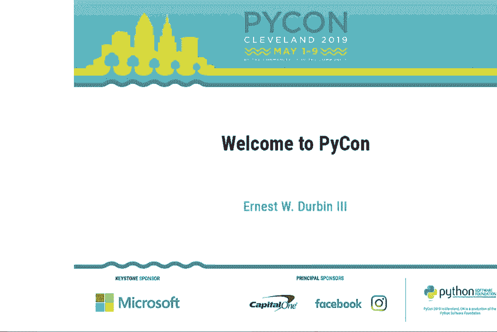

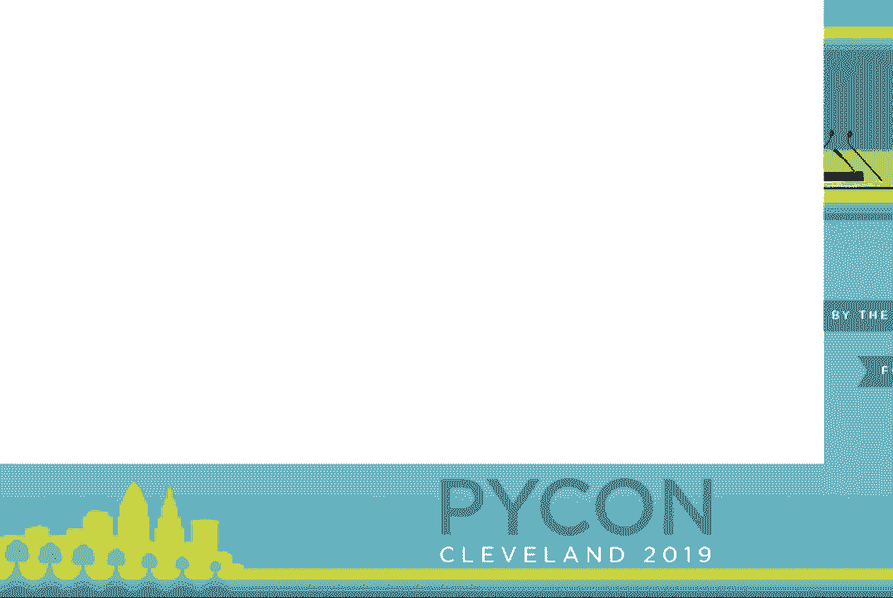

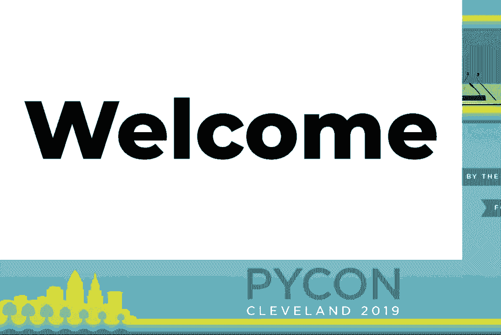

 here in Cleveland， Ohio。 On behalf of the PyCon 2019 staff， I want to start by saying， thank you。

 Thank you to all the volunteers that make this conference possible。 To the。

 Python software foundation for taking on the fiscal responsibility of this conference。 We。

 would not be here without the board and staff of the PSF。 I want to thank all of the presenters。

 who came to share their work。 And I want to thank the sponsors who support this conference， as well。

 And of course， this conference would have no purpose without you。 So I want to。

 thank you and we're just going to give all those people a round of applause。 The very。

 first thing I want to talk about is that PyCon is committed to providing a safe environment。

 and a positive experience for everyone。 And that's regardless of any difference that， we may have。

 In order to ensure this， all staff， attendees， speakers， sponsors and volunteers。

 at any PyCon event are required to adhere to our code of conduct。 Familiarize yourself。

 with the code of conduct at that URL as well as the procedures for handling incidents that。

 are linked therein。 You can find these documents there or by going to us。pycon。org under about。

 code of conduct。 If at any point during the conference， you're concerned that someone。

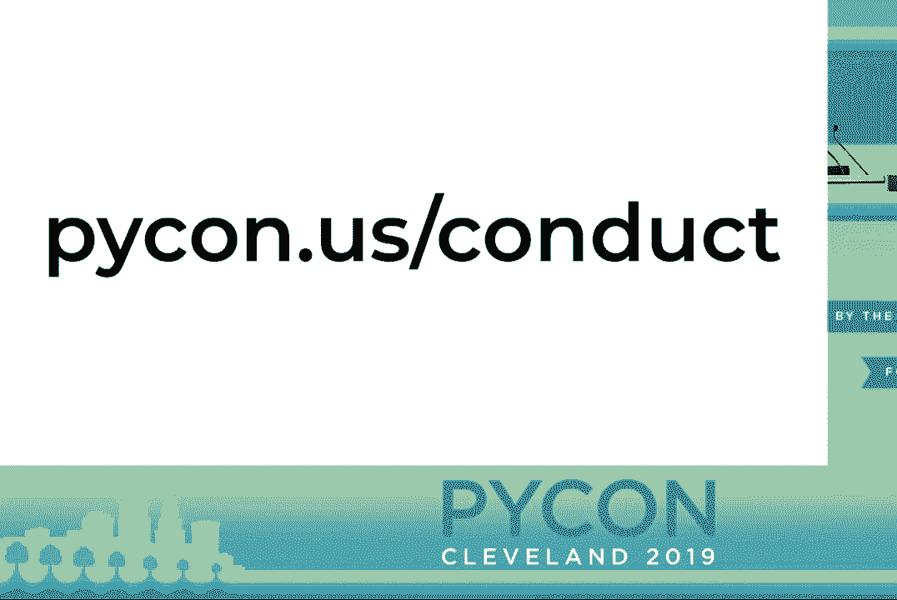

 may have violated the PyCon code of conduct， you're encouraged to report it。 If you're。

 unsure whether the incident is a violation or whether the space where it happened is covered。

 by this code of conduct， we encourage you to still report it。 The organizers are okay。

 with receiving reports where no action is taken for the sake of creating a safer space。

 At any point you can make a report by email to picon us report at picon。org by SMS or telephone。

 to 121862-8572 or during the conference you can find incident responder who will be wearing。

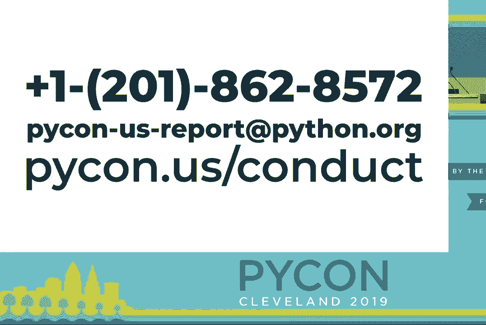

 a brightly colored t-shirt like this。 Once again， this is the contact information on screen。

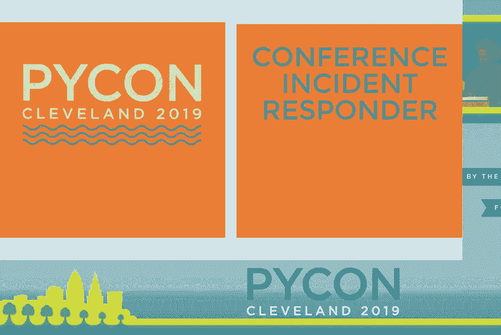

 I encourage you to take a photograph or write it down or save it in your mobile phone in。

 some manner。 Got it？ Cool。 So quick orientation。 Once more welcome to PyCon。 That's where you。

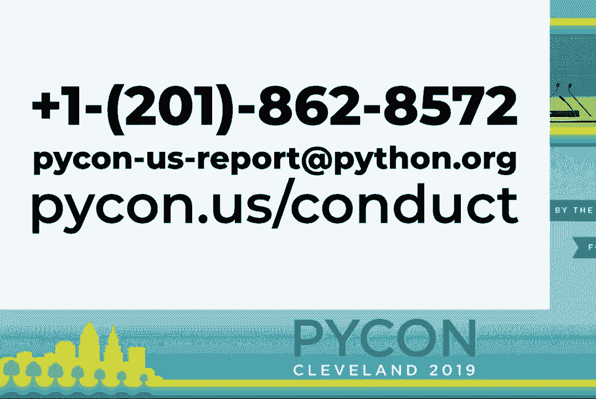

 are。 If this is your very first PyCon， I want to apologize。 PyCon has grown trying to detail。

 each and every part of the conference that makes these -- just call on me。 And trying。

 detail each and every part of the conference has become pretty much untenable。 However， if。

 this is your very first PyCon， I hope that you heard about or attended our newcomer orientation。

 yesterday at 4。45。 If you didn't make it， that's okay。 At this URL at some point today， the。

 video from that orientation is going to go up and you can go and you can watch Adrian。

 share each and every detail of the conference， including things that have already passed。

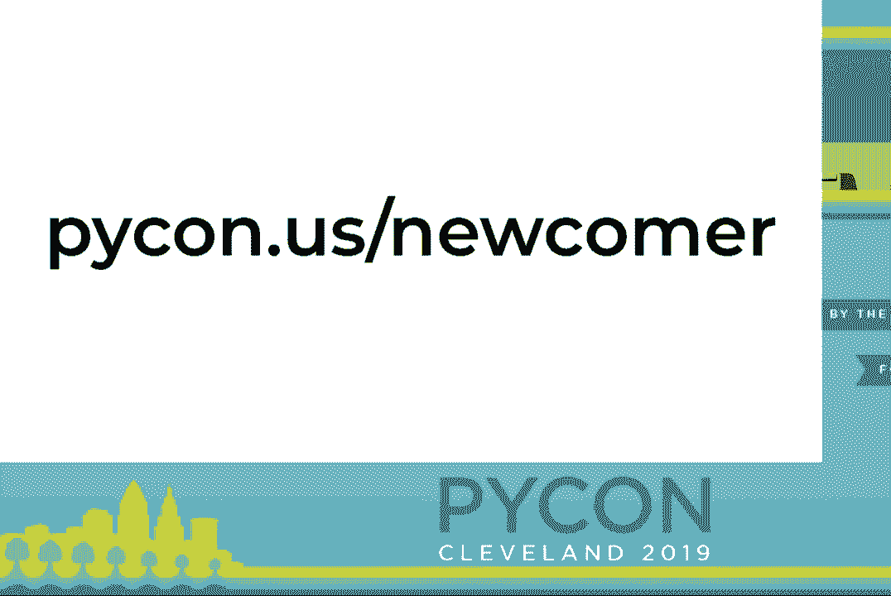

 Now more generally， you are in this conference center。 It's fairly large and so we're just。

 going to walk through it piece by piece。 First， I want to talk about some accessibility， things。

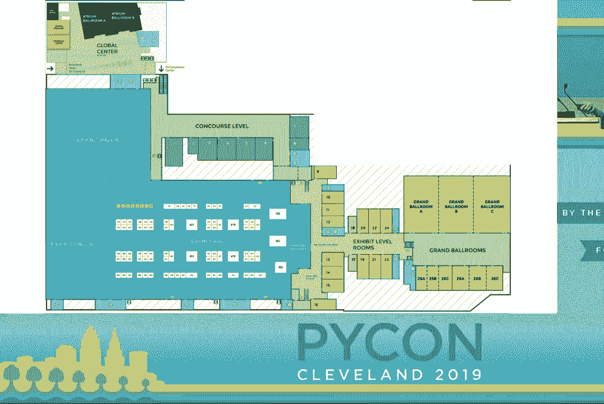

 that we've got going on。 We will be providing live captioning for all talks this year， similar。

 to what you see to my left and to my right。 Additionally， the space is reserved in the。

 center of each speaking room for wheelchair access。 The conference is ADA compliant。 However。

 if you have any concerns or need additional accommodation， please let a staff member know。

 We will do everything we can to support you。 You are here。 This is exhibit hall A which。

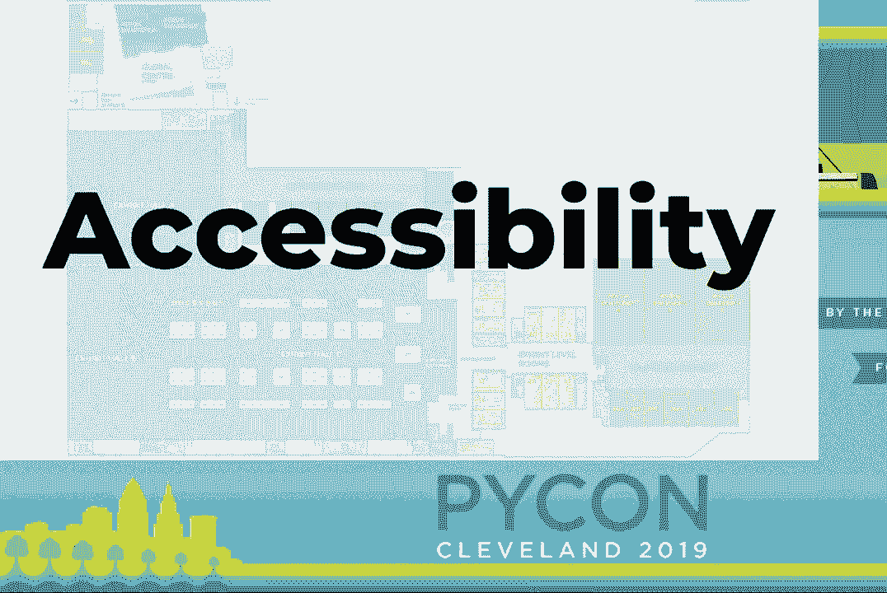

 will host our plenary sessions over the next three days。 During those plenary sessions。

 we'll have some keynotes soon。 We have Shah， Jessica， and then on Sunday， we have the PyCon。

 steering council panel and Nina。 Additionally， in this very room， in these seats， you'll find。

 the lightning talks to date 540， Saturday morning， Sunday morning， and Saturday tomorrow at the。

 end of the day。 Consider making some time to attend lightning talks。 You never know what。

 you'll see。 If you're interested in giving a lightning talk， which is a very short five。

 minute talk， you can find the sign-ups near registration。 To your left is the expo hall。

 This is located in exhibit halls B and C。 You probably already found it because that's where。

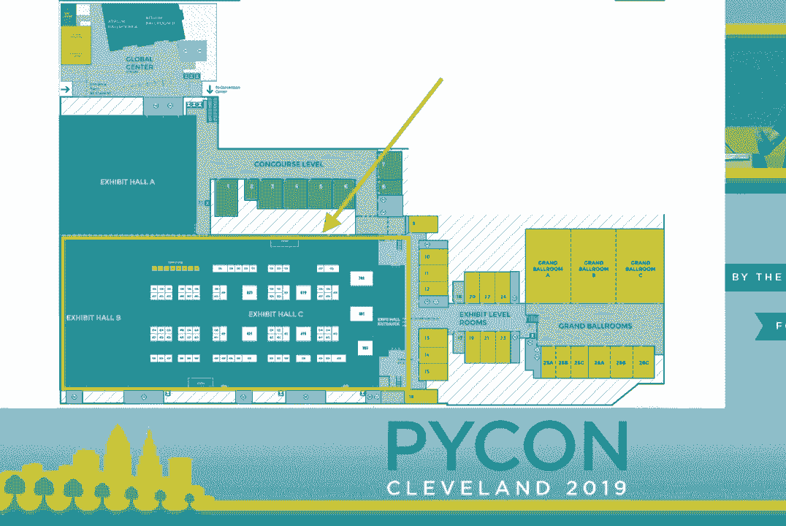

 we're providing meals this year。 All meals through Sunday will be in the expo hall。 You。

 can find the menus and ingredients for these meals at the URL on screen。 If you've indicated。

 that you require kosher consideration or allergies， when you're registered， please look for the。

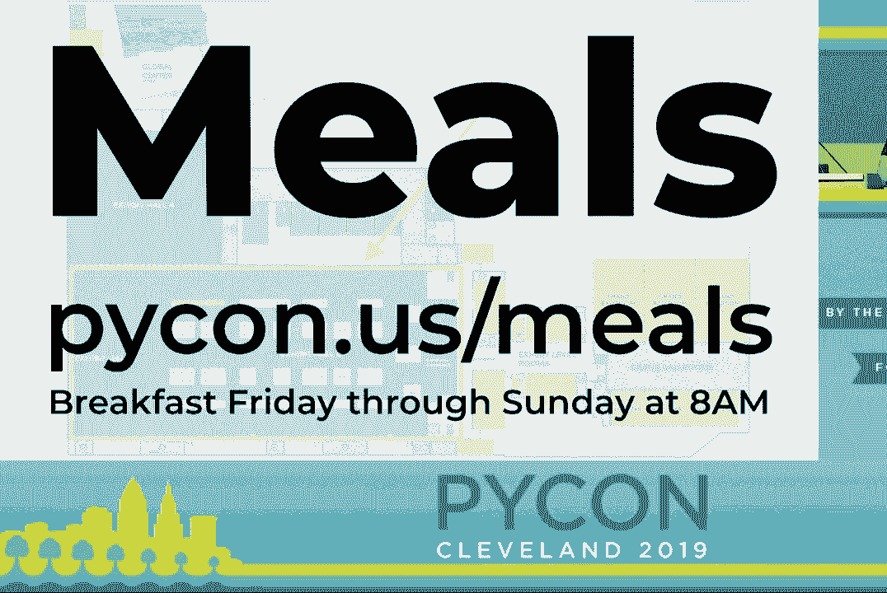

 signs in the hall to locate your meals。 The expo hall is also the place where all the sponsor。

 booths are。 I encourage you to stop by our sponsor booths and find out more about what。

 they're using Python for， why they've decided to support PyCon and the Python community by。

 being here。 Our sponsors make PyCon possible and we depend on them to keep PyCon's registration。

 costs under control。 Their presence here represents an incredible investment in our community and。

 this conference and also make the operations with the Python software foundation possible。

 They're here to meet with you， encourage you to check out their projects and products and。

 possibly even hire you。 A reminder that the sponsor booths will only be out there today。

 and tomorrow。 On Sunday， that entire space will be reconfigured。 In addition to sponsors。

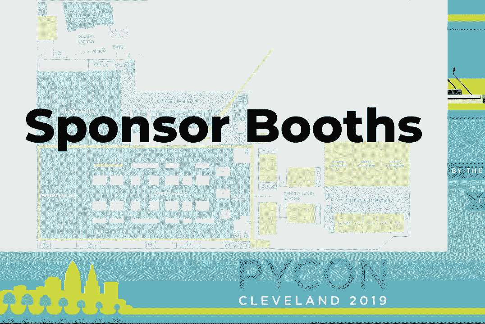

 I want to take a moment to very poorly show all the names of the corporate companies who。

 sent people to PyCon on a corporate registration。 These registrations help offset the cost of。

 individual and hobbyist registrations， I'm sorry， student and hobbyist registrations and。

 go to support the Python software foundation work as well。 In the Expo Hall still， it's。

 a big room， we do a lot with it， is Startup Row。 There are some tables and today and tomorrow。

 there will be people who competed and won a spot on Startup Row。 These are new companies。

 who are doing something with Python that might be new and interesting。 Check those out。 Note。

 that these change， so the people that are there today will not be there tomorrow and。

 people and they will be replaced with other companies。 You want to stop by Startup Row。

 twice if you get a chance。 On Sunday， that entire room gets reconfigured into our posters。

 and jobs fair。 That will be Sunday morning。 On screen are our breakout rooms。 Note that。

 there are some distance from where we are generally over to these other rooms。 Those are the H-room。

 ball rooms and they are right there。 If you made it here， you just need to go up that。

 escalator or up that escalator or come through this concourse to find them。 They are a little。

 bit of a distance from the other talk rooms。 If you plan to see a talk in there， make some。

 consideration for time。 We have five talk tracks with 95 sessions once again this year。 You。

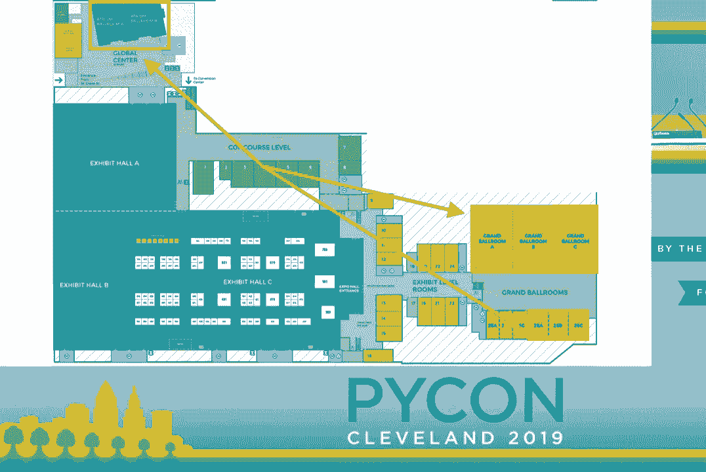

 have 19 opportunities to see one of these talks。 But don't worry， most of the talks will be。

 recorded and available online after the conference。 As you stare at a conflict between two talks。

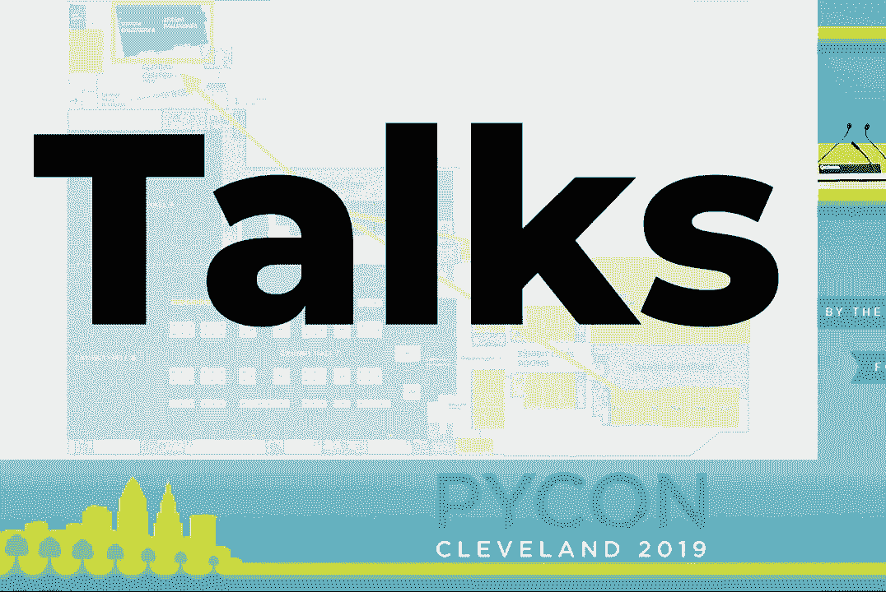

 you would like to see， go with your gut。 If you do attend a talk where time remains and。

 the speaker allows for questions and decides to ask for those questions， in the legendary。

 words of PyConcher emeritus branded roads， remember to phrase your question in the form。

 of a question。 We have a veritable fleet of rooms available for open spaces。 All day today。

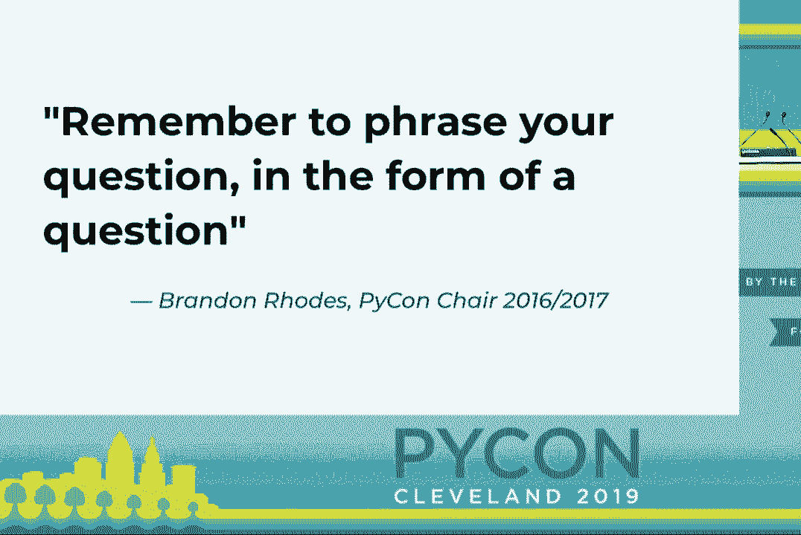

 Saturday and Sunday， these rooms are allocated for anyone to self-organize a one-hour meetup。

 style event and they will be open from 8 a。m。 to 11 p。m。 They are a great opportunity to。

 connect and have a deeper discussion on something that or find people who have a shared interest。

 or a common goal。 I want to encourage you to consider shaping the conference by having。

 your own open space。 You can stop by the board next to registration to post your own open。

 space or peruse what is already there。 And new this year， you can go to the URL on screen。

 and at that location you will find a photograph of the current day's board that you can sort。

 of pinch and zoom around in to see what has been posted。 So you don't have to constantly。

 be crowding around the boards。 So these rooms are something that is sort of near and dear。

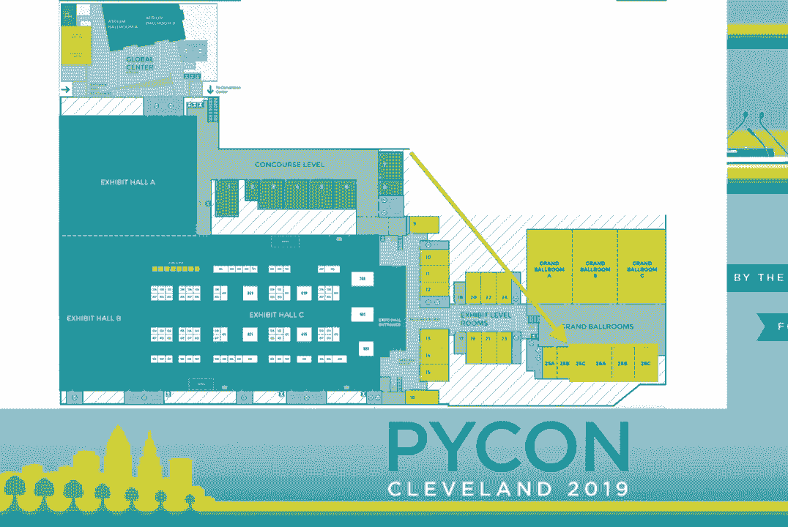

 to my heart。 These rooms which are 25C and 26 A/B/C are home to the PyCon hatchery program。

 PyCon is a conference that has grown and evolved over the years through the direction of volunteers。

 the board and staff。 Last year we launched the hatchery program and it is intended to。

 offer anyone the opportunity to see their idea come to fruition at PyCon。 Whether the intent。

 is at a permanent fixture of the conference or something that is just ephemeral and topical。

 or important for any given year， the hatchery program offers space and resources at PyCon。

 for that idea。 We are excited to have the inaugural hatchery program returning this year。

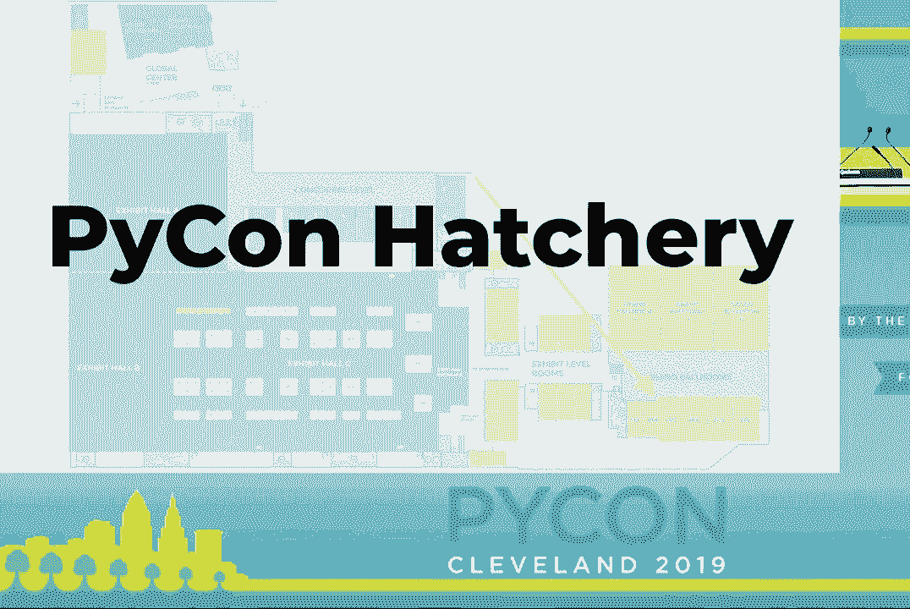

 and three new concepts joining us for 2019。 All day today and today only you can attend， Laus Park。

 Laus PyCon， Charlie's。 It is a full day of talks given in Spanish。 That will， be in room 25C。

 The Charlie's schedule is matched to the primary talk schedule。 So you。

 are welcomed and encouraged to jump in for just a single talk or stay all day。 New this。

 year is the art of Python。 It is a miniature arts festival and it is going to focus on narrative。

 performance and visual art。 You can find that event this evening in room 26 A/B/C tonight。

 from 8 to 10 PM。 So if you are up for a show， you can see that there。 The PyCon hatchery。

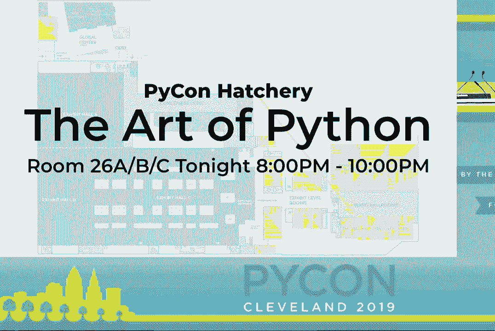

 maintainer summit is also new this year。 It is seeking to build a community of practice。

 for projects and maintainers and key contributors with the goal of helping the Python community。

 sustain and grow healthy projects and communities。 This will be a mixture of lightning talks and。

 discussions and it will be going on from 10 to 50 until 2 PM in room 25C。 Also new this。

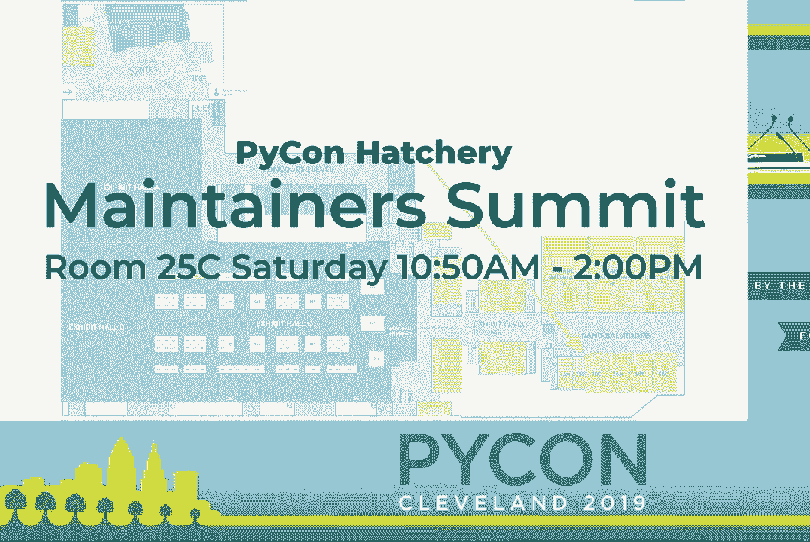

 year are the mentored sprints。 They will run from 2 30 to 6 30 PM tomorrow in room 25C。

 And this is a new comers introduction to contributing to an open source project。 It is done under。

 the mentorship of somebody who has more experience and has worked on the project in the past。

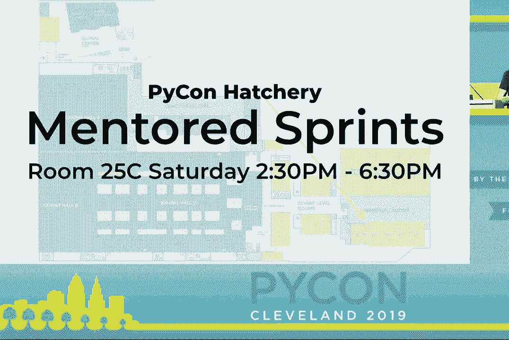

 We focus on providing less experienced developers a supportive environment in which they can， learn。

 collaborate and expand their network and celebrate their victories at the end of， it。

 So these are the PyCon hatchery programs for this year。 If you have an idea， the PyCon。

 is likely to continue。 Keep an eye out for the CFP which will be launching sometime between。

 now and next PyCon。 I really ran out of arrows。 I bought too many arrows so I had to use。

 them all on the slide。 So PyCon has consumed nearly entirety of this convention center。

 for the next few days and during that time all of the public spaces will be scattered。

 with Python Eastons。 It is not an official event but this is a happening that I never。

 really get the chance to miss out on at PyCon。 There are no rules that say you have to attend。

 any given event。 There are no rules that say you have to attend every -- fill all of your。

 time with a structured event。 So consider spending time joining a table or group and meet someone。

 new， open a laptop and explore a problem together， spend time catching up with someone。

 you have never met in person before or an old friend。 One suggestion to improve the experience。

 in the hallway track and throughout PyCon generally comes from PSF board member Eric， Holscher。

 This is the Pac-Man rule。 When standing in a group of people， always leave room for。

 one person to join your group。 This suggestion can help create a physically welcoming space。

 for someone to join your group and makes easy for attendees to identify groups they can join。

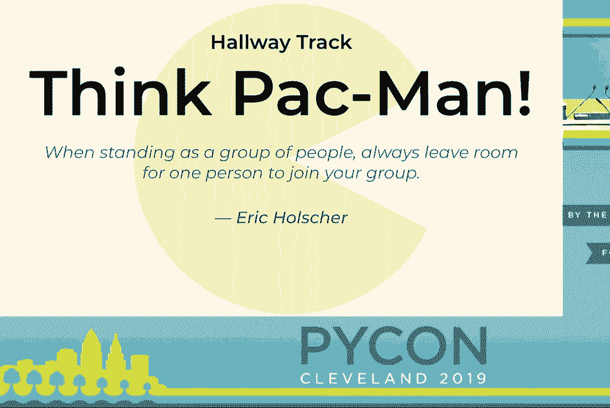

 So helps meet new people。 Throughout the space we have three gender neutral bathrooms。 One。

 is near rooms 17 and 18。 One is near rooms 25 A， B and C and one is inside the Expo Hall。

 so when you are entering from registration it is on your left。 There are also two mothers。

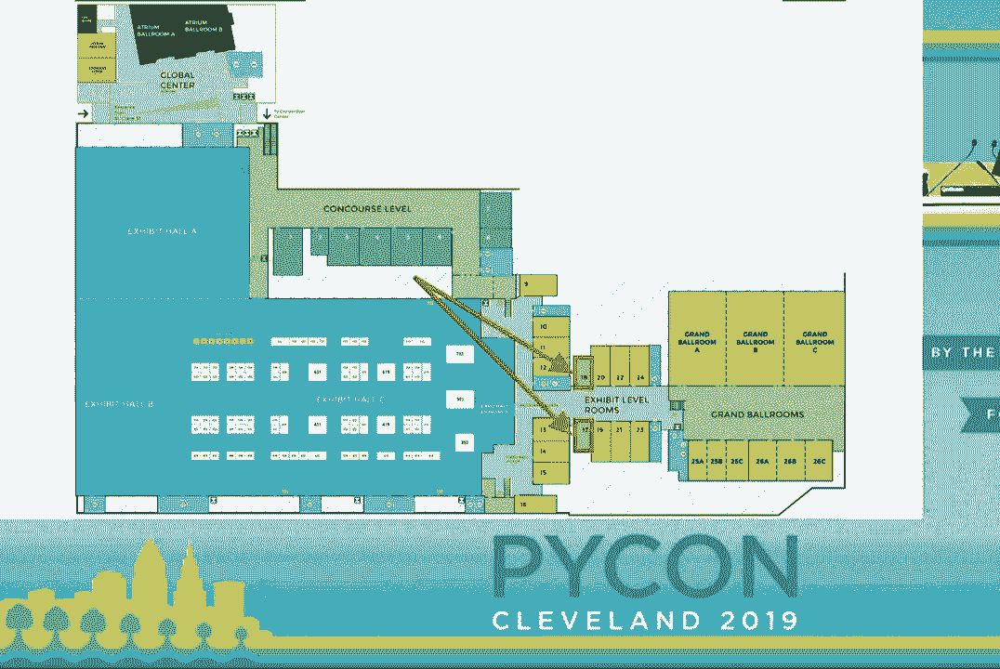

 rooms in the conference center。 These will be rooms 17 and 18 and instructions for access。

 to the room are posted outside。 So if you need help or if you need to get in there， check。

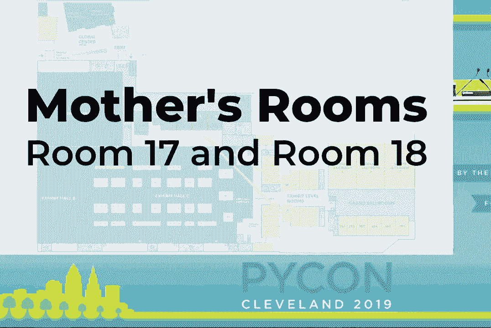

 there and get the instructions。 If you find that you need to take a break， focus on some。

 work or just breathe， we have a quiet room in room 24。 This room has a specific purpose。

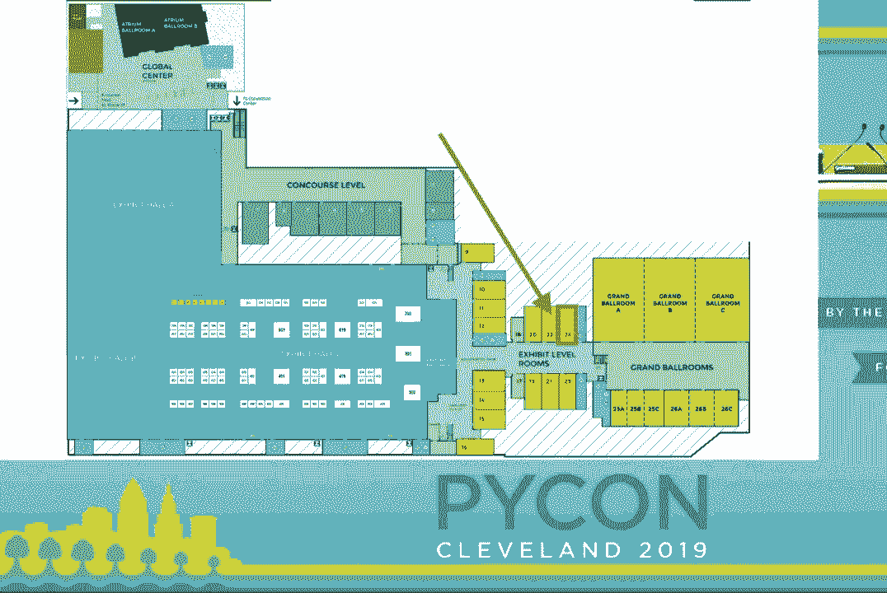

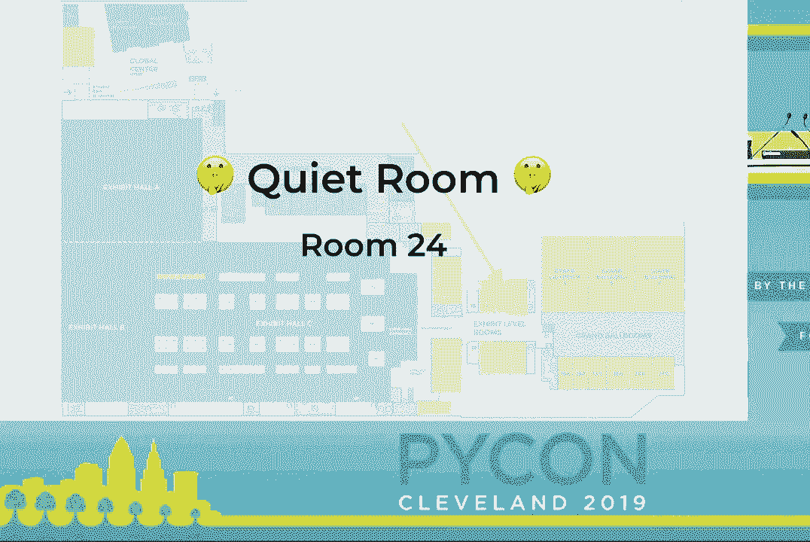

 So please be respectful of the word quiet while you are in the space。 And stepping outside。

 it is always beautiful and Cleveland。 There is never rain or clouds。 We can see our place。

 in the civic center of downtown Cleveland。 Around the venue there is the Pilates auction。

 which is Saturday， May 4th at 6。30 pm。 That is in the Hope Ballroom in the connecting。

 Hilton downtown Cleveland。 So you don't even have to go outside if you don't want to but。

 take a walk。 Last year， $30，000 is raised to benefit the Pilates。 For a $5 cover charge。

 it is a hard bargain to beat。 It is probably one of the most fun evenings we have going， on here。

 Even if you don't come to bid and win for an excellent pause。 Just around the， corner from here。

 so if you go down Lakeside， make a left on ninth and down to the pier。

 you will find the Rock and Roll Hall of Fame and the Great Lakes Science Center。 These。

 are home to the PyCon dinners。 One this evening at 6。

30 pm and one after the close of the conference， at 6。30 pm on Sunday。

 And these evening events are both ticketed events。 So when you check， the registration。

 you should have had little tickets。 You will need to bring those tickets， to these events。

 And since food has already been pre allocated for them， if you did get。

 a ticket and you don't plan to attend， convey your ticket to someone else however you see， fit。

 This helps reduce food waste and keeps the events fun and lively。 That's a lot。 And。

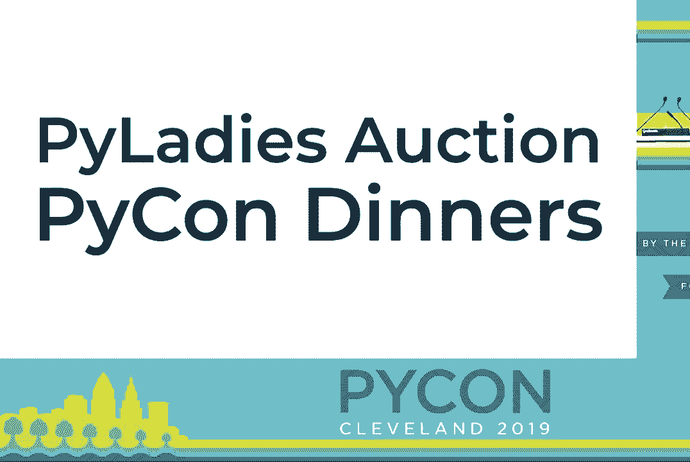

 skipping what we have already done。 So if you prefer to have this information with you。

 there is a printed program。 It looks like this。 And there is ustoppikon。org which can be a。

 little bit fiddly to navigate。 And we have a guidebook again this year。 This is a specific。

 app that has all of the schedule information and room numbers and such in it。 And you can。

 find that at pikon。us/guidebook。 And yeah， I think you're orienting。 So time for some。

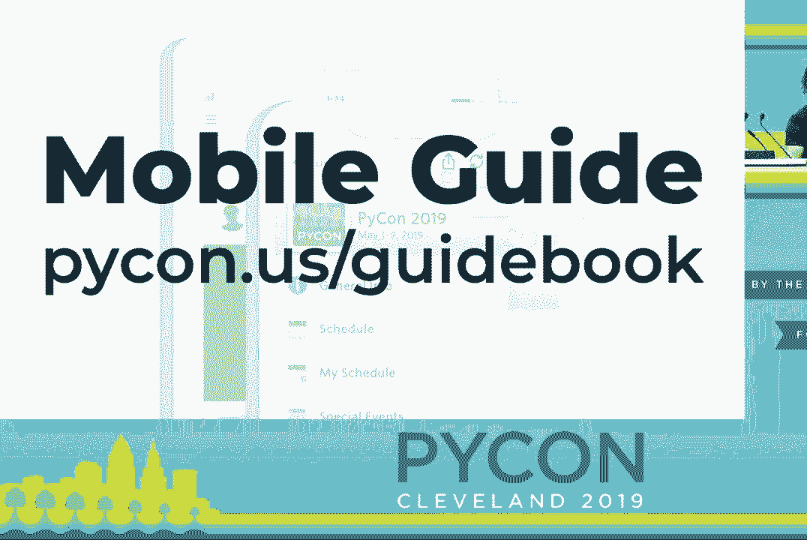

 housekeeping。 First off， the Python software foundation which does take the fiscal response。

 responsibility of this conference is running a fundraiser。 We couldn't do this without， them。

 So if you're able， consider going to this URL screen and it will take you to a。

 page that includes all the information about that fundraiser and you can consider contributing。

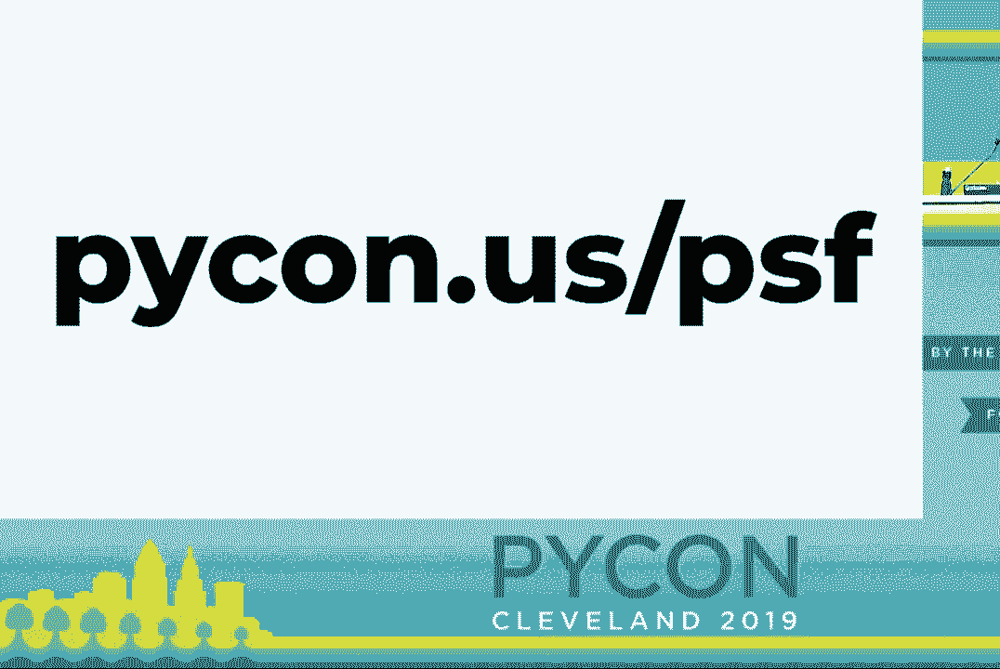

 If you registered for the pikon fun run and walk， that kicks off Sunday at 7。 Bussing begins， at 6。

 but probably show up around 6。30 so you're not just left waiting。 But if you're。

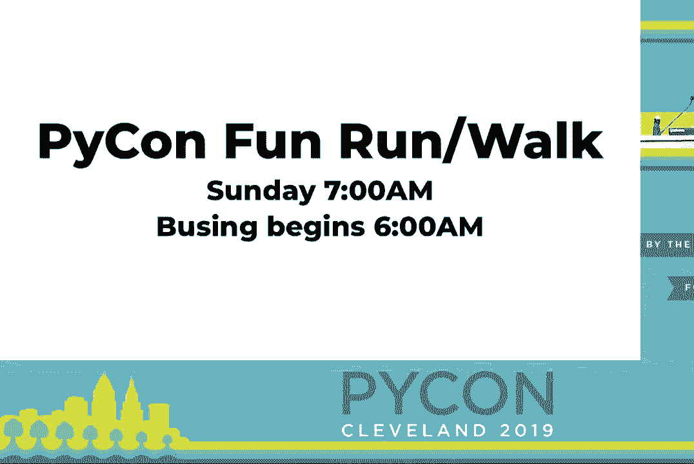

 punctual， 6 o'clock it is。 Tomorrow morning， there's a different run。 It's not ours。 You。

 can run along， I guess。 But note that if you're coming to the convention center particularly。

 by car， this will cause some congestion。 As you see， we are sort of right in the middle。

 of the route。 And so from about 7 a。m。 to 11 a。m。 tomorrow morning， plan a little bit。

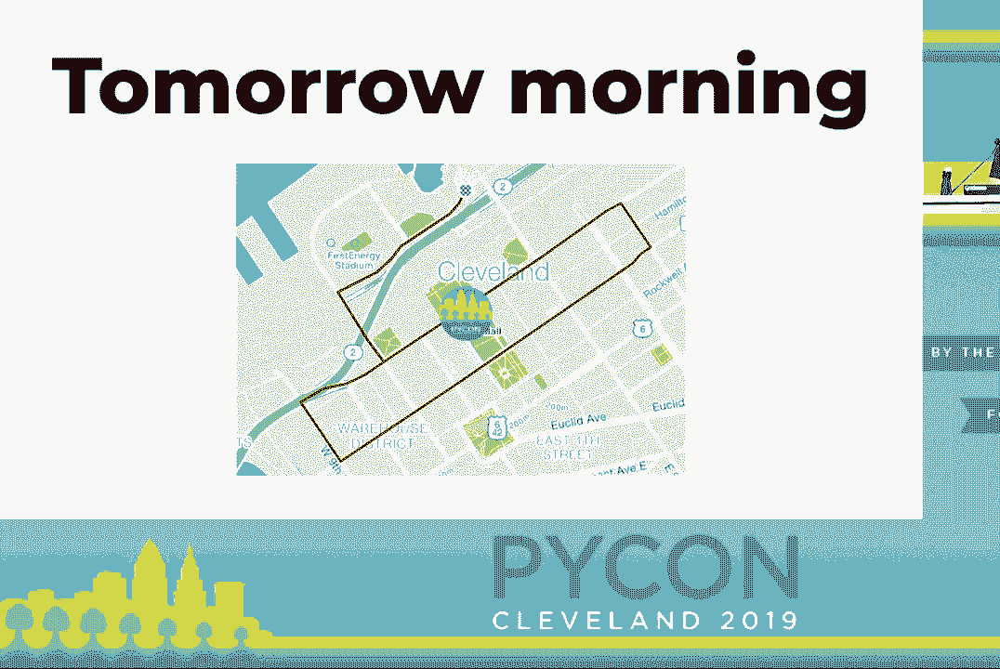

 of extra time to get here。 The swag bags are available for pickup， so make sure you go， grab those。

 And inside you will find a little gadget。 So thanks to DigiKey and Adafruit， all。

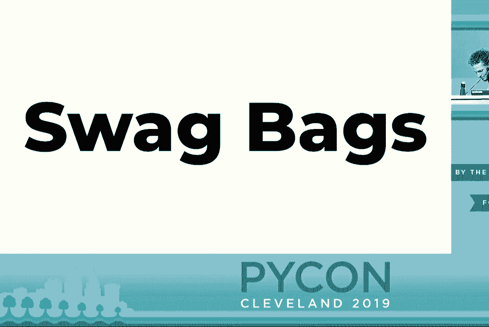

 attendees will receive a circuit playground express which runs Python。 So two notes on， this。 One。

 if you're going to be traveling through something that involves security， checkpoint。

 go ahead and take this out of your bag and tell the screener what it is。 It will。

 save you and them a lot of hassle and questioning and considering。 Just a tip。 And the second。

 one is consider bringing this with you on Sunday to our closing keynote。 By the end of it。

 you might feel inspired to run out immediately and start programming on it or you might even。

 code along with some of the examples。 So also the needs picking up are your t-shirts。 They。

 look like this。 But I want to take a moment to warn you that due to the cut and weight。

 which is the same as last year， our choice in color doesn't quite have as much pigment。

 So in full transparency， these shirts are quite sheer。 So make sure that you try your。

 shirt on and are comfortable wearing it before you wear it in public。 If you have concerns。

 about your t-shirt after picking it up， let us know。 And lastly， I think， almost， there。

 are some schedule changes。 US。py。 The mobile guide book app I mentioned earlier and the。

 signage have been updated。 Your printed program has not。 So please take a moment to double。

 check the board in front of the Xbox off substitutions。 But the long short of it is that there has。

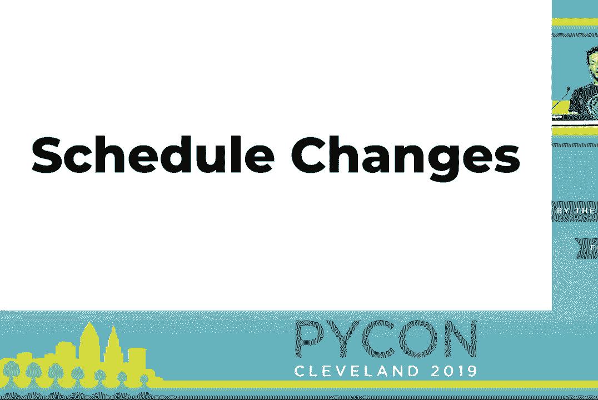

 been a substitution in Grand Ballroom B on Saturday。 The elephant and the serpent using。

 Mastodon with Python by Philip James replaces code review skills for Pythonistas by Nina。

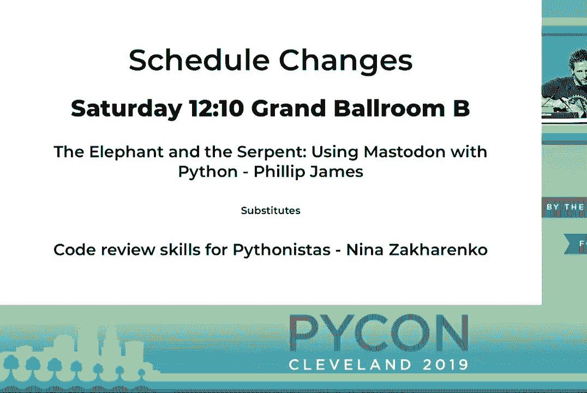

 And shipping your first Python package and automating future publishing by Chris Wilcox。

 substitutes code -- code readers using Python to uncover surprising patterns and books you。

 love at 315 in Grand Ballroom B。 We have a professional photographer on site this year。

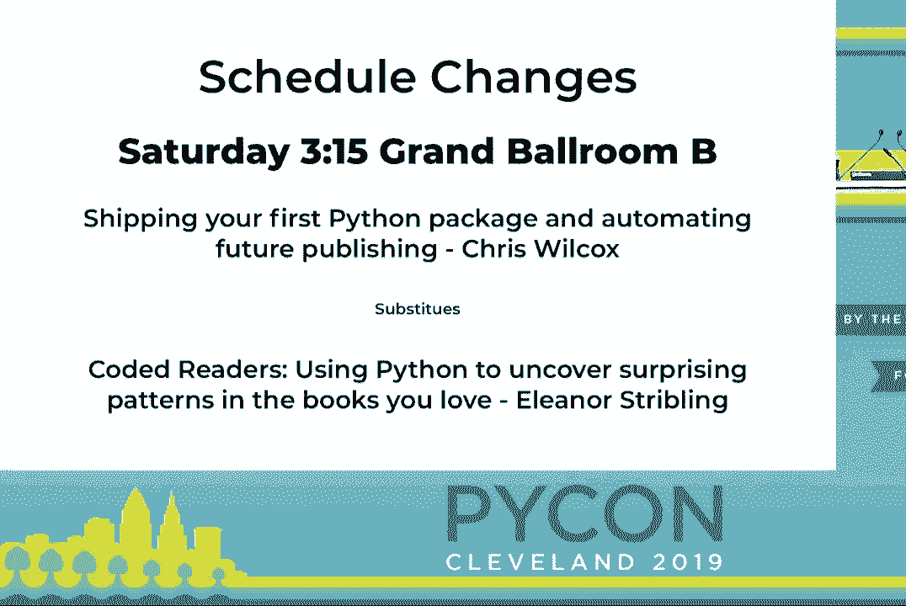

 If you are uncomfortable being photographed in a candid fashion， you can go pick up a badge。

 holder that looks like this and at registration。 Swap your badge into it， put your lanyard。

 on it and the photographer will avoid photographing you。 But more importantly， in post， we'll。

 make sure not to use any photographs of anybody wearing a badge that has this red banner at。

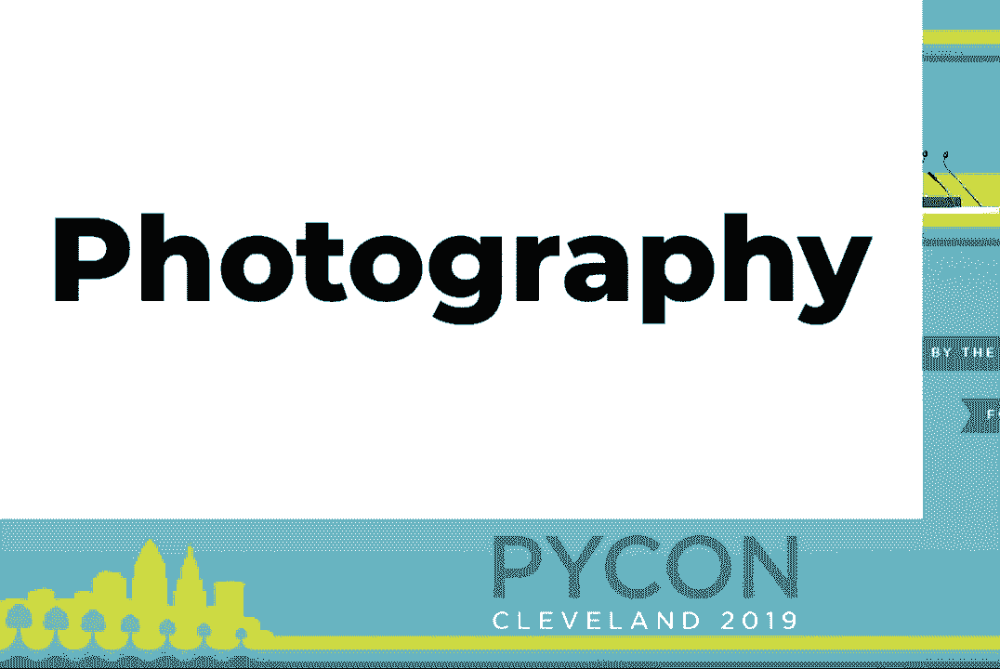

 the bottom。 So one last thing， which is about social media， the thing near and dear to my， heart。

 I'm going to take a selfie with you。 That's perfect。 All right。 And if you want。

 to tweet at the conference， this is to get the attention of the staff or the organizers。

 tweet @picon。 If you want to post about the conference， we can look back and remember。

 everything that occurred here。 Tweet with the hashtag #picon2019。

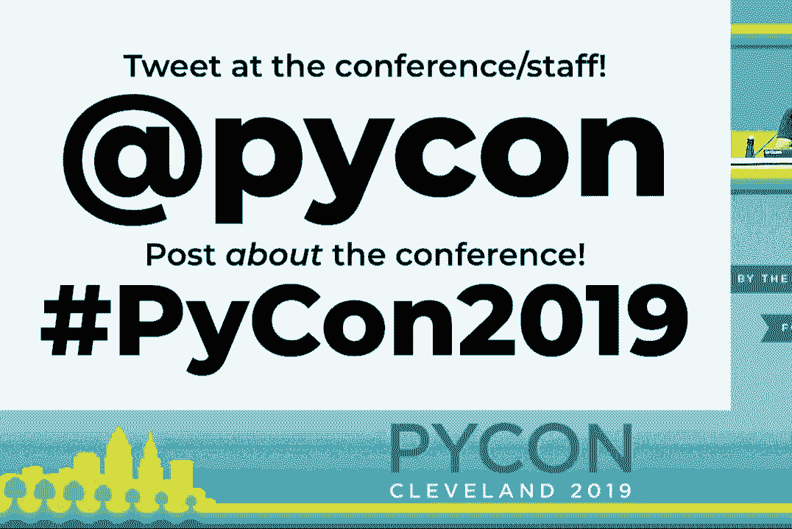