# P21：Python Software Foundation Community Report and Community Service Awards - PyCon - leosan - BV1qt411g7JH

 Hello everyone。
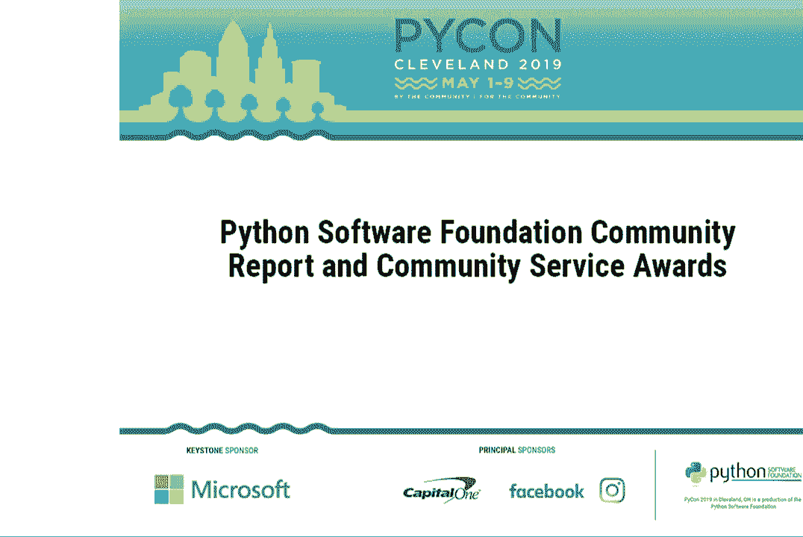

 Hi。 My name is Brent Klimitz。 I'm with Capital One。 I'm a developer over there。 This is about my fourth year I've been here。 I've seen a lot of new faces here at PyCon。

 It only shows how great the community is， how much it has grown over the past couple years。 and quite frankly how far the language has come。 But me being from Capital One。

 you may or may not understand why Capital One is why we're a sponsor， why we're here。 And quite frankly， we love the language。 It powers a lot of our innovation at Capital One in our open source projects。

 such as Cloud Custodian， and our customer-facing projects such as Eno。 We support the community and we want to see the advancement of the language go forward。

 And quite frankly， these are a lot of the same reasons I came to Capital One。 because we really truly do love the community， and want to support it and see it move forward。

 We do appreciate the community helping us out in our own project in the ecosystem。 We're proud to be principal sponsors of the community， of PyCon。

 and look forward to seeing you at future PyCons and going forward。 You want to welcome Eva。 who's going to be giving updates on the PyCon Software Foundation。

 and presenting the Community Service Awards。 Thank you and have a great day。 Since I've been on stage already， I'll just do a quick intro。

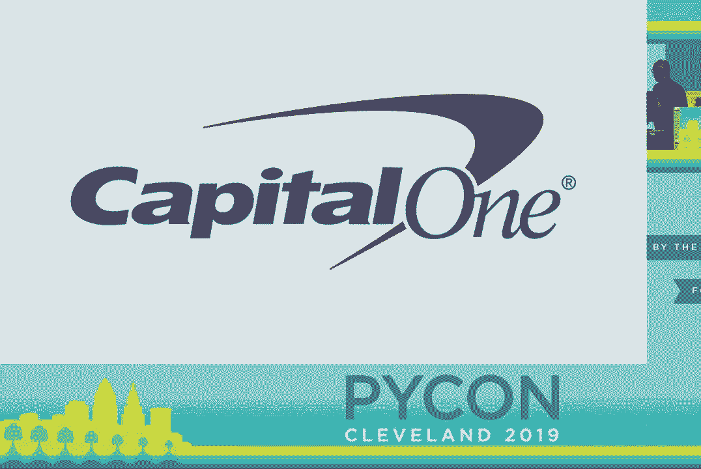

 My name is Eva， I'm the Executive Director of the PyCon Software Foundation。 If you're interested in Python community updates， please follow myself and the PSF Twitter。

 So let's talk about giving。
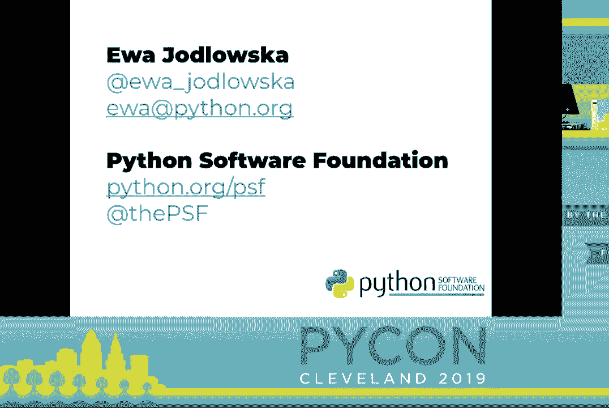

 We gather at PyCon in similar events because of opportunities。 These in-person events give us opportunities to learn， network， collaborate， catch up with friends。

 make new friends， teach， mentor， and so much more。 Through these opportunities。 we foster the growth of Python and make our community stronger。 Through these opportunities。

 in a way， we give back to Python。
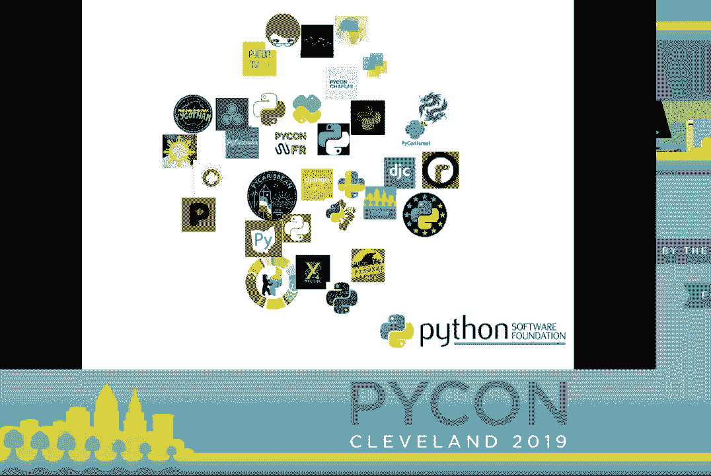

 By registering to attend， you're giving back to the community， sponsoring the conference。 instructing a tutorial， presenting a keynote， gives back to the community。

 All these forms of giving help our community grow。 The PyCon Software Foundation is the nonprofit behind Python and its community。

 The PSF has grown into an organization that gives to its community through its programs。
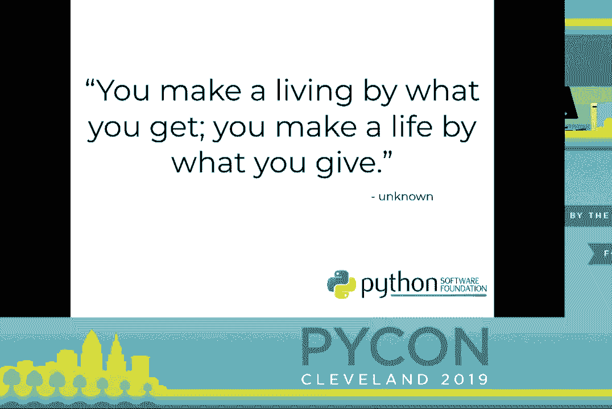

 This year， we published our first ever annual impact report。 Here we see a snippet from the report showing our program service expenses from 2018。

 Approximately 75% of our expenses go through putting on PyCon。 Our next largest expenses are the funds that go to our grants program， which totals 16%。

 As the PSF continues to grow， we also want our grants programs to grow。 Our grant funds go through its events and supporting regional communities all around the world。

 We want to continue supporting events and communities because they provide those impactful opportunities that I spoke about earlier to folks。 not just here， but everywhere。

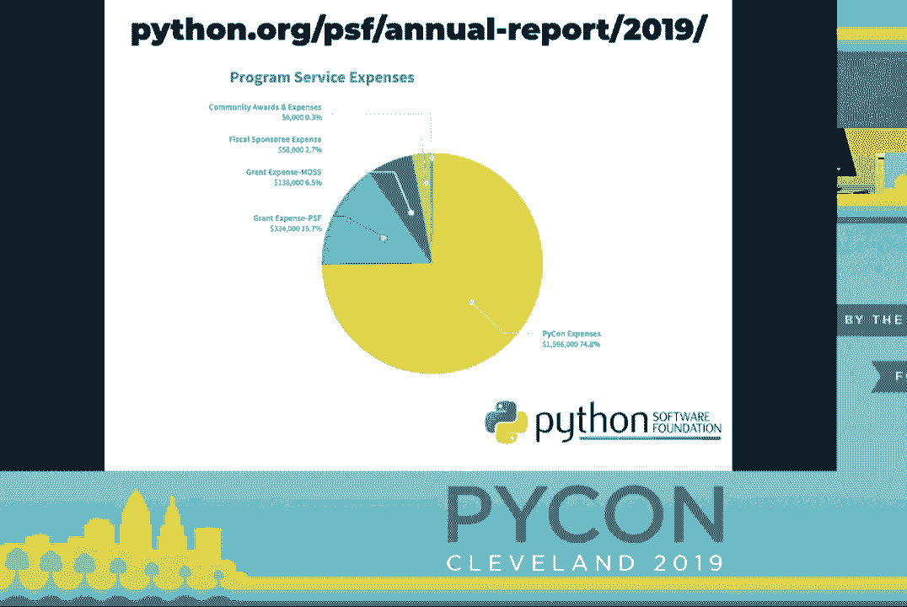

 In addition to providing our community that support。 we want to increase the PSF's expense budget for funding things like Python and education projects and DevSprints。

 We want to have enough funds to help Python make it to the next level。 Russell's keynote on Friday really hit home for me because I felt like it addressed all the ways that the PSF can support Python to keep it sustainable。

 At the PSF， we listen to what the community needs and we want to deliver on so much of it。 And of course， we can't deliver on everything and that's not the point here。

 but to even support core development， we need more funds to be able to do that。
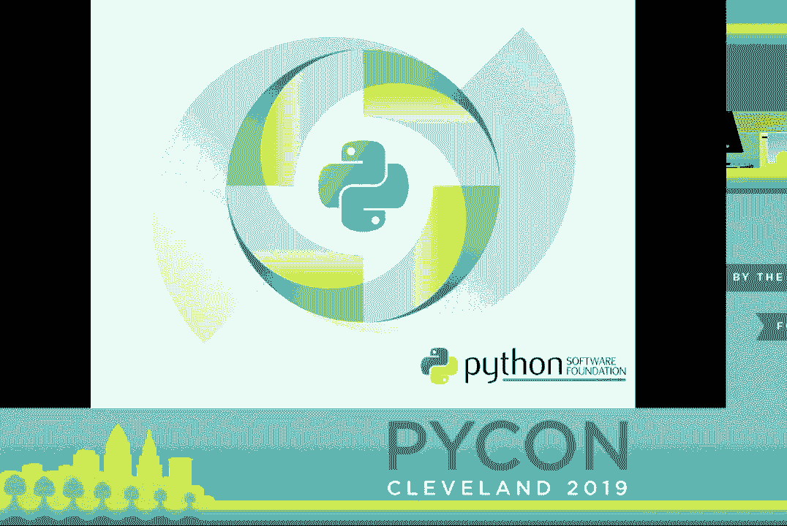

 Giving is what allows us to do that。 A few days ago。 the PSF launched its first fundraiser of the year。

 Most people in this room have had their lives impacted by Python one way or another。 I'd like you all right now to think of those opportunities that Python community has given you。

 With that in mind， I want you all to consider giving back to Python so it can continue to positively impact the world。 This year we have two ways to give to the PSF。 One way is donating cash through the donate button on。

 you can find it through pikon。us/psf。 The second is through a collaboration that we're lucky to have with JetBrains。 If you purchase a PyCharm license through this link that I put up。

 all proceeds of those purchases will go to the PSF。 Our fundraiser ends May 22nd。 Please consider giving。

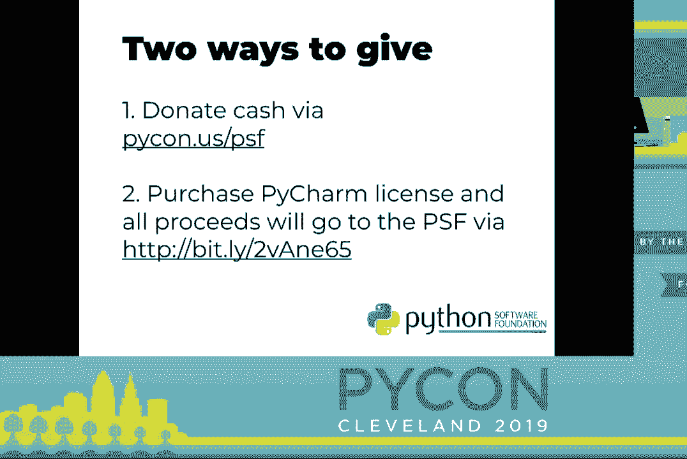

 Part of the PSF's growth has included making decisions that strengthen our sustainability so we can continue to support our community and our staff for years to come。 We understand the importance of diversifying our revenue streams so we're not solely dependent on pikon to sustain the PSF。

 Additionally， we decided that we need to have a financial reserve for at least one and a half years of operating costs。 In addition to financial responsibility， we have addressed sustainability of our staff so we no longer have a bus factor of one。

 We recently hired additional people to work on pikon and our accounting team。 When I started back in 2011， it was just two of us。 Now they're eight of us。

 I wanted to take this opportunity to bring everyone on stage because everyone here should see the folks behind all the work that the PSF does。 Seeing names and emails and chats is nice， but putting faces to those names is even better。

 PSF team， come on up。 [Applause]， [Applause]， So this friendly face that you've been seeing years at this conference。 especially the last few years， has not only been the conference chair of pikon for 2018 and 19。

 but Ernest is also the infrastructure director of the PSF。 Ernest helps support our community with infrastructure needs and problems。 Additionally。

 Ernest manages all of the PSF owned infrastructure such as pikon。org， helps maintain pikon。org and us。pikon。org and many more。 Phyllis Dobbs， go ahead， step forward。

 Phyllis Dobbs joined us two years ago and is now leading our accounting team。 Phyllis is helping us ensure we have important policies and procedures in place as our nonprofit continues to grow financially。

 Jackie Augustin joined us in September of last year and Jackie is now the manager of pikon and lead organizer。 I am sure many of you have already interacted with Jackie about registration and going forward you will see her involved in much more。

 Betsy Walaschowski has been with the PSF since 2015。 Betsy does an outstanding job providing sponsorship and fundraising support。

 Betsy did an incredible job with pikon sponsorship this year and she helped all the sponsors that you all interacted with in the expo hall with their logistics and needs。 Joe and Laura both joined us earlier this year。 Joe， Laura， please step forward。

 Joe and Laura both joined us to help with the accounting team。 We are super grateful to have their help with the financial aspects of pikon and the PSF such as financial aid and even at the pilot's auction this year。

 Welcome to the team， Joe and Laura。 So curpikizer， please step forward。 Now I'm going to start crying。 Herpikizer has been with PSF for 12 years。

 Herpikizer is responsible for establishing the PSF's accounting system and help pave the way to where the PSF is today。 Herpikizer is retiring this year and we all owe him a big thanks for everything that he's done for the PSF over the years。

 Thank you， Herpikizer。 Thank you all for joining me on stage。 Thank you。 I think we're going to fall correct。 Now let us give some recognition to community members。

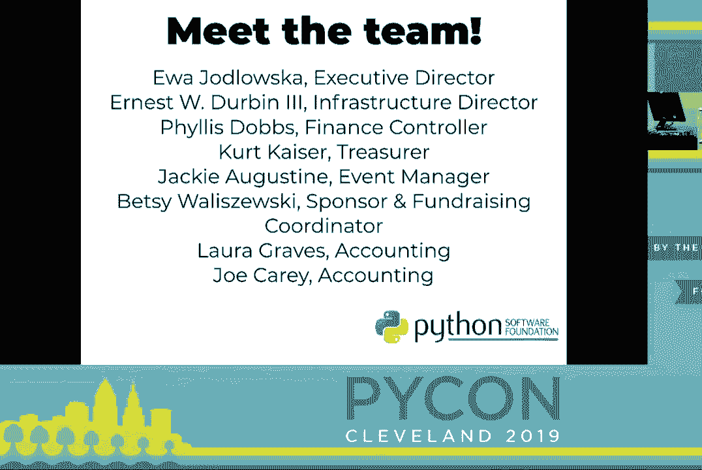

 Community service awards are given out quarterly， usually to two pythons at a time。 These awards are a way for the PSF to offer recognition for a tremendous time and effort contributed by those that help strengthen and improve pythons ecosystem。

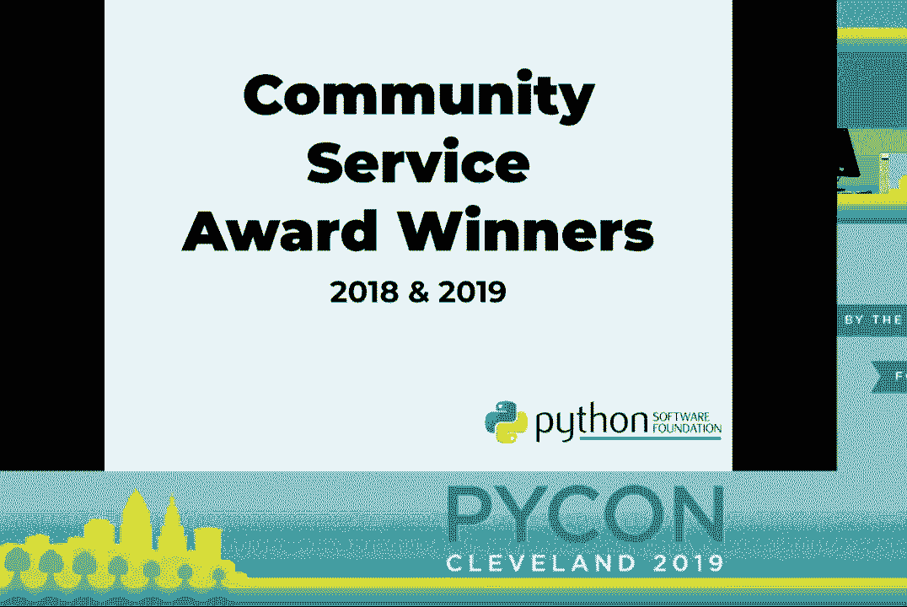

 Let us welcome Mario Cresiro to the stage。 Mario was awarded a community service award in 2018 for his leadership and organization of PyCon ES。 Pylandenium and the PyCon-Charlie's track here at PyCon。

 His work has been instrumental in promoting the use of python。 And fostering python communities in Spain， Latin America and the UK。 Thank you， Mario。 [Applause]。

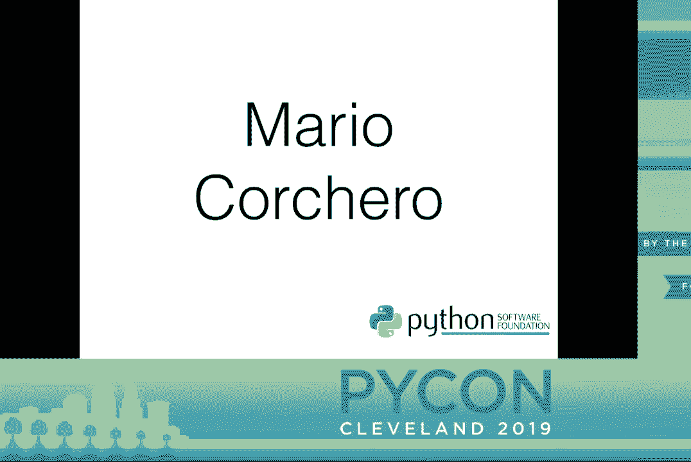

 Thank you。 Water break。 Can you say anything？ Oh， okay。 Yeah。 [Laughter] Next we have Chuck Woody Nochtuku。 Chuck's unfortunately could not make it to PyCon this year。

 but Chuck's received this community service award in 2019 for his contribution to spreading the growth of python to the Nigerian community and his dedication and research to the PSF grants work group。 [Applause]。

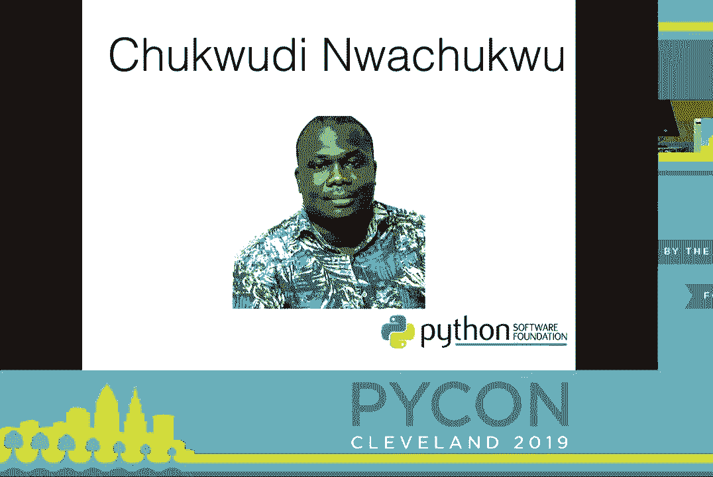

 Next I'd like to welcome Alex Gaynor to the stage。 [Applause]。 Alex received his CSA in 2018 for his contributions to the python and jango communities and the python software foundation。

 Alex previously served as a PSF director in 2015 through 2016。 He serves as an infrastructure staff member and contributes to legacy PIPI and the next generation warehouse and has helped legacy warehouse insecurity and cutting down bandwidth costs by compressing 404 images。

 Thank you， Alex。 [Applause]， No introduction needed。 Now let's welcome Mario to the stage。 [Applause]， The 2018 third quarter award was given to Maria for her contributions to see python。

 her efforts to improve the work flow of python core team and her work in increasing diversity in our community。 In addition to that， her work as co-chair of pike cascades and co-organizer of the mentored spritz here at PyCon helps spread the growth and diversity of python。

 Thank you， Maria。 [Applause]， Now let's welcome my yellow Sanchez Miranda to the stage。 [Applause]。 The 2018 fourth quarter award was given to myella for her work as the pike on charliss 2019 chair and founding member of pike on charliss as well as being the organizer of python day mexico and jango girls puebla。

 Thank you， myella。 [Applause]， Up next we welcome John Roa。 [Applause]。 The second 2018 Q4 award went to John Roa for his work as founder and conference chair of pike on columbia。

 Additionally， John Roa has been instrumental with python outreach in columbia especially via jango girls workshops。 Thank you， John。 [Applause]。

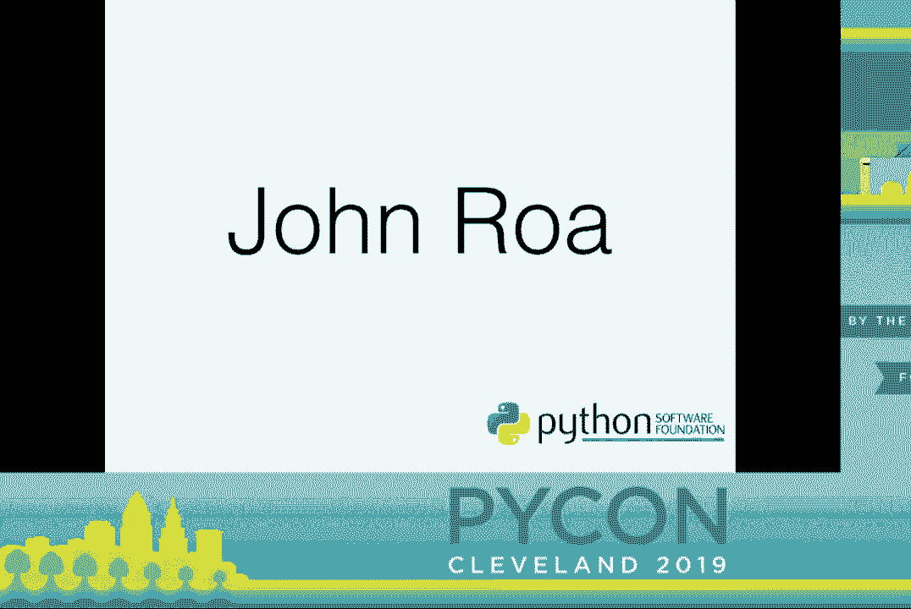

 The 2019 Q1 award went to Stefan Becknell for his work as main developer and maintainer of two important python projects。 sython and lxml。 Unfortunately， Stefan could not join us this year。

 but let us give him a round of applause。 [Applause]。
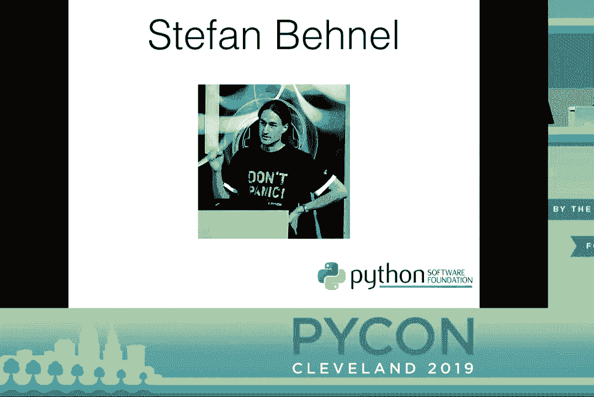

 Now let us welcome Eric Ma to the stage。 [Applause]。 The 2019 Q1 community service award was given to Eric because he has continually gone above and beyond his responsibilities as pike on financial aid co-chair and chair this year。

 Additionally， Eric has been a dedicated pike on program member for several years。 For those of you that received speaker grants or financial aid。

 be sure to thank Eric for his dedication when you see him around。 Thank you， Eric。 [Applause]。 That wraps up our awards this year。 There are so many awesome contributors in our community。

 and this is a great way to recognize their work。 If you would like to nominate someone for a future community service award。 please send your nomination to us。 It's psf@python。org。 Thank you， everyone。 [Applause]。

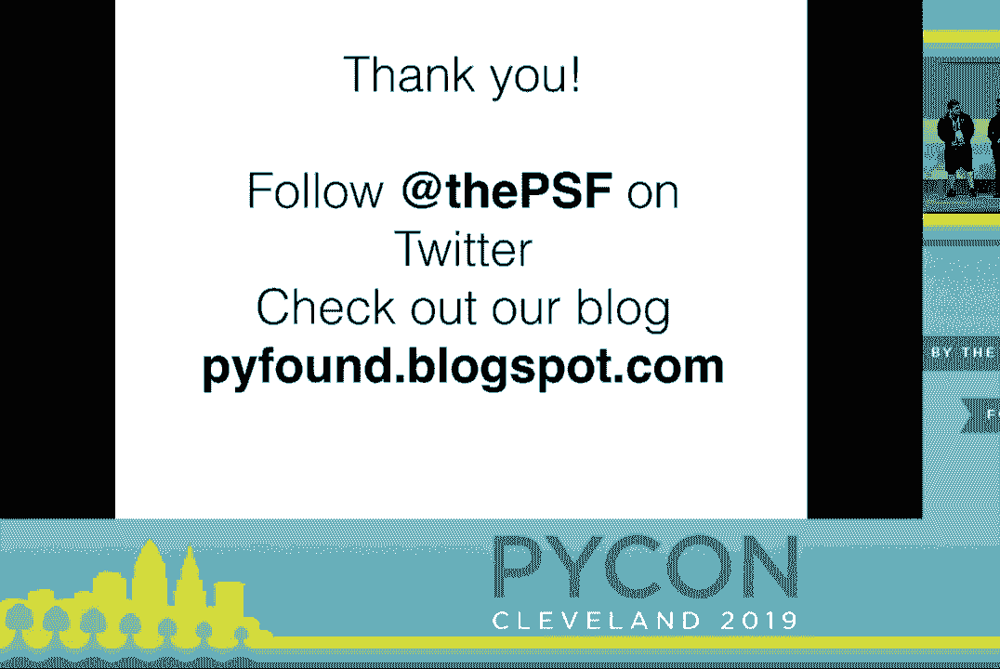

 Thank you， Eva。 Excuse me。 A little choked up。 Thank you， Eva。 And thanks to all of you for your work。 Can we get one more round of applause for the award winners？

 [Applause]， Thank you。 [Applause]， And Eva spoke a lot about the psf staff。 but didn't say much about herself。 The dedication and work that Eva puts in consistently to make sure that the Python software foundation and Python happen is measurable。

 So if we get one round of applause， just for Eva。 [Applause]。