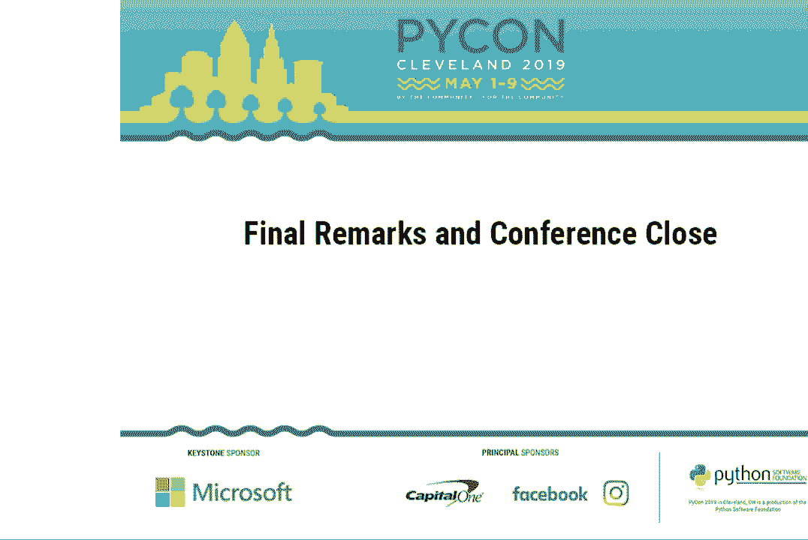
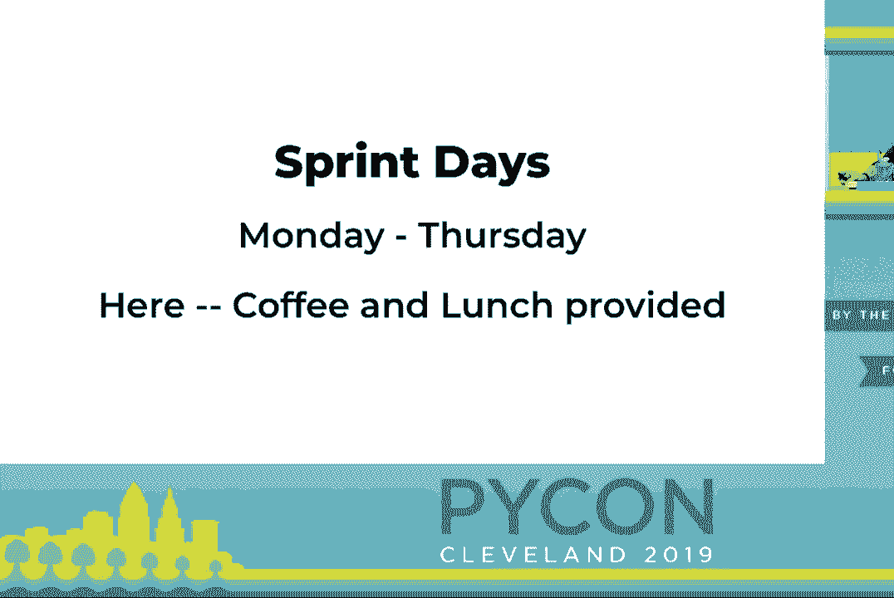
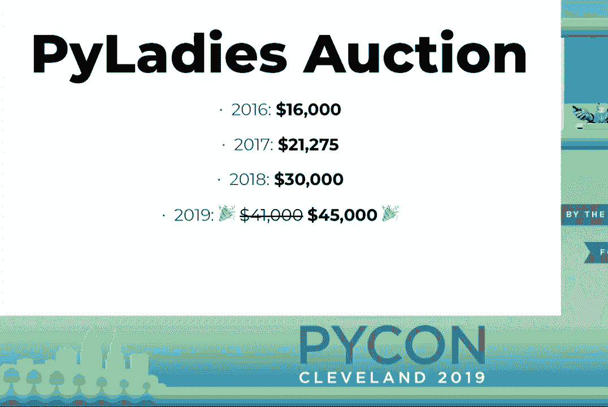
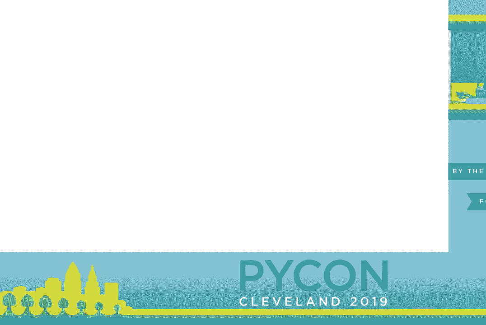
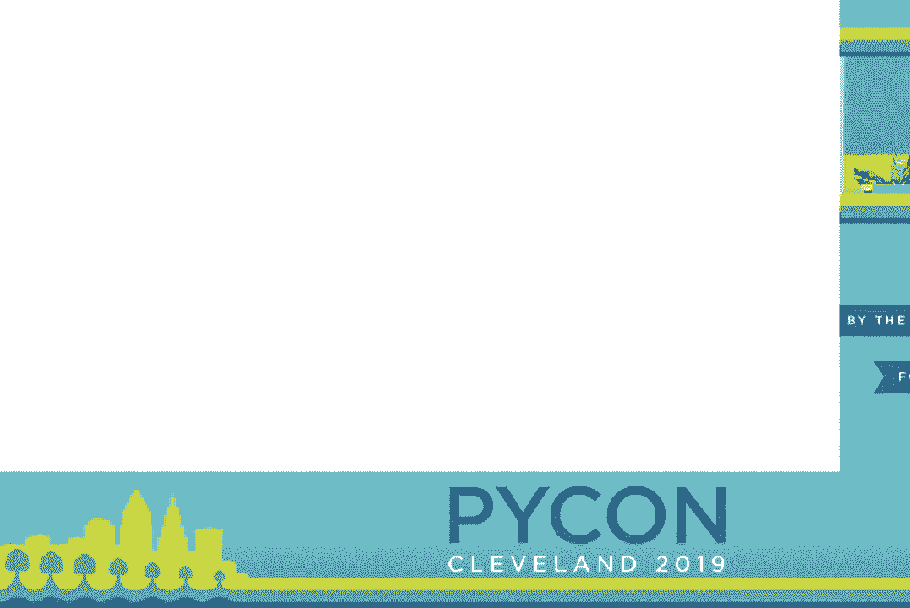
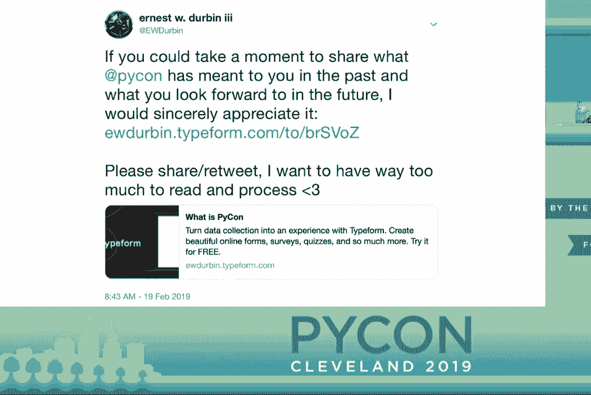
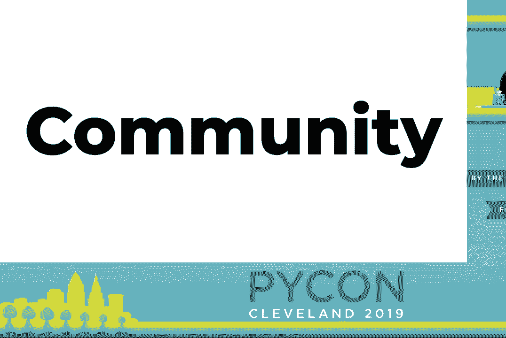
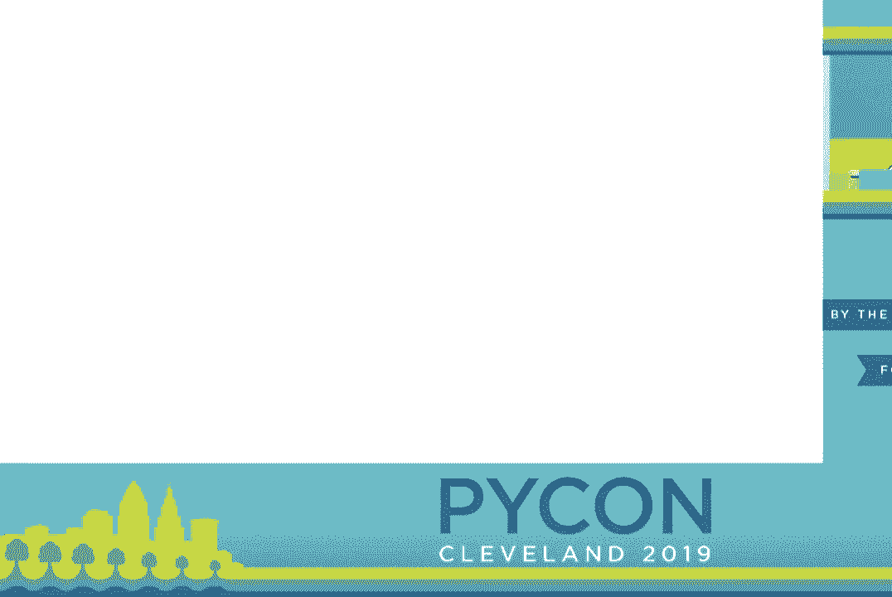
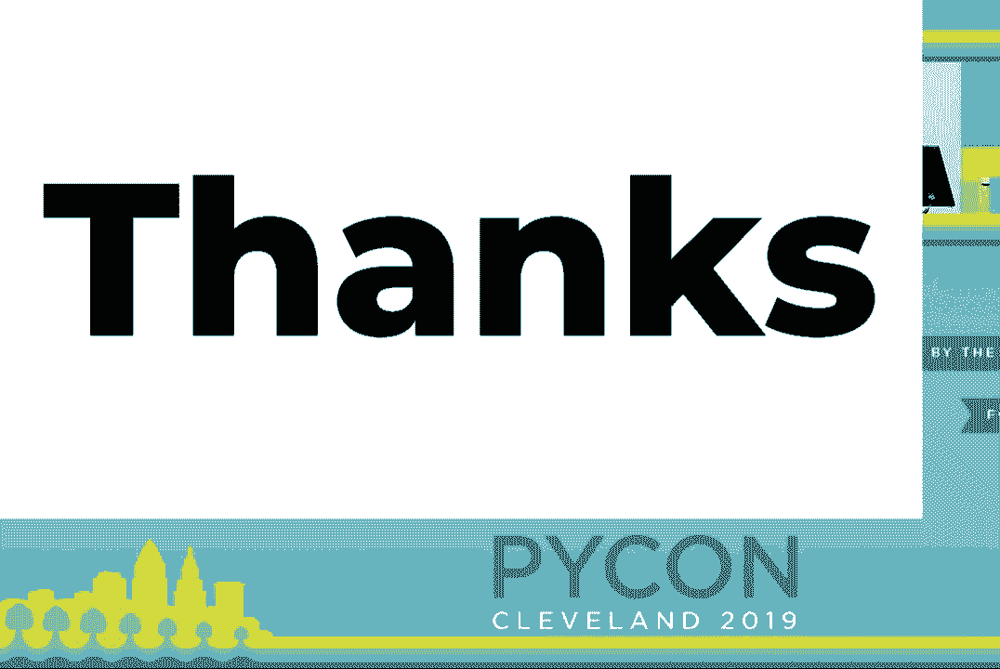

# P24：Final Remarks and Conference Close - PyCon 2019 - leosan - BV1qt411g7JH

 All right， so some things to catch up on。

 PyCon is like in its final moments。 But it's not going to end。 There are a few things you should know about。 You might have signed up for them。 Or maybe you're going to learn about them and take part。 Tonight， at 6。30。 at the Great Lakes Science Center is the final closing dinner of PyCon。 If you have a ticket。

 please attend。 If you no longer want to use your ticket， get it to someone。 The food's already there。 And it'll help reduce waste。 Shortly after this。 my remarks will be the sprint announcements。 So we'll give the hall about 15 minutes to clear out。 And then Cushal will be up here to run sprint rows， as I like to call them。

 This is where people who are leading sprint projects can have a moment or two。 to come up and introduce their project。 And those who are interested in sprinting can listen and choose what they'll be working on。 Or consider working on。 So if you are running a sprint and you want to make that announcement。 stick around and wait for Cushal's instructions。 At 5 p。m。 and 25C。

 you can attend an intro to sprinting workshop， which will give you a basic overview of what sprints are and how they work。 The sprint days are Monday through Thursday and coffee and lunch will be provided。

 So some announcements from the PyLadies auction last night。 The results are in。 fully tallied and prepared。 And just for some history， in 2016， 16，000， 21，000， 30，000 last year。 And this year raised $41，000 in benefit of the PyLadies。 (Applause)， In addition。 the Python Software Foundation has agreed to round that up to a $45，000 number。 (Applause)。

 So it might be wise to start saving and considering what you might donate for next year's auction。 because the number just has to keep going up。

 Oh， and one more final announcement。 I'm really happy to share something that the Python Software Foundation has launched。

 which is the all new PyCon。org。 So this resource can help you find a PyCon closer to you。 and scratch that itch well before the next installment of this event。 You can find it at PyCon。org。 Don't go to www。pyCon。org because I didn't realize that GitHub pages wouldn't cover that on TLS。 (Laughter)， I think that's something I might be sprinting on starting tomorrow。 (Applause)。

 And for organizers， I'd really love for you to go to this URL， if you're an organizer in the room。 share it with your other organizing friends。 This URL will take you to a repository where you can add your event to a CSV file。 Eventually that CSV file will power this site， all of the content on it。 And that'll help make it more direct and easier for us to have a central location。

 to find all of these events。 There are more and more every year。 So now it's time for something that at no point was I sure I would be prepared for。 We're going to take it slow and we're going to get through it together。 All right？ (Sigh)。 So PyCon 2019， as most of us know it， has come to its very last moments。

 It has been such a privilege to fill the role of a chair of a PyCon。 and I appreciate that each and every one of you are here。 Personally。 it's been a transformative experience。 I'm eternally grateful for being trusted and supported in this work。 During my time as chair， people have regularly asked me， "Ernest， what is PyCon？"， (Laughter)。

 Over time， my answer to this question became an almost robotic response。 It was just dates and event names and numbers in the same order over and over。 It began to feel hollow。 It didn't match what I feel every time I think about my experiences at PyCon in the past。 So my proclivity to tweet took over， and I tweeted。

 I asked you， I asked that you share it so that others might answer， and then you answered。 The responses of the survey are not something that I can even consider reading to you。 sharing on screen， or honestly even spend too much time thinking about。 The results is always me。 in a puddle of my own tears， and emotions spewing out of every corner of my heart。 But I think。

 and think， I can stomach sharing the consistent theme in nearly every response。

 (Applause)， Spending this time in person with others in our community deepens， broadens。 and often creates the network of personal， professional relationships。 that underpin Python and the Python community。 There's no correct way for how these interactions occur or what they look like。 And this is a factor in why PyCon has so many events and is so long。

 And it's also a big reason why the Hatchery program is so important to me。 To support the evolution of PyCon over time， to support and grow our community。 I want to take a moment to recognize the privilege that we all share。 to be in this room and have access to this subset of the community as it exists today。

 no matter how we got here。 The Python community is so much more than the 3。200 people who have gathered here in Cleveland， over the past few days。 In the 2018 Python developer survey alone， 18，000 people from more than 150 countries responded。 It's hard to say just how large our community truly is or how large it will grow。

 but we can make some rough estimates in our head。 As there are no plans to substantially grow the size of PyCon。 how do we ensure that others have access to this community？

 In this conference does not become bottleneck for the growth and sustaining our community。

 As you return to your home， I'm nearly certain that there's a national or regional PyCon。 a meet-up group， or some other manifestation of our community nearby。 It may be smaller。 but it represents the same opportunities to connect and grow。 You can find resources on these site。 on these URLs for conferences and events around the world， that are likely closer to you。

 I want to encourage you to attend， support， and volunteer at these events。 Maybe even consider organizing one。 They help to provide access to the same kind of opportunities that we as a community can't sustain on just once a year at this event。 Speaking of next year， I would like to now introduce to you the incoming chair of PyCon。 for Pittsburgh in 2020 and 2021。 Emily。

 Alright， so the good news is that we're actually less than a year away from our next PyCon。 Our next two years will be in Pittsburgh on April 15th through the 23rd of 2020 and May 12th through the 20th of 2021。 We hope to see all of you there again in the next years。 [Applause]， Alright。 now I want to take a moment to recognize all of the many。

 many people who come together to make this event possible。 If you hear the name of a group that you helped participate in。 please stand up and stay standing so that you can be recognized。 We have quite the list。 so I'm not going to pause for a pause in between， but please don't let that stop you from applauding from the very beginning。

 Without further ado， we want to thank the PSF staff who are the bedrock of this conference。 Our diversity and outreach chairs， our publicity chair and blog team， our accessibility chair。 our program committee chairs and reviewers， our volunteer incident responders， our tutorials chairs。 our posters chairs， all of the people who ran the lightning talks， our financial aid team。

 our session staff chairs and green room staff， our sprint coordinators， our open spaces team。 the PICON Hatchery Committee， the PICON Charla's team， the art of PICON organizers。 the maintainers summit organizers， the mentored sprints organizers。 the pilot each charity auction coordinators and volunteers， the education summit chair and team。

 the language summit coordinators， our startup row facilitators。 our captioning coordinator and captioning staff， to the tech audio and video staff。 to the young coders educators， the 5K run and walk coordinators， our mobile guide coordinators。 and our swag by bag head Paul Hillbrandt。 We want to thank all of our speakers。

 our tutorial instructors， our poster presenters， our education summit speakers， our Charla speakers。 and to all of the people who volunteered on site to help stuffs and distribute swag bags。 who helped with young coders， who staffed the green room， ran for speakers， chaired sessions。 ran items at the auction， worked the registration booth and greeted for tutorials。 [Applause]。

 And I want to give one final thank you before we disperse， and that is to all of you。 because without all of you， our community would not be possible。 So thank you。 and we'll see you in Pittsburgh 2020。 [Applause]。
