# P25：Liz Sander - Lowering the Stakes of Failure with Pre-mortems and Post-mortems - - leosan - BV1qt411g7JH

 \>\> Good afternoon， everybody， and welcome to this session of PyCon 2019。 Next speaker is Liz Sander。 and she will be talking about lowering the stakes of failure。

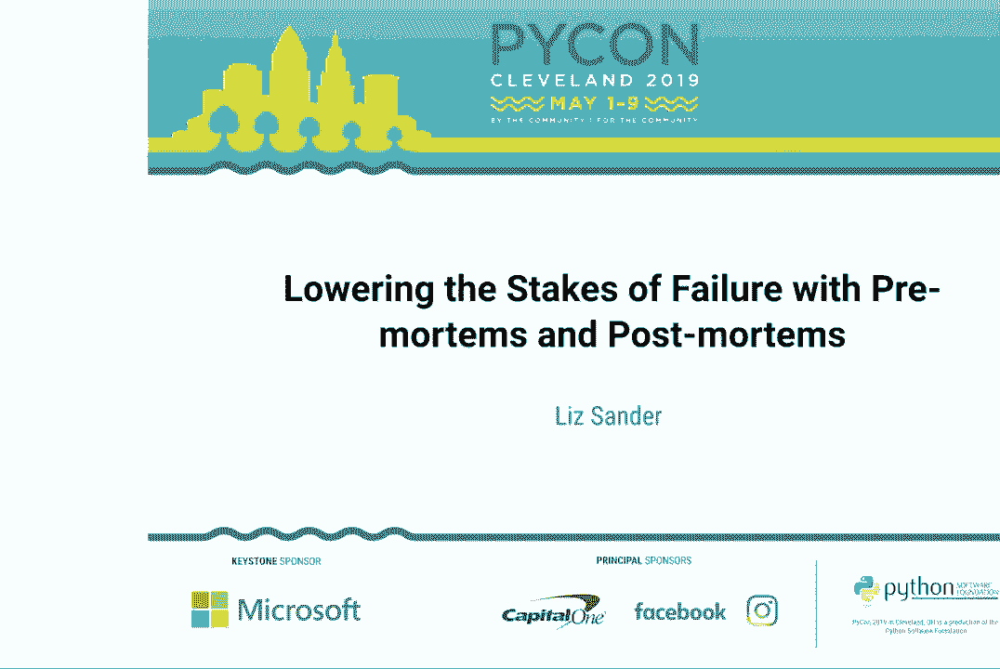

 with premortems and post-mortems。 Thank you very much。 Make it feel welcome。 [ Applause ]， \>\> Hi。 everyone。 So failure， it's scary for all of us。 But it can look really different depending on what you do。

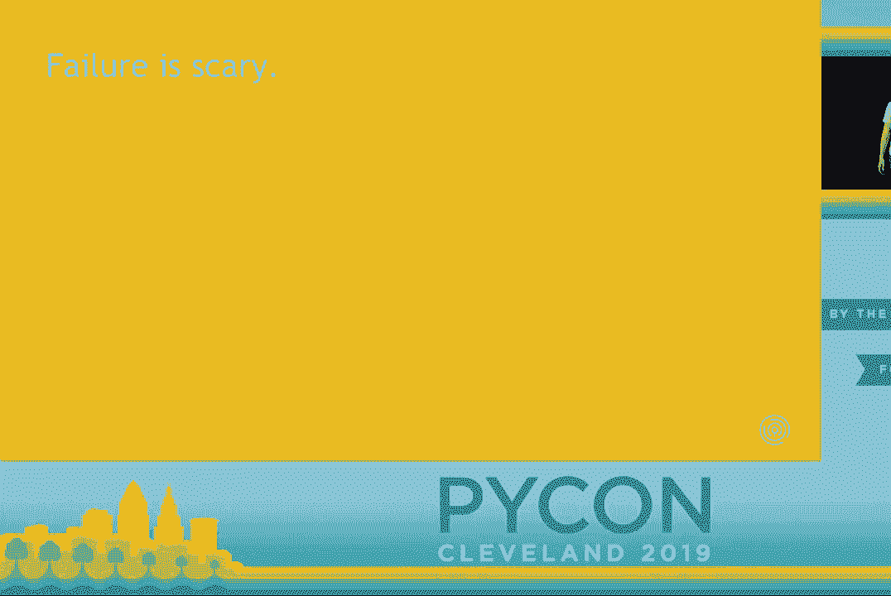

 So if you're -- here because you're familiar with post-mortems， maybe you think of an incident。 or a failure in this sort of traditional site reliability engineer context where it means。

 system downtime。 But maybe depending on your job， it looks more like a security vulnerability or shipping。 a critical bug in something that isn't a web service。 If you're a data scientist。

 maybe you shipped a model that's really wrong on some subset。 of data or it's unfair with respect to a protected class。

 Maybe you're a consultant and it looks more like a net loss on a consulting engagement。 And for all of us who are under deadlines of some kind， maybe you miss a critical deadline。

 And that's also something important that you want to mitigate and avoid in the future。 And so I think that pre-mortems and post-mortems are great tools for all of these kinds of。

 failure and not just for SRE。
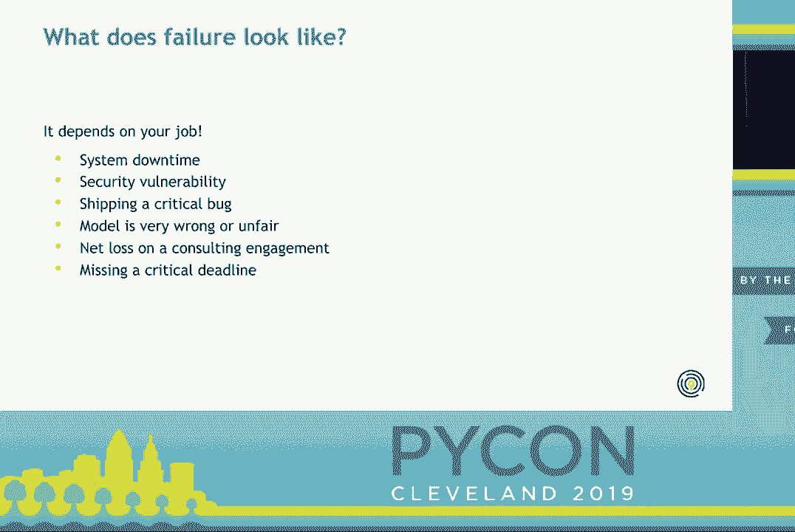

 Why is failure so scary？ There are a couple of obvious reasons， right？ It costs the company money。 It takes up your time。 It takes up your team's time。

 Maybe external users are affected and it costs them time and money。 It makes them unhappy。 But I think there's also this big emotional component to it too， right？

 I think it's easy to feel really embarrassed and ashamed if you feel like you're responsible。 for failing。 You feel like you let your team down or your company or your users。

 And so it becomes really difficult to talk about failure because there's these high emotional。
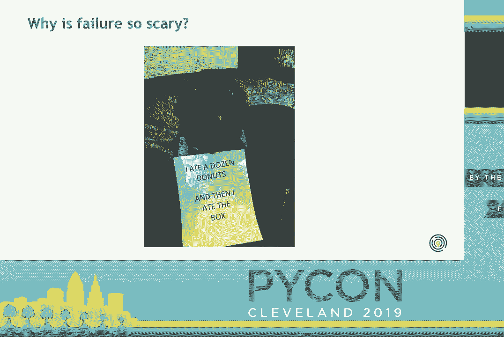

 stakes。 Fortunately， I'm here to tell you that failure isn't about you or at least it's not just about。 you。 These mistakes happen in a context。 If you're working with a team。

 that team has time pressures。 They're sort of informal or formal incentives and norms that affect what you put your time。 into and what things you try to finish quickly。 And then there's the matter of how well-trained you are and how much training your team has。

 Does your team have the expertise it needs to be successful？

 And then there are also process elements that maybe you have a little bit more control over。 So if you're pushing code into production， you probably do some kind of testing。

 How automated is that？ Are there manual steps that are easy to skip or get wrong？

 How well documented is the code？ Is it easy to introduce bugs because it's hard to understand what's happening in the。 code？ And is the release process itself well documented？ If you're running into timeline slippages。

 maybe the issues that you don't do， time or， issue tracking。 Do you know whether you're on track for a project at any given time？ And then finally。

 you may want to think about whether someone else takes a look at your。 code or methods before it goes into production and having some kind of formal code or methods。

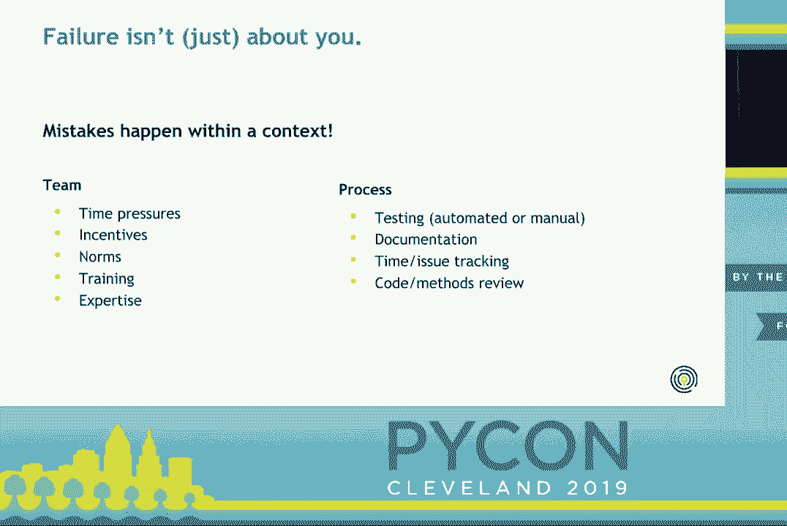

 review。 The key idea here is that individuals are fallible and we're all going to make mistakes。 We can try to improve over time too， but we're just not going to be perfect， especially。

 in a really high stress situation， like pushing a critical bug into production。 And so we need to think as teams so that we can establish systems that catch and mitigate。

 the effects of failure。 And this is why blameless post-mortem are great。 They're a tool to help lower the emotional stakes and it lets us think of incidents as。

 not just failure but a learning opportunity and something that we can use to get better。
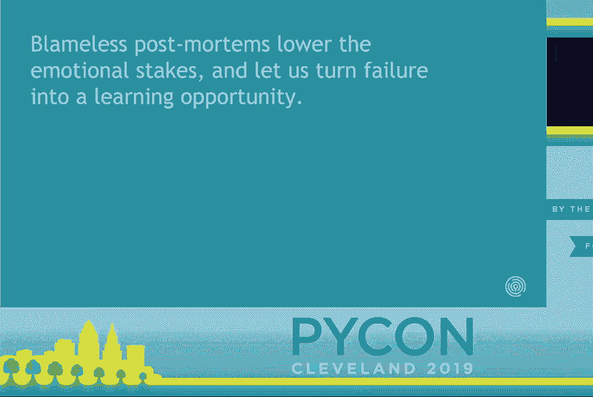

 over time。 So what is a post-mortem exactly？ So broadly it's a process to document an incident。 identify the root cause and figure， out what actions you should take to avoid or mitigate the impact of similar types of。

 problems in the future。 And again， I just want to reinforce that even though these are really common in site。 reliability engineering， post-mortems aren't just for SREs， they can be applied to all。

 the types of failures that I mentioned at the beginning of the talk and lots of others。 that didn't occur to me。 It's a very general process。

 It's really just a meeting where you talk about the incident in a structured way。 And the deliverable is a document that goes through what happened and writes out what。

 you need to take action on。 So I mentioned the phrase "blameless post-mortem。"。 What does the blameless part mean？ So the idea here is that it's very easy for a meeting about an incident to turn into。

 finger-pointing。 Like you're talking about a failure that happened。 You want to identify why it happened and it's easy to say， oh， it happened because of that， person。

 That makes it difficult for people to feel safe reporting incidents and talk about them。 If you think that you're at risk of being blamed or getting in trouble， you're not going。

 to talk about these things very openly。 So you need a blameless process for people to feel comfortable talking about these things。 And the focus needs to be on understanding the root causes of the incident， the systems。

 underlying it， so that we can improve as a team rather than assigning blame to individuals。 And the idea here is that every individual is accountable for helping the team function。

 but no one person is responsible for a specific incident。 So the first time I heard about post-mortems， my first thought was， yeah， okay， but like。

 what if it's really one person's fault， right？ So I do want to underline this really isn't true most of the time。 People take actions within a context and the idea behind a blameless written post-mortem。

 is that everyone involved had good intentions and was doing the right thing with the information。 they had。 But maybe the information was incomplete or confusing。

 And that's where their opportunity is to improve。 If you feel like you are really directly responsible for an incident。 it's great to reflect on， what you individually could approve on。

 but that's really not the goal of a post-mortem， and it doesn't make sense to turn the focus of the meeting into your own personal failings。 or concerns。 And again， if someone on the team has recurring performance issues。

 that is also important， but that's an issue for them to address with their manager。 And again。 it's really not the focus of a post-mortem。 So to ground this in a specific example。

 I want to talk about the first post-mortem， that I did。 So failure for me as a data scientist looks like releasing buggy data science code。

 And so I help maintain this library。 That's essentially a generalized modeling tool。 My maintainer。 who's also my manager， was out of town， but this was a really small bug， fixed release。

 And so I wasn't too worried about it。 I just a couple of bugs and a minor internal dependency change。 I ran my unit tests。 I ran some integration tests。 Everything worked fine。

 I released it into production。 Everything broke。 Every single job failed。 And I was pretty new to the company。 I totally panicked。 I worked with IT。

 So the way that this code works is it auto builds versioned Docker images that then end。 up being the version that runs in production。 And so everyone's in the internal company。

 everyone's code was broken。 So I worked with IT to try to revert the Docker images。 and we weren't able to do that。 Then I brought in sort of a backup co-mainainer。

 We tried to debug for a while。 And eventually at the end of the day。 we decided just to release a new patch version， that essentially just reverted it back until we could do it the right way。

 So my manager came back and I felt really bad I talked to him about what happened and， he said。 that's fine。 We should have a postmortem and talk about it so that we can learn from it。

 So what exactly did that look like？ So first you need to figure out who you're going to invite。 And you want to bring -- it should be a fairly small group of people who are directly involved。

 in the incident。 In this case， it was just me， the co-mainainer who helped me out。 and my manager who acted， as a facilitator。 We could have also brought in IT who worked with me on the Docker images。

 but since that， didn't actually resolve the issue， we decided to save them the meeting。 If this had been a more major incident that affected external users， then we would have。

 probably wanted to bring in someone who had worked directly with the clients， maybe a。 client success representative， and maybe a product manager who was more focused on the。

 product side。 Then you'll have a postmortem template and you want to try to fill in a lot of major。 parts of that， and then you can discuss it in the meeting itself。

 So those things are the incident period。 So that's just the time span that was affected。 The current status， which is hopefully resolved， but maybe they're ongoing issues。 And if so。

 you want to mention those。 A summary of the incident。 How it affected users。 The trigger。 so that's the specific thing that caused the incident。 How it was detected。

 which in this case was me running some integration tests on the actual， production code。 How it was resolved， including things you tried that didn't work。

 And any ideas that you have up front for action items。 So then you want your facilitator to probably not be the person who is most directly involved。

 in the incident because you want someone who can kind of moderate the discussion， make。 sure it's staying productive and keep the flow of the meeting going。

 And you want to start by reading through a timeline so that everyone agrees on the basic。 facts of the situation。 In this case， I'm just saying the general times like two around the hour because I wasn't。

 under any kind of SLA as far as the uptime of this library was concerned。 But if you are working in more of an SRE context， maybe it's important to say like to the minute。

 or second what times things happened。 So again， the basic flow is that I tagged this release。 I ran some tests and discovered the bug。 Then I spent a couple hours working with IT and trying to revert the images。

 In the afternoon I brought in a co-maintenor and at the end of the day we decided to release。 a version to revert the broken code。 Now that you have those basic facts。

 you want to agree on the issues that are essentially， underlying the incident。 So the trigger is the specific immediate cause。 And in that case it was this internal dependency where the bug didn't show up until the actual。

 production。 Then the impact is the effect on the users。 And in this case it was an internal release only。 So the impact was that there was about a day of downtime for our internal data scientists。

 And fortunately no client deliverables were affected。 Then you all want to agree about the root causes。 And this is the really critical part because this is the underlying systems that resulted。

 in the problem。 And for us this was that we didn't have a great way to test our code against the actual。 production environment。 I was running all of my tests on a slightly outdated version of our dependencies and so。

 we weren't actually testing everything together。 Now that you have those underlying root causes。 you can talk about generally what went well。 And there you want to focus on what parts of the process to keep and replicate elsewhere。

 It's also a nice way to recognize the work that people involved in the incident did。 And it again lowers the emotional temperature a little bit。

 So in this case I ran these acceptance tests and caught the bug immediately and was able。 to talk to everyone in the company and give them a workaround。

 And so it didn't affect anyone without their knowledge。 And this meant that we had a little bit more breathing room to try to assault the bug。

 Then you want to talk about what went badly。 And those are the areas that need attention where you want to focus your action items。 And in this case it was that we didn't have a production environment to test our code， in。

 Then you want to think about where you got lucky。 This seems like kind of a weird question at first。 Like why do you care？ But the idea here is that you want to identify areas that didn't break this time but easily。

 could have and could have caused a more catastrophic incident。 You also want to think about action items here because you can avoid future problems。

 that are similar。 And in this case I got lucky that we had a backup maintainer for me to work with。 And that it was only an internal release。 If this had been an external release then clients would have been affected。

 We would have been under more time pressure but we wouldn't necessarily have had better。 tools to fix it。 Once you have those you can talk about the actual action items。

 And you want to assign them owners so that there's accountability。 And in this case it was mostly updates to our release checklist。

 We came up with a process for running the test in an environment that actually matches， production。 And we also added a note to never make a release without more than two maintainers available。

 That way if another problem like this occurs there's always someone to do code review to。 help you fix the bug。 Then you can talk about more general lessons learned that you can bring to the project。

 and to other projects。 So one obviously is it's important to test in the production environment before you release。 your code。 And also we came up with a process for triaging these critically buggy releases。

 And we decided that you just want to immediately cut a new version that reverts back to the。 working version so that you have working code as quickly as possible。

 We tried to avoid this at first because we didn't want to have kind of a messy release。 change log but we decided that it was worth it to have as much uptime as possible。

 So then what happens next？ You want to follow up on those action items of course but also you want to make the document。 available to the company。 And potentially to the outside world too。

 It's important to keep all these things together so that you can reference them in the future。 And hopefully the action items you came up with are things that go well in the future。

 This actually happened for this project a few months ago。 I ran into kind of a related issue for a different library that was also related to Python dependency。

 problems。 And we knew that as soon as there was this critical bug we just cut a new release reverting。 it back and we could debug with minimal downtime。

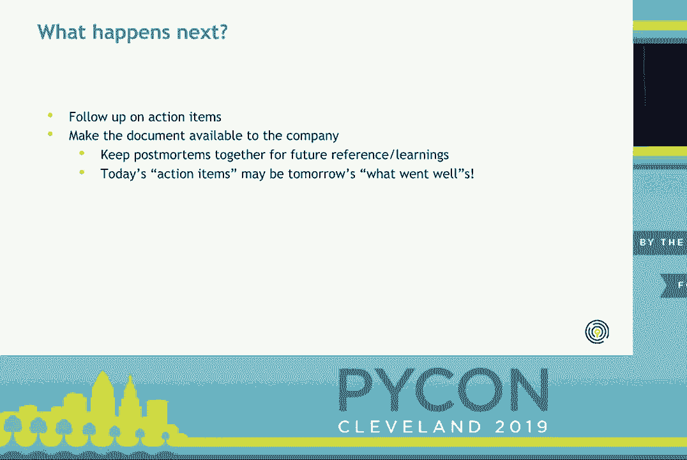

 So post-mortem is a really good way to iteratively improve and learn from past failure。 And they should sort of compound on each other so that you have this accumulation of things。

 that you've learned and processes that help you respond to incidents effectively。 But what if you're starting a big new project and you want to avoid these pitfalls in the。

 first place？ Maybe we can post-mortem a project before it actually fails。
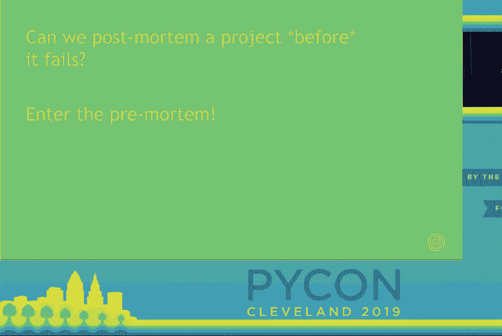

 And that's where pre-mortems come in。 So just to ground this in an example again I'm going to talk about the first pre-mortem。 that I did。 This was a flask -- the project was a flask app to explore audiences essentially segments。

 within a customer base。 And it was a pretty big project with a lot of moving parts。 We were working in cross-functional teams that were fairly new including engineers， data。

 scientists and product people。 There was a lot of data and we had both data and models in our database and we needed to。 handle them differently。 And then we had different clients who had different needs for their data and their visualizations。

 We also had some hard deadlines we were working with and a lot of uncertainty about the process。 So people were understandably anxious about it。 And then my colleague Henry who's talked on model fairness you may have seen yesterday decided。

 well we should have a pre-mortem and just talk about these things rather than silently。 all being anxious about it。 And so he put together a pre-mortem meeting。

 This looks in some ways like a post-mortem。 You want to have a facilitator who's orchestrating everything but in this case you want to have。 a lot of stakeholders across different departments because you don't know what the incident is。

 going to look like so you want to cast the net wide。 So we had engineers， data scientists。 people from product and then also people who are， going to be selling the tool and working with clients。

 So then you're ready to have your actual meeting。 The basic pre-mortem structure is saying our project has failed。 What happened？ So first you're going to brainstorm about this for maybe 20 to 30 minutes and hopefully you。

 come up with ideas that are all over the place that are coming from lots of different domains。 So our engineers were coming up with things like the app is really slow or it's difficult。

 to deploy。 The data scientists were worried about the ETL to get the data into the app and the models。 themselves being bad。 And then the people who are client facing and selling the tool were thinking well maybe。

 we build a great tool but no one wants to use it or understands it。 So once you get lots of these ideas out there you want to organize them into a few major。

 categories。 Definitely less than 10 but maybe around five。 And so some of the categories we came up with were performance of the app， security breaches。

 timeline slip， major feature gaps and people not using it。 And you want these to be pretty major risks and problems that could happen。

 Not something that is fairly minor。 And then you want to estimate how important they are。 So to do this everyone votes from one to three on how likely they think it is to occur and。

 how high the impact is。 And then you average those numbers。 So you can see here that we thought that security wasn't a super high risk issue because。

 it was something we were already thinking about a lot。 But obviously if it happened the impact would be huge。

 On the other hand we thought a timeline slip was pretty likely because we knew there was。 a lot of uncertainty there but the impact is not quite as high。 These things happen。

 And then you multiply the probability and impact together to get an overall important， score。 So in this case we were kind of surprised at what came out of this。

 Everybody ended up being relatively unimportant relative to other things as a focus for this。 meeting because even though the impact was high we didn't think it was so likely。

 But we thought that feature gaps were both pretty likely and pretty impactful。 So then you want to go from most important to least important and spend some time talking。

 about what you could have done to avoid or mitigate the failure。 So in this case we realized that there were a lot of concerns around people not using。

 it and it not being quite the right tool。 And so we decided to have ongoing user interviews and discussions with our stakeholder clients。 to make sure that we were building the right MVP。 Then after the meeting you need whoever took notes to compile those into a nice format。

 and send them out so people can discuss a little bit more and anything that they think is missing。 And then you want this to be a living document that you reference regularly。

 And ideally you want to check in on those risks and the action items to make sure you're。 following up。 If you work in a sprint framework maybe you can make your sprint retrospective include a。

 little bit of time to look at those risks and action items。 And of course if you have any post-mortems where there are actual incidents that happen。

 bring your pre-mortem document and see were these problems that we anticipated？

 Did we follow up on the action items and was there anything that was missing？

 So I want to take a step back and think why bother doing this。 This seems pretty negative right having a meeting for everyone to talk about how your。

 project is going to fail。 But it's pretty important because it's easy when leadership is really enthusiastic about。 a project people can feel concerned about bringing up things that they think might fail even。

 if they think it's pretty likely to go wrong。 And so having a meeting where you are supposed to talk about these things and that is literally。 the point of the meeting means that those concerns are now a valuable asset for the， team。

 People feel a little bit less nervous about it and more empowered to bring up their worries。 It also reveals issues that are kind of domain specific to the entire team。

 Those of us who are working on the technical side were less tuned in to the product and。 sales related concerns and vice versa。 But we all were on the same page afterwards。

 And this is why it's really important to have a variety of stakeholders both technical。 and non-technical。 It also lets everyone reflect on the project and the processes before something fails。

 Make sure you're building the right thing and that you're set up for success。 And because everyone gets to get their concerns out there and have them listen to and taken。

 seriously， it's easier for people to get on board and be enthusiastic about the project。
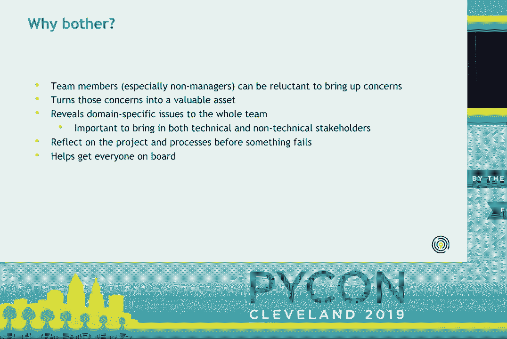

 So I just have a few closing thoughts。
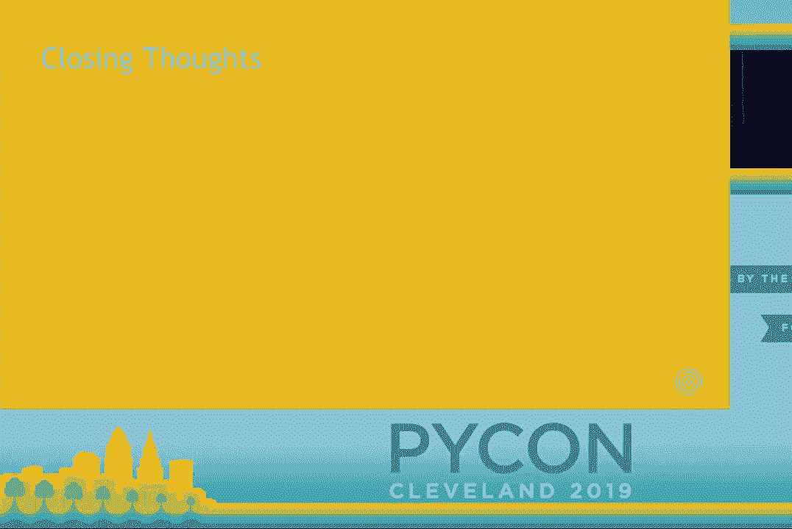

 So failure is really scary but it's also important and we need to use it as an opportunity。 to learn。 But we can only do that by talking about it and bringing it out into the open。

 We can be scary to do that too because it's easy to feel like you're going to get punished。 and sometimes that's actually true。 Sometimes those fears are well-founded。

 And this is why we need things like premortems and post-mortems。 These are specific processes where you're supposed to talk about failure and you get。

 to bring these things out into the open。 Both before a project starts and after a specific incident occurs。 And hopefully introducing these into a team creates a more general environment of openness。

 where people feel like they can talk about incidents and concerns that they have even。 when they're not in these meetings。 And overall， the most important thing here is that you're focusing on the team。

 on the， systems and the processes rather than blaming individuals。 That's really what creates that culture of openness and lets people learn from failure。

 So with that， I want to leave you with a few resources。 I'm going to post my slides on my website。 They should also be available on PyCon。 Google has a great book on site reliability engineering。

 Even if you aren't an SRE， I recommend you take a look at their chapter on post-mortem， culture。 It's available online for free。 And I think it's a really useful way to think about it。

 They also have an example post-mortem template there that you can use if you're implementing。 post-mortems in your team。 This pager duty link is helpful because there are lots of examples of post-mortems so you。

 can see what these look like。 Again， that's going to be focused on the SRE context but I encourage you to think broadly。 about how you can use them in your own team。 And then I have a couple of articles here about premortems。

 They're actually really different structures for running a premortem。 And it's just not one size fits all。 So I encourage you to read a couple of different structures and think about what's going to。

 work well for your team and for your project。
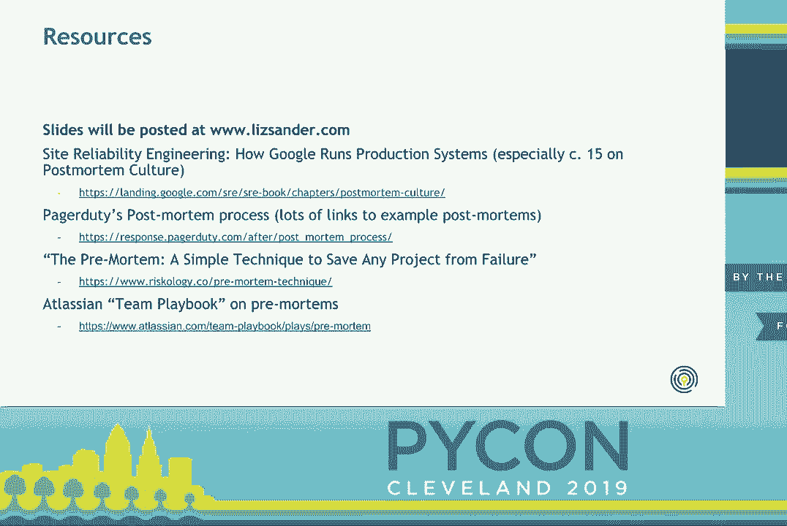

 So thank you for coming and with that I'm happy to take any questions。 Thank you again Liz。 If there are questions we have microphones in the aisles here。 Hi。

 I was just wondering if you use any particular tools for recording your premortems or post-mortems。 or you see as a document？ So in my team we just use a document。

 I know that there are tools out there but especially because in like this sort of data。 science use case it's kind of non-standard and there aren't tools that are really linked。

 into the way that our workflow works。 We mostly just structure it through the document。 Thank you。 Excellent talk。 I enjoyed it quite a bit。 My background is chemical engineering and a lot of what you're describing both the premortem。

 and the post-mortem seems very similar to the process safety analyses done in the chemical。 process industries。 Are there any sort of kind of comment do you know is the best practices here are they cross-fertilized。

 with chemical process and if not that might be something to investigate。 I'm actually not familiar with that but it sounds like there's probably a lot of like。

 maybe there's some convergent evolution there of those two ideas。 So I think there's probably a lot that each of those processes could learn from each other。 I agree。

 Thank you。 Thanks。 I like your talk especially the premortem stuff seems really exciting。 Lately in my mind I've been trying to figure out how to stop meetings from happening。

 I feel like there's too many meetings。 On your premortem the part that feels exciting to be synchronous together is that brainstorm。 of what could go wrong and maybe that first collection of votes。

 But I'm worried about the follow-up where people actually doing the rest of work it might feel。 slow and boring in this meeting。 Can you break it into two pieces and do one part kind of asynchronously or live document。

 style？ So what part do you mean the like organizing and voting？

 Yeah what do you feel like is the most important part for the humans to do face to face？

 Yeah I think that the brainstorming is the most important part just getting all of those。 ideas on paper and everyone being ideally in one physical space but all like being in。

 a meeting together to talk about those things。 But in my experience there also is value to people being there to talk through what we。 could do to mitigate them just because I think there can be like a combination of efforts。

 from people on maybe like the sales side and on the technical side that we wouldn't identify。 otherwise。 And that's just because at least in my experience in most meetings you don't have those two。

 pieces of the business together very often and so it is nice to have a place where everyone。 is together and you can share ideas a little bit more。

 But I think it would be possible to do those asynchronously if you wanted。 Hi great talk thank you。 I just have a couple questions。 First at what point in the life of a project do you typically start thinking about the pre-mortem。

 meetings and then how many times do you follow up on that first pre-mortem？

 So I'll answer the second question first。 I think we should have followed up on it more than we actually did。 I think we had one big check in where we reflected on it but I wish that we had made。

 it part of our sprint retrospectives and I think I would do that in the future and so。 that would be like every couple weeks just like quickly scanning through those things。

 and seeing if anything that's relevant comes up。 What was the first question again？

 When do you typically start planning？ Yeah。 I think ideally you do it before you've written a lot of code like when you're scoping out。 the project and if it's something that you're working directly with one or two clients on。

 you want to be able to get in front of any scope creep related to those individual clients。 So I think ideally during that scoping phase but again that can depend a little bit on， the project。

 We have time for one more question。 Hi thank you for the great talk。 My question is a little similar but I'll try to make it distinct。

 So it seems like there's a bit of a kind of exploration exploitation trade-off with the。 timing of the pre-mortems as you get closer and closer to the incident of potential failure。

 you might have more information about what could go wrong or the magnitude of it。 So are there scenarios where you find yourself delaying the pre-mortems due to acquiring more。

 information or do you think this kind of exploration exploitation similes is a little off？ Yeah。 So I think it can definitely be an issue because if the project isn't scoped enough yet no。

 one knows enough about it to really like say what could go wrong even。 So it definitely is a balance。 I think you probably would want to delay it until you at least have something on paper。

 for what the scope is。 You wouldn't want to talk about well those conversations are still really general because。 people need like one thing that they can reference and say okay I think here are specific things。

 that could go wrong。 Thank you again Liz。 Thanks。 Thanks。 [APPLAUSE]。
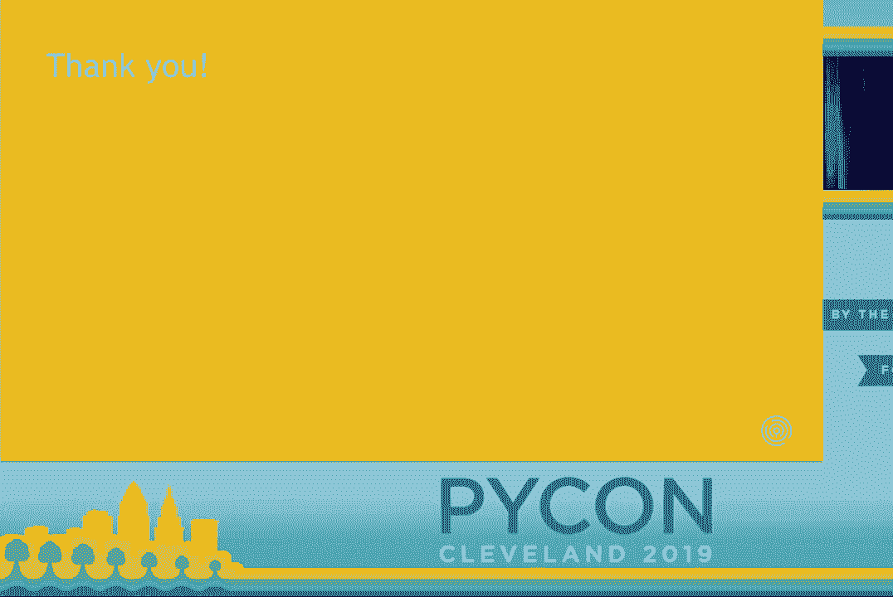