# P28：Lauren Schaefer - Does remote work really work - PyCon 2019 - leosan - BV1qt411g7JH

 >> Hey， everyone。

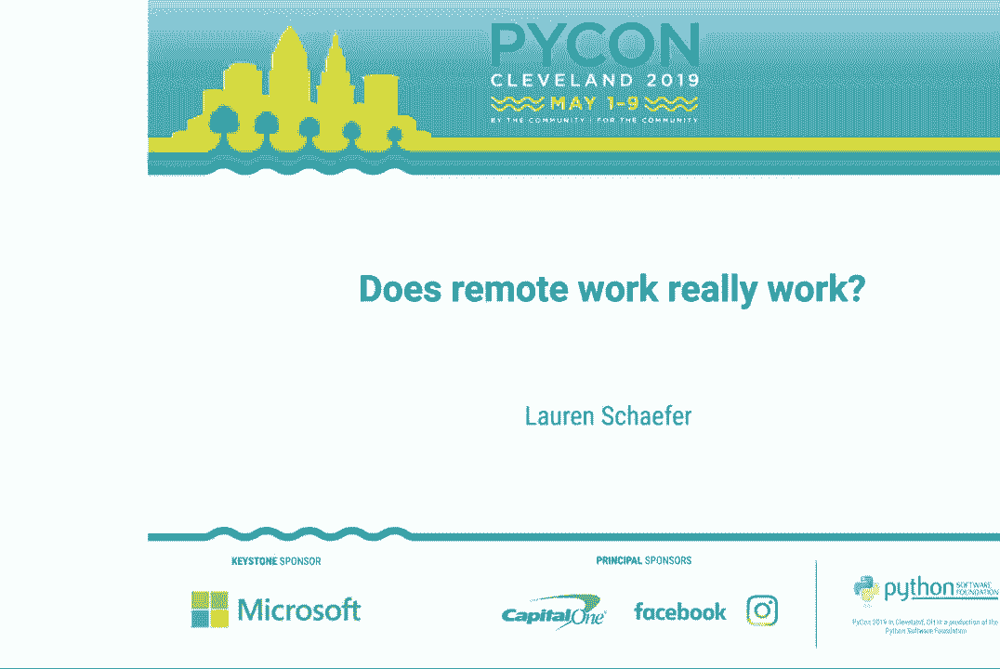

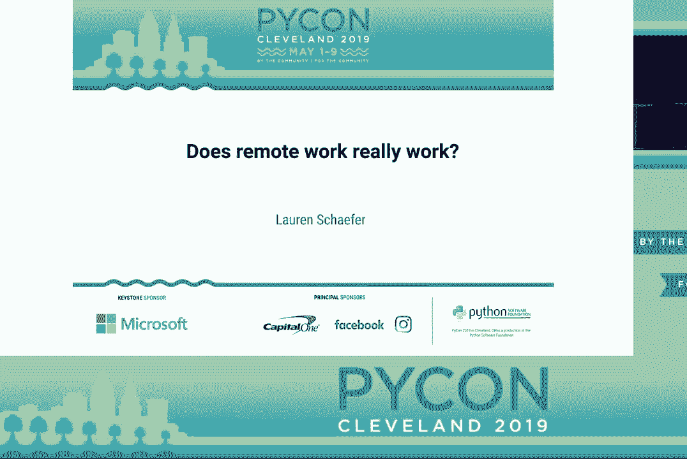

 Let's get started。 Our speaker right now is Lauren Schafer with does remote work really work。

 [Applause]。

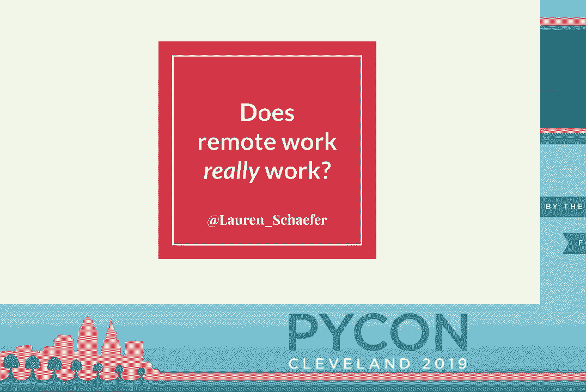

 >> Hey， welcome， everyone。 I want to begin by asking you to think about a time that you were fabulously。

 productive。 I mean， you were in the zone。 Maybe you were sitting at your desk， at your office。

 you had your headphones on， and you were， nailing it。 I mean。

 the code was going directly from your mind to your fingertips。

 Maybe you felt like a pop star。 And then you got the dreaded tap on the shoulder。 Somebody said。

 I'm going to let you finish。 But first， I have to ask you a question。

 Maybe it was something that was important， right？ Maybe everything crashed in production and you were the only person who could solve it。

 Or maybe they just wanted to talk about their latest Game of Thrones theory episode。 I mean， like。

 maybe it really wasn't that important。 Either way， you answered their question。

 they went on their way， and you were left sitting， there like， what？ Where was I？

 What was I working on？ And maybe you're going to try to get back in the zone。

 Or maybe you've got a meeting in 25 minutes， so it's not even worth the effort of trying。

 to get back in that zone。 You've lost a huge chunk of productivity。

 And that's why open office spaces can be the worst， right？ You get those drive-by distractions。 Oh。

 yes， thank you。 Thank you。 I did not pay him。 I appreciate that， though。 Right？

 You've got those drive-by distractions。 You don't really have any privacy。 It can be tough。

 And Cubeland can also be the worst。 You've got that illusion of privacy。

 but you still kind of have to be quiet。 People will glare at you if you're noisy。

 It can be a problem。 Now， I'm a huge advocate for remote work。

 as you'll find out throughout this talk。 But to be fair， working remotely can also be the worst。

 I don't know if you guys remember， a couple years ago， there was a guy who took an interview。

 for the BBC from his home office。 You remember it， right？ Okay， well。

 for those of you who don't remember it， this is what happened。

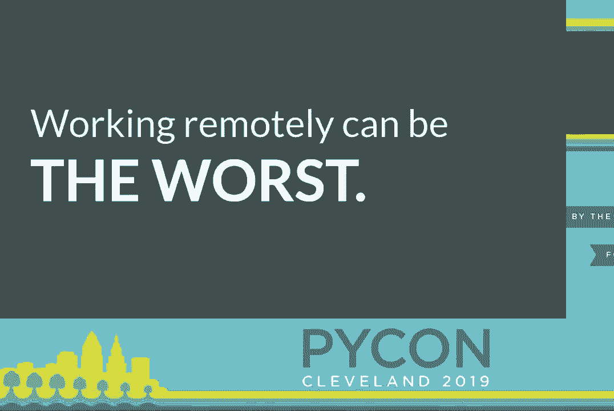

 Scandals happen all the time。 The question is how do democracies respond to those scandals？

 And what will it mean for the wider region？ I think one of your children has just walked in。 I mean。

 shifting sands in the regions you think relations with the North may change？

 I would be surprised if they do。 The。 Pardon me。 Pardon me。 My fault。 It's。

 What was this going on for the region？ I'm a biologist。 North。 Sorry。 North Korea。 North。

 South Korea's policy choices on North Korea have been severely limited in the last six months。

 per year。 Okay， how great is that mom， though？ Okay。

 so I think we can probably all agree that in that particular moment。

 that guy failed at working remotely。 Right？ So today we're going to be answering the question。

 does remote work really work？ And some of you are sitting in here probably pretty skeptical。 I mean。

 you've seen videos like that， and maybe you think it's not possible for people to be as productive。

 or as collaborative or as innovative when they work remotely。

 So we're going to examine that and take a look at what the research says。

 Some of you might be interested in working remotely。

 but your company does not have a remote work policy。

 and you think there's no way my boss is ever going to let me work remotely。

 So we'll talk about how you can convince your boss that remote work is a great option。 And finally。

 some of you here probably want to try remote work， or maybe you've tried it and you failed。

 or maybe you're a manager of people who work remotely or want to work remotely。

 but you're not sure how to be successful。 So we're going to talk about some very practical steps that you can take to be a successful remote employee。

 My hope is that by the end of the session， you'll be able to answer the question for yourself。

 does remote work really work？ So to begin， we're going to start out。

 I want to share my story with you why I work remotely。

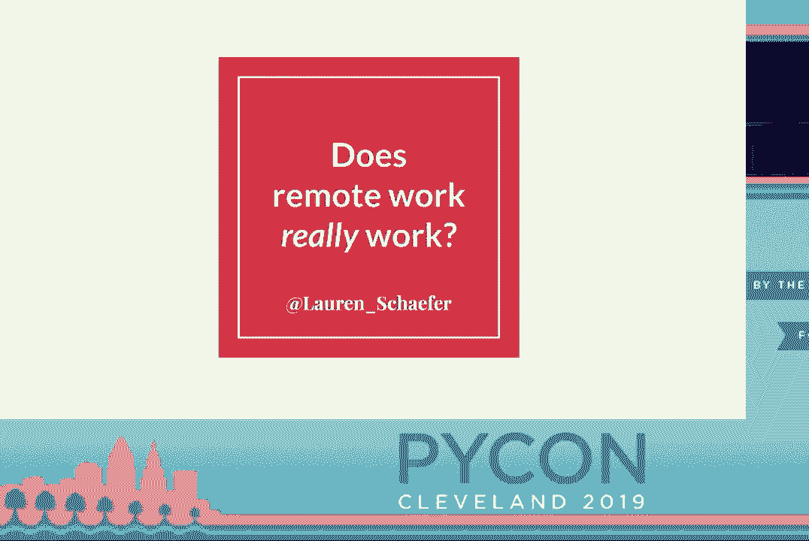

 And to do that， we're going to travel back in time to 2008。

 It was a simpler time。 Tina Fey was amusing us all with her impressions of Sarah Palin。

 We all thought Rick Rowling someone was hilarious。

 And Beyonce was encouraging men to put a ring on it。 And that summer。

 my boyfriend at the time did just that。

 He proposed。 And I said yes， and we were young and in love and life was great。

 And we decided that we wanted to get married。 Obviously， we wanted to live together。

 And the problem was that I was a computer scientist and he was a nuclear engineer。

 So that's obviously not a problem， but it was a problem eventually。 So we did get along。 Okay。

 so we had our internships that summer and life was good。

 We came back and I ended up interviewing with IBM who I had interned for。

 And I ended up getting three job offers at IBM， which is a fantastic problem to have。

 No complaints here。 The problem was that the nuclear engineering recruiting cycle didn't start until the following spring。

 And nuclear engineers don't have a lot of job options。

 And the few job options that they have are in very specific cities。

 You have to kind of live where the nuclear power plant is。

 So I found myself in this awkward position of saying， well， ultimately。

 I want to live with my husband， right？ But I don't know where he's going to be able to get a job。

 Maybe he'll be able to get a job in Raleigh where we had been living。 I got these job offers。

 but maybe not。 So I decided just to put my cards on the table and I called these hiring managers up and I said。

 you know， I can commit to work for you in the office for a year。 But after that。

 I really don't know。 Maybe I'll be able to stay in Raleigh。 Maybe I'm going to move。

 What are my options？

 Will you let me work from home？ And one of the managers was like， no， that's not going to happen。

 One of the managers was like， maybe it depends on your performance and how your team lead feels。

 And one of the managers was like， yeah， that's no big deal at all。 So it was a very easy decision。

 I didn't care about the technology。 I didn't care about the team。

 I just wanted the manager that was going to let me work remotely。 So I accepted the job offer。

 Life was good。 My fiance got a job offer in Maryland。

 So we were very excited for him and we realized， okay， we're going to make this work。

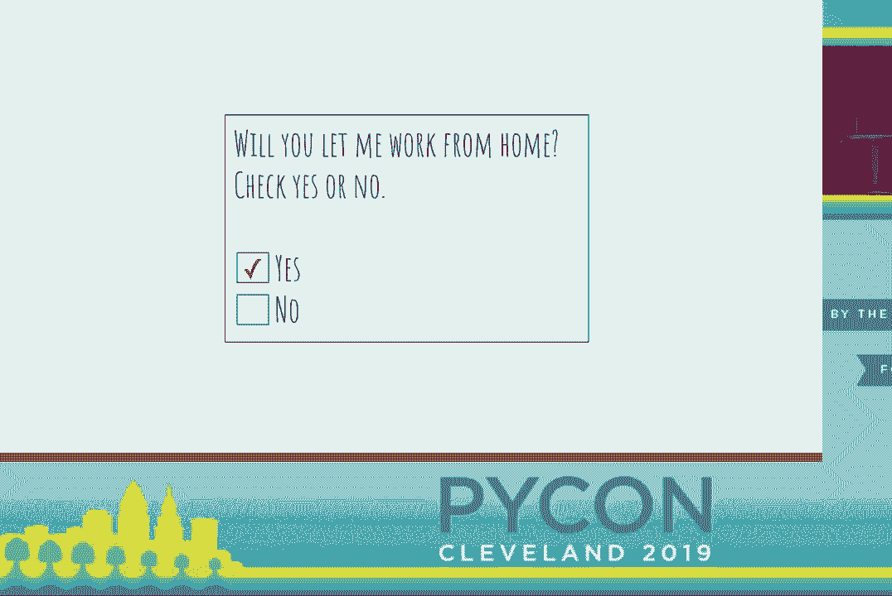

 So we went back to school。 We got our graduate degrees。 Life was good。 And we split up。

 So I stayed in Raleigh。 We didn't split up forever。 We split physically locations。 Okay。

 So you guys get up here and talk and you find how your words come out。 Okay。 So I stayed in Raleigh。

 He went to Maryland and I went and worked in Cubeland for a year。 And I'm honest with you。

 Cubeland was not for me。 The walls were very gray。 It felt a little drab。

 I didn't have any sunlight。 There were people in the office。 Sometimes I talk to them。

 Sometimes I didn't。 If I yelled down the hallway to a friend， people glared at me。

 It was kind of horrible。 So Cubeland was not great。 So after a year of Cubeland。

 I was excited to get out。 So we got married。 We were all excited。 And I was ready to work remotely。

 But the first six months， working remotely was the worst。 It was a real struggle for me。

 There were so many life adjustments that happened at the same time。

 I went from being in the office with people to really not seeing anybody。

 I went from having lots of local friends to really having one set of couple friends。

 I went from the busyness and excitement of planning a wedding to having really nothing major going on in my life。

 My life changed in a big way and I wasn't really happy about it。

 On the first two teams I was a part of when I worked remotely。

 I was one of the fewer remote employees where everybody else was co-located。

 And on one of those teams， the team was in Switzerland。 So we had a big time zone issue。

 So I would meet with two of the team leads about once a week for an hour。

 And that was all that I talked to them。 I knew I was missing out on conversations。

 I knew I was not working on the most important part of the product。

 I was working on things that they could just easily silo off to me。 It was a struggle。

 I didn't really talk to people during the day。 When Jason would come home。

 I would just talk his ear off。 On another team I was on。

 I was in charge of running the build verification tests。 So I was in charge of building them。

 managing and running them。 And this was before DevOps was like a normal thing。

 So we had our overnight build。 And I would get on at 6。

30 in the morning to run the tests with the hope of getting them。

 finished before the team came online at 9 a。m。 And most days life was good。

 But you guys know overnight builds， they don't always pass， right？

 And so on those days the team would keep fixing them and fixing them。

 And I had to keep checking in all day long to see if the build had passed。

 On those days I would skip the gym and I would just keep checking in。 I found myself burning out。

 I actually found myself really unpassionate about my work。

 And I used to daydream about having a kid so it would be socially acceptable to quit。 Not so great。

 But after about 6 months I figured out how to be successful remote employee and working remotely became the best。

 Over time my career began to gain momentum。 I began to switch teams so I could learn new skills and work on new projects。

 I began to speak at conferences like this one。 Several years ago I was speaking at。

 I did a birds of a feather session of four remote employees。

 And an IBM exec came up to me and she said， "You know。

 I think you should start a work-from-home networking group for IBM employees。"。

 And that was a little scary for me at the time but I went for it。

 And the group eventually grew to 11，000 people under my leadership。

 This was a huge leadership opportunity for me that I would have never otherwise gotten。

 I was even able to participate in the IBM Corporate Service Corps where I spent four weeks in Kenya。

 It was such a cool opportunity working for a local school there。

 So I started to get all this career momentum and after eight years as a software engineer at IBM。

 I switched to SugarCRM and I was a developer advocate there for a little over a year。

 And then this past November I moved to MongoDB and I'm a developer advocate here。 And I love it。

 I've been remote since 2010 and I don't see myself ever going back into an office。

 I truly love remote work。 So some of you might be wondering how I was able to make that shift of how I went from being the worst to the best。

 And we're going to get to that。 We'll talk about how to be successful remote employee。

 But first I want to talk about you。

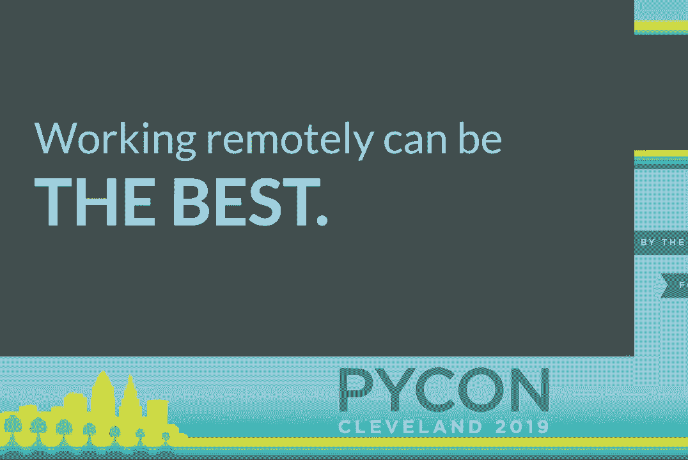

 So some of you in here， maybe you want to work remotely or you've got friends or coworkers who work remotely。

 or maybe you manage people who want to work remotely。

 And I want to talk about what some of those motivations are。 Why would people want to work remotely？

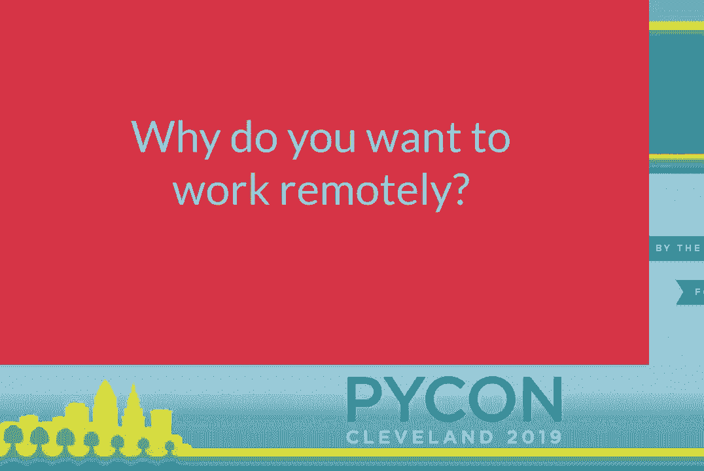

 Some people like me might be unable to relocate due to a spouse's job。

 or maybe they just don't want to pull their kids out of high school。

 Some people want to avoid lengthy commutes。 I mean 45 minutes to an hour of stop and go traffic is so sucking。

 And time you're not spending commuting is time you can spend with your family or on your hobbies or sleeping。

 right？ Who doesn't need more sleep？ So some people want to be physically available for children or aging parents。

 They don't necessarily need to be hands-on with them。

 They just need to be in the same physical location in case there's an emergency。

 Some people like me find the open office environments very distracting。

 And this last reason is by far my favorite。 I've known people who have actually rented out or sold their homes and traveled the world while continuing to make a full-time salary。

 There are actually programs now that facilitate this。

 So you can sign up for like a six-month or a one-year program。

 And you continue on with your same job， but the program facilitates all of your travel for you。

 So they handle your lodging， your transportation and even your activities while you're there。

 So you can keep working， your same amazing job and you get to experience the world。 It's so cool。

 So those are some of the reasons why employees want to work remotely。

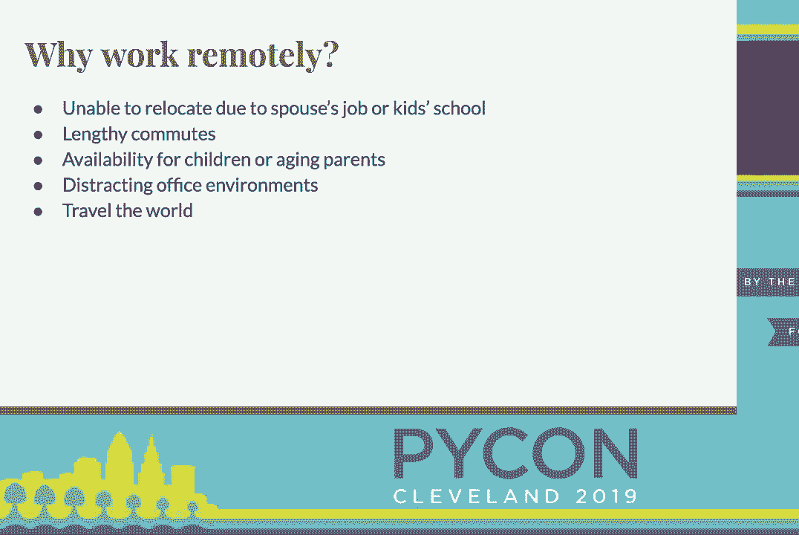

 But why would employers want to offer these options， right？

 It seems like it would be so much easier to manage employees if you can physically see them every day。

 I've got a few reasons I'll move through quickly here。

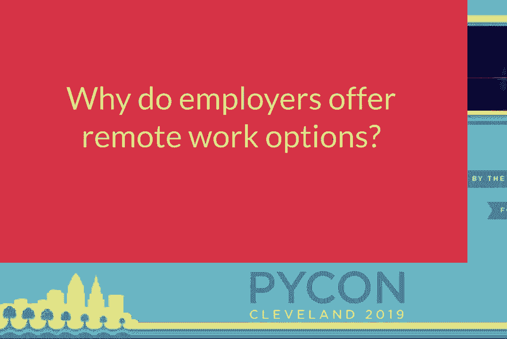

 So one of the biggest reasons is that you can attract and retain top talent from anywhere in the world。

 If you're trying to get people to come to your office in one spot or a few spots around the world。

 you've got a limited talent pool， right？ You've got to find people who already live there or who are willing to live there。

 But when you open up to a global talent pool， you've got so many more options。 Also。

 you can increase employee morale。 Employees like to have the option of where they want to work。

 You can save money， right？ Employers love to save money。 So you can have smaller or no office space。

 You don't have to pay to relocate employees。 And finally， you can increase employee productivity。

 And this might seem a little counterintuitive of you。 We'll get into the research in a few minutes。

 But here's a couple reasons why。 One， you've got fewer sick days。 If you're not feeling good。

 it's a lot easier to waddle down to your home office than it is to get yourself pretty and get to the office。

 Confession I've had pink eye this year， not once， not twice， but three times。

 And I didn't have to miss any days of work to do that because I didn't have to worry about infecting anybody else。

 Remote employees take shorter breaks。 We don't get distracted by those side-by-side line conversations。

 And there are just fewer distractions。

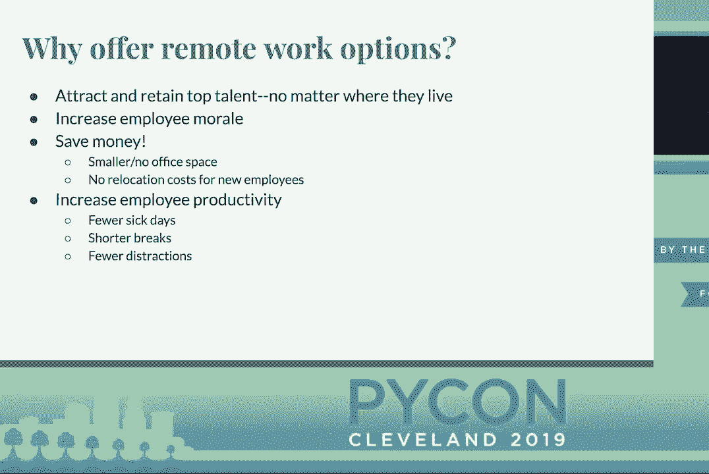

 Okay， so some of you are probably sitting here going， this sounds good。

 I know I'm sitting here talking to a bunch of engineers and you're like， okay。

 let's get to the data。 What does the research say？ I've got you。 Okay。

 so we're going to start out with the 2019 Stack Overflow Developer Survey。

 I'm guessing many of you filled it out。 But if you're not familiar with it。

 it's a survey put on by the people who run Stack Overflow。

 And they try to target a diverse set of developers from all over the world。

 And they ask a lot of questions like， what languages do you like？

 What database do you most want to use？ The answer is MongoDB。 Okay， I had to throw that in there。

 And they ask a lot of workplace options。 So let's highlight some of those workplace questions。

 So first they ask， where do developers want to work？ Well。

 about 60% of developers want to work in the office。

 But about 40% want to work from home or another place such as a co-working space or cafe。

 So it's a pretty big chunk of developers who want to have a remote work option。 Next。

 they ask developers， how often do you want to work remotely？ So up at the top。

 we see people who pretty much never get to work remotely。

 In the middle is sometimes down towards the bottom is full time remote。

 So you can see up at the top， we've got 43% of developers never get to work remotely。

 And down towards the bottom， we've got 12% who get to work remotely full time。

 One interesting stat that they pulled out of this is they found that developers who work remotely full time。

 have on average about 60% more years of professional coding experience than those who never do。

 So we can kind of guess why that is， you know， if you've got more coding experience。

 you've got a little more leverage or maybe you've just built up more trust with your team。

 So for whatever the reason， the more experience you have。

 the more likely you are to be able to be working remotely。

 Last question I'm going to hit from this survey。 They asked developers to identify their top three greatest challenges to productivity。

 So everybody could pick three。 I'm going to highlight just two for you。 So up at the top。

 41% of developers， the number one greatest challenge of productivity is a distracting work environment。

 And I think you all have experienced it。 I know that you have。

 you plotted when we talked about open office spaces being the worst， right？ They're rough。

 And then down towards the bottom， we see time spent commuting。 And summer mode employees do commute。

 but that's something that can be completely eliminated through remote work。 All right。

 so let's dive into a research study。 So in 2014， a study was published in the quarterly journal of economics。

 So this is a journal paper， which is generally higher than a conference paper。

 This is very well received， a peer reviewed study。 And the researchers worked with C-Trip。

 which is a Chinese travel agency with 16，000 employees。

 And they focused in on their call center employees。 And they said。

 "Who of you would like to work remotely？"， And of those who said yes， they split them in half。

 So they said half， you have to stay in the office， half of you can work from home。

 What's so great about this is this is an actual controlled study， right？

 Everybody had the same motivation， everyone who participated wanted to work remotely。 And then。

 so we're able to very clearly see the results that they found were attributed to workplace locations。

 So here's what they found。 They found a 13% performance increase in work from home employees。

 That's pretty good， right？ So why is that？ 9% of that was from working more minutes per shift。

 So if you're like me， you're thinking， "Okay， a shift is a given amount of time。

 How can you work more minutes per shift？"， Well， they said that remote employees took fewer breaks and fewer sick days。

 So we talked about that a little bit， right？ So they're actually sitting。

 they're getting more butt in seat time because they're a remote employee。

 The other 4% of that 13% was from taking more calls per minute。 So these are call center employees。

 It's very important that they can hear the person they're talking to and the person on the other line can hear them。

 So they had a quieter work environment that was more conducive to getting their work done。

 and they found a significant increase from that。 They also found a statistically significant。

 higher work satisfaction in work from home employees。 This is great， right？ Happy employees。

 happy life。 Related to that， they found a 50% reduction in attrition rate in work from home employees。

 This is huge， right？ Attrition is a major problem。 When people leave。

 they take their tribal knowledge with them。 It costs money to recruit and hire new employees。

 So if you can reduce your attrition rate by 50%， that is a major cost savings。

 One downside that they found is they found a 50% reduction in promotion rate conditional on performance for work from home employees。

 So work from home employees were not being promoted as quickly。 Why is that？

 They had three major reasons they suggested。 First， the age-old， out of sight， out of mind。

 you're not being thought about for promotion。 Secondly， so a lot of times in the engineering world。

 we've got like individual contributor one， individual contributor two。

 and you kind of move up the ladder that way。 This was not the case here。

 If you were a call center employee and you wanted to be promoted。

 you were even promoted to a team lead or a management position。

 So they said that the work from home employees lacked opportunities to develop their interpersonal skills。

 which was a crucial part of being promoted。 And they also found that promotion。

 since it required a return to the office， many of the work from home employees。

 may not have even been interested in the promotion。

 so they may not have been putting themselves up for it。 All right， so last stat from this。

 This is a really cool one。 So I mentioned that at the beginning they had a 13% performance increase。

 So after nine months， they said， "Yes， this is working。

 We're going to let people work wherever they want。"。

 So some of the work from home employees went back into the office。

 Some of the office employees decided to work from home。

 And they measured their productivity again three months later。

 They found a 22% performance increase after allowing employees to choose where they work。 22%。

 That's the equivalent of an extra work day just by giving people the choice of where they want to work。

 That's amazing。 All right， I've got a couple more studies I'm going to move through a lot quicker。

 So in 2009， Cisco had a teleworker survey， so they let their employees work from home for a year。

 This is what they found。 They found a significant increase in productivity， work-life flexibility。

 and job satisfaction。 This is fantastic for employees。

 They found a $277 million savings in productivity。 It's fantastic for the company。

 And they found $47，320 metric tons of greenhouse gas emissions were not released in one year due to teleworking。

 That's fantastic for the environment。 If you're not commuting every day。

 you're drastically reducing your carbon footprint。 All right。

 so one more study about advocating for remote work。

 So some researchers got together and they did a literature review。 And they said。

 "Let's take a look at all of the remote work studies and let's see what we find。"。

 So they looked at 46 studies spanning 20 years。

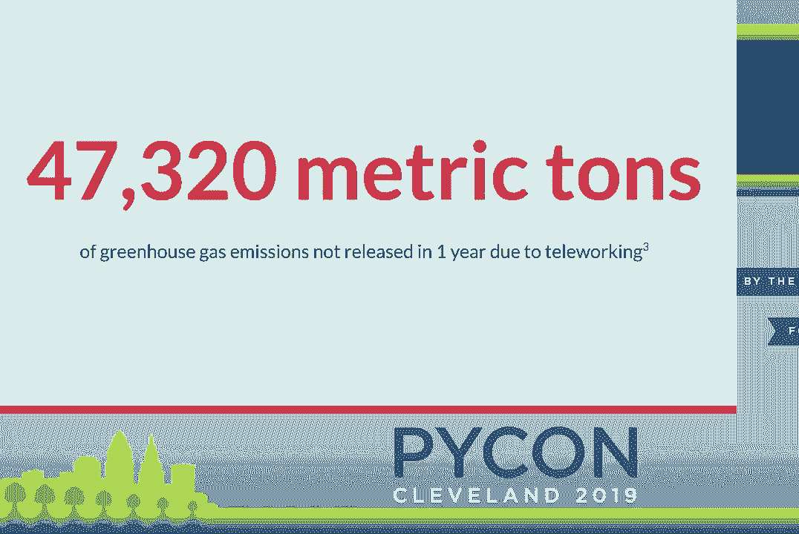

 And I know you're not supposed to read the slides。

 but I'm going to because I love what they wrote in their paper。 So here we go。

 Telecommuting has a clear upside。 Small but favorable effects on perceived autonomy。

 work-family conflict， job satisfaction， performance， turnover intent。

 That's the attrition rate we've been talking about and stress。

 Contrary to expectations in both academic and practitioner literatures。

 telecommuting also has no straightforward damaging effects。

 on the quality of workplace relationships or perceived career prospects。 So this is amazing， right？

 This is what we've been talking about。 So they found that it's great for the employee， right？

 It's great for job satisfaction。 It's great for the company， right？

 You're not reducing turnover intent。 And then what I love at the end is they said， "You know what？

 Contrary to what we thought， we didn't actually find issues with career prospects。"。

 So we kind of saw that in that first call center study。

 but when they examined the research over 20 years， they didn't find that to be a problem。

 which is awesome。 Now some of you are probably thinking， "Okay， she advocates for remote work。

 She's only showing us the good stuff。

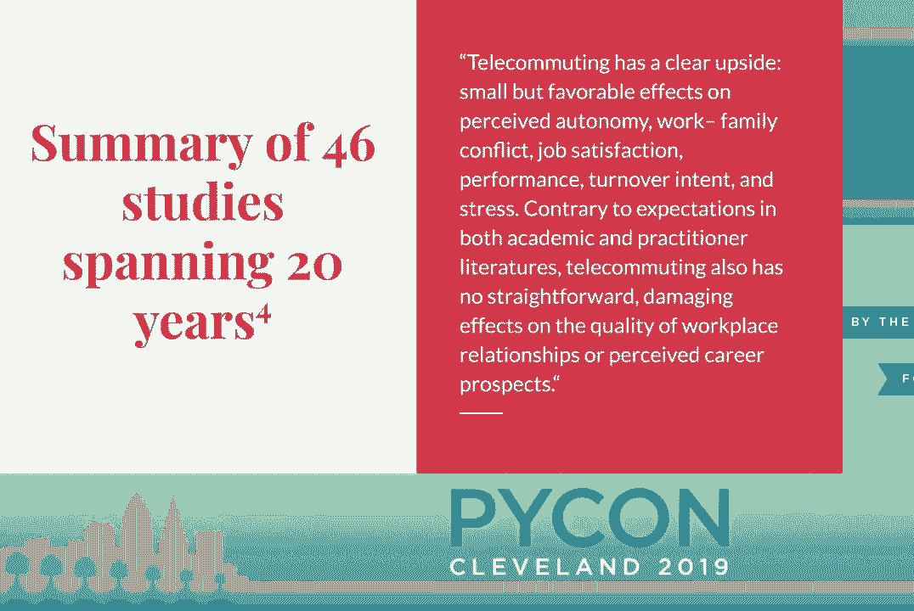

 Okay。 So I'm going to show you some of the downsides to working remotely according to the research。

 So the first one， professional isolation negatively impacts job performance。 Yeah， that's true。

 right？ But that's the case whether you're remote or in the office。

 You need to make sure that you're not professionally isolated。

 You've got to very proactively communicate with your peers。

 communicate with those who are above and below you， so you can do your job well。 Another study said。

 "Maybe it doesn't matter where I work。 Maybe it matters where my manager works。"。

 And so they found that having a remote manager can actually negatively impact you。

 I think this is kind of related， right？ So if your manager is professionally isolated。

 it's going to impact you as well。 So you need to make sure that your manager is very tuned into what's going on and is going to advocate for you。

 All right， third one。 Remote employees， peer stalling careers， isolation， distractions。

 and blurred lines between work and home life。 That's true。 These are things that I used to fear。

 But my experience after eight years of being a remote employee， almost nine。

 is that you can actively work to combat these。 These are not things I still fear。

 These are things that I work on and my career has kept going。 And finally。

 this one is a little surprising to people。 Remote work encourages employees to overwork and to allow their work to infringe on their family role。

 So a lot of people think， "Okay， if you're working from home， you're slacking。"。

 And actually not the case。 Work from home employees are often very paranoid that that's going to be the impression。

 So we show up every time。 We've got our stuff together。 If we're at a scrum。

 we're talking about what we're doing， right？ We're making sure that we are getting our part done。

 It's also very easy to overwork， right？ Like if your day is wrapping up and you've got a bug。

 you're like， "Oh， I'll just sit here and figure this out。"， And three hours later。

 you're still working。 Or if your partner goes out for the night， you're like， "Well。

 I'm a little behind on work。"， And then you spend an extra five hours working， right？

 So remote employees have to really actively prevent burnout。

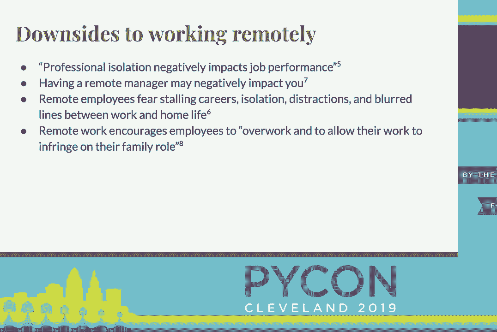

 All right， so where are we here？ We've been talking about the question。

 "Does remote work really work？"。

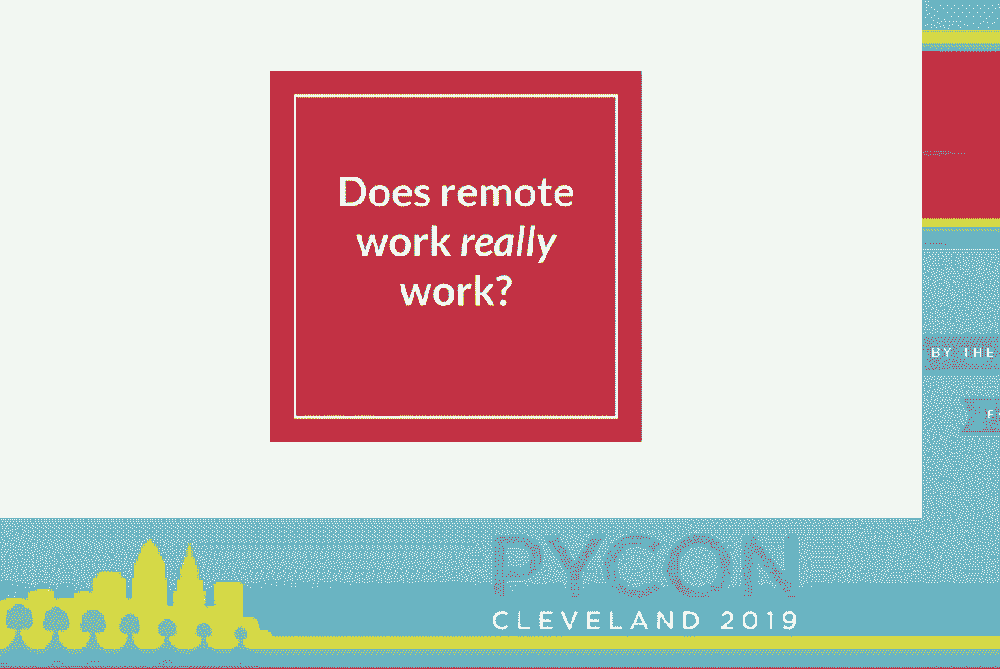

 Yes， right？ Our study's all showed。 Remote work works for the employee。 It's great for productivity。

 It's great for job satisfaction。 It works for the company， right？ Productivity leads to more profit。

 And it's great for the environment， right？ If you're not commuting every day。

 you are drastically reducing your carbon footprint。 Okay， so hopefully I've convinced you， right？

 I've convinced you that remote work is awesome。 And some of you are going， "Okay。

 but now I've got to convince my boss。 Okay， how are we going to do that？

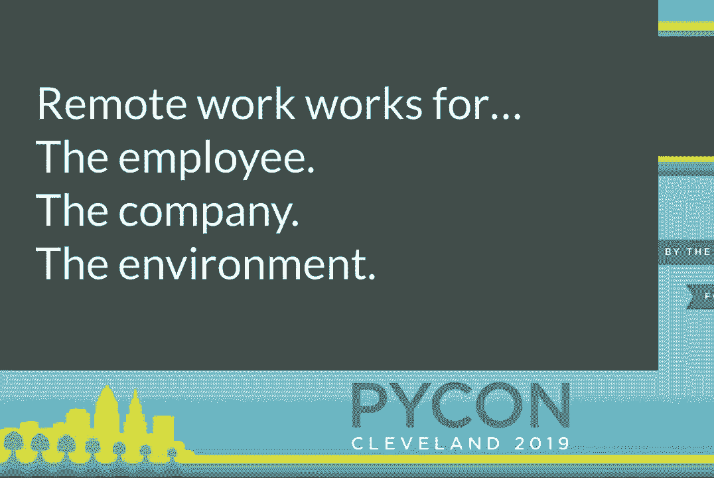

 How are we going to convince your boss to let you work remotely？"。

 So there's a great book called "Remote Office Not Required。"。

 And what they suggest is to propose an experiment。 Go to your boss。

 explain your reasons for why you want to work remotely。 Maybe it's something really serious。

 like your mother-in-law just moved in， and she's aging。

 and you need to be there to take care of her。 Or maybe it's something lighter， something fun。

 like you want to be able to travel the world。 Be honest， explain why you want to work remotely。

 and propose an experiment。 So maybe for the next three months。

 you're going to work from home full-time。 Or maybe you're going to work from home two days a week。

 or maybe you're going to work from home just in the afternoons。

 But talk about what you think the experiment should be。

 and then talk about how you're going to evaluate the results， right？ Because you need to know。

 definitively， yes or no， this experiment passed or failed。

 And then propose the experiment for all team members。 So you've got fairness going on， right？

 You want to be the kid who's working remotely when everybody else is stuck in the office。

 So some managers will be like， "Yeah， that's cool， no problem。 That's very reasonable。

 You're being very level-headed。 Got it。"， Okay， but some managers are going to be like。

 "What about collaboration？ What about water cooler conversations？

 How are you going to replicate that？"， Well， some people replicate it with tools like Slack。

 My company， we've got an actual water cooler channel in Slack。 And you'll see people。

 even if they're sitting right next to each other at their desk。

 will sit there and type in the water cooler channel， right？ So you can kind of recreate that online。

 But for many people， the idea that you can be as collaborative or as innovative remotely is a really hard sell。

 They don't care about the data。 They don't care about the productivity。

 It's this gut feeling they have that it's just not going to work。 So I love， again。

 I'm going to reference that same book， "Remote Office Not Required。"。

 And they ask you to stop and think， "How many wildly innovative ideas can your team process and implement at a time？

"， Like， really think about it。 How many things can you implement？ Maybe two。 Maybe three。

 So suggest that everyone gets together every few months， maybe once a quarter。 Be wildly innovative。

 Get everybody together。 Have those ideas。 And then disperse to your remote location so you can get stuff done。

 Right？ Because we saw you're going to get a productivity increase when you allow people to work remotely。

 When all else fails， talk about the bottom line。 Talk about how you can save the company money on office space。

 Talk about how the company will be able to hire top talent from anywhere in the world without paying relocation costs。

 Talk about how you can reduce attrition rates。 But like， don't do it in a threatening way。 Like。

 you're going to quit your job because nobody likes that。 But talk about the reduced attrition rates。

 And then finally， talk about the productivity increases。 Right？ That's going to lead to more profit。

 All right。 So I've convinced you。 You've convinced your boss。 Now you need to be successful。

 How are you actually going to succeed at working remotely？ Right？

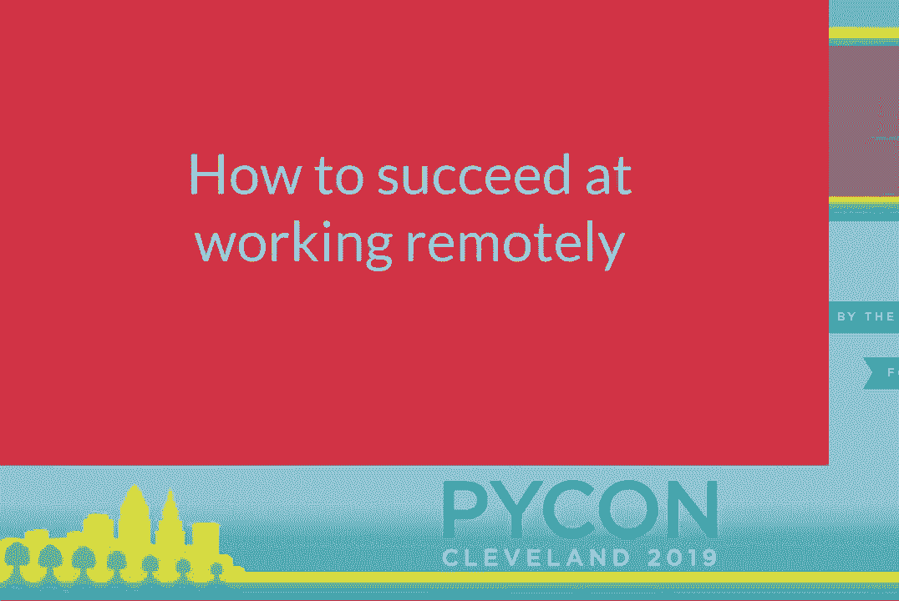

 Because you don't want to fail like this guy。 You don't want that to be you。

 You want to be the pop star of remote work， right？ Okay。 So I've got five tips for you。 Number five。

 Join the right team。 I highly recommend that you join a fully distributed team if possible。 Okay。

 Why？ All right。 So imagine the scenario。 So somebody gets stuck on a problem。

 They're sitting at their desk and they can't figure out why， what's going on。

 They're struggling to debug。 So they walk over to their teammate。

 And they're talking and they're having a conversation。 They say， "Oh， you know what？

 I think Sally just solved that problem last week。 Let's talk about it。

" So they get Sally together and then they go to a white board and they sketch it out。

 They solve the problem。 Everybody goes back to their desk and implements it。

 They might totally forget to tell you that that conversation happened。

 My experience has been that distributed teams are much more conscious of that happening。 First。

 they schedule times to meet and they'll bring everybody in。 And then if they forget。

 if it truly is a one-off conversation， they'll let the team know。 So distributed teams。

 fully distributed teams are so much easier to work with。 Also， consider the communication styles。

 A lot of teams now are using video chat， so it's a lot easier to see people's faces。

 But when you're a remote employee， you have to be very vocal。

 You have to be comfortable saying how you're feeling。 Saying when you're struggling。

 saying when you disagree， because people aren't going to be able to read it on your face。

 So consider the communication styles of the team and you feel comfortable working with those personalities。

 And finally， this can feel a little awkward， but when you find the right team。

 I highly recommend that you schedule one-on-ones with each team member。

 I had a mentor suggest this to me years ago， and it felt so awkward at first， but it totally works。

 Schedule 15-minute one-on-ones。 Get on the phone and say， "Hey， my name is Lauren。 This is my role。

 Here's why I'm excited to be on the team。 Here's a little bit of my work history。

" And then ask them to do the same。 Then share a picture of yourself， maybe with your family。

 maybe doing one of your hobbies， maybe on vacation。 And chances are， you don't have to ask。

 chances are， they'll send a picture back。 And in that moment， you've broken the barrier。

 Things are more personal。 It's so much easier to go ask them for help and for them to communicate with you。

 right？ Because you're becoming a real person。 Alright， so number five， join the right team。

 Make sure it's distributed。 Make sure you're comfortable talking with these people。 Number four。

 be productive。 Do your job。 Okay， that's obvious， right？ Okay， how are you going to do that？

 Every day， I highly recommend that you set daily goals。 You know。

 every day I will look at my to-do list， and I'll say。

 "What are the top two or three things that I need to get done today？"。

 I don't have anybody else holding me accountable。 I have to hold myself accountable。

 So this helps me stay on task， and make sure that I'm not putting off those hard or daunting tasks。

 but I really am focusing on what's most important。 Also， create a workspace you love。

 This is my office from a couple years ago。 It looks a little dark on the screen。

 but I love this office because it has lots of pink， it has lots of sunlight， I could play my music。

 and made me happy when I went in there。 So create a workspace that you're going to love working in。

 Don't work on your couch， right？ Be ergonomically correct。 You know， adjust your keyboard tray。

 that sort of thing。 But create a workspace that's going to allow you to be productive。 Number three。

 communicate with your team。 So first thing is you have to be present。

 Be present when you say you are。 Different teams communicate in different ways。

 so make sure that you're aware of what's important to your team。 Some teams are very slack-heavy。

 Sometimes they're very email-heavy。 Make sure that when people are communicating with you。

 you're responding back promptly to them in that same medium。 Get personal。 You know。

 we talked about having those one-on-ones。 Most of the time， talk to your coworkers about your job。

 right？ You want them to know you're on task。 But everyone， so while ask how they're doing。

 ask how their kids are， ask how their vacation was。

 make sure you're keeping things personal just like you would in an office。

 Last thing I'll say on this， I attended the Grace Hopper celebration of women in computing years ago。

 and Nora Denzel gave a fabulous keynote。 I've got a link in the back of my slides。

 And one of her points was to be a great PR agent for yourself。

 Be very careful of the words you use to describe yourself。 This is so important in the office。

 but I think it's even more important when you're a mode employee。

 Be very conscious of the words you're using。 If something is hard。

 tell people that it's hard and that you solved it， right？ Brag about your work。

 Talk about it in a very positive way。 Don't say， "Oh。

 I've been stuck on this problem for three days，" right？

 Be very conscious of how you are projecting yourself。 People only know about you what you tell them。

 so be a great PR agent for yourself。 Number two， travel。

 Most of you have done this to get here today， so you're already doing it。 Good job。 Right。

 so travel。 Get out of your home office。 I highly recommend if you get a chance to go meet a co-worker。

 do it。 Get that face time。 I worked at a company previously that it was very hard。

 You couldn't get travel approved to just go meet your teammates。

 Like I have managers that I've never met in person， which is crazy。

 So sometimes you have to hack the system。 So maybe you and your teammate arrange a client visit。

 Maybe you both submit a conference proposal so that you can go speak together。

 But whenever you get a chance， go meet your teammates in person。

 because once you've got that relationship， it's so much easier to talk online。 All right， last tip。

 My number one tip for remote employees to be successful。 Actively prevent burnout。

 So we talked about that's a big downside of remote work is you actually overwork。 Right？

 So how are you going to prevent burnout？ Because your company wants you to be successful。 Right？

 They've spent all this money training you， getting you up to the point of being productive。

 They don't want to lose you。 So there are a couple different ways。 First， take a lunch break。

 My husband's always like， "Why don't you just skip your lunch break and you could be done 30 minutes earlier？

"， And like the lunch break is huge。 It's so important。 You know。

 I like to go sit and watch TV and eat lunch， but some people like to go out for a walk or read a book。

 So do something away from your desk。 When you're in the office， you get natural breaks。

 People will come up and talk to you， but you have to take breaks intentionally when you're a remote employee。

 Stretch before meetings。 Okay， this one sounds a little crazy， but for some reason。

 office employees never show up to meetings on time。 So you get a chance。

 if you show up two minutes early， that you can go walk around your house or you can turn off your camera and stretch for a minute。

 but take a minute， clear your head。 Right？ As a remote employee， you don't have to do anything。

 You just log in。 You can keep sitting。 So take a break。 Before your meeting。

 make sure you're focused and you're ready。 Last thing on this。

 I'll say is turn off your computer after work。 So examine yourself and say。

 "What are my typical work hours？ What am I comfortable working on a regular day？

" And stick to that schedule。 Things come up and that's totally fine， right？ You can have exceptions。

 but for the most part， when your work day is done， turn off your computer。

 And that includes turning off your notifications on your phone for things like Slack and email or whatever tool your team uses。

 but you've got to take a step away because it's so easy to burn out。

 So seriously turn off your computer。 All right， so for those of you who like to take pictures of slides。

 I made this for you。 So let's recap。 The top five tips for making a remote work really work。

 Number five， select the right team， right？ Make sure it's distributed。

 Make sure you're comfortable raising issues with these people。 Number four， be productive。

 Do your job， but make sure you've got a workspace that you actually think you'll be productive in。

 Number three， communicate with your team。 Be present when you say you are。

 Get back to people quickly。 Number two， travel。 You're doing it。 And number one。

 actively prevent burnout。 Turn off your computer。

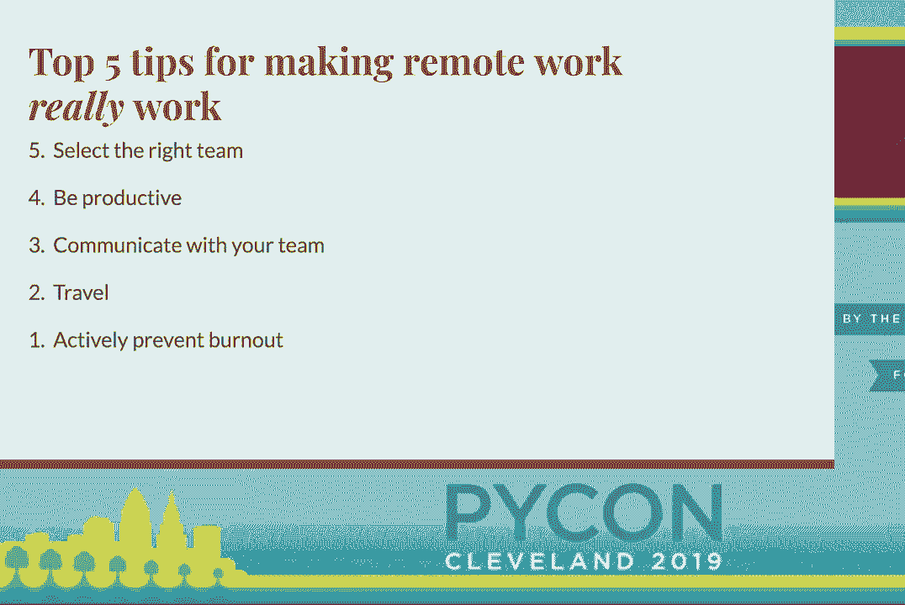

 All right， so let's wrap this up。 Today we've been asking the question。

 does remote work really work？ Working remotely can be the worst， right？

 You can fail so hard that people will animate your failure。

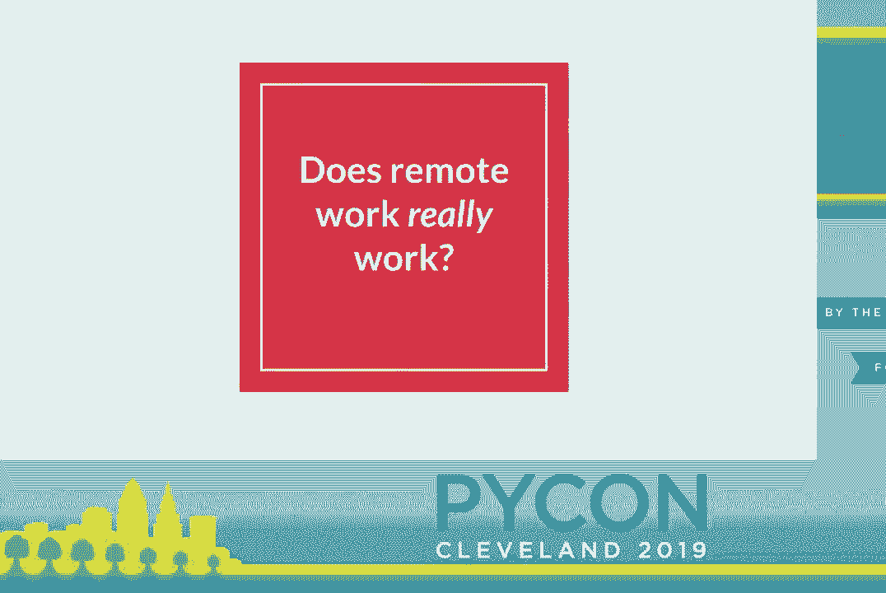

 But working remotely can be the best。 You can be the pop star of remote work。

 So yes， the studies， surveys and anecdotal evidence all show that remote work really works。

 I'm not saying that remote work is for everyone。 It's not。 But it is a fantastic option for some。

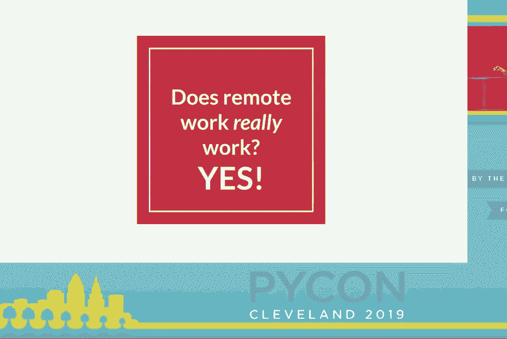

 Remote work works for the employee。 It works for the company and it works for the environment。

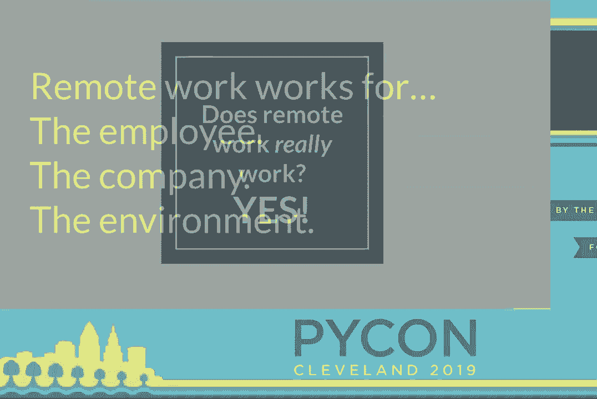

 I want to leave you with one final quote。 At the Grace Hopper celebration of women in computing。

 telewittany was asked during a keynote panel what she would change if she could change one thing。

 Her response was simple。 If I could change anything。

 it would be that each and every one of you would ask for what she wants。

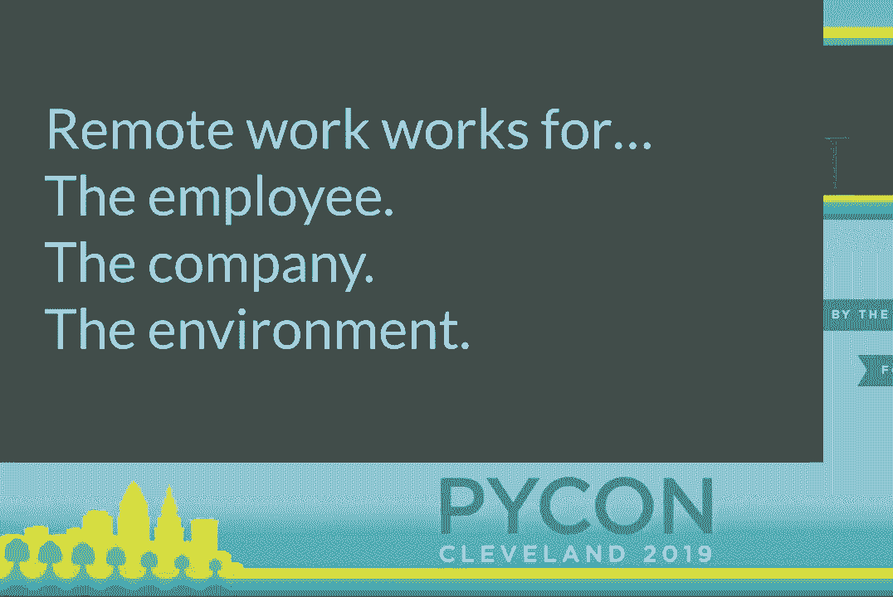

 And that's my wish for you today。 Whether what you want is to work a more flexible schedule to change your role。

 to take on more responsibility or to work remotely。

 I hope that each of you will ask for what you want。 So yes， remote work really works。

 So I encourage you， please advocate for the remote work option。

 Advocate for yourself and advocate for others who want to advance their careers but are not able to physically be present in the office。

 Thank you。 So quick housekeeping thing。 I know I tricked my AVI guy。

 You can get the slides on my Twitter page。 They're currently pinned to the top of my page。

 I'm Lauren underscore Shafer。 At the end of the deck。

 you'll find an appendix with links to all of the studies I referenced today。

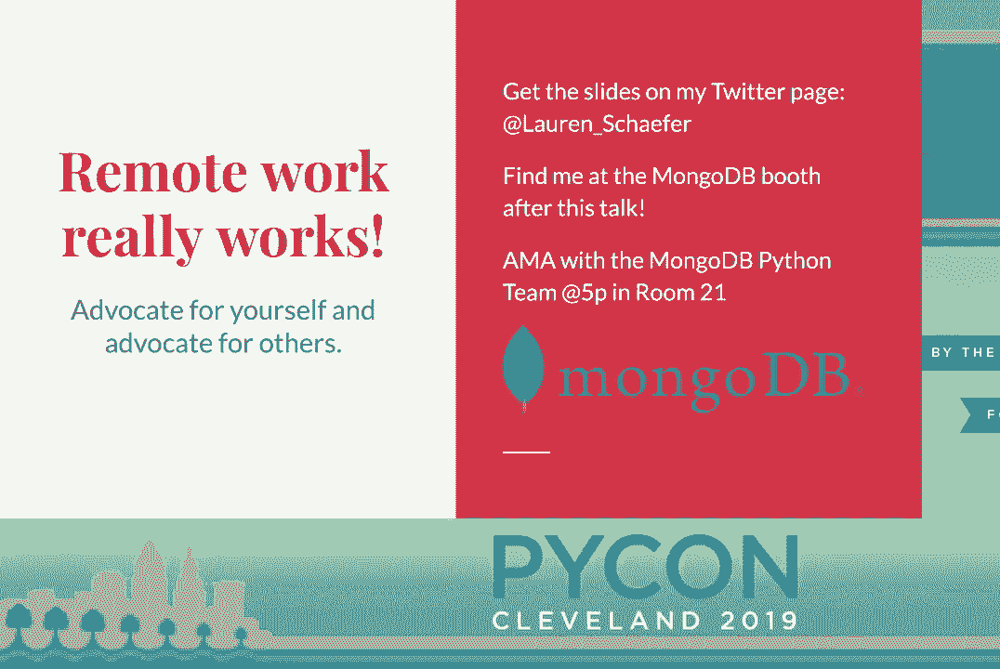

 As well as a bunch of other studies I didn't have time to get into。

 And then that Nora Denzel keynote speech that seriously you should watch。

 Also， I think I'm out of time for questions。 So I will be at the MongoDB booth immediately after this talk until the booth closes。

 which I think is at 5 p。m。 today。 So come， I'd love to talk to you about remote work。

 I'd love to talk to you about MongoDB。 So please come find me。 And finally。

 we've got an Ask Me Anything with the MongoDB Python team at 5 p。m。 in room 21。

 They would love to chat with you， answer your questions about MongoDB or Python or you can。

 I don't know， something on something else。 I don't know。 So that is all I have for you。

 Thank you so much。 Enjoy the rest of your Python。 [Applause]， (applause)。

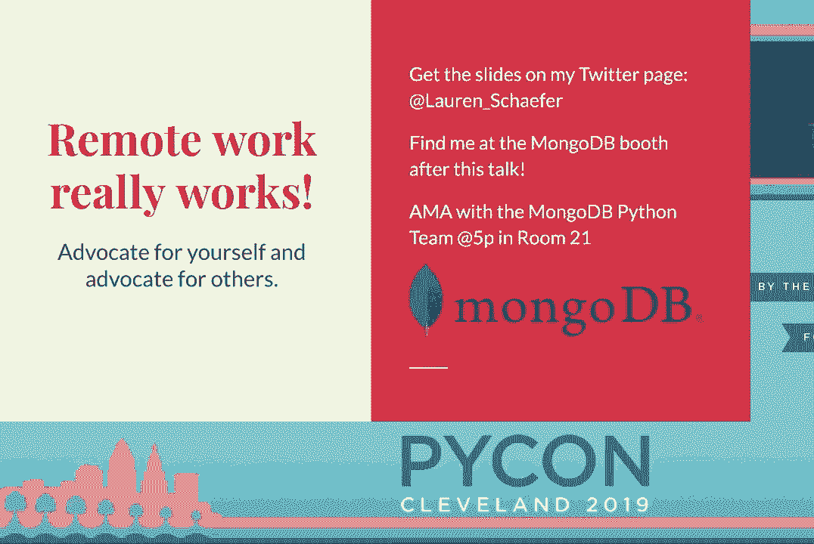