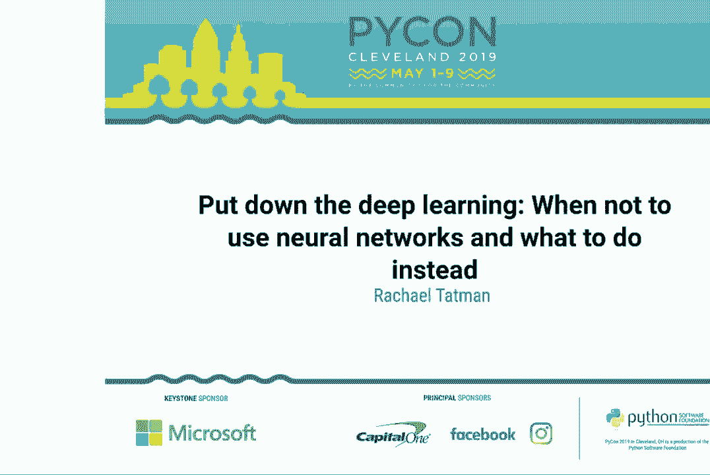
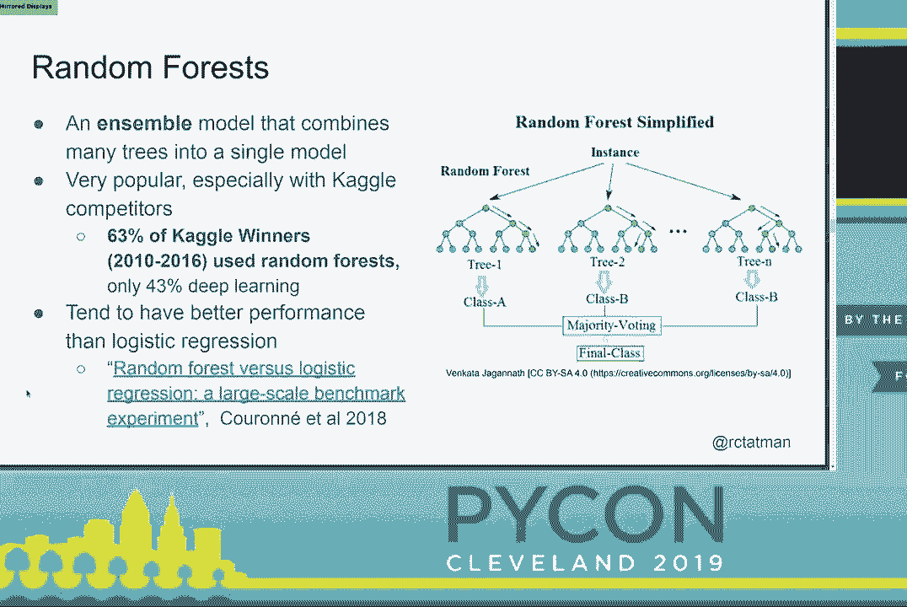
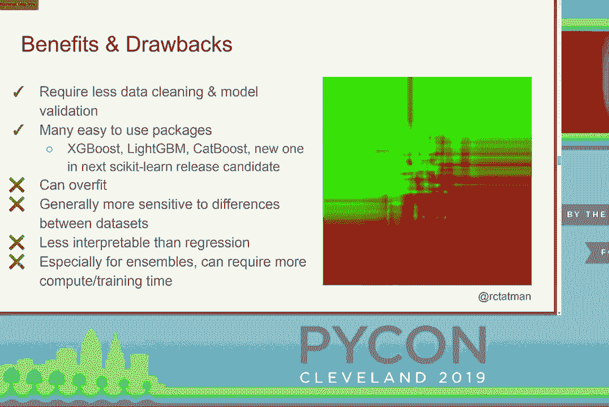
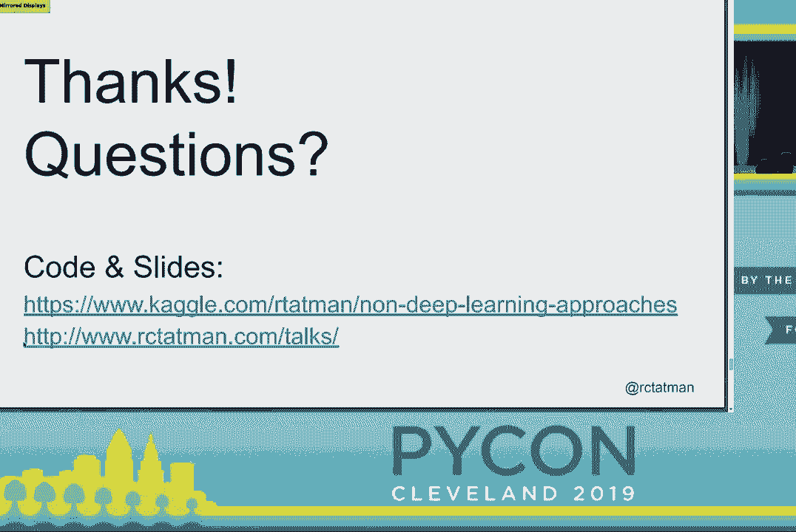

# P29：Rachael Tatman - Put down the deep learning - When not to use neural networks an - leosan - BV1qt411g7JH

 Welcome everyone。 Just as a reminder， please make sure to put all of your devices in silence。

 Otherwise you will have a glare from me。 We are welcoming Rachel Tappman。 She will be。

 presenting put down your deep learning when not to use neural networks and what to do， instead。

 [Applause]， Hello。 I just wanted to make sure my phones run silent essentially since they are right。

 next to that microphone。 Good afternoon everybody。 Thank you for coming。 I am Rachel Tappman。

 I am a data scientist， advocate。 I am trying to say that I have a job title that says what I do。

 I am trying， this one out。 Let me know if it is helpful for you guys at Kaggle。 I am very happy to。

 talk about Kaggle but that is not what I am here to talk about today。 Today I am here。

 to talk about deep learning and more importantly alternatives to deep learning。 Just to get。

 a sense of the room before I start out， who has heard of deep learning？ Yay。 Pretty much， everybody。

 Presumably that is why you are here。 Who has done some deep learning？ Anything。

 from tens or flow to poets to it is part of your job？ Okay。 I would say about half the， people。

 Some folks are like kinders。 I probably don't need to tell you guys this but I think。

 it is worth going over。 Deep learning is a fantastic set of technologies and we have。

 seen some amazing wins lately。 I have just picked a couple of examples of things that。

 I think are particularly impressive。 OpenAI 5 is the model that just beat， I say， Dota 2， mods。

 Professional video game players at the video game that they play professionally。 At。

 a live sporting event for the first time。 It is very exciting and that happened last week。

 Previously， AlphaGo Zero was a Google model that beat the best Go players。 It is a board。

 game in the world at the board game that they play professionally。 Another really exciting。

 instance of computers being better than humans at a very narrow task。 There is a robot that。

 came out relatively recently or the paper came out recently and it looks in a bin of。

 things and it picks out things and it tosses them into other bins。 It sorts by throwing。

 which seems really dumb and like a toddler could do it but it is actually very hard。

 computationally。 That is an impressive finding。 This particular newspaper is a little bit。

 hypey and the actual paper title is towards human parity and it has got juiced up in the。

 PR rounds but speech recognition has gotten much better。 It is not quite at the point where。

 we can replace human transcivers。 Thank you。 If you want high quality transcriptions。

 I probably would not use it for everything but we are getting to the point where it is。

 fairly usable for most things。 It seems like if you are outside the field and learning。

 about it through headlines， machine learning can do anything these days and especially。

 deep learning which means we can use deep learning to do everything。 Not so much。

 I think that being in the deep learning field right now is a little bit like being a paleontologist。

 You tell people you are a paleontologist， I am assuming， I am not a paleontologist。 People。

 are like， oh cool。 I think you have dinosaurs。 They are so powerful。 They are so big。 They。

 are so exciting。 Maybe small children are impressed。 Small children generally aren't impressed。

 when I tell them I do machine learning but maybe someday they will be。 You have the glamorous。

 experience of what people think deep learning is like and then you have the less glamorous， reality。

 Building deep learning model， even if you are not doing research， is slow。 It， is tedious。

 It is painstaking。 It takes a lot of time。 It is really expensive。 We will。

 talk about how expensive and a little bit。 It is frustrating because there is this sense。

 of uncertainty。 When you set out working on a project and you are building a specific， model。

 you do not know that it is going to work。 You do not know that the specific parameters。

 you are using and the specific hyper parameters you are using are going to work for your problem。

 You do not know what architecture is going to work best。 The state of the art right now。

 is guess and test。 I am in no way exaggerating。 There is a lot of deep learning models that。

 we do not have a deep theoretical understanding of。 We just have a lot of empirical results。

 that show that they are good for a certain set of problems。 Which is really frustrating。

 I have a really good example of this。 This is a passage from the BERT paper。 BERT is a large。

 neural network based language model。 That is what I am looking for。 It is unsupervised。

 It is basically trained on a bunch of text data。 It notices patterns more or less。 The。

 idea is that you have your big language model。 On top of it， you have a little bit of fine。

 tuning for your specific task where you do have labeled data。 It is a lot of unsupervised， learning。

 It seems to be pretty transferable between tasks。 That is exciting。 Unfortunately。

 this is a really good paper。 It just won best paper at NACL which is one of the premier。

 NLP natural language processing conferences。 This is state of the art research。 Something。

 in the paper that they said that really stuck with me is that as they were doing this fine。

 tuning building the layer on top， sometimes it just didn't work。 When that happened， they。

 just restarted it randomly。 Sometimes it did work。 You just have to run a bunch of models。

 and figure out which one works well and use that one。 That does not feel super satisfying。

 as a working methodology。 I like to know what works ahead of time。 I mentioned expense。

 I know these are hard to read。 I will give you a link to the slides at the end。 People don't。

 generally tell you how much it costs to train their model。 Folks are also willing to go on。

 Twitter and do back of the envelope math。 Here is one estimate for big GAN which is an。

 image generation model。 I think it came out in January。 You might have seen headlines like。

 this dog doesn't exist。 A computer imagined it。 The estimate for back of the envelope math。

 is around $60，000 just of compute。 That does not count what you might need to pay to license。

 the images to train it。 GPT2 is another big neural language model like BERT。 This one was。

 bigger and trained for longer。 Again， back of the envelope math， maybe around $43，000 worth。

 of compute。 These are by no means the biggest models。 I mentioned open AI5 which is the model。

 that won Dota 2。 That trained continuously for 10 months。 I cannot tell you how much it costs。

 I feel comfortable saying many millions of dollars。 I don't know about you guys in your。

 relationships with your managers but if I go to my manager and ask for $50，000 worth。

 of compute for something that might work， I would be encouraged to explore other approaches。

 to that problem。 So when would I actually use deep learning？ I'm going to keep this talk。

 very high level and talk about my experiences。 I'm not going to go into the math。 There are。

 many resources out there and feel free to hit me up afterwards if you want recommendations。

 I would use deep learning for a problem。 If one， a human can do it in less than a second。

 The longer it takes you to do something， especially something cognitive。

 the more complex it probably， is， the more data I'm going to need and the bigger the model I'm going to need to train。

 in order to approximate it。 So one second is just sort of my personal， litmus test right now。

 I have to have a high tolerance for weird errors。 Neural networks， have neural in the name。

 They are not cognitive models。 They are not telling you what a human， would do in this situation。

 So a really good example of this is humans use silhouettes， when identifying objects。

 That's just sort of a cognitive bias that we have。 Most computer。

 vision models do not use silhouettes。 They use collection of pixels。 So are they much。

 easier to fool with textures than they are with silhouettes？ So humans have a very gestalt。

 view if you have taken much psychology。 Neural networks don't。 I would also only use a neural。

 network if I didn't need to explain myself。 So if I were say working in finance and needed。

 to show with a certain degree of confidence that I did not use race or any correlative。

 race to decide whether or not to give you a mortgage， I can't do that with a neural network。

 And we've been doing as a field， not me personally。

 a lot of work on interpretability and explainability， and it is getting much better。

 but we're not to the same point that we are already with， regression models。

 I would also only use neural networks if I had a large quantity of labeled， data。 I say more than 5。

000 labeled items per class that is very much a low ball。 You。

 can get away with less if you already have a trained model and you can do transfer learning。

 But still， you need a lot of data and all of the research so far has shown the more data。

 the bigger the model， the more compute， the better the results。 And finally， I'd only。

 do it if I had a lot of time and money。 So training models takes time， especially if。

 I'm doing model comparison， I'm doing any sort of hyperparameter search that takes much。

 more time because I have to train multiple models and see which one is better。 And money。

 So for data annotation， if I need additional labeled data， if I need someone to go through。

 and maybe do some sort of human in the loop tuning， that costs money。 And compute， of， course。

 also costs money。 And we talked about the orders of magnitude that we're talking。

 about there for a really large model。 So deep learning。 You need a lot of time。 You。

 need a lot of money。 You need a lot of data。 Some of you may be in that position。 Fantastic。

 go forth and deep learn。 If you are not， you have lots of options。 I'm not going to cover。

 the entire fields of statistics and machine learning today， but I am going to talk about。

 three different types of models。 So in particular regression， tree-based models， tree-based models。

 didn't fit well in my matrix， and then distance-based models。 Let's start with regression。

 So if you， have done much machine learning， I'm hoping you are already familiar with regression。

 Quick， show of hands。 Who here has never learned about regression， either in a blog post？

 I'm really， really， really happy to hear that。 I talk to a lot of aspiring data scientists and people。

 who want to get into the field who started with deep learning and aren't familiar with。

 other methods like regression。 That's part of the reason I put this talk together。 I。

 love regression。 I'm a big regression fan girl。 In regression， you do need to do a little。

 bit of hands-on pointing of the model in the direction that you want it to go。 So you need。

 to pick the family of the function you'll use to model your data。 In this case， we have。

 the simplest case of linear regression where the thing on the x-axis， whatever it is， has。

 a linear relationship with the thing on the y-axis， whatever that is。 This is just a picture。

 of a regression that's in the public domain。 And there's really a lot of kinds of regression。

 models out there， and unlike with most types of neural networks， we have a really principled。

 understanding of what types of problems these are going to be good for。 So if you're using。

 regression， you can basically sit down and work through a flowchart to fit the specific。

 type of regression that's going to work best for your problem， which is really nice。

 Some really big advantages of regression， fast-to-fit， much faster-to-fit than neural， networks。

 especially if you're working with a well-optimized library。 The Python regression。

 libraries tend to vary wildly， so you might want to do a little bit of shopping around。

 It works well with small data。 I've done regression on 8，000 data points and learned something。

 useful and interesting。 And it's also really easy to interpret， and I'll walk through an。

 example of interpreting it a bit， but it looks like most of you are already familiar。

 with regression， so that might be a little bit redundant。 There are some downsides。 You。

 need to do a little bit more data preparation than for some other methods。 If there are two。

 variables that are strongly correlated， you might want to spend some time， either creating。

 a feature based on those models or correcting because you're going to have a standard error。

 a standard error， and a count of multi-colinearity， classic machine learning interview question。

 And they also require validation。 So regression models are based on strong assumptions about。

 the distribution of the data points or the distribution of the errors， and if you are。

 using a regression model， you need to check that those assumptions are true。 Otherwise。

 you'll get numbers out。 They just won't mean anything。

 My personal favorite type of regression model is mixed effects regression。 If I had to。

 take a single machine learning model to use for the rest of my life， honestly， it would。

 probably be mixed effects regression。 And this is a little example of Simpson's paradox。

 So who's familiar with Simpson's paradox？ Oh， not everybody。 Excellent。 So the idea with。

 Simpson's paradox is if you look at all the points together as a group， you see one trend。

 But if you divide the groups into subgroups that are meaningful for your specific problem。

 you see the opposite trend。 So here， for example， let's say that the x-axis is a amount of time。

 spent playing an educational video game， and the y-axis is test scores。 And we want to see。

 if playing this video game improves people's test scores。 If we look at all the students。

 so let's see each point as a student， we will see a negative trend。 So the more time you。

 spend playing the video game， the worse your test scores are。 I'm asking you to imagine。

 axes and axes labeled here。 But if we break things down by classroom where each of the， classes。

 each color of students is a different classroom， we see the opposite trend。 So it。

 might be that different classes patterned together differently for other reasons。 So。

 maybe some teachers were given an easier version of the test， or maybe the classes were。

 divided by ability in the particular subject area that we're looking at。 So when we model。

 each class individually， we see that spending more time playing the video game actually improves。

 our test scores。 And with mixed effects regression， we can really easily pull out these effects。

 And that would be the random effect here would be which group you are assigned to， or which。

 classroom you are in。 I'm not going to show you a whole bunch of code here。 The main thing。

 I want you to get from my code samples is that all of these models are very easy to， implement。

 They don't take a lot of code， even a very minimal TensorFlow or Keras deep。

 learning model is going to be more code than this。 So I'm using the stats model library， module。

 sorry。 And I've used the mix L M method。 And here I am modeling the chance of being。

 admitted to graduate school based on your GRE， which is a standardized test for people。

 who are interested in going to graduate school。 And TOEFL score， which is a test of English。

 is a foreign language。 And then I am grouping things， so I'm using as a random variable here。

 university rating。 So I think that maybe really prestigious universities are going to pattern。

 together and maybe like smaller regional universities are likely to pattern together。 And then I。

 fit my model。 And that's all there is to it。 I mentioned that regression models were particularly。

 easy to interpret。 And here is the model output that we can use to answer specific questions。

 So if a student came to me and was like， hey， I have a limited amount of time to study。

 should I focus on my GRE or should I focus on my TOEFL exam？ By looking at the coefficients， here。

 I can see that every one point increase in GRE score increases your chance to admit。

 to graduate school by half a percent。 And every one point increase in TOEFL score increases。

 your chances of admitted to graduate school by 7/10 of a percent。 So assuming that one。

 unit of studying is going to raise your score in either test by the same amount， I suggest。

 focusing on the TOEFL score。 So that's a clear actionable recommendation I can make based。

 on the model output that I have。 And if this was a business setting and people were like， hey。

 should we focus on， you know， I can't come up with a good example right now， I could。

 tell them based on the features that I had。 So regression modeling takes some time。 You。

 need to do a little bit more hands on stuff。 You need to do your validation。 You probably。

 need to do some additional data cleaning。 Does not take that much money， doesn't need。

 a lot of compute and can work with pretty small data sets。 Trees。 So hopefully everyone has。

 seen something like a decision tree at some point。 Does anyone not run across tree structures。

 at some point？ Okay， I see a simple hands。 So the idea with a tree structure and specifically。

 a decision tree is at each node you look at one feature for each of your items and depending。

 on the value of that feature you decide which path to go down。 And when you go down that。

 path the next node has another feature and you based on the value of that feature。 So basically。

 you are recursively cutting your decision region into smaller and smaller chunks。 Nobody。

 uses trees。 Everybody uses forests。 So random forests are ensemble models。 They can bind。

 a lot of different decision trees together into a single model。 They are extremely popular。

 on Kaggle。 If you're in the machine learning community you might associate random forests。

 with Kaggle。 And from 2010 to 2016 about two thirds of all Kaggle competition winners used。

 random forests less than half used some form of deep learning。 And random forests continue。

 to do very well today。 They also tend to have better performance than logistic regression。

 especially for classification。 There is a paper there you can read if you're interested。

 And they work really well。 Some benefits and drawbacks。 You don't need to do a lot of data。

 cleaning or model validation。 You can pretty much shove anything into a random forest。 You。

 don't need to convert your categorical variables。 It will consume them and give you a model。

 And there are a lot of really easy to use packages with a really fantastic developer。

 experience that are also very well optimized。 So XGBoost， which I like， light gbm， cat， boost。

 There is going to be a new one in the next scikit， release candidates。 You can。

 check that out if you're interested in yet another very good option。 I'm sure。 Some drawbacks。

 They are very easy to overfit。 You can imagine if you're building a tree， the natural end。

 case would be you had one data point per leaf and then you have perfectly described。

 the distribution of your training data， which is the definition of overfitting。 So to get。

 around that people will usually trim and remove the bottom couple layers from their tree。

 They're also really sensitive to differences between data sets。 And this is a little bit， blown out。

 But this is actually the decision region of a single decision tree。 And it sort。

 of looks like a plaid。 And you can imagine that if there's a point in one of those plaid stripes。

 of the opposite color， then a tree trained on that data set would actually have that。

 stripe be a different color， if that makes sense。 It's a little bit hard to see。 They're。

 also less interpretable than regression。 You can get information out。 You can get feature。

 importance out， ranked feature importance pretty easily。 But it's harder to say， hey。

 if I change this， what would change and tweak the knobs in quite the same way。 And they can。

 also require a lot more compute and training time。 So I mentioned a lot of well optimized， packages。

 But ensembles require building a lot of models。 And for every additional model。

 there's additional training time involved as a cost。 And again， a little code example。

 I happen to like XGBoost。 One thing that's really nice about XGBoost is that the default， parameter。

 hyperparameter settings are very reasonable for the vast majority of problems。

 So you can pretty much just use XGBoost out of the box and most of the time it will work。

 well enough。 If you're hoping to do any kind of competition， you are going to need to do。

 some tuning。 But it's a really good starting point。 So tree based methods take some time。

 especially if you have a big ensemble， a big data set， and you want to do maybe some cross。

 validation， some jack knifing， some bootstrapping to help avoid that overfitting to datasets。 Again。

 not a lot of money。 They don't take that much compute。 And they do need some data。

 and a little bit more than for regression。 Again， because you're going to want to do more。

 rigorous cross validation。 And finally， distance based methods。 So this is a very vague term。

 that I've used to group together a large class of methods where the general idea is。

 the closer some things are in a projection of feature space， whatever feature space you're， using。

 the more likely they are to be in the same group or to be related to each other。

 So I have a little example of K nearest neighbors up there。 You decide the value of a point based。

 on the whatever number nearest neighbors。 So majority vote。 Gaussian mixture models。

 which is more of a clustering thing， which suggests that any distribution of points。

 is going to be a mixture of different Gaussians。 And support vector machines， which I like。

 to think of as a cat that doesn't want to be petted。 So the line is trying to be as。

 far away from all the data points as possible。 Or support vector regression， which is sort。

 of the opposite where the cat wants to be as close to as many points as possible。 But。

 the points are hands， I guess， in this metaphor。 So benefits and drawbacks。 Support vector。

 machines in particular work very well with small data sets。 You need a minimum of four， points。

 They also tend to be very fast to train。 In my experience， at least in order。

 of magnitude faster than a regression model on the same data。 Overall accuracy， there。

 are other methods that tend to do better。 But for especially quick and dirty modeling， they're。

 perfectly fine。 They're good at classification if you want to do estimation specifically with。

 support vector machines。 It's a little bit slower。 So you might want to use regression， for that。

 Mostly these days people tend to use them on sombles。 But it's a nice fast。

 first pass for a program， for a problem。 If you're sitting in a meeting and someone's like， hey。

 is this predictable？ You can just， you know， open our pipe on or whatever you're， using quickly。

 Run a few lines of code and tell them very quickly。 And again， here is。

 just the code that you need to train this。 In the code sample I'll give you， I've done。

 all the pre-processing beforehand and the same pre-processing was done for all three models。

 And here I'm using support vector regression because I'm doing regression in all of my。

 examples just so they're parallel。 All right， so distance mace measures。 Very little time。

 Very little money。 Very little data。 They're extremely lightweight。 So what method should， you use？

 And for some reason my shruggy emoji isn't showing up even though other emojis， have mysterious。

 So it depends on what you have a lot of。 If you have a lot of time data， and money。

 go ahead and use deplaying。 If you don't have any of those things， maybe， distance space learning。

 But I have been a little bit disingenuous。 There is a hidden。

 fourth column that I haven't kind of been mentioning。 And that's performance。 So what。

 is sort of the ideal maximum？ How well can this model do in the best case？ And the fact。

 of the matter is based on empirical evidence right now it looks like deep learning will。

 perform the best on a given status at given sufficient time， money and compute。 Next。

 at least again empirically， trees and specifically random forests。 After that regression and then。

 finally distance base measures like SVM。 But again， there are things to consider other。

 than whether or not you're going to get state of the results， state of the art results。

 in NIRIPS unless you are like a Google research lab in which case you probably wouldn't be。

 here anyway。 And if I were going to give each of these model types a little high school。

 superlative， I would vote deep learning the most powerful， the most flexible。 Regression。

 the most interpretable。 If you need to know why， if you need to answer what if questions。

 I'd go with regression。 Trees， the user friendliest， especially if you're just sitting down to。

 do classification。 And then distance base measures the most light weight because they're fast。

 and you don't need a lot of data。 And just a final caveat， data science does not equal。

 deep learning。 I know that outside of the field that's what we've been communicating。

 out because it's the most exciting。 But you can do data science without deep learning。

 It's really okay guys。 It's extremely powerful and it's not for everything。 So I would like。

 to encourage you all in all aspects of your life to avoid being a person with a hammer。

 So there's a saying to a person with a hammer everything looks like a nail。 There are many。

 tools out there and they're going to be better for different jobs。 So explore your options。

 and don't be wedded to your specific favorite tool。 I'm also saying that to myself。 There's。

 places where you can't use mixed effects regression and it's fine。 And just a final note。

 data deep learning isn't a core skill in professional data science。

 And it's going to depend on your particular job that you're looking at。 But Dan Becker。

 who is in charge of learn at Kaggle posted the other day and I thought this was really， interesting。

 He was looking at I think it was the hacker rank who's hiring thread and he。

 set out a 400 job posts。 Only five of them called for PyTorch TensorFlow or Keras which。

 are all deep learning frameworks or deep learning。 So people aren't necessarily only looking。

 to hire deep learning people。 All right。 And I'm going to open it up for questions。 Thank， you。

 [ Applause ]， \>\> We have time for about five minutes of questions。

 So use the mics on both the sides。 \>\> I also post a link to my slides。 \>\> Hi。

 So I am a social scientist working in education。 And so I guess I'm going to go， opposite。

 Are there opportunities for deep learning in education？ I think we have a tendency。

 to want to understand why we're finding out why kids aren't being successful。 So just。

 being told at the end of like a deep learning model that doesn't help us as much。 Can you。

 think of some applications of deep learning within maybe the social science sphere？ \>\> Yeah。

 I can think of some bad ones。 So my big worry particularly in social science。

 and things with learning and things where you might like say be allocating education funding。

 is you're going to end up modeling a latent variable that you don't necessarily want。

 to model like how high property taxes are and how well that correlates with whether。

 kids get a good lunch and then how well they do in school for that。 Yeah。

 I think it's probably the most immediately useful applications of deep learning in social。

 sciences would be for things like annotating large image datasets。 So if you're looking。

 at what's written on the board in the classroom I guess and you want to get that information。

 into a way that's machine readable I think that could be a good application。 \>\> Okay。 Thank you。

 \>\> I think you could probably come out with better ones than I could。

 \>\> So given enough time and data are there any reasons why you wouldn't want to try all。

 of these for example or are there certain situations or context where you would really。

 say never do this as opposed to just doing a train test set and seeing what works best。

 There's no reason not to do all of them if you have the resources and in fact it's very。

 common to do all of them and then squish them into a single ensemble。 So yeah， no reason， not to。

 \>\> Great talk。 I really enjoyed it。 I guess one question that comes to mind is it seems。

 like there's a paradigm where there's those who have the resources and those who don't。

 So I guess could you comment on that and what should plebs like me do and I don't have the。

 resources。 \>\> Well I'm glad you asked that。 So there are a couple of places where you can get access。

 to say large public datasets and a compute environment that's GPU enabled and that's， good。

 And there are also other places as well so co-lab is a hosted notebook that offers， GPU access。

 Data， there are some areas where it's just going to be really hard to find。

 data without paying for it's particularly financial data or image datasets where the。

 images aren't all under a friendly copyright or friendly license。 Yeah， no， that is something。

 that I stay up at night worrying about as well。 I mean， I can't spend $45 million training。

 a game playing robot that's not on my capability list。 I have no good answers other than we're。

 trying to help。 \>\> Hi， Cass Stor， Simon and Schuster。 I'm curious。

 do you have any good resources on interpreting， and validating models。

 particularly regression models？ I think it's really important you。

 can easily run a regression model but you might be using the wrong model in that case， right？

 \>\> Yeah， absolutely。 I have actually written a series of notebooks that are hosted on Kaggle。

 that goes through it's in R。 If you're going to be doing a lot of regression， consider。

 maybe looking at R that goes through model validation and selection for regression in。

 particular that I am happy about。 So I'll tweet out a link to those and I am our seat。

 catman on Twitter。 \>\> That'd be great。 Thank you。 \>\> One problem where we use a deep neural net to solve this problem but it turned out。

 that actually all we really needed was regression。 And where would you start？ Should you start。

 with a regression or would you start with your list and start at the bottom and work， up？ \>\> Yeah。

 I generally only use distance-based methods if I'm in a real-time crunch。 My use。

 usual step through if I'm doing a regression problem would probably be regression， random， forests。

 deep learning if I have to。 If I was doing specifically classification and I wasn't。

 as concerned with interpretability， I might do random forests regression and then deep， learning。

 But every problem is different， right？ \>\> Sure， yeah。

 But it encouraged me in our problem we started in the wrong place。 \>\> Yeah。

 don't start with deep learning。 Also in your personal learning journey， please。

 put deep learning after regressive。 It will make me happy。 \>\> I got one question。

 One of the issues that I see a lot is the issue dealing with extrapolation。

 versus interpolation。 One of the issues with neural networks is that outside of the domain。

 you get completely undefined output。 Are there any models or any approaches that you would。

 suggest to take when you want at least you have a reasonable expectation of what the。

 value should be but not necessarily a data point there for the model to train on？ \>\> I mean。

 if you have strong， high priority reason to believe that given X you get Y， out。

 you can use simulation for data augmentation。 That is kind of a dangerous path。 If I were。

 doing that， I would want to have a really strong reason to believe that there is data that exists。

 here that I just don't have access to and I believe that these are its qualities。

 \>\> So we are going to have to wrap up questions here but I am sure you are willing to answer。

 some questions out in the hall if you have any other further questions。 Let's say thank。

 you again。 [APPLAUSE]。