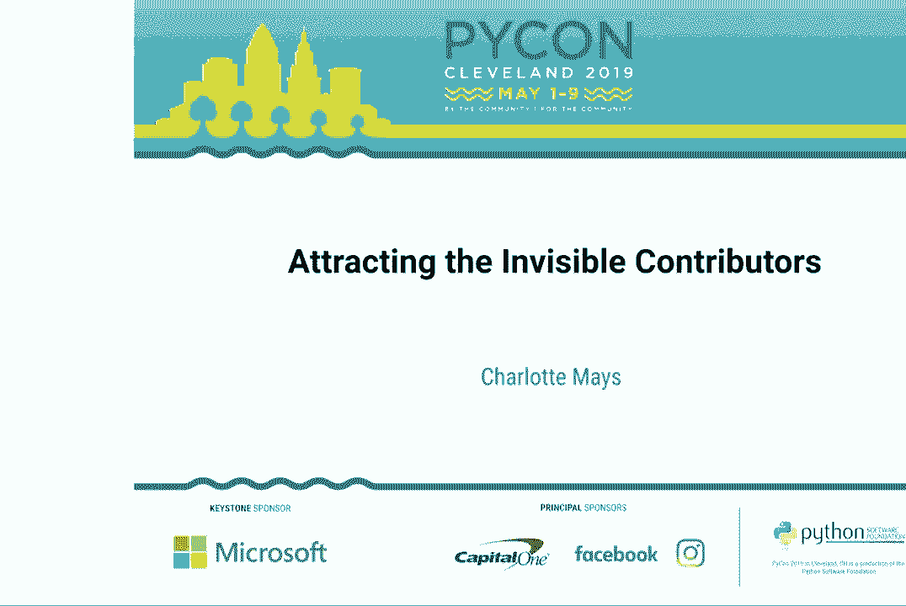
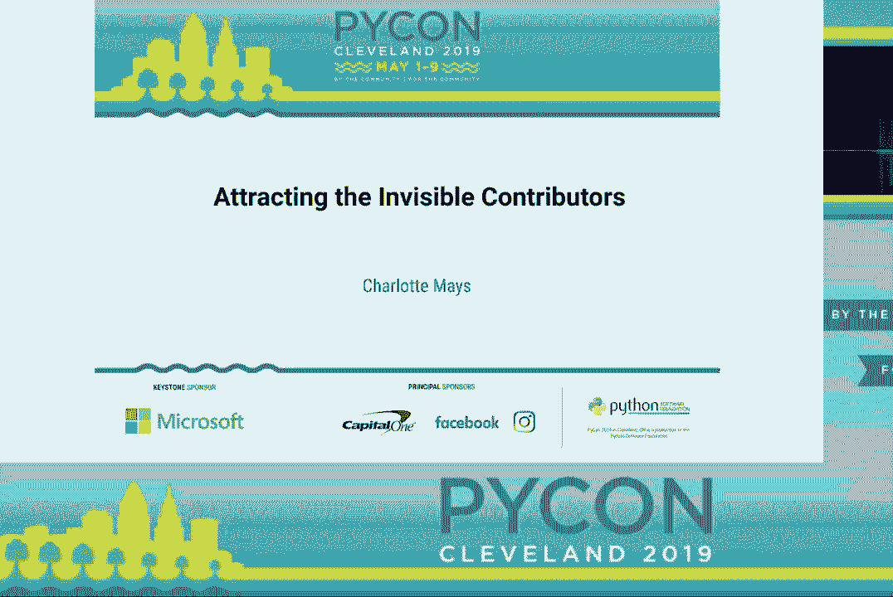
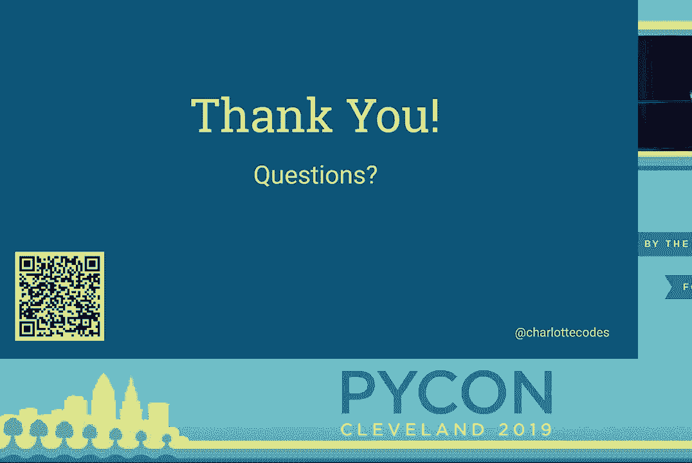

# P3：Charlotte Mays - Attracting the Invisible Contributors - PyCon 2019 - leosan - BV1qt411g7JH

 Okay， thank everybody for coming。

 Today we're going to be hearing about attracting the invisible contributors with Charlotte， Mays。 \>\> Thank you。 So before I start， I want to give a little bit of context to this talk。 I am one of the co-organizers of my local Pilates group and in that context I spend。 a lot of time talking to people who come to the group， asking them what they want out。

 of the community and not just the Pilates group but the community general， what their goals， are。 that sort of thing。 I hear a lot of people saying that， well。 I want some sort of place where I can come， and actually get into some coding。 And so of course there are a few things that already exist that I'll often point them to。

 existing groups that do supportive coding including our local Python group that isn't。 the Pilates group and that sort of thing。 And I get a lot of people talking。 particularly when the subject of open source comes up about， well， I tried。 I went to this project and I hit X-Road block。 So I had a lot of that and then from there I am also a core committer on a project and。

 have contributed to a bunch of projects and I work at Red Hat where project maintainers。 kind of grow in trees。 And so I'm in a situation where I see a lot of both sides of this and there's a lot of。 things that I think project maintainers and contributors don't necessarily think about。 that are actually chasing some people away。 So who are these invisible contributors that I'm talking about？

 A lot of times they're students， they may be current students in a traditional bachelor's。 program or they may be students at a boot camp。 They also can often be self-taught coders where they don't have much structure that。 they're coming from to know where they should be looking。 And then also sometimes they're just users who want to contribute， users of a project。

 who found a bug that they would like to help fix or have a feature that they would like。 to see exist and they feel like they maybe have enough knowledge of programming to be。 able to help out。 So these are often the people who they're not well versed in the open source community。 They don't know all of the default assumptions that most people in this room probably already， have。

 So these are what I call the invisible contributors。 They may come look at your project and go， "Oh。 this looks overwhelming。 I'm going to not。"， So how can you use the content that I'm about to give you？

 Because I'm going to warn you this is going to be a bit of a fire hose。 One thing is just simply for insight-centered-diverse viewpoints。 So a lot of this has been accumulated not just from people I've interacted with locally。 and directly， but I've actually reached out and kind of tried to go， "Okay， I know this。

 little piece of this。"， What other things are going on that are pushing people away and really tried to collect a bunch。 of this stuff together？ So this ought to give you some insights into the different people who may come to look at。 your project。 If you maintain or contribute to an open source project。 then you're obviously very much my， target audience。 Do not。

 when you get this fire hose of information， assume that it's a lost cause and just ignore， it。 Because there will be a lot of things that I'm going to tell you。 There's probably。 for the majority of projects， going to be a whole lot of things that you， look at and go， "Yeah。 we don't do that。"， Don't assume it's a lost cause and ignore it。 Instead。

 make small changes at an appropriate pace。 Pick up a couple of things。 These talks are all recorded。 You can go look at it later online and once you've made a couple of small changes， go back。 and make a couple more small changes。 As long as you're continuously improving。 you're going to continuously get closer to that goal。

 of being able to attract more and more contributors to your project。 Do not。 especially if you have a project that's going at a steady pace。 You've got contributors just sit there and declare unilaterally。 "Okay。 we're going to change a bunch of things。 We're going to do this， this， this。

 It's great if you want to make changes based on this， but you're going to get people pushing， back。"， When those people push back， do ask them for alternative suggestions because sometimes。 you'll have people who say， "Well， I like， for instance， the challenge。 I like that system that we use and you're telling me that we need to change it for X， Y。

 and Z reason。"， Ask them for alternative suggestions。 Say， "Okay， well。 here's the problem we're trying to solve。 All the suggestions I'm going to give you。 I'm going to tell you exactly what the problem， is that we're trying to solve。"， So。 present this and let it be a conversation within your project。

 If somebody objects to a specific change， ask them， "Okay， well， do you have another。 alternative to solve this problem？"， Do not completely disregard the opinions of your existing contributors。 They are still important， but do stand firm that existing contributors should also be welcoming。 to new people。 So， hopefully everybody is going to be on the same team in terms of。

 "We want to have， the most thriving open source project we can and have that be your approach that you take。 to all of this。"， And the last thing I want to mention about how you can use this content is as a framework。 to help a company be more attractive to a diversity of candidates。 It's not directly put together with companies in mind， but all of the same principles apply。

 So think of it， you know， when you are within a company situation trying to think about how。 to be more diverse and inclusive， these are also principles that you can think of and。 think how would that apply to those situations as well。 All right。 so I'm going to define a couple of terms that I'm going to use in this talk。

 I'm calling project sticky versus slippery。 And I'm not trying to define this as a binary。 this is a spectrum。 So projects can be anywhere from the sticky end of the spectrum to the slippery end of。 the spectrum。 A sticky project has multiple long-term contributors。 They see communication when people look it up， even if those people don't end up contributing。

 They at least say， "Hey， I'm interested。 What can you tell me about this？"。 A slippery project may only have a few long-term contributors， maybe just the maintainer and。 a couple of people who might drop in a PR blindly every now and then。 And it sees minimal or no communication from people who look it up。 Nobody comes and says， "Hey。

 I want to help with this。"， And so the goal of this project or the goal of this talk is to help your project go from。 the slippery end of the spectrum to the sticky end of the spectrum。 So what makes a project fall on one end or the other of the spectrum？

 There are five things I'm going to break this down into and I'm going to go into each of。 these in more detail。 But in brief， communication。 they need to be able to communicate with you documentation。 We all know the importance of documentation， but I'm going to go into some more detail about。

 how that relates to this kindness， basic human trait， very important in this context， terminology。 that's used in your project and the ever-popular code of conduct。 So when we're talking about communication， you want to make sure that you make it easy。 for people to communicate with your team。 I see a lot of projects that the only thing that they have for communication is maybe a。

 mailing list or an IRC channel。 These are not great for communication。 They're great to have。 They're better than nothing， especially the mailing list because that likely will have。 the archived interactions。 So people can go look back and see how the conversations went over time。 but it's not， good for real time。 IRC is good for real time but has no archive。

 Nobody can go and look and see anything that happened before they join that IRC channel。 And it can be really not accessible to new coders。 It's something that there's not a whole lot of information about how to set it up。 You have to kind of read through a bunch of different things， that sort of thing。

 So these are the kinds of things that you want to think about when you think about how。 are people going to communicate with my project。 And this should be on the front page of every place a person might land。 Your documentation， your GitHub repo， any place that you have a presence， how people。 can communicate with you should be front and center。 You want to make sure， like I said。

 that it's accessible to non-technical people， that there， are archived interactions。 Are archived interactions important because that way people can see how do people interact。 with other people？ Are they going to be nice to me when I come and ask my newbie question？

 Because that's the people we're talking about。 We're talking about people who they have no idea if their questions are intelligent or。 just incredibly naive。 They want to know how are you going to react？ Are you going to be dismissive。 et cetera？ And then we want minimal downloads or installation。 If you want to use something like Slack， most people probably already have that installed。

 or are used to using it just because of how prevalent it is。 But then something that has a web accessible version， which Slack also does， you can log。 into it just from a web browser， helps minimize that friction of people trying to communicate。 with your project for the first time。 All right， so documentation。

 We all hear all the time about how much you need documentation。 But I want to kind of pin down here a difference between user focused and developer focused。 documentation。 So usually when we're talking about documentation。 we're talking about user focused documentation。 How do you use this project？

 How do you use this library or app？ But what we're talking about here in terms of attracting the invisible contributors is。 we want to make sure you've got developer focused documentation。 Something that's going to。 for instance， tell people how to set up their dev environment。 Just having documentation of this is how you use it does not tell me how I need to set up。

 my virtual environment for development， for running your tests on your project， all of。 those components that may be part of the process of developing。 Especially if you're working with a library or something like that， it may not be something。 I can run directly。 I may need a sample project and that sort of thing。

 Any of those environment set up steps need to be spelled out。 You should spell those out for all the major operating systems because you never know what。 operating system your invisible contributors are using。 And if the setup doesn't work on their machine， guess what？ They're going to disappear on you。

 You also want to make sure your documentation includes the PR submission process。 And this doesn't have to mean here is how you do GitHub， although it's great if you want。 to include that。 But in particular， once you submit a PR。 how long should you expect to wait before somebody， responds to it？

 What kind of response should you expect？ What are the standards for PRs that people are going to look at？

 That sort of thing。 Anything that you feel like is an assumption。 If you have any question about whether it's an assumption or not， maybe you should link。 out to somebody who explains it。 I mean， there are already plenty of people who explain the basics of GitHub。 You may not want to reinvent that wheel and explain that in your documentation， but you。

 might want to link to it。 If you're new to GitHub， look at this。 Here's a guide。 That sort of thing。 But then， you know， this project specifically， when you submit a PR， this is the kind of person。 who's going to come look at it。 This is the kind of comments you're going to see。 Here's an example of a PR， that sort of thing。 And then expectations after submission。

 Are your tests going to automatically run？ Can they look and see what test results happened？

 Can they see if there were failures and go ahead and start fixing that without your project。 having to interface with them？ Those are all good things to have documented what people can look for。 So I want to take a minute to talk about kindness。 We all know what it is。 but how does it relate to your open source project？

 One thing that I want to really put in context here is to be kind to all questions or submissions。 You hear a lot， and I don't want to minimize， that project maintainers deal with a lot of， abuse。 There are a lot of people who just have high expectations。 They expect a maintainer to do everything for them。 All that sort of thing。 Yes。

 those people are going to come along。 And yes， it's easy to go。 Yeah， go away。 You are expecting way too much of me。 I am doing this on my own time。 But you want to be kind to them even as you tell them， "Hey， we're not going to do that。 We don't want to maintain that。"， The thing is， those invisible contributors are going to be coming along and reading what。

 you wrote to those people who are expecting too much of you。 And the invisible contributors。 since remember they're the people who are not familiar with， the open source process。 they don't know that maintainers deal with this kind of abuse all， the time。 So they don't。 if you have a snippy response to them or a dismissive response to them。

 to these people who are abusing the process， the newbies， the novices， they don't know。 why you're being snippy or dismissive。 They just know you're being snippy or dismissive to somebody and they're going to worry you're。 going to do that to them。 And remember that you can reject without being unkind。 If somebody offers a PR and it's for a feature that just doesn't work with your project。

 it's not going to integrate well， you can still say， "Hey， I appreciate that you did， this work。 We're not going to integrate it， but maybe you want to fork and maintain this yourself。"。 They're going to know what that means。 But those novice contributors are going to look at that and they're going to see you。 being polite。 And they're going to understand that you're going to be polite to submitters。

 You can also， you know， if somebody submits something that just isn't good code quality。 then you can do the same thing。 You can say， "Hey， this doesn't meet our standards。"， Preferably。 hopefully you've got that documentation of what your standards are。 And you can point them to that。 You can point them to your communication channels， wherever it is that your team communicates。

 And say， "Hey， maybe somebody over here can help you clean this up a little bit before。 we try to merge that in。"， So keep in mind ways that you can kind of be kind while you reject things that are maybe。 not appropriate。 Also， remember， again， with the whole burnout thing。 you don't have to respond immediately。 If you don't have it in you in this moment to be nice to that person。

 just don't say， anything at all。 Come back to it when you have a little bit more space。 Or ask somebody else， "Hey， can you go respond to this person？"。 I just can't deal with this right now。 So there are ways to handle this without getting that snippy and dismissive tone into the indelible。 stuff that's going to sit around in the closed PRs of your project and that sort of thing。

 So I want to talk about terminology a little bit。 First of all。 you want to make sure that you minimize your jargon。 I mean， of course。 there's going to be jargon that's used。 But make sure that you're not using jargon just for the sake of using it。 just for the， sake of hitting buzzwords on search engines and that sort of thing。

 Because the more jargon that's there， the more likely it is that this new person is going。 to come along and go， "I don't know what this is talking about。 This is clearly above my level and they're going to go somewhere else。"。 So use the jargon that you need to be clear。 And anything that isn't necessary。

 try to use plainer language。 You also want to make sure your terminology is non-offensive。 There's a bunch of stuff out there in terms of discussion around the terms master slave。 So I'm going to use that as an example because you can find a lot of discussion around that。 Master slave has been used to discuss servers and processes for a long time。

 It's been out there for ages。 It's ingrained in all kinds of things。 But it is not welcoming。 No。 not everybody is going to be offended by it。 No， not everybody in ex-demographic group is going to be offended by it。 But there are a good number of people who are offended by it who just don't feel comfortable。 in a context where that terminology is being thrown around。

 So there's a lot of discussion out there about what are appropriate replacement words that。 are maybe even more descriptive of the process that's actually being done。 Primary replica。 primary secondary， leader follower。 These sorts of things might explain what's actually happening。 And more than the terms master slave do。 So that's one of those things where because it's going to offend some people。

 you probably， want to kind of pull that out。 And you want to think of these things as being kind of technical debt。 Things that you can kind of chip away at as you have time and that sort of thing。 And I do want to mention that one has a lot of press。 But there's a lot of things in this category。 Think about so easy your mom could do it or so easy your girlfriend could do it。

 How are people going to think if they are a middle aged mother of four coming in and wanting。 to contribute to your project？ Or if they are a 22 year old girl just out of college and they see that language and。 they're like oh you think the women can't do this。 Okay。 You know。 And it's something where everybody knows what you mean but the tone is underneath that。

 Things that have to do with mental health。 Don't say our project is going to be very OCD about the syntax here。 OCD is a mental health disorder that people have。 And when you say that it trivializes what their experiences with their lived experiences。

 And that's just not necessary。 You can use different language that doesn't other them。 So think about these things。 If people tell you there's a problem pay attention。 Don't go ask five of your friends。 Hey do you think this is actually a problem？

 Because your friends are probably going to be the people who think similarly to you to。 the way you do。 Even if those friends are from the same demographic as the person who told you there's a problem。 That doesn't mean that every time somebody says hey I don't like this term you use。 That you have to immediately change it。 But take it seriously and you know give it consideration。

 So the last thing I want to spend time on and I'm going to spend a good chunk of time。 on this is code of conduct。 You hear a lot about this and it can be difficult to parse out what's important in this process。 The first thing I want to say about this is don't reinvent the wheel。 There are a ton of codes of conduct out there。 You can borrow one almost wholesale。

 You might need to make a couple of tweaks but not a lot。 So you know start with something that's already built for you。 That's already been vetted。 There's a lot of nuance in a code of conduct。 So don't try to build it from the ground up。 You're going to probably miss a lot of that nuance。

 The next thing is you hear a lot of people talking about code of conduct limits what， you can say。 You just can't say things that you would otherwise say。 That's not actually really true。 First of all a good code of conduct should not limit anything you can say about the actual。 project itself。 Because the project itself it's the code。 It's the technology。

 Most codes of conduct don't say anything about what you can say about the technology。 They talk about how you can say it。 So keep that in mind when you hear complaints and a lot of established contributors might。 complain about oh you know this is going to tell me that I can't say blah blah blah。 Well maybe you can't use those words but think about what you're trying to say and maybe。

 you can say it in a nicer way。 And concordant with this your project is not your living room。 So expect to behave professionally when you're working on your open source project。 When you're communicating in official project channels。 If you want to go and cut loose and just shoot the shit with your buddies that's great。

 Even if your buddies are also on that project that's fantastic。 Go do that。 Don't do it in your project's chat room。 That's not the place for it。 And then finally about codes of conduct is that enforcement is absolutely critical。 So many places adopt a code of conduct slap it on the website。

 You put links to it a few places and go okay done。 And step away。 The problem is if you don't enforce it then nobody is going to believe that it's going。 to do anything。 People are going to behave how they want to behave。 If there's no enforcement it means nothing。 It means somebody thought enough to say oh we should have this thing。

 And then nobody thought enough to say because people need to feel safe。 So all of the prior points。 Communication。 Documentation。 Kindness。 And terminology apply at least as much if not more when you're enforcing a code of conduct。 It's a tricky business。 The first time you have somebody who asserts that somebody violated the code of conduct。 It's a mess。 It's going to be something that you have to think hard about how to deal with。

 It's going to be a headache。 Absolutely。 Filling with it well is going to compound the rewards for your project。 Because once people know that you're going to deal with it well they will go tell people。 they know hey this is a project where you can count on being treated well。 So make sure to be kind and don't accept attacks from any source during resolution。

 And one of the things you'll see is somebody who has been hurt。 You know person A says person B said something that was really awful。 Person B might take that as an attack。 If person A is saying person B is always rude to me okay that's an attack。 But if person A says person B said X， Y and Z that made me uncomfortable that's not an， attack。

 That's an accusation it's a legitimate accusation it's something that should be addressed。 If person B comes back and says they're making stuff up they lie all the time。 That's an attack。 If person B says I didn't say X， Y， Z that's not an attack that's an accusation deal with。 that appropriately。 But make sure that you don't ever tolerate anybody just casting aspersions and trying。

 to broadly categorize what's going on。 Keep things focused on individual incidents。 Be prepared to remove or ban people from your project if necessary。 I know this is a painful thing to think about。 And especially if you're dealing with somebody who maybe has done a lot of code contributions。 maybe even as a really good coder。 It can be really painful to think about maybe having to ban them from your project。

 But keep in mind there's grades of this。 You can ban someone from the communication channels on your project without banning them。 from being able to contribute code。 They're not going to like it。 But if there are continuous problems in terms of making other people unwelcome then maybe。 that's what needs to happen。 And if they decide they're not going to contribute anymore that stinks。

 But what's going to happen is that having removed a harasser you might get six， seven。 eight new people coming along who wouldn't have made contributions otherwise。 So keep in mind that yes reject ban these are final solutions but don't consider them off。 the table。 Remember that that is something that needs to be considered。

 So that's all the content that I have。 I do have a QR code up here that links to a copy of my slides that has a bunch of examples。 in it。 So examples of how to look at the pros and cons of communication tools， how to look at。 the pros and cons of different documentation terminology， links to example codes of conduct。 all that kind of stuff。 So if you want to go and look and have all that extra material that's all in there。

 It's just these slides plus some extra example material。 And I will be happy to take questions out in the hallway。 I will be around the conference Saturday and Sunday as well。 If you see me feel free to come up and say hi。 That's what I got。

 [APPLAUSE]。