# P30：Russell Keith-Magee - Keynote - PyCon 2019 - leosan - BV1qt411g7JH

 。 。 。 。 。 。 。 。 。 。 。 。 。 。 。 [ Pause ]。

 Good morning！ [ Applause ]， I couldn't be more excited to welcome you to the 2019th Picon。 [ Applause ]， Picon 2019 here in Cleveland， Ohio。 On behalf of the Picon 2019 staff。 I want to start by saying thank you。 Thank you to all the volunteers that make this conference possible。 to the Picon Software Foundation for taking on the fiscal responsibility of this conference。

 We would not be here without the board and staff of the PSF。 I want to thank all of the presenters who came to share their work。 And I want to thank the sponsors who support this conference as well。 And of course this conference would have no purpose without you。

 So I want to thank you and we're just going to give all those people a round of applause。 [ Applause ]， The very first thing I want to talk about is that Picon is committed to providing a safe environment。 and a positive experience for everyone。 [ Applause ]。 And that's regardless of any difference that we may have。 In order to ensure this， all staff。

 attendees， speakers， sponsors， and volunteers at any Picon event are required to adhere to our Code of Conduct。 Please be familiar with that。 Familiarize yourself with the Code of Conduct at that URL。 as well as the procedures for handling incidents that are linked therein。 You can find these documents there or by going to us。picon。org under About Code of Conduct。

 If at any point during the conference， you're concerned that someone may have violated the Picon Code of Conduct。 You're encouraged to report it。 If you're unsure whether the incident is a violation or whether the space where it happened is covered by this Code of Conduct。

 we encourage you to still report it。 The organizers are okay with receiving reports where no action is taken for the sake of creating a safer space。 At any point you can make a report by email to piconusreport@picon。org by SMS or telephone to 12018628572。
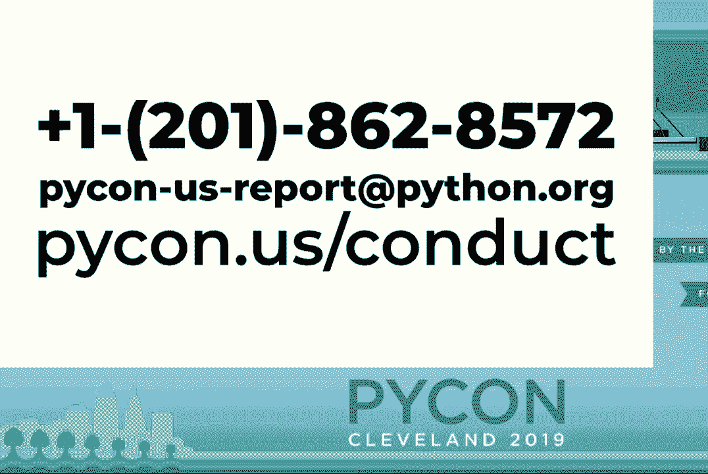

 Or during the conference you can find incident responder who will be wearing a brightly colored t-shirt like this。
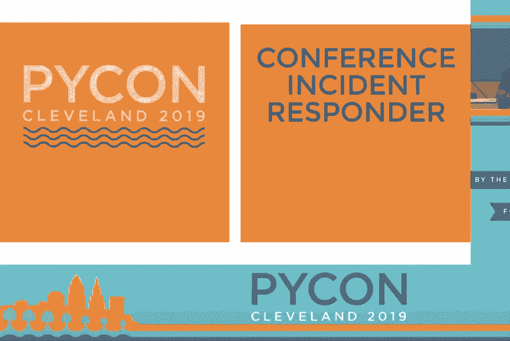

 Once again， this is the contact information on screen。 I'd encourage you to take a photograph or write it down or save it in your mobile phone in some manner。 Got it？ Cool。 Quick orientation。 If this is your very first picon I want to apologize。 As picon has grown， trying to detail each and every part of the conference that makes these --。

 who's calling me -- and trying to detail each and every part of the conference has become pretty much untenable。 However， if this is your very first picon， I hope you heard about or attended our newcomer orientation yesterday at 4。45。 If you didn't make it， that's okay。 At this URL at some point today。 the video from that orientation is going to go up and you can go and watch Adrian share each and every detail of the conference。

 including things that have already passed。
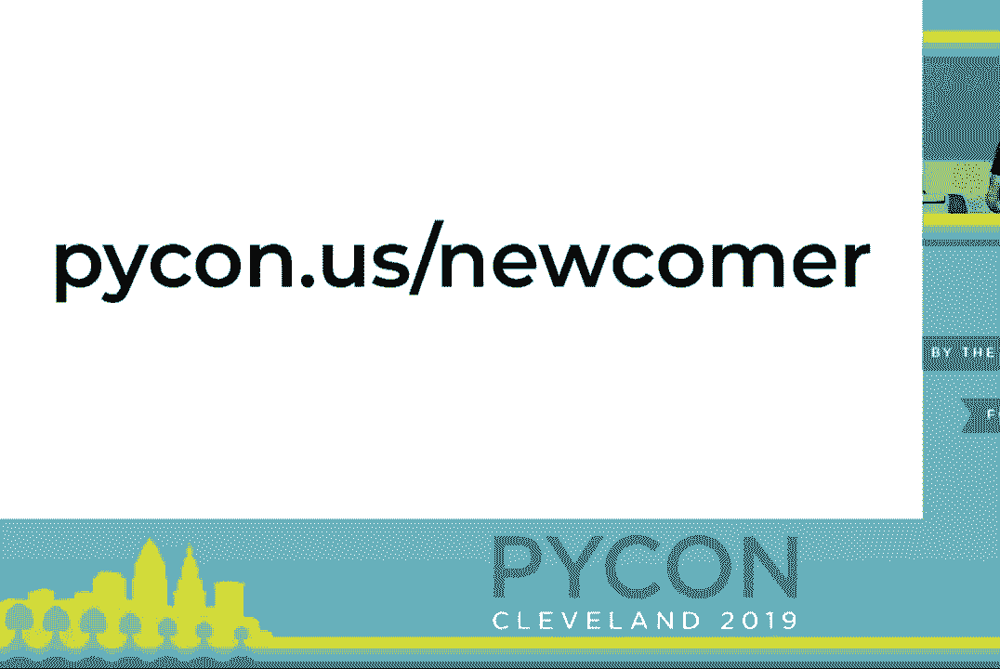

 Now more generally， you are in this conference center。 It's fairly large and so we're just going to walk through it piece by piece。
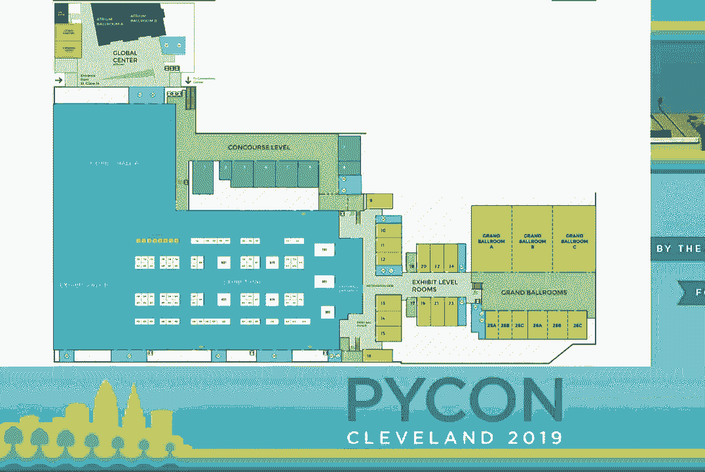

 First， I want to talk about some accessibility things that we've got going on。 We will be providing live captioning for all talks this year。 similar to what you see to my left and to my right。 Additionally， additionally。 spaces even reserved in the center of each speaking room for wheelchair access。

 The conference is ADA compliant。 However， if you have any concerns or need additional accommodation。 just please let a staff member know。 We will do everything we can to support you。 You are here。 This is exhibit hall A， which will host our plenary sessions over the next three days。 During those plenary sessions， we'll have some keynotes soon。 Russell Keith McGee。 We have Shaw。

 Jessica。 And then on Sunday， we have the Python Steering Council panel and Nina。 Additionally。 in this very room in these seats， you will find the lightning talks to date 540， Saturday morning。 Sunday morning， and also Saturday tomorrow at the end of the day。 Consider making some time to attend lightning talks。 You sort of never know what you will see。

 And if you're interested in giving a lightning talk， which is a very short five minute talk。 you can find the sign-ups near registration。 To your left is the Expo Hall。 This is located in exhibit halls B and C。 So you probably already found it because that's where we're providing meals this year。 All meals through Sunday will be in the Expo Hall。

 And you can find the menus and ingredients for these meals at the URL on screen。 If you've indicated that you require kosher consideration or allergies， when you're registered。 please look for the signs in the hall to locate your meals。 The Expo Hall is also the place where all of the sponsor booths are。

 I encourage you to stop by our sponsor booths and find out more about what they're using Python for。 why they've decided to support Python and the Python community by being here。 Our sponsors make Python possible， and we depend on them to keep Python's registration costs under control。 Their presence here represents an incredible investment in our community and this conference and also make the operations with the Python software foundation possible。

 They're here to meet with you， encourage you to check out their projects and products。 and possibly even hire you。 A reminder that the sponsor booths will only be out there today and tomorrow。 On Sunday， that entire space will be reconfigured。 In addition to sponsors。 I want to take a moment to very poorly show all the names of the corporate companies who sent people to Python on a corporate registration。

 These registrations help offset the cost of individual and hobbyist registrations， I'm sorry。 student and hobbyist registrations， and go to support the Python software foundation work as well。 In the Expo Hall still， that's a big room， we do a lot with it， is Startup Row。 There are some tables and today and tomorrow there will be people who competed and won a spot on Startup Row。

 These are new companies who are doing something with Python that might be new and interesting。 Check those out， note that these change， so the people that are there today will not be there tomorrow and people。 and they'll be replaced with other companies。 You want to stop by Startup Row twice if you get a chance。 On Sunday， that entire room gets reconfigured into our posters and jobs fair。

 That will be Sunday morning。
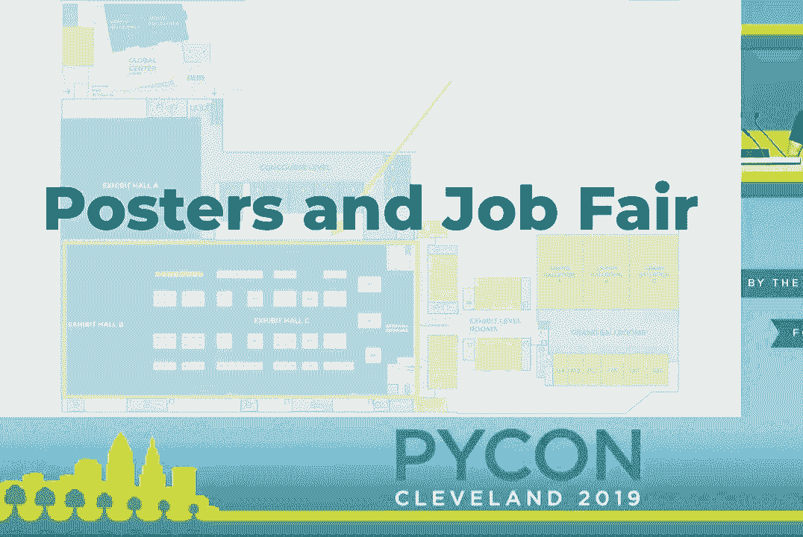

 On screen are our breakout rooms。 Note that there are some distance from where we are generally over to these other rooms。 Those are the H-room ball rooms and they're right there。 If you made it here。 you just need to go up that escalator or up that escalator or come through this concourse to find them。 They are a little bit of a distance from the other talk rooms。

 so if you're planning to see a talk in there， make some consideration for time。 We have five talk tracks with 95 sessions once again this year。 and you have 19 opportunities to see one of these talks。 But don't worry。 most of the talks will be recorded and available online after the conference。

 So as you stare at a conflict between two talks you'd like to see， go with your gut。
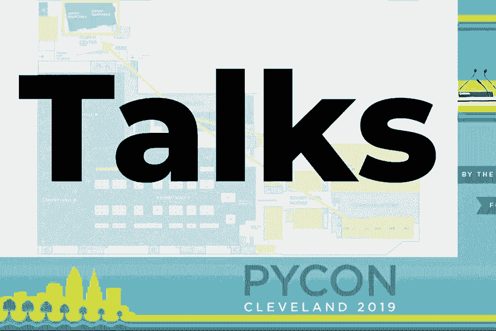

 If you do attend a talk where time remains and the speaker allows for questions and decides to ask for those questions。 in the legendary words of PyCon chair emeritus branded Rhodes。 remember to phrase your question in the form of a question。 We have a veritable fleet of rooms available for open spaces。 All day today， Saturday and Sunday。

 these rooms are allocated for anyone to self-organize a one-hour meet-up style event。 and they'll be open from 8 a。m。 to 11 p。m。 They're a great opportunity to connect and have a deeper discussion on something that。 or find people who have a shared interest or a common goal。 I want to encourage you to consider shaping the conference by having your own open space。

 You can stop by the board and post your own open space or prove what's already there。 And new this year you can go to the URL on screen。 and at that location you'll find a photograph of the current day's board。 that you can sort of pinch and zoom around in to see what has been posted。

 So you don't have to constantly be crowding around the boards。 So these rooms are something that is sort of near and dear to my heart。 These rooms。 which are 25C and 26ABC， are home to the PyCon Hatchery Program。 PyCon is a conference that has grown and evolved over the years through the direction of volunteers。

 the board and staff。 Last year we launched the Hatchery Program and it's intended to offer anyone the opportunity to see their idea come to fruition at PyCon。 Whether the intent is at a permanent fixture of the conference or something that's just ephemeral and topical or important for any given year。

 the Hatchery Program offers space and resources at PyCon for that idea。 We're excited to have the inaugural Hatchery Program returning this year and three new concepts joining us for 2019。 All day today and today only you can attend Lust PyCon， it's a full day of talks given in Spanish。 That'll be in room 25C。 The Charlie schedule is matched to the primary talk schedule。

 So you're welcomed and encouraged to jump in for just a single talk or stay all day。 New this year is the Art of PyCon。 It's a miniature arts festival and it's going to focus on narrative。 performance and visual art。 You can find that event this evening in room 26ABC tonight from 8 to 10PM。 So if you're up for a show， you can see that there。

 The PyCon Hatchery Maintainor Summit is also new this year and it's seeking to build a community of practice for projects and maintainers。 project maintainers and key contributors with the goal of helping the Python community sustain and grow healthy projects and communities。

 This will be a mixture of lightning talks and discussions and it'll be going on from 10 to 50。 from 10 to 50 until 2PM in room 25C。 Also new this year are the Mentored Sprint。 They'll run from 2。30 to 6。30PM tomorrow in room 25C。 And this is a newcomers introduction to contributing to an open source project。 And it's done under the mentorship of somebody who has more experience and has worked on the project in the past。

 These focus on providing less experienced developers a supportive environment in which they can learn。 collaborate and expand their network and celebrate their victories at the end of it。 So these are the PyCon Hatchery programs for this year。 And if you have an idea。 the PyCon Hatchery program is very likely to continue。

 So keep an eye out for the CFP which will be launching sometime between now and next PyCon。 I really ran out of arrows。 I bought too many arrows so I had to use them all on the slide。 So PyCon has consumed nearly entirety of this convention center for the next few days。 And during that time all of the public spaces will be scattered with PyCon Eastons。

 It's not an official event but this is a happening that I never really get the chance to miss out on at PyCon。 There are no rules that say you have to attend any given event。 There are no rules that say you have to attend every， fill all of your time with a structured event。 So consider spending some time joining a table or a group and meet someone new。

 open a laptop and explore a problem together， spend some time catching up with someone you've never met in person before or an old friend。 One suggestion to improve the experience in the hallway track and throughout PyCon generally though comes from PSF board member Eric Holscher。

 And this is the Pac-Man rule。 When standing in a group of people always leave room for one person to join your group。 This suggestion can help create a physically welcoming space for someone to join your group and makes easy for attendees to identify groups that they can join。

 So it helps meet new people。 Throughout the space we have three gender neutral bathrooms。 One is near rooms 17 and 18。 One is near rooms 25 A。 B and C and one is inside the Expo Hall so when you're entering from registration it's on your left。 There are also two mothers rooms in the conference center。 These will be rooms 17 and 18。

 And instructions for access to the room are posted outside。 So if you need help or if you need getting it needed in there， check there and get the instructions。 If you find that you need to take a break， focus on some work or just breathe。 We have a quiet room in room 24。 This room has a specific purpose so please be respectful of the word quiet while you're in the space。

 And stepping outside it's always beautiful and Cleveland。 There's never rain or clouds。 We can see our place in the civic center of downtown Cleveland。 Around the venue there is the Pilates auction which is Saturday May 4th at 6。30pm。 That's in the Hope Ballroom in the connecting Hilton downtown Cleveland so you don't even have to go outside if you don't want to but take a walk。

 Last year $30，000 is raised to benefit the Pilates。 For a $5 cover charge it's a hard bargain to beat。 It's probably one of the most fun evenings we got going on here even if you don't come to bid and win for an excellent pause。 Just around the corner from here， if you go down Lakeside and make a left on 9th and down to the pier。

 you'll find the Rock and Roll Hall of Fame and the Great Lakes Science Center。 These are home to the Picon dinners。 One this evening at 6。30pm and one after the close of the conference at 6。30pm on Sunday。 And these evening events are both ticketed events。

 So when you check in at registration you should have had little tickets。 You'll need to bring those tickets to these events and since food has already been pre allocated for them。 if you did get a ticket and you don't plan to attend。 convey your ticket to someone else however you see fit。

 This helps reduce food waste and keeps the events fun and lively。 That's a lot。 And that's even skipping what we've already done。 So if you prefer to have this information with you。 there is a printed program。 It looks like this。 And there is pikon。org which can be a little bit fiddly to navigate。 And we have a guidebook again this year。

 So this is a specific app that has all of the schedule information and room numbers and such in it。 And you can find that at pikon。us/guidebook。 And yeah， I think you're oriented。 So time for some housekeeping。 First off， the Python software foundation which does take the fiscal responsibility of this conference is currently running a fundraiser。 We couldn't do this without them。 So if you're able。

 consider going to this URL on screen and it will take you to a page that includes all the information about that fundraiser and you can consider contributing。 If you registered for the pikon fun run and walk， that kicks off Sunday at 7。 Bussing begins at 6。

 but probably show up around 6。30 so you're not just left waiting。 But if you're punctual。 6 o'clock it is。 Tomorrow morning， there's a different run。 It's not ours。 You can run along。 I guess。 But note that if you're coming to the convention center， particularly by car。 this will cause some congestion。 As you see， we're sort of right in the middle of the route。

 And so from about 7 a。m。 to 11 a。m。 tomorrow morning， plan a little bit of extra time to get here。 The swag bags are available for pickup， so make sure you go grab those。 And inside you will find a little gadget。 So thanks to DigiKey and Adafruit。 all attendees will receive a circuit playground express which runs python。 So two notes on this。

 One， if you're going to be traveling through something that involves security checkpoint。 go ahead and take this out of your bag and tell the screener what it is。 It will save you and them a lot of hassle and questioning and considering。 Just a tip。 And the second one is considered bringing this with you on Sunday to our closing keynote。

 By the end of it， you might feel inspired to run out immediately and start programming on it or you might even code along with some of the examples。 So also the needs picking up are your t-shirts。 They look like this。 But I want to take a moment to warn you that due to the cut and weight。 which is the same as last year， our choice in color doesn't quite have as much pigment。

 So in full transparency， these shirts are quite sheer。 So make sure that you try your shirt on and are comfortable wearing it before you wear it in public。 If you have concerns about your t-shirt after picking it up， let us know。 And lastly。 I think almost。 There are some schedule changes。 US。py。com。

 the mobile guide book app I mentioned earlier and the signage have been updated。 Your printed program has not。 So please take a moment to double check the boards in front of the Expo Hall for substitutions。 But the long short of it is that there has been a substitution in Grand Ballroom B on Saturday。 The elephant and the serpent using Mastodon with Python by Philip James replaces code review skills for Pythonistas by Nina。

 And shipping your first Python package and automating future publishing by Chris Wilcox substitutes code readers using Python uncover surprising patterns books you love at 315 in Grand Ballroom B。 That's right。 We have a professional photographer on site this year。

 If you are uncomfortable being photographed in a candid fashion。 you can go pick up a badge holder that looks like this and at registration。 Swap your badge into it。 put your lanyard on it， and the photographer will avoid photographing you。 But more importantly。 in post， we'll make sure not to use any photographs of anybody wearing a badge that has this red banner at the bottom。

 So one last thing， which is about social media， the thing near and dear to my heart。 I'm going to take a selfie with you。 That's perfect。 All right。 And if you want to tweet at the conference， this is to get the attention of the staff or the organizers tweet at Python。 If you want to post about the conference， we can look back and remember everything that occurred here。

 Tweet with the hashtag #picon2019。
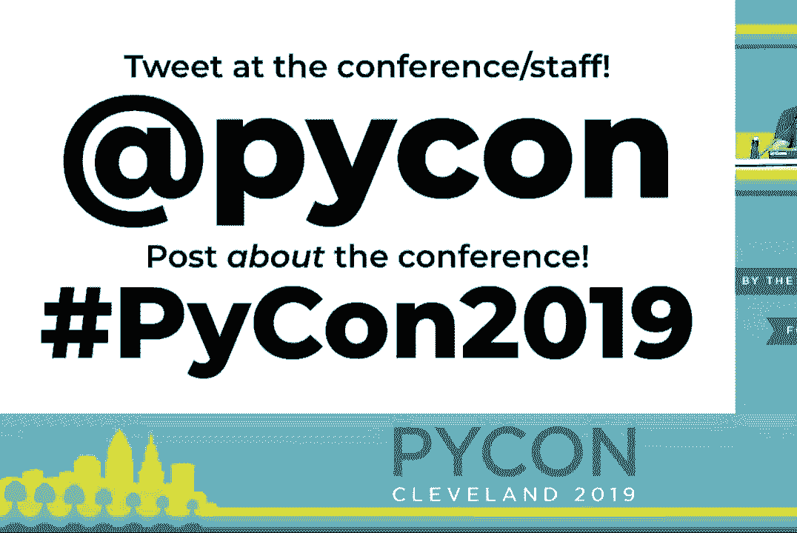

 With all that， I'm actually -- hey， how's it going， Russell？

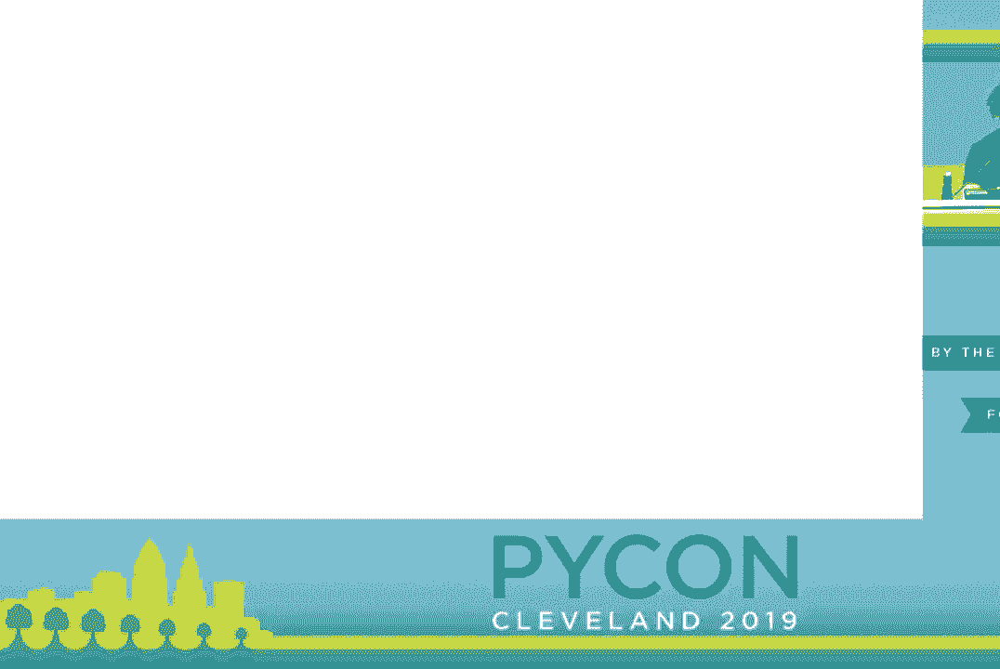

 Hey， how are you doing？ I'm very excited to introduce our first keynote speaker， Dr。 Russell Keith Viggy。 A longtime community member， founder of the Beewear Project。 which brings Python to mobile and places maybe it shouldn't go。
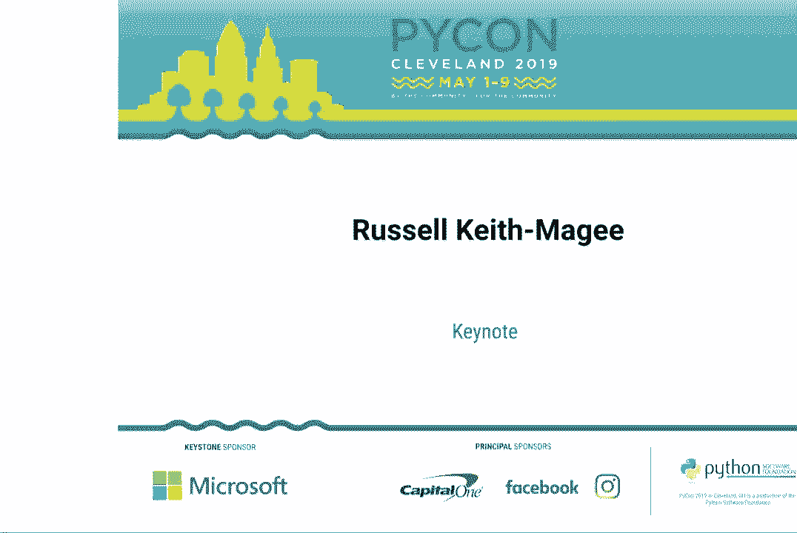

 And a longtime contributor to Django。 Russell， take it away。 [Applause]， Thank you very much。 Ernest。 Hello， Cleveland。 My name is Russell Keith Viggy。 It is my very distinct honor to be here today。 I have been an active and visible participant in the Python community for over 13 years now。 And as a result， I have spoken at a lot of pikons and Django cons。

 But for those who haven't met me before， hi， you may have noticed I'm not a local。 I was born and I live to this day on that little red dot down the bottom corner of the map， Perth。 Western Australia。 Perth is not usually one of the city's people think of when they think of Australia。 It's kind of like Cleveland in that regard。 It's a fine city。

 but not usually the one that jumps to mind when people think of the US。 Perth has a fascinating history， though， and it has had a bigger impact on the world than many people realize。 Some of those stories are convenient metaphors， so today I would like to teach you all about Perth。 And maybe we can all learn some valuable lessons about life along the way。 First off。

 some terminology。 We are in Ohio。 Someone from Ohio is called a Buckeye。 Someone from Western Australia is called， and I swear I'm not making this up。 A sand gropper。 We are so named after this delightful fellow， and if you don't like insects， be warned。 you're about to see a large one。 This guy， Slind， Australia， cocky eye。 It is a pygmy mole cricket。

 It's about two inches long， lives in the sand dunes at the beach。 And they're not venomous。 Sand gropers， the people， not the insects， have a tradition about how you start big public events like a pike on。 Australia， like the US and Canada and many other colonised nations。 have a messy history where they're indigenous people。 And in recognition of that fact。

 starting in Perth in the 1970s， Australian public gatherings have， increasingly。 started with a recognition that the land where the gathering is happening wasn't always white man's land。 It's called， "Acknowledgement of Country。" And in that spirit。 I would like to acknowledge that I come from Wajuk Nung Aabuja。

 And I would like to recognise the Erie Honan and Haudenosaunee peoples。 the traditional owners of the land where we are meeting today。 To recognise their continuing connection to their lands， their waters and their culture。 And to pay my respects to their elders past， present and future。 Also， as a content warning。

 I will be discussing issues of depression and self harm later in this talk。 If that is something that will impact on you， please do whatever you need to do for self care。 I will give another warning before I get to that segment of the talk。 So， to the subject at hand。 we have established it， yes， I do come from a land down under。 But who am I？ Okay。

 well in my day job， I do data engineering for Savada。 Savada is a market research company。 They use Python and data science to help brands to understand their customers。 Savada gives me the flexibility to flip about the planet and meet all you lovely people。 But as lovely as it is to have the support of a wonderful company like Savada。

 that is not really why I am here today。
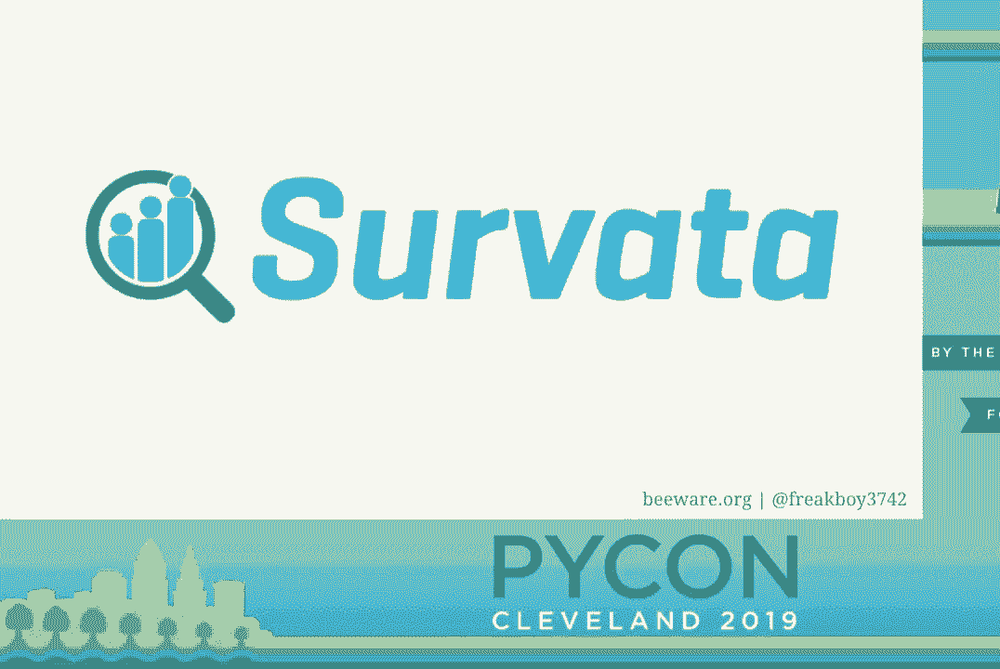

 I became involved in and I am known to the Python community through my work on Django。 I joined the Django core team way back in 2006。 And because I lived in Perth。 I did not meet another member of the Django core team until 2008。 Django is a big part of the Python ecosystem， but it is not the only part。

 Django isn't the only Python web framework and web programming isn't the only thing that people do with Python。
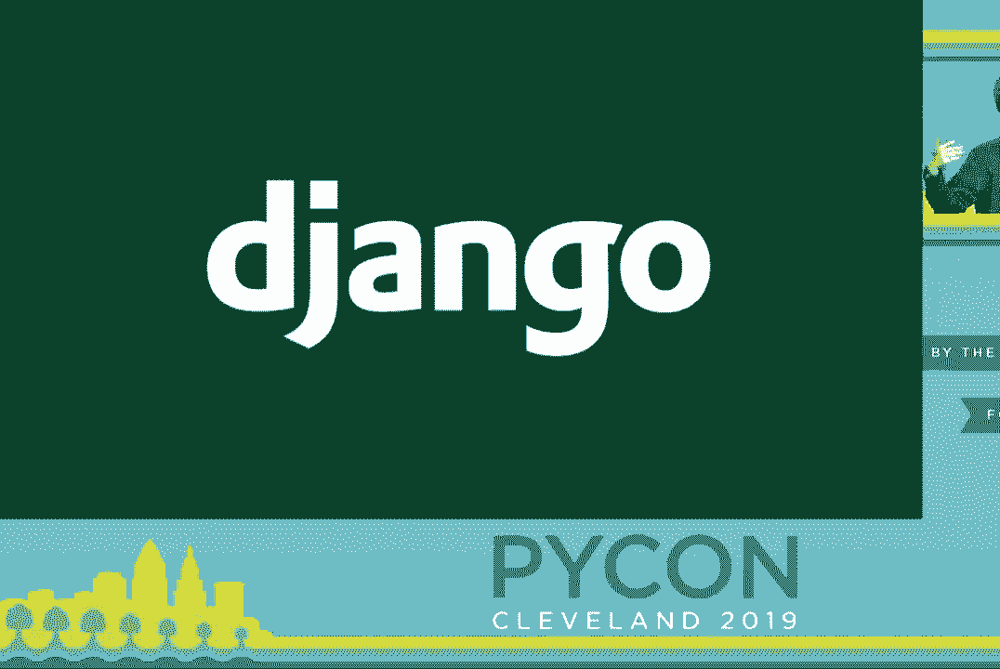

 In my current day job at Savada， I do not use Django at all。 But I do make extensive use of NumPy。 Jupyter and Pandas and ecosystem of tools around those libraries。 And there are many other uses of Python。 You can use Python on embedded devices。 There are libraries for performing astronomical calculations， doing biotech and gene sequencing。

 It is used as a scripting language for operating system automation。 and it is a control language for DevOps as a teaching language。 None of this happened overnight。 Python as a language is 28 years old。 It took maybe 10 years for Python to gain any sort of significant traction in our industry。 and another 10 before it gained widespread support。 And as a result， we get this。 A gathering of 3。

500 people who have organised to travel from all over the planet， even Perth。 to converging of all places， Cleveland， to talk about a programming language for a couple of days。 It's worth stopping for a moment to reflect on the magnitude of what Gito said in motion 28 years ago。 and what we collectively as a community have done with that since。

 It should be celebrated because it's no small feat。 And because this is the big tent of the Python community。 we have a real opportunity here to look to the future as well。 This weekend and into the sprints next week， we have the opportunity to dream big ideas。

 to work out what problems we need to solve， where we're going to collectively focus our efforts。 over the coming weeks， months and years。 And so to kickstart that conversation。 I would like to pose a question to everyone in this room。 Where do you see Python in 10 years？

 The one thing I am certain of is that everyone in this room will have a different answer to that question。 This is just inevitable when a language is used by so many people for so many different things。 But if you're here in this room today， it's probably fair to assume that you like Python to some degree。 And in 10 years， you'd probably like to see Python be as least a vibrant community as it is today。

 I'm sure nobody here wants to have to rewrite all the libraries on PyPI or rebuild all the communities。 and user groups in the Python ecosystem or reestablish all our ecosystem norms in a new community。 just because Python is no longer a viable language for new projects。 So this question。 where do you see Python in 10 years， is really about asking。

 what do we need to do today to ensure that Python remains a vibrant， relevant， healthy community？

 So time for some more sand-graper facts。 The state bird of Western Australia is the black swan。 It appears on the West Australian flag and on the crest of the city of Perth。 The river running through the middle of Perth is called the swan river。 But a black swan is also a metaphor。 Prior to the 1600s， it was well known that all swans are white。

 Swans of other colours were known to not exist。 And then in 1697。 Dutch explorer Willem de Vlaming visited Western Australia， accidentally。 and discovered that swans could also be black。 This radically changed the world's idea of what a swan was。 In 2001， SAS and statistician， Nasi M。 Nicholas Taleb， used this as a broader metaphor。

 Taleb defined a black swan event as an event that is a surprise to the observer。 that has a major effect on the world。 But in hindsight， it can be easily explained。 In hindsight。 it's obvious that swans could be black。 But until someone visited Western Australia and saw one。 it never occurred to anyone to challenge the assumption。

 Black swan events don't have to be immediate either。 The impact can be felt over time。 The rise of the personal computer was a black swan event。 In 1947， the CEO of IBM， Thomas Watson。 famously said that there was a world market for maybe five computers。 Today。 almost everyone in this room is carrying five computers。 In retrospect。

 Watson's comments are just quaintly naive。 But at the time， they weren't controversial。 They were just the common understanding of the world。 And the change wasn't immediate。 But in retrospect， it was inevitable。 In my opinion。 when we're thinking about what the future holds for Python。

 we need to be thinking about Python's black swans。 Python is a popular language right now。 We'd like it to stay popular。 What could happen to affect that popularity？

 What change could happen in the industry， in hardware。 in the community that could alter the popularity of Python。 that would cause Python to become that annoying legacy language that we have to know。 but would really rather replace at the earliest opportunity？

 Black swan events are truly only obvious in hindsight。 But the best way to avoid them is to actively challenge your assumptions。 And the question。 "What would happen if those assumptions turn out to be incorrect？"。 And I think there's a couple we may have caused to be concerned about。 First off。

 where do you run Python？ For pretty much the entire existence of Python。 A computer was a large box that sat on your desk， maybe in a rack， in a server room。 Over time。 that box has gotten smaller。 We start throwing anywhere into our backpack。 But you're using the same operating system， windows or a Unix derivative。 Over the last 10 years。

 we have seen the emergence of a whole new class of computing devices， much smaller。 usually portable。 Phones， tablets， watches， set-top boxes。 These devices are becoming ubiquitous。 They are replacing laptops as primary computing devices。 My son started high school last year。 He doesn't have a laptop for school。 His entire educational experience is delivered through a tablet device。

 If you go to Python。org， tablets， phones， set-top boxes， watches don't even rate a mention。 To me。 that seems like a fairly big oversight of the way the everyday experience of computing。 has changed over the last 10 years。 Phones and tablets are achieving market penetration that desktops and laptops have never seen。 Yet as a community， we don't have a story for how you can use Python on these devices。

 What happens when laptops don't exist？ There are niche devices。 There's no installer for Python on my tablet。 Why am I going to learn Python？

 Not all Python runs on laptops。 You installed Python on the server。 You made sure the user didn't have JavaScript enabled。 These days。 good luck finding a web page that works without JavaScript enabled。 As with mobile devices。 the last 10 years has seen a dramatic shift in where code is being executed。 Increasingly。

 code is being run in the browser。 JavaScript has evolved from an optional client side add-on to a language that is implementing。 key business logic in the browser to a language that is replacing Python on the server。 Again。 if I'm a novice programmer and I'm faced with JavaScript， a language I can use to get。 a native experience in the browser and I can transition that on to the server and on the。

 other hand， there's Python， a language that only works on the server。 Why am I going to learn Python？ Let's say despite those two problems。 I've still committed to learning Python and I reach， the point where I need to install a package。 I have been a user of Python for 20 years and in that entire time， I don't think there's。

 been a period where I would have described Python's packaging story as stable。 That's because information lists forever on the Internet。 Old advice continues to linger long after it's considered the right answer and well。 meaning that misinformed people spread out data advice on stack overflow， perpetuating the， problem。

 The situation is bad enough that it's a punch line for comics。 XKCD 1987， Randall Munro。 lampoon's Python environment experience has so degraded that it， made his laptop a toxic waste site。 Brett Cannon did a really good write-up about this comic trying to diagnose what has happened。 to Brando's computer。 It's a really enlightening autopsy and well worth to read。

 But one thing that Brett points out and it's the part that's most concerning for me from。 my perspective of looking for black swans is this。 Why can that joke be made at all？

 Good jokes always contain an element of truth and the way you respond to that truth matters。 This joke is part of a narrative about what Python is。 And if that picture isn't positive。 long term， that's an existential threat。 If I'm a new user。 why would I want to learn Python if everything I read about it ends up。

 with a joke about my computer becoming a toxic waste site？

 And I haven't even got to the question of how I distribute my application to someone else。 Whether you're distributing a Django application or distributing a user space application。 Python has an ever had a consistent story for how I give my code to someone else， especially。 if that someone else isn't a developer and just wants to use my application。 Contrast that with。

 for example， PHP， whose distribution story is use FTP to upload all。 the files or go story which is here， have this executable。 Now。 I'm not saying that PHP or go solutions are panacea， they're not。 And I'm not saying that Python story could ever be as simple as those。

 But we haven't got a story at all。 And we're competing against languages that do。 And again。 why would I want to learn Python if I can't get a clear answer for that basic。 question of how I give my code to my non-programmer friends？ Now。 that's four possible black swans I've just identified。 Maybe the problem will be something else。

 I know there are people in this room who will assert that Python's C API is a potential。 problem or the Gill or the lack of a good front end story or focusing on Unix and Mac to。 the exclusion of Windows。 Maybe the problem won't be technical at all。 Maybe it will be cultural。 Some aspect of Python's community or development process that drives away some segment of users。

 or potential contributors because of perceived hostility or conflict or diverging interests。 Maybe it won't be any of those things at all。 The point is we can't predict the future。 but we can challenge our assumptions。 We can look critically at ourselves as a community。 We can examine trends in our industry and our society and make plans based on those assessments。

 Not just reacting to problems when they're already wildfires， but proactively addressing。 problems before they become critical threats to our ecosystem。 I also want to be very。 very clear here。 This is not an accusation。 I am not blaming someone of not doing their job。 The Python core team and the rest of people who work on Python packages are doing the absolute。

 best they can with the resources they have。 They are very limited resources。 What I'm talking about here is trying to avoid black swans。 To start a conversation about longer term priorities， about how we marshal the resources that we。 as a community have at our disposal。 For whatever it's worth。

 these existential problems are one of the reasons that I changed。 the focus of my open source contributions a few years ago。 As I said earlier。 I developed my reputation working on Django。 But these days。 I spend most of my volunteer time working on the B-Wear project。

 For those who haven't come across it before， B-Wear is a collection of open source tools。 and libraries for creating native user interfaces in Python。 For desktop， but also for iOS。 for Android， for single page web apps and other new hardware， platforms。 A key part of this work is getting Python to run on phones and tablets at all， working。

 out how to run Python code on iOS in the browser， bridging to native APIs and those platforms。 wrapping those APIs in a cross platform layer。 Another big part is developing a distribution story。 working out how to integrate with native， platform tools to get an application written in Python。 wrapped as an app with an installer， or uploaded to the app store or a play store。 Now。

 B-Wear is a work in progress。 It's current status compelling proof of concept。 It's not a version one product ready to start using to develop your mission critical applications。 But I have been able to demonstrate that cross platform native applications written in Python。 is possible。 I'm also not the only person working on this problem。 The kivi project， for example。

 has similar goals but with differences in their underlying， approach。 As far as B-Wear is concerned。 about 18 months ago， I did a live demo at PyCon Australia。 2017 where I wrote a Fahrenheit to Celsius application， about 50 lines of Python code。
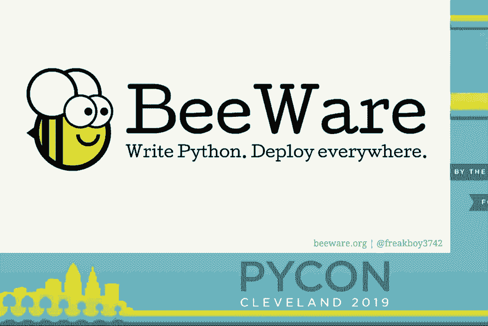

 and then deployed it on Macos as a Macos app， on Linux as a Linux app， on Windows as a， Windows app。 on iOS as an iOS app， on Android as an Android app and as a single page web。 application and all that I managed to do in the space of 17 minutes。
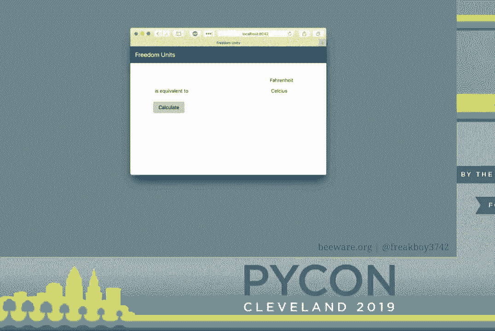

 [Applause]， And when I say deployed， I don't mean I ran the code。 And on Mac。 what you had was a standalone 。app file。 On Windows， it was an MSI and Stoller。 On iOS and Android。 it was a packaged app running on the device simulator but could have。 easily been uploaded to an app store。 And it was running in the browser， completely client-side。

 including doing the Fahrenheit to。
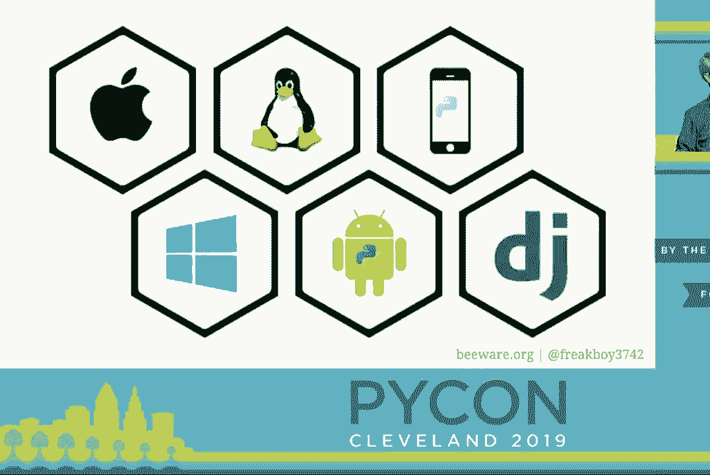

 Celsius conversion in Python in the browser。 Now， as you might imagine， this is a big project。 I have been working on B-Wear for years and there are days where I really do feel like。 this is a first pushing a boulder up the hill。 Unfortunately。 there has not been a lot of visible progress since I did that demo。

 There have even been some regressions。 Android and web support are currently broken for reasons。 And that's because it's not my day job。 I am tinkering on this in what I am usingly refer to as my spare time。 And as a result， progress is slow。 But despite all this。 I am actually optimistic about Python's future。 And to explain why。

 I need to tell you about another piece of Sangerpah history， about a。 lot of the American's Cup race。 I need to tell you about the America's Cup。 The America's Cup is the world's oldest international sporting trophy。 The America's Cup race is held about every four years。

 Those of you from San Francisco may remember the 2013 America's Cup race in San Francisco， Bay。 But from the first race in 1851 to 1980， the winner was the New York Yacht Club。 In 1983。 New York lost to the Royal Perth Yacht Club。 And it's Yacht Australia too。 breaking a 132 year winning streak。 It is difficult for me to understate how big a deal this was in Australia。

 And in Perth specifically。 This was the event that put Perth on the world stage for pretty much the first time。 Many of you today probably even know about the 1983 America's Cup without knowing why。 Some of you may have heard me drop the line that I come from a land down under。 That is a line from a song by Australian rock band Men at Work。

 The song was the unofficial theme song of Australia too。 And it was popular in the US primarily because of the 1983 America's Cup challenge。 The movie Crocodile Dundee was conceived of and able to get financed and released in part because of the exposure that Australia received from the America's Cup。 Just to be clear though， Outback Steakhouse， we had nothing to do with that。 That's on your。

 But other than the Perth connection， why does the America's Cup and Australia to matter？

 Well first off， let's talk about New York's winning streak。 The Yachts in the 1983 race are what are called 12 metre Yachts。 Despite the name。 it's actually got nothing to do with the length of the boat。 It describes a complex set of rules for the design of Yachts。 Involving sale area。

 water line length and more。 However， the America's Cup hasn't always been raced on 12 metre Yachts。 Prior to 1956， a range of different Yachts classes were used。 According to the deed for the trophy。 the defending club must accept regular challenges。 But they're allowed to set the rules for those challenges。 And so for many years。

 the New York Yacht Club would impose rules like， "The challenger must come from an ocean yacht club and must sail to the competition site on its own hull。"， That is， a challenger from England would have to cross the Atlantic in their yacht。 whereas the defender would just pop out from Newport Harbour。 And surprisingly。 under those conditions， New York's Yachts were consistently lighter and faster。

 So lesson one from the America's Cup， it's not enough to just follow the rules。 You have to ensure the competition is fair。 The New York Yacht Club wasn't breaking any rules。 They didn't write the deed for the trophy。 They were just playing the hand they were given。 But nobody in their right mind would call the competition fair。 In a situation like that。

 you have a choice。 You can either keep winning the competition that's been stacked in your favour。 or you can change what is in your control and make it a fair competition。 But you don't get to claim you are the best in the world winning on merit。 unless you have levelled the playing field first。 Could this be a metaphor for the IT industry？

 You know， I think it might be， I'm just going to put that over there。 But to their credit。 the New York Yacht Club adopted the 12-metre rule in 1958。 And so since then。 the competition had been fair。 So why hadn't anyone else won？ Well， a black swan happened。 Sailing is a highly competitive activity， and the New York Yacht Club always filled in a strong defence。

 with well-designed yachts， highly capable crews。 And when you add in home harbour advantage。 knowing the local seas and prevailing winds of Newport Harbour， it's easier to continue winning。 And the design of 12-metre yachts was essentially finessing a well-established design。 Yeah， okay。 sure。 There were variations between boats， but they were relatively well-understood tweaks of a basic design。

 Australia II was a black swan。 When Australia II arrived in the United States。 the lower half of the boat was shrouded in secrecy。 This invited all sorts of wild theories。 especially when it started winning races。 On two separate occasions。 the Australian team caught scuba divers trying to take a peek。

 There were all sorts of accusations that whatever was under that shroud， it must be illegal。 But the keen team kept the secret right up into the victory celebration。 when the team owner stood on the dock， called for the boat to be raised into the air for all to see。 revealing， the winged keel。 On most boats， the keel is a simple flat surface。

 used to lower the centre of mass of the hull， counterbalancing sail forces。 Ben Lexin。 the designer of Australia II thought about it differently。 He reasoned that the keel is a hydrodynamic surface， so let's treat it like one。 He added a pair of winglets to the bottom of the keel。

 Those winglets perform a similar role to the winglets on a jet airliner's wing。 Winglets on a plane cause the wing to generate more lift and less drag。 And the same is true on a keel。 The winglets make the keel more effective at keeping the boat upright。 which means the sail is more effective and therefore the boat is faster。

 The blue paint was camouflage， so if you did get a photo of the boat in the water。 you'd see the outline of a traditional keel shape。 Fast forward to 1987。 And the Australian Defence。 Every yacht had something secret。 They were fiberglass hulls， they were all sorts of keel shapes。 they were dynamic keels。 And the innovation has continued to this day， carbon fiber hulls。

 solid sails and more。 The America's Cup isn't sailed on 12 metre yachts anymore。 The next America's Cup in 2021 will be sailed on what are called AC 75 yachts。 which are quite literally flying boats。 They are so light。 they generate so much thrust from their sails， that they are able to use their keel。

 as a hydrophile and lift out of the water。 These boats travel at amazing speeds。 All of this innovation happened because one team decided to challenge the assumptions of 12 metre yacht design。 It was controversial， it was risky， but it worked。 And yacht racing has not been the same since。 And just to nail the metaphor home， the name of Australia 2's tender boat was the black swan。

 What does this have to do with Python？ Well， I think we have already seen a winged keel for our industry and it's Wasm。 For those who haven't come across it， Wasm is WebAssembly。 It started life as a research project trying to identify the set of primitive JavaScript operations。 that will execute fast in a modern JavaScript engine。

 That set of primitives is very close to the capabilities of assembly language， allocating memory。 simple integer floating point operations and so on。 And as a result。 you can use that set of primitives and compile C code to this assembly language target。 Wasm is the extension of this work defining a binary format for transmitting assembly content。

 rather than transmitting JavaScript than as to be parsed and interpreted。 That makes Wasm code smaller and faster to process， but no less portable than JavaScript。 Because at the end of the day， it is JavaScript。 Essentially。 it's separating JavaScript into two parts。 A fast sandboxed runtime that is almost universally available because it's in the browser。

 and a language that targets that runtime。 For the purposes of our industry。 it means that the rules have changed。 You no longer have to adopt JavaScript the language to adopt JavaScript the runtime。 That means there's an opening for Python and other languages， for that matter。 to be languages that are available for client-side logic in the browser。

 Wasm is still in the relatively early days。 There are still some issues being worked out。 one of the big ones being the interaction between the DOM and Wasm。 And making a viable Wasm-based Python will require some work。 There have been some experiments done in this space， though。 But the wind keel has been revealed。

 What we do with this knowledge is up to us。 Are we going to dig into the technology。 get creative with the rules， determine how we can exploit those rules to our advantage and sail off in a flying boat？

 Or are we going to continue to race on flat keel 12-meter yachts and wonder why we don't win races anymore？

 But there's more we can learn from Australia too。 Ben Lexen was a very talented yacht designer。 He did a remarkable thing when he put winglets on the bottom of this Australia 2's keel。 But he wasn't a competitive sailor。 John Bertrand was an amazing skipper。 Couldn't design a yacht to save himself。 And there were 14 other people on board the boat and an entire support team on the tender and back at harbor。

 and showing those 15 sailors could be competitive。 Sailing is a team sport。 You don't just need a top-notch engineer or skipper。 You need a wide range of skills。 And it's only when all those skills come together and a well-oiled team that you achieve success。 The same is true of software。 Although there is a historical narrative about great software development being done by a soul hacker tapping away in their basement。

 That is almost never the case。 What we see today as the Python community is the result of countless thousands of hours of effort from countless thousands of people。 And being primarily software engineers， code is often get the most attention。 And yes。

 writing good software takes a lot of effort and doing it well takes time and skill。 But that's only considering the code。 Any project， especially on the size of Python。 is so much more than code。 Project and team management is a skill。 Graphic design and UI management is a skill。 Developer relations is a skill。

 Technical writing is a skill。 Now， okay， those skills could be broadly considered in the remit of a well-rounded software engineer。 But what about things that aren't even remotely software-related？ Who organizes community events？

 Who provides legal advice？ Who handles communication and public relations？

 Who builds the relationships with potential donors and manages fundraising？

 Who makes the strategic deals with the Googles and the Microsofts and the Amazon's of the world？

 To make sure that Python is a supported language on product roadmaps。 It turns out there are people in the world who can't program。 who have remarkable skills that are very， very useful。 And Australia too has another lesson here。 Ben Lexton and his team didn't do all this engineering work out of the goodness of their hearts。

 Competitive sailing has been described as the ability to stand in a cold shower tearing up hundred dollar bills。 The Australia 2 Challenge was bankrolled by a gentleman named Alan Bond。 The 1993 challenge was the third challenge that Bond had financed。 collectively absorbing hundreds of millions of dollars。 Without Bond's money。

 the Australia 2 Challenge would not have happened。 And without a commitment。 over multiple cup campaigns， allowing the design team to become deeply familiar with all VINDA YOT design。 funding the research effort， it would not have culminated in a winged keel。 Whether it is competitive sailing or software， expertise is needed。

 but experts kind of expect to get paid。 From inside the bubble of open-source software development。 it is easy to lose sight of the fact of some of the cultural norms we see aren't normal in other industries。 Open-source software is an industry where apparently it's expected that having worked your 9-to-5 day job。 doing something that you are skilled at， you will go home and do some more for free and then encourage a multi-billion dollar organisation to benefit from your efforts。

 In most industries， if you're good at something， you get paid to do it。 And people outside software have really useful skills。 skills that many open-source projects badly need。 But it's true of writing software too。 People are paid well to write software， but there is plenty of software that should be written。

 but isn't。 Or isn't written in a timely fashion because we are waiting for volunteers to do the job。 Django is a web framework， and it took the DSF over three years to coordinate the most recent redesign of its website。 Why？ Because if you need volunteers， you are immediately constraining the amount of time and effort that anyone can put into the job。 And I don't want to undermine the significant contribution that volunteers have given to Python and the Python community。

 but I do want to challenge the idea that volunteering is the only way that Python or open-source can progress。 If you pay people for their time， they are much more likely to be able to maintain their attention on a problem until designs are fleshed out or consequences are considered。

 and the work gets done。 [Applause]， We saw an amazing example of this in the Python community with the rewrite of PyPI。 PyPI has been around for 15 years。 It has badly needed a rewrite for almost half of its life。 Everyone agreed a rewrite was needed， but the work never got finished。 Why？

 Because nobody was being paid to work on it。 Then Mozilla gave the PSF a grant of $170，000。 and the work was done in six months。 Why？ Because a couple of people could focus on getting the job done instead of trying to fit bug fixes in on weekends between their kids football games。

 or trying to convince their boss that， "Oh， improving PyPI won't make us any money in the next quarter。 It's a worthwhile activity for the community。"， PyPI is an unfortunately rare example。 What opportunities have we left on the table， or are we at the risk of living on the table。 because we aren't resourcing them？ What constraints have we placed on our own growth。

 because nobody was enthusiastic enough to volunteer their time to address some gap or make the most of some opportunity？

 And who have we excluded from the development process because they had other life commitments or couldn't justify donating all their spare time to a volunteer effort？

 Or because they can't take up a short-term grant contract because they live in the United States and need healthcare coverage？

 It's not just about maintenance and existing infrastructure。 Either history has shown that research and development is how you ensure success in the long term。 and groups that don't do R&D eventually get beaten。 Australia II's investment in the R&D led to the wind keel and kickstarted a whole generation of progress in yacht design。

 The black swans I identified earlier aren't something that can be addressed in a trivial fix。 They're going to need a concentrated effort， probably a bunch of dead ends along the way。 I have been doing what I can with B-Ware， but I'm really only doing that on weekends。 And the same is true of a lot of Python and the Python ecosystem。 For the most part。

 the Python we have today has been developed in a spare time of volunteers。 or whatever fragments of time engineers have been able to extract from their employers。 What if it didn't have to be that way？ What if Python had an R&D division。 a permanent engineering group that could focus on strategic tasks for the Python ecosystem？

 When Bell telephones gave a bunch of engineers the resources to engineer strategically， we got Unix。 When Xerox funded a team in Palo Alto to engineer strategically。 we got Xerox Park which gave us graphical user interfaces and ethernet and laser printers。 When you give talented people the resources to think big， amazing things can happen。

 The Python community has talented people。 We just need to give them the resources to think big thoughts。 to do big things without the need to demonstrate that the work is going to generate profits in the next quarter。 or without the need to spend half their time on one grant right in the proposal for the next grant。 And it could open the door to giving a high-profile paid career opportunity to groups that have been historically underrepresented in open source development。

 The underlying problem we have though is how do we pay for this？

 Open Source is an amazing way to do engineering， but it is not a business model。 We need to work out how to fund our engineering goals in open source without compromising the social goals。 This problem is an area of academic economics research though。 Eleanor Ostrom won the 2009 Nobel Prize for Economics， first study of Common Pool Resources or CPRs。

 Real world examples of CPRs are things like forests or grazing lands。 They are situations where anyone can access the resource。 The best individual strategy is to take as much as you can get from that resource。 but the best communal strategy is to collaborate， to limit what you take。

 to contribute back to maintaining the resource so that in the long run the health and productivity of the resource is maximised。 Ostrom's work looked at examples of Common Pool Resources that are being managed in the real world。 Some of them have been collectively operated and maintained for hundreds of years。 One of the key findings of Ostrom's work are the conditions required for sustainable CPRs。

 and one of those conditions is exclusion。 In order to sustain a Common Pool Resource you have to be able to restrict access to the resource。 to those that are committed to adhering to community principles。 The problem is that this is in direct opposition to the free software guidelines。 which states you can't restrict the ability of people to redistribute software。

 I don't know how we reconcile those two positions。 It may require some very serious consideration of some ideas that we have considered sacred for a very long time。 or at the very least， drawing a clear distinction between the software and the communities around them。 But we can't avoid these discussions。 The consequences of this discrepancy are having had a very deep impact on people in our community。

 To that end， I've got one last piece of Sangrapah history I'd like to share with you。 and as a heads up we're about to get into the sensitive topics that I flagged earlier。 This dapper gentleman is Charles Yelvedin O'Connor， CYO Connor。 Born in 1843。 he became the engineering chief of the Public Works Department of Western Australia in 1891。

 He had a wide range of responsibilities， but there were two major public works that he is remembered for。
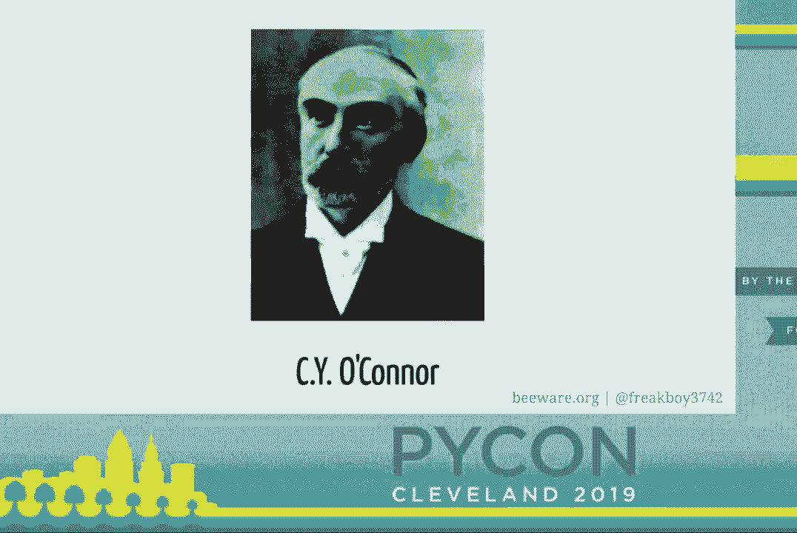

 The first is Fremantle Harbor。 Perth is actually a really dumb place for a large city to be。 Okay。 sure， it's a long way away from everything， but cities on the ocean need harbors。 Perth doesn't have a natural deep water harbour， so they made one。 And they did that by dredging the mouth of the Swan River。

 and this was done under the direction and supervision of CYO Connor in the 1890s。 But that wasn't O'Connor's only achievement。 His other was even bigger， the Goldfields Water Scheme。 In the early 1890s， Gold was discovered near the towns of Koolgadi and Kalguli。 This started the Western Australian Gold Rush。 These towns， as you may note from the map。

 are in the middle of a desert。 There is no natural water source out there， but people need water。 so they would pay five shillings a gallon to have water carted by horse from Perth。 Adjusted for inflation， that's US$100 a gallon。 There was so much gold that people paid anyway。 The 1890s Goldfield， Gold Rush， doubled the population of Western Australia in four years。

 But people were still dying of first-in-disease， so the government wanted to do something。 CYO Connor's solution was a pipeline running 530 kilometres， 330 miles。 from Mundaring Weir in the Perth Hills to Kalguli。 with a series of eight pumping stations along the route to get water to the destination。

 lifting the water 340 metres in altitude across its length。 It takes five days for a drop of water to make its way from Mundaring to Kalguli。 And again。 this was built in the 1890s。 Fremetel Harbour and the Goldfields pipeline were conceived。 planned and delivered in the eras of horse-drawn carts and steam engines。

 They were both mammoth undertakings。 It took considerable financial commitment from the government of the day to make them happen。 But， like all ambitious plans， they were not universally popular。 Criticism of these two projects was widespread。 People who had alternate plans that had been rejected took to the presses to express their dismay。 Two successive editors of Perth's Sunday Times newspaper made it their personal mission to see O'Connor。

 brought to account for the way that he was wasting public funds。 They took every opportunity in editorials to accuse him of corruption， of ineptitude。 calling for a royal commission into his activities。 And all this public criticism and pressure took its toll on O'Connor。 One early morning in 1902。

 he took his own life。 These two projects， Fremetel Harbour and the Goldfields pipeline。 they were ambitious， but they weren't full-hardy。 They were well-designed。 they were well-engineered， and they have shaped Western Australia。 They have both been in continuous operation from the day they were commissioned。 Kalguli is。

 to this day， an active goldmine， one of the world's largest。 And children are taught C。Y。O。 Conner's name and story in primary school because of the importance of the work he did。 But the combination of the public narrative about his work and his own mental health issues led to the worst possible end。 Unfortunately， this is a story that will sound familiar to anyone who has been around open-source communities for any period of time。

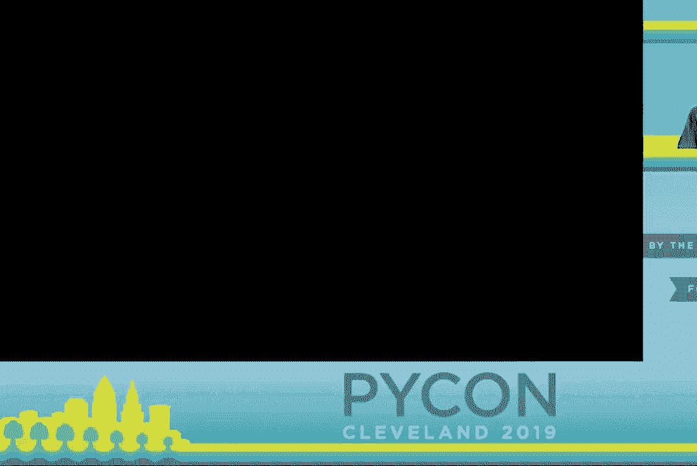

 I have been a part of open-source online communities for 30 years and maintainers for almost 15。 and I'm here to tell you dealing with people is emotionally exhausting。 The sense of entitlement that some people bring to discussions about a toll they have received at no cost。 without any obligation to give back in any way is phenomenal。

 And dealing with the messy parts of community so that everybody else doesn't have to is just as exhausting。 Over time， those pressures add up， and when you are doing all of that emotional and mental labour as a volunteer。 it makes you question why you bother at all。 My personal experience。 I was diagnosed as being in the middle of a major depressive episode in 2015。 Now。

 there were a number of contributing factors， but one of the big ones was the pressures imposed by my volunteer work dealing with the Django community。 in particular dealing with code of conduct issues and one particular code of conduct issue in particular。

 I burned out on the Django community。 I am still part of that community because of the many amazing people and friends that I've made。 but I don't actively contribute anywhere near as much as I once did。 I can think of dozens of others who have had similar experiences。 who have either scaled back their involvement in open-source。

 or dropped out of the community entirely because of the treatment they have received at the hands of others in our community。 Now， fortunately， I never reached the point of contemplating self-harm。 I was able to find the help that I needed before reaching that point， but I know people who have。 Are we， as a community， comfortable that we are doing this to our peers， to our leaders。

 or to anyone for that matter？ Do we want to build our community on the expectation that volunteers will give of themselves until they burn out？

 Are we okay with the idea of project founders marturing themselves so that the wider community can have access to a web framework。 or a packaging service or a numerical processing library？

 Or do we want to find a way to structure our community to make sure that people who are able to do good work。 have the resources to do what they do well and access to others who can actively support them in that work。 and access to individuals with skills in other areas？ Ten years ago， Python 3 was released。 Despite numerous cries that it would kill Python， we have come out the other side as a larger。

 stronger community。 The transition to Python 3 required some bold vision。 bold technical decisions and okay， maybe some mistakes were made。 but ultimately the gambit appears to have worked。 That success was not inevitable。 It took planning and effort。 And future success isn't inevitable either。

 So what about the next ten years？ What can you do to help？ Well， firstly。 we need to start thinking about the black swans that have the potential to redefine us。 We can't afford to just think about the most pressing problems that are obvious right now。 Our immediate sources of pain， our immediate potential sources of revenue。

 We need to think about the problems we are going to have。 Because addressing those problems may take some time and by the time those black swans become the pressing problem。 it may be too late。 Secondly， we need to improve our resourcing of maintenance and R&D efforts。 We need to work out how to harness the not insignificant amount of money that is available in our industry to do the work that we collectively need to have done。

 And part of that discussion may mean rethinking aspects of the way our community operates。 reshaping the nature of the financial relationship we have with users and especially large organizations who have resources。 And third， as a community， we need to reevaluate the way that we value contributors and their contributions。 And as a simplistic reading， "Yeah， okay， I mean money。

 Give them access to the resources they need to continue doing the work they're doing or just scale up the work from a part-time volunteer effort to a permanent facility。"， But I don't just mean money。 We need to value each other as human beings。 When you see something online and you've got some hot take that you've got a post。 think about whether it needs to be said。 And if it does need to be said。

 are you saying it in a constructive， empathetic way？

 Consider the collective effort of a thousand messages with the same tone。 being directed at someone who volunteered to do something to help you。 Okay。 those are still very high-level calls to action。 Those are things that require discussion and planning and ongoing contemplation。 The rest of this conference is a great time to have those discussions。

 but we're not going to see a magical fix by this time next week。 You want something concrete？ Well。 here's two more。 First off， get out your wallets！ (Applause)。 The Python Software Foundation currently has its May fundraising drive。 It's just opened。 The Django Software Foundation num-focus。 Many other organizations accept donations。

 Encourage your employer to support these organizations to a level that reflects their significance to your business。 Give those organizations the financial resources to do maintenance and R&D work on behalf of the community。 If you would like to support my own work in the Beewear project。 you can join the project as a financial member。 I'm currently able to cover hosting costs。

 pay for stickers and challenge coins。 If I can get some more financial backing。 I can start making a more substantial time commitment to Beewear。 If you've got other ideas about how to fund Beewear or you want to know more about the project。 we have a booth in the main hall。 Come and have a chat。 But lastly， if you have the means。

 all your privilege allows， contribute。 Whether that's on your own time or on your employer's time。 consider contributing to open source projects， no matter your level of experience。 This is a collective effort， and every little bit helps。 The Beewear project definitely needs help。 but so do dozens of other projects in the Python ecosystem。

 And if my experience as a sand-groper proves everything， anything。 it is that open source really does open up the world to you。 It has taken 28 years for Python to get to where we are today。 and it would be a shame to have to develop it all over again。

 simply because we didn't pay attention to the way the world is changing and plan for how Python will fit into the world that is evolving around us。 And as Python the language grows and adapts， we need to make sure that our community grows and adapts as well。

 This awesome language we know and love would be nothing without the community of people behind it。 And as that community grows， I want to see it grow from strength to strength。 I hope I have been able to convince you that Python still has a vibrant future ahead of it。 We just need to plan for that future and work out how we're going to execute on those plans in a sustainable fashion。

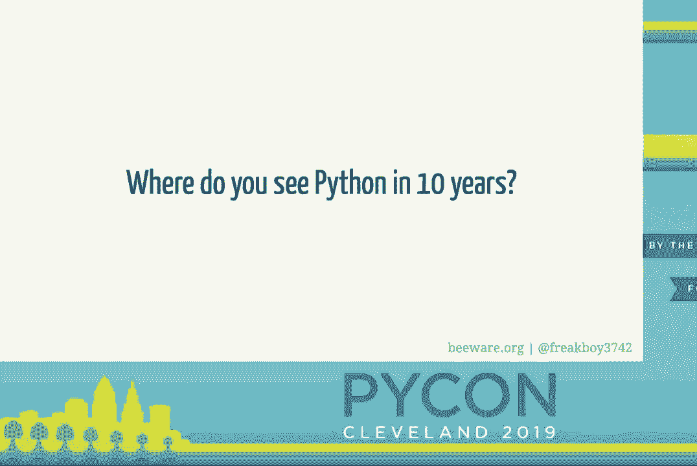

 And if I haven't convinced you about Python's future， maybe I've convinced you to come visit Perth。 We're a long way from everything， but I promise we're worth it。 Not all the animals will kill you。 For example， there is the happiest animal on earth， the Quaka。 [Applause]。 I only found on one island， Rottenest， about an hour by boat from Perth。

 I hope I see you there someday。 Thank you。 [Applause]， [Applause]， Thank you so much， Russell。 Another round of applause for Russell。 [Applause]， [Applause]， [Applause]， All right。 So that is our first keynote。 Thanks。 Once more to Russell。 We have a break until 10。50 this morning。 At which point talks will begin all throughout the talks。 We talked about earlier。

 Also at the same time， Charlie's in room 25C。 And all of those will run until 5。40 this afternoon。 At which point lightning talks will begin in this room at 5。40。 The art of Python is from 8 to 10 this evening in rooms 26A， B and C。 The open spaces。 we open until 11 p。m。 this evening。 So check those boards or check the site online。 And lastly。

 the evening dinner。 So if you have a ticket for that， make sure to show up。 There's nothing more that I had for you at this time。 Thank you and welcome to PyCon。 [Applause]。 (silence)。