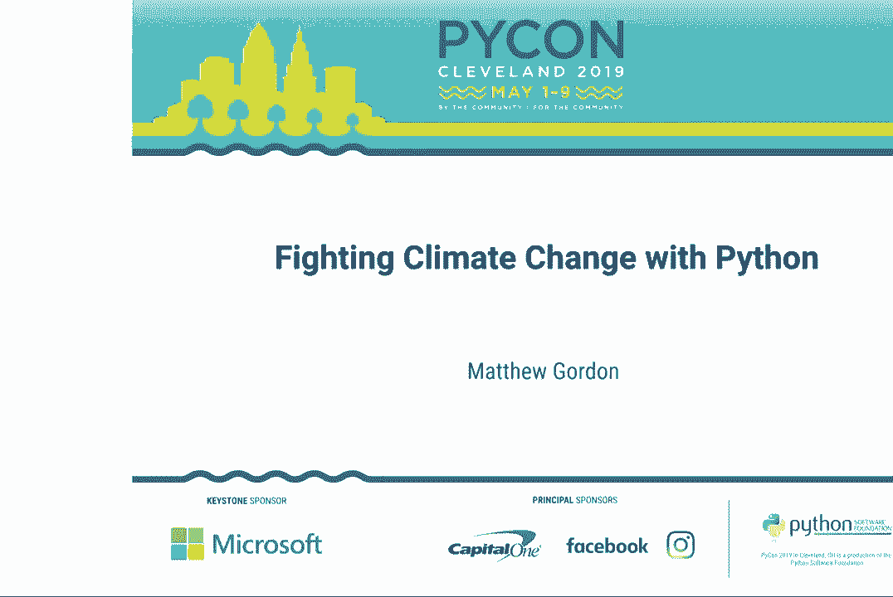
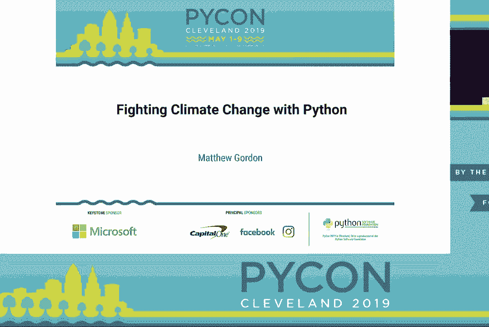
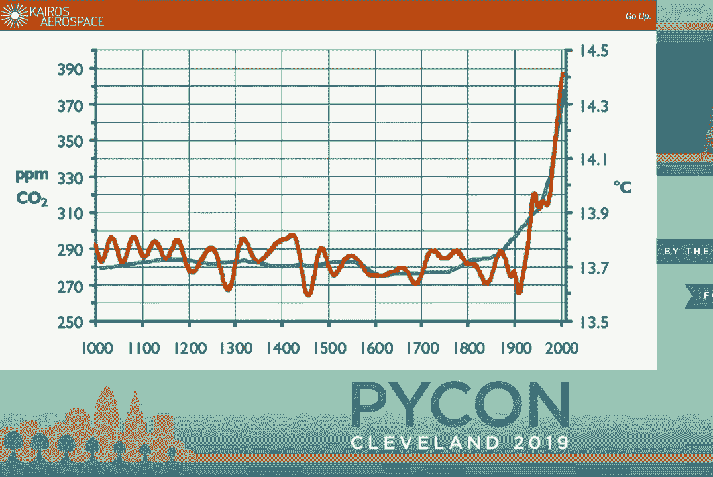
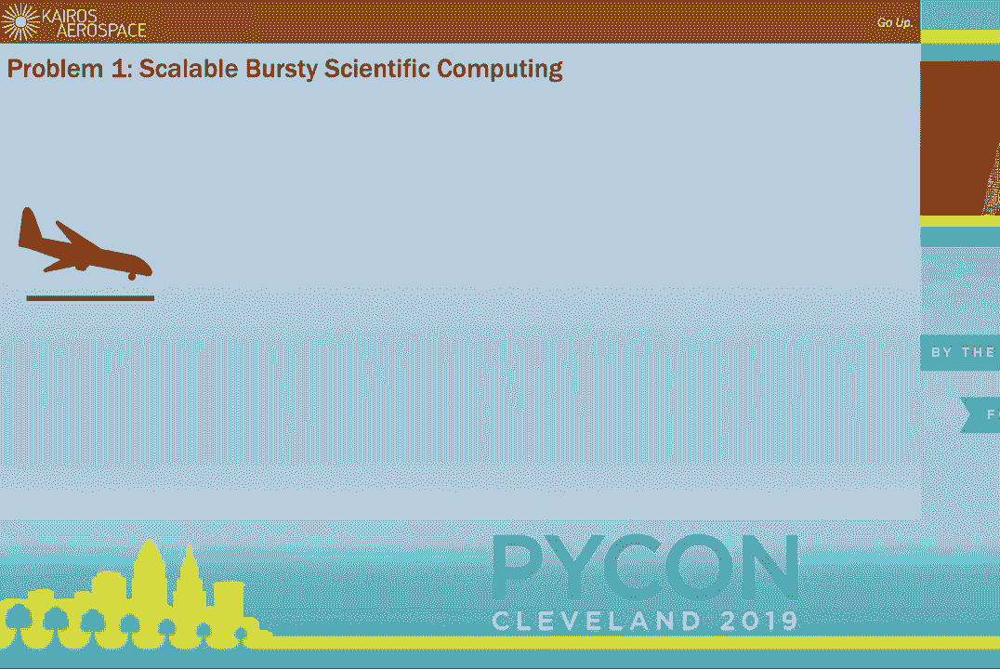
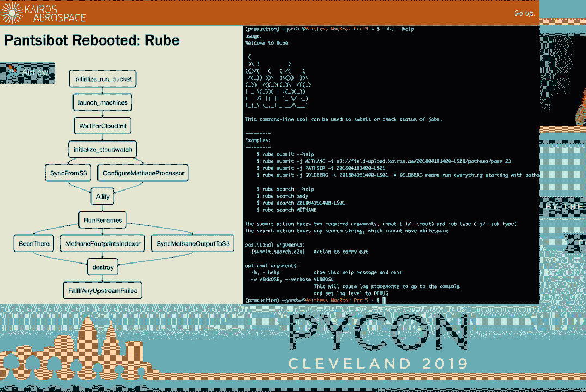
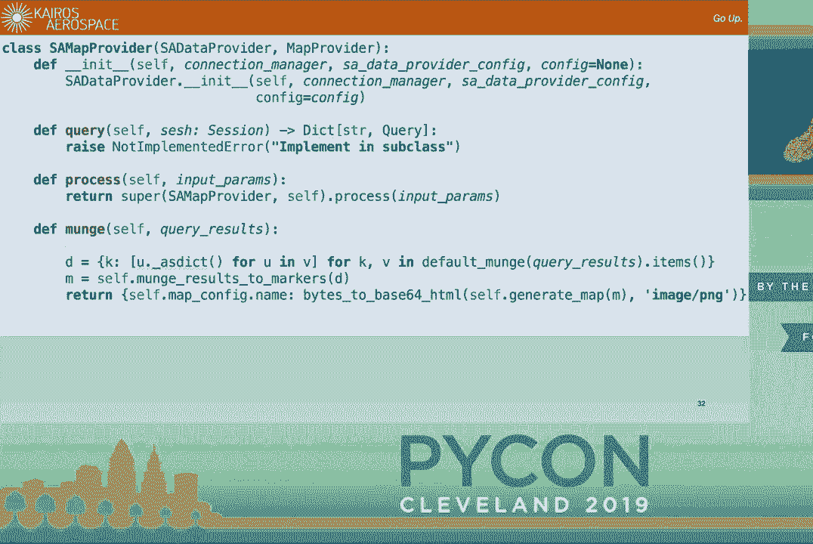
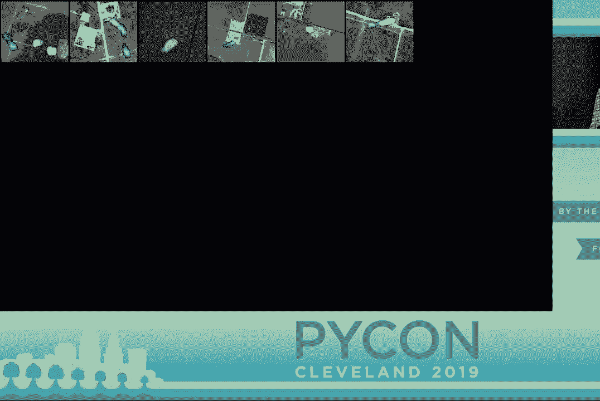
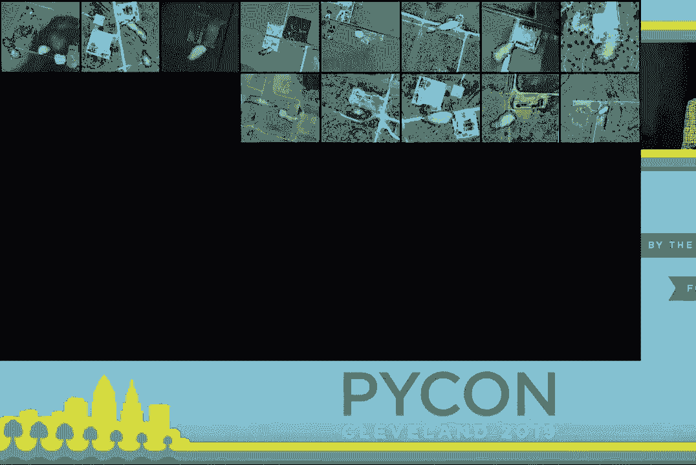
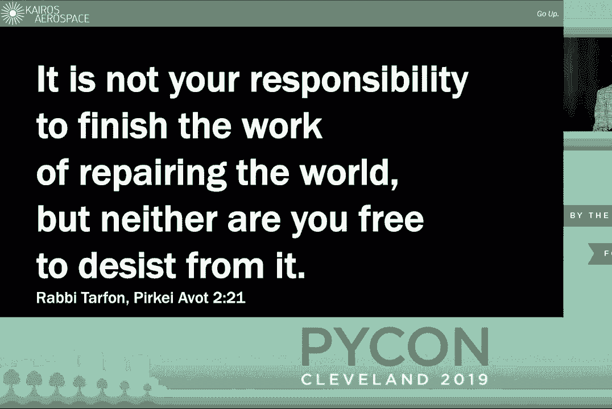

# P33：Matthew Gordon - Fighting Climate Change with Python - PyCon 2019 - leosan - BV1qt411g7JH

 Hello everybody， welcome back to the sessions。 Next up is Matthew Gordon。

 who's going to be talking about fighting climate change with。

 Python。 [Applause]， All right。 Hi， my name is Matt Gordon。

 I'm a software engineer at Kairos Aerospace。

 We're an 18-person shop in Mountain View， California， and we detect methane emissions。

 About three years ago， I had founded and then founded a startup， and I was taking some time。

 off and I was building weird Burning Man art and I was trying to figure out what I wanted。

 to do with my life。 And a friend of mine connected me with some physicists who were here at the University。

 of Michigan， and a friend of mine connected me with some physicists who were looking for。

 somebody to write physics code that didn't look like it was written by a physicist。

 So I got involved with Kairos because I was thinking to myself， well， I want to do something。

 that's physical， that affects the real world， that involves hardware。

 And I was thinking that the thing that was really most important for me right now is。

 climate change。 I'm going to make some jokey jokes。 We're going to have some fun up here。

 Before I do that， I do want to impress upon everybody here that this is deadly serious。

 On our current trajectory by 2050， we're going to see two to two and a half degrees of global。

 temperature change， and we're going to witness under that scenario， mass displacement of。

 100 million people worldwide。

 We have a pretty good idea why that's happening。 About 57% of that is due to carbon dioxide CO2 being released into the atmosphere from fossil。

 fuel use。 But about 14， 15% of that is from methane， CH4， which is the primary component of natural。

 gas。 And even though we emit a lot less of it， it is 60 times more powerful a climate change agent。

 per pound than CO2。 It is a cheap， clean， burning fuel。

 And it is so cheap and plentiful that when fracking， people tend to lose a lot of it。

 And whether or not it's a net benefit for climate change because it's clean burning depends on。

 how much of it we leak。 And it's very difficult for people to know how much of it we leak because it has been very。

 difficult to do surveys over very large areas until now。

 Natural gas and methane are odorless and invisible in their natural form。

 The rotten egg smell is actually put in there as a safety measure。

 So you occasionally see things like on the right here， that's a Liso Canyon in 2015。

 That's a natural gas storage unit that's being imaged with an OGI and optical gas。

 imager and it's just gushing gas into the atmosphere。 On the right you see Colorado。

 That's what happens when an uncapped pipe on a gas well leaks natural gas into the ground。

 which seeps into somebody's basement over a period of several weeks or months and their house explodes。

 So finding gas leaks is pretty important。 This is a really big problem in physical scale。

 It's typical for a company to manage maybe 10，000， thousands of wells。

 And it's typical to be able to send guys with a pickup truck out with that optical gas。

 imager to maybe one or two of these a day。 And so they do not get inspected very often and those inspections tend to happen randomly。

 because they don't know where to send the guys。 So we invented the leak surveyor。

 This is a picon so I'm going to gloss over the hardware a little bit but basically what you need to know。

 is we throw a bunch of optics and electronics into a fiberglass pod and we strap it to the bottom of the cessna。

 and we fly it over oil producing areas like the Permian Basin。

 The optical component is an optical spectrometer which basically looks at for absorption wavelengths of methane。

 There's a 6-axis GPS which tells us where we are and there is an optical camera which tells us what we're looking at。

 And we combine all that data using a metric that we develop to turn that into information that shows us where on the ground。

 the concentration of methane is。 Which is what you're seeing right here is multiple passes of us over the same facility seeing a leak。

 But the hardware is really only the beginning。 You need to take that data and in order to do something within the real world you need to get it off of an airplane into the cloud。

 You need to do a ton of crunching on it。 You need to turn it into a GIS product so people know what they're looking at and where。

 And you need to deliver that to people who can actually fix the leaks。

 So I want to talk about that entire arc how we get from sensor data to actually leak fixing。

 The first thing I want to talk about is what I call scalable bursty scientific computing。

 So how does it work？ We start， we land a plane in Midland Texas。

 First thing you have to do is figure out how to upload 100 gigabytes of data from Midland Texas。

 Once that hits S3 it sends off an SQS message which gets picked up by our cloud orchestration。

 It spins up a bunch of really big iron and it outputs that data to S3 where we pick it up in some apps that we developed for our analysts。

 Some of them build on QGIS which is a really great open source GIS toolkit。

 Some of them build on web apps and a lot of that stuff gets pushed into PostGIS。

 So one of the things that makes us different from a typical consumer facing application is that we do really big bursty computing。

 and then we get rid of all the servers。 So we treat our servers like cattle rather than pets when you're done with them just get rid of them。

 So we built an MVP because we figured the absolute critical thing that we needed to do was be able to run this end to end without any human intervention if we wanted to be able to scale up this process。

 So we built a job runner based on Ansible and I called it Ansible and then I thought pants were funnier so I called it pants about。

 So what does it do well？ Pants about was our first attempt at building a job orchestrator and it did a bunch of things really well。

 It had a REST API really simple front end that you could use so that human beings could run jobs。

 It accepted SQS incoming to start jobs。 Two of the things that it did that were really super critical to allow me to sleep at night。

 One of them was it had a really nice integrated end-to-end test suite。

 So Pants about could spin up a copy of itself and then run a branch of the pipeline including all the playbooks that specify the orchestration and all the software in a branch。

 Push that data to a scratch data store and then shut itself down and check that everything was sane and that nothing crashed。

 And that just helped make sure that everybody's gots fit into everybody's gazins after every code change。

 The other thing that it did was it had EDE testing。

 Sorry it was that it tracked when jobs failed and if the job failed abnormally it would wait 20 minutes and then it would kill the server which means that you are not just flushing AWS money down the drain。

 So it spits out all of its outputs to Slack。 I mean both this little bot called S3BO that translates your S3 URLs into actual web URLs which is super handy。

 What did it do badly？ There's a couple things。 Ansible is really good for infrastructure management。

 It is not fantastic for control flow。 And we were really abusing it basically。

 The other problem with it is that it had this top level view of the orchestration was really difficult to see all the jobs that were linked together in Pansabot。

 So I want to stop and talk for a little bit about what I call the software Jank life cycle。

 So what happens is you build something and you send it out to your users and you're like this is great and they're like this sucks and they start filing bugs on you。

 And that's when you approach that first peak there which is what we call max Jank。

 In aerospace they call max Q the point where the rocket is most likely to explode。

 Max Jank is the point where you and your software are most likely to implode because people are throwing bugs at you and you're trying to fix the engine while it's driving down the highway and you're getting really frustrated。

 Eventually hopefully you get past max Jank。 Everything calms down and everybody thinks everything is hunky dory so they start asking for feature requests。

 And as they start asking for feature requests and you start hacking them in you start realizing that you have built the entirely wrong thing。

 You didn't understand the problem you built a good first attempt and at some point what I call the the Jank Legrange point L Jank you reach a point where the amount of mental and emotional effort to roll back all the technical debt that you have just written yourself into is equal to the effort of building a new thing from the ground up。

 Usually you wait a couple months after that happens you ignore the feature requests for a while and then you build something new。

 So after we reach Max Jank and thereafter we built something called Rube。

 We called it Rube because all data pipelines are Rube Goldberg machines ours included。

 Rube fixes a lot of a lot of problems with pants about it does use Ansible at the very base level but basically it's using air flow and the operators are written in Python。

 So the operators are unit testable we retain all the end-to-end testing we get all the benefits of air flow which are this really nice job orchestration top view rerunning jobs becomes really easily rerunning parts of jobs becomes really easy。

 We also have a cli for searching through the data。

 One of the problems with pants about was just the log data was spread all over the place with Rube you can just basically pull up a webpage that has links to all of the logs all of the EC2 instances。

 What's really great about this is it reduces the burden on the pipeline support engineer which means that if you wrote the pipeline it is now possible to give somebody else the pager。

 And you don't have to spend your entire life building it and maintaining it。

 So that's really really nice is making it easy for other people to fix your mistakes。

 So the second set of problems that we have to do is figure out where are we going to figure out what's on the ground where we were on the ground and how we're going to create GIS product out of that。

 So I told you we have a six axis GPS。 Those six axes are the three rotational axes the roll pitch and yaw of the airplane。

 And combined with those we know the latitude， longitude and altitude of the airplane and we can figure out where the sensor was pointing。

 So the sensor itself is a line sensor so if you see the plane doing what we call the lawn mower here it goes back and forth and back and forth and back and forth。

 And it sweeps out a polygon each time it goes one direction and then it sweeps out another polygon when it goes back the other way。

 So what we want to be able to do is we want to be able to separate out those polygons into individual pieces that we're going to crunch data over。

 We want to make sure that if we're covering the same point twice that we're not averaging together that we're creating separate pieces of data so that we can view that place a couple times to verify our observations。

 And also the turns produce really bad data because the airplane is banking and the sensor is basically pointing off towards the horizon。

 You don't want to use any of that data。 So this is a classic classification problem。

 So we threw it into Scikit Learn and we chose the K-means clustering algorithm。

 Basically put a bunch of variables in there and we figure out can we cluster these into different groups that represent passes and turns。

 Different sets of variable groupings。 One of the really things I love about Scikit Learn especially if you're a casual ML user like me is you just tattoo and samples kind of end features on your arm and then you just like iterate through algorithms until you find something that works。

 But it turns out if you're going to be doing simple ML with simple ML algorithms it pays to put a lot of thought into what your input variables are。

 And at this point it actually was really valuable that I had some experience hang lighting oddly enough and I had a pretty good gut instinct about what a banking turn looks like。

 So the variables I chose included like time derivative of the yaw， the time derivative of the speed。

 the role of the airplane and the pitch of the airplane。

 And we threw those in there and we mixed it up I did a little bit of tweaking and it bizarrely came out with like a really good result the first time we started running it in production。

 About 90% of the time you get really good separation of that pass into polygons。

 You can see at the bottom there some of these are split up。

 We do that to make the numerical averaging and the downstream processes easier。

 But basically 90% of the time it works great。 We dump all the results into a single page leaflet app that gets stored on S3。

 So the pipeline support engineer can pull it down and just do a visual check that make sure that the data processed correctly or in some cases didn't。

 We occasionally see catastrophic failure with this algorithm。

 The reason you see catastrophic failure is that occasionally due to outlier data the passes and the turns get mixed up。

 And I said the sensor is pointed off towards the horizon on those turns。

 That's why you're getting this big blown out thing。

 But you pull it up you open it in Jupyter Notebook you trim out the little pieces of data that are making the algorithm go crazy and you rerun it and it comes out well。

 And at the end of about a year of doing this you have a really nicely curated data set that you can use for training a supervised algorithm。

 So at this point neural networks all the way down we just picked up the scikit multi layer perceptron model。

 You put every single variable you have in it。 The main trick is to make sure that you normalize and whiten your variables correctly。

 But after you've done that neural nets are great。 They will choose whatever algorithm they can simulate in order to make your data look like the training set。

 And it worked really well。 This is now set it and forget it。 We never have to touch this thing。

 It's really good。 It is a really nice model for people who do casual machine learning like I do。

 You can start with really sloppy data。 You do about a 90% cut on it in order to get good labeling。

 You put about 10% human effort into it either your own or somebody on mechanical Turk or whatever。

 And then you push it into your supervised algorithm and you get really nice results out of the end。

 So that was the second challenge。 One of the second challenges that we had to deal with was ground placement of the sensor data and how we separate that out。

 At this point the data actually has to make it into somebody's hands。

 So we have to return to the slightly less sexy topic of report generation。

 So when I started doing this I wanted to build a whiz bang data portal and people are going to be a log in and they're going to see their data and they're going to zoom around and climb on the ceiling。

 And then I remembered that people in pickup trucks have to drive out and actually figure out where the leaks are and fix them。

 And these are those guys。 So they do not want a data portal。

 They want a PDF with a list of lats and longs and pictures of the leaks and where to go to fix them。

 So naturally since this was absolutely mission critical for our company to get right。

 I spent about three weeks hacking together something jank-tastic before our first report was due。

 I wrote some SQL queries against our PostGIS database。

 One of the main problems is that nothing available in open source commercially on the market is GIS centric。

 And all of our data is GIS centric。 So we rolled something by hand。 It runs a bunch of queries。

 It has a map generator。 It dumps a bunch of stuff into an Excel spreadsheet。

 Our project manager had his own mail merge thing that he was going to use to get those into Google Docs。

 And immediately after the first report goes out， we say， "Okay， we want to change this。

 We want to change that。 We want to change that。" And it just becomes a recursive dumpster fire。

 Like the thing was a total mess。 And every Tuesday it was an epic battle of passive aggressiveness between me and the project manager about what we're going to put in features。

 This is the data's wrong。 I don't know what's going on。 We got to get it out the door。

 So the first thing that we had to do was actually settle what our business logic was。

 Now that all the dust had settled。 Very quick moment。

 I'm going to take a detour to tell you briefly about a -- I got sick of writing flowchart。

 So I wrote a Python module for making flowcharts in Jupyter。 It's called "Flegisten。

" It's a really nice wraparound graph。 It's available where you buy fine Python modules everywhere。

 And we decided to go back to the beginning。 And I started with a very simple concept for our report generator that was going to be robust and scalable and reusable。

 It was called the abstract data provider。 And the abstract data provider used a SQL alchemy。

 And it does two things。 Query and munch。 Query basically， when you override this。

 you give it a query method。 And that query method gets run and gets passed into the munch。

 And the munch munch is that data into whatever form you want for the output for your report。

 The default munch here is it basically just turns it into a dict of lists of tuples where each tuple is a row。

 And you can just push those into your template。 So the overall flow looks like this。

 Post just flows into SQL alchemy。 SQL alchemy creates a dict。

 Some of that gets stuffed back into Postgres so that we know what we reported to people。

 So we don't re-report the same things。 You'll find the shocking。

 but sometimes people don't fix things right after we tell them about them。

 That gets pushed into JINJA。 JINJA is a really nice templating library。 It consumes HTML。

 It pushes the HTML template， templated with the data out to docraptor。

 And docraptor produces a PDF for us。 Importantly， docraptor supports pagination in HTML documents。

 which a lot of PDF converters don't。 The very simplest version of this is called the default data provider。

 And in it， you just stuff a SQL query into the metadata。

 which is a comment in the beginning of the HTML file。

 along with the input parameters and some defaults。

 And then you get magically through the magic of machines， you get templated stuff out。

 But the nice thing that we have done is instead we build something that consumes SQL alchemy query objects that we build with the ORM。

 And these act like database views， except they are much less difficult to maintain than database views。

 And they are composable， which means that if I have a query that tells me， say。

 where all the leaks are， is unit tested， I know it produces correct data。

 And I can use it both to create a list of leaks and a map of leaks。

 by passing it into different data providers。 And this one in particular， the munch step。

 what it does， is it creates an image of a map and then stuffs that into the HTML as a base64 encoded data URL。

 It's just an embedded image of a map。 So you take the same data and you just push into different data providers to get different outputs。

 It means that things always self-consistent。 So where does that leave us up until now？

 Our first major survey took three months。 And we， if you think about the amount of C02 that a single person is responsible for over the course of a year。

 we mitigated about 2，000 person years of CO2 equivalents in methane。

 And we are now doing a survey ten times that size over the New Mexico-Permian basin。

 So we're hoping to do a lot more of that。 That's it。 And I can take questions。

 [applause]， [inaudible]， If there are any questions， you can come to this mic。

 If you have secret questions， I'll be available afterwards as well。 [silence]， Thank you。

 I'm curious when you know where the leaks are。 Are they easy to fix？

 It depends on the reason for them。 Some of them are what they call fugitive emissions。

 which are actual leaks where somebody， for instance， left a hatch open or there was a seal broken。

 Some of them are， they tell us， "Yeah， we know about that。" Those are due to capacity issues。

 It gets complicated real fast。 [silence]， Hi， I'm curious。

 Have you ever flown over any massive cattle farms and detected a bunch of methane？

 You may be aware that in California， the largest source of methane emissions is agricultural。

 People think it's cowfarts。 It is actually cow burps。 [laughter]， We have seen agricultural methane。

 but it's not really a focus for us right now。 My understanding is that there's a substantial amount of methane within ice and as that melts。

 that's releasing it as well。 I'm curious if you have any plans to survey in arctic areas。 So。

 the issue of methane release from the permafrost is incredibly frightening。

 and I would encourage you to look at it。 If you don't know about it。

 it's going to create a positive feedback loop that will kill us all。 Sorry。

 I can't make jokes about everything， seriously。 No， we tend to be looking for。

 there is methane existing in the atmosphere at a low concentration。

 so we're looking at elevated concentrations of methane， so we have to subtract off the background。

 So， for things where basically an entire continent is being covered in excess levels of methane。

 you need to do that from a satellite， which eventually someday we will launch。

 but right now we are doing ground-based surveys。 Is any of the state of being fed back into the regulatory environment？

 We don't really work directly with a lot of regulators。

 We have in non-oil producing states for people who are looking at different kinds of industries。

 There's a lot of tension in our work between being able to provide services to oil industries and being able to provide security for their data。

 and we find that the most benefit that we can provide is by telling people where to go fix their leaks。

 Have you just considered using drones instead of planes of collecting the data？ Classic question。

 This is 2019。 Everybody wants to put it on his drone。

 We can cover 50 square miles a day with a Cessna。 Civilian drones are limited to line of sight and don't go up to 3。

000 feet AGL someday they will， and maybe we'll put them on drones。

 What information do you give to people who don't quite believe in global warming？

 To unanchor that bad information。 I don't talk to those people， honestly。

 I don't have people coming up to me being like， "I want to argue with you about global warming。

 and I wouldn't talk to them if they did。 It's not my job。"， First， thank you for your work。

 My question is related to the drones。 Have you considered crowdsourcing， maybe to private pilots？

 They could receive one of these sensor units and whenever they're all flying can set it to record？

 It's an interesting idea。 We actually don't own our own airplanes。

 We work with a company that flies for us， although we're tightly integrated with them， obviously。

 We have a relatively small number of sensors and we don't sell the sensors。

 We are a data sales company， which is a very different model。

 There are companies that have not the same but similar types of services and they sell hardware to people。

 Operating this kind of hardware on your own， it's just not something you want to do。

 You really want to have professionals doing it。 We don't have flight engineers in in Midland anymore。

 We have basically locals there who just run the thing， point and click off a laptop。

 but you can't really do it while you're flying a plane。 Hey， how's it going？ Thanks for the talk。

 I'm curious to hear if you have any ideas for how we can help you or how I。

 as an individual contributor on a Saturday， can help with this？ I have not thought about that。

 I will say this。 One of the things， I used to be a real language bigot and I grew up in。

 as an engineer， writing Java and my Python is super oopy and I type annotate everything。

 The thing that I have come to love about Python is not the mechanics of the language itself。

 but the people who work on it。 SQL alchemy is like my six team member。

 If anybody knows if Michael Barrie is here， please come find me and introduce me so I can buy him like six drinks。

 Building software that makes my life easier makes this possible。

 So thank you to all of you for doing that。 Honest to God。

 Being that it's your job to know about emissions and what lessening them will do for us in a positive way。

 but also knowing how bad it's gotten。 How do you maintain the positivity to continue this work？

 How do you take care of your mental health as a person who has to deal with greenhouse gas on a daily basis thinking about it？

 That is a really good question。 It does keep me up at night sometimes。

 I would say there's a couple answers that first is I make a lot of jokes。

 Second is we have not crossed the Rubicon yet。 It is still possible to turn things back。

 Second thing that you can do on your Saturdays is if you don't live in California or if you live in the less liberal parts of California。

 call your senator， call your congressman， tell them that you want to see some sort。

 I'm not going to advocate specifically for the Green New Deal because I haven't read enough of it。

 but you want to see climate change action taken。 You want to see it now and you want to see it done with our tax dollars because it's important。

 So we haven't really crossed the Rubicon。 Unfortunately。

 the third thing is that we post a lot of stuff on our Slack at work。 I don't read all of it。

 It's difficult。 I got a hard enough time。 I got two twin toddlers and I got to make this stuff work。

 I can't just bring myself down with that all the time。

 I know the outline is the problem and I'm probably not the best person to tell you what the latest and greatest is for that reason。

 Is that like a line that you have to draw for yourself outside of work that you don't read about climate change？

 No， I do read about climate change outside of work。 I just， I don't immerse myself in it。

 I make art， I raise my kids， I do my job nine to five。

 I'm hoping next year to come here and talk about my art a bit more because there's Python and art too。

 Thank you。 So my question is about the effort you went through to clean up the data to adjust for like the pitch and the role of the airplane。

 Did you consider handling that through hardware by having something to keep all the instruments level and flat when the airplane is turning？

 No， the thing is clamped onto the airplane and the mechanism by which it is clamped onto the airplane is regulated in most ways by the FAA。

 And sort of hardware feedback， I spent a long time as a physicist actually doing position driven。

 position control， feedback driven position control。

 That's something we want to do on an airplane in real time。

 It's much better to post process it out if you can。 Thanks。

 Somewhat obnoxious version of the same question。 Did you consider asking the pilot to tell you when they were turning？

 Yeah， but then you have to have a human being that are pushing a button every time as they're turning the aircraft。

 I mean， we would have to record that with the data and then use it in the processing step。

 It is just like every input has to be recorded and filtered through the pipeline。

 And if the pilot does it wrong， then you get screwed up and I trust the pilot a lot less than I trust Suck it learned。

 You're working with oil and gas companies。 What's their attitude towards climate change？

 It varies greatly。 There is something right now， as of about a year ago called the OGCI。

 the Oil and Glass Climate Initiative， believe it or not， all the oil majors are in it right now。

 And one of the reasons that they are looking at methane is because methane is a win-win-win。

 It is a product for them。 It is really bad for global warming。 It is bad for safety。

 It is bad for just about everything。 And they can work on methane without having to make any compromises on CO2。

 And the question about how we regulate CO2 emissions is again one that I encourage you to call your Senator and your Congressman。

 But in terms of methane， there's a lot of interest in movement。 Since I have just a minute left。

 there was regulation under the Obama administration to regulate methane emissions。

 The Trump administration rolled that back。 But everybody sees the writing on the wall and no methane regulation is coming。

 So we are working to make sure that this technology is going to be palatable to regulators by creating equivalency standards that let people understand mathematically why this is a good thing to do。

 So obviously the company's business depends a lot on the cost of the natural gas。

 And I'm curious outside the US to work with other oil producers in the outside of the US who where the natural gas price might be higher and make more incentive for your company to provide your service。

 I don't know that much about natural gas economics。

 Oil is one of the most fungible things there is out there。

 Natural gas is pretty plentiful because of fracking。 We've worked in Canada。

 There is a lot of weird economics of natural gas like how much equipment you have to have on the well pad in order to ship it off in order to make it profitable。

 In some cases it gets cheap enough like in North Dakota where people just flare it off。

 It's better to flare it off than it is to let it escape into the atmosphere。

 That video you saw was guys relighting flare stack that went out。

 And that shouldn't happen but it does and we detect those。

 So the answer is I don't really know how the economics of natural gas in other countries work but we have certainly been invited to fly in other countries but there is a ton of work to do in the New Mexico and Texas-Permian basin right now。

 Hi， no we're running out of time so I'm going to try sorry for the hard question but as I'm sure you know the UN climate report said that we have something like less than 12 years now before climate change becomes irreversible。

 So we're in basically the 12th hour for Earth as we know it。

 So just wondering what advice would you give us as programmers and data scientists and computer scientists。

 What types of things do you think we should be working on？

 I really wish I had a good answer for you。 It is a difficult problem and like I live and work in San Francisco and the Silicon Valley and you people who are from there and people who have watched the TV show probably are aware that everybody thinks that their work is changing the world。

 and that software has actually fairly limited capabilities of making an impact on fundamental physics。

 I wish there was code we could write to fix this。 We need to do with what we can。

 You need to call your senator and your congressperson。

 Thank you very much for attending the next speaker starts in this room in 10 minutes。

 (applause)。

 (applause)。