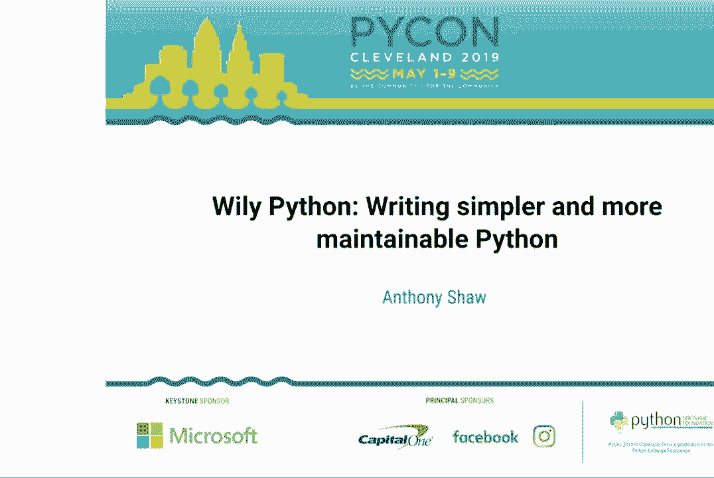
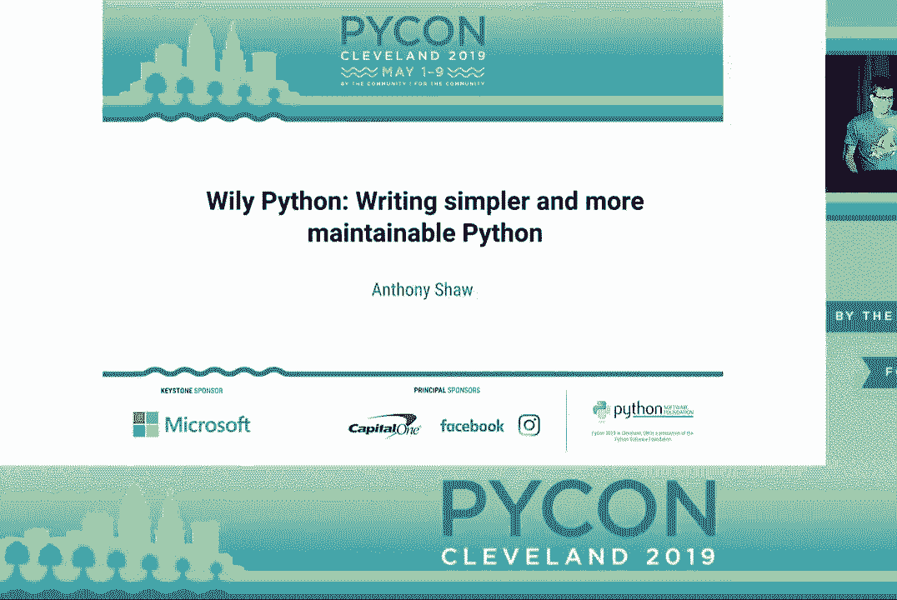
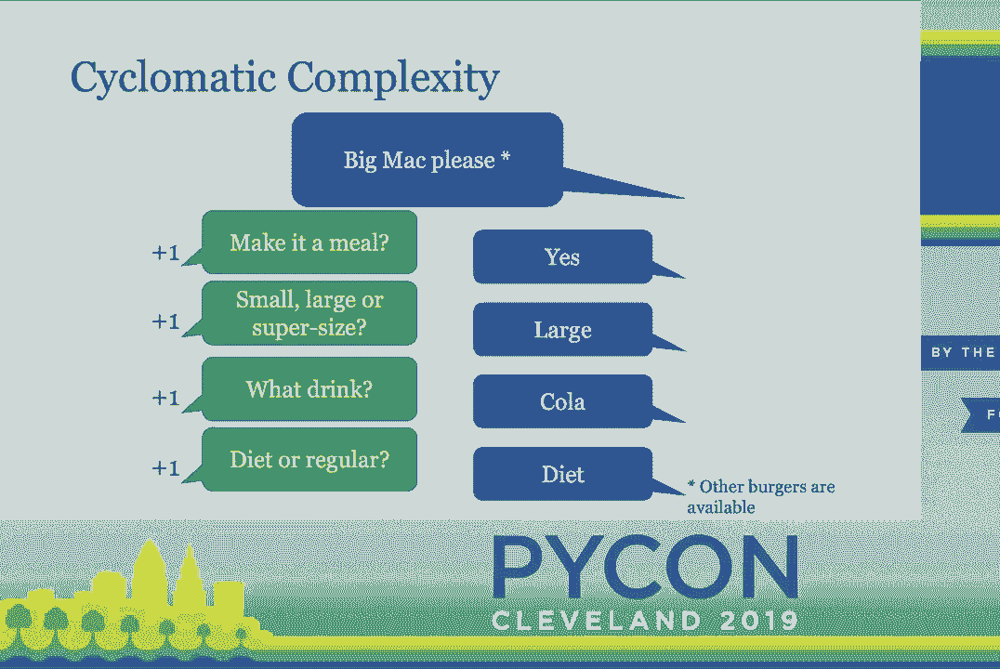
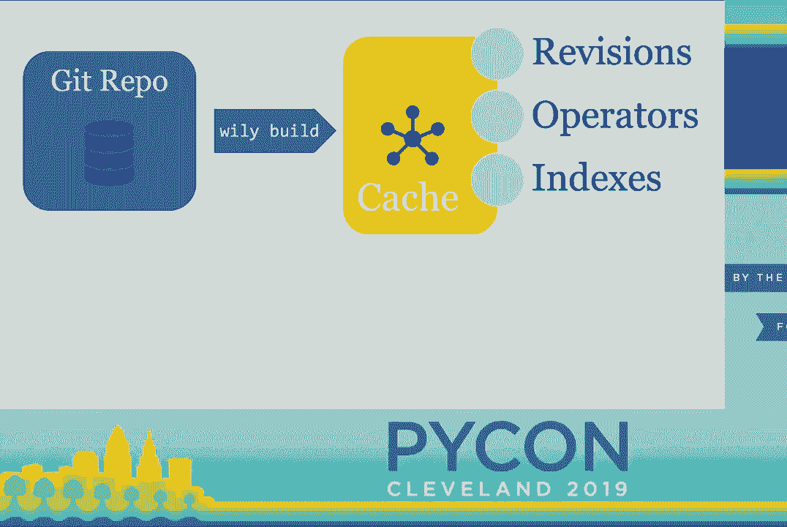
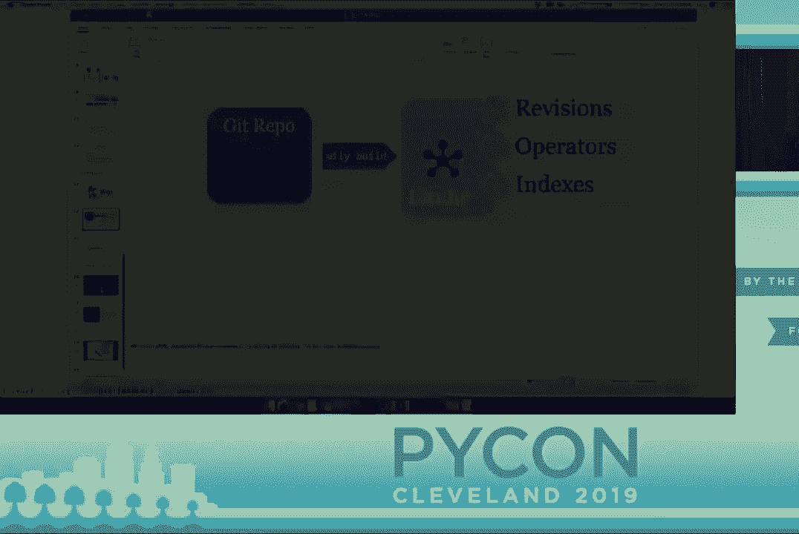
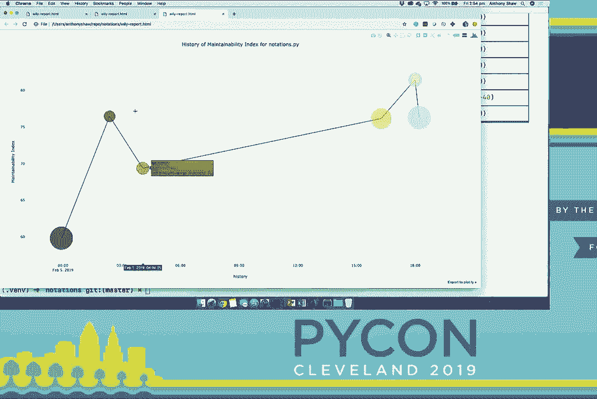
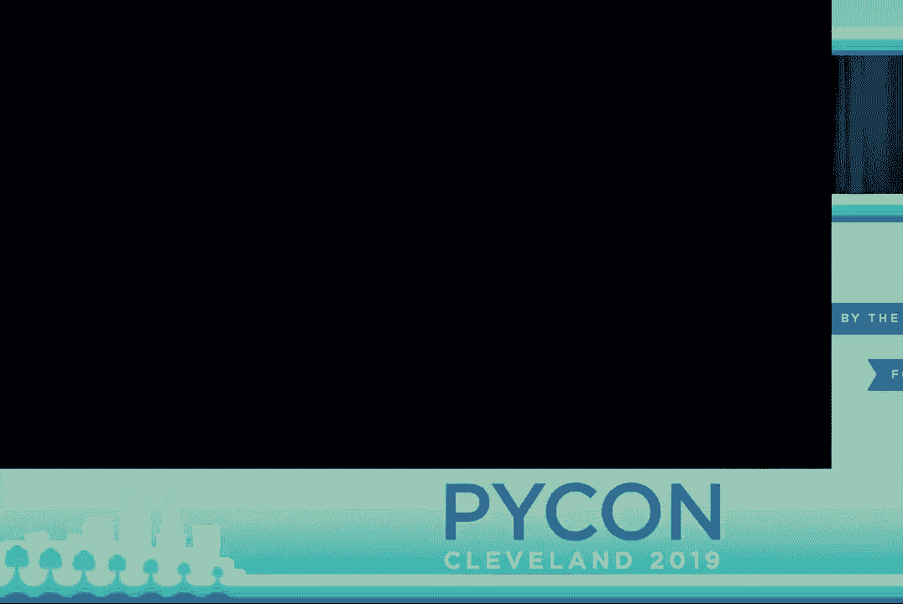
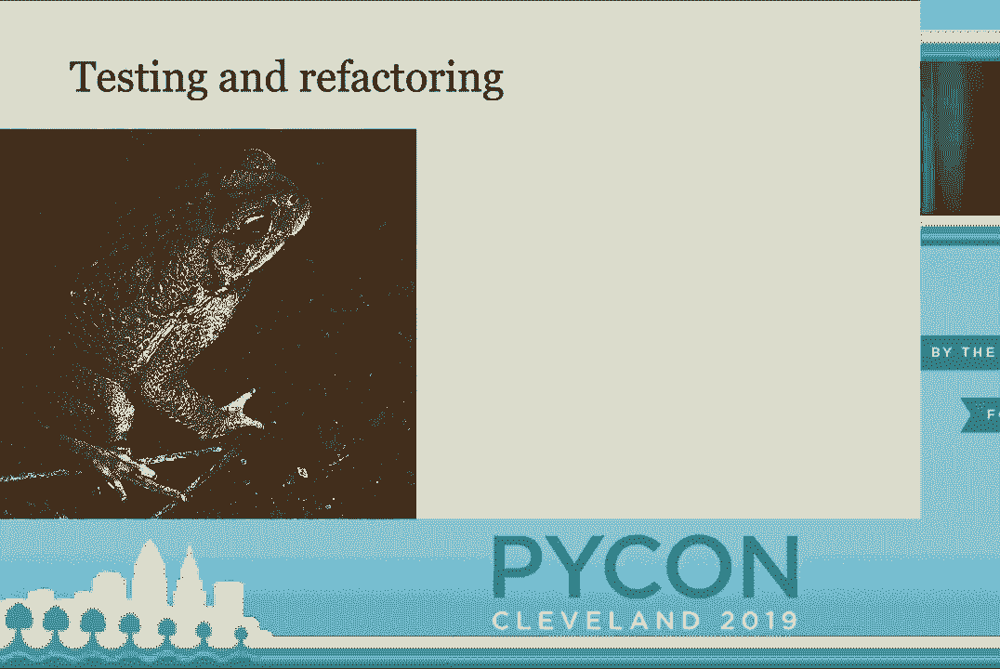
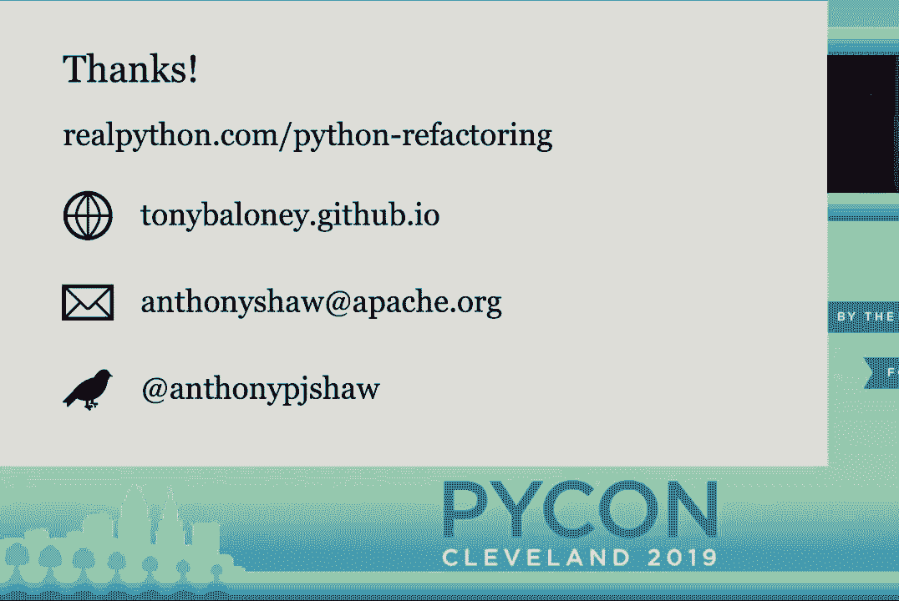

# P34：Anthony Shaw - Wily Python - Writing simpler and more maintainable Python - PyCo - leosan - BV1qt411g7JH

 Hello everybody。 The next talk is Wild Python， Writing Simpler and More Maintainable Python。

 by Anthony Shaw。 [Applause]， Hi everybody。 My name is Anthony Shaw and I'm giving a talk about simplicity and trying。

 to write more simple Python。 This is my first time speaking at PyCon。 I'm super nervous。

 and I was researching some tips about public speaking for this kind of event。 I found three， rules。

 Rule number one was to have frequent pauses。 Rule number two was to never start， with an apology。

 And then rule number three was to never thank people for coming to your。

 talk and just assume that they're here to listen。 So thank you for coming。

 We've got a lot to get through so I'm going to go quickly so， I apologize for that。

 And we're going to talk about code complexity today。 So what does， that mean？

 How would you inspect if your code is complicated？ And then we're going to look。

 at not really just how is your code complicated but how do you actually measure that？ Because。

 everybody thinks that they write simple code because it makes sense to you。 But it's more。

 about communicating with other people and sharing your code and your ideas with others。 So we're。

 going to talk about code metrics and we can then talk about how do you actually simplify。

 the code once you realize whether or not it's complicated。 The title of the talk is about。

 Wily Python。 So I'm going to introduce a talk called Wily which I wrote which basically。

 helps you manage this process of understanding whether your code is complicated or not by。

 what measure and how do you simplify it and then basically doing that in a loop。 I know。

 there's probably quite a mixed audience here today so in terms of the complexity of the。

 talk itself this has got a matter。 The first section is really kind of a beginner level。

 and then the second part is intermediate to advanced。 If anyone has any questions please。

 come and speak to me afterwards and if we get time later in the talk we can open up for， the Q&A。

 Also I've written an extensive article on RealPython。com which takes about an hour。

 and a half to read so it's probably one of my shorter articles。 So I encourage you to。

 read that because there's a lot more detail in that post。 I now need to convince everyone。

 that simple code is good so why should you care if your code is complicated or simple。

 So remember that your code is written not just for computers it's written for humans and Python。

 especially is almost written in a language that's easy for people to understand and when。

 you write an application in code you're leaving instructions for the computer but also for。

 your fellow developers。 So not just in code comments but in the actual code itself in。

 the way you name your functions， your classes， your variables， the way you structure it， it。

 should be a set of instructions for people。 So it should be clear that what you're trying。

 to achieve and what you're trying to do with the code which is why you want simpler code。

 rather than more complex code。 Also code is a living thing it changes often。 So if your。

 code is complicated to understand when people want to make changes to it they're more likely。

 to misunderstand what it was you were trying to do and introduce bugs。 So you want simple。

 code because it's easier to maintain the code it's easier to adapt the code and it's easier。

 to add more functionality。 And then lastly complicated code is hard to test and testing。

 is good hopefully we can all agree on that。 So you want simple code so that you can test。

 it so that people can understand it and so that you can adapt it over time。 So how do。

 you measure if code is complicated？ So this really really simple sample uses the crudest。

 measure for measuring the size of code and that is the lines of code。 It's really easy。

 to calculate the number of lines of code we have in this application and in theory you。

 want fewer code so you want fewer lines of code。 But I can represent that same code example。

 in fewer lines of code but there's one massive issue with this example。 So I've used a few。

 funky Python syntax here。 It basically does exactly the same as this but it's on three。

 lines so there's less code so that should be a good thing。 But as Tim Peters famously。

 said readability counts。 So lines of code is not really a measure of complexity but more。

 about volume you're really looking at how big the application is and encouraging people。

 to write less code can actually encourage the wrong behavior because people end up condensing。

 stuff down to a point where it's less readable。 So lines of code doesn't really talk about。

 complexity it's just about volume and there are other measures you can use for complexity。

 One of those measures is called cyclomatic complexity and I want to explain it in terms。

 of ordering a burger at McDonald's at a drive-through。 So you start off with one decision which is。

 what you actually want to eat。 So let's say you want to eat a big mac and there are other。

 burgers available from other restaurants。 So you start off with a cyclomatic complexity。

 of one you've made one decision。 They then ask you do you want to make that a meal so。

 that increases the complexity by one。 They then say do you want what size do you want。

 that's another one what drink would you like and then if you want diet or regular coke with， that。

 So the cyclomatic complexity of ordering a big mac from Mac is five。 So if you imagine。

 you went to McDonald's and they asked you 16 different questions at which point would。

 you say it got really complicated。 So cyclomatic complexity is like this because when you're。

 trying to read a piece of code you've got to understand all the decisions and how they。

 get made。 And I picked this code example I apologize if it's a bit small。 This is actually。

 from the Python standard library in a module called local。py。 So every time in Python there's。

 an if an else if a for try statement it counts as increasing the cyclomatic complexity by。

 one because that's the decision that's got to be made in code。 So what does that have。

 to do with complexity well when you read this code sample and if I ask you to articulate。

 what this does you're not just reading down a set of statements you're actually looking。

 at each if block and thinking okay well what would that variable be if it's this and that。

 happens if it's this and that happens and you've got to store in your head basically like your。

 own value stack and start to evaluate the code whereas if it's just a series of flat statements。

 you can see one by one what that code does。 So this is a complicated piece of code it has。

 a high cyclomatic complexity it does take a bit of time to read and understand but there's。

 also I think an easier way to see cyclomatic complexity。 If you turn the code on its side。

 and then get a pen and draw a line around the white space you'll see this。 So I'd say。

 that instead of just trying to calculate cyclomatic complexity if your code looks like a mountain。

 range when you turn it on its side then it has a high complexity and also another quote。

 from Tim Peters flat is better than nested so flatter code is easier to understand is。

 easier to process and this example has a high complexity so you could walk into this and。

 think okay well let's just make it flatter and simpler but I think you're missing one principle。

 and that is there's actually wisdom in complicated code and I will talk about this as well so most。

 IDEs have a Git blame tool if you've ever used Git blame I've turned on Git blame on。

 the same module but just a few more lines down and you can actually see here who and when。

 and why each piece of code was changed and we've got changes from 19 years ago 15， 12。

 every time somebody adds has to fix an issue fix a bug at an edge case they go in and they。

 make that change so that's normally in the form of an if statement or a small change which。

 therefore increases the complexity of the code so just trying to charge in and say let's。

 just make this simpler you actually need to understand all the reasons why the code is。

 like the way it is。 The other thing you might miss is if you don't introduce this you could。

 introduce reintroduce bugs which have already been resolved and which could upset users so。

 to simplify what I've just said when you start off with a new application you typically have。

 a little amount of functionality and a few users so you should have a little amount of。

 code and a small amount of psychomatic complexity。 As you add more features you tend to write。

 more code so the lines of code measure will go up。 As you have more users you have to support。

 more edge cases more platforms more scenarios and you tend to increase psychomatic complexity。

 of the code as well and then the double whammy is when you've got a lot of users and a lot。

 of functionality。 So CPython itself is a good example it's used by millions of people and。

 it has a lot of users it's got a lot of functionality so it has a lot of complexity。 So if lines。

 of code and psychomatic complexity can't really be used as measures for big applications。

 what can you use instead。 So I'm going to talk about how Stedmetrics。 I do warn that。

 there's a bit of math in this section so if you feel like the math is a bit too complicated。

 or outside of your comfort zone don't worry there are tools that can calculate this stuff， for you。

 This metric has actually been around since 1977 predating Python and the research。

 behind it as well is very old by this point how many years is that 50 years and so the。

 research behind this is actually 50 years old just over 50。 Okay so let's introduce two， things。

 There's a value called operands。 operand is the sum of the values you've used and the。

 sum of the variables you've used so number one or a string constant would count as a value。

 and a name would count as a variable so if you add all of those up you get operands。

 If you add up the amount of built-in syntax you've used in the application that's called， operators。

 If you take the sum of the operators and the sum of the operands you've used you。

 end up with a measure called length and if you take the amount of unique operators you've。

 used and unique operands you've used you end up with a measure called vocabulary。 So this。

 probably sounds a bit complicated compared to lines of code which is quite an easy way。

 to measure things but there's reasons behind it。 So if anyone's familiar with the abstract。

 syntax tree it's basically what happens when your code is compiled is turned into a tree。

 and then it's interpreted as a tree。 So this simple code example I've got here with a function。

 with three statements I'm going to assign the value one to a variable called A I'm going。

 to increment that by one and assign it to a variable called B and then I'm going to return， B。

 So in the tree you've got the two assignments and then you've got the return statement。 In。

 the first assignment you've got the name which is the variable A and the number which。

 is the number one。 So everything in green would be added up and then everything in yellow。

 would be added up to give you operators and operands and then this is where it gets slightly。

 more complicated unfortunately。 We've then got volume and difficulty so you multiply the。

 length by a logarithm of the vocabulary to get volume which is better than lines of code。

 and then this one had me stumped for a while but basically it more or less tries to calculate。

 how you've reused code and how much code you've used to achieve something and then gives。

 you that as a variable with difficulty。 And then lastly you get effort which is a multiple。

 of both of those two things。 So all of that's very theoretical but basically there are。

 better ways of measuring the amount of code in an application and the amount of variables。

 you've used and the amount of syntax you've used。 So all these things are basically a way。

 of measuring the amount of code you have。 There's actually a better measure than this。

 Don't worry too much about the equation。 There's different versions of this equation but this。

 is called the maintainability index and the output is just a number from zero to a hundred。

 and it's a scale。 So if you run the maintainability index of your code it will just give you a。

 single number。 If that number is between zero and twenty five it means your code is， unmaintainable。

 It's a bit of a mess。 If it's between twenty five and fifty it would be。

 like my high school teachers say cause of the concern。 If it's between fifty and seventy。

 five that's realistically where most applications are but you can still definitely see improvement。

 And then if it's over seventy five I don't believe you。 So this is actually this metric。

 is actually used in Microsoft applications in Java applications as well and in Python。

 this is the equation we use in Wiley for calculating the index。 So if you don't want。

 to go and sit and calculate that by hand basically it's taking the house dead volume。

 the cyclomatic complexity and the number of lines of code。 So your maintainability index。

 is going to be lower if you've used a lot of code a lot of variables a lot of syntax。

 and a lot of nesting to achieve something。 That's when you're going to have something， in the red。

 So it's going to be in the green where you've got nice flat code you don't。

 have too many functions too many variables and there's not that much code volume so that's。

 where it's going to be in the green。 So you don't have to calculate this stuff by hand。

 you can use a package called radon。 On the command line you can run radon and then the。

 algorithm that you want to use a CC is cyclomatic complexity and you give it the file name you。

 want to run and it will basically calculate the number for you and give you that output。

 You can also do MI which is the maintainability index I just spoke about and it says that my。

 application was 87。42 which is pretty impressive but it's only four lines of code so that's understandable。

 And then lastly you can run how is the algorithm and it will give you all of the measures I。

 spoke about。 It also outputs another one which I've cropped from the image which is。

 actually the number of bugs it's spotted in your code。 How is it actually theorised that。

 you could calculate the number of bugs based on the amount of code but this theory was。

 50 years old。 So you've got the numbers you look at the numbers and you think okay that's。

 interesting。 I've got a vocabulary of nine and a calculated length of 20。26 one now。 So。

 does that tell you whether your code is maintainable or not？

 So really I was looking at this problem， and this is where I came up with Wiley。

 So Wiley is a tool that basically looks at the， way that the maintainability of your code the complexity of it changes over time。

 So it assumes， that your code is in a Git repository and it will go back through the Git history and。

 basically run complexity metrics over each revision and it will then store that in a flat。

 file database and it will let you query that and see trends of maintainability and complexity。

 in your code applications。 So I'm going to give you a demo of this。 And because I don't。

 trust live demos I'm going to do magic hands。 So the way that you run Wiley is you run Wiley。

 build and then give it the path to your application。 It will go and check out all the revisions。

 in Git and then basically go and run metrics over them。 So the house did metrics， the cyclomatic。

 and complexity metrics， lines of code， all of those sorts of things and put those in the， database。

 So it's quite straightforward to get started with Wiley。 It's also really useful。

 to test applications which I'll talk about later。 You can just type Wiley index and it。

 will give you a list of all the Git revisions that it's checked out。 And then when you run。

 Wiley report with the name of a file it will give you a table with some metrics in it。 So。

 each line is a Git revision and then if the complexity changed for any reason so the maintainability。

 index went down here you can see the amount that it went down and the cyclomatic complexity。

 increased。 So this is useful for basically looking at specific files and seeing how they。

 trend over time。 You can also use it as a pre-commit hook。 So when you're making changes to code。

 if you run Wiley diff it will actually go and show you how the complexity of the code。

 has changed for that particular file。 So if you use it as a pre-commit hook basically。

 when you run Git commit it will go and look at all the changes you've made in code and。

 it will print out to the screen whether you've made the maintainability of the application， worse。

 the cyclomatic complexity and it will give you that down to a function level。 So。

 in this case I've just added a test function called test8 which just adds a few lines of。

 code and another test case so it's going to go and print the information for me。 And。

 then lastly you can graph any of these metrics so if I were to graph my test file and I wanted。

 to look at the maintainability index over time then it's going to print that out for。

 me in an interactive graph and each point on the graph will actually be the Git revision。

 and the reasons why and also the author of the Git commit。 So this is a small toy demo。

 but for a big application you can use this let me try it for another one。 So I can see。

 how the maintainability index of my code has changed with each Git commit and then lastly。

 you can combine metrics together so if you wanted to look at maintainability index and。

 lines of code you can give it multiple measures and it will add a second metric as the bubble。

 size so I can basically look at how my code has changed over time。

 Okay so using Wiley you can track the complexity of your code and then you can start to refactor。

 it to make it simpler。 There's something else I wanted to point out which is that when you。

 start to look at complexity in your applications you're going to find that some of your modules。

 some of your files have a complexity which is far higher than some others and the reason。

 behind that is that complexity has its own gravity。 So if you've got a function which。

 you've started to add edge cases to as your application matures you're going to find yourself。

 adding more and more edge cases to that function。 If you've got what they call like a god class。

 or something or a module that basically ends up catching every kind of situation that will。

 draw more and more complexity。 So I wanted to point out this principle because I think。

 it's important when you start to refactor is that one of the things you need to start。

 to do is to spread complexity around your code， break it up and follow something called the。

 single responsibility principle。 The single responsibility principle is that any function。

 or any piece of code should have one responsibility。 You shouldn't have a piece of code which。

 is trying to achieve everything because then it becomes unmaintainable。

 it has too many characteristics， and it becomes very hard to test。

 This lovely creature is the cane code， there's anyone here， from Australia？ One at the back。

 You probably recognize it。 So the venomous cane codes were。

 introduced in 1935 to Australia in the hope that they would control the destructive cane。

 beetle population。 So why am I talking about this？ They turned out to be really bad at controlling。

 beetles but remarkably successful at reproducing。 They also have no natural predators in Australia。

 So basically they've infested Queensland， the northern state。 And the reason I point this。

 out is because when you're looking at refactoring code， if you don't have a good test suite because。

 I think the testing coverage of the cane beetle population was quite poor， there really wasn't。

 a good understanding of the complexity of the actual environment。 It just thought this would。

 be a quick fix and we could sort this problem out。 So high test coverage should be given。

 before you start refactoring any application。 However， high test coverage doesn't mean you've。

 checked all the behaviors。 So when you're looking at refactoring an application， you need。

 to understand all the ways in which the application can behave so that the new code behaves in。

 the same way as the old code。 Testing is one way to do that。 Another way is to help your。

 users to find the bugs for you。 And then lastly， one of the difficult situations you might。

 find yourself in is when you're refactoring actually coming across a bug。 And not just。

 a bug but a known bug and a bug that's expected。 So if anyone's ever faced this before， it's。

 one of the most fun and challenging things in refactoring。 It's where you've refactored。

 a code base and you've come across this and you think how could this ever work？ And you。

 realize it doesn't work and it has a side effect which makes something else work。 And。

 the only way to refactor it is to either reproduce the bug in your new code， solve the。

 problem and explain to all your users why you're breaking compatibility。 And there's a third。

 option but I don't know what it is。 So this is a tricky one to look out for but like I。

 say testing is critical。 So I guess in conclusion， Wily can benefit you in tracking complexity。

 in your code base and measuring that over time with the principle that you're going to， do。

 Complexity measures are long term。 Just calculating the complexity of your application。

 is interesting but the whole point is that you want it to improve。 And make sure you've。

 got good behavior or test coverage。 There are some tools you can use to do this。 Pytest。

 obviously is great as a test suite and there are some coverage tools for Pytest but they。

 just look at line coverage。 They don't actually look at the way you're testing different， behaviors。

 There are some automated tools to do that but really the best way to do it。

 is to look at features and functionality to describe those and make sure you're testing。

 each one of those features。 Refactor often， this shouldn't be an annual event that you。

 sit down and say let's clean up our code base。 This should be something that's done frequently。

 And if you refactor your code often， you'll find that the amount of refactoring you have， to do。

 the amount of yak shaving， the amount of edge cases you have to deal with is far， smaller。

 So if you think about measuring complexity using a tool like Wiley and you。

 can see sprint by sprint or day by day how that is increasing or decreasing in your code。

 that should encourage your team to refactor。 And then lastly divide and conquer。 If you're。

 going to refactor any substantial code base， it can be very daunting at first。 Some of。

 my advice is to start with something small， start with something that's got good test。

 coverage and something that you can understand and refactor that one module first and then。

 work your way out from there。 Don't try and rewrite the entire code base in one go with。

 the intention of improving simplicity。 Everyone starts out with the best intentions but you。

 might find yourself with a population of cane toads。 So that really wraps up my talk。

 If you want to read more detail on techniques for refactoring， there's an article on real， Python。

com that I wrote to explain this。 If you want to check out my website， it's on， GitHub。

 If you have any questions and you want to email me， that's my email address。

 And if you want to tweet me， then that's my handle。 And we have five minutes remaining。

 for questions。 So thank you very much。 Anyone that has questions， please come to this microphone。

 There's actually a microphone back there too。 So go to any microphone。 >> What is Wiley？

 How do you get it？ Is that a product or？ >> It's a package on PIPI。

 So just pip install Wiley and you can run it on the command line。 >> Awesome。 Thank you。 >> Hi。

 The equation for the Halsted thing。 I can't remember what it's called。 There was。

 a constant in there。 There's like 171。 What was that？ >> I've got no idea。

 >> The examples that you showed with Wiley， they seem to operate on a single file。 Is。

 it possible to run it for an entire project？ >> Yeah。 I toyed with this。 But yes， is the answer。

 You typically give it the path to， your whole project。 And if you want to run a report on a folder。

 it will give you the， metrics for every single file or you can roll them up into a single metric。

 It's designed， for big applications。 But I just used it for a tiny sample。 Otherwise。

 it would take too， long to compile。 Thank you。 >> Great talk。 I love everything。

 I agree with everything you're saying。 How do you get， team buy in？

 >> I think if you look at the times when people have to make changes and they appreciate that。

 complexity makes it harder to make change。 If you pin them down then and see， see， this。

 is why we need simpler code。 I think that's probably the opportunity to do it。 If you。

 phrase it as a let's have a massive refactoring of our code base and you're basically going。

 to put yourself in a position where you're going to have unusable code or a branch that。

 doesn't compile or however you measure that for multiple sprints， that's a really hard， sell。

 So it needs to be a small piece of work。 >> Cool。 Thank you。 >> Cool。 >> Okay。 Thank you。 Thank you。

 Thank you。 Thank you。 Thank you。 Thank you。 Thank you。

