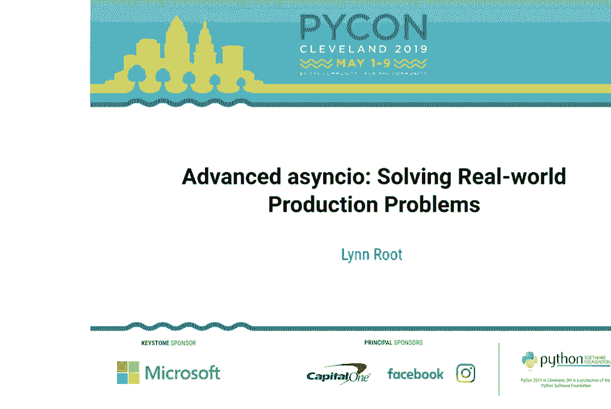
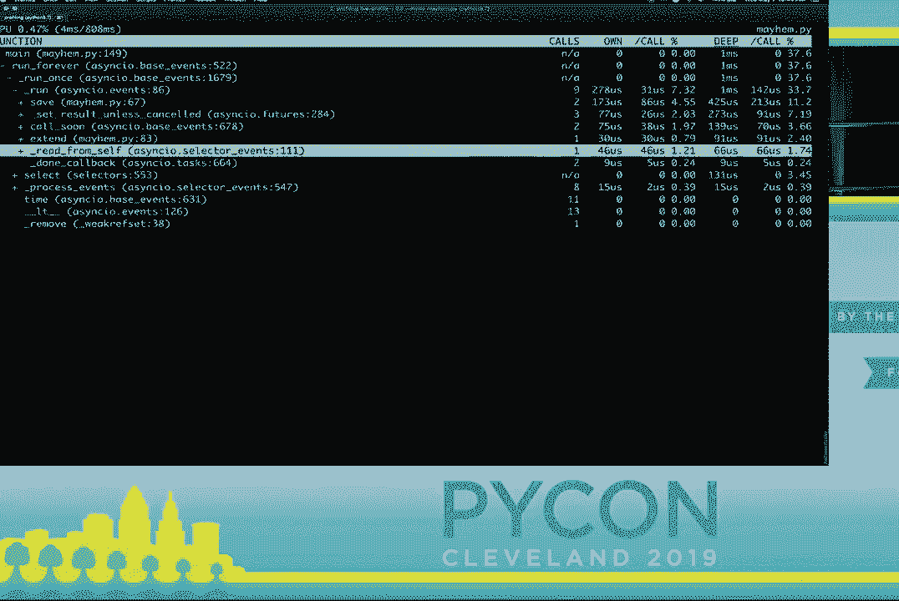

# P5：Lynn Root - Advanced asyncio - Solving Real-world Production Problems - PyCon 20 - leosan - BV1qt411g7JH

hello everyone how's everyone doing come，hello everyone how's everyone doing come。

on I need more energy this is only day，on I need more energy this is only day，two，two。

come on all right we've got a great talk，come on all right we've got a great talk。

this is advanced async IO solving，this is advanced async IO solving。

real-world production problems by Lind，real-world production problems by Lind。

root Lynn has requested that if you have，root Lynn has requested that if you have。

any questions please hold off and she，any questions please hold off and she。

can answer those questions in the hall，can answer those questions in the hall。

after the talk so without further ado，after the talk so without further ado，Lynne drew thank you。

Lynne drew thank you，the jam-packed room I feel like a lot of。

the jam-packed room I feel like a lot of，people have some real-world problems to。

people have some real-world problems to，solve so my name is Lynne root and。

solve so my name is Lynne root and，forgive me I have to do this because I'm。

forgive me I have to do this because I'm，kind of a nerd happy may the fourth be。

kind of a nerd happy may the fourth be，with you and so I'm a staff engineer at。

with you and so I'm a staff engineer at，Spotify for the past few months I've。

Spotify for the past few months I've，been building infrastructure to help。

been building infrastructure to help，support those that do some like machine。

support those that do some like machine，learning models to do digital signal。

learning models to do digital signal，processing so that's quite interesting。

processing so that's quite interesting，quite fun，quite fun，I'm also fossa Vangelis at Spotify I。

I'm also fossa Vangelis at Spotify I，help folks release their code under the。

help folks release their code under the，Spotify github organization and then you。

Spotify github organization and then you，might know me from PI ladies as well and。

might know me from PI ladies as well and，if you don't know about PI ladies we are。

if you don't know about PI ladies we are，a mentorship group for women and allies。

a mentorship group for women and allies，in the Python community and I encourage。

in the Python community and I encourage，you to go to our booth buy all the。

you to go to our booth buy all the，t-shirts so I don't have to take them。

t-shirts so I don't have to take them，home，home，um so this is the agenda for today it。

um so this is the agenda for today it，doesn't look like it but it's pretty。

doesn't look like it but it's pretty，jam-packed we're gonna be covering some。

jam-packed we're gonna be covering some，graceful shutdowns exception handling。

graceful shutdowns exception handling，and threading along with testing。

and threading along with testing，debugging and profiling and I think I'll。

debugging and profiling and I think I'll，probably use all of my time but it will。

probably use all of my time but it will，save the questions for the hallway。

save the questions for the hallway，either way this presentation is pretty。

either way this presentation is pretty，code heavy I will show this link at the。

code heavy I will show this link at the，end as well so don't worry but the。

end as well so don't worry but the，slides are there all right so let's get。

slides are there all right so let's get，to it，to it，a sync i/o the concurrent。

a sync i/o the concurrent，Python programmers dream the answer to。

Python programmers dream the answer to，everyone's prayers right the module。

everyone's prayers right the module，itself has a lot of layers of，itself has a lot of layers of。

abstraction allowing developers as much，abstraction allowing developers as much。

control as I need and are comfortable，control as I need and are comfortable。

with simple hello world like examples，with simple hello world like examples。

can show how simple it is but it's very，can show how simple it is but it's very。

easy to get lulled into a false sense of，easy to get lulled into a false sense of。

so we're led to believe that we were，so we're led to believe that we were。

able to do a lot with the structure at a，able to do a lot with the structure at a。

sink and a weight API layer some，sink and a weight API layer some。

tutorials well great for the developer，tutorials well great for the developer。

to get their toes wet try to illustrate，to get their toes wet try to illustrate。

real-world examples but they're just，real-world examples but they're just。

beefed up hello world examples，beefed up hello world examples。

some even misuse the async i/o interface，some even misuse the async i/o interface。

allowing one to easily fall into the，allowing one to easily fall into the。

callback through the callback hell that，callback through the callback hell that。

we're familiar with and then some I get，we're familiar with and then some I get。

you easily up and running with async i/o，you easily up and running with async i/o。

but then you may realize that you're not，but then you may realize that you're not。

really doing it correctly or it's not，really doing it correctly or it's not。

exactly what you want or it only gets，exactly what you want or it only gets。

you part of the way there so while some，you part of the way there so while some。

tutorials will walk through and do it a，tutorials will walk through and do it a。

lot to improve upon the basic like hello，lot to improve upon the basic like hello。

world use case it might still be just，world use case it might still be just。

like a web crawler and I'm not sure，like a web crawler and I'm not sure。

about others but I'm not building web，about others but I'm not building web。

crawlers at Spotify I'm sure I build a，crawlers at Spotify I'm sure I build a。

lot of services that have have to make a，lot of services that have have to make a。

lot of HTTP requests that should be，lot of HTTP requests that should be。

non-blocking but these services of mine，non-blocking but these services of mine。

they also need to react to pub/sub，they also need to react to pub/sub。

events to measure progress of actions，events to measure progress of actions。

initiated from those events to handle，initiated from those events to handle。

any incomplete action or other external，any incomplete action or other external。

errors deal with pub/sub lease，errors deal with pub/sub lease，management and measure service level。

management and measure service level，indicators and then send metrics and。

indicators and then send metrics and，sometimes I need naane sikki Oh friendly。

sometimes I need naane sikki Oh friendly，dependencies so for me my problem got。

dependencies so for me my problem got，difficult quickly and I'm so allow me to。

difficult quickly and I'm so allow me to，provide you with a real bowl example。

provide you with a real bowl example，that actually comes from the real world。

that actually comes from the real world，and I recently had Spotify actually a。

and I recently had Spotify actually a，few years ago at Spotify and we built a。

few years ago at Spotify and we built a，service that does periodic hard restarts。

service that does periodic hard restarts，of our entire fleet of instance。

of our entire fleet of instance，and that's what we're gonna do here has。

and that's what we're gonna do here has，anyone heard of that chaos monkey yeah。

anyone heard of that chaos monkey yeah，alright so we're gonna build a service。

alright so we're gonna build a service，called mayhem mandrel and it will listen。

called mayhem mandrel and it will listen，for a pub/sub message and then restart a。

for a pub/sub message and then restart a，host based off of that message and as we。

host based off of that message and as we，build this service I'll point out some。

build this service I'll point out some，best practices that I have learned along。

best practices that I have learned along，the way slash traps that I've fallen。

the way slash traps that I've fallen，into and this will essentially become。

into and this will essentially become，the type of resource that pass Lin would。

the type of resource that pass Lin would，have wanted about like three years ago。

have wanted about like three years ago，and so we're gonna start off with some。

and so we're gonna start off with some，foundational code we're gonna write a。

foundational code we're gonna write a，simple publisher and here's we're gonna。

simple publisher and here's we're gonna，start we have a simple while true loop I。

start we have a simple while true loop I，you a unique ID for each message to。

you a unique ID for each message to，publish to our queue I want to highlight。

publish to our queue I want to highlight，that we're not using the wait on the。

that we're not using the wait on the，acute output of a message we're using a。

acute output of a message we're using a，single create task because it will。

single create task because it will，actually schedule the care routine on。

actually schedule the care routine on，the loop without blocking the rest of。

the loop without blocking the rest of，the for loop，the for loop。

the create task method returns a task，the create task method returns a task。

but we essentially are using this as，but we essentially are using this as。

like a fire-and-forget mechanism if we，like a fire-and-forget mechanism if we。

have the await here everything after it，have the await here everything after it。

would be a block within this cover team，would be a block within this cover team。

it isn't necessarily an issue for our，it isn't necessarily an issue for our。

current set up though it would be if we，current set up though it would be if we。

were to limit the size of our queue we，were to limit the size of our queue we。

would be awaiting on space to free up，would be awaiting on space to free up。

but we will just stick with the create，but we will just stick with the create。

task method so now that we have a，task method so now that we have a。

publisher co-routine function we now，publisher co-routine function we now。

need a consumer so this is our consumer，need a consumer so this is our consumer。

for the published message messages it's，for the published message messages it's。

still it's kind of similar to the，still it's kind of similar to the。

publisher itself we do have a while true，publisher itself we do have a while true。

loop but then we await on the q4 message，loop but then we await on the q4 message。

we don't want to create a task out of，we don't want to create a task out of。

queue duck yet because it doesn't really，queue duck yet because it doesn't really。

make sense to block it makes sense to，make sense to block it makes sense to。

block the care routine too because you，block the care routine too because you。

can't really do much without a message，can't really do much without a message。

itself um I want to highlight again that，itself um I want to highlight again that。

we're only blocking within the scope of，we're only blocking within the scope of。

a consumed care routine and we're not，a consumed care routine and we're not。

actually blocking the event loop or any，actually blocking the event loop or any，other，other。

tasks or care routines that are，tasks or care routines that are。

scheduled so now we're going to replace，scheduled so now we're going to replace。

a sync i/o dot sleep with a function，a sync i/o dot sleep with a function。

that will restart a host I'm sure it，that will restart a host I'm sure it。

looks like I'm just pushing the，looks like I'm just pushing the。

simulation of i/o work to restart house，simulation of i/o work to restart house。

function but in doing so I'm actually，function but in doing so I'm actually。

able to create a task and out of that，able to create a task and out of that。

I'm therefore no longer blocking on，I'm therefore no longer blocking on。

waiting for more messages we may also，waiting for more messages we may also。

want to do more than one thing per，want to do more than one thing per。

message for example in addition to，message for example in addition to。

restarting a host maybe we'd like to，restarting a host maybe we'd like to。

store that message in a database for，store that message in a database for。

potentially replaying later on so we'll，potentially replaying later on so we'll。

make use of a single create task again，make use of a single create task again。

for saving the for the save cover team，for saving the for the save cover team。

to be scheduled on the loop and，to be scheduled on the loop and。

basically like checking it over to the，basically like checking it over to the。

loop to execute for when it can so in，loop to execute for when it can so in。

this example the two tasks of restarting，this example the two tasks of restarting。

and saving don't necessarily depend on，and saving don't necessarily depend on。

one another and I'm completely，one another and I'm completely，sidestepping the concern that if we。

sidestepping the concern that if we，should we start a host if we can't save。

should we start a host if we can't save，a message but maybe you do want your。

a message but maybe you do want your，work to happen serially maybe do not。

work to happen serially maybe do not，want to have concurrency for some。

want to have concurrency for some，asynchronous tasks so for this instance。

asynchronous tasks so for this instance，maybe you want to restart hosts that。

maybe you want to restart hosts that，only have an uptime of more than seven。

only have an uptime of more than seven，days just like you should check the。

days just like you should check the，balance of your checking account before。

balance of your checking account before，you actually debit it so needing code to。

you actually debit it so needing code to，be serial to have steps or dependencies。

be serial to have steps or dependencies，it doesn't mean that you can't be。

it doesn't mean that you can't be，asynchronous the wait last restart date。

asynchronous the wait last restart date，will yield to the loop but it doesn't。

will yield to the loop but it doesn't，mean that restart host will be the next。

mean that restart host will be the next，thing that the loop executes it just。

thing that the loop executes it just，allows other thing other things outside。

allows other thing other things outside，of that care routine to run so with that。

of that care routine to run so with that，in mind I'm going to put all this。

in mind I'm going to put all this，message related logic and a separate。

message related logic and a separate，care routine so we still don't block the。

care routine so we still don't block the，consumption of messages saving a message。

consumption of messages saving a message，didn't block restart host of needed so。

didn't block restart host of needed so，we're going to make that a task again。

we're going to make that a task again，and we're just going to remove the。

and we're just going to remove the，uptime check and a restart host，uptime check and a restart host。

indiscriminately because Yolo so we've，indiscriminately because Yolo so we've。

pulled a message from a queue and，pulled a message from a queue and。

found out work based off of that message，found out work based off of that message。

but now we need to perform like any，but now we need to perform like any。

finalization work from that message so，finalization work from that message so。

often with pub/sub technologies if you，often with pub/sub technologies if you。

don't acknowledge a message with a，don't acknowledge a message with a。

predefined within a predefined time，predefined within a predefined time。

frame it will get redeliver due for a，frame it will get redeliver due for a。

finalization task we should acknowledge，finalization task we should acknowledge。

that the message if you should，that the message if you should，acknowledge the message so it doesn't。

acknowledge the message so it doesn't，get redeliver to us so we currently have。

get redeliver to us so we currently have，a two separate tasks save and restart。

a two separate tasks save and restart，host and we want to make sure both are。

host and we want to make sure both are，done before the message is cleaned up。

done before the message is cleaned up，and we could go back to the sequential。

and we could go back to the sequential，await since they're a very direct way to。

await since they're a very direct way to，manipulate ordering but we can also use。

manipulate ordering but we can also use，sort of callbacks on a completed task。

sort of callbacks on a completed task，what we therefore want is somehow to。

what we therefore want is somehow to，wrap both tasks since we have to wait on。

wrap both tasks since we have to wait on，both and then do the cleanup and with。

both and then do the cleanup and with，that we can make use of async it dot。

that we can make use of async it dot，gather which returns a feature like。

gather which returns a feature like，object and with that future like object。

object and with that future like object，we can then attach a callback to it。

we can then attach a callback to it，and then we can just a wait on the。

and then we can just a wait on the，future itself and so when we run this we。

future itself and so when we run this we，can see that both the save care routine。

can see that both the save care routine，and the restart care routine are。

and the restart care routine are，complete and then the cleanup is called。

complete and then the cleanup is called，so I personally have an allergy to。

so I personally have an allergy to，callbacks and as well perhaps you want。

callbacks and as well perhaps you want，the cleanup to be non-blocking，the cleanup to be non-blocking。

so then here we can just await clean，so then here we can just await clean。

after the gather since the since it sort，after the gather since the since it sort。

of takes care of the order of operations，of takes care of the order of operations。

and it's so much cleaner，and it's so much cleaner，so a quick keeled er of that last。

so a quick keeled er of that last，section async IO is pretty easy to use。

section async IO is pretty easy to use，but it doesn't automatically mean that。

but it doesn't automatically mean that，you're using it correctly you can't just。

you're using it correctly you can't just，throw out around a sink and await。

throw out around a sink and await，keywords around your blocking code it's。

keywords around your blocking code it's，sort of like a mental paradigm shift you。

sort of like a mental paradigm shift you，have to think about what you can farm。

have to think about what you can farm，out as well as what you actually still。

out as well as what you actually still，need to be sequential，need to be sequential。

and so having steps within your code，and so having steps within your code。

like the first a and then B and then C，like the first a and then B and then C。

may seem like it's blocking when it's，may seem like it's blocking when it's，not sequential code。

not sequential code，can still be asynchronous for instance I。

can still be asynchronous for instance I，might have to call a customer service of。

might have to call a customer service of，my bank and I'm on hold and I can put。

my bank and I'm on hold and I can put，that down and put it on speakerphone and。

that down and put it on speakerphone and，then play with my super needy cat as I。

then play with my super needy cat as I，wait so I might be a single-threaded but。

wait so I might be a single-threaded but，I can still sort of multitask like CPUs。

I can still sort of multitask like CPUs，so often you'll want to you want your。

so often you'll want to you want your，service to shut down gracefully if it。

service to shut down gracefully if it，receives a signal of some sort you'll。

receives a signal of some sort you'll，probably want to clean up the database。

probably want to clean up the database，connections that you have stop consuming。

connections that you have stop consuming，messages finish the corresponding。

messages finish the corresponding，current request that you have all like。

current request that you have all like，not accepting new requests so if we。

not accepting new requests so if we，happen to restart our own instance of。

happen to restart our own instance of，our mayhem mandrel service we should。

our mayhem mandrel service we should，essentially clean up our own mess um so。

essentially clean up our own mess um so，here's a typical boilerplate code of。

here's a typical boilerplate code of，getting a service running we have a。

getting a service running we have a，queue instance and setting up the loop。

queue instance and setting up the loop，scheduling the publish and consume tasks。

scheduling the publish and consume tasks，and then start and then close the event。

and then start and then close the event，loop maybe even catch the keyboard。

loop maybe even catch the keyboard，interrupt exception so if we've run this。

interrupt exception so if we've run this，and as is and we give it the SIGINT。

and as is and we give it the SIGINT，signal we do see that we get into the。

signal we do see that we get into the，accept and finally block of those two。

accept and finally block of those two，log lines that we had but if we were to。

log lines that we had but if we were to，send another signal to our program like。

send another signal to our program like，sig term we can see that we don't reach。

sig term we can see that we don't reach，that finally clause that we have defined。

that finally clause that we have defined，here it should be pointed out that even。

here it should be pointed out that even，though even if we only care about the。

though even if we only care about the，keyboard interrupt or this again to。

keyboard interrupt or this again to，signal it could happen，signal it could happen。

outside of the caching of exception，outside of the caching of exception。

potentially causing the service to end，potentially causing the service to end。

up in incomplete or otherwise unknown，up in incomplete or otherwise unknown。

State so instead of catching keyboard，State so instead of catching keyboard。

interrupt let's attach a signal handler，interrupt let's attach a signal handler。

to the loop so we'll define we'll define，to the loop so we'll define we'll define。

a shutdown care routine that is，a shutdown care routine that is，responsible for doing all of our。

responsible for doing all of our，necessary shutdown tasks and here what。

necessary shutdown tasks and here what，I'm doing is simulating like closing the。

I'm doing is simulating like closing the，database connections returning the。

database connections returning the，pub/sub messages is not acknowledged so。

pub/sub messages is not acknowledged so，that they can be redeliver and not。

that they can be redeliver and not，dropped，dropped，and then collecting all the outstanding。

and then collecting all the outstanding，tasks its except for the shutdown task。

tasks its except for the shutdown task，itself and then canceling them and we。

itself and then canceling them and we，don't necessarily need to cancel the。

don't necessarily need to cancel the，pending tasks we could just allow them。

pending tasks we could just allow them，to finish as well and we may also want。

to finish as well and we may also want，to take this opportunity to flush any。

to take this opportunity to flush any，collective metrics so they're so that。

collective metrics so they're so that，they're not lost so let's then add this。

they're not lost so let's then add this，shutdown care routine to our event loop。

shutdown care routine to our event loop，the first thing we should do is to set。

the first thing we should do is to set，up our loop and then add the signal。

up our loop and then add the signal，handlers that we want to respond to and。

handlers that we want to respond to and，then we can remove that keyboard。

then we can remove that keyboard，interrupt catch so running this again we。

interrupt catch so running this again we，see that we do get to that finally。

see that we do get to that finally，clause as well as like the whole，clause as well as like the whole。

shutdown log lines that we see so you，shutdown log lines that we see so you。

might be wondering which signals to，might be wondering which signals to。

react to now and apparently there is no，react to now and apparently there is no。

standard basically you should be aware，standard basically you should be aware。

of how you're running your service and，of how you're running your service and。

handle it accordingly and it seems like，handle it accordingly and it seems like。

it could get a bit messy with conflict，it could get a bit messy with conflict。

conflicting signals especially when you，conflicting signals especially when you。

add docker into the mix so there's，add docker into the mix so there's。

another misleading API or a confusing，another misleading API or a confusing。

API at least for me a sink i/o debt，API at least for me a sink i/o debt。

shield now the docs say that it means，shield now the docs say that it means。

it's a means to shutdown or to shield a，it's a means to shutdown or to shield a。

future from being like cancellation but，future from being like cancellation but。

if if you have a curtain that must not，if if you have a curtain that must not。

be cancelled during shutdown async up，be cancelled during shutdown async up。

that shield will not help you at all and，that shield will not help you at all and。

this is because the tasks that that，this is because the tasks that that。

async i/o debt shield creates gets，async i/o debt shield creates gets。

included in async i/o dot all tasks and，included in async i/o dot all tasks and。

therefore receives the cancellation，therefore receives the cancellation。

signal just like the rest of tasks so to，signal just like the rest of tasks so to。

illustrate really quick I have a super，illustrate really quick I have a super。

simple async function that with a long，simple async function that with a long。

sleep and it says just done at the end，sleep and it says just done at the end。

and we want to shield it from，and we want to shield it from，cancellation and with a CGI o dot shield。

cancellation and with a CGI o dot shield，and so running this and canceling it。

and so running this and canceling it，after a second we see that we don't。

after a second we see that we don't，actually get to that done line but it's。

actually get to that done line but it's，immediately canceled and to be honest I。

immediately canceled and to be honest I，actually could not get shield to work。

actually could not get shield to work，under any sort，under any sort。

Sansa's so I've taken out the signal，Sansa's so I've taken out the signal。

handler and I feel like this should work，handler and I feel like this should work。

and running this in cancelling and after，and running this in cancelling and after。

a second I still don't get to that done，a second I still don't get to that done。

line and try it again I thought I might，line and try it again I thought I might。

have misinterpreted the docks so I've，have misinterpreted the docks so I've。

tried canceling the carotene from，tried canceling the carotene from。

another care routine but no I just I，another care routine but no I just I。

still couldn't get it to work，still couldn't get it to work，I've tried shielding a task from another。

I've tried shielding a task from another，crew team that raises it a canceled。

crew team that raises it a canceled，error itself but I couldn't get that to。

error itself but I couldn't get that to，work I ran into URI one of the core。

work I ran into URI one of the core，developers of async ago and I was。

developers of async ago and I was，complaining I was like I must be stupid。

complaining I was like I must be stupid，but he told me that no async i/o is。

but he told me that no async i/o is，stupid it makes me feel a little bit。

stupid it makes me feel a little bit，better but I still feel like I'm an。

better but I still feel like I'm an，idiot I'm probably missing something so。

idiot I'm probably missing something so，if someone in the crowd come to me。

if someone in the crowd come to me，afterwards tell me what I'm doing wrong。

afterwards tell me what I'm doing wrong，that'd be super helpful anyways so we。

that'd be super helpful anyways so we，don't necessarily have like nurseries to。

don't necessarily have like nurseries to，help help us clean up after ourselves we。

help help us clean up after ourselves we，need to be responsible and close up。

need to be responsible and close up，connections the files that we've opened。

connections the files that we've opened，respond to our outstanding requests。

respond to our outstanding requests，basically leaving things how we found。

basically leaving things how we found，them and doing a cleanup in a finally。

them and doing a cleanup in a finally，Clause isn't enough though since a。

Clause isn't enough though since a，signal could be sent outside of that try。

signal could be sent outside of that try，except clause so we should do it when we。

except clause so we should do it when we，construct the loop and we should tell。

construct the loop and we should tell，how the loop should be deconstructed as。

how the loop should be deconstructed as，soon as the program gets interrupted。

soon as the program gets interrupted，some way this ensures that all of our。

some way this ensures that all of our，bases are covered，bases are covered。

and finally once we once we are aware of，and finally once we once we are aware of。

how our program should be shut down we，how our program should be shut down we。

should know to what signals to respond，should know to what signals to respond。

to if it's a manual script and then，to if it's a manual script and then。

SIGINT might be fine but if it's within，SIGINT might be fine but if it's within。

like a demonized docker container then，like a demonized docker container then。

alright moving on to exception handling，alright moving on to exception handling。

now you might have noticed that we have，now you might have noticed that we have。

not handled any exceptions so far so，not handled any exceptions so far so。

let's revisit our restart host cur，let's revisit our restart host cur，routine and we're gonna add a。

routine and we're gonna add a，super-realistic exception and so when we。

super-realistic exception and so when we，run this we do see that that，run this we do see that that。

super-serious exception was raised but，super-serious exception was raised but。

that we also get a task except exception，that we also get a task except exception。

was never retrieved，was never retrieved，because we don't properly handle the。

because we don't properly handle the，result of a task when it raises what we。

result of a task when it raises what we，can do is define an exception handler。

can do is define an exception handler，super-complicated I know and then we can。

super-complicated I know and then we can，attach it to our loop much like the。

attach it to our loop much like the，signal handling and so when we rerun。

signal handling and so when we rerun，this we see that our logging of，this we see that our logging of。

exception does happen oops and we don't，exception does happen oops and we don't。

get that try or the task cannot be，get that try or the task cannot be。

retrieved and so we've set exception，retrieved and so we've set exception。

handling on the global level is like a，handling on the global level is like a。

global default but perhaps you want to，global default but perhaps you want to。

treat some exceptions differently for，treat some exceptions differently for。

certain tasks so we're going to revisit，certain tasks so we're going to revisit。

our handle message care routine here so，our handle message care routine here so。

say for instance you're fine with a，say for instance you're fine with a。

logging when the save message fails but，logging when the save message fails but。

you want to nak the pub side message and，you want to nak the pub side message and。

go and have it go back to the queue to，go and have it go back to the queue to。

restart to retry the whole message so，restart to retry the whole message so。

with them since async i/o gather returns，with them since async i/o gather returns。

results in a deterministic way we can，results in a deterministic way we can。

have a more fine-grain exception Handler，have a more fine-grain exception Handler。

and attach the results as we wish or，and attach the results as we wish or。

handle the results as we wish so I want，handle the results as we wish so I want。

to highlight that setting the return，to highlight that setting the return。

exceptions to true is like super，exceptions to true is like super。

imperative otherwise exceptions will be，imperative otherwise exceptions will be。

handled by the default handler and if，handled by the default handler and if。

the default Heller isn't set they'll，the default Heller isn't set they'll。

just get swallowed and it's kind of，just get swallowed and it's kind of。

confusing so I guess be sure to set some，confusing so I guess be sure to set some。

sort of exception handling either，sort of exception handling either。

globally or individually or you probably，globally or individually or you probably。

want a mix otherwise exceptions may go，want a mix otherwise exceptions may go。

unnoticed or cause some weird behavior I，unnoticed or cause some weird behavior I。

personally like async IO dot gather，personally like async IO dot gather。

because of the order of return results，because of the order of return results。

it is deterministic but it's easy to，it is deterministic but it's easy to。

sort of get tripped up with it by，sort of get tripped up with it by，default it will swallow sort of。

default it will swallow sort of，exceptions and then happily continue。

exceptions and then happily continue，working on the other tasks that it was。

working on the other tasks that it was，given so if an exception is never。

given so if an exception is never，all right sometimes you need to work。

all right sometimes you need to work，with threads and I'm sorry if you do so。

with threads and I'm sorry if you do so，maybe you have like a threaded pub/sub。

maybe you have like a threaded pub/sub，client and you，client and you。

to consume a message on one thread and，to consume a message on one thread and。

then handle the message on the care，then handle the message on the care。

routine with a curtain on your main，routine with a curtain on your main。

event loop so let's first attempt to use，event loop so let's first attempt to use。

the async i/o API that we're familiar，the async i/o API that we're familiar。

with and update our synchronous callback，with and update our synchronous callback。

function with creating a task via a，function with creating a task via a。

single create task and create a task out，single create task and create a task out。

of handle message so then this is how we，of handle message so then this is how we。

would call a via the thread pool，would call a via the thread pool。

executor very similar to synchronous，executor very similar to synchronous。

functions but you can see that we，functions but you can see that we。

actually don't get very far and at this，actually don't get very far and at this。

point we are in another thread and then，point we are in another thread and then。

there's no running event loop in that，there's no running event loop in that。

so if we take what we have right now and，so if we take what we have right now and。

update our function to use the main，update our function to use the main。

event loop if we try running this it，event loop if we try running this it。

looks like it works but it's actually，looks like it works but it's actually。

deceptive we're not being thread safe so，deceptive we're not being thread safe so。

we're gonna try this again，we're gonna try this again，so instead of a loop dot create task。

so instead of a loop dot create task，we're gonna make use of the thread safe。

we're gonna make use of the thread safe，API that should give us a clue right so。

API that should give us a clue right so，we're gonna use a run care routine。

we're gonna use a run care routine，thread safe and now it can be difficult。

thread safe and now it can be difficult，to tell when you're not being thread。

to tell when you're not being thread，safe particularly when it looks looks。

safe particularly when it looks looks，like it works like it did in our。

like it works like it did in our，previous attempt but in a bit I'll show。

previous attempt but in a bit I'll show，you how easy how you can easily surface。

you how easy how you can easily surface，and the issue of thread safety so I。

and the issue of thread safety so I，guess in my opinion it's not like too。

guess in my opinion it's not like too，difficult to work with threaded code and。

difficult to work with threaded code and，async i/o it's similar to how we work。

async i/o it's similar to how we work，with non async code in the async world。

with non async code in the async world，we'll make use of like the thread pool。

we'll make use of like the thread pool，executor which essentially creates an。

executor which essentially creates an，avoidable for us however it can be。

avoidable for us however it can be，difficult in the sense of when you need。

difficult in the sense of when you need，to share state between both of them and。

to share state between both of them and，when you want the thread to schedule。

when you want the thread to schedule，something on the main event loop so if。

something on the main event loop so if，you must do that then use the thread。

you must do that then use the thread，safe API is that async i/o gives you and。

safe API is that async i/o gives you and，I will admit it took an embarrassing。

I will admit it took an embarrassing，long time for me to realize this had。

long time for me to realize this had，services already in production it was。

services already in production it was，so onto testing and so for a more。

so onto testing and so for a more，simplistic starting point and we're。

simplistic starting point and we're，going to test async i/o code before we。

going to test async i/o code before we，introduced threading and so we're gonna。

introduced threading and so we're gonna，start simple we're gonna test the save。

start simple we're gonna test the save，care routine function using PI test。

care routine function using PI test，since the save care team we need to is a。

since the save care team we need to is a，curtain we need to run it in our event。

curtain we need to run it in our event，loop like so and which Python 3：7 that。

loop like so and which Python 3：7 that，makes it easy for us with the async i/o。

makes it easy for us with the async i/o，dot run function older python versions。

dot run function older python versions，python 3 versions we'll have to。

python 3 versions we'll have to，construct and deconstruct the loop。

construct and deconstruct the loop，yourself but some of you might be saying。

yourself but some of you might be saying，there's a better way and there is there。

there's a better way and there is there，is a PI test plugin called PI test -。

is a PI test plugin called PI test -，async i/o that will essentially do that。

async i/o that will essentially do that，the hard work for you you just need to。

the hard work for you you just need to，mark the particular tests that they are。

mark the particular tests that they are，async code that needs to be run with。

async code that needs to be run with，this decorator and you need to make the。

this decorator and you need to make the，test function itself a care team now。

test function itself a care team now，when running the tests the plug-in will。

when running the tests the plug-in will，essentially do the work for you of。

essentially do the work for you of，constructing and deconstructing the。

constructing and deconstructing the，event the event loop so the PI test。

event the event loop so the PI test，async i/o plug-in can get you pretty far。

async i/o plug-in can get you pretty far，but it doesn't help you when you need to。

but it doesn't help you when you need to，mock out co-routines for instance our。

mock out co-routines for instance our，save care routine function calls another。

save care routine function calls another，care routine the async i/o dot sleep or。

care routine the async i/o dot sleep or，might actually call a database now you。

might actually call a database now you，don't actually want to wait for async IO。

don't actually want to wait for async IO，dot sleep to complete while you're。

dot sleep to complete while you're，running the tests or do you actually。

running the tests or do you actually，want to call a database while you're。

want to call a database while you're，running your tests and so both the unit。

running your tests and so both the unit，tests mock library and the PI test -。

tests mock library and the PI test -，mock package do not support asynchronous。

mock package do not support asynchronous，mocks so we'll sort of have to work。

mocks so we'll sort of have to work，around this and we are going to make use。

around this and we are going to make use，of the PI test mock lot library and。

of the PI test mock lot library and，create a fixture，create a fixture。

now that's essentially returning a，now that's essentially returning a。

function so the outer function that，function so the outer function that。

returns this inner function as a fixture，returns this inner function as a fixture。

that will end up using inner tests and，that will end up using inner tests and。

then the inner function is basically，then the inner function is basically。

creating and returning a mock object，creating and returning a mock object。

that we will play with in our tests，that we will play with in our tests。

as well as a stubbed co-routine that，as well as a stubbed co-routine that。

will actually end up getting called and，will actually end up getting called and。

then it will call our mock for us it，then it will call our mock for us it。

also patches if we need the desired care，also patches if we need the desired care。

routine with the stub so we can avoid，routine with the stub so we can avoid。

the network calls the sleeps that we，the network calls the sleeps that we。

don't want to happen so then we're going，don't want to happen so then we're going。

to create another PI test fixture that，to create another PI test fixture that。

will use this create co-op fixture that，will use this create co-op fixture that。

we just defined to mock and patch the，we just defined to mock and patch the。

async i/o dot sleep and we don't need，async i/o dot sleep and we don't need。

the stub care routine that is returned，the stub care routine that is returned。

so we can just sort of throw that away，so we can just sort of throw that away。

and then we can use the mock sleep，and then we can use the mock sleep。

fixture in our test save function so，fixture in our test save function so。

what we've done is basically patched a，what we've done is basically patched a。

sync i/o dot sleep in our mayhem module，sync i/o dot sleep in our mayhem module。

with the a stub co-routine function and，with the a stub co-routine function and。

then we can assert the mock mock to，then we can assert the mock mock to。

Isengard that sleep object was called，Isengard that sleep object was called。

once the mayhem dot save care routine，once the mayhem dot save care routine。

was called because we now have a mock，was called because we now have a mock。

object instead instead of the actual，object instead instead of the actual。

care routine we can now do anything，care routine we can now do anything。

that's supported with mocks we can do，that's supported with mocks we can do。

assert called once with and play with，assert called once with and play with。

the return values and side effects as we，the return values and side effects as we。

need etc remind you when I'm testing I，need etc remind you when I'm testing I。

do tests with to assert that parameters，do tests with to assert that parameters。

were called as accordingly and not just，were called as accordingly and not just。

the simple count thing so that's simple，the simple count thing so that's simple。

enough but sometimes you need to test，enough but sometimes you need to test。

code that is using the create task，code that is using the create task。

method and we can't simply use the，method and we can't simply use the。

create curve or mock fixture that we，create curve or mock fixture that we，defined a second ago。

defined a second ago，so for instance let's revisit our，so for instance let's revisit our。

consume Co routine and this which will，consume Co routine and this which will。

create and schedule a task on the loop，create and schedule a task on the loop。

and it will pass the handle message care，and it will pass the handle message care。

routine so first need a couple of，routine so first need a couple of。

fixtures for that Q we will mock and，fixtures for that Q we will mock and。

patch the async a OQ class within our，patch the async a OQ class within our。

module and then we'll use the mock Q，module and then we'll use the mock Q。

fixture in another one in the mock get，fixture in another one in the mock get。

fixture and so unlike our mock sleep，fixture and so unlike our mock sleep。

fixture we will use that stub care，fixture we will use that stub care。

routine that create mock Co returns and，routine that create mock Co returns and。

so here is our test consume function，so here is our test consume function。

where we are giving the newly created，where we are giving the newly created。

fixtures and so we will try to use the，fixtures and so we will try to use the。

create coder mock to mock and patch the，create coder mock to mock and patch the。

call to a handle message carotene a via，call to a handle message carotene a via。

that create task and I want to highlight，that create task and I want to highlight。

that we're setting the mock get，that we're setting the mock get。

side-effect to one real value and one，side-effect to one real value and one。

exception to make sure that we're not，exception to make sure that we're not。

permanently stuck in that while true，permanently stuck in that while true。

loop that the consume has and finally we，loop that the consume has and finally we。

want to assert that our mock for handle，want to assert that our mock for handle。

message has been called after consume，message has been called after consume。

has been running so when running this we，has been running so when running this we。

see that mock handle message does not，see that mock handle message does not。

actually get called like we were，actually get called like we were。

expecting and this is because these，expecting and this is because these。

scheduled tasks are only scheduled and，scheduled tasks are only scheduled and。

pending at this point we sort of have to，pending at this point we sort of have to。

nudge them along and so to do this and，nudge them along and so to do this and。

we kind of collect all the running tasks，we kind of collect all the running tasks。

except for the test itself and then it's，except for the test itself and then it's。

run this explicitly I know this is a bit，run this explicitly I know this is a bit。

clunky perhaps this isn't an opportunity，clunky perhaps this isn't an opportunity。

to contribute to PI test during a，to contribute to PI test during a。

sprints but if you use the yes the，sprints but if you use the yes the。

standard the unit test a library from，standard the unit test a library from。

the standard library there's a package，the standard library there's a package。

called async test that handles this and，called async test that handles this and。

it's a bit better and it exhausts the，it's a bit better and it exhausts the。

scheduling of tasks for you so I hear，scheduling of tasks for you so I hear。

that you're wanting to get 100% test，that you're wanting to get 100% test。

coverage just like me which can be，coverage just like me which can be。

difficult for our main function so we，difficult for our main function so we。

set up the signal handling and exception，set up the signal handling and exception。

handling and we create a few tasks and，handling and we create a few tasks and。

then we start and close the loop we，then we start and close the loop we。

can't exactly use the the event loop，can't exactly use the the event loop。

fixture that the PI test - async i/o，fixture that the PI test - async i/o。

library gives us we need to manipulate，library gives us we need to manipulate。

that fixture that gets ends up getting，that fixture that gets ends up getting。

injected into our code I mean do this by，injected into our code I mean do this by。

updating the event loop so we can，updating the event loop so we can。

override the clothes behavior if we，override the clothes behavior if we。

close the loop during the test we，close the loop during the test we。

actually lose access to the exception，actually lose access to the exception。

and signal handlers that we set up，and signal handlers that we set up。

within the main function so we actually，within the main function so we actually。

need to close when we're done with the，need to close when we're done with the。

test and then we can use the mock to，test and then we can use the mock to。

assert that the main function actually，assert that the main function actually，closes，closes。

Loup and so we write the test main，Loup and so we write the test main。

function that actually kind of borders，function that actually kind of borders。

on an integration or functional test and，on an integration or functional test and。

we want to make sure in addition to the，we want to make sure in addition to the。

expected calls to publish and consume，expected calls to publish and consume。

that shut down gets called when expected，that shut down gets called when expected。

and we can't exactly mock out shut down，and we can't exactly mock out shut down。

with our create code or mock since it，with our create code or mock since it。

will just patch it with another care，will just patch it with another care。

routine and therefore run the care，routine and therefore run the care。

routine every time a signal rather than，routine every time a signal rather than。

canceling tasks in stopping the loop so，canceling tasks in stopping the loop so。

instead we mock out the shut the，instead we mock out the shut the。

curtains within shutdown the async i/o，curtains within shutdown the async i/o。

gather and then here I'm starting a，gather and then here I'm starting a。

thread that will essentially send the，thread that will essentially send the。

process a signal after a tenth of a，process a signal after a tenth of a。

second and after starting out thread we，second and after starting out thread we。

will then call the main function that we，will then call the main function that we，want to test。

want to test，so this looking at the second half of，so this looking at the second half of。

the test we can then assert that the the，the test we can then assert that the the。

loop is set up the way that we expected，loop is set up the way that we expected。

that our mocked out functions have been，that our mocked out functions have been。

called and then returning to the test，called and then returning to the test。

setup real quick you can yeah you can，setup real quick you can yeah you can。

you might want to think about，you might want to think about，parameterizing the test itself with not。

parameterizing the test itself with not，just the second signal but all the。

just the second signal but all the，signals that we might be expecting and。

signals that we might be expecting and，it's probably good to have a test of a。

it's probably good to have a test of a，signal that you're not explicitly。

signal that you're not explicitly，attaching the handler to like sig quit。

attaching the handler to like sig quit，and so basically the TLDR is used pi。

and so basically the TLDR is used pi，test async i/o there's also a package。

test async i/o there's also a package，called async test as I mentioned before。

called async test as I mentioned before，for the unit test library it's similar。

for the unit test library it's similar，to PI test async i/o in that a construct。

to PI test async i/o in that a construct，or a handle the event loop instruction。

or a handle the event loop instruction，for you but it also has the exhaustion。

for you but it also has the exhaustion，of scheduled tasks and actually um。

of scheduled tasks and actually um，mocking co-routines ability right there。

mocking co-routines ability right there，so we're pretty decent programmers and。

so we're pretty decent programmers and，we have good code coverage but sometimes。

we have good code coverage but sometimes，stuff breaks we need to figure out。

stuff breaks we need to figure out，what's going on so we can use everyone's。

what's going on so we can use everyone's，favorite debugger printing，favorite debugger printing。

sort of so if you have just one small，sort of so if you have just one small。

thing to debug it might help to use the，thing to debug it might help to use the。

print stack method on task instance and，print stack method on task instance and。

so when you run this you can see that，so when you run this you can see that。

the print attack will like you'll see，the print attack will like you'll see。

the stack for every running task and you，the stack for every running task and you。

can increase the number of frames that，can increase the number of frames that。

are printed as well so async IO has a，are printed as well so async IO has a。

debug mode actually already available，debug mode actually already available。

and it's quite useful so along with，and it's quite useful so along with。

setting our logging to the debug level，setting our logging to the debug level。

we can easily turn on async I had a bug，we can easily turn on async I had a bug。

when we run our script so say for，when we run our script so say for。

instance we didn't have that proper，instance we didn't have that proper。

exception handling setup we can see that，exception handling setup we can see that。

the TAS was never achieved but we also，the TAS was never achieved but we also。

get information about the task that it，get information about the task that it。

was affected and what's called a source，was affected and what's called a source。

trace back to give us more contacts in，trace back to give us more contacts in。

addition to the trace back so without，addition to the trace back so without。

debug mode we get told that there is an，debug mode we get told that there is an。

exception that's not properly handled，exception that's not properly handled。

and with debug mode it gives us more，and with debug mode it gives us more。

another very handy thing wish I knew a，another very handy thing wish I knew a。

few years ago is it's able to tell you，few years ago is it's able to tell you。

if your thread safe so if you got the，if your thread safe so if you got the。

thread if you got threads an event and，thread if you got threads an event and。

the event loop interacting with each，the event loop interacting with each。

other the bug mode will surface any non，other the bug mode will surface any non。

thread safe operations for you as a，thread safe operations for you as a。

runtime error and then one really nice，runtime error and then one really nice。

feature about debug mode in async IO is，feature about debug mode in async IO is。

how it sort of acts like a tiny little，how it sort of acts like a tiny little。

profiler that will log asynchronous，profiler that will log asynchronous。

calls that are slower than 100，calls that are slower than 100。

milliseconds so we're gonna fake a slow，milliseconds so we're gonna fake a slow。

care routine by putting a blocking call，care routine by putting a blocking call。

into timed out sleep so then we run our，into timed out sleep so then we run our。

script again and we can see that async，script again and we can see that async。

IO will surface slow to finish tasks，IO will surface slow to finish tasks。

potentially highlighting any，potentially highlighting any，unnecessarily blocking tasks so the。

unnecessarily blocking tasks so the，default for what's considered slow is。

default for what's considered slow is，100 milliseconds but that's configurable。

100 milliseconds but that's configurable，- you can set the slow callback duration。

- you can set the slow callback duration，so much like some people's testing。

so much like some people's testing，philosophies sometimes you need to debug。

philosophies sometimes you need to debug，in production but usually don't want。

in production but usually don't want，full-on debug mode while in production。

full-on debug mode while in production，so there's a lightweight package called。

so there's a lightweight package called，a IO debug that will log slow callbacks。

a IO debug that will log slow callbacks，for you and it also comes with the。

for you and it also comes with the，ability to report delayed calls to stats。

ability to report delayed calls to stats，D if you use that now that's the only。

D if you use that now that's the only，thing that the mod or that the package。

thing that the mod or that the package，will do so it's super lightweight so to。

will do so it's super lightweight so to，wrap up debugging you can easily print。

wrap up debugging you can easily print，the stack of the tasks if needed but you。

the stack of the tasks if needed but you，can also get a lot with async IOT's。

can also get a lot with async IOT's，debug mode it gives more information。

debug mode it gives more information，around unhandled exceptions when you're。

around unhandled exceptions when you're，not being thread safe and when they're。

not being thread safe and when they're，slow to complete tasks and if you want。

slow to complete tasks and if you want，to understand so to complete tasks in。

to understand so to complete tasks in，production a o debug is a lightweight。

production a o debug is a lightweight，all right so as we saw with ASIC IOT's。

all right so as we saw with ASIC IOT's，debug mode the event loop can already。

debug mode the event loop can already，track her routines that take up too much。

track her routines that take up too much，CPU time to execute but it might be hard。

CPU time to execute but it might be hard，to tell what is anomaly and what is a。

to tell what is anomaly and what is a，pattern so folks a lot of folks might。

pattern so folks a lot of folks might，first reach for a seat profile to try。

first reach for a seat profile to try，and understand performance and we can。

and understand performance and we can，try that out here too but there's not。

try that out here too but there's not，much to actually glean from it I kind of。

much to actually glean from it I kind of，snip it for the slide a little bit but。

snip it for the slide a little bit but，the top item here is essentially the。

the top item here is essentially the，event loop itself if we limit to only。

event loop itself if we limit to only，looking at our code we kind of get a。

looking at our code we kind of get a，picture of what's going on like we can。

picture of what's going on like we can，see that our main function，see that our main function。

takes up the most time but that's where，takes up the most time but that's where。

the event loop is run is random but，the event loop is run is random but。

nothing else is immediately obvious，nothing else is immediately obvious。

so I actually recently discovered that，so I actually recently discovered that。

Kay cash grind I don't know if you're，Kay cash grind I don't know if you're。

all familiar with it can't be used with，all familiar with it can't be used with。

Python so to do so we just save the，Python so to do so we just save the。

output of C profile and then use a，output of C profile and then use a。

package called PI prof to call tree that，package called PI prof to call tree that。

takes the output of C profile and，takes the output of C profile and。

converts it into data that will that K，converts it into data that will that K，cash K cash Brian will。

cash K cash Brian will，stand and so when doing this you met，stand and so when doing this you met。

with this UI and I'm sorry if you can't，with this UI and I'm sorry if you can't。

see this you definitely can't see this，see this you definitely can't see this。

but basically at the left hand side is，but basically at the left hand side is。

the profiling data that we would，the profiling data that we would。

otherwise see and from C profile output，otherwise see and from C profile output。

and then we can click on some of those，and then we can click on some of those。

functions on that right side or the left，functions on that right side or the left。

side to update the right side where we，side to update the right side where we。

see information about collars and，see information about collars and。

colleagues including the call graph，colleagues including the call graph。

right there and the map of the collies，right there and the map of the collies。

on the top now if you limit the view to，on the top now if you limit the view to。

our own script and clicking around the，our own script and clicking around the。

curtain functions we can kind of get an，curtain functions we can kind of get an。

idea of where time is spent this，idea of where time is spent this。

visualization kind of groups modules，visualization kind of groups modules。

together by color and so when I was，together by color and so when I was。

first actually profiling this I saw a，first actually profiling this I saw a。

lot of blue and you can kind of click，lot of blue and you can kind of click。

through and get a little more，through and get a little more，information and you realize or I realize。

information and you realize or I realize，that all that blue that we see is。

that all that blue that we see is，related to logging now we're gonna hold。

related to logging now we're gonna hold，on to that thought so Kay cash grinding。

on to that thought so Kay cash grinding，will allow us to get sort of a broad。

will allow us to get sort of a broad，picture of what's going on and give us。

picture of what's going on and give us，some visual clues of where to look for。

some visual clues of where to look for，potential areas of unnecessary time。

potential areas of unnecessary time，spent and then there's a line profiler。

spent and then there's a line profiler，package and with this we can kind of。

package and with this we can kind of，hone in on areas of our code that we。

hone in on areas of our code that we，were suspicious of so after installing。

were suspicious of so after installing，the line profiler you can add the。

the line profiler you can add the，profile decorator where you want to。

profile decorator where you want to，profile them and here I'm only a。

profile them and here I'm only a，decorating with the save Co routine so。

decorating with the save Co routine so，the line profiler library comes with a。

the line profiler library comes with a，CLI tool called Kern prof that we will。

CLI tool called Kern prof that we will，invoke our script with and then we。

invoke our script with and then we，render the output with the align profile。

render the output with the align profile，module itself which gives us a。

module itself which gives us a，line-by-line assessment of our decorated。

line-by-line assessment of our decorated，code so the total time spent here in。

code so the total time spent here in，this function is just over two，this function is just over two。

milliseconds and then majority of that，milliseconds and then majority of that。

time was spent in logging now if only，time was spent in logging now if only。

there was something we could do about，there was something we could do about。

that coincidentally there is someone，that coincidentally there is someone。

already has done something and so，already has done something and so。

there's this package called a AO logger，there's this package called a AO logger。

and that allows for non-blocking logging，and that allows for non-blocking logging。

so if we switch out our default logger，so if we switch out our default logger。

with a io logger and rerun the profiler，with a io logger and rerun the profiler。

I can see that our total time spent on，I can see that our total time spent on。

the function is halved as well as a time，the function is halved as well as a time。

spent logging itself and so certainly，spent logging itself and so certainly。

these are like minuscule improvements，these are like minuscule improvements，that we're doing here。

that we're doing here，um but you can extrapolate on a much，um but you can extrapolate on a much。

larger scale and also as I see it if we，larger scale and also as I see it if we。

have an event loop let's try and make，have an event loop let's try and make。

so we've profiled a C profile with C，so we've profiled a C profile with C。

profile in with a line profiler but，profile in with a line profiler but。

we've had to stop the service in order，we've had to stop the service in order。

to look at results so perhaps you would，to look at results so perhaps you would。

like a live profiler to go along with，like a live profiler to go along with。

your production debugging there's this，your production debugging there's this。

package called a profiling that provides，package called a profiling that provides。

an interactive UI and supports async i/o，an interactive UI and supports async i/o。

as well as threads and green LEDs，as well as threads and green LEDs。

granted you can't attach to a running，granted you can't attach to a running。

process with this particular tool you'll，process with this particular tool you'll。

need to launch your service with it but，need to launch your service with it but。

when you do you get this text-based UI，when you do you get this text-based UI。

that regularly updates and with this you，that regularly updates and with this you。

can drill down and pause when you're，can drill down and pause when you're。

inspecting something and then restart it，inspecting something and then restart it。

when you're ready you're also able to，when you're ready you're also able to。

just save the performance data and view，just save the performance data and view。

it with this UI at a later time and then，it with this UI at a later time and then。

what's actually kind of cool is it，what's actually kind of cool is it。

provides a server so that you can，provides a server so that you can。

remotely connect to it from elsewhere，remotely connect to it from elsewhere。

and so the TLDR profiling there's，and so the TLDR profiling there's。

basically not much difference with，basically not much difference with。

profiling async IO code from non async，profiling async IO code from non async。

IO code and it can be confusing though，IO code and it can be confusing though。

with just looking at the output of from，with just looking at the output of from。

C profile so to get initial picture of，C profile so to get initial picture of。

your services performance using C，your services performance using C。

profile with K cache grind can help，profile with K cache grind can help。

surface areas to investigate without，surface areas to investigate without。

that visualization it can be difficult，that visualization it can be difficult。

to identify hotspots but then once we do，to identify hotspots but then once we do。

have some sort of idea of where hotspots，have some sort of idea of where hotspots。

are you can use a line profiler to get a，are you can use a line profiler to get a。

line-by-line performance data and then，line-by-line performance data and then。

finally if you want to profile with，finally if you want to profile with。

production data I would take I would，production data I would take I would，suggest，suggest。

taking a look at the profile package，taking a look at the profile package。

profiling package alright that was a lot，profiling package alright that was a lot。

but in essence this talk is something，but in essence this talk is something。

that I would have liked to have like，that I would have liked to have like。

three years ago so I'm kind of talking，three years ago so I'm kind of talking。

to pass Lin here but I'm hoping that，to pass Lin here but I'm hoping that。

someone else or you all have some，someone else or you all have some。

benefit from this use case that is not a，benefit from this use case that is not a。

web crawler so um I know it's lunchtime，web crawler so um I know it's lunchtime。

but I will be around here through all，but I will be around here through all。

the conference as well as the sprints so，the conference as well as the sprints so。

if you have questions you can come find，if you have questions you can come find，me but thank you。

me but thank you。

