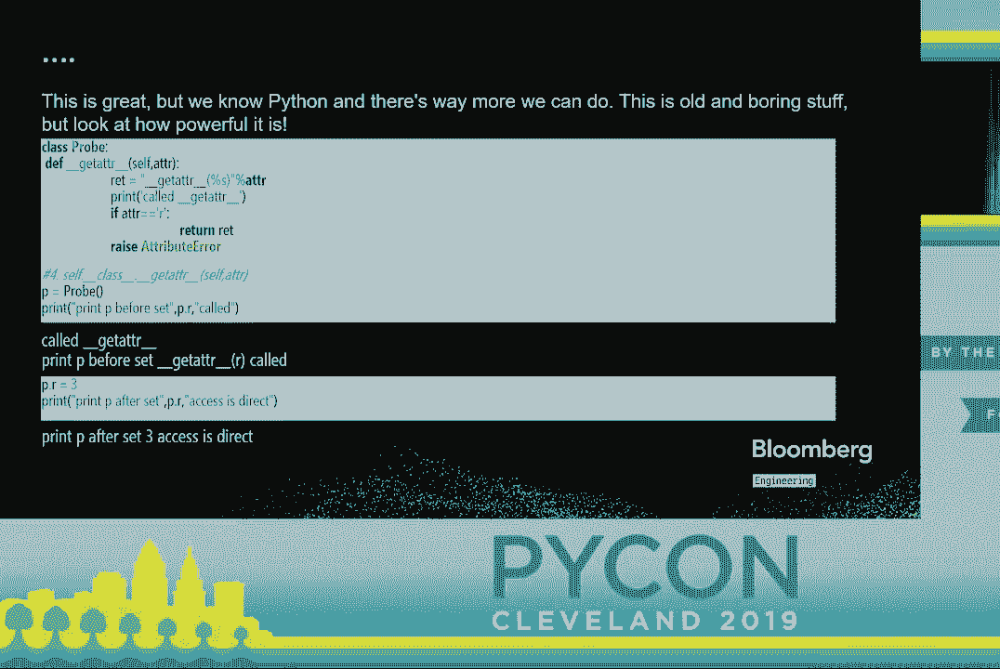
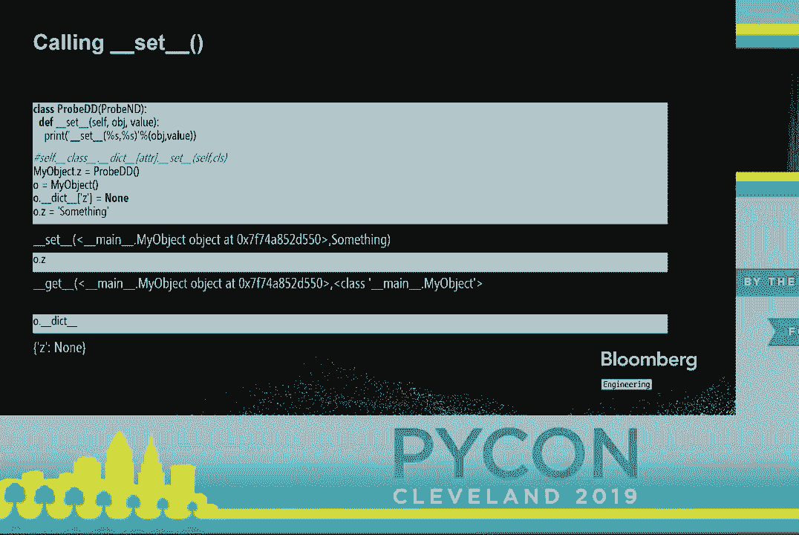
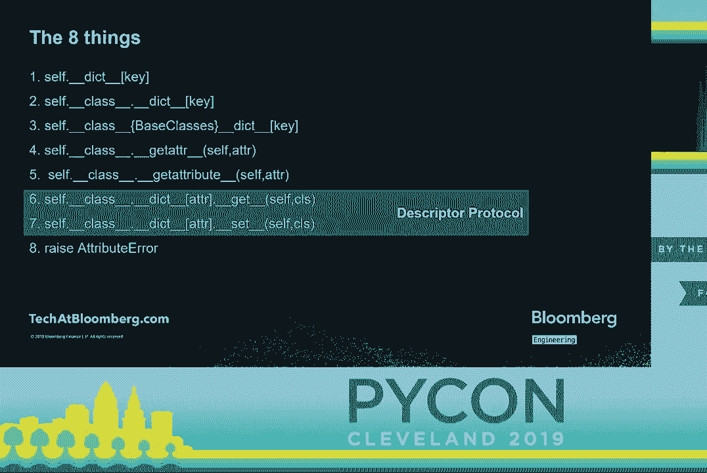
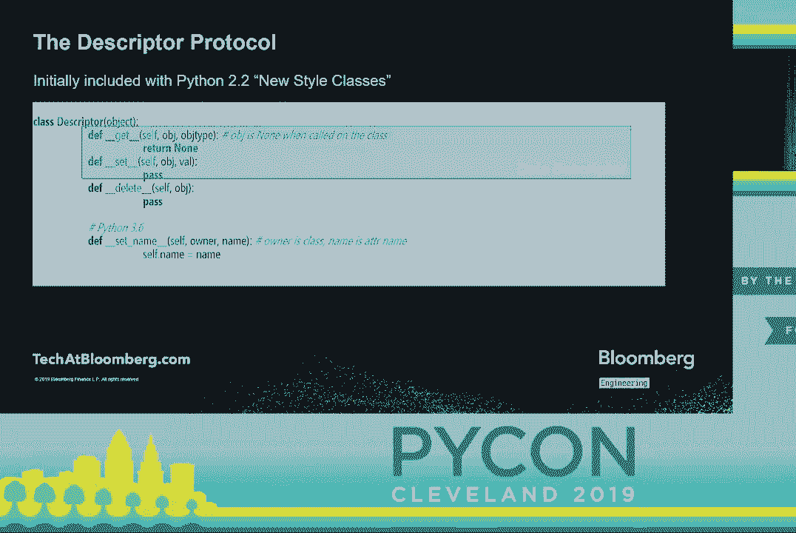
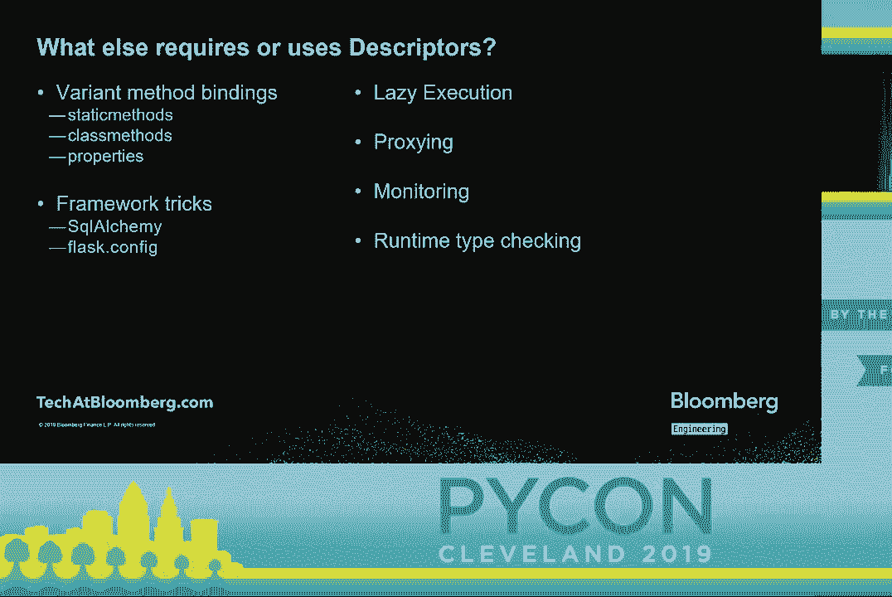
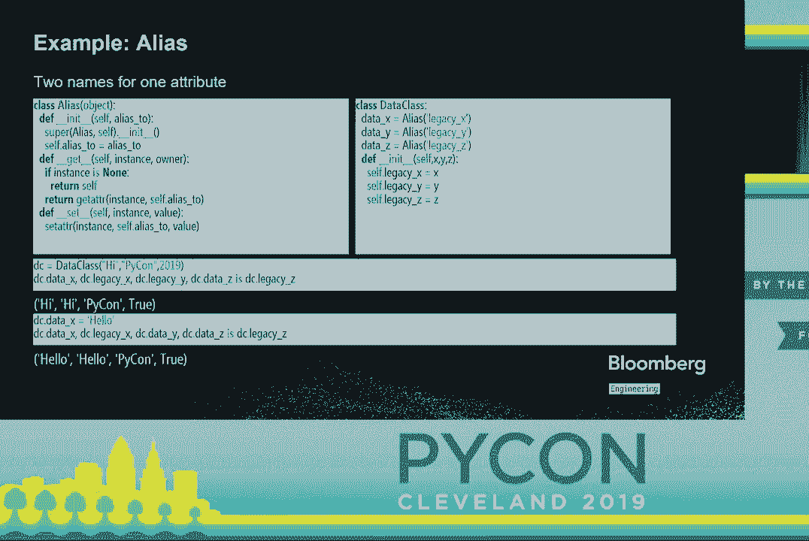
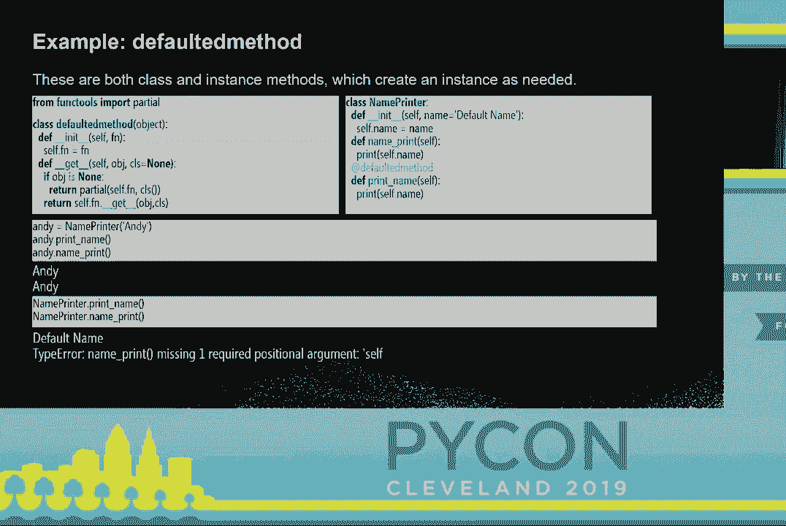
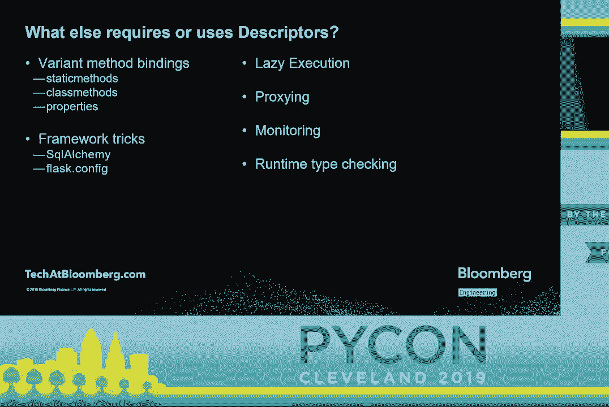

# P6：Andy Fundinger - 8 things that happen at the dot -  Attribute Access & Descripto - leosan - BV1qt411g7JH

 Everybody， please join me in welcoming Andy Funderinger。

 [applause]， \>\> Thank you。 So， eight things that happen at the dot attribute access and descriptors。

 Kind of interesting， this talk is kind of coming full circle back to a conversation that。

 happened at PyCon Portland where I was talking with Guido and I said， what's a part of Python。

 that doesn't get enough attention and he said， well， maybe descriptors。

 And a few months later I said， well， maybe I'll try to make a talk out of that。 And now， well。

 a couple years later， this talk is here。 So， who am I？ I've been a Python developer since version 2。

4， but descriptors are not something， that has changed since Python 2。2 with the new style classes。

 Today we're using all Python 3， but the difference is basically a bunch of parenthetical objects。

 being removed。 And myself， I've worked in industrial automation。

 metaverse development and the financial industry。 I've previously spoken about descriptors a few different places。

 Py Caribbean， Py Gotham， EuroPython， PyCAS， skates and Py Tennessee。

 They seem to keep creeping into my talks。 I don't know why。

 Those are some of them are different talks。 Currently。

 I'm working at Bloomberg in the data license group。

 What we do is we deliver financial data to clients in large chunks。

 like all the mortgages in North America， all the data about that。

 We use a diverse set of tools to do that。 I pulled out some of them there。 Flask， celery， PyCAS， VW。

 Redis， Jenna， Hadoop， even some things that are not Python。 Pearl， JavaScript， CC++， Fortran。

 We are enterprise scale， but we are extremely agile。 A few of the other things Bloomberg does。

 the terminals off in the Expo Hall。 We do trading solutions， trade book。

 enterprise data is my section。 News， media， law， new energy finance and government。

 The numbers for Bloomberg are pretty large。 We have more than 5，000 engineers。 3。

000 of them are Python developers。 150 data scientists， 150 plus。

 And similarly staggering numbers in some of the other categories， including the largest。

 private network in the world。

 Today we are talking about the dot。 Usually we kind of look at the dot sitting there between O and X。

 We could write a whole bunch of get add or O， X。 That is probably just O dundered dict index by X。

 And in the simplest case， sure， sure， sure it is。 O equals my object and we put the value of X in the dundered dict as 3 and we look at dundered dict。

 And there it is and O dot X and there's 3 and that's exactly what we expect。

 But of course maybe it's coming off the class。 This doesn't surprise us when it happens。

 So here's a class。 We give my object a class of base object but we'll use that next。

 And we set Y on my object and we look at the class dict and it's a mapping proxy but we。

 see that Y is in there but O is still an instance of my object and when we do O dot Y， yeah。

 we went ahead and we found the value of Y from the class。

 But it could also come from the parent class。 And we can look here and we can see that T is not in the class dict but it is in the dict。

 of the first base class along with an increasing number of other things， most of which are。

 non because I haven't been declaring them。 And when we call for O dot T， we get 4。 So great。

 wonderful。 That's all fairly straightforward and we just wave our hand and assume that works。

 But this is Python and we know there's way more that we can do。

 So we'll take one of the old and boring things。 DundergetAdder has been with us for a very long time。

 I believe this was Python 2。1 even before the new object model。

 DundergetAdder is called when there is not a definition when an attribute is not defined。

 on the instance。 And we can see that here I've declared DundergetAdder and I've created a class called probe which。

 has it defined。 And if I call for P dot R before setting a value for R。

 then I get back the value that， it returns。 I'm sorry。

 it's called in prints and it returns this Rett value， getAdder called。

 But after I set a value in there that print statement is not hit， DundergetAdder is not， called。

 the access is direct， the whole hook is skipped。

 So there is a matching function on the other side called setAdder just to match that up。

 SetAdder just lets us say if we're setting a value we'll call this。

 And we'll just see that for parity。 We define setAdder on a probe。 We set P dot T equal to three。

 And we see that that print statement is hit。 No magic takes place。

 The dict does not get this value because I did not write any changes to the dict in my， setAdder。

 Now getAdder is actually being called by get attribute。 And we can override get attribute。

 And if we do that we can control it regardless of whether the value is in the dict。

 So here we have probe。 Probe has get attribute on it。 And before and after set P is called。

 So P before set we get any var which is a return from get attribute。

 And after set we also get any var which is also the return from get attribute。

 Get attribute is actually managing the whole process。

 But we'll just gloss over that because it's conceptually difficult。

 But let's look at more about what get attribute is doing。

 Get attribute is actually looking at what is found in the class dict before it decides。

 what to do when it's resolving what's in the class dict。

 So if we create this class we'll call it probe ND。 And we put a method on here called dunder get。

 And dunder get returns just a little string that says this was hit。

 And we put that into the class dict of my object。 And then we have an instance of my object。

 And we access o。z on that we don't get the probe ND object back。

 We get the result of calling dunder get back。 However。

 if we put a value into the instance dictionary， in this case none， we get that， value back。

 Just like get add。 However， if we add a dunder set method and do the same。

 the behavior changes again。 So we put a dunder set method onto that probe ND。

 we just inherit from it and make probe， dd， which is exactly the same but has dunder set。

 We put probe dd onto my object， create a new instance and go ahead and put into that instance。

 dictionary and then access it and it is called despite the fact that that dictionary has a。

 value for z in it。 Just for completeness， we'll take a look here and we'll make sure that dunder set is。

 called as a set function。 So this is the same probe dd， exactly the same。

 We'll go ahead and put none in as the value of z， except we'll set o。z equal to something。

 And we can see here that the set function is now finally called and we can see that it。

 does its print command and prints out set my object and something the value that it got。

 And if we call o。z， we see that the get function still runs and if we check the dunder dicked。

 we see that it hasn't even been altered because once again I didn't write anything to change。

 the dunder dicked。 So set is a set function。 It's called when we set on the left side。

 So now we have our eight things。 The first three are we use resolutions of dunder in the dictionary。

 So first we look in the instance dictionary， we look in the class dictionary， we look in。

 the base classes dictionary。 Then items four and five are our dunder methods。

 dunder get adder and dunder get attribute。 Then items six and seven are something that's called the descriptor protocol。

 dunder get， and dunder set and the eighth thing is that dunder get attribute raises an attribute error。

 which we have surely seen enough times。 Of course this is not an order of precedence。

 The order of precedence is that get attribute manages the whole thing and as we saw whether。

 we have get and set on that descriptor makes quite a difference。

 So let's take a look at the descriptor protocol。 Again this is initially included with Python 2。

2's new style classes。 We know those in Python 3 as classes。

 A descriptor has as many as four methods， dunder get， dunder delete and dunder set name。

 starting in Python 3。6。 Dunder get is what's accessed when it's found in the class dictionary and to retrieve a。

 value on the right hand side， dunder set is what's used when you set a value to that class。

 attribute on an instance。 Dunder delete is called when you delete from an instance and dunder set name a new in Python。

 3。6 is used during class creation to let the descriptor know what class and what name it。

 has been assigned to。 The signatures here for get。

 it gets an object which is the object that is the instance it's。

 being called on and the class for set it only gets the instance and the value that's being。

 set and deleted only gets the instance。 That's because get can be called at the class level in which case the instance would be。

 none。 The others are only at instance level。 There's two kind of sub-protacles here。

 If you only define dunder get an optionally set name you have a non-dated descriptor。

 That's why we had pro-bend。 If you define dunder get and dunder set or dunder get and dunder delete optionally set。

 of course you have a dated descriptor。 If anyone's actually defining dunder delete for purposes please talk to me after I would。

 like to know about that。 I have not found people implementing that other than out of a sense of completeness and obligation。

 It is there and it does work。 It absolutely works。

 What is this for？ The biggest thing to understand is this is the only reason that instance methods work。

 at all in Python。 Grid binding works entirely because of the descriptor protocol。

 If we define a class， we put a method on a greeting and it prints high。

 We go ahead and look at what greeting is in the class dictionary。

 We find it's a function and that doesn't surprise us。

 If we look at that and we go hey I wonder if that has a dunder get on there we find that。

 it does and that may or may not surprise us。 But now after going through the previous we'll understand that if we create an instance of。

 greeter and we access greeting from it that dunder get is called， we get a different object。

 we get the return of dunder get and that is a method and that is what we can call。

 That is exactly how we bind our methods both in Python 2 and 3。

 They were called bound and unbound methods there。 So method binding uses it。

 What else？ Obviously normal method binding。 Variant method binding is also going to use it。

 This is how you do static methods。 This is how you do class methods。 This is how properties work。

 As soon as we go into frameworks， SQLAlchemy uses it。 Flask uses it in their config module。

 If you start to try to get tricky there's a very good chance you will start using descriptors。

 as well as whatever else you're using。 Lazy execution， proxy and monitoring。

 runtime type checking is very likely to go into descriptors。

 So let's pull up some examples。 Here's an alias descriptor。

 Would you like to have two names for one attribute？ Sure， wouldn't we all？

 I wrote this up as an example for this talk and then I found some code where I had to。

 rename an attribute。 It didn't have time to go through all the call sites so I put it in there。

 So this is a descriptor。 When it's created I give it the name of the other attribute that should always have the。

 same value。 And that's stored as alias two and under init。 In under get。

 if instance is none it does something very common for descriptor。

 It returns itself because it's being accessed at the class level。

 Otherwise it does a get adder on the instance and the other attribute that it's aliasing。

 If it's set， it does a set adder and it sets the value of that other attribute。

 So let's look at a class that uses it。 Name data class， not the new data classes。 So data x， data y。

 data z， they're all aliasing legacy x， legacy y， legacy z。 The constructor is setting x， y。

 and z into those old attributes。 So we'll go ahead and construct one with the values of high。

 picon 2019。 So and check out the values。 So data x and legacy x are both high。 Legacy y is picon。

 That's exactly what we set。 And data z and legacy z are both 2019。

 They are identical by its operator。 We change the value of data x。

 We see the value of legacy x has changed exactly to match。 And that's exactly as we would expect。

 Everything else has stayed the same。

 Let's look at a non-data descriptor example。 I told you they were good for messing with method binding。

 So this is both a descriptor and a decorator。 That's a fairly common pattern。 So in this case。

 it's a binding decorator because it's going to mess with method binding。

 So sorry， didn't want to preview that。

 So in init， we're going to get a function and we're going to store that function because。

 it's a decorator。 And then when we do a get， either we will be given an object or not。

 This goes to the function of this decorator。 This is handling class methods in a different way。

 Probably not a good way， but a good way for this example。 What this is doing is saying， hey。

 if you don't have an instance of the class and you， call this method anyway。

 instead of causing an error about it， just construct one。

 Use the default parameters and make an instance。 Why not？ Well， probably many reasons。 Why not？

 But it's doable and in some cases may be adequate to make your process work。 Again。

 this is something you should think about before doing。 So in the case that object is none。

 that means it's been called at the class level。 And you can see that it's creating a partial。

 which is equivalent to binding， to bind a， newly created instance of the class to the function。

 constructing it and passing it as， the first argument， which is， of course， self。

 In the normal case where there's been an instance passed， it will simply call get normally using。

 the function that it was given and being given the object and the class。

 So name printer is another simple class。 It takes a name and has two functions。

 name print and print name。 They are entirely identical except one is decorated with defaulted method。

 The defaulted method decorator is defined before。 When we put a name on name printer。

 we can see they work identically。 Andy。printName and Andy。namePrint， both printout and it's fine。

 But if we call it at the class level， print name works because the decorator goes in， sorry。

 the descriptor goes in， hits its dunder get， notices that it's being called at the， class level。

 constructs an instance， hits the initializer of name printer， uses the default。

 value of name to go ahead and construct that instance。

 And then print name is called on that and we get default name and that's fine。

 Or maybe not great but it works。 Name print is a normal instance method and you can't call those on a class level。

 That is not allowed。 And we get our type error as we would。

 Well， the question would be what should we use and when？ These are like many。

 like really any meta programming technique， a class of things that， I call shovels。

 They're good for getting you out of holes。 But you don't want to use them too early because if you use a shovel too early。

 you will find， yourself at the bottom of the hole with a broken shovel。

 Do not go and use these until you are sure that the benefit is worth the added complexity。

 Breaking down the techniques shown and the different ways of accessing attributes。

 Here's how I would suggest looking at it。 Normal attribute access is of course what you should use as long as you possibly can。

 And adder is particularly useful for caching lazy execution。

 It works because once you've set a value it won't be called anymore。

 Get attribute however is probably something you're going to have to do if you're proxying。

 access to some unknown remote API that you'll never know what the methods are。

 You simply want to intercept every access。 Non-data descriptors are fundamentally designed for method binding。

 And data descriptors， a great example usage for that is runtime typing。 And with that。

 I will take some questions。 I will also be at the Bloomberg booth in the next break if anyone wants to talk about subjects。

 raised here。 Please come up to this microphone to ask questions。 Hi， nice talk。

 Could a descriptor be designed to not be able for the underlying object to be accessed？

 For the underlying object not to be able to access。 What do you mean the underlying object？

 I mean like you are creating data descriptor objects。

 And typically in Python you can't have hidden attributes that can't be accessed from outside。

 the object。 Oh， the correct answer is no。 You could do some very weird hacks that inspected the stack in ways that you should never ever。

 ever do。 But other than that， no。 The descriptor still doesn't know who's calling it。

 The descriptor still doesn't have any way to filter so some things could access it and。

 some couldn't。 What you can do with the descriptor is change where the data is stored。

 So you can use a descriptor and say this data is stored in a database。 That's how SQLAlchemy works。

 Like the fields in SQLAlchemy are fundamentally storing something in a database rather than。

 actually on the object。 Okay， thank you。 Can you tell me any good resources on how to use this when you pull in inheritance into。

 the mix basically where you want to override the set the descriptors？

 I thought there were some quirky things that happen in some cases， at least from my experience。

 I was wondering if you have any good resources other than the documentation， I guess。

 There shouldn't be anything particularly quirky。 I mean the descriptor is going to be attached and if you replace it。

 you're going to be， replacing it with a new behavior for everything up and down the stack。

 The biggest problem is if something previously accessed it as a normal attribute and then。

 you put in some behavior that's fundamentally incompatible with that or you need it to be。

 initialized in order。 So you do have that problem but that's depending on what you're doing with your descriptor。

 Are there any other questions？ Can you come on up？

 And I think this will be the last one running out of time。 So I just wondered。

 the examples I've seen for data descriptors for their actual use， of them just in an academic sense。

 so for validating or maybe manipulating a value that。

 you supply to an attribute and you may change it to something， maybe， you know， coerce it。

 to a certain bounds or something like that。 Is there any other common scenarios we want to use data descriptors？

 Yeah， the typing case is a great case but again I'll suggest the SQLAlchemy case is。

 another excellent case where you're saying what I want to do is actually store this value。

 in a database or maybe I would like to put it in there。

 Yeah， maybe I would like to do some additional monitoring so you could conceivably put in。

 a data descriptor at a critical point and say I would like to have every time this value， changed。

 write it out to my monitoring system so I don't have to put a log statement on。

 I don't have to rely on anyone remembering that they have to record they change that， value。 Again。

 you can control where the data goes。 That's another case for that。 Thank you。 Okay。

 well thank you very much。

 [APPLAUSE]， (applause)。