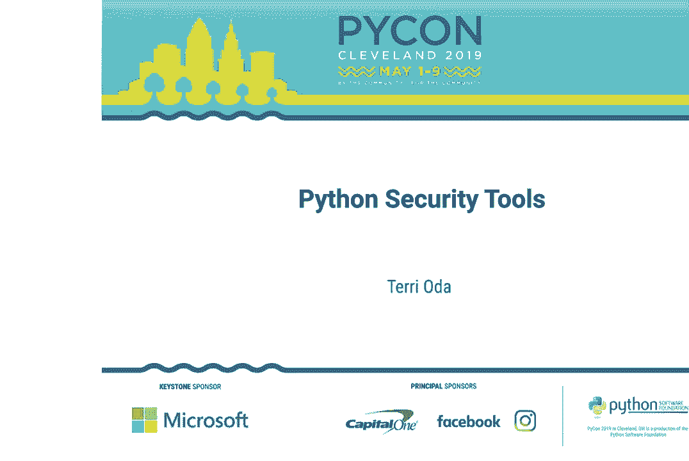
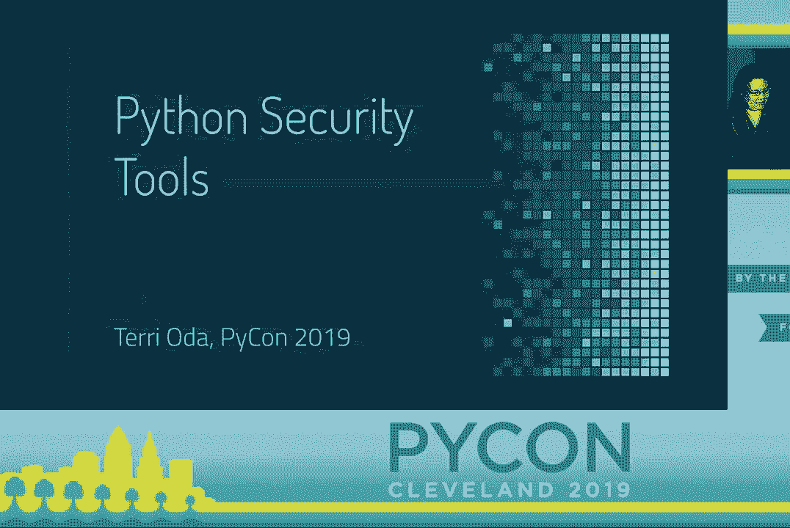
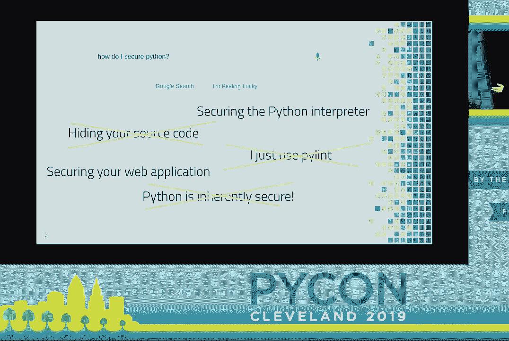
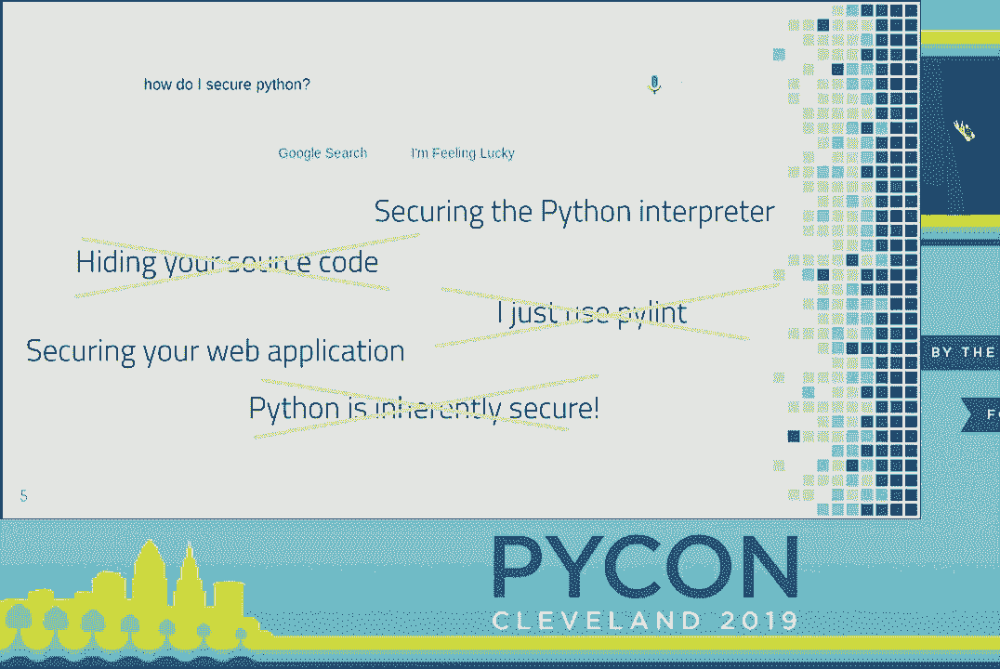
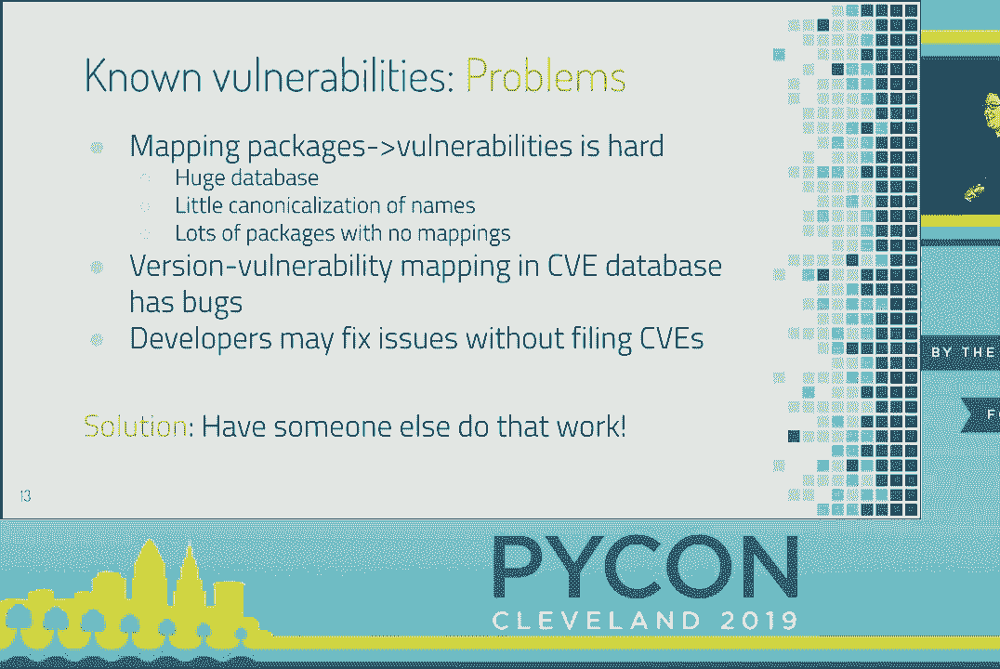
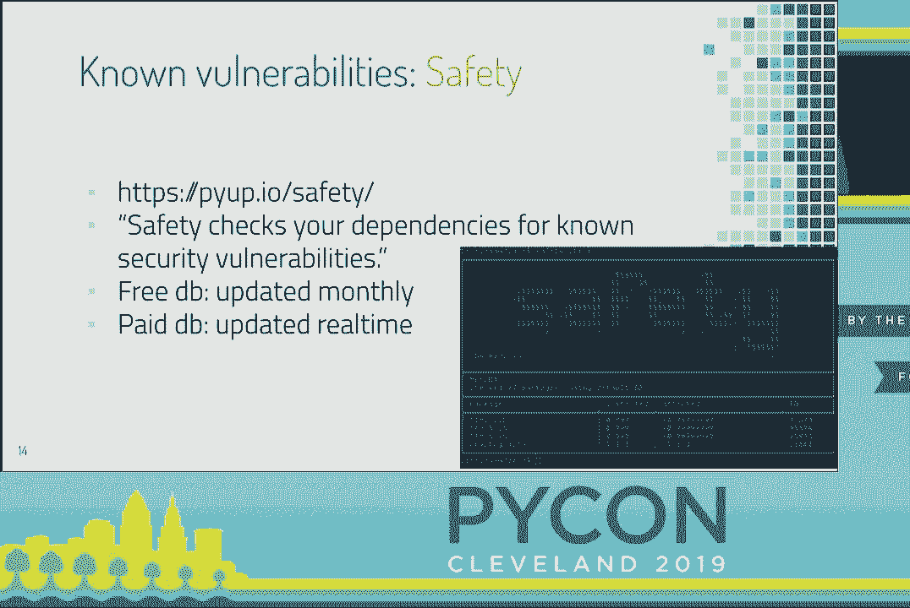
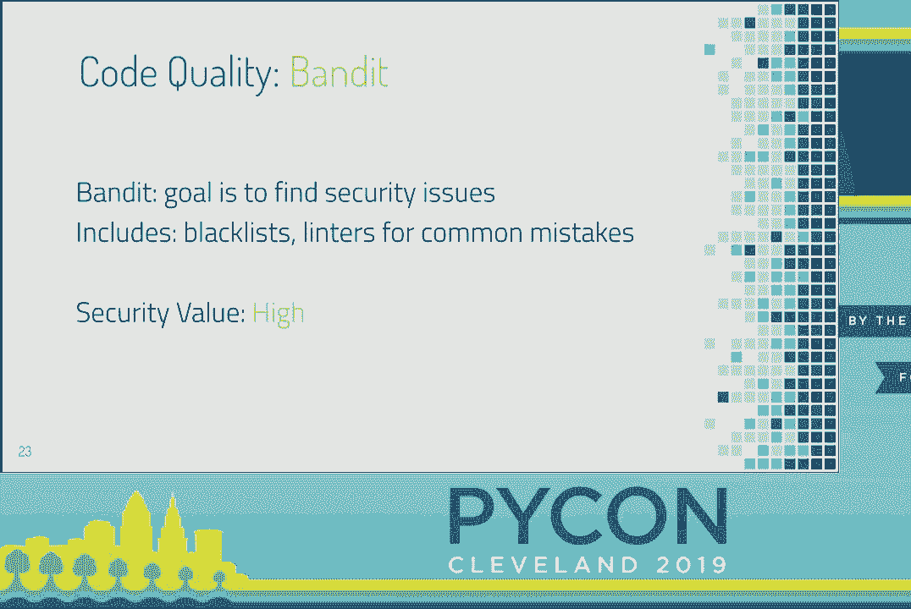
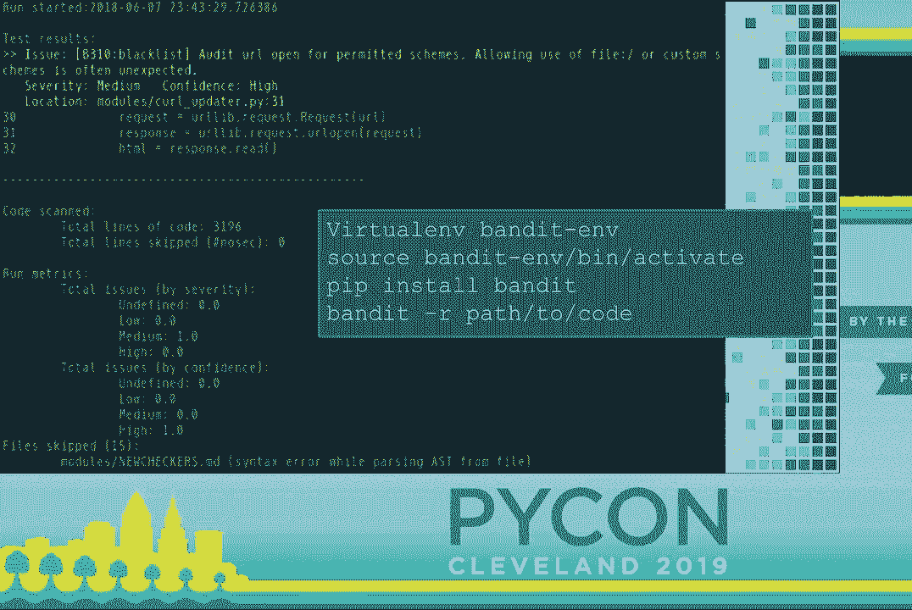
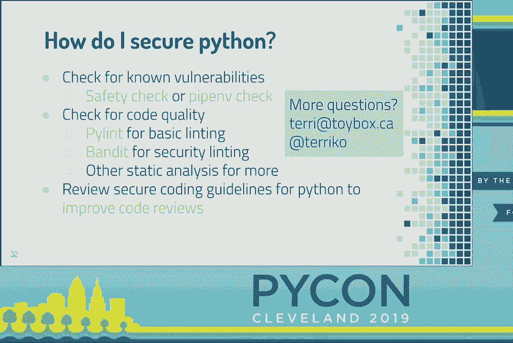

# PyCon 2019 演讲全集 - P10：Terri Oda - Python Security Tools - PyCon 2019 - leosan - BV1qt411g7JH

 Make big noise for Terry。 You're going to tell us how we can have better， Python security tools。

 So this talk is for anyone who's ever done this search。

 And if you haven't done this search lately， let me remind you as to what it looks like。

 You get a bunch of maybe not the most useful results， like how to hide your source code， which。

 is a type of security。 As an open source person， it's not my favorite type， of security。

 but it's a problem that people have。 You get that dude who answers every question about security。

 to say， oh， I just use "Pilent。"， It's fine。 Or you get， when you're ask around in your company。

 or whatever， you get the response that， well， Python's inherently secure。

 It doesn't have buffer overflows， so you don't need any， of that crap。

 Maybe you should just use "Pilent。"， So none of that is really super useful to answer your question。

 Unless what you were really deep in your heart of hearts。

 hoping for was that the answer was that Python was perfect。 Everything was solved， and you did not。

 have to do any more work before you released your product。 Which I admit。

 like there's a lot of people in this room， were very big Python advocates。

 I want to believe that everything is perfect and we can move on。 But as a security person。

 I'm not super comfortable， with that feeling。 And that's the reason that I don't even like some of the results。

 that are maybe useful。 So up on that first page， you'll see some links。

 about how we've done work to secure the Python interpreter。

 which is great if you are a Python developer， a CPython， or a Python developer。 And if you're not。

 you might think， well， oh， all the problems， have been solved in the interpreter。 I'm done。

 We're good。 And similarly， there's some nice links。

 from OASP on how to secure your Python web application。 And again。

 that's great if that's what you're doing。 And sometimes you'll go， oh， well， I'm a data scientist。

 As of last year， half of our population， is filled with data scientists。

 so that's a lot of people here。

 And if you see， well， you only need security， for your web application， then you're like， eh。

 I'm a scientist。 I'm done。 We're good。

 So none of that makes me super comfortable either。 So why should you listen to me？ I mean。

 I'm hoping you think that the Python community， wouldn't choose someone incompetent to talk to you。

 But I'm Dr。 Terri Oda。 I have a PhD in horribleness， by which I'm， in computer security。

 which is actually kind of horrible。 I specialize in web security， so not Python at all。

 But the reason you should trust me is not， that I have an academic degree。

 There's lots of people in this room who have academic degrees。 I know quite a few of you。

 The reason you should feel that I have， the useful opinions for you is that I've。

 spent most of my adult life focused on security， but also that I've spent many years now working。

 in industry at doing open source security for Intel。

 I imagine most of you in this room are familiar with Intel。

 You may have a processor in your laptop right now that， comes from us。

 We make most of our money off of hardware， but hardware is no good if it doesn't have good software。

 And so we do a lot of open source work。 And it's my job to make sure that our open source work is。

 good before it goes out。 I'm not the only one who does this。 I focus on a couple of different areas。

 But I go through probably 10 to 20 projects， a year from beginning to end。

 helping them with their security， helping them with working on their privacy policies。

 making sure they do good code review， and understanding what makes security hard for them。

 what can make security better for them， and what sort of things we're doing right and wrong。

 As far as Python goes， I did say that my PhD is in web security。

 which doesn't have much to do with Python。 But hopefully a few of you in this room。

 actually recognize me as a mailman developer， which。

 if you think of mailman is that thing that emails， your password once a month。

 maybe you feel less inclined， to listen to what I have to say。

 And if that's how you feel about mailman， let me tell you， you need to upgrade。

 It's going to blow your mind。 It does not do that anymore。

 The other thing that I do in the Python community。

 that you may know me for is Google Summer of Code。

 I run the Summer Mentoring Program for the Python Software， Foundation。

 And you can ask me all about that later。 It's super cool。 I can't wait to announce our new students。

 but it's not happening until Monday， so I can't tell you how many there are anything right now。

 The other cool thing that I do for Intel， is this URL in the middle， which I am not。

 going to talk about again。 So if you need to take a picture of it right now。

 you should take a picture of it。 But I'm working on a small Python tool that is not。

 designed for improving your Python security， but is designed to help you figure out。

 whether you have known vulnerabilities in your binaries。

 So those of you who may be working with C libraries， super useful， if you work at a company where。

 you have a problem where sometimes people ship really， old versions of OpenSSL and you want。

 to have something to put in your continuous integration， to make sure that doesn't happen。

 this is the tool for you， and it's super cool。 I'm not going to talk about it today。

 because it doesn't help most Python programmers， but I will talk about a lot of things。

 that I've learned in developing it。 And that just came out in February。

 so you're not late in learning about it or anything。 So there's a bunch of different problems。

 in security of differing levels of difficulty。 In theory。

 the easiest one should be detecting things， that we already know are security vulnerabilities。

 So they call these CVEs。 There's a huge database of them。 And when I say huge database， I really。

 mean huge database。 Like it's not untractable to download。

 but it has vulnerabilities of all software， forever， all， in one thing。

 It's called the National Vulnerability Database， because it's based in the US。

 but it's not national。 It's the international horror show of every bit of software。

 that's ever gone wrong。 And that wouldn't be such a problem。

 except that everyone wants that two-letter Python， pip install whatever package。

 And so we all use fairly simple names for a lot of things。

 I went to the great talk on Cross Stitch yesterday， and the package is called IH。

 And if you search for that in a database， with all known software vulnerabilities forever。

 you're going to get a lot of hits。 And that's kind of annoying。 But you think， well， OK， whatever。

 I do that once， and it'll be fine。 It's annoying， but it's not intractable。

 Except that you don't do it just once， because many Python packages have never， had a vulnerability。

 and therefore， they're， not in the database yet。 So every single time you want to check and see。

 whether they're new vulnerabilities， you're going to have to search for all of those generically。

 named packages again and try to build new mappings。 And that's not great。 But then it gets worse。

 because of course it does。 The mapping isn't quite as perfect as you would hope it would be。

 So what we find is people are usually pretty good about it， but people are people。

 And so you go and you say， libjpeg is vulnerable to something， in all versions between 4。09。

 And if you're lucky， that means that the database will， have 4。08， 4。07， 4。06， and all the way down。

 And it'll be really easy to query。 But that's not usually what you see。 What you sometimes see。

 especially for smaller packages， is 4。08 is vulnerable， but nothing about the other ones。

 Or if you're especially unlucky， and this is one that we hit， it'll say 4。

09 is the latest version that's safe， but it'll show up as the vulnerable version。

 so you'll get this false positive， and it's completely annoying。 And we fix these as we find them。

 I have definitely found bugs。 The NIST team that handles this is super responsive， and it's awesome。

 And they have ways to say and all previous versions。

 but most people just grab the JSON and try to use it， and it doesn't have all that data in it。

 So the mappings can be kind of bad if you do it naively。

 and you just aren't aware that that's what they're like。 And then， in case that wasn't enough。

 this is a database maintained by a bazillion people。 It was designed to be done by vendor。

 so big software companies would each have someone， and they would do it。

 But now we have open source software， and we have a bazillion people who。

 could anyone can volunteer to be a vendor now。 That was not always true。

 I don't know if any of you have ever， asked around， like， how do you file vulnerabilities。

 for your open source project？ But you may have learned that we owe a great debt of gratitude。

 to the team at Red Hat， Red Hat Enterprise Linux files。

 CVEs against all the packages that they maintain。 And so there's a huge pile of those。

 but everyone else， it's sort of meh。 And then， even if we figure out-- so we don't know what sort。

 of name they're going to use， like， if the first person to file a bug against your project calls。

 it Python， dash， whatever， then that's fine。 But when you search for just the whatever。

 you're not going to find it。 It's a pain。 And then， while open source， thanks to Red Hat especially。

 has been really good about filing CVEs， that's not true everywhere。 If you're a small company。

 sometimes， it's super uncomfortable to file a CVE against your project。

 Sometimes your management will say， we can't admit that。 We're just going to solve it。

 and it'll be quiet， and it'll happen。 Or if you're a small open source project。

 you have no idea how to file a CV。 You don't even know that that's a thing。

 You don't even know that the bug you got was a security bug。 You just fix it， and you move on。

 And so there's a lot of things that aren't even， in the database that we probably would like to know about。

 that are real security bugs and maybe are known。 So putting it all up on one slide。

 so you can see in there， the mapping is bad， there's no canonicalization of names。

 there's lots of packages that aren't in there， there's some bugs in the data that we have。

 People fix things that probably qualify as CVEs， without ever doing that。

 So if you're looking at all this and thinking， god， that's a lot of work， you're right。 Thankfully。

 someone else has done it for us。

 So enter one of my favorite security tools ever， PiUp。io Safety。

 It checks your dependencies for known vulnerabilities。

 It's got a free database that's available and updated monthly。

 or you can get a subscription to do it more real time。 They've recently changed their pricing。

 but it's still really， really reasonable， for the amount of work that you're doing。

 if you're talking about more than like five Python packages。

 So I don't have any affiliation with this company。

 but I definitely spend a lot of time recommending it。

 to people because it's so much less work than doing it yourself。 And it's so much less error-prone。

 And it's even more amazing than that， because not only have they figured out all the mappings。

 and they've committed to finding new ones for everything in PIP。

 Like if you've got it something in PIP， it can figure it out。

 They also go and read all those change logs， and see， hey。

 that looks like it might have been a security issue。

 And so you'll note that-- hopefully you can read that。 It's a little bit dark， but they have。

 IDs that are not CVE numbers， and that's why， is because they have some vulnerabilities or potential。

 vulnerabilities that are not in there。

 So on top of having a command line utility that works in。

 you can just put it in your virtual M and say， go， tell me， everything in here that's scary。

 They have the option to just take your requirements。txt， and throw it into this web interface。

 and it'll give you a list。 And you can tell that I did this screenshot like a year ago。

 because that is not the latest version of Django， that you should be using。

 So do not take that as advice。 But you can see here the interface。

 where there's no CVE associated with this， so it's showing you the change logs。

 so you can go and see whether that particular issue might， impact your product or not。 Usually。

 as a security person， I always recommend you just， update to the latest。

 It's way less maintenance and hassle。 But depending on what you're doing。

 sometimes you need to know whether this bug impacts you， and whether we have to do it right now。

 or maybe we could wait until next release。 For those of you who might already be using PipMf。

 safety is not the only way you can do this check。 PipMf has a bunch of tools for managing your Python。

 and it also does the equivalent of safety check。 And it looks-- again， this is probably a bit dark。

 It looks like this。 This one gives you the short description of each CVE。

 so you can see it right there。 It gives you the recommendations that you need。

 And it gives you a little bit of extra information， about PEP508。 So why am I telling you about two？

 Which one's better？ The answer is neither of them。 They're actually the same。

 They use the same database from the safety people。 It can even--。

 PipMf can even use your subscription key if you have one。 So basically， try them both out。

 See which one works best for your workflow。 Safety's got this nice GitHub CI。

 PipMf's got other stuff that you might already be using。

 so it might be easier to integrate with you。 But seriously， use one of them。

 It's amazing to me how many security vulnerabilities， we have that are just--。

 we never upgraded this because we didn't think of it。

 So assuming we have solved the known vulnerability problems， we need to go into the next problem。

 What about actual quality of our code？ So let's go back to pilot。

 So the goal of pilot is code quality and consistency。

 Sometimes you get security gains as a side effect。 The security value is not zero， but it's low。

 So that person who is recommending it， is the only tool you need has some wishful thinking going on。

 But it's not zero。 And I don't have a great Python example， but this is the famous Apple go-to fail。

 which is often held up， as an example of something that would be caught by a linter。

 that is a security issue， even though it's also a code issue。

 So making your code clearer and easier to read， definitely has security implications that are good。

 But those people who told you to use pilot， were just off by one。 We're programmers。

 off by what else。 So Bandit is the new kid on the block， not really new anymore。

 But this is a tool that was written for OpenStack。

 because the problem with designing your cloud infrastructure。

 by committee is that not everyone has the same code， quality standards。

 And so they worked on this tool to help people， work on their security standards。

 And this was made part of Python's PyCQA， and it's kind of awesome。

 So Bandit's goal is to find security issues。 It includes Blacklist。

 It has some linters for common mistakes。 It's not technically a linter。

 It's actually more of a static analysis tool。 But it's fast enough that you can treat it like a linter。

 And if you don't really care too much about exactly what's， going on to the hood， that's fine。

 The security value here is high， and that's， a big difference from pilot。

 So here's what the tail end of an output looks like。 You can see it gives you something telling you。

 that it's Blacklisted， explaining why and what you should look at。

 It gives you a little bit of code， so you can figure out where it is。

 And it gives you some summary information， about the issues that it's found。

 I put up there showing you how to just get it。 I do recommend you run it in a virtual end。

 It's easier。 If you're running in a virtual end， do not put your virtual end into the directory。

 that you are running Bandit on。 Bandit hates virtual ends。 And your VM will trigger approximately 1。

200， Bandit errors that are not your fault and not in your code。

 And every time I see someone do it at work， and they're like， oh， god， I'm doomed。

 My project's never going to ship。 So don't do that。 Put your virtual end somewhere else。

 Scan just the code that you wrote。 It'll make your life a whole lot easier。

 But that's pretty much it。 PEP install Bandit。 Run it on your code。

 You can do it right now in the audience if you want。 So Bandit has more rules than this。

 but here's an example of some of the rules， that you're looking at。

 That first one came up for me last week， when scanning TensorFlow of all things。

 It's a reminder that a search in Python， as in most languages， actually。

 gets compiled out by the optimizer， because it's meant to be a sort of emergency debug check。

 and is not good for doing security validation。 So we found that in a lot of places in code at work。

 and elsewhere where people are often just not aware， that the minute this gets compiled， it's gone。

 So it's not super useful。 So it's really useful in your test cases， and not so useful elsewhere。

 Some of the other ones， if you know anything about security， are sort of obvious。

 The exact tends to be the whipping boy， of all scripting languages。

 There's some stuff about cryptography and so on。 Pickle。

 It's worth if you're not familiar with why any of these things， are。

 Bandit has a little description， including what the message means in short。

 what the message means a little bit long， and often it has links back to the OpenStack wiki pages。

 on how to resolve this and what to do better。 So it's actually pretty comprehensive on how it does that。

 The other thing that I want to tell you about Bandit， other than don't put your virtual M。

 in the directory you're scanning， is that sometimes you don't actually want。

 to fix all your Bandit errors。 So if you're used to using other security tools。

 you tend to try to drive everything to zero， that's not the way I would recommend you use Bandit。

 Bandit is， again， it was designed originally for OpenStack。

 and it calls out a lot of stuff that is dangerous， but not necessarily wrong。

 So the one that hits me in the CVE binary tool， is calling out to system functions via subprocess。

 which is the right way to do things， but also potentially dangerous。 And in my case。

 we call it to subprocess， in order to identify files， we use the Linux strings utility。

 And we actually have a Google Summer of Code student。

 who was investigating making our code run on systems， like Windows that don't necessarily have that。

 And so she put in a thing that does that parsing in Python。 And that was great。

 except that the first thing I got was a email， from the Octo team saying， "Ah。

 your script used to run in 107 seconds。 It's been five minutes， and now I'm filing a bug。"。

 And then 45 minutes later， another message saying， "It's been 45 minutes， and it's still going。

 What did you do？"， So yeah， we want to use subprocess。

 It's much more performant than our pure Python solution。

 and that's not something I'm ever going to remove。

 because it's sort of compiled like Y duplicate code。

 So using GENDON as a way to focus your code review， is a good thing to do。 As I said。

 it's got information about each of the bugs， that you can look up on it， and that's super helpful。

 What it doesn't have is it doesn't have sort of， a code review facility where you can say。

 "This is not a bug，" or， "That I've checked this。"， If you want to add it though， it's open source。

 I know I'd be interested in seeing it。 So what's the next step？ So these are things that are fast。

 You can run it in your CI， you can run it on every single， commit。

 and it's totally reasonable to do。 With Bandit， you don't want it to block your commits。

 You do have to be a little bit careful， about how you set it up。 There are a number of other tools。

 with different heuristics available。 There's some open source ones like SonarCube。

 The only one I'm going to mention here， just because there's so many， and they're very varied。

 and I don't like all of them。 But one that is interesting to us， because it's being used。

 by CPython， is scan。coverity。com， which is free for open source。

 So if you have an open source project， and you want to see what coverity looks like。

 you can sign up for that and do that。 I would show you screenshots， but I accidentally。

 broke my account by changing my email address。 So yeah， that was unfortunate。 But it basically runs。

 they have a commercial tool， and it basically runs about a version behind， sometimes two。

 and gives you the full range of stuff。 And it's got a lot of good rules for Python。

 that we've found very useful for the open source， projects I use that use it。

 So let's go back to this。 But Python is inherently secure。 And it's all fine and good to say， OK。

 here's how you focus your code review。 But what if you're working with a team of people， who just。

 in their heart of hearts， believe Python is secure and are not， going to do much looking at it？

 So that's a problem。 It's worth noting， and I hope none of you。

 were in here hoping I was going to tell you， about very specific Python security issues。

 There are a few， but to be completely honest， most of the issues I see in Python are issues。

 I see in other languages。 So as I said， obsolete dependencies， that's a huge problem。

 Obsolete cryptography， if you run Bandit， and it tells you you're still using Pi Crypto。

 please don't do that。 Secrets and code， people putting their keys， where they shouldn't be。

 Not enough input validation。 And all of these things are the same things。

 you see in the whole list of the top 25 software errors， that Sans puts out every couple of years。

 We're basically only missing two， I think。 There's a buffer overflow one and then。

 there's another related one。 Like all the integer arithmetic， we can still screw that up。

 There's very little that there's nothing new under the sun， in security， unfortunately。

 But if you have teams or you just， want to work on your own education。

 you will find that it's actually kind of hard， because all of the security guides were written for C。

 C++， Java， there's not very much written with Python examples， in mind。

 So obviously Bandit does have some examples。 I like this one when I'm giving it out to new teams。

 that haven't done security work on Python before， because it does have--。

 at the time I did the screenshot， I think it might have a couple more。

 It does have Python examples for 109 different types， of security issue and explanation as to why。

 Fortify does a number of other tools and fuzzing and stuff。

 So they're very familiar and very knowledgeable。 So this is a great one if you'd need a place to start。

 So we have some tools。 Where should you be using them？ One， in your continuous integration。

 That's too much of a pain。 Do it before you do code review。 If you don't do code review。

 at least do it， before your release， please。 So this is what I really want to be the answer when you search。

 for how do you secure Python。 There are other things you can do。

 I went to a great talk this morning earlier today， on type checking。

 There's a bazillion other tools。 But this is the bare minimum that I want you to all please。

 take a picture of that， send it to your team， put it on Twitter， whatever。

 Do your vulnerability checks。 You can do it in a couple of ways。 Do some code quality checks。

 Bandit is great。 Please learn to love it。 Maybe we can contribute some new things。

 to make it easier for people to use。 It's worth looking into other static analysis。

 if you have access to the budget for that， or are willing to suffer through the open source tools。

 to get them up to what you want。 And do learn about how to do code reviews for Python。

 because they're the same as everything， but sometimes people just are so optimistic about our language。

 that they don't realize that that's， the thing they need to know。 And we've got time for questions。

 I will say that if you don't want to be that jerk who。

 forms their question not in the form of a question。

 but you do want to tell me about a really awesome tool， that I should have been talking about。

 please send me an email。 I love knowing about tools。 I don't know that everyone in the room。

 wants to hear us pontificate about them though。 So please raise your question in the form of question。

 and I'm done。 Oh， and I should say， Intel is hiring。 If you think my job sounds cool， we。

 want a person just like me。 I would be happy to talk to you about it。 [APPLAUSE]， OK。

 if anyone has questions， they， should come to the mic now or the one in the back， in the way。

 So I didn't get that earlier when， it talked about safety versus pip-inf-check。

 So we're running pip-inf-check， but we never， got a license from safety。

 So you said they access the same database if you have--， Yeah。

 you're probably using the free database。 If you want an even better database。

 you can get a license to get that。 OK， so that has an extra。 And that's worth it。 Yeah。

 It seems worth it to me， but I work with a lot of projects， at once， so it's a lot of big projects。

 So it may or may not be worth it to you。 All right， thanks。

 Are you aware of any tools that automatically detect， security flaws and try to fix it。

 kind of like refactoring？ You're likely two to three。 I haven't seen any good ones for Python。

 I have seen them for other languages。 So no， basically， I guess is the answer。 It is possible。

 There's a lot of really interesting academic work， in that area， really great papers。

 If you're bored， USNIC security is coming up in a few months。

 and they put all their papers out for free， and they're going to have a really cool research that。

 will include stuff like that。 But usually people focus on C because that's scarier。 OK。

 thank you very much。 [APPLAUSE]。

 (applause)。