# PyCon 2019 演讲全集 - P26：Erin Allard - Ace Your Technical Interview Using Python - PyCon 2019 - leosan - BV1qt411g7JH

 Hello everyone。 Hello everyone。 Next up is Aaron Allard。

 who is a platform support engineer at Heroku， and will be presenting ACI。

 our technical interview using Python。

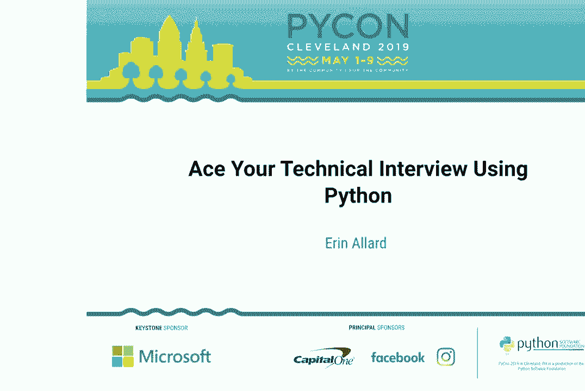

 [Applause]。

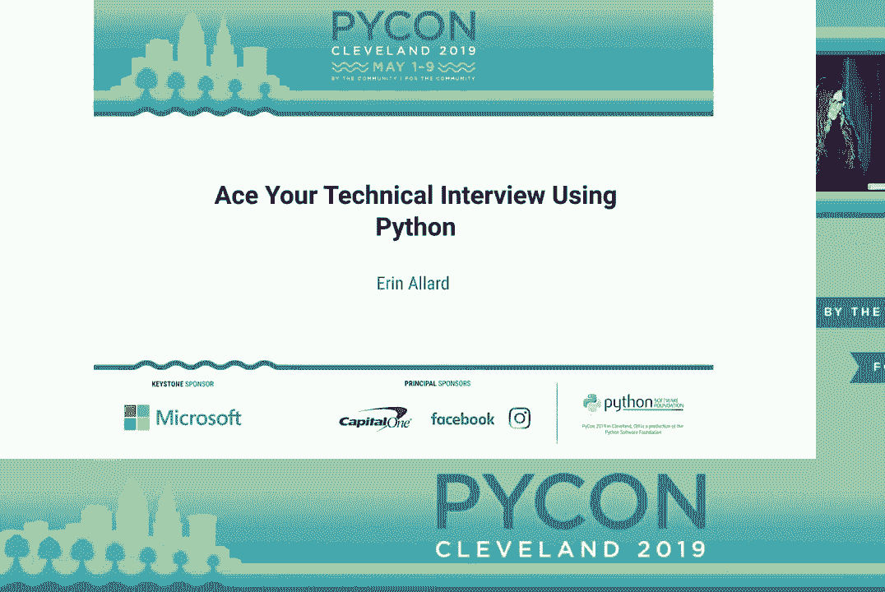

 [Applause]， Hi， I'm Aaron Allard， and I'm a， professional student at Heroku， and I'm a。

 professional student at Heroku， and I'm a， professional student at Heroku， and I'm a。

 professional student at Heroku， and I'm a， professional student at Heroku， and I'm a。

 professional student at Heroku， and I'm a， professional student at Heroku， and I'm a。

 professional student at Heroku， and I'm a， professional student at Heroku， and I'm a。

 professional student at Heroku， and I'm a， professional student at Heroku， and I'm a。

 professional student at Heroku， and I'm a， professional student at Heroku， and I'm a。

 professional student at Heroku， and I'm a， professional student at Heroku， and I'm a。

 professional student at Heroku， and I'm a， professional student at Heroku， and I'm a。

 professional student at Heroku， and I'm a， professional student at Heroku， and I'm a。

 professional student at Heroku， and I'm a， professional student at Heroku， and I'm a。

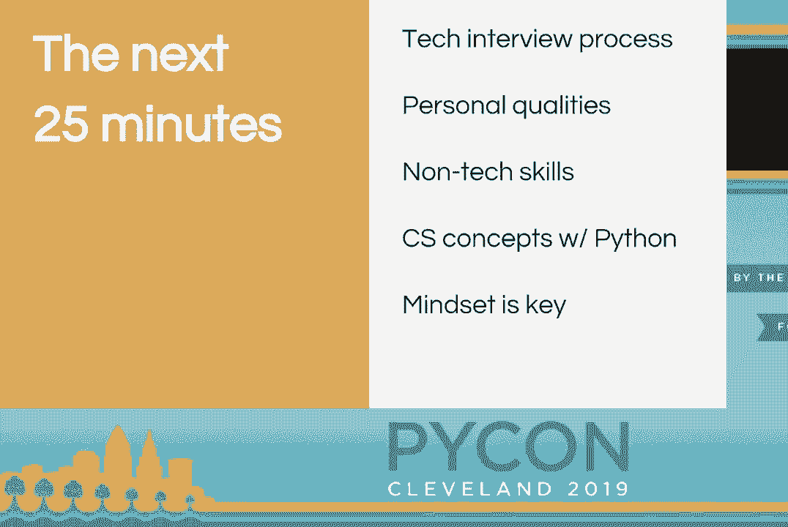

 professional student at Heroku， and I'm a， professional student at Heroku， and I'm a。

 professional student at Heroku， and I'm a， professional student at Heroku， and I'm a。

 professional student at Heroku， and I'm a， professional student at Heroku， and I'm a。

 professional student at Heroku， and I'm a， professional student at Heroku， and I'm a。

 professional student at Heroku， and I'm a， professional student at Heroku， and I'm a。

 professional student at Heroku， and I'm a， professional student at Heroku， and I'm a。

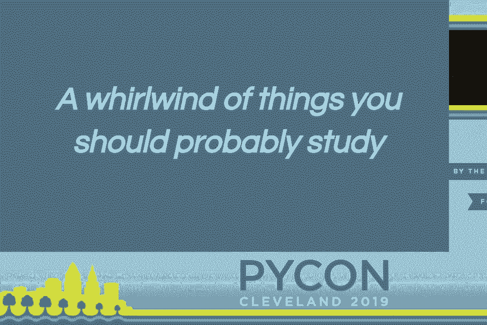

 professional student at Heroku， and I'm a， professional student at Heroku， and I'm a。

 professional student at Heroku， and I'm a， professional student at Heroku， and I'm a。

 professional student at Heroku， and I'm a， professional student at Heroku， and I'm a。

 professional student at Heroku， and I'm a， professional student at Heroku， and I'm。

 a professional student at Heroku， and I'm， a professional student at Heroku， and I'm。

 a professional student at Heroku， and I'm a， professional student at Heroku， and I'm a。

 professional student at Heroku， and I'm a， professional student at Heroku， and I'm a。

 professional student at Heroku， and I'm a， professional student at Heroku， and I'm a。

 professional student at Heroku， and I'm a， professional student at Heroku， and I'm a。

 professional student at Heroku， and I'm a， professional student at Heroku， and I'm a。

 professional student at Heroku， and I'm a， professional student at Heroku， and I'm a。

 professional student at Heroku， and I， continue to be involved there， and do a。

 lot of mentoring of folks who are also， trying to transition careers， and so a。

 lot of that experience has colored this， presentation。 This is also my first time。

 speaking at PyCon， so again， thank you very， much for coming。 [applause]， Okay。

 so this is a crossword puzzle， obviously。 I want to give you just a few， seconds。

 Can anyone think of why this， crossword might be important？ Okay， I'll tell you。 So this crossword。

 appeared in January of 1942 in the， Daily Telegraph newspaper， which is published， in Britain。

 and I am cheekily and only half， jokingly going to propose that this was the。

 first time I've ever seen this， and I'm， really excited to be able to。

 propose that this was the first technical， interview in the history of computer science。

 And the reason I say that is that this， crossword puzzle was the one that folks。

 from Bletchley Park used to sort of， initially try to find。

 cryptanilists and people who were good at， problem solving to come join their efforts。

 to crack the enigma code。 I watched the imitation game last night， for like the fifth time。

 and realized， how well this fit in with my talk， and so， added it at the last minute。

 We've really come a long way since， technical interviews like this， and I。

 put this here just to remind you to keep， it in perspective。 We're going to talk。

 about some very technical things， but， really it goes back to things that。

 a crossword puzzle are fundamentally， trying to help those Bletchley Park， people find， which is。

 can you， solve problems？ Can you recognize， patterns？ Can you stick with a。

 thing until you finish it？

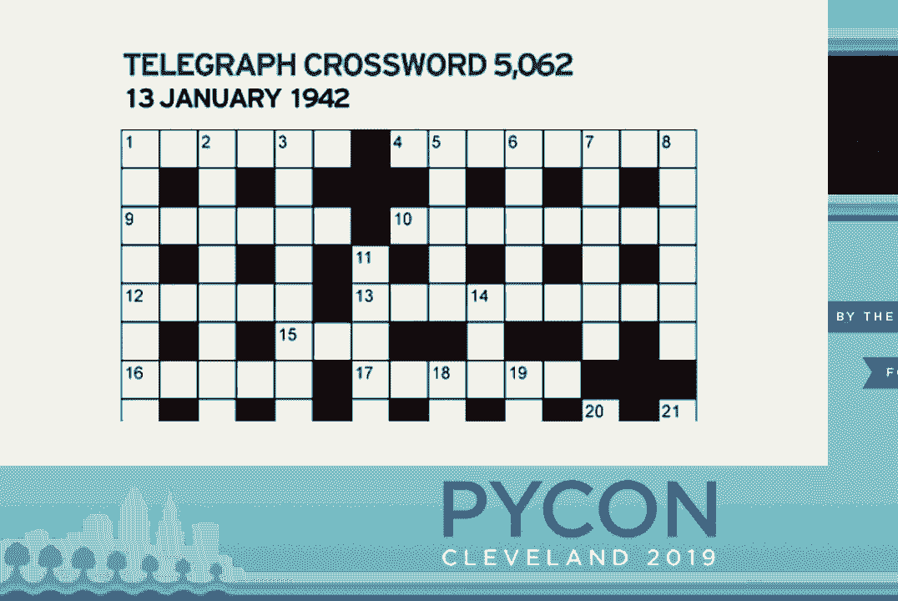

 So a brief overview of the technical， interview process in case some of you。

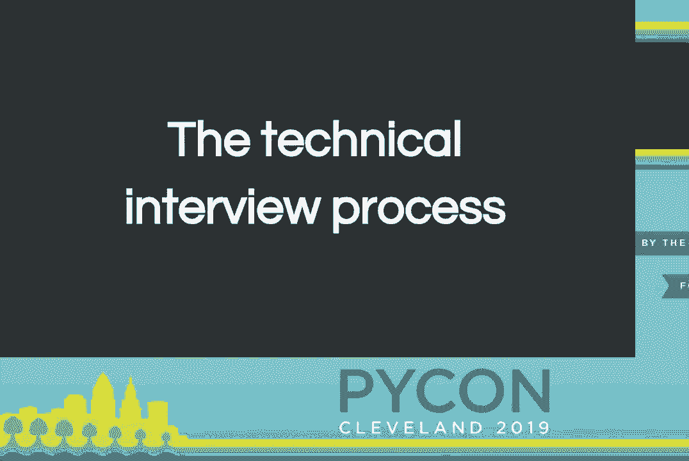

 haven't yet had a technical interview。 It usually starts with a， recruiter phone screen。

 I call this， a pulse check。 The recruiter will talk to you。

 for 20 or 30 minutes and ask you all the， general questions like。

 "Why are you applying for the role？ What do you know about the company？

 What have you been up to for the last， year or two？"， And if that goes well， you know， if you。

 can convince them that it's fun to， talk to you for 20 minutes， they'll。

 move you on to the next step， which is， typically a technical phone screen， with an engineer。

 And I forgot to， mention that there will， of course， be some variation in all of these。

 steps across companies， but， typically this is the flow。 The technical phone screen。

 with an engineer might or might not， have a web collaborative coding component。

 but typically it's 30 to 60 minutes， and， they'll ask you questions maybe about。

 your preferred programming language。 They may， you know， kind of poke at。

 your knowledge about different concepts， within that language。 And then depending。

 on the role they may ask you some domain， specific questions。 If you're applying。

 for a back-end Django role， they may， ask you some questions about Django。 Things like that。

 If this call goes well， typically， the next step is something called a， COM assessment。

 which is a mini， self-contained project that the， recruiter will probably email you。

 some instructions for。 And it's your job over the next， two to seven days to put together。

 some response or solution to， whatever the prompt is。 There is a bit of debate about。

 whether or not these are， effective or fair。 Some companies， unfortunately。

 use them to get a little free labor， out of people， which is not right。 But when done well。

 and when structured well， companies， can get a good sense of how a。

 candidate might fit in on a team in， terms of skill。 And the last step is。

 usually the on-site interviews。 This is the part that I always get， really nervous about。 Typically。

 there are at least four hours you， meet anywhere from three to ten， people， most of whom will be on。

 your team。 And a lot of the， interviews are technical in nature， and you're whiteboarding are。

 pair programming。 And I'll， explain what those are in a minute。 Also， a lot of behavioral。

 questions where people will ask you， things you've probably heard before。

 like what would you do if or how， do you approach conflict those kinds， of things。 Whiteboarding。

 you may know， is， when you and your interviewer are， standing in front of a big white。

 board instead of a computer screen， and working through what is， a pair programming is when you're。

 doing effectively the same thing， working together on a problem， but， actually coding。

 Pros and cons to both won't get into， the disagreements about which of， those are better。

 but there's a lot。

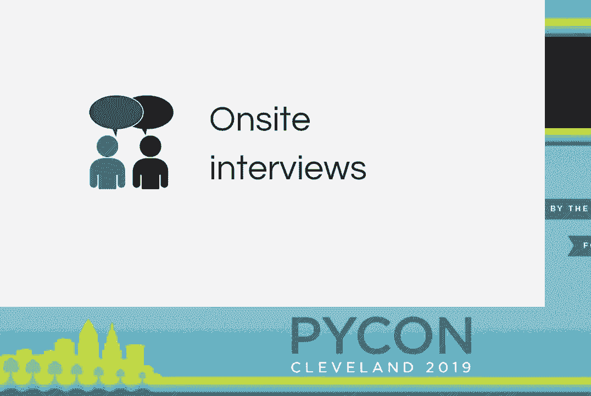

 of conversation about that online。 So， let's move into the skills， part。 First。

 I want to talk about， the non-technical skills。 People， often call these soft skills。

 I don't like to call them soft skills， because non-technical skills are， very important to people。

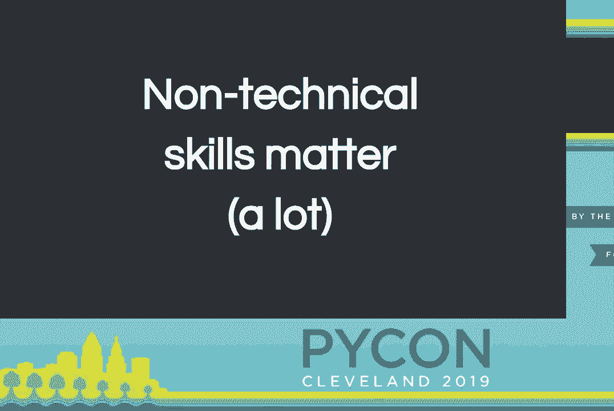

 And our personal stuff can be really， hard， but it really matters。

 And the first one of those is problem， solving。 And we hear this phrase。

 a lot as software engineers。 Everyone wants to work with people， who are great problem solvers。

 And to me， the phrase problem， solver is a shorthand for a， much longer description。 To me。

 it means using what you， already know to solve a specific， problem that might not be， defined。

 And for those of you with， a little more experience， you know， that this happens all the time in。

 your work。 So this is a skill that。

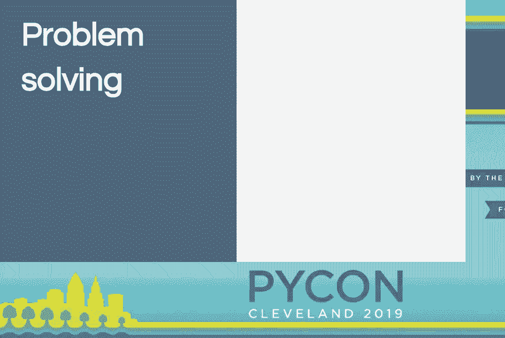

 your interviewers are going to be， screening for。 Another non-technical skill that。

 has been really important in my， career growth is the ability to ask， good questions。

 And I've linked， here to a blog article by Julia， Evans called "How to Ask Good， Questions。

" This is a fantastic， article I mention at any time I'm， talking to anyone who's early in。

 their career or going through the， interview process。 The main thing that I've pulled。

 out of it is a framework， around how to structure a， question so that it's most useful to。

 you and most useful to the person， you're asking it of。 And that is something like this。

 I'm trying to do this thing， but， this other thing is happening。 I already tried X and Y。

 Can you point me in the right， direction？ For me， when I use this， format。

 it's really effective because， I am able to show that I've already， tried doing something on my own。

 It didn't work， and so I tried， other things。 I can set a baseline。

 level of knowledge for the person， who I'm asking。 And then I make a specific ask， for help。

 I do also want to add here that， asking a good question should， be asked of the right person。

 And for me， the right person is， usually who knows the most about， this topic who is also the least。

 busy。 Typically you， well， actually， never， mind。 I was going to start talking about， Slack。

 but I'm not going to go down， that rabbit hole。 The third non-technical skill that I。

 wanted to highlight is about， understanding assumptions。 And this goes for both code and， people。

 We're probably very familiar with both， actually， but when you kind of， talk about engineering team。

 we can， talk about it a little more differently。 We know about understanding。

 assumptions about a problem， but I kind of go a level deeper， when I talk about understanding。

 assumptions。 I think about what things about， this problem do I think are facts。

 that I haven't actually taken the， time to prove or ask about。 And within that could also be things。

 like bias or expectations。 So when hiring managers are， interviewing candidates， this is。

 something that they may be looking for。 Same goes with people。 A hiring manager may be very。

 interested to know if a candidate， can kind of get inside their own， mind and make fewer。

 assumptions about their colleagues， through the use of asking good， questions。 An example would be。

 hey， when you， said this in a meeting， I wasn't， quite sure how you meant that。

 Could you explain a little more？ Checking assumptions about people。

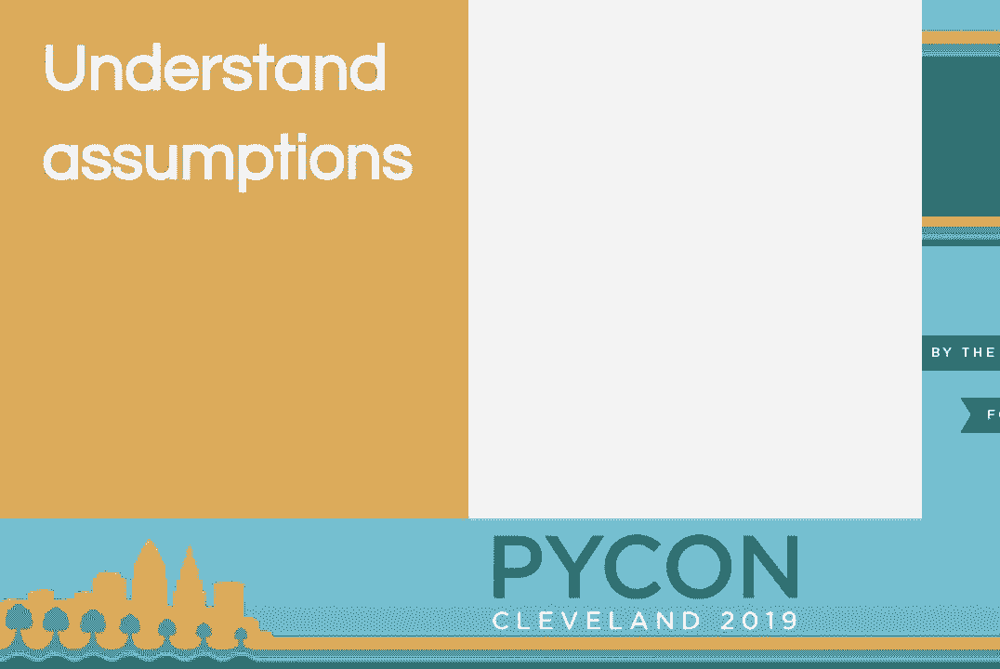

 helps your team run more smoothly。 So now we'll move on to the code， part。

 Code obviously matters a lot， in a technical interview。

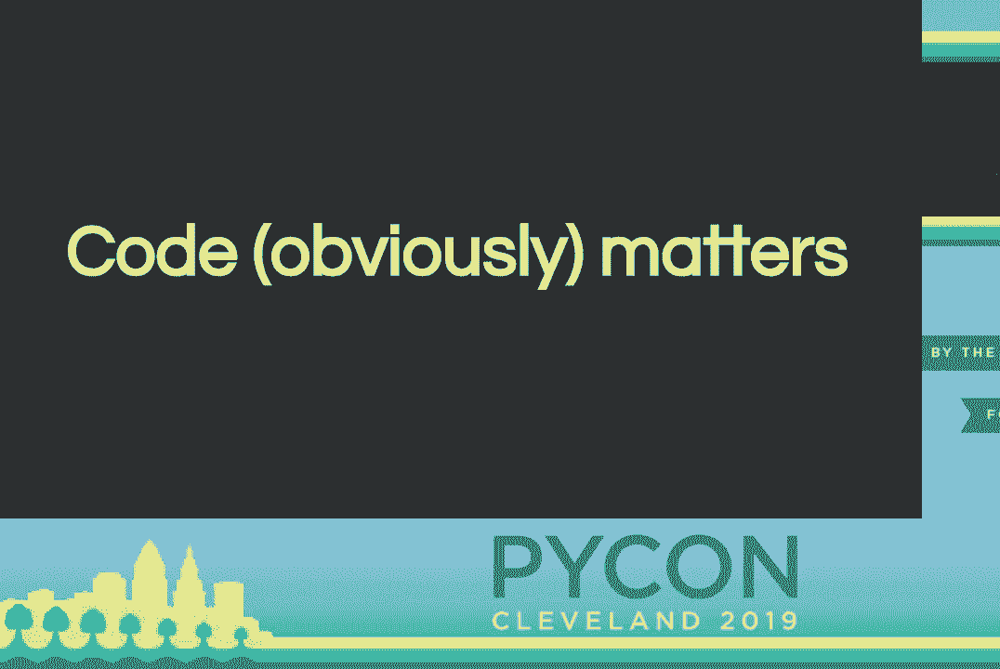

 And I wanted to start us off by， talking about collections。 So when I think about。

 approaching a coding challenge， for， example， I like to keep in mind。

 what are all of the tools that I， have in programming that can help， me solve a problem。

 And in my mind， collections are， the most powerful tool because。

 they help me store and organize， data。 These would be tuples， lists， dictionaries and sets。

 I'm purposefully not going into， syntax or methods or things like。

 that because I know you can all go， check the documentation。 But knowing these like the back of。

 your hand will save you so much， time in coding challenges。 If you can immediately recognize。

 which one of these collections to， use when， that will save you， time。 If you can memorize a。

 few very helpful methods that， are associated with each of these， collections， that can save you a。

 lot of time。 For example， with， dictionaries， if you can remember， oh， there's a keys of values and。

 an items method or iter items， method， that can save you a lot of， time。

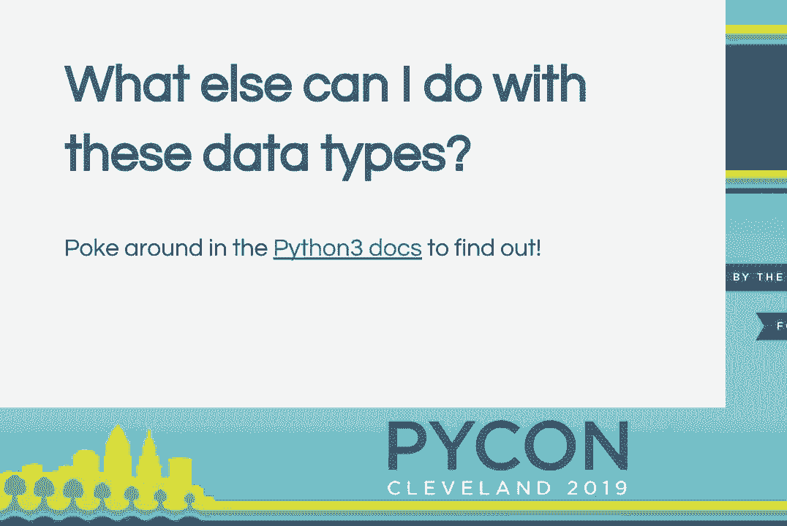

 And this is a link to the Python， 3 documentation。 So time complexity in my experience。

 comes up pretty much at the end， of every coding challenge。 Like probably many of you， I was。

 baffled by this at first。 I like to think that I'm a lot， better at it now。

 But basically time complexity is， referring to the amount of time it。

 takes to run an algorithm in the， worst case scenario compared to the， size of the input。

 So I think here， in case you need。

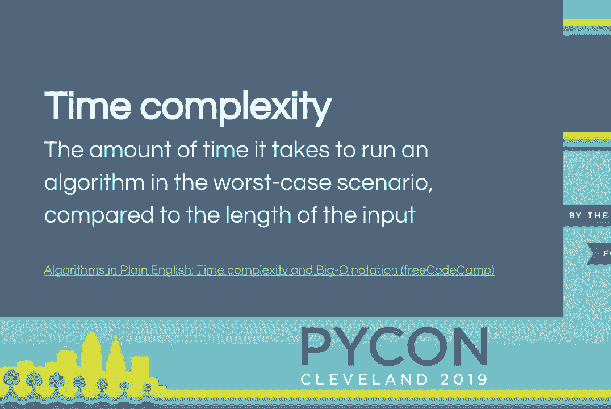

 a refresher， this goes to a， free code camp blog post。 Probably most of you have seen。

 this ubiquitous chart here， showing all of the various time， complexities。

 I do want to note is on a， logarithmic scale。 So O of log in is that red line。

 that you see all the way down on， the x axis。 And the important， thing to pull from this chart is。

 that the closer the line is to the， y axis。 You really want to stay away from。

 run times that are closer to the， y axis。 The most common run times that。

 have come up in my experience as， someone who is early in my career。

 when I do coding challenges for， interviews are these four。 So constant time， which is O of， one。

 linear time， which is O of， n， log n， which we just talked， about， that often comes up with。

 binary search and O of n squared。 So I'm going to have time to go， into what all of these mean and。

 how you get them。 But again， check out that link that I， provided on the first slide if。

 you need a refresher。 There are actually a few more as， well。 So it would be good to know。

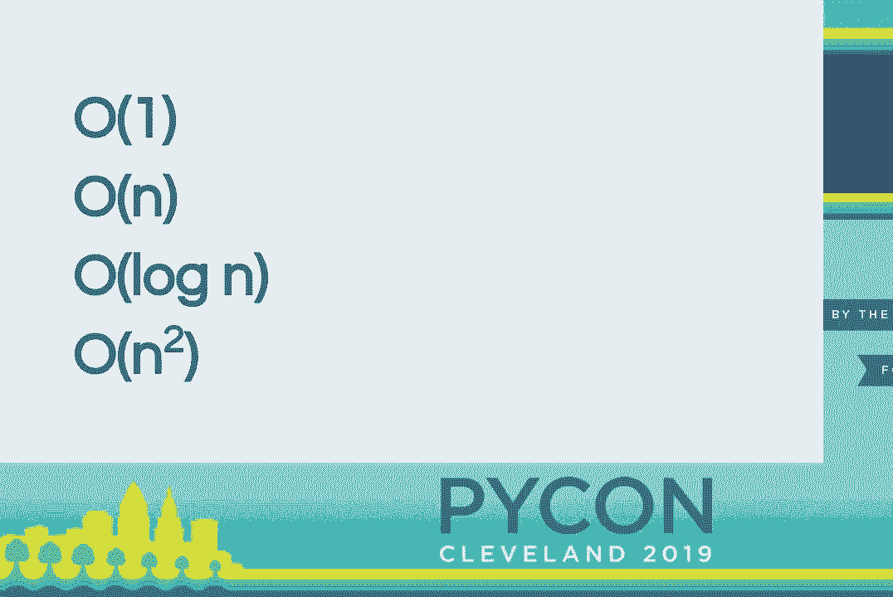

 how those work。 But these are， the ones that I come across most， commonly。 Okay。 Recursion。

 How many of you have ever been， afraid of recursion？ Recursion is at its core an。

 elegant method of solving a， problem where the solution depends， on solutions to smaller。

 occurrences of that same problem。 And recursion， when you。

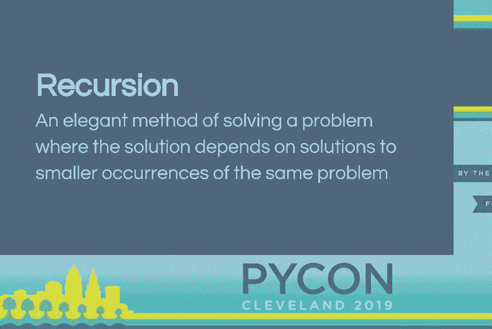

 write a recursive function， it， has to have two components， a， base case and progress。

 And the base case just means， how will I know when I'm done， recursing or how will my function。

 know when it can stop calling， itself。 And the progress， portion is to continually。

 reduce the problem until you， get down to the base case。 I'll swagart to spoke at。

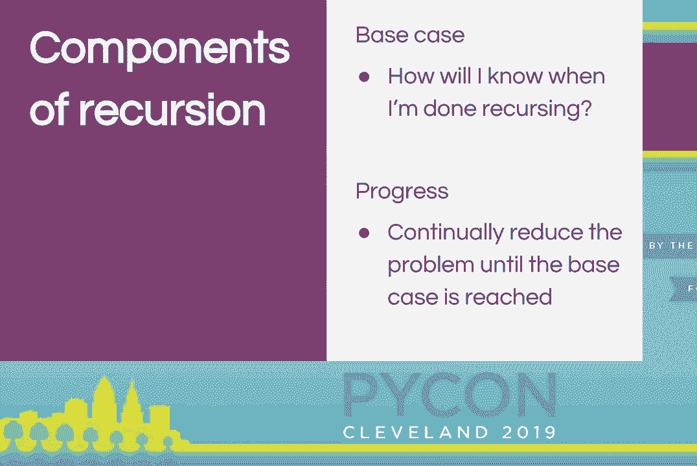

 North Bay Python last year， did， a fantastic talk on recursion。 I wish I had listened or。

 watched this talk three years， ago when I was just getting， started。 I really， really。

 encourage you to watch it。 Again， you'll have access to， these slides with the bitly， content。

 And I think it's 20 or 30 minutes。 And he just does a really good， job of breaking it down and。

 also high five al for a really， fantastic talk title about。

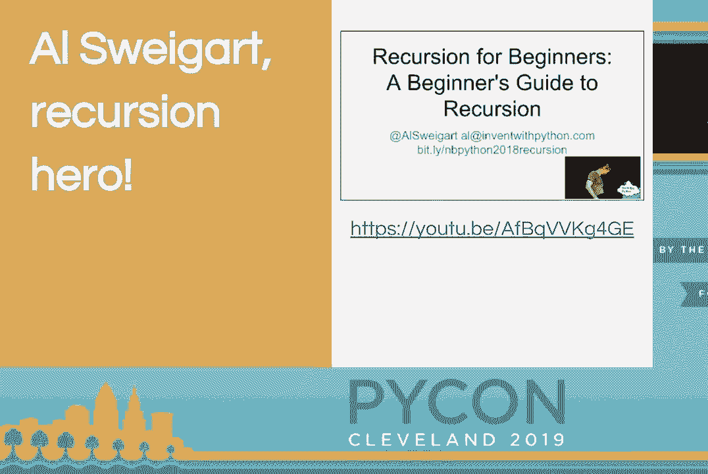

 recursion。 Object oriented programming， just comes up all the time in。

 interviews because Python is an， object oriented language。 And classes and objects are。

 absolutely everywhere in， production code， at least， from my experience and from。

 most of the folks who I've， coached。 I've again linked to， an external resource here。

 This one's from real python。com。 If you need an OOP refresher， I highly recommend checking out。

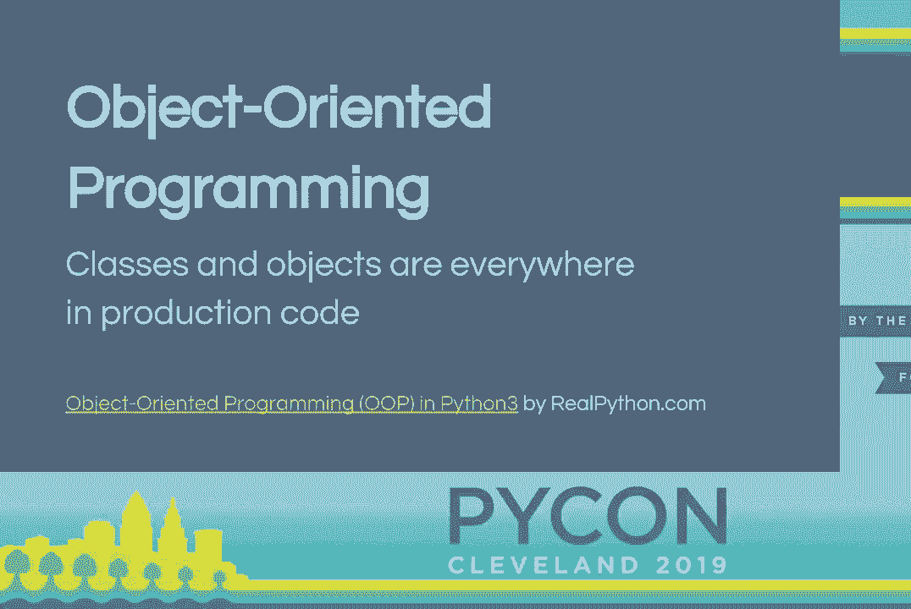

 that resource。 Really at its core， you need to， know about defining classes。

 and attributes and knowing the， difference between class， attributes and method attributes。

 And likewise， knowing the， difference between class methods， and instance methods。

 And if OOP comes up in an， interview， you are also most likely， going to be asked， but why do we。

 like OOP？ And your answer， should include each of these， three keywords。 Encapsulation， inheritance。

 and polymorphism。 Again， we're not going to go into， great detail here， but that link I。

 provided at the beginning is a， great thing。

 So I really， really recommend， knowing how to talk about each， of these three things。

 Data structures and algorithms。 There's a free book available， online called problem solving。

 with algorithms and data， structures using python。 I shortened that in the rest of。

 these slides to piece ads up。 And it's written by Brad Miller， and David Rannam。 I highly， highly。

 highly recommend， on almost every slide from here， on out。 I won't be telling you that I。

 have linked to the slide。 You can at this point read it， for yourself。

 But all of the data structures， and algorithms that I'm going， to present in the next ten minutes。

 are in that book。 So while we don't have time to go， over the python code in this talk。

 all of the python code is there。

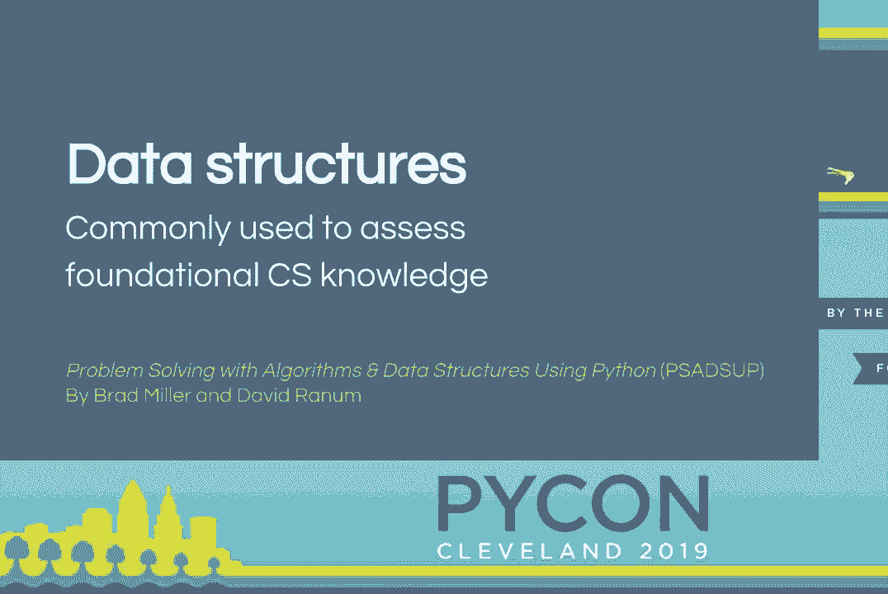

 waiting for you。 So first we'll start with the linear。

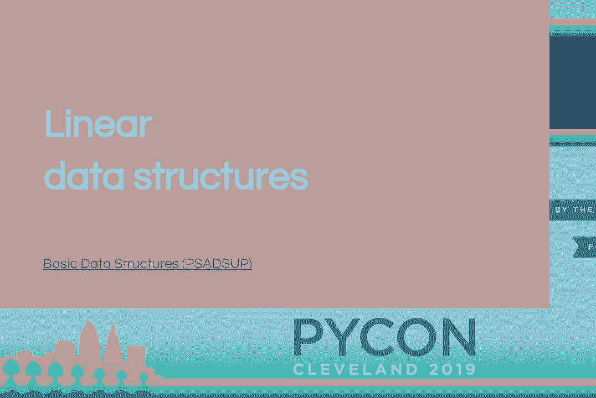

 data structures stacks， which you， can think of like a stack of， plastic。

 So we're going to take a stack， and we're going to take a stack， and we're going to take a stack。

 and we're going to take a stack， and we're going to take a stack， and we're going to take a stack。

 and we're going to take a stack， and we're going to take a stack， and we're going to take a stack。

 and we're going to take a stack， and we're going to take a stack， and we're going to take a stack。

 and we're going to take a stack， and we're going to take a stack， and we're going to take a stack。

 and we're going to take a stack， and we're going to take a stack， and we're going to take a stack。

 and we're going to take a stack， and we're going to take a stack， and we're going to take a stack。

 and we're going to take a stack， and we're going to take a stack， and we're going to take a stack。

 and we're going to take a stack， and we're going to take a stack， and we're going to take a stack。

 and we're going to take a stack， and we're going to take a stack， and we're going to take a stack。

 and we're going to take a stack， and we're going to take a stack， and we're going to take a stack。

 and we're going to take a stack， and we're going to take a stack， and we're going to take a stack。

 and we're going to take a stack， and we're going to take a stack， and we're going to take a stack。

 and we're going to take a stack， and we're going to take a stack， and we're going to take a stack。

 and we're going to take a stack， and we're going to take a stack， and we're going to take a stack。

 and we're going to take a stack， and we're going to take a stack， and we're going to take a stack。

 and we're going to take a stack， and we're going to take a stack， and we're going to take a stack。

 and we're going to take a stack， and we're going to take a stack， and we're going to take a stack。

 and we're going to take a stack。

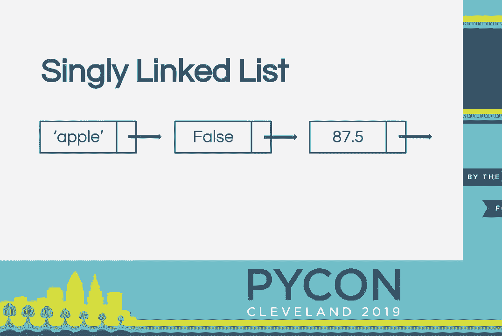

 and we're going to take a stack， and we're going to take a stack， and we're going to take a stack。

 and we're going to take a stack， and we're going to take a stack， and we're going to take a stack。

 and we're going to take a stack， and we're going to take a stack， and we're going to take a stack。

 and we're going to take a stack。

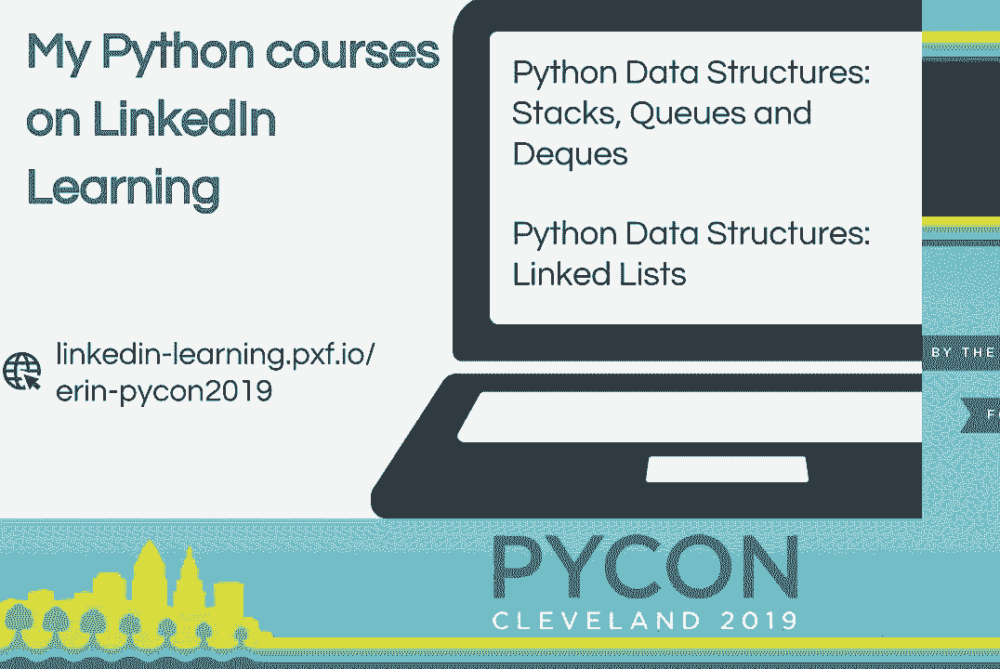

 and we're going to take a stack， and we're going to take a stack。

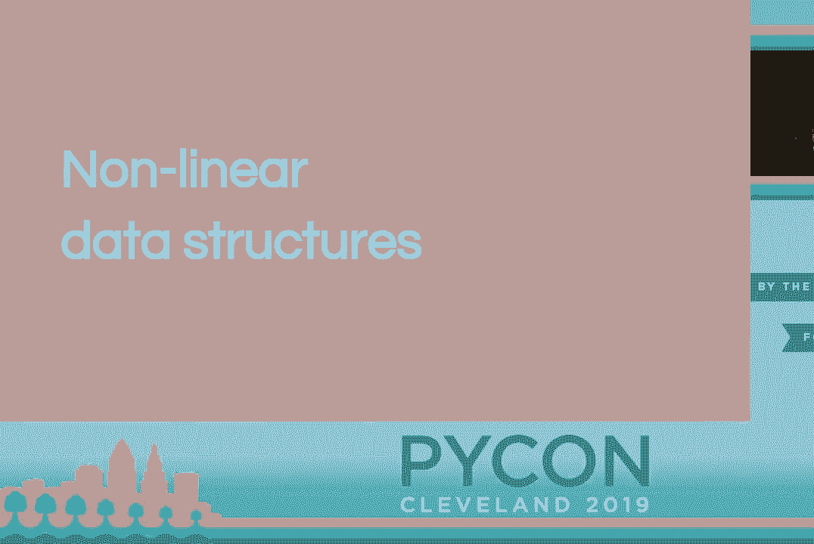

 and we're going to take a stack， and we're going to take a stack， and we're going to take a stack。

 and we're going to take a stack， and we're going to take a stack， and we're going to take a stack。

 and we're going to take a stack， and we're going to take a stack， and we're going to take a stack。

 and we're going to take a stack， and we're going to take a stack， and we're going to take a stack。

 and we're going to take a stack， and we're going to take a stack， and we're going to take a stack。

 and we're going to take a stack， and we're going to take a stack， and we're going to take a stack。

 and we're going to take a stack， and we're going to take a stack， and we're going to take a stack。

 and we're going to take a stack， and we're going to take a stack， and we're going to take a stack。

 and we're going to take a stack， and we're going to take a stack， and we're going to take a stack。

 and we're going to take a stack。

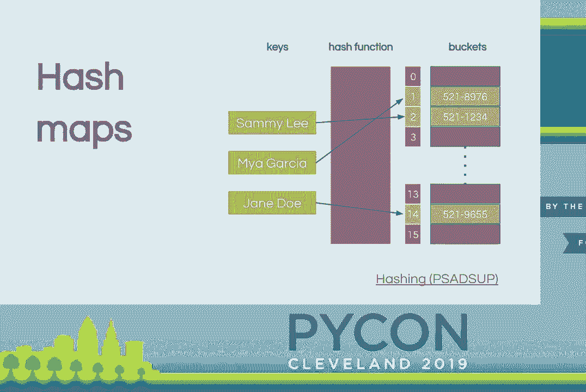

 and we're going to take a stack， and we're going to take a stack， and we're going to take a stack。

 and we're going to take a stack， and we're going to take a stack， and we're going to take a stack。

 and we're going to take a stack， and we're going to take a stack， and we're going to take a stack。

 and we're going to take a stack， and we're going to take a stack， and we're going to take a stack。

 and we're going to take a stack， and we're going to take a stack， and we're going to take a stack。

 and we're going to take a stack， and we're going to take a stack， and we're going to take a stack。

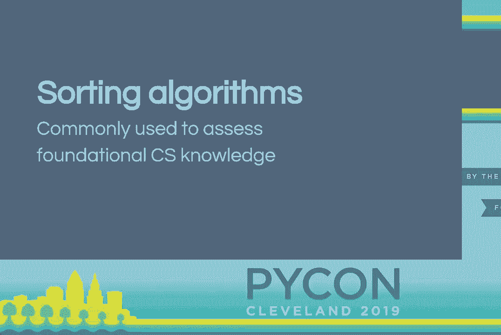

 and we're going to take a stack， and we're going to take a stack， and we're going to take a stack。

 and we're going to take a stack， and we're going to take a stack， and we're going to take a stack。

 and we're going to take a stack， and we're going to take a stack， and we're going to take a stack。

 and we're going to take a stack， and we're going to take a stack， and we're going to take a stack。

 and we're going to take a stack， and we're going to take a stack， and we're going to take a stack。

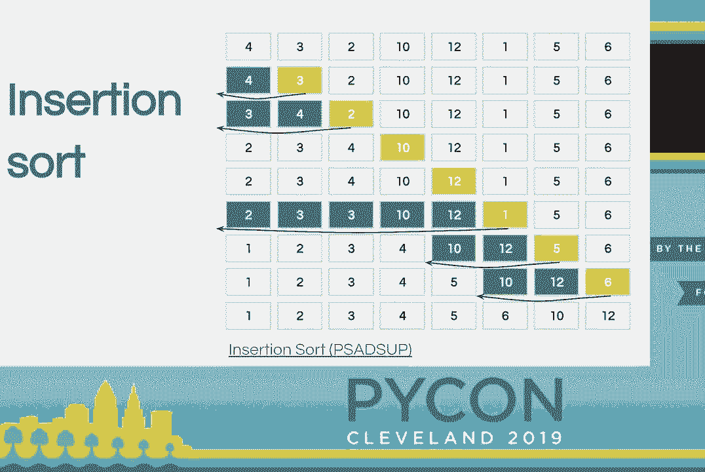

 and we're going to take a stack， and we're going to take a stack， and we're going to take a stack。

 and we're going to take a stack， and we're going to take a stack， and we're going to take a stack。

 and we're going to take a stack， and we're going to take a stack， and we're going to take a stack。

 and we're going to take a stack， and we're going to take a stack， and we're going to take a stack。

 and we're going to take a stack。

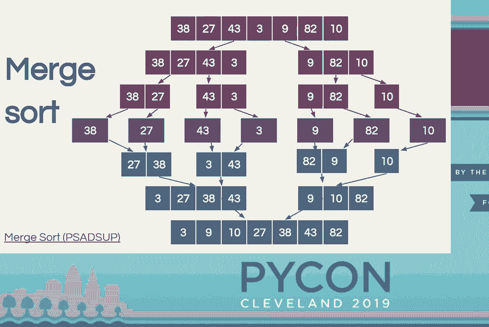

 and we're going to take a stack， and we're going to take a stack， and we're going to take a stack。

 and we're going to take a stack， and we're going to take a stack， and we're going to take a stack。

 and we're going to take a stack， and we're going to take a stack， and we're going to take a stack。

 and we're going to take a stack。

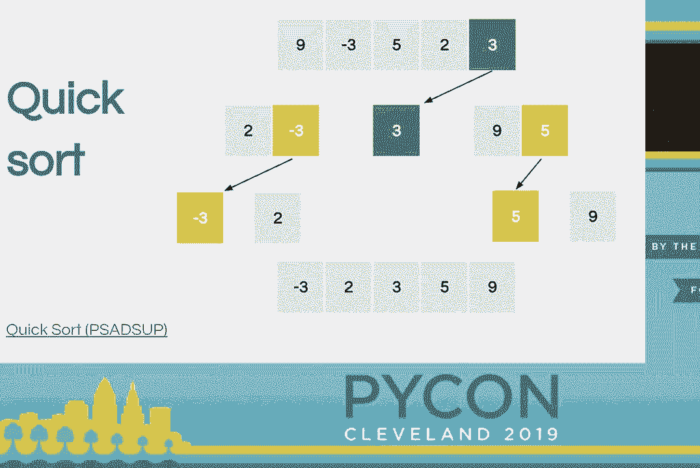

 and we're going to take a stack， and we're going to take a stack， and we're going to take a stack。

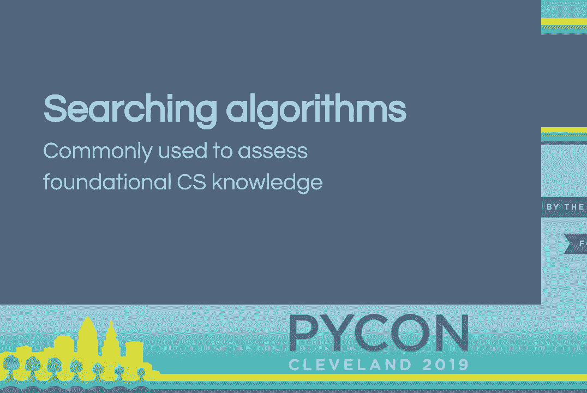

 and we're going to take a stack， and we're going to take a stack， and we're going to take a stack。

 and we're going to take a stack， and we're going to take a stack， and we're going to take a stack。

 and we're going to take a stack， and we're going to take a stack， and we're going to take a stack。

 and we're going to take a stack， and we're going to take a stack， and we're going to take a stack。

 and we're going to take a stack， and we're going to take a stack， and we're going to take a stack。

 and we're going to take a stack， and we're going to take a stack， and we're going to take a stack。

 and we're going to take a stack， and we're going to take a stack， and we're going to take a stack。

 and we're going to take a stack， and we're going to take a stack， and we're going to take a stack。

 and we're going to take a stack， and we're going to take a stack， and we're going to take a stack。

 and we're going to take a stack， and we're going to take a stack， and we're going to take a stack。

 and we're going to take a stack， and we're going to take a stack， and we're going to take a stack。

 and we're going to take a stack， and we're going to take a stack， and we're going to take a stack。

 and we're going to take a stack， and we're going to take a stack， and we're going to take a stack。

 and we're going to take a stack。

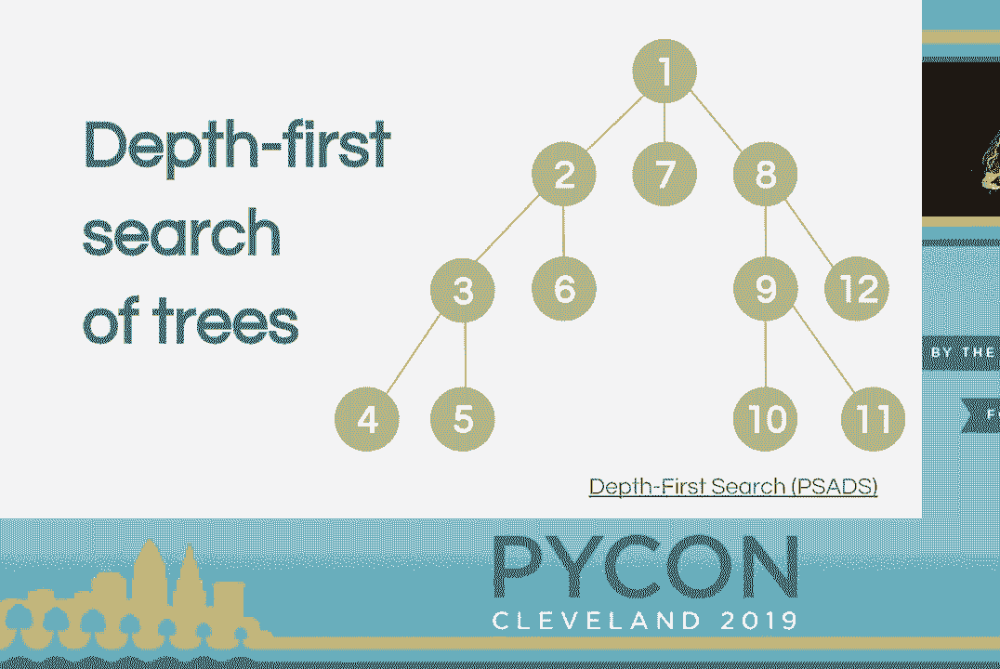

 and we're going to take a stack， and we're going to take a stack， and we're going to take a stack。

 and we're going to take a stack， and we're going to take a stack， and we're going to take a stack。

 and we're going to take a stack， and we're going to take a stack， and we're going to take a stack。

 and we're going to take a stack， and we're going to take a stack， and we're going to take a stack。

 and we're going to take a stack， and we're going to take a stack， and we're going to take a stack。

 and we're going to take a stack， and we're going to take a stack， and we're going to take a stack。

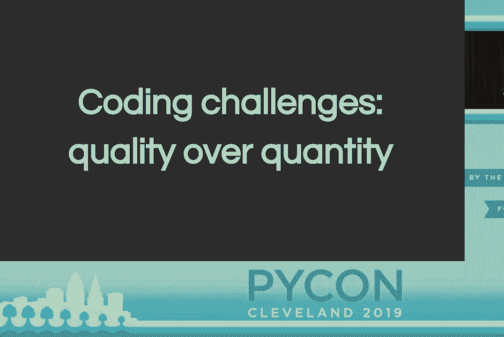

 and we're going to take a stack， and we're going to take a stack， and we're going to take a stack。

 and we're going to take a stack， and we're going to take a stack， and we're going to take a stack。

 and we're going to take a stack， and we're going to take a stack。

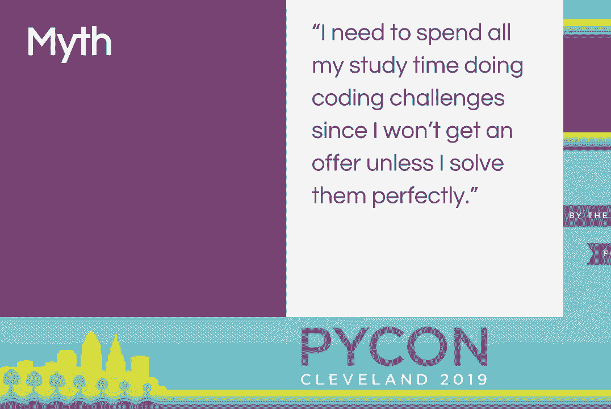

 and we're going to take a stack， and we're going to take a stack， and we're going to take a stack。

 and we're going to take a stack， and we're going to take a stack， and we're going to take a stack。

 and we're going to take a stack， and we're going to take a stack， and we're going to take a stack。

 and we're going to take a stack， and we're going to take a stack， and we're going to take a stack。

 and we're going to take a stack， and we're going to take a stack， and we're going to take a stack。

 and we're going to take a stack， and we're going to take a stack， and we're going to take a stack。

 and we're going to take a stack， and we're going to take a stack， and we're going to take a stack。

 and we're going to take a stack， and we're going to take a stack， and we're going to take a stack。

 and we're going to take a stack， and we're going to take a stack， and we're going to take a stack。

 and we're going to take a stack， and we're going to take a stack， and we're going to take a stack。

 and we're going to take a stack， and we're going to take a stack， and we're going to take a stack。

 and we're going to take a stack， and we're going to take a stack， and we're going to take a stack。

 and we're going to take a stack， and we're going to take a stack， and we're going to take a stack。

 and we're going to take a stack。

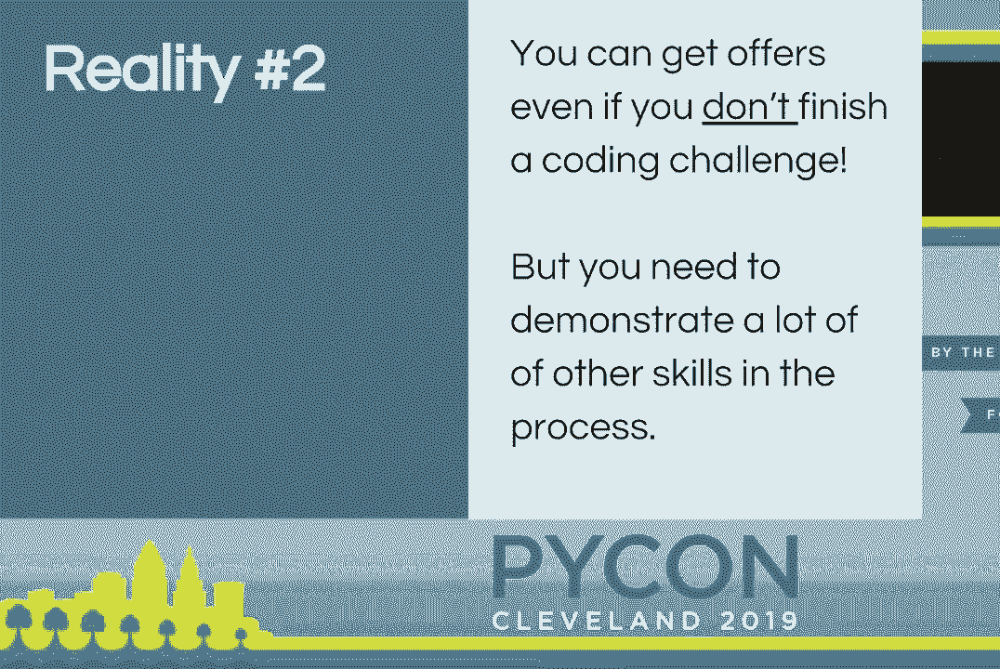

 and we're going to take a stack， and we're going to take a stack， and we're going to take a stack。

 and we're going to take a stack， and we're going to take a stack， and we're going to take a stack。

 and we're going to take a stack， and we're going to take a stack， and we're going to take a stack。

 and we're going to take a stack， and we're going to take a stack， and we're going to take a stack。

 and we're going to take a stack， and we're going to take a stack， and we're going to take a stack。

 and we're going to take a stack， and we're going to take a stack， and we're going to take a stack。

 and we're going to take a stack， and we're going to take a stack， and we're going to take a stack。

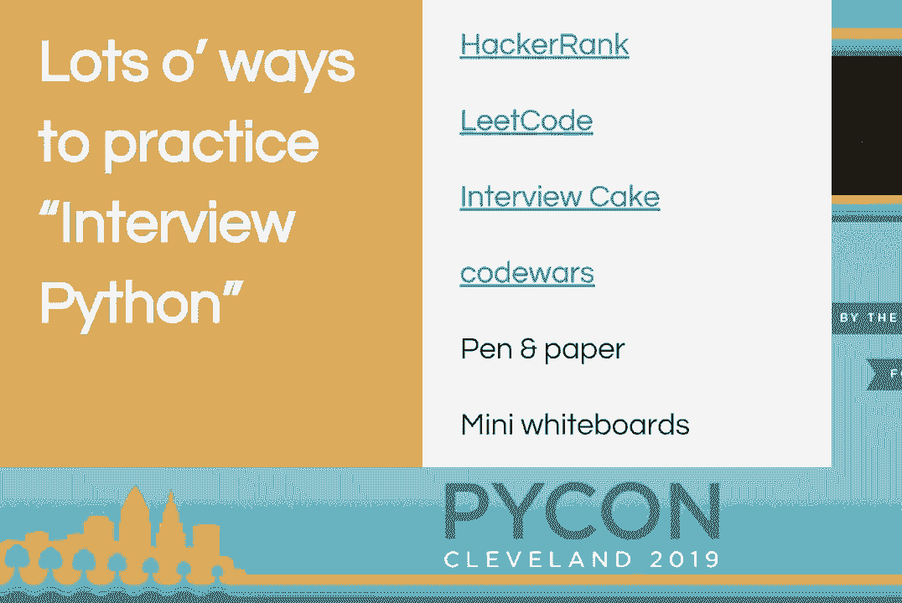

 and we're going to take a stack， and we're going to take a stack， and we're going to take a stack。

 and we're going to take a stack， and we're going to take a stack， and we're going to take a stack。

 and we're going to take a stack， and we're going to take a stack， and we're going to take a stack。

 and we're going to take a stack， and we're going to take a stack， and we're going to take a stack。

 and we're going to take a stack， and we're going to take a stack， and we're going to take a stack。

 and we're going to take a stack， and we're going to take a stack， and we're going to take a stack。

 and we're going to take a stack， and we're going to take a stack， and we're going to take a stack。

 and we're going to take a stack， and we're going to take a stack， and we're going to take a stack。

 and we're going to take a stack。

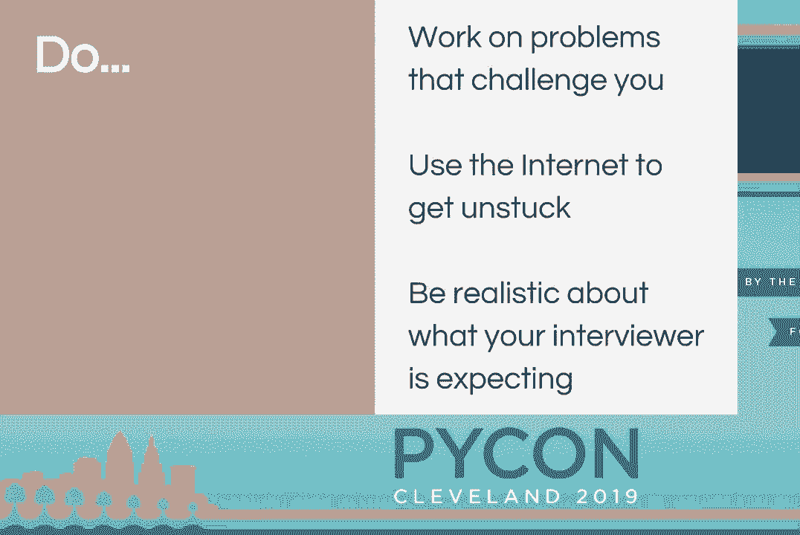

 and we're going to take a stack， and we're going to take a stack， and we're going to take a stack。

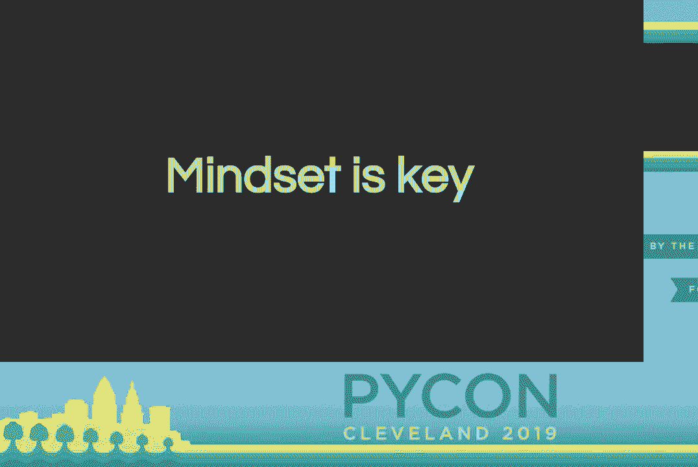

 and we're going to take a stack， and we're going to take a stack， and we're going to take a stack。

 and we're going to take a stack， and we're going to take a stack， and we're going to take a stack。

 and we're going to take a stack， and we're going to take a stack， and we're going to take a stack。

 and we're going to take a stack， and we're going to take a stack， and we're going to take a stack。

 and we're going to take a stack， and we're going to take a stack， and we're going to take a stack。

 and we're going to take a stack， and we're going to take a stack， and we're going to take a stack。

 and we're going to take a stack， and we're going to take a stack， and we're going to take a stack。

 and we're going to take a stack， until I finally get an offer， so I'm kind of going to twist。

 this a little bit and say， yes because it's part of the process。

 I would encourage you to front load it， apply for jobs before you're ready。

 get as many phone screens as you can， fail and fail and fail and just。

 recycle everything you learned from those failures， into your next interview。

 and your next interview， Next one， I love this one， I made this one up myself。

 every company to want to hire you， it feels good if every company， wants to hire you。

 maybe for a small sliver of people， every company does want to hire them。

 but most of us don't fall into that category， you only need one company， to want to hire you。

 to get a new job， and hopefully it's the right company， but if that is true。

 you don't need to beat yourself up， if a company decides not to move forward。

 with you it just means that they， for whatever reason were not， the right company at that time。

 so I want to bring it back to the， crossword puzzle from 1942。

 just to remind you that we have come a long way， and while it may feel really。

 overwhelming to think about， studying data structures and algorithms。

 and knowing all of these collection types， and having to also remember， to be a good human。

 it boils down to， these essential things around problem solving， and recognizing patterns。

 and being curious。

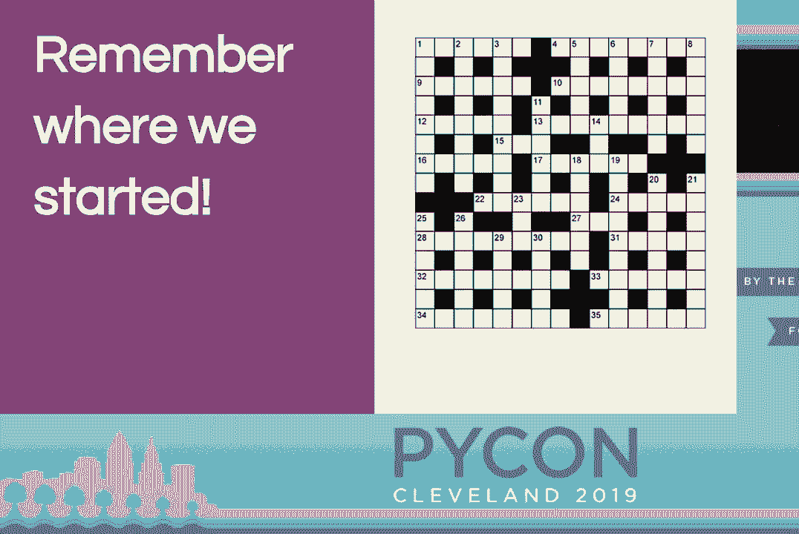

 and also you got this， go forth， interview， get offers， accept offers， there's my email address。

 if you didn't get the slide link， at the beginning you're welcome to email me。

 I can send you the link， feel free to reach out and share， any successes you might have。

 and again thank you for coming， I really appreciate it， [applause]。

