# PyCon 2019 演讲全集 - P2：Moses Schwartz, Andy Culler - A Snake in the Bits - Security Automation with Pyt - leosan - BV1qt411g7JH

 All right， should we do this？ Good morning。 How's everybody doing？ Awesome。

 A few quick housekeeping tasks。 If you have a device that makes noise。

 please make it so it doesn't make noise。 Please hold your questions till the end of the talk。

 If there's time， we will take questions then。 And if not， catch these guys afterwards。

 So please welcome Moses Schwartz and Andy Cullen。 They'll be giving the talk a snake in the bits。

 Security Automation with Python。 Thanks， everyone。

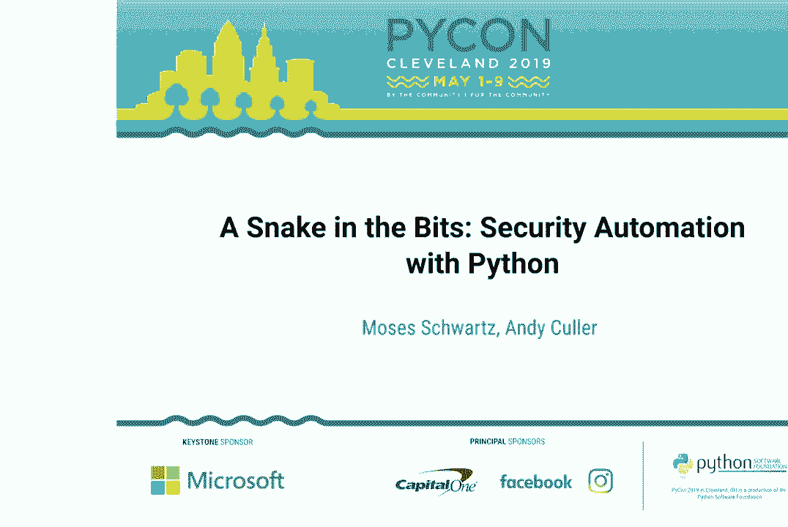

 Thank you for being here。 Thanks to all the volunteers and organizers。 Super excited to be here。

 So I'm Moses。 This is my co-worker Andy。 We've also got Jonathan from our team watching us here。

 We work at Box on the Security Automation Team， which means we basically write software and manage infrastructure。

 that supports our incident response team， our application， security team。

 and even going and building， stuff for compliance and other groups。

 that are all under that security umbrella。 So we're going to talk about a DIY approach。

 to building automations to support these teams in Python。 This isn't to talk about what Box does。

 rather it's a general introduction。 But there are a lot of parallels。

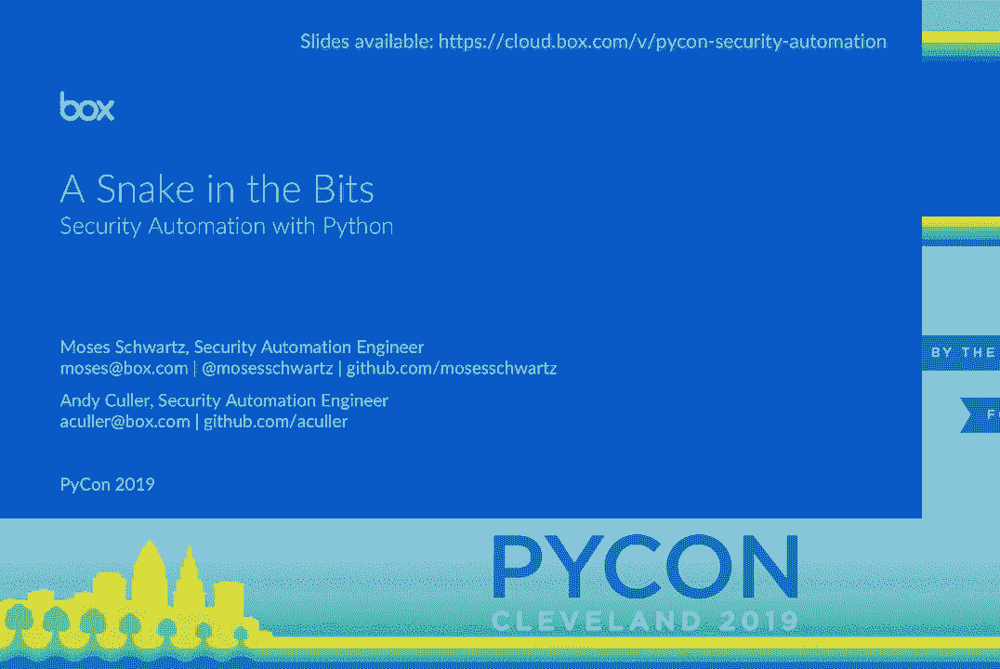

 with how we've actually built out our infrastructure。

 So one of the first things that's really important to understand。

 is what the infrastructure looks like for an incident response。

 or a security monitoring team like your SOC。 So essentially， you've got all of these things that。

 are creating logs， whether they're individuals laptops， or your servers， or network hardware。

 things like that。 And so you need to feed all of those logs。

 into some sort of centralized aggregation system。 From there， most of those systems。

 will allow you to build some kind of alert。 When an alert triggers， you'll create a ticket。

 And then you've got some analysts that， has to take a look at that ticket。

 And so a big part of an analyst job， before you automate things is opening up browser tabs。

 copying data from the ticket， pacing it， into these web-based tools， getting information back。

 putting in the ticket。 Lots of just kind of repetitive back and forth there。 So as engineers。

 we see this， and we're like， oh， we can do something about that。 However。

 we have to start at the beginning。 So Splunk is a really popular example。

 of a log aggregation system that will let you create alerts。 So just super briefly。

 you start out with a search。 And the search criteria will then go through the logs。

 and return you any relevant log information。 And from there， we can develop an alert。

 So Splunk lets you take your search， put it into an alert。 You set up a timing。 In this case。

 it's a cron style time。 It's going to run every 15 minutes。 And then we set a 15-minute look back。

 So it only looks at the last 15 minutes of logs， to determine if it should trigger an alert。

 And that's really important， because otherwise， you're going to get duplicate alerts。

 So then after you have the alert， you need to actually do something with the data， that it surfaces。

 right？ So a really popular way to handle the next step， is to send a post request out to some API。

 that then does ticketing or enrichment， or whatever you need it to do。 So in this case。

 it's going to this sketchy， digital ocean IP address that we use for our demo purposes。

 And so it just sends a web hook to this API that we've set up。

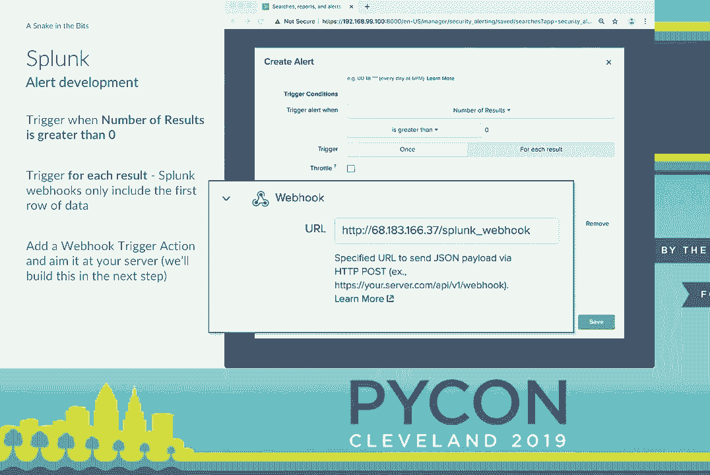

 So we're going to jump right into writing the code， to actually receive that web hook。

 So we're going to start just by writing a bit of code。 We're going to use Flask。

 super popular micro framework， for building web apps， super commonly used for APIs。

 in some more use cases。 So we're going to import Flask， instantiate it。

 And the first thing we're going to do， is set up a status or health check endpoint。

 That's super useful。 Because first off， we can stop right there， run that。

 and that's like our hello world to make sure， we actually did this thing right。 Later on。

 that's going to be super helpful， because we can check that endpoint after we say。

 push an update to make sure things are back up and running。

 And that makes it super easy to integrate， into status monitoring systems where， you know。

 they'll basically do a heartbeat kind of thing， and send a request to this endpoint periodically。

 and let you know if your service goes down。 Then we're going to jump into the code。

 to write the Splunk web hook receiver。 So in there。

 we're going to just go into the Flask request object， and grab the JSON payload。 And right now。

 we're just going to write that out， into a JSON file。 That bit of code is not going to persist。

 to the end of the example。 But I want to kind of give insight into how we go。

 about developing these things。 So I'm going to jump right up onto that server， just SSH in。

 run Python automation server。py。 This is going to spin it up in Flask's development server。

 And it's just going to sit there， listening， waiting until we receive that Splunk web hook。 Now。

 you're probably -- if you're doing this in practice。

 you're probably going to want to make Splunk fire， that alert every minute or so。

 You really don't want to wait 15 minutes to test your code。 But when we finally do get it。

 it's going to print out。

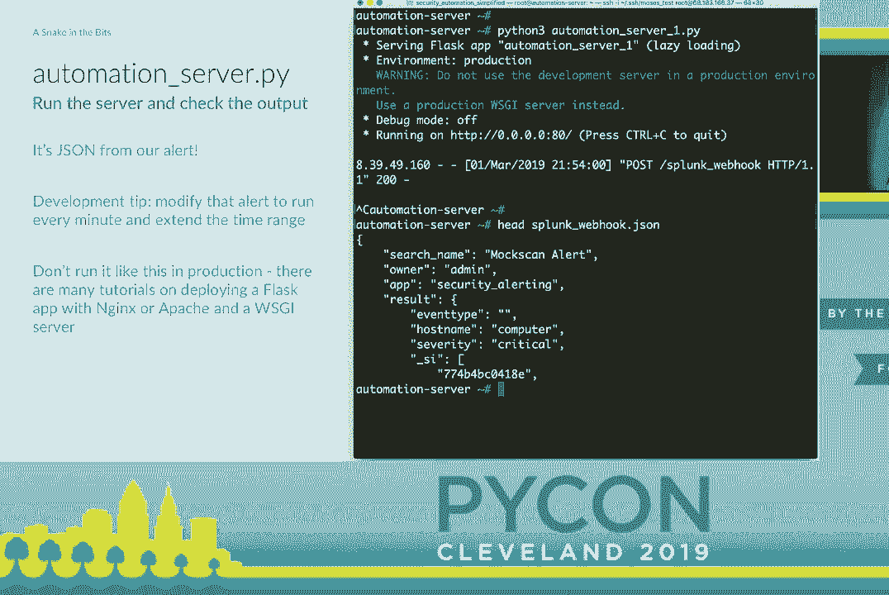

 basically a log entry to the screen。 We will have received this web hook。

 And then I'm just going to Control-C out and print the first few， lines from that JSON file。

 So we can see what Splunk is sending us。 And then there we've got a search name， some metadata。

 the owner。 And then we've got the raw results。 So I'm going to take a brief detour。

 Before we go back to automation server。py， and add more functionality， we're going to start needing。

 to use user names and passwords and other configuration things。

 So a quick and dirty way to keep that stuff out of our code。

 base without going all into secrets management is just to， have something like a settings。

py file that you don't check， in with your repo。 So in the next few slides， you'll see settings。

user name and， things like that。 That's what it's referring to。

 So back to that automation server code。 Here we are going to go write a new function to create a Jira。

 issue。 That's going to be our ticketing system。 So we're just going to use Atlassian's SDK。

 Connect to Jira。 You just need a URL， use your name and password。 And then it's literally one line。

 although broken up to be， readable， to create an issue。 Just specify project。

 name what we want the summary or ticket， name to be。

 And then we're going to dump the entire JSON result into the， description field。

 So we can now go back into our digital ocean droplets， start up。

 this new code and just let it sit until we get the next。

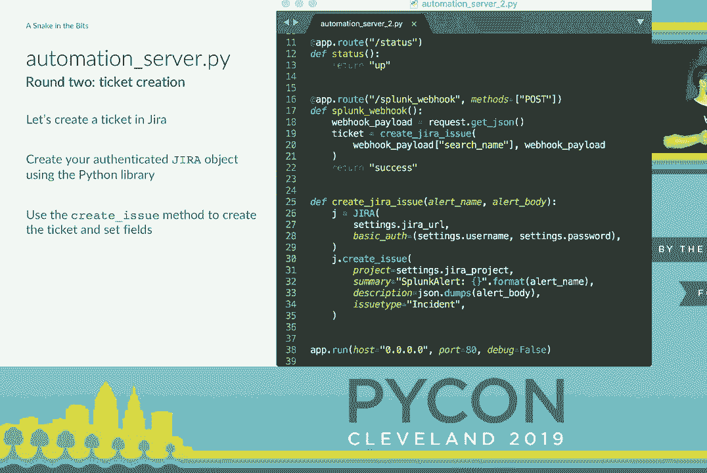

 spunk webhook。 When that fires， we're right away going to go reach out to Jira， and create a ticket。

 This almost starts to be kind of cool。 We at least have a ticket。 We've got some information there。

 But it's an ugly raw JSON blob。 This is actually kind of the default state for a lot of socks。

 and response teams before they start doing automation。

 They create a ticket based on an email or a webhook or something。

 And it really just has that raw information。 But we can do something to make that a little bit more useful。

 So I'm actually going to go into the Jira configuration and set up。

 a webhook that's going to fire when those tickets are created。

 So we're going to come up with a name。 We're going to call this a mock scan alert because the fake。

 data we're using was called mock scan。 And we're going to give it a URL。 Again。

 we've got our IP address and super verbose name Jira， mock scan created webhook。

 And then at the bottom， we're going to specify a JQL or Jira， query language， I think。

 query to let it know what kinds of， tickets we want this webhook to fire on。

 So you can actually filter based on anything that you can， search for in Jira。

 If you scroll down further on the page， you can also choose to。

 fire webhooks on ticket creation or closing or other cases。

 But right now we're going to focus on just creation。 So once that's set up。

 the next time Splunk fires a webhook and， we create a ticket。

 Jira is going to reach back out to our。

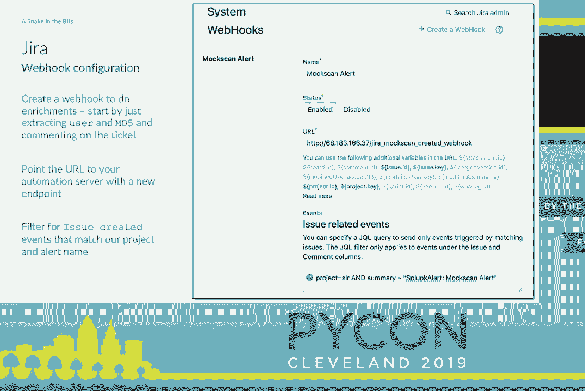

 automation server and try to call that endpoint。 So we've got to write code for that now。

 We're going to add a new function， this Jira comment， function。

 It's really similar to the ticket creation one。 Just going to connect to Jira。

 grab the issue based on the， key， and then we're going to add a comment。

 And that's basically just to take string and post it in there。

 Then we're going to write the endpoint to actually handle that， webhook。

 calling this mock scan created。 We specify the route up above， say it's where expecting a post。

 call。 And then again we're going to pull the JSON out of that request。

 object and then do a bit of ugly JSON parsing。 We could have simplified this maybe。

 but ended up deciding not， to because dealing with ugly JSON blobs is like half of the。

 job that we do day to day。 So we're going to pull out that the results that was in that。

 description field and that was actually JSON that we wrote in， there so it's double encoded。

 We're going to load that JSON again。 But finally we can pull out a few fields。

 We're going to grab a user and mv5。 And then we can go call our Jira comment function and comment on。

 that ticket with that information extracted from the JSON。

 That's not a whole lot more useful than just having it in that， JSON。

 But if we were to go and do a lookup， say take that user name and， look them up in Active Directory。

 then that starts to be useful。 So to do that we're going to write another script and this is not。

 tied to Flask or the rest of the application at all。

 This is just plain Python using the LDAP3 module。 We're going to write a little function to search Active Directory。

 given a user name and this return a dictionary that has the， results。

 So this is what this looks like when you look up my user name。

 And then we can go back to our automation server and set up a new。

 function that's going to go call our new script， that function in it。 Do a bit of string formatting。

 pull out the fields that we think， are most interesting。 Format， a comment string。

 And then we're just going to call that Jira comment function again。

 And that'll post that information。 Then in our mock scan created endpoint we just have to add a call。

 to that function。 Now when the web hook from Jira fires， it'll be handled in here。

 We'll do that lookup and we'll post the user's information， straight to the ticket。

 We can do the exact same thing with the MD5 hash that we had。 We can go look it up in virus total。

 It's a really popular service that basically runs a whole bunch of。

 virus scanners against files and puts everything into a database。 And you can query it and say。

 given either this file that you， uploaded or this hash， what do the virus scanners say？

 This is the hash for an empty file。 So it's actually got zero positives out of 60 scanners。

 And we've also got a permalink to take you to their web page where， you can view more details。

 I think those are the most useful fields。 So the code to actually call virus total here was pretty much。

 copied and pasted out of their public documentation。

 It's really quick just a little get request and then we're going， to return that JSON。

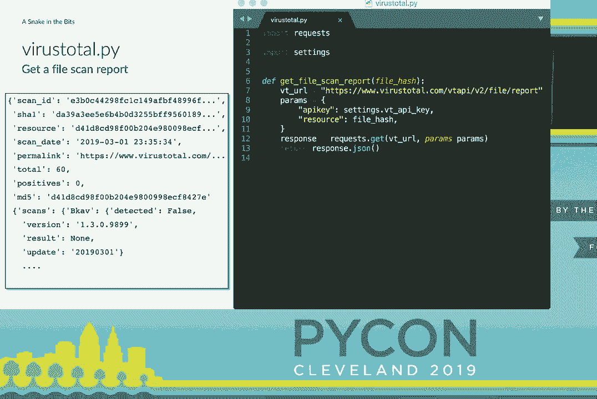

 Now to integrate this into our automation server code， we're， just going to go back in there。

 do the exact same thing we just， did for Active Directory。

 We'll write a new function to do the comment formatting。 We'll call virus total。

 pull out the useful fields and put them， into a string and call that to your comment function again。

 Then we'll put that virus total file scan enrichment function。

 call right after the Active Directory lookup。 And that's pretty much all it takes。

 The next time we have a ticket created， it will get all of， that information extracted and posted。

 So if you look again at this graphic that we showed at the， beginning， our SOC analyst。

 Freddie Mercury there， looks at a， ticket， copies and pastes， gives your names and hashes into。

 other systems and then makes his decision as to whether this， is malicious or what he has to do。

 Now things are looking up a little bit more for him。

 We have all this information automatically posted to the。

 ticket and recap the way it works because it's kind of a， weird cycle of web hooks。

 Spongfire is a web hook to our automation server。 We create a ticket。 When the ticket is created。

 Jira calls a web hook back to our， automation server and then we start doing these enrichments and。

 add information right there。 And this is actually a really simple but also really cool。

 model because now we can run any arbitrary code we want when， a ticket is created。

 So anything that you can write a program to do， we can kick off。

 automatically when a ticket comes in。 There is some low hanging fruit that is like really easy stuff to。

 do in an IT or security ops group。 A lot of the time， the first thing you do when you open or。

 close a ticket is spend a minute going and setting appropriate。

 fields for the ticket type so that your metrics look good。 That stuff is super easy to automate。

 We can also go a little more in depth。 We can run another Splunk search and post the results。

 You can even do something like kicking off an Ansible playbook。

 if you wanted to do something a lot more complex and build up work， flows。

 And really anything that has an API or any kind of programmatic， interface we can do。

 I have been looking for use cases to actually get a room but to。

 do something when we have a certain ticket type。 That is the dream。 [ Laughter ]。

 >> So now that we have started building this automation server， and all of its end points。

 we need to kind of start thinking， about how is it going to scale？ What is the future of it？

 You know， when you have two end points fine but when you are， starting to write 10， 20， 100， 200。

 you start to see a lot of the， same patterns being repeated in all of your flask endpoint code。

 So as developers， we want to make our jobs easier too。

 We want some sort of framework or middleware that does this for， us。

 We are probably going to want authentication on everything。

 We obviously want uniform logging so we know if our， automations are not working properly。

 Input validation is like the biggest boilerplate ever when it。

 comes to building APIs because you want to make sure that if， somebody gives you bad data。

 you tell them about it instead of， just breaking。 In terms of breaking。

 you also don't want to send a stack trace back， to your API client。

 You might expose sensitive information。 You are just generally not very useful to the average API user。

 Things like that。 So how can we improve this？

 Well， probably the easiest way is just go get an open source， plugin for flask。 In this instance。

 we used flask rest plus which is pretty well， known。

 And it is also built to function very similarly to flask。 So as you can see。

 we are still building a flask app。 Then we just pass that into the rest plus API objects。

 And you still set up your routes just like you did with flask。

 Except now you are operating on classes and those classes。

 define functions that directly correlate to the HTTP method， that you are making available。

 So a get or a post。 But as you can see， we still have essentially the same meat。

 and potatoes code within the end point itself。 So this gives you， we will get into it。

 but it gives you nice error， messages。 But one of the things that is really cool that it does is it。

 automatically generates swagger documentation or a swagger， specification for your end point。

 For those that aren't familiar， swagger or open API is a JSON or a， YAML definition of an API。

 And a lot of people write that spec and then use generators， to generate their code。

 This goes the other way and you write code and it generates the。

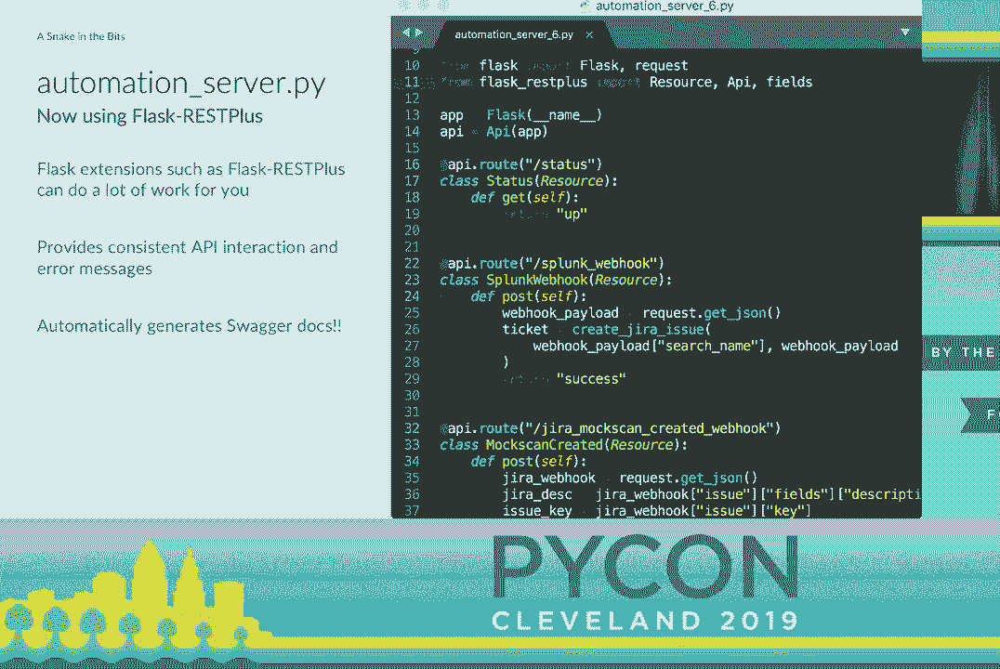

 spec for you。 Which is really awesome because there are JavaScript libraries。

 called -- or a library that I know of called swagger UI which。

 will ingest that specification and build you a cool website。

 And this is great because now you don't have to build some other， documentation。

 You have documentation that is built for you based on your， code。

 And if you are being a good developer and writing doc， strings for all of your functions。

 those get pulled into the， specification too。 So your code documentation is literally documenting your。

 end point for you。 Which is awesome。 It also allows you to interact with your API through the browser so。

 you can actually drop down those end points and send test data。

 to your end point and it will actually send it， show you the。

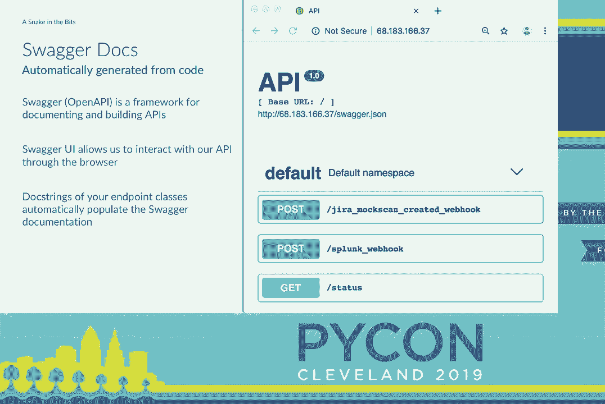

 curl request to do the same thing on your command line which is， pretty awesome。

 So one of the things we mentioned that we wanted to use to。

 elevate our RESTful API is we want to do input validation。

 And that's something that's built right into Flask REST Plus。

 So you can see here we've added a section of code to our end point， that is defining the API model。

 And so in this case we're saying that we have a search name and。

 it needs to be a string and we have a result that is just going， to be a raw JSON blob。

 So what this will do then is if we get data and those fields don't。

 exist it will return a useful error message to the user and we。

 don't have to worry about it in our code at all。 Our code knows that once we get to the actual post function we're。

 going to have those fields in our result。 So we mentioned the swagger docs。

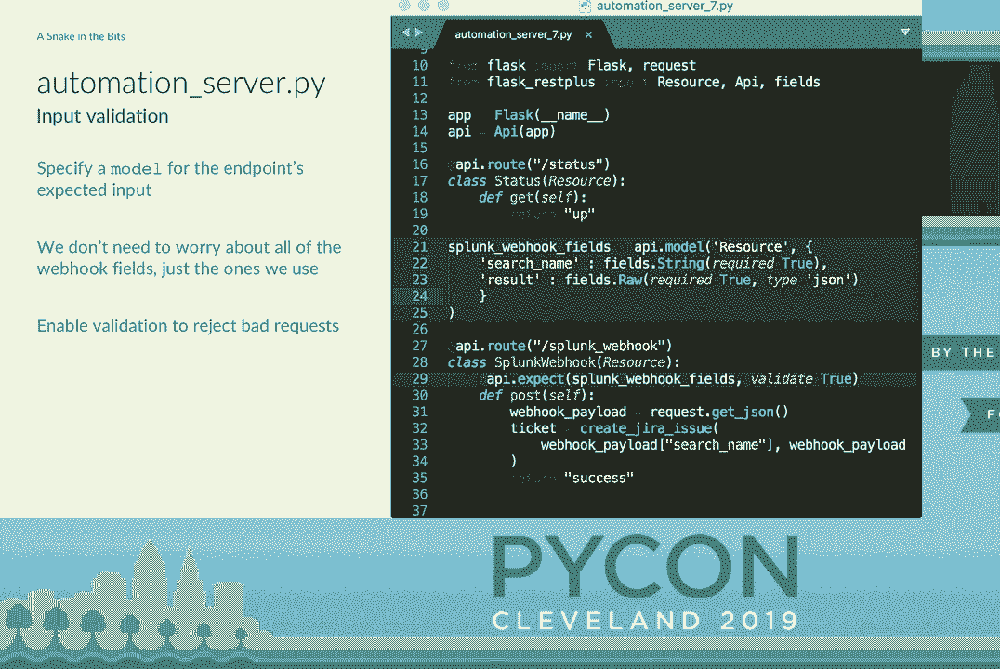

 Another cool thing about defining those models is it informs our， documentation as well。

 Because we've told the code what we expect as input now we get。

 documentation that says this is what you need to send to the end。

 point if you want to get good results。 So it's just this great back and forth of sort of informing the。

 documentation from the code so we don't have to go write the。

 documentation and make sure it's all still up to date when we make。

 changes and all of that sort of fun developer stuff。

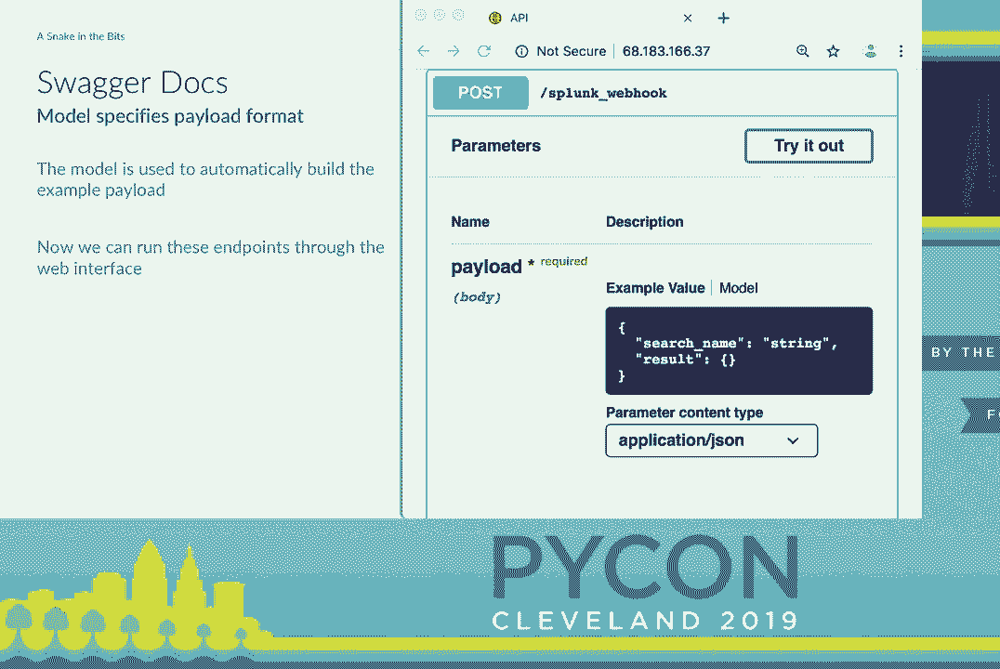

 So we keep talking about these error messages。 So this is just like a brief example。

 Our first curl request there is when we were just using Flask。

 And so you get back that awful 500 error when you request something。

 that's not there or there's an internal server error， you know， your code breaks。

 And for an end user that's not helpful。 If you're calling your API programmatically that's not helpful。

 It might be helpful if you were in a browser maybe but still not， helpful at all。

 So the same thing with Flask。 Plus you get a nice JSON message with internal server error。

 It's still not necessarily helpful to the end user but it's， something they could parse very easily。

 And then as we mentioned with the input output validation stuff。

 you can see at the bottom there they called the web hook and。

 their input was incorrect and they got a verbose error message。

 telling them that you can't send us a non-type for this。 So that's the off-the-shelf solution。

 But as developers a lot of times we're like， "Oh， let's build a framework。"。

 And sort of in our defense we started building this around the。

 same time that Flask rest plus initially came out。

 So we weren't necessarily reinventing the wheel but maybe a， little bit。

 So we built a framework that we called funnel because it's。

 putting things into Flask and developers are super clever。

 And we are working on getting an open source that's just， you know。

 there's a lot of hoops to jump through for that。 But it does a lot of the same things that Flask rest plus did。

 just in a slightly different way。 You still define the allowed HTTP methods。

 It's all based on an endpoint class。 You then have attribute classes for inputs and outputs。

 You define them the same way。 There's built-ins for strings and integers and all of that。

 As well as base classes for doing like regex-based types， enum-based types， dates。

 all those sorts of things。 We also do output validation which can be nice because it'll。

 strip off additional fields so that you're not returning a bunch。

 of data that you necessarily don't or you might not want to。 And then of course。

 standardize the logging。 But one of the big things we wanted was a code-defined API。

 as I kind of alluded to before。 We're developers。 We don't want to write a JSON spec all day。

 We'd rather write a class and have it generate that for us。 And so much like rest plus。

 funnel will generate you the open， API spec and then you can ingest it with swagger UI or some of。

 the other open source tools that process those spec。

 Also does all the exception masking as well which is nice。

 And so really the main difference for us is we don't use， decorators。

 If you see at the bottom there with a register function， that's how we map routes to classes。

 And then the before and after， I guess most people can probably， see it。

 it's kind of near the bottom and dark。 But it allows you to specify a list of plugins。

 So for instance， in this example， there's an auth function listed。

 there to do authentication and the before plugins。 The after plugins are cool too。

 Like if you're dealing with potentially sensitive data。

 you might want to scrub out like credit card numbers or social。

 security numbers or anything like that。 And those plugins get the full request object so they can make。

 determinations based on anything in the request。 And then if they throw exceptions or anything like that。

 it just kills it and doesn't give data back。

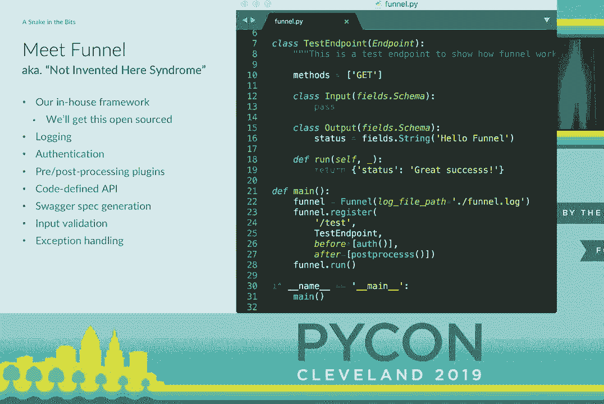

 So yeah。 >> So when you actually go to build one of these things and get。

 it deployed to really support a team， first thing you're going。

 to have to do or deal with is Murphy's law。 Everything is going to break。

 You're going to have ephemeral errors。 All kinds of things。

 And so we wanted to talk a little bit about some of our tips for， keeping things manageable。

 First off， I always like to remind everyone that maintaining， state is hard。

 Some people see a problem and they think I need a database。

 I'd argue that now they got two problems。 It's -- I mean。

 databases are definitely the right approach for， a lot of things， but you need to maintain data。

 But if you don't， if you could do something completely stateless。

 why would you also want to manage database migrations on top， of code updates？ And if you thought。

 you know， I don't need a database， but I can， just go write some stuff to a local file or something。

 well， that's how you get race conditions。 So anything that can be totally stateless is just so much。

 easier than if you need to maintain anything externally。

 Errors pop up for pretty much no reason at all。 Like network hiccups that are just completely unexplainable。

 happen an alarming amount of time。 Like it's really amazing the baseline level of errors of stuff。

 on the Internet。 Just adding a little wait and retry decorator to your。

 functions eliminates so many errors， I always highly recommend， everyone do that。 And then。

 you know， speaking of that， in our code， we called our。

 Active Directory lookup followed by our virus total lookup。

 If we couldn't reach that Active Directory server for any， reason at all。

 the whole thing would just throw an exception and， die and we would never call it to virus total。

 So really， if you're doing all of these various enrichments。

 you want them to be asynchronous and run separately from each， other。

 So you could set up separate jiro web hooks for each one。 That kind of makes sense。

 but might end up being a lot of， stuff to manage。 Or we could go into Python and use Celery and RabbitMQ or。

 AsyncIO I think might be really neat if you're willing to commit， all in and do AsyncIO everywhere。

 There are also a lot of DevOps tools that are basically built for， exactly this， like Stackstorm。

 Jenkins， RunDeck。 And that's one of the big points we want to make。

 You can repurpose a lot of these DevOps tools， even though they， aren't marketed for security。

 and they work really， really well。 If you're cloud native， you can do something like AWS Lambda。

 Or if you've got piles of money， you can also buy some of these。

 commercial security automation platforms called SOAR。 And they have similar functionality。

 They actually have similar functionality all around。

 But you can also write your own code to interoperate with them。 But at the end of the day。

 getting something up and running and， iterating is always， always the best way to go。

 Done is better than perfect。 So we'd like you to have a few takeaways from this talk。 Basically。

 first off， security automation is not magic。 It really is a series of web hooks and Python glue。

 And that's true for the code we just showed you。 It's true for all of the commercial platforms。

 It's really just how you kind of tie these systems together a lot， of the time。

 But if you've actually implemented something like this， if you're， making a team。

 you can do a lot of work。 And if you're making a team， you can do a lot of work。

 And if you're making a team， you can do a lot of work。 And if you're making a team。

 you can do a lot of work。 And if you're making a team， you can do a lot of work。

 And if you're making a team， you can do a lot of work。 And if you're making a team。

 you can do a lot of work。 And if you're making a team， you can do a lot of work。

 And if you're making a team， you can do a lot of work。 And if you're making a team。

 you can do a lot of work。 And if you're making a team， you can do a lot of work。

 And if you're making a team， you can do a lot of work。 And if you're making a team。

 you can do a lot of work。 And if you're making a team， you can do a lot of work。

 And if you're making a team， you can do a lot of work。 And if you're making a team。

 you can do a lot of work。 And if you're making a team， you can do a lot of work。

 And if you're making a team， you can do a lot of work。 And if you're making a team。

 you can do a lot of work。 And if you're making a team， you can do a lot of work。

 And if you're making a team， you can do a lot of work。

 You can apply to any kind of IT or development workflow that's， oriented around tickets。

 Even if you're just purely development， one thing that we've。

 been setting up is GitHub webhooks so that when we make a， pull request。

 we also create a code review ticket。 Things like that。

 So these automations are not like a thing that you can build once， and then forget about。

 And you also can't replace people。 It's not like a factory where we are trying to automate and。

 completely take over a human's job。 In this space where we have security analysts， IT， analysts。

 developers， we're just trying to eliminate the busy。

 work that takes up their time so that they can actually spend。

 their time doing security or doing development。 And there's a lot of low hanging fruit。

 Like filling out ticket fields， adding links to that pull request， that kind of thing。

 It's super easy to do and it really adds a lot of value。 And then at the end。

 I just want to kind of make a pitch for， basically our job。

 Like security automation is a super neat field to be in。 I wouldn't want to be anywhere else。

 Our job is working with the rest of the team。 There are customers but they're also sitting next to us。

 We write code for them。 We develop software。 They can use it the next day。

 Get us immediate feedback。 It's a really cool kind of hybrid of software development and。

 other operations work。 If anyone is a developer and wants to get into security。

 it's also a really cool niche to look at。 Next time you're looking at jobs， consider those security。

 engineer positions。 A lot of them actually have a really heavy development， component。

 And by the way， like everyone else， we are hiring。

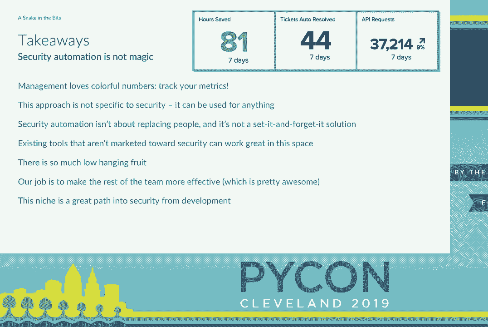

 So that is everything and I think we are at time。 So thank you everyone for your attention。

 Thanks a lot。 [Applause]。

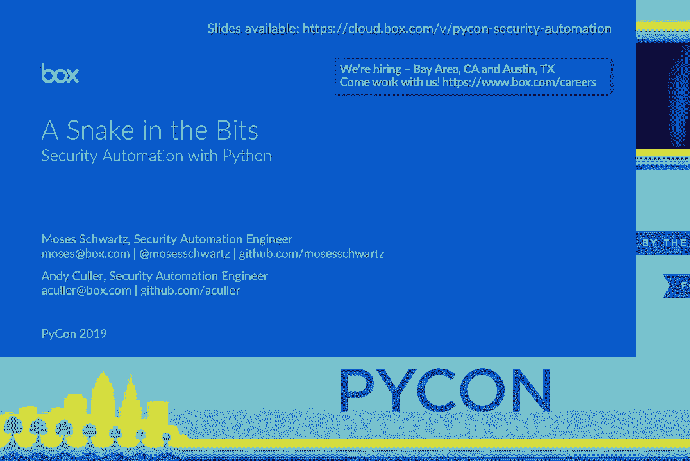