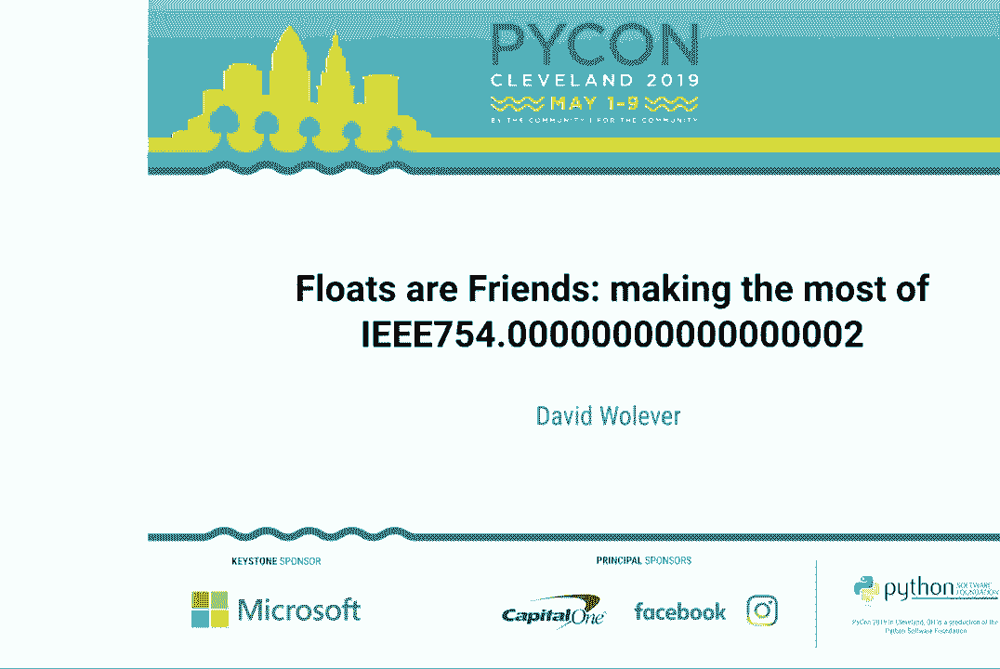

# PyCon 2019 演讲全集 - P4：David Wolever - Floats are Friends - making the most of IEEE754.0000000000000000 - leosan - BV1qt411g7JH

 Good morning everyone。 We're going to get started。 So today we have David， we have David， Wooliver。

 He is the founder of PyCon Canada。 He will be talking about floats are friends。

 making the most of IEEE 754。 We will not be taking Q&A if you have questions。 He will。

 be outside the door after the talk。 Please give a warm welcome to David。

 Yeah， hey folks。 My name is David Wooliver and I am super excited to be here today to talk。

 to all of you about floating point numbers。 I'm curious， though， what the heck are you， doing here？

 There are lots of other great talks。 Why do you want to hear about floats？

 If you don't mind sending me a tweet right there and letting me know what brought you， to this talk。

 as opposed to any other great talks， I would really like to hear it。 The。

 second small for the folks up front， if you don't mind grabbing a photo or two of me。

 I would love to have something to show my mom。 Thank you。 And finally， I need to apologize。

 for the artistic license that I took with the talk title。 754 can be exactly represented。

 in floating point。 I'm sorry。 So， over the course of this talk， I would like to tell。

 you a bit more about what floats are， how they work， and why they do the weird things， that they do。

 because they definitely aren't the best。 But also， they're not the absolute， worst。

 And regardless of any of that， we are absolutely stuck with them。 So， hopefully。

 by the end of this talk， I don't expect you to like them。 But at least， I hope you'll。

 understand them a little bit better。 So， to understand floats， we need to take a step。

 back and look at why floats exist。 And to understand that， we need to look at how numbers are。

 represented in computers。 So， whole numbers， integers， those are pretty straightforward。

 We take a chunk of memory， and within that chunk of memory， there's a nice one-to-one。

 mapping between the binary numbers we can represent there and the whole numbers that。

 we're used to dealing with every day。 Our ones are twos， our fives， et cetera。 And the way。

 we do that representation is more or less what you're used to if you've done any reading。

 on binary notation。 Now， one thing you'll notice is， in this example， I'm not including。

 any negative numbers。 And those are done with a representation called twos complement。 Twos。

 complement is， in my opinion， an absolute thing of beauty。 And I'd really suggest you。

 go look it up after the talk。 But， unfortunately， this is about floats， so we can't get into。

 that here。 Anyway， whole numbers， integers and computers， those turn out to work pretty， well。

 With a 32-bit int， we get to represent numbers between about 2 billion and negative， 2 billion。

 And then if we pump that up to a 64-bit long， we can go up to 9 quadrillion。

 And it turns out that for the integers， for the whole numbers， that we deal with data， programmers。

 the numbers that occur in the real world， that range is actually really， sufficient。

 We don't often need to go bigger or smaller than that。 When we start moving。

 into fractional numbers， though， things get a little bit more difficult。 To understand， why。

 imagine how you might implement fractional numbers。 Well， we might say we take， we got。

 that chunk of memory， and let's split it in half， and we'll say， okay， the first half。

 is going to be the integral component， and the second half is going to be the fractional， component。

 And that might look a little something like this。 So we could have， if we have a one。

 in the fractional component， that's 1 over 2 to the 8， so 0。125。 If we have a two in the。

 fractional component， that would give us 1 over 4， 0。25， and so on。 But one of the things。

 you'll notice here is with this representation， we don't actually get a very large range of。

 numbers that we can work with。 If we're only using 32 bits， the smallest number that we。

 could represent is 1。5 times 10 to the negative 5， so that's like a decimal place， 4， 0s， and。

 a 1 and a 5。 And the largest number is a measly 131，000。 We could go up and use， say， 64 bits。

 instead， where we have 32 bits before the decimal place and 32 bits after the decimal， place。

 And that will buy us quite a bit more space。 We can go down to 10 decimal places。

 of precision approximately， and we can go up to numbers as big as about 4 billion。 But， I mean。

 the first caveat there is this is completely ignoring negative numbers。 And。

 the second caveat is in the real world， it turns out that when we're representing things。

 with real numbers， the things we're representing tend to be on a much larger scale。 You know。

 we have to deal with things like the distance to Pluto， that's 7。5 billion kilometers。 And。

 we might want to represent things that are really small， like the size of a water molecule。

 Three tenths of a nanometer。 And in this naive system that we had just talked through， this。

 system where we're taking a certain amount of bits and we're fixing the position of the。

 decimal place， a fixed point number， if you will。 We're going to run into some problems。

 because that range we can represent is fixed。 And it's not going to， in practice， be able。

 to handle a lot of the numbers that we have to deal with in the real world。 So， I'm sure。

 you're all smart programmers， your brains are wearing， figuring out how you're going， to fix this。

 And probably what you're coming up with is a system that will look a little， bit like this。

 where we say， "Okay， we've got the number。" And alongside that number， let's store a scaling factor。

 So， with the distance to Pluto， that's going to be 7。5 and， we have a scale factor of 10。

 which is going to push that 7。5 all the way off to the left。 And then for the very small number。

 like the size of a water molecule， we'll use a negative。

 scale factor that'll push it off to the right。 So， this would be a system you could say。

 this moves the decimal place around。 It floats the decimal place around。 It's almost like we've。

 got a floating point。 And lo and behold， this is what floats do。 Internally in the computer。

 floating point numbers have three different components。 The first bit in them is the sign。

 bit that controls whether they're positive or negative。 The second set of bits is the， exponent。

 That's basically the shifting or scaling factor we had just talked about。 And， finally。

 the third portion is the fraction。 That's the actual number portion。 It's also。

 called the mantissa if you're trying to sound fancy。 So， you calculate the value of the floating。

 point number by taking the sign， multiplying that by 2 to the power of the exponent and。

 multiplying that by the fraction。 If you've ever worked with scientific notation before。

 this is exactly the same thing just in base two。 This is just base two scientific notation。 So。

 to get concrete with an example here， let's say we want to represent 0。5。0。5。 It's。

 a really nice easy fraction to represent because it's 1 over 2 or 2 to the power of， negative 1。 So。

 we're going to have a sign of 0 because it's positive。 And an exponent， of 4。 Now。

 the exponent of 4 is a bit weird here。 And that's because exponents are what's， called biased。

 Since we need to represent both positive and negative exponents， there's a。

 fixed bias that we introduced。 In this case， we're going to use 3 and， oh yeah， that shows。

 up pretty well。 And we deduct whatever exponent is stored in the number from that bias to get。

 the actual value。 And finally， we just want half， so we multiply it by 1。 A couple of。

 other examples。 3。25。 That would be 2 to the power of negative 2。 So， 0。25 times 13。 Or。

 a negative number， we have a 1 in the sign bit。 We're trying to represent negative 88。 So。

 the exponent is going to be 4， which is just 2 to the power of 4， 8。 And multiply， that by 11。

 Sorry， 2 to the power of 3。 Excuse me。 4。 But that's bad。 Anyway， we have， a lot more。 Anyway。

 this is neat。 So， we've got this number system。 And you can see how。

 we can scale to represent numbers that are either very small or very large。 And to give。

 you an idea of the actual practical range of that system， 32-bit floats。 So， these are。

 the kind of older school floats that systems used to use in the past。 They've got an exponent。

 that's 8 bits long and a fractional component that's 23 bits long。 And 64-bit floats， doubles。

 These are the default whenever you have a float in just about any modern computer or。

 programming language。 They've got an 11-bit exponent and a whole 52 bits of a fractional， component。

 So， they can represent numbers that are as small as a decimal place with 300， zeros behind it。

 And as large as a one with 300 zeros behind it。 So， this is pretty good。

 We've got a pretty large range of numbers we can represent there。 But， you know， as with。

 everything， there is a trade-off here。 And the trade-off that floating point numbers。

 make is between precision， so that is how small can our numbers get and magnitude。 How。

 big can the numbers get？ So， for instance， we can measure the distance to Pluto。 But that。

 measurement won't necessarily be accurate and precise down to the meter。 And we can also。

 very precisely measure the size of a water molecule。 But we're going to run into some。

 trouble if we need to， say， measure a billion of them at the same time。 So， to give you a。

 concrete example of what that precision error might look like。 Let's say we have a， smallish number。

 0。1 or 0。1。 And we have a very large number， 1 E20。 Just the exponential， notation there， the 1 E20。

 means a 1 followed by 19 zeros。 And if we try to add 1 to 1 with， 19 zeros after it。

 you'll notice that the magnitude of that large number just completely。

 overshadows the precision of the small number。 And the 1 is completely lost。 In fact， it's。

 as if it never existed。 So， what do you， as work-a-day programmers who don't want to。

 get a degree in numerical analysis just to add some numbers together， what are you going。

 to do about this？ So， the first rule of thumb that I want you to remember is that with a， double。

 so that's a 64-bit float， you get 15 significant decimal digits。 That means 15。

 of the digits in your floating point number are generally going to be reliable。 But you're。

 going to lose precision if you try and add or subtract numbers that are outside of， that。

 have different magnitudes。 So， for example， let's say I want， 1， 2， 3， 4， 5 to 1 E15。 So。

 1 E15 has 15 digits。 That's safe。 And you'll notice that we get an exact result。

 But as we move up as we move up to 16 significant digits， we're going to start losing some。

 precision。 And that problem only gets worse as the large number gets larger。 It is important。

 to note though that multiplication and division are just fine。 They're not affected by this。

 And finally， if you do， if you are in the unfortunate situation of having to sum lots。

 of floats together， there are very good libraries to do this。 And to show what they do， consider。

 first this naive sum。 So， we're going to take a very small number， like a very large。

 negative number， add 1 to it， and then add a very large positive number。 Ideally， we'd， get 1。

 But because of that floating point rounding error， using Python's built-in sum， we get 0。 However。

 if we go and we use math。fsum， we're going to get the exact result。 And this， is because math。

fsum is doing something really neat under the hood。 What it's doing is each。

 time it performs an addition， it's keeping track of the precision that was lost， of that。

 round-off error， and storing that in a separate list。 And then once we've summed up all the。

 numbers in the main list， we go back and sum up all the numbers in this round-off list。

 and add that in。 So， it's going to get very precise。 The trade-off there， of course， is。

 a runtime one。 You're doing many more additions， and it's more computationally expensive。 The。

 other interesting one to look at is NumPy's sum。 Now， in this case， NumPy's sum actually。

 gets it wrong。 And that's because it's using an addition algorithm called addition by parts。

 where it's going to take chunks of the list and sum them up at a time， and then sum those。

 sums and sum those sums， kind of a divide-and-conquer type algorithm。

 It doesn't have the strong guarantees， that Python's fsum has。

 but it does have the advantage of being much more efficient， which is why they use it by default。

 And finally， if you truly need to do a lot of these， a， my heart goes out to you， and b。

 you might want to take a look at the AccuPy library because。

 they do this very fast and very accurately。 The second trade-off that I want to talk about。

 here is the fact that every real number can't be represented by floating point。 In some， cases。

 it's kind of obvious why we have real numbers that are infinite like pi or e， and。

 obviously we just can't represent infinite numbers in a finite amount of memory。 The second。

 more tricky kind of number， though， is the fact that since floating point uses a binary， fraction。

 there aren't binary fractional representations for all of the decimal fractions that we expect。

 like common decimal fractions， like 0。1。 0。1 is a good fraction。 But I'm sure this is a。

 thing you have all run into。 And just if you're curious and playing long at home， when I'm。

 showing these， showing these floating point numbers， I'm rounding them to 20 decimal places。

 and this is the code you could use。 So to understand a bit more why that， what's going， on here。

 consider this number line。 The horizontal line is the continuous line of all the real， numbers。

 And each of the white vertical lines represents a single floating point number that。

 can be represented。 So for instance， we might have 0。51， forgive my scale， that's way off。

 but hopefully you'll understand the idea。 So when we get a real number coming in， and。

 we need to figure out which floating point number is nearest to that number and use that。

 nearest floating point as an approximation。 So in the case of 0。1， we can't represent that， exactly。

 So we fall over to the nearest float， which is 1。005。 Or if we're representing pi。

 that might have to round up a little bit to 1。146。 And if you're curious to dig into this。

 the difference between that real number and the nearest number that's being represented， is。

 is quantified with using， is measured using a technique called， excuse me， is measured。

 using the relative error。 And you can go and look that up and it's very interesting。 But， again。

 to give you a really concrete example of what's going on here， let's say we have， 0。1 and 0。2。

 When we add them together though， notice that the floating point number we get， by summing 0。

1 and 0。2 is different from the floating point number that is nearest to 0。3。 Similarly。

 if we try to add 0。1 to itself 10 times， we don't actually get 1。 We get a number。

 that's very close to 1， but it's definitely not 1。 Although fortunately， multiplication。

 does typically work a bit better。 So， what are you going to do about this？ Well， the first。

 thing that's important to remember is each time you perform a floating point operation。

 some error is being introduced。 You do have that small round off error and it's just going。

 to accumulate。 The only thing you can really do about that is judiciously round your numbers。

 and that's the thing I'm going to be talking about in a second。 The second thing that you。

 remember is to be really careful when you're comparing floats to other floats and instead。

 of using double equals equality， use something like numpy is close or even just write your。

 own is close。 That becomes especially relevant when you're comparing numbers to 0。 So for， instance。

 if you're taking the dot product of two vectors to figure out if they're perpendicular。

 the number you get back might not be 0。 It might be a very， very tiny number， but it's。

 distinctly non-zero。 And the third and the very most important thing， if there's only。

 one thing you take away from this talk， this is the important one。 It's that any time you're。

 working with floats and you're displaying them， so after you've performed computations。

 they need to be rounded。 You need to have some notion of how many decimal places are relevant。

 and appropriate to show for your application and any floating point numbers need to be。

 rounded to that number of decimal places。 I was even talking with a friend just over lunch。

 yesterday and they were telling me about a whole bunch of caching errors they were having。

 They were getting a bunch of cache misses because they had a system that was caching。

 based on a time code and the time code is being stored as a float and that float was。

 having exactly the kind of computational errors that I've just talked about。 So that's some。

 of the more mathematical parts。 Now I want to get into some of the weirder parts。 The。

 first weir part of the floating point standard that I want to talk about is infinity。 So the。

 floating point standard does define a representation for infinity and negative infinity。

 That's where， all the exponent bits are set and the fractional component is 0。

 And it's actually really neat， and kind of useful number。 It does what you expect。

 Infinity is larger than any other number。 And I have actually used it a bunch if I have a loop say that needs to find the smallest。

 or the largest item in a list and I need a good default initial value。 Infinity makes。

 a really good default value。 It will also pop up if numbers that are very large overflow。

 or very large negative numbers overflow negative。 And the last kind of exciting thing about。

 it is at least according to the standard you get infinity or negative infinity if you divide， by 0。

 Now fortunately Python is got our back here and they do， Python does something a little。

 bit more sensible。 But this is important to know when you're working in other languages。

 that aren't quite as careful about raising exceptions。 And to understand why it might make。

 sense that dividing by 0 gives you infinity。 I want you to consider if we were writing。

 a function that evaluates 1 over x。 So as x is getting smaller and smaller and smaller。

 the value of 1 over x is getting larger and larger and larger。 And that is in math terms。

 you say converging to infinity。 So if you imagine we're calculating this x and getting。

 it smaller and smaller and smaller， at some point that value of x might underflow and。

 it might underflow to 0。 And it would be when you squinted it the right way natural for that。

 underflow to result in infinity as opposed to a math error。 And that brings us to the。

 second interesting part of floating point。 We have negative 0。 So if you remember the。

 binary representation in memory， we have all 0s is going to be a 0 but we still have that。

 sign bit floating around。 And if that sign bit set， we get a negative 0。 It basically。

 only comes up when you underflow a sufficiently small number。 And it can be actually kind of。

 useful again when you squint it things the right way to have the distinction between negative。

 0 and positive 0 because again if you consider that 1 over x function， as x is approaching。

 0 from the negative side， it's going to be converging to negative infinity。 And when it。

 underflows to negative 0， it's kind of useful to have the result be negative infinity as。

 opposed to positive infinity or something else。 And otherwise negative 0 behaves just。

 like our good friend normal 0。 Now finally， I want to talk about nann is probably my favorite。

 part of floating point。 Nann stands for not a number。 And it's a number that just like。

 it says right there on the box is not a number。 It's defined as being the result of mathematically。

 undefined operations。 So for instance， dividing infinity by infinity， you'll get nann。 It's。

 also defined as being the result of operations like the square root of negative 1。 Although， again。

 Python has got us covered here。 It's going to do something potentially a little， bit more helpful。

 But nann is really important to know about because it's wild。 It just breaks， everything。

 It's the only value that is not equal to itself。 And this is true in every。

 programming language in every computer system。 It doesn't make any sense to compare it to， things。

 So every comparison will return false。 And every mathematical operation that you try。

 to perform with a nann is going to give you back nann。 It's kind of infectious like a。

 sequel null if you're familiar with that。 The one interesting Python tidbit that you can。

 bust out to have fun at parties is that in some situations testing to see if nann is in。

 a list with a nann will return true。 That's left as an exercise to the reader。 And actually。

 I kind of like nann。 It can be pretty useful if you have say a large data set， maybe you're。

 taking measurements from an external system or something like that。 And you need to have。

 a value in a particular place， but no value makes sense。 Using a nann is a place holder。

 kind of like a null is actually kind of useful。 So like in this case， imagine we have two。

 lists of numbers that we want to divide by each other and then take the mean value of， the result。

 Because we -- because one of the numbers will be nann， it will just be ignored。

 when we use nann means。 So nann means is like mean except it ignores nanns。 And it's also。

 got nann sum and so on。 So this is really important to know about though。 Because especially if。

 you're building web systems that accept values from a JavaScript front end， if any of you。

 have worked in JavaScript， you know that it coughs out nanns all over the place。 And now。

 you know just how badly it's going to wreck all of your numerical code。 So the two best。

 ways to test for it， either using math。isnann or just checking if a thing is not equal to， itself。

 Because if a thing is not equal to itself， guaranteed it's going to be nann。 So okay， pop quiz time。

 How many nanns are there？ One， I've heard one。 I'm sorry。 You're。

 off by 52 binary orders of magnitude。 There's actually two to the 52 nanns。 And that's because。

 they're defined as being any floating point value where the exponent is fully set and。

 the fractional component is just not zero。 And you know there were some smart programmers。

 at one point who kind of realized that's a bit of a waste。 We got all these values that。

 are doing nothing。 So why not just stuff some pointers in there？ And this is actually what。

 happens in every modern JavaScript implementation。 Under the hood when you're passing around a。

 pointer to an object， that pointer can actually be two things。 If you mask it properly and。

 the mask returns true， then it's interpreted as a double。 On the other hand， if the mask， is false。

 then it's a pointer。 Which means that you can write actually very interesting， efficient code。

 So this is a completely fictitious implementation， but it's close enough to true。

 where if we're adding two JavaScript objects together， the first thing we need to do is。

 if we can run this quick bit mask to check and see if they're both doubles。 And if they， are。

 we can add them with just one machine instruction。 So this is much， much more efficient。

 than Python， say where we'd have to go and unbox those numbers and so on and so on。 So okay。

 we've talked about how the precision can be lost when numbers of different， numbers。

 of different magnitude are added and subtracted。 We've talked about the problems that come when。

 we try to stuff binary decimal numbers into binary fractions。 But I do want to offer you， some hope。

 The decimal module。 Per the documentation， the decimal module provides support for decimal。

 floating point arithmetic。 And hopefully you have a bit of a notion of what those words mean。

 Because it's doing decimal arithmetic， we have exact representations of decimal numbers。

 We're still going to have problems with that nearest number rounding problem。 We still can't。

 represent pi exactly。 But at least the representations will be more sensible。 They'll follow the。

 same grade school rounding rules that you're used to。 And we still need to specify precision。

 We don't have unlimited memory。 But the default in decimal is 28 decimal places。 And that's。

 probably going to be enough for most folk。 And of course， if you need more， you can just。

 turn it up。 So to give a really quick example of what decimal looks like， we could， well， import it。

 We'll create a decimal value of 0。1。 And notice that when we add 0。1 to itself， ten times。

 we get the precise exact result of one as we'd expect。 Now one interesting。

 consequence is that when you load a floating point number into a decimal， it will faithfully。

 try and read in that entire number。 But at some point， I don't know how well you know， pi。

 you'll notice that it does diverge。 And that's because the floating point number。

 can't precisely represent pi。 Now there is， of course， a drawback。 There is a trade-off， here。

 And that's that decimals are significantly slower。 In a quick test that I did here， just。

 multiplying a number by itself， comparing a decimal to a float， found the decimal was。

 about ten orders of magnitude slower。 It's a lot slower。 Also unlike floats。 Flots are。

 going to be the same size they take up exactly 64 bits， no matter how big or small the number， is。

 That's not true of decimals。 The size of a decimal is going to grow as you get more。

 decimal places or as the number gets larger。 But that all said， decimal is great。 And if。

 you're doing computations that need precision， so this is things like math， like math， if。

 you're doing math， you need numbers。 If you're doing math with money， for instance， it's。

 absolutely a thing that's worth using。 So thank you for coming out and listening to me。

 You ran to about floats。 If you've got any questions， I'd love to come chat with you。

 in the back after this talk。 I'll just be hanging it outside the hall。 And yeah， thank you all。

 so much。

 (applause)， (applause)。