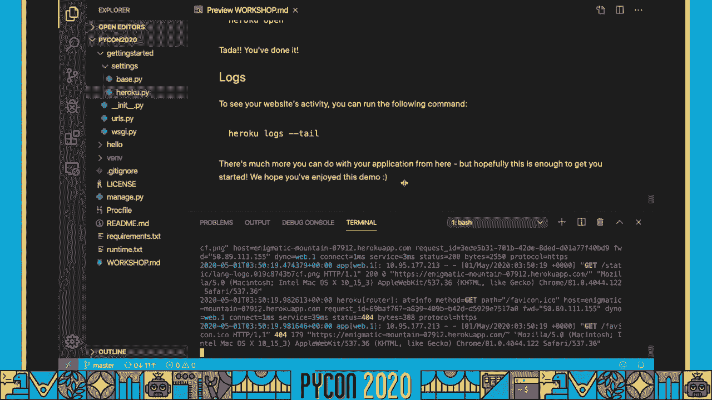
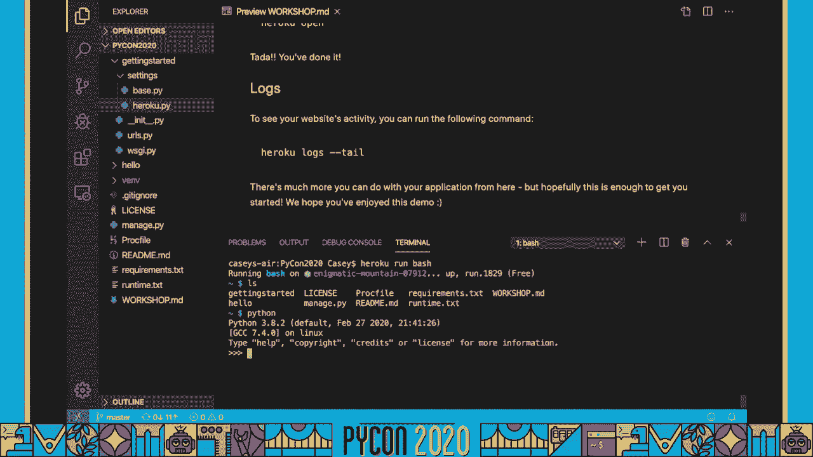

# P12：Sponsor Workshop Heroku - Casey Faist From Project to Productionized on Heroku - 程序员百科书 - BV1rW4y1v7YG

我叫凯西•法斯，女王 pythstat heroku，这是从项目到生产，现在，我希望我们今天能在一起，我希望我们能交换故事，一起编码，这是一个手把手的研讨会，因此，虽然视频格式对此提出了一些挑战。

好的是 如果你需要我放慢速度，或者你想去兔子洞，暂停录像，我在这里等你，这是一个手工作坊，所以如果你打算在家里跟着，首先击掌，是啊，其次我们假设你的经历，要想在这个研讨会上获得良好的经验。

有几个必要的先决条件，首先，这不是一个姜戈教程，去找官方的 django文档，在那里他们有一些优秀的教程信息，下一个，我们假设有一点点熟悉，你需要安装在你工作的机器上，我们为您提供了一个初始回购。

以配合有指示的工作，但是可以在 Github上买到，所以你需要能够得到克隆，完成这个车间的回购，你需要四样东西，你需要注册一个 heroku账户，这是免费的，你不需要添加信用卡。

你需要下载 heroku cli，您将需要克隆车间回购或使用您自己的项目，您需要能够在文本编辑器或 ide中打开该回购，你的选择，好吧，准备好了 太棒了，我们开始吧，所以让我来布置场景，你有个申请。

你倾注了你的鲜血，汗水和泪水投入到这份申请中，太棒了，终于准备好了，它已经准备好去那里和互联网上，你是怎么和希罗库一起幸运地做到的，你已经完成了最难的部分，视 heroku为平台为服务。

与作为服务模型的基础设施不同，有很多事情你不需要做，像基础设施维护或建筑部署管道之类的东西，设置管理用户访问或系统级安全更新的工具，你不必这么做，这不是你的问题，这就是赫鲁库要做的。

我们正在管理那些安全更新，提供所有这些工具，加上度量和更多，使您作为开发人员的生活更容易，这是一个巨大的时代，保存，见 Heroku在12个因素的应用中效果最好，这是希罗库十多年前倡导的东西。

它的理念是你构建一个应用程序，比如配置变量，使用过程，还有更多，如果你想了解更多，你可以在这里查看链接，这个工作坊的大部分时间，其实不是希罗库特有的，我们今天要做的很多事情。

使用十二因子应用程序有很多好处，不管你是否被派到希罗库，但在赫鲁库身上尤其重要，因为一种叫做短暂部署的东西，设计成在接到通知后立即上下旋转 几乎没有停机时间。

但这意味着您不能将任何东西持久化到本地文件系统，它要么需要检查，存储在数据库中 或作为环境变量，或在附加的资源中，就像一个三桶，现在确实持续存在，如果你以前从未处理过12个因素的应用，别担心。

我们将一起完成十个步骤，使您的应用程序从项目到产品化，关于赫鲁库，一旦打开文本中的项目，您选择的编辑，花点时间看看你的编辑，终端应该位于 python的根目录中，二十二十项目，第一个是你好。

我们不会对这个做任何事，所以不用担心，但另一个叫做开始，我们会对这个做一些修改，但现在把工作室的 md文件。

我们的第一步是更新 git忽略文件，将文本复制到代码块中，然后导航到项目根中的 git 忽略文件，如果你在处理原始标记文件，你要确保你不转移任何报价或回车，因为他们会搞乱这个文件的工作方式。

我创建了一个虚拟的 mh，已经上来了，它叫 venv，所以我不需要加上这一行，我可以把它取出来，我也不想添加任何 sqlite数据库或 sqlite工件到源代码，控制，任何我用来测试的本地数据。

或者确保我的应用程序工作，应该留在本地我的机器上，而不是被推着去，无论多么重要的注意，您确实希望将 django迁移添加到源代码控制中，所以你要确保，不要向这个 git中添加任何 django迁移。

忽略文件，最后一步 这个应用程序不叫你的应用程序，它叫做，我们实际上是想从这里开始，我们的静态文件将在这里生成，嗯，Heroku会自动生成我们的静态文件，但我们不想，嗯，把我们本地的查一下。

我们想让希罗库重建那些部署中的，看起来不错，所以我要把文件存起来，然后我会去我的终点站，我要把这些零钱存入 git，所以我可以很快地检查状态，只需 git状态命令酷，我只有一个变化，我要去拿。

然后我会得到承诺 破折号为消息。

派到希罗库，从技术上讲，我们需要一个忽略文件吗？不需要，您可以在不存在 git忽略文件的情况下成功部署，但这是强烈推荐的，不仅仅是给赫鲁库的，千万不要在 git repo中存储密码或凭据，别往上推。

一开始就不要放进去，你想把这些东西保密，将这些文件添加到您的 git忽略是一个很好的方法，同样，任何你不想要的东西都推给赫鲁库，比如你当地的风，你不会想把它部署到希罗库的。

因为 Heroku会自动为 python设置一个环境，或者克罗夫特将军来保证你的部署是干净的，在你的饭桶里，忽略文件。

下一个，我们想模块化我们的 django设置来做到这一点，我们需要导航到我们刚开始的 django目录，就在这里，现在我们在这里，我们要添加一个新文件夹，你要调用这个文件夹设置，这很重要。

所以请确保您确实使用了名称设置，现在我们拿起设置点圆周率文件，把它移到我们的目录里，现在这个命名会让人困惑，所以我要把它重新命名为，我选择了这个名字，因为这将作为基地，我们所有的其他设置配置都将从。

但如果像 dev或 local pi这样的东西对你来说更有意义，随便用吧，只需稍后更改此文件的名称，通过移动和重命名设置文件，我们的 django应用程序现在有两个中断的引用，在我们继续前进之前。

让我们把它们修好，第一个是在威士忌圆点圆周率文件里，在你开始的时候，文件夹，您将看到它有一个 django设置模块 默认设置，我们要设置的是开始点设置，这就是它曾经的样子，但我们刚刚移动了设置文件。

所以为了解决这个问题，我们要做的就是加一个点，因为我把我的文件库命名为，我去打字，然后再导航一个目录到根目录，找到管理圆周率，在6号线。

您将看到这里为 django settings模块设置了相同的默认值，这里也一样，我们想在这一行的末尾添加点基，然后，一如既往。

保存这些更改并添加它们 以获得本地项目，只有一个环境来跟踪本地机器，但一旦你想部署到不同的地方或阶段，重要的是要跟踪设置去哪里，嵌套我们的设置文件，这样我们就可以很容易地跟踪这些设置在哪里。

以及利用赫罗库的连续输送工具管道。

所以在开发阶段有四个阶段，这是您的本地机器码头工人集装箱，然而，你喜欢在本地开发，下一个在审查阶段，您希望检查您的测试是否与您的代码库的完整测试套件一起通过，如果进展顺利，你就合并到舞台上。

在那里你可能有更现实的设置，也许一些可用的测试数据，为了更准确地预测变化将如何影响您的生产，最后是你的产品设置，如果一切顺利，你就会投入生产，变化现在在哪里 为你的客户直播，持续交付。

或者设计 cd工作流来测试您的更改，在越来越接近生产的条件下，在越来越多的细节上，如果什么东西坏了，这意味着更容易调试，因为你很清楚它打破了什么设置，当你部署的时候，你可以放心地部署。

知道你已经彻底测试了你的改变，在尽可能接近你的生产设置的条件下，持续交付是一个强大的工作流程，可以让你作为一个开发人员的经历变得不同，一旦你完成了你的申请，希鲁能救你，很多时间都在这里。

我们已经为您建立了一个连续的交付工作流程的工具，从你在赫鲁库的仪表板上，您可以通过单击按钮建立一个管道，将应用程序添加到 staging和 production中，以及部署，你也可以，如果需要，回滚。

如果您连接到 Github存储库，管道还可以自动部署和测试 在您的回购中打开的新 prs，通过提供工具和自动化 这些过程，Heroku的连续交付工作流程足够强大，帮助你跟上你的开发周期。

模块化 django 设置，是利用这种持续交付工作流程的好方法，通过分割您的设置，不管你是被派到希罗库还是其他地方，当您还使用白噪音来管理静态资产时，Django静态资产的工作效果最好。

很容易添加到你的项目中，首先在这里复制这个中间件行，所有的一切，这次你想要引号和逗号，收到现在回圆周率基地，我们在找你的中间件列表，Django按照这里列出的顺序加载中间件，所以你总是希望你的安全第一。

但重要的是添加白噪音作为第二个，在这个基本文件中，在这个项目中，我有一个方便的提醒它去哪里，跳回车间，拿着下一个代码，阻止静态文件存储设置，抄下来，在圆周率里我们会一直滚动，下到底。

我们把白噪音作为中间件，但要真正使用白噪声压缩。

我们需要设置这个变量，这样我们就完成了圆周率，恭喜你，把你的工作存起来 交给 git。

我们的基地设置完成了，但现在我们需要我们的英雄设定，如果你来车间，MD，你可以看到我已经提供了一个模板文件，你可以在顶部看到的大多数项目，我们正在导入基本设置文件，如果你用自己的项目。

确保您更新了这一行，以匹配当前的目录结构，拿着这个，导航到基本圆周率，与其更改文件，我们要在设置文件夹中添加一个新文件，我要叫它赫鲁古派，在这个文件里 我们要粘贴我们的模板，你可以在这份文件中看到。

我们列出的值，是我们在基础设置上覆盖的，所以这些设置会有所不同，是大江哥和威龙进口的，就像伊蒙一样，这使我们能够快速、轻松地与操作系统环境进行接口，在没有太多了解的情况下，它内置了类型转换，像这样。

它知道并将把这个环境变量转换为我们的列表，尤其是它的自动数据库解析，这就是我们解析 heroku Postgres数据库 url所需要的全部内容，我们将得到，只是真的很方便，我建议你去看看。

但有了那次扑救。

我们的设置已经完成。

真棒，这就是我们需要做的所有工作，以使我们的应用程序进入12个因素的形状，但我们还需要三个文件才能部署到希罗库，需求文本是标准的 python依赖文件，你得派几个人去希罗库。

如果我们查看所提供的需求文本文件，但还有另外四个我们已经谈过了，Django和 Veron，以及白噪音，我们已经配置了，但另外两个也很重要，需要部署，第一个是独角兽或独角兽。

这是推荐给希罗库的威士忌服务器，我们很快就会看到它的配置，这是一个 Postgres数据库适配器，您需要在您的需求文本文件中部署它，但是你不需要任何代码更改来激活它，我们只需要把它安装在环境中。

快速笔记，为了这个演示，我选择让事情变得简单，但是当您准备好将您的项目部署到 roku时，考虑冻结您的依赖关系，你可以用皮普冷冻来做到这一点，这将使您的构建更加可预测。

通过将精确的依赖版本锁定到 git repo中，这很重要，因为希罗库每天都会回收你的资源，这对应用程序健康很重要，但是如果你的依赖关系没有被锁定，你可能会发现自己部署了一个版本的 django。

新的一天，下一个，当Heroku循环您的应用程序资源时，这些资源被组织到称为dynos的容器中，我们不只是在每个 dino循环中重新安装您的应用程序，或者迪诺部署。

Heroku在 AWS资源上重建您的环境，这不仅仅意味着你的 django应用，以及你的蟒蛇装置，Heroku将安装默认的 python版本，如果你不指定一个，但如果你想选择你的蟒蛇版本。

您需要一个运行时文本文件，您想把它放在根目录下，紧挨着您的需求，管理圆周率，得到，忽略，其余的，这个文件只需要一行这样的格式，要在其上运行应用程序的补丁版本。

我们需要添加的最后一个文件是一个特定于 heroku的文件，procfile，这是我们用来指定应用程序应该运行的进程的，此文件中指定的进程将自动启动，部署到希罗库，procfile也位于根级目录中。

就在您的需求和运行时文件旁边，确保 procfile的 p大写，否则赫鲁库现在可能认不出它了，我们要做的第一件事就是，部署的发布阶段是运行迁移等任务的最佳场所，或更新，这就是我们要在这里补充的。

所以蟒蛇，我们要添加到这个文件中的另一个过程是 web过程，对于任何网络应用程序来说 最重要的过程，我们今天要添加的另一个过程是一个 web过程，对于任何Web应用程序来说，这都是一个非常重要的过程。

这就是我们的独角兽配置，如果你在本地运行它，你想传递给独角兽同样的东西，所以我们想把我们的威士忌文件，它位于，然后我们会给它一点配置，所以我们要通过它，这将确保它可以更快地接收请求，然后。

我们会详细说明，日志文件应该被路由到，希罗库，恭喜你，您已经更新了应用程序，并准备部署，呜呼，再次确认您是否保存并提交了所有更改，请记住，我们需要在git回购中进行这些更改，为了让他们成功部署。

在那之后，让我们准备制作一个应用程序，第一步是创建我们的 Heroku应用程序，您可以在命令行中进行此操作，因为我们已经在这个车间开始时安装了赫鲁库克里，你只需要输入赫鲁库。

创造所有合适的时间来创造一些魔法，是希罗创造时间，很好，这已经为我们做了几件事，首先你可以看到它是由，不仅仅是一个应用程序，但一个独特的名字，就是那座神秘的山，在那里，它提供了一个独特的网址。

这就是我们的应用程序将在网上生活的地方，最后，它添加了一个git远程到我们的git存储库中，你可以通过说远程操作来确认，现在你可以看到赫鲁库在那里，我们就这样部署，现在，在我们去任何地方之前。

我去拿这个网址，我要复制它，因为我们马上就要，还记得我们创建heroku pi设置文件的时候吗？我们使用 django和 on将环境变量加载到我们的设置配置中。

这些设置配置需要出现在我们的 Heroku环境中，所以让我们现在把这些设置好，我们用的是赫鲁克里语，但是您可以直接从仪表板添加和编辑配置变量，我们将使用的 heroku cli命令。

尽管 heroku配置冒号设置，这将把您的键值对作为参数，先把它们设置在你的 heroku运行时环境中，让我们配置允许的主机，所以我们要输入赫鲁库，然后我们要粘贴网址，我们刚刚，一定要把末端的斜线去掉。

把我们的 django设置模块设置好，箭，这决定了我们在这个平台上使用的设置配置，所以你要记住 我们要用开始，设置而不是基础。

这次我们要的是 roku设置，现在我们需要将密钥作为配置条添加到应用程序中，我们可以使用相同的 cli命令，Heroku配置冒号设置为这样做，并确保你添加了一个不同于你在当地使用的秘密密钥。

它可以是任何你甚至想查看蟒蛇秘密模块的东西，如果您有特定的密匙要求，但重要的是不要将您的生产秘钥添加到 git中，只与密码管理员共享，就像兰多夫说的保守秘密。

现在，本地django被配置为使用一个sqlite数据库，但我们在生产 我们需要更强大一点的东西，所以是时候先提供我们的 Postgres数据库了，我们查查有没有数据库，希罗库会告诉我们。

所以我们的申请确实需要一个，有道理，它是全新的，现在您可以通过单击仪表板上的按钮来完成此操作，但我会告诉你如何从你的命令行做到这一点，希罗库就像以前一样 加了点东西，我们要创造。

我们将使用业余爱好开发层，数据库我们提供几层的 Postgres数据库，这是免费层，所以你不用信用卡也能玩这个，Postgres数据库，如果你还记得设置文件，幸运的是。

我们的应用程序正在期待这个数据库url，这个命令会自动将它添加到我们的 heroku环境中，所以我们不需要做更多的事情来连接我们的应用程序，到我们的 Postgres数据库，你的代码准备好了。

你的 Heroku应用程序已经配置好了，你已经准备好部署，这是容易的部分，耶，首先，确保您的终端位于项目的根目录中，如果你在 mac或 linux上输入 ls。

您应该看到需求文本文件和运行时文本文件就在那里，打出来就行了，推希罗库大师，剩下的就交给我们了，您将看到构建日志在终端中滚动，这将向您展示我们为您安装的内容，以及您在构建过程中的位置。

您还会看到我们之前指定的发布阶段，如果你不在主支部，你做了你自己的，不用担心，你仍然可以把你的代码部署到 Heroku，但你得输入，最后一步是扩大我们的网络进程，这就产生了新的动力，然而。

许多您指定或将您的代码复制到我们的容器中，处理更多网络流量，你可以从你的仪表板上做到这一点，或者你可以使用，我们想扩大我们的网络进程，现在去为你的新网站疯狂吧。

你就知道了。

如果你遇到了一些障碍，不用担心，我们有一些建议可能会有所帮助，首先是保存并签入 git的所有更改，第二是你对主人的改变，或者他们是在不同的分支上 还是在一个组合上，确保你部署的任何东西。

你所有的变化都在那个 git分支里，第三，您是否从项目的根目录部署，你也从项目的根目录中创建了，如果没有，这绝对会导致绊倒，第四，你在提供的演示中删除了代码中的任何东西吗，我们没有讨论过，五号。

使用你的工具，你问什么工具。

除了您的构建日志之外，它将告诉您应用程序是否成功部署，你可以访问 heroku和你的应用程序生成的所有日志，你可以通过几种方式找到他们，但最快的方法就是说。

这个让我把屏幕放大一点 是来自你的应用程序的实时反馈。

如果你切换并点击一些东西，就会在这里得到反映，你可以看到我们有我们的 roku网络，一个过程，我们有我们的应用程序流程，然后我们有这些路由器的方法，你可以看到这个是一个得到。

所有这些都可以帮助您调试任何连接问题，你可能有。

另一个工具是 heroku run bash 命令，这将使一个一次性或一次性的恐龙容器旋转起来，你可以从你的控制台直接访问，所以如果我是 你可以看到这是我的部署应用程序。

检查这里的内容是否与您机器上的本地内容匹配 是非常有用的，如果没有，你可能会看到一些问题，你还可以通过旋转一个蟒蛇终端来检查东西是否工作，这是一条完整的蟒蛇爬行动物。

所以任何你能在当地做的事，你可以在这里做，Heroku也有丰富的技术文档，在发展中心你会发现我们大部分的技术，如何利用和支持技术，如果你有技术问题，很可能有人问过同样的问题，并在我们的帮助下得到了回答。

Docs使用这两种资源来解决您的问题，这样你就成功地生产和部署了我们的 Heroku应用程序，恭喜你，我希望你在这个教程中得到了和我在一起时一样多的乐趣，我面对凯西，你一直都很棒，保持健康和快乐。

