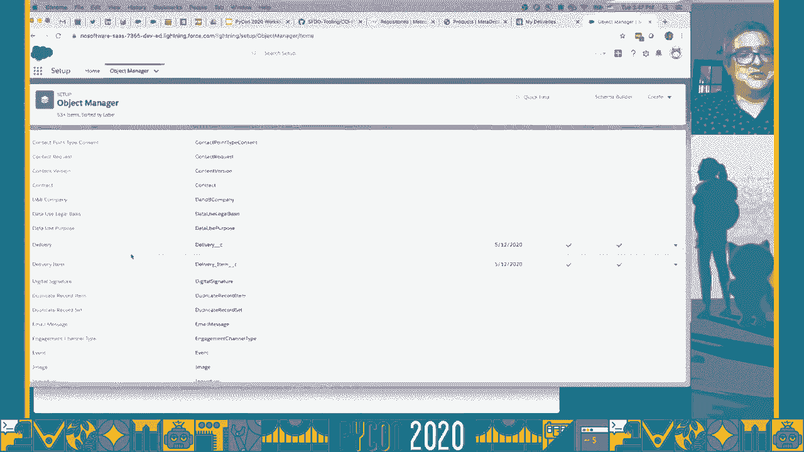
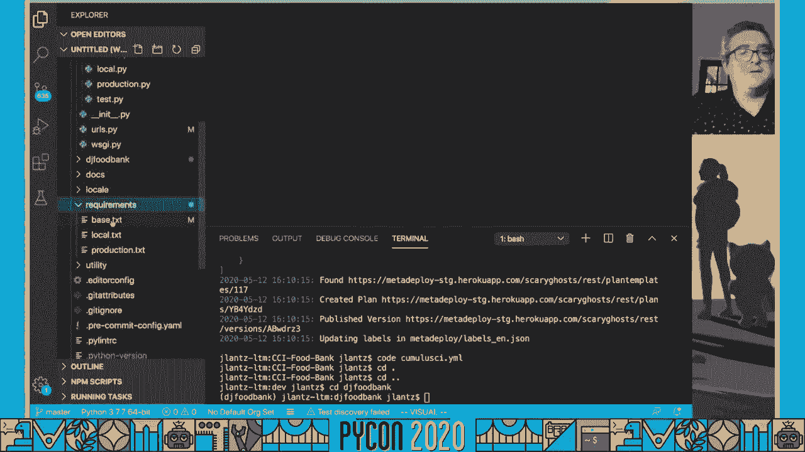
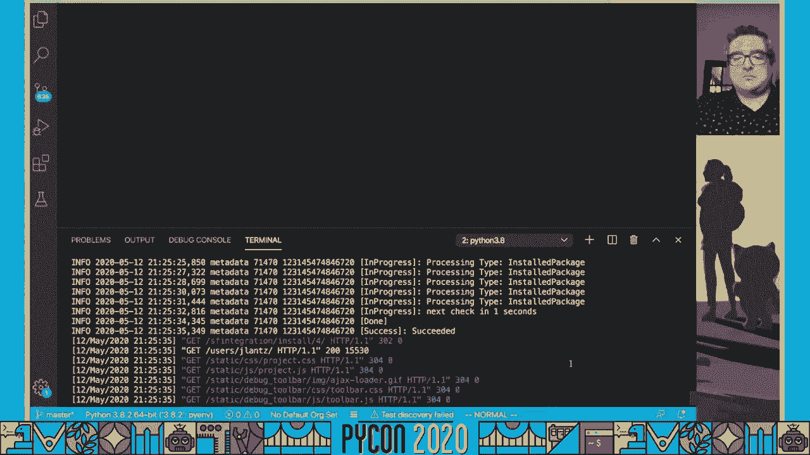
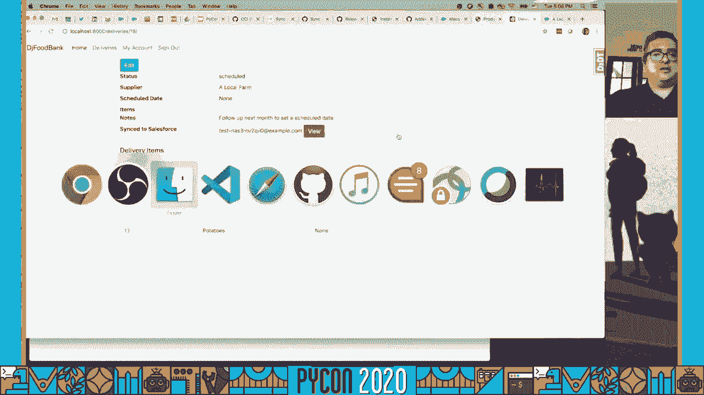
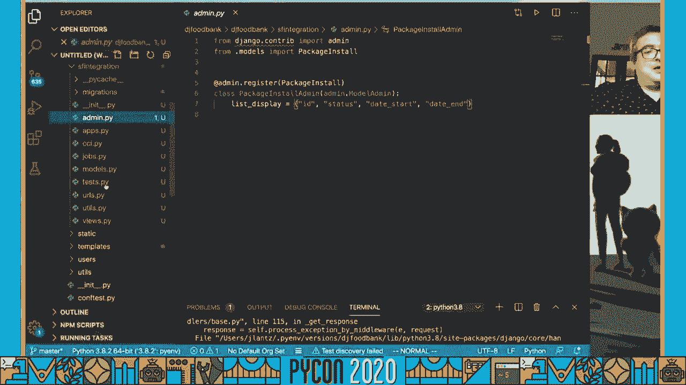
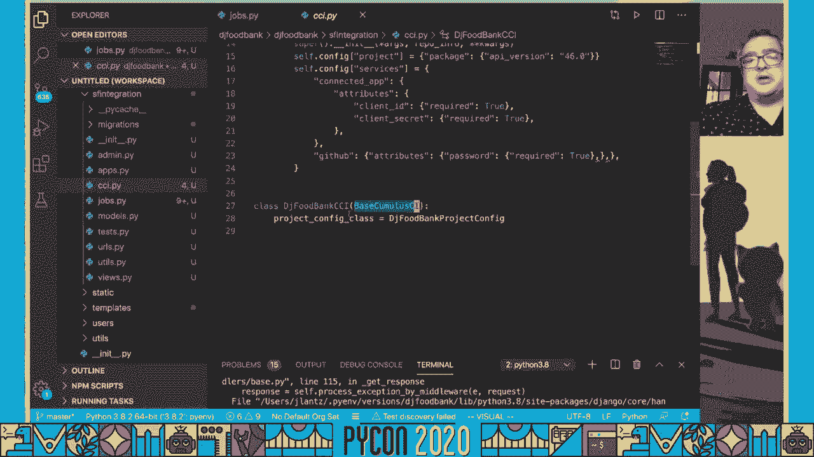

# P13：Sponsor Workshop Jason Lantz - Salesforce How Python Powers Salesforce.org's Uni - 程序员百科书 - BV1rW4y1v7YG

 Hello， and thanks for watching。

 I'm Jason Lance。 I'm Senior Director of Release Engineering at Salesforce。org。 and I'm really excited， to talk to you today in the context of PyCon about how Python is powering Salesforce。org's， unique open-source model， and also how you might be able to use some of the Python tooling。 that we build to build integrations with Salesforce into your own Python web application projects。

 Before we begin， just a quick legal disclaimer， we're going to talk about some forward-looking。 things。 Don't make any investment decisions based on any of this forward-looking content。 Only make your investment decisions based on what is currently available in the market。 Now with that out of the way， let's get into some， or cover the agenda real quick。

 We're going to go through some quick introductions about me， Salesforce， and Salesforce。org。 Then we're going to talk about open-source at Salesforce。org。 Then we're going to look at the main Python tooling framework that we built at Salesforce。org。 and made available as open-source。 Then we will get into the bulk of the session。

 which is going to be three demos that build， on top of each other。 In the first demo。 we'll show creating a new Salesforce development project using Cumulus， CI。 Then in the second demo。 we'll show the three web applications that we built on top of Cumulus， CI using Python。 Those are Meteko， Metacai， and Metadploy。 Then in the final demo。

 we'll bring it all together and apply it to you as a Python developer。 to show how you can integrate a Python web application with Salesforce。 Why would you want to do that？ There are plenty of users of Salesforce and having the ability to integrate your application。 with Salesforce， still develop your application in Python， but build that integration for your。

 users。 It potentially opens up a whole new user base for you and adds a lot of value for those。 users that are using Salesforce。 Let's start with the introductions。 Who am I？ Why am I here？

 Aside from the obvious philosophical question there， we'll just get into the context of why。 I'm here at Python。 I started my career as a Unix administrator。 quickly realized I wasn't a very good administrator。 and started diving into open source projects and really discovered that I like building， things。

 I really like prototyping things。 Back in about 2003。 I discovered this new Python project just starting out called Plone。 back when it was in version one。 I started playing around in Plone。 really fell in love with it as a content management system。 That inspired me to want to learn Python。 As somebody who didn't come from a computer science or a programming background。 Python， was a really great fit for me。 It seemed very elegant。 The projects that were out there had just seemed really well written。 I learned a lot of what I know about programming from Python。

 Very excited to have the opportunity to present at Python。 Then in about 2008。 I made the transition from building corporate web applications to。 working for nonprofit organizations。 I worked for two amazing nonprofits in New York City during that time。 Then I got the opportunity to join Salesforce。org in 2013。

 This was really an opportunity rather than working for just a single nonprofit to maximize。 the impact that I can create in the world by applying my technology skills to benefit tens。 of thousands of nonprofit and now education organizations that are using Salesforce for。 their day-to-day work。 My job at Salesforce。org has been focused on making DevOps easier for the Salesforce community。

 I think my background in the Python， especially with Python open-source projects and Python。 CMS and web projects has really helped me think about DevOps and bring a different perspective。 of DevOps to the Salesforce community。 I think that has actually allowed me to create a lot of the things that I've been able to。 create over that time。 Now if you haven't heard of Salesforce before。

 Salesforce is a customer relationship management， solution that brings companies and customers together。 It's one integrated CRM platform that gives all your departments， including marketing， sales。 commerce and service， a single shared view of every customer。 We bring companies and customers together to deliver the personalized experiences that。

 your customers expect by using the integrated CRM platform that we call Salesforce customer， 360。 Now， what does Salesforce believe in？ This is actually really personal to me and why I'm here。 Our core values help us make Salesforce a platform for change。 You'll see our core values over on the right here。 Trust， customer success， innovation and equality。

 Those are our core values。 That's the order of the ranking of our core values。 And it's a lot more than just a plaque that's somewhere posted in our office。 Over my years here。 I've seen the company use these core values to guide decision making。 so that we can focus on doing the right thing by our customers and the right thing by the， world。

 IWork@Salesforce。org and Salesforce。org is a business unit inside of Salesforce。 We are the social impact center of Salesforce。 So we believe that the purpose of business should be to improve the state of the world。 We provide access to powerful technology that empowers change makers to build a better world。 We are a unique business unit dedicated to creating solutions for nonprofit， educational。

 and philanthropic organizations so that they can have greater impact。 A really essential part of that and the part of the organization that I work in in our。 product development team is the grant of either free and then additional licenses at a heavily。 discounted rate for nonprofit and education organizations。

 We have nonprofit and education organizations all over the world using Salesforce， using。 these grants。 For example， in the United States， most any 501(c)(3) nonprofit organization。 no matter， how big or small， can get 10 free enterprise edition licenses to Salesforce。 For small organizations， and actually that represents the vast majority of the nonprofits。

 that use us， they pay us nothing。 They can work within the 10 free licenses that they have。 And I think that's an amazing benefit that we're providing to the world of this platform。 that we built for corporations and the marketing and sales needs of corporations and being。 able to leverage all of that investment， all of that innovation to apply to this community。

 of change makers that we service。 To date， we've got over 44。000 nonprofit and education organizations around the world that。 are using Salesforce through Salesforce。org。 And we invest heavily in building products that adapt Salesforce customer 360 to the needs。 of a nonprofit or of an education organization。 So we flip from a customer relationship management to constituent relationship management。

 Let's talk a little bit about open source at Salesforce。org。 And when you think about open source at Salesforce。org， there's kind of three main types of open。 source that I want to talk about and cover today。 The first is we have open source products。 And I think this is where our kind of unique open source model really lives。

 We have open source products to provide a common trusted platform for innovation in the nonprofit。 and education sectors。 Salesforce。org， our partners and our customers build solutions on top of these products。 We also have tooling that we've developed to solve our common DevOps needs and challenges。 that we've faced in our development projects on top of the Salesforce platform。

 And we make those tools available as open source to the entire Salesforce community。 These tools are all written in Python。 And then the web based tools are using Django that we run out on Heroku。 We'll be taking a lot of a lot more look at this tooling today。 But kind of the reason for that tooling is in addition to support our products。

 But really where my heart is is in supporting our community。 We built this amazing or actually the community has sort of spawned into an amazing open source。 community that we kind of help facilitate in whatever way we can。 And the newest way that we've done that is the Salesforce。org open source commons。

 Where we host community sprints throughout the year to bring together customers， partners。 and staff to build open source solutions focused on making the world a better place and making。 life easier for nonprofit and education organizations to fulfill their missions。 The Salesforce。org open source commons also helps incubate sustainable open source projects。

 by leveraging Salesforce。org's expertise， access and tooling to benefit those projects。 We'll talk about each of these in a little bit more detail。 Let's dig in on open source products。 So when I say that we've got a unique open source model here at Salesforce。org， I think。 this kind of represents it a little bit。 In this pyramid on the left， the arrow on the left side。

 you can see that easier for， developers is down at the bottom of this pyramid， at least initially。 You write some code， you put it in a GitHub repository， no docs， no packaging。 Don't think about anything， you just kind of push commits up into the repository。 It's very easy for you to get your code out to the world。

 But as you'll see in the first arrow on the right， that is not easier for users。 That's actually going to be the hardest for users to be able to use。 So if you want to get users of your application， have something more than just the field of， dreams。 but actually get people playing on it， you need to start actually focusing on。

 building documentation， creating releases of your product， creating an installable package。 of your product， maybe creating some pre-configured templates that customers can start from， but。 then build out their own implementations。 The challenge is the overall maintenance for the end user of that。 they have to continually， upgrade and integrate their changes with new releases that you come out with。

 At the top of the pyramid here is really where we target our open source model， which is。 the idea of providing pre-configured， fully hosted instances of our software with automatic。 upgrades on a regular basis。 We cut in new releases of all of our products every two weeks and push upgrade those to。 all of our existing customers。 So there's 44，000 plus organizations using us。

 And the way we're able to do that is because we have this unique combination of open source。 products and corporate philanthropy。 The corporate philanthropy provides the platform that our open source model is based upon。 And then we innovate and provide these products that we deliver out to the world。 So for those small nonprofit organizations that pay us nothing， they're living in the。

 top wrong of this triangle， getting the best of both worlds， the hosting and the open source。 product development， the open source community around it。 Now the arrow on the far right here。 you can see that easier for developers at scale。 As you start getting more customers or more users of your open source project。 scaling， the support of that is a challenge。 And by having these pre-configured hosted instances that are always updated so everybody's always。

 running on the latest release， we've really been able to scale our development efforts。 to create huge impact in the world。 As far as I know。 I don't think that there's another open source project in the world that。 really does this combination of corporate philanthropy to provide hosting in an enterprise。

 class platform of the open source projects that they're building。 I think it's a really unique model and something I'm really excited to be a part of。 Our open source products at Salesforce。org are divided between two of our main clouds， the。 nonprofit cloud and the education cloud。 On the nonprofit cloud， we have three open source products。

 the nonprofit success pack， or NPSP， which provides a foundation for the data tracking needs of nonprofit organizations。 things like managing their relationships with constituents， their households， fundraising， efforts。 relationships and affiliations between people and organizations。 And then our newest open source project is the program management module that just launched。

 about two weeks ago and the program management module provides a kind of data schema， a common。 data schema for nonprofit organizations to be able to track their programmatic work。 For instance。 for food banks， the number of meals served for pet rescue organizations。 the number of puppies saved。 And then finally， volunteers for Salesforce is an additional open source project of ours。

 in the nonprofit cloud and volunteers for Salesforce helps thousands of nonprofit organizations。 around the world track and manage their volunteer efforts。 On the education side， like NPSP。 we have the education data architecture or EDA， which。 provides a common framework for building education applications。

 There's a whole bunch of different applications that are built on top of EDA， both by our partners。 and by us。 EDA provides， for instance， objects for being able to track terms and course offerings and。 course enrollments。 And the basic kind of data structure that you need in order to build any sort of solution。 in the education space， it's open source， it's a trusted platform in the education sector。

 especially of those organizations that are running on Salesforce。 And then we've also built the K12 architecture kit， which extends EDA and adds additional。 schema elements that are important for a K12 use case in the education context。 So those are our five main open source managed package products that we make available through。

 this unique open source model combined with corporate philanthropy。 Now let's talk about our open source tooling。 So the main part of our open source tooling。 as I mentioned earlier， is Cumulus CI， which， is a Python framework for portable automation for Salesforce projects。 It was built to solve the unique DevOps needs of Salesforce development projects。

 It's used every day by Salesforce。org's product development teams。 And I don't just mean developers。 I mean our QEs， our doc writers， our UX people， our， project managers。 even our partners doing implementations or utilizing this。 It's developed in a public GitHub repository at SFDO tooling/ Cumulus CI。

 And also just in March something I'm really proud of， we worked for a long time trying。 to get a learning module together to teach Cumulus CI and how to work with it。 So if you're interested in any of the demo content today， I definitely recommend going。 out and going through this trail。 Trailhead is Salesforce's free online learning system。

 So you can go learn about the Salesforce platform， but there's also tons of additional。 learning out there just about agile processes and things like that。 And it really has just a ton of amazing content that's all available for free。 Now in addition to Cumulus CI， kind of the framework， we built three different web applications。

 that are using Django and Heroku that sit on top of Cumulus CI and extend the automation。 in a context that we call portable automation， which I'll explain a little bit more later。 The first of those web applications is MetaCI， which is a custom CI app that's run on Heroku。 for scalable continuous integration of Salesforce projects that are using Cumulus CI。

 The reason that we built our own custom CI app is because the needs of Salesforce development。 projects are a little bit unique in comparison to most development projects where you can。 run your code in a virtual machine or in a Docker container。 Our builds are actually more client APIs that are installing things into a Salesforce instance。

 And because of that difference， we found that it really made sense to build a tailor-made。 CI system specifically for this use case。 We still use other CI systems to build our Python projects and things like that because。 they're plentiful。 But the Salesforce DevOps space was unique enough that it made sense to go ahead and build our。 own CI system。 Meta deploy is a customer-facing installer and automation tool providing bring-your-own。

 network access to a project's Cumulus CI automation through a simple web interface。 Now when I say org here in the Salesforce world， that's how we refer to an instance。 or a tenant in the Salesforce platform。 So every customer has their Salesforce org。 usually a production org。 They have sandboxes off of that。

 There's other types of orgs that we'll talk about and show in today's demo。 But the key thing about Meta deploy is it's about customers being able to bring their own。 Salesforce instance and install our products into it。 And all the automation necessary to get them installed and configured。 And then the newest tool。

 which I'm really excited about， that we've been working on， for almost a year now。 So therefore。 the coming soon we've been doing some kind of pilot testing of this。 But this tool is called Meteko。 And Meteko is designed to empower Salesforce admins to contribute to open-source projects。 through clicks， not code， without any knowledge of Cumulus CI or GitHub or Python。 They can just。

 through a simple web interface， contribute to projects that are on GitHub。 Using the skill set that they built up of doing declarative configuration through Salesforce's。 web interface。 But get the best of breed combination of that with version control based development。 And we'll take a look at all of these apps in our second demo。

 So let's talk about our open source community。 In the nonprofit and education sectors。 if you've ever had the opportunity of working， with any nonprofits or education organizations。 you'll find that there's really an inherent， desire to share。 Food banks don't compete with each other。 You know。

 a food bank in one county doesn't compete with a food bank in the next county。 They just want people to be fed。 Pet rescue organizations don't compete with each other。 They want pets to be defined good homes。 But the real challenge is how to share these kind of technical solutions that are built。 They have a lot of power for the organizations that make the investment in building them。

 But how do you share those solutions out with others in your sector？

 And our way of addressing that has been creating what we call the Salesforce。org open source。 commons。 And the open source commons has two main components to it。 The first。 as I mentioned before， is we run these open source community sprints。 Now there were open source community sprints in the Salesforce。org world。

 Long before we had the open source commons。 There's a long history going back many years。 In fact。 NPSP， our largest open source project with tens of thousands of users， originally。 started as a community created open source project that we started collaborating with。 the community and putting real investment effort behind evolving and developing out that system。

 So these open source community sprints are two day in person and now in the COVID-19 world。 virtual events。 We just had our first open source community sprint。 It was supposed to be an in person event in Atlanta at the beginning of April。 But we wound up having to cancel that and switch it to a virtual event。

 Our virtual event had over a hundred attendees there for two days building some really amazing。 solutions。 And it was awesome seeing the energy that was there in the room。 And really I think a testament to the passion that exists inside of our community。 There are technical and non-technical projects。 So people want to build solutions on top of the Salesforce platform that they can release。

 as a package and other people can install under their instances。 There's also people just creating documentation or videos or other ways to help people。 And really all of those ideas start as just a brainstorming in a very un-conference type。 configuration where people brainstorm and announce the ideas that they have。

 People that are interested kind of group up at different round tables around the room。 or in different breakout rooms in a virtual event。 And all of these projects are developed both a technical and non-technical using GitHub。 repositories out on the SFDO community sprints GitHub organization。

 Now the second part of the open source commons is this program to support community run open。 source projects that are sustainable。 And we provide the process and the infrastructure to facilitate these community run open source。 projects for the nonprofit and education sectors。 The projects have to meet sustainability requirements to be accepted。 So it's not just that somebody built something cool。

 It's that there's a team of people that are committed to maintaining the project and meeting。 regularly to creating releases as there's new features available， reviewing pull requests。 in the GitHub repository。 All of the projects that get accepted then get moved into our GitHub organization SFDO。 community which is the organization for official open source commons projects。 Salesforce。

org provides all of our tooling， meta CI， meta deploy and meta go for those。 open source community projects to be able to manage the kind of packaging and the testing。 and all of that at scale with a minimal amount of investment or involvement needed from them。 So we really want to lower the bar as much as possible to community projects that have。

 a community behind them but maybe just don't know how to do all of these things or some。 of these things without this tooling are really time intensive。 And so we don't want that to be a barrier to sharing。 And then finally we facilitate getting a Salesforce ISV security review on the packages that are。

 coming from these projects and getting those packages published and available to the Salesforce。 community。 Now we talked about this kind of unique open source model and where I see all of this is。 that with the open source commons and the potential to tap into this whole community of innovators。 we really have this new layer on top of it。 A layer of exponential impact by empowering community driven open source solutions to common。

 and sector specific challenges。 And this goes way beyond the engineering capabilities of our team no matter how big。 we grew our team to be it could never match what our community is capable of doing if。 we're effective at empowering them to do it。 Alright so let's shift gears and talk a little bit more technical now and let's talk about。 Cumulus CI as this is kind of the core framework and we're going to be looking at this throughout。

 the demos today。 Now when you think about DevOps for Salesforce I really think there's kind of one primary。 challenge and it's a common DevOps challenge of getting environments。 But the challenge in Salesforce is a little bit different than most other DevOps environments。 in the sense that you can't run any of our code in a virtual machine or in a Docker image。

 Your Salesforce code or metadata as it's called in the Salesforce world has to be deployed。 into an instance or an org of Salesforce running in the cloud。 And you know for a long time the Salesforce made available developer edition or developer。 edition orgs that anybody could go out and fill out a web form get a developer edition。

 org it was a persistent org you could deploy metadata into it you could create data inside。 of it it was always around。 But as we know from general DevOps best practices it's really not a good idea to have a persistent。 always there test environment or development environment。 Better practices to be able to create and destroy them easily。

 So a few years ago Salesforce DX or the Salesforce developer experience was a project launched。 by Salesforce and created a command line interface the Salesforce CLI which the command is SFDX。 we'll see that here a little bit later。 And it made this whole process better by introducing this concept of scratch orgs which are temporary。 Salesforce instances that you can provision and destroy via API calls。

 The thing about scratch orgs is they start from sort of an org shape which is a JSON。 file where you define the Salesforce edition the features and the settings that you want。 to have in your Salesforce org。 But that's not really setting up anything that's project specific that's kind of just。 which bits are on in the base Salesforce system。 But Salesforce has kind of a platform for custom development what these projects are。

 focused on is building custom solutions on top of what Salesforce has built。 And to be able to do that you really need to be able to have automation that can build。 you usable scratch org environments for development and QA。 And that requires installing other packages deploying metadata into your instance and also。

 loading data so that when a tester goes in to get an environment from a feature branch。 the environment that they get just by running the automation is actually fully ready for。 them to start testing。 And that's really the core of the challenge that Cumulus CI was built to provide a framework。 for orchestrating all of those changes on a project by project basis in a highly configurable， way。

 So let's take a quick look at the structure of Cumulus CI and sort of how it's set up。 There are four main parts to Cumulus CI which is a Python package that we build。 It's available on PyPy you can install it with pip install Cumulus CI。 And the first component of Cumulus CI is the Cumulus CI。yaml file。

 Cumulus CI is a very configuration driven framework and all of the configuration gets。 mapped through this Cumulus CI。yaml file。 The base Cumulus CI。yaml file makes up what we call the global configuration and has all。 of the best practice defaults that we find helpful across most every project。

 Then the second component is Cumulus CI's keychain which is its credential store。 It stores credentials， OAuth connections to persistent Salesforce orgs。 And also has the ability to interact with Salesforce DX to spin up scratch orgs and delete。 scratch orgs。 And then also has the ability to store third party service credentials to things like the。

 GitHub API that you might need when you're writing your automation for your projects。 The third part of Cumulus CI is tasks。 And really tasks are kind of the bulk of everything that Cumulus CI does。 We've got a bunch of different tasks you can see listed here for all sorts of different。 things that we find helpful throughout the development process。

 And tasks are the basic unit of work in Cumulus CI's automation。 And then on top of tasks are flows。 Flows are sequences that ultimately reduce down to tasks。 Flows can call other flows but ultimately that reduces down to a sequential list of tasks。 And Cumulus CI ships with a number of flows out of the box by default that we find helpful。

 in almost any Salesforce development project。 So flows like the Dev Workflow and the QA org flow which respectively get you a fully。 configured scratch org ready to start doing development work or a fully configured scratch。 org ready to start doing QA work。 There's also flows for testing kind of the managed version。 If you're building a managed package， we'll talk about that a little bit later。

 To kind of build the kind of release side where the customer environment is going to look， like。 There's some flows that we provide for running in CI systems like CI feature which is a flow。 for testing feature branches。 And then also flows for automating release management processes to create a new beta。 release or a new production release of a package。 Now as a configuration driven system。

 all of these tasks in Cumulus CI are defined in the， cumulus CI。yaml file in the global configuration file。 So here's an example of what the deploy task looks like for deploying metadata。 And you can see that it's defaulted the task specific option path to the directory called， SRC。 All of these tasks can define their own custom task options。

 So we try to make it a very declarative driven system。 Most people that are using Cumulus CI don't know anything about Python。 But they can do a ton of customization of how Cumulus CI works just by modifying these。 YAML or the YAML syntax。 The other thing that's important about the options in this YAML syntax is we like to。

 bake all of the options into the project's configuration。 So you're not having to remember a whole bunch of command line flags when you go to。 run the different automation。 Now likewise flows are defined in YAML。 Flow definition is really simple。 It's just steps with numbered slots。

 And flows can call other flows or they can call a task。 So in this case， to set up a dev work。 we've got to run the dependencies flow， run the deploy， unmanaged flow。 which will get kind of the source code for our project deployed， and then， run the config_dev flow。 which will configure our environment for development use。

 And then finally called the task snapshot changes to reset the source tracking so that。 we can kind of track everything that we do from that point forward。 Now obviously every project is going to have different needs for what it means to get a。 dev work or a QA work。 And that's where Cumulus CI's project configuration comes in。

 So in the GitHub project repository， there's also a cumulus CI。yaml file。 That file gets parsed into a dictionary and then we do a dictionary merge on top of Cumulus。 CI's global configuration。 So the only thing that goes in the cumulus CI。yaml file in a project is overrides and， extensions of the global configuration。

 So you might have new custom tasks that you've written。 You might have new custom flows that you've written。 You might have dependencies that you need to your project that you need to be able to， define。 So what that might look like if， for instance， this is actually a sample from the nonprofit。

 success pack repository that shows how NPSP is modifying the config dev flow， which as。 we saw just a minute ago， which as we saw just a minute ago， presenting from home， it's， lovely。 is a flow that runs in step three of the dev work flow。 So this config dev flow in the global configuration of cumulus CI normally just has a single。

 it normally just has two steps in it。 So in this case。 this project's adding three additional steps onto the end of the flow。 So every dev work is going to have these steps run against it automatically。 So the projects overrides of the configuration of cumulus CI's default configuration is really。

 what we mean when we talk about the portable automation for cumulus CI。 It's all the automation needs of the project defined in the abstract。 And then on top of that。 we build client applications like CCI， our command line interface， for accessing running tasks。 running flows， creating scratch words。 And then also our web applications are clients of this framework。

 They're clients of the portable automation defined for each individual project。 So Metacie uses a project's portable automation defined in the cumulus CIAM file to go run。 flows to run builds， triggered by GitHub web hooks or manually by a user。 Metadploy， likewise。 is just running cumulus CI tasks but against a customer org where。

 they've granted access through OAuth。 And that allows us to really service all the potential users of this automation。 So automation is not really something just for your Jenkins system。 It's something that your developers need to run locally or QA people need to run locally。 or doc writers， your product managers， your implementation partners and ultimately even。

 your customers。 So that's the general introduction to cumulus CI。 And I do want to take a quick minute just to call out some of the Python projects that。 we're using in cumulus CI。 I thought a lot thinking about this session of how would I answer the question of why。 do we build cumulus CIAM Python？ And to be honest。

 there was definitely an aspect of personal bias in it。 I come from a Python background。 It was something that I knew and it was easy to get this project bootstrap using it。 But in addition to that， cumulus CI has leveraged a lot of what's amazing about Python in the。 Python community。 So we use applications like click for building CCI， the command line interface。

 We're using Faker for test data generation。 We're using GitHub 3。py for interacting with the GitHub API。 We're using GINDA2 for templatize configuration files。 The request framework obviously gets lots of heavy use as we're making a lot of different。 API calls。 We're using robot framework and the robot framework Selenium library to build a really。

 rich Selenium testing framework for self-force development projects。 We have an additional library that we built for robot framework that provides a bunch。 of keywords for driving the UI and interacting with the APIs of a Salesforce instance。 There's also the Salesforce bulk library that interacts with the Salesforce bulk API for， querying。

 inserting， updating， and deleting records。 We're using Sarge for subprocess callouts。 We're using simple Salesforce for interaction with the Salesforce REST API and SQL alchemy。 for our functionality that can capture and load datasets to and from Salesforce org。 Now giving back to that whole community， I want to kind of briefly introduce one of。

 our newest open source tool， which is called Snowfakery。 And unlike all the other stuff that we've been talking about， Snowfakery is a tool that。 you can use immediately。 And you don't have to be using Salesforce at all in order to use Snowfakery。 Snowfakery is a declarative framework for fake relational data generation。

 And it's capable of it has plugins to faker。 You can write all sorts of customer routines in it。 randomize data and stuff like that。 You can use it to generate small datasets。 You can have a description of a dataset shape and then say， give me a million of those records。 So you can generate large volumes of data and it just writes into a relational database。

 because behind in the back end it's using SQL alchemy。 So it should work with anything that SQL alchemy works with。 We have tested it internally with SQLite and PostgreSQL。 Now if you are using Humilis CI and doing a Salesforce development project， Snowfakery。

 plugs in with Cumilis CI's bulk API tasks to be able to populate Salesforce orgs with。 the data that's generated from these definition files。 That sounds interesting to you。 Definitely go check out the repository SFDO tooling， Snowfakery。 There's great documentation and really great examples in there that kind of show all of。

 the power of this framework。 Now let's jump into our demos。 This is the part that I'm most excited about getting hands-on with this tooling and showing。 you what you can do。 Alright so for our first demo we're going to show how to start a Salesforce development。 project using Cumilis CI。 Now why would you want to do this as a Python developer？

 Kind of two reasons。 First it's pretty cool that we built all of this stuff using Python。 But say you're a Python web application developer and you build a web application that collects。 information from your users and your users might be organizations or companies that might。 use Salesforce as their CRM system。 And you start getting requests to integrate data from your application with Salesforce。

 Well if you're going to integrate data from your application， probably there's some specific。 schema to that application。 And we're going to talk a lot about schema here。 And if you want to integrate that data with Salesforce， you're going to need to create。 the schema in Salesforce。 So these first two parts are really getting these first two demos are going to show you。

 how you would go about creating schema， packaging it up and making it available for your customers。 to install into their Salesforce instance so that you can get the plumbing in place for。 your integration。 And then in the third demo we'll take a look at actually building an integration like that。 as an example。 So for this first demo we're going to get a project started just to show you what it's。

 like to do development with Kimul C。I。

 And I'm going to go ahead and jump over to Visual Studio Code。 Now I already have CCI。 the command line interface for Kimul C。I。 installed here。 I've got a couple of other tools set up and configured SFDX in particular which is the。 Salesforce CLI。 In our Kimul C。I。 trailhead trail。

 the second module walks through all the setup instructions。 for this if you want to actually do this on your own computer。 So the first thing that I'm going to do is make a directory called PyCon demo。 I'm going to change into that directory。 And then I'm going to initialize it as a Git repository。

 Kimul C。I。 is designed to work inside of Git repositories。 And then I'm going to run this command。 CCI project init， which is going to initialize， my project。 I'm going to provide it some basic values here。 The name of the project。 The package name which is what the package will look like in Salesforce org。

 I'm going to go ahead and say that I want to make a manage package out of this project。 Manage packages in Salesforce have a globally unique namespace assigned to them。 Everybody can create a Salesforce developer edition org and go reserve one of those namespaces。 And that's your namespace。 That org becomes essentially the packaging org where you can upload packaged versions。

 of whatever customizations that you built。 And I will use the latest Salesforce API version。 I'm going to use， we have two different source format options。 I'll use SFDX source format。 which is the newer source format。 It's a little bit more friendly to work with。 And in this case。 we're building a standalone project。 But I mentioned earlier that key millisci in projects can define dependencies。

 So say you wanted to build something on top of NPSP or EDA， our open source projects for。 education and nonprofit。 You could just say yes here and then it would give you a menu of options where you could。 tell it。 I want NPSP installed in all of my environments automatically。 It's pretty easy to do in the Python world with PIP。

 It's a lot more challenging to do in the Salesforce world and kind of one of the unique features。 that key millisci I hope solve for。 And I'm going to accept the default branch and tag naming conventions for the project。 And when I'm done， go ahead and just add this project to my workspace here。 All right。 So I've got this project added in my workspace and it's created a whole bunch of skeleton， for me。

 And the first thing that we want to look at is the key millisci yaml。 You can see it's only 20 lines of code or of configuration because it's inheriting all。 of the configuration from key millisci's global config。 So all of the tasks that are available in key millisci's global config。

 I'm going to type the command rate。 And then the key millisci task list on the command line will list off all the different。 tasks that are available。 You can see there's a ton of them grouped by interactions with GitHub。 data operations， interactions with Salesforce DX， a bunch of Salesforce specific automation。 integration， with packaging and things like that。 There's a ton in that list that's already available。

 And then also I have all of my flows that come in the global configuration of key millisci。 with the dev org and the QA org flow。 I can get information about the dev org flow by using CCI flow info dev。 And this will show me the dependencies flow， but then also the tasks that are contained inside。 of that。 So we're going to install the dependencies and then deploy the package source code。

 You'll notice these are GINDA2 style GINDA2 expressions for creating conditional steps， in a flow。 And then run the config dev flow。 Now the last thing that key millisci is provided out of the box for me is a default setup for。 five different types of scratch orgs。 Configurations were different types of orgs that we find helpful throughout the development。 process。 These are lazy configurations， so they're grayed out because they haven't been woken up。

 You have to run something against them in order to wake them。 So let's go ahead and run something against them。 We'll run the dev org flow against the org configuration named dev。

 And this will kick off and basically when this is done， I will have a fully configured。 development environment for my project。 Now this command， CCI flow run dev org minus minus org dev。 is the exact same command that， you run in any QMLCI project to get a dev org。 It's the project's job to extend and override anything that it needs to in the QMLCI YAML。

 to make that into a usable development environment。 But it makes it really easy for users working across multiple different projects to have。 that consistency。 So you only have to remember a handful of commands really to use most of the power of QMLCI。 So you'll see in the start here that it called out to Salesforce DX force org create and passed。

 it a configuration file， this orgs dev。json file。 This is the scratch org definition file that defines the org shape that we want it to generate。 So I want to develop a developer edition Salesforce instance。 I want these different settings enabled in the org by default。 And close that file。 it looks like that flow has now completed。 I scroll down to the bottom now。

 I can jump into that org with running CCI org browser。 And this will go open up that Salesforce instance that was just created for me on the fly。 Now all of this， this is available to you free of charge。 You don't have to pay any licenses to be able to use this if you want to get in and kind。

 of play around and try some development on top of Salesforce。 Now before we jump in and actually build some things there， I want to show one other。 thing real quick because I mentioned that we've built this integration with that in line。 All right。 so we built this integration with robot framework and I want to show briefly。

 what one of these tests look like。 When we initialize a cumulistii project at first。 we build your first regression test case， which is testing to make sure that nothing you do breaks the ability to create a contact。 which is kind of core in Salesforce。 And so if you've seen Robot before。 you'll recognize some of this。 If you haven't， it's a pretty simple keyword-driven testing framework based in Python。

 Robot keywords are effectively just a Python method behind the scenes。 And in the settings section。 we load in some resource libraries that come from cumulistii。 This Salesforce。Robot resource is actually pulling in our library of keywords for driving。 the browser through the Salesforce UI。 This via the API test is using Faker to generate some fake first and last names using our Salesforce。

 insert keyword and Salesforce get keyword to go create and then query a contact。 And then it's using a custom defined keyword here in this test case later in the file to。 validate the contact。 Now it gets more fun when you get into the Selenium side when you do it via the UI。 You use our page object keywords， go to page， home for the object contact， click the object。

 button new， wait for the new contact modal to pop up， and then populate the form using。 the form labels that appear there。 First and last name using our fake first and last name above。 hit save， etc。 And then on validate contact， we want to go validate in the UI and in the API。 So I can run this whole suite of tests that got created for me automatically by running。

 the task named robot in cumulistii。 This will run all the dot robot files under your test directory in the project。 It should open up a new browser and remember the first test is going to go through the， API。 So what it's doing here is it's already created the contact through the API and now it's going。 to come up in the old UI for some reason。 So it's created the contact through the API and now it should go and that test failed。

 Alright， something to look at。 So but that gives you a general idea of the ability that we built in to be able to build。 browser tests on the Salesforce side of the work that you're doing there which is really。 really handy to have those automated test suites。 Now I'm going to go ahead back into that scratch org here。 Switch over to lightning experience， the new UI and in setup， I want to go start creating。

 the schema。 And the use case that we want to go through here is for a food bank to be able to track。 deliveries。 So I'm going to create a custom object or a table or a model in systems you might be。 familiar with working with and I'm going to create an object called delivery， select， some options。 I want to be able to do reports and activities on it。 I want to launch a new custom tab wizard。

 Tabs are the tabs over the top in the Salesforce interface and they generally relate to an individual。 model and inside that tab you can work with the records of that model。 So to do this。 I've got to select an icon for it。 I'll pick the truck icon because it's for deliveries and there's a bunch of configuration。 I can do here。 I can pick what profiles this tab is visible and what applications which are just grouping。

 of tabs mostly。 You can come in and configure this but for the sake of demo。 I'm just going to kind of， go through and accept a lot of the defaults here。 Now I've just created a new object called delivery。 That delivery object has a few kind of auditing related fields automatically on it。

 And now I want to go ahead and add a couple of fields here。 The first field that I'm going to add is a pick list field。 We want to track the status of the delivery。 I can enter in values here。 So scheduled。 delivered and canceled。 All right。 Save。 Then let's add in one more here as a look up to the account object in Salesforce which。

 is one of the standard objects in Salesforce to use for tracking a company or an organization。 And I want to call this supplier。 Again， lots of configuration you can do in each of these different fields but we're just。 going to try to create something quickly here。 And in addition to the deliveries。 I really want to get more value out of this by tracking， the individual items in a delivery。

 So let's say create an item called delivery item and give it a plural name of delivery， items。 Go ahead and change this to an auto number field。 Give it a format for the auto number。 We do want to allow reports。 Let's skip over activities on this one and we're not going to create a custom tab for。 this because we want this to be kind of a related record of the delivery itself。 All right。

 So then in the fields relationship or fields and relationships， let's just create to a long。 text area or description of the item。 And then we also need to build the relationship。 And in this case， we'll do a master detail relationship。 That's the equivalent of like a foreign key field。 It's a required relationship。

 And we want a master detail relationship to the delivery。 So no delivery items can exist without a delivery that brought them。 Except the defaults there。 Next， next and save。 All right。 So we've created these two objects really quickly。 just kind of clicks not code in the， Salesforce instance。

 Now let's jump back into Cumulus CI and show how we capture that into version control。 So go ahead and collapse that down。 Close this robot test。 Just a little bit more room on the command line here。 And to do this。 we're going to use a task in Cumulus CI called list_changes。 And actually before I do that。

 I'm going to go ahead and so that I don't have to keep。 typing minus minus org dev on the end of every command that I run。 I'm going to make the dev org into my default org for this project。 So now I can just run list_changes。 And this will go out and query the org and interact with the source tracking that's in。

 the org to find all the metadata that I changed in the org。 Now sometimes you want to exclude down the list。 And that's where the custom task options for this come in。 If I want to find those options， I can do CCI task info list_changes。 This will give me output of all the different task options。 In this case。

 I want this exclude option to exclude components from the list。 And this is just a regx format。 And I want to leave out those profiles because profiles are kind of uniquely difficult to。 package in the Salesforce world。 They're more of kind of an individual implementation configuration detail。 So I do want to capture the objects in the fields and the layouts for those objects。

 So now all I've got to do is just recall this command and change to use rather than list_changes。 the retrieve_changes task。 Which accepts the same options so you can kind of prepare the list of options。 And this will go and actually run a query through the Salesforce metadata API and pull。

 down the content that was created。 All right， so if I look now in my project under this force app directory。 main default， is where my metadata source lives。 For other objects。 I have folders for each of my objects， a folder for fields， the individual， fields in them。 So pretty cool。 I was able to make these changes just in the web interface。

 capture those changes down， to something that I can put in version control really easily。 Now let me just go ahead and do a git add。 As I said earlier on the demo intro slide that we were going to create a feature branch。 I forgot to do a commit on the master branch。 So we're just going to go ahead and commit this as the initial commit。 And do this on the master branch and create the master branch for our project。 So that's it。

 We've kind of started a project。 We can now develop this Salesforce development project through feature branches。 If I run the CCI org scratch delete dev command， it's going to go wipe out that org where。 I created those changes。 And now if I run the dev workflow again。 it will go create a new scratch org， run all， the automation。

 And this time it's going to deploy everything I just captured into that word so I can iteratively。 develop and build out the solution。 Pretty cool。 All right。 So for the next demo。 I want to show you the web based tools that we built on top of cumulus。 CI to make this a little bit more scalable and also a lot more approachable to non-developer。

 types that are kind of thrown off when you try to drop them into the command line。 So we're going to take a look at Meteco in order to offer a new feature to this application。 Then we're going to look at Metacii， our build system as it builds that feature。 And then we'll look at Metadiply and how we can figure a new version that we're going。

 to create for our web based installer of this project。 So let's go ahead and jump into。 Now this project that I've got already out on GitHub， I've already got connected to all。 of these tools。 So we're going to switch over and use this for the rest of the demo。 But it's basically the same thing。 You can see under the force app main default directory。

 I've got objects。 I've got a delivery and a delivery item。 I think these have some additional fields on them。 So they have a scheduled date and a notes field that's on them。 But what we want to do for this demo is since in the third demo we're going to integrate。

 a Django app to sync its data with this one， we want to actually add a new field that's。 going to store the external ID from the Django app as an external ID on this object。 So to do that。 we could do that using CCI on the command line just like we were going， through。 But I want to show you our newest tool that's in the works， Metecco， which I think is really。

 really exciting。 So let me quickly log out of here just to show you what it looks like from the start。 When I come to Metecco， all that I have to have and I really know about GitHub to use。 Metecco is I've got to have a GitHub account， which is pretty easy to create。 So I come out and I log in and I've already accepted this app。 Normally I would get the。

 do you want to grant this app access to your GitHub profile， OAuth verification step。 And what it does is it looks at the list of repositories that I have contributor rights。 to and compares that against the repositories that are configured in this instance。 So you can kind of pick and choose what repositories this instance is supporting contributions， to。

 And in this case， I've got the CCI food bank repository here and I also have contributor， rights。 So I'm showing the card for that app。 If I click here to go into the app， I can。 there's an existing project that I created， earlier。 But in this case。 we want to create a new project for our contribution。

 And the external app is this app called DJ food bank that we're going to look at in the， third demo。 So this is really to prepare that。 And we're going to create a task to create external ID fields for delivery and delivery。 item。 And if I come in and look at this individual task， now this is kind of my workspace for。

 the task。 I've got to assign somebody as a developer。 Right now I'm the only active member of this project。

 And so I'm going to go ahead and click create or。 Now this is doing essentially the same thing that the CCI flow run dev org minus minus org。 dev is doing on the command line。 So it's tapping into that portable automation。 just providing a totally different user experience。 that's a lot more friendly for people that are not comfortable in the command line。

 I started out my career as a Unix admin。 So command line is kind of my bread and butter。 But you know， for a lot of people in the Salesforce world。 they're very used to these kind of clickable， web interfaces。 And we really want to open up these projects to them to be able to contribute。

 And I will also go ahead and assign myself as the tester on this project， just so you。

 can see what that looks like。 And the general idea is the developer develops things and their scratch org captures them。 creates commits。 The tester then creates a new scratch org using the automation from that branch to deploy。 into the org。 And you can see my org's been created。 So I'm going to go ahead and click view org to log into the Salesforce org， the scratch。

 org that's been created for me。 And in here， oh， it's really like to launch those in the classic UI for some reason。 So I'm going to switch over to the new UI because this is much， much nicer。 And in here。 I want to add two new fields， one on the delivery object， go to fields and， relationships。 go to new。 And in this case， I want to add a number field for the integer ID of the app in Django。

 And let's call this DJ food bank ID。 And we're going to tell it that we want this to be an external ID。 So that'll ensure uniqueness on this field so that it can be used essentially as an index。 And save。 And I also want this similar field on my delivery item。 So go to fields and relationship for delivery item。 I'm going to go through and do this quickly。

 Feel free to pause the video and slow down if you want to see any of this in more detail。 of what's happening。 We're going to call this DJ food bank ID and also make this an external ID and hit save。 Cool。 So I made the declarative changes。 Now just like we used the list changes step on the on CCI on the command line before。 this， time we're going to use a Moteco which kind of leverages that same automation from QMLSCI。

 to go out and query the org。 Then it's going to ask me where do I want to store this？

 Do I want to store it in the kind of post install QA configuration that's sort of an optional。 configuration or do I want it in the main package directory？ In this case。 I want this in the main package because I want it to be something that when， people install it。 they get。 So I'm going to go ahead and hit next。 And it's again going to show me all the different metadata that it detected has changed。

 in the orgs。 I'm going to leave out the profiles but we are going to select the fields and the layouts。 I'll hit next and give it a commit message and tell it to go retrieve the selected changes。 So notice， I haven't really had to know anything about GitHub here。 And the scenes。 what it's done is created a feature branch for the project and then what。

 we call a child feature branch。 So the project is a parent feature branch。 It's feature forward slash the parent project name。 And this new branch that's been created for me now that this commit is on。 Let's jump over and look at that in GitHub。 All right。 And if I look at this commit。

 this branch name is feature forward slash sync with DJ or DJ。 food bank underscore underscore which separates the parent from the child feature branch。 Add external ID fields to delivery and delivery item。 A little bit long as a branch name。 But you can see here that it's just some， some， you know， it's pulled down just the changes。

 that I made in the org， these two custom fields and then adding those fields into the page layout。 XML definition for it。 So that looks good。 Now I want to go ahead and pass this over to the tester because I think I've captured。 everything that I need。 So I'm going to do submit tasks for testing and go ahead and actually I'll do this later。 on the project。 So I'll go ahead and just submit the task but I can input information that will make。

 its way into the pull request body。 And this is going to go submit a pull request for me。 Now I can jump over into GitHub easily and look at that pull request that's been created。 And you'll notice that there's builds that have already kicked off on this pull request。 that I created。 Now before we take a look at those builds。

 let me first as the tester now go and create， a new org。 This is going to create a new scratch org and deploy this new commit into the org so。 that I can go in and test it in a clean environment。 You don't want to test in the development org。 right？ And so let's jump over and take a quick look at Metacii and what Metacii is doing for me。

 here。 So this is Metacii running out on Heroku and it's run the feature test plan for this repository。 against my child feature branch on this commit。 And it's reusing cumulusii's portable automation again so it's downloading the commit。 It's calling Salesforce DX to create a new scratch org and then it's running this flow。 CI_FETURE that I mentioned earlier as one of the built-in flows for doing feature branch， testing。

 And if I go to the flows tab， you'll notice the output here looks identical to what we。 get if we run CCI on the command line。 So we're running this automation in a different way with a different user experience around。 it but ultimately it's running the same automation in the same way。 If this flow failed and I wanted to debug it， I could run it using CCI locally with a。

 - - debug flag and it would drop into a PDB prompt whenever the flow fails。 And also because this is a Salesforce specific system， I get some information about the target。 environment that's kind of specific to Salesforce。 Now in addition to that。 it's kicked off and is running my robot tests as well for me。 And since that one's still running。

 I'll show you what one of these looks like。 I think this is a really cool feature because this is a system for building cumulusii projects。 and we use robot for the projects。 I can go in and see。 we built an integration with robot framework into this。 So if I want to see the test via the UI。 if you've ever worked with robot framework before， you've seen this log format。

 we actually integrate those directly into the browser so I can see， exactly what's going on。 It'll even capture a screenshot if there's a missing locator or locator that doesn't。 find the right thing on its end。 All right， so all checks have passed。 Everything looks good here。 Let's go back in here and as the tester， I'll go log into the test environment just to。

 show you that this environment's been created and I can log into it。

 Now normally in a non-demo sense， I would go through and actually do testing in this environment。 Let's go ahead and jump ahead and submit the review， say approve， and it looks great。

 I'm going to go ahead and add the project review。 Now if I go over on the pull request。 that shows up as a comment that was left by me。 And also it shows up as a commit status。 So you can set up protected branches to require that as a check before it's allowed to merge。 I'm going to go ahead and merge this pull request and notice this pull request was just。

 to merge into the parent feature branch。 So now this task is done。 If I go back to the project level， I can submit the project for merge。 And here I'll go ahead and provide some release notes。 All right。 So now that's created another pull request for me。

 And this pull request is requesting to merge this branch into master。 Again， normally。 and we do have protected branches set up on this one， I normally don't。 have it where admins can override。 But for the sake of demo。 I would wait for these builds to complete before I do this normally。 But in this case。

 I'm just going to go ahead and use my admin rights and merge this pull。 request into master so that we can kind of continue along to the next steps in meta-CI。 All right。 So jumping back into meta-CI， our build system， you'll see that that merge to master has queued。 up a build on the upload beta branch。 Now， the way that the triggering is set up is through plans。

 which are if you're familiar， with Jenkins， these are like jobs in Jenkins。 except unlike jobs in Jenkins， plans are really， simple and they can apply to multiple different repositories because of their simplicity。 because， cumulc。i creates this kind of common interface across projects。 So for instance。 the upload beta flow， its role is to create a beta release。

 It's triggered off of commits using a regex match of master。 There's three repositories that are using this basic configuration。 It runs against an org named packaging and it runs two flows， CI master， that will deploy。 the code into my packaging org and then release beta that will upload a release of that and。

 create the release in GitHub。 So let's check back here。 So this system will actually auto-scale your Heroku worker dinos。 So it monitors the build queue in Redis and automatically will scale up to a certain limit。 that you can set in config bars on the Heroku app。

 So it's dynamically creating worker dinos and then when the queue goes back to zero， it's。 scaling everything back down to zero and shutting them all down。 You can also set up reserve capacity to keep one or two on at all times。 But the nice thing is Heroku is only billing you down to the second for your usage。 All right。

 So those have kicked off and started running。 And if I look at the flows， you can see again。 this is just like the command line or output， that I would see if I were running this from the command line。 CCI。 And it is almost done with its deployment to the packaging org。 And then it's going to run the release beta flow in order to cut a release of the package。

 Now while that's running， I'm going to go ahead and queue up a new production release， build。 And so again， normally I would wait for the beta to build a complete and the beta testing， to pass。 but we're just going to kind of speed things along for the purpose of the demo。 So I went through and I picked the upload release plan on the CCI food bank repository。

 and I'm running this against the master branch。 I hit submit。 And you'll notice that this is actually waiting on the other build to complete。 So one of the challenges that we ran into because we don't work in virtual machines， you know。 a lot of cloud based CI systems presume that if you need more concurrency。

 they'll just give you more virtual machines。 That doesn't really work for us because our build environment for the packaging。 we have， a single packaging org where the package gets uploaded。 So it should go and unlock here in a minute， but I can go ahead and force it。 Go ahead and unlock that org。 And one of the other things that you'll notice is at the end of this upload beta build。

 just， to show you what we do in release automation， it uploads a new version of the package， which。 is what it's doing here， then we create a release in GitHub， we generate release notes。 automatically by parsing the pull request bodies and put those in the release。 And then at the end。 we run this task called GitHub master to feature that takes this new。

 tested commit in master and merges it into all open feature branches。 So that's actually triggered all these other feature branches to build because they now。 have new code integrated into them automatically。 All right。 And just kick off a rebuild on this and kind of speed it along。 There we go。

 So now this upload release build is running and it is deploying into the packaging org。 but this time rather than a beta version of the package， it's going to create a production。 release of the package。 Over in the GitHub repository。 this has created under releases a beta release of the package， here。

 And here's the release notes that I entered and a link back to the pull request where those。 release notes came from。 So our release notes generator finds all the PRs that have emerged a master since the last。 release tag and concatenates together the release notes based on the contents of the。 pull request body， which we include as part of our code review of new features。

 And here in a minute， whenever that builds done， there we go， completed。 So now I've got the new version of this product version 1。4。 So now let's go over and talk about meta deploy。 And meta deploy。 you can see our production instance of this that's used by thousands of。

 nonprofit and education customers of ours has all of our main products in it available。 for installations。 So for instance， if I wanted to install the NPSP or the nonprofit success pack。 I would， come here。 These are all the each one of these steps is ultimately a task in key millisci that it's。 available to run against an org that I connect it to。

 And then I just click a button and it goes through and runs all of this process for me。 automatically。 Now I have this project set up to our staging site。 So。 Oh， I'm going to deploy STG。 And so I have CCI food bank。 And you can see here that right now this is set as version 1。3。 Since I've created the new version， I need to actually publish that new version out to， this site。

 So now we're going to jump back into the command line。 And I'm going to go into the local clone of CCI food bank， pull down the latest master。 And this time I'm going to run a task in key millisci called meta deploy underscore publish。 And I need to give it a tag。 This is released forward slash one or one dot four。

 And I'm also going to tell it to go ahead and publish the plan that it's going to create。 for installing this new version。 So it goes out and it downloads the tag。 parses the configuration of the tag。 Now the configuration of the tag came from the key millisci yaml。 Show you what that looks like down to the bottom of the key millisci yaml here for this， project。

 I have plans install。 And notice that the steps for the install are just using flows and tasks。 So it's just another configuration of the portable automation for the project。 And these plans can get a little bit involved， you know， calling a number of different tasks。 and everything depending upon how complex the automation that you want to make available。

 to end users is。 In this case， we're just doing something really simple。 And so that published it up。 Now if I go back to the home page for meta deploy and go into CCI food bank。 you'll see， that I've got version 1。4。 But click here， it's going to install the demo 1。5。 Let's look into that。 Find something new in demos every day。 So yeah， that's it。

 We made a change through the web， got it into the repository， merged the pull request， got。 new releases。 You can see it's a pretty painless process that we put together when you have all of。 these web tools and cumulus CI the framework kind of working in conjunction with each other。 Really a pretty painless process for an open source project to be able to manage something。

 as complex as building customizations on the Salesforce platform and making those available。 to thousands of users。 So let's now switch over and talk about integrating this whole thing with a Python Web App。 So over this third demo， I built a sample Django application that helps food banks track。 deliveries and delivery items。 A very common scenario that we just went through in the first two。

 And I have gone ahead and done the integration。 What we'll do is walk through and I'll show you how I built the integration for that Django。 app and leverage some of cumulus CI in that Django app to help my users be able to configure。 the application and then we'll go through and show how the integration is actually working。

 All right。 So let's jump back into VS code。

 We'll start talking about this from a code perspective or actually， you know what， take， that back。 We're going to go in the browser and we're going to take a look at this application。 So go ahead and sign out of this application and come back and sign in。 I've created a user for myself in this application。

 This is just using the PiDanny cookie cutter template for Django and running on Django， three。 It helps to input my password correctly。 And now it's going to log me in and take me to my account。 And so we'll come back to my account page here in a minute。 I just want to show you how deliveries work。 So I have a basic structure for deliveries。

 I can have fields on the individual deliveries。 I can create additional delivery items。 So say this is potatoes。 All right。 And I've got my different items created。 And so， you know。 anybody could use this。 They don't have to be Salesforce users or whatever。 But if you built an app like this for food banks， you're probably going to wind up starting。

 getting requests from different food banks because there's a lot of food banks that are。 actually using Salesforce for their backend systems。 So you might get the question of like。 how do I get this data into my Salesforce instance？

 It would really allow me to kind of report on it， to tie it in with all of my other records。 and track a lot of this stuff a lot better。 So that's what we're going to go through。 That's what I'm going to go through and show you now is how I built the integration of this。 application to be able to talk to Salesforce instance。

 So the first part of that is you've got to allow your users to be able to connect to Salesforce。 instances。 And we're doing this using some open source Python code that we've written in a package。 that's called SFDO template helpers。 It's not up on PyPy。 but it is out in a public GitHub repository， which is how we've installed， it in this one。

 And SFDO template helpers has a functionality that extends the OAuth configuration for being。 able to interact with some of the unique aspects of doing OAuth in Salesforce。 One of those unique aspects is the need for a couple of different separate buttons。 So if you want to connect to a production or developer edition Salesforce org， you'll。

 notice when I click here it takes me to login。salesforce。com。 If I want to connect to a sandbox or a scratch org， when I click here it's going to take。 me to test。salesforce。com。 So that's one of the main things that our OAuth extension to OAuth for Salesforce projects。 does is make it easy to support both those different use cases in a way that the default。

 provider in OAuth doesn't do。 And then the other thing that it's doing is actually encrypting the tokens using fernet。 encryption before it writes it into the database。

 So let's take a look at how we wired in the OAuth connection first。 All right。 And I've got this pulled up in my workspace。 So just to show you how this is structured。 I've got under config settings。 And then I've also got requirements。

 So for the base requirements， I just added in a link out to our GitHub repository， SFDO， tooling。 SFDO template helpers， and pegged it at a particular release version of that， helper repository。 So then when I pip install off of this file， I get that installed into my local environment。 And then in the configuration， there's a few things that I've added to my kind of default。

 configuration file here。 I set a default database just to use a same default for the database name here for local。 development。 Then all-- oh。 And then I've also added in some-- find my third party。 Here we go。 I added in-- I had a deliveries app originally， created another app inside of here called SF。 integration that has all the logic for the Salesforce integration。

 We'll look at that code here in a minute， but I want to focus on the OAuth side for now。 And then at the bottom， I've had to create a Salesforce-connected app。 And I'll show you in a second here what that looks like。 They're really easy to create inside of a developer edition org or any other persistent。

 Salesforce org。 But this is just the application， like if you create a GitHub app to build OAuth integration。 with GitHub。 Same thing。 We're using environment variables so that we can run this out on Heroku and set these。 through configuration on the app。 We're also using-- or environment variables to get the encryption key that we use for。 database encryption。 You'll need a GitHub personal access token to do interaction with the GitHub API on behalf。

 of the app。 So we get that from an environment variable。 And then here。 we're just wiring in the SFDO template helper account adapters and account。 providers and setting the appropriate scope for this individual application and wiring。 in the connected app details to get those from the environment instead of storing them。

 in the database itself。 So let's take a look at the connected app there for this。 Let's go log in again。 And so this is a Salesforce developer edition org that I created。 So it's a persistent org， which is good for doing things like-- if I want to get into the。 app manager。 And the app manager， I can come in and create a new connected object。

 You just give it a name， an API name， a contact email， say to enable the OAuth settings， give。 it a callback。 And in this case， I want both full and refresh token access to be able to get a refresh token。 Like some OAuth providers， the access token is not a persistent token。 It will expire and you need the refresh token to be able to recreate it。

 So having that access is important for an app like this。 And in this case。 I've already created one of these。 So that's the one that I'm using in my app。 Just to show you what that looks like when it's fully created is you get the consumer。 key or the client ID here。 You can click here to reveal the secret and then the callback URL for the application。

 One of the things that's nice about these in Salesforce is if it's local host， you can， use HTTP。 otherwise HTTPS is required。 But that's really nice for building a connected app for your development-- local development。 environments。 All right。 So with that， I basically have Django all off handling my OAuth login to Salesforce for。 me。 And one thing that I'm going to want to do is let's go ahead and create a new Scratch， org here。

 So let me just wake up the QA org config。 And this will create a new Scratch org that we connect to the app and kind of show how。 that's going to work。 All right。 So we looked at the requirements to add in that project。 the changes that we made in， the configuration。 And then the next thing that we'll look at is the changes that we made in the actual。 Django application code in order to make that possible。 But first。

 let's go ahead and get this org connected up。 So I'm going to go back to my application。 And I want to connect a new sandbox or Scratch org。 And I can go get from the output of CCI org info， the username and password for this Scratch。 org that it created for me to log into it。 Okay。 Try that again。

 I don't know why that's not working。 Of course， I'm doing a demo。 All right。 Just try。 Maybe it's that character。 I'm going to regenerate that password for me real quick。 All right。 Well。 we'll just go ahead and use the existing connection that I've got for this that is。 out to another Salesforce org or another Scratch org that I created earlier。

 And just try recreating that Scratch org real quick。 Try one more time and see if we can get this to work。

 If not， we'll just reuse that existing org that I've already connected。 But just to show you。 I want to be able to show you the whole process of connecting an， org up。 All right。 It's created my org and it's setting a password for it。 See if we can get this to work now。 One of the nice things about Scratch org is it's easy to start from scratch when something。

 goes wrong。 That looks a lot better。 Okay。 So now it's going to ask me to grant access。 The name here is the name that you set in your connected app。 And so I'm going to go ahead and do allow。 Now one thing that I didn't do in my demo project is have this redirect back to a page。 that's more friendly than this one。 So I'm going to go back to this account page。

 And you'll notice that for this org， the last install status is empty and it's showing。 me install configuration。 So what I need to do is actually install the new version of that package that I just。 created into my Salesforce org。 And I can do that by just clicking install here。 Now in this demo。 I have this just kind of running directly in the web process。 In production。

 you would want to use some queuing mechanism， we use Django RQ or something。

 like Celery to run this in a background worker process。 But I'll show you what this looks like in the dev server that's running in the background。 You can see that it is actually kicked off。 A little bit hard to see here。 What is that？

 So it is kicked off and gone out。 And what I've run here is the update dependencies task in Cumulus CI and just pointed it at the。 GitHub repository for this project。 And it goes out and examines how Cumulus CI is configured in their project。 It looks at the latest releases in the repository。 And then it finds the latest release and goes through and installs that latest release for。

 me automatically。

 So it looks like it's done now。 So that package that we created now just through this web app。 I managed to install into the， Salesforce org that I as a user of the app just connected to using my permissions in that。 work。 So now let's go create a delivery。 And let's say the supplier of this is a local farm。 I'll skip doing a scheduled date for now。 But let's say from a notes perspective。

 follow up next month to set a scheduled date。 And I have the option。 I've added the option here where I can pick which Salesforce instance do I want to integrate。 this particular delivery。 So I might have a test environment。 a couple of different test environments in my production， environment。

 This would allow me to pick which one of those。 And this here that is showing me is the Salesforce username that I used to log into that Salesforce。 instance。 So I'm going to pick this second one here which is the new org that I just connected。 and hit save。 Of course。 Oh， okay。 Quick code correction here。 This is a good opportunity to go in and look at the code for the integration anyhow。

 So on the integration， I've got a model here or I've got two models， a delivery model and。 a delivery item model that have the appropriate objects。 I've overridden the save method here supporting a custom keyword for SF sync that can be set。 to false。 If it's not set to false， then it's going to call this sync delivery job that I have。

 specified over here in this jobs file。 And the sync delivery job is going to receive a delivery ID and whether it's been created。 or not。 It's going to go try to look up that delivery by the ID。 If there's not a Salesforce user on that delivery， it just exits out because there's。 no Salesforce to sync it to。 And then I built this utility method。

 get simple Salesforce connection that's going to， initialize an instance of simple Salesforce using the credentials from all off from the。 all off connection to Salesforce。 Then we run a query in Salesforce for the supplier by name。 And this query is a format called Sockl。 It's very similar to SQL。 but this is how you can query data inside of a Salesforce instance。

 SF in this case is the instance of simple Salesforce。 So SF。query allows me to run a query。 I get back a result set， a result set。 It has keys for total size and records。 And it looks like the error was coming from line 23。 This is a dictionary。 I had tested the other path of updating earlier before this demo， but in a relatively easy。

 change to make there。 And it's either going to retrieve or get an existing account for my Salesforce instance。 with that name or it's going to create a new account。 And then this is how in simple Salesforce you create an instance of a record。 You give it the object name， just kind of a virtual class that gets created on the fly。

 through a simple Salesforce。 Call the create method on it。 You pass it to dictionary of the values。 And then I'm getting the Salesforce ID of what was synced and saving it on this individual， record。 I'm going to go back and rerun that save here。 Cool。 So I've now got my object created and I've got a link here to go over and view that in， Salesforce。

 If I click view， this is going to take me over into Salesforce where I can see that record。 in the schema that we created over on the Salesforce side。 So I can see it's linked out to a supplier， a local farm。 Under related。 I can see it doesn't have any delivery items right now。

 So I actually have to pause this video and come back because I've got a meeting I've got。 to jump into but have time after this that I will finish up the rest of the session and。 splice it in。 So be back in just a sec。 All right。 so we're going to pick up where we left off in walking through this Django。

 app that we've now got integrated with Salesforce。 And we just walked through the integration of the deliveries。 And let's go ahead and check the delivery items。 So let's go ahead and create some delivery items。 Let's say we've got carrots。 Save that。 We've got some frozen peas and those need to be stored as frozen。

 And we've got some potatoes。 By the fact that I didn't get any errors in saving those。 I'm presuming that those， items actually synced over to Salesforce as part of the save。 So let's go over and look at that delivery record in Salesforce。 And this time we'll go to related and I can see those values are now entered into the。

 Salesforce app。 Now the thing that's cool about this is for this nonprofit organization。 they also now， have this a local farm as a supplier。 Now in our application。 all that we had was just a name for who supplies the delivery。 But now that this is in Salesforce。 they have full capability to maintain a list of， contacts from that organization。

 different donation opportunities that they might be， getting value from that organization。 have all the information about the organization。 And all of these are totally customizable by them so that they can build this constituent。 relationship management environment to be what they need as an organization to be able。 to track their different suppliers， their relationships with their suppliers。

 They also have access to chatter so they can come in and have kind of a threaded feed of。 discussion related to this particular supplier。 So there's a lot of functionality that your application gains that you don't have to build。 into the application yourself。 You just kind of need to get the data synchronized with Salesforce and you can use all of the。 open source tools that we built and written in Python in order to be able to do that。

 Now let's dig into the code a little bit for this integration so that we can kind of see。

 what it's doing。 So we started walking through this jobs file that has the sync delivery function inside。 of it。 And we're querying for the delivery based on ID。 Then we're getting a simple Salesforce connection。 We'll take a look at that function here in a minute。 But to just continue walking through this one。

 we're running a query against Salesforce， to query for an account whose name is the supplier name on the delivery。 Then we're either creating a new account or using the first record that we found with， that name。 And then if created is true， so if this was a new record that was just created， we go。 ahead and create the record inside of the Salesforce instance， get back the Salesforce。

 ID of the record， which is how we're building that link to link out to the record in Salesforce。 And then saving that record and telling it don't worry about syncing this to Salesforce。 because we're just updating the Salesforce ID。 If it was an update to the record。 we do pretty much the same thing。 In this case， we're going to query for Salesforce for the record based on the ID that we have。

 in the Salesforce ID field。 If we don't find anything though。 it's possible that the record got deleted from Salesforce， and you want to recreate that record。 So we're just going to call Sync Delivery again， but this time tell it that we created， it true。 So it will just go ahead and create a new record。 Otherwise。

 it's going to call through simple Salesforce through our object and call the， update method。 Now one thing you might notice here is this CCIFB1_ that is the namespace prefix that's。 applied to all schema that is inside of a manage package。 So when you reserve a namespace in Salesforce that's globally unique for your manage package。

 all of your objects get this prefix kind of applied to them。 Also all the fields that you create get this prefix applied to them。 It helps avoid collisions。 So say you have a common field like SAGUTATION or something like that， it avoids multiple。 different packages colliding with each other。 And then for the delivery item synchronization。

 very similar process， we're going to query， for the delivery item。 check to make sure that it's delivery has a Salesforce user， get。 an instance of the simple Salesforce API， check to see if it's created。 So if it's a new record。 then we're going to go ahead and create it in Salesforce and， record back the ID。

 And if it's an update to the record， then we will go ahead and query to make sure that。 that record still exists in Salesforce if not recreate it。 And if so。 go ahead and update the record just with the description and the storage requirements， field。 So the integration is pretty easy。 Once you have that connection formed to Salesforce and once you have the schema installed into。

 the package on the other end。 So that's how we're actually syncing the data。 What I want to show you next is how we are， how this package is handling getting the package。

 installed for the user。 Because I think this is where you're really tapping into a lot of the value of Cumul C。I。 as a framework。 You're just tapping into Cumul C。I。 as portable automation to be able to run an installation。 So I've created a basic model here for the package install。

 It has a link out to the all auth social account， which is your Salesforce OAuth connection。 And then it has a status field with the statuses here。 It has fields to track when it was queued。 when it started， when it ended and a field to， track exceptions on it。 Now you could expand this out in a meta deploy。 For instance。

 we capture the full log into a field in the database so that it's easy。 to go see on an individual installation if something failed。 And we've wired this up into the Django admin panel。 Let me show you what that looks like。 If I come out here and go to package installs， I can actually see every one of the installs。

 that's been run of my package。 So that you can go out and keep an eye on， hey。 if your customers are starting to hit installation， errors。 maybe there's something you want to change in the automation and how it's working。

 to address those issues。

 And then we've got these， a couple of utility functions that I built。 The first utility function is to escape single quotes。 This is in Sockl queries。 There's not support for parameterization or parameterized queries over the REST API。 But the biggest risk for injection， because you can't use semicolon in order to have another。

 query or another command afterwards。 So the biggest risk here is single quote being inside of the value。 So we go ahead and escape that value in that case。 Then this simple function to take a social account and parse out the Salesforce credentials。 from it。 And this is going to use decryption in order to。

 decryption helper that's available through， SFDO template helpers。 And that will go decrypt the values that are stored encrypted in the database， get you。 the token in the secret and return back a quick dictionary。 Now to build a simple Salesforce connection， you just pass it a social account。

 And it does a couple of things。 This is kind of common code that we use for modifying requests to automatically retry calls。 in the API calls。 You go ahead and call get credentials that we just looked at in order to parse out the。 credentials from the social account。 And then you just initialize an instance of simple Salesforce。 You've got to pass it the instance URL of the Salesforce instance that's available in。

 extra data and then the key instance URL。 And it needs the token from the credentials。 We're also going to tell it a Salesforce API version number。 The API in Salesforce is versioned。 So you can still， you know， by specifying this as kind of a fixed value， you're sort。 of assured that you're going to be interacting with the same API even as Salesforce continues。

 to update releases。 Then we're going to set some headers on the call in order to handle authentication of。 the call and go ahead and mount our adapter for retries onto the session and then return。 back that configured API instance。 Now the actual installation of that package。 So just to go back and kind of set where this was in the UI。 If I come back to my account here。

 if I click reinstall configuration， it's going to call。 this section of code that we're looking at next。 And this section of code is actually going to initialize an instance of the key millisci。 runtime and then configure one of the default key millisci tasks， update dependencies and。 pass it an option to tell it go install this other GitHub repository for your key millisci， project。

 the CCI food bank repository， go install that repository into this org。

 And so to do that， we've got to do a little bit of boilerplate kind of wiring for things。 But that's going to be done in this method deploy repo。 And here we need a social account of what's the target Salesforce environment that we want。 to run this against。 We need to know what we're storing。

 what class we're storing the result against。 You could just pass a package install but say there's other operations you want to do。 this abstracts it out just a little bit。 And so in this case。 we're going to query the result class in order to go get the instance。 of the result object where we want to store kind of the status and the date updated or。

 the date started and date ended on the operation。 And the next thing we're going to do is prepare in key millisci an org configuration or org。 config。 So we've got to go get the social account， we're going to call get Salesforce credentials。 the helper function that we looked at in the utils file earlier and get that credential。 Then we're going to build an org config by passing it a dictionary of the relevant configuration。

 that we need it to have。 It needs an instance URL， an access token and a refresh token。 Then we're going to give that org a name。 And in this case。 it's not a persistent keychain so we're just going to call that org connected， for going forward。 The next thing that we need to do is prepare the OAuth connected app service。

 And this is actually going to be querying out to the social app from the provider in。 OAuth and getting the client ID and the client secret and configuring a service configuration。 for the key millisci keychain for the connected app that allows us to do OAuth to get home。 or to Salesforce。 Then we also need to configure the GitHub service in the key millisci keychain so that。

 we can run automation against the GitHub API as part of this task that we're going to， run。 To do that， we initialize another service configuration。 In this case。 we're just going to have password as the configuration value and pass it the。 GitHub token from settings。 And in fact， this should get modified here。

 That was working because of old records in my database but this should actually be connected。 app client ID。 And this should be settings connected app client secret。 All right， save that。 And so we've got our org config created stored as the variable org。 We've got a connected app service config created， a GitHub service config created。

 Now we need to initialize the key millisci run time。 So I built a slight extension of key millisci run time just to kind of take out some of the。 assumptions that are made in key millisci that it's running inside of a Git project and。 everything so that we don't have to download a GitHub repository。

 We just want to be able to run this task as Python code。 So we'll take a look at that next。 But for now， we're just initializing the key millisci run time as CCI。 That's going to have an attribute on it for the keychain。 We're calling the set service method on the keychain to tell it here is the connected app， service。

 And here's the GitHub service。 This last option here is whether you want to set the service at a global level or at a。 per project level。 So true sets at a global level。 Then we're going to prepare a task configuration that has the options that we want to pass into。 the update dependencies task。 And in this case， update dependencies accepts an option called dependencies。

 You pass it a dictionary or you pass it a list of dictionaries for the dependencies。 And if your dependency has a key GitHub， you can just point it at a GitHub repository， URL。 And it will go out and examine that GitHub repository URL and write everything out for。 you and kind of handle installing that URL as a cumulaci project。

 So next we're going to import from cumulaci tasks Salesforce， the update dependencies class。 And then we're going to initialize that class passing it the project config from the runtime。 the task configuration from here， and the org configuration that we created up above。 So that's what's needed in order to initialize any instance of a cumulaci task。

 And then we're going to go ahead and these task classes you basically build an instance。 and then the instance itself is runnable。 So we're going to run the task here。 And then we're going to record or set the status field to success unless there's an exception。 then we'll set the status to failed and record the exception as the exception field on the， object。

 And in either scenario， we'll go ahead and set the date end and do result。save。 So a little bit of code to kind of walk through， but I mean really in， you know， 73 lines of， code。 you've managed to automate the installation of a package。 And really you could tap into doing a lot more automation here if you wanted to by leveraging。

 all of the different automation that's available in cumulaci and any cumulaci task or flow。 Now the final thing to show you is in the CCI file， I've created an extension of the base。 cumulaci runtime， imported that from cumulaci core runtime。 And all the only reason I created this extension was so that I can specify a different project。

 class。 Now a project assumes that it's going to be running inside of a GitHub repo。 So in this case。 I want to go ahead and feed it the repo info as a dictionary。 And in this case。 I also just went with a blank cumulaci configuration。 The configuration that parses yaml is a subclass of base project config。

 And it called yaml project config that will actually parse the yaml file。 But in this case。 we don't have a repository that we're working with。 We want to kind of point it at a repository over the API。 So I've just provided it the configuration that the project is going to need in order。

 to run what I need it to run。 So it's going to need to know the API version that we want to target。 It's going to need to know the description of the services that I want to connect to， it。 App service needs to have an attribute client ID and client secret。 The GitHub service needs to have a password attribute。 And that's pretty much it。

 So not a whole lot of override of cumulaci， but something that's really easy to do just。 in a subclass。 And with the combination of those things， the OAuth integration。 this integration of cumulaci， to be able to run a cumulaci task to kind of target automation at your user's org。 And with the code in deliveries in this job section to actually do the sync of data between。

 those once the target org has already been configured， really you've got a pretty full。 scale integration。 Now just to emphasize again， all of this is actually using the--all of this integration。 is running in line in the process。 You do not want to do that in production。 You should be tossed into a background worker queue， handled asynchronously with retries。

 and kind of error monitoring and things like that。 You'll want to do tweaks on the front end user experience for users so that you're showing。 them updates on the process as it's running and things like that。 But all those things are kind of standard parts of building a Python web application。

 So you can apply your creativity and your approach to user experience on top of it。 But cumulaci provides a lot of the plumbing that you would need in order to build this。 kind of an integration。 So with that， we're through the demo portion of the session。 And I'll leave you with just some resources for additional information。 First and foremost。

 if you're interested in cumulaci， is going--I really recommend going， through the Trailhead Trail。 It'll probably take you about a day， honestly as a Python developer， maybe less than that。 But that cumulaci trail will allow you to do a lot of what we did in the first part of， the demo。 but also even more in showing you how to sync data sets。

 And it'll also walk through the process of uploading a managed package and even building。 another repository that's an extension of that project that has kind of customer-specific。 implementation details。 Also the cumulaci documentation is available at cumulaci。readthedocs。io。 That is documentation we're in the process of reworking， but there's a lot of good reference。

 material there about how we manage data sets， about our integration with robot framework。 and some individual features of cumulaci that you can look into。 And then finally。 the three GitHub organizations that are really great places to dig into。 First is Salesforce Foundation， which is where all of our open-source products live。

 so you can go find the repository for NPSP。 If you really want to understand cumulaci and all the different things you can do with。 it， I highly recommend going to those open-source project repositories and looking at the cumulaci。yml， files in them to see the way all the different types of automation that we've implemented。 for our projects using cumulaci。 SFDO tooling is my team's GitHub organization。

 It's where all the open-source tools that we talked about live。 You can go kind of see the development process of all of that tooling there。 And then finally。 SFDO community is the GitHub organization for open-source commons projects。 that are community-driven and that we help support and facilitate with all of this tooling。

 So thank you very much for making it through this rather lengthy session with me。 I am super excited to get to share this with the Python community。 I'm incredibly grateful to the Python community for everything that's been built that allows。 me or that has allowed us to be able to create this tooling that really is essential to everything。

 that our team does and really helps us maximize the impact that we can create in the world。 So thank you。 [BLANK_AUDIO]。
