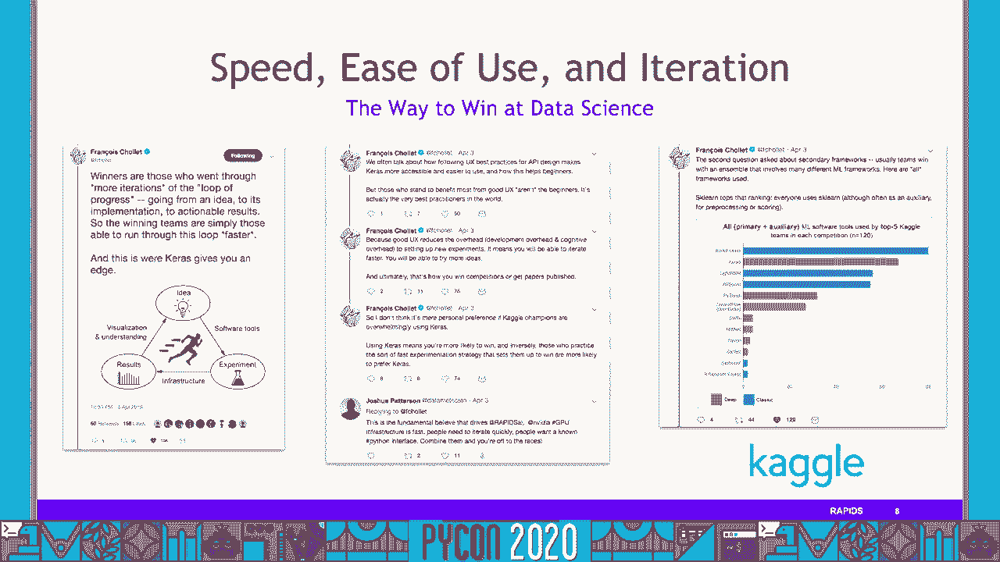
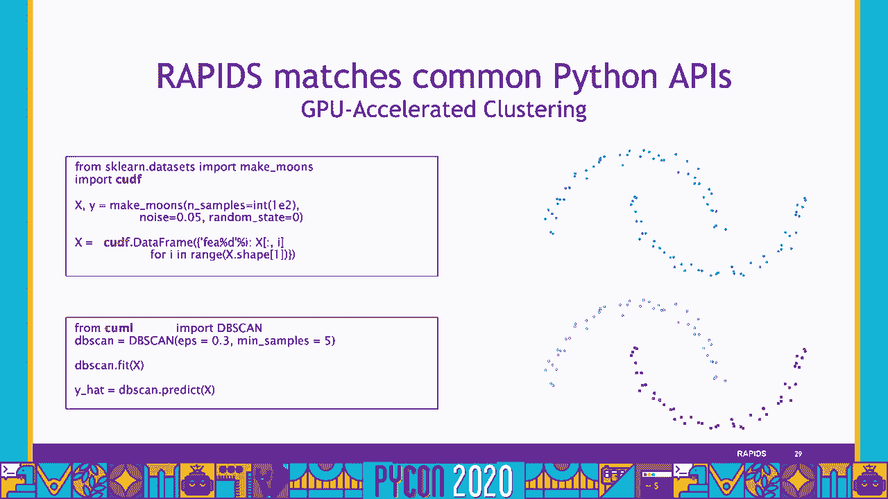
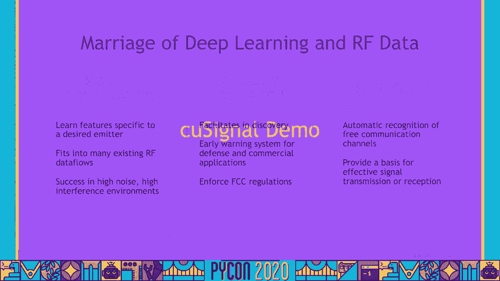
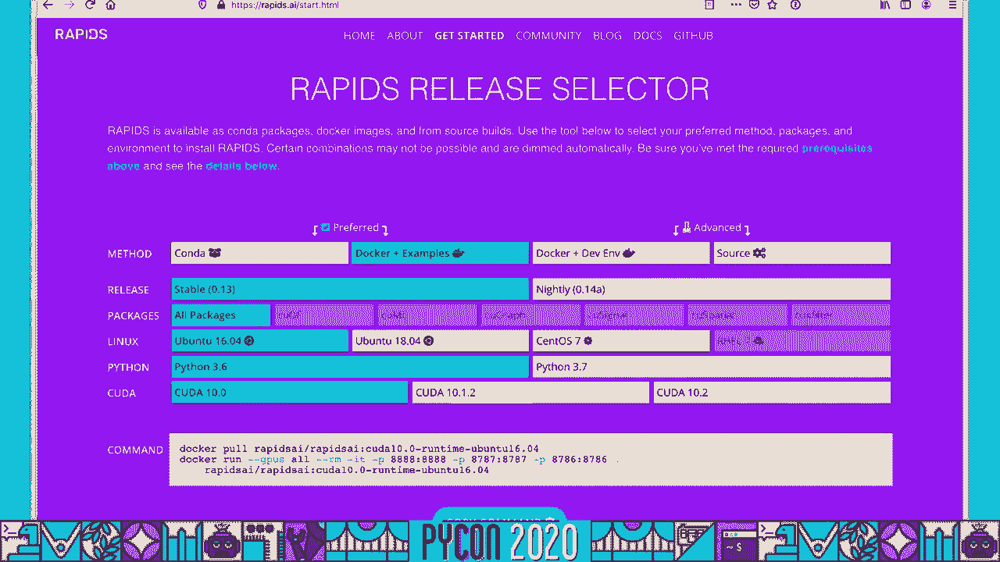

# P14：Sponsor Workshop Keith Kraus, Bartley Richardson - NVIDIA GPU-Accelerated Data A - 程序员百科书 - BV1rW4y1v7YG

大家好 欢迎来到我们关于急流和 gpu的虚拟展示，我叫巴特利理查森，我是英伟达的人工智能基础设施经理 高级数据科学家，这个演讲也是由基思·克罗斯做的，同时也是英伟达的人工智能基础设施经理。带领着巨蟒开发团队，你本人，很高兴见到大家，每次听到你说，希望我们将来能再次做到这一点，我肯定在那之前 我们可以，这是我们所拥有的，所以我想占用你几分钟时间，带你穿越激流。

在激流中，生态系统，所以开始吧，我想把它放在这里，这是一个，这是激流，对，而不是埋葬领先优势，与其让你一直等到最后，这是激流，它封装了整个数据科学管道，从数据准备和我们都喜欢做的事情，ETL特征工程权。我知道作为一个数据科学家 占用了我很多时间，只是为了进入真正有趣的部分，即模型训练和可视化，对，所以当你看到我们有什么权利，或者急流 有什么，所以我们用来分析的东西，CUDF。获取数据和进行特征工程的方法，分析和库图，以及像 coucross这样的可视化工具，过滤圆周率是生态系统，火炬，Chainer，mxnet，所以让我们往后退一点，假设我们是怎么来到这里的。这是关于数据处理的进化，你们中的一些人已经看到了这个，如果你参加过我们的其他会谈，只是为了提醒你，真的，我们要去的地方，我们经历了什么，整个进化过程更快，数据访问，减少数据移动，所以我们回到哈杜普世界。

好吧，我们做一些哈杜普阅读，做一个查询，写出来读，做点别的，写出来读，在记忆处理中用火花之类的东西，对，提高25倍到100倍，代码少 语言更灵活，主要是记忆，让我们考虑一下传统的 gpu处理工作负载。但是我们仍然在开始读 HDFS，然后我们把数据转移到 gpu上，做一个查询，做一些 etl功能工程，对，我们做 cpu写 gpu读，然后我们做正确的，CPU写 gpu读的比 ml火车，你能看到的东西。这在所有这一切中都很常见，对的是有很多阅读，写了很多，有大量数据 移动，但如果我们不做那个动作，如果我们能把数据保存在 gpu上，并尽可能地消除或最小化，通过主机内存从 gpu到 cpu来回传输的数据。这就是急流的概念，对，而不是做所有这些阅读，写作和运动，不管是来自磁盘 还是在 gpu和 cpu内存之间，我们一开始就读，箭上写着，我们将讨论如何用箭头建造急流，做我们的查询，ETLS。

最后我们的毫升训练，我们可以得到50倍到100倍的改进，使用相同的代码，灵活的语言，主要是把它保存在 gpu上，只是一些基准在前面右更快的速度 右，不管我们在做什么，数据准备。这次用的是 xgboost模型，或者做首尾相连的计算，对，所以我们在时间上有一些不同，一百个节点，CPU集群，以及 das a dgx2和 dx1，所以当你比较 dgx2时。对100个节点的 cpu集群，你可以在底部看到 cpu集群是什么，这是在一个200G的 csv数据集上，你知道吗，端到端管道，322秒对3千2百21秒，对于一百个节点的 cpu集群。在五个使用无限波段联网的 dgx上 甚至更快，即使速度更快，激流不会停留在原地，随着时间的推移，我们将继续提高速度，所以这里有急流版本点2和急流版本点10，对，所以如果我们一直看到最后。

急流中的十个标记版本点二，又是 dgx2，这是用那个200G的 csv数据集，这花了我们322秒，闪到急流版本点10，已经有三个版本了，我们在第13点，从这段录音开始，我们现在可以在2 0 9秒内完成。对，所以刮胡子，你知道吗，整整一百二十秒，这就是急流的意义所在，一切都是为了速度，因为速度给了你很多正确的东西，速度给你迭代，作为一名数据科学家，迭代对工作流至关重要，对，你知道为了继续，继续运行模型。为了继续做特色工程，为了尝试新事物，你必须能够快速迭代，从我的亲身经历 我知道，开始一项巨大的工作是超级令人沮丧的，认为在etl和功能工程学中，你已经把所有的事情都做对了，回来后才发现。你搞砸了什么或者出了什么差错，你得重新开始工作，一旦你发现错误，所以速度，让我们做迭代，易用性也很重要，对，我是蟒蛇的超级爱好者，我喜欢蟒蛇生态系统，对于数据科学家来说，有很多伟大的工具是由公司制造的。

大型小型开源，这是一个很好的生态系 统，这就是为什么我想做数据科学 在蟒蛇之前，像是急流，如果你想，这意味着编写c++或cuda代码，这不是我们作为蟒蛇开发人员或数据科学家，或 python用户工作。所以真的是那些在一起的速度，给了我们快速的迭代和易用性，这是很多人获胜的方式，很多卡格尔比赛，一般来说，这只是赢得小写的方法，在数据科学上获胜。

它使数据科学工作流程，所以有了这种先见之明和那种，激流的动力因素，我们来谈谈急流的成分。

我们来看看这些，我相信大家都很熟悉，这是开源数据科学生态系统，所有你熟悉的蟒蛇猿对吧，从数据准备到可视化，嗯，Scikit，所以你要用喷灯训练器和马克斯网。然后你得到了你的 matplotlib plotley，我知道很多人可能都很熟悉这个，我想快速转换到下一张幻灯片，告诉你没什么变化，让我回去，熟悉的蟒蛇阿皮斯，我们都是，我们都是，我们在激流中都很舒服。开源，GPU数据科学，对，一次又一次，如我所说，分析的前期，qml，耦合器，嗯，再可视化，我们还在校园里，封装整个数据科学工作流程，是的，我们仍然可以用染料来扩大规模，急流不仅仅是急流 核心。我们将在稍后的演讲中讨论这个问题，有一些成分，比如Cousparatic，还有一个库叫做 clicks，这是为网络安全用例准备的，虽然，一开始，我们将谈论谈论并关注急流的核心。

是什么让我们在这个模型训练中做数据准备，快速绕道，虽然，在我们进一步讨论之前，让我们谈谈达斯克，嗯，每个人或很多人都用染料来扩大他们的规模，我们还可以用帆布攀登激流，好吧，嗯，而不是用棍子。这真的是一个简单的替代品，可以用拥抱来扩大规模，所以这里基本上有一点，或者扩展到平行化，在左下角是圆周率数据，您已经熟悉的生态系统工具，这些都是单 CPU，对不起。这些都是利用单个 cpu核心和内存数据的权利，假设我们想把它拿出来，我们不一定想扩大规模，但我们只是想加快工作量，好吧，对，你真的不需要，呃，你真的不需要用 das来做，这个你可以，但你不需要。而不是用麻木，你要用双筒手电筒，你会用拥抱，假设现在你有大量的数据，所以你要开始并行化，如果我们从底部下去，我们通常对圆周率数据生态系统所做的是，我们会用面罩把它放大，对，而不是麻木。

我们会使用 dask数据帧等等，但现在假设你想扩大规模，你想瘫痪，在右上角，你可以做到这一切 与急流和罩使用开放的 ucx 对不对，这是一个节点上的多个 gpu，这将是。你知道像一个单一的 dgx1或 dgx2，或者你可以在一个集群上做这个多 gpu，对，所以说你不是，你知道受单个 gpu大小的限制，你可能有，如果你经常听到这个问题，那gpu存储器呢？我们听到你。如果你有，你知道吗，适合单个 gpu的工作负载，太好了，你可以用，你知道急流和拥抱没有斗篷，但如果你做得不对 你想扩大规模，您可以使用您已经熟悉的工具，你可以使用 dask与开放的 ucx，扩大规模。用激流扩大规模，所以让我们来谈谈拥抱，到目前为止，我们已经讨论了一点，嗯，真的是，是 gpu，这就是拥抱的意义所在，所以当我一开始谈到这个的时候，如果你像我和你的数据科学家一样。

或者即使你不是一个数据科学家，对吧，mldl工程师也可以花大量的时间做 etl和功能工程，嗯，这是你知道的，超过90%的时间花在这上面，就像我们之前说的，越慢，迭代的时间越长，因为如果你知道，如果你的。ETL管道需要一个小时，你有一个错误，或者你想纠正里面的东西，嗯，你必须等待，你知道至少一个小时来找出你犯了那个错误，你不可能在一天内得到那么多的迭代，在左边我们有一个典型的 CPU电源工作流，对。你可以更专注于分析，花在 etl上的时间更少，你可以看到红色和绿色交替出现，或红灰条，你可以在一天内做更多的分析迭代，所以它真的是迭代和速度，从分析的角度来看 会让你更有效率。这就是急流中的 etl技术堆栈，重要的是要注意 这都是建立在 cuda和 c之上的，加加加，我们稍后会讨论这个问题，但也有蟒蛇与潜在的，CUDF和 CUDA图书馆，允许你调用和使用所有伟大的表现。

并利用这一表现，你熟悉的蟒蛇方式，所以就像我说的 你可以，呃，你可以有你的拥抱，任何你喜欢的方式，只要不是c++就是python，所以这里是自由拥抱，自由拥抱是一个拥抱，C++库。这真的有做事情的下流和肮脏的库达内核，比如排序组，你知道吗，分散聚集，嗯，他们为这些数据类型优化了 gpu 实现，弦乐，时间戳，数字类型，还会有更多，然后是可伸缩分布式 etl的原语，写在 c加上推力。你可以这样使用 lib cudf，可能我们大多数人都想用拥抱，DF df，这个python库是用来操作这些gpu数据帧的吗？它紧随，稍后我们会研究一些代码，我来告诉你，差异应该是最小的，对，只是。基本上我们希望，你知道吗，是这条蟒蛇吗，CUDA接口，C++库lib cudf，带有一些附加功能，就在里面，本质上，它让你可以像往常一样使用 gpu数据帧。

Right还支持使用数字 a对用户定义的函数进行 jit编译，这是一个单一的图形处理器，对，所以特斯拉视图上的单个 gpu，一百，那是一张3-2的演出卡，两点零工处理器，所以如果你看到合并之类的操作。分类和分组，单个 cpu与单个 gpu，我们知道弦很重要，我知道作为一个数据科学家，尤其是作为一个网络安全数据科学家 经常使用字符串，所以目前在第13版，这是最新版本的激流，从这段录音开始。我们支持从正则表达式到，元素明智的操作，就像分裂提取物，类型化，我们可以支持团体眼睛，是的，连接和排序所有字符串数据，categorical categorical columns完全位于 gpu上。在 lib cudf中有一个本地字符串类型，C++在第14点上更进一步，我们希望继续做性能优化，然后支持射流编译串 UDF，你可以看到在右手边，在快速字符串支持和 gpu之间有一些比较，做着平凡的事。

就像做所有的东西，小写，找到并切片，你甚至看不到酒吧，它太快了，那是一毫秒，对了，开采规模巨大，对，能够更快地加载数据，只是让你，它让你的整个，您的整个工作流程更快、更容易、更少苦差事，嗯。提供至少10倍的，通常更快，所以我们有了一个CSV阅读器，基本上是从最初的版本点开始的，两个急流是当我们有一个作家的 csv读者，现在我们可以读写拼花地板了，读和写 兽人。我们也有 json和 avro的读者，我们还在努力整合 gpu直接存储，绕过任何你可能遇到的 PCIE瓶颈，所以它实际上使我们能够直接从内部读取，连接到 gpu中 绕过那些 PCIE。就像我说的宫内节是非常快的，好吧，所以如果你看到右手边，我们有一个单一的数据，纽约出租车数据，我想大概是两场演出，1。9场演出，需要二九，和库迪亚在一起两秒钟多一点。

好的，所以这是 pdf，很重要，在我能做任何事之前的第一步，因为我必须能够把我的数据输入到 gpu中，我必须能够读取我的数据，这就是拥抱的意义所在，CUDF是关于支持那些类型的python操作。你想做的，能够创建新列，创造新的变数，增强您的数据框架，过滤您的数据帧，所有这些都是可能的，Q现在从，在那里你知道，通常我们认为有趣的开始是正确的。

这是你想去的地方，这就是全部原因，再说一遍，我们急流核心的q毫升部分，当你想到 kml，本质上这就是 q ml的技术堆栈，你可能注意到了，和拥抱有一些相似之处。CUL都是建立在 Cuda和 Cuda库之上的，嗯，在cuda库中的c++，我们有 q ml原语，对，所以它们在cuda和c++中得到了充分的优化，使用 qml算法。它们是使用 q ml原语和 Cuda库构建的，因为再一次，在 python接口中 拥有这些可调用的功能是非常有用的，你可以把所有的东西都放在同一个笔记本里，我们有蟒蛇绑定，使我们能够有。从 python调用的 q ml算法，我们来谈谈这些算法，所以真的，这里有很多，我们从第二点开始，只有几个算法，现在是4点13分，我们有所有这些，所以我们有常见的分类和回归算法 比如决策树。

Logistic回归，KN支持向量机，对于第13点，线性回归或随机森林得到增强，我们推断，我们会向你们展示，k的意思是 db扫描光谱，用 upap和 tney pca进行维数约简，一些时间序列，分析。交叉验证，超参数整定，你知道吗，我没有足够的时间去讨论所有的事情，但是有很多，有很多，我真的很喜欢这张幻灯片，因为它让我们清楚地知道我们制造蜂窝是多么普遍，在蟒蛇之间，在你熟悉的蟒蛇猿类之间，在急流中。我可以做一些数据集来制作普通月球的数据集，然后导入 db扫描，用一些参数设置 db扫描，做一个拟合，然后做一个预测，然后我得到了它，所以我要转换到下一张幻灯片，我要用红色突出显示。cpu版本和 gpu版本的区别，我回去，CPU版本，GPU版本，导入 pdf，你仍然可以让你的月球数据集，你在做一个 gpu数据帧，使用三分频，然后从 q毫升导入 db扫描。

其他的都是一样的，在大多数情况下，这真的很容易，所以与其带你看一大堆幻灯片，我想我们换一下 让我们给你看一个很酷的毫升演示。

我应该提到所有这些演示都在我们的，嗯，我们的集装箱，你可以下载，我是故意的，所以你可以得到它，所以，如果你去我们的激流人工智能网站，你去开始，你好像在向下滚动，如果你点击docker+examples。然后很明显地把它配置到你的环境中，嗯，这将使您正确地理解所有这些例子，所以你现在可以把所有这些都看完 你可以暂停这个，你可以把这个装上去，和我一起走过，嗯或者你可以晚点再做。很明显 但我特意选了这里的样本，所以你可以跟着。

所以你至少可以深究一下，不好意思，当你做完了，嗯，所以这是给你的，我再翻过来，所以一旦你把它开始运行，我只是想确保我没有任何内核运行 现在，好，所有这些你都会碰到这个目录结构。我们把它们分解为它们是正确的演示，所以我们要从 q毫升开始，只是因为这就是我们所处的位置，既然我们刚才说的是分贝扫描，让我们从一个关于 db扫描的例子开始，我要去，我要饶了你，我把整本笔记本都读了一遍。对 但我真正想做的是，我想打亮点，嗯，我想确保我向你展示我们在这里做什么，所以我们要在这里做一些进口，因为我们要把事情画出来，我们需要 matplotlib，嗯，让我们确保我们这里有一个图形处理器。我们做的，我应该告诉你 我在 dgx上，所以你会看到8个 GPU，NBCC，呃，它就在那里，命令失败了，但我们只是要在这里加载一些助手文件，你刚刚看到了这个，我们要把月球的数据集。

然后我们要把数据集可视化，又来了，刚刚给你看了，刚刚证明了，我们只是用科学工具，学会这样做，我们要在 Scikit上做一些 k均值聚类，然后我们把它画出来，我们这么做的唯一原因就是。这两种不同类型的集群并不适用于这个数据集，我不打算深究，就像所有背后的数据科学一样，这里有短信，如果你想经历这些，但基本上我们需要一种不同的方法来聚集这些数据，这就是这种基于密度的空间聚类方法。所谓的 db扫描开始发挥作用，而不是依靠寻找质心和联想 你知道的，有质心的不同点，比如k的意思，数据库扫描基本上可以识别任何形状的集群，对，任何凸形，好的，所以让我们最终运行，我们会做一个预测。然后我们把它画好，这正是我们所期望的，和幻灯片上的一模一样，没多久，对，但同样，我们没有一个庞大的数据集，因为数据在增加，所以我们要从 q ml导入 db扫描，我把它叫做 q毫升 db扫描。

只是想让你知道我们可以，我们可以在笔记本里记下它的位置，做一个适合，预测，和一个可视化，这是 db扫描的 q毫升版本，对什么都没有，我希望这不是什么令人兴奋的事情，因为这正是我们所期望的，对。这正是我们所期望的 cpu版本，所以现在让我们做一点基准测试，对，让我们看看 gpu版本和 cpu版本，所以这里我们有，我只是在做一个数据集，随机数据集，看似万行。我将继续制作 gpu数据框架和 pdf设置，数据库扫描并运行，做合适的，预测，这花了2。97毫秒，让我们在 cpu上使用相同的数据集，我喜欢在激流中驾驶它的原因是，在 gpu右边的是你。你看到它花了29分，七毫秒，我可以立刻运行，再把它形象化，我可以对我的数据集进行各种调整，数据集中的特征，或者我可以调整一下，你知道数据扫描本身的参数，因为我的互动，好吧，我到底在做什么，让我做。

是做数据科学，以思维的速度，对，我可以继续思考，我没有填写所有的字 我刚刚填写 在这里给你，我肯定没人明白，这就是为什么我填补，但我在补课，结果花了31分，2秒30毫秒 相对于30秒。我甚至不是一个巨大的数据集，这里有万行，那种是，我喜欢这个演示，因为即使是很小的数据集，我再次，我在这里运行单一的 gpu，对，现在你的电脑里可能有一个能做到这一点的图形处理器，我基本上可以你知道。别让我停下来想剩下的事，我要关闭它，我想确保我关闭了这个内核，让我们看看另一个，让我们看看你的地图，如果你不熟悉你的地图，我必须跟你说实话，我爱你马特，太棒了，是个降维工具，对，如果你熟悉蒂斯尼的话。它以前就存在了，有点类似的精神与蒂斯尼，但是 nvidia最近把它移植到了 gpu上，它有一个蟒蛇接口，对了，所以再次，就像 db扫描一样，我不打算一行行地浏览这个笔记本，对吧，我去准备些东西。

确保我有一个内核，安排一些事情，有一些警告，我们要确保我们有数据，为了这个，呃，为了这个笔记本，我们将使用 mnist时尚数据集，如果你不知道，七万张衣服的灰度图像，二十八乘二十八。真的希望我们有同样的 gpu，那里什么都没变，好的，很好，我们要设置一些辅助功能，这将帮助我们加载数据，下载资料，如果我们还没有，我提前下载了数据，所以我们要建立训练和测试数据集，确保他们都是正确的。是的，六万零一万，让我们看看其中一个长什么样，这是球鞋，我想你可以看到那里有一个嗖嗖声，对，所以现在我们有了，我们得到了数据，但我们得把它交给 gpu，所以这是有代价的。在主机 cpu内存和 gpu内存之间移动数据需要花费时间，所以我们必须，我们来计时，这基本上是要创建一个 gpu数据帧，我们加载的时尚数据集，所以花了两秒半多一点的时间，在那两秒钟半的时间里。

它所做的是它移动了数据，我想把数据从 cpu存储器复制到 gpu存储器，现在，我已经得到了它在一个gdf，它是一个 gpu数据帧，我可以操作它，在 gpu上做手术，所以让我们做，呃，我们在上面画个地图。它再次进行了维数缩减，为什么我们要做好这件事，我们想试着，或许我们可以把这些衣服分开，把这些衣服分门别类，所以这花了嗯一分，二，三秒钟，加一点减一点耶，每个循环，七分，一个循环，每一个，我们上课吧，呃。我们要重播这个，我们要重新运行这个嵌入，因为有时它失去了变量，所以我们只需重新运行嵌入，它在做和这里设置的完全一样的事情，它没有失去变量，这次是因为它完成得太快了。然后我们可以想象这看起来是什么样子对吧，这是时尚记忆数据集，它是用kml版本的umap嵌入的，对吧，所以你可以看到不同的衣服 它们是如何聚集在一起的，所以你看到运动鞋，像这样的轮廓，就在这里，运动鞋。

你看这里也有踝靴和运动鞋，你看到衬衫和上衣，与套头衫和裙子混在一起，这对我们来说是有意义的，对，注意它们是如何很好地分开的，可能看起来不像其他东西，还有外套和凉鞋 注意这里的凉鞋，穿着运动鞋和长靴。所以即使只是粗略地看一下这个，它给了我们，呃，我们我们我们，会期望，如果我们不做 cpu版本，但这里的 gpu版本，大约比 cpu快9倍半，好的，再来一次，我知道我提到过。我知道我之前提到过森林推论和新森林推论，激流中的图书馆，这是，这真的是，真的超级酷，它让你做什么，它能让你两者兼而有之，让你更快地进行推理，就在那时，如果你要使用像 xgboost这样内置的推论。LightgBM，那些类型的事情，在 gpu上进行了优化，所以让我们得到一个内核，我们要从头开始，好的 我们要确保，我们有，再一次，如果你安装它 从急流得到开始页面，你将会得到所有这些。

我今天早上才安装的，所以它起作用了，我们要找一个小助手来训练一个模特，我们会得到一个辅助功能，为了预测 XXT增长，我们要做的是找到一些参数，这就是它的好处，如果你现在暂停一下，我等你。如果你路过 欢迎回来，但如果你真的暂停了 然后你就得到了这个，你可以，你可以搞砸这个，对吧，您可以更改行数，你可以把它提高一个系数，十倍，对，我要坚持这个，我们会生成一些数据，然后我们要训练和预测。所以我们要先训练 然后再训练，记住森林推理是用来推理的对吧，所以我们需要一个训练有素的模特，所以我要训练一个 XT升压模型，在我们刚刚做的数据上 建立了一个额外的提升分类模型，我要用它来预测我的验证集。我有点搞砸了，但我在这里用我的火车测试分裂函数 分裂了数据集，我相信这是我在这里的某个地方进口的，是的，所以我们继续，好了，哎呀，我做了，好了，好了，让我们来谈谈森林推断库，又是第一个推断库。

只是为了推断，所以我要加载 xt升压模型，我刚刚做的，一旦我把模型放进去，我要预测 我要得到预测，使用 fil与使用 xt升压的预测，所以我们就等着在这里输入 作为旁白，希望大家都好，对。希望你喜欢这个和其他 pyon的内容，宁愿和你在一起，所以我现在可以回答你的问题，我们可以让它更有互动性，但最后我们有了我们的联系方式，你可以随时和我们联系，在急流上也是如此，在 Github上。或在快速松弛，我们很想听到你们所有人的消息，好的子弹上膛了，让我们做一些预测使用，我知道进展太快了，有时我不得不再做一次，好了，所以2毫秒对15。7毫秒，好吧，绝对更快，好吧，但问题是。它能给我们同样的结果吗，因为如果它更快 它给我们错误的结果真的不重要，我是说它还是更快，但错误的结果从来都不是好的，所以我们现在要做的是，我们把 xgboost的预测，从力推断得出的预测。

我们要确保金额一致，是的，我们有两千，然后我们使用数组等助手函数，以确保所有的值都是相同的，我们得到了同样的预测，使用力推断与使用 xgboost预测，即使你知道，甚至在15。7毫秒和2毫秒之前。如果我凑齐了，这有点大，尤其是当你要从一些可能不那么关键的事情，实时到一些需要在带宽上进行关键推理预测的东西，在实时的权利，像这样的事情基本上需要10倍，就在下面，是非常非常有用的，好的。确保我把它关掉，然后我们就回去，我说了一点，我向你展示了一点，对，但这里有一些更多的基准给你，我不会花很多时间在这些上，嗯，你可以随时暂停它，看看它，单一 gpu与 scikit，你知道吗。你能以120倍的速度看到 pca，嗯，你可以看到其他的东西，例如使用 rbf内核的 svc，森林推论，我刚刚向你们展示了一点关于森林推断的知识，但我们还是可以，我觉得最吸引我的是，我们可以做一亿个推论。

使用这个力推断库 每秒一千棵树在一个 dgx上，一个大的，稀疏或密集模型，每秒1亿次森林推论 万棵树，只是，太棒了 你可以做到，嗯，你知道在带宽，直线速度，我说了一些关于 XGBoost的事情。增强了 gpu上的决策树，所以如果你去了，使用默认值，用于急流的 um conda安装，你就会得到额外的刺激，xt boost可以无缝地从 could df加载数据，数据帧和 coubi数组。与激流点十三堆栈一起推出的 x二升压的版本 一点零，不久前刚刚发生的事，好的，呃，我们在第13版，现在，呃，向零点前进，这是库尔的东西，现在你看，对于列表中的所有内容，我们都有单一的gpu版本。多 gpu和多节点 多 gpu，在剩下的20分钟里，通往零点的道路，我们希望用多节点多 gpu，我们是在整合 而不是做多重图形处理器，然后多节点多 gpu，我们直接去多节点多图形处理器。

因为这显然也适用于一个节点，使其高效有效。

单个节点上的多 GPU，好的。

酷图，我们继续前进，我喜欢图表，在图表中你可以做很多事情，我喜欢，我以前提到过，我是网络安全研究员和网络安全数据科学家，把数据看作图表对我来说真的很有用，对，我可以看到机器和其他机器的对话。人们登录到机器上的东西，机器之间存在哪些错误信息，什么类型的数据被来回传递，作为一名数据科学家，这对我来说是一种非常直观的方式，去解释我的数据，问题一直是图变得很大 图变得很大。尤其是当你想在边缘加上很多特征的时候，好的 如果我有20个左右的特征作为特征向量，我想把它作为属性嵌入到属性图中，这真的让问题变得复杂了，我不知道你是不是，我不知道你是否明白这里的主题，但本质上。这是库达的妙招，然后是正确的事情，所以可以，我不知道，我肯定你拿到了，我只想确定你拿到了，这意味着什么 这意味着所有这些事情，意味着巨大的表演，能够存储和分析多达5亿条边缘，在一个三。

多图形处理器支持数十亿的边缘，多个应用程序接口提供一个 c或对不起，为 x网络提供我们都喜欢的 python api，比如兼容性，通过数据帧，真的，这不是它自己的事情，对吧，这是一个。它是解释 gpu数据帧中数据的一种方法，和拥抱作为一个图表，或者作为一个属性图，你不代表图表，对于这个图没有一个不同的基础表示，这是我们把数据解释为图表的一种方式，然后不断地专注于增加功能，更多算法。更多的原语和更多的实用函数，让我们再来看看图技术栈，基于cuda和cuda库，你可能会觉得很熟悉，然后在这里我们有我们的原始耦合布劳大黄蜂，对，耦合图算法是使用这些原语和那些底层技术构建的。很像鲁道夫和米勒，有一个轻蟒蛇层提供蟒蛇猿，只是图表中的一个重要注释，以前是闭源的 b图，因为我们得到了这个问题，很多都是开源的，在图中已经被整合到了库图中，您可以使用 nb图的遗留版本，还在急流上。

Github repo 如果你，如果你想那样，我们可以在耦合图中大量使用哪些算法，所以有基于社区的算法，像鲁汶这样的东西，K型桁架，三角形，数数，K核，有一些东西，比如每周和强连接的组件。与网页库和个人网页库的链接分析，链路预测，遍历，BFS和 ssp，不同的中心度衡量标准，像猫和中间，嗯，自动重新编号，呃真的真的，你知道吗，这里有很多很棒的算法，最让我兴奋的事，最。你必须提供顶点的耦合图，从零开始顺序编号的 ID，是的 这是给我带来最多麻烦的事情，我只是喜欢抱怨，给库图团队，嗯，不再是了，自动重新编号 在效用函数中，太棒了，它可以让你更快地得到这些算法。不用担心重新编号，就几个，我要给你看一些代码，但在我们开始之前，只有几个基准，这是单个 gpu对网络 x对，所以我们是如此，我们是单身对单身，你知道为什么，我知道你，我们说了很多关于单一 gpu的事。

当我们谈到单一 CPU时，你知道扩大规模，嗯，但我们讨论这个的原因是，这确实适用于这么多数据科学家和数据蟒蛇，数 据分析，我们与之交谈的用户，他们的桌子旁有一台机器，他们想用那台机器，或者它们旋转。你知道一个简单的云中机器，所以有很多单一的 cpu，CPU与单 GPU，我们可以做的比较，也就是说即使你没有，你知道吗，千万亿字节的数据，你仍然可以获得速度优势。您仍然可以在更快地完成越来越多的迭代方面获得优势，利用急流，所以这里只是几个，只有四种不同的图算法，Louvain pagerank，BFS和 ssp，呃，Cougraph vs。network x。我想大概有八个，是啊，这里有八个不同的数据集，我们就挑一个吧，我们用迅猎兽的数据集，其中有一点，七百万个节点 二比二，两百万边，嗯，像寻呼机，让我们选择页面，呃，三三零九，呃，所以比 x网络快得多。

这实际上是一个相当不错的图表，对，这是一个很好的图表，再来一次，如果我们去多图形处理器，我们可以，我们可以讨论更大的图，嗯，所以这只是为了页面排名，我们走吧，让我们直接去底部，这就是大数据。有4亿个顶点和160亿条边的8个数据集，是一个300G的 csv文件，如果你看这最后两行，第一排，最后一排的旁边是 gpu，我们用十六块一百块来做这个，三次迭代的 um和 pagerank。我们花了3 1 8秒，如果你看相同的数据集，我们用了八百根 cpu线，这是108个使用 Apache Spark图形的 VCPU节点，我们花了大约96分钟，所以3 1 8秒对96分钟。在160亿的边缘图上，现在这个，这些是我们在网络中看到的图表类型，一直都是对的，你看这些巨大的图表，我想做这些 作为一个数据科学家，我想一遍又一遍地做这些。

我想一遍又一遍地把 pagerank带来 一遍又一遍，这实际上是我们用来，嗯，我们使用个性化的页面，我们想在每一个时间间隔做这件事，好吧，让我等了96分钟，真的真的给它带来了瓶颈。这真的耽误了我能做的事，在三十三秒内完成，太好了，我可以我可以忍受一点打击，可能每两分钟。

我仍然可以做得比96分钟更好，所以说，让我们看看一个小的耦合器演示。

我刚挑了一个，这是连接的组件，我选择它的真正原因是，我只是想让你看看它有多容易使用，这一切都是关于蟒蛇的，这一切都与蟒蛇数据生态系统有关，所以我想让你看看，我们不会再这样了，就像其他的一样。你还有很多时间，我的这些是这些是这些笔记本，我选择他们的原因是，它们写得很好，注释也很好，你可以跟着做，自己做，如果我跟你说 这些只会浪费你的时间，但本质上我们可以使用弱连接或强连接的组件，好吧。我们将使用这个网络科学数据集，在此引用，一共是，你知道大约1500名科学家，最大的组成部分 379名科学家，对，所以你去那里，我们将导入我们需要的库，并启动一个内核，是的，很好，从文件中读到那个图表。源版付款人在该文件中是一个坐标格式，COL格式，我们得到一个未来的警告，到目前为止我还不担心，但你可以看到这是什么，呃这是什么，搞什么，数据文件看起来像，它有一个来源和目的地。

我们要从边缘列表中创建这个图，真的很简单，你说创建一个新的图解，然后你就，从边缘列表调用，你给它 gpu数据帧，这个家伙标记源列和目标列，我们结束了，很容易称之为弱连接组件，繁荣，每周连接的组件总数。再说一遍，如果你是一个图表专家，如果你经常使用图形，你会得到这个，如果没有，嗯，真的，这显示了什么，是吗？所有的 python apis使用起来都相当简单和直接，我们得到了最大的每周连接组件的大小。哪些 id属于弱连通分量，然后我们可以对强连接的组件做同样的事情，对，总人数，总人数，属于它的顶点对吧，这基本上是对的，你知道吗，我们还有一点时间，我没有计划，但让我们也做一个页面，嗯。在我们录下这个之前 我没有运行这个，所以让我们看看，页面排名是梦幻般的，它允许您测量图中节点的相对重要性，相对于其邻国的重要性，对，你可能对它很熟悉，最多来自谷歌和用于网页排名的页面库算法。

我要把它过一遍，很快的，这是，我们会利用这个空手道俱乐部的数据集，只是一点点准备工作，这应该已经安装好了，我们的图书馆，kugraph和 network x抓取数据，让我们在网络 x中做这个，这很容易。很简单，2。我们分两次行动，读入数据，创建一个称为页码的图，就是这样，它是它是，你知道吗，很多时候我们炫耀这个的时候，我们就像，所以我的意思是，那是，这就是重点，没有，那又怎样，就这么简单。我们可以看到结果，旅行箱是1 0 0 不是很好，前三名，这就是我们的图表，总之，我只是想让你看看运行页面库也有多容易，通往一点的道路，库图的一分零，你知道很多东西都是我们的单一图形处理器。所有东西都是单一的，我们确实有多个 gpu级别，通往零点的道路，你知道填写多节点，多 gpu页面排名，PPR，个性化页面排名，弱、弱、强连通分量，卡片重叠，P和 bfs。

像往常一样，我们总是希望听到你的消息，你对什么东西感兴趣？

你想看到什么样的东西，你知道吗，你真的需要多gpu k核吗？或者是某个喜欢多图形核心的人，请访问我们的空闲或访问我们的github，并问我们这些问题，我们很想听到你们两个的消息。如果你要做任何类型的空间分析，对，比 cpu空间图书馆快一千倍，C++和python apis，我知道你听腻了，听我说，这是一条运行的线，嗯，不断增长的功能和完全融入急流。这就是 cuspatial技术栈的样子，你很熟悉这个基于拥抱拥抱，lib cdf，对不起，自由体操，加上推力蟒蛇绑定到蟒蛇 api。

并且能够制定出路线图，你现在知道图层，Cougraph将其扩展到 dijkster算法，查询层中的路由映射匹配，做一些事情，比如最近的邻居范围搜索和连接，地理代表权。

在添加额外的空间形状 原语时，你也可以自己读一读，我想在这里看到的是功率符号 距离计算，所以纽约市有一千三百万辆出租车，这是大多数人都熟悉的纽约出租车数据集。我们使用的参考运行时实际上已经在 gpu上了，并使用数字编译到 gpu，使用单个t 4需要416。9毫秒，使用蟒蛇建立在下面的库达和自由式库达的基础上，加7点6 1毫秒，所以即使是 gpu到 gpu。我们看到一个五，Couspatial中的速度是参考运行时的4。7倍，甚至更多，如果，你要从西皮。

我们再一次试图保留他们的名字，现在，我知道你很兴奋，看起来不一样，与其他技术不同，这个纯粹是在蟒蛇身上开发的，用自定义的库达内核写上数字和优惠券，所以这个没有蟒蛇层，对，所以没有蟒蛇层。但其他一切都很相似，以下是 gpu中可用的算法，不同类型的卷积，过滤，希尔伯特，重新采样，你可以自己阅读它们，波形世代，作为光谱分析的窗口功能，像周期图和光谱图，这里有一些表演，对嗯。你可以看到不同的方法，这么快，傅里叶变换，F of t，卷曲，相关，重采样，重采样，聚焊缝，光谱图，CWT，所以两万八千毫秒相对于九十二点，两毫秒的速度提高到300左右，嗯，这是，呃，基准是。你可以在一个 dj电台上看到1乘以10的8个样本信号，对，一次又一次，所有这些笔记本都可以在回购中找到，有效的内存处理是一种真正的，我们还使用零拷贝内存 使用数字映射数组。

所以 cpu和 gpu之间的记忆，嗯，再一次你可以读到所有这些，再说一次，我不想对这些专门的图书馆进行太深入的研究，只是因为它限制了我们的观众，但如果你在做任何类型的信号处理，我们在网络上也这样做。就像我们寻找周期性一样，我们寻找不同的周期块，所以你可以用它做很多不同的事情。

所以我得到了，一个新的内核，我在这里找到了 Q信号，所以它又来了，回购，它让你有一个结束，例如，就在这里，所以让我们开始吧，好的，我要去做一些，在 cpu和 gpu上做一些函数。所以我会做一些函数来产生一个信号，把这些信号收集起来，在 gpu上，我要做同样的函数，GPU功能生成信号，GPU功能将那些，嗯，这将允许我们改变参数，你可以的，你可以玩这些，如果你想。我要把它们留给股票，好的，然后我们继续收集这些信号，我们要用，cpu合奏团和 gpu合奏团做到这一点，所以让我们来看看重塑，使用再放大器，两人取样，开，cpu，在 gpu上大约3点8秒，呃，二十。一点二毫秒，对，嗯，用一个平顶过滤器在合奏的每一行上运行一个周期图，在 gpu上3 5 2毫秒，我们甚至可以做嗯输出正确的，让我们可视化 cpu输出，想象一个不同的 gpu输出，关键是。

本质上说它是正确的 是完全一样的。

同样的称呼，好的，让我们翻转过来，让我们谈谈点击。

点击，有什么不同吗，看起来有点不一样，在激流中烹饪真的是一种乐趣，实际上它是一组用例示例，针对网络安全站点的工作流程和集成，垂直和水平，它的目标是那些，那些威胁猎人，那些法医调查员，数据科学家，嗯。建立与主要的模拟，所以点击的组成部分是我们有的笔记本，主要面向数据科学家和数据工程师，我们有一些不同的用例，比如网络联网和日志解析，允许将数据导入和导出到，从你的干细胞整合中，直接查询。我们还在做一个弹性积分，我们有工作流程，O，组件，所以这将再次不是深入到所有的细节，仅此概述一下，但是工作流程和我，O，把它传来传去，你不用看，你只需要处理输入和输出，它允许你以不同的方式堆叠它们。与他人交流，关于网络数据类型，比如i，P，五，四 dns，嗯，十六进制，如我，P，五，six和 mac地址，只是我们有的一些用例，其中之一就是这种动态的网络映射，整个游戏的名字就是。

我们从很多不同的来源收集数据，从喷溅或直接从传感器，我们把它全部吸收到拥抱中，利用奎尼奥，我们做了不同的图解分析，Pagerank，以及社区检测，然后我们得到它的输出，本质上是你网络上的一切。我们认为它在做什么，谁拥有那个装置，那些类型的事情，使用类似于，嗯，我们的工作流程和我，O，模块，你可以把这段代码变成这样，这是我们的垃圾警报工作流程，但从本质上讲，这就是你如何把这样的东西。所以不用看，看一下这段代码，您可以将所有这些封装到工作流中，然后调用您的工作流，使其能够一遍又一遍地运行，又来了，行数，这将与图表中的条目数量相对应，所以两千万行，10点2秒完成，再一次。这是一个单一的图形处理器，我们还没有对它进行基准测试，多 gpu，使用multi-gpu pageran，不同的安全警报分析，我们基本上是看你收到的所有不同的警报，尝试从他们身上提取新的信息。

相同类型的工作流程，这里的关键是我们利用急流来完成所有这些，这是我们的基准，如果你，如果你马上看到，大部分时间都被卡夫卡的阅读占用了，一个生产商进入这条管道，在不久的将来，这将被添加到自由拥抱和拥抱中。所以三十万个警报花了3。2秒，我们就能把这个拿下来 把那个排成一行，再一次，这是一个单一的 gpu，对，单 GPU特斯拉，你一百，我们在点击中真正兴奋的另一个东西叫做网络，它是一种分析日志的方 法。在那里你不需要为他们写正则表达式，你只要把日志扔给一个受过训练和微调的伯特模型，嗯，我们分析的是一个9点以上的微分方程，九十九根每秒超过一千五百根原木 实际上从那以后增加了，这就是管道的样子，我们有。有一个训练阶段，接下来是一个解析阶段，我就不说这些了，但本质上我们用的是激流和喷灯，所以我们利用互操作性，在不复制数据的情况下 往返于他们之间，又来了，维持光速分析，以下是我们的推论和表现，又是这样。

这些有点过时了，我们正在研究一种全新的基于 gpu的标记器或工件，令牌器现在实际上在点击回收中，但我们得到了非常高的精确度，得分很高，即使我们在这张底图上，即使你在做日志分析的时候，我们从日志中删除值。所以我们把原木降解，我们仍然看到一个微小的和宏观的超过九点九，甚至，当我们把原木降低到百分之五。

好的，这是关于急流和急流中的东西，我们先谈谈社区的情况，太棒了，太棒了，作为开源社区的一部分，有很多兴趣，和所有的开源贡献者一起工作 真是太棒了。

嗯，所以我想谈谈计算机社区，这些是我们的生态系统伙伴，我们有很多不同的贡献者，从水蟒到像沃尔玛和资本这样的组织，一枪毙命，摇滚出加州大学戴维斯分校，给早期采用者，嗯，就像，呃，比如优步和博思艾伦资本。一个全方位，i ibm提供给开源生态系统中的其他参与者，比如nucleo，我提到了 xgboost，dask和 apache，箭头，谁在激流之上建设，对。人们喜欢构建高性能无服务器事件和数据处理的 nucleo，我们实际上用在点击，很多人使用分布式流处理 使用急流和浅滩，让我们来谈谈炽热的 SQL，嗯，能写东西真是太棒了，只是在木星笔记本上查询。所以炽热的 SQL所做的就是，把所有这些都变成像拥抱一样的东西，你可以看到这里，tpc h查询的查询时间，真的很简单，您的数据可以存在于磁盘上，你知道拼花，CSV或 json格式。

你创造了一个新的炽热的环境，嗯，你给了那种权限，你，你把它指向你的数据所在的地方，你只是在写普通的 sql，从 where中选择星，废话。让我们来谈谈 nucleo serverless和 gpu的关系，所以他们提供了这种实时自动缩放功能，所以你可以使用公共服务，您可以使用平台特定的控制器，可插拔锁监视器，嗯。你可以通过一个图像回购来完成所有这些，如果你点击这个链接，或者访问这个链接，有，关于它有更多的信息，在博客文章上，迈向数据科学，或者你也可以去 nucleo nucleus网站看看。你可以在任何地方部署急流，我们在所有的主要，所有主要的云提供商，所有主要的社区服务中心，谷歌，云，你怎么能从急流开始，您可以使用码头工人安装急流，conda或 collab，如果你对激流是全新的。

不过我建议你使用激流释放选择器，抓住码头工人，加上这个例子，无论你身处什么环境 这份遗嘱，这将使你在几分钟内开始，我们有大量的视频，博客内容，我们的怪物，你可以随便加入我们，Github上的谷歌推特。您可以询问和回答有关堆栈溢出的问题，就目前而言，我想跳过去，急流，AI是我们的主力，我们的主网站，对，所以你可以从这里开始，失去了我的呃，我的指针丢了，好吧，没关系，如果你去激流，AI。你可以从那里开始，这是我们的吉瑟伯急流，巨无霸，你可以去看看我们所有不同的图书馆，我提到的都在这里，然后你就可以，如果你，如果你去，有点像去 pdf，你可以去这里看看，你知道吗，提出问题，呃。不管你想在这里做什么，我们去拉请求问题，参与其中的好方法。

你可以的，你可以开始了等等，我离开这里的全屏，也许这就是问题所在。

我不知道是什么引起了这个问题，但没关系，我们只是要继续前进，RAP是指 AI有你所有的信息易于安装，这是我们的吉瑟布，文件得到了改进，真的好用，多斯急流，有大量的代码和大量的博客，对吧。比我现在能经历的要多得多，你可以在 Github上找到我们，但一个很好的地方也是中等中等的网络斜线急流，点破折号，AI，博客上有我们今天谈论的一切，凉爽的拥抱，所有的东西都准备好了 你可以随便加入我们。谷歌集团，码头工人轮毂堆栈溢出，我们真正希望的是你能回馈社会，提交问题，提交特性请求，进去，开始处理一些公关问题，写一些博客，我们想知道你是如何利用急流的，对，对我们发推特，嗯，这对我们真的很有帮助。帮助我们塑造急流的未来，我们很想从你的用户那里知道，什么对你重要，什么对你不重要，什么工作得好，什么工作得不好，什么工作不好，就像我说的，很容易开始，有点重复，你可以去那里，去拿软件，加入我们。

这是我们的懈怠，我们很抱歉，我们的推特地址，我们所有这些的网站，你可以。

当然发微博了，或者你可以给基思发推特，给我们发电子邮件，我们也很高兴让你顺利，所以有很多方法可以和急流扯上关系，如果我是第一次使用它，我会用例子拉码头工人，开始乱搞，收集一些你的工作流程。你已经预先存在，试试吧，你只需要一个现代的 gpu，现代 nvidia gpu，要做到这一点，所以帕斯卡或更高，你可能有一个，如果没有，你可以让我们在任何地方旋转，嗯，任何云服务提供商。急流网站上有关于如何正确做到这一点的说明，联系我们，发推特给我们，让我们知道你的问题，你喜欢什么，你不喜欢什么，你喜欢激流的什么，你所希望的是在激流中，我们很乐意再次与你们所有人接触，我们真的很抱歉。我们真的很期待未来的蟒蛇，当我们都能在那里的时 候，我们都可以分享 我们都在做的很酷的事情，我们很想听听你是如何利用激流，你是如何做数据科学的，非常感谢你今天抽出时间，真的很感激。

注意安全。
