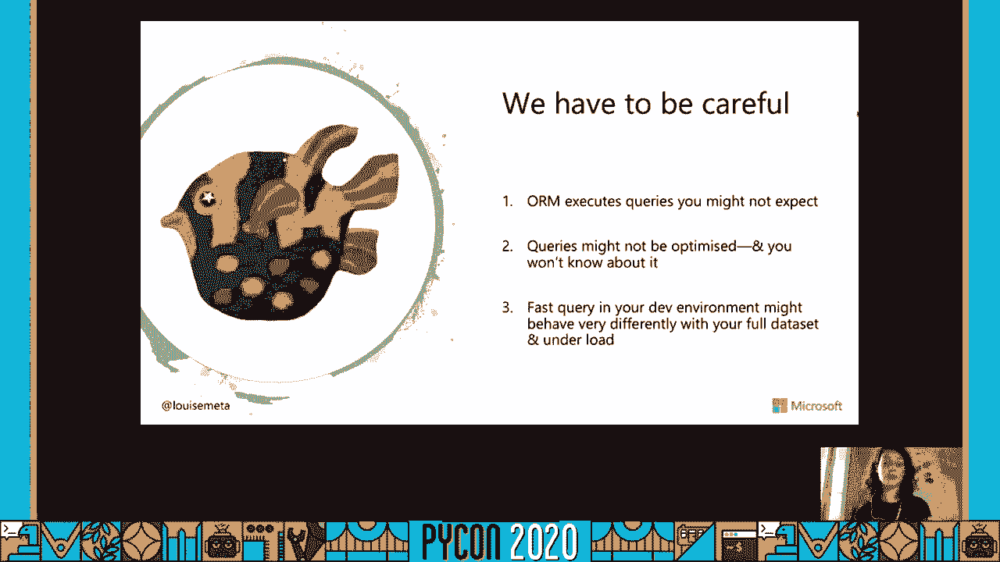
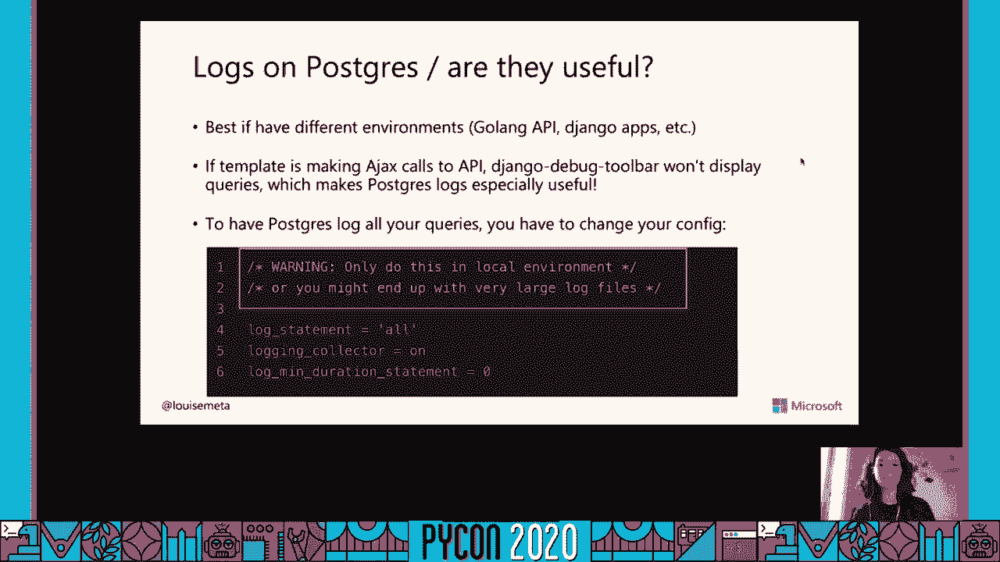
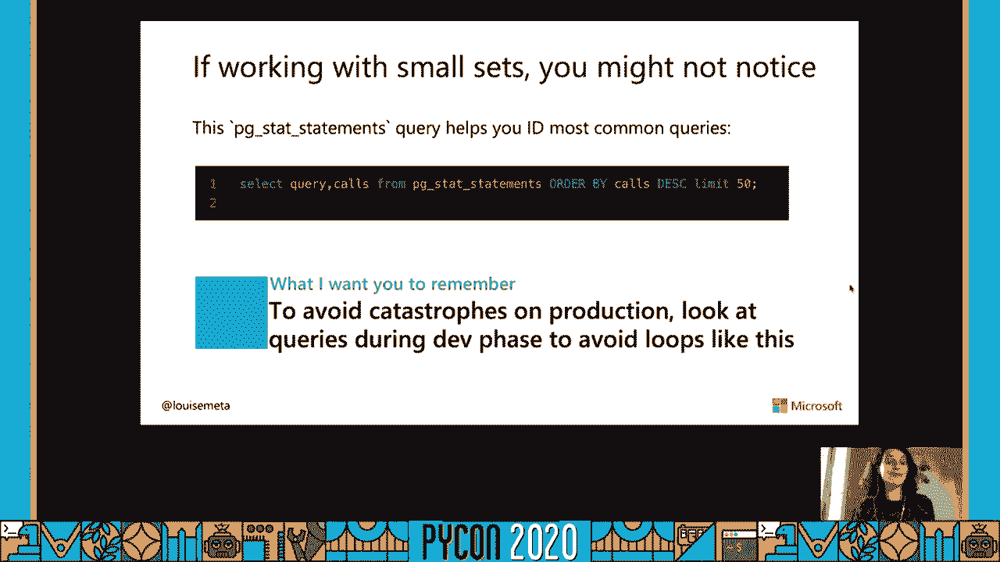
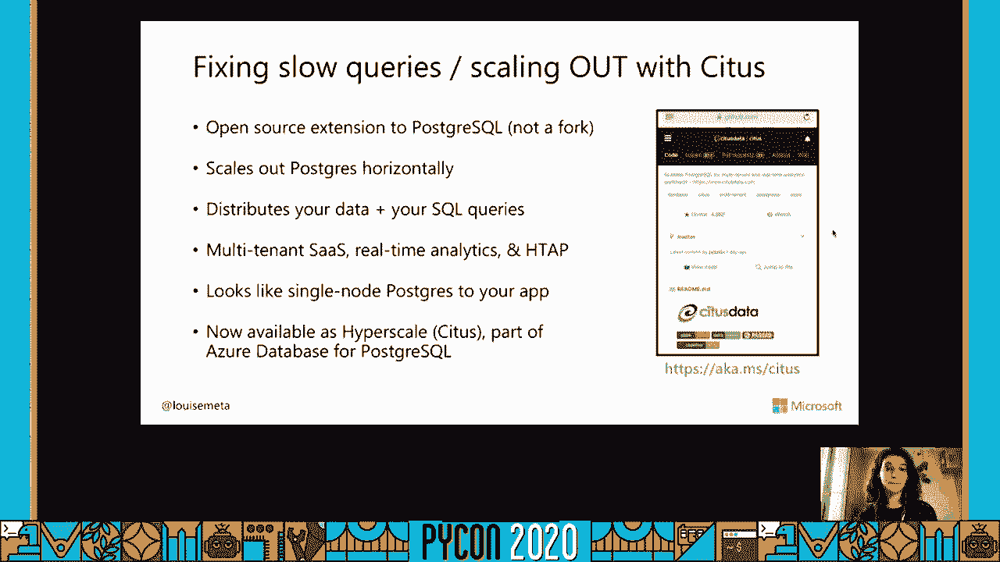

# P15：Sponsor Workshop Louise Grandjonc - Optimize Python & Django apps with Postgres - 程序员百科书 - BV1rW4y1v7YG

大家好，我今天是魔杖，我们将讨论如何优化你的 python和 django应用程序，呃。

波斯特雷斯超级大国，在我们开始之前 先介绍一下我，我是蟒蛇开发者，我在微软 Postgres团队工作，嗯，我以前在Citus Data工作，一年前被微软收购，我喜欢波斯特和蟒蛇，我在工作。和他们俩在一起八年了，我玩得很开心，从波斯格雷钓鱼信息 并将其喂给蟒蛇，嗯，这次谈话是，呃，最初是我们今年应该在蟒蛇举办的一个研讨会，我很难过 我不能去那里。希望我明年能和你们见面 或者在现实生活中的其他会议上，希望你们对这次研讨会有反馈，所以我喜欢复杂而现代的续集，这就是主题，我做了很多演讲，我真的鼓励开发人员，呃，不管是蟒蛇还是，你知道吗。Ruby或其他语言开发人员充分使用数据库，潜力，尤其是 Postgres，因为很多时候当我们使用 rms的时候，我们倾向于，你知道吗，使用不足，呃，续集的力量，关于我们今天要讲的内容，所以首先。

我想说的是，为什么我们最终会出现性能问题，是什么导致他们，以及如何，你知道吗，抓住他们，你能用什么工具，然后我们将讨论四种情况，你知道吗，在应用程序和数据库中可能发生的导致性能问题的事情。所以这将是循环，限制查询，设置分页，从整体上看 缓慢的查询。

非常有用，我们经常用它们，我想说我喜欢它的主要原因是它能帮助我们在很短的时间内构建应用程序，但是我认为我们需要小心，可能发生的事情，这可能会导致 rms的性能问题。您的 rm可能正在执行 您可能不期望的查询，如果你不查查你的记录，那你就不会知道那些查询了，要注意的第二件事是查询可能没有优化，如果你不去调查，如果你只是，你知道吗，看看你的蟒蛇密码，你不会知道的。所以我们真的需要，你知道吗，小心我们的 rm或数据库，以及两者之间的联系，最后，有时开发环境中的快速查询，当你在本地工作时，当您的数据库非常庞大时，您的行为可能会非常不同。产量要大得多。当你在数据库上有负载时，呃，这也是很重要的事情，一些在你当地环境中似乎不是问题的东西，以后可能会变成一个。

那么你如何防止这种情况呢？像海马或斗篷这样的超能力 如何帮助你。

我想介绍的第一个工具是 pd语句，是波斯特格雷斯的扩展，所以您使用 create扩展安装它，它将帮助您跟踪在服务器上执行的查询的统计数据，所以它的工作原理是，呃，你知道吗，将查询保存到一个表中。并告诉您查询字的次数和速度，我会给你一些例子 说明你会在 pat语句表中找到什么，因此，捕捉缓慢的查询是很好的，我真的建议你在你的生产环境中使用它，以及您的开发环境，新的生产环境，你不用担心。PG声明的性能问题，嗯，如果要配置要跟踪的查询的数量，你可以通过配置文件，postgresql配置文件，所以它是，我真的很推荐，因为它会帮助你跟踪缓慢的查询，如果你在云计算上工作，嗯。你的研究生课程的提供者，就像如果你有它，呃，如果您有 postgresql的 azure数据库，默认情况下，它实际上是在任何一天安装的，很多云计算产品也是如此，那么如何使用。

我在这里得到了这一百个最慢的查询，所以我选择了列，同时我命令限制100，所以它给我的结果是这样的记录，在这里它给了我总的时间，平均时间和最大时间，打了多少电话，因此。从这个表中选择计数星号的查询已经执行了三次，总时间为643毫秒，如果你用的是天蓝色，呃，实际上有一个工具叫做查询性能洞察，实际上是使用 pg set语句，它给了你。你知道像你的前五个查询平均持续时间的统计数据，呃聚合，所以它在最后15分钟内聚集在一起，所以如果你想在语句中使用pd，你想看看一个接口，这个可以帮你，你能拥有的另一件事是，呃，业绩建议。所以这里会给你两个建议，一个可以是，呃，创建什么索引，所以如果你有慢的查询，什么索引可以帮助您提高性能，或，呃，恰恰相反，您可能有冗余的索引或不使用的索引，这会减慢你的速度，所以这不是你想要的。

我想讨论的第二个工具是 django调试工具栏，这是我经常使用的工具，我想说，嗯，它的工作原理是，它将列出在模板和视图中执行的查询，它给了你今天查询的解释计划，我不会在续集里解释太多。也不会在续集里解释太多，不过我还是会给你看一个例子，我真的鼓励你来解释，因为它能帮你找出，为什么一个特定的查询是缓慢的，django调试工具栏的另一个功能是帮助您跟踪查询。所以如果你对查询的来源感到困惑，为什么要执行，它会追踪到你的代码，这很有帮助，您应该只在调试模式下使用它，所以在你的 django设置中调试为真的时候，您现在应该在您的生产环境中拥有它，因为你知道。否则，您会让每个人都看到您的代码和查询，所以这不是很好，第三，波斯特格雷斯广场的原木，我个人主要使用 Postgres加载的原因 就像我喜欢探戈调试工具栏一样，有时是不够的，因为各种各样的原因。

一个是如果你在不同的环境中工作，所以如果你有一个目标，我和你还有一个 django应用，或者你的团队正在和，你知道铁轨，呃，它有使用 Postgres日志 它，这改变不了什么。您不必为每个选项找到不同的工具，呃 语言，您只需要配置日志，这真的很酷，django调试工具栏有时不够用的另一个原因是，呃，例如，如果你在你的模板里，你在处决一些阿贾克斯，有些人做出反应，那就是，呃。调用 apis，因此，您最终得到的查询不会显示在tango调试工具栏中，这使得 Postgres日志更加有用，所以呃，在 Postgres中配置日志，以下是您想要更改的设置。所以您要将log语句放置到all，将日志收集器放置到on login duration语句0，这样你就能记录下每一个查询，但是要非常小心，因为在你当地的环境中 这是很好的，您应该始终查看您的查询。

并查看本地环境中的所有查询，但在生产上，你不会想这么做的，因为你最终会得到非常大的日志文件，例如，假设你是，呃，你在你的产品中配置它，你有，你知道一百个人在你的应用程序上连接。你的档案里有成千上万的查询记录，这也会产生不同的问题，但是更多的磁盘问题和 Postgres问题，但还是。

首先我们要讲的是循环，嗯，循环通常是我们有一个原因，呃，优惠问题，这就是为什么我想在深入讨论之前谈谈它。

正如我刚才提到的，这应该是一个车间，所以我们应该一起坐在一个房间里，一起改进一个应用程序 一起解决这些性能问题，因为在这种情况下，下面是 github存储库的链接。在那里你可以找到我为这个工作室制作的应用程序，如果你克隆它，你可以安装它，你可以运行它，你可以有，你可以改进或测试我今天要展示的东西，所以呃，关于这个车间的方案，我们将主要关注活动和广告。我只是想给你概述一下这个应用程序是什么，所以我们有，呃，公司和雇员，每个员工都可以连接到应用程序，看到一个界面，公司有活动，竞选活动有广告，一个员工可以在一个活动中工作，成为一个合作者。每个广告都能产生点击量或印象，所以让我们看看你是怎么知道它看起来像，所以我在这里滚动我的竞选活动，另外，我还有一个菜单，上面有每个活动的广告链接，所以这是一个相当标准的应用程序，呃。

以下是该视图的视图代码，所以我有一个竞选名单查看，在姜戈，这是一个通才的观点，而且需要伐木，很明显 因为只有员工才应该看到活动，我在这里有一个查询集，我对模特活动的评价过高了，我在过滤这里，呃。关于公司的查询集，所以我有一个叫自我请求的公司，用户雇员公司，所以让我们调查一下，呃，又是这个观点，去查查 django d工具栏，我们在这里得到了什么信息，我能看到的是我有很多查询。一百九十六个类似的查询，所以我要追溯一下 用达姜戈控制杆，我看到它来自于渲染我的模板，所以它来自于模板代码，这就是续集实际上在这里执行的地方，所以嗯，我们再调查一次，我的，我知道它来自这里。所以让我们来看看为什么我有这个循环，所以每次竞选，在竞选中，所以在我列出的物品中，所以我有两个循环，我已经为竞选和竞选，对于活动中的每一个广告，我都显示了链接，我有96个问题的原因。

因为我在96场竞选中做了这个循环，所以每次活动我都会对广告进行查询，所以这就是为什么我有96场竞选，所以我有96个问题，一点都不好，select related实际上是要做一个 join。我们通常用它来做外键，因为它加入了外键列，第二个函数与预取相关，它通常用于许多人，过多或相关的对象，因为这里的广告，所以使用它的方法是在我的查询集中，我在过滤器后面加上，我添加预取相关广告。所以现在让我们来看看，呃，我现在只有六个查询，而不是一百个，我有个新的问题，我有竞选身份证的地方，我的竞选身份证清单，所以我从101个查询变成了6个查询，这是相当不错的，对，关于循环的一些小事情。然后我们转向其他事情，在生产中捕捉外观真的很痛苦，对你来说真的很糟糕，想象一下，如果你有，你知道吗，呃，这发生在，你知道有一百个人，所以你最终会得到成千上万的查询，所以你不想在生产中遇到循环。

所以真的记得，呃，一些东西，这是，您应该始终检查您的查询，以确保您没有忘记循环，另一件您应该小心的事情是，也许在您的开发环境中，您正在处理的是一个非常小的集合，就像你刚刚，你知道吗，你的五个竞选活动。呃，在您的开发环境中，你可能不会真正注意到循环，直到你可能在舞台上或最糟糕的刺激，所以你应该小心 也许如果你从来没有这样做过，您可以查看pg ststatement，查看执行最多的查询。看看是否有什么奇怪的地方，你在某个地方忘记了一个循环，嗯，但是你真的应该小心 不要让它出现在你的作品中，所以只要，要小心在开发阶段执行的查询和。

我想说的第二个问题是限制你在默认情况下选择的东西。

django rm 选择所有列，所以当我做预取相关的，呃，以下是查询，所以我有一个选择，我有所有的列，我有身份证名字竞选身份证，URL目标 URL印象等，等等等等，我其实不需要那些专栏。当你看我的菜单时，我展示的是，我只有身份证和竞选身份证的链接，所以我应该执行的查询应该是，选择 id name，运动，身份证在哪里，但我不应该选择所有的列，只调用一个工具或函数。它可以帮助您限制在这里选择的列，这似乎不是一个大问题，但你可以想象 如果我有，你知道30个专栏，其中一些是文本，你得到了很多你实际上不需要的数据，因此，如果你的数据越多，你拉的速度就越慢。为了提高页面性能，您的查询将会得到，将从数据库中提取的内容限制到只需要的列，这将对您有很大帮助，所以不要让你的简历决定，你选择哪一个，下面是一个如何使用 omni的示例，我在用全名做竞选筛选。

在我之前的例子中，我正在使用预取相关的，我在用预取相关的，所以要限制查询集，我只需要做预取，所以我要做的是，这里是使用预取类，所以我从 django db模特儿那里进口的，在这里我做预取，呃广告。又来了，我保留了相关表的名称，呃，在查询集中，我把我的身份竞选和名字。

所以这就是你如何限制选择列，我们要讨论的第三件事是分页，我现在为这家公司发起了一百万场活动，页面变得非常非常慢，我甚至没有向你展示这一页有多慢，因为那会花很多时间，老实说，这对你来说有点无聊。所以现在我的页面非常非常慢，因为我调出了一百万张唱片。

为什么分页如此重要，嗯，正如我提到的，检索100万行比检索25行要慢，它来自，你知道吗，只是更多的数据需要汇集，所以排得越多越慢，另外我在做预取相关的，它生成了一个带有活动标识的查询，这份价值清单。所以如果你有100万个值，它也变得很慢，当然你真的需要看到所有的行，不像你，实际上，您不需要在一个页面中看到一百万行，呃，我个人不知道，当我看着一页，我记不起一百万条信息。所以也许你真的不需要把所有的东西，你知道分页，因此类将查询集分成两个页面，让我们看看我在这里给出的例子，我在拿查询集，所以我在做一个竞选物品，过滤公司 id等于1，我凭身份证点菜。现在我正在初始化一个 Paginator，所以我把它传递给查询集，2，5，2，5是值，我想按页数分页，给你四万，所以 Paginator有很多页，我可以在这里选择我的页面，页面是一个对象。

所以我做了铜绿，第一页它给了我一个页面对象，页面对象有几个函数，它有一个x，它的下一个函数会给你一个布尔值，告诉你，如果没有下一页，我这里有，是第一页，它有下一页吗，是的，有没有上一页没有，以前也是。会是假的，它还有一个 x页码，所以它能帮助你，你知道吗，当你要做 html分页，它，帮助您构建下一页和上一页的 url，它还有一个对象列表，我在这里只显示了两排，因为它太大了，不能显示所有的东西。但它会有两个，五，此对象列表中的 um对象，正在进行分页的建筑，只是添加页码，以及您要分页的数字，所以我把它放在这里，二十，现在让我们来看看它的 html，所以我有，呃，这里，分页只是html。在这里有上一页和下一页，呃，我把之前的链接，所以如果这一页有上一页，我把链接放在上一页的页码上，下一页也一样，如果页面上有下一个，我把链接放到下一页，所以让我们来看看，你知道这意味着什么，呃。

现在我把分页，所以现在我们只有20行 而不是96耶，我翻到第二页 第二页，我也有20排，让我们看看查询，在查询中，我现在有一个限制，二十偏移二十，当我选择竞选的时候，现在需要100毫秒，我们看最后一页。我们比较一下，现在在这里的表演我有一个限制，七抵消，差不多一百万，我不打算读那个数字，它需要398毫秒，几乎400毫秒，另一件事 我这里有一个选择计数，它需要364毫秒，让我们回到我的第一页，再次比较。我还有七个问题，我又有了这个选择计数，这需要360毫秒，这是个小问题，在这里分页的工作方式，所以我有一个计数，被Paginator用来知道生成我的，呃，页数，而且计数很慢，排得越多，它将如何得到。这真的是一个危险信号，如果你有一个缓慢的分页看，如果你有一个计数可以，这可能是一个原因，我们注意到的另一件事是，我们有一个偏移20限制20的查询，花了100毫秒，但在最后一页，它花了400毫秒。

原因是目前后置偏移的工作方式，它的工作方式是获取行，跳过前n行，只返回最后20行，所以呃，如果我做抵消20 限制20，它将取40行，只返回20行，当我做抵消100万上限20，我要去拿，一百二十行。跳过前二十，所以我还在收集的那些行 就是为什么你在页面上得到的分数越高的原因，查询的速度越慢，所以你可以看到这有多大的问题，尤其是如果你有超过一百万的，那么解决这个问题的办法是什么呢？

这就是为什么我想谈谈键集分页，为什么我鼓励你改用键盘输入 而不是，所以他说，分页是有效的，而不是有20个限制，二十套，它将根据字段在您的订单上添加过滤器，所以我在这里点菜。所以我会在第二页有大于20的查询，我们就说是凭身份证下的单，限制二十，如果你想了解更多关于他如何设置分页，尤其是如果你有不止一个领域，那是你的身份证，嗯，呃。你可以在马库斯·比恩的博客上读到他的一篇文章，使用索引 luke dot com，这里有一个简短的链接，呃，他解释说，你知道很多关于补偿和，嗯，获得更好性能的其他技巧，所以在 django里的键集分页。因此，有一个应用程序被编写来简化使用键集分页，它叫做 django键集分页，另外，你在代码中做的方式是，所以你在混合中导入分页器和分页混合，你把它放在你的班级混音中，所以在这里。

我仍然有我的登录需要混合通过混合这个视图，我只想说，呃，在 Paginator的页面顶部，类键集分页器，所以让我们稍微了解一下使用键集分页的结果，好的，所以我现在有七个问题，我有六个，我再也不用数了。所以这是个好消息，我写到最后一页了，这是我的身份过滤器 超过一百万，它只需要100毫秒，呃，总的来说这个页面需要628毫秒来加载，它曾经超过一个点，两秒钟，所以我把花在数据库里的时间。600毫秒还是很慢，和，当然，你可以，你知道吗，通过增加索引来提高更多，通过分析为什么查询慢，但已经除以二了，在页面上花费的时间已经相当不错了。

所以现在，嗯，修复缓慢的查询，所以我真的没有时间去做太多的事情，呃，不幸的是，然而，我将为你们提供更多的资源来进一步研究这个问题。

所以只是一点点，我们会再次使用，那个声明找得很慢，十个最低的查询，我在这里找到的一个问题是这个，所以我从竞选中挑选明星，存档不实，所以我一遍又一遍地找你，不针对未归档的公司的查询，所以我能你知道什么。改进此查询，我要用，通过做解释来解释，然后查询，它会给我一个叫做查询计划的东西，查询计划基本上就是你知道在 Postgres中发生了什么，Postgres是如何处理查询的，不过，确实有大量的资源。关于解释，所以我鼓励你去调查，有一些会议上的谈话解释了这一点，所以如果你在谷歌上搜索，你几乎可以找到任何关于它的东西，所以在这里，我可以看到它在做一种叫做顺序扫描的事情，所以顺序扫描是。它的意思是不用索引，它将实际扫描整个表 并应用过滤器，所以基本上就是这样，你知道顺序扫描并不总是不好的，但在这种情况下，我可以考虑好吧，我少了一个索引，那我今天要做什么呢？只是为了举个例子。

我想给你看部分索引，所以嗯部分索引是在 Postgres中的一个帖子 是用一个过滤器创建索引的一种方法，比如一个 where从句，就像在任何查询中，但在索引上，您可以使用 raw sql来创建索引。这完全取决于您以及您通常如何处理索引，但如果你想用 dm，它在这里是被支持的，我所做的是把它放在我的竞选课上，我所做的是在存档的索引上添加一个条件，相等的假，所以现在查询需要100毫秒，呃。只是为了给你，呃比较一下，查询花了219毫秒，它已经改进了一点，如果您对 Postgres中的索引感到好奇，呃，决哥大会是个很棒的会议，我真的很喜欢，我谈到了 Postgres提供的索引类型。就像基因一样，只是 b树，嗯，必须在这些和什么之间做出选择，如何提高你的表现，使用正确的索引，它们还涉及到你可以得到的选择，如果你对部分索引有点好奇，嗯，我说了一点关于这一点，我讲的是多列索引。

唯一索引，etc，假设你有完美的代码，你把一切都优化了，你没有奇怪的问题，你知道创建了所有正确的索引，你有完美数量的索引，没有太多的不让，不要太多，不够，etc，好像一切都很完美，但事情还是进展缓慢。也可能是越来越慢，但你什么都没改变，所以这很令人困惑，它可以来自许多，像这样的事情，可能是因为你你的应用程序上有更多的流量，也许呃，因为交通堵塞，你的 CPU膨胀了，你的记忆力很差。你也许你的磁盘在某个时候填满了，也许你现在的情况是你的硬件不够，所以这是扩大规模的好时机，所以缩放图，意思是增加磁盘 cpu，etc，但你可能会想，你怎么知道这是你扩大规模的好时机。我建议你看看这个关于如何调试东西的演讲，当波斯特格雷斯很慢的时候，当 Postgres不工作时，或者你想怎么做，当一切都不对的时候，以及你可以用来调试 Postgres的工具，你能从中得出什么结论。

好的，高并行度，高 cpu或低 cpu和高并行度，etc，就像它是，它适用于不同的情况，并帮助您了解数据库服务器上发生了什么，不管是时候扩大规模了。

如果你的应用大获成功，好的，现在也许扩大规模已经不够了，也许你有成百上千万亿字节的数据，把所有的东西都放在一个节点上，波斯特格雷斯是呃。

不再是一个选择，然后你可以扩大规模，你可以使用 Citus扩展，Citus是 postgresql的开源扩展，它帮助你扩大规模，呃，水平波斯特格雷斯，这里，您有一个到 Github存储库的链接。好处是 如果你想调查，呃开源版本，呃，我所做的是把数据分散到不同的，呃 工人，它还分发了询问，它非常适合多租户应用程序，实际上我们和迪姜戈有一个工具可以帮助你使用迪姜戈应用程序 并与希图斯合作。从你的上侧看，它实际上看起来像是一个单一的点头，Postgres，所以呢，当你连接到应用程序时，就像在你的 django设定中，你不需要改变很多，你只需要改变你的连接字符串 就可以连接到一个。Citus，应用程序，服务器，对不起，嗯，如果您想要管理数据库，呃，我们发现了一个异常点，是 postgresql的 azure数据库的一部分。

所以稍微介绍一下它是如何工作的，所以我让我的应用程序向协调者发送数据，协调者发送查询，对不起，它向协调者发送查询，协调员将询问发送给工人，它重新分配它，使用更好的 cpu并行性。所以它比单个节点更好地使用您的硬件，你的员工会把数据返回给协调者，这将返回到您的应用程序，就是这样。

如果你愿意，你知道吗，了解更多关于 Citus和如何使用它的信息，呃，这是一个快速的开始，嗯链接，所以你可以，你知道吗，从蔚蓝的希图斯开始。

所以结论是，以下是我想让你记住的八件事 关于我们惊人的波斯特格雷斯。

查找慢查询的第一个 pg步骤 语句，或者一般来说，它将帮助您调试您的查询，或者比调试更像是，抓住什么是错的，找到慢速查询，因此找到已经执行了很多的查询，这通常可以帮助您理解数据库端发生了什么，嗯。django调试工具栏是一个非常酷的工具，对你来说可能还不够，尤其是如果您并不总是使用模板和视图来获取，波斯特格雷斯日志是我一直百分百推荐的，因为它可以让你看到查询。所以请打开你的 Postgres日志，这对你总是有帮助的，呃小心循环，嗯是的，我们不抓到你就输了，当为时已晚，这对你来说可能是一个真正的挫折，如果是在生产，嗯，不要让你的手臂决定你要选择什么。考虑只使用，我也在考虑使用原始的等价物，有时，如果您已经在使用分页，这可能会有所帮助，你用分页和偏移，尝试使用，呃键盘输入，对你会有很大帮助的，如果你不像你一样使用分页，你可以直接开始，呃，键集分页。

创建过多的索引或索引，索引您拥有的每一个列也会损害您的性能，但是全面了解索引 并知道 Postgres有哪些索引将帮助您，最后，嗯，你知道吗，有时候你想提高多少就提高多少，有时只是你的硬件不够。在这种情况下，扩大或缩小规模 对你来说是一个很好的解决方案。

所以谢谢你的关注，嗯，如果你有问题，你可以在推特上联系我，我很乐意回答你的任何问题，这里是我在前一张幻灯片中给出的资源的链接，所以这里有一个快速的开始。Doctors for Citus and talk on debugging Postgres from，哦，我忘了说是同事寄来的，威利韦伯和我的链接，谈索引，应用程序的 Github。如果你想测试一下，我今天展示的，你可以在Github上克隆它，享受它的乐趣，啊，网站的 git repo是开源的，如果你有兴趣，你可以加入时事通讯。

