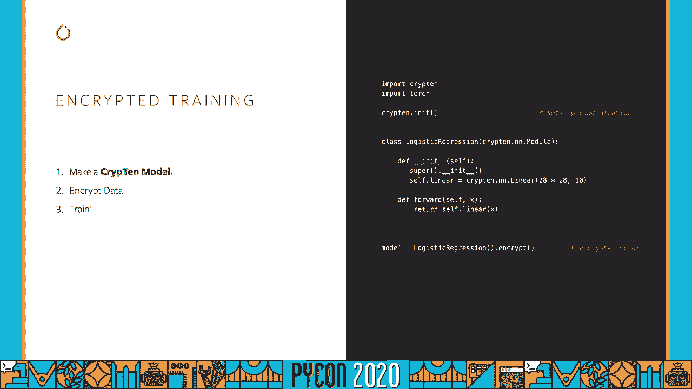
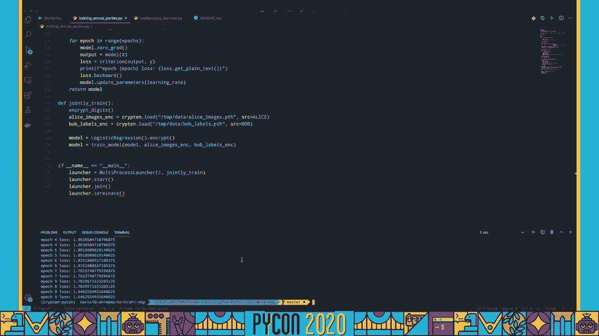

# P16：Sponsor Workshop Mark Ibrahim - Facebook Machine Learning on Encrypted Data with - 程序员百科书 - BV1rW4y1v7YG

这就是我今天要跟你说的，特性或输入，标签或输出，它这样做的方式是通过许多例子来调整它的内部，在这种情况下，我们有猫和狗的照片，模型试图了解每个图像是猫还是狗，从这个例子中可以看到，从这几张照片来看。猫和狗以不同背景的各种姿势出现，所以从五张图片来看，一张猫的照片是什么样子 可能并不明显，为了培养好的模特，我们需要大量的数据。所以我们可以想象一个场景 许多宠物爱好者聚集在一起 贡献大量的猫和狗的照片，能够培养出优秀的榜样 告诉我们，是否，是一张猫或狗的照片，尽管猫可以有很多姿势，例如，在翻译中，我们有大量的文本。以许多语言公开提供，在敏感数据的上下文中效果不太好，例如，你可以想象，呃，三个医院系统试图更好地理解一种特定的疾病，他们想这样做的方式是通过训练一个联合模型，但不幸的是，每个医院系统都有敏感的病人数据。

他们不能与其他医院共享，因此很难训练出一个好的模型来更好地理解一种特定的疾病，幸运的是，密码学中有一个子领域叫做安全多，Party calculation。研究如何跨多个Party计算一个函数的确切问题，同时保证原始输入的安全，作为一个例子，我们可以想象三个，我们只想计算它们的和，安全的多方计算 允许我们计算和，在这种情况下，九个没有透露原始输入，三。四两，这些都很安全，也许我们能够解决几个医院系统能够在不暴露原始病人数据的情况下 训练一个模型的问题，所以多亏了这些好人的辛勤工作，我来是想和你谈谈，加密，一个框架来做到这一点。因为我们连接了两个不同的社区，这意味着我们希望它有一个语法。

在左边这里我有手电筒，右边有十个，如你所见，语法很相似，当你做张量的时候，你稍微改变一下名字，但它的功能几乎是一样的，你用同样的方法添加张量，你用同样的方法乘以张量。

我们还想确保框架允许简单的调试和实验，所以它有强烈的执行力，它是用蟒蛇写的，我们希望它是现实的，这意味着各方之间的交流 以我们描述的方式进行，如果需要的话。

好的，我们跳进去吧，这就是所谓的地穴张量世界，加密张量是加密张量，你初始化它，像我们之前看到的那样 创建一个地穴张量是非常容易的，你可以打电话，获取纯文本 以显示输入，所以现在你已经尝到了。让我们进入交互式教程。

所以如果你想继续这个互动环节，您可以继续按照此链接寻找 python车间，好的，因此，在这里您可以找到安装说明，在那里您可以安装crypten和要求，或者如果你没有蟒蛇3-7那是10的要求。我们还提供了一个码头工人文件来运行这些笔记本，所以首先我们要输入所有东西 注意一件事，我们有一个叫氪网的电话，它的作用是，它建立了各方之间的交流，类似于你之前看到的，我们来谈谈如何创建一个张量。类似于 pi火炬来创建张量，与其称之为张量，我们称之为加密张量 表明它是加密的，但它落在一个解决方案文本上，地穴十 地穴张量，如果你运行手机，你得到的是一个加密的张量，所以你看这里的值。你注意到这些是随机数 与我们最初输入的完全不对应，是一二三，所以如果我们想解密并获取原始输入，我们可以调用一个名为 get plain text的函数，所以纯文本意味着解密。

当我们叫它的时候 我们注意到我们得到的是一二三，就像你所期望的那样，所以让我们创建另一个张量，让我们创建一个张量，它有四五六，我们就叫它 你，所以现在我们，可以做各种操作，我们可以把2加到x。你会注意到结果在这里也是加密的，我们就可以揭示它，如你所料，加两个，对于每一个元素，我们得到3，4，5，我们还可以添加两个加密值，x加 y，会给我们一个加密的张量，因此，在整个计算过程中。这些值都是加密的，直到我们显式地调用，获取纯文本，呃，除了增加，我们还可以做更多花哨的计算，像点积一样，我们支持日志，softmax和许多其他功能，如果你想看完整的名单，检查管道，我有一个链接到这里。你可以点击加密张量，它会向你展示完整的应用程序接口，我们有很多有趣的功能 比如弧度最大值，批规范等，我们在很大程度上模仿了圆周率火炬的应用程序接口，好的，让我们看一个例子，在这个例子中。

我们计算一些更复杂的东西，比如平均平方损失，所以让我们提醒自己，我们有x和y，x只是一二三，Y是四五六，但如你所见，这些都是加密的，所以有了加密版本，我们实际上看不到原始输入是什么。但我们仍然可以进行计算，所以如果我们想，计算平方损失，我们可以从 y中减去 x，我们可以平起平坐，我们可以计算出平均值，最后我们可以打印结果 然后解密，所以这就是我在这里要做的，现在是九点。如果我们看这里，让我们运行等价版本，没有加密的 PI手电筒，另一个张量是1，2，3，4，5，6，让我们做同样的计算，你注意到我们得到的是完全一样的，结果是九，现在让我们深入了解安全多方计算是如何工作的。假设我们有三个派对，甲方有7号，缔约方 t的数字是10，他们想把这两个数字加起来，而不透露最初的输入，首先让我们弄清楚一方如何加密它的值 七方首先生成两个随机数，在这种情况下，碰巧是二和四。

它给自己剩下的，我的意思是，如果四加二，剩下的七是一，所以这很好，因为如果我们把这三个数字加起来都是绿色的，我们把它们叫做股票，我们得到七个，那是最初的结果，但每一方都有一个随机数。所以他们没有任何关于原始输入值7的信息，好的，把数字十加密，使用相同的程序将生成两个随机数，并将余数分配给c方，现在我们可以很容易地计算出七加十，在不暴露原始输入的情况下，通过计算每一份股份的总数。绿色的数字，所以甲方计算乙方计算六，丙方计算七，当我们把这些加在一起，我们得到了正确的结果，七加十等于十七，但我们从来没有，在整个过程中了解有关基础输入的任何信息，简而言之，这就是安全的多方计算。乘法使用一种叫做海狸三元组的协议 类似地工作。

我们在这里就不说了，下面我们快速了解一下在 crypten中定义模型是什么样子的，对于 pyptorch模型的样子应该很熟悉，一般的步骤是首先创建一个加密模型，允许加密，我们把数据加密，所以我开始展示。然后我们训练那个模型，所以让我给你看看完整的样子。

让我们通过交互式教程来训练一个关于加密数据的模型，所以我们首先运行上次教程中的导入，本教程我们将使用 mnist数据集，它是一组手写数字，这里有一个图像的例子，是输入，好像是5，它还附有一个标签。所以在我们的情况下，我们要做一些预处理来生成这些数据点的一个小样本，所以到目前为止我们所做的一切，我们只是抓住一个样本 然后创造两个张量，四张图片中的一张，一张用于标签，所以图像是28乘28像素标签。呃，我们对应的十维数字，我们刚刚取样了上百样东西，好的，所以从现在开始，我们要确保把数据加密，所以我们从来没有看到原始数据，所以现在当我看到一个图像，而不是我在这里看到的，我看到张量里有一堆随机数。让我们创建一个测试集，这样我们就可以评估我们的模型的性能，所以在第一个模型中，我们要研究多类分类的logistic回归，所以这里我用氪来定义这个模型，就像在手电筒里一样，我们提供了一个nn模块。

您可以继承它来定义模型，所以语法看起来应该非常相似，在这里我们定义了一个线性层，Pytorch和Pytorch的唯一区别是，现在我们把这个线性层叫做氪层。输出一个十维张量 注意到类似于 pi torch 我们会自动照顾 autograd，所有您需要定义的是正向函数，好的，所以让我们这样做，注意到一件事，我们也加密了模型，现在我们可以做推断。输出一个加密的张量，以我们提供的模型和例子为基础的训练循环，更新模型参数，所以这看起来也应该和我们在 pytorch中所做的非常相似，2。我们首先要给损失下定义，我们提供交叉熵。损失二进制交叉熵和平均平方误差 开箱即用，然后我们通过每一部史诗的训练循环，我们把模型参数设置为零，我们产生一个输出和一个损失，注意这里我们只是在整个过程中监控损失，所以实际上能够看到我们调用的值。

获取纯文本，就在这里，我们将损失向后传播，以计算梯度，然后我们更新我们的模型参数，所以我们可以在模型上调用它，看看它做得有多好，让我们定义火车模型 然后运行，所以我们注意到第一部史诗，我们从误差的2。3开始，然后我们慢慢地减少每史诗，嗯，我刚刚在这里运行了十个时代，所以最后它从2点3上升到1点6，好的，酷，所以现在我们可以用这个模型来预测，所以我们在这里有一个预测，我们可以看到这个预测是什么。在这种情况下，它是一个，我这样做的方法是 首先解密结果，然后调用arg max，看看激活的最大值在哪里，所以在这种情况下，它对应于1的数字，如果我们看原始的未加密图像，我们注意到它实际上是数字1。所以我们的模型在这种情况下确实学到了一些模式，好的，呃，除了这张照片，让我们看看它在测试集中的平均性能，我们看到它做得很好，呃，百分之八十八，好的，呃，这是一个多层的卷积神经网络。

这只是向你展示我们有很多常用的层和激活功能在氪中实现，所以我们有二维卷积，漏失和线性层，我们有解压和射线损失等功能，最大泳池，就像在我们继承氪和模块之前一样 我们定义氪的层。然后我们可以创建一个模型的实例，所以现在如果我看一下预测，我又得到了一个加密的张量，它不能告诉我任何关于图像的事情，我可以运行同样的训练循环，所以这需要更长一点的时间，因为这是一个更大的网络。你会注意到计算和 npc通常比纯文本要慢一些，因为你在加密的张量上进行计算，更多的交流涉及到，但你可以看到第三部史诗般的损失减少了很多，两点三到两点一，九，同样，我们也可以在这里产生一个预测，好的很好。所以这很好，我们定义了两种模型，直接导入一个 pytorch模型怎么样，所以我们也提供支持，这样你就可以在加密数据上计算出同样的模型，这是一个圆柱形手电筒的模型，我们可以在这里定义，实例化它。

所有这些都只是普通的圆周率手电筒，现在我要做的就是让这个成为氪星模型，称为氪，然后从圆周率火炬，这需要一个皮拓切模型，一个输入是什么样子的例子，然后我说加密很棒，现在我得到的是一个氪和 n模的图。也就是说这个模型和派拓切的模型是一样的，但有了加密的对应函数，所以现在我们有了加密模型，我可以预测，所以在这里，我只是要拿一个例子，图像是加密的，所以你知道我说的图像是加密的，如果我看一下预测。我注意到它也是一个加密张量，我没有得到任何关于预测的信息，所以要解密，我打电话给得到纯文本，现在我看到输出只是一个张量，一堆数字，所以如果我有兴趣找出确切的数字，我可以调用相同的函数。但现在调用arg max，看看激活率最高的是什么，结果这个数字预测，是为了一个七，就像以前一样，我也可以训练这个模型，注意到我不需要在氪中定义任何东西，我把 pi火炬模型。

我还能在加密数据上进行加密训练，在那里图像被加密 标签被加密。

现在让我们回到最初的训练模型的例子，数据来自几个方面，一种可能发生这种情况的方法是，如果爱丽丝有几个，图像和鲍勃有这些图像的标签，然后我们可以在这些数据的加密版本上训练一个模型。所以鲍勃永远不会透露他的标签，艾丽丝也不会透露她的照片。

所以现在让我们看看如何让跨多方的培训首先发生，我们还是照常进口吧，让我们从一个玩具的例子开始，爱丽丝有张量，一二，三，鲍勃有四个，五，六，把他们的数据以加密的格式保存，所以首先要做到这一点。我们需要确保我们可以模拟 当爱丽丝在一台机器上运行 而鲍勃在另一台机器上运行时 会发生什么，所以要做到这一点，我们在这里有一个运行的多进程装饰器，有两个世界规模的每一方一个过程。所以在这里我们可以把数据，使用krypton save指定Alice的数据，其中指定数据，我们想拯救它的道路，然后谁拥有这些数据的来源，我们会对鲍勃做同样的事，然后我们把数据存起来。所以我们最初在这个目录中看到的是它是空的，但在我们失去拯救后，我们会看到两个新的文件，爱丽丝，为了验证它是加密的，首先让我运行这段代码，它也将跨多个进程运行，我们要把艾丽丝的数据，我们要去找鲍勃的数据。

然后我们会打印出爱丽丝的数据类型，我们应该预料到的是，这种类型是加密的，不会透露任何关于原始输入的信息，正如我们在这里看到的，我们有加密的npc张量，它是一个加密的张量。所以这里需要注意的一点是 这个印刷了两次，原因是我们正在运行两个进程，运行相同的代码，以模拟爱丽丝在她的机器上运行她的外套，以及这段代码，所以这个打印了两次，嗯，因为我们在模拟真实的设置。所以现在我们看到它被加密了，让我们看看原始输入，并确保我们可以恢复它，所以在这种情况下，我只是调用爱丽丝加密的数据，获取纯文本来解密它，看看这些价值是什么，如果一切顺利，我们应该看到一二三。所以我们又来了，我们看到爱丽丝西塔是张量，一二三很好，所以现在让我们来研究一个更现实的场景，假设爱丽丝有所有手写数字的照片，鲍勃有所有这些图像的标签。

他们想训练一个类似于我们在二号训练的模型来识别这些数字，所以要看一个图像并确定它是什么数字，所以让我们加载数字数据集，再次使用相同的代码进行采样，我们做到了，所以如果我们看看这些图像的形状。我们应该看到我们有一百张28乘28像素的图像，现在让我们以加密格式保存这些图像，艾丽丝有图像，鲍勃有标签，这与我们上面所做的相同，但现在我们实际上有了一套完整的图像，而不是一个玩具张量，好的，很好。让我们把目录清理一下，直到参观结束，它有完整的训练脚本，说明我们如何运行端到端的mnist模型，艾丽丝有图像，鲍勃有标签，在我们开始之前还要注意的另一件事是，我们有一些带有完整脚本的示例。在github repo中，这里有一个设置，也允许你在两台不同的aws机器上运行它，而不是在多个进程中模拟双方在更现实的场景中运行时 可能会做什么，所以看看这些。

好的，所以现在，让我们看看完整的训练脚本，用于训练一个模型，其中图像是加密的，它们的标签是加密的，爱丽丝有加密的图像和鲍勃，假设有加密的标签，他们都想训练一个模型，该模型可以有效地识别数字。而不会泄露任何关于原始标签或图像的信息，所以我们还是照常进口，这里的一个不同之处在于，我们还导入了这个多进程启动器，以启动一个单独的进程来运行alice和bob的代码。它使用 python多处理模块来创建运行代码的框架，这样您就可以看到完整的文件签入到 github中，我们将定义我们以前见过的相同模型，这是一个氪模型 是一个逻辑回归，接收一个28乘20的图像并输出。呃，帮助我们实现我们以前见过的功能，所以加密数字，这只是抓取 mnist数据集，把图像交给爱丽丝，把鲍勃交给标签并加密，我注意到我们只是在取样，在这里使用相同的脚本，只有一百码。

然后我们有同样的训练循环，我们已经有了，在这里我们定义交叉熵损失，反复阅读史诗，然后更新模型参数，所以这个脚本是通过调用这个联合列车函数来运行的，我们先把数字加密，这就加密了标签和图像。然后我们阅读这些标签和图像的加密版本，这就是我们用来，最终训练模型爱丽丝的加密图像和鲍勃的加密标签，所以在这里当我们称之为剧本的时候，我们启动两个进程，然后我们一起训练。让我们看看它是什么样子 在底部是一个终端，我要打电话给蟒蛇，然后剧本的名字，我们所看到的，是模型训练 所以在这里我们注意到我们有两个过程，我们有两个世界的大小，他们之间有一个沟通者。零级和一级与上述分析相对应，当我们开始训练模特的时候，它的损失相当大，两点三，到了十世之后，是1点6分，所以我们所做的就是训练一个模型来有效地识别数字，同时对属于爱丽丝的原始图像进行加密。

把那些属于鲍勃的图像的标签。

也加密了。

感谢您收听，如果你想了解更多。
