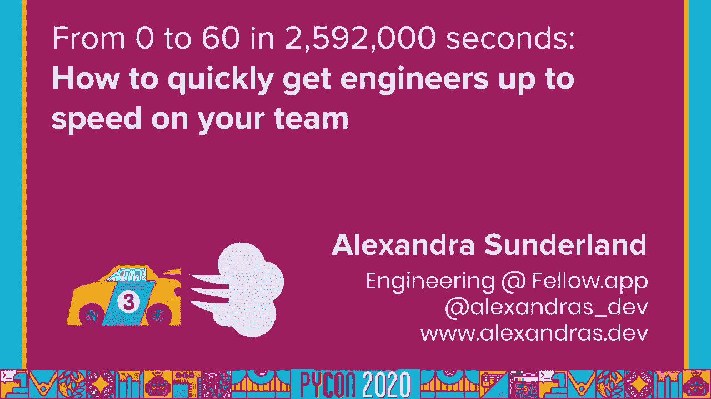

# P19：Talk Alexandra Sunderland - From 0 to 60 in 2,592,000 seconds - 程序员百科书 - BV1rW4y1v7YG

大家好，谢谢大家参加我今天的演讲，关于你们团队中的入职工程师，很遗憾我们不能见面，但我真的很高兴我能和更多的观众分享这个，尤其是因为世界已经发生了很多变化，从我提交这份报告到现在。我认为这是不可能忽视的现实，有些人将远程开始新的工作，这给已经相当困难的事情增加了一层复杂性，所以我想借此机会谈谈不同的方法，全程远程入驻，这次谈话，为了解决一些细微差别。帮助每个人提供他们现在所能提供的最好的体验，在过去的十年里，我一直在做工程师，我做了一年半的研究员，我现在在加拿大渥太华的工程队工作，我花了很多时间整理入职流程，帮助工程师，建立新的团队。我在费罗创建了入职流程 在此之前 我在 SurveyMonkey，在那里我教授了一些新聘请的工程师所经历的课程，在那里我必须帮助团队，为他们的学生做准备，让很多人加入团队，这是我有很多经验的东西。

多年来我一直在收集反馈，我觉得这个话题很重要，我认为作为工程师最重要的技能之一，尤其是作为一个经理，不管是对使用你产品的人的同情，与你的团队互动的人，或者需要经历你在团队中设置的流程的人。这种同理心的一部分是对那些可能紧张地加入的人，也不知道你用的是什么工具，你有什么过程，你的技术堆栈看起来像什么，对你来说可能很明显，甚至可能不是新员工想问的事情，这使得我们更难以我们想要的速度跟上速度。可能会让人们觉得他们做得不是很好，或者不够聪明，我要告诉你如何避免这种情况，这样你的新队友就能迅速跟上速度，你可以在你的团队中创造一个伟大的文化，我觉得我之所以对那些，开始一份新工作是因为。当我开始我的第一份编程工作时，当我还很小的时候，在当地初创公司上大学之前，我的意思是，超级幸运，我知道如何编程，但基本上只在视觉基础上，我从来没有听说过网络或编程与。

比如 python或者 html或者 javascript，我甚至不知道你可以把网络应用作为一项业务，因为这是在你下载大多数软件的时候，你想用长话短说，我花了几周时间在谷歌上搜索，什么是 api。什么是网络钩子，什么是要求，什么是服务器，以及如何登录服务器，越来越详细，因为我不知道发生了什么，我不知道该问谁，我觉得大家都认为我应该知道所有的答案，因为没有入职流程，我觉得有点失落，这一直困扰着我。嗯，我想那个夏天我学到的最多，在所有的人中，但这种体验是不可扩展的，当你试图让五十个或五十名工程师进入你的公司的时候，我在船上用很多不同的方式帮助过很多人，我在这个过程中也搞砸了很多。我第一次上船的时候，我本该把项目移交给，我为他做的，我基本上只是让他坐了一天，对整个代码库进行了逐行遍历，告诉他我所知道的一切，并认为这将是一切的结束，如果没有围绕业务需求的上下文，这类信息就没有用处。

产品的原因和知道使用它的人，没有人会记得成千上万行代码的细节，没有人会在乎给他超载信息，什么都不记得了，在接下来的几个月里 我有很多问题，我本可以避免的，如果我专注于一个策略，让他们能够找出答案。在我上一份工作中 为他自己，工程组织有这个入职过程，新员工要在头两周完成一系列课程，为了跟上我们使用的不同技术，我教过金贾的入门课，它是一个与 django一起使用的模板系统。但是我们公司有很多不同的产品和团队，只有少数新员工会使用生姜，所以很多人会跳过会议或者找不到相关的内容，这些课程将教授给初级开发人员和高级开发人员，几乎每个人，很多事情都发生在。您可以在文档中轻松查找的内容，每个人都会解除这种类型的会议，感觉他们在浪费时间，我最终感到被打败了，就像我没有教任何很酷或有用的东西，所以我辞去了教官的职务。

虽然你可能知道我想设置课程或一些大的结构来教每个人，你认为他们需要知道的一切，同样重要的是，不要跳过任何对你来说似乎显而易见的事情，假设新人什么都知道，对于技术上的事情来说是这样的，就像。也许有人是一个不可思议的蟒蛇程序员，但从来没有尝试过，所以他们需要一个简单的介绍，或者至少提个醒，他们应该调查一下，它也与组织和人际关系有关，也是，对人们的背景保持警惕是很重要的。也许你的团队中有人在一家科技公司工作过，知道什么是混战，带着敏捷的瀑布和所有加工过的东西，但一个新员工可能会从一个机构加入，他们没有这样的结构，他们可能迷路了，如果你不花时间走过去。你如何在你的团队中完成工作，前阵子我上了一个人的车，以及部分基于高级代码的概述，他们阻止了我，因为他们以前甚至没有看过产品的现场直播，他们不知道公司的整体结构，他们误以为我是他们的经理。

我做了这样一个假设，即人们对正在发生的事情有一个基线理解，我错了，很多时候，人们会觉得很尴尬，因为他们会问一些看起来很基本的问题，当它们还是新的，因为你的自信，似乎他们应该已经知道答案了。他们可能不敢提起这件事，入职很重要，假设这个人有表演的技能和能力，他们被雇来做的工作，但还没有任何背景，再加上重复一些他们可能已经知道的事情，在这个阶段不痛，因为重复和强化是关键。当有这么多新东西要学的时候，最终在和更多的人一起犯了更多的错误后，我缩小了一个入职的框架 我们现在用在，可能有一半的公司，不管你想出什么方法，最重要的步骤之一是征求反馈意见。这样你就能知道哪些部分需要改进，哪些部分是没有帮助的，哪些是有价值的，需要保留，我给每个新员工都发了同样的反馈调查，在他们工作的第一周结束时，这样我就能很好地了解需要改变的地方，它带来了许多伟大的见解。

它使我们的进程变得更好，这个框架就是我今天想和大家分享的，这样你也可以创建自己的入职流程，为了让工程师加入你的团队，在我们开始之前，把你做的每件事都框起来 很重要，你通过新员工的眼睛设置的每一个过程。你需要丰富的同理心，回想你刚开始的时候，你遇到的所有问题和困难，记住当他们开始的时候，他们可能不认识任何人或任何过程或传统，当他们试图跟上速度时，会感到有点格格不入，在这个时候。尤其重要的是要有更深的同理心，他们是否受雇于远程工作，如果目前情况不正常，远程工作，如果他们被雇来期望进入办公室，他们可能在家里没有一个合适的办公室，或者他们可能只是没有快速的互联网。他们可能在照顾孩子，或者只是总体上，没有理想的家庭工作，不管他们的情况如何，耐心和理解很重要，经常让他们放心，你在他们身边，你们两个明白 这不是一个完全正常的工作环境，一段时间。

入职最重要的部分是尽早建立正确的关系，通过早期建立这些联系，对这个人来说，打开与他人的沟通渠道会更容易，问任何他们需要答案的问题，从某个地方进来可能会很尴尬，不知道谁负责什么或向谁要求某些事情。或者不知道人们是否意识到你的存在，你可以开始建立的一些最重要的互动 是你的一对一，确保你尽早与你的新直接报告建立了你的第一次一对一，并保持它在一个有规律的周期。这样他们就知道他们有时间和空间和你谈论他们的职业目标，他们的想法与，他们可能会说什么，这是一个很好的时间 让你得到一个良好的脉搏，看看他们怎么样了，谈论一些他们可能不想在团队会议上提出的事情。把他们介绍给团队成员很重要，有时会被遗忘，提前让你的团队知道，有人加入 并让他们知道欢迎他们，一定要把他们介绍给其他队的人，他们将与，作为一个工程师，你可能与设计师或产品合作，人还是销售。

或者你有什么能让这些沟通渠道尽早打开，可以让以后的合作更容易，到了项目的时候，最后帮他们找了个好朋友，他们会更容易问问题，如果他们知道他们有一个专门的人去，谁会在开始的一小段时间里被问题压得喘不过气来。当你远程工作的时候，这一步尤其重要，必须经过深思熟虑，从走廊的谈话开始，在咖啡机旁偶遇某人的机会，如果你能介绍你自己，一个好的做法是用一条简讯或电子邮件来雇佣新员工，向他们的团队或公司介绍自己。我觉得松弛比较好，因为这样每个人都可以和信息互动，把小表情符号，它让你感到宾至如归，马上就很开心，你不会和电子邮件有这种互动，在这里为他们安排一个朋友是非常重要的，因为，当你看不见的时候。是否有人对你的问题感到恼火，你就不会去问他们，这是一个时间点，在那里问尽可能多的问题是至关重要的，如果他们设置了一个专门的问题答案，他们不会感到内疚的。

而不是发送电子邮件 将他们介绍给他 们 将与之合作的人，设置个人视频通话，这样他们就能感受到这个人是如何交流的，得到讽刺之类的东西的迹象，水平和言语可能是重要的信息，避免很多尴尬的混淆。不要安排他们背靠背，虽然视频通话疲劳是很真实的，如果你的新雇员是个内向的人，对他们来说，这将是一个已经很有压力的过程中令人筋疲力尽的一步，你的团队有很多知识，我们刚刚知道。任何局外人不经过询问就无法自己弄清楚的东西，你的团队绝对有这个，它正在制造一个瓶颈，弄清楚是什么 写下来，如果团队中有人遇到任何问题，有人说，哦耶，上周发生在我身上的事，我做了任何事情来解决它。并把它写下来，如果在团队会议上宣布一种新的做事方式，或者安装一个新的衬垫，或者别的什么，写下来，这不一定要看起来像您所期望的文档类型，从第三方库或 api，但它应该涵盖你的团队所特有的东西。

不仅仅是帮助你的新员工，最终会给团队中的人带来回报，也是，我自己回去了，发展文件，很多时候需要记住如何运行某些测试或设置一个环境，刚刚好，积极，鼓励团队中的每个人都为这个文档做出贡献。它应该是一个合作的努力，代表每个人的想法，您可以在任何在线协作工具中设置此知识库，我们主办了一个内部码头网站 建立在阅读文件无花果主题，因为它对我们来说又好又熟悉。Python devs类似于基于代码的文档，你应该建立一个团队和公司的 FAQ，团队中也有很多非代码的东西是众所周知的，比如如何正确地创建一个拉拽请求，如何申请休假，你应该遵循什么 jira过程。以及如何把票交给 qa，甚至什么是开发会议礼仪，以及你是否需要准备，有很多，虽然随着时间的推移 可以弄清楚，它可以通过提前回答其中一些问题来减轻压力，这也是你的团队中的每个人都可以做出贡献的事情。

它应该是新员工给你增加问题的东西，当他们发现他们希望知道一些事情时，这个常见问题和代码基础文档对于远程工作的人特别有帮助，因为他们没有人的背景信息，或者周围没有人。他们可以很快地问它 可以帮助人们在遇到一个情况时更自信，或者把他们指向其他问题，他们应该要求最大的压力之一，诱导加入新团队的部分内容，不知道你要完成什么，当看到人们落水的时 候。努力在最短的时间内做尽可能多的事情，或在头几个月加班，假装他们不只是为了让人觉得，就像他们拥有一切，感觉你应该和现有的团队成员一样好，当你加入的时候，你没有他们学到的所有机构知识，也许要战斗几年。为他们要实现的不同目标设定了一个现实的时间表，例如，将 dev设置过程分解成小块，获得第三方整合，勾搭上了，让任务通过，或者任何可能跨越一天的东西，然后为完成一张特定的票设定一个目标，创造一个拉力任务。

或者任何你能在一周内完成的小单位的工作，这些应该是容易实现的，这样新员工在检查每一个时都会觉得自己在正轨上，然后为他们设定目标，在接下来的三个月里跟踪他们的进展，他们应该清楚地了解他们应该拥有什么知识。在这一点上 他们应该以什么速度工作，通过准确地定义你要找的东西，他们不会把自己累坏，会知道如何计划工作，为了达到目标，这给了他们一些努力的东西，如果他们超出预期，他们会有机会对自己感到满意。得到这一点会促进，作为回报，他们的生产力，庆祝他们在团队松弛通道上实现的目标和里程碑，他们不容易把椅子转来转去，开心地向他们的桌旁宣布，他们创造了，第一拉请求，所以注意那些时刻，把它们喊出来。这样团队就可以和它们一起庆祝，即使当我在办公室的时候，我觉得团队非常欢迎我，当我的经理评论我的第一个请求时，说我做得很好 恭喜你，这似乎很明显，但它有时会被遗忘，确保你有一台电脑在任何需要的硬件上。

在他们预期的开始日期之前，作为一名程序员 加入一个团队可能有点困难，当你没有笔记本电脑或键盘时，或者你甚至还没有被分配到一张桌子，人们争先恐后地清理桌子，作为你的储藏室，当人们远程工作时，你得更进一步。弄清楚如何把硬件送到那个人的家里，一定要考虑到，在给他们笔记本电脑之前 可能要做的任何安装，不过，如果你有的话，你可能在一个足够大的公司里，你不必，担心给他们买笔记本电脑的过程。现在在家工作的人可能没想到会这样，他们的家可能没有合适的办公空间，试着弄清楚你的公司是否可以分配预算来装备他们的家庭办公室，或者有什么设备可以借给他们，有一张桌子，椅子和监视器比坐在沙发上有很大的不同。低头看笔记本电脑好几周，这将使他们更有效率，我在大学里做了几个月，我不得不做理疗来修复我的背部，确保他们有快速无限的互联网也是很好的，否则，做一些事情，比如视频通话或安装软件，可能是他们担心的一个原因。

征求反馈不是自然而然的事情，尤其是关于你或者你做的事，你 很 骄傲，但这是整个过程中至关重要的一步，因为如果你不这么做，你可能会错过关于不起作用的事情的关键见解，我做了个反馈调查。给每一个新工程师 在他们团队的第一周后发送，这是我在费罗的反馈功能中发送的，我问他们一些星级问题，所以我们可以随着时间的推移 跟踪指标，但也有很多悬而未决的问题，关于什么工作得很好，什么工作得不好。我询问了他们的想法 如何让他们的第一周变得更轻松，如果他们能再检查一遍，它在我们如何塑造这个过程中发挥了重要作用，我们得到的每一条反馈，让下一个人更容易，入队。我们还使人们很容易将他们的反馈直接贡献到过程中，常见问题部分和团队文档可由任何人编辑，他们被鼓励纠正任何不再有效的东西，并提出拉拽请求，以确保我们所有的信息都是最新的。

这些小小的贡献帮助他们感觉自己也是团队的一部分，所以有很多技巧和步骤，但很难想象这是一个实际的过程，这意味着你可以管理你的新员工，所以我要向你们展示一下我们是如何把这个组合在一起的。这是一个说明的示例模板，我们用于加入团队的人，这将被创建并附加到每个人在他们的日历中的全天事件中，标志着新雇员的第一天，它被分成不同的部分，这涵盖了我在这张纸条上概述的每一个步骤。你会发现一个有用的资源列表，你队友的名字，还有一大堆可以消化的小目标，所以我们在底部有两个工程部分，这些是分解安装过程和吉拉过程，在一个小的可检查的格式，这样你就能感觉到你在完成一些事情。管理人员可查阅本说明，也是，这样他们就可以很容易地看到新员工在第一天的进展，或者几天，不用不停地问他们，他们怎么样了，以及他们是否，因为从这里可以很容易地看到，在这张纸条之外。

我们还设置了很多不同的东西，就像一对一，经理，团队午餐，销售，演示标签，和不同的会议 因为人际关系真的是入职最重要的部分，以这六个步骤为基准，关系，知识，常见问题解答，目标，空间和反馈。你会很好地在你的路上，为您的团队创建一个可重复的入职过程，为了创造公平的竞争环境，这些都是你需要的最基本的东西，并确保每个加入的人在最初的几周内都得到平等的地位，这是一个你永远不想听天由命的过程。虽然其中一些步骤似乎是以后要解决的问题，当你有下一个雇员的时候，你可以从今天开始做一些事情，为那一天做准备，不管你是经理，团队领导或工程师，可以从为代码库创建一组文档开始。您还可以为非代码的事情创建一个团队常见问题，比如哪些会议实际上是会议，你不必去的地方，例如，我们的日程表上有一个每周星期五的会议，用作笔记空间，写下我们，在一周内发货，我们实际上并没有见面。

这个困惑的新员工很长一段时间，因为我们没有写下来，所以当我们在办公室的时候，据了解，因为人们会发现我们并不是突然站起来，去开会，但是当我们远程工作的时候，这种背景不存在，最后你可以向你的团队寻求反馈。你是否有某种官方程序，你的团队中的每个人都在某个时候开始，他们可能有一些想法，什么可以让这个过程更容易，问他们或发出调查，并以此为基点来评估你应该如何设置这个，这个过程从零开始需要一些时间。你想从基础开始，然后再做任何太复杂的事情，最终你可以开始尝试一些东西，比如课程，正式会见和问候会议，你有什么，但请记住，有一种东西是太多的过程，如果你的公司有十个人，你可能不需要一个星期的上课过程。教练和大量的结构，从小做起，需要积累，你仍然希望给人们一些灵活性，他们是如何开始新工作的，我希望这次谈话能引发一些想法，了解如何建立或改进自己团队的入职流程，或者如果你在我今天说的事情上有任何成功。

你可以通过我的推特手柄和我联系，亚历山德拉下划线，戴夫，谢谢。

