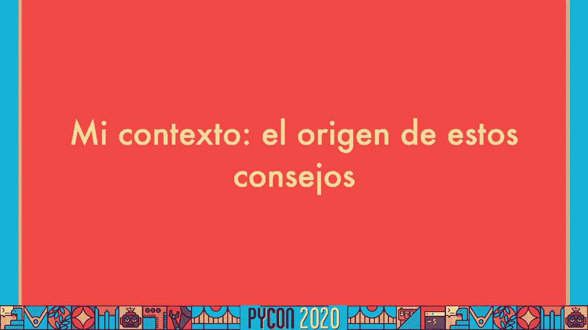
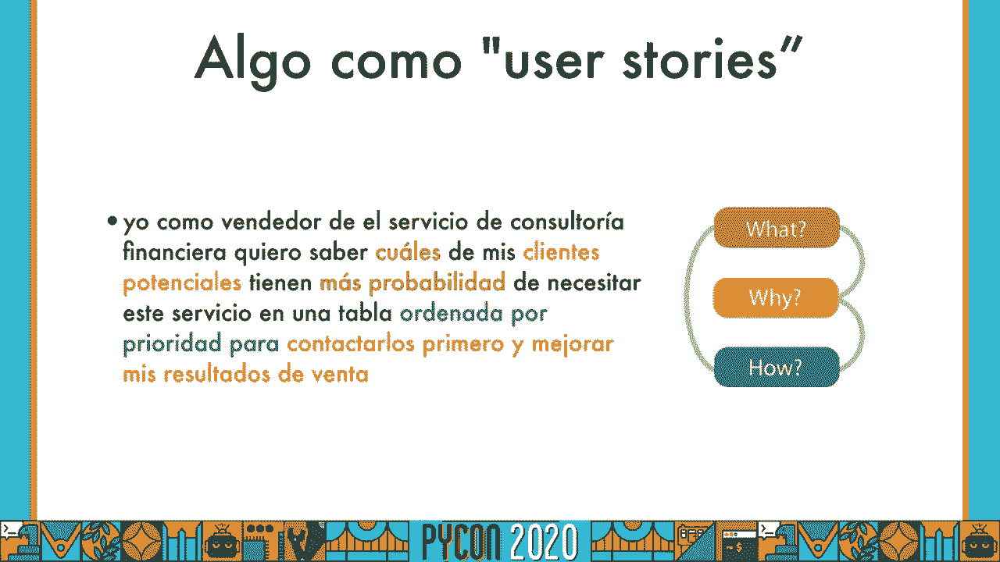
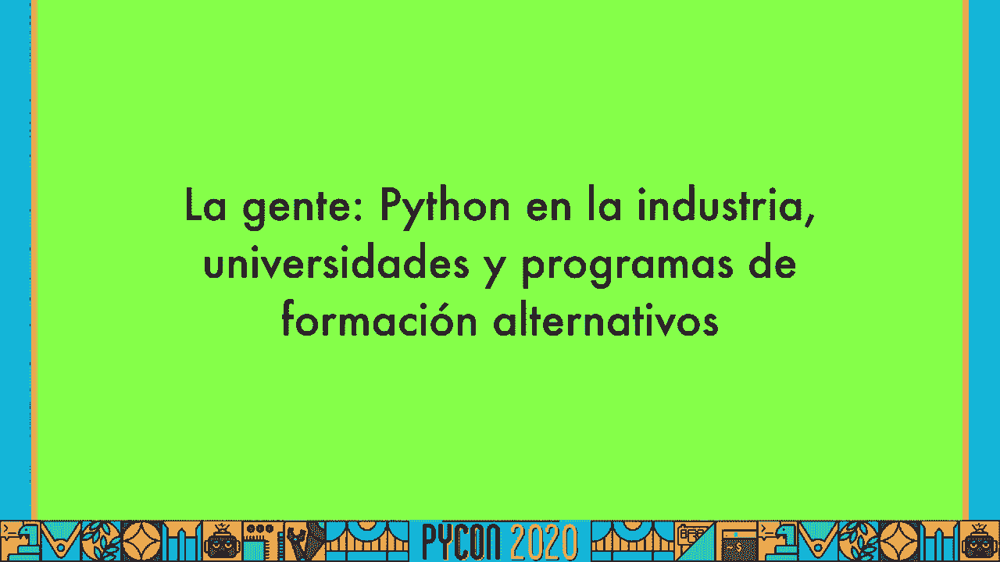
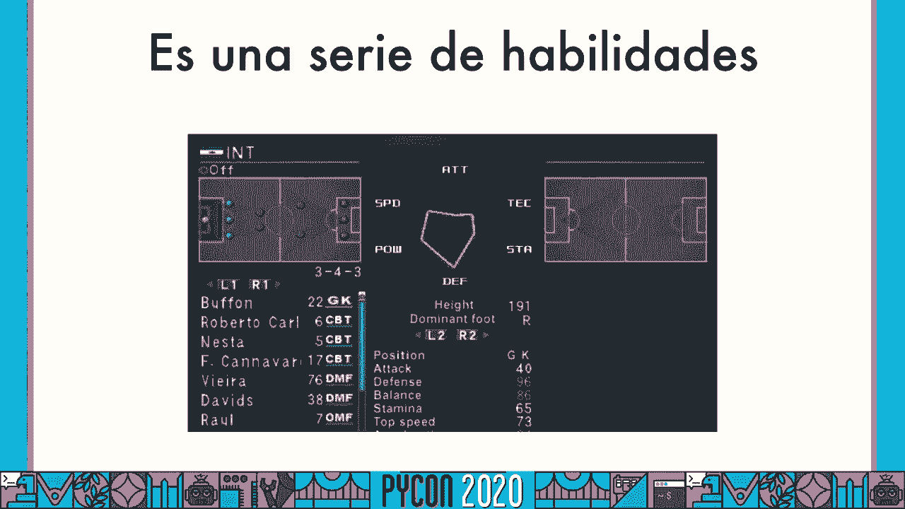

# P2：Charla David Mauricio Delgado Ruiz - Datos, Python y humanos - 程序员百科书 - BV1rW4y1v7YG

 (speaking in foreign language)。

 (speaking in foreign language)， (speaking in foreign language)， (speaking in foreign language)。 (speaking in foreign language)， (speaking in foreign language)， (speaking in foreign language)。

 (speaking in foreign language)， (speaking in foreign language)， (speaking in foreign language)。 (speaking in foreign language)， (speaking in foreign language)， (speaking in foreign language)。

 (speaking in foreign language)， (speaking in foreign language)， (speaking in foreign language)。 (speaking in foreign language)， (speaking in foreign language)， (speaking in foreign language)。

 (speaking in foreign language)， (speaking in foreign language)， (speaking in foreign language)。 (speaking in foreign language)， (speaking in foreign language)， (speaking in foreign language)。

 (speaking in foreign language)， (speaking in foreign language)， (speaking in foreign language)。 (speaking in foreign language)， With coffee and coffee and stuff， there is an area of special。

 with a more Traditional/Systemation version of this video。 people can use it directly in these areas， but also in their hands， so you can learn how to play it。

 So the top of this area is the first set in America， to learn how to play it。 The next step is Control， then Control， then Control， and then Control， then Control， and then 1。

000。 And then， we have a little bit of a video， and we have a little bit of a video。 and we have a little bit of a video， and we have a little bit of a video。

 and we have a little bit of a video， and we have a little bit of a video。 and we have a little bit of a video， and we have a little bit of a video。

 and we have a little bit of a video， and we have a little bit of a video。 and we have a little bit of a video， and we have a little bit of a video。

 Before I could do something more gently， the band one was together for a new community。 It was the American Self-Toxic American Self-Toxic American Self-Toxic American Self-Toxic American Self-T amen。

 Today everything in this world has to be made。 How is it take you to be able to stay there for what your life will be here？

 Because it's my team。 The most important thing to talk to is my particularly terrible self-taught。 I'm going to talk about this， but it's not。 I'm going to be able to be able to stay there for a new year。

 I'm going to be able to stay there for a new year。 I'm going to be able to stay there for a new year。

 I'm going to be able to stay there for a new year。 I'm going to be able to stay there for a new year。

 I'm going to be able to stay there for a new year。 I'm going to be able to stay there for a new year。

 I'm going to be able to stay there for a new year。 I'm going to be able to stay there for a new year。

 I'm going to be able to stay there for a new year。 I'm going to be able to stay there for a new year。

 I'm going to be able to stay there for a new year。 I'm going to be able to stay there for a new year。

 I'm going to be able to stay there for a new year。 I'm going to be able to stay there for a new year。

 I'm going to be able to stay there for a new year。 I'm going to be able to stay there for a new year。

 I'm going to be able to stay there for a new year。 I'm going to be able to stay there for a new year。

 I'm going to be able to stay there for a new year。 I'm going to be able to stay there for a new year。

 I'm going to be able to stay there for a new year。 I'm going to be able to stay there for a new year。

 I'm going to be able to stay there for a new year。 I'm going to be able to stay there for a new year。

 I'm going to be able to stay there for a new year。

 I'm going to be able to stay there for a new year。 I'm going to be able to stay there for a new year。

 I'm going to be able to stay there for a new year。 I'm going to be able to stay there for a new year。

 I'm going to be able to stay there for a new year。 I'm going to be able to stay there for a new year。

 I'm going to be able to stay there for a new year。 I'm going to be able to stay there for a new year。

 I'm going to be able to stay there for a new year。 I'm going to be able to stay there for a new year。

 I'm going to be able to stay there for a new year。 I'm going to be able to stay there for a new year。

 I'm going to be able to stay there for a new year。 I'm going to be able to stay there for a new year。

 I'm going to be able to stay there for a new year。 I'm going to be able to stay there for a new year。

 I'm going to be able to stay there for a new year。 I'm going to be able to stay there for a new year。

 I'm going to be able to stay there for a new year。 I'm going to be able to stay there for a new year。

 I'm going to be able to stay there for a new year。 I'm going to be able to stay there for a new year。

 I'm going to be able to stay there for a new year。 I'm going to be able to stay there for a new year。

 I'm going to be able to stay there for a new year。 I'm going to be able to stay there for a new year。

 I'm going to be able to stay there for a new year。 I'm going to be able to stay there for a new year。

 I'm going to be able to stay there for a new year。 I'm going to be able to stay there for a new year。

 I'm going to be able to stay there for a new year。 I'm going to be able to stay there for a new year。

 I'm going to be able to stay there for a new year。 I'm going to be able to stay there for a new year。

 I'm going to be able to stay there for a new year。 I'm going to be able to stay there for a new year。

 I'm going to be able to stay there for a new year。 I'm going to be able to stay there for a new year。

 I'm going to be able to stay there for a new year。 I'm going to be able to stay there for a new year。

 I'm going to be able to stay there for a new year。 I'm going to be able to stay there for a new year。

 I'm going to be able to stay there for a new year。 I'm going to be able to stay there for a new year。

 I'm going to be able to stay there for a new year。 I'm going to be able to stay there for a new year。

 I'm going to be able to stay there for a new year。 I'm going to be able to stay there for a new year。

 I'm going to be able to stay there for a new year。 I'm going to be able to stay there for a new year。

 I'm going to be able to stay there for a new year。 I'm going to be able to stay there for a new year。

 I'm going to be able to stay there for a new year。 I'm going to be able to stay there for a new year。

 I'm going to be able to stay there for a new year。 I'm going to be able to stay there for a new year。

 I'm going to be able to stay there for a new year。 I'm going to be able to stay there for a new year。

 I'm going to be able to stay there for a new year。 I'm going to be able to stay there for a new year。

 I'm going to be able to stay there for a new year。 I'm going to be able to stay there for a new year。

 I'm going to be able to stay there for a new year。 I'm going to be able to stay there for a new year。

 I'm going to be able to stay there for a new year。 I'm going to be able to stay there for a new year。

 I'm going to be able to stay there for a new year。 I'm going to be able to stay there for a new year。

 I'm going to be able to stay there for a new year。 I'm going to be able to stay there for a new year。

 I'm going to be able to stay there for a new year。 I'm going to be able to stay there for a new year。

 I'm going to be able to stay there for a new year。 I'm going to be able to stay there for a new year。

 I'm going to be able to stay there for a new year。 I'm going to be able to stay there for a new year。

 I'm going to be able to stay there for a new year。 I'm going to be able to stay there for a new year。

 I'm going to be able to stay there for a new year。 I'm going to be able to stay there for a new year。

 I'm going to be able to stay there for a new year。 I'm going to be able to stay there for a new year。

 I'm going to be able to stay there for a new year。 I'm going to be able to stay there for a new year。

 I'm going to be able to stay there for a new year。 I'm going to be able to stay there for a new year。

 I'm going to be able to stay there for a new year。 I'm going to be able to stay there for a new year。

 I'm going to be able to stay there for a new year。 I'm going to be able to stay there for a new year。

 I'm going to be able to stay there for a new year。 I'm going to be able to stay there for a new year。

 I'm going to be able to stay there for a new year。 I'm going to be able to stay there for a new year。

 I'm going to be able to stay there for a new year。 I'm going to be able to stay there for a new year。

 I'm going to be able to stay there for a new year。 I'm going to be able to stay there for a new year。

 I'm going to be able to stay there for a new year。 I'm going to be able to stay there for a new year。

 I'm going to be able to stay there for a new year。 I'm going to be able to stay there for a new year。

 I'm going to be able to stay there for a new year。 I'm going to be able to stay there for a new year。

 I'm going to be able to stay there for a new year。 I'm going to be able to stay there for a new year。

 I'm going to be able to stay there for a new year。 I'm going to be able to stay there for a new year。

 I'm going to be able to stay there for a new year。 I'm going to be able to stay there for a new year。

 I'm going to be able to stay there for a new year。 I'm going to be able to stay there for a new year。

 I'm going to be able to stay there for a new year。 I'm going to be able to stay there for a new year。

 I'm going to be able to stay there for a new year。 I'm going to be able to stay there for a new year。

 I'm going to be able to stay there for a new year。 I'm going to be able to stay there for a new year。

 I'm going to be able to stay there for a new year。 I'm going to be able to stay there for a new year。

 I'm going to be able to stay there for a new year。 I'm going to be able to stay there for a new year。

 I'm going to be able to stay there for a new year。 I'm going to be able to stay there for a new year。

 I'm going to be able to stay there for a new year。 I'm going to be able to stay there for a new year。

 I'm going to be able to stay there for a new year。 I'm going to be able to stay there for a new year。

 I'm going to be able to stay there for a new year。 I'm going to be able to stay there for a new year。

 I'm going to be able to stay there for a new year。 I'm going to be able to stay there for a new year。

 I'm going to be able to stay there for a new year。 I'm going to be able to stay there for a new year。

 I'm going to be able to stay there for a new year。 I'm going to be able to stay there for a new year。

 I'm going to be able to stay there for a new year。 I'm going to be able to stay there for a new year。

 I'm going to be able to stay there for a new year。 I'm going to be able to stay there for a new year。

 I'm going to be able to stay there for a new year。 I'm going to be able to stay there for a new year。

 I'm going to be able to stay there for a new year。 I'm going to be able to stay there for a new year。

 I'm going to be able to stay there for a new year。 I'm going to be able to stay there for a new year。

 I'm going to be able to stay there for a new year。 I'm going to be able to stay there for a new year。

 I'm going to be able to stay there for a new year。 I'm going to be able to stay there for a new year。

 I'm going to be able to stay there for a new year。 I'm going to be able to stay there for a new year。

 I'm going to be able to stay there for a new year。 I'm going to be able to stay there for a new year。

 I'm going to be able to stay there for a new year。 I'm going to be able to stay there for a new year。

 I'm going to be able to stay there for a new year。 I'm going to be able to stay there for a new year。

 I'm going to be able to stay there for a new year。 I'm going to be able to stay there for a new year。

 I'm going to be able to stay there for a new year。 I'm going to be able to stay there for a new year。

 I'm going to be able to stay there for a new year。 I'm going to be able to stay there for a new year。

 I'm going to be able to stay there for a new year。 I'm going to be able to stay there for a new year。

 I'm going to be able to stay there for a new year。 I'm going to be able to stay there for a new year。

 I'm going to be able to stay there for a new year。 I'm going to be able to stay there for a new year。

 I'm going to be able to stay there for a new year。 I'm going to be able to stay there for a new year。

 I'm going to be able to stay there for a new year。 I'm going to be able to stay there for a new year。

 I'm going to be able to stay there for a new year。 I'm going to be able to stay there for a new year。

 I'm going to be able to stay there for a new year。 I'm going to be able to stay there for a new year。

 I'm going to be able to stay there for a new year。 I'm going to be able to stay there for a new year。

 I'm going to be able to stay there for a new year。 I'm going to be able to stay there for a new year。

 I'm going to be able to stay there for a new year。 I'm going to be able to stay there for a new year。

 I'm going to be able to stay there for a new year。 I'm going to be able to stay there for a new year。

 I'm going to be able to stay there for a new year。 I'm going to be able to stay there for a new year。

 I'm going to be able to stay there for a new year。 I'm going to be able to stay there for a new year。

 I'm going to be able to stay there for a new year。 I'm going to be able to stay there for a new year。

 I'm going to be able to stay there for a new year。 I'm going to be able to stay there for a new year。

 I'm going to be able to stay there for a new year。 I'm going to be able to stay there for a new year。

 I'm going to be able to stay there for a new year。 I'm going to be able to stay there for a new year。

 I'm going to be able to stay there for a new year。 I'm going to be able to stay there for a new year。

 I'm going to be able to stay there for a new year。 I'm going to be able to stay there for a new year。

 I'm going to be able to stay there for a new year。 I'm going to be able to stay there for a new year。

 I'm going to be able to stay there for a new year。 I'm going to be able to stay there for a new year。

 I'm going to be able to stay there for a new year。 I'm going to be able to stay there for a new year。

 I'm going to be able to stay there for a new year。 I'm going to be able to stay there for a new year。

 I'm going to be able to stay there for a new year。 I'm going to be able to stay there for a new year。

 I'm going to be able to stay there for a new year。 I'm going to be able to stay there for a new year。

 I'm going to be able to stay there for a new year。 I'm going to be able to stay there for a new year。

 I'm going to be able to stay there for a new year。 I'm going to be able to stay there for a new year。

 I'm going to be able to stay there for a new year。 I'm going to be able to stay there for a new year。

 I'm going to be able to stay there for a new year。 I'm going to be able to stay there for a new year。

 I'm going to be able to stay there for a new year。 I'm going to be able to stay there for a new year。

 I'm going to be able to stay there for a new year。 I'm going to be able to stay there for a new year。

 I'm going to be able to stay there for a new year。 I'm going to be able to stay there for a new year。

 I'm going to be able to stay there for a new year。 I'm going to be able to stay there for a new year。

 I'm going to be able to stay there for a new year。 I'm going to be able to stay there for a new year。

 I'm going to be able to stay there for a new year。 I'm going to be able to stay there for a new year。

 I'm going to be able to stay there for a new year。 I'm going to be able to stay there for a new year。

 I'm going to be able to stay there for a new year。 I'm going to be able to stay there for a new year。

 I'm going to be able to stay there for a new year。 I'm going to be able to stay there for a new year。

 I'm going to be able to stay there for a new year。 I'm going to be able to stay there for a new year。

 I'm going to be able to stay there for a new year。 I'm going to be able to stay there for a new year。

 I'm going to be able to stay there for a new year。 I'm going to be able to stay there for a new year。

 I'm going to be able to stay there for a new year。 I'm going to be able to stay there for a new year。

 I'm going to be able to stay there for a new year。 I'm going to be able to stay there for a new year。

 I'm going to be able to stay there for a new year。 I'm going to be able to stay there for a new year。

 I'm going to be able to stay there for a new year。 I'm going to be able to stay there for a new year。

 I'm going to be able to stay there for a new year。 I'm going to be able to stay there for a new year。

 I'm going to be able to stay there for a new year。 I'm going to be able to stay there for a new year。

 I'm going to be able to stay there for a new year。 I'm going to be able to stay there for a new year。

 I'm going to be able to stay there for a new year。 I'm going to be able to stay there for a new year。

 I'm going to be able to stay there for a new year。 I'm going to be able to stay there for a new year。

 I'm going to be able to stay there for a new year。 I'm going to be able to stay there for a new year。

 I'm going to be able to stay there for a new year。

 I'm going to be able to stay there for a new year。 I'm going to be able to stay there for a new year。

 I'm going to be able to stay there for a new year。 I'm going to be able to stay there for a new year。

 I'm going to be able to stay there for a new year。 I'm going to be able to stay there for a new year。

 I'm going to be able to stay there for a new year。 I'm going to be able to stay there for a new year。

 I'm going to be able to stay there for a new year。 I'm going to be able to stay there for a new year。

 I'm going to be able to stay there for a new year。 I'm going to be able to stay there for a new year。

 I'm going to be able to stay there for a new year。 I'm going to be able to stay there for a new year。

 I'm going to be able to stay there for a new year。 I'm going to be able to stay there for a new year。

 I'm going to be able to stay there for a new year。 I'm going to be able to stay there for a new year。

 I'm going to be able to stay there for a new year。 I'm going to be able to stay there for a new year。

 I'm going to be able to stay there for a new year。 I'm going to be able to stay there for a new year。

 I'm going to be able to stay there for a new year。 I'm going to be able to stay there for a new year。

 I'm going to be able to stay there for a new year。 I'm going to be able to stay there for a new year。

 I'm going to be able to stay there for a new year。 I'm going to be able to stay there for a new year。

 I'm going to be able to stay there for a new year。 I'm going to be able to stay there for a new year。

 I'm going to be able to stay there for a new year。 I'm going to be able to stay there for a new year。

 I'm going to be able to stay there for a new year。 I'm going to be able to stay there for a new year。

 I'm going to be able to stay there for a new year。 I'm going to be able to stay there for a new year。

 I'm going to be able to stay there for a new year。 I'm going to be able to stay there for a new year。

 I'm going to be able to stay there for a new year。 I'm going to be able to stay there for a new year。

 I'm going to be able to stay there for a new year。 I'm going to be able to stay there for a new year。

 I'm going to be able to stay there for a new year。 I'm going to be able to stay there for a new year。

 I'm going to be able to stay there for a new year。 I'm going to be able to stay there for a new year。

 I'm going to be able to stay there for a new year。 I'm going to be able to stay there for a new year。

 I'm going to be able to stay there for a new year。 I'm going to be able to stay there for a new year。

 I'm going to be able to stay there for a new year。 I'm going to be able to stay there for a new year。

 I'm going to be able to stay there for a new year。 I'm going to be able to stay there for a new year。

 I'm going to be able to stay there for a new year。 I'm going to be able to stay there for a new year。

 I'm going to be able to stay there for a new year。 I'm going to be able to stay there for a new year。

 I'm going to be able to stay there for a new year。 I'm going to be able to stay there for a new year。

 I'm going to be able to stay there for a new year。 I'm going to be able to stay there for a new year。

 I'm going to be able to stay there for a new year。 I'm going to be able to stay there for a new year。

 I'm going to be able to stay there for a new year。 I'm going to be able to stay there for a new year。

 I'm going to be able to stay there for a new year。 I'm going to be able to stay there for a new year。

 I'm going to be able to stay there for a new year。 I'm going to be able to stay there for a new year。

 I'm going to be able to stay there for a new year。 I'm going to be able to stay there for a new year。

 I'm going to be able to stay there for a new year。 I'm going to be able to stay there for a new year。

 I'm going to be able to stay there for a new year。 I'm going to be able to stay there for a new year。

 I'm going to be able to stay there for a new year。 I'm going to be able to stay there for a new year。

 I'm going to be able to stay there for a new year。 I'm going to be able to stay there for a new year。

 I'm going to be able to stay there for a new year。 I'm going to be able to stay there for a new year。

 I'm going to be able to stay there for a new year。 I'm going to be able to stay there for a new year。

 I'm going to be able to stay there for a new year。 I'm going to be able to stay there for a new year。

 I'm going to be able to stay there for a new year。 I'm going to be able to stay there for a new year。

 I'm going to be able to stay there for a new year。 I'm going to be able to stay there for a new year。

 I'm going to be able to stay there for a new year。 I'm going to be able to stay there for a new year。

 I'm going to be able to stay there for a new year。 I'm going to be able to stay there for a new year。

 I'm going to be able to stay there for a new year。 I'm going to be able to stay there for a new year。

 I'm going to be able to stay there for a new year。 I'm going to be able to stay there for a new year。

 I'm going to be able to stay there for a new year。 I'm going to be able to stay there for a new year。

 I'm going to be able to stay there for a new year。 I'm going to be able to stay there for a new year。

 I'm going to be able to stay there for a new year。 I'm going to be able to stay there for a new year。

 I'm going to be able to stay there for a new year。 I'm going to be able to stay there for a new year。

 I'm going to be able to stay there for a new year。 I'm going to be able to stay there for a new year。

 I'm going to be able to stay there for a new year。 I'm going to be able to stay there for a new year。

 I'm going to be able to stay there for a new year。 I'm going to be able to stay there for a new year。

 I'm going to be able to stay there for a new year。 I'm going to be able to stay there for a new year。

 I'm going to be able to stay there for a new year。 I'm going to be able to stay there for a new year。

 I'm going to be able to stay there for a new year。 I'm going to be able to stay there for a new year。

 I'm going to be able to stay there for a new year。 I'm going to be able to stay there for a new year。

 I'm going to be able to stay there for a new year。 I'm going to be able to stay there for a new year。

 I'm going to be able to stay there for a new year。 I'm going to be able to stay there for a new year。

 I'm going to be able to stay there for a new year。 I'm going to be able to stay there for a new year。

 I'm going to be able to stay there for a new year。 I'm going to be able to stay there for a new year。

 I'm going to be able to stay there for a new year。 I'm going to be able to stay there for a new year。

 I'm going to be able to stay there for a new year。 I'm going to be able to stay there for a new year。

 I'm going to be able to stay there for a new year。 I'm going to be able to stay there for a new year。

 I'm going to be able to stay there for a new year。 I'm going to be able to stay there for a new year。

 I'm going to be able to stay there for a new year。 I'm going to be able to stay there for a new year。

 I'm going to be able to stay there for a new year。 I'm going to be able to stay there for a new year。

 I'm going to be able to stay there for a new year。 I'm going to be able to stay there for a new year。

 I'm going to be able to stay there for a new year。 I'm going to be able to stay there for a new year。

 I'm going to be able to stay there for a new year。 I'm going to be able to stay there for a new year。

 I'm going to be able to stay there for a new year。 I'm going to be able to stay there for a new year。

 I'm going to be able to stay there for a new year。 I'm going to be able to stay there for a new year。

 I'm going to be able to stay there for a new year。 I'm going to be able to stay there for a new year。

 I'm going to be able to stay there for a new year。 I'm going to be able to stay there for a new year。

 I'm going to be able to stay there for a new year。 I'm going to be able to stay there for a new year。

 I'm going to be able to stay there for a new year。 I'm going to be able to stay there for a new year。

 I'm going to be able to stay there for a new year。 I'm going to be able to stay there for a new year。

 I'm going to be able to stay there for a new year。 I'm going to be able to stay there for a new year。

 I'm going to be able to stay there for a new year。 I'm going to be able to stay there for a new year。

 I'm going to be able to stay there for a new year。 [BLANK_AUDIO]。
