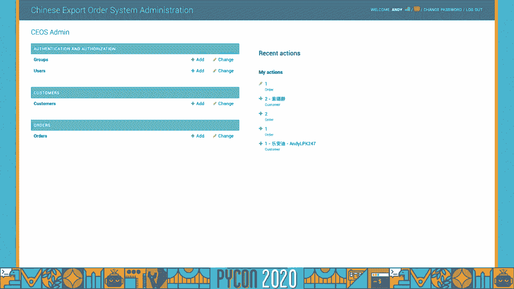
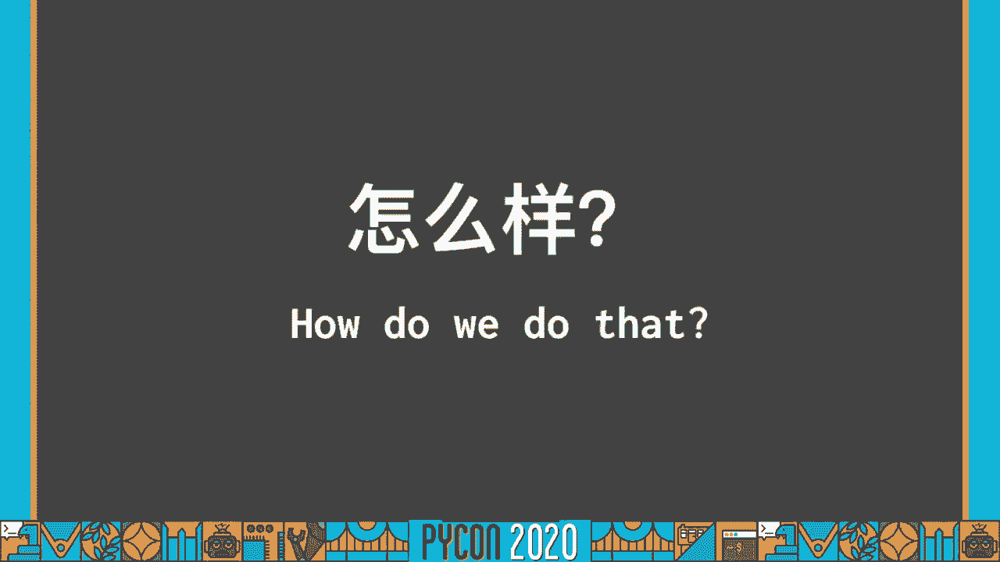
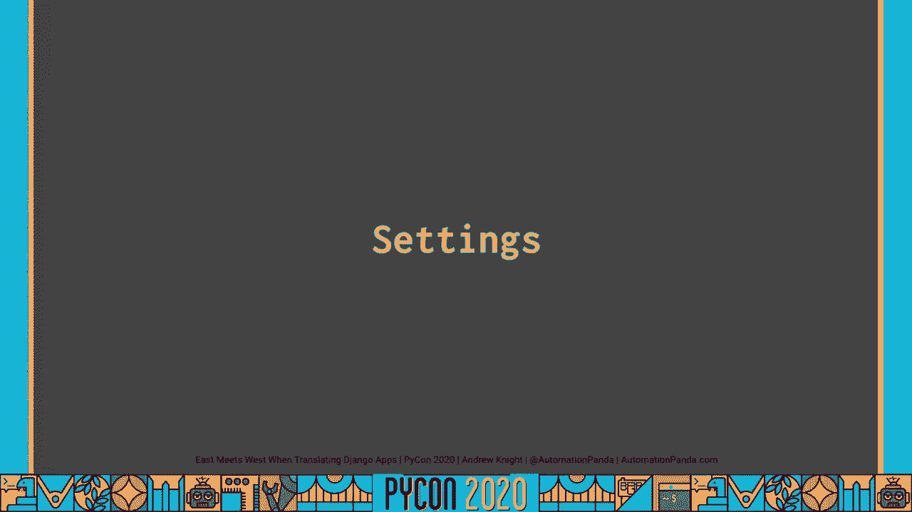
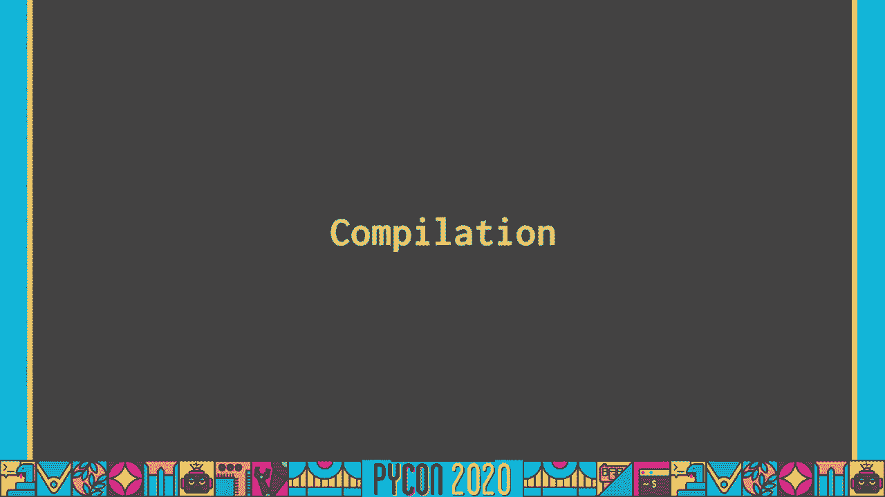
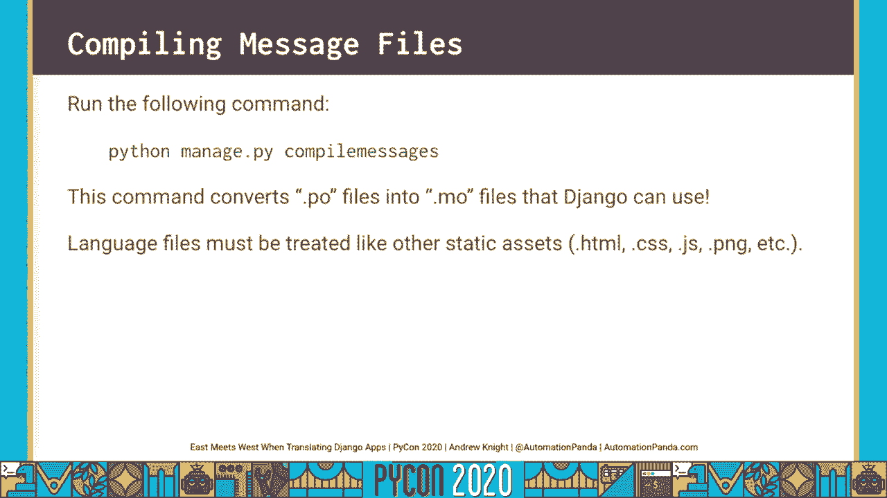

# P21：Talk Andrew Knight - East Meets West When Translating Django Apps - 程序员百科书 - BV1rW4y1v7YG

你听懂我刚才说的话了吗？我说的是普通话，当你不明白别人在告诉你什么时，你不感到沮丧吗，因为你不懂他们的语言，语言障碍在今天应该不是问题，我将给大家讲一个我们家如何克服语言障碍的故事。当我为我们的小企业开发一个 django应用程序时，我们再做一次介绍，大家好，我叫安迪•奈特，但简称潘迪，我是一个软件工程师和测试 谁开发解决方案的测试问题，COM，如你所见，我是美国人，但是我的妻子。

杰西卡，她妈妈是中国人，杰西卡曾经在这些大的可怕的电子表格中跟踪所有的订单，我花了很多时间，所以我想出了一个更好的解决办法，使用 django web框架，我创建了数据模型。在所有的订单和客户中使用 django orm，我把管理网站作为我们追踪订单的前端，我把整件事都上传到了希罗库那里，我甚至把图像存储在亚马逊的3，现在，这个应用程序只有一个问题，你看。

杰西卡是我们家唯一会说两种语言的人，我不会说中文，妈妈也不会说英语，日复一日，我们最通用的语言是中式英语，所以我们所有人使用这个应用程序，我今天不得不把它从英语翻译成普通话，我将为您简要演示该应用程序。然后我会告诉你如何，我用姜戈的框架做了翻译，我为我们的小生意创造了，这里显示的是管理网站，我把它作为我自己事实上的前端，我妻子和她妈妈，你可以看到我们有客户的数据模型，以及订单，我们再看看订单。

没什么不寻常的，这里，只是 django记录的标准视图，所有的田地，我们有行动过滤器，标题，所有标准的东西，然而，我想提请大家注意右上角，在这里你可以看到，我添加了标记小部件。你会注意到整页都被翻译成了普通话，中文标题，行动，数据标签，即使是过滤器，如果我打开其中一个订单，你会看到即使是记录表单也已经完全转换到它的按钮上了，连我都看不懂这个，因为我看不懂中文。

如果我想把它改回英语，很漂亮。

那么我是如何将我的应用程序在英语和汉语之间进行翻译的呢？谢天谢地，姜戈让它很容易与他们的开箱电池。

在 django应用程序中进行翻译的工作流程有四个步骤，有些步骤比其他步骤花更多的时间，前两个很简单，第一，我们需要添加特定的应用程序设置来启用翻译，第二次，我们需要添加适当的路由。以便url将加载具有适当区域设置的页面，第三步可能是最密集的工作，在翻译应用程序中标记所有可见的字符串，我的意思是，出现在用户面前的每一个字符串，第四，最后，我们需要提供翻译本身。

并将它们编译成语言文件，我今天要讲的一切都记录在 django文档页面上，所以如果你一个人忙着翻译，强烈建议你在官方文件上快速搜索一下，因为它们很有帮助，在我们深入挖掘这四个步骤之前。让我们定义我们的术语，这样我们就知道我们在谈论什么，术语令牌或字符串指的是要在应用程序中进行转换的文本字符串，它可以位于 python应用程序代码或 django模板中。

术语翻译指的是将这些字符串从一种语言映射到另一种语言，在我的 django申请中，我所有的弦乐都是以英语为主要语言写的，然后我提供了从英语到普通话的翻译，中文，本土化一词，它也被缩写为 l ten n。指的是将应用程序适应于地区，现在一个区域是一个目标区域，指支持本地化的开发工作和工具，国际化可以指，说，Django翻译框架，而本地化指的是这个过程的工件，例如中文的语言档案。

有时本地化和国际化可以互换使用，但其中有一个细微差别，框架和工件之间的区别，所以在我们继续之前 我想说清楚，如果我们看看我们的工作流如何区分国际化和本地化，你可以这样想，前三个步骤，应用程序设置，网址。路由，标记字符串都属于国际化的范畴，因为这些都是django框架为您提供的工具，这个过程的第四步，语言文件本身及其翻译的汇编，什么可以被认为是本地化，因为他们的目标是特定的地区，不管那是美国的，英文。

还是普通话，中文，或任何其他语言。

现在我们来看一下工作流程中的四个步骤，从应用程序设置开始，PY文件。

我建议将 locale中间件添加到中间件列表中，不需要本地中间件，但这非常，非常有用，因为它使django能够自动检测语言偏好，如果添加本地中间件，然后，Django将按照这个顺序检查首选项，第一。它会检查你的 url语言前缀，如果找不到，然后它会检查语言饼干，如果没有语言饼干，第三，它将在请求中查找 accept language http header，最后如果这三个都没有找到。

然后它将回到设置文件中的语言代码所设置的默认语言，区域中间件的顺序很重要，它需要出现在会话中间件之后，因为它使用会话，但它也需要走在公共中间件之前，因为它使用url前缀，下一个最重要的设置是语言代码。语言代码为 django 应用程序设置默认语言，在我的例子中，默认语言是美式英语，语言代码的格式必须是接受语言 http头代码，如果你不确定那是什么，你可以很容易地在网上查找它们。

下一个设置启用要设置的地区的翻译和日期格式，两者都用i 18n，用l ten n表示真音符，如果你知道你的应用程序不会做任何翻译，您可以将这两个设置为false，以获得一个小小的性能提升。我强烈建议设置语言的，此设置给出的语言列表，限制可供翻译的语文，如果您没有在这里提供语言列表，或者更确切地说，尝试翻译用户传入的任何语言，例如，在我的申请中，我只有英语和汉语两种语言。

如果一个用户试图将我的应用程序翻译成法语，因为我把我的语言设置在这里，他们会收到一个错误，如果我不在这里设置语言，该应用程序将尝试将应用程序翻译成法语，最有可能的是它会用英语显示一切。因为没有法语地区文件可以被黑，这将使应用程序看起来非常糟糕，并有点误导，所以最好设置语言列表，因此，只有可用的语言才能进行翻译，最后，我建议您设置的最后一个设置是区域设置路径。

区域设置路径为语言文件提供目录列表，如果没有指定，Django将在每个应用程序文件夹中寻找一个名为 quote unquote locale的目录，然而，以我的经验。我发现我喜欢在整个应用程序中分享我的语言翻译，为了简单起见，我将在基于项目的目录下创建一个名为 locale的目录，把我所有的区域文件都放进去。

这就是 django的翻译设置，很简单，让我们来看看第二步网址。

语言前缀可以指示直接在 url中加载页面所需的语言，注意我这里的三个网址，第一个有英语的语言代码，前缀到页面的资源路径上，这将加载英文页面，另一个有 zh dash hans作为语言代码。那是简体中文的语言代码，这应该加载页面和简化的中文，第三个 url没有语言前缀，默认情况下，它应该加载我的默认语言，因为我的情况是英语，在 urls py文件中配置 url语言前缀路由非常简单。

从路径列表中的 django conf urls i导入 i n patterns函数，您将以相同的方式指定路径列表，否则，最后我们需要在底部再添加一个设置，因此，在没有指定前缀的情况下。将使用默认语言，所以我们设置前缀，默认语言等于 false。

工作流程的前两个步骤完成后，让我们进入第三根弦，这可能是工作量最大的一次。

就像我之前提到的，每个公开可见的字符串都需要标记 以便翻译，不管是在 python代码中 还是在 django模板中标记字符串以进行转换，在蟒蛇密码中。我们需要在这里使用 django uti翻译的 get text函数，我已经展示了进口，作为惯例，我把它化名为一个下划线字符，你会经常看到，因为每次键入一个下划线比键入 get text函数要短得多。

这里我还有一个示例视图，在这里我返回一些输出，这将立即将这个字符串从主语言转换为任何适当的辅助语言，无论何时它被执行，还有第二个转换函数，叫做get text下划线lazy，此函数执行惰性翻译。当在上下文中访问字符串时，将完成惰性转换，例如当它被展示或观看时，在 python代码中调用转换函数时不需要，对于像模型这样的情况，需要懒惰的翻译，这是一个叫"我的东西"的模型的例子。

我懒洋洋地翻译了名字字段之类的东西，帮助文本和一些元数据，如果您尝试使用 get text函数 而不是 get text惰性函数来进行这些转换，不行的，你最终会犯这个错误，我把头发拔了一个小时。试图弄清楚为什么翻译有效，别这样，对模型使用懒惰的翻译，就像 get text函数一样，获取文本下划线惰性通常用下划线别名，在 django模板中翻译字符串，使用 trans标记。

您可以转换字符串文字或变量表达式，只是要小心变量表达式，因为在尝试编译消息文件时，它们可能不会被选中，如果你想为未来准备翻译，但现在跳过它们，您可以添加no op字，这样字符串将被保留在原始语言中。无论如何，您还可以在 django模板中进行块翻译，块翻译甚至可以有占位符，例如尝试在字符串中替换一个值，您还可以翻译管理站点，就像我为我的姜戈网所做的那样，这里有一些我从艰苦的过程中学到的建议，首先。

对所有字符串使用惰性翻译，使用懒惰的翻译无伤大雅，它可以保护你不犯错误，尤其是模特，第二，注意管理模板已经有了几种语言的翻译，我想我最近读了发布说明，他们刚刚添加了使用贝克语言，挺酷的。当尝试为应用程序和模型翻译字段时，确保为详细的 name字段 而不是 name字段提供翻译，尝试翻译 name字段 可能会导致一些意想不到的行为和错误，第四，保持你的网站看起来原始和干净。

确保为诸如 admin之类的标题提供翻译，网站索引标题，网站标题和网站标题，行政，这里有一个小链接。

翻译工作流程的第四个也是最后一个步骤是编译意义，提供所有字符串的翻译，并将它们编译成django可以使用的消息文件。

第一步是使消息文件，消息文件将保存应用程序中所有字符串的转换，以创建消息文件，从命令行运行此命令，制作消息，再加上破折号选项，提供目标翻译语言的地区代码。此命令搜索 django应用程序中所有可翻译的字符串，在 python代码和 django模板中，它会做两件事中的一件，如果没有语言文件存在，那么它将在locale路径目录下创建一个新的语言文件。

或者将找到的所有新标记添加到 locale下的现有语言文件中，作为警告，此命令需要一个地区名称，不是语言代码，地区名称和语言代码是两码事，因此，尽管简体中文的语言代码是小写的zh dash hans。地区代码是小写 c h下划线大写 h，别犯那个错误，因为我在那件事上损失了大约一个小时，为了让消息，命令将生成po文件，这些文件是消息文件或目标区域设置的语言文件，右边是一个消息文件的示例，您将看到。

每个字符串的第一行是一个注释，指示该字符串在代码中的来源，消息 id字段是目标字符串，消息字符串字段是给定地区的该字符串的转换，Django不够聪明，无法将任意字符串自动转换为所需的语言。所以当我开发我的应用程序时，我写了些代码，我将重新生成我的消息文件，然后我会让我妻子为新的弦乐提供翻译，在翻译时，可能会忽略其中一些字符串，每当一个字符串被标记为注释的标签时，逗号模糊。

这意味着詹戈可能知道根据一些类似的措辞翻译可能是什么，但并不乐观，所以你需要手动进去检查，Django还将忽略任何空消息字符串值的转换，如果您不能提供一个明确的翻译。Django会简单地留下字符串 不翻译，最后，如果有任何缺失的翻译，例如使用 get text标记的字符串，但在消息文件中没有找到条目，该字符串将以其原始语言保留，一旦在那些 po文件中提供了翻译。

是时候编译它们了，所以 django可以用它们来编译消息文件，运行以下命令，此命令将所有地区目录中的所有 po文件转换为 django可以使用的 dot o文件。必须像对待任何其他静态资产一样对待 dot o语言文件，就像 html一样，CSS。

Javascripts，和图像文件，这四个步骤就是我们如何翻译 django应用程序，不是太难，只是一些基础工作，所以现在让我们看大局，为什么翻译应用程序很重要。

这里有一些重要的观点要提出，最初的翻译应该把人们聚集在一起，我在成长的过程中非常清楚这一点，我父亲是世界语言教师，他在巴尔的摩郡教西班牙语和德语，作为一个成年人，住在一个我们说英语的家庭里，中文和英文。因此，翻译和理解语言对我们作为一个家庭保持联系非常非常重要，在软件世界也很重要，因为并非所有的用户都将英语作为他们的第一语言或任何语言，因此，我们需要翻译来帮助弥合这些差距，让人们团结在一起。

我希望你能看到我们的四步工作流程，翻译相当容易实现，他们只是乏味，你得输入设置和网址前缀，然后你必须通过标记和翻译每一个字符串，但这并没有什么可怕的挑战性。尤其是当你有一个像 django那样的好的国际化框架时，而且，我希望很明显，从应用程序开发的一开始就翻译它们会更容易，而不是在开发一段时间后，你可能想知道人工智能如何帮助翻译，我们仍然需要一个人来校对。

以确保翻译是有意义的，九十，百分之九十五的时间，可能会有一些情况，比如俚语，或者需要更大背景的东西，让人进来，把边缘磨平，第四，你可能想知道及时翻译，例如。如果你使用 google chrome作为你的网页浏览器，你导航到另一个国家的页面，chrome很可能会问你是否想把页面翻译成你的母语，它会及时翻译你看到的所有文本，这将使你大部分的方式。

但你可能已经注意到，并不是每个单词或短语都能被完美地翻译出来，你能想出来的，但你知道这不是，所以这就是为什么我会说不是所有的应用程序都可以或应该及时使用这样的翻译，当然，在某些情况下。您希望应用程序具有预先设置的翻译是正确的，这样你就能看到准确的译文，而且，及时翻译 确实需要额外的费用，和执行，因为它需要调用一些其他的服务，通过一堆任意的字符串。

而我们在 django框架中看到的使用静态翻译文件的模式，尽管加载新的翻译需要一点时间，它还在那里，已经决定了，更严重的是，译者有道德义务纠正，准确的翻译，人们需要翻译来获得其他语言的信息。否则他们将无法获得这些信息，译文的真实性和正确性是非常重要的，这张照片早在今年2月就在中国社交媒体上疯传，和其他几个喜欢它的人一起，被称为社区传播，这个标题对任何懂英语的人来说都是简单明了的，然而。

这张图片与顶部黄色的中文译本一起流传，是一个明显的误译，不幸的是，在中国，绝大多数看到这张照片的人可能不懂英语，很可能被误译所愚弄，更可悲的是，这个误译几乎可以肯定是故意的，不是偶然的，所有这些都要说。作为蟒蛇，我们在道义上有责任以合乎道德的方式使用所有技术，即使是像翻译这样看似平淡无奇或无伤大雅的东西，这就是我所说的姜戈翻译，我希望你们都从中得到了很多价值，COM，好好翻译吧。

