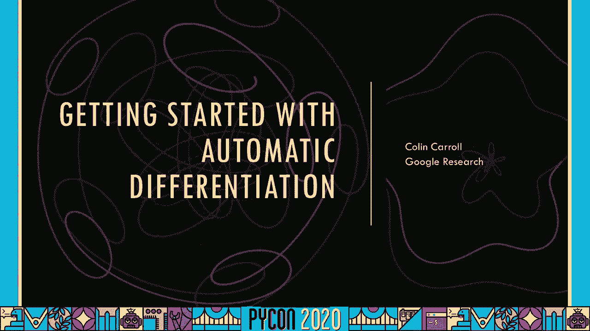

# P28：Talk Colin Carroll - Getting started with automatic differentiation - 程序员百科书 - BV1rW4y1v7YG

我打电话给卡罗尔，我是软件工程师和数据科学家，这个演讲的目的是提供一个自动区分的邀请，在蟒蛇里，这些是现成的、易于使用的算法集合，我希望你能用它们来写有表现力的东西，今天灵活而有创意的节目。我们将从一开始就得到一些直觉，导数及其高维兄弟，梯度，我们将展示一些自动差分的用例，我在这里给你的真正目标，虽然，是实验和娱乐，蟒蛇是一种快乐的语言，有很多库可以让自动差异化，使用的乐趣。这张幻灯片的背景实际上是一个有趣的螺旋，就像在右手边煮的一样，左边螺旋的导数，我觉得计算艺术很有趣，自动区分是一个额外的工具。

所以我们开始讨论导数，函数的导数是该函数的变化率，这个想法在科学上很重要，例如，函数最大化或最小化的高效算法，总的来说，导数比函数本身提供了更多的信息，向北走，我们应该从 python中的数字程序开始。因为这些都是自动分化的输入，所有的数字程序都是有数字的，进去把数字拿出来，输入可以是一个或多个数字，但对于大多数自动差分程序来说，输出应该是一个单一的数字，如果我们有一个输入和一个输出。我们可以看一下这些函数的图，具体地说，我们把输入放在x轴上，输出放在y轴上，这是垂直轴，这是一个函数 f等于 x的平方，所以我只是平方每一个输入，两转四负，三转九成图，实数太多了。到处都无法计算我们的函数，但我们可以用50或100个点来评估，了解发生了什么，有很多，当然，很多数字程序，这个是 x的正弦，它是三角学的一个函数，告诉你圆和三角形，如你所见，这是一个需要实现的基本功能。

因为它已经内置到Numpy中了，双曲正切10h也是一个有趣的函数，我们稍后再看，因为导数也很有趣，那么什么是导数，再来一次，这是微积分中的一个概念 它给出了函数的变化率，对于输入的微小变化。输出在多大程度上改变了可视化的方式，这就是图在某一点上的斜率，上涨除以跑步，当我们跑得越来越小，看看上升幅度 看看它们在微积分中的比例，我们讨论了当运行到零的时候，极限的想法，你可以在左边的图中看到。关于如何计算导数的想法，我们让跑步变得越来越小，继续计算那个比率，在这条线上的每一点，我们可以计算出相同的比率来计算出斜率，这是导数，实际上我们可以用它来快速计算导数，只是用蟒蛇。我们评估了一小段距离外的 epsilon的作用，我将称之为跑步，然后我们计算上升，这是函数在 x和 x之间的变化，再加上那一小段距离，所以我们把斜率，上升幅度除以上升幅度，另请注意。

这是一个吃掉一个函数并输出一个函数的函数，它输出的功能回答了这个问题，变化率是多少，在这一点上，结果是 x平方的导数是2，我们的近似值与之相当接近，在这里我们将我们的函数应用于平方函数。所以这个被暗示性地命名为2的 x本身就是一个函数，它是 x平方的近似导数，结果发现，你可以计算出 x平方的导数是 x的2倍，我们的近似值与之相当接近，如果你输入两个，你会得到39。99，如果你输入负三。你会得到负五点九九，这次谈话的目的是，当然不是教你如何手工计算导数，不过，我可以向你保证这很有趣，几乎是相反的，自身执行存在一些问题，在更高的维度上，它不能很好地缩放，自动分化解决了这两个问题，事实上。我应该强调第二个方面，在我们以前的实现中，它在更高的维度上扩展得很好，如果我们有一个有100万个参数的函数，我们得对我们的功能进行一百万次的评估，为了像以前那样用自动微分计算导数，我们只需要评估，一次。

所以现在有一些你可以使用的 python库，为了计算这些精确的导数 在数千或数百万的维度，这次演讲的目的是给你一些如何做到这一点的例子，你能用导数做什么，一个例子是这张幻灯片的背景，这是一种计算艺术。我拿了一条曲线，画了一个导数，从行进的方向向前，我认为这是一个有趣的例子，说明你可以用自动差分做什么，在我们进入更高维的导数之前，我想快速地绕道而行，向你们展示自动微分是什么样子的，在实践中。实现自动微分的一个库叫做Jaxx，这里是如何计算一个函数的导数，使用 jax库，你应该注意的事情，你用的是 jax版本的 numpy，有点厚脸皮，他们输入 jax numpy作为 np。它有一个与我们更熟悉的 numpy相同的 api，在没有的地方，他们认为这是一个错误，JAX还提供了一些更多的功能，就像在我们自己的实现中，格拉德函数将返回它所得到的任何东西的导数。

我们一会儿要讨论梯度是多少，但现在，假设 grad函数返回输入的导数，与杰克模仿麻木的 API的目标一致，JAX还可以很好地使用 matplotli之类的绘图库，之前我说过函数的输出应该是一个单数。我实际上一直在玩得有点快，为了策划，但 JAX会抛出一个例外，如果我传递一个数向量，杰克提供了另一张帮手 v地图，它是矢量化地图的简称，将梯度应用到这里 代码示例中 向量中的每个元素。NP lindspace提供了一个数的向量，从负二开始上升到正二，所以我可以把它转换成一个函数，比如10h，所以梯度被应用到，指向向量 t中的每个元素，我们可以继续策划这个，如此简单。它让我们思考我们的问题，而不是我们如何实现我们的代码，例如，从这个图我们可能会注意到我们的导数只是一个函数，如果我们把格拉德应用到我们的导数上 会发生什么，好吧，我们会得到一种叫做二阶导数的东西。

结果证明我们可以继续这样做，那个，我们得到了，所以这里有这样做的代码，我们只是不断地展开研究生的功能，所以 f从双曲线切线开始，我们会绘制出，然后我们设 f等于自身的梯度，所以我们会得到一阶导数。二阶导数，以此类推 直到四阶导数，一旦我们把它画出来，它看起来是这样的，这可能是压倒性的，我们可能没有真正考虑四阶导数在这里是什么意思，获得直觉的一个方法是 如果你的原始函数在增加，我们期望导数是正的。如果你的原始功能在下降，我们预计导数是负数，更高的衍生品 谈论变化率的变化有多快，作为一个简短的旁白，这是来自美国数学学会通知的精彩剪报，这和我们在这里做的事情很有关系，通货膨胀是货币消费价值的变化率。所以通货膨胀率的增长率是我们的二阶导数，如果它在减少，我们说的是三阶导数，我今天主要用 jacks来代码段，以及制作所有的插图和动画，因为它对这些例子很有效，但蟒蛇是一个庞大的生态系 统。

另外两个流行的实现自动区分的库是 tensorflow和 pi torch，这些库针对不同的用例，所以代码看起来有些不同，尤其是，取双曲正切的导数看起来有点笨拙，在张力流和π炬中。这是两个奇妙而强大的库，虽然，我希望你能尝试一下，这是一个他们真正闪耀的地方，这里显示了张量流，它使用一种叫做梯度磁带的东西来观察操作发生时的情况，然后他们把这些操作的导数。所以在我们离开上下文管理器之后，我们可以问磁带 y相对于 t的梯度是多少，剧情是这样的，它看起来和贾克斯的一模一样，或者我们将看到的那个，黑线是双曲正切，蓝线是导数，现在 pi火炬看起来很像 jax。但是我们必须在一些地方注释代码，准确的说我们要对，以及产出的规模，你可以看到要求毕业等于真的，你可以看到一些电话分离，然后你可以看到 grad输出参数，当我们召唤毕业生，Y和 T，再来一次，2。

这就是我们先前所讲的那个情节，请记住，这些库实现的是相同的算法集合，所以你可以选择最适合你需要的，我们现在讨论更高维的导数，每个经度对对应一个高度，我们可以把它看作从二维到一维的函数。所以你输入两个数字 然后输出一个数字，图为新罕布什尔州怀特山脉地图，右上角白色的山峰是华盛顿山，是新罕布什尔州的最高点，一次非常美丽的远足，当我们进行数据可视化时，有几种方式可以展示这些情节。这里又是白山，所以你真的可以再次看到山脉的斜坡，你可以在右上角挑出马特华盛顿，有色和白色，我们把这个函数的变化率叫做，从二维到一维的函数，梯度，梯度仍然是一个函数，它仍然给了我们在某一点上的变化率。但我们得小心点，如果你站在山坡上，坡度取决于你走的方向，如果你走上坡，下坡或山边，坡度会不一样，所以从机械上讲，梯度在每个点返回一个数字向量，如果你用这些数字的点积，你可以得到那个方向的变化率。

朝那个方向改变，所以贪婪者给出了在某一点上一个方向的变化率，另一个从二维到一维的函数的例子是黑白图像，每个点对应于图像在这一点上的强度，这是我的狗狗皮特的照片，我把他变成了灰阶。所以我们可以用梯度做一些图像处理，绘制梯度可能很困难，因为每个点都对应于一个向量，我们可以做的是在每一点绘制梯度的大小，梯度向量有多大，这在图像处理中有一个非常酷的解释。因为它可以用来寻找颜色一致的地方的边缘，比如他的斑点或者他的白毛，梯度接近于零，所以我们会画一个零的平方，加0的平方等于0，但在界面上，坡度变得很大，像10个逗号 10，我们将从震级中得到较大的值。就像10平方，加10的平方等于200，所以我们在那里画了一条更深的线，你可以在右手边看到这个，在那里你可以看到皮特的斑点的轮廓，我们甚至可以把这些边缘覆盖在原始图像上，在皮特周围画一个红色的轮廓。

挺好的，我想用自动差分最常用的方法之一来结束，也就是梯度下降，结果发现，虽然梯度给出了一个变化率，在当地，向坡度方向移动是上坡最快的方法，与坡度相反的移动是最快的下坡方式，2。这个事实并不明显。但这并不难证明，我们将把这个结果用于梯度下降算法，如果你想最小化一个函数，在与坡度相反的方向上迈出一系列小步，你可以在这里看到一个例子，这是一维函数，所以梯度只是一个数字，但是请注意斜率是正的。所以在每一步我们都朝着消极的方向移动，也就是向左移动，最终我们发现这个最小值接近负值，零点，五，这在更高的维度中几乎更容易理解，在每一个时间步骤，我们朝着最陡峭的下降方向迈出一小步，这是由梯度给出的。最终解决了至少是局部最小值的问题，这是一个很好的例子 因为你可以看到我们走的路可以弯曲，因为梯度只考虑局部信息，我们发现了一个小山谷，然后沿着山谷一直走到一个更大的山谷的底部。

梯度下降是一个非常容易实现的算法，如果你有自动微分，以下是一个基本版本的工作原理，我们初始化我们的点，不知何故，这是x零，下一个，我们选择一个台阶大小，我在这里把它叫做埃普西隆，并设置为一次，十分否定。三，然后我们取函数的梯度，这是使用自动差分的步骤，我们应该停下来想想所有的时间，工作和错误，这是在没有汽车的情况下拯救我们，如果我们不得不停在第三行，徒手取坡度，在代码中实现它，编写单元测试。因为我们肯定要写单元测试，然后把这个函数传递到梯度下降函数中，所以这真是太棒了，我们可以跳过所有这些，把它封装在一行代码中，在计算梯度后，我们采取一小步，与梯度给出的方向相反，再重复一会儿，最终。我们回到了这一点，我们最终证明了这将是有效的，或者应该工作不是很辛苦，优化和梯度下降是积极研究的领域，虽然，而且有很多方法可以改进这种执行，我们已经可以看到一些，我们可能会想到的一个问题是。

如果我们在不同的地方初始化我们的点，我们可能会得到不同的最小值，我们得到的最小值可能不是全球最小值，这是我们之前看到的相同的例子，但我的观点从山顶的右边开始，而不是向左一点点贪婪的下降。然后把那个点送到右手边的山谷里，它远没有左手边的山谷低，这是梯度下降的缺点，你可能会想它是如何只使用当地信息的，它对整个功能一无所知，我们也可以使用我们的步幅过大，你可以看到这个算法在跳来跳去。而不是在那个大井里安顿下来，因为它迈出的步子太大了，所以当遇到任何坡度很大的点，它要跨出一大步 然后跳到井上，这导致它四处弹跳，而不是停留在最小的范围内，我希望这可以作为对自动差异化的介绍和邀请。我期待着看到有什么创造性的用途，蟒蛇群落，看跌期权。

