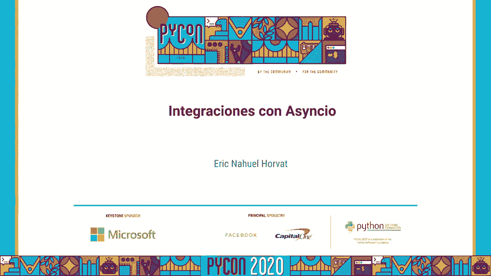
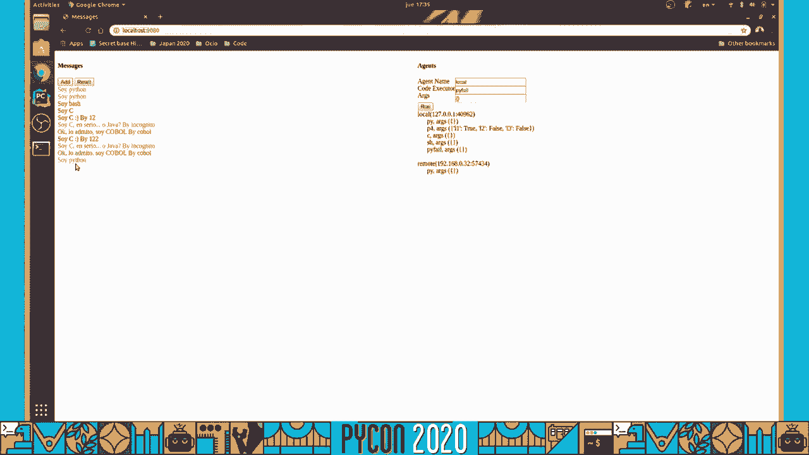
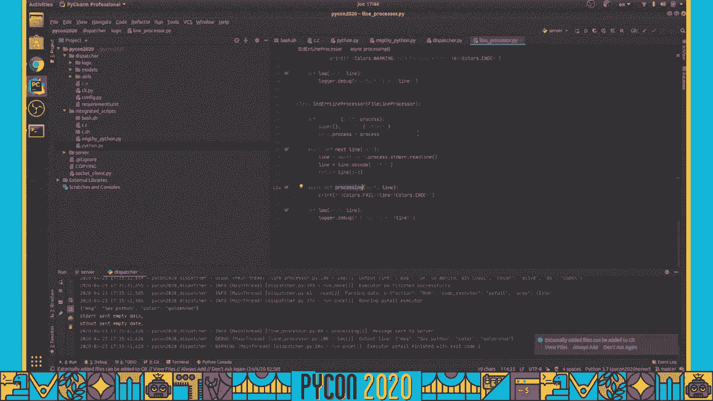

# P3：Charla Eric Nahuel Horvat - Integraciones con Asyncio - 程序员百科书 - BV1rW4y1v7YG

 (speaking in foreign language)。

 (speaking in foreign language)。

 (speaking in foreign language)， (speaking in foreign language)， (speaking in foreign language)。 (speaking in foreign language)， (speaking in foreign language)， (speaking in foreign language)。

 (speaking in foreign language)， (speaking in foreign language)， (speaking in foreign language)。 (speaking in foreign language)， (speaking in foreign language)， (speaking in foreign language)。

 (speaking in foreign language)， (speaking in foreign language)， (speaking in foreign language)。 (speaking in foreign language)， (speaking in foreign language)， (speaking in foreign language)。

 (speaking in foreign language)， (speaking in foreign language)， (speaking in foreign language)。 (speaking in foreign language)， (speaking in foreign language)， (speaking in foreign language)。

 (speaking in foreign language)， (speaking in foreign language)， (speaking in foreign language)。 (speaking in foreign language)， (speaking in foreign language)， (speaking in foreign language)。

 (speaking in foreign language)， (speaking in foreign language)， (speaking in foreign language)。 (speaking in foreign language)， (speaking in foreign language)， (speaking in foreign language)。

 (speaking in foreign language)， (speaking in foreign language)， (speaking in foreign language)。 (speaking in foreign language)， (speaking in foreign language)， (speaking in foreign language)。

 (speaking in foreign language)， (speaking in foreign language)， (speaking in foreign language)。 (speaking in foreign language)， (speaking in foreign language)， (speaking in foreign language)。

 service。 The security is not an example because of the communication environment。 The issue can be created in the array of services， which is made by the server。

 Now we don't want to calculate the communication and server to implement it。 I have to make sure that it is not a place to use。

 I have to make sure that it is not a place to use。 I have to make sure that it is a place to use。 I have to make sure that it is not a place to use。

 I have to make sure that it is not a place to use。 I have to make sure that it is not a place to use。

 I have to make sure that it is not a place to use。 I have to make sure that it is not a place to use。

 I have to make sure that it is not a place to use。 I have to make sure that it is not a place to use。

 I have to make sure that it is not a place to use。 I have to make sure that it is not a place to use。

 I have to make sure that it is not a place to use。 I have to make sure that it is not a place to use。

 I have to make sure that it is not a place to use。 I have to make sure that it is not a place to use。

 I have to make sure that it is not a place to use。 I have to make sure that it is not a place to use。

 I have to make sure that it is not a place to use。 I have to make sure that it is not a place to use。

 I have to make sure that it is not a place to use。 I have to make sure that it is not a place to use。

 I have to make sure that it is not a place to use。 I have to make sure that it is not a place to use。

 I have to make sure that it is not a place to use。 I have to make sure that it is not a place to use。

 I have to make sure that it is not a place to use。 I have to make sure that it is not a place to use。

 I have to make sure that it is not a place to use。 I have to make sure that it is not a place to use。

 I have to make sure that it is not a place to use。 I have to make sure that it is not a place to use。

 I have to make sure that it is not a place to use。 I have to make sure that it is not a place to use。

 I have to make sure that it is not a place to use。 I have to make sure that it is not a place to use。

 I have to make sure that it is not a place to use。 I have to make sure that it is not a place to use。

 I have to make sure that it is not a place to use。 I have to make sure that it is not a place to use。

 I have to make sure that it is not a place to use。 I have to make sure that it is not a place to use。

 I have to make sure that it is not a place to use。 I have to make sure that it is not a place to use。

 I have to make sure that it is not a place to use。 I have to make sure that it is not a place to use。

 I have to make sure that it is not a place to use。 I have to make sure that it is not a place to use。

 I have to make sure that it is not a place to use。 I have to make sure that it is not a place to use。

 I have to make sure that it is not a place to use。 I have to make sure that it is not a place to use。

 I have to make sure that it is not a place to use。 I have to make sure that it is not a place to use。

 I have to make sure that it is not a place to use。 I have to make sure that it is not a place to use。

 I have to make sure that it is not a place to use。 I have to make sure that it is not a place to use。

 I have to make sure that it is not a place to use。 I have to make sure that it is not a place to use。

 I have to make sure that it is not a place to use。 I have to make sure that it is not a place to use。

 I have to make sure that it is not a place to use。 I have to make sure that it is not a place to use。

 I have to make sure that it is not a place to use。 I have to make sure that it is not a place to use。

 I have to make sure that it is not a place to use。 I have to make sure that it is not a place to use。

 I have to make sure that it is not a place to use。 I have to make sure that it is not a place to use。

 I have to make sure that it is not a place to use。 I have to make sure that it is not a place to use。

 I have to make sure that it is not a place to use。 I have to make sure that it is not a place to use。

 I have to make sure that it is not a place to use。 I have to make sure that it is not a place to use。

 I have to make sure that it is not a place to use。 I have to make sure that it is not a place to use。

 I have to make sure that it is not a place to use。

 I have to make sure that it is not a place to use。 I have to make sure that it is not a place to use。

 I have to make sure that it is not a place to use。 I have to make sure that it is not a place to use。

 I have to make sure that it is not a place to use。 I have to make sure that it is not a place to use。

 I have to make sure that it is not a place to use。 I have to make sure that it is not a place to use。

 I have to make sure that it is not a place to use。 I have to make sure that it is not a place to use。

 I have to make sure that it is not a place to use。 I have to make sure that it is not a place to use。

 I have to make sure that it is not a place to use。 I have to make sure that it is not a place to use。

 I have to make sure that it is not a place to use。 I have to make sure that it is not a place to use。

 I have to make sure that it is not a place to use。 I have to make sure that it is not a place to use。

 I have to make sure that it is not a place to use。 I have to make sure that it is not a place to use。

 I have to make sure that it is not a place to use。 I have to make sure that it is not a place to use。

 I have to make sure that it is not a place to use。 I have to make sure that it is not a place to use。

 I have to make sure that it is not a place to use。 I have to make sure that it is not a place to use。

 I have to make sure that it is not a place to use。 I have to make sure that it is not a place to use。

 I have to make sure that it is not a place to use。 I have to make sure that it is not a place to use。

 I have to make sure that it is not a place to use。 I have to make sure that it is not a place to use。

 I have to make sure that it is not a place to use。 I have to make sure that it is not a place to use。

 I have to make sure that it is not a place to use。 I have to make sure that it is not a place to use。

 I have to make sure that it is not a place to use。 I have to make sure that it is not a place to use。

 I have to make sure that it is not a place to use。 I have to make sure that it is not a place to use。

 I have to make sure that it is not a place to use。 I have to make sure that it is not a place to use。

 I have to make sure that it is not a place to use。 I have to make sure that it is not a place to use。

 I have to make sure that it is not a place to use。 I have to make sure that it is not a place to use。

 I have to make sure that it is not a place to use。 I have to make sure that it is not a place to use。

 I have to make sure that it is not a place to use。 I have to make sure that it is not a place to use。

 I have to make sure that it is not a place to use。 I have to make sure that it is not a place to use。

 I have to make sure that it is not a place to use。 I have to make sure that it is not a place to use。

 I have to make sure that it is not a place to use。 I have to make sure that it is not a place to use。

 I have to make sure that it is not a place to use。 I have to make sure that it is not a place to use。

 I have to make sure that it is not a place to use。 I have to make sure that it is not a place to use。

 I have to make sure that it is not a place to use。 I have to make sure that it is not a place to use。

 I have to make sure that it is not a place to use。 I have to make sure that it is not a place to use。

 I have to make sure that it is not a place to use。 I have to make sure that it is not a place to use。

 I have to make sure that it is not a place to use。 I have to make sure that it is not a place to use。

 I have to make sure that it is not a place to use。 I have to make sure that it is not a place to use。

 I have to make sure that it is not a place to use。 I have to make sure that it is not a place to use。

 I have to make sure that it is not a place to use。 I have to make sure that it is not a place to use。

 I have to make sure that it is not a place to use。 I have to make sure that it is not a place to use。

 I have to make sure that it is not a place to use。 I have to make sure that it is not a place to use。

 I have to make sure that it is not a place to use。 I have to make sure that it is not a place to use。

 I have to make sure that it is not a place to use。 I have to make sure that it is not a place to use。

 I have to make sure that it is not a place to use。 I have to make sure that it is not a place to use。

 I have to make sure that it is not a place to use。 I have to make sure that it is not a place to use。

 I have to make sure that it is not a place to use。 I have to make sure that it is not a place to use。

 I have to make sure that it is not a place to use。 I have to make sure that it is not a place to use。

 I have to make sure that it is not a place to use。 I have to make sure that it is not a place to use。

 I have to make sure that it is not a place to use。 I have to make sure that it is not a place to use。

 I have to make sure that it is not a place to use。 I have to make sure that it is not a place to use。

 I have to make sure that it is not a place to use。 I have to make sure that it is not a place to use。

 I have to make sure that it is not a place to use。 I have to make sure that it is not a place to use。

 I have to make sure that it is not a place to use。 I have to make sure that it is not a place to use。

 I have to make sure that it is not a place to use。 I have to make sure that it is not a place to use。

 I have to make sure that it is not a place to use。 I have to make sure that it is not a place to use。

 I have to make sure that it is not a place to use。 I have to make sure that it is not a place to use。

 I have to make sure that it is not a place to use。 I have to make sure that it is not a place to use。

 I have to make sure that it is not a place to use。