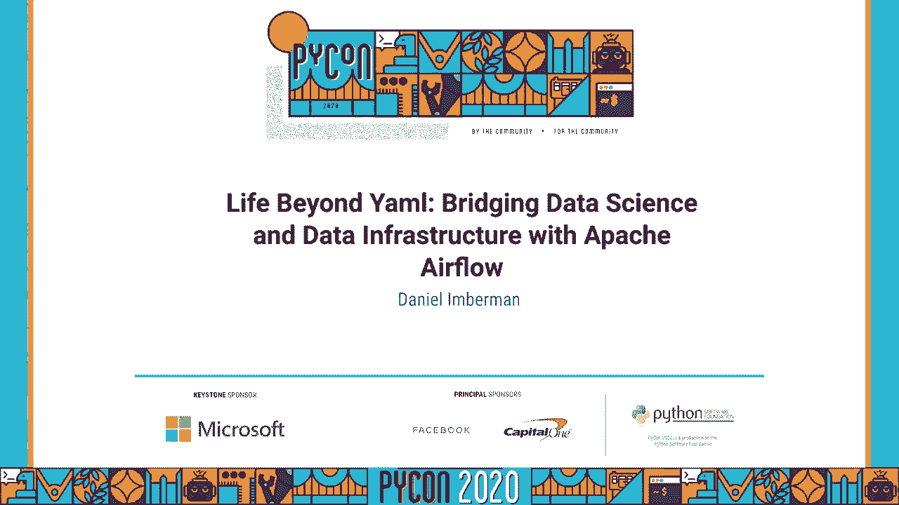
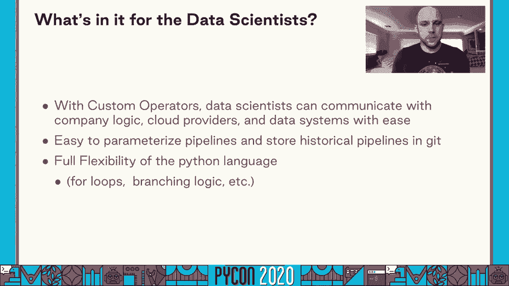
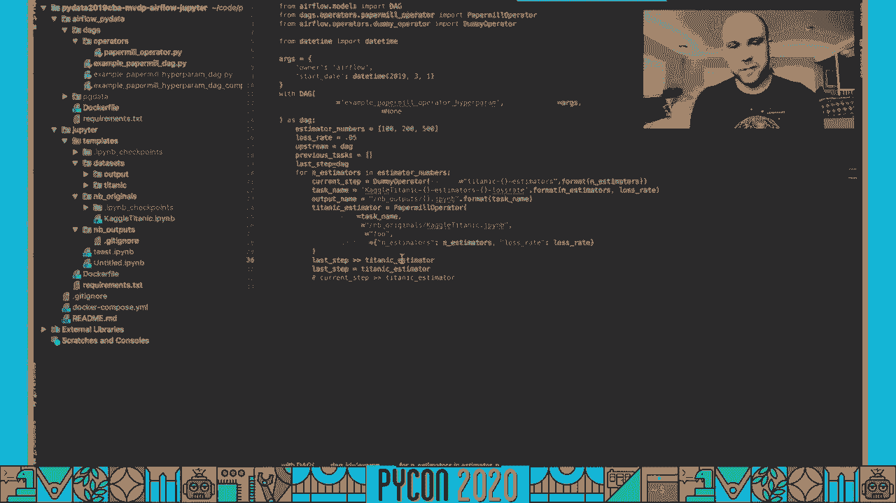
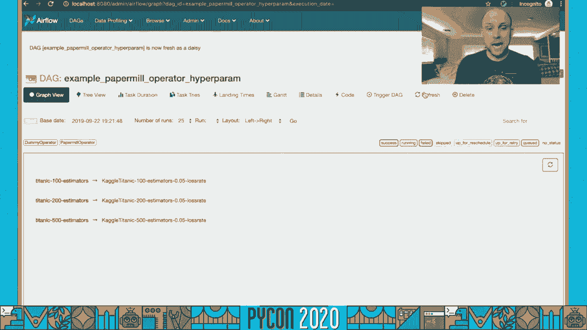
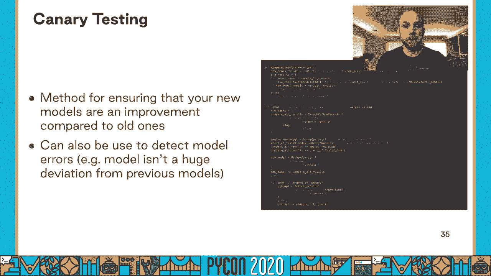
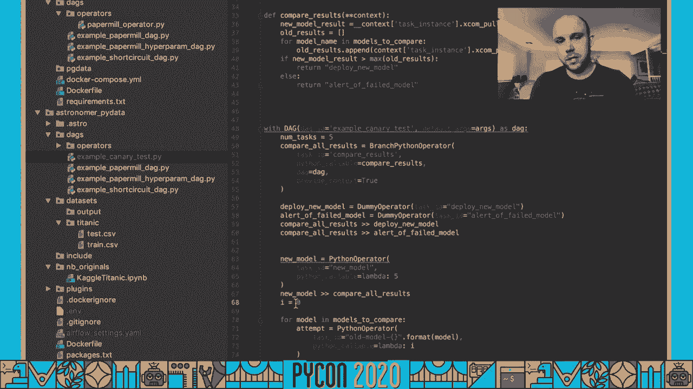
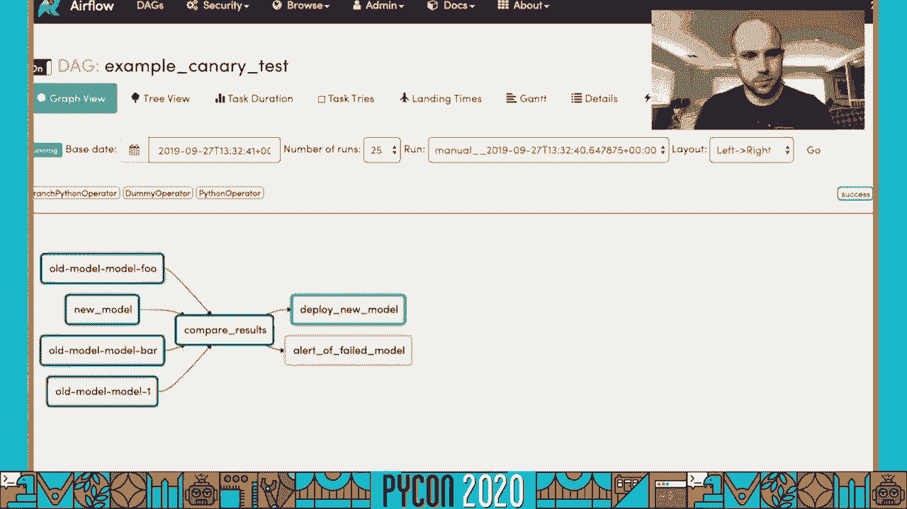
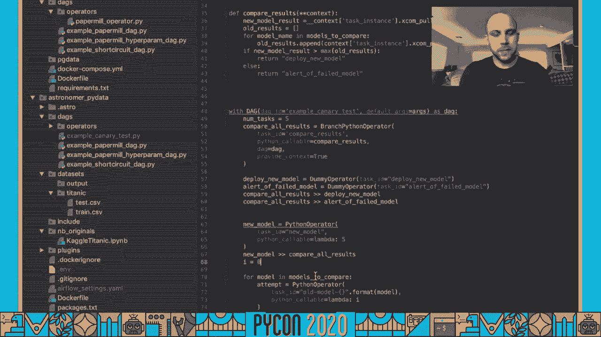
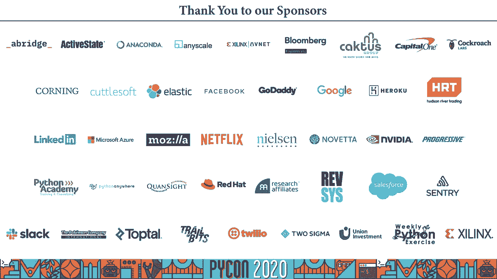

# P30：Talk Daniel Imberman - Bridging Data Science and Data Infrastructure with Apache - 程序员百科书 - BV1rW4y1v7YG

你好，各位，感谢大家来参加我的蟒蛇演讲，希望你们一切都好，我很高兴今天能和大家分享我的演讲，所以二话不说，这是超越羊膜的生活，用阿帕奇气流架起数据科学与数据工程的桥梁。

开始，我想告诉你一些关于我自己的事情，我叫丹尼尔•伊波曼，我是天文研究所的气流工程师，我也是阿帕奇气流项目的提交者，在过去的五到七年里 我一直致力于建立数据科学平台，这就是我今天想帮助你们的地方。让我们来谈谈数据科学生态系统，平均数据科学生态系统由三个主要参与者组成，你有来自数学和物理背景的数据科学家，这些是女人，男人和其他正在处理这些数字 并建立你的预测模型的人，你有一个数据基础设施团队。

通过确保他们总是有他们需要的计算资源来支持数据科学团队，你有双产品分析师，所有这些信息，并将其转化为可操作的结果，为业务带来价值，现在，所有的队伍都朝着相同的目标前进，他们都有不同的需求。帮助他们到达那里，数据科学希望事情只是工作，他们想要高水平的人工智能，虽然他们确实需要访问系统参数 比如 cpu，内存和 gpu，他们真的不想钻研系统的杂草，弄清楚数据工程内部发生了什么，另一方面。

主要关注的是运行时间和稳定性，他们想给数据科学家尽可能多的灵活性，但他们也知道，如果他们给数据科学家太多的灵活性，这可能会损害他们的生产力，也许他们使用的系统配置并不适合他们的用例。或者系统有太多的按钮和杠杆，数据和科学家无法得到他们的模型 因为他们忙于配置，最后分析师和产品团队，他们只是想方便地访问数据，他们通常只需要一个SQL数据库。

这样他们就可以在每天的基础上创建仪表板和电子表格，为了解决所有这些用例，数据基础设施团队经常试图建立我所说的保险杠模型，保险杠轨道模型包括在一个定义良好的沙箱中 给用户尽可能多的灵活性。但是当用户走到沙箱的预期范围之外时，会非常迅速地提醒他们，这往往是许多数据婴儿团队，尤其是那些大公司的，开始打造自己的数据科学平台，但是我求求你，请不要作为一个建立了数据科学平台的人。

从无到有 搭建数据科学平台是一项不朽的努力，你得自己想办法，报警，你必须处理所有的错误修复，每个功能请求都要经过你，如果你遇到任何问题，也没有外部帮助，所以在这次谈话中，我想提出一个简单的。为您的公司建立一个满足您所有个人需求的数据科学平台的更可维护的方法，同时有一个维护得很好的核心，我的建议是使用阿帕奇气流作为你的数据科学平台的核心。

Apache Airflow是一个基于Python的工作流调度程序，由Airbnb开发，它提供了一个非常简单的python sdk，用于构建执行图，使构建，在气流中部署和监测数据 科学管道非常简单。dag或有向无环图 只是创建一些 python对象的问题，每个对象都被称为运算符，这可以是一个狂欢命令，对星火簇的请求，或一个，一旦你创建了这些对象，然后。

用户可以使用setup stream函数创建一个没有YAML和json的依赖关系图，气流提供了一个非常强大的监控 仪表板，用户可以在一个地方看到他们所有管道的健康状况，用户还可以看到历史运行。并实时观看他们的管道运行，到目前为止，气流中最强大的部分，不过，它可以很容易地充当数据科学家和大量外部系统之间的桥梁，通过它的操作员库，像 kubernetes这样的东西，哈杜普，AWS，DASK。

很多其他系统都有开源，在气流生态系统中维护良好的操作员，现在我想花一些时间来讨论这些利益相关者将从一个基于气流的数据科学平台中得到什么，我从数据工程师开始，因为他们是勇敢的灵魂，快跑。维护这个数据科学平台，所以对于数据工程师来说，气流为标准化提供了一个强大的工具，监测和一致性，数据工程师可以扩展现有的运营商或创建新的运营商来强制标准，同时给予数据科学家最大的灵活性，气流也。

提供简单的集成到弹性搜索和普罗米修斯，因此，日志捕获和系统监控非常简单，当然，它还扩大了许多顶级科技公司的规模，如爱彼迎和莱夫特，使用气流每天运行数百万项任务，作为一个系统，它一直受到压力测试。从过去学到的所有教训都将在未来发布，作为数据工程师 如何使用自定义运算符来抽象系统配置的示例，让我们看一下下面的例子，数据工程师管理 kubernetes集群，它有一个节点子集 有一个 gpu农场。

这位数据工程师想让数据科学家在不向数据科学家暴露任何kubernetes内部结构的情况下，方便地访问这些gpu节点，在这种情况下，数据工程师可以简单地扩展kubernetes pod操作符。并为这些gpu节点注入节点选择器，所有其他变量都不变地传递，数据科学家不需要知道什么是节点选择器，但是他们可以自动进入那个 gpu节点，基于最终用户的复杂性，数据工程师可以像他们一样少或多地暴露。

像现在这样，而不是从零开始建立一个完整的数据科学平台，您可以使用 airflow核心 并构建这些专门针对您的业务用例的自定义操作符，您所构建的核心运算符将随着新版本的发布而更新。你现在可以很容易地注入很多核心组件，类似于 Spark集群访问的环境变量，或者是接入云提供商的 ami秘密，构建一个数据科学平台 现在就像编写几个插件和操作符一样简单。

而所有的底层基础设施都是由高度活跃的 apache airflow社区管理的，我们已经介绍了基础设施工程师，我想讨论科学家们从基于气流的系统中获得的数据，一旦数据基础结构团队构建了核心自定义运算符。数据科学团队现在有了完全的抽象，远离了许多关于如何连接到星火簇或 aws实例的更糟糕的细节，这些数据科学家现在有能力在数据基础设施团队创建的自定义运算符之上创建自定义运算符。

进一步抽象和简化它们的工作流程，气流也有生姜，使数据科学家易于参数化他们的管道 并将历史管道存储在 git中的集成，当然，现在终端用户在生成他们的图的时候有了python语言的灵活性。所以它们可以用于循环和分支逻辑，我现在想给你们展示一个例子 说明它在哪里是有用的。

所以我们从一个线性的开始，假设我们想同时完成这三个任务，好吧，我们要做的就是让它们不再互相依赖。

有了三行代码，现在你就有三个任务在运行，但是假设我们实际上想对这些任务进行超参数调优，并很好地找出哪一个是最好的损耗率。

而不是只有一个损失率，我们现在可以有一个所有损失率的循环，从零点五到一点，所以我们创建了这个数组，我们做一个理解，现在改变了大约四行代码。

我们可以对我们的图进行超参数调优，最后我想说的是，分析师和产品团队从一个基于气流的数据科学平台获得，分析师们得到的最重要的东西是数据科学和数据基础设施团队之间更紧密的凝聚力。这意味着更快的交付和团队之间更少的沟通失误，Airflow还提供了使用大量基于续集的操作符 在预定的基础上运行参数化 SQL作业的机会。

这确保了产品和 BI团队使用的任何分析数据库在我们完成之前都一致地充满了新鲜和相关的数据，我想描述一个建立在气流上的数据科学管道的例子，希望能启发未来的实验，遵循曲奇切割机数据科学模型。我们将模型创建过程分为三个步骤，实验允许快速迭代，在处理较小的本地或样本数据集时，参数化使得在多个数据集上运行模型变得容易，无论是在不同的环境中 还是在不同的用例中，然后生产保证了模型的健康。

在规模上运行，并将模式推向它现在可以为公司提供价值的地方，就实验而言，因为这是蟒蛇，我可能不需要解释什么是木星笔记本，但我能说的是 一旦你在当地用完木星笔记本，气流可以填充许多必要的组件。使笔记本在规模上工作，用户可以在迭代时很好地使用本地火花集群，然后让气流为一个更大的星团注入 是的网址作为环境变量，使用木星气流的一个推荐方法是将每个笔记本做成一个项目，强有力的任务。

通过制作一系列更小的笔记本，您可以更容易地捕捉故障，管道也更容易在参数化测试中进行测试，一旦你对笔记本的质量感到满意，你最终想把它参数化，不管是超参数调优，或者能够在不同的数据集上测试它。将笔记本参数化是将其从实验转移到功能性 机器学习功能的关键，这就是造纸厂真正发光的地方，纸浆厂允许用户以一种覆盖这些单元格中变量的方式标记木星笔记本的单元格，看看造纸厂是如何运作的。

我现在有一个小样要给你看，对于这个例子，我们有两个基本参数，A和 B，我们要做的就是进入细胞元数据，我们把它们标记为参数，如你所见，笔记本没变，但如果我们去造纸厂，输入a等于foo，b等于bar。它会吐出所有的细胞，创建一个输出笔记本，在那个输出笔记本上 你可以看到参数 a和 b现在已经变成了 fu和 bar和 run，我想感谢我的朋友和同事 贡扎洛迪亚兹给了我这个动画，我现在无耻地偷走了它。

并把它放在我的馅饼骗局中，在那里造纸厂很好地与气流联系在一起，已经有一个气流造纸厂的操作员，用户只需指出他们笔记本所在的网址，说明什么参数是覆盖的，气流不仅会运行你覆盖的参数。还能将任何环境变量注入气流工人体内，终于，我们来谈谈产品化，有一百万种方法可以测试和生产机器学习模型，对于这个用例，我决定展示一个最重要的系统，金丝雀测试，金丝雀测试是将新模型与旧模型进行比较的方法。

只部署在，如果它既经过了理智测试，又比模型好，它正在取代，以展示金丝雀测试是如何工作的，在阿帕奇气流中。

我在这里创建了一个小例子，为了这次测试，我们有一个 dag使用的是所谓的分支 python操作符，这个操作符实际上可以接受一个 python函数，根据这个函数的结果 决定下一步要执行什么任务。

所以在这种情况下 如果新的模型比旧的模型有更高的价值，然后特斯拉通过，所以我们先用这个测试运行一次，新的模型有更高的价值，它运行。

因为新的模式有更高的价值。

它部署它，这可能意味着推到第三个 或者你为你的模特准备的其他存储空间，但让我们再举一个例子，现在旧的型号比新的型号有更高的价值，如果我们再运行一次，我们会看到它会运行所有的任务，比较一下。然后我们会提醒失败，因为新车型还没达标，总之，如果您正在寻找一个数据科学平台，可以解决数据科学、数据基础设施和产品需求，阿帕奇气流是一个经过战斗测试和广泛使用的解决方 案。

数据工程师可以采取多个步骤来使用 apache airflow来授权他们的数据科学家 使用定制的操作员，因此，如果你想尝试气流出去，并有兴趣有一个经过严格测试的供应商批准的分发，请随时伸出援手。但最重要的是感谢你抽出时间，我真的希望你喜欢这次谈话。

