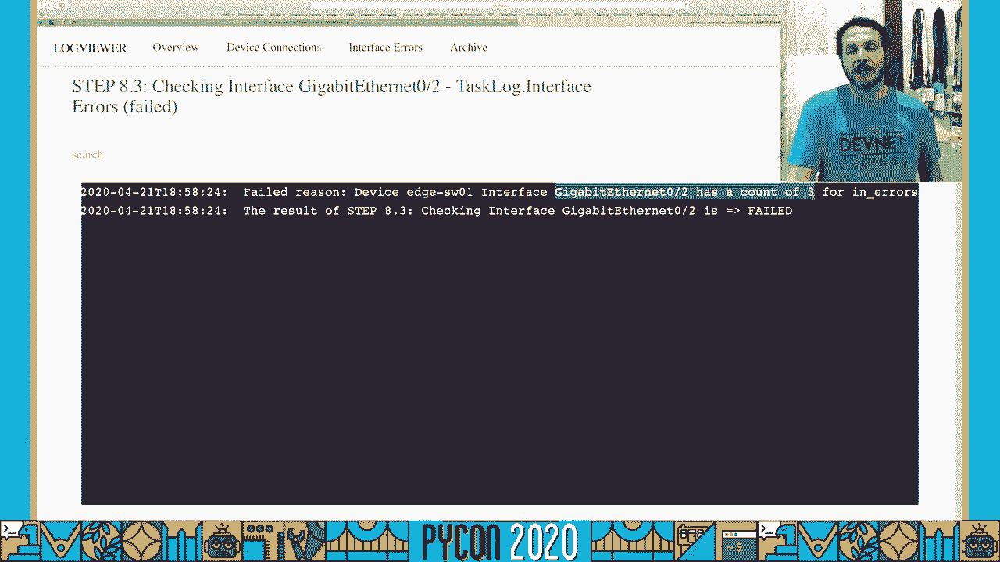
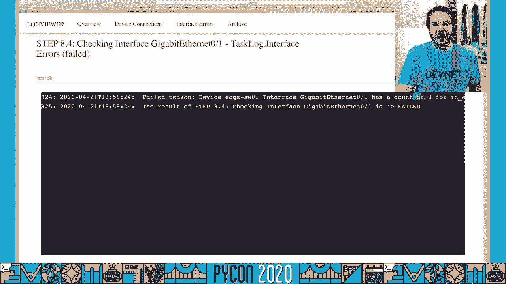
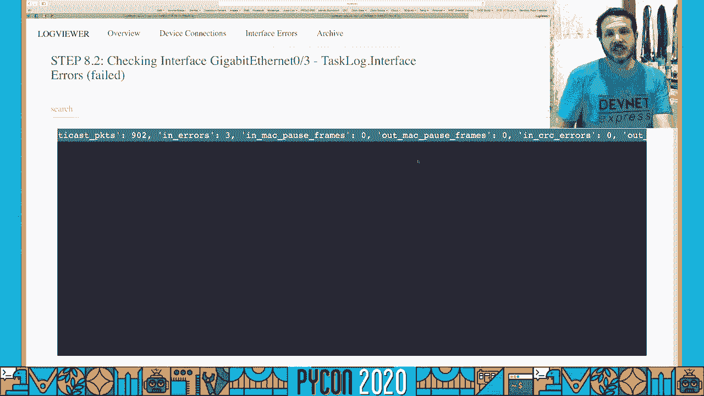
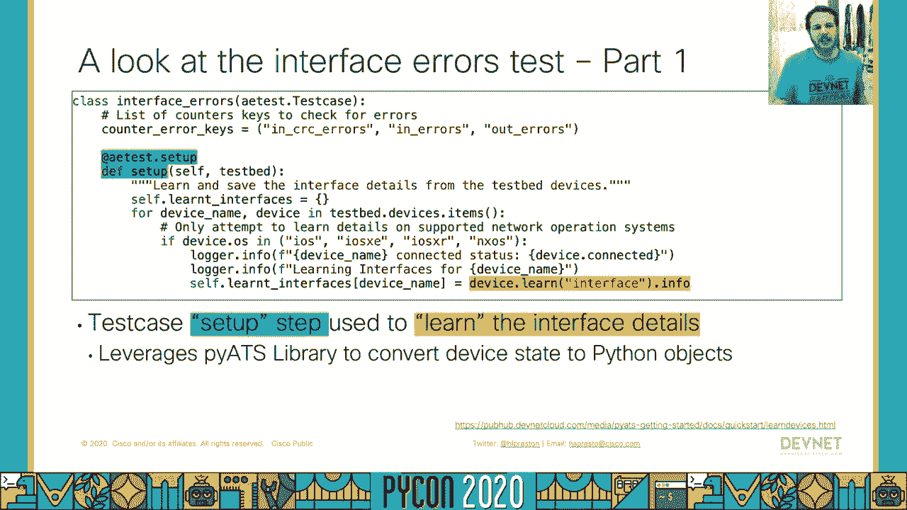

# P39：Talk Hank Preston - Introduction to Writing Network Tests with pyATS - 程序员百科书 - BV1rW4y1v7YG

你好，皮昂二十二十，感谢大家参加我的这篇关于编写网络测试的介绍，我叫汉克·普雷斯顿，我是思科 devnet的网络自动化工程师和开发人员，我也是一个网络爱好者。很高兴有机会谈论使用 python和其他工具实现网络工程和自动化的现代化，在今天的谈话中，我们将通过几个议程要点来解决自己的问题，我们首先要了解圆周率是什么 以及它要解决的问题是什么。

然后我们将剖析网络测试项目中的具体内容，我们如何开发一个网络测试平台，并描述我们的设备连接，然后我们要看一个测试案例的解剖，然后我们如何将多个测试用例组合到一个单独的测试任务中。最后我们将展示如何用圆周率来测试，我们的网络是否如预期的那样工作，那么首先圆周率到底是什么，在我们回答这个问题之前，让我们提出一个古老的问题，现在网络瘫痪了吗？无论你是网络工程师还是网络自动化工程师。

或者只是一个利用网络的软件开发人员，你的网络工程师所经历的，你可能发现自己在这个空间里，有点不对劲，你想弄明白，是网络吗，你可能会走到你的网络工程人员那里说 嘿，网络瘫痪了吗，你得到了这些空白的楼梯。他们不知道该怎么回答，因为网络上有所有这些东西，又是如何排除故障的呢？所以思维过程通常是这样的，原来如此，我们到底要检查什么，然后我们经常回到旧的类型的主要网络测试功能工具，我们今天有，向右。

所以有人建议你，还有呃，我们想知道有没有更好的方法，因为平虽然是建立连接的重要权利，没有回答关于你是否有潜伏期的问题，链接上是否真的有拥塞，交通是否遵循你所期望的方向。只是网络是否真的像预期的那样运作的一小部分，这就是π{\displaystyle\pi}和π{\displaystyle\pi}图书馆的用武之地，以及周围的生态系统。

现在这里的想法是建立一个现代化的平台和框架，在那里我们可以写出很好的可靠的网络测试用例，网络是否如我们所希望的那样运作，不出所料，圆周率生态系统和系统是圆周率生态系统的一部分，在那里被释放。在apache许可证版本2o下可用，因此您可以访问源代码，为我们将要讨论的生态系统的许多元素做出贡献，这样每个人都可以帮助我们所有的用户解决现在存在的网络测试问题。

现在让我们深入探究圆周率生态系统的具体构成，在其基地，我们有所谓的圆周率核心测试基础设施，这实际上是圆周率库组件本身的意思，我们是这样描述地形的，测试定义，我们如何跟踪测试的执行，收集成果，开发日志。把那些碎片，甚至发送电子邮件通知，如果我们把它配置为核心测试的一部分，基础设施的 pcore测试实际上没有很多直接连接到您想在网络中测试的特定内容，它是运行这些测试所必需的框架。

当他们在核心测试基础结构上进行时，我们在图书馆里找到 sdk，宠物图书馆，它以前常被称为精灵图书馆，你会看到这个名字出现在不同的地方，库提供的是一种可重用的组件，可以插入并运行在您的网络上。这让我们可以说，好的，我对这种状态感兴趣，假设，像 bgp或 ospf这样的路由协议，通过使用 piets库功能，我们可以很容易地在蟒蛇，问网络，询问网络和网络设备，这些不同部分的操作或配置状态如何。

我们可以，我们不必担心解析清晰的文本信息 或试图规范平台之间的数据，所有这些都由 piets库自己处理，然后在sdk和库的上面，可以插入业务逻辑和集成。许多团队正在研究如何将网络测试绑定到更大的测试框架和 cicd管道中，所以有一些地方我们可以用圆周率生态系统来插入詹金斯，工具评估工具系统，其他cli示例框架。

如robot或tide into infrastructure，作为Ansible在其他领域的代码解决方案，所以圆周率生态系统是一种完整的组合，在今天的谈话中，我们要把重点放在核心测试基础架构上。我们如何连接到我们的网络，我们现在如何编写和阐明我们的测试用例本身，你从哪里得到圆周率，就像任何好的蟒蛇程序一样，在圆周率上可以买到，所以你可以尖叫，安装圆周率以从圆周率上拉下所有的位。

现在它确实需要 linux或 mac os才能运行，但如果你是 windows用户，我们可以在码头工人或虚拟机中支持它，因为他们通过，所以你可以从思科测试自动化，一个最新的码头工人容器。现在里面有运行你的pi用例所需的一切，在几个版本中，我们已经升级并删除了某种蟒蛇来支持，我们推荐蟒蛇3号，五块或更多来利用所有要利用的蟒蛇碎片，圆周率生态系统和框架现在已经到位了 几个参考部分。

即使在这个区域的展示中，我们可以看到我们有版本信息库叫做精灵，PI和 Unicon，这些都与我们在几张幻灯片前看到的金字塔有关，pi python库与核心测试基础设施绑定在一起。这是为了连接连接和运行这些测试，因为它们通过精灵，这些是，宠物图书馆，它由可重复使用的模型组成，触发器，解析器，核查，一套完整的应用程序接口，你可以用它来和你的网络设备交谈和操作。

最后我们有 Unicon或者通用连接器库，在代码中很少显式地调用它们，而是利用圆周率库或圆周率核心，不管我们是通过 telnet连接，SSH，通过终端服务器或代理。或者使用像 http或 net comp区域这样的协议，所以当您再次在库中看到这些导入时，Unicon通用连接器的类型在引擎盖下 圆周率或核心测试框架的类型，然后精灵是圆周率库，里面装满了所有好的组件。

我们可以在代码中使用，既然这样，让我们来谈谈实际的网络测试项目中的内容，现在很多事情都可以从一个，但从最低限度来看，我们真的只需要三个不同的组件，首先我们需要描述，我们正在与之交谈的网络。这被称为测试床文件或测试床 YAML，尽管你可以给它起任何名字，通常它们只是被称为试验台，在 YAML文件里，这就是我们网络拓扑的描述，我们想和哪些设备通话，他们的平台是什么，连接细节是什么，嗯是，呃。

港口是什么，是telnet吗？是ssh吗？我们用什么证书来通过，所有这些都是作为测试床 YAML文件的一部分处理的，下一个，我们有 ae测试脚本或自动化 简单测试脚本。这些将是一个或多个描述设置的 python文件，要运行的单个测试的执行和清理，你可以对你的网络执行多个这样的操作，我在处理不同的部分，也许你有一个人工智能测试脚本去检查，设备刚刚启动并运行。

然后你有另一个解决像第二层连接检查和第二层配置之类的问题，然后，我们升级到第三层和路由协议验证，每一个都可以分解成一个单独的 ae测试脚本，最后我们得到了简单的圆周率作业文件。在工作档案里我们结合在一起，描述网络的测试床，我们希望用我们想要运行的测试脚本来验证，测试工作处理运行，所有这些作为一个例子，然后用可消费的方式报告结果，帮助他们完成所有这些组件的配置和设置。

当您安装pi pip时，在pi cli中内置了一些方便命令，pi create测试床将帮助您构建您的测试床文件，您可以在 YAML中手工构建，你可以从 csv或 excel电子表格导入和转换。或者您可以在命令行中回答问题，它将为您构建 YAML文件作为一个起点，然后 pi create项目会给你一些模板和曲奇切割器，与你的工作文件相关的开始地点，以及你的测试脚本，当他们进去的时候，现在。

让我们跳过这三个组件中的每一个 来看看，再深入看看，首先，我们有我们的圆周率证明床，如我所说，这将定义网络中的所有设备，现在我们有各种各样的类型，你可能有在你的测试床上，你会有开关，路由器，防火墙。但是您也可能有某种linux终端主机，您可以使用它作为您的流量生成测试执行的一部分，或者只是验证网络是否按预期运行，现在，每个设备也必须与平台和操作系统绑定在一起，显然。

pets平台将支持来自不同思科网络平台的操作系统，比如 iOS Xe，X nxs asa，但是我们也为这些主机支持 linux之类的操作系统，甚至其他供应商，例如朱诺和 f五。这些都是由 pi框架和生态系统支持的操作系统，除了设备本身，我们得知道我们要怎么，连接到设备，Unicon支持通过 ssh或 telnet进行连接，净额，不同的能力，以及支持和要求。

如果我们要通过终端服务器或者代理服务器，这一切都可以在试验台内描述，您还可以选择在您的测试床上描述链接，这些设备之间的接口是如何连接的，这不是强制性的，但对于更高级的测试。你实际上可以描述一种预期的真理来源，关于网络应该如何建立，然后在他们进去的时候 验证他们的作战状态，现在正如所提到的，下一篇文章是 ae测试脚本，现在测试脚本是一个 python文件。

如果您使用 pi测试或其他测试库编写了测试脚本，会有一些相似之处，每个测试脚本都有三个阶段，阶段，一个常见的设置，在开始运行实际测试之前 需要做的所有事情，在那里。这是一个常见的地方 我们会在这里使用我们的测试床 然后出去连接到，所有的设备，接下来是第二阶段，哪些是测试案例，任何atest脚本都可以有一个或多个测试，这些测试将继续进行，并在执行过程中运行。

最后我们有第三阶段，一般的清洁工作，现在你会注意到我们描述这些组件的方式，或者他们进入哪个阶段 是通过扩展公共设置组件的 ae测试 公共设置，一个类的测试案例，它将是一个实际的测试案例。然后一个常见的清理测试将描述你现在要完成的清理步骤，在测试中，您可能还有子设置和清理步骤，取决于这些测试的要求，但如你所见，测试用例一没有设置和清理阶段，而aor，测试用例二确实有一个设置和清理。

在每个测试用例类中，我们可以有任何数量的装饰测试来表明我们将如何通过他们进入，现在进去，这个幻灯片示例我们可以看到，我们只是传递这些测试中的每一个来展示框架，我们会看到这样的例子，当我们进入演示时。测试实际上是什么样子的，但因为是蟒蛇，在 python中可以做的任何事情都可以在测试脚本中完成，然后我们来看看工作档案，记住，我们可以设置任意数量的测试脚本，作为实际网络验证的一部分来运行。

在作业文件里面是另一个 python文件，它只是将我们希望作为单个作业的一部分运行的所有测试脚本集合在一起，因此我们可以为多个项目编写测试脚本，然后合并到单个作业文件中，在不同的网络组件上运行。我们可以在这里看到，这些 python脚本通常非常简单和简短，我们只需通过简单的圆周率库来执行运行，针对我们现在想要的每个测试脚本，我在幻灯片上指定的任务 ID被用作，当他们进入时，日志和通知件。

如果你没有提供一个特定的任务，引擎盖下的宠物库会指示任务，然后是一个数字，当他们进去的时候，但对于复杂的测试工作，你可能想给一个名字，这样您就可以理解每个测试脚本想要完成的任务，就像他们现在经历的那样。有了这三个组成部分，然后我们可以继续使用修剪工作来运行我们的工作，然后你给它工作文件和测试平台 你想组合在一起，或者你想一起参加这次处决，在展示中你会看到，它说，好的，每一个任务，我们通过了每一个测试。

或者其他选项可能会被跳过，失败或播出 现在我们只得到了一个基本的自举片段，所以没有经历太多，在 cli上显示大量输出，现在你会注意到在底部，有，这个小的专业提示弹出。即使对于您可能运行的小型简化网络测试，有很多数据可以以标准的方式呈现给你，只是分析一下，在一个大的斑点中查看 它可能很难找出是什么起了作用，什么不起作用或发现存在的问题，但从普洛斯的观点来看。

我们最后做的是自动向你展示一个html视图，查看这个作业运行的日志，你可以钻入其中，当它进去的时候，现在我们可以看到主仪表板给你条形图，关于这一点的关键细节，最后一个任务。然后我们可以跳转到单独的任务中，这些任务是作为这里工作的一部分运行的，我们可以看到任务一，如果我继续点击它，它会显示出实际的任务细节，我们会看到任务中的每个测试，以及它是否，呃，它成功地过去了。

现在所有的状态都失败了，假设我们想看到一个特定步骤的细节，任务完成得很好，我们只需单击该步骤，就可以看到pi et在运行这些测试时收集的所有实际输出，当他们穿过。所以在这里我们可以看到现在捕捉到的标准输出，它的输出和我们在cli终端看到的一样，当我们执行它的时候，这是一种更好的方式来看待和看待它，随着基础工作的进行。

让我们在一个真实的实时网络测试演示中实际看到这一点，现在我们在这里演示，我们要面对的是一个网络 这个网络看起来就像我们在图上看到的，所以我们有一个相当常见的三层类型的网络，它是访问分发层，分发路由器。几个核心路由器，然后通过防火墙进入互联网，我们有一些基本的路由协议，配置好的接口和进入时的交通流量，这是一个由 devnet sandbox提供的示例网络，所以这其中最精彩的部分。

示范是 如果你想自己尝试，此演示的所有代码以及运行此测试所需的环境都可以在 github上获得，然后由 devnet沙盒链接提供，在这些幻灯片中，最后我们得到了一个二维码，所以你可以找到幻灯片本身。现在，我们测试工作的目标是，第一步，我们想确认这个试验台里的每一个设备都是可以到达的，这是我们第一次测试，我们能和所有的开关通话吗，路由器，防火墙和其他装置。

我们的第二个测试 我想验证在这些连接的接口上没有任何接口错误，现在，我的意思是，在任何网络工程师的一天中，最麻烦的事情之一是，如果有人过来说 我在网络上有性能问题，不是网络主机坏了，坦率地说。这些都很容易弄清楚和修复，但是没有，东道主，只是他们的表现比预期的要慢，或者有些应用程序正在上升，现在有很多事情可能会导致，但我们经常寻找的东西之一是一路上的每一次跳跃，或者网络中每一个相关的部分。

我们报告有任何错误吗？我们报告的是crc错误吗？我们是在报告那些被丢弃的巨型帧吗，输入输出错误，从整个环境中收集所有这些细节可能非常耗时，所以在我们的测试中。我想做的是在我的整个网络中验证我们没有报告接口错误，因为一般来说在一个健康的网络中，我们不应该看到接口错误正确，所以我想要一个非常快的方法，我们能去看看。

我们有任何接口错误吗 我们要跳到现场演示中看看这个操作。

为了我们的展示，这是我们将要使用的网络，这是由一个devnet沙箱提供的，您可以保留自己的沙箱来尝试一下，但我们在这里的是我们的网络显示器，所以举个例子，我有我的路由层 在这里。在我们的网络内部 我们有一些 linux主机，所以在这里我有内部主机，哦，一个，然后在外面，我有一个互联网主机一个，所以让我们看看网络流量是否在整个网络中运行，当它通过时，这个网络也是。

它看起来像在运作吗，所以如果我做一个嘘，我试着从里面的主机连接到互联网 思科在1702 3 1 0 11，我们可以看到，我确实能够ssh和连接到互联网主机，所以这告诉我们 这个网络至少在某种程度上。我可以从里面的主人那里得到，穿过交换层，路由层，通过边缘的核心路由层，从防火墙切换出去，通过互联网路由器，最后到了网络主机，所以交通路线正常运行，但让我们实际运行我们的网络验证。

看看我们的网络在运行过程中是否有问题，我们从试验台文件开始，这是一个试验台 它描述了我们的网络，就在外面，所以我们可以看到我们的网络路由器，这是一台 iOS xc设备，我们可以看到网络主机。所以这是一个 linux的片段，然后在顶部，如果你注意到我们共享了默认凭据，我们的测试平台支持圆周率 有能力从多个地点提取凭据，你可以把它们用清晰的文字放在你的测试床上，你可以做我在这里做的事。

我们把它们从环境变量中提取出来，从安全的角度来看更好一点，但我们也有加密插件，然后把这些信息从解决方案中提取出来，就像一个金库的解决方 案，在本例中，我使用的是环境变量，然后我这里有一个环境文件。我把它们设置为默认的思科思科，我们在环境中使用的用户名和密码，因此我要跳到终点站，我要走了，把圆周率，E，E，五，为了设置这些环境变量，然后我们继续进行测试工作，所以我跑了工作。

然后我们要运行网络测试项目，网考岗位，然后我们要瞄准我们经过的试验台，所以我们会继续运行这个，看看会发生什么，在执行过程中，就像这飞驰而过，我们现在看到的是，Unicon连接到每一个设备。建立并验证它真的可以与它们对话 执行命令 收集信息，然后是给宠物的，将运行测试脚本来实际验证我们所描述的所有测试用例，我想了解一下情况 看看情况是否健康，所以我们在标准外看的是圆周率捕获的所有记录信息。

使用库组件和日志组件的不同元素来收集和处理所有数据，然后它运行测试脚本，看看什么通过了什么失败了，会有一些简要的信息，一旦这一切在底部完全完成，它应该马上就会出现在这里，我看到一些红色短信从我身边飞过。这告诉我一定有什么事情进展顺利，所以我们到了最后，但是我们现在在 cli中看到了什么，从我们的测试用例，我们看到了那里的网络，我正在检查所有到位的界面，所以我们可以看到每一个被屏蔽的界面所经历的步骤。

已核实，在这种情况下，我强调的那个，这个通过了，但在这里，第八步，它在哪里寻找边缘上的界面 错误开关一口井，整个步骤都失败了，我可以通过界面的层次看到我在这里有很多失败的地方，如果我向上滚动。我就能看到测试中的时间点，当这些接口被检查，但在终点站有很多事情要做，所以让我们继续使用内置的 html日志查看器，所以普洛格斯的观点，这将启动一个类似于蟒蛇的网络服务器。

然后一个主机从实际的日志文件中删除，让我们看看，所以plogs视图打开了我的html部分，我得到了一些统计数据和信息，我们可以看到一共有六个测试，其中五个通过了，其中一个失败了，我可以看看上面的细节。我们可以看到我运行了两个测试脚本，第一个是设备连接，如果我看这个，一切都显示过去，这告诉我 我现在可以成功地连接到每一个设备，如果我想知道每个阶段发生了什么，假设其中一个设备无法连接。

我可以点击其中一个测试 得到所有的标准输出，所有的信息都记录在我的指尖，随时可以使用，但在这种情况下，设备连接没有任何问题，但是接口错误在这里我们看到了一些问题，所以我们可以看到过去常见的设置。加载试验台很好，连接一切都很好的设备，但是整个界面的错误，测试用例确实有一些问题，我们可以看到这里，测试本身失败了，这取决于您的测试脚本定义，以找出失败的继承发生在哪里，但在这种情况下。

如果任何接口出现故障，我们会标记出，整个测试都失败了，而不是翻阅，我会继续根据结果进行排序 把失败的都带到顶端，我们可以看到这里。

1号边缘开关，每个接口都失败了，如果我点击其中一个，我们可以说好，千兆以太网二，我们可以看到好的，检查界面，检查互联网状况，千兆以太网零二失败，如果我看上面的线，我们可以看到我得到了一个失败的理由。得到了注意，因为千兆以太网0 2的错误数是3。

其中一个柜台，如果我回去，我说好，好吧，其他的接口呢。

千兆以太网零一，我们可以看到它也失败了，当他们进去的时候，它也有三个错误。

所以现在我可以看到，好的，有一些问题，或者看起来在这些界面中的这个特定的边缘开关上可能有一些问题，又是一般情况，我们不想看到接口错误，但作为一个网络测试开发人员，我正在研究这个并试图调试它。我知道这个界面上的其他计数器是什么，会是，如果能在这个日志中了解更多的上下文，以帮助排除故障，那就再好不过了，所以让我们更新我们的测试用例，看看我们是否可以做一些更改来了解计数器的完整状态。

所以我要翻转回来 这里，现在我们来看看实际的界面错误，我想指出的部分是，我们要看这部分测试，所以我们得到了测试的定义，我们要看一下这里的布局，但这只是基本的蟒蛇，我们有一些循环。我们准备了一些上下文处理程序，但因为它只是蟒蛇，我将继续删除我在演示中加入的这句话，为了证明除了记录，状况，不管我们通过了还是失败了，我想做一个信息日志，并实际上登出关于接口的所有计数器的全部信息。

这样我就能看到日志里的信息，所以简单地说，我只是取消评论这个新的日志记录器信息行，我们会继续保存更新，然后我会继续重新运行我的测试用例，这样我们就可以看到 如果我们在运行中得到更多的信息。我重新运行了相同的工作文件，它现在只需要连接回来，并使用我处理过的更新脚本运行，所以这需要，我不知道，在这里90秒对着整个网络运行，好吧，工作，工作完成了，如果你看着它穿过。

你可能已经注意到一些额外的数据，类似于 json格式，但与其在 cli输出中考虑这个问题，让我们看看并重新运行 html日志，我们的观众好吧，我们又回来了，我们在看最新的日志，我们会跳回接口错误。我们将根据结果恢复，现在我们来看看我们的一个界面。

现在我们可以看到我们以前看到的，步骤八二，我们可以看到它失败了，我们可以在错误中看到数到三，但现在我们有了这个新的行，也记录了每个接口，向我们展示了，我们有这么多八分仪，我们可以看到广播计数。所以现在我们正在解决这个网络问题，我有更多的背景信息，我知道这个界面的总体计数器状态和可用性是什么，所以我可以用它来判断我接下来要做什么，这就完成了现场演示。

让我们回到幻灯片上，更多地讨论一些在这里使用的代码片段，我不想做一个完整的代码漫步，你可以在上面的github上查看python代码，上面有链接，但是我想强调一些关键的元素，这些元素是编写测试的一部分。在这里我们将从连接验证测试开始，我们在这里看到的一些关键是，我们有能力将步骤作为整体测试的一部分，我们在演示中看到，步骤一，二，三，每个设备，然后步骤1 1 1 2为单个接口的子步骤。

所以核心基础设施是测试的一部分，为我们提供了可以在上下文处理程序中使用的步骤的概念，所以我们开始了，我们有步骤开始，然后我们可以给它一些关于这个步骤名称的细节，然后我们可以在里面处理一些零碎的东西。然后在这个步骤的最后，我们可以根据这里的一些条件来决定我们是否想要失败，我们正在检查设备是否连接，所以设备连接真实，假的，如果是真的，步骤的默认状态将被传递，但如果不是真的，我们想继续前进。

标志着这一步失败了，很容易就能看出，你测试的一个元素，失败或通过，除了失败状态，还有播放的通行证 x，如果我们只是要通过一些东西，但我们发现了一些例外，或者你可能会因为某个特定的原因而跳过一些东西。所有这些选择都存在，如果我们看一下界面错误，我们可以在这里看到，记住在圆周率生态系统中 我们有圆周率核心库或核心圆周率，然后我们有精灵库或者π库，所有的模型和解析器。

在这里我们可以看到我们正在利用这个设备，我们说的是，只要去了解一个设备的接口，否，不管是什么类型的设备，关于接口概念的 pi et类库模型 就是这个模型，知道运行什么命令。知道如何将这些数据解析回一个python字典，这个字典可以很容易地理解特定网络片段的健康状况，这就是整个生态系统中宠物图书馆组成部分背后的魔力，它是否消除了单个开发人员编写红色 jax的必要性。

现在仍然在这里进行接口错误测试，我们可以看到一个例子 我们有嵌套的循环，所以我们从，我们从每个设备的蓝色开始，所以对于测试台上的每一个设备，当它进去的时候，我们将继续，我们将在接口上循环，每一个。这些设备内部的接口在绿色中，最后一个接口可能有几个计数器，我们在演示中看到，有相遇，有柜台，有错误，我们在代码中设置的内容，一组我们感兴趣的计数器，所以我们要继续说，好的。

让我们继续寻找我们所指示的每一个计数器 都是我们感兴趣的错误计数器，然后去看看，接口就是，地球的长度，嗯，大于零的计数器，是计数大于零，如果是这样，我们将继续前进，并将这一步标记为失败，如果没有柜台。我们要继续标记这一步是跳过的，在哪里？如果接口上没有计数器，我们要跳过这一步，因为有一些网络设备和接口，例如环回或vlan接口，它们可能没有附加计数器，我们不想考试不及格，只是因为没有柜台。

所以我们会把它标记为跳过，提供信息，所以这只是我们在写这些测试时，在蟒蛇内部可以做的一些事情，但提醒一下，所有这些代码现在都可以在Github上查看。

总之，我们现在能去哪里，我只能触及圆周率生态系统的表面，对你来说 还有很多，我们已经收集了大量的资源，您可以利用这些资源更深入地使用p进行网络验证测试，你可以查看网页，你可以阅读入门指南。您可以探索 github或 pi pi上的代码，你也可以加入 webex团队内部的社区，这是一个聊天程序 类似于松弛，但这是思科，在那里 社区以及。

pit和库的开发人员以及所有的集成都在帮助用户解决入门问题和高级集成问题，如果你对网络感兴趣，这是一个很好的地方，C。审定，同样在这张幻灯片上，你可以看到一个二维码，在那里你可以下载这些幻灯片以及。如果你想更深入地了解它们 并访问这些链接，就像他们现在经历的那样，在最后的结尾，如果你对网络自动化感兴趣，我鼓励你和我保持联系，以及我们思科 devnet团队的其他成员。

你可以在 hf preston的 twitter上关注我，或者给我发邮件或者在aha presto在cisco dot。com的webex团队。然后一定要关注思科 devnet 现在你可以在社交媒体上关注任何人，非常感谢你今天能来，为了这个蟒蛇谈话，希望你喜欢，明年见。

