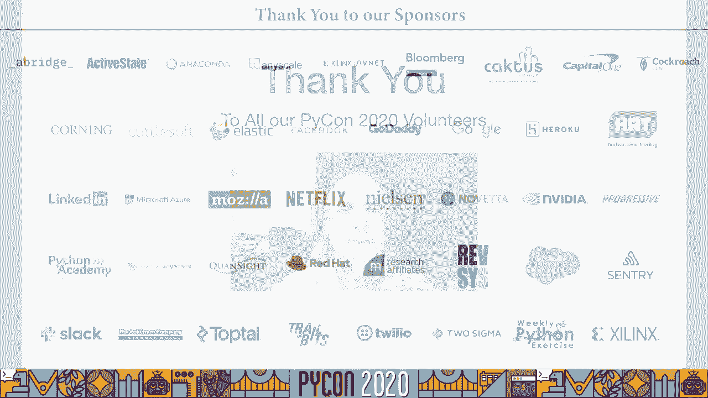

# P46：Talk Jeff Bass - Yin Yang Ranch Building a Distributed Computer Vision Pipeline - 程序员百科书 - BV1rW4y1v7YG

Python Twenty 20 今年的做法有些不同，我们在网上做，我以前从来没有这样做过，但我觉得会很有趣的，所以我们开始吧，我介绍的是阴阳牧场，基于 python开放的分布式计算机视觉系统。CV和 ZMQ，今天我们要讲的是关于我的，我的农场和我的分布式计算机视觉管道，关于整个项目的设计，我将讨论设计中的节点部分，树莓派收集和选择图像的地方，谈 zmq和 image gmq。把图像传送到集线器上，我们将讨论他们如何接收和处理图像和事件消息，然后我们会讨论如何回答问题，即使是这种在线形式，所以我打算在郊区建一个小型永久农场，永久文化是大量实践的集合，但它基本上是试图更可持续。我们如何建造农场，如何种植东西，我想为你读一段引文，记住自然景观是一个生态系统，自食其力，没有人把一卡车的肥料带到森林里，没有人把它的废物带到垃圾场，森林照顾着所有内部产生的肥力和循环，垃圾和碎片。

换句话说，力量输入和输出平衡，留下很少的浪费，而且工作是由阳光提供动力的，这是我们努力效仿的模式，这是托比海明威在他的书中引用的一句话，最快乐的花园，所以，我一直在做什么，因为我退休了几年前。因为我一直想把我的两英亩土地，把郊区的土地变成一个小的永久农场，我们叫它阴阳牧场，这是一个不断发展的科学项目，而且是个示范园，我做旅游，我在这里做一些指导，我还在种一种植物，多元文化。我们种了很多不同的东西，无花果，梨，石榴，好吧，在西红柿里，还有黄瓜，还有很多本土植物 比如海岸活橡树和梧桐树，我也在长保险杠，帮助我使用计算机视觉来帮助管理农场，关于我的一点，当我出来的时候。我做了一些关于计算机科学的论文研究，后来成了软件公司，我写统计语言编译器的地方，当时个人电脑实际上是一个新事物，在那之后，我花了大约20年的时间在大科学领域做统计学，大数据科学与大生物。

从那以后我也参与了，我退休后做软件，建造农场，并试图建立计算机视觉管道，今天我要教你们更多，那么计算机视觉是如何帮助我管理好我的小永久农场的，很明显，它可以读取水表，并帮助我用水，它能数蜜蜂。蝴蝶和授粉者，它追踪郊狼，兔子，我的谷仓和其他地方，它可以监控更平凡的事情，比如车库是开还是关，还是车道被一辆运送东西的货车挡住了，我还跟踪日照时数和光照强度，所以我可以理解光合作用，兵力和可用情况。我监控了许多非摄像头传感器，所以我看温度，湿度，运动传感器和太阳能电池板输出，所以这里有一幅画 我认为这有助于说明我的意思，通过计算机视觉管道，树莓皮被用作节点，他们有圆周率照相机，通常每秒16帧。每天两、四个小时，每个覆盆子圆周率有一两个摄像头，他们每个人都在以每秒16帧的速度收集帧，但是因为树莓派的逻辑，他们每天或每小时发送的帧数不多，相反，他们只发送重要的帧，我们用探测器软件，我稍后会讨论。

什么足够重要，从覆盆子圆周率发送帧到图像集线器，需要 zmq消息，有很多消息服务可以使用，我们选择了 zmq，让这变得容易的 mq，一旦我在集线器里有了图像，它们被储存起来，他们会被归档。我还有一个项目正在筹备中，图书馆员根据需要收集，中心的东西，图像，事件消息，进程，这些和答案，查询，例如，我说的分布式计算机视觉管道是什么意思，计算机视觉是一系列捕捉图像的技术，调整它们的大小。也许把它们变成，以及他们检测物体和图像的技术，是汽车还是行人，我可以看路标吗？计算机视觉管道是一系列计算机视觉程序，不同的人做不同的事，在一个程序中初始化一个摄像头，拍张照片，调整图片大小。然后在另一个程序中接收图像，再利用卷积神经网络来识别，说是郊狼，分布式计算机视觉程序管道，不好意思，是在网络上的多台分布式计算机上运行的管道，这就是我在这里做的，我有覆盆子圆周率 通过网络交流。

把集线器的计算机映像在不同的建筑里，它们又与图书馆员的电脑交流，其中一些在互联网上，我用来做电脑视觉的工具，在蟒蛇工作是蟒蛇三加好，我们现在都在这么做，然后是raspy和linux。20英镑外加raspberry pi，我同时使用 linux和 mac os集线器，然后我用麻木，对于我们这些计算了很长时间的人来说，他是我最好的朋友，自从 fortran在工作与阵列，我用公开简历。它收集了两千五百种计算机视觉工具，它是我们用蟒蛇和计算机视觉做的大多数事情的支柱，我用的是 zmq和它的绑定，把图像从计算机传送到计算机，我在用圆周率照相机，我认为这是一个惊人的装置，不仅是硬件。但是软件，圆周率相机模块教会了我很多关于数码相机传感器实际上是如何工作的，我还使用了一些方便的库和函数，我在这里要提到的一点是，我是有用的，你会在我的一些套路中看到，然后我使用一系列的电子设备。

我用覆盆子圆周率作为我的主要，在物联网中，计算机和我使用 MOSFET传感器和温度传感器，各种电子产品，我把它绑在一起，主要使用树莓皮 GPIO板，所以图像计算工具集，公开简历，这是一个大的。如果你还没有用过公开简历，你应该，有，外面有很多教程，蟒蛇的捆绑很棒，是一条线输入 c v 2，安装在某些东西上有点难，就像覆盆子圆周率电脑，但也有这方面的教程，它在覆盆子圆周率计算机上运行得很好。打开的简历图片 你会看到它们传递了一些代码，打开的 cv图像很容易以网络消息的形式发送，因为它们基本上是麻木的阵列，所以让我们谈谈我的管道，从覆盆子圆周率开始，我称之为图像节点。它们通过一个叫做 image mq的工具 通过网络传输，它们到达了图像中心，我今天不打算谈论图像中心了，因为这只是30分钟的谈话，够了，让我们来讨论图像节点上发生的伪代码，这是一个永恒的事件 循环。

你拿起相机图像，将图像放入队列中，使用某种检测器软件来分析队列，判断是否发生了什么事，如果有什么事情发生在探测器上，你，发送事件消息，你发送一个图像2或3，然后等待集线器响应。你就可以处理集线器的响应和循环，图像集线器正在做一些更简单的事情，它只是在听覆盆子派发送信息，它接收信息，存储消息，存储图像，然后发送一个确认，好的，我抓住你了，我已经跳了15次了。我发现如果我走得比8高得多，事情开始变慢，但这是一个系统中的许多，许多树莓派将消息和事件图像发送到图像中心，让我们来谈谈这在蟒蛇身上是如何工作的。屏幕的上半部分是运行在 raspberry pi上的节点代码，屏幕的下半部分是集线器代码，在这种情况下，我碰巧在苹果电脑上运行，所以你输入了插座时间，典型的 python标准库函数。

我在用 imu tiles导入一个视频流功能，然后我导入图像 zmq，哪个是制作图像的软件 zm立方制作 zmq，能够通过图像，所以我在图像中实例化了一个发送者，给它一个我瞄准的地址。我设置了覆盆子的名字，只是使用套接字功能，所以现在我有一些文字来区分这个覆盆子圆周率和另一个，然后我就循环抓取一个图像，发送它获取图像，把它永远送到集线器那边，我进口简历二。它是开放的 cv i导入图像 mq 因为，这就是我们接收图像的方式，再实例化，图像 mq图像集线器，同样的永远循环又发生了，我们从图像集线器中获取名称和图像，然后我们用 cv 2在屏幕上显示图像。再等几毫秒 然后发送确认信息，现在，屏幕的上半部分显示了连续运行的程序，八个覆盆子圆周率 这个例子，底部的程序在 mac上运行，从这8个人那里，然后它会显示屏幕上显示的内容，就这样。

八个树莓派每个都在运行，你在屏幕上半部分看到的程序，这是从我的 mac上截图得到的 所有这些流，我得到了八个覆盆子派，我想这些是320乘240连续发送图像，我每秒能拍到十到十二帧。如果你把它装得高于8个覆盆子 圆周率，它可能会比这更低，不过，我们一会儿再谈，有很多方法可以加快这个速度，因此，让我们使用另一个分布式计算机视觉管道示例，这是一个我曾经教很多人如何开始，在这个领域。它在读取我的水表，那么树莓派擅长什么呢，它打开灯点亮计价器，地下的米，在电表盒里，它不断地抓取帧，每秒16帧，只是看着计价器，它是用来播种的，将帧转换为灰度，它做阈值处理，所以它能分辨出针的位置。然后它检测针头或较小的针头，泄漏纺纱机正在运行，如果它在运动，它发送一个事件消息，流水送四五帧，mac作为集线器的作用，它接收并确认这些图像，它将事件消息添加到事件日志中，它存储和索引图像。

然后一个单独的程序，保存事件的历史，并回答关于状态的询问，所以这一切都是这样的，左边是水表的日光图片，这就是它们在世界大部分地区的样子，这是覆盆子圆周率相机的全帧捕捉，它有两个四个低功耗的发光二极管。这样通过展开，发光二极管，计价器的玻璃屏幕上的眩光更少，一旦覆盆子圆周率读取了图像，它处理，它实际上把田地的一部分，不需要，它选择了一个投资回报率，右边第二张图像中的小方块，如果感兴趣的区域有运动。它实际上触发了流动状态 并发送了一些图像，一旦流动状态被发送，它发送了一些图像，但没有继续发送，当电表旋转的时候，那真的没有好处，它将等待，那么，直到电表停止旋转，并在那时进行读数。这样做的好处是我们发送的图像相对较少，以完成工作，然后在苹果电脑上，右边远处的图像，实际上 mac会把数字，面具就是把他们蒙出来，然后它使用图像分类来挑出数字并实际读取值。

让我们回到分布式计算机视觉管道，回顾一下我们目前所看到的，有一个图像中心，通常在笔记本电脑上运行，mac或 linux，它通过图像接收，8到12个覆盆子圆周率的 mq图像和事件消息，嗯。这取决于这些信号中的大部分，同时，因为集线器和网络都有可能超载，如果他们都在持续传输，但这不是那种分布式计算机 fidgeon管道，我正在建造，我正在建一个农场 周围随机发生的事件。平均来说网络不会过载，事实上，从来都不是，它们使用图像中心收集的数据，答疑解惑，或者通过网络仪表板，短信系统或电子邮件代理，所以专业化很重要，你想让正确的电脑把正确的工作做得很好。覆盆子派在某些事情上很棒，很便宜的，他们很可靠，它们没有扇子，这很重要 而且它们耐尘，它们真的很小，π0甚至更小，它们的能量很低，停电后 他们很快就恢复了，圆周率相机很棒，它有可调的设置。

很多不同的方式，坦率地说，它允许很多实验，但不要混淆，在覆盆子圆周率里有张桌子的小 sd卡，不是，反复编写大型二进制图像文件不可靠，它写得很慢，我可以更快地写到网络上，然后我可以写在卡片上，嗯。你也知道，覆盆子圆周率的记忆相当有限，加工能力相当有限，它有一个较慢的 usb总线，慢速以太网，usb相机在覆盆子圆周率上并不能很好地工作，圆周率凸轮工作最好，但它所做的事情，这对他们来说很好。它真的很擅长在谷仓外面，运行摄像头，确保捕捉到图像 并迅速将其发送到网络上，苹果电脑很棒，Linux笔记本电脑很适合做其他事情，对吧，他们很擅长无线上网和以太网，快，快，固态磁盘驱动器。他们可以做一些事情，比如，识别计价器中翻转的数字，比覆盆子圆周率更有效，但你猜一台 mac电脑的耗电量，八十个或者十二个树莓派，而且很贵，你不能把一个放在谷仓后面看郊狼，把一些工作放在覆盆子圆周率上。

把其他工作放在电脑上，我们实际上是在建立一个分布式计算机视觉管道，在管道中的每台计算机做一件它最适合的事情，我们再过一遍水表，这一次展示了一点，好吧，左边是什么样子。你可以看到地面上一个典型的水表容器的盖子，你可以看到覆盆子圆周率实际上生活在一个泥瓦匠罐子里，上下颠倒了，在泥瓦匠罐子的顶部开了一个槽，在翻倒的水表顶部旁边可以看到 led灯，当一切都组装好的时 候。好像水表上有个石匠，上下颠倒，你会注意到有一个12伏的插头，我在我的很多财产周围使用12伏特，因为12伏特比5伏特传播更好，然后那个简单的汽车适配器，就像你把插头插在汽车打火机上一样。为你的手机提供五伏的电压，这就是我用来驱动覆盆子圆周率的，然后来自覆盆子圆周率的图像通过无线网络传输，在这种情况下，圆周率图像上有一个无线上网，mq到 linux膝上型电脑映像集线器，接收图像和短信。

在房子里面，是两个，可能是两个无线集线器，我可以查询运行在上面的图书馆员程序，并很好地询问它，水呢？我会收到一条短信，说水在流动，最后一次休息是在九点，两个一，否则水就停了，它最后一次流动是在下午两点。所以这是一个完整的结束到结束，分布式计算机，我的水表的视觉管道，所以让我们更详细地看看节点代码，这是一个图像代码节点，图像节点代码段，这实际上是图像节点代码的主程序，在所有的树莓圆周率上运行。我拿了一些设置，我实例化了一个图像节点，它有很多方法和很多变量，然后我可以做一个永远的事件循环，就像我们之前说的，我获取传感器数据，温度传感器数据，然后通过检测运动来处理传感器数据，也许是在寻找光明。可能是抓到了温度读数，我把所有的东西都放在一个队列里，消息队列，如果任务队列里有东西，把它发送出去，您将注意到一些带有try accept块的代码，以等待集线器响应。

如果由于某种原因 中心没有立即做出反应，它通常在毫秒内做出反 应，但如果中心没有立即回应，我其实是想修复通讯 联系，再重启流程，这是我在 Github上的图像节点存储库中的实际代码，这种方法的问题是。你需要设置所有的电脑视觉设置，他们有很多人，我必须设置视图名称，我要设置探测器，我得去点灯，我得打开传感器，我使用 YAML文件，我发现它们很有帮助，嗯你可以，它们基本上成了蟒蛇词典，一旦你读了它们。所以你可以看到，当他们借出 YAML文件的时候，这真的是一个有效的方法，把很多设置，图像节点的实例化，对于每一张捕捉到的图像，图像节点做大量处理，它应用可能改变图像大小的转换，灰度它，门槛吧。然后它在水表的情况下应用探测器，它检测 YAML文件中指定的每个检测器的运动，您可以指定多个，它发送符合探测器标准的图像，每当检测器状态改变水表示例时，它就发送事件消息，水表的例子是最容易理解的一个。

图像节点的两个最重要的工作是使用检测器，确定哪些图像重要并只发送重要的图像的方法，例如，当水表开始或停止时，我需要一些媒体的画面，在它开始或停止的时 候，所以我可以多说几句关于 zmq的事。ZMQ是一种奇妙的传输机制，它不需要代理或服务器，完全是点对点的，对于多个Raspberry Pi来说，它是一个很好的并发管理器，使用请求回复模式，作为通讯协议，它是一种非常灵活的。但是你的通讯协议必须设计得很好，我花了点时间才弄明白，我确实考虑过零质量的替代方案，兔子，MQ，R s mq，P mq，TD，其中一些，零质量真的对我最有效，尽管其他的图书馆维护得很好，但用户很多。它们可能对你最有效，我拍了一张照片，MQ，我的蟒蛇，我是 zmq的版本，我已经建立了一套蟒蛇类，允许你将图像从一台电脑移动到另一台电脑，我使用的是请求回复模式，但你可以用其他模式，它可以发送图像。

它可以发送压缩到 jpegs的图像，但它的优点是图像不需要编码，它组成了一个开放的数组，没有编码就发送了 CV图像，除非您选择将其编码为 jpegs，所以我为我的阴阳项目开发了它。它已经被我和其他人测试了三年，生产释放一点，零一在外面，它目前是 pip可安装的，所以安装它，试试看，如果我看一下前面给出的计算机视觉管道示例，以下是显示图像的地方，zmq api，我们进口的。我们实例化一个发送者，使用地址，你想把它送到哪里，然后在集线器计算机上导入它，我们实例化一个集线器，一般来说，你不需要，一旦收到图像，你发送回复，真的就这么简单，那么图像集线器代码是什么样子的。当一切都建立得很好，这是来自图像集线器的实际主程序，Github软件，我先付的，你拿起设置，然后实例化一个集线器，然后你又得到了同样的永恒事件循环，这次简单一点，我们要等一个枢纽，回应，等待输入。

并给出中枢响应，如果我们很久没有树莓派的消息了，可能是网络出了问题，一旦我们设置了病人的参数，如果我们超过它，在我们得到图像之前，我们会处理暂停，它通常会给我发短信 说有东西坏了，然后我们发送一个回复。那个循环，接收来自，对网络上所有的树莓派做出反应，那么它是做什么的呢？它感知和存储图像，它立即发送，好的商店，图像存储消息，就这样，这就是所有要做的，图像集线器软件做得不多的事实是它成功的关键。它处理图像，它给了我一个信息，如果它坏了，它运行，我已经在这里安装了两年多的图像中心，每年一两次重启，对于图像集线器接收到的每个元组，它发送它保存图像和事件消息。然后它接收到的图像可以是一个打开的简历图像，往往很大，也可以是由图像编码的 jpeg，比你想象的要小很多，你可以看到一些图片，来自图像集线器日志文件的文本，在右边，让我们再看一个例子，这是我的谷仓。

我叫它 我的狼 红外玻璃块，所以我不能在这里用泥瓦匠罐子，所以我实际上做了一个小雪松块，树莓派相机上的雪松 摇晃屋顶，你看右边，事情是这样的，下面是一个完全分布式计算机视觉管道的示例。图像节点在谷仓后面的覆盆子圆周率上运行，图像集线器是室内的一台 linux笔记本电脑，然后物体检测实际上是在一台苹果机上完成的，我在这个案子中发现，我们看看左边的狼，带着六十三的信心，右边那个。百分之四点七的信心，然后山猫更少，只有14%，有点模糊，这些图像是用图像节点拍摄的，树莓派使用了黑皮红外相机，以及12伏8瓦的红外线照明灯，覆盆子圆周率 每天捕捉一百万张图像，但在这三天里。每天只有三五百帧，这是一个分布式管道做它需要做的事情的例子，它只发送重要的图像，而不是在网络上充斥着，所以在覆盆子圆周率上做的一些检测，在 linux和 mac电脑上做进一步的检测。

最后我需要和最终用户沟通，所以我有一个小小的短信例行公事，你知道它发出的信息就像水停掉了，它最后一次流动是在每米7点15分，三点十五分在谷仓后面发现了一只动物，郊狼，也许四个，7%的信心。也有其他的交流方式，我有一个 cli文本界面，文本界面，我正在建立一个网络仪表板，所以到目前为止我学到了一些教训，在优化之前 先进行实验和观察，每个人都在谈论这个，你必须这么做，您可以调优图像节点。计算机视觉参数，你可以花很多时间调整它们，因为如果你调得好，结果好多了，所以我花了很多时间调音，我也花了很多时间优化网络负载，您希望发送最小的图像大小来完成工作。记住大多数物体探测器需要300像素或更少的像素，在图像大小方面，你还可以把图片压缩成jpeg，这让我省了不少钱，我在这里经常这么做，它看起来像高斯模糊，这里有一些关于硬件示例的快速介绍。

有一些红外灯和其他泛光灯，有一个 MOSFET控制着一个泛光灯，了解你的苔藓，那是最好的朋友，你得把你的 GPIO板放在你的覆盆子圆周率上，以免被太多的电流烧坏，我也用灯具。有一个覆盆子圆周率和一个温度传感器，房子后面的灯具，假安全摄像头，五美元一个小的假安全摄像头，拿着覆盆子圆周率和圆周率相机，我也学到了一些技巧，你不会后悔，有各种各样的防水围栏。但我最喜欢的是泥瓦匠罐子之类的东西，就像谷仓上的旧瓦片，红外线照明，有点棘手，我通常需要用两个泛光灯 而不是一个，但它成功了，动力，我使用12伏特，而不是5伏特的跑步功率和距离。然后我用一个便宜的汽车打火机，一种插头，我接下来要做什么，好吧，告诉我花园左边需要水，你可以看到一个非常枯萎的混凝土植物和一个没有枯萎的混凝土植物，浇水前后取的是同一株，哇，如果能帮助管理我的花园。

那将是多么好的礼物啊，所有这些项目都在开源和 Github上，地址都给你准备好了，如果你对这次谈话有疑问，我要提出一些不同的建议，我建议你问一个问题，在阴阳牧场的 github仓库上发表了一篇文章。所有的细节都在那里，它们也在甲板上，一些其他电子产品链接，CMQ开放式简历，计算机视觉教程和永久文化显示在这个屏幕上，最后我想感谢你，尤其是我想感谢我们的蟒蛇，20名志愿者花了很多时间来做这件事。艰难的道路，把我们组织在家里。
