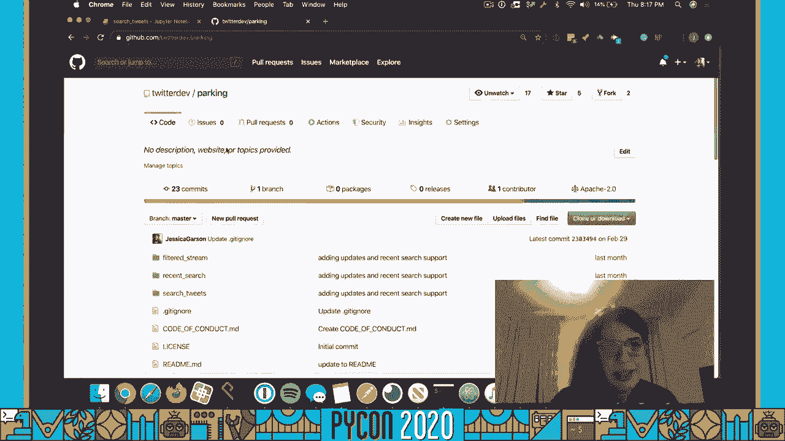
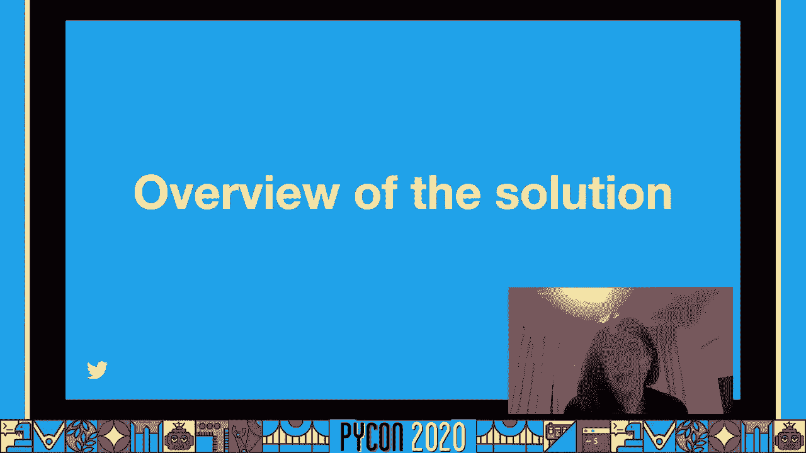
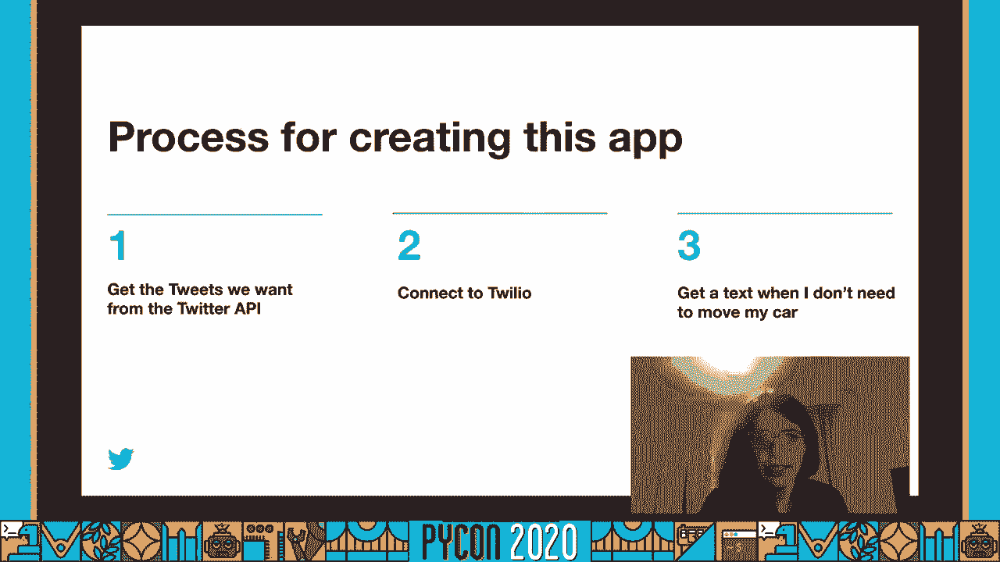
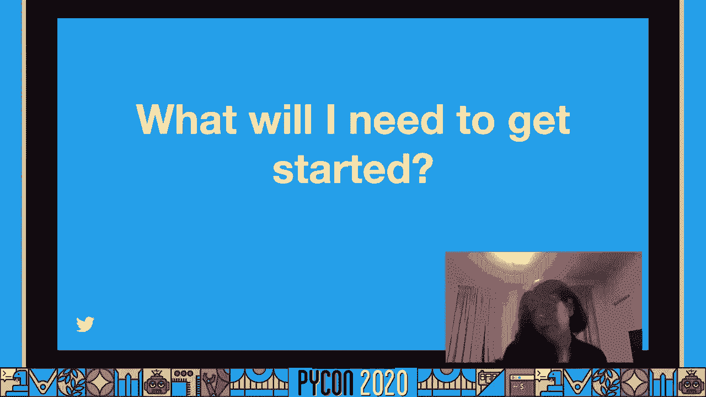
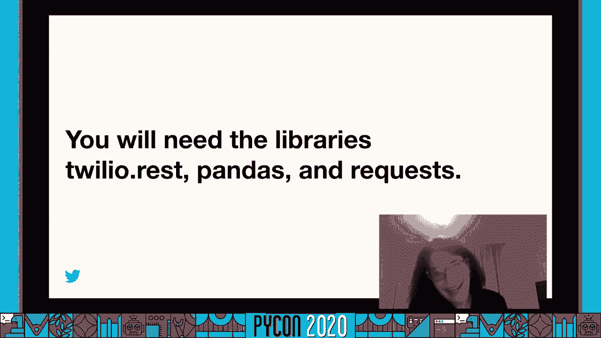
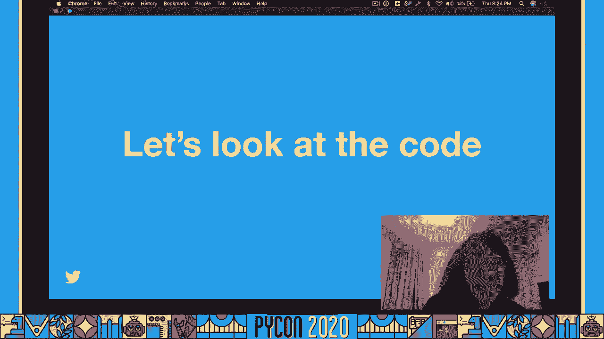
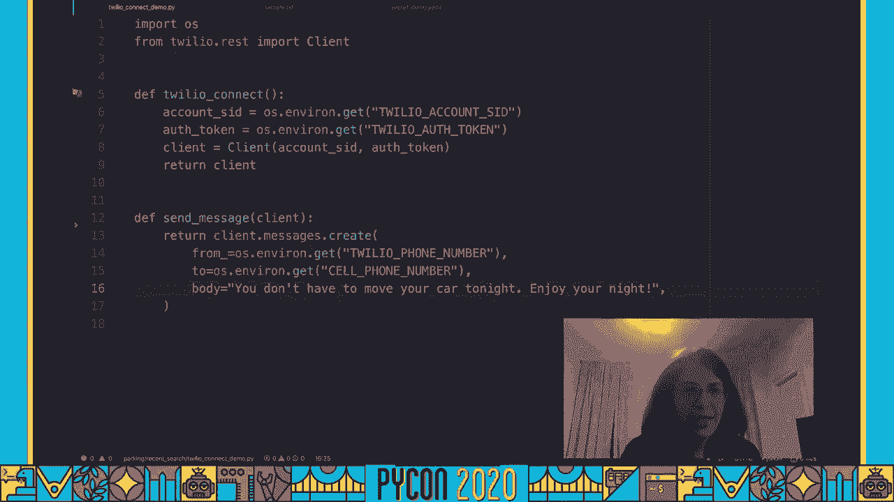
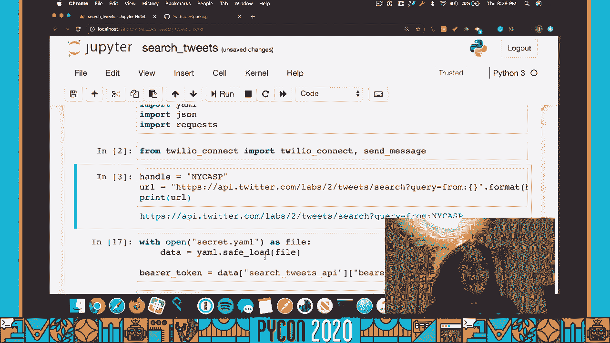
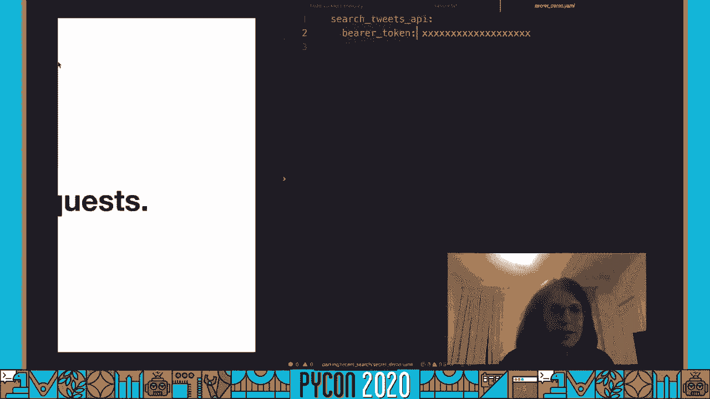

# P47：Talk Jessica Garson - How I Solved my NYC Parking Problem with Python - 程序员百科书 - BV1rW4y1v7YG

我叫杰斯，我是推特的开发者倡导者，我在这里和你谈谈我是如何用蟒蛇解决了我生活中的一个停车问题的，如果这激发了你的创作灵感 请告诉我，你可以在jessica carson上给我发微博。也可以随时给我发信息，它总是让我开心，当人们根据我的工作建造时，今天的代码也可以在 github dot com上找到，斜杠推特，发展停车场。

嗯，如果你看一下 Github仓库的位置，您可以注意到有一个名为"最近搜索"的文件夹，在那里你会发现我们今天使用的代码，此外，在你构建的过程中，还有一些资源可能会有所帮助，上面有一篇博文的链接。

我将在演讲结束时发表的演讲版本，所以你可能想知道在我的生活中发生了什么，激发了我用蟒蛇建立一个解决方案，嗯，所以我住在布鲁克林，纽约和嗯，你可能会注意到这辆非常酷的宇宙车，上面有个橙色的信封。这是一张停车罚单，在纽约市停车罚单可能相当贵，他们可以给你一百多美元，所以你真的想避免收到停车罚单，我敢肯定，现在正在观看的一些人点头表示同意，我在我的生活中遇到了一个问题，我在纽约有车。

我的车开得太多了，我真的很擅长创造一个晚上的例行公事，我查看了交通状况数据，比如一天中什么时候交通最轻的地方，那是晚上8点，每天晚上8点都有这样的例行公事，我会去那里走一走 把我的车开走 然后走回家。我通常每晚都要花半个小时，但你知道这是我每晚例行公事的一部分，我做得很好，嗯，但你可能会说嘿，所以你一开始为什么要这么做，什么，这些是街道两边的停车限制吗，不管怎样，在街道的另一边停车限制，或 asp。

他们在纽约被称为，是一项强制清理停放的汽车 以适应街道清洁时间表的规定，所以基本上，街道清洁轨道会穿过我的社区 在街道的右边进行，星期一和星期四，在八点到十一点之间，在街道的左边 在8米和11米之间。星期二和星期五，对我来说意义重大，一周中的大多数夜晚，我不得不在八点前把车开走，所以是的，一点都不好玩，有天晚上我开车在我家附近转悠，想在晚上8点停车，你知道吗，开车到处跑 却找不到停车位，我就想。

这真的很不寻常，就像我去了我所有的老地方，什么也找不到，到处都是车，两个小时后 我终于找到了一个地方，但很好，我就像在听一本书的磁带，太棒了，但我回到家，我和我的室友谈了谈，他们说，你在哪里 我就像。哦，我在移动我的车，他们就像真的，你没去看演出或派对，或者你没有遇到，你知道，我就想，没有，只是搬我的车，他们就像，你知道这个推特手柄，纽约 asp um，代表纽约圣坛街边的停车场。

它每天七点三十四发信息，m和在紧急情况下，我开始看推文，我就想，哦，我把我的车挪得太多了，我也想早点离开社交活动，有时我的日程会围绕着，从字面上移动我的车，所以我想，你知道吗。这些推文看起来都是同一根管子，我就像，我想我可以把它自动化，所以我建立了一个解决方案 使用推特数据和 twilio给自己发短信，每当我不用移动我的车，所以让我们来谈谈解决方案的概述。

我需要纽约的推文，ASP，我想看看这个词是否暂停了，明天是否出现在同一条推特上，我需要一条短信，当合适的词出现时，我需要在服务器上运行这个，所以它重复了一遍，所以我不需要手动操作，每天都会发生。所以在高层，创建这个应用程序的过程真的很简单，我只需要做三个步骤，我必须得到推文，我想从推特应用程序界面，我需要联系特利奥，当我不需要移动我的车的时候 我需要收到一条短信。

所以这似乎是一件非常简单的事情。

所以我要求你们所有人开始思考你们在日常生活中面临的问题，你可以设计一些解决方案来解决，所以如果你想建立一个解决方案，如果你也住在纽约，有一辆车，你想建立这个解决方案，或者类似的东西。

你可能会想，什么会，我要开始了，您将需要创建一个twitter应用程序，允许您连接到api，你可以在开发者 twitter上申请访问，DOT，COM，斜杠申请访问，你还需要再次报名参加小羊羔实验室。不是 ceo labs，我们有一个内部链接缩短器，所以你可能会看到很多这样的东西，目前我们正在与 twitter开发者实验室一起重建 twitter api的未来，这允许您尽早访问新的端点。

功能和新版本之类的东西，所以我们用实验室来测试新的想法和东西，我们有很多不同的预览，我们邀请开发人员社区分享他们的反馈意见，以帮助制定我们前进的路线图，嗯，所以我们有一个叫做最近搜索的端点的预览。你还需要注册预览 才能获得过去七天的推文，你还需要一个 twilio账户，你可以查看他们关于开始的文档，你还需要点，安装所有库，特利奥休息 熊猫和请求。

twilio rest允许我们连接到 twilio api 熊猫将允许我们塑造数据 并进入一个数据框架，所以当我们开始处理数据时，我们可以更全面地了解我们在看什么，几分钟后你就会看到要求允许我们。

对 twitter api的请求，所以现在我们要开始看看代码。

我们要看的第一个代码示例是一个名为 twilio connect demo的代码示例，您还可以在 Github存储库中找到它的一个版本，在这里，我们将首先导入一个操作系统，它允许我们创建环境变量。所以我们不需要在这个代码中直接传递任何秘密，这是相当令人兴奋的，这是一种确保我们的代码比以前更安全的方法，我们还将导入一个名为 client的助手函数，从我们之前安装的 twilio rest库。

从这里我们来看一个叫做 twilio connect的函数，我喜欢把这个功能想象成一个秘密的握手，所以你会喜欢一个很酷的派对，你得和保镖秘密握手，这是同一类的事情，但与其去参加派对。你将被认证为一个应用程序接口，在这种情况下，它将是两个，所以我们可以通过 twilio发送短信，所以从这里我们要创造，或者我们想用我们的账号，我们要创建一个环境变量。

所以在我们的终端里 我们会输入一些看起来像这样的东西，我们要传递的每一个秘密，因为这里是帐户 ID帐户是 auth标记，我们的电话号码和手机号码，所以这有助于让事情更安全一点，所以，为了得到帐户我。我们将通过使用操作系统库来获得环境变量，这也包含在标准库中，所以它是点环境点得到，我们会拿到账号的，我们也要对 auth标记做同样的事情，然后我们会通过客户助手传递这个信息，只是为了验证。

这就是客户助手功能，我们还要返回客户端变量，所以从这里我们可以开始，真正进入我认为是代码中最有趣的部分之一，我们在这里决定短信会说什么，所以这是一个函数，这是死亡，嗯，然后我们将这个函数定义为发送消息。我们将传递刚才定义的客户端对象，从这里我们要做的客户端消息创建，它将来自我们的双胞胎，电话号码，这是你从特利奥那里得到的号码，然后我们会把它发送到我们的手机上，为了今天的目的，你今晚不用移动你的车。

好好享受你的夜晚，超级刺激，这就是 twilio connect helper脚本，这里有两个函数。

我想在接下来的比赛中，在朱庇特的笔记本里，这让我们可以更有力地与数据交互，我们可以看到输入和输出，都在一个屏幕上，所以我总是喜欢在木星笔记本里处理数据类型的东西，这是一次非常好的经历。所以我们首先要做的是，我们想把熊猫作为 pd进口，这将使我们能够在以后的时间里塑造数据，嗯，我们还将进口 YAML和 JSON，我们不需要安装，它们实际上包含在标准库中。

YAML将允许我们传递一个配置文件，这是一个 YAML文件，杰森将允许我们处理来自应用程序接口的物体，嗯，请求是我们的东西，你必须安装，但这允许你向应用程序接口提出请求，所以让我们保持冷静。然后从这里嗯，接下来我们要做的是在 twilio连接脚本中导入，我们要导入 twilio连接并发送消息，然后从这里我们要确保通过 nyc asp进入网址，我们会把它打印出来，只是为了确保它看起来很棒。

所以问题是它等于从句柄 n y或冒号，然后是把手，所以你可以在这里看到完整的网址，这是相当令人兴奋的，接下来我们要做的是另一个认证步骤，但这次不是去特维尔阿皮，我们要确认。推特应用程序接口 我喜欢用一个配置文件。

您需要确保不会将其保存到 Github存储库中，确保您将此秘密文件包含在您的 get忽略文件中，所以你有点像杰森，但没有引语是一个很好的思考方式，嗯，所以从这里我们有一个嗯。我们有一个叫做搜索推文应用的对象，然后在里面我们有另一个物体叫做贝托，我们会从那里经过，标记是 oauth 2的关键特征之一，它们真的很棒，因为你不必在我们的文档中传递更多。

我们实际上有一个curl命令，你可以运行，但你也可以创建一些蟒蛇来运行它，但是是的，和贝托肯斯一起工作真的很棒 因为你不必再传递那么多了 所以从这里开始。

嗯，我们是，我们要加载我们的 YAML文件，将其保存到名为 data的对象中，从这里我们要提取贝托币，所以我们有betoken，我们要设置它等于数据，然后我们将分割出搜索推文应用程序接口对象。然后我们会从那里得到熊币，然后我们需要通过，以实际提出请求和进行授权，所以在一个叫做石南头的变量内部，我们想通过认证，然后我们会说我们将要使用的身份验证方法是一种，我们要在里面格式化它。

然后我们会通过它，我们要去，因为我们会收到推文，我们要提出要求，因为我们在搜索推文，我们要通过网址，然后我们还希望头球和头球相等，我们刚才看到的变量，接下来我们要确保编码是正确的，如果一切都很顺利。然后我们要检查每一条线，但是我们要把它放到一个变量里面，把json对象拿出来，所以从这里我们可以打印出我们的 json数据，所以整个物体，其实，嗯，里面有两个不同的物体，有数据显示 最近十条推文。

还有一个meta，它有下一个令牌，让你知道你会得到多少结果，诸如此类的东西，但为了今天的目的，我们只需要最后十条推文就可以，嗯，确保一切运行正常并调试，如果需要，所以从这里我们可以。因为我们不需要元对象，我们实际上只能得到数据，这里是完整的数据对象，然后从这里我想把它传递到一个数据帧中，只是因为它让它更容易使用 更容易观察，所以从这里开始让我们运行这个。

然后我们就可以得到一个数据帧，上面有推文和身份证，上面有推文和身份证，很漂亮，看上去很酷，所以你可以看看，你可以看到文本看起来真的很相似，这就是真正允许它工作的原因，好在他们只用了某些奖项。这真的很容易解析出来，并创建一个对我有效的解决方案，有一个客户机函数 我们创建了这个客户机变量，我们可以通过调用 twilio连接来创建，又是这样，什么能让我们连接到特利奥，从这里有一个逻辑陈述。

基本上让我们看到，如果暂停的话，明天在推特上的文本中，所以这很令人兴奋，如果明天暂停的单词出现在这个嵌套的陈述中，然后嗯是发送消息，我喜欢有帮手，嗯打印报表，只是因为它能帮我调试。您还可以添加更健壮的日志记录，如果你在做一些更复杂的事情，但为了我的目的，打印报表很有用，如果没有的话，我说今天不行，如果不是朋友，但是看起来，纽约市，交替穿鞋，停车限制未生效。

明天我们应该收到一条短信，哦哇，我收到一条超刺激的短信，你可能会想，那是什么样子，如果符合合适的条件，我收到一条短信 说你今晚不用移动你的车，好好享受你的夜晚，杰西，在我的服务器上就是这个样子。它过去的运行时间是上午11点30分和下午5点，但现在我只在下午5点开，所以让我们谈谈部署，我现在把这个部署到一个数字海洋服务器上，但我想做一些更无服务器的事情，比如使用 lambda函数。

我现在只是利用我们的犯罪工作设定它每天下午五点给我发短信，所以这次谈话的结论，你可能会想，你为什么不做这个，所以你做了，当你不得不移动你的车时，你会收到短信，而不是当你不移动你的车时。这是一个人们经常问的问题，老实说我很擅长移动我的车，几乎太擅长了，我每晚都这么做，挺酷的 但是，我想解决我在现实生活中遇到的一个问题，我不需要被提醒移动我的车，我需要移动我的车，我只是做得太多了。

所以我向每一个看这个视频的人提出一个问题，好好想想如何设计一个解决方案来解决这个问题，如果你这么做了，请让我知道，嗯，你可以嗯，对我发推特，杰西卡·加森或给我发信息，另外。如果你想看这篇演讲的博客文章版本，你可以去停车场看看，你也可以让我们知道在推特上，黛比或在推特上的社区论坛上，如果你一路上遇到麻烦，嗯，我队里的人，包括我自己都会在 twitter的社区论坛上帮助你。

你也可以在 Twitter上对我们发微博，嗯，如果你在用推特应用程序界面，你有反馈给我们，或者有你想看的功能，嗯，你可以在 twitter上给我们反馈，uservoice com。如果你想从应用程序界面上看到什么，也许你想要一个新的终点，也许有一个终点，你正在与之合作，你希望做一些不做的事情得到嗯，也请告诉我们，如果你在用 twitter api构建，我很想了解你，又来了。

请随时给我发 dm或 tweet 给我，再次感谢你抽出时间观看这段视频。

